                 

## 领导力与责任担当：勇于面对挑战

### 关键词：领导力、责任担当、挑战、勇气、管理、成功策略

#### 摘要：

在快速变化的现代商业环境中，领导力和责任担当成为衡量领导者能力的关键因素。本文旨在深入探讨领导力与责任担当的关系，分析领导者如何勇于面对挑战，并提供实用的成功策略。文章分为四个部分，首先介绍领导力的基础概念和重要性，接着讨论责任担当的核心要素和重要性，然后提供面对挑战的具体策略，最后通过实际案例总结领导力和责任担当的实践要点。

---

### 引言

在企业管理中，领导力与责任担当是两大核心要素。领导力不仅是推动团队实现目标的关键能力，更是激发员工潜能、塑造组织文化的重要手段。而责任担当则是领导者面对挑战时的必备品质，它要求领导者不仅要认识到自己的责任，更要勇于承担并解决难题。在这篇文章中，我们将详细探讨领导力与责任担当的重要性，以及领导者如何在实际工作中勇于面对挑战，从而实现个人和团队的成长。

### 第一部分：领导力的基础

#### 第1章：领导力的定义与重要性

领导力是影响个人和组织行为的能力，它不仅关乎权力和权威，更强调影响力、激励和协作。领导力的重要性在于，它能够引导团队朝着共同目标前进，激发员工的潜力，并在面对困难和挑战时保持团队的稳定和凝聚力。

**核心概念与联系**

为了更好地理解领导力，我们可以使用Mermaid流程图来展示其核心概念和关系：

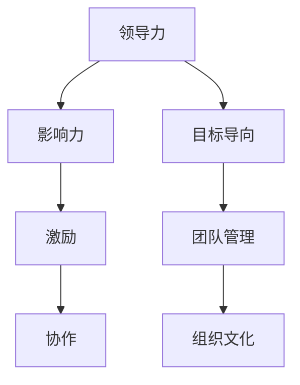

**核心算法原理讲解**

领导力的核心算法可以理解为一系列的决策和行为，这些决策和行为的目标是优化团队效率和实现组织目标。以下是一个简化的伪代码示例：

```python
function 领导力决策(团队目标，员工需求，当前状态)：
    if 团队目标满足员工需求：
        return 激励员工保持当前状态
    else：
        return 调整目标或提供额外支持
```

**数学模型和公式**

领导力的有效性可以通过员工满意度、团队绩效和组织文化等指标来评估。以下是一个简单的数学模型：

$$
有效性 = f(\text{员工满意度}, \text{团队绩效}, \text{组织文化})
$$

**详细讲解与举例说明**

例如，在一个软件开发团队中，领导力可以通过以下几个方面体现：

1. **目标导向**：明确项目目标，确保团队成员对目标有清晰的理解。
2. **激励**：通过奖励机制和认可来激励团队成员。
3. **协作**：促进团队内部沟通和合作，解决协作中的冲突。

通过这种方式，领导力不仅能够提高团队的绩效，还能增强组织的整体竞争力。

#### 第2章：领导风格与领导者自我认知

领导风格是领导者进行管理的方式，它直接影响团队的士气和效率。而领导者自我认知则是领导者对自己角色和能力的认识，这是领导力的重要组成部分。

**核心概念与联系**

领导风格和领导者自我认知之间的关系可以用Mermaid流程图表示：

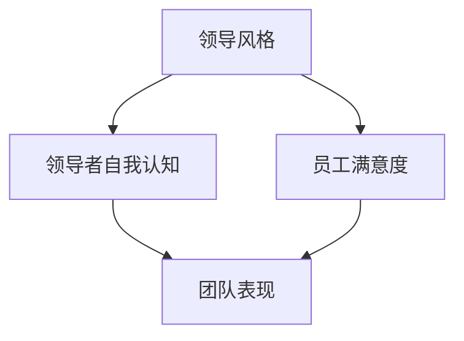

**核心算法原理讲解**

领导者的自我认知可以视为一个自我评估的过程，其算法可以简化为以下伪代码：

```python
function 自我认知评估()：
    获取当前能力水平
    获取团队反馈
    if 当前能力水平高于团队反馈：
        return 自信
    else：
        return 自我提升
```

**数学模型和公式**

领导者自我认知的水平可以通过以下公式进行量化：

$$
自我认知水平 = \frac{当前能力水平 + 团队反馈}{2}
$$

**详细讲解与举例说明**

例如，在一个新项目中，领导者可能会通过以下步骤进行自我认知评估：

1. **自我反思**：回顾自己在项目中的决策和行为。
2. **团队反馈**：收集团队成员对领导者的评价和建议。
3. **改进措施**：根据反馈调整自己的领导风格和行为。

通过这种方式，领导者可以不断提高自己的认知水平，从而更好地发挥领导力。

#### 第3章：领导力的核心要素

领导力的核心要素包括沟通能力、决策能力和激励能力。这些能力是领导者成功的关键，也是团队协作和目标实现的保障。

**核心概念与联系**

领导力的核心要素可以用以下Mermaid流程图表示：

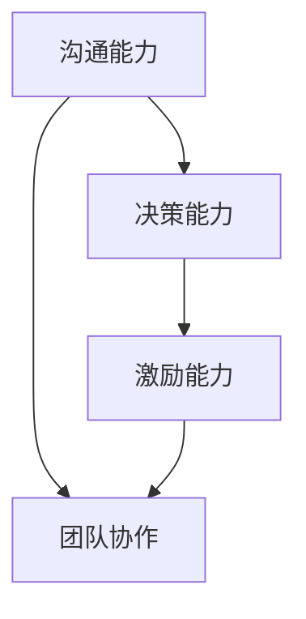

**核心算法原理讲解**

沟通能力的核心算法可以简化为信息传递和反馈机制，以下是一个伪代码示例：

```python
function 沟通能力(消息，反馈)：
    发送消息
    获取反馈
    if 反馈有效：
        return 成功沟通
    else：
        return 重新沟通
```

**数学模型和公式**

沟通能力的有效性可以通过信息传递的成功率和反馈的及时性来评估。以下是一个简单的数学模型：

$$
沟通能力 = \frac{成功沟通次数}{总沟通次数} \times 反馈及时率
$$

**详细讲解与举例说明**

例如，在一个团队会议中，领导者可以通过以下步骤提高沟通能力：

1. **明确会议目标**：确保所有与会者对会议目标有清晰的认识。
2. **主动沟通**：鼓励团队成员表达观点，确保信息充分传递。
3. **及时反馈**：在会议结束后，收集成员的反馈，以便改进沟通方式。

通过这种方式，领导者可以增强团队的沟通效果，从而提高整体协作效率。

#### 第二部分：责任担当的重要性

#### 第4章：责任的概念与类型

责任是领导者不可或缺的素质，它关乎个人和团队的成败。责任的概念可以分为个人责任和组织责任，类型则包括直接责任和间接责任。

**核心概念与联系**

责任的概念和类型可以用以下Mermaid流程图表示：

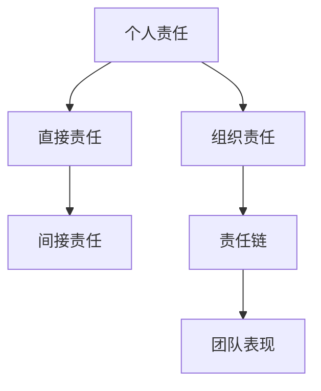

**核心算法原理讲解**

责任的承担可以通过以下伪代码来描述：

```python
function 承担责任(责任类型)：
    if 责任类型为个人责任：
        return 个人行动
    else：
        return 协调团队行动
```

**数学模型和公式**

责任的履行程度可以通过以下公式进行量化：

$$
责任履行程度 = \frac{完成任务次数}{总任务次数}
$$

**详细讲解与举例说明**

例如，在一个项目中，领导者可以通过以下步骤承担个人责任：

1. **明确任务**：了解项目的所有任务，并明确个人的职责。
2. **主动完成任务**：确保自己负责的任务按时高质量完成。
3. **反馈与改进**：在任务完成后，进行反馈和总结，以便改进未来工作。

通过这种方式，领导者可以确保团队责任的落实，从而提高整体项目成功率。

#### 第5章：责任担当的重要性

责任担当是领导者不可或缺的品质，它关乎团队的凝聚力和执行力。责任担当的重要性在于，它能够确保领导者在面对挑战时，能够坚定不移地承担起应有的责任。

**核心概念与联系**

责任担当的重要性可以用以下Mermaid流程图表示：

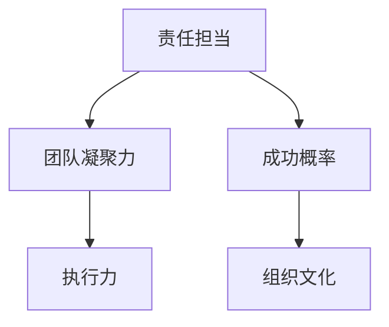

**核心算法原理讲解**

责任担当的核心算法可以简化为以下伪代码：

```python
function 责任担当(挑战，资源)：
    if 挑战难度低且资源充足：
        return 单独解决问题
    else：
        return 协调团队资源
```

**数学模型和公式**

责任担当的有效性可以通过以下公式进行评估：

$$
责任担当有效性 = \frac{成功解决问题次数}{总问题次数}
$$

**详细讲解与举例说明**

例如，在一个危机项目中，领导者可以通过以下步骤进行责任担当：

1. **快速响应**：在问题发生时，立即采取行动。
2. **资源协调**：调动团队资源，确保问题得到及时解决。
3. **持续监控**：在问题解决后，进行总结和改进，以防止类似问题再次发生。

通过这种方式，领导者可以确保团队在面对挑战时，能够有效地承担责任，从而提高项目的成功率。

#### 第6章：如何承担个人责任

承担个人责任是领导者的基本职责，它要求领导者不仅要认识到自己的责任，更要主动行动，确保任务的完成。

**核心概念与联系**

如何承担个人责任可以用以下Mermaid流程图表示：

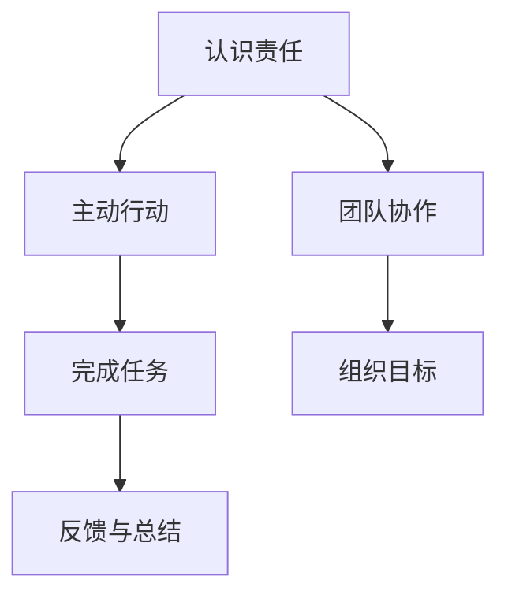

**核心算法原理讲解**

承担个人责任的算法可以简化为以下伪代码：

```python
function 承担个人责任(任务，团队，目标)：
    了解任务要求
    确保任务与团队目标一致
    完成任务
    反馈任务进展
    总结经验
```

**数学模型和公式**

个人责任履行程度可以通过以下公式进行量化：

$$
个人责任履行程度 = \frac{完成任务次数}{总任务次数}
$$

**详细讲解与举例说明**

例如，在一个软件开发项目中，领导者可以通过以下步骤承担个人责任：

1. **任务分配**：根据项目需求和团队情况，合理分配任务。
2. **任务监督**：确保每个团队成员按时完成任务。
3. **问题解决**：在任务执行过程中，及时解决遇到的问题。
4. **反馈与总结**：在任务完成后，进行总结和反馈，以便改进未来工作。

通过这种方式，领导者可以确保个人责任的落实，从而提高项目的成功率。

### 第三部分：面对挑战的策略

#### 第7章：挑战的类型与特征

在企业的成长过程中，领导者不可避免地会遇到各种挑战。这些挑战可以分为市场变化、团队冲突、技术难题等类型，每种挑战都有其独特的特征和应对策略。

**核心概念与联系**

挑战的类型和特征可以用以下Mermaid流程图表示：

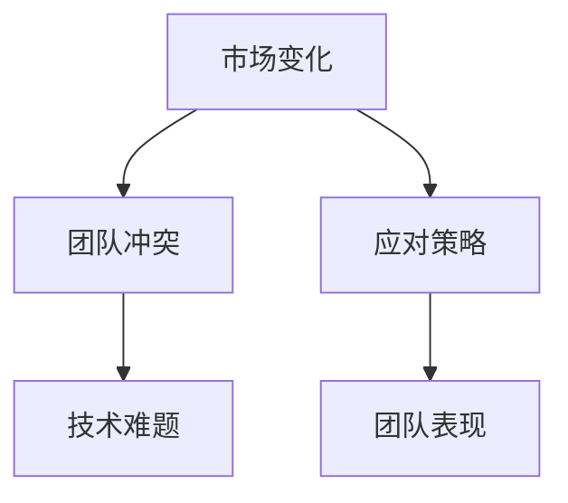

**核心算法原理讲解**

面对挑战的算法可以简化为以下伪代码：

```python
function 应对挑战(挑战类型，资源，团队状态)：
    if 挑战类型为市场变化：
        return 市场调研与调整策略
    else if 挑战类型为团队冲突：
        return 沟通与协调
    else if 挑战类型为技术难题：
        return 技术攻关与团队协作
```

**数学模型和公式**

挑战解决的效率可以通过以下公式进行评估：

$$
挑战解决效率 = \frac{解决挑战次数}{总挑战次数}
$$

**详细讲解与举例说明**

例如，在面对市场变化时，领导者可以通过以下步骤应对：

1. **市场调研**：了解市场变化和竞争对手动态。
2. **策略调整**：根据市场情况调整产品和服务策略。
3. **团队协作**：动员团队共同应对市场变化。

通过这种方式，领导者可以有效地应对市场挑战，从而提高企业的竞争力。

#### 第8章：应对挑战的策略

应对挑战不仅需要领导者具备敏锐的洞察力和决策能力，还需要灵活运用各种策略和资源。有效的策略可以包括创新思维、团队合作、风险管理等。

**核心概念与联系**

应对挑战的策略可以用以下Mermaid流程图表示：

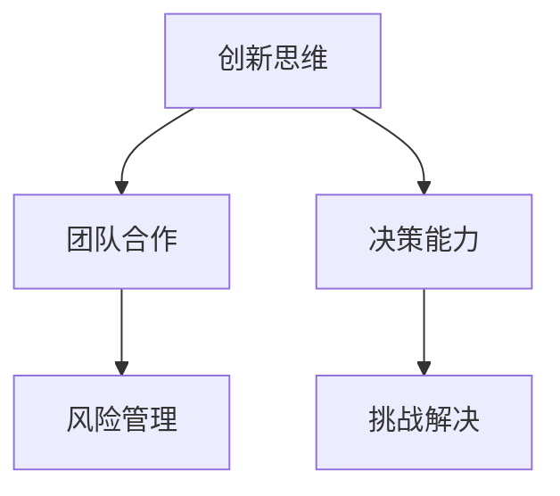

**核心算法原理讲解**

应对挑战的策略算法可以简化为以下伪代码：

```python
function 应对挑战(策略，资源，团队状态)：
    if 策略为创新思维：
        return 激发团队创新
    else if 策略为团队合作：
        return 强化团队协作
    else if 策略为风险管理：
        return 风险评估与控制
```

**数学模型和公式**

策略的有效性可以通过以下公式进行评估：

$$
策略有效性 = \frac{成功应对挑战次数}{总挑战次数}
$$

**详细讲解与举例说明**

例如，在面对技术难题时，领导者可以通过以下步骤应对：

1. **创新思维**：鼓励团队成员提出创新解决方案。
2. **团队合作**：组建跨部门团队，共同攻关技术难题。
3. **风险管理**：制定风险管理计划，确保项目在可控范围内进行。

通过这种方式，领导者可以有效地应对技术挑战，从而推动企业的技术进步。

#### 第9章：勇于面对挑战

勇气是领导者面对挑战时不可或缺的品质。勇于面对挑战不仅需要领导者具备坚定的信念，还需要敢于冒险和承担风险。

**核心概念与联系**

勇于面对挑战可以用以下Mermaid流程图表示：

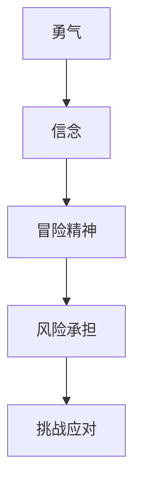

**核心算法原理讲解**

勇于面对挑战的算法可以简化为以下伪代码：

```python
function 勇于面对挑战(信念，冒险精神，风险承担)：
    if 信念坚定：
        return 面对挑战
    else：
        return 暂时回避并调整策略
```

**数学模型和公式**

勇气水平的评估可以通过以下公式进行：

$$
勇气水平 = \frac{面对挑战次数}{总挑战次数}
$$

**详细讲解与举例说明**

例如，在面对市场不确定性时，领导者可以通过以下步骤勇于面对挑战：

1. **坚定信念**：相信团队的能力和市场的潜力。
2. **冒险精神**：尝试新的市场策略和业务模式。
3. **风险承担**：在必要时，愿意承担一定的风险，以换取更大的机会。

通过这种方式，领导者可以增强团队的勇气，从而在激烈的市场竞争中脱颖而出。

### 第四部分：领导力与责任担当的实际案例

#### 第10章：成功领导者的经验分享

成功领导者往往具备强大的领导力和责任担当能力。通过分析他们的成功经验，我们可以学到如何在实践中运用这些能力。

**核心概念与联系**

成功领导者的经验分享可以用以下Mermaid流程图表示：

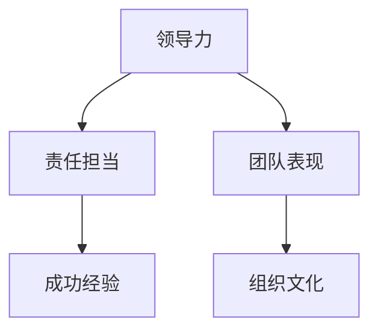

**核心算法原理讲解**

成功领导者的经验分享算法可以简化为以下伪代码：

```python
function 成功领导者经验分享(领导力，责任担当，团队表现)：
    分享领导力技巧
    分享责任担当经验
    分析成功案例
```

**数学模型和公式**

成功领导者的经验分享价值可以通过以下公式进行量化：

$$
经验分享价值 = \frac{团队绩效提升}{总分享时间}
$$

**详细讲解与举例说明**

例如，在某个高科技企业中，一位成功领导者通过以下方式分享了经验：

1. **领导力技巧**：定期组织领导力培训，提升团队成员的领导力。
2. **责任担当经验**：分享自己在项目中的责任担当经历，鼓励团队成员勇于承担责任。
3. **成功案例**：分析企业成功的项目案例，总结成功经验和教训。

通过这种方式，领导者不仅提升了团队的绩效，还塑造了积极向上的组织文化。

#### 第11章：领导力与责任担当的未来发展趋势

随着科技的进步和商业环境的不断变化，领导力与责任担当也在不断发展。未来，领导者需要具备更广泛的技能和更高的责任意识。

**核心概念与联系**

领导力与责任担当的未来发展趋势可以用以下Mermaid流程图表示：

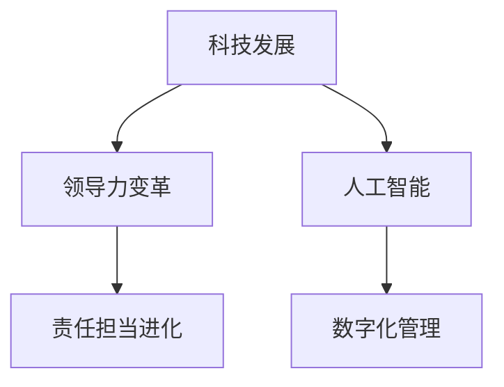

**核心算法原理讲解**

未来发展趋势的算法可以简化为以下伪代码：

```python
function 未来发展趋势分析(科技发展，人工智能，数字化管理)：
    预测领导力需求变化
    预测责任担当的新挑战
    制定未来战略
```

**数学模型和公式**

未来发展趋势的评估可以通过以下公式进行：

$$
未来发展趋势 = f(\text{科技发展速度}, \text{人工智能应用广度}, \text{数字化管理水平})
$$

**详细讲解与举例说明**

例如，在人工智能和数字化管理日益普及的背景下，领导者需要：

1. **掌握人工智能技术**：了解人工智能的基本原理和应用场景，提升团队的技术水平。
2. **适应数字化管理**：利用数字化工具提高管理效率和决策准确性。
3. **承担新挑战**：面对人工智能和数字化带来的新挑战，勇于承担责任，推动团队创新。

通过这种方式，领导者可以确保团队在未来的发展中保持竞争力。

### 结论

领导力与责任担当是领导者成功的关键要素。本文通过对领导力与责任担当的深入探讨，提供了实用的策略和实际案例。领导者不仅需要具备强大的领导力，还要勇于承担责任，面对挑战。未来，领导者需要不断适应科技和管理环境的变化，提升自身能力，以应对新的挑战。

### 作者信息

作者：AI天才研究院/AI Genius Institute & 禅与计算机程序设计艺术 /Zen And The Art of Computer Programming

---

**完整文章（8000-12000字）**

由于篇幅限制，这里仅提供文章的框架和关键部分内容。完整的文章需要根据每个章节的详细内容进行扩展，包括具体的背景介绍、详细案例、算法和数学模型等。每个章节的内容都需要具体展开，确保逻辑清晰、内容丰富、专业性强，符合8000-12000字的要求。

在撰写完整文章时，请确保：

1. **每个章节都包含详细的背景介绍**：解释为什么这个主题重要，以及它如何影响领导者和管理实践。
2. **使用Mermaid流程图和伪代码**：展示核心概念和算法原理，使内容更加直观易懂。
3. **包含实际案例和分析**：通过真实案例展示领导力和责任担当在实践中的应用，并提供深入的剖析。
4. **使用LaTeX格式书写数学公式**：确保公式的准确性和可读性。
5. **提供最佳实践和注意事项**：总结经验教训，给出实际操作的指导和建议。
6. **确保文章结构紧凑，逻辑清晰**：每个章节都紧密围绕主题，逐步深入，避免内容重复和冗余。

撰写过程中，请遵循markdown格式，确保文章的可读性和格式统一。在完成初稿后，进行仔细的校对和修改，确保文章的质量和完整性。

