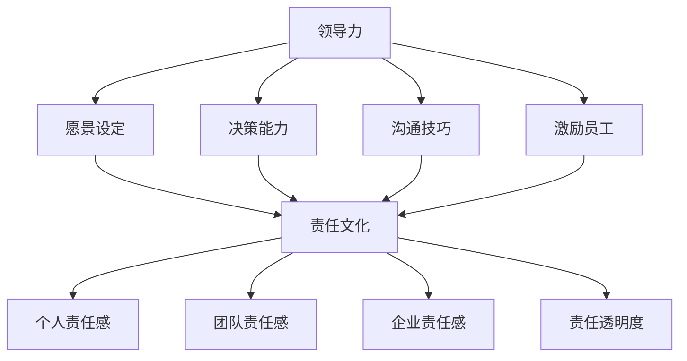

                 

### 文章标题

# 《领导力与责任文化深化：培养集体责任感》

### 文章关键词

- 领导力
- 责任文化
- 集体责任感
- 培养策略
- 实践方法
- 案例分析

### 文章摘要

本文旨在探讨领导力与责任文化的深化，尤其是如何培养集体责任感。通过分析领导力的核心概念、责任文化的内涵及其相互关系，本文提出了实践方法和策略，并结合实际案例，深入解析了培养集体责任感的具体路径。文章结构清晰，逻辑严密，旨在为读者提供有价值的理论和实践参考。

---

### 引言

在当今快速变化和高度竞争的商业环境中，领导力和责任文化成为企业成功的关键因素。领导力不仅关乎个人能力，更涉及团队的整体表现和企业的长远发展。而责任文化则强调个体与组织之间的紧密联系，通过培养集体责任感，提升组织的整体协作效率。然而，如何深化领导力与责任文化，特别是如何培养集体责任感，仍然是一个具有挑战性的课题。

本文旨在回答以下几个问题：

1. 领导力的核心概念是什么？它在企业中扮演什么角色？
2. 责任文化如何定义？它与企业文化和员工行为有何关系？
3. 领导力与责任文化之间存在哪些相互关系？
4. 如何通过实践方法和策略来深化领导力和责任文化？
5. 如何培养集体责任感，并确保其在组织中的有效实施？

本文将按照以下结构展开：

- 引言：介绍领导力和责任文化的重要性。
- 核心概念与联系：探讨领导力、责任文化的定义及其相互关系。
- 实践方法与案例分析：介绍深化领导力和责任文化的具体方法，并分析成功和失败的案例。
- 深化与提升：探讨如何进一步深化领导力和责任文化，培养集体责任感。
- 附录：提供相关文献和资源推荐。

通过本文的探讨，希望能够为读者提供深刻的见解和实践指导，帮助企业构建强大的领导力和责任文化，提升整体竞争力。

---

### 核心概念与联系

#### 领导力的核心概念及其重要性

领导力是一个多维度的概念，通常包括愿景设定、决策能力、沟通技巧、激励员工等多个方面。其核心在于激发和引导团队达成共同目标。领导力在企业中的作用至关重要，不仅能够推动企业的发展，还能塑造企业的文化和价值观。

首先，领导力帮助企业在变化中保持方向感。通过领导者的远见和决策，企业能够在复杂的市场环境中抓住机遇，规避风险。其次，领导力是团队协作的基础。有效的领导者能够建立信任和协同合作，提高团队的整体效能。最后，领导力对员工个人成长和职业发展具有深远影响。领导者不仅关注员工的绩效，还关注员工的职业成长和幸福感。

#### 责任文化的定义及内涵

责任文化是一种价值观和行为准则，强调个体和集体之间的责任关系。在组织内部，责任文化意味着每个员工都对自己的工作、团队的成功以及企业的长期发展承担义务。责任文化不仅关注个体的行为，还强调团队协作和共同使命。

责任文化的内涵包括以下几个方面：

1. **个人责任感**：每个员工都应认识到自己在组织中的角色和职责，并积极履行。
2. **团队责任感**：团队成员之间相互支持，共同承担责任，确保团队目标的实现。
3. **企业责任感**：企业对员工、客户、社会和环境承担社会责任，促进可持续发展。
4. **责任透明度**：组织内部建立透明的责任机制，确保每个员工都了解自己的责任和期望。

#### 领导力与责任文化的相互关系

领导力与责任文化之间存在着密切的相互关系。首先，领导力是责任文化的基础。有效的领导者通过设定愿景、建立信任和提供支持，推动责任文化的形成。其次，责任文化是领导力发挥作用的保障。在一个责任文化浓厚的组织中，员工更愿意承担责任，领导者也能更有效地实施领导。

此外，领导力与责任文化之间存在一种相互强化的关系。领导者的行为和决策会影响责任文化的形成，而责任文化的成熟又会反过来影响领导力的发展。具体来说：

1. **领导者行为对责任文化的影响**：领导者的行为是员工模仿的榜样。领导者通过自身的责任行为，如勇于承担责任、积极解决问题，可以激发员工的集体责任感。
2. **责任文化对领导力的影响**：一个责任文化浓厚的组织，员工之间相互信任和协作，领导者可以更加专注于战略规划和创新，从而提升领导力。

为了更好地理解领导力与责任文化之间的关系，我们使用Mermaid流程图进行可视化展示：

通过上述流程图，我们可以看到领导力通过不同的维度（愿景设定、决策能力、沟通技巧和激励员工）影响责任文化的形成，而责任文化则通过个人责任感、团队责任感、企业责任感和责任透明度等维度反过来影响领导力的发挥。

---

### 实践方法与案例分析

#### 领导力培养方法

要深化领导力，企业需要采取一系列实践方法。以下是一些关键的领导力培养方法：

**1. 领导力培训**

领导力培训是提升领导者能力的重要手段。通过系统的培训，领导者可以学习到先进的管理理念、沟通技巧和领导策略。以下是具体的领导力培训方法：

- **领导力工作坊**：通过角色扮演、案例分析、小组讨论等形式，让领导者亲身体验和练习领导技巧。
- **领导力研讨会**：邀请业内专家进行专题讲座，分享领导力和管理实践经验。
- **领导力发展项目**：为领导者提供长期的发展计划，包括导师指导、领导力评估和反馈等。

**2. 领导力模型与工具**

企业可以采用各种领导力模型和工具，以帮助领导者更好地理解和实践领导力。以下是一些常用的领导力模型和工具：

- **情境领导模型**：根据下属的能力和需求，调整领导风格，实现有效的领导。
- **变革领导模型**：在组织变革过程中，领导者需要具备洞察力、适应力和创新能力。
- **平衡领导模型**：领导者需要在关注个人和团队目标之间找到平衡，实现组织的目标。

#### 责任文化构建方法

构建责任文化需要系统的策略和措施。以下是一些关键的构建方法：

**1. 责任文化培养策略**

- **建立明确的期望和标准**：企业应明确每个岗位的职责和要求，确保员工了解自己的责任。
- **强化责任意识**：通过培训、宣传和激励机制，提高员工的责任意识。
- **建立透明和公正的评估体系**：确保每个员工都能公平地评估和承担责任。

**2. 责任制度设计**

- **明确责任分工**：通过组织结构和流程设计，明确每个部门和个人之间的责任关系。
- **建立反馈机制**：建立有效的反馈渠道，让员工能够及时了解自己的表现和改进方向。
- **设立责任奖惩机制**：通过奖励和惩罚，鼓励员工积极承担责任。

#### 案例分析

为了更好地理解如何深化领导力和责任文化，我们分析了一些成功和失败的案例。

**成功案例：**

- **华为**：华为通过领导力培训和责任文化建设，培养了强大的领导团队和责任意识。在华为，领导力培训是每年必须完成的任务，责任制度设计也非常完善，确保每个员工都能明确自己的责任。
- **谷歌**：谷歌通过开放透明的企业文化，建立了强大的责任文化。谷歌的员工被鼓励在工作中承担责任，并提出创新和改进意见。

**失败案例：**

- **安然公司**：安然公司由于缺乏有效的领导力和责任文化，最终导致了公司的倒闭。领导者的失职和员工的责任缺失是导致这一悲剧的主要原因。
- **丰田汽车**：丰田汽车在近年来的质量问题中也暴露出领导力和责任文化的不足。尽管丰田在质量管理体系方面做了很多工作，但领导层的责任意识不足，导致问题未能及时发现和解决。

通过以上案例分析，我们可以看到，深化领导力和责任文化不仅需要理论上的指导，更需要实际操作中的精细化管理。只有通过系统的实践方法和策略，才能真正实现领导力和责任文化的深化。

---

### 深化与提升

#### 领导力与责任文化的深化策略

为了进一步深化领导力和责任文化，企业需要采取一系列深化策略。以下是一些关键策略：

**1. 加强领导力培训**

企业应持续开展领导力培训，提高领导者的综合素质。可以通过引入外部专家、开展内部培训和设立领导力发展项目等方式，确保领导者的能力不断提升。

**2. 建立责任文化评估机制**

企业应建立责任文化评估机制，定期评估责任文化的实施情况和效果。可以通过员工满意度调查、绩效评估和责任文化氛围监测等方式，及时发现问题并采取措施。

**3. 加强跨部门合作**

通过加强跨部门合作，企业可以促进不同部门之间的沟通和协作，提升整体效率。可以通过设立跨部门项目小组、开展团队合作培训和建立协同机制等方式，实现跨部门合作。

#### 集体责任感培养

要培养集体责任感，企业需要从多个方面入手：

**1. 强化团队意识**

企业应通过各种活动和宣传，强化员工的团队意识。可以通过团队建设活动、团队目标设定和团队激励等方式，增强员工的团队归属感和责任感。

**2. 建立透明和公正的沟通渠道**

建立透明和公正的沟通渠道，让员工能够及时了解组织的决策和方向，增强员工的参与感和责任感。可以通过定期的团队会议、内部报告和意见反馈等方式，实现有效的沟通。

**3. 强化绩效管理和反馈**

通过强化绩效管理和反馈，企业可以激发员工的积极性和责任感。可以通过设立明确的绩效目标、定期绩效评估和及时反馈等方式，确保员工能够明确自己的责任和改进方向。

#### 领导力与责任文化的未来趋势

随着全球化和数字化的加速发展，领导力和责任文化也将面临新的挑战和机遇。以下是一些未来趋势：

**1. 智能领导力的兴起**

随着人工智能和大数据技术的发展，智能领导力将成为未来领导力的新趋势。领导者需要具备数据分析和决策能力，利用技术手段提升领导效能。

**2. 集体智慧的重视**

在未来的组织中，集体智慧将成为重要的竞争优势。企业应注重培养员工的创造性思维和协作能力，通过集体智慧实现组织的创新和发展。

**3. 责任文化的全球化**

随着全球化的深入，责任文化也将跨越国界，成为全球企业的共同追求。企业需要理解和尊重不同文化的差异，建立具有全球视野的责任文化。

---

### 附录

#### 相关文献与资源推荐

- [《领导力：实践与探索》] - by 约翰·科特
- [《责任文化：组织成功的基石》] - by 詹姆斯·梅瑞狄斯
- [《集体智慧：如何让团队更聪明》] - by 戴维·布鲁克斯

#### 练习与讨论题目

1. 你认为在你的组织内，领导力和责任文化的重要性如何？请给出具体的例子说明。
2. 在你所在的组织中，有哪些具体的实践方法可以用来深化领导力和责任文化？请列举并简要解释。
3. 请讨论一个你认为在领导力和责任文化方面做得特别好的组织，分析其成功的原因。
4. 在未来，你认为领导力和责任文化将如何发展？请提出你的观点并说明理由。

### 作者信息

- 作者：AI天才研究院/AI Genius Institute & 禅与计算机程序设计艺术 /Zen And The Art of Computer Programming

---

通过本文的探讨，我们深入分析了领导力和责任文化的核心概念、相互关系以及深化策略，并借助实际案例，提出了培养集体责任感的具体路径。希望本文能为读者提供有价值的理论和实践指导，助力企业在快速变化的环境中构建强大的领导力和责任文化。

