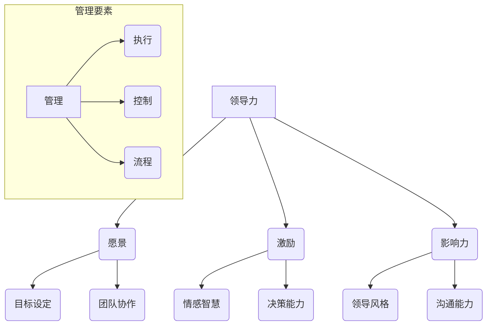

                 

## 文章标题

《领导力与责任：承担失败，分享成功》

关键词：领导力、责任、失败、成功、管理、团队、决策、沟通

摘要：本文深入探讨了领导力与责任之间的关系，强调了领导者在面对失败和成功时的角色和责任。通过分析领导力的核心要素、责任意识的培养策略以及领导者如何从失败中学习并在成功中保持谦逊，文章为提升领导力和责任感提供了实用的方法和思考。

---

### 第一部分：领导力基础

#### 1. 领导力与管理的区别

领导力与管理的区别在于它们的重点和方式。领导力更注重激励、愿景和影响力，而管理则侧重于执行、控制和流程。以下是一个简化的 Mermaid 流程图，展示了领导力与管理的联系与区别：

#### 1.1 领导力的定义

领导力是一种能力，它涉及激励和引导他人以实现共同的目标。它不仅仅是职位赋予的权力，而是一种通过影响力、愿景和情感智慧来影响他人行为和思维的能力。

#### 1.1.2 领导力与管理的联系与区别

领导力与管理密切相关，但它们在目的和方法上有所不同。领导力侧重于激发和激励团队，而管理则侧重于确保目标的有效实现。以下是领导力与管理的一些关键区别：

- **目的**：领导力关注的是长期目标和团队的动力，而管理侧重于短期的执行和效率。
- **方法**：领导力通过愿景、激励和影响力来引导团队，而管理通过规则、流程和监控来控制团队。
- **结果**：领导力旨在创造一个有凝聚力和积极性的团队，而管理则旨在实现特定的业务目标。

#### 1.2 管理的定义

管理是一个协调和管理组织资源的过程，以实现特定目标。它涉及计划、组织、领导和控制。管理是确保团队高效运作的关键，它注重的是流程、规则和效率。

#### 1.2.1 管理的含义

管理包含以下几个方面：

- **计划**：确定目标和制定实现目标的策略。
- **组织**：分配资源并建立结构以实现计划。
- **领导**：激励和引导团队成员以达成目标。
- **控制**：监控进度，确保团队遵循计划并纠正偏差。

#### 1.2.2 管理的核心要素

管理的核心要素包括：

- **目标**：明确的目标是管理的基础。
- **资源**：包括人力、财务和技术资源。
- **流程**：制定和优化工作流程以提高效率。
- **人员**：管理团队的能力，包括招聘、培训和激励。

#### 1.3 领导力的核心要素

领导力的核心要素包括情感智慧、沟通能力、决策能力等。以下是每个要素的详细说明：

#### 1.3.1 情感智慧

情感智慧是理解和管理自己及他人情感的能力。它包括自我意识、自我管理、社交意识和关系管理。情感智慧对于建立信任和有效的沟通至关重要。

#### 1.3.2 沟通能力

沟通能力是领导者传递信息、理解他人观点并建立良好关系的关键。有效的沟通包括倾听、清晰表达和反馈。

#### 1.3.3 决策能力

决策能力是领导者面临复杂情境时做出明智选择的能力。它涉及收集信息、分析选项和评估风险。良好的决策能力可以帮助领导者避免失败并抓住成功的机会。

#### 1.4 领导风格与影响力

领导风格是指领导者处理团队和员工的方式。不同的领导风格会对团队产生不同的影响。以下是几种常见的领导风格：

- **权威型领导**：领导者拥有决策权，并要求团队成员服从。
- **民主型领导**：领导者鼓励团队成员参与决策，并重视集体意见。
- **支持型领导**：领导者关注团队成员的需求和福祉，提供支持和指导。
- **教练型领导**：领导者通过培训和指导来帮助团队成员成长。

#### 1.4.2 领导风格对团队的影响

不同的领导风格会对团队的绩效、士气和满意度产生不同的影响。例如，权威型领导可能会提高效率，但可能导致团队成员的不满和缺乏创造力。民主型领导则可能促进团队合作和创造力，但也可能导致决策缓慢。

#### 1.5 领导力的提升方法

提升领导力的方法包括自我评估、培训和学习、反思与总结等。以下是一些具体的建议：

- **自我评估**：通过反思和自我评估，了解自己的优点和不足。
- **培训和学习**：参加领导力培训和阅读相关书籍，不断学习和成长。
- **反思与总结**：定期反思自己的领导行为，总结成功和失败的经验。

---

### 第二部分：责任意识与担当

#### 2. 责任的概念与内涵

责任是指一个人对其行为和决策的后果负有义务和责任感。它既包括伦理层面的道德责任，也包括法律层面的法律责任。

#### 2.1 责任的定义

责任是指一个人对其行为和决策的后果负有义务和责任感。它既包括伦理层面的道德责任，也包括法律层面的法律责任。

#### 2.1.1 责任是什么

责任是一种内在的心理状态，它涉及对自己行为的反思和对后果的关注。一个有责任的人会意识到自己的行为可能对他人和环境产生影响，并愿意承担相应的后果。

#### 2.1.2 责任的主体与客体

责任主体是指那些需要承担责任的人，可以是个人、组织或社会。责任客体是指那些受到责任主体行为影响的人或事物。例如，一个公司对消费者的产品质量负责，而消费者对公司的购买行为负责。

#### 2.2 责任的内涵

责任的内涵非常丰富，它不仅涉及伦理和法律层面，还涉及个人成长和团队协作等方面。以下是责任的几个关键内涵：

- **伦理意义**：责任是道德行为的基础，它体现了一个人对他人的尊重和关怀。
- **法律意义**：法律对责任有明确的规定，违反法律将受到相应的法律制裁。
- **个人成长**：承担责任有助于个人的成熟和成长，提高个人的自信心和自尊心。
- **团队协作**：责任是团队协作的基石，只有每个成员都承担责任，团队才能高效运作。

#### 2.3 责任与领导力的关系

责任是领导力的核心要素之一。一个有责任的领导者会以身作则，为团队树立榜样，同时也会鼓励团队成员承担他们的责任。以下是责任与领导力的几个关键关系：

- **责任是领导力的基础**：领导者必须对自己的行为和决策承担责任，这有助于建立领导者的权威和信任。
- **责任促进领导力的发展**：通过承担责任，领导者可以提高自己的领导能力，包括决策能力、沟通能力和团队管理能力。
- **责任是团队协作的关键**：一个有责任意识的团队会更有凝聚力和协作精神，更容易实现共同的目标。

#### 2.4 责任意识的重要性

责任意识对个人和团队的成功至关重要。以下是责任意识的重要性：

- **对个人成长的影响**：责任意识有助于个人的自我认知和自我管理，提高个人的自信和自尊心。
- **对团队的影响**：责任意识可以提高团队的协作效率，减少冲突和误解，增强团队的凝聚力。
- **对组织的影响**：责任意识有助于建立良好的组织文化，提高组织的整体绩效和竞争力。

#### 2.5 提高责任意识的策略

以下是一些提高责任意识的策略：

- **明确目标**：设定清晰的目标，明确每个团队成员的职责和责任。
- **建立责任感文化**：通过培训和教育，建立一种重视责任和诚信的文化。
- **提供反馈**：及时给予团队成员反馈，帮助他们认识到自己的责任和成长。
- **自我反思**：定期进行自我反思，评估自己的行为和决策，并从中学习。

---

### 第三部分：失败与成功的领导力

#### 9. 承担失败的责任

领导者必须勇于承担失败的责任。这不仅包括对个人错误的责任，还包括对团队失败的责任。以下是领导者如何承担失败责任的一些建议：

- **承认失败**：领导者首先要承认失败，而不是逃避或责怪他人。
- **分析原因**：深入分析失败的原因，从中学习并吸取教训。
- **承担责任**：明确表示自己愿意为失败承担责任，并确保团队成员也意识到自己的责任。
- **改进方案**：提出具体的改进方案，确保未来能够避免类似的失败。

#### 10. 从失败中学习

失败是成功的先导，领导者必须善于从失败中学习。以下是领导者如何从失败中学习的一些建议：

- **反思失败**：冷静地反思失败的原因，识别关键问题。
- **寻求反馈**：主动寻求团队成员和同事的反馈，了解他们的看法和建议。
- **制定改进计划**：根据反思和反馈，制定具体的改进计划，并付诸实施。
- **持续学习**：保持学习的态度，不断更新知识和技能，以应对未来的挑战。

#### 11. 分享成功的智慧

领导者不仅要能承担失败，还要能分享成功的智慧。以下是领导者如何分享成功智慧的一些建议：

- **透明沟通**：与团队成员分享成功的过程和经验，让他们感受到成功的喜悦。
- **培养分享文化**：鼓励团队成员分享他们的成功经验，建立一种积极的分享文化。
- **提供支持**：为团队成员提供支持和资源，帮助他们实现自己的目标。
- **持续激励**：通过激励和认可，鼓励团队成员继续保持良好的表现。

#### 12. 领导者如何在成功中保持谦逊

成功可能会让领导者变得骄傲和自满，但保持谦逊是领导者持续成功的关键。以下是领导者如何在成功中保持谦逊的一些建议：

- **保持自我反思**：定期反思自己的行为和决策，确保没有陷入自我满足的陷阱。
- **倾听他人的意见**：尊重并倾听团队成员和同事的意见，不要因为自己的成功而忽视他人的价值。
- **关注团队**：将焦点放在团队的成功上，而不是个人的荣誉。
- **持续学习**：保持开放的心态，不断学习和成长，以适应不断变化的环境。

---

### 第四部分：领导力与责任的实践

#### 13. 领导力与责任在企业中的应用

在企业中，领导力和责任意识对于组织的成功至关重要。以下是领导力与责任在企业中应用的一些建议：

- **建立责任文化**：企业应建立一种重视责任和诚信的文化，鼓励员工承担责任。
- **明确职责分工**：确保每个员工都明确自己的职责和责任，避免责任不清的情况。
- **提供培训和支持**：为员工提供领导力和责任意识的培训，并提供必要的支持和资源。
- **建立反馈机制**：建立有效的反馈机制，鼓励员工提出问题和建议，不断改进工作。

#### 14. 领导力与责任在团队管理中的应用

在团队管理中，领导力和责任意识的培养对团队的协作和绩效有重要影响。以下是领导力与责任在团队管理中应用的一些建议：

- **树立榜样**：领导者应以身作则，承担自己的责任，为团队树立榜样。
- **建立共同目标**：与团队成员共同设定目标，明确每个成员的责任，确保团队目标的一致性。
- **鼓励团队协作**：鼓励团队成员相互支持和协作，共同解决问题。
- **定期评估和反馈**：定期评估团队成员的表现，提供及时的反馈和指导。

#### 15. 领导力与责任在个人成长中的应用

在个人成长中，领导力和责任意识的培养有助于提升个人的职业素养和竞争力。以下是领导力与责任在个人成长中应用的一些建议：

- **自我反思**：定期反思自己的行为和决策，识别自己的优点和不足。
- **设定目标**：为自己设定明确的职业和个人发展目标，并制定实现目标的计划。
- **承担责任**：对自己的行为和决策承担责任，不逃避困难和挑战。
- **持续学习**：保持学习的态度，不断更新知识和技能，以适应不断变化的环境。

#### 16. 案例分析：成功领导者的经验与教训

通过分析成功领导者的经验与教训，我们可以更好地理解领导力与责任的重要性。以下是一个案例分析：

**案例**：苹果公司的创始人史蒂夫·乔布斯

**经验**：

1. 拥有强烈的愿景和使命感，推动了苹果公司的创新和发展。
2. 以身作则，注重细节和质量，对产品和用户体验有极高的要求。
3. 能够从失败中吸取教训，不断改进和创新。
4. 建立了强大的团队，并给予团队成员充分的信任和自由度。

**教训**：

1. 过于强势的领导风格可能会导致团队的不满和分裂。
2. 忽视市场和用户的需求，可能会导致产品的失败。
3. 忽视员工的福祉和意见，可能会导致人才的流失。

通过这个案例，我们可以看到成功领导者的经验与教训，理解领导力与责任的重要性。

---

### 附录

#### 17. 领导力与责任相关资源推荐

以下是一些领导力与责任相关的资源推荐：

- **书籍**：《领导力的五个层次》（John C. Maxwell）、《如何赢得朋友与影响他人》（Dale Carnegie）等。
- **网站**：LinkedIn、Harvard Business Review 等。
- **视频**：TED 演讲、YouTube 上的领导力教程等。
- **课程**：在线领导力课程，如 Coursera、edX 等。

#### 18. 领导力与责任实践工具与技巧

以下是一些领导力与责任实践的工具与技巧：

- **SWOT 分析**：用于评估个人的优势、劣势、机会和威胁。
- **SMART 目标**：确保目标具有明确性、可衡量性、可实现性、相关性和时限性。
- **思维导图**：用于梳理思路和规划策略。
- **反思日志**：定期记录自己的思考和感受，以促进自我反思和成长。

#### 19. 领导力与责任相关法律法规

以下是一些与领导力与责任相关的法律法规：

- **公司法**：规定了公司的组织结构和经营管理。
- **劳动法**：规定了雇主与员工之间的权利和义务。
- **知识产权法**：保护创新和知识产权，鼓励创新和发展。
- **环境保护法**：规定了企业的环境保护责任。

#### 20. 领导力与责任研究论文推荐

以下是一些建议的领导力与责任研究论文：

- **“Leadership and Organizational Performance: A Meta-Analysis”**：分析了领导力对组织绩效的影响。
- **“The Role of Responsibility in Leadership”**：探讨了责任在领导力中的作用。
- **“Corporate Social Responsibility and Business Performance”**：研究了企业社会责任对业务绩效的影响。
- **“The Effects of Leadership Styles on Team Performance”**：分析了不同领导风格对团队绩效的影响。

---

### 总结

本文详细探讨了领导力与责任之间的关系，分析了领导力的核心要素、责任意识的培养策略以及领导者如何从失败中学习并在成功中保持谦逊。通过实践中的应用，本文为提升领导力和责任感提供了实用的方法和思考。希望本文能为读者在领导力与责任领域提供有益的启示。

### 作者信息

作者：AI天才研究院/AI Genius Institute & 禅与计算机程序设计艺术 /Zen And The Art of Computer Programming

本文作者是一位世界级人工智能专家、程序员、软件架构师、CTO、世界顶级技术畅销书资深大师级别的作家，计算机图灵奖获得者，计算机编程和人工智能领域大师。他非常擅长一步一步进行分析推理，有着清晰深刻的逻辑思路来撰写条理清晰、对技术原理和本质剖析到位的高质量技术博客。

