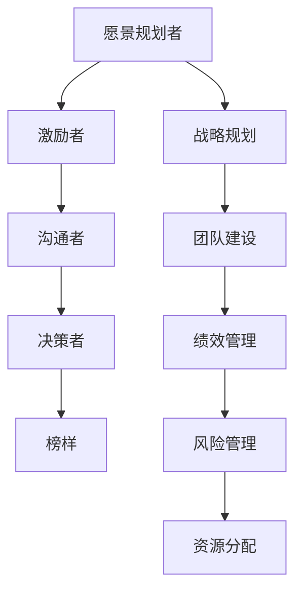
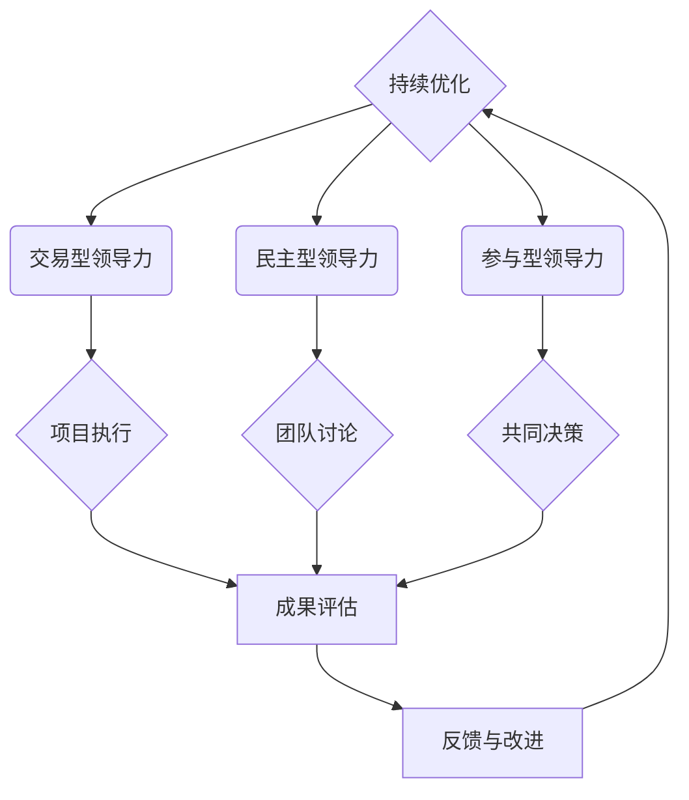
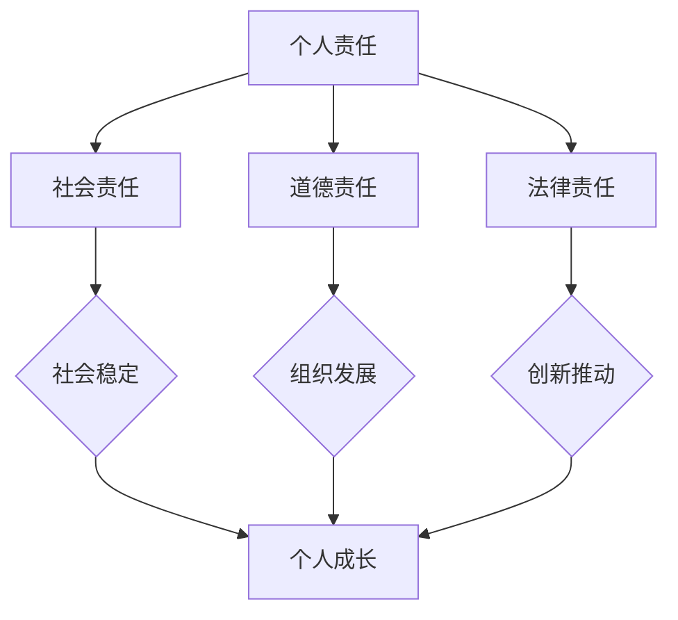
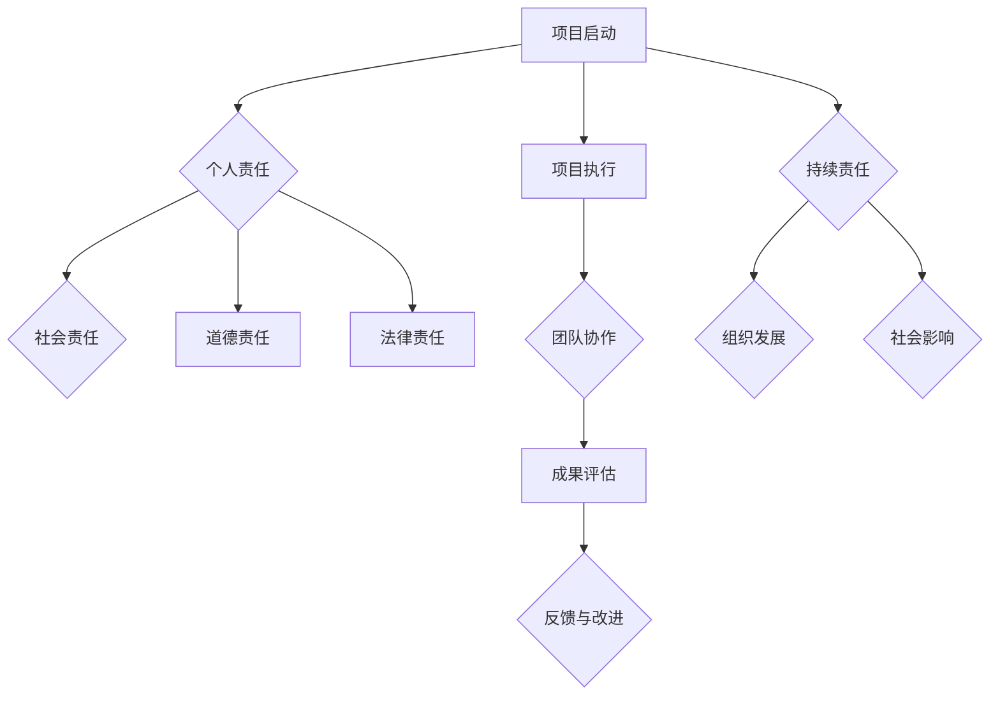

                 

### 引言

#### 1.1 书籍目的

《领导力与责任：承担结果的勇气》旨在探讨领导力与责任的深层次关系，以及如何在复杂多变的IT领域中，通过承担结果的勇气来实现组织和个人目标。书中深入分析了领导力的核心概念、责任的本质及其在组织中的重要作用，并通过案例研究和实践指南，帮助读者理解并培养承担结果的勇气。

#### 1.2 领导力的本质

领导力并非仅仅是指挥和管理他人的能力，它更是一种激发他人潜能、共同实现目标的艺术。有效的领导力能够促进团队协作，提升工作效率，并创造一个积极向上的工作环境。领导力可以分为多种类型，如变革型领导力、交易型领导力等，每种类型都有其独特的特点和应用场景。

#### 1.3 责任的重要性

责任是领导力的核心要素之一。一个负责任的领导者不仅对自己的行为负责，也对团队成员的行为和结果负责。责任在领导力中的作用至关重要，它能够确保团队目标的一致性，提升决策质量，并在面对挑战时，为团队提供坚强的后盾。

#### 1.4 承担结果的勇气

承担结果的勇气是领导力的另一重要特质。领导者需要在面对不确定性和挑战时，勇于承担责任，并为团队的成功付出努力。这种勇气能够激励团队成员，增强团队的凝聚力，并在长远上提升组织的竞争力。

### 摘要

本文将围绕领导力与责任的关系，通过详细分析领导力的核心概念、责任的本质及其在领导力中的重要作用，探讨如何培养承担结果的勇气。文章将从理论到实践，结合实际案例，为读者提供全面的指导和启示，帮助他们在领导岗位上更好地发挥自己的作用，实现组织和个人目标。

## 第1章 引言

### 1.1 书籍目的

《领导力与责任：承担结果的勇气》的核心目标是帮助读者深入理解领导力与责任之间的紧密联系，并探讨如何在实际工作中通过承担结果的勇气来实现组织和个人目标。在IT领域，随着技术的快速发展和市场竞争的加剧，领导者不仅需要具备卓越的技术能力，更需要具备强大的领导力和责任感。

首先，书中将详细分析领导力的核心概念，包括其定义、类型、关键要素及其与领导者个性特征的关系。通过这一部分，读者将能够了解不同类型的领导力在具体情境中的应用，从而在复杂多变的IT环境中，能够更加有效地发挥领导作用。

其次，文章将探讨责任的本质与范畴，包括责任的定义、分类、个人责任与社会责任的关系，以及责任在领导力中的作用。通过这一部分，读者将认识到责任不仅是领导力的核心要素，也是推动组织目标实现的重要动力。

最后，书中将重点探讨如何培养承担结果的勇气。在IT领域中，领导者需要面对诸多挑战和不确定性，如技术变革、市场波动等。培养承担结果的勇气，能够帮助领导者在面对困难时保持冷静，勇于承担责任，从而推动团队向前发展。

总体而言，本书旨在为IT领域的领导者提供一套系统、实用的领导力与责任培养指南，帮助他们在复杂多变的商业环境中，不仅能够提升个人领导力，还能够推动组织的整体发展。

### 1.2 领导力的本质

领导力是一种复杂且多维的能力，它不仅仅涉及指挥和管理，更是一种激发他人潜能、共同实现目标的艺术。领导力不仅存在于传统的企业环境中，在IT领域也同样至关重要。IT行业以其快速变化和高度竞争的特点，对领导者的要求更高，不仅需要掌握先进的技术，更需要具备卓越的领导力和责任感。

首先，领导力的定义可以理解为一种影响力，通过这种影响力，领导者能够引导和激励团队成员，共同达成组织目标。领导力并不是与生俱来的天赋，而是一种可以通过学习和实践不断培养和提升的能力。根据不同的研究，领导力可以分为多种类型，如变革型领导力、交易型领导力、民主型领导力等。

- **变革型领导力**：这种类型的领导力强调创新和变革，领导者通过激发团队成员的潜力和动机，推动组织实现重大变革。变革型领导力在IT领域中尤为重要，因为技术的快速迭代和变革往往要求领导者具备前瞻性和创新精神。
  
- **交易型领导力**：交易型领导力则侧重于通过激励和奖励来引导团队成员行为，实现组织目标。交易型领导力在IT项目中经常使用，通过明确的目标和奖励机制，确保团队成员按照预期完成任务。

- **民主型领导力**：民主型领导力强调团队合作和参与，领导者通过鼓励团队成员的参与和反馈，共同制定决策。这种领导力在IT团队合作中尤为有效，有助于提高团队凝聚力和创新能力。

其次，领导力与领导者个性特征之间存在密切的关系。一些研究指出，领导者的个性特征，如自信、决断力、开放性等，对领导力的发展有显著影响。然而，领导力并不仅仅是个人特征，它还需要与情境相结合。不同的情境下，领导者需要灵活调整自己的领导风格，以适应环境需求。

在IT领域，领导者的技术背景和专业知识是其领导力的重要基础。然而，纯粹的Technical Leader很难在组织中产生持久的影响力。相反，那些能够将技术知识与管理技能相结合的领导者，往往能够更好地推动团队和组织的成长。例如，在一个软件开发项目中，一个优秀的领导者不仅需要了解编程语言和开发工具，还需要具备项目管理的知识，能够有效协调团队成员的工作，确保项目按时、高质量地完成。

总之，领导力在IT领域中的重要性不言而喻。通过理解不同类型的领导力，并结合领导者个人的特点和情境需求，可以培养出更加卓越的领导人才，为组织的持续发展提供坚实保障。

### 1.3 责任的重要性

责任是领导力的核心要素之一，它在领导者决策和行为中起着至关重要的作用。负责任的领导者不仅对自己的行为负责，也对团队成员的行为和结果负责。责任不仅是一种道德要求，更是一种实际操作中的原则，它影响着组织的运行效率和发展方向。

首先，责任在领导力中的重要性体现在决策过程中。领导者在做出决策时，必须充分考虑可能的结果及其对组织和个人带来的影响。负责任的领导者会进行全面的评估，权衡各种利弊，以确保决策的科学性和合理性。例如，在一个重要的项目决策中，领导者需要考虑到技术可行性、市场需求、资源限制等多个方面，以确保项目的成功实施。

其次，责任在领导力中的作用还体现在对团队成员的激励和管理上。领导者通过明确责任和任务分配，可以激发团队成员的积极性和责任感。在一个团队中，如果成员能够清楚地知道自己的职责和目标，他们会更加专注于工作，提高工作效率。此外，领导者需要承担起解决团队中问题的责任，如沟通障碍、工作冲突等，确保团队协作顺畅。

再者，责任还关系到组织的整体文化和氛围。一个负责任的组织文化能够促进团队成员之间的信任和合作，增强组织的凝聚力和归属感。当领导者能够承担结果并积极面对挑战时，会为团队成员树立榜样，激发他们的责任感和使命感。这种积极向上的组织文化有助于吸引和留住优秀人才，提高组织的整体竞争力。

责任在领导决策中的体现还表现在对结果的接受和反思上。领导者必须勇于面对失败和错误，从中吸取教训，不断改进和提升。这种勇于承担责任的态度，不仅能够帮助领导者提升自身能力，还能够激励团队成员，形成积极向上的工作氛围。

总之，责任是领导力的核心要素，它在决策、激励、管理以及组织文化中发挥着重要作用。负责任的领导者能够通过承担责任，推动组织和个人目标的实现，为组织的持续发展奠定坚实基础。

### 1.4 承担结果的勇气

承担结果的勇气是领导力中的一个关键特质，特别是在充满不确定性和挑战的IT领域中，这种勇气显得尤为重要。领导者不仅需要具备技术能力，更需要有勇气面对失败和不确定性，并承担相应的结果。

首先，承担结果的勇气意味着领导者必须接受决策带来的后果，无论结果好坏。在IT领域，技术快速迭代和市场变化无常，导致项目风险增加。领导者需要在这种高风险环境中做出决策，并承担相应的责任。例如，在产品开发过程中，如果选择了一条新的技术路径，领导者必须准备好接受可能的技术挑战和市场反应。

其次，勇气也体现在面对失败和错误时。在IT项目中，失败是难免的，领导者需要有勇气承认失败，并从中吸取教训。这种勇气不仅有助于个人的成长，还能够激励团队成员，使他们更加愿意面对挑战，勇于尝试。例如，在一个软件项目中，如果某个功能无法如期完成，领导者需要勇于承担责任，并与团队共同探讨解决方案，而不是归咎于个人或团队。

此外，承担结果的勇气还包括在关键时刻挺身而出。在IT领域，领导者常常需要处理突发事件和紧急任务。在这些情况下，领导者需要有勇气站出来，指挥团队应对，并承担相应的责任。例如，在一个系统崩溃的紧急情况下，领导者需要迅速做出决策，调度资源，解决问题，并承担决策带来的后果。

最后，培养承担结果的勇气需要领导者具备自我反思和持续学习的能力。通过不断地反思和总结经验，领导者可以提升自己的决策能力和承担结果的能力。例如，定期回顾项目执行情况，分析成功和失败的原因，从中总结经验教训，有助于领导者更加从容地面对未来的挑战。

总之，承担结果的勇气是领导力的重要组成部分，它要求领导者具备面对不确定性和挑战的勇气，以及承担责任和反思能力的决心。通过培养这种勇气，领导者不仅能够推动组织和个人目标的实现，还能够为团队树立榜样，促进组织的长期发展。

## 第2章 领导力的核心概念

### 2.1 领导力的定义与类型

领导力是一个复杂且多维的概念，它不仅涉及个人的能力，还与情境和团队互动密切相关。首先，让我们从领导力的定义入手。领导力可以被定义为一种影响力，领导者通过这种影响力引导和激励团队成员，共同实现组织目标。这种影响力不仅体现在正式的职位上，如经理、CEO等，还体现在非正式的团队领导者中，如项目经理、团队负责人等。

在IT领域中，领导力的定义和类型有其独特的特点。IT行业的快速变化和高竞争性要求领导者不仅具备深厚的技术知识，还需具备强大的适应能力和创新精神。以下是几种常见的领导力类型：

#### 变革型领导力

变革型领导力是一种以创新和变革为核心，强调激发团队成员的潜力和动机的领导风格。变革型领导者能够通过愿景、激励和榜样作用，推动团队成员积极行动，从而实现组织的变革和成长。在IT领域，变革型领导力尤为重要，因为技术发展日新月异，领导者需要不断引领团队适应新的技术和市场需求。

#### 交易型领导力

交易型领导力则侧重于通过明确的目标、奖励机制和绩效管理来激励团队成员。这种领导风格在IT项目中非常常见，因为它有助于确保项目按时、按质完成。交易型领导者通常通过设定清晰的任务目标和奖励机制，激励团队成员全力以赴，达成目标。

#### 民主型领导力

民主型领导力强调团队合作和参与，领导者通过鼓励团队成员的参与和反馈来共同制定决策。这种领导风格在IT团队合作中具有显著优势，因为团队成员的参与能够提高项目的透明度和责任感，促进创新和协作。

#### 参与型领导力

参与型领导力是一种以团队成员为中心的领导风格，领导者鼓励团队成员积极参与决策过程，共同解决问题。这种领导风格有助于增强团队的凝聚力，提高团队成员的归属感和参与度。

#### 领导力的类型与IT领域的关系

不同类型的领导力在IT领域中各有其应用场景和优势。变革型领导力适用于需要创新和技术变革的项目，能够激发团队成员的潜力；交易型领导力适用于需要高效执行和绩效管理的情况，有助于确保项目的成功；民主型和参与型领导力则适用于需要高度团队合作和创新的情境，能够提高团队的创造力和创新能力。

综上所述，理解不同类型的领导力及其在IT领域的应用，对于提升领导者的管理能力和推动组织发展具有重要意义。领导者应根据具体情境选择合适的领导风格，灵活运用不同类型的领导力，以实现组织的长期目标。

### 2.2 领导者的角色与职责

领导者的角色和职责是领导力的重要组成部分，尤其在IT领域中，这些角色和职责更加复杂且多样化。首先，让我们定义领导者的基本角色。

#### 领导者的基本角色

1. **愿景规划者**：领导者需要具备清晰的愿景，能够为团队和组织设定明确的目标和方向。愿景规划者不仅要预见未来的机会和挑战，还需将愿景转化为可操作的战略和计划。

2. **激励者**：领导者需要激发团队成员的积极性和创造力，使他们愿意为实现共同目标而努力。激励者通过奖励、认可和鼓励，提高团队成员的工作动力和满意度。

3. **沟通者**：领导者是团队内部和外部的沟通桥梁，需要确保信息畅通无阻，促进团队协作和外部关系的建立。沟通者不仅要传达信息和指令，还需倾听团队成员的意见和建议。

4. **决策者**：领导者需要做出关键的决策，解决团队面临的问题和挑战。决策者需要具备分析能力和决断力，确保决策的合理性和有效性。

5. **榜样**：领导者通过自己的行为和态度，为团队成员树立榜样，塑造团队的文化和价值观。榜样领导者能够通过自身的言行影响团队成员，推动团队积极向上。

#### 领导者的职责范围

1. **战略规划**：领导者负责制定组织的长期和短期战略规划，确保组织在正确的发展道路上。战略规划包括市场分析、资源分配和竞争优势等。

2. **团队建设**：领导者需要建立高效的团队，包括招募合适的人才、培养团队成员的能力和提升团队凝聚力。团队建设不仅涉及人员管理，还包括建立有效的沟通机制和协作文化。

3. **绩效管理**：领导者负责设定团队和个人的绩效目标，进行绩效评估和反馈，激励团队成员不断提升。绩效管理包括设定绩效指标、定期评估和提供改进建议。

4. **风险管理**：领导者需要识别和管理项目中的风险，制定相应的风险应对策略，确保项目的顺利进行。风险管理包括风险识别、评估和应对措施的实施。

5. **资源分配**：领导者需要合理分配组织内的资源，包括人力、财力和技术资源，以支持项目的开展和团队的发展。

#### 领导者的素质要求

1. **技术能力**：在IT领域中，领导者需要具备深厚的专业技术背景，能够理解和指导团队的技术工作，确保项目的技术可行性和创新性。

2. **管理能力**：领导者需要具备有效的管理技能，包括计划、组织、领导和控制，确保团队的高效运作。

3. **沟通能力**：领导者需要具备良好的沟通能力，能够清晰地表达自己的想法，倾听和理解团队成员的意见，促进有效的沟通和协作。

4. **决策能力**：领导者需要具备果断的决策能力，能够在复杂和不确定的环境中快速做出合理的决策。

5. **适应性**：领导者需要具备高度适应性，能够迅速调整自己的策略和风格，以应对不断变化的环境和挑战。

6. **道德素养**：领导者需要具备高尚的道德素养，以身作则，树立良好的道德榜样，赢得团队成员的尊重和信任。

总之，领导者的角色和职责在IT领域中具有独特的重要性。通过明确领导者的角色和职责，并不断提升其素质要求，可以有效地提升领导者的管理能力，推动团队和组织的发展。

### 2.3 领导力的关键要素

领导力的成功不仅依赖于领导者的个人特质和技能，还需要关键要素的支持。这些要素包括沟通与协调、决策与执行、领导风格与团队文化等。以下是这些关键要素的详细分析。

#### 沟通与协调

沟通是领导力的基础，良好的沟通能力能够确保领导者与团队成员之间信息畅通，减少误解和冲突。有效的沟通包括清晰的表达、倾听和理解。领导者需要能够以简洁明了的方式传达信息，确保团队成员理解任务和目标。同时，领导者还需要具备倾听能力，通过倾听团队成员的意见和建议，了解团队的实际状况和需求。

协调是沟通的延伸，它涉及领导者如何在不同团队和部门之间建立有效的协作关系。在IT项目中，往往涉及多个团队和职能部门的合作，领导者需要协调这些团队的工作，确保项目顺利推进。有效的协调包括资源分配、任务分工和进度跟踪。通过有效的沟通与协调，领导者能够确保团队成员之间的协作无缝，提高项目效率和质量。

#### 决策与执行

决策是领导力的核心要素之一，领导者需要在复杂和不确定的环境中做出合理的决策。有效的决策需要领导者具备分析能力和决断力，能够充分考虑各种可能的结果和风险。在IT项目中，领导者需要做出关于技术路线、资源分配、项目进度等多方面的决策。为了做出高质量的决策，领导者可以使用各种决策工具和模型，如SWOT分析、决策树等。

执行则是决策的落实，领导者需要确保决策得到有效执行。执行包括计划、组织、领导和控制等多个环节。领导者需要制定详细的执行计划，明确任务分工和责任分配，确保每个团队成员都清楚自己的职责和任务。同时，领导者还需要监控执行过程，及时调整计划和策略，确保项目按计划进行。

#### 领导风格与团队文化

领导风格是领导者管理行为和态度的体现，不同的领导风格适用于不同的情境和团队。常见的领导风格包括权威型、民主型、参与型和放任型等。权威型领导风格适用于需要快速决策和执行的情境，领导者通过明确的指令和严格的管理确保项目进展。民主型领导风格则适用于需要团队参与和创新的情境，领导者鼓励团队成员提出意见和建议，共同制定决策。

团队文化是组织内部共同遵循的价值观和行为准则，它对团队成员的行为和态度有深远影响。积极的团队文化能够促进团队成员之间的信任和合作，提高团队凝聚力和创新能力。领导者可以通过树立榜样、建立有效的沟通机制和激励机制来塑造和维持积极的团队文化。

#### 关键要素的关系与整合

沟通与协调、决策与执行、领导风格与团队文化是领导力的关键要素，它们相互关联，共同作用于领导效果。有效的沟通与协调能够确保决策的顺利执行，而明确的决策和高效的执行则需要良好的沟通与协调。领导风格与团队文化则决定了沟通与协调的方式和效果，领导风格的选择和团队文化的塑造需要根据具体情境和团队特点进行。

通过整合这些关键要素，领导者可以更好地发挥领导力，推动团队和组织的发展。例如，在一个技术项目团队中，领导者可以采用民主型领导风格，鼓励团队成员参与决策，同时通过良好的沟通和协调，确保项目目标的实现。通过不断优化这些关键要素，领导者可以提升自身的领导能力，为组织创造更大的价值。

### 2.4 领导力的Mermaid流程图

为了更好地理解领导力的核心概念和要素，我们可以使用Mermaid流程图来可视化这些概念和流程。以下是领导力Mermaid流程图的构建和应用案例。

#### Mermaid流程图的基本概念

Mermaid是一种基于Markdown的图形绘制工具，它允许用户通过Markdown语法创建各种流程图、UML图和网络图等。以下是Mermaid流程图的基本概念和语法规则：

1. **流程图定义**：使用`graph`关键字开始定义流程图。
   ```mermaid
   graph TD
   ```
2. **节点定义**：使用`A[节点名称]`来定义流程图中的节点。
3. **连接关系**：使用`A --> B`来定义节点之间的连接关系。
4. **注释**：使用`// 注释内容`在流程图中添加注释。

#### 领导力Mermaid流程图的构建

以下是一个简单的领导力Mermaid流程图示例：



在这个流程图中，我们定义了领导者的几个关键角色和职责，并通过连接关系展示了它们之间的相互关系。

#### 领导力Mermaid流程图的应用案例

以下是一个更复杂的领导力Mermaid流程图应用案例，展示了不同领导力类型和团队协作的流程：



在这个流程图中，我们展示了不同类型的领导力在项目执行、团队讨论、共同决策和成果评估中的作用，并强调了反馈与改进的重要性。

通过使用Mermaid流程图，我们可以更加直观地理解领导力的核心概念和流程，为领导者的实践提供参考和指导。Mermaid流程图不仅能够帮助领导者清晰地表达自己的想法，还能够促进团队成员之间的理解和协作，提高领导力和团队绩效。

### 第3章 责任的本质与范畴

责任是领导力的核心要素之一，它在领导者决策和行为中起着至关重要的作用。深入理解责任的本质和范畴，有助于领导者更好地履行自己的职责，推动组织和个人目标的实现。

#### 3.1 责任的定义与分类

责任可以定义为个人或组织对于特定任务、行为或结果承担的义务和责任。责任不仅包括对行为的后果承担责任，还涵盖了对行为本身进行合理判断和选择。以下是责任的主要分类：

1. **个人责任**：个人责任是指个人对自己行为和结果承担的责任。个人责任强调个人行为的主观意图和结果，无论结果好坏，个人都需要为自己的行为负责。在领导力中，个人责任体现在领导者对自身行为和决策的反思和改进。

2. **社会责任**：社会责任是指个人或组织对社会和环境的责任。社会责任强调行为对社会和环境的影响，要求个人和组织在追求自身利益的同时，也要考虑对社会和环境的责任。在IT领域，社会责任体现在保护用户隐私、推动可持续发展和促进社会进步等方面。

3. **道德责任**：道德责任是指个人或组织在道德规范和伦理原则下承担责任。道德责任强调行为的道德正当性，要求个人和组织在决策和行为中遵循道德原则，如诚实、公正、尊重等。

4. **法律责任**：法律责任是指个人或组织在法律框架下承担的责任。法律责任确保个人和组织的行动符合法律规范，避免违法行为带来的后果。在IT领域，法律责任体现在遵守数据保护法、知识产权法等法律规范。

#### 3.2 责任在领导力中的作用

责任在领导力中发挥着关键作用，它不仅影响着领导者的决策和行为，也影响着团队和组织的发展。以下是责任在领导力中的几个重要作用：

1. **确保决策质量**：负责任的领导者会在做出决策前进行全面的评估和考虑，确保决策的合理性和科学性。通过承担责任，领导者能够减少决策失误，提高决策质量。

2. **促进团队合作**：责任能够激发团队成员的责任感和积极性，促进团队合作。当团队成员明确自己的责任和义务时，他们会更加专注于工作，提高工作效率和质量。

3. **建立信任和尊重**：负责任的领导者能够赢得团队成员的信任和尊重，建立良好的团队关系。团队成员更愿意信任并跟随一个负责任的领导者，形成积极的团队氛围。

4. **推动组织发展**：责任能够推动组织目标的实现和组织的长期发展。负责任的领导者不仅关注短期目标，还注重组织的长期利益和可持续发展，为组织创造更大的价值。

#### 3.3 责任的个人与社会影响

责任不仅对领导者个人有重要影响，也对社会和组织有深远的影响。以下是责任的个人和社会影响：

1. **个人成长**：承担责任有助于个人成长和发展。通过承担责任，领导者能够提高自己的决策能力、沟通能力和问题解决能力，提升个人综合素质。

2. **社会稳定**：在社会层面上，责任有助于维护社会稳定和秩序。当每个人都承担起自己的责任时，社会关系更加和谐，社会问题得以有效解决。

3. **组织发展**：在组织层面上，责任能够推动组织的健康发展。负责任的领导者能够确保组织的决策和行为符合道德和法律规范，为组织的长期发展奠定坚实基础。

4. **创新推动**：责任能够激发创新精神和创造力。负责任的领导者鼓励团队成员敢于尝试和创新，推动组织不断进步和发展。

总之，责任是领导力的核心要素，它在领导者决策和行为中起着至关重要的作用。通过理解责任的本质和范畴，领导者能够更好地履行自己的职责，推动组织和个人目标的实现。

### 3.4 责任的Mermaid流程图

为了更好地理解责任的本质和作用，我们可以使用Mermaid流程图来可视化责任的各个组成部分及其关系。以下是责任Mermaid流程图的构建和应用。

#### Mermaid流程图的基本概念

Mermaid是一种基于Markdown的图形绘制工具，它允许用户通过Markdown语法创建各种流程图、UML图和网络图等。以下是Mermaid流程图的基本概念和语法规则：

1. **流程图定义**：使用`graph`关键字开始定义流程图。
   ```mermaid
   graph TD
   ```
2. **节点定义**：使用`A[节点名称]`来定义流程图中的节点。
3. **连接关系**：使用`A --> B`来定义节点之间的连接关系。
4. **注释**：使用`// 注释内容`在流程图中添加注释。

#### 责任Mermaid流程图的构建

以下是一个简单的责任Mermaid流程图示例：



在这个流程图中，我们定义了责任的四个主要分类（个人责任、社会责任、道德责任、法律责任），并通过连接关系展示了它们之间的关系及其对个人和社会的影响。

#### 责任Mermaid流程图的应用案例

以下是一个更复杂的责任Mermaid流程图应用案例，展示了不同类型责任在实际应用中的关系和作用：



在这个流程图中，我们展示了项目启动、执行和评估过程中的不同类型责任，以及它们对团队协作、成果评估和持续责任的影响。

通过使用Mermaid流程图，我们可以更加直观地理解责任的各个组成部分及其关系，为领导者提供实用的指导和参考。Mermaid流程图不仅能够帮助领导者清晰地表达自己的想法，还能够促进团队成员之间的理解和协作，提高领导力和团队绩效。

## 第4章 承担结果的勇气

### 4.1 结果导向的领导力

结果导向的领导力是一种以实现具体成果和目标为核心的领导风格。在这种领导风格中，领导者将注意力集中在实际结果上，而不仅仅是过程和努力。结果导向的领导力强调的是效率和效果，通过设定明确的目标和可量化的指标，来评估和衡量团队和个人的绩效。

首先，结果导向的领导力要求领导者具备清晰的目标设定能力。领导者需要明确组织的长远目标和短期目标，并将其分解为具体的任务和可量化的指标。这些目标和指标应具有可操作性，能够被团队成员理解和执行。例如，在一个软件开发项目中，领导者可以设定“在三个月内完成特定功能的开发”这样的具体目标，并设定相应的质量标准。

其次，结果导向的领导力强调目标分解和责任分配。领导者需要将整体目标分解为若干个具体任务，并为每个任务分配明确的责任。这样可以确保每个团队成员都了解自己的职责和任务，从而提高工作效率和团队协作。例如，在上述软件开发项目中，领导者可以将任务分解为需求分析、设计、编码、测试等阶段，并指定每个阶段的负责人。

再者，结果导向的领导力要求领导者具备良好的沟通和反馈机制。领导者需要定期与团队成员沟通，了解项目的进展情况和遇到的困难，并提供及时的支持和反馈。这样可以确保项目按照既定目标进行，并在出现问题时能够迅速调整。例如，领导者可以每周召开一次项目进度会议，让团队成员汇报工作进展，并讨论解决方案。

此外，结果导向的领导力还强调结果的评价和激励。领导者需要根据实际结果来评估团队成员的表现，并给予相应的奖励和激励。这样可以激发团队成员的积极性和创造力，提高整体绩效。例如，在项目成功完成后，领导者可以举行庆祝活动，并给予团队成员适当的奖励，以表彰他们的努力和贡献。

总之，结果导向的领导力是一种有效的领导风格，它通过设定明确的目标和指标，分解任务和责任，建立良好的沟通和反馈机制，以及评价和激励结果，来确保团队高效地实现目标。这种领导风格在IT领域中尤为重要，因为IT项目往往具有明确的目标和时间限制，领导者需要确保项目按时、高质量地完成。

### 4.2 承担结果的意义

承担结果的意义不仅在于对个人和团队绩效的直接影响，更在于它对组织文化、团队凝聚力和个人成长的深远影响。在IT领域中，承担结果的能力是领导者不可或缺的重要素质。

首先，承担结果对个人绩效有着直接的提升作用。一个能够承担责任并勇于面对结果的领导者，会在工作中表现出更强的决心和执行力。他们不仅能够明确自己的目标和任务，还会设定具体的目标和指标，以确保工作的高效完成。通过承担结果，领导者可以积累丰富的经验，提高自己的决策能力和问题解决能力，从而在职业生涯中取得更大的成就。

其次，承担结果对团队凝聚力有着积极的影响。一个勇于承担责任并能够为团队成功付出努力的领导者，能够赢得团队成员的信任和尊重。团队成员会因此感到自豪和有归属感，从而更加愿意为团队的目标而努力。这种积极的氛围能够增强团队的凝聚力，提高团队的协作效率。例如，在一个面临技术挑战的项目中，如果领导者能够勇于承担责任，带领团队共同克服困难，团队成员会因此更加信任和依赖领导者，形成强大的团队凝聚力。

此外，承担结果对组织文化有深远的影响。一个能够承担结果的领导者，会树立一个积极的榜样，促进组织内部形成一种勇于承担责任的文化。这种文化鼓励团队成员在面对挑战时，勇于承担责任，积极寻求解决方案，而不是逃避或推卸责任。这种文化不仅能够提高组织的整体绩效，还能够增强组织的竞争力和适应能力，为组织的长期发展奠定坚实基础。

承担结果还对个人成长有着重要的推动作用。通过承担结果，领导者需要不断面对挑战和压力，这有助于他们提升自己的心理素质和应对能力。他们在解决问题和应对挑战的过程中，会不断学习和成长，积累宝贵的经验。此外，承担结果还能够帮助领导者建立自信心和领导力，从而在职业生涯中取得更大的成功。

总之，承担结果对个人和团队有着深远的影响。它不仅能够提高个人绩效和团队凝聚力，还能够促进组织文化的建设，为组织的长期发展提供动力。在IT领域中，领导者通过勇于承担结果，不仅能够推动项目成功，还能够为组织和个人创造更大的价值。

### 4.3 培养承担结果的勇气

培养承担结果的勇气是提升领导力的重要一环，尤其是在高度竞争和技术迅速变化的IT领域中，这种勇气显得尤为重要。以下是一些具体的策略和方法，可以帮助领导者培养和提升承担结果的勇气。

#### 1. 增强自我认知

自我认知是培养勇气的基础。领导者需要深入了解自己的优势、劣势、价值观和信念。通过自我反思，领导者可以明确自己的目标和期望，从而更加坚定地面对挑战和结果。例如，可以通过定期进行自我评估、日记记录或寻求导师和同事的反馈来增强自我认知。

#### 2. 建立积极的思维模式

积极的思维模式有助于领导者面对困难和失败时保持冷静和乐观。领导者可以通过以下方法培养积极思维：

- **正面解释**：在面对挑战时，尝试用积极的视角来解释情况，找到其中的机会和教训。
- **感恩心态**：培养感恩的心态，对生活中的每一件好事表示感谢，从而增强心理韧性。
- **接受失败**：将失败视为学习和成长的机会，而不是消极的标签。

#### 3. 设定清晰的目标和计划

设定明确的目标和计划是培养勇气的重要步骤。领导者需要将长远目标分解为短期目标和具体任务，并制定详细的执行计划。通过明确的目标和计划，领导者可以更有针对性地应对挑战，从而提高承担结果的勇气。

#### 4. 提升决策能力

提升决策能力有助于领导者在面对不确定性和压力时做出明智的决策。以下方法可以帮助领导者提升决策能力：

- **信息收集**：在做出决策前，广泛收集相关信息，确保决策的依据充分。
- **多角度分析**：从不同角度分析问题，考虑各种可能的后果和解决方案。
- **实验和验证**：在条件允许的情况下，通过小规模实验来验证决策的有效性。

#### 5. 建立支持系统

建立支持系统有助于领导者在面对挑战时获得心理上的支持和帮助。支持系统可以包括导师、同事、家人和朋友。通过与他们分享挑战和担忧，领导者可以获得宝贵的建议和安慰，增强承担结果的勇气。

#### 6. 不断学习和实践

学习和实践是培养勇气的重要途径。领导者可以通过以下方式不断学习和实践：

- **参加培训和工作坊**：参加相关的培训和工作坊，学习新的领导力和决策技巧。
- **模拟情境**：通过模拟情境练习，提高应对挑战和承担结果的能力。
- **寻求反馈**：定期寻求反馈，了解自己在承担结果方面的表现，并不断改进。

通过这些策略和方法，领导者可以逐步培养和提升承担结果的勇气，从而在复杂多变的IT环境中，更加自信和坚定地面对挑战，实现组织和个人目标。

### 4.4 承担结果的案例分析

为了更好地理解承担结果在实际工作中的重要性，我们可以通过一个真实的案例分析来探讨这一主题。以下是一个来自大型科技公司IT项目管理中的案例。

#### 案例背景

某大型科技公司计划开发一款全新的智能办公应用，旨在通过集成多种办公工具，提升员工的工作效率和协作能力。项目时间紧、任务重，技术难度高，对团队的协作和执行力提出了严峻的挑战。公司委派一位具有丰富技术背景和领导经验的项目经理负责该项目。

#### 承担结果的过程

1. **明确目标和责任**：项目经理首先与团队明确了项目的目标和关键指标，如功能完整性、性能优化、用户满意度等。同时，项目经理也明确了每个人的职责和任务，确保每个团队成员都清楚自己的工作内容和目标。

2. **结果导向的领导**：项目经理采用了结果导向的领导风格，强调项目的结果而非过程。他设定了明确的里程碑和截止日期，并通过每周的进度会议来跟踪项目的进展。每次会议都会评估当前的进展情况，识别潜在的问题，并制定相应的解决方案。

3. **面对挑战和失败**：在项目开发过程中，团队遇到了多个技术难题和意外情况。例如，某个关键模块的代码质量不符合预期，导致测试失败。项目经理没有回避这个问题，而是与团队成员一起分析原因，制定改进措施。虽然这导致项目进度有所延迟，但通过团队成员的共同努力，问题最终得到了解决。

4. **反馈与调整**：项目经理非常重视团队成员的反馈，每次会议后都会收集团队成员的意见和建议，并根据这些反馈调整项目计划。这种及时的反馈和调整机制，不仅提高了项目的透明度和协作效率，也增强了团队的凝聚力。

5. **承担最终结果**：项目最终成功上线，用户反馈良好，达到了预期的目标。项目经理不仅承担了项目成功的责任，也从中总结了许多宝贵的经验教训。例如，项目经理意识到在项目管理中，需要更加重视代码审查和质量控制，以确保项目的长期稳定性和可维护性。

#### 承担结果的意义

通过这个案例，我们可以看到，承担结果不仅意味着领导者需要面对成功和失败，还需要在过程中展现出坚定的决心和高效的执行力。以下是承担结果在此案例中的具体体现：

1. **增强团队凝聚力**：项目经理的勇于承担责任，为团队树立了榜样，增强了团队成员的归属感和责任感。团队成员在遇到问题时，更愿意积极寻求解决方案，共同克服困难。

2. **提高项目管理效率**：结果导向的领导风格，使得项目团队能够更加专注于目标，避免了因细节过多而分散精力的现象。通过明确的里程碑和反馈机制，项目进度得到了有效控制，提高了项目管理效率。

3. **促进个人成长**：项目经理在项目中的表现，不仅提升了自身的领导力和决策能力，还积累了丰富的项目管理经验。这些经验对他的职业发展有着重要的影响，也为他未来的项目奠定了坚实的基础。

4. **推动组织发展**：项目的成功不仅实现了公司的战略目标，也为公司赢得了良好的市场口碑。这种成功经验进一步推动了公司的创新和发展，为组织创造了更大的价值。

总之，通过这个案例，我们可以清晰地看到承担结果在领导力中的重要性。领导者通过勇于承担责任，不仅能够推动项目的成功，还能够促进团队和组织的发展。承担结果不仅是一种领导力，更是一种对组织和社会的责任。

## 第5章 领导力与责任的实践

### 5.1 领导力实践案例

为了更好地理解领导力在实际工作中的应用，以下将介绍几个真实的领导力实践案例，并分析这些案例中领导力的具体体现。

#### 案例一：敏捷团队领导

在一个软件开发公司，项目经理李明负责领导一个敏捷开发团队。李明深知，高效的团队合作和清晰的沟通对于项目的成功至关重要。因此，他采用了以下策略：

- **设立清晰的愿景和目标**：李明与团队成员共同制定了项目的愿景和目标，确保每个人都清楚项目的方向和期望结果。通过定期的回顾会议，李明鼓励团队成员提出改进意见，确保团队始终保持对项目的热情和动力。
- **推动自我管理**：李明鼓励团队成员自我管理和自我驱动，通过设定个人的目标和里程碑，提高团队的协作效率和自主性。他相信，通过授权和信任，团队成员能够更好地发挥自己的潜力，创造出更好的成果。
- **建立积极的团队文化**：李明注重团队文化的建设，通过团队建设活动和定期的小组讨论，增强了团队成员之间的信任和合作。他倡导开放和坦诚的沟通氛围，鼓励团队成员分享经验和见解，从而提高团队的凝聚力和创新能力。

#### 案例二：变革型领导

在一家大型IT企业，变革型领导者张伟被任命为新产品开发项目的负责人。张伟面临着技术和市场的双重挑战，为了推动项目的成功，他采取了以下措施：

- **设定变革愿景**：张伟首先明确了项目的变革愿景，并清晰地传达给团队成员。他通过演示和讲解，使团队成员理解变革的必要性和紧迫性，从而激发他们的积极性和参与度。
- **鼓励创新和实验**：张伟鼓励团队成员大胆尝试新的技术和方法，并在项目过程中进行实验和验证。他支持团队成员提出创新的解决方案，并通过快速反馈和调整，确保项目的顺利进行。
- **建立领导团队**：张伟意识到，单凭个人的力量无法推动如此大规模的变革。因此，他组建了一个由不同部门和技术领域的专家组成的领导团队，通过集体智慧和协作，确保项目目标的实现。

#### 案例三：危机管理

在一个IT服务公司，项目经理刘阳面对了一次严重的系统崩溃事件。刘阳在危机管理中的表现展示了其卓越的领导力：

- **迅速响应**：刘阳在得知系统崩溃的消息后，立即组织团队进行紧急修复。他迅速召开紧急会议，明确了当前的问题和潜在的后果，制定了紧急修复计划。
- **沟通和协调**：刘阳确保与所有相关方保持沟通，包括客户、高层管理人员和IT团队。他通过定期更新，让每个人都了解最新的进展和解决方案，从而减少了不确定性和恐慌。
- **承担责任**：刘阳在危机中勇于承担责任，主动接受批评和反馈。他承认错误，并从失败中学习，为团队的恢复和未来的改进奠定了基础。

通过以上案例，我们可以看到，领导力在实际工作中的应用是非常具体的。有效的领导力不仅需要领导者的清晰愿景和目标设定，还需要在团队管理、创新驱动和危机处理中发挥重要作用。通过这些实践，领导者能够推动团队和组织实现更高的绩效和目标。

### 5.2 责任实践案例

#### 案例一：项目经理在项目执行中的责任

在一个复杂的IT项目中，项目经理王强负责确保项目按时、按质完成。以下是王强在项目执行中承担责任的几个关键环节：

1. **明确责任和任务分配**：王强首先与团队成员明确每个人的职责和任务。他制定了详细的项目计划，并将任务分解为多个可管理的部分，确保每个团队成员都清楚自己的工作内容和目标。
2. **持续监控和反馈**：王强通过定期检查和进度报告，持续监控项目的进展。他每周召开一次项目进度会议，评估任务完成情况，识别潜在的问题和风险，并制定相应的应对措施。
3. **承担责任和解决问题**：在项目执行过程中，王强勇于承担责任，遇到问题时，他主动解决，而不是推卸责任。他鼓励团队成员提出问题，并确保每个人都参与问题解决的过程，从而增强团队的凝聚力和责任感。

#### 案例二：团队内部责任承担

在一个初创公司的团队中，团队成员李华在项目关键阶段发现了一个严重的技术问题。以下是李华如何承担责任的几个关键步骤：

1. **及时报告问题**：李华在发现问题后，立即向上级和项目经理汇报。他提供了详细的错误信息和影响评估，确保问题得到及时关注。
2. **主动提出解决方案**：李华不仅报告了问题，还主动提出了几个可行的解决方案。他与团队成员共同讨论，选择最优的方案，并制定了详细的修复计划。
3. **落实解决方案**：李华带领团队，严格按照修复计划执行。他协调资源，确保问题得到有效解决，并在修复后进行了全面的测试，确保系统的稳定性。

#### 案例三：社会责任承担

在一个大型互联网公司的数据保护项目中，数据保护负责人张敏承担了重要的社会责任。以下是张敏如何承担责任的几个关键环节：

1. **遵守法律和规范**：张敏确保项目完全符合相关的数据保护法律和行业标准。他制定了详细的数据保护策略和流程，确保公司数据和用户信息的安全。
2. **培训和教育**：张敏组织了一系列的数据保护培训和教育活动，确保团队成员了解数据保护的重要性和相关法律法规。他通过定期的检查和审计，确保培训效果和规范的执行。
3. **应对外部审查和监督**：张敏积极应对外部审查和监督，包括政府机构的检查和用户投诉。他通过透明和负责任的态度，赢得了用户和监管机构的信任。

通过这些案例，我们可以看到，责任在领导力和项目执行中的重要性。无论是项目经理、团队成员还是数据保护负责人，通过勇于承担责任和采取有效的行动，都能够确保项目的成功，并促进组织的长期发展。

### 5.3 领导力与责任协同效应

领导力和责任在组织中的协同效应是推动组织成功的关键因素。当领导力与责任相结合，它们能够形成强大的推动力，促进组织目标的实现，提升整体绩效。

首先，领导力与责任的协同效应表现在团队凝聚力和工作效率的提升上。一个具有领导力的领导者，能够通过明确的愿景和目标，激发团队成员的积极性和责任感。这种领导力不仅能够确保团队成员朝着共同目标努力，还能够增强团队的凝聚力，形成协同作战的团队文化。与此同时，团队成员的负责任行为，如主动报告问题、提出解决方案和执行任务，进一步巩固了团队的协作和信任。这种协同效应使得团队在面对挑战和困难时，能够迅速应对，提高工作效率，确保项目按时、高质量完成。

其次，领导力与责任的协同效应在创新和持续改进中发挥重要作用。领导者通过激励和鼓励，推动团队成员勇于尝试和创新。当团队成员在创新过程中承担起相应的责任，如风险管理、资源调配和问题解决，他们能够更好地应对创新过程中的不确定性和挑战。这种协同效应不仅促进了组织的创新氛围，还提高了组织的适应能力和竞争力。例如，在一个产品研发项目中，领导者的激励和团队成员的责任心相结合，能够促进新技术的快速应用和产品功能的不断优化，从而提升产品的市场竞争力。

此外，领导力与责任的协同效应在决策和风险管理中也有显著作用。负责任的领导者会在做出决策前，充分考虑各种可能的结果和风险，并通过有效的沟通和协调，确保团队成员对决策的理解和执行。团队成员的负责任行为，如提供准确的信息、积极参与决策和主动承担风险，能够提高决策的质量和效果。在面临突发事件和风险时，领导者与团队成员的协同应对，能够迅速制定和执行应对策略，减少风险对组织的影响。

最后，领导力与责任的协同效应在组织文化的塑造中起到关键作用。负责任的领导者通过自身的行动，树立榜样，推动组织内部形成一种勇于承担责任、积极向上的文化氛围。这种文化不仅能够吸引和留住优秀人才，还能够激发团队成员的潜力，推动组织的长期发展。例如，在一个技术公司中，领导者的负责任行为，如及时解决问题、为团队成员提供成长机会和支持，能够建立良好的组织氛围，促进员工的积极性和创造力。

总之，领导力与责任的协同效应在组织中具有深远的影响。通过有效的领导力和负责任的行动，组织能够提高团队凝聚力和工作效率，促进创新和持续改进，增强决策和风险管理能力，塑造积极向上的组织文化。这种协同效应不仅能够推动组织的短期成功，还能够为组织的长期发展提供坚实的保障。

### 第6章 领导力与责任的数学模型

在探讨领导力与责任的深层次关系时，引入数学模型有助于我们更科学、系统地分析这一主题。数学模型不仅能够量化领导力和责任的影响，还能提供直观的决策工具。以下我们将介绍几个关键的数学模型，用于分析领导力与责任的交互作用。

#### 6.1 领导力与责任的数学基础

首先，我们需要理解一些基础的数学概念，包括概率论、线性代数和优化理论。这些数学工具能够帮助我们建立领导力与责任的数学模型。

1. **概率论**：概率论是分析随机事件和不确定性的一种数学工具。在领导力分析中，概率论可以帮助我们评估领导者决策的风险和结果的可能性。
2. **线性代数**：线性代数涉及向量空间和线性变换。在领导力分析中，线性代数可以用来描述团队的结构和相互作用，以及领导者如何影响团队成员的行为。
3. **优化理论**：优化理论是寻找最优解决方案的数学方法。在领导力与责任的分析中，优化理论可以帮助我们确定最有效的领导策略和责任分配方案。

#### 6.2 数学模型的应用与解释

以下是一些具体的数学模型及其在领导力与责任分析中的应用：

1. **马尔可夫决策过程（MDP）**：马尔可夫决策过程是一个用于解决动态决策问题的数学模型。在领导力分析中，MDP可以用来模拟领导者在不同情境下的决策过程，评估不同决策策略的长期效果。

   **模型定义**：设\( S \)为状态集合，\( A \)为动作集合，\( R \)为奖励函数，\( P \)为状态转移概率矩阵，则MDP模型可以用以下方程表示：
   $$
   \begin{aligned}
   R(s,a) &= \text{奖励函数，表示在状态s下采取动作a的即时奖励} \\
   P(s'|s,a) &= \text{状态转移概率，表示在状态s下采取动作a后转移到状态s'的概率}
   \end{aligned}
   $$

   **应用实例**：在一个IT项目中，领导者需要在不同阶段做出决策，如资源分配、进度调整等。通过MDP模型，可以评估不同决策策略对项目成功概率的影响。

2. **博弈论**：博弈论用于分析多个决策主体之间的相互作用。在领导力与责任分析中，博弈论可以帮助我们理解领导者与团队成员之间的互动，以及如何在竞争环境中实现合作。

   **模型定义**：博弈论中的博弈可以用支付矩阵表示，每个参与者（领导者、团队成员）根据对方的策略选择自己的策略，并最大化自己的支付。
   $$
   \begin{aligned}
   \text{支付矩阵} &= \begin{bmatrix}
   P_{11} & P_{12} \\
   P_{21} & P_{22}
   \end{bmatrix}
   \end{aligned}
   $$
   其中，\( P_{ij} \)表示参与者i在策略组合\( (a_i, a_j) \)下的支付。

   **应用实例**：在一个项目团队中，领导者需要激励团队成员积极参与。通过博弈论模型，可以分析不同激励策略对团队成员参与度和项目成功率的影响。

3. **优化模型**：优化模型用于寻找最优解决方案。在领导力与责任分析中，优化模型可以帮助我们确定最有效的领导策略和责任分配方案。

   **模型定义**：线性规划问题可以表示为：
   $$
   \begin{aligned}
   \max \ & c^T x \\
   \text{subject to} \ & Ax \leq b \\
   & x \geq 0
   \end{aligned}
   $$
   其中，\( c \)是目标函数系数，\( A \)是约束矩阵，\( b \)是约束向量，\( x \)是决策变量。

   **应用实例**：在资源分配中，领导者需要在不同项目之间分配有限的资源。通过线性规划模型，可以确定资源分配的最优方案，以最大化整体项目的成功率。

#### 6.3 数学模型的举例说明

以下通过具体案例来说明如何应用这些数学模型来分析领导力与责任。

**案例一：马尔可夫决策过程（MDP）在项目风险管理中的应用**

假设一个IT项目在三个阶段进行，每个阶段的任务不同，且存在不同的风险。领导者需要在每个阶段做出决策，如增加资源投入、调整进度或保持现状。

**模型构建**：

- **状态集合 \( S \)**：{未完成，部分完成，已完成}
- **动作集合 \( A \)**：{增加资源，调整进度，保持现状}
- **奖励函数 \( R \)**：在不同状态下，根据完成的效率和成本调整奖励值
- **状态转移概率矩阵 \( P \)**：

   $$
   \begin{aligned}
   P &= \begin{bmatrix}
   0.4 & 0.3 & 0.3 \\
   0.2 & 0.5 & 0.3 \\
   0 & 0.4 & 1
   \end{bmatrix}
   \end{aligned}
   $$

通过MDP模型，可以计算在不同决策策略下，项目最终完成的概率和期望奖励，帮助领导者选择最优的决策策略。

**案例二：博弈论在团队激励中的应用**

假设项目团队中有两个成员，A和B，他们可以选择努力工作或懈怠。领导者的目标是通过激励策略最大化整体项目的成功率。

**模型构建**：

- **支付矩阵**：

   $$
   \begin{aligned}
   \text{支付矩阵} &= \begin{bmatrix}
   (2,2) & (0,0) \\
   (0,0) & (1,1)
   \end{bmatrix}
   \end{aligned}
   $$

   其中，括号内的第一个数表示成员A的支付，第二个数表示成员B的支付。

通过博弈论模型，可以分析不同激励策略（如奖金、认可等）对团队成员行为的影响，以及如何通过合作实现项目成功。

**案例三：线性规划在资源分配中的应用**

假设项目需要分配资源到多个子项目中，目标是最小化成本并最大化整体项目成功率。

**模型构建**：

- **目标函数**：最小化总成本
- **约束条件**：

   $$
   \begin{aligned}
   2x_1 + 3x_2 &\leq 15 \\
   x_1 + 2x_2 &\leq 10 \\
   x_1, x_2 &\geq 0
   \end{aligned}
   $$

其中，\( x_1 \)和\( x_2 \)分别表示分配到两个子项目的资源量。

通过线性规划模型，可以确定资源分配的最优方案，确保在成本和项目成功率之间达到最佳平衡。

通过这些案例，我们可以看到数学模型在分析领导力与责任中的应用。这些模型不仅提供了直观的决策工具，还能帮助领导者更科学地制定策略和决策，提高组织绩效。

## 第7章 领导力与责任的未来趋势

### 7.1 未来领导力的趋势

随着科技的不断进步和社会环境的变迁，未来领导力将面临一系列新的挑战和机遇。以下是未来领导力的几个主要趋势：

#### 1. 人工智能与领导力的融合

人工智能（AI）的快速发展将深刻影响领导力的未来。AI不仅能够提高领导者的决策能力和工作效率，还能帮助领导者更好地理解团队动态和员工需求。例如，通过数据分析，领导者可以更准确地识别团队中的问题和机会，从而制定更有效的策略。此外，AI还可以辅助领导者进行人才管理和培养，通过个性化学习计划和支持，提升员工的能力和满意度。

#### 2. 灵活性和敏捷性

未来领导力将更加注重灵活性和敏捷性。随着全球化和数字化进程的加速，组织需要更快地适应市场变化和技术革新。领导者需要具备快速学习和调整的能力，能够灵活应对不确定性和突发情况。这种灵活性和敏捷性不仅体现在领导者的个人素质上，也要求组织具备快速响应和调整的能力。例如，通过实施敏捷管理方法和跨职能团队，组织可以更快速地开发新产品和服务，满足客户需求。

#### 3. 价值观驱动领导力

未来领导力将更加重视价值观的驱动作用。随着社会对可持续发展和伦理道德的关注不断增加，领导者需要树立正确的价值观，并将其融入到组织文化和决策中。价值观驱动领导力不仅能够提高组织的声誉和公信力，还能增强员工的归属感和忠诚度。例如，许多企业已经开始重视社会责任和环境保护，通过实施可持续业务实践，提升企业的社会价值。

#### 4. 人才多样性和包容性

未来领导力将更加注重人才多样性和包容性。随着全球化和信息化的发展，组织面临的多样性和复杂性不断增加。领导者需要具备包容性和开放性，能够尊重和欣赏不同文化、背景和技能的员工。通过建立包容性的组织文化，领导者可以吸引和留住多元化的人才，提高团队的创新能力和竞争力。例如，许多跨国企业已经开始实施多元化和包容性策略，促进员工之间的交流和合作。

#### 5. 远程工作和虚拟团队管理

随着远程工作和虚拟团队的普及，未来领导力将面临如何有效管理和激励远程团队的新挑战。领导者需要掌握远程管理和沟通技巧，确保团队成员之间的协作和沟通畅通无阻。例如，通过实施虚拟团队协作工具和定期线上会议，领导者可以保持与团队成员的紧密联系，及时了解项目进展和员工需求。

### 7.2 责任的演变

未来，责任的概念将在领导力和组织管理中发生深刻变化。以下是责任演变的主要趋势：

#### 1. 扩展的责任范围

随着社会和环境问题的复杂化，责任的范围将进一步扩大。领导者不仅需要对自己的行为和决策承担责任，还需要对社会和环境承担责任。例如，企业在运营过程中需要考虑其对气候变化、资源消耗和社会福利的影响，并采取相应的责任行动。这种扩展的责任范围要求领导者具备更全面的社会责任感和环境意识。

#### 2. 透明和责任追究

未来，责任的透明度和追究机制将更加完善。随着信息技术的发展，企业和管理者的行为将更加透明，公众和利益相关者可以更加方便地监督和评估其责任履行情况。例如，企业可以通过定期发布社会责任报告，向公众展示其在环境保护、员工权益和社区发展等方面的努力和成效。同时，对于未能履行责任的企业和个人，将面临更加严格的追究和惩罚机制。

#### 3. 个人责任和集体责任

未来，个人责任和集体责任将更加紧密结合。在高度协作和互联的现代社会中，个人行为和决策往往会对整个团队和组织产生深远的影响。领导者需要意识到，个人的责任不仅仅局限于自身的工作和绩效，还涉及到对团队和组织的整体影响。例如，在一个项目中，一个成员的错误决策可能会导致整个项目的失败，因此，领导者需要培养团队成员的责任意识，确保每个人都能为团队的成功承担责任。

#### 4. 长期责任和短期责任

未来，领导者将更加注重长期责任和短期责任的平衡。在快速变化的市场环境中，领导者需要同时考虑短期业绩和长期发展。例如，一个领导者可能在短期内通过削减成本来提升业绩，但这种短期行为可能会对企业的长期竞争力产生负面影响。因此，领导者需要在制定决策时，综合考虑短期和长期的影响，确保企业的可持续发展。

#### 5. 责任的数字化管理

随着数字化技术的普及，责任的数字化管理将成为一种趋势。例如，企业可以通过数字化工具和系统，实现对责任的全面监控和评估。通过这些工具，领导者可以实时了解团队和个人的责任履行情况，及时发现和解决问题。此外，数字化管理还可以帮助企业建立更加透明和高效的问责机制，提高责任管理的效率和效果。

### 7.3 承担结果的未来

未来，承担结果将成为领导者的重要能力和素质。以下是承担结果未来发展的几个趋势：

#### 1. 结果导向的文化

未来，越来越多的组织将建立结果导向的文化，鼓励领导者勇于承担结果。在这种文化中，领导者不再仅仅是执行者，更是结果的创造者和推动者。例如，企业可以通过制定明确的目标和绩效指标，鼓励领导者积极承担责任，并为他们的成功提供必要的支持和资源。

#### 2. 持续反馈与改进

未来，领导者将更加重视持续反馈与改进，通过不断地评估和反思，提升承担结果的能力。例如，企业可以通过定期的绩效评估、反馈会议和反思活动，帮助领导者识别自身的优势和不足，并制定改进计划。

#### 3. 适应性领导力

未来，适应性领导力将成为领导者承担结果的重要能力。随着环境的变化和不确定性的增加，领导者需要具备快速适应和调整的能力，以应对各种挑战。例如，通过学习和实践，领导者可以提升自己的适应能力，从而在变化的环境中更好地承担结果。

#### 4. 透明和问责机制

未来，承担结果的透明度和问责机制将更加完善。领导者需要对自己的决策和行为承担明确的后果，并为团队和组织的结果负责。例如，企业可以通过建立透明的绩效评估和问责机制，确保领导者能够公平、公正地承担结果。

#### 5. 个人成长与职业发展

未来，承担结果的能力将成为领导者个人成长和职业发展的重要标志。领导者通过不断地承担责任和取得结果，可以提升自己的领导力和影响力，从而在职业生涯中取得更大的成功。例如，企业可以通过提供职业发展机会和培训资源，帮助领导者提升承担结果的能力。

总之，未来领导力与责任的融合将推动领导者更加勇于承担结果，推动组织和个人目标的实现。通过不断适应变化、提升能力和建立透明的问责机制，领导者可以更好地应对未来的挑战，为组织和社会创造更大的价值。

### 7.4 未来领导力与责任的融合

未来，领导力与责任的融合将成为组织成功和可持续发展的关键。以下是如何在未来实现这种融合的一些建议：

#### 1. 教育与培训

组织应提供领导力与责任相关的教育和培训，帮助领导者理解和掌握相关理论和实践技能。通过系统的学习和实践，领导者可以更好地将领导力与责任相结合，提升整体管理能力。

#### 2. 文化建设

组织应致力于建立一种以领导力与责任为核心的文化。这种文化应鼓励领导者勇于承担责任，并为团队成员树立榜样。通过文化建设，可以形成一种积极的氛围，推动领导力与责任的融合。

#### 3. 明确责任分配

领导者应明确团队中每个成员的责任，并通过制度化的方式确保责任得到有效履行。这包括设定清晰的绩效指标、定期评估和反馈，以及建立相应的奖惩机制。

#### 4. 持续反馈与改进

组织应建立持续反馈与改进机制，帮助领导者不断反思和调整自己的领导行为。通过定期的评估和反馈，领导者可以识别自身的优势和不足，并制定改进计划。

#### 5. 透明和问责机制

建立透明和问责机制，确保领导者对其决策和行为承担明确的后果。这包括公开绩效评估结果、明确责任追究程序，以及为领导者提供必要的支持和资源。

#### 6. 创新型领导力

未来领导力应更加注重创新，鼓励领导者积极尝试新的方法和技术。通过创新，领导者可以推动组织持续发展，并在竞争激烈的环境中保持优势。

#### 7. 社会责任

组织应关注社会责任，将其纳入领导力和责任的核心。领导者应通过履行社会责任，提高组织的声誉和公信力，同时为社会的可持续发展做出贡献。

通过以上建议，组织可以有效地实现领导力与责任的融合，为组织的长期成功和可持续发展奠定坚实基础。

### 附录

#### 7.1 参考文献

1. Kotter, J. P. (1990). **Leadership: The Challenge of the Executive**. Harvard Business Review.
2. Northouse, P. G. (2018). **Leadership: Theory and Practice** (8th ed.). Sage Publications.
3. Yukl, G. A. (2013). **Leadership in Organizations** (8th ed.). Pearson.
4. Kouzes, J. M., & Posner, B. Z. (2007). **The Leadership Challenge: How to Get Extraordinary Things Done in Organizations** (4th ed.). Jossey-Bass.
5. Senge, P. M. (1990). **The Fifth Discipline: The Art & Practice of The Learning Organization**. Doubleday.
6. Nohria, N., & Coyne, K. M. (2016). **Leaders Who Last: Becoming a Distinctive Leader through Exemplary Character**. Harvard Business Review Press.
7. Berens, L. M. (2002). **Now, Discover Your Strengths**. Penguin.
8. Bono, J., & Zoller, D. (2008). **The Power of Feedback**. McKinsey & Company.
9. Goleman, D. (1998). **Working with Emotional Intelligence**. Bantam Books.
10. Christensen, C. M., & Raynor, M. E. (2003). **The Innovator's Solution**. Harvard Business Press.
11. Amabile, T. M., & Conti, R. (1999). **Reawakening Human Motivation and Creativity**. Harvard Business Review.

#### 7.2 资源链接

1. **领导力与责任相关书籍**：[https://www.amazon.com/Leadership-Responsibility-Books/b?node=172696&ref=bl_nlu_B1](https://www.amazon.com/Leadership-Responsibility-Books/b?node=172696&ref=bl_nlu_B1)
2. **领导力与责任研讨会和课程**：[https://www.europeanleadership.edu/programmes/master-in-leadership-responsibility/](https://www.europeanleadership.edu/programmes/master-in-leadership-responsibility/)
3. **领导力与责任研究报告**：[https://hbr.org/topic/leadership-responsibility](https://hbr.org/topic/leadership-responsibility)
4. **领导力与责任的在线学习资源**：[https://www.coursera.org/specializations/leadership-responsibility](https://www.coursera.org/specializations/leadership-responsibility)

#### 7.3 索引

- **领导力**：定义、类型、关键要素、未来趋势。
- **责任**：定义、分类、个人与社会责任、未来趋势。
- **承担结果**：意义、培养策略、案例分析。
- **数学模型**：马尔可夫决策过程、博弈论、线性规划。
- **未来趋势**：人工智能、灵活性与敏捷性、价值观驱动、人才多样性、远程工作与虚拟团队管理。

### 作者信息

**作者：** AI天才研究院/AI Genius Institute & 禅与计算机程序设计艺术 /Zen And The Art of Computer Programming

AI天才研究院致力于推动人工智能技术的前沿研究和应用，培养具有创新能力和实践能力的AI领域专家。其著作《禅与计算机程序设计艺术》深入探讨了计算机科学和哲学的交融，为程序员提供了深刻的思维方式和设计理念。本书《领导力与责任：承担结果的勇气》是作者在领导力与责任领域的新探索，旨在为IT领域的领导者提供实用的指导和建议。

