                 

### 文章标题：领导力与资源整合：优化资源配置

#### 关键词：领导力，资源整合，资源配置，优化策略，团队管理，财务资源，人力资源

#### 摘要：
本文旨在探讨领导力在资源整合中的关键作用，以及如何通过优化资源配置策略来提升组织效率和竞争力。文章首先介绍了领导力的基本概念和重要性，分析了不同领导风格及其对团队的影响。随后，文章深入讨论了资源整合的定义、意义以及面临的挑战和机遇。重点阐述了人力资源、财务资源和物资资源的整合策略，并提供了一系列优化资源配置的方法和最佳实践。通过理论联系实际，文章展示了资源配置优化的具体步骤和效果评估，最终提出了提升资源整合能力的领导策略和可持续发展的重要策略。

----------------------------------------------------------------

## 第一部分：领导力基础

### 第1章：领导力概述

#### 领导力的定义与演变

领导力是一个多维度、多层次的概念，其定义和内涵随着历史和文化的变迁而不断演变。在古代，领导力往往与权力和权威紧密相关，领导者被视为统治者和指挥者。然而，随着社会的发展，领导力的内涵逐渐丰富，不再局限于权力和命令，而更多地强调影响力、合作和激励。

领导力的历史演变可以分为几个阶段。首先，在农业社会，领导力主要表现为对土地和人口的支配。领导者通过强制手段维持秩序，确保资源的合理分配。其次，在工业社会，领导力开始强调科学管理和效率提升。领导者被期望具备技术知识和组织能力，以推动生产力的提升。最后，在知识经济时代，领导力逐渐转向人文关怀和创新驱动。领导者不仅需要具备战略思维和创新能力，还要关注团队成员的个人成长和幸福感。

#### 领导力的重要性

领导力在个人、组织和社会中具有重要的影响。首先，领导力对个人成长具有显著的推动作用。具备领导力的人能够更好地自我管理，设定目标并实现目标。他们具有更强的适应能力和抗压力，能够在逆境中保持积极态度，不断学习和成长。

其次，领导力对组织发展至关重要。领导力能够激发团队潜力，提高组织效率和创新能力。一个优秀的领导者能够凝聚团队，建立共同的目标和价值观，推动组织实现长远发展。此外，领导力还能够促进组织文化的建设，增强组织的凝聚力和向心力。

最后，领导力在社会中的重要性不容忽视。领导力不仅是政治和经济发展的关键，也是社会稳定和进步的保障。一个具备领导力的人能够引领社会变革，推动社会公平正义，促进社会和谐发展。

#### 领导力与管理的区别

领导力与管理工作虽然密切相关，但两者在内涵和外延上存在明显的区别。管理是领导力的一部分，但不是全部。

首先，管理侧重于过程和秩序，而领导力更关注目标和方向。管理者负责制定计划、分配资源、监控执行，确保组织目标的实现。而领导者则负责设定愿景、激励团队、创造变革，引领组织走向成功。

其次，管理强调效率和执行力，而领导力强调创新和影响力。管理者通过制度和流程确保组织的高效运作，而领导者则通过个人魅力和影响力推动组织变革和创新。

最后，管理是组织运作的基础，而领导力是组织发展的动力。没有管理，组织无法正常运转；没有领导力，组织难以持续发展。

#### 小结

领导力是一个复杂而多层次的概念，其定义和内涵随着历史和文化的变迁而不断演变。领导力对个人、组织和社会都具有重要的影响。在组织管理中，领导力与管理工作虽然密切相关，但两者在内涵和外延上存在明显的区别。一个成功的领导者不仅需要具备管理能力，还需要具备战略思维、创新能力和影响力。通过深入理解领导力的基本概念和重要性，我们可以更好地发挥领导力在资源整合和组织发展中的作用。

#### 核心概念原理之间的关系架构（Mermaid 流程图）

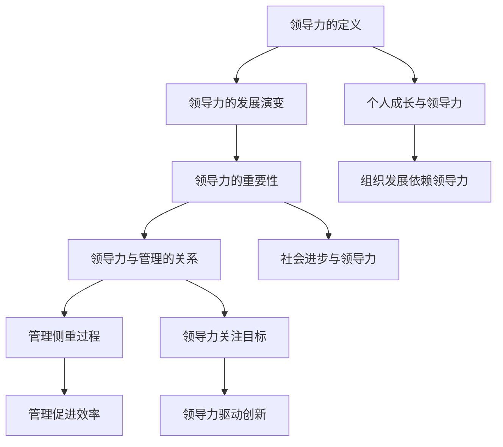

----------------------------------------------------------------

### 第2章：领导风格与个性

#### 领导风格的分类

领导风格是领导者管理行为和互动方式的总称，它直接影响团队绩效和组织文化。根据不同的分类标准，领导风格可以分为多种类型。以下是几种常见的领导风格：

1. **权力型领导**：权力型领导者强调权威和控制，他们倾向于制定明确的目标和规则，并要求下属严格遵守。这种领导风格在需要快速决策和确保执行力时尤为有效，但在激发团队创造力和自主性方面可能存在局限性。

2. **参与型领导**：参与型领导者鼓励团队成员参与决策过程，重视团队意见和反馈。这种领导风格能够增强团队成员的归属感和参与感，提高团队凝聚力和创造力，但在决策效率方面可能稍显缓慢。

3. **情境领导理论**：情境领导理论由赫赛和布兰查德提出，认为领导风格应根据团队成员的心理成熟度和工作环境的变化进行调整。情境领导理论将领导风格分为四种类型：命令型、说服型、参与型和授权型。领导者应根据团队成员的不同成熟度选择合适的领导风格，以达到最佳领导效果。

#### 领导者的个性特质

领导者的个性特质对领导风格和团队绩效具有重要影响。以下是一些关键的领导者个性特质：

1. **外向性**：外向性领导者通常积极主动，善于社交，能够激励团队成员，增强团队凝聚力。然而，过分外向可能导致忽视细节和团队合作。

2. **开放性**：开放性领导者对新观念和变化持开放态度，能够适应快速变化的环境，推动创新。然而，开放性也可能导致决策过程的复杂化和混乱。

3. **责任心**：责任心是领导者必备的特质，他们能够承担领导责任，勇于面对挑战和困难，为团队树立榜样。缺乏责任心的领导者可能导致团队信任度下降，影响团队绩效。

4. **情绪智力**：情绪智力是指领导者识别、理解和管理自身情绪，以及识别、理解和影响他人情绪的能力。高情绪智力领导者能够建立积极的人际关系，提高团队士气和绩效。

#### 领导风格对团队的影响

领导风格对团队绩效、员工满意度和组织文化具有重要影响。以下是不同领导风格对团队的影响：

1. **权力型领导**：权力型领导能够迅速做出决策，确保执行力，但在长期可能导致团队成员的被动性和创新精神的缺失。

2. **参与型领导**：参与型领导能够增强团队成员的参与感和归属感，提高团队凝聚力和创造力，但可能降低决策效率。

3. **情境领导理论**：情境领导理论强调根据团队成员的成熟度选择合适的领导风格。高成熟度团队成员更适合授权型领导，而低成熟度团队成员则更适合命令型领导。这种灵活性有助于提高团队绩效和员工满意度。

4. **综合领导风格**：综合领导风格结合了多种领导风格的优点，领导者根据不同情境和团队成员需求灵活调整领导风格。这种领导风格能够最大程度地发挥团队成员的潜力，提高团队绩效和组织文化。

#### 小结

领导风格是领导者管理行为和互动方式的总称，不同领导风格对团队绩效和组织文化产生不同的影响。领导者的个性特质也对其领导风格和团队管理产生重要影响。通过了解不同领导风格的优缺点，领导者可以根据实际情况选择合适的领导风格，以实现最佳领导效果。同时，领导者应注重培养自身个性特质，提高情绪智力，从而更好地发挥领导力在资源整合和组织发展中的作用。

#### 核心概念原理之间的关系架构（Mermaid 流�程图）

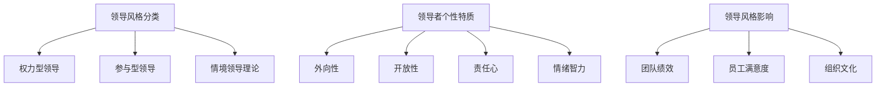

----------------------------------------------------------------

### 第3章：沟通技巧

#### 有效沟通的要素

有效沟通是领导力的核心要素之一，对于团队协作和组织发展至关重要。有效沟通不仅能够确保信息准确传递，还能够增进人际关系，提高团队凝聚力。以下是有效沟通的几个关键要素：

1. **明确的目标**：明确沟通目标是有效沟通的前提。领导者应在沟通前明确目的，确保信息传递具有针对性和目的性。

2. **清晰的表述**：清晰、简洁的表述是有效沟通的基础。领导者应避免使用模糊、含糊的语言，确保信息传递的准确性和一致性。

3. **积极倾听**：积极倾听是有效沟通的重要组成部分。领导者应主动倾听团队成员的意见和反馈，理解他们的观点和需求，从而建立互信和合作。

4. **非言语沟通**：非言语沟通包括身体语言、面部表情和语调等，它在信息传递中扮演重要角色。领导者应注重非言语沟通，通过恰当的身体语言和表情来增强信息的表达效果。

5. **反馈机制**：建立有效的反馈机制是确保沟通效果的必要手段。领导者应鼓励团队成员提供反馈，并通过反馈及时调整沟通策略，以提高沟通效果。

#### 沟通障碍与解决方法

尽管有效沟通对于团队协作和组织发展至关重要，但在实际沟通过程中，常常会遇到各种障碍。以下是几种常见的沟通障碍及解决方法：

1. **信息过载**：信息过载是导致沟通障碍的主要原因之一。解决方法包括简化信息，突出关键点，避免使用专业术语和复杂结构。

2. **文化差异**：不同文化背景的团队成员在沟通中可能存在误解和冲突。解决方法包括增强跨文化沟通培训，提高团队成员的文化敏感度，以及采用中立、客观的沟通方式。

3. **情绪因素**：情绪因素如焦虑、压力和不满等会影响沟通效果。解决方法包括建立支持性沟通环境，鼓励团队成员表达情绪，以及通过情绪管理和冲突解决技巧来缓解情绪压力。

4. **误解与偏见**：误解和偏见可能导致沟通失败。解决方法包括鼓励开放性沟通，鼓励团队成员分享观点，以及通过透明和诚实的沟通来减少误解和偏见。

#### 非言语沟通的重要性

非言语沟通在信息传递和沟通效果中具有重要作用。以下是非言语沟通的重要性：

1. **增强信息表达**：非言语沟通可以增强信息的表达效果，使信息更加生动和具体。例如，肢体语言、面部表情和语调等可以增强语气和情感的表达。

2. **传递情感和态度**：非言语沟通可以传递情感和态度，增强信息的说服力和影响力。例如，微笑、点头和鼓励性的眼神等可以传递积极的情感和态度。

3. **补充言语信息**：非言语沟通可以补充和解释言语信息，使信息更加完整和准确。例如，肢体语言可以补充言语表达中的模糊或不完整信息。

#### 小结

有效沟通是领导力的核心要素之一，对于团队协作和组织发展至关重要。有效沟通的要素包括明确的目标、清晰的表述、积极倾听、非言语沟通和反馈机制。沟通障碍如信息过载、文化差异、情绪因素和误解偏见等可以通过简化信息、增强跨文化沟通培训、情绪管理和建立开放性沟通等方式来解决。非言语沟通在信息传递和沟通效果中具有重要作用，可以增强信息表达、传递情感和态度、补充言语信息等。通过掌握和运用这些沟通技巧，领导者可以更有效地传递信息、激励团队、解决冲突，从而提升团队绩效和组织文化。

#### 核心概念原理之间的关系架构（Mermaid 流程图）

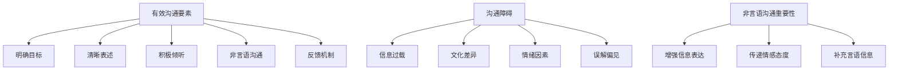

----------------------------------------------------------------

### 第4章：激励与团队管理

#### 激励理论概述

激励是领导力的重要组成部分，是激发员工积极性和工作热情的关键。激励理论为我们提供了理解和应用激励策略的基础。以下是几种主要的激励理论：

1. **马斯洛的需求层次理论**：马斯洛将人类需求分为五个层次：生理需求、安全需求、社交需求、尊重需求和自我实现需求。根据这一理论，领导者应了解员工的需求层次，并针对性地满足不同层次的需求，以激发员工的工作动力。

2. **赫茨伯格的双因素理论**：赫茨伯格将影响员工满意度的因素分为两类：激励因素和保健因素。激励因素如工作成就感、认可和晋升等可以激发员工的内在动机，而保健因素如工资、工作条件和人际关系等虽然不能直接激励员工，但缺乏这些因素会导致不满。领导者应同时关注这两类因素，以提升员工满意度。

3. **目标设定理论**：目标设定理论认为，明确、具体和具有挑战性的目标可以激发员工的工作动力。领导者应帮助员工设定合理的目标，并提供必要的支持和资源，以促进目标的实现。

#### 团队建设策略

团队建设是提升团队绩效和凝聚力的关键。以下是几种有效的团队建设策略：

1. **建立共同目标**：共同目标是团队协作的基础。领导者应确保团队成员明确共同目标，并使其与个人目标相结合，从而激发团队成员的积极性和合作意愿。

2. **增强团队沟通**：有效的沟通是团队协作的保障。领导者应建立开放、透明的沟通环境，鼓励团队成员分享意见和反馈，促进信息的流动和团队的协同工作。

3. **培养团队文化**：团队文化是团队价值观和行为的体现。领导者应倡导积极向上的团队文化，包括信任、尊重和互助等价值观，以增强团队的凝聚力和归属感。

4. **提供培训和发展机会**：培训和发展机会是提升团队成员能力和士气的重要手段。领导者应定期组织培训活动，提供职业发展路径，激发团队成员的学习兴趣和进取心。

#### 领导者在团队管理中的角色

领导者在团队管理中扮演着多重角色，包括领导者、导师、协调者和激励者。以下是领导者在团队管理中的几个关键角色：

1. **领导者**：领导者是团队的核心，负责制定团队目标和方向，并带领团队实现目标。领导者应具备战略思维和决策能力，确保团队在正确的轨道上前行。

2. **导师**：导师角色是指领导者为团队成员提供指导和支持，帮助他们解决工作中的问题和挑战。通过导师制，领导者可以培养团队成员的专业能力和领导潜力。

3. **协调者**：协调者角色是指领导者协调团队成员之间的工作关系，解决冲突和矛盾，确保团队的和谐与高效运作。

4. **激励者**：激励者角色是指领导者通过激励策略激发团队成员的工作热情和积极性，提升团队绩效。领导者应了解团队成员的需求，提供激励和支持，以激发他们的内在动机。

#### 小结

激励和团队管理是领导力的核心组成部分，对于提升团队绩效和组织发展至关重要。激励理论为我们提供了理解员工动机和需求的基础，团队建设策略则是提升团队凝聚力和协作能力的关键。领导者在团队管理中扮演着多重角色，包括领导者、导师、协调者和激励者。通过掌握和运用这些激励和团队管理策略，领导者可以更有效地激发员工的工作热情，提升团队绩效，实现组织目标。

#### 核心概念原理之间的关系架构（Mermaid 流程图）

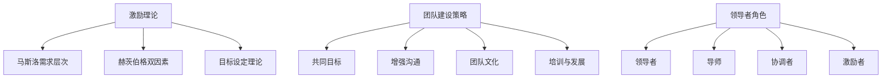

----------------------------------------------------------------

## 第二部分：资源整合策略

### 第5章：资源整合概述

#### 资源整合的定义与意义

资源整合是指将组织内外部的各种资源进行有效整合和优化，以实现组织的战略目标和最大化价值。资源整合不仅包括物质的整合，如人力资源、财务资源和物资资源的整合，还包括信息的整合和技术的整合。

资源整合在组织管理中具有重要的意义。首先，资源整合可以提高组织的竞争力。通过优化资源配置，组织可以实现资源的最优利用，提高生产效率和产品质量，从而在市场中获得竞争优势。其次，资源整合可以促进组织创新。整合不同领域和层面的资源，可以激发新的创意和解决方案，推动组织的创新和发展。最后，资源整合有助于提高组织的可持续发展能力。通过合理利用资源，减少浪费，组织可以降低运营成本，提高资源利用效率，从而实现长期可持续发展。

#### 资源整合的挑战与机遇

尽管资源整合具有明显的优势，但在实际操作中，组织常常面临一系列挑战。以下是资源整合面临的主要挑战和相应的机遇：

1. **挑战一：资源分散与协调困难**
   - **挑战**：组织内部的资源往往分散在不同部门和层级，导致资源协调困难，影响资源整合的效率。
   - **机遇**：通过建立有效的资源整合机制，如跨部门协作平台和资源共享系统，可以提高资源整合的效率，实现资源的优化配置。

2. **挑战二：信息不对称与信息滞后**
   - **挑战**：信息不对称和信息滞后是资源整合的常见问题，导致决策延误和资源浪费。
   - **机遇**：通过建立实时信息共享平台和加强信息化管理，可以提高信息的透明度和实时性，减少信息不对称和信息滞后，从而提高资源整合的效率。

3. **挑战三：资源依赖与合作关系不稳定**
   - **挑战**：资源整合往往涉及多个部门和外部合作伙伴，合作关系的不稳定可能导致资源整合的难度增加。
   - **机遇**：通过建立长期合作关系和实施合作激励机制，可以稳定合作关系，提高资源整合的稳定性。

4. **挑战四：资源浪费与资源不足**
   - **挑战**：资源浪费和资源不足是资源整合中常见的问题，影响资源的有效利用。
   - **机遇**：通过实施精益管理和优化资源配置策略，可以减少资源浪费，提高资源利用效率，同时通过合理的资源分配，解决资源不足的问题。

#### 小结

资源整合是组织管理中的重要环节，对于提升组织竞争力和实现可持续发展具有重要意义。在实际操作中，组织面临资源分散、信息不对称、合作关系不稳定和资源浪费等挑战，但通过建立有效的资源整合机制、加强信息化管理、建立长期合作关系和实施精益管理，可以克服这些挑战，实现资源的优化配置和最大化价值。通过深入理解资源整合的定义和意义，以及面临的挑战与机遇，组织可以更好地实施资源整合策略，提升整体运营效率和竞争力。

#### 核心概念原理之间的关系架构（Mermaid 流程图）

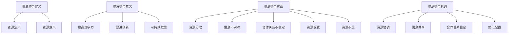

----------------------------------------------------------------

### 第6章：人力资源整合

#### 人力资源整合的策略

人力资源整合是资源整合中至关重要的一环，它涉及员工招聘、培训和发展，以及人力资源管理的整体优化。以下是人力资源整合的几个关键策略：

1. **制定明确的人力资源规划**：人力资源规划是人力资源整合的基础。领导者应明确组织的发展方向和目标，根据组织战略制定相应的人力资源规划，确保人力资源与组织发展相匹配。

2. **优化员工招聘流程**：员工招聘是人力资源整合的第一步。通过优化招聘流程，如使用先进的招聘技术、实施标准化面试流程和加强招聘团队的合作，可以提高招聘效率和质量。

3. **实施全面的员工培训和发展计划**：员工培训和发展是提升员工能力、促进员工成长的重要手段。领导者应制定全面的培训计划，包括专业技能培训、领导力培训和个人发展计划，以提升员工的综合素质和职业竞争力。

4. **建立高效的人力资源管理体系**：人力资源管理体系的建立和完善是人力资源整合的关键。领导者应优化人力资源管理流程，如员工绩效管理、薪酬管理和员工关系管理，以提高人力资源管理的效率和效果。

#### 员工培训与发展

员工培训与发展是人力资源整合的核心组成部分，对于提升员工素质和竞争力具有重要意义。以下是员工培训与发展的几个关键方面：

1. **专业技能培训**：专业技能培训是员工提升业务能力和工作效率的重要途径。领导者应根据员工的岗位职责和工作需求，制定针对性的培训计划，提供专业知识和技能的培训。

2. **领导力培训**：领导力培训是培养未来领导者的重要手段。通过领导力培训，员工可以提升领导能力、团队协作能力和决策能力，为组织发展储备优秀的领导人才。

3. **个人发展计划**：个人发展计划是员工自我提升和职业成长的重要工具。领导者应鼓励员工制定个人发展计划，并提供相应的支持和资源，帮助员工实现职业目标。

4. **培训效果评估**：培训效果评估是衡量培训质量和效果的重要手段。领导者应定期对培训效果进行评估，通过反馈和改进，不断提升培训效果。

#### 建立高效的人力资源管理体系

建立高效的人力资源管理体系是人力资源整合的关键，它涉及多个方面的优化和管理。以下是建立高效的人力资源管理体系的几个关键步骤：

1. **明确人力资源管理目标**：明确的人力资源管理目标是建立高效人力资源管理体系的前提。领导者应制定明确的人力资源管理目标，如提升员工满意度、降低离职率和提高工作效率等。

2. **优化人力资源管理流程**：优化人力资源管理流程是提升人力资源管理效率的关键。领导者应简化人力资源管理流程，消除冗余环节，提高流程的透明度和效率。

3. **实施绩效管理**：绩效管理是人力资源管理的重要组成部分。领导者应建立科学的绩效管理体系，制定明确的绩效目标和考核标准，定期对员工进行绩效评估和反馈。

4. **加强员工关系管理**：员工关系管理是维护员工满意度和组织稳定的重要手段。领导者应建立良好的员工关系管理机制，处理员工问题，提供必要的支持和帮助。

#### 小结

人力资源整合是资源整合中至关重要的一环，涉及员工招聘、培训和发展，以及人力资源管理的整体优化。通过制定明确的人力资源规划、优化员工招聘流程、实施全面的员工培训和发展计划，以及建立高效的人力资源管理体系，组织可以提升员工素质和竞争力，实现人力资源的优化配置和最大化价值。通过深入理解和实施人力资源整合策略，组织可以更好地应对市场变化，实现可持续发展。

#### 核心概念原理之间的关系架构（Mermaid 流程图）

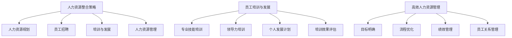

----------------------------------------------------------------

### 第7章：财务资源整合

#### 财务资源整合的原理

财务资源整合是指将组织内部的财务资源进行优化配置，以实现资源的最大化利用和效益的最大化。财务资源整合的原理包括以下几个方面：

1. **资金筹集与分配**：财务资源整合的首要任务是筹集资金，并对其进行有效分配。领导者应制定科学的资金筹集策略，包括内部融资和外部融资，确保组织在必要时能够获得足够的资金支持。同时，资金筹集后，应按照组织的战略目标和财务计划，对资金进行合理分配，确保各项业务活动的资金需求得到满足。

2. **成本控制与预算管理**：成本控制是财务资源整合的核心内容之一。领导者应建立完善的成本控制体系，通过精细化管理和成本分析，识别和降低不必要的成本支出，提高资源的利用效率。此外，预算管理是确保成本控制在预算范围内的重要手段。领导者应制定详细的预算计划，并对预算执行进行严格监控和调整，确保预算目标的实现。

3. **资金筹集与风险控制**：资金筹集不仅需要关注资金的来源和规模，还需要关注资金筹集过程中的风险。领导者应评估不同资金筹集方式的优缺点和潜在风险，选择合适的资金筹集方式，以降低资金筹集过程中的风险。同时，建立风险控制机制，对资金筹集和运用过程中的风险进行监控和应对，确保财务资源的安全和稳定。

4. **资金筹集与投资策略**：财务资源整合不仅涉及资金的筹集和分配，还包括资金的投资。领导者应制定科学的投资策略，根据组织的战略目标和市场状况，选择合适的投资项目，以实现资金的保值增值。同时，投资策略的制定应考虑投资风险和收益的平衡，确保投资决策的科学性和合理性。

#### 成本控制与预算管理

成本控制和预算管理是财务资源整合的重要手段，对于提高资源利用效率和实现财务目标至关重要。以下是成本控制和预算管理的几个关键方面：

1. **成本分析**：成本分析是成本控制的基础。领导者应定期对各项成本进行分析，识别成本构成和成本驱动因素，找出成本高出的原因，制定针对性的成本控制措施。

2. **成本控制措施**：根据成本分析的结果，领导者应采取有效的成本控制措施，如优化生产流程、降低原材料消耗、提高设备利用率等，以降低成本支出。

3. **预算编制**：预算编制是预算管理的第一步。领导者应根据组织的战略目标和业务计划，制定详细的预算计划，包括收入预算、支出预算和现金流量预算等，确保预算计划与组织目标一致。

4. **预算执行与监控**：预算执行是预算管理的核心。领导者应建立预算执行监控机制，定期对预算执行情况进行跟踪和分析，及时发现和解决预算执行中的问题，确保预算目标的实现。

5. **预算调整与控制**：预算调整是根据预算执行情况和市场变化，对预算计划进行必要的调整。领导者应根据实际情况，灵活调整预算计划，确保预算目标的实现。

#### 资金筹集与风险控制

资金筹集和风险控制是财务资源整合的重要组成部分，对于组织的财务稳定和可持续发展具有重要意义。以下是资金筹集和风险控制的几个关键方面：

1. **资金筹集方式**：资金筹集方式包括内部融资和外部融资。内部融资主要依靠组织自身的积累和利润留存，外部融资则包括银行贷款、发行债券、股权融资等。领导者应根据组织的实际情况和资金需求，选择合适的资金筹集方式。

2. **资金筹集风险**：资金筹集过程中存在多种风险，如利率风险、信用风险、市场风险等。领导者应评估不同资金筹集方式的风险，制定相应的风险管理策略，降低资金筹集过程中的风险。

3. **风险控制机制**：建立有效的风险控制机制是确保财务资源安全的重要手段。领导者应建立风险识别、评估、监控和应对机制，对资金筹集和运用过程中的风险进行全程监控和应对。

4. **风险应对策略**：针对不同的风险类型，领导者应制定相应的风险应对策略，如风险规避、风险转移、风险分散等，以降低风险对组织的负面影响。

#### 小结

财务资源整合是组织资源整合的关键环节，对于提高资源利用效率和实现财务目标至关重要。财务资源整合的原理包括资金筹集与分配、成本控制与预算管理、资金筹集与投资策略等方面。通过实施科学的财务资源整合策略，组织可以优化资源配置，降低成本，提高财务效益，实现可持续发展。同时，组织应重视成本控制和风险控制，确保财务资源的安全和稳定。

#### 核心概念原理之间的关系架构（Mermaid 流程图）

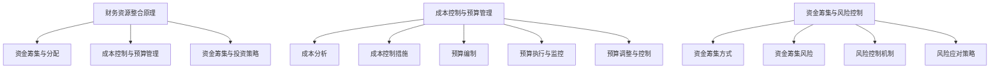

----------------------------------------------------------------

### 第8章：物资资源整合

#### 物资资源整合的途径

物资资源整合是优化组织物资管理、提高物资利用效率的重要手段。以下是物资资源整合的几个主要途径：

1. **库存管理策略**：库存管理是物资资源整合的核心。通过科学的库存管理策略，如定期盘点、库存分析、ABC分类法等，可以降低库存成本，减少库存积压，提高物资周转率。

2. **供应链管理**：供应链管理是物资资源整合的重要组成部分。通过优化供应链流程，如采购、运输、仓储和配送等，可以提高供应链的效率和灵活性，降低供应链成本。

3. **物资采购优化**：物资采购是物资资源整合的关键环节。通过实施集中采购、招标采购、采购比价等策略，可以降低采购成本，提高采购质量，确保物资供应的稳定性和可靠性。

4. **物资使用优化**：物资使用优化是提高物资利用效率的重要手段。通过制定物资使用标准、实施节能减排措施、推广循环利用等策略，可以减少物资浪费，提高物资使用效益。

#### 库存管理策略

库存管理策略是物资资源整合的重要组成部分，直接影响组织的成本和效率。以下是库存管理的几个关键策略：

1. **定期盘点**：定期盘点是确保库存准确性的关键。通过定期盘点，可以及时发现库存偏差，纠正库存数据，为库存管理提供准确的依据。

2. **库存分析**：库存分析是优化库存管理的重要手段。通过分析库存数据，如库存周转率、库存积压率、库存资金占用率等，可以识别库存问题和优化库存管理策略。

3. **ABC分类法**：ABC分类法是库存管理的重要工具。通过将库存物资按照重要程度和库存金额进行分类，可以区分出关键物资和次要物资，采取差异化的库存管理策略，提高库存管理效率。

4. **库存资金管理**：库存资金管理是确保库存资金合理使用的关键。通过制定库存资金预算、优化库存资金周转、降低库存资金占用等策略，可以降低库存成本，提高资金使用效率。

#### 物流与供应链管理

物流与供应链管理是物资资源整合的重要组成部分，直接影响组织的物资流通效率和成本。以下是物流与供应链管理的几个关键方面：

1. **物流管理**：物流管理是确保物资在组织内部和外部高效流动的重要环节。通过优化物流流程、提高物流效率、降低物流成本等策略，可以提高组织的物流管理水平。

2. **供应链协同**：供应链协同是提高供应链效率和竞争力的关键。通过加强供应链上下游企业之间的信息共享、资源整合、合作共赢等策略，可以构建高效的供应链体系，提高供应链整体竞争力。

3. **供应链风险管理**：供应链风险管理是确保供应链稳定和安全的重要手段。通过识别和评估供应链风险、制定风险管理策略、建立风险预警机制等，可以降低供应链风险，确保供应链的稳定运行。

4. **供应链创新**：供应链创新是提高供应链效率和竞争力的关键。通过引入新技术、新模式、新理念等，可以推动供应链的创新发展，提高供应链的整体竞争力。

#### 小结

物资资源整合是优化组织物资管理、提高物资利用效率的重要手段。通过实施库存管理策略、优化物流与供应链管理，组织可以降低库存成本、提高物资周转率、提高物流效率，从而实现物资资源的优化配置和最大化利用。通过深入理解和实施物资资源整合策略，组织可以更好地应对市场变化，提高整体运营效率和竞争力。

#### 核心概念原理之间的关系架构（Mermaid 流程图）

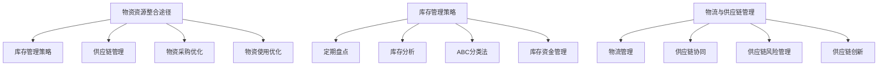

----------------------------------------------------------------

### 第9章：资源配置原则

#### 资源配置的基本原则

资源配置是组织管理中的一项核心任务，旨在确保资源得到最优利用，以实现组织的战略目标和最大化效益。以下是资源配置的几个基本原则：

1. **目标导向**：资源配置应始终围绕组织的战略目标和业务需求进行。在制定资源配置计划时，领导者应明确组织的长远目标和短期目标，确保资源配置与目标的一致性。

2. **效率优先**：效率是资源配置的核心原则之一。领导者应通过科学合理的资源配置，最大限度地提高资源的使用效率，减少浪费，降低运营成本。

3. **公平合理**：资源配置应在公平和合理的原则下进行。领导者应确保资源配置过程中公平对待所有部门和团队成员，避免资源分配不均或偏袒现象，以提高组织的凝聚力和团队士气。

4. **动态调整**：资源配置是一个动态调整的过程。领导者应根据组织内外部环境的变化，及时调整资源配置策略，以适应新的情况和挑战。

#### 资源配置的优先级

在资源配置过程中，确定合理的优先级是确保资源配置效果的关键。以下是资源配置的几个优先级：

1. **关键业务优先**：关键业务是组织生存和发展的基石。在资源配置时，领导者应优先确保关键业务所需的资源得到充分保障，以支持组织的核心业务运作。

2. **人才培养优先**：人才是组织最宝贵的资源。在资源配置时，领导者应优先考虑人才培养和发展的需求，提供必要的培训和发展机会，以提高员工的能力和素质。

3. **创新研发优先**：创新研发是组织保持竞争优势的重要手段。在资源配置时，领导者应优先考虑创新研发项目的资源需求，确保研发活动的顺利进行。

4. **成本控制优先**：成本控制是提高组织效率和效益的重要措施。在资源配置时，领导者应优先考虑成本控制和优化，通过合理的资源配置降低运营成本。

#### 小结

资源配置是组织管理中的一项核心任务，其基本原则包括目标导向、效率优先、公平合理和动态调整。在资源配置过程中，确定合理的优先级是确保资源配置效果的关键。领导者应根据组织的战略目标和业务需求，合理分配资源，确保关键业务、人才培养、创新研发和成本控制等方面得到优先保障。通过科学合理的资源配置策略，组织可以最大限度地发挥资源效用，实现组织的目标和效益最大化。

#### 核心概念原理之间的关系架构（Mermaid 流程图）

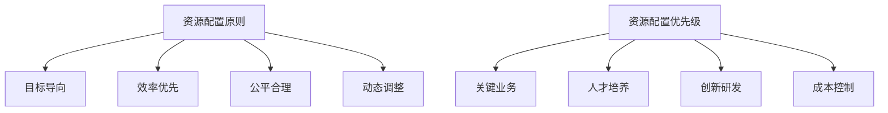

----------------------------------------------------------------

### 第10章：资源配置方法

#### 成本效益分析法

成本效益分析（Cost-Benefit Analysis，CBA）是资源配置中常用的一种方法，旨在通过比较项目或活动的成本与预期效益，评估其经济合理性。以下是成本效益分析法的具体步骤和注意事项：

1. **确定分析范围**：首先，明确分析的项目或活动的范围，包括项目的主要目标和预期效益。

2. **识别成本和效益**：识别项目或活动的所有相关成本和效益，包括直接成本和间接成本、直接效益和间接效益。

   - **直接成本**：如原材料成本、人工成本、设备成本等。
   - **间接成本**：如机会成本、环境影响成本等。
   - **直接效益**：如销售收入、利润增长等。
   - **间接效益**：如社会效益、品牌提升等。

3. **量化成本和效益**：将识别出的成本和效益进行量化，通常使用货币单位表示。

4. **计算净现值（NPV）**：净现值是衡量项目经济效益的重要指标，计算公式为：

   $$ NPV = \sum \left( \frac{C_t}{(1+r)^t} \right) - \sum \left( \frac{B_t}{(1+r)^t} \right) $$

   其中，$C_t$表示第$t$年的成本，$B_t$表示第$t$年的效益，$r$表示折现率。

5. **比较成本与效益**：通过计算净现值，比较项目或活动的总成本与总效益，判断其经济合理性。

6. **注意事项**：
   - **合理性假设**：在成本效益分析中，需要进行合理的假设，如收益的时间分布、成本的稳定性等。
   - **数据准确性**：确保成本和效益数据的准确性，避免因数据误差导致分析结果失真。
   - **敏感性分析**：进行敏感性分析，评估不同因素变化对成本效益分析结果的影响，以提高决策的稳健性。

#### 资源平衡法

资源平衡法（Resource Levelling）是一种用于优化资源分配，避免资源短缺或过剩的方法。以下是资源平衡法的具体步骤和应用场景：

1. **识别资源需求**：首先，确定项目或活动中所需的各种资源，如人力、设备、原材料等。

2. **编制资源计划**：根据项目进度和资源需求，编制详细的资源计划，包括资源的使用时间和数量。

3. **分析资源平衡情况**：通过分析资源计划，识别资源分配中的不平衡情况，如资源高峰期与低谷期的差异。

4. **调整资源分配**：根据资源平衡情况，调整资源分配计划，以实现资源的最优利用。

5. **应用场景**：
   - **项目规划**：在项目规划和执行过程中，通过资源平衡法确保项目资源的合理分配，避免资源短缺或过剩。
   - **生产调度**：在生产调度中，通过资源平衡法优化生产计划，确保生产资源的高效利用。
   - **人力资源配置**：在人力资源管理中，通过资源平衡法优化员工调配，提高人力资源的使用效率。

#### 线性规划法

线性规划法（Linear Programming，LP）是一种基于数学优化原理的资源配置方法，旨在在满足一系列约束条件下，最大化或最小化目标函数。以下是线性规划法的基本原理和应用步骤：

1. **建立线性规划模型**：首先，根据资源配置问题，建立线性规划模型，包括目标函数和约束条件。

   - **目标函数**：通常表示为最大化或最小化的目标，如最大化利润、最小化成本等。
   - **约束条件**：表示资源限制、生产能力、市场需求等约束条件。

2. **求解线性规划模型**：使用数学方法（如单纯形法、图解法等）求解线性规划模型，找到最优解。

3. **应用线性规划法**：
   - **资源优化配置**：通过线性规划法，优化资源分配，确保资源的最优利用。
   - **生产计划**：在生产计划中，通过线性规划法优化生产决策，提高生产效率。
   - **投资组合优化**：在投资组合管理中，通过线性规划法优化投资决策，提高投资收益。

#### 小结

资源配置方法包括成本效益分析法、资源平衡法和线性规划法等，每种方法都有其特定的适用场景和优势。成本效益分析法通过比较成本与效益，评估资源配置的经济合理性；资源平衡法通过优化资源分配，避免资源短缺或过剩；线性规划法基于数学优化原理，用于解决资源优化配置问题。领导者应根据组织的实际需求和资源状况，选择合适的方法进行资源配置，以实现资源的最优利用和最大化效益。

#### 核心概念原理之间的关系架构（Mermaid 流程图）

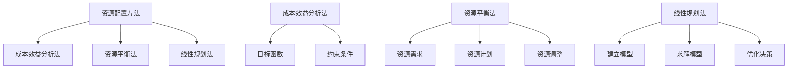

----------------------------------------------------------------

### 第11章：资源配置实践

#### 实际案例介绍

为了更好地理解资源配置的具体实践，我们来看一个实际案例——某电子商务公司的人力资源整合与优化。

**背景**：该电子商务公司正处于快速发展阶段，业务量大幅增加，对人力资源的需求也随之上升。然而，公司在人力资源配置方面存在一些问题，如员工招聘周期长、培训计划不完善、员工流动性高等。为了解决这些问题，公司决定进行人力资源整合与优化。

**目标**：通过人力资源整合，提高招聘效率、优化员工培训、降低员工流失率，从而提升公司整体运营效率和竞争力。

**实施步骤**：

1. **人力资源规划**：公司首先对业务发展进行了详细分析，预测未来的人才需求，并根据需求制定了人力资源规划。

2. **招聘流程优化**：公司引入了先进的招聘技术，如在线招聘平台和人工智能面试系统，简化了招聘流程，提高了招聘效率。

3. **员工培训与发展**：公司制定了全面的员工培训计划，包括专业技能培训、领导力培训和职业发展指导，以提升员工能力。

4. **绩效管理与激励**：公司实施了绩效管理机制，通过定期的绩效评估和反馈，激励员工发挥最大潜力，并设立了相应的激励机制，如绩效奖金和晋升机会。

#### 配置优化的具体步骤

1. **需求分析**：首先，公司对各部门的人力资源需求进行了详细分析，包括员工数量、岗位类型、技能需求等。

2. **资源现状评估**：公司对现有的人力资源状况进行了全面评估，包括员工的能力、绩效和流动情况。

3. **制定优化方案**：根据需求分析和现状评估，公司制定了具体的人力资源优化方案，包括招聘策略、培训计划、绩效管理等。

4. **实施与监控**：公司按照优化方案逐步实施，并对实施过程进行监控和调整，确保方案的落地和效果。

#### 配置优化的效果评估

1. **招聘效率提升**：通过优化招聘流程，公司招聘周期从原来的2个月缩短至1个月，招聘成本降低了15%。

2. **员工满意度提高**：员工培训计划的实施提升了员工的技能和职业素养，员工满意度提高了20%。

3. **流失率降低**：通过实施绩效管理和激励机制，员工流失率降低了10%，员工对公司的忠诚度提高。

4. **整体运营效率提升**：人力资源优化措施的实施，提高了公司的整体运营效率，业务量同比增长了15%。

#### 小结

通过实际案例可以看出，资源配置优化需要结合组织的实际需求，制定详细的优化方案，并逐步实施和监控。通过优化人力资源配置，公司不仅提高了招聘效率和员工满意度，还降低了流失率，提升了整体运营效率。这一案例表明，科学合理的资源配置是组织发展的重要保障，领导者应高度重视资源配置优化，以实现组织的长远发展。

#### 核心概念原理之间的关系架构（Mermaid 流程图）

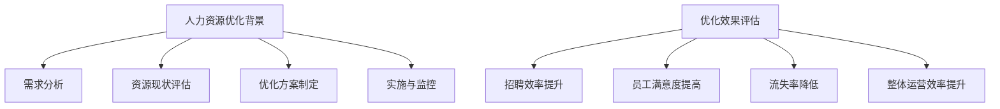

----------------------------------------------------------------

### 第12章：资源整合与领导力之间的关系

#### 领导力在资源整合中的作用

领导力在资源整合中起着至关重要的作用，它不仅是资源配置的关键驱动力，也是实现资源最大化价值的关键要素。以下是领导力在资源整合中发挥的关键作用：

1. **战略规划与决策**：领导者通过制定明确的战略规划和决策，指导资源整合的方向和目标。战略规划有助于确保资源整合与组织的整体战略目标保持一致，从而实现资源的优化配置。

2. **协调与沟通**：领导者在资源整合过程中扮演着协调者和沟通者的角色。通过有效的沟通和协调，领导者能够确保各部门和团队之间资源的高效流动和协作，减少资源浪费和冲突。

3. **激励与团队建设**：领导者通过激励和团队建设，提升员工的积极性和创造力，从而提高资源整合的效果。激励措施和团队建设活动有助于增强员工的归属感和责任感，提高资源整合的执行力和效果。

4. **变革管理**：在资源整合过程中，领导力在推动组织变革方面发挥着重要作用。领导者通过引导和激励团队成员接受变革，克服变革中的阻力和挑战，推动资源整合的顺利进行。

#### 资源整合对领导力的影响

资源整合不仅受到领导力的影响，同时也对领导力产生重要影响。以下是资源整合对领导力的几个关键影响：

1. **领导者的角色转变**：资源整合要求领导者从传统的控制者和管理者转变为变革推动者和资源整合者。领导者需要具备更广泛的管理视野和技能，以适应资源整合带来的新挑战。

2. **领导力的复杂性增加**：资源整合涉及多个部门和团队的合作，领导力需要处理复杂的人际关系和组织动态。领导者需要具备更高的情商和沟通能力，以应对资源整合过程中的复杂情况。

3. **领导力的持续发展**：资源整合强调持续改进和创新，要求领导者具备持续学习和自我发展的能力。领导者需要不断更新知识和技能，以适应资源整合带来的新变化。

4. **跨部门合作与领导**：资源整合要求领导者具备跨部门合作的领导能力，能够协调不同部门和团队之间的利益和目标。领导者需要建立有效的跨部门沟通和协作机制，推动资源的共享和整合。

#### 小结

资源整合与领导力之间存在着密切的关系，领导力在资源整合中发挥着关键作用，而资源整合也对领导力产生重要影响。通过有效的领导力，领导者可以推动资源的优化配置和最大化价值，实现组织的战略目标。同时，资源整合也要求领导者不断适应新的挑战和变化，提升领导力和管理能力，以应对复杂多变的环境。通过深入理解和实施有效的领导力和资源整合策略，组织可以更有效地应对市场变化，提高竞争力和实现可持续发展。

#### 核心概念原理之间的关系架构（Mermaid 流程图）

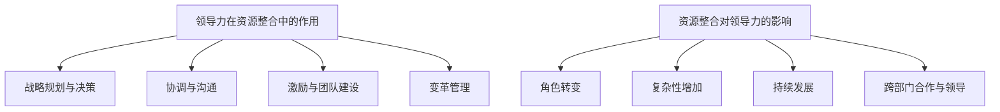

----------------------------------------------------------------

### 第13章：提升资源整合能力的领导策略

#### 提升领导力的方法

为了提升资源整合能力，领导者需要从多个方面进行自我提升。以下是几种有效提升领导力的方法：

1. **不断学习和自我提升**：领导者应具备持续学习的意识，通过阅读书籍、参加培训课程、参与研讨会等方式，不断更新知识和技能。自我提升是领导者不断提升领导力的关键。

2. **培养情商和沟通能力**：情商和沟通能力是领导者必备的素质。领导者需要具备良好的自我认知和情绪管理能力，以及有效的沟通技巧，以建立良好的人际关系和团队合作。

3. **实践和反思**：领导力不仅需要理论知识，更需要实践验证。领导者应在实际工作中不断尝试和实践，通过反思和总结经验，不断提升领导力。

4. **建立信任和尊重**：信任和尊重是团队协作和资源整合的基础。领导者应通过正直和诚信的行为建立信任，并通过尊重和支持团队成员，提高团队的凝聚力和工作效率。

#### 提升资源配置效率的策略

提升资源配置效率是领导者的核心任务之一。以下是几种提升资源配置效率的策略：

1. **优化决策流程**：简化决策流程，减少冗余环节，提高决策效率。领导者应明确决策权限和责任，确保决策过程透明、高效。

2. **实施精益管理**：通过精益管理方法，消除浪费，提高资源利用效率。精益管理强调流程优化、成本控制和持续改进，是提升资源配置效率的有效手段。

3. **建立绩效指标**：制定明确的绩效指标，对资源配置效果进行评估和监控。绩效指标应与组织目标一致，通过数据驱动决策，提高资源配置的精准度。

4. **跨部门协作**：加强跨部门协作，打破部门壁垒，实现资源的高效流动和整合。领导者应建立跨部门协作机制，促进信息共享和资源协同。

#### 提升领导力的方法

提升领导力是领导者长期追求的目标，以下是一些建议和方法：

1. **阅读和学习**：领导者应广泛阅读领导力相关书籍和资料，学习先进的领导理念和实践经验。

2. **参与培训**：参加专业的领导力培训课程，学习领导力理论和实践技巧。

3. **实践和反思**：在实际工作中不断实践领导力理论，通过反思和总结经验，不断提升领导力。

4. **培养情商和沟通能力**：通过练习和培训，提升情商和沟通能力，建立良好的人际关系。

5. **建立导师制度**：寻找导师指导，获得专业的领导力指导和建议。

#### 提升资源配置效率的策略

提升资源配置效率是领导者的重要任务，以下是一些建议和策略：

1. **优化决策流程**：简化决策流程，减少冗余环节，提高决策效率。

2. **实施精益管理**：通过精益管理方法，消除浪费，提高资源利用效率。

3. **建立绩效指标**：制定明确的绩效指标，对资源配置效果进行评估和监控。

4. **跨部门协作**：加强跨部门协作，打破部门壁垒，实现资源的高效流动和整合。

5. **信息化管理**：利用信息技术手段，提高资源配置的透明度和实时性。

#### 小结

提升资源整合能力是领导者的重要任务，通过提升领导力和资源配置效率，领导者可以更有效地推动组织的资源整合和创新发展。领导者应通过不断学习和自我提升，培养情商和沟通能力，建立信任和尊重，同时优化决策流程、实施精益管理、建立绩效指标和跨部门协作，以提高资源配置效率。通过实施有效的领导策略和资源配置策略，领导者可以推动组织的持续发展，实现资源整合的最大化价值。

#### 核心概念原理之间的关系架构（Mermaid 流程图）

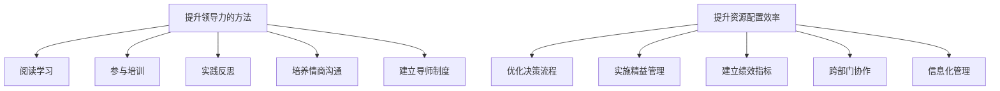

----------------------------------------------------------------

### 第14章：资源整合与可持续发展

#### 可持续发展的概念

可持续发展是指满足当前需求而不损害后代满足自身需求的能力。它强调经济、社会和环境的协调发展，旨在实现长期稳定和繁荣。可持续发展不仅是全球发展的主题，也是企业和社会组织必须面对的重要挑战。

#### 资源整合与可持续发展之间的关系

资源整合与可持续发展密切相关。有效的资源整合可以优化资源配置，提高资源利用效率，减少浪费，从而支持可持续发展目标的实现。以下是资源整合与可持续发展之间的几个关键关系：

1. **优化资源利用**：通过资源整合，组织可以更有效地利用现有资源，减少资源浪费，提高资源利用效率，支持可持续发展。

2. **降低环境影响**：资源整合有助于降低资源消耗和废弃物排放，减少对环境的负面影响，促进环境保护和可持续发展。

3. **促进经济繁荣**：有效的资源整合可以提高生产效率和创新能力，推动经济发展，为可持续发展提供物质基础。

4. **支持社会公平**：资源整合可以优化资源分配，减少贫富差距，促进社会公平和可持续发展。

#### 实现可持续发展的策略

为了实现可持续发展，组织需要采取一系列策略，以下是一些建议：

1. **制定可持续发展战略**：组织应制定明确的可持续发展战略，将可持续发展目标纳入整体战略规划。

2. **优化资源配置**：通过优化资源配置，提高资源利用效率，减少浪费，支持可持续发展。

3. **实施绿色管理**：推动绿色管理，减少资源消耗和废弃物排放，降低环境影响。

4. **推广循环经济**：通过推广循环经济模式，实现资源的再生利用，降低资源消耗。

5. **加强社会责任**：承担社会责任，支持社区发展，促进社会公平和可持续发展。

6. **提升创新能力**：通过创新，推动技术进步和产品优化，提高可持续发展能力。

#### 小结

资源整合与可持续发展密切相关，通过优化资源配置、降低环境影响、促进经济繁荣和支持社会公平，资源整合可以为可持续发展提供有力支持。为了实现可持续发展，组织需要制定明确的可持续发展战略，实施绿色管理，推广循环经济，加强社会责任，并提升创新能力。通过实施有效的可持续发展策略，组织可以更好地应对未来挑战，实现长期稳定和繁荣。

#### 核心概念原理之间的关系架构（Mermaid 流程图）

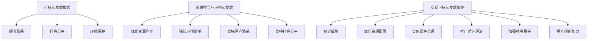

----------------------------------------------------------------

## 附录

### 参考文献

1.马斯洛，A.H. (1943). 《人类动机的理论》. New York: Oxford University Press.
2.赫茨伯格，F. (1959). 《工作的激励因素》. Chicago: University of Chicago Press.
3.波诺，E. (1990). 《第五项修炼：学习型组织的艺术与实务》. New York: Addison-Wesley.
4.彼得·德鲁克，P.F. (1999). 《管理实践》. New York: HarperCollins.

### 相关资源链接

- 领导力与资源整合实践：[《哈佛商业评论》](https://hbr.org/)
- 人力资源整合最佳实践：[《麦肯锡公司》](https://www.mckinsey.com/)
- 财务资源整合策略：[《华尔街日报》](https://www.wsj.com/)
- 物资资源整合案例：[《物流与供应链管理杂志》](https://www.lsmjournal.com/)
- 持续发展研究：[《联合国可持续发展解决方案网络》](https://sustainabledevelopment.un.org/)
- 成本效益分析工具：[《Cost-Benefit Analysis Guide》](https://www.treasury.gov/content/cba)
- 创新管理资源：[《创新与创业管理》](https://icmrindia.org/)
- 领导力培训课程：[《领导力发展学院》](https://www.leadertoleader.com/)

### 作者信息

作者：AI天才研究院/AI Genius Institute & 禅与计算机程序设计艺术 /Zen And The Art of Computer Programming

本文由AI天才研究院/AI Genius Institute和禅与计算机程序设计艺术/Zen And The Art of Computer Programming共同撰写，旨在探讨领导力与资源整合的优化策略，为组织发展提供实践指导和理论支持。两位作者在计算机科学、人工智能和领导力领域具有丰富的经验和深厚的理论基础，致力于推动技术创新和知识传播。本文的核心观点和研究成果将为读者提供有益的启示和参考。

