                 

### 文章标题

《领导力与远见卓识：制定战略规划的能力》

> 关键词：领导力、远见卓识、战略规划、决策能力、沟通能力、创新能力

> 摘要：本文将深入探讨领导力与远见卓识在制定战略规划中的重要性，通过剖析核心概念、逻辑关系和实践案例，帮助读者理解并掌握如何通过领导力提升远见卓识，从而制定出有效的战略规划。

----------------------------------------------------------------

### 引言

在当今快速变化且竞争激烈的商业环境中，领导力和远见卓识成为了企业和组织成功的关键因素。领导力不仅仅是指导团队达成目标的能力，更是能够在复杂多变的环境中预见趋势、制定战略、引领变革的核心素质。而远见卓识则是指领导者具备的远见和洞察力，能够在纷繁复杂的信息中看到事物的本质和未来的发展方向。

本文将围绕领导力与远见卓识这一主题，探讨其在制定战略规划中的重要性。通过分析这两个概念的定义、内涵及其相互关系，我们将深入探讨如何通过提升领导力来增强远见卓识，从而制定出更具前瞻性和可行性的战略规划。此外，本文还将结合实际案例，展示领导力与远见卓识在战略规划中的具体应用，为读者提供实用的指导和建议。

本文结构如下：

1. 领导力概述
2. 远见卓识
3. 战略规划
4. 实战案例
5. 总结与展望

通过本文的阅读，读者将能够全面理解领导力与远见卓识在战略规划中的重要性，掌握提升这些能力的方法和技巧，为企业的长期发展奠定坚实基础。

----------------------------------------------------------------

### 1. 设计书籍的目录结构

首先，我们需要设计一个逻辑清晰、条理分明的目录结构。根据书籍的主题“领导力与远见卓识：制定战略规划的能力”，我们将目录结构分为以下几个主要部分：

- 引言
- 领导力概述
  - 领导力的定义与核心要素
  - 领导力的发展历程
  - 领导力的心理学基础
- 远见卓识
  - 远见卓识的概念与内涵
  - 远见卓识与战略思维的关系
  - 培养远见卓识的方法
- 战略规划
  - 战略规划的定义与过程
  - 战略规划的方法与工具
  - 战略规划的实施与评估
- 实战案例
  - 国内成功战略规划案例分享
  - 国际成功战略规划案例分享
  - 案例分析与启示
- 总结与展望
  - 总结本书的核心观点
  - 对未来领导力与战略规划的展望

#### 引言

在本书的引言部分，我们将首先介绍领导力与远见卓识在当今商业环境中的重要性和必要性。随着全球化和技术变革的加速，企业面临的挑战和机遇前所未有，领导者需要具备更高的战略视野和决策能力，才能在激烈的市场竞争中脱颖而出。因此，领导力和远见卓识成为了企业和组织成功的关键因素。

接下来，我们将简要回顾领导力与远见卓识的发展历程，分析其核心概念和内涵。在此基础上，我们将明确本书的研究目的和结构安排，为后续章节的内容奠定基础。

#### 领导力概述

在第二部分“领导力概述”中，我们将深入探讨领导力的定义与核心要素。领导力不仅仅是指导团队达成目标的能力，更是一种在复杂多变的环境中激发团队潜能、引领变革的核心素质。我们将从多个角度定义领导力，并分析其核心要素，如决策能力、沟通能力、创新能力等。

此外，我们还将回顾领导力的发展历程，从早期的领导理论到现代的领导力模型，了解不同时期领导力观念的演变和演进。最后，我们将探讨领导力的心理学基础，分析领导行为与心理机制之间的关系，为读者提供更为全面的领导力认识。

#### 远见卓识

在第三部分“远见卓识”中，我们将探讨远见卓识的概念与内涵。远见卓识是指领导者具备的远见和洞察力，能够在纷繁复杂的信息中看到事物的本质和未来的发展方向。我们将从多个层面分析远见卓识的内涵，如战略思维、预见能力、风险评估等。

接下来，我们将探讨远见卓识与战略思维的关系。战略思维是领导者进行决策和规划的重要工具，而远见卓识则是战略思维的核心要素。我们将分析战略思维的基本原理和方法，并探讨如何通过提升远见卓识来增强战略思维。

最后，我们将介绍培养远见卓识的方法，包括个人修炼、团队建设、信息收集与分析等。通过这些方法，领导者可以不断提升自己的远见卓识，为企业的长期发展奠定坚实基础。

#### 战略规划

在第四部分“战略规划”中，我们将深入探讨战略规划的定义与过程。战略规划是组织为了实现长期目标而制定的一系列战略决策和行动方案。我们将从宏观和微观两个层面分析战略规划的核心内容和关键环节。

首先，我们将介绍战略规划的定义和目的，明确战略规划在组织管理中的重要作用。接着，我们将详细阐述战略规划的过程，包括战略分析、战略选择和战略实施等环节。在此过程中，我们将结合实际案例，分析战略规划中的关键问题和方法。

#### 实战案例

在第五部分“实战案例”中，我们将通过国内外成功战略规划案例，展示领导力与远见卓识在战略规划中的具体应用。我们将选取具有代表性的企业案例，如阿里巴巴、华为等，分析其战略规划的成功经验，为读者提供实用的参考。

此外，我们还将结合案例，分析战略规划中的常见问题和解决方法。通过这些实战案例，读者可以更深入地理解领导力与远见卓识在战略规划中的重要性，并学会如何在实际工作中应用这些理念。

#### 总结与展望

在第六部分“总结与展望”中，我们将对本书的核心观点进行总结，强调领导力与远见卓识在制定战略规划中的关键作用。同时，我们将探讨未来领导力与战略规划的发展趋势，为企业和组织的发展提供前瞻性建议。

最后，我们将展望领导力与远见卓识在战略规划领域的未来研究方向，鼓励读者在学习和实践中不断探索和创新，为组织的发展贡献自己的智慧和力量。

通过本书的阅读，读者将全面了解领导力与远见卓识在制定战略规划中的重要性，掌握提升这些能力的方法和技巧，为企业的长期发展奠定坚实基础。

---

### 2. 确定各章节的主要内容

在确定书籍的目录结构后，我们需要进一步细化每个章节的内容，确保每个部分都能够为读者提供有价值的信息。以下是对各章节主要内容的详细描述：

#### 引言

**引言**部分旨在为读者提供背景信息，阐述领导力与远见卓识在当今商业环境中的重要性和必要性。具体内容如下：

- **领导力与远见卓识的重要性**：介绍领导力与远见卓识在现代社会中的角色，如如何帮助企业应对复杂多变的市场环境、推动企业创新和发展等。
- **本书的目的和结构**：明确本书的研究目的，介绍书籍的结构和内容安排，帮助读者了解书中的各个部分及其相互关系。

#### 领导力概述

**领导力概述**部分将深入探讨领导力的定义、核心要素及其发展历程。具体内容如下：

- **领导力的定义与核心要素**：从多个角度定义领导力，分析其核心要素，如决策能力、沟通能力、创新能力等。通过具体案例，展示这些要素在领导实践中的应用。
- **领导力的发展历程**：回顾领导力理论的发展历程，从早期的领导理论到现代的领导力模型，分析不同时期领导力观念的演变和演进。
- **领导力的心理学基础**：探讨领导行为与心理机制之间的关系，分析领导者的心理素质和个性特征对其领导行为的影响。

#### 远见卓识

**远见卓识**部分将探讨远见卓识的概念与内涵，分析其与战略思维的关系，并介绍培养远见卓识的方法。具体内容如下：

- **远见卓识的概念与内涵**：介绍远见卓识的定义，分析其内涵，如预见能力、战略思维、风险评估等。通过具体案例，展示远见卓识在实际中的应用。
- **远见卓识与战略思维的关系**：探讨远见卓识与战略思维之间的联系，分析战略思维在远见卓识中的重要作用。通过具体案例，展示如何通过战略思维提升远见卓识。
- **培养远见卓识的方法**：介绍培养远见卓识的方法，如个人修炼、团队建设、信息收集与分析等。通过具体案例，展示这些方法在实际中的应用效果。

#### 战略规划

**战略规划**部分将详细探讨战略规划的定义与过程，分析战略规划的方法与工具，并介绍战略规划的实施与评估。具体内容如下：

- **战略规划的定义与目的**：介绍战略规划的定义，明确战略规划在组织管理中的重要作用。分析战略规划的目的，如指导企业长远发展、提高企业竞争力等。
- **战略规划的过程**：详细阐述战略规划的过程，包括战略分析、战略选择和战略实施等环节。通过具体案例，展示战略规划在实际中的应用。
- **战略规划的方法与工具**：介绍战略规划的方法与工具，如SWOT分析、PEST分析、五力模型等。通过具体案例，展示这些方法与工具在战略规划中的应用。
- **战略规划的实施与评估**：探讨战略规划的实施与评估，分析如何确保战略规划的有效实施和持续改进。通过具体案例，展示战略规划实施与评估的实际效果。

#### 实战案例

**实战案例**部分将结合国内外成功战略规划案例，展示领导力与远见卓识在战略规划中的具体应用。具体内容如下：

- **国内成功战略规划案例分享**：选取具有代表性的国内企业案例，如阿里巴巴、华为等，分析其战略规划的成功经验和关键因素。
- **国际成功战略规划案例分享**：选取具有代表性的国际企业案例，如谷歌、苹果等，分析其战略规划的成功经验和关键因素。
- **案例分析与启示**：通过对国内和国际成功战略规划案例的分析，总结案例中的共性和特点，为读者提供实际的借鉴和启示。

#### 总结与展望

**总结与展望**部分将对本书的核心观点进行总结，强调领导力与远见卓识在制定战略规划中的关键作用。具体内容如下：

- **核心观点总结**：回顾本书的主要内容和核心观点，总结领导力与远见卓识在制定战略规划中的重要性。
- **未来展望**：探讨未来领导力与战略规划的发展趋势，如新兴技术对领导力与战略规划的影响、全球化背景下的领导力变革等。为企业和组织的发展提供前瞻性建议。

通过以上对各章节主要内容的详细描述，我们可以确保书籍内容完整、逻辑清晰，为读者提供有价值的信息和实用的指导。

---

### 3. 绘制Mermaid流程图

为了更直观地展示领导力的核心要素及其相互关系，我们可以使用Mermaid语言绘制一个流程图。以下是具体的Mermaid代码及其对应的解释：

```mermaid
graph TD
    A[领导能力] --> B[决策能力]
    A --> C[沟通能力]
    A --> D[创新能力]
    B --> E[执行能力]
    B --> F[学习能力]
    C --> G[团队管理]
    C --> H[影响力]
    D --> I[问题解决]
    D --> J[创新思维]
    E --> K[计划能力]
    E --> L[协调能力]
    F --> M[自我管理]
    F --> N[适应能力]
    G --> O[组织建设]
    G --> P[目标管理]
    H --> Q[领导风格]
    H --> R[团队氛围]
    I --> S[逻辑思维]
    I --> T[创新思维]
    J --> U[创新方法]
    J --> V[创新实践]
    K --> W[执行力]
    K --> X[领导力培养]
    L --> Y[领导力提升]
    L --> Z[团队协作]
    M --> AA[自我认知]
    M --> BB[自我提升]
    N --> CC[应变能力]
    N --> DD[创新能力]
    O --> EE[组织架构]
    O --> FF[组织文化]
    P --> GG[目标设定]
    P --> HH[目标实现]
    Q --> II[领导风格]
    Q --> JJ[领导艺术]
    R --> KK[团队氛围]
    R --> LL[团队协作]
    S --> MM[逻辑思维]
    S --> NN[分析能力]
    T --> OO[创新思维]
    T --> PP[创新实践]
    U --> QQ[创新方法]
    U --> RR[创新应用]
    V --> SS[创新实践]
    V --> TT[创新成果]
    W --> UU[执行力]
    W --> VV[执行策略]
    X --> WW[领导力培养]
    X --> XX[领导力提升]
    Y --> YY[领导力应用]
    Y --> ZZ[领导力发展]
    Z --> AAA[团队协作]
    Z --> BBB[团队管理]
    AA --> CCC[自我认知]
    BB --> CCC[自我提升]
    CC --> DDD[应变能力]
    DD --> DDD[创新能力]
    EE --> FFF[组织架构]
    FF --> FFF[组织文化]
    GG --> HHH[目标设定]
    HH --> HHH[目标实现]
    II --> III[领导风格]
    JJ --> III[领导艺术]
    KK --> LLL[团队氛围]
    LL --> LLL[团队协作]
    MM --> MMM[逻辑思维]
    NN --> MMM[分析能力]
    OO --> PPP[创新思维]
    PP --> PPP[创新实践]
    QQ --> RRR[创新方法]
    RR --> RRR[创新应用]
    SS --> TTT[创新实践]
    TT --> TTT[创新成果]
```

#### 具体解释

- **领导能力（A）**：作为整体，领导能力涵盖了多个子能力，包括决策能力（B）、沟通能力（C）和创新能力（D）。
- **决策能力（B）**：决策能力是领导力的核心，包括执行能力（E）和学习能力（F）。执行能力关注计划的实施，而学习能力则强调持续改进和适应。
- **沟通能力（C）**：沟通能力包括团队管理（G）和影响力（H）。团队管理涉及组织建设（O）和目标管理（P），而影响力则体现在领导风格（Q）和团队氛围（R）。
- **创新能力（D）**：创新能力包括问题解决（I）和创新思维（J）。问题解决涉及逻辑思维（S）和创新思维，而创新思维则关注创新方法（U）和创新实践（V）。
- **计划能力（K）**：计划能力涉及执行力（L）和领导力培养（X）。执行力关注具体操作的执行，而领导力培养则强调持续提升。
- **自我管理（M）**和**适应能力（N）**：自我管理和适应能力共同构成了领导者的自我认知（AA）和自我提升（BB）。
- **团队协作（Z）**：团队协作不仅涉及团队管理（BB），还包括团队氛围（KK）和团队协作（LL）。

#### Mermaid流程图

以下是使用Mermaid绘制的流程图：

```mermaid
graph TD
    A[领导能力]
    B[决策能力]
    C[沟通能力]
    D[创新能力]
    E[执行能力]
    F[学习能力]
    G[团队管理]
    H[影响力]
    I[问题解决]
    J[创新思维]
    K[计划能力]
    L[协调能力]
    M[自我管理]
    N[适应能力]
    O[组织建设]
    P[目标管理]
    Q[领导风格]
    R[团队氛围]
    S[逻辑思维]
    T[创新思维]
    U[创新方法]
    V[创新实践]
    W[执行力]
    X[领导力培养]
    Y[领导力提升]
    Z[团队协作]
    AA[自我认知]
    BB[自我提升]
    CC[应变能力]
    DD[创新能力]
    EE[组织架构]
    FF[组织文化]
    GG[目标设定]
    HH[目标实现]
    II[领导风格]
    JJ[领导艺术]
    KK[团队氛围]
    LL[团队协作]
    MM[逻辑思维]
    NN[分析能力]
    OO[创新思维]
    PP[创新实践]
    QQ[创新方法]
    RR[创新应用]
    SS[创新实践]
    TT[创新成果]
    UU[执行力]
    VV[执行策略]
    WW[领导力培养]
    XX[领导力提升]
    YY[领导力应用]
    ZZ[领导力发展]
    AAA[团队协作]
    BBB[团队管理]
    CCC[自我认知]
    DDD[应变能力]
    EEE[组织架构]
    FFF[组织文化]
    GGG[目标设定]
    HHH[目标实现]
    III[领导风格]
    JJJ[领导艺术]
    KKK[团队氛围]
    LLL[团队协作]
    MMM[逻辑思维]
    NNN[分析能力]
    OOO[创新思维]
    PPP[创新实践]
    QQQ[创新方法]
    RRR[创新应用]
    SSS[创新实践]
    TTT[创新成果]

    A --> B
    A --> C
    A --> D
    B --> E
    B --> F
    C --> G
    C --> H
    D --> I
    D --> J
    E --> K
    E --> L
    F --> M
    F --> N
    G --> O
    G --> P
    H --> Q
    H --> R
    I --> S
    I --> T
    J --> U
    J --> V
    K --> W
    K --> X
    L --> Y
    L --> Z
    M --> AA
    M --> BB
    N --> CC
    N --> DD
    O --> EE
    O --> FF
    P --> GG
    P --> HH
    Q --> II
    Q --> JJ
    R --> KK
    R --> LL
    S --> MM
    S --> NN
    T --> OO
    T --> PP
    U --> QQ
    U --> RR
    V --> SS
    V --> TT
    W --> UU
    W --> VV
    X --> WW
    X --> XX
    Y --> YY
    Y --> ZZ
    Z --> AAA
    Z --> BBB
    AA --> CCC
    BB --> CCC
    CC --> DDD
    DD --> DDD
    EE --> FFF
    FF --> FFF
    GG --> HHH
    HH --> HHH
    II --> III
    JJ --> III
    KK --> LLL
    LL --> LLL
    MMM --> NNN
    NNN --> MMM
    OO --> PPP
    PP --> PPP
    QQ --> RRR
    RR --> RRR
    SS --> TTT
    TT --> TTT
```

通过这个Mermaid流程图，我们可以清晰地看到领导力的各个子能力及其相互关系，为读者提供了一个直观的理解框架。

---

### 文章关键词

- 领导力
- 远见卓识
- 战略规划
- 决策能力
- 沟通能力
- 创新能力

### 文章摘要

本文旨在探讨领导力与远见卓识在制定战略规划中的关键作用。首先，我们介绍了领导力与远见卓识的定义和核心要素，分析了其内涵及其相互关系。接着，我们详细阐述了战略规划的定义、过程以及方法与工具。随后，通过实际案例展示了领导力与远见卓识在战略规划中的具体应用。最后，我们对全文进行了总结，强调了领导力与远见卓识在制定战略规划中的重要性，并对未来领导力与战略规划的发展趋势进行了展望。本文旨在为读者提供关于领导力与战略规划的深入理解和实用指导。

