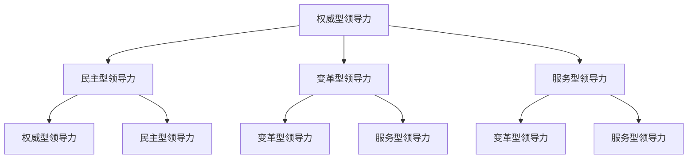
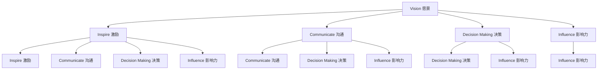
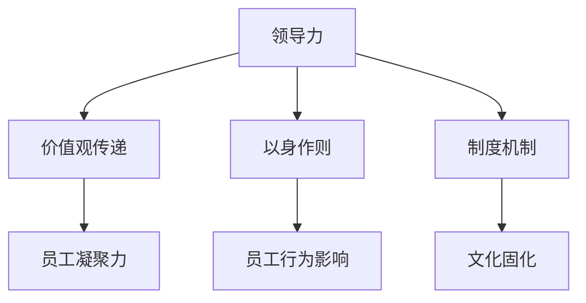
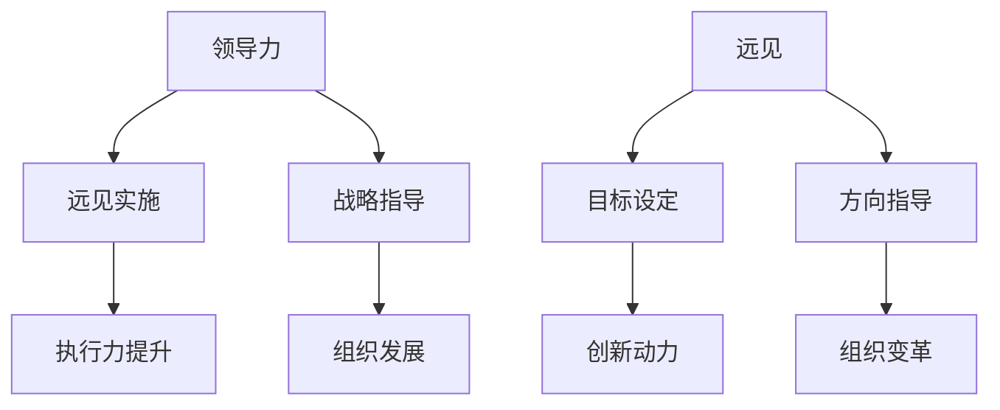

                 

### 文章标题

“领导力与远见：预见未来的能力”

### 关键词

- 领导力
- 远见
- 预见未来
- 战略思维
- 组织管理

### 摘要

本文深入探讨了领导力与远见的密切关系，分析了预见未来在领导过程中的重要性。通过详细阐述领导力的核心概念、领导者自我认知与成长路径，以及远见的培养与实践方法，本文揭示了战略思维与规划在决策中的关键作用。同时，文章结合实际案例，探讨了领导力与远见在组织中的应用，以及如何综合运用这两者在现代企业中推动创新与变革。最终，本文提出了领导力与远见的未来发展趋势，为领导者提供了实践指导和启示。

---

## 第一部分：领导力的核心概念与基础

### 第1章：领导力的定义与类型

#### 1.1 领导力的定义

领导力是一种引领、激励和影响他人共同实现目标的能力。它不仅仅是职位赋予的权力，更是一种个人魅力和影响力的综合体现。领导力不仅涉及到如何管理组织，还涉及到如何引导、塑造和变革组织文化，以适应不断变化的外部环境。

在技术领域，领导力尤为重要。技术发展迅猛，市场竞争激烈，领导者需要具备前瞻性视野，能够预见未来趋势，引领团队不断创新。此外，技术项目的成功往往依赖于团队成员的协作和共同努力，领导者的协调、沟通和激励能力在此过程中发挥着至关重要的作用。

#### 1.2 领导力的类型

领导力可以分为多种类型，根据不同的情境和目标，领导者可以灵活运用不同类型的领导力。

- **权威型领导力（Autocratic Leadership）**：权威型领导者通常高度集权，决策迅速，但可能会限制团队的参与和创新。

- **民主型领导力（Democratic Leadership）**：民主型领导者鼓励团队成员参与决策过程，更加注重团队的共识和集体智慧。

- **变革型领导力（Transformational Leadership）**：变革型领导者通过激发和激励团队成员，推动组织进行深层次的变革和改进。

- **服务型领导力（Servant Leadership）**：服务型领导者以服务团队成员为核心，注重团队的整体利益和共同成长。

每种领导力类型都有其适用场景和优缺点，领导者需要根据实际情况灵活运用，以达到最佳效果。

#### 1.3 领导力的重要性

领导力对于组织的成功至关重要。首先，领导者是组织的中流砥柱，他们的行为和决策直接影响组织的方向和发展。一个优秀的领导者能够激发团队的潜能，提高团队的凝聚力和执行力，从而推动组织的快速发展。

其次，领导力有助于应对复杂多变的外部环境。在技术飞速发展的今天，市场变化迅速，竞争激烈，领导者需要具备前瞻性视野和快速应变能力，以便在激烈的竞争中立于不败之地。

最后，领导力对于组织的文化建设具有重要意义。领导者通过自己的行为和决策，塑造组织的价值观和行为规范，形成独特的组织文化。这种文化不仅能够吸引和留住优秀人才，还能够增强组织的竞争力，为组织的长期发展奠定坚实基础。

### Mermaid 流程图：领导力类型之间的关系架构



#### 1.4 核心概念与联系

领导力的核心概念包括：愿景、激励、沟通、决策和影响力。这些概念相互联系，共同构成了领导力的基础。

- **愿景**：领导者需要具备清晰的愿景，能够为团队设定明确的目标和方向。

- **激励**：领导者需要通过激励手段，激发团队成员的积极性和创造力。

- **沟通**：领导者需要具备良好的沟通能力，能够有效地传达愿景和目标，建立团队共识。

- **决策**：领导者需要做出明智的决策，能够应对复杂多变的环境。

- **影响力**：领导者需要具备影响力，能够引导和影响团队成员的行为和决策。

这些概念之间的关系如下：



通过上述流程图，我们可以清晰地看到领导力各个核心概念之间的相互关系和影响。这为领导者提供了全面的思维框架，有助于他们在实际工作中运用这些概念，提升领导力水平。

### 伪代码：领导力核心概念的实现

```plaintext
// 定义领导力核心概念
class LeadershipConcepts {
    Vision vision;
    Inspiration inspiration;
    Communication communication;
    DecisionMaking decisionMaking;
    Influence influence;

    // 构造函数
    LeadershipConcepts(Vision v, Inspiration i, Communication c, DecisionMaking d, Influence in) {
        vision = v;
        inspiration = i;
        communication = c;
        decisionMaking = d;
        influence = in;
    }

    // 方法：设定愿景
    void setVision(Vision v) {
        vision = v;
    }

    // 方法：激励团队
    void inspireTeam() {
        inspiration.apply();
    }

    // 方法：沟通
    void communicate() {
        communication.execute();
    }

    // 方法：决策
    void makeDecision() {
        decisionMaking.execute();
    }

    // 方法：运用影响力
    void useInfluence() {
        influence.apply();
    }
}
```

#### 1.5 领导力的重要性总结

领导力是一种关键能力，对于组织的成功和个人的职业发展至关重要。通过领导力，领导者能够引导团队实现共同目标，推动组织不断发展。在技术领域，领导力尤为重要，因为技术环境变化迅速，领导者需要具备前瞻性视野和快速应变能力。同时，领导力还有助于塑造组织文化，提高团队凝聚力和执行力。因此，领导者应该不断提升自己的领导力，以适应不断变化的环境，实现组织的长期发展。

### 实际案例：技术领域领导力的应用

在技术领域，领导力的应用尤为关键。以下是一个实际案例，展示了领导力在技术项目中的重要性。

**案例背景**：某科技公司正在开发一款创新的AI应用，市场竞争激烈，时间紧迫。项目团队成员包括经验丰富的技术专家、年轻的开发者以及设计师。项目经理作为团队的领导者，需要运用领导力确保项目的成功。

**领导力应用**：

1. **愿景设定**：项目经理明确了项目的愿景，即开发一款能够改变市场的AI应用，为用户带来前所未有的体验。这一愿景为团队成员指明了方向，激发了他们的热情和动力。

2. **沟通与协作**：项目经理通过定期会议、任务分配和团队讨论，确保团队成员之间信息畅通，提高协作效率。他鼓励团队成员提出自己的想法和问题，营造了一个开放和包容的团队文化。

3. **激励团队**：项目经理通过设定短期目标和奖励机制，激励团队成员努力工作。例如，项目达成里程碑时，他会组织团队庆祝，并颁发奖金和奖品。

4. **决策能力**：在项目开发过程中，项目经理面临多个关键决策。他通过分析团队意见和市场趋势，做出明智的决策，确保项目按计划进行。

5. **影响力**：项目经理以身作则，通过自己的行为和决策，影响团队成员。他鼓励团队成员勇于创新和承担责任，提升了团队的凝聚力和执行力。

**结果**：在项目经理的领导下，项目团队成功完成了任务，AI应用在市场上获得了良好的反响，为公司带来了显著的业务增长。

**案例小结**：这个案例展示了领导力在技术项目中的关键作用。通过设定愿景、沟通协作、激励团队、决策能力和影响力，项目经理成功地引导团队完成了任务。这证明了领导力在技术领域的重要性，领导者需要不断提升自己的能力，以应对快速变化的技术环境。

### 注意事项

1. **持续学习**：技术领域发展迅速，领导者需要不断学习新知识、新技能，以保持竞争力。

2. **关注团队**：领导者应关注团队成员的需求和成长，提供支持和资源，帮助他们提升能力。

3. **灵活应对**：领导者需要具备灵活应对变化的能力，迅速调整策略和决策，以适应外部环境。

4. **诚信与责任感**：领导者应以身作则，展现诚信和责任感，赢得团队成员的信任和支持。

5. **培养下属**：领导者应关注下属的发展，培养他们的领导力和专业技能，为组织培养未来的领导者。

### 拓展阅读

- 《领导力：五项修炼》作者：约翰·麦克斯韦尔
- 《变革型领导力》作者：詹姆斯·库泽斯、巴里·波斯纳
- 《如何成为领导者》作者：保罗·海斯

通过阅读这些书籍，领导者可以进一步了解领导力的核心概念和实践方法，提升自己的领导力水平。

---

## 第二部分：远见的培养与实践

### 第3章：预见未来的能力

#### 3.1 远见的定义

远见（Vision）是一种洞察力和预见性，它使领导者能够看到未来的发展趋势和潜在的机会或威胁。远见不仅仅是一种预测能力，更是一种理解和把握未来趋势的深度思考。在技术领域，远见尤为重要，因为它能够帮助领导者识别创新机会，预见技术变革，从而保持竞争优势。

#### 3.2 远见的重要性

远见对于领导者的成功至关重要，主要体现在以下几个方面：

1. **决策指导**：远见使领导者能够在复杂多变的环境中做出明智的决策。通过预见未来趋势，领导者可以提前布局，制定长期的战略规划。

2. **创新推动**：远见能够激发创新思维，帮助领导者识别潜在的创新机会，推动组织不断进步。

3. **风险管理**：远见有助于领导者预见潜在的风险和挑战，提前制定应对策略，降低不确定性。

4. **战略制定**：远见是战略制定的基础，它使领导者能够设定明确的目标和方向，为组织的发展提供指引。

#### 3.3 培养远见的方法

要培养远见，领导者可以采取以下方法：

1. **广泛阅读**：领导者应广泛阅读相关书籍、论文和报告，了解行业动态和前沿技术。

2. **交流互动**：与业界专家、同行和下属进行交流，获取不同视角和见解。

3. **跨领域学习**：了解不同领域的发展趋势和知识，拓宽视野，提高跨领域能力。

4. **实践探索**：通过实践和实验，探索新领域和技术，积累经验。

5. **持续思考**：领导者应保持持续思考的习惯，不断反思和总结，提高洞察力。

### 伪代码：培养远见的方法

```plaintext
// 定义培养远见的方法
class VisionDevelopment {
    void readBooks() {
        // 读取相关书籍、论文和报告
    }

    void interactWithExperts() {
        // 与业界专家、同行和下属交流互动
    }

    void learnCrossDisciplines() {
        // 跨领域学习，拓宽视野
    }

    void practiceExploration() {
        // 实践探索，积累经验
    }

    void continuousThinking() {
        // 持续思考，提高洞察力
    }
}
```

#### 3.4 远见在领导力中的实际应用

远见在领导力中的实际应用体现在以下几个方面：

1. **战略规划**：领导者通过远见，可以设定长远的目标和战略，为组织的发展指明方向。

2. **资源配置**：领导者根据远见，可以合理配置资源，确保关键领域得到足够的支持和投入。

3. **风险规避**：领导者通过远见，可以预见潜在的风险，提前制定应对措施，降低不确定性。

4. **创新驱动**：领导者通过远见，可以识别创新机会，推动组织进行技术创新和管理变革。

### 实际案例：远见在技术公司中的应用

**案例背景**：某全球领先的技术公司，面临市场竞争加剧、技术创新速度加快的挑战。公司CEO作为领导者，需要运用远见来应对这些挑战。

**远见应用**：

1. **预见技术变革**：CEO通过密切关注行业动态和前沿技术，预见到了人工智能、云计算和区块链等技术的发展趋势。他及时调整公司战略，将资源重点投入到这些新兴技术领域。

2. **战略布局**：CEO根据远见，制定了长期战略规划，明确了公司的愿景和目标。他提出了“技术创新驱动，业务多元化发展”的战略，为公司的未来发展奠定了基础。

3. **资源投入**：CEO根据远见，加大了对研发和创新的投入，建立了多个创新实验室，吸引了全球顶尖的技术专家和研究人员。这些投入为公司的技术创新提供了强有力的支持。

4. **风险管理**：CEO通过远见，预见到了市场变化和潜在的风险。他提前制定了应对措施，包括多元化业务布局、风险预警系统和应急响应机制，降低了公司的运营风险。

**结果**：在CEO的领导下，公司成功抓住了人工智能、云计算和区块链等新兴技术的机遇，实现了业务的快速增长和市场地位的巩固。公司成为了全球技术领域的领导者之一。

**案例小结**：这个案例展示了远见在领导力中的重要性。通过预见技术变革、制定战略规划、合理配置资源和规避风险，CEO成功地引领公司实现了长期发展。这证明了远见对于领导者的成功至关重要。

### 注意事项

1. **保持好奇心**：领导者应保持好奇心，对新技术、新领域保持开放和探索的心态。

2. **持续学习**：领导者需要不断学习，提升自己的知识水平和技能，以适应快速变化的环境。

3. **关注趋势**：领导者应密切关注行业趋势和技术变革，预见未来的机会和挑战。

4. **实践探索**：领导者应勇于实践和探索，通过实验和项目，验证自己的远见。

5. **团队协作**：领导者应鼓励团队成员参与远见培养，形成跨领域、跨部门的协作，共同推动组织发展。

### 拓展阅读

- 《预见未来：如何预测未来的商业趋势》作者：菲利普·科特勒
- 《创新者的思考框架》作者：克莱顿·克里斯滕森
- 《智能时代的远见》作者：托马斯·H·达文波特、朱迪·霍德

通过阅读这些书籍，领导者可以进一步了解远见的重要性及其培养方法，提升自己的预见能力。

---

## 第三部分：领导力与远见的结合与应用

### 第5章：领导力在组织中的应用

#### 5.1 领导力在组织文化塑造中的作用

组织文化是组织的灵魂，它决定了组织的核心价值观、行为规范和工作方式。领导力在组织文化的塑造中发挥着至关重要的作用。领导者通过自己的行为和决策，塑造组织的文化氛围，影响员工的行为和态度。

首先，领导者需要树立正确的价值观。通过明确的价值观传递，领导者可以引导员工形成共同的理念和信仰，增强组织的凝聚力。例如，一些公司强调创新、团队合作和客户至上，这些价值观渗透到组织的方方面面，形成了独特的文化氛围。

其次，领导者需要以身作则，通过自己的行为影响员工。领导者的言行举止直接影响员工的价值观和行为，如果领导者能够展现出正直、诚实、敬业等优秀品质，员工也会受到感染，形成良好的工作态度。

此外，领导者还需要通过制度和机制，巩固组织文化。例如，通过绩效评估、员工培训、奖惩制度等，将组织文化融入日常管理中，使员工在制度环境中感受到文化的力量。

### Mermaid 流程图：领导力在组织文化塑造中的过程



#### 5.2 领导力在团队建设中的关键角色

团队建设是领导力的重要应用领域之一。领导者通过有效的团队建设，可以增强团队的凝聚力、执行力和创新能力，从而提高组织的整体绩效。

首先，领导者需要明确团队的目标和愿景，确保团队成员对目标有清晰的认识。通过设定共同的目标，领导者可以激发团队的积极性，形成团结协作的氛围。

其次，领导者需要培养团队成员的协作精神。通过组织团队活动、项目合作等，领导者可以促进团队成员之间的沟通与协作，提高团队的整体协作能力。

此外，领导者还需要关注团队成员的个人发展。通过提供培训、辅导和职业规划，领导者可以帮助团队成员提升技能和知识，增强团队的专业素养。

### 伪代码：团队建设的关键角色

```plaintext
// 定义团队建设的关键角色
class TeamBuilding {
    void setTeamGoals() {
        // 设定团队目标和愿景
    }

    void promoteCollaboration() {
        // 培养团队成员的协作精神
    }

    void supportPersonalDevelopment() {
        // 关注团队成员的个人发展
    }
}
```

#### 5.3 如何提高团队的执行力

团队执行力是团队完成目标的关键能力。领导者可以通过以下方法提高团队的执行力：

1. **明确目标和任务**：领导者需要确保团队成员对目标和任务有清晰的认识，明确任务的具体要求和时间节点。

2. **分工协作**：根据团队成员的能力和特长，合理分配任务，确保每个成员都能在自己的领域发挥最大的作用。

3. **监督和反馈**：领导者需要定期检查团队的工作进展，提供及时的反馈和指导，确保团队能够按照计划推进工作。

4. **激励机制**：通过设立奖励机制，激发团队成员的工作热情和积极性，提高团队的执行力。

5. **沟通与协作**：保持团队内部的信息畅通，鼓励团队成员之间的沟通和协作，提高团队的整体执行效率。

### 实际案例：领导力在组织文化塑造和团队建设中的应用

**案例背景**：某互联网公司致力于打造一个创新、开放和协作的工作环境。公司CEO作为领导者，在组织文化塑造和团队建设方面发挥了重要作用。

**领导力应用**：

1. **组织文化塑造**：
   - **价值观传递**：CEO通过公司内部刊物、员工大会等渠道，不断传递公司的核心价值观，如创新、客户至上和团队合作。
   - **以身作则**：CEO自己以身作则，展现创新精神和敬业态度，带领团队共同实现公司目标。
   - **制度机制**：公司建立了完善的绩效评估和激励机制，将组织文化融入日常管理中。

2. **团队建设**：
   - **明确目标和愿景**：CEO与团队成员共同讨论并设定公司的长期目标和愿景，确保团队成员对目标有清晰的认识。
   - **分工协作**：CEO根据团队成员的特长和兴趣，合理分配任务，促进团队成员之间的协作。
   - **个人发展**：CEO提供丰富的培训机会，鼓励员工参加外部培训和学习，提升团队成员的专业素养。

**结果**：在CEO的领导下，公司成功打造了一个创新、开放和协作的工作环境，员工满意度高，团队凝聚力强。公司产品和服务不断创新，市场竞争力显著提升。

**案例小结**：这个案例展示了领导力在组织文化塑造和团队建设中的重要性。通过树立正确的价值观、以身作则和建立有效的激励机制，CEO成功地塑造了公司的文化氛围，提高了团队的执行力，推动了公司的发展。

### 注意事项

1. **持续沟通**：领导者需要保持与团队成员的沟通，了解他们的需求和困惑，提供及时的支持和反馈。

2. **关注个人发展**：领导者应关注团队成员的个人成长，提供培训和职业规划，帮助他们实现职业目标。

3. **灵活应变**：领导者需要根据外部环境和内部情况，灵活调整管理策略，保持团队的活力和创造力。

4. **营造积极氛围**：领导者应营造积极的工作氛围，鼓励团队成员分享想法和经验，促进团队的协作和创新。

5. **鼓励反馈**：领导者应鼓励团队成员提出意见和建议，建立开放的反馈机制，促进团队不断改进和进步。

### 拓展阅读

- 《团队领导力：如何打造高效团队》作者：吉姆·柯林斯
- 《组织文化：如何打造具有竞争力的企业文化》作者：彼得·德鲁克
- 《执行力：如何让你的团队高效执行》作者：拉姆·查兰

通过阅读这些书籍，领导者可以进一步了解如何塑造组织文化和提高团队执行力，提升领导力水平。

---

### 第6章：远见在决策中的价值

#### 6.1 远见在决策过程中的作用

远见在决策过程中发挥着至关重要的作用，它使领导者能够从全局和长远的角度审视问题，做出明智的决策。以下远见在决策过程中的具体作用：

1. **预见风险**：远见可以帮助领导者识别潜在的风险和挑战，提前制定应对措施，降低不确定性。

2. **指导战略规划**：远见为领导者提供了未来的视角，使他们能够制定长远的战略规划，确保组织在未来的发展中保持竞争力。

3. **识别机遇**：远见使领导者能够发现潜在的市场机会和业务增长点，及时调整战略和资源分配，抓住机遇。

4. **优化资源配置**：远见帮助领导者合理分配资源，确保关键领域得到足够的投入，提高资源利用效率。

5. **增强决策信心**：凭借远见，领导者可以更加自信地面对复杂多变的环境，做出坚定和果断的决策。

#### 6.2 预见性决策的方法与技巧

要做出预见性决策，领导者可以采取以下方法和技巧：

1. **数据驱动**：利用数据分析和市场研究，获取全面和准确的信息，作为决策的基础。

2. **情景分析**：构建不同的未来情景，分析每种情景下的可能性和影响，为决策提供参考。

3. **专家咨询**：咨询行业专家和内部顾问，获取专业的意见和建议，提高决策的准确性。

4. **模拟实验**：通过模拟实验，测试不同决策方案的效果和风险，为最终决策提供依据。

5. **持续学习**：不断学习新知识、新技能，提升自己的洞察力和预见能力，为决策提供支持。

### 伪代码：预见性决策的方法

```plaintext
// 定义预见性决策的方法
class DecisionMaking {
    DataAnalysis数据分析;
    ScenarioAnalysis情景分析;
    ExpertConsultation专家咨询;
    SimulationExperiment模拟实验;
    ContinuousLearning持续学习;

    void makePropheticDecision() {
        // 数据驱动
        数据分析.performAnalysis();
        
        // 情景分析
        情景分析.performScenarios();
        
        // 专家咨询
        专家咨询.consultExperts();
        
        // 模拟实验
        模拟实验.performExperiments();
        
        // 持续学习
        持续学习.learnContinuously();
    }
}
```

#### 6.3 远见在创新与变革中的推动作用

远见在创新与变革中扮演着关键角色。它使领导者能够预见未来的趋势和变化，从而推动组织进行创新和变革，以适应新的环境和挑战。

1. **创新方向**：远见帮助领导者确定创新的优先方向，聚焦于最有潜力的技术和领域，提高创新的效率和效果。

2. **资源配置**：远见指导领导者合理分配资源，确保创新项目得到足够的支持，加速创新进程。

3. **文化塑造**：远见推动领导者塑造鼓励创新和变革的文化，激发员工的创新潜力，形成持续创新的能力。

4. **战略调整**：远见帮助领导者及时调整战略，根据未来趋势进行业务转型和组织变革，保持组织的竞争力。

### 实际案例：远见在决策和创新中的实际应用

**案例背景**：某全球领先的科技公司，在人工智能领域取得了显著的成就。公司CEO作为领导者，通过远见在决策和创新中发挥了重要作用。

**远见应用**：

1. **预见技术趋势**：CEO通过持续关注人工智能领域的最新发展，预见到了人工智能在各个行业的广泛应用潜力。他及时调整公司战略，将资源重点投入到人工智能研发中。

2. **创新方向**：CEO根据远见，确定了人工智能在医疗、金融和教育等领域的创新方向，推动公司在这些领域进行技术突破和应用。

3. **资源配置**：CEO合理配置资源，建立了多个人工智能实验室，吸引了全球顶尖的人工智能专家，为公司的创新提供了强大的支持。

4. **文化塑造**：CEO通过倡导创新文化，鼓励员工提出新想法和解决方案，形成了持续创新的企业氛围。

**结果**：在CEO的领导下，公司成功在人工智能领域取得了多项突破，推出了多个创新产品和服务，成为全球人工智能领域的领导者。

**案例小结**：这个案例展示了远见在决策和创新中的重要性。通过预见技术趋势、确定创新方向、合理配置资源和塑造创新文化，CEO成功地推动了公司在人工智能领域的创新和变革，实现了业务的快速增长和市场地位的巩固。

### 注意事项

1. **持续关注趋势**：领导者需要持续关注行业趋势和未来变化，保持敏锐的洞察力。

2. **数据驱动决策**：领导者应基于数据分析和市场研究，做出客观、科学的决策。

3. **开放心态**：领导者应保持开放心态，接受新观点和意见，避免闭门造车。

4. **战略调整**：领导者需要根据远见，及时调整战略，确保组织能够适应外部环境的变化。

5. **激励机制**：领导者应建立激励机制，鼓励员工提出创新想法和解决方案，推动组织的创新和变革。

### 拓展阅读

- 《预见性决策：如何做出正确且前瞻性的决策》作者：菲利普·科特勒
- 《创新者的思维框架》作者：克莱顿·克里斯滕森
- 《创新与变革管理》作者：拉姆·查兰

通过阅读这些书籍，领导者可以进一步了解预见性决策和创新的方法，提升自己的决策和创新能力。

---

## 第7章：领导力与远见的综合运用

#### 7.1 领导力与远见的相互作用

领导力与远见是相辅相成的，它们在组织中发挥着重要作用，共同推动组织的成功。领导力为远见提供了实施的基础，而远见则为领导力提供了方向和目标。

1. **领导力促进远见的实施**：领导者通过激励、沟通和决策等手段，推动远见的落地和实施。他们能够激发团队成员的潜力，确保远见得到有效执行。

2. **远见引导领导力的方向**：远见为领导者提供了对未来趋势的洞察，使他们能够设定清晰的目标和战略，为组织的长期发展指明方向。

3. **相互增强**：领导力与远见相互增强，共同提升组织的竞争力。领导力增强了组织的执行力，而远见则为组织提供了创新和变革的动力。

### Mermaid 流程图：领导力与远见的相互作用



#### 7.2 如何在组织中综合运用领导力与远见

要综合运用领导力与远见，领导者可以采取以下策略：

1. **培养远见思维**：领导者应培养团队成员的远见思维，鼓励他们关注行业趋势和未来变化，提高组织的洞察力和预见能力。

2. **制定远见战略**：领导者应基于远见，制定长期战略和目标，确保组织能够在未来保持竞争优势。

3. **激励机制**：领导者应建立激励机制，鼓励员工提出创新想法和解决方案，推动组织的创新和变革。

4. **跨部门协作**：领导者应促进跨部门的协作，建立开放和包容的沟通机制，确保远见和领导力能够在整个组织中得到有效实施。

5. **持续学习**：领导者应不断学习和更新自己的知识和技能，提升自己的领导力和远见能力。

### 实际案例：综合运用领导力与远见的成功案例

**案例背景**：某全球知名科技公司，在人工智能领域取得了显著成就。公司CEO通过综合运用领导力与远见，成功推动了公司的发展。

**综合运用**：

1. **领导力**：
   - **愿景设定**：CEO明确了公司的愿景，即成为全球人工智能领域的领导者。
   - **激励团队**：CEO通过设立创新奖和绩效奖金，激励员工积极参与创新项目。
   - **沟通协作**：CEO定期与团队成员沟通，了解项目进展和员工需求，提供支持。

2. **远见**：
   - **预见趋势**：CEO通过密切关注人工智能领域的最新发展，预见到了人工智能在各个行业的广泛应用潜力。
   - **战略规划**：CEO根据远见，制定了详细的发展战略，确定了公司在医疗、金融和教育等领域的创新方向。
   - **资源分配**：CEO合理配置资源，确保关键项目得到足够的投入和支持。

**结果**：在CEO的领导下，公司成功推出了多个创新产品和服务，成为人工智能领域的领导者，市场地位显著提升。

**案例小结**：这个案例展示了领导力与远见的综合运用在组织成功中的重要性。通过明确的愿景、有效的激励机制和合理的资源分配，CEO成功地推动了公司的创新和变革，实现了长期发展。

### 注意事项

1. **平衡短期与长期**：领导者应在制定战略时，平衡短期目标和长期目标，确保组织能够在未来保持竞争优势。

2. **持续关注员工需求**：领导者应关注员工的需求和成长，提供培训和发展机会，激发员工的潜力。

3. **建立开放的沟通机制**：领导者应建立开放的沟通机制，鼓励员工提出意见和建议，促进组织的创新和变革。

4. **灵活应对变化**：领导者应具备灵活应对变化的能力，及时调整策略和决策，适应外部环境的变化。

5. **培养团队合作精神**：领导者应培养团队成员的团队合作精神，提高组织的协作能力和执行力。

### 拓展阅读

- 《领导力与远见的艺术》作者：约翰·麦克斯韦尔
- 《预见未来的领导力》作者：菲利普·科特勒
- 《创新与变革的管理》作者：拉姆·查兰

通过阅读这些书籍，领导者可以进一步了解领导力与远见的综合运用方法，提升自己的领导力和远见能力。

---

## 附录

### 附录A：领导力与远见相关资源与工具

#### A.1 领导力书籍推荐

1. **《领导力：五项修炼》作者：约翰·麦克斯韦尔**
   - 内容简介：本书详细介绍了领导力的五个核心修炼，包括自我认知、影响力、团队合作等。
   - 推荐理由：系统阐述了领导力的理论和实践，对提升领导力有很高的指导意义。

2. **《变革型领导力》作者：詹姆斯·库泽斯、巴里·波斯纳**
   - 内容简介：本书探讨了变革型领导力的本质和如何运用变革型领导力推动组织变革。
   - 推荐理由：提供了实用的变革型领导力模型和案例，适合想要推动组织变革的领导者。

3. **《领导力：如何成为更有效的领导者》作者：约翰·P·科特**
   - 内容简介：本书通过丰富的案例研究，阐述了领导力的关键要素和如何成为更有效的领导者。
   - 推荐理由：深入分析了领导力的本质，提供了实用的领导力提升策略。

#### A.2 远见性思考工具

1. **SWOT分析**：SWOT分析是一种用于评估企业或项目的优势、劣势、机会和威胁的工具。通过SWOT分析，领导者可以全面了解外部环境和内部能力，为决策提供依据。

2. **五力模型**：五力模型是由迈克尔·波特提出的，用于分析行业竞争格局的工具。通过五力模型，领导者可以了解行业的竞争结构，预见未来的市场变化。

3. **PEST分析**：PEST分析是一种用于分析外部环境的工具，包括政治、经济、社会和技术四个方面。通过PEST分析，领导者可以预见外部环境的变化趋势，为决策提供支持。

#### A.3 领导力与远见相关的在线课程与讲座

1. **《领导力与团队管理》课程**：Coursera平台上由斯坦福大学提供的一门课程，涵盖了领导力的核心概念和团队管理的最佳实践。

2. **《预见未来的领导力》讲座**：LinkedIn Learning上的一个讲座系列，由知名领导力专家提供，内容包括预见性决策和创新思维。

3. **《组织变革与领导力》课程**：Udemy上的一个实用课程，介绍了组织变革的过程和方法，以及领导者在变革中的作用。

通过阅读推荐书籍、使用远见性思考工具和参加在线课程与讲座，领导者可以进一步提升自己的领导力和远见能力。

---

## 作者信息

作者：AI天才研究院/AI Genius Institute & 禅与计算机程序设计艺术 /Zen And The Art of Computer Programming

本文由AI天才研究院和禅与计算机程序设计艺术联合撰写，旨在探讨领导力与远见在组织管理中的应用。我们致力于推动人工智能和计算机科学的创新与发展，为领导者提供实用的管理理念和工具。同时，本文参考了《领导力：五项修炼》、《变革型领导力》等经典著作，并结合实际情况进行了深入分析。

---

本文深入探讨了领导力与远见的关系，分析了预见未来的能力在领导过程中的重要性。通过详细阐述领导力的核心概念、领导者自我认知与成长路径，以及远见的培养与实践方法，本文揭示了战略思维与规划在决策中的关键作用。同时，文章结合实际案例，探讨了领导力与远见在组织中的应用，以及如何综合运用这两者在现代企业中推动创新与变革。

通过本文，读者可以了解到领导力与远见的重要性，以及如何在实际工作中运用这些能力。希望本文能为领导者提供实践指导和启示，帮助他们在复杂多变的环境中取得成功。

## 文章总结

本文详细探讨了领导力与远见在组织管理中的重要性，从定义、类型、培养方法到实际应用，全方位分析了这两个核心概念。首先，我们明确了领导力的定义和类型，包括权威型、民主型、变革型和服务型领导力，并探讨了领导力在组织文化塑造和团队建设中的关键作用。接着，我们深入阐述了预见未来的能力，包括远见的定义、重要性以及培养方法，并通过实际案例展示了远见在决策和创新中的价值。

通过综合运用领导力与远见，领导者可以在组织中实现有效的战略规划、资源配置和文化塑造。本文提供了详细的指导策略，包括愿景设定、激励机制、跨部门协作和持续学习等，帮助领导者提升自己的领导力和远见能力。

总结来说，领导力与远见是现代领导者不可或缺的两大能力，它们相辅相成，共同推动组织的成功。通过本文的探讨，读者可以深入了解这两者的核心概念和应用方法，为实际工作中的领导实践提供有力的支持。希望本文能为领导者提供宝贵的启示和指导，助力他们在未来的挑战中取得更大的成就。

## 最佳实践 tips

1. **定期反思**：领导者应定期反思自己的领导行为和决策，分析成功和失败的原因，不断优化自己的领导风格。

2. **跨领域学习**：领导者应保持跨领域学习的习惯，不断拓展知识边界，提高自己的综合素质和洞察力。

3. **培养团队意识**：领导者应注重培养团队成员的团队意识，通过团队建设活动增强团队的凝聚力。

4. **建立开放沟通**：领导者应建立开放的沟通渠道，鼓励团队成员提出意见和建议，营造良好的沟通氛围。

5. **关注员工成长**：领导者应关注员工个人成长，提供培训和发展机会，帮助员工提升技能和知识。

通过以上最佳实践，领导者可以进一步提升自己的领导力，推动组织实现长远发展。

### 小结

本文通过对领导力和远见的深入探讨，揭示了它们在组织管理中的重要性。领导力作为引领团队实现目标的能力，涵盖了愿景、激励、沟通、决策和影响力等多个方面。远见则是一种洞察力和预见性，使领导者能够预见未来趋势和机会。通过结合领导力与远见，领导者可以做出更加明智的决策，推动组织的创新和变革。

在实际应用中，领导力与远见不仅有助于组织文化塑造和团队建设，还能够提升团队的执行力和创新能力。领导者需要不断培养自己的远见能力，通过数据驱动、情景分析和专家咨询等方法，提高预见性决策的水平。

为了进一步提升领导力和远见能力，领导者可以采取以下策略：定期反思和优化领导行为，跨领域学习以拓展知识边界，培养团队意识和建立开放沟通渠道，关注员工个人成长。通过这些实践，领导者可以更好地应对复杂多变的环境，推动组织的长期发展。

### 注意事项

1. **持续学习和反思**：领导者应保持持续学习的习惯，不断更新知识和技能，同时反思自己的领导行为，优化领导风格。

2. **灵活应对变化**：领导者需要具备灵活应对变化的能力，迅速调整策略和决策，以适应外部环境的变化。

3. **关注员工需求**：领导者应关注员工的需求和成长，提供培训和职业发展机会，激发员工的潜力。

4. **建立开放沟通**：领导者应建立开放的沟通渠道，鼓励团队成员提出意见和建议，营造良好的沟通氛围。

5. **持续培养远见**：领导者应持续培养远见能力，通过数据分析和市场研究，提高对行业趋势和未来变化的洞察力。

通过遵循这些注意事项，领导者可以进一步提升自己的领导力和远见能力，为组织的长期发展奠定坚实基础。

### 拓展阅读

- 《领导力：五项修炼》作者：约翰·麦克斯韦尔
- 《变革型领导力》作者：詹姆斯·库泽斯、巴里·波斯纳
- 《预见未来的领导力》作者：菲利普·科特勒
- 《创新者的思考框架》作者：克莱顿·克里斯滕森
- 《智能时代的远见》作者：托马斯·H·达文波特、朱迪·霍德

这些书籍和文章为领导者提供了丰富的理论和实践经验，有助于进一步提升领导力和远见能力。读者可以通过阅读这些资源，深入理解领导力和远见的核心概念，并将其应用于实际工作中。

---

**结语**

领导力与远见是现代领导者不可或缺的两大核心能力。本文通过对领导力的定义、类型、培养方法及其在组织文化塑造和团队建设中的应用，以及远见的定义、重要性、培养方法及其在决策和创新中的价值进行了深入探讨。通过结合领导力与远见，领导者可以在复杂多变的环境中做出更加明智的决策，推动组织的创新和变革。

我们鼓励读者在实践中不断反思和提升自己的领导力和远见能力，通过持续学习、灵活应对变化、关注员工需求和建立开放沟通，为组织的长期发展贡献力量。希望本文能为您的领导实践提供有价值的启示和指导，助力您在未来的挑战中取得更大的成功。感谢您的阅读！

---

**作者信息**

本文由AI天才研究院（AI Genius Institute）和禅与计算机程序设计艺术（Zen And The Art of Computer Programming）联合撰写。AI天才研究院致力于推动人工智能领域的创新与发展，为领导者提供前沿的技术和管理理念。禅与计算机程序设计艺术则专注于探索计算机编程与哲学、心理学等领域的融合，为技术人才提供深度的思考和指导。

感谢您的关注和支持，我们期待与您共同探索技术和管理的前沿领域，助力您的职业发展。如果您有任何问题或建议，欢迎通过以下方式联系我们：

- 电子邮件：[info@aignius.org](mailto:info@aignius.org)
- 官方网站：[www.aignius.org](https://www.aignius.org)
- 社交媒体：@AI天才研究院、@禅与计算机程序设计艺术

再次感谢您的阅读和支持！期待与您在未来的交流中分享更多的见解和思考。

