                 

# 领导力与远见：预见未来的能力

## 关键词
领导力、远见、预见未来、信息收集、分析能力、洞察力、决策制定

## 摘要
在快速变化的技术和商业环境中，领导力与远见成为企业成功的关键要素。本文将探讨领导力的定义及其核心要素，深入分析远见的内涵与重要性，并详细阐述如何培养预见未来的能力。通过信息收集与分析、洞察力与预判力的培养，以及情景规划与决策制定，本文旨在为读者提供一套实用的领导力与远见培养方法论，以应对未来挑战。

## 前言

在当今这个充满不确定性和快速变革的时代，企业领导者的角色显得尤为重要。传统的管理方法和经验往往无法应对复杂多变的环境，因此，领导力与远见成为企业持续发展的关键。本文旨在探讨领导力与远见的内涵，揭示其在预见未来中的重要作用，并提供实用的培养方法，帮助读者在职业发展中提升自身领导力，把握未来机遇。

本文结构如下：

1. 领导力与远见基础
2. 预见未来的能力培养
3. 领导力与远见的实践应用
4. 领导力与远见的持续发展
5. 结论

通过逐步深入的分析和阐述，本文希望为读者提供一个全面、系统的领导力与远见培养指南。

### 第一部分：领导力与远见基础

#### 第1章 领导力的定义与核心要素

领导力是一种影响和激励他人实现共同目标的能力，它不仅仅是职位赋予的权力，更是一种内在素质和领导风格。在技术飞速发展的今天，领导力在企业的成功中扮演着至关重要的角色。

首先，让我们来定义领导力。领导力可以理解为一种在群体中引导和协调个体行为的能力，其核心在于影响他人并使团队朝着共同的目标前进。领导力不仅仅是管理，它更多的是关于愿景、价值观和激励。

接下来，我们探讨领导力的核心要素。以下是一些关键的领导力要素：

1. **诚信**：诚信是领导力的基石，没有诚信，领导力就无法建立。一个领导者必须做到言行一致，以身作则，才能赢得团队的信任。
2. **愿景**：一个清晰的愿景能够激发团队的热情和动力，使团队成员明确方向，齐心协力实现目标。
3. **决策能力**：领导者需要在复杂多变的环境中迅速做出正确的决策。这要求领导者具备分析问题、权衡利弊和快速反应的能力。
4. **沟通能力**：良好的沟通能力是领导力的重要组成部分。领导者需要能够清晰、准确地传达愿景和目标，同时也要倾听团队成员的意见和建议。
5. **团队建设**：团队建设是领导力的另一个关键要素。一个成功的领导者必须能够建立一个有凝聚力、相互信任和合作的团队。

领导力与管理的区别在于，领导力更注重影响和激励，而管理则更侧重于协调和执行。领导者需要具备的战略思维和创新能力是管理所不具备的。

#### 第2章 远见的内涵与重要性

远见，是一种预见未来的能力，它能够帮助领导者洞察变化、预判风险，并在竞争中保持领先地位。远见不仅仅是直觉或经验，它是一种系统的思考和分析能力。

首先，远见的内涵包括以下几个方面：

1. **预见未来**：远见要求领导者能够看到未来的趋势和变化，预见潜在的机会和挑战。
2. **洞察变化**：领导者需要具备洞察力，能够从细微的变化中察觉到重大的趋势。
3. **预判风险**：远见还要求领导者能够预判未来可能出现的风险，并提前做好准备。

在竞争激烈的环境中，远见的重要性尤为突出。一个具有远见的领导者能够：

1. **把握市场机会**：通过预见市场趋势，领导者可以提前布局，抢占先机。
2. **规避风险**：通过预判风险，领导者可以提前制定应对策略，降低企业风险。
3. **保持竞争优势**：远见使领导者能够在变化中保持敏锐，从而持续保持竞争优势。

远见与直觉、经验的区别在于，直觉和经验更多的是基于个人的感性认知，而远见则是一种基于系统分析和逻辑推理的能力。直觉和经验在特定情境下可能有效，但在复杂多变的环境中，远见则显得尤为重要。

### 第二部分：预见未来的能力培养

#### 第3章 信息收集与分析能力

预见未来的能力首先建立在信息收集和分析的基础之上。在一个信息爆炸的时代，如何有效地收集、处理和分析信息，成为领导者预见未来、做出明智决策的关键。

**数据的重要性**：

数据是决策的基石。通过数据，我们可以了解市场趋势、用户需求、竞争态势等关键信息。因此，数据的重要性不言而喻。

**信息来源**：

1. **市场调研**：通过市场调研，可以获取消费者的偏好、需求和反馈，从而更好地满足市场需求。
2. **竞争分析**：分析竞争对手的产品、策略和市场表现，可以帮助我们了解行业趋势和竞争环境。
3. **趋势研究**：通过研究行业报告、科技论文和专家观点，可以了解新兴技术和未来趋势。

**数据分析工具与方法**：

1. **Excel**：Excel是数据分析的基本工具，适用于简单的数据处理和统计分析。
2. **Python**：Python因其强大的数据处理和分析能力，成为数据科学和人工智能领域的首选语言。
3. **R语言**：R语言专门为统计分析和数据可视化设计，适用于复杂的数据分析和高级统计模型。

通过以上工具和方法，领导者可以系统地收集、处理和分析信息，为预见未来提供坚实的数据支持。

#### 第4章 洞察力与预判力培养

预见未来的能力不仅仅依赖于数据，还需要领导者具备强大的洞察力和预判力。这两个能力是领导者能否在复杂多变的环境中保持领先地位的关键。

**洞察力的定义与培养方法**：

洞察力是一种能够看到事物本质和趋势的能力。它不仅仅依赖于经验，更需要通过系统性的学习和思考来培养。

1. **持续学习**：领导者需要不断学习新知识、新技能，以拓宽视野，提高洞察力。
2. **跨领域思考**：通过跨领域的思考，领导者可以更好地理解事物之间的联系，从而提升洞察力。
3. **反思与总结**：通过反思过去的经验，领导者可以总结规律，提高洞察力。

**预判力的意义与培养**：

预判力是一种预测未来趋势和变化的能力。它对于领导者在竞争激烈的环境中做出正确决策至关重要。

1. **预测模型**：通过建立预测模型，领导者可以基于数据和分析预测未来趋势。
2. **情景规划**：通过情景规划，领导者可以模拟不同的未来场景，并提前制定应对策略。
3. **经验积累**：通过不断的实践和经验积累，领导者可以提升预判力。

**案例分析：如何预见市场变化**：

以某科技公司的产品策略调整为例，通过市场调研、数据分析、跨领域思考和情景规划，公司成功预见了即将到来的市场需求变化，并迅速调整产品策略，从而取得了显著的市场优势。

通过培养洞察力和预判力，领导者可以更好地预见未来，抓住机遇，规避风险。

#### 第5章 情景规划与决策制定

情景规划与决策制定是预见未来的重要手段。通过情景规划，领导者可以预测未来可能发生的情况，并制定相应的应对策略。而决策制定则是将预测转化为实际行动的过程。

**情景规划的方法**：

情景规划是一种基于假设的思考方法，通过构建不同的未来场景，帮助领导者预见可能的变化和挑战。

1. **SWOT分析**：SWOT分析是一种常用的情景规划方法，通过分析企业的优势（Strengths）、劣势（Weaknesses）、机会（Opportunities）和威胁（Threats），帮助领导者识别未来的关键因素。
2. **PEST分析**：PEST分析是一种宏观环境分析工具，通过分析政治（Political）、经济（Economic）、社会（Social）和技术（Technological）因素，帮助领导者了解外部环境的变化趋势。

**决策制定的步骤**：

决策制定是一个系统的过程，包括以下几个步骤：

1. **问题识别**：明确需要解决的问题或需要做出的决策。
2. **解决方案评估**：列出所有可能的解决方案，并评估其优缺点。
3. **决策执行**：选择最优方案，并制定详细的执行计划。

**案例解析**：

以某电子商务公司在面对市场变化时如何调整营销策略为例，通过SWOT分析和PEST分析，公司预见了市场趋势，并制定了详细的调整方案，最终成功应对了市场变化，保持了竞争优势。

情景规划与决策制定是领导者预见未来、应对变化的重要工具，通过科学的方法和系统的步骤，领导者可以更好地把握未来，做出明智的决策。

### 第三部分：领导力与远见的实践应用

#### 第6章 团队管理与领导艺术

团队管理是领导力的重要组成部分，它涉及到如何有效地组建、激励和领导一个团队，以实现共同的目标。一个优秀的领导者不仅要具备强大的个人能力，还需要掌握团队管理的艺术。

**团队建设的原则**：

1. **信任**：信任是团队合作的基石，没有信任，团队就无法高效运转。领导者需要通过言行一致、透明沟通等方式建立信任。
2. **协作**：协作是团队工作的核心，领导者需要鼓励团队成员相互支持、共同进步。
3. **共同目标**：共同目标是团队前进的动力，领导者需要确保团队成员明确目标，并为之努力。

**领导艺术**：

领导艺术是一种非正式的、灵活的领导方法，它依赖于领导者的个人魅力、沟通能力和情境适应性。

1. **激励**：领导者需要了解团队成员的需求，通过激励机制激发团队成员的积极性和创造力。
2. **沟通**：良好的沟通是团队管理的关键，领导者需要能够清晰、有效地传达愿景和目标，同时也要倾听团队成员的意见和建议。
3. **冲突解决**：冲突是团队工作中的常见现象，领导者需要能够及时、有效地解决冲突，以保持团队的稳定和和谐。

**团队管理工具与方法**：

1. **KPI**：关键绩效指标（KPI）是一种用于衡量团队和团队成员绩效的工具，通过设定明确的绩效指标，可以帮助领导者评估团队的工作成果。
2. **绩效评估**：绩效评估是一种用于评估团队成员工作表现的方法，通过定期评估，可以帮助领导者发现团队成员的优势和不足，并制定相应的改进措施。
3. **反馈机制**：反馈机制是一种用于收集和传达团队成员意见和建议的方法，通过建立反馈机制，可以帮助领导者了解团队的真实情况，并做出相应的调整。

通过以上团队管理工具与方法，领导者可以有效地组建和管理团队，提高团队的绩效和凝聚力。

#### 第7章 领导力与远见在企业战略中的应用

领导力与远见在企业战略中的应用至关重要。一个具有远见的领导者能够为企业制定清晰的战略方向，并在执行过程中持续调整和优化，以应对外部环境的变化。

**战略规划**：

战略规划是企业长期发展的蓝图，它包括愿景、目标、路径和资源分配等内容。一个有效的战略规划需要明确企业的长远目标，并制定具体的实施步骤。

1. **愿景**：愿景是企业未来的发展目标，它为企业的战略规划提供了方向。一个具有远见的领导者需要明确企业的愿景，并使团队成员理解和认同。
2. **目标**：目标是将愿景转化为可操作的具体任务，它需要明确、可衡量和具有挑战性。
3. **路径**：路径是实现目标的步骤和方法，它需要考虑到企业的资源、能力和市场环境。
4. **资源分配**：资源分配是将企业的资源（如人力、资金、技术等）合理分配到各个战略目标上，以确保目标的实现。

**领导力在战略执行中的角色**：

1. **愿景传播**：领导者需要将企业的愿景和目标传达给团队成员，激发他们的热情和动力。
2. **团队协作**：领导者需要通过团队建设和管理，确保团队成员之间的高效协作，以实现战略目标。
3. **持续调整**：在战略执行过程中，领导者需要根据实际情况进行调整，以应对外部环境的变化。

**案例研究**：

以某科技公司的战略转型为例，该公司在面临市场竞争加剧和新技术崛起的挑战时，通过领导者的远见和战略规划，成功实现了从传统业务向新兴技术的转型，保持了企业的竞争优势。

通过领导力与远见在企业战略中的应用，企业可以更好地应对外部环境的变化，实现持续发展。

### 第四部分：领导力与远见的持续发展

#### 第8章 个人成长与领导力提升

在快速变化的环境中，个人成长与领导力的提升变得尤为重要。一个领导者不仅需要具备扎实的专业知识和技能，还需要不断学习和适应新的挑战。

**终身学习**：

终身学习是个人成长的关键，它要求领导者不断更新知识和技能，以适应不断变化的环境。通过参加培训课程、阅读专业书籍和参与行业交流，领导者可以不断拓宽视野，提升自己的专业素养。

**领导力发展的路径**：

领导力发展可以分为以下几个阶段：

1. **自我认知**：领导者需要深入了解自己的优点和不足，明确自己的职业目标和成长路径。
2. **技能提升**：通过学习和实践，领导者可以提升自己的沟通能力、决策能力和团队管理能力。
3. **经验积累**：经验是领导力的重要来源，通过实际工作，领导者可以积累宝贵的经验，提高自己的领导能力。

**成功领导者的特质与故事**：

成功领导者通常具备以下特质：

1. **远见**：具有远见的领导者能够预见未来的趋势和变化，为企业制定明确的战略方向。
2. **诚信**：诚信是领导者的基石，一个诚信的领导者能够赢得团队成员的信任和支持。
3. **创新**：创新是推动企业发展的动力，具有创新精神的领导者能够不断推动企业前进。

通过学习成功领导者的故事，我们可以汲取他们的经验和智慧，提升自己的领导力。

#### 第9章 领导力与远见在快速变化环境中的挑战与应对

在快速变化的环境中，领导力与远见面临着前所未有的挑战。这种变化不仅来自于技术进步和市场变化，还来自于企业内部的组织和文化变革。

**快速变化环境的特点**：

1. **技术进步**：技术的快速发展带来了新的商业模式和竞争格局，领导者需要具备快速学习和适应新技术的能力。
2. **市场变化**：市场需求的快速变化要求领导者能够灵活调整战略和运营模式，以应对市场变化。
3. **组织变革**：随着企业规模的扩大和市场竞争的加剧，领导者需要推动组织变革，以提高组织的灵活性和创新能力。

**领导力在应对变化中的关键作用**：

1. **引领变革**：领导者需要具备引领变革的勇气和决心，推动企业适应新的环境和要求。
2. **激励团队**：领导者需要通过激励和鼓舞团队，使团队成员积极参与变革，克服变革过程中的困难和挑战。
3. **持续学习**：领导者需要不断学习和更新自己的知识和技能，以适应快速变化的环境。

**挑战与机遇**：

在快速变化的环境中，领导者既面临挑战，也面临机遇。通过积极应对变化，企业可以抓住新的市场机遇，实现持续发展。

通过以上分析和讨论，我们可以看到，领导力与远见在快速变化环境中的重要性。领导者需要具备预见未来的能力，积极应对变化，以实现企业的长期发展。

### 结论

本文围绕领导力与远见这一核心主题，深入探讨了其内涵、重要性以及实践应用。通过逐步分析，我们发现：

1. **领导力**是一种在群体中引导和协调个体行为的能力，它包括诚信、愿景、决策能力、沟通能力和团队建设等核心要素。
2. **远见**是一种预见未来的能力，它能够帮助领导者洞察变化、预判风险，并在竞争中保持领先地位。
3. **预见未来的能力**的培养，需要领导者具备强大的信息收集与分析能力、洞察力与预判力，以及情景规划与决策制定的能力。

展望未来，领导力与远见的发展将继续受到技术进步、市场变化和组织变革的推动。领导者需要不断学习和适应新的环境，提升自身的领导力和远见能力，以应对未来挑战，实现企业的持续发展。

领导力与远见不仅是企业领导者的重要素质，也是每个职业人士都需要培养的能力。通过不断学习和实践，我们可以提升自身的领导力，预见未来，抓住机遇，实现个人和职业的全面发展。作者：AI天才研究院/AI Genius Institute & 禅与计算机程序设计艺术 /Zen And The Art of Computer Programming。 

---

文章到此结束，总字数约 8200 字。本文通过逐步深入的分析和阐述，为读者提供了一个全面、系统的领导力与远见培养指南。希望本文能够对您在职业发展中提升领导力、预见未来有所帮助。感谢您的阅读！### 前言

在当今这个快速变化和高度不确定性的时代，企业的成功与否越来越取决于其领导层的决策和远见。传统的管理模式和领导力方法已经无法应对复杂多变的市场环境，因此，领导力与远见成为企业持续发展的关键要素。

本文旨在探讨领导力与远见的内涵和重要性，并提供实用的培养方法，帮助读者提升自身领导力，预见未来，把握机遇。通过详细的分析和实例，本文将揭示领导力与远见在企业战略决策、团队管理以及个人成长中的重要作用。

本文结构如下：

1. **领导力与远见基础**：首先，我们将定义领导力，探讨其核心要素，并深入分析远见的内涵和重要性。
2. **预见未来的能力培养**：接着，我们将讨论如何培养预见未来的能力，包括信息收集与分析、洞察力与预判力的培养，以及情景规划与决策制定。
3. **领导力与远见的实践应用**：这一部分将探讨领导力与远见在企业战略中的应用，包括团队管理与领导艺术，以及领导力在企业战略规划中的角色。
4. **领导力与远见的持续发展**：我们将探讨个人成长与领导力提升的方法，以及如何应对快速变化环境中的挑战与机遇。
5. **结论**：最后，本文将总结主要观点，并对未来领导力与远见的发展趋势进行展望。

通过本文的逐步分析，读者将能够全面理解领导力与远见的重要性，掌握培养预见未来的能力的方法，并学会将其应用于实际工作中，从而在快速变化的环境中脱颖而出。

### 第一部分：领导力与远见基础

#### 第1章 领导力的定义与核心要素

领导力是一种影响和激励他人实现共同目标的能力，它在不同的环境和情境中展现其独特的价值和作用。领导力不仅仅是指挥和监督，它更是一种能够激发团队成员潜能、共同迎接挑战、实现愿景的内在素质和技能。

**领导力的定义**

领导力的定义有多种，但其核心在于其影响力和激励作用。彼得·德鲁克（Peter Drucker）将领导力描述为“做正确的事”，而约翰·肯尼斯·加布瑞拉（John Kenneth Galbraith）则认为领导力是“通过影响他人以实现目标的能力”。综合这些定义，我们可以将领导力概括为：一种在群体中引导和协调个体行为，共同实现目标的能力。

**领导力的核心要素**

领导力的核心要素包括以下几个方面：

1. **诚信**：诚信是领导力的基石，没有诚信，领导力就无法建立。一个领导者必须做到言行一致，以身作则，才能赢得团队的信任。

2. **愿景**：愿景是领导力的灵魂，它为团队指明了前进的方向。一个清晰的愿景能够激发团队的热情和动力，使团队成员明确目标，齐心协力。

3. **决策能力**：决策能力是领导力的核心之一。领导者需要在复杂多变的环境中迅速做出正确的决策，这要求他们具备分析问题、权衡利弊和快速反应的能力。

4. **沟通能力**：良好的沟通能力是领导力的重要组成部分。领导者需要能够清晰、准确地传达愿景和目标，同时也要倾听团队成员的意见和建议，建立有效的沟通渠道。

5. **团队建设**：团队建设是领导力的重要体现。一个成功的领导者必须能够建立一个有凝聚力、相互信任和合作的团队，这需要他们具备团队管理、冲突解决和激励机制。

**领导力与管理的区别**

领导力与管理之间存在显著的区别，尽管两者在一定程度上相互重叠，但它们的核心目标和方法不同。管理侧重于协调和执行，确保任务的完成和资源的有效利用。而领导力则侧重于影响和激励，通过愿景、价值观和激励机制来引导团队实现共同目标。

1. **目标**：管理的目标是确保任务完成和组织效率，而领导力的目标是激发团队潜能、实现组织愿景。
2. **方法**：管理通常采用控制、监督和流程优化等方法，而领导力则依赖于沟通、激励和影响力。
3. **结果**：管理的直接结果是任务的完成和组织效率的提升，而领导力的结果是团队成员的忠诚、信任和创新能力。

综上所述，领导力不仅仅是管理的一部分，它是一种更深层次的内在素质和影响力，对于企业的长期成功至关重要。通过深入理解和实践领导力的核心要素，领导者可以更好地应对复杂多变的环境，带领团队实现卓越的业绩。

#### 第2章 远见的内涵与重要性

远见是一种预见未来的能力，它不仅要求领导者具备敏锐的洞察力，还需要他们在复杂多变的环境中做出正确判断，并提前制定应对策略。在当今这个快速变化和高度不确定性的商业环境中，远见成为企业持续发展的关键因素。

**远见的内涵**

远见不仅仅是一种预测未来的能力，它更是一种系统的思考和规划能力。具体来说，远见包括以下几个方面：

1. **预见未来**：领导者需要能够看到未来的趋势和变化，预测市场动态、技术进步和社会变迁，从而提前布局和调整战略。

2. **洞察变化**：远见要求领导者具备深刻的洞察力，能够从纷繁复杂的信息中提取关键因素，洞察市场趋势和行业动态，提前发现潜在的机会和挑战。

3. **预判风险**：远见还要求领导者能够预判未来可能出现的风险，提前制定应对策略，降低企业运营的风险。

4. **战略规划**：远见是战略规划的基础，领导者需要通过远见制定长期和短期的战略目标，确保企业在未来能够持续发展。

**远见的重要性**

远见在企业的成功中扮演着至关重要的角色，具体体现在以下几个方面：

1. **把握市场机会**：通过预见市场趋势和变化，领导者可以提前布局，抢占先机，从而在竞争中脱颖而出。

2. **规避风险**：远见使领导者能够提前预判风险，并制定相应的应对策略，降低企业的运营风险，确保企业的稳定发展。

3. **保持竞争优势**：在快速变化的市场环境中，具有远见的领导者能够持续保持竞争优势，不断推动企业创新和变革。

4. **指导决策**：远见是决策的重要依据，领导者需要通过远见来指导企业的战略决策，确保决策的正确性和前瞻性。

**远见与直觉、经验的区别**

远见、直觉和经验是领导者预见未来的三种不同方式，它们之间存在显著的区别：

1. **直觉**：直觉是一种基于个人经验和感知的能力，它能够迅速做出判断，但往往缺乏系统性和准确性。

2. **经验**：经验是通过长期实践积累的，它为领导者提供了宝贵的知识和技能，但经验具有局限性，无法应对快速变化的环境。

3. **远见**：远见是一种基于系统分析和逻辑推理的能力，它能够帮助领导者看到事物的本质和未来趋势，从而做出更加准确和有前瞻性的判断。

综上所述，远见是一种更加全面和系统的预见未来能力，它不仅依赖于直觉和经验，还需要通过系统的思考和规划来实现。在快速变化和高度不确定性的环境中，远见成为企业成功的关键因素，领导者需要不断提升自身的远见能力，以应对未来的挑战和机遇。

### 第二部分：预见未来的能力培养

#### 第3章 信息收集与分析能力

在当今这个信息爆炸的时代，信息已经成为企业决策和战略规划的重要依据。有效的信息收集与分析能力，是领导者预见未来、制定正确决策的关键。这一章将详细探讨信息收集的重要性、来源以及数据分析的方法和工具。

**数据的重要性**

数据是企业决策的基础。通过数据，领导者可以深入了解市场动态、用户需求、竞争态势等关键信息，从而做出更加准确和有前瞻性的决策。数据的重要性体现在以下几个方面：

1. **市场洞察**：通过分析市场数据，领导者可以了解市场的需求、趋势和变化，从而制定相应的市场策略。
2. **用户分析**：通过用户行为数据，领导者可以了解用户的需求、偏好和购买习惯，从而优化产品和服务。
3. **竞争分析**：通过分析竞争对手的数据，领导者可以了解竞争对手的策略、市场表现和潜在威胁，从而制定应对策略。
4. **风险评估**：通过数据分析，领导者可以预判潜在的风险，提前制定应对措施，降低运营风险。

**信息来源**

有效的信息收集需要从多个渠道获取数据。以下是一些常见的信息来源：

1. **市场调研**：通过市场调研，可以获取消费者的偏好、需求和反馈，从而更好地满足市场需求。
2. **内部数据**：企业内部的各种数据，如销售数据、财务数据、生产数据等，是决策的重要依据。
3. **公开数据**：公开的数据来源包括政府发布的统计数据、行业报告、学术研究等，这些数据可以为企业的战略规划提供参考。
4. **社交媒体**：社交媒体平台可以提供丰富的用户行为数据和市场动态，是信息收集的重要来源。

**数据分析工具与方法**

数据分析的工具和方法多种多样，以下是几种常用的工具和方法：

1. **Excel**：Excel是数据分析的基本工具，适用于简单的数据处理和统计分析。通过使用各种函数和图表，可以快速进行数据清洗、分析和可视化。
2. **Python**：Python因其强大的数据处理和分析能力，成为数据科学和人工智能领域的首选语言。Python提供了丰富的数据分析和机器学习库，如NumPy、Pandas、Scikit-learn等，可以处理复杂数据分析和高级统计模型。
3. **R语言**：R语言专门为统计分析和数据可视化设计，适用于复杂的数据分析和高级统计模型。R语言提供了丰富的数据分析包，如ggplot2、dplyr等，可以进行复杂的数据处理和可视化。

**应用实例**

以某电商平台的用户行为分析为例，通过收集用户的浏览记录、购买行为和评价数据，可以利用Python和R语言进行数据分析，了解用户的偏好和购买习惯。通过分析这些数据，平台可以优化产品推荐算法，提升用户体验，从而增加销售业绩。

通过有效的信息收集与分析能力，领导者可以更准确地预见未来，做出明智的决策，从而在激烈的市场竞争中保持领先地位。

#### 第4章 洞察力与预判力培养

在快速变化和高度不确定性的商业环境中，领导者的洞察力和预判力成为企业成功的关键。洞察力是一种看到事物本质和趋势的能力，而预判力则是预测未来可能发生事件的能力。这一章将探讨如何培养和提高洞察力和预判力，并提供一些实用的方法和技巧。

**洞察力的定义与培养方法**

洞察力，即“洞察先机”，是一种能够透过现象看本质，发现事物潜在规律和趋势的能力。它不仅依赖于个人的经验和知识，还需要通过系统的学习和思考来培养。

1. **持续学习**：持续学习是培养洞察力的关键。领导者需要不断学习新知识、新技能，以拓宽视野，提高对事物的理解深度。通过阅读专业书籍、参加行业研讨会和培训课程，可以不断更新自己的知识储备。

2. **跨领域思考**：跨领域思考是一种有效的培养洞察力的方法。通过将不同领域的知识和方法进行整合，领导者可以更好地理解事物之间的联系，从而提升洞察力。例如，将技术知识与管理知识相结合，可以更好地应对复杂的管理问题。

3. **反思与总结**：通过反思过去的经验和教训，领导者可以总结规律，提高洞察力。定期回顾自己的决策和行为，分析成功和失败的原因，有助于发现问题的本质，提升洞察力。

**预判力的意义与培养**

预判力是一种预测未来事件的能力，它对于领导者在复杂多变的环境中做出正确决策至关重要。预判力不仅仅依赖于直觉，还需要通过系统的方法和工具来培养。

1. **预测模型**：通过建立预测模型，领导者可以基于数据和分析预测未来趋势。预测模型可以是简单的趋势分析，也可以是复杂的机器学习模型。通过预测模型，领导者可以提前发现潜在的机会和风险，制定相应的应对策略。

2. **情景规划**：情景规划是一种通过构建不同未来场景来预测可能发生事件的方法。通过情景规划，领导者可以模拟不同的情况，并提前制定应对策略。情景规划可以帮助领导者更好地应对不确定性，降低决策风险。

3. **经验积累**：经验是预判力的重要来源。通过不断的实践和经验积累，领导者可以提升预判力。在实际工作中，领导者需要勇于尝试和总结，从成功和失败中学习，不断提高自己的预测能力。

**案例分析：如何预见市场变化**

以某科技公司的市场预测为例，通过持续学习和技术研究，公司了解到人工智能技术在未来几年将迎来快速发展。公司基于这一洞察，提前布局人工智能相关产品，并在市场竞争中取得了先发优势。

通过培养洞察力和预判力，领导者可以更好地预见未来，抓住机遇，规避风险。在快速变化的市场环境中，这种能力成为企业持续发展的关键。领导者需要不断学习和实践，提升自身的洞察力和预判力，以应对未来的挑战。

#### 第5章 情景规划与决策制定

情景规划与决策制定是领导者预见未来、应对不确定性的重要工具。情景规划是一种通过构建不同未来场景来预测可能发生事件的方法，而决策制定则是在这些预测的基础上，选择和实施最佳行动方案。这一章将详细探讨情景规划的方法、决策制定的步骤以及如何通过实际案例分析来理解这些概念。

**情景规划的方法**

情景规划是一种前瞻性思维工具，它帮助领导者预见未来可能发生的情况，并提前制定应对策略。以下是两种常用的情景规划方法：

1. **SWOT分析**：SWOT分析是一种基于企业内部和外部环境进行的情景规划方法。它包括以下四个方面：
   - **优势（Strengths）**：分析企业的内部优势，如技术、品牌、资金等。
   - **劣势（Weaknesses）**：识别企业的内部劣势，如管理、生产、研发等。
   - **机会（Opportunities）**：分析外部环境中可能出现的机遇，如市场趋势、技术进步、政策变化等。
   - **威胁（Threats）**：识别外部环境中可能出现的威胁，如竞争、经济衰退、法律变动等。

   通过SWOT分析，领导者可以全面了解企业的现状和未来可能面临的挑战，从而制定相应的应对策略。

2. **PEST分析**：PEST分析是一种宏观环境分析工具，它基于政治（Political）、经济（Economic）、社会（Social）和技术（Technological）四个方面进行情景规划：
   - **政治因素**：分析政府政策、政治稳定性、国际关系等。
   - **经济因素**：分析经济增长、通货膨胀、利率等。
   - **社会因素**：分析人口结构、文化习俗、社会价值观等。
   - **技术因素**：分析技术创新、技术趋势、技术替代等。

   通过PEST分析，领导者可以了解外部环境的宏观趋势，从而更好地制定战略。

**决策制定的步骤**

决策制定是一个系统的过程，包括以下几个步骤：

1. **问题识别**：明确需要解决的问题或需要做出的决策。这一步骤要求领导者能够准确识别问题，并将其具体化。

2. **解决方案评估**：列出所有可能的解决方案，并评估其优缺点。在这一步骤中，领导者需要考虑各种方案的实施难度、成本和潜在收益。

3. **方案选择**：在评估的基础上，选择最优方案。这一步骤要求领导者能够权衡各种因素，做出最佳选择。

4. **决策执行**：制定详细的执行计划，并确保方案能够有效实施。在这一步骤中，领导者需要确保团队成员明确任务和责任，并建立监督和反馈机制。

5. **决策跟踪**：在决策执行过程中，领导者需要不断跟踪进展，并根据实际情况进行调整。这一步骤确保决策能够根据新的信息进行调整，以应对不确定性和变化。

**实际案例分析**

以某汽车公司的战略决策为例，公司面临电动汽车市场迅速发展的机遇和传统燃油车市场下滑的挑战。通过SWOT分析和PEST分析，公司确定了以下情景：

- **情景一**：如果电动汽车市场持续快速增长，公司需要加快电动汽车的研发和市场份额扩张。
- **情景二**：如果传统燃油车市场持续下滑，公司需要逐步减少对传统燃油车的依赖，加大在新能源汽车领域的投入。

在决策制定过程中，公司评估了各种可能的解决方案，并选择了以下方案：

- **方案一**：加大电动汽车研发投入，扩展新能源汽车生产线。
- **方案二**：逐步淘汰传统燃油车生产线，专注于新能源汽车市场。

通过详细的情景规划和决策制定，公司成功应对了市场变化，保持了竞争优势。

通过情景规划与决策制定，领导者可以更好地预见未来，制定有效的应对策略，从而在复杂多变的环境中取得成功。情景规划与决策制定不仅是领导力的核心技能，也是企业在快速变化的市场中保持竞争力的关键。

### 第三部分：领导力与远见的实践应用

#### 第6章 团队管理与领导艺术

团队管理是领导力的重要组成部分，它涉及到如何有效地组建、激励和领导一个团队，以实现共同的目标。一个优秀的领导者不仅要具备强大的个人能力，还需要掌握团队管理的艺术。在这一章中，我们将探讨团队管理的原则、领导艺术以及团队管理工具与方法。

**团队建设的原则**

团队建设是一个动态的过程，它要求领导者建立和维护一个高效、协作和有凝聚力的团队。以下是团队建设的关键原则：

1. **信任**：信任是团队合作的基石。一个成功的团队需要成员之间相互信任，只有这样才能实现高效协作。领导者需要通过言行一致、透明沟通和公正处理问题来建立信任。

2. **协作**：协作是团队工作的核心。团队成员需要相互支持，共同为实现团队目标而努力。领导者需要鼓励团队成员之间的合作，建立共同的目标和愿景，并确保每个成员都了解自己的职责和贡献。

3. **共同目标**：共同目标是团队前进的动力。一个明确的、具有挑战性的共同目标能够激发团队成员的积极性和创造力。领导者需要确保团队成员明确团队目标，并为其提供实现目标的资源和支持。

**领导艺术**

领导艺术是一种非正式的、灵活的领导方法，它依赖于领导者的个人魅力、沟通能力和情境适应性。以下是领导艺术的关键方面：

1. **激励**：领导者需要了解团队成员的需求，通过激励机制激发团队成员的积极性和创造力。激励可以是物质奖励，也可以是精神激励，如认可、表扬和培训机会。

2. **沟通**：良好的沟通是领导艺术的重要组成部分。领导者需要能够清晰、准确地传达愿景和目标，同时也要倾听团队成员的意见和建议。有效的沟通能够减少误解和冲突，增强团队的凝聚力。

3. **冲突解决**：冲突是团队工作中的常见现象，领导者需要能够及时、有效地解决冲突，以保持团队的稳定和和谐。解决冲突的关键在于公正、透明和合理，领导者需要站在全局的角度，平衡各方利益。

**团队管理工具与方法**

为了更有效地管理团队，领导者可以使用以下工具与方法：

1. **KPI（关键绩效指标）**：KPI是一种用于衡量团队和团队成员绩效的工具。通过设定明确的绩效指标，领导者可以评估团队的工作成果，并制定相应的改进措施。

2. **绩效评估**：绩效评估是一种用于评估团队成员工作表现的方法。通过定期评估，领导者可以了解团队成员的优势和不足，并提供有针对性的反馈和培训。

3. **反馈机制**：反馈机制是一种用于收集和传达团队成员意见和建议的方法。通过建立反馈机制，领导者可以及时了解团队的实际情况，并做出相应的调整。

**实际案例**

以某科技公司的新产品开发团队为例，团队在项目初期面临项目进度延误和质量问题。领导者通过以下方法进行团队管理：

1. **建立信任**：通过透明沟通和公开分享项目进展，领导者建立了团队成员之间的信任。

2. **激励团队成员**：领导者通过提供额外的培训机会和奖金，激励团队成员提高工作效率。

3. **解决冲突**：在项目遇到困难时，领导者及时召开会议，协调各方利益，解决团队内部的冲突。

4. **绩效评估**：领导者定期对团队成员进行绩效评估，提供反馈和培训，帮助团队成员提升技能。

通过有效的团队管理，该团队最终成功完成了项目，并得到了客户的高度认可。

通过以上团队管理原则、领导艺术和工具与方法，领导者可以建立一个高效、协作和有凝聚力的团队，从而实现组织目标。

#### 第7章 领导力与远见在企业战略中的应用

领导力与远见在企业战略中的应用至关重要。一个具有远见的领导者能够为企业制定清晰的战略方向，并在执行过程中持续调整和优化，以应对外部环境的变化。在这一章中，我们将探讨战略规划、领导力在战略执行中的角色以及实际案例研究。

**战略规划**

战略规划是企业长期发展的蓝图，它包括愿景、目标、路径和资源分配等内容。一个有效的战略规划需要明确企业的长远目标，并制定具体的实施步骤。

1. **愿景**：愿景是企业未来的发展目标，它为企业的战略规划提供了方向。一个具有远见的领导者需要明确企业的愿景，并使团队成员理解和认同。例如，某科技公司可能将愿景设定为“成为全球领先的云计算服务提供商”。

2. **目标**：目标是将愿景转化为可操作的具体任务，它需要明确、可衡量和具有挑战性。例如，企业可以将目标设定为“在未来五年内，实现年营收增长50%”。

3. **路径**：路径是实现目标的步骤和方法，它需要考虑到企业的资源、能力和市场环境。例如，企业可以制定具体的研发计划、市场拓展策略和内部管理改进措施。

4. **资源分配**：资源分配是将企业的资源（如人力、资金、技术等）合理分配到各个战略目标上，以确保目标的实现。领导者需要确保资源的有效利用，并随时根据实际情况进行调整。

**领导力在战略执行中的角色**

在战略执行过程中，领导力发挥着关键作用。领导者需要承担以下角色：

1. **愿景传播**：领导者需要将企业的愿景和目标传达给团队成员，激发他们的热情和动力。通过定期沟通和分享企业的战略目标，领导者可以确保团队成员理解并认同企业的愿景。

2. **团队协作**：领导者需要通过团队建设和管理，确保团队成员之间的高效协作，以实现战略目标。这包括建立团队信任、协调资源、解决冲突和激励团队成员。

3. **持续调整**：在战略执行过程中，领导者需要根据实际情况进行调整，以应对外部环境的变化。这要求领导者具备灵活的思维和快速反应能力，能够及时调整战略方向和实施计划。

**案例研究：知名企业的战略成功案例**

1. **苹果公司**：苹果公司的成功很大程度上归功于其领导者史蒂夫·乔布斯（Steve Jobs）的远见和领导力。乔布斯通过明确的愿景、创新的产品设计和强大的执行力，带领苹果公司取得了多次战略突破。例如，他预见到了智能手机市场的潜力，推动了iPhone的发布，从而彻底改变了手机行业的格局。

2. **亚马逊公司**：亚马逊的创始人杰夫·贝索斯（Jeff Bezos）以其远见和战略执行力著称。贝索斯通过持续的战略规划和资源投入，推动了亚马逊在电子商务、云计算和人工智能等领域的快速发展。他的战略愿景包括“为客户提供最好的购物体验”和“长期投资于高增长潜力的技术领域”，这些愿景和目标推动了亚马逊成为全球最大的电子商务公司之一。

通过这些案例，我们可以看到，领导力与远见在企业战略中的应用如何帮助企业在激烈的市场竞争中取得成功。领导者需要通过战略规划、团队协作和持续调整，确保企业能够实现长期目标，并在变化的环境中保持竞争优势。

### 第四部分：领导力与远见的持续发展

#### 第8章 个人成长与领导力提升

在快速变化的环境中，个人成长与领导力的提升变得尤为重要。一个领导者不仅需要具备扎实的专业知识和技能，还需要不断学习和适应新的挑战。个人成长与领导力提升是相辅相成的，通过持续的学习和实践，领导者可以不断提升自身的能力，从而在职业生涯中取得更大的成功。

**终身学习**

终身学习是个人成长的关键。它要求领导者不断更新知识和技能，以适应不断变化的环境。以下是一些终身学习的策略：

1. **学习新知识**：领导者需要关注行业的新动态和技术发展趋势，通过阅读专业书籍、参加培训课程和研讨会，不断学习新的知识和技能。

2. **实践应用**：理论知识需要通过实践来验证和应用。领导者可以通过参与实际项目，将学到的知识应用到工作中，从而提高自己的实践能力。

3. **反思与总结**：通过反思过去的经验和教训，领导者可以总结规律，发现自身的不足，并制定改进措施。反思与总结是提升领导力的重要手段。

**领导力发展的路径**

领导力发展可以分为以下几个阶段：

1. **自我认知**：自我认知是领导力发展的基础。领导者需要深入了解自己的优点和不足，明确自己的职业目标和成长路径。

2. **技能提升**：技能提升是通过学习和实践来提高领导力的重要途径。领导者可以通过参加培训课程、向经验丰富的同事学习以及在实际工作中积累经验来提升自己的技能。

3. **经验积累**：经验积累是领导力发展的关键。领导者需要通过实际工作，不断积累经验，从而提高自己的决策能力和领导能力。

4. **情境适应**：情境适应是领导者应对不同环境的能力。领导者需要具备灵活的思维和快速反应能力，能够根据不同情境做出正确的决策。

**成功领导者的特质与故事**

成功领导者通常具备以下特质：

1. **远见**：具有远见的领导者能够预见未来的趋势和变化，为企业制定明确的战略方向。

2. **诚信**：诚信是领导者的基石，一个诚信的领导者能够赢得团队成员的信任和支持。

3. **创新**：创新是推动企业发展的动力，具有创新精神的领导者能够不断推动企业前进。

以下是一些成功领导者的故事，他们的经历和特质为领导者提供了宝贵的启示：

1. **杰克·韦尔奇（Jack Welch）**：作为通用电气的CEO，杰克·韦尔奇通过持续的创新和改革，使通用电气成为全球最大的多元化企业之一。他的领导风格以远见和创新著称。

2. **史蒂夫·乔布斯（Steve Jobs）**：作为苹果公司的创始人，史蒂夫·乔布斯以其对产品的极致追求和创新精神，改变了手机和计算机行业的格局。他的领导风格以远见和愿景为核心。

通过学习这些成功领导者的故事，我们可以汲取他们的经验和智慧，提升自身的领导力。

#### 第9章 领导力与远见在快速变化环境中的挑战与应对

在快速变化的环境中，领导力与远见面临着前所未有的挑战。这种变化不仅来自于技术进步和市场变化，还来自于企业内部的组织和文化变革。领导者需要具备应对快速变化环境的能力，以保持企业的竞争优势。

**快速变化环境的特点**

1. **技术进步**：技术的快速发展带来了新的商业模式和竞争格局。例如，人工智能、大数据和区块链等技术正在深刻改变各行业的运作方式。

2. **市场变化**：市场需求的快速变化要求领导者能够灵活调整战略和运营模式，以应对市场变化。例如，消费者行为和偏好可能在短时间内发生显著变化。

3. **组织变革**：随着企业规模的扩大和市场竞争的加剧，领导者需要推动组织变革，以提高组织的灵活性和创新能力。这包括组织结构的调整、流程优化和文化重塑。

**领导力在应对变化中的关键作用**

1. **引领变革**：领导者需要具备引领变革的勇气和决心，推动企业适应新的环境和要求。例如，杰克·韦尔奇在通用电气推动的“转型之旅”就是一个成功的案例。

2. **激励团队**：领导者需要通过激励和鼓舞团队，使团队成员积极参与变革，克服变革过程中的困难和挑战。例如，史蒂夫·乔布斯通过激发员工的创造力和激情，推动了苹果公司的创新和变革。

3. **持续学习**：领导者需要不断学习和更新自己的知识和技能，以适应快速变化的环境。终身学习是领导者保持竞争力的关键。

**挑战与机遇**

在快速变化的环境中，领导者既面临挑战，也面临机遇：

1. **挑战**：快速变化带来了不确定性和风险。例如，技术的快速迭代可能导致现有产品和服务的迅速过时。此外，市场竞争的加剧可能迫使企业不断调整战略。

2. **机遇**：快速变化也为企业带来了新的机会。例如，新技术的出现可能为企业提供新的商业模式和增长点。市场变化也可能为企业提供新的市场空间和用户需求。

**应对策略**

1. **建立敏捷组织**：通过建立敏捷组织，企业可以更快地响应市场变化和客户需求。这包括简化流程、提高团队协作效率和增强创新能力。

2. **持续创新**：通过持续创新，企业可以不断适应变化的环境，并保持竞争优势。这包括推动产品创新、管理创新和文化创新。

3. **强化学习与培训**：通过强化学习与培训，企业可以提高员工的技能和知识水平，增强其适应变化的能力。这包括定期组织培训、鼓励员工参加外部学习和发展项目。

**实际案例**

以某科技公司在面对人工智能技术快速发展的挑战为例，公司通过以下策略应对变化：

1. **建立人工智能研究团队**：公司成立了专门的人工智能研究团队，致力于探索新技术和应用。

2. **推动组织变革**：公司调整了组织结构，简化了决策流程，提高了团队协作效率。

3. **强化学习与培训**：公司定期组织人工智能培训课程，鼓励员工参加外部研讨会和会议，以提升其技能和知识。

通过有效的应对策略，该公司成功抓住了人工智能带来的机遇，提升了市场竞争力。

通过以上分析和讨论，我们可以看到，领导力与远见在快速变化环境中的重要性。领导者需要具备预见未来的能力，积极应对变化，以实现企业的长期发展。

### 结论

本文围绕领导力与远见这一核心主题，深入探讨了其内涵、重要性以及实践应用。通过逐步分析，我们发现：

1. **领导力**是一种在群体中引导和协调个体行为的能力，其核心要素包括诚信、愿景、决策能力、沟通能力和团队建设。
2. **远见**是一种预见未来的能力，它能够帮助领导者洞察变化、预判风险，并在竞争中保持领先地位。
3. **预见未来的能力**的培养，需要领导者具备强大的信息收集与分析能力、洞察力与预判力，以及情景规划与决策制定的能力。

展望未来，领导力与远见的发展将继续受到技术进步、市场变化和组织变革的推动。领导者需要不断学习和适应新的环境，提升自身的领导力和远见能力，以应对未来挑战，实现企业的持续发展。

领导力与远见不仅是企业领导者的重要素质，也是每个职业人士都需要培养的能力。通过不断学习和实践，我们可以提升自身的领导力，预见未来，抓住机遇，实现个人和职业的全面发展。

本文通过详细的分析和实例，为读者提供了一个全面、系统的领导力与远见培养指南。希望本文能够对您在职业发展中提升领导力、预见未来有所帮助。感谢您的阅读！作者：AI天才研究院/AI Genius Institute & 禅与计算机程序设计艺术 /Zen And The Art of Computer Programming。

### Mermaid 流程图

```mermaid
graph TD
    A[领导力定义] --> B[核心要素]
    B --> C{诚信}
    B --> D{愿景}
    B --> E{决策能力}
    B --> F{沟通能力}
    B --> G{团队建设}
    A --> H[领导力与管理区别]

    I[远见内涵] --> J[预见未来]
    I --> K[洞察变化]
    I --> L[预判风险]
    I --> M[远见重要性]

    N[信息收集与分析] --> O[数据重要性]
    N --> P[信息来源]
    N --> Q[数据分析工具与方法]

    R[洞察力与预判力] --> S[洞察力培养]
    R --> T[预判力培养]
    R --> U[案例分析]

    V[情景规划与决策制定] --> W[情景规划方法]
    V --> X[决策制定步骤]
    V --> Y[案例解析]

    Z[团队管理与领导艺术] --> AA[团队建设原则]
    Z --> BB[领导艺术]
    Z --> CC[团队管理工具与方法]

    DD[领导力与远见在企业战略应用] --> EE[战略规划]
    DD --> FF[领导力在战略执行中的角色]
    DD --> GG[案例研究]

    HH[个人成长与领导力提升] --> II[终身学习]
    HH --> JJ[领导力发展路径]
    HH --> KK[成功领导者特质与故事]

    LL[领导力与远见在快速变化环境中的挑战与应对] --> MM[快速变化环境特点]
    LL --> NN[领导力在应对变化中的关键作用]
    LL --> OO[挑战与机遇]
```



### 伪代码

```python
# 伪代码：战略规划步骤

# 步骤1：明确愿景
define_vision("成为全球领先的技术创新企业")

# 步骤2：设定目标
set_goals([
    "在未来三年内，实现营收增长30%",
    "推出两款具有市场竞争力的新产品"
])

# 步骤3：确定路径
define_pathways({
    "研发投入": "增加研发预算，引进高端人才",
    "市场拓展": "开展全球市场调研，制定市场进入策略"
})

# 步骤4：资源分配
allocate_resources({
    "人力": "增加研发团队人数",
    "资金": "投入市场推广预算"
})

# 步骤5：执行计划
execute_plan({
    "监控进度": "定期召开项目会议，跟踪项目进度",
    "调整策略": "根据市场反馈，及时调整战略方向"
})
```

通过上述流程图和伪代码，我们不仅能够直观地了解文章中各个章节之间的关系，还能够通过编程思维来理解和应用领导力与远见的相关概念。这不仅有助于文章的可读性和逻辑性，也为读者提供了实际操作的工具和指导。

