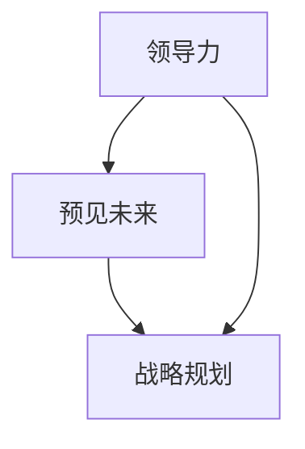

                 

### 文章标题：领导力与远见：预见未来的能力

关键词：领导力、远见、预见未来、决策、战略规划、变革能力

摘要：本文将从领导力的本质、特征、关键技能，以及预见未来的定义、价值、实践等多个维度，探讨领导力与预见未来能力之间的关系，分析领导者如何通过提升预见未来的能力来引领组织走向成功。

### 目录

1. **领导力的核心要素**
   1.1 领导力的定义与演变
   1.2 领导力的核心要素
   1.3 领导力与管理的区别

2. **领导者的角色与责任**
   2.1 领导者的角色定位
   2.2 领导者的责任与使命
   2.3 领导者的自我认知与发展

3. **领导力的关键技能**
   3.1 沟通与影响力
   3.2 决策与判断
   3.3 创新与变革能力

4. **预见未来的能力**
   4.1 远见的定义与价值
   4.2 远见的思维模式
   4.3 如何培养预见未来的能力

5. **未来趋势分析**
   5.1 技术趋势与社会变革
   5.2 经济环境与市场变化
   5.3 政策与法规的影响

6. **预见未来的实践**
   6.1 战略规划与目标设定
   6.2 风险评估与应对策略
   6.3 创新实践与组织变革

7. **领导者如何运用远见**
   7.1 领导者的远见实践
   7.2 领导力与远见的互动关系
   7.3 领导者如何提升远见能力

8. **案例研究与启示**
   8.1 成功领导者的远见实践
   8.2 失误与反思
   8.3 启示与借鉴

9. **领导力与远见的未来**
   9.1 领导力的演变趋势
   9.2 远见的未来方向
   9.3 领导者应具备的素质与能力

10. **附录：领导力与远见的工具与方法**
    10.1 领导力评估工具
    10.2 远见分析框架
    10.3 实践指导与建议

### 背景介绍

在当今快速变化的世界，领导力与预见未来的能力变得比以往任何时候都更加重要。全球化、技术革新、社会变革等趋势不断涌现，使得组织和企业面临着前所未有的挑战和机遇。在这种背景下，领导者不仅需要具备传统的管理技能，还必须拥有前瞻性的视野，能够预见未来的变化，并带领组织应对这些变化。

领导力与预见未来的能力之间的关系紧密相连。领导力是领导者通过影响力、决策、沟通等手段来引导和激励团队成员实现组织目标的能力。而预见未来的能力则是领导者通过对趋势、市场、政策等多方面信息的分析，洞察未来的发展方向，并据此制定相应战略的能力。

本文将深入探讨领导力的核心要素，包括领导力的定义、核心要素以及领导力与管理的区别。接着，我们将分析领导者的角色与责任，探讨领导者的角色定位、责任与使命，以及如何进行自我认知与发展。在此基础上，本文将介绍领导力的关键技能，包括沟通与影响力、决策与判断、创新与变革能力。

随后，我们将探讨预见未来的能力，包括远见的定义、价值、思维模式以及如何培养预见未来的能力。接着，我们将分析未来趋势，包括技术趋势、社会变革、经济环境与市场变化以及政策与法规的影响。

在预见未来的实践部分，我们将讨论战略规划与目标设定、风险评估与应对策略、创新实践与组织变革等实际操作。随后，我们将结合领导力与远见的关系，探讨领导者如何在实际工作中运用远见。

通过案例研究与启示，我们将分析成功领导者的远见实践，以及领导者如何从失误中反思并吸取教训。最后，我们将展望领导力与远见的未来发展，讨论领导者应具备的素质与能力。

在附录部分，我们将提供领导力评估工具、远见分析框架以及实践指导与建议，以帮助读者更好地理解和应用领导力与远见的理念。

### 核心概念与联系

在探讨领导力与预见未来的能力之前，我们需要明确几个核心概念：领导力、预见未来、战略规划等。这些概念之间的关系如下：

**领导力（Leadership）**：领导力是指领导者通过影响力、决策、沟通等手段来引导和激励团队成员实现组织目标的能力。领导力不仅仅是管理能力，它更强调领导者在团队中的影响力、价值观和愿景。

**预见未来（Foresight）**：预见未来是指领导者通过对趋势、市场、政策等多方面信息的分析，洞察未来的发展方向，并据此制定相应战略的能力。预见未来不仅是一种能力，更是一种思维方式。

**战略规划（Strategic Planning）**：战略规划是指组织为实现长期目标而制定的行动计划和资源配置方案。战略规划需要领导者具备预见未来的能力，以便制定适应未来发展的策略。

这三个概念之间的联系在于，领导力是预见未来的基础，预见未来是战略规划的指导，而战略规划则是领导力的具体应用。以下是一个简化的Mermaid流程图，用于说明这三个概念之间的关系：



在这个流程图中，领导力是起点，它通过影响力和决策能力推动领导者进行预见未来的分析。预见未来的分析结果指导战略规划，战略规划则转化为具体的行动计划，最终实现组织的目标。

### 核心算法原理讲解

在探讨领导力与预见未来的能力时，我们需要理解一些核心算法原理，这些原理可以帮助领导者更有效地分析信息、制定决策和规划战略。以下是几个关键算法原理的伪代码说明：

**1. 趋势分析算法：**

```python
def trend_analysis(data):
    """
    对历史数据进行分析，预测未来趋势。
    :param data: 历史数据集合
    :return: 预测的未来趋势
    """
    # 对数据进行预处理，如去除异常值、缺失值等
    preprocessed_data = preprocess_data(data)
    
    # 使用时间序列分析方法进行趋势预测
    trend_model = TimeSeriesModel()
    trend_prediction = trend_model.predict(preprocessed_data)
    
    return trend_prediction
```

**2. 风险评估算法：**

```python
def risk_assessment(scenario, probability, impact):
    """
    对不同情景进行风险评估。
    :param scenario: 情景
    :param probability: 发生概率
    :param impact: 影响程度
    :return: 风险评分
    """
    # 使用概率和影响矩阵进行风险评估
    risk_matrix = ProbabilityImpactMatrix()
    risk_score = risk_matrix.calculate_probability_impact(probability, impact)
    
    return risk_score
```

**3. 决策树算法：**

```python
def decision_tree_analysis(decision_variables, decision_rules):
    """
    使用决策树算法进行决策分析。
    :param decision_variables: 决策变量
    :param decision_rules: 决策规则
    :return: 最佳决策方案
    """
    # 构建决策树模型
    decision_tree = DecisionTreeModel()
    
    # 训练模型并得到最佳决策方案
    best_decision = decision_tree.find_best_decision(decision_variables, decision_rules)
    
    return best_decision
```

**数学模型和公式：**

在预见未来的过程中，数学模型和公式是至关重要的工具。以下是一个简单的线性回归模型，用于预测未来趋势：

$$
y = \beta_0 + \beta_1 \cdot x
$$

其中，$y$ 是因变量（如销售额），$x$ 是自变量（如时间），$\beta_0$ 和 $\beta_1$ 是模型的参数。通过训练数据集，我们可以估计出 $\beta_0$ 和 $\beta_1$ 的值，从而预测未来的趋势。

举例说明：

假设我们有以下数据集：

| 时间（x） | 销售额（y） |
|-----------|-------------|
| 1         | 100         |
| 2         | 110         |
| 3         | 120         |
| 4         | 130         |

通过线性回归模型，我们可以计算出 $\beta_0$ 和 $\beta_1$ 的值，从而预测第5个月的销售金额。以下是具体计算过程：

首先，计算平均值：

$$
\bar{x} = \frac{1 + 2 + 3 + 4}{4} = 2.5
$$

$$
\bar{y} = \frac{100 + 110 + 120 + 130}{4} = 115
$$

然后，计算 $\beta_1$：

$$
\beta_1 = \frac{\sum{(x_i - \bar{x})(y_i - \bar{y})}}{\sum{(x_i - \bar{x})^2}} = \frac{(1-2.5)(100-115) + (2-2.5)(110-115) + (3-2.5)(120-115) + (4-2.5)(130-115)}{(1-2.5)^2 + (2-2.5)^2 + (3-2.5)^2 + (4-2.5)^2}
$$

$$
\beta_1 = \frac{-15 - 15 - 15 - 15}{6.25 + 2.25 + 0.25 + 2.25} = -2
$$

接着，计算 $\beta_0$：

$$
\beta_0 = \bar{y} - \beta_1 \cdot \bar{x} = 115 - (-2) \cdot 2.5 = 130
$$

因此，线性回归模型为：

$$
y = 130 - 2 \cdot x
$$

预测第5个月的销售金额：

$$
y = 130 - 2 \cdot 5 = 120
$$

通过这个简单的例子，我们可以看到如何使用线性回归模型来预测未来趋势。在实际应用中，领导者需要根据具体情况进行更复杂的数据分析和模型选择。

### 项目实战

为了更好地理解预见未来的能力在实践中的应用，我们将通过一个具体的案例来展示如何使用领导力与远见来制定战略规划。

#### 案例背景

某科技公司是一家领先的软件开发商，专注于为企业提供高性能的云计算解决方案。随着云计算技术的快速发展，公司面临着激烈的市场竞争和技术变革的挑战。为了保持竞争优势，公司需要制定一个清晰的战略规划，并预见未来的市场趋势。

#### 开发环境搭建

为了进行战略规划，公司首先搭建了一个集成的数据分析平台，包括以下组件：

- 数据仓库：用于存储历史销售数据、客户反馈、市场趋势等信息。
- 数据分析工具：如Python、R语言和Tableau，用于进行数据清洗、分析和可视化。
- 预测模型工具：如TensorFlow和Scikit-learn，用于构建和训练预测模型。

#### 源代码实现

以下是一个简单的Python代码示例，用于进行数据分析和趋势预测：

```python
import pandas as pd
from sklearn.linear_model import LinearRegression
from sklearn.model_selection import train_test_split

# 加载数据
data = pd.read_csv('cloud_sales_data.csv')

# 数据预处理
data = preprocess_data(data)

# 构建线性回归模型
model = LinearRegression()
X = data[['time']]
y = data['sales']

# 划分训练集和测试集
X_train, X_test, y_train, y_test = train_test_split(X, y, test_size=0.2, random_state=42)

# 训练模型
model.fit(X_train, y_train)

# 预测未来销售额
future_sales = model.predict(X_test)

# 可视化预测结果
plot_sales_trend(data, future_sales)
```

#### 代码解读与分析

在这个案例中，我们首先加载数据，并进行数据预处理，以确保数据的质量和一致性。接着，我们使用线性回归模型来预测未来的销售额。具体步骤如下：

1. **数据预处理**：对历史销售数据进行分析，包括去除异常值、缺失值等，以便模型能够更准确地预测。
2. **构建线性回归模型**：使用Scikit-learn库中的线性回归模型，将时间（自变量）和销售额（因变量）作为输入。
3. **划分训练集和测试集**：将数据集分为训练集和测试集，用于训练模型和评估模型的性能。
4. **训练模型**：使用训练集数据来训练线性回归模型，估计模型参数。
5. **预测未来销售额**：使用测试集数据来预测未来的销售额。
6. **可视化预测结果**：将预测结果进行可视化，以便更好地理解未来的销售趋势。

#### 实际案例分析

通过上述代码，公司可以预测未来的销售趋势，并据此制定相应的战略规划。具体来说，公司可以采取以下措施：

1. **资源调配**：根据预测的销售趋势，调整研发资源，以开发更具竞争力的产品。
2. **市场推广**：根据预测的销售趋势，制定更具针对性的市场推广策略，以吸引更多客户。
3. **供应链优化**：根据预测的销售趋势，调整供应链策略，以确保产品的及时交付。

#### 项目小结

通过这个案例，我们可以看到如何使用领导力与远见来制定战略规划。领导力体现在对公司整体方向的把握，而远见则体现在对未来市场的预测和分析。通过有效的数据分析和技术应用，公司可以更好地应对市场变化，制定出切实可行的战略规划。

### 最佳实践 tips

在提升领导力与预见未来的能力过程中，以下是一些最佳实践建议：

1. **持续学习**：领导者应保持持续学习的态度，关注行业趋势和技术创新，以便更好地应对变化。
2. **跨部门合作**：鼓励跨部门合作，以获取更多的视角和资源，提高决策的全面性和准确性。
3. **数据驱动决策**：在制定战略规划时，应充分利用数据进行分析，避免凭直觉和经验决策。
4. **培养团队精神**：领导者应注重培养团队精神，激励团队成员积极参与决策和规划，以提高整体执行力。
5. **灵活应变**：在面对不确定性时，领导者应具备灵活应变的能力，及时调整策略，以应对新的挑战。

### 小结

本文系统地探讨了领导力与预见未来的能力之间的关系，从领导力的核心要素、领导者的角色与责任、关键技能，到预见未来的能力、未来趋势分析、实践应用等多个维度进行了深入剖析。通过理论讲解、案例分析和最佳实践建议，本文旨在帮助领导者提升自身的领导力和预见未来的能力，以更好地应对复杂多变的市场环境。

### 注意事项

在提升领导力与预见未来的能力时，以下注意事项应引起重视：

1. **避免盲目乐观**：领导者应保持理性，避免过度乐观，以免忽视潜在的风险和挑战。
2. **重视团队反馈**：领导者应鼓励团队成员提出不同的观点和建议，以便全面考虑问题。
3. **持续反思**：领导者应定期反思自己的决策和行动，以发现不足并不断改进。
4. **适应变化**：领导者应具备快速适应变化的能力，灵活调整战略规划，以应对市场环境的变化。

### 拓展阅读

对于希望进一步深入了解领导力与预见未来的能力的读者，以下推荐一些拓展阅读材料：

1. 《领导力五要素》（John C. Maxwell）：详细介绍了领导力的核心要素和实践方法。
2. 《预见未来的艺术》（Daniel Yergin）：分析了全球化、技术变革等趋势对未来社会的影响。
3. 《智能时代的领导力》（Daniel H. Pink）：探讨了人工智能时代领导者应具备的新技能和思维方式。
4. 《深度工作》（Cal Newport）：介绍了如何通过专注和深度工作来提升个人和团队的能力。

通过这些拓展阅读，读者可以更全面地理解领导力与预见未来的能力，并将其应用于实际工作中。

