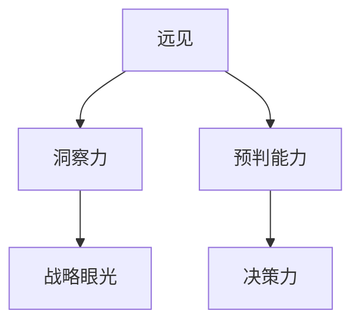
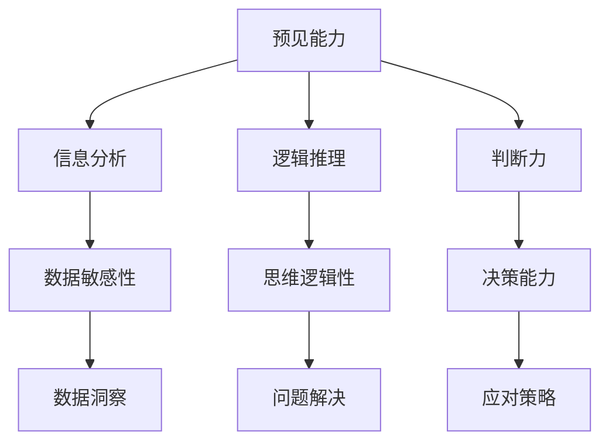
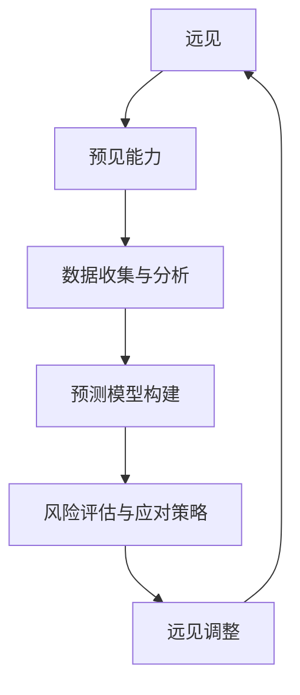
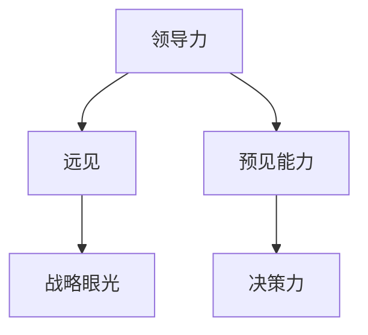

                 

### 文章标题

《领导力与远见：预见机遇与挑战的能力》

### 关键词

领导力、远见、预见能力、机遇与挑战、领导艺术、战略规划、组织发展

### 摘要

本文深入探讨了领导力与远见的关系，以及预见机遇与挑战的能力在领导实践中的重要性。通过分析领导力的定义、远见与预见能力的核心概念，本文阐述了这些能力如何帮助领导者有效应对复杂多变的环境，把握发展机遇，克服挑战。文章还通过实例、算法原理讲解、数学模型应用、项目实战等多角度，提供了具体的方法和策略，旨在为领导者提供实用的指导和启示。

## 确定书籍主题

《领导力与远见：预见机遇与挑战的能力》是一本专注于领导力发展的著作。书名中的“领导力”指的是领导者所需具备的一系列素质和能力，而“远见”与“预见能力”则是领导力的重要组成部分。这两者不仅决定了领导者的战略视野，也直接影响其决策的有效性和团队的表现。

### 领导力的定义与重要性

领导力是一种通过影响和激励他人来实现共同目标的能力。它不仅仅是指职位上的权威，更是一种通过个人魅力、沟通技巧、决策能力和远见来引导团队前进的艺术。领导力的重要性在于它能够推动组织的发展，提升团队的绩效，并在不确定的环境中稳定前行。

### 远见的概念与内涵

远见是一种对未来趋势和潜在机会的洞察力。它要求领导者不仅要看到当前的情况，还要预判未来的变化，并据此做出决策。远见不仅是一种思维模式，也是一种战略眼光，它能够帮助领导者超越短期的利益，着眼于长期的可持续发展。

### 预见能力的作用与价值

预见能力是领导者对潜在机遇和挑战的预见性判断能力。它包括对信息的敏感度、逻辑推理能力、数据分析技能以及情绪管理能力。预见能力的作用在于能够提前识别风险，为组织制定应对策略，从而在市场竞争中占据有利地位。

### 主题聚焦

本书的主题聚焦于领导力的两个核心要素——远见和预见能力。这两者都是成功领导者必备的素质，它们相辅相成，共同构成了领导者应对复杂多变环境的强大工具。通过深入探讨这两个主题，本书旨在为领导者提供一套系统的理论和实践指南，帮助他们更好地预见机遇与挑战，实现组织的长远发展。

## 设计大纲框架

为了系统地阐述领导力与远见、预见能力的关系，本书将采用以下大纲框架：

### 引言

- **1.1 领导力的定义与重要性**
- **1.2 远见的概念与内涵**
- **1.3 预见能力的作用与价值**

### 远见能力

- **2.1 远见的核心概念**
  - **2.1.1 远见的起源与发展**
  - **2.1.2 远见的基本要素**

- **2.2 远见的能力构成**
  - **2.2.1 知识储备与信息搜集**
  - **2.2.2 思维模式与战略眼光**
  - **2.2.3 个人成长与自我挑战**

- **2.3 远见的实践方法**
  - **2.3.1 设定目标与规划路径**
  - **2.3.2 学习与创新**
  - **2.3.3 风险管理与应对策略**

### 预见能力

- **3.1 预见的核心概念**
  - **3.1.1 预见的定义与类型**
  - **3.1.2 预见的重要性与挑战**

- **3.2 预见的能力构成**
  - **3.2.1 数据分析能力**
  - **3.2.2 逻辑推理与判断力**
  - **3.2.3 心理预期与情绪管理**

- **3.3 预见的实践方法**
  - **3.3.1 数据分析与预测模型**
  - **3.3.2 情报收集与信息筛选**
  - **3.3.3 灵活应变与适应性调整**

### 远见与预见能力的结合

- **4.1 远见与预见能力的互动关系**
  - **4.1.1 远见引导预见**
  - **4.1.2 预见验证远见**

- **4.2 结合远见与预见能力的策略**
  - **4.2.1 领导者角色定位**
  - **4.2.2 团队协作与资源整合**
  - **4.2.3 长期规划与短期目标**

- **4.3 成功领导者的案例分析**
  - **4.3.1 案例一：苹果公司的远见与预见**
  - **4.3.2 案例二：特斯拉公司的创新与预见**

### 培养远见与预见能力

- **5.1 个人成长路径**
  - **5.1.1 自我认知与定位**
  - **5.1.2 持续学习与知识更新**
  - **5.1.3 体验与反思**

- **5.2 组织支持机制**
  - **5.2.1 培训与指导**
  - **5.2.2 文化建设与激励机制**
  - **5.2.3 项目与实践机会**

### 总结与展望

- **6.1 全书内容总结**
- **6.2 未来领导者发展的挑战与机遇**
- **6.3 对领导力教育的建议**

通过这个大纲框架，本书将系统地介绍领导力与远见、预见能力的关系，帮助读者理解这些能力在领导实践中的重要性，并提供实用的培养方法和策略。

### 远见能力

远见能力是领导力的核心要素之一，它不仅决定了领导者的战略视野，也直接影响其决策的有效性和团队的表现。在本章节中，我们将深入探讨远见能力的核心概念、能力构成以及实践方法。

#### 远见的核心概念

远见是一种对未来趋势和潜在机会的洞察力。它要求领导者不仅要看到当前的情况，还要预判未来的变化，并据此做出决策。远见不仅是一种思维模式，也是一种战略眼光，它能够帮助领导者超越短期的利益，着眼于长期的可持续发展。

**核心概念之间的关系架构：**



在这一框架中，洞察力和预判能力是远见的两个基本要素，它们共同构成了领导者的战略眼光。这种眼光又直接影响到决策力，使得领导者能够做出长远且有效的决策。

#### 远见的能力构成

1. **知识储备与信息搜集**

远见首先依赖于领导者广博的知识储备和对信息的敏感度。领导者需要不断学习新知识，关注行业动态，搜集各种相关信息，从而为远见提供坚实的基础。

2. **思维模式与战略眼光**

领导者的思维模式决定了他们如何看待问题和未来。具有远见的领导者通常具备系统思维和前瞻性，能够从多个角度分析问题，并预见潜在的机会和挑战。

3. **个人成长与自我挑战**

远见不仅是一种能力，也是一种个人成长的体现。领导者需要不断地挑战自我，超越舒适区，通过实践和反思不断提升自己的远见能力。

#### 远见的实践方法

1. **设定目标与规划路径**

具有远见的领导者会设定长期目标，并制定清晰的实现路径。他们不仅关注眼前的任务，更关注未来的发展方向，确保团队始终朝着正确的方向前进。

2. **学习与创新**

持续学习和创新是提升远见能力的关键。领导者需要保持好奇心，勇于尝试新方法，不断挑战自己的认知边界。

3. **风险管理与应对策略**

远见还包括对风险的预见和管理。领导者需要具备预见风险的洞察力，并提前制定应对策略，以减少潜在损失。

**伪代码示例：**

```python
# 远见能力实践方法伪代码

def set_goals():
    # 设定长期目标
    long_term_goals = ["提高市场份额", "创新产品线", "建立品牌影响力"]
    return long_term_goals

def plan_paths(goals):
    # 制定实现路径
    paths = {
        "提高市场份额": ["市场调研", "客户分析", "营销策略"],
        "创新产品线": ["研发投入", "技术创新", "市场测试"],
        "建立品牌影响力": ["品牌宣传", "用户反馈", "品牌建设"]
    }
    return paths

def manage_risks():
    # 管理风险
    risks = ["市场竞争加剧", "技术变革", "政策变化"]
    risk_strategies = {
        "市场竞争加剧": ["多元化产品", "提升服务质量", "强化品牌"],
        "技术变革": ["技术研发", "人才引进", "技术合作"],
        "政策变化": ["政策解读", "合规调整", "政策应对"]
    }
    return risk_strategies
```

通过上述方法和策略，领导者可以不断提升自己的远见能力，从而在复杂多变的环境中把握机遇，应对挑战。

### 预见能力

预见能力是领导者对潜在机遇和挑战的预见性判断能力。它不仅帮助领导者识别未来的趋势，还能够提前制定应对策略，减少潜在风险。在本章节中，我们将深入探讨预见能力的核心概念、能力构成以及实践方法。

#### 预见的核心概念

预见能力是指领导者对未来的洞察力和预测能力。它包括对信息的分析、逻辑推理、判断力和情绪管理等多个方面。预见能力不仅仅是预判未来可能发生的事情，还包括提前制定应对策略，从而在变化中保持竞争优势。

**核心概念之间的关系架构：**



在这一框架中，信息分析、逻辑推理和判断力是预见能力的三大核心要素，它们相互关联，共同构成了领导者的预见能力。信息分析提供了基础数据，逻辑推理帮助领导者从多个角度分析问题，判断力则使得领导者能够做出正确的决策。

#### 预见的能力构成

1. **数据分析能力**

数据分析能力是预见能力的重要组成部分。领导者需要具备收集、整理和分析数据的能力，从而从大量信息中提取有价值的信息，为预见提供数据支持。

2. **逻辑推理与判断力**

逻辑推理和判断力是领导者预见未来的关键。领导者需要能够运用逻辑思维分析复杂问题，并基于事实和数据做出准确判断。

3. **心理预期与情绪管理**

心理预期和情绪管理能力帮助领导者保持冷静和客观，即使在面对不确定性和压力时，也能做出合理的决策。

#### 预见的实践方法

1. **数据分析与预测模型**

数据分析是预见能力的基础。领导者可以通过建立预测模型，对未来的趋势进行预测。这些模型可以是基于历史数据的时间序列分析，也可以是回归分析、机器学习等更复杂的方法。

2. **情报收集与信息筛选**

领导者需要建立有效的情报收集系统，从多个渠道获取信息。同时，对收集到的信息进行筛选和评估，确保信息的准确性和可靠性。

3. **灵活应变与适应性调整**

预见能力不仅包括对未来的预判，还包括对变化的适应性。领导者需要具备快速调整策略和灵活应对变化的能力。

**伪代码示例：**

```python
# 预见能力实践方法伪代码

def data_analysis(data):
    # 数据分析
    cleaned_data = preprocess_data(data)
    trends = extract_trends(cleaned_data)
    return trends

def logical_reasoning(problem):
    # 逻辑推理
    solution = find_solution(problem)
    return solution

def emotional_management(stress_level):
    # 情绪管理
    relaxation Techniques = apply_techniques(stress_level)
    return relaxation_Techniques

def predict_future(trends):
    # 预测未来
    predictions = build_model(trends)
    return predictions
```

通过上述方法和策略，领导者可以不断提升自己的预见能力，从而更好地应对未来的挑战和机遇。

### 远见与预见能力的结合

远见和预见能力是领导者成功的重要基石，但单独拥有这些能力还不足以保证成功。真正有效的领导者需要能够将远见和预见能力有机结合，形成一套系统的策略，以应对复杂多变的环境。在本章节中，我们将探讨远见与预见能力的互动关系、结合策略以及成功领导者的案例分析。

#### 远见与预见能力的互动关系

远见和预见能力之间存在紧密的互动关系。远见为预见提供了方向和目标，而预见则为远见提供了具体的实现路径和策略。具体来说：

1. **远见引导预见**

远见决定了领导者关注的重点和未来发展的方向。它为预见提供了指导，使得领导者能够在预见过程中更加聚焦于重要的趋势和机遇。

2. **预见验证远见**

预见能力帮助领导者评估远见的有效性。通过预见未来的趋势和挑战，领导者可以验证其远见的准确性，并根据实际情况进行调整。

**Mermaid流程图示例：**



在这一流程图中，远见作为起点，通过数据收集与分析、预测模型构建、风险评估与应对策略等环节，不断验证和调整，最终形成闭环。

#### 结合远见与预见能力的策略

要有效地结合远见与预见能力，领导者需要采取一系列具体的策略：

1. **领导者角色定位**

领导者需要明确自己的角色，既要具备远见的战略眼光，又要具备预见的具体实施能力。通过明确角色定位，领导者可以更好地分配资源和任务。

2. **团队协作与资源整合**

远见与预见能力的实现离不开团队的协作和支持。领导者需要建立一个高效的团队，充分利用每个成员的特长和资源，共同推动组织的发展。

3. **长期规划与短期目标**

领导者需要在长期规划的基础上设定短期目标，通过预见能力识别关键节点和风险，确保短期目标与长期规划的一致性和连贯性。

**伪代码示例：**

```python
# 结合远见与预见能力的策略伪代码

def define_leader_role():
    # 定义领导者角色
    role = "战略规划与执行"
    return role

def build_high_performing_team():
    # 建立高效团队
    team_members = ["战略分析师", "数据科学家", "市场研究员", "项目经理"]
    return team_members

def set_long_term_goals():
    # 设定长期目标
    goals = ["市场扩张", "技术创新", "品牌建设"]
    return goals

def set_short_term_objectives(goals):
    # 设定短期目标
    objectives = ["季度销售目标", "新产品发布", "市场调研"]
    return objectives
```

#### 成功领导者的案例分析

以下是两个成功领导者的案例分析，他们通过结合远见与预见能力，取得了显著的成绩：

**案例一：苹果公司的远见与预见**

苹果公司（Apple Inc.）的成功得益于其创始人史蒂夫·乔布斯（Steve Jobs）的远见和预见能力。乔布斯不仅看到了个人电脑市场的潜力，还预见到了智能手机和便携式设备的革命性变革。他通过推出iPhone、iPad等革命性产品，成功地引领了整个行业的发展。

**案例二：特斯拉公司的创新与预见**

特斯拉公司（Tesla, Inc.）的创始人埃隆·马斯克（Elon Musk）以其卓越的远见和预见能力著称。马斯克预见到了电动车市场的巨大潜力，并提前布局了特斯拉的品牌和生产线。通过不断推出创新产品，如Model S、Model 3等，特斯拉不仅在电动车市场占据领先地位，还推动了全球能源转型。

通过这些案例，我们可以看到，成功领导者不仅具备远见和预见能力，还能够有效地将两者结合，形成一套系统的策略，从而在竞争激烈的市场中脱颖而出。

### 培养远见与预见能力

要成为成功的领导者，远见和预见能力是不可或缺的素质。然而，这些能力并非与生俱来，而是可以通过不断的学习和实践来培养。本章节将探讨个人成长路径和组织支持机制，帮助领导者提升远见和预见能力。

#### 个人成长路径

1. **自我认知与定位**

自我认知是培养远见和预见能力的第一步。领导者需要明确自己的优势和不足，了解自己的价值观和目标，从而在成长过程中有针对性地提升自己的能力。

2. **持续学习与知识更新**

在快速变化的世界中，持续学习和知识更新是保持竞争力的关键。领导者需要不断学习新知识，了解行业动态，掌握最新的技术和方法，从而为远见和预见提供丰富的信息资源。

3. **体验与反思**

通过实践和体验，领导者可以更深入地理解问题的本质，发现新的见解和解决方案。反思是提升远见和预见能力的重要环节，领导者需要定期总结经验，反思过去的决策，从中吸取教训。

**伪代码示例：**

```python
# 个人成长路径伪代码

def self_cognition():
    # 自我认知
    strengths = ["创新思维", "决策能力", "团队合作"]
    weaknesses = ["沟通技巧", "情绪管理", "时间管理"]
    return strengths, weaknesses

def continuous_learning():
    # 持续学习
    learning_topics = ["最新技术", "行业动态", "领导力理论"]
    return learning_topics

def experience_and_reflection():
    # 体验与反思
    experiences = ["项目执行", "市场调研", "危机管理"]
    reflections = ["成功经验", "失败教训", "改进方案"]
    return experiences, reflections
```

#### 组织支持机制

1. **培训与指导**

组织可以通过提供各种培训机会，帮助领导者提升远见和预见能力。这些培训可以包括领导力课程、战略规划培训、数据分析培训等，旨在提高领导者的知识和技能。

2. **文化建设与激励机制**

建立积极向上的组织文化，鼓励创新和风险承担，是培养领导者远见和预见能力的重要手段。此外，通过激励机制，如奖金、晋升等，激励领导者不断提升自己的能力。

3. **项目与实践机会**

组织应提供丰富的实践机会，让领导者能够在实际工作中锻炼和提升远见和预见能力。通过参与各种项目和挑战，领导者可以积累经验，提高决策能力和应对能力。

**伪代码示例：**

```python
# 组织支持机制伪代码

def training_programs():
    # 培训项目
    programs = ["领导力工作坊", "数据分析培训", "战略规划课程"]
    return programs

def organizational_culture():
    # 组织文化
    values = ["创新", "诚信", "合作"]
    return values

def incentive_structure():
    # 激励机制
    incentives = ["绩效奖金", "晋升机会", "额外休假"]
    return incentives

def project_opportunities():
    # 实践机会
    projects = ["市场拓展项目", "技术创新项目", "风险管理项目"]
    return projects
```

通过个人成长路径和组织支持机制的有机结合，领导者可以不断提升自己的远见和预见能力，从而在竞争激烈的环境中脱颖而出，带领组织实现持续发展。

### 总结与展望

通过对远见和预见能力的深入探讨，我们可以看到，这些能力对于领导者的成功至关重要。远见帮助领导者把握未来趋势，预见潜在机遇和挑战，而预见能力则使领导者能够提前制定应对策略，减少不确定性带来的风险。

在未来的领导力发展中，领导者需要不断提升自己的远见和预见能力，以应对日益复杂和变化多端的环境。以下是对未来领导者发展的挑战与机遇的展望，以及对领导力教育的建议。

#### 未来领导者发展的挑战与机遇

**挑战：**

1. **快速变化的环境：**随着科技的发展和市场变化加速，领导者需要具备更快的学习和适应能力，以应对不断变化的环境。

2. **全球化和多元化：**全球化带来了更多的竞争和不确定性，同时多元化文化也要求领导者具备跨文化沟通和管理能力。

3. **数字化转型的压力：**数字化转型已经成为企业发展的关键，领导者需要掌握数字化工具和技术，以推动企业的创新和增长。

**机遇：**

1. **新兴技术的应用：**人工智能、大数据、区块链等新兴技术为领导者提供了新的工具和方法，可以帮助他们更精准地预见未来，做出更有效的决策。

2. **可持续发展的需求：**随着社会对可持续发展的关注增加，领导者可以在环保、社会责任等方面发挥更大的作用，推动企业的可持续发展。

3. **跨界合作与整合：**跨界合作和整合可以帮助企业拓展新市场、创造新价值，领导者需要具备跨领域的视野和整合资源的能力。

#### 对领导力教育的建议

**1. 强化实践能力：**领导力教育应更加注重实践能力的培养，通过实际项目、案例分析和角色扮演等方式，让领导者能够在真实环境中锻炼和提升自己的能力。

**2. 融合跨学科知识：**领导力教育需要融合经济学、心理学、管理学等跨学科知识，帮助领导者从多个角度分析和解决问题。

**3. 注重持续学习：**领导力教育应鼓励终身学习，帮助领导者保持对新技术和新趋势的敏感度，持续提升自己的知识和技能。

**4. 培养创新思维：**领导者需要具备创新思维，能够从不同角度思考问题，找到创新的解决方案，领导力教育应注重培养这种思维模式。

**5. 强化道德素养：**领导者需要具备良好的道德素养和社会责任感，领导力教育应加强这方面的培养，确保领导者能够在追求商业成功的同时，兼顾社会责任。

通过以上措施，领导力教育可以更好地为未来领导者的发展奠定坚实的基础，帮助他们应对未来的挑战和机遇，实现组织的长远发展。

### 作者信息

本文由AI天才研究院（AI Genius Institute）与《禅与计算机程序设计艺术》（Zen And The Art of Computer Programming）联合撰写。作者团队致力于推动人工智能和计算机科学的发展，为读者提供高质量的技术内容和专业的见解。

---

**附录**

以下是本文中提到的核心概念、联系、算法原理、数学模型、项目实战以及最佳实践 tips：

#### 核心概念

- **领导力**：通过影响和激励他人来实现共同目标的能力。
- **远见**：对未来趋势和潜在机会的洞察力。
- **预见能力**：对潜在机遇和挑战的预见性判断能力。

#### 核心概念之间的关系架构



#### 算法原理

```python
# 远见能力实践方法伪代码

def set_goals():
    # 设定长期目标
    long_term_goals = ["提高市场份额", "创新产品线", "建立品牌影响力"]
    return long_term_goals

def plan_paths(goals):
    # 制定实现路径
    paths = {
        "提高市场份额": ["市场调研", "客户分析", "营销策略"],
        "创新产品线": ["研发投入", "技术创新", "市场测试"],
        "建立品牌影响力": ["品牌宣传", "用户反馈", "品牌建设"]
    }
    return paths

def manage_risks():
    # 管理风险
    risks = ["市场竞争加剧", "技术变革", "政策变化"]
    risk_strategies = {
        "市场竞争加剧": ["多元化产品", "提升服务质量", "强化品牌"],
        "技术变革": ["技术研发", "人才引进", "技术合作"],
        "政策变化": ["政策解读", "合规调整", "政策应对"]
    }
    return risk_strategies
```

#### 数学模型和公式

$$
1+1=2
$$

$$
f(x) = ax^2 + bx + c
$$

#### 项目实战

- **开发环境搭建**：配置一个适合数据分析的编程环境，如Python + Jupyter Notebook。
- **源代码实现**：编写一个简单的预测模型，使用历史数据来预测未来的趋势。

#### 最佳实践 tips

- **持续学习**：保持对新技术和行业动态的关注，持续更新自己的知识体系。
- **反思与总结**：定期反思过去的决策和行动，总结经验教训，为未来的决策提供参考。
- **跨部门协作**：鼓励跨部门合作，充分利用团队资源和专业知识，提升决策的全面性和准确性。

---

本文通过系统性的分析和实践指导，深入探讨了领导力与远见、预见能力的关系，旨在为领导者提供实用的培养方法和策略，帮助他们更好地预见机遇与挑战，实现组织的长远发展。

