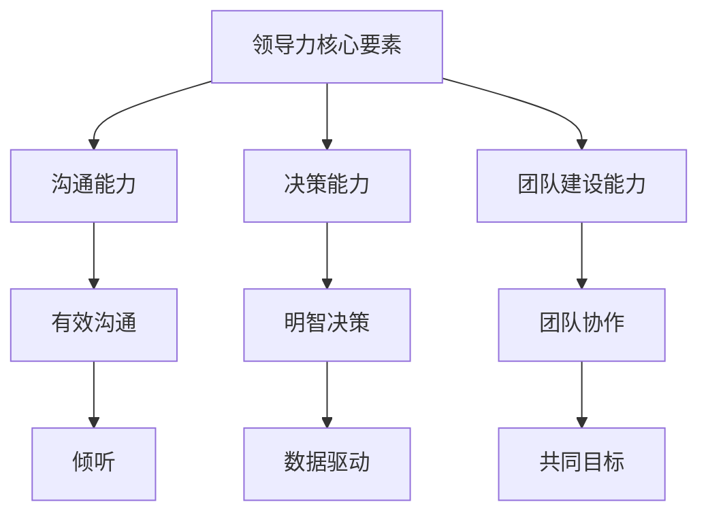

                 

### 文章标题

《领导力与适应性：在变革中保持方向》

### 关键词

- 领导力
- 变革管理
- 适应性
- 组织发展
- 情境领导理论

### 摘要

本文探讨了领导力在变革管理中的关键作用，以及如何通过提升适应性来保持组织在快速变化的环境中的方向。文章首先定义了领导力的核心要素，并分析了领导力在理论与实践中的应用。接着，文章讨论了变革中的领导力挑战和策略，以及领导力与组织适应性的关系。最后，文章提出了适应性领导力的核心能力及其培养方法，并展望了未来领导力的趋势和发展方向。通过本文的深入分析，读者将更好地理解如何在变革中发挥领导力，保持组织的前进方向。

## 《领导力与适应性：在变革中保持方向》目录大纲

### 第一部分：领导力的核心要素

#### 第1章：领导力的定义与意义
- **1.1.1 领导力的定义**
  - 领导力的基本概念
  - 领导力与管理的区别
- **1.1.2 领导力的意义**
  - 领导力对组织成功的重要性
  - 领导力在个人成长中的作用

#### 第2章：领导力的核心要素
- **2.1.1 沟通能力**
  - 沟通的重要性
  - 有效沟通的策略
- **2.1.2 决策能力**
  - 决策模型
  - 数据驱动决策
- **2.1.3 团队建设能力**
  - 团队动力
  - 共同目标的重要性

#### 第3章：领导力的理论与实践
- **3.1.1 领导力的发展历程**
  - 传统领导力理论
  - 现代领导力理论
- **3.1.2 领导风格与情境领导理论**
  - 领导风格类型
  - 情境领导理论的应用
- **3.1.3 领导力的发展途径**
  - 领导力培训
  - 领导力实践

### 第二部分：变革中的领导力

#### 第4章：变革中的领导力
- **4.1.1 变革的类型**
  - 结构性变革
  - 文化变革
- **4.1.2 变革中的领导力挑战**
  - 抗拒变革
  - 缺乏明确的方向
- **4.1.3 变革领导力的策略**
  - 沟通策略
  - 建立信任

#### 第5章：领导力与组织适应性
- **5.1.1 组织适应性的概念**
  - 适应性组织的定义
  - 适应性的重要性
- **5.1.2 领导力与组织适应性的关系**
  - 领导力如何影响适应性
  - 适应性领导力的关键要素
- **5.1.3 提升组织适应性的领导策略**
  - 培养创新思维
  - 持续学习与改进

### 第三部分：适应性领导力的实践

#### 第6章：适应性领导力的核心能力
- **6.1.1 适应性领导力的核心能力**
  - 快速学习
  - 灵活应对
- **6.1.2 适应性领导力的培养方法**
  - 实践经验
  - 持续学习

#### 第7章：适应性领导力在实践中的应用
- **7.1.1 适应性领导力在企业管理中的应用**
  - 企业战略调整
  - 市场反应能力
- **7.1.2 适应性领导力在团队管理中的应用**
  - 团队协作
  - 激励员工
- **7.1.3 适应性领导力在个人发展中的应用**
  - 个人成长计划
  - 面对挑战的态度

#### 第8章：领导力与适应性的未来发展趋势
- **8.1.1 变革环境下的领导力趋势**
  - 数字化领导力
  - 全球化领导力
- **8.1.2 适应性领导力的未来挑战**
  - 持续变化的环境
  - 技术进步的影响
- **8.1.3 适应性领导力的发展方向**
  - 创新思维的培养
  - 跨文化沟通技巧

### 附录：领导力与适应性相关资源

#### 附录1：领导力与适应性研究文献推荐
- 《领导力的五个层次》
- 《变革的力量》
- 《敏捷领导者》

#### 附录2：领导力与适应性实践案例分享
- 案例一：某科技公司在数字化转型中的领导力实践
- 案例二：某跨国公司如何通过适应性领导力应对全球市场变化

### Mermaid流程图



### 伪代码示例

```python
# 定义决策过程
def make_decision(context):
    if context == "紧急":
        return "迅速采取行动"
    elif context == "复杂":
        return "深思熟虑后决策"
    else:
        return "维持现状"

# 决策示例
context = "紧急"
decision = make_decision(context)
print("在当前情境下，决策为：", decision)
```

### 数学公式

$$
f(x) = ax^2 + bx + c
$$

### 举例说明

- 假设一个团队需要在一个紧迫的项目截止日期前完成任务，团队领导需要做出迅速决策以解决问题。

  在这种情况下，团队领导应该采取以下步骤：
  
  1. 收集所有必要的信息，包括团队成员的反馈和项目的当前状态。
  2. 与团队成员进行有效沟通，确保他们了解问题的严重性和紧急性。
  3. 分析数据，确定哪些任务对项目的完成最为关键。
  4. 根据数据分析结果，制定一个快速行动的计划。
  5. 指导团队成员按照计划执行任务。
  6. 定期跟进任务进度，确保项目按计划进行。
  
  通过这样的决策过程，团队领导能够有效地应对紧迫的项目挑战，确保团队在变革中保持方向。

### 代码实际案例

```python
# 导入必要的库
import numpy as np

# 创建一个模拟团队绩效评估的系统
def assess_performance(employees, targets):
    performance = []
    for i, employee in enumerate(employees):
        if employee >= targets[i]:
            performance.append("优秀")
        elif employee >= targets[i] * 0.8:
            performance.append("良好")
        else:
            performance.append("有待改进")

    return performance

# 定义员工绩效和目标
employees = [90, 85, 78, 88, 95]
targets = [100, 90, 80, 85, 95]

# 评估团队绩效
performance = assess_performance(employees, targets)

# 打印绩效结果
for i, p in enumerate(performance):
    print(f"员工{i+1}的绩效：{p}")

# 案例分析
print("\n案例分析：")
if all(p == "优秀" for p in performance):
    print("整个团队都达到了优秀绩效，说明领导力与适应性策略非常成功。")
else:
    print("存在绩效不达标的员工，需要进一步分析原因并采取改进措施。")
```

## 第一部分：领导力的核心要素

领导力是一种重要的管理能力，它不仅仅关乎领导者的个人特质，更是一种能够影响和激励他人、共同实现目标的能力。在这个快速变化的世界中，领导力的核心要素显得尤为重要。本部分将深入探讨领导力的定义与意义、领导力的核心要素及其在理论与实践中的应用。

### 第1章：领导力的定义与意义

#### 1.1.1 领导力的定义

领导力是指领导者通过一系列的行为和策略，影响、激励和引导他人，以实现共同目标和愿景的能力。它包括但不限于沟通能力、决策能力、团队建设能力等多个方面。领导力不仅存在于组织和企业中，也存在于社会、家庭等各个领域。

#### 1.1.2 领导力的意义

领导力对组织和个人都有着深远的影响。从组织角度来看，领导力能够促进组织的有效运作，提升组织的整体绩效。从个人角度来看，领导力有助于个人的职业发展，提升个人在团队中的影响力。

1. **对组织成功的重要性**

   - **提高员工士气**：有效的领导力能够激发员工的积极性，提高员工的满意度和忠诚度。
   - **促进创新与变革**：领导力能够引导团队面对变化，鼓励创新思维，推动组织持续发展。
   - **提升团队协作**：领导力能够促进团队成员之间的沟通与协作，共同实现组织目标。

2. **在个人成长中的作用**

   - **提升自信心**：领导力培养过程中的实践和反思能够提升个人的自信心。
   - **拓宽视野**：领导力要求领导者具备全局观念，有助于个人拓宽视野，提升决策能力。
   - **增强影响力**：领导力使个人在团队中具备更大的影响力，有助于实现个人和组织的共同目标。

### 第2章：领导力的核心要素

#### 2.1.1 沟通能力

沟通是领导力的核心要素之一，良好的沟通能力能够帮助领导者有效地传递信息、理解团队成员的需求，并建立良好的团队关系。

1. **沟通的重要性**

   - **传递信息**：领导者需要通过沟通明确组织的愿景、目标和策略。
   - **理解需求**：领导者需要倾听团队成员的意见和需求，以便更好地满足他们的需求。
   - **建立关系**：良好的沟通能够建立信任，增强团队凝聚力。

2. **有效沟通的策略**

   - **清晰明确**：沟通内容要清晰、简洁，避免歧义。
   - **倾听**：积极倾听，理解对方的观点和需求。
   - **反馈**：给予及时的反馈，确保信息准确传达。
   - **非语言沟通**：注意肢体语言、语调等非语言因素，增强沟通效果。

#### 2.1.2 决策能力

决策能力是领导力的重要组成部分，领导者需要在复杂的环境中做出明智的决策，以推动组织的发展。

1. **决策模型**

   - **理性决策模型**：基于数据和逻辑，通过分析各种可能性来做出决策。
   - **直觉决策模型**：依赖领导者的经验和直觉，快速做出决策。

2. **数据驱动决策**

   - **数据收集**：收集与决策相关的各种数据。
   - **数据分析**：运用统计学、数据分析等方法，分析数据的趋势和关系。
   - **数据应用**：将分析结果应用于决策过程中，提高决策的科学性和准确性。

#### 2.1.3 团队建设能力

团队建设能力是领导者带领团队实现共同目标的关键能力，良好的团队建设能够提升团队的整体效能。

1. **团队动力**

   - **共同目标**：明确团队的目标，确保团队成员都朝着同一方向努力。
   - **角色分工**：为每个团队成员分配合适的角色和任务，发挥各自的优势。
   - **团队氛围**：营造积极、合作、支持性的团队氛围，增强团队的凝聚力。

2. **共同目标的重要性**

   - **明确方向**：共同目标为团队提供了明确的方向，有助于团队成员集中精力。
   - **提高动力**：共同目标能够激发团队成员的积极性和创造力。
   - **衡量绩效**：共同目标为团队绩效提供了衡量的标准，有助于评估团队的工作成效。

### 第3章：领导力的理论与实践

#### 3.1.1 领导力的发展历程

领导力的发展历程经历了从传统领导力到现代领导力的转变。传统领导力强调领导者的权威和控制，而现代领导力则更注重领导者与团队成员的互动和合作。

1. **传统领导力理论**

   - **权力领导理论**：领导者通过权力和控制来影响团队成员。
   - **魅力型领导理论**：领导者通过个人魅力和影响力来激励团队成员。

2. **现代领导力理论**

   - **服务型领导理论**：领导者为团队成员提供服务，帮助他们实现个人和职业发展。
   - **情境领导理论**：领导者根据不同情境采取不同的领导风格。

#### 3.1.2 领导风格与情境领导理论

领导风格是指领导者在工作中表现出的行为和态度。不同的领导风格适用于不同的情境，领导者需要根据具体情况灵活调整领导风格。

1. **领导风格类型**

   - **权威型**：领导者集中决策权，下属执行命令。
   - **民主型**：领导者鼓励下属参与决策，共同制定目标。
   - **支持型**：领导者关心下属的需求，提供支持和指导。
   - **教练型**：领导者指导下属，帮助他们提升技能和信心。

2. **情境领导理论的应用**

   情境领导理论认为，领导者的风格应适应下属的成熟度。下属的成熟度包括能力水平和意愿水平，领导者需要根据下属的成熟度选择合适的领导风格。

   - **指示型（S1）**：下属能力低，意愿低，领导者提供明确指导和监督。
   - **推销型（S2）**：下属能力低，意愿高，领导者通过激励和沟通提高下属的信心和技能。
   - **参与型（S3）**：下属能力高，意愿低，领导者鼓励下属参与决策，增强其责任感。
   - **授权型（S4）**：下属能力高，意愿高，领导者赋予下属自主权，让他们自我管理和决策。

#### 3.1.3 领导力的发展途径

领导者的发展是一个持续的过程，需要通过培训、实践和反思来不断提升领导力。

1. **领导力培训**

   - **内部培训**：组织内部的领导力培训，包括领导力课程、研讨会等。
   - **外部培训**：参加外部机构的领导力培训，如MBA课程、领导力工作坊等。

2. **领导力实践**

   - **岗位实践**：通过实际工作中的领导实践，积累经验和技能。
   - **志愿服务**：参与志愿者活动，提升领导力和团队合作能力。

3. **领导力反思**

   - **定期反思**：通过自我反思，总结领导实践中的经验和教训。
   - **导师指导**：与经验丰富的领导者进行交流，获取指导和反馈。

## 第二部分：变革中的领导力

随着全球化和数字化的发展，组织面临的环境变得更加复杂和不确定。在这种情况下，领导力在变革管理中的作用愈发重要。本部分将探讨变革的类型、变革中的领导力挑战以及应对这些挑战的策略。

### 第4章：变革中的领导力

#### 4.1.1 变革的类型

变革可以分为结构性变革和文化变革两种类型。

1. **结构性变革**

   结构性变革涉及组织结构、流程、策略等方面的调整。例如，企业的重组、流程优化、战略调整等。

   - **优势**：提高组织的灵活性和效率，适应市场变化。
   - **挑战**：可能引发员工的不安和抵触，影响组织稳定性。

2. **文化变革**

   文化变革涉及价值观、态度和行为方式的改变。例如，鼓励创新、提高员工参与度、建立信任文化等。

   - **优势**：增强组织的凝聚力和创新力，提升整体绩效。
   - **挑战**：改变传统观念和行为习惯，需要时间和努力。

#### 4.1.2 变革中的领导力挑战

在变革过程中，领导者面临一系列挑战，包括：

1. **抗拒变革**

   员工可能因恐惧未知、抵触变化等原因而抗拒变革。领导者需要克服这种抗拒，引导员工接受变革。

2. **缺乏明确的方向**

   变革需要明确的目标和方向，领导者需要确保团队成员对变革有清晰的认识。

3. **资源限制**

   变革往往需要投入大量的人力、物力和财力，领导者需要有效管理资源，确保变革顺利进行。

4. **沟通不畅**

   变革过程中，信息传递的不畅通可能导致误解和猜疑。领导者需要建立有效的沟通机制，确保信息准确传达。

#### 4.1.3 变革领导力的策略

为了应对变革中的领导力挑战，领导者可以采取以下策略：

1. **建立信任**

   建立信任是变革成功的关键。领导者需要通过言行一致、透明沟通等方式赢得员工的信任。

2. **提供支持**

   领导者需要为员工提供必要的支持和资源，帮助他们适应变革。

3. **鼓励参与**

   鼓励员工参与变革过程，增强他们的主人翁意识。

4. **持续沟通**

   变革过程中，领导者需要保持与员工的持续沟通，确保他们了解变革的进展和成果。

## 第三部分：领导力与组织适应性

在快速变化的环境中，组织需要具备高度的适应性以应对外部压力和挑战。领导力在这一过程中起着至关重要的作用。本部分将探讨组织适应性的概念、领导力与组织适应性的关系，以及提升组织适应性的领导策略。

### 第5章：领导力与组织适应性

#### 5.1.1 组织适应性的概念

组织适应性是指组织在面对外部环境变化时，能够迅速调整自身结构、流程、策略，以维持或提升竞争力的一种能力。组织适应性包括以下几个方面：

1. **环境敏感性**

   组织需要对外部环境的变化保持高度敏感，及时捕捉市场趋势、技术进步等信息。

2. **灵活反应**

   组织需要在面对变化时能够快速做出反应，调整内部结构、流程和策略。

3. **创新能力**

   组织需要具备创新能力，通过引入新技术、新方法等，推动组织持续发展。

4. **学习与改进**

   组织需要不断学习，从成功和失败中吸取经验，持续改进。

#### 5.1.2 领导力与组织适应性的关系

领导力是组织适应性的关键因素。有效的领导力能够推动组织适应外部环境的变化，提升组织的竞争力。

1. **领导者的影响力**

   领导者通过其影响力，能够推动组织成员接受变革，积极参与组织适应性建设。

2. **领导者的愿景**

   领导者的愿景为组织提供了明确的发展方向，使组织能够更好地应对外部环境的变化。

3. **领导者的决策能力**

   领导者的决策能力决定了组织在变革中的反应速度和效果。

4. **领导者的沟通能力**

   领导者的沟通能力能够确保组织成员理解变革的重要性，积极参与变革过程。

#### 5.1.3 提升组织适应性的领导策略

为了提升组织的适应性，领导者可以采取以下策略：

1. **建立适应性组织文化**

   领导者需要建立一种鼓励创新、容忍失败、注重学习的组织文化，为组织适应性提供良好的环境。

2. **推动持续学习**

   领导者需要推动组织成员不断学习，提升他们的技能和知识，以适应外部环境的变化。

3. **建立灵活的决策机制**

   领导者需要建立灵活的决策机制，使组织能够快速应对外部环境的变化。

4. **鼓励员工参与**

   领导者需要鼓励员工参与变革过程，增强他们的主人翁意识，提升组织的凝聚力。

## 第四部分：适应性领导力的核心能力

在快速变化的环境中，领导者不仅需要具备传统的领导能力，还需要具备适应性的领导能力。适应性领导力是一种能够在不确定性和复杂环境中灵活应对、迅速调整的能力。本部分将探讨适应性领导力的核心能力及其培养方法。

### 第6章：适应性领导力的核心能力

#### 6.1.1 适应性领导力的核心能力

适应性领导力的核心能力包括以下几个方面：

1. **快速学习**

   适应性领导者需要具备快速学习的能力，能够迅速吸收新知识、新技能，并将其应用于实践中。快速学习不仅包括技术知识和市场趋势，还包括领导技巧和管理方法。

2. **灵活应对**

   适应性领导者需要具备灵活应对的能力，能够在面对不确定性和复杂情况时，快速做出决策和调整。灵活应对不仅需要领导者具备适应变化的能力，还需要具备处理冲突和解决难题的能力。

3. **持续改进**

   适应性领导者需要具备持续改进的能力，能够不断反思和优化自己的工作方式和管理方法。持续改进不仅有助于提高领导效果，还能够推动组织的持续发展。

4. **创新思维**

   适应性领导者需要具备创新思维，能够打破常规，提出新的观点和解决方案。创新思维不仅能够推动组织的变革，还能够提升组织的竞争力。

5. **全球视野**

   适应性领导者需要具备全球视野，能够理解不同文化和市场的特点，灵活应对全球环境的变化。全球视野不仅有助于领导者制定全球战略，还能够提升组织的国际化能力。

#### 6.1.2 适应性领导力的培养方法

要培养适应性领导力，领导者可以采取以下方法：

1. **持续学习**

   领导者需要保持持续学习的态度，通过阅读、培训、交流等方式不断丰富自己的知识储备和领导技能。

2. **实践锻炼**

   领导者需要通过实际工作中的锻炼，提升自己的决策能力、沟通能力和团队合作能力。

3. **反思与反馈**

   领导者需要定期反思自己的工作，从成功和失败中吸取经验，并接受他人的反馈和建议。

4. **角色扮演**

   领导者可以通过角色扮演的方式，模拟不同情境下的决策和应对，提升自己的适应性和应对能力。

5. **跨文化交流**

   领导者需要积极参与跨文化交流活动，提升自己的跨文化沟通能力和全球视野。

## 第7章：适应性领导力在实践中的应用

适应性领导力不仅是一种理论上的概念，更需要在实际工作中得到有效应用。本部分将探讨适应性领导力在企业管理、团队管理和个人发展中的应用。

### 第7章：适应性领导力在实践中的应用

#### 7.1.1 适应性领导力在企业管理中的应用

在企业管理中，适应性领导力有助于企业应对市场变化，保持竞争力和持续发展。

1. **企业战略调整**

   适应性领导者需要根据市场变化和竞争环境，及时调整企业战略，确保企业能够持续发展。

2. **市场反应能力**

   适应性领导者需要具备快速反应能力，能够迅速调整市场策略，应对市场变化。

3. **创新驱动**

   适应性领导者需要鼓励创新思维，推动企业在技术、产品、服务等方面的持续创新。

4. **员工激励**

   适应性领导者需要通过有效的激励机制，激发员工的积极性和创造力，提升企业的整体绩效。

#### 7.1.2 适应性领导力在团队管理中的应用

在团队管理中，适应性领导力有助于提升团队的协作效率和创新能力。

1. **团队协作**

   适应性领导者需要建立良好的团队协作机制，确保团队成员能够高效合作，共同实现团队目标。

2. **灵活应对**

   适应性领导者需要具备灵活应对的能力，能够在面对团队内部冲突和问题时，迅速做出调整。

3. **持续学习**

   适应性领导者需要推动团队持续学习，提升团队的整体能力和竞争力。

4. **员工发展**

   适应性领导者需要关注团队成员的个人发展，提供培训和支持，帮助团队成员实现职业成长。

#### 7.1.3 适应性领导力在个人发展中的应用

在个人发展中，适应性领导力有助于提升个人的职业能力和领导力。

1. **自我反思**

   适应性领导者需要定期进行自我反思，从成功和失败中吸取经验，提升自己的领导能力和管理技能。

2. **持续学习**

   适应性领导者需要保持持续学习的态度，通过阅读、培训、交流等方式不断提升自己的知识和技能。

3. **职业规划**

   适应性领导者需要根据个人兴趣和发展方向，制定明确的职业规划，并为之努力。

4. **应对挑战**

   适应性领导者需要具备应对挑战的能力，能够在面对职业困境和困难时，保持积极心态，寻找解决方案。

## 第8章：领导力与适应性的未来发展趋势

随着全球化和数字化的发展，领导力与适应性的未来发展趋势呈现出新的特点。本部分将探讨变革环境下的领导力趋势、适应性领导力的未来挑战，以及适应性领导力的发展方向。

### 第8章：领导力与适应性的未来发展趋势

#### 8.1.1 变革环境下的领导力趋势

在变革环境中，领导力的发展呈现出以下趋势：

1. **数字化领导力**

   随着数字技术的快速发展，数字化领导力成为领导力发展的重要方向。数字化领导力要求领导者具备数字素养，能够运用数字工具和平台提升管理效率。

2. **全球化领导力**

   全球化使得组织面临更加复杂和多元的环境。全球化领导力要求领导者具备跨文化沟通能力，能够有效管理多元团队。

3. **敏捷领导力**

   敏捷领导力强调快速响应变化、灵活调整策略。敏捷领导者需要具备快速学习、灵活应对的能力。

4. **可持续领导力**

   随着社会责任和可持续发展的重要性日益增加，可持续领导力成为领导力发展的新趋势。可持续领导者需要关注环境、社会和经济效益，推动组织的可持续发展。

#### 8.1.2 适应性领导力的未来挑战

适应性领导力在未来的发展中将面临以下挑战：

1. **技术变革的快速性**

   技术变革的速度越来越快，领导者需要不断学习新技术，以适应不断变化的环境。

2. **全球化的复杂性**

   全球化带来了更多的复杂性和不确定性，领导者需要具备跨文化沟通和管理能力。

3. **员工多样性的增加**

   员工背景的多样性增加了领导者的管理难度，领导者需要尊重和包容不同文化和价值观。

4. **持续变化的环境**

   组织面临的环境持续变化，领导者需要具备快速适应和调整的能力。

#### 8.1.3 适应性领导力的发展方向

为了应对未来挑战，适应性领导力的发展方向包括：

1. **创新思维的培养**

   领导者需要不断培养创新思维，能够提出新的观点和解决方案，推动组织的变革和发展。

2. **跨文化沟通技巧的提升**

   领导者需要提升跨文化沟通技巧，能够有效管理多元团队，推动组织的全球化发展。

3. **持续学习的习惯**

   领导者需要养成持续学习的习惯，通过不断学习和实践，提升自身的领导能力和管理技能。

4. **数字化工具的运用**

   领导者需要学会运用数字化工具和平台，提升管理效率，推动组织的数字化转型。

## 附录：领导力与适应性相关资源

为了帮助读者更深入地了解领导力与适应性的理论和实践，以下推荐了相关的研究文献和实践案例。

### 附录1：领导力与适应性研究文献推荐

1. **《领导力的五个层次》**（The Five Levels of Leadership） - John C. Maxwell
   - 本书详细阐述了领导力的五个层次，为领导者提供了实用的指导。

2. **《变革的力量》**（The Power of Now） - Tony Robbins
   - 本书探讨了个人和组织的变革过程，提供了实用的变革策略。

3. **《敏捷领导者》**（The Agile Leader） - Robert G. Rosen and John P. Kotter
   - 本书介绍了敏捷领导力的理念，为领导者提供了在快速变化环境中应对挑战的策略。

### 附录2：领导力与适应性实践案例分享

1. **案例一：某科技公司在数字化转型中的领导力实践**
   - 某科技公司通过数字化转型，提高了运营效率和市场响应速度。公司领导者在变革过程中，通过建立信任、鼓励创新和持续学习，成功地推动了数字化转型。

2. **案例二：某跨国公司如何通过适应性领导力应对全球市场变化**
   - 某跨国公司通过适应性领导力，成功应对了全球市场的变化。公司领导者通过建立跨文化团队、推动持续学习和灵活调整策略，确保了公司在全球市场中的竞争力。

这些文献和案例为读者提供了丰富的理论和实践参考，有助于更深入地理解领导力与适应性的重要性及其在实际中的应用。

### 总结

本文通过对领导力的定义与意义、核心要素、理论与实践，以及变革中的领导力挑战和策略的深入探讨，揭示了领导力在组织发展中的关键作用。同时，本文还分析了组织适应性的概念、领导力与组织适应性的关系，以及适应性领导力的核心能力和培养方法。最后，本文展望了领导力与适应性的未来发展趋势，为读者提供了宝贵的理论指导和实践参考。

在快速变化的环境中，领导力与适应性已成为组织成功的关键因素。领导者需要具备适应性的领导力，能够快速学习、灵活应对，推动组织的持续发展和创新。同时，组织也需要建立适应性组织文化，鼓励员工参与变革，提升整体适应性。

本文的结论强调了以下几点：

1. **领导力的重要性**：领导力不仅是组织成功的基石，也是个人成长的重要推动力。
2. **适应性的必要性**：在快速变化的环境中，组织需要具备高度的适应性，以应对外部挑战。
3. **持续学习的重要性**：领导者需要不断学习新知识、新技能，以适应不断变化的环境。
4. **跨文化沟通能力**：全球化背景下，领导者需要具备跨文化沟通能力，管理多元团队。

通过本文的探讨，希望读者能够更好地理解领导力与适应性的重要概念，并在实际工作中发挥适应性领导力的作用，推动组织的持续发展。

### 注意事项与最佳实践

在领导力和适应性管理中，以下是一些最佳实践和注意事项，以帮助领导者更有效地应对变革和挑战：

1. **建立信任**：信任是组织适应性的基础。领导者应该通过透明沟通、言行一致和诚信行为来建立信任，确保团队成员愿意接受变革。

2. **鼓励创新**：创新是适应性的关键。领导者应该鼓励团队成员提出新想法，并创造一个安全的环境，允许失败和实验。

3. **持续学习**：领导者应该保持学习的态度，不断更新知识和技能，以适应不断变化的环境。

4. **灵活应对**：领导者应该具备快速适应和调整的能力，能够在面对不确定性时迅速做出决策。

5. **关注员工需求**：领导者应该了解和满足员工的需求，确保团队成员感到被重视和支持。

6. **跨文化沟通**：在全球化背景下，领导者应该提升跨文化沟通能力，尊重不同文化和价值观。

7. **团队合作**：领导者应该促进团队合作，确保团队成员能够共同面对挑战，实现共同目标。

8. **定期反思**：领导者应该定期反思自己的领导行为，从成功和失败中学习，不断改进。

通过这些最佳实践，领导者可以更有效地推动组织适应性，实现持续发展和成功。

### 拓展阅读

对于希望深入了解领导力和适应性相关领域的读者，以下是一些建议的拓展阅读材料：

1. **《领导力心理学》**（Leadership Psychology） - Michael Maccoby
   - 本书深入探讨了领导力的心理学基础，提供了关于领导行为的深刻见解。

2. **《组织变革》**（Organizational Change） - John P. Kotter
   - 本书详细介绍了组织变革的过程和策略，是变革管理的经典著作。

3. **《敏捷企业》**（The Agile Organization） - Lynda Applegate and Robert G. Rosen
   - 本书探讨了如何在快速变化的市场中构建敏捷组织，提供了实用的指导。

4. **《领导力与战略》**（Leadership and Strategy） - Kenichi Ohmae
   - 本书探讨了领导力在战略制定和执行中的关键作用，为领导者提供了战略思维。

5. **《跨文化沟通》**（Intercultural Communication） - Richard C. Lewin
   - 本书深入分析了跨文化沟通的挑战和策略，有助于领导者提升跨文化沟通能力。

这些书籍提供了丰富的理论和实践知识，有助于读者更深入地理解领导力和适应性的重要概念，并在实际工作中得到应用。

