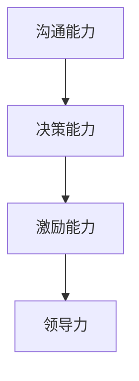
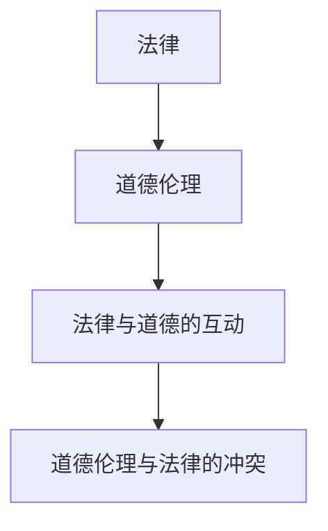

                 

### 引言

在现代企业和社会组织中，领导力与道德伦理的重要性日益凸显。随着全球化的深入和技术的飞速发展，企业面临着前所未有的复杂环境和多元挑战。在这个过程中，领导者不仅需要具备卓越的业务能力和战略眼光，还需要在ethical dilemmas中导航，确保组织的可持续发展和长期成功。

首先，领导力是企业发展的核心动力。领导力不仅仅是权力的象征，更是推动组织变革、激发员工潜能、实现共同目标的关键因素。有效的领导力能够提升团队的凝聚力和战斗力，促进创新和效率，从而在激烈的市场竞争中立于不败之地。

其次，道德伦理是领导者必须具备的基本素养。道德伦理不仅仅是个人品德的问题，更是组织文化的基石。在一个高度信息化的社会中，企业的行为和决策对社会有着深远的影响。领导者必须具备高度的道德责任感，遵守法律法规，坚守商业伦理，以诚信和公正赢得社会的信任和支持。

在ethical dilemmas中导航，对于领导者来说尤为重要。ethical dilemmas通常是指那些在道德上具有争议性、难以决断的情况，例如利益冲突、隐私保护、社会责任等。在这些情况下，领导者不仅需要具备清晰的价值观念和道德原则，还需要运用科学的决策方法和工具，以实现道德与效率的平衡。

本文旨在探讨领导力与道德伦理的关系，分析在ethical dilemmas中导航的策略和方法，并分享实际应用案例。文章将从以下几个方面展开：

首先，介绍领导力的基本概念、类型和核心技能，并探讨领导力与道德伦理的关系。

接着，详细阐述道德伦理的基础理论、原则和理论框架，以及道德伦理在领导力中的具体应用。

然后，分析常见的ethical dilemmas，提供解决策略，并介绍道德决策过程和框架。

最后，通过实际应用案例，展示领导力与道德伦理在现实世界中的应用，并探讨领导者如何提升自我道德素养。

通过本文的探讨，希望能够帮助读者更好地理解领导力与道德伦理的重要性，掌握在ethical dilemmas中导航的方法和策略，从而在复杂的商业环境中做出明智的决策。

### 关键词

- **领导力**：推动组织发展的核心动力
- **道德伦理**：企业文化的基石
- **ethical dilemmas**：道德上的争议性情境
- **决策模型**：解决ethical dilemmas的科学方法
- **道德决策过程**：从识别到实施的完整框架
- **实际应用案例**：领导力与道德伦理的实践探索

### 摘要

本文旨在探讨领导力与道德伦理在当今复杂商业环境中的重要性，以及领导者如何在ethical dilemmas中导航。首先，本文介绍了领导力的基本概念、类型和核心技能，探讨了领导力与道德伦理的关系。接着，详细阐述了道德伦理的基础理论、原则和理论框架，以及道德伦理在领导力中的具体应用。随后，分析了常见的ethical dilemmas，提供了解决策略和道德决策过程。通过实际应用案例，本文展示了领导力与道德伦理在现实世界中的应用，并探讨了领导者如何提升自我道德素养。通过本文的探讨，读者能够更好地理解领导力与道德伦理的重要性，掌握在ethical dilemmas中导航的方法和策略。

## 第一部分：领导力基础

### 第1章：领导力的基本概念与类型

#### 1.1 领导力的定义

领导力是一个广泛且多层次的概念，它涉及到个体或团体通过影响、激励和指导他人来实现共同目标的能力。领导力不仅仅是管理，更是一种能够引导和推动组织变革的力量。在现代社会中，领导力被视为企业成功和社会进步的关键因素。

首先，从定义上看，领导力可以被描述为一种影响过程，即领导者通过沟通、激励和示范等方式，影响他人以实现特定目标的能力（Northouse，2018）。这个过程不仅包括正式的权力关系，如企业经理和团队领导，还包括非正式的影响力，如团队中的意见领袖。

其次，领导力的本质在于其情境性。不同的环境、文化和组织结构会对领导力产生不同的要求。因此，有效的领导力需要具备适应性和灵活性，能够在不同的情境下灵活调整策略（Hersey & Blanchard，1969）。

再次，领导力是一种动态能力。它不仅仅是静态的职位或角色，更是一种动态的过程，包括识别问题、制定策略、实施行动和评估结果（Kouzes & Posner，2007）。这种动态性要求领导者不仅要有深厚的知识和技能，还要有持续学习和创新的能力。

#### 1.2 领导力的类型

领导力并非一成不变，它有多种类型，每种类型都有其特定的特点和应用场景。以下是几种主要的领导力类型：

**1.2.1 权力型领导**

权力型领导是一种基于职位权力和权威的领导方式。这种类型的领导者通常通过明确的规章制度、奖励和惩罚来管理团队。权力型领导在需要快速决策和严格控制的环境中效果较好，例如军队和企业中的高层管理。

**1.2.2 参与型领导**

参与型领导强调团队参与和民主决策。这种领导方式鼓励团队成员积极参与决策过程，以提高团队凝聚力和决策的质量。参与型领导在知识密集型组织、创新团队和项目团队中表现尤为突出。

**1.2.3 践行型领导**

践行型领导强调领导者的个人品质和价值观。这种领导者通过自己的行为和示范，影响和激励团队成员。践行型领导在需要建立高度信任和共同价值观的情境下效果最佳，如初创企业和变革型组织。

**1.2.4 情境领导**

情境领导是一种基于领导者对情境的适应能力的领导方式。这种领导方式要求领导者根据不同的情境和团队成员的特点，灵活调整领导风格。情境领导理论（Hersey & Blanchard，1969）提出了四种领导风格：指令型、支持型、参与型和委托型，分别适用于不同的情境。

#### 1.3 领导力的核心技能

有效的领导力不仅依赖于领导者的个人品质，还需要一系列核心技能的支持。以下是几种关键的领导力技能：

**1.3.1 沟通能力**

沟通能力是领导者必备的技能之一。有效的沟通不仅包括清晰、准确的表达，还包括倾听和理解他人的能力。良好的沟通能力有助于建立信任、减少误解、提高团队协作效率。

**1.3.2 决策能力**

决策能力是领导者面临挑战和不确定性时的关键技能。有效的决策需要领导者能够收集和分析信息、评估不同方案的优缺点，并做出合理的决策。良好的决策能力有助于提高组织的适应性和竞争力。

**1.3.3 激励能力**

激励能力是指领导者如何激发和维持团队成员的工作动力和热情。有效的激励措施包括认可和奖励、设立目标和期望、提供发展机会等。良好的激励能力有助于提高员工满意度和工作效率。

**1.3.4 领导力的Mermaid流程图（见图1-1）**

**图1-1 领导力的核心技能流程图**

通过上述内容，我们可以看到，领导力是一个多维度的概念，它不仅包括基本定义和类型，还涉及到一系列核心技能。理解领导力的基本概念和类型，有助于我们更好地把握领导力的本质，为后续章节的探讨奠定基础。

### 第2章：领导力与道德伦理的关系

#### 2.1 道德伦理的定义

道德伦理是一个涉及行为准则和价值判断的复杂领域。道德伦理不仅关注个体的行为，还涉及到社会、文化和组织层面的价值体系。根据不同的哲学流派和学科，道德伦理的定义也有所不同。

在哲学领域，道德伦理通常被视为关于正确和错误、善与恶的学问。亚里士多德认为，道德伦理的核心在于实现个人的美德和幸福。康德则强调道德原则的普遍性和义务性，他认为道德行为的判断标准应基于理性原则。而功利主义则强调行为的后果，主张行为的好坏应取决于其带来的幸福总量。

在伦理学领域，道德伦理通常被视为一种系统性的研究，旨在理解和解决道德冲突和伦理问题。道德伦理学者常常探讨道德原则、价值观和道德决策的过程。

在企业和管理领域，道德伦理通常被视为企业行为和决策的指南。企业道德伦理不仅关注企业的内部管理，如员工权益、工作环境等，还涉及到企业的外部责任，如社会责任、环境保护等。道德伦理在企业中的应用，有助于提升企业的声誉和竞争力，建立长期的合作关系。

#### 2.2 道德伦理在领导力中的重要性

道德伦理在领导力中的重要性不可忽视。首先，道德伦理是领导者品格的核心。一个有道德的领导者能够赢得团队的信任和尊重，从而提高团队的凝聚力和工作效率。其次，道德伦理是组织文化的基石。一个道德伦理健全的组织能够吸引和保留优秀的人才，建立良好的企业形象，提高市场竞争力。

具体来说，道德伦理在领导力中的应用主要体现在以下几个方面：

1. **决策过程中**：领导者需要遵循道德原则，确保决策的公正性和合理性。在道德伦理的指导下，领导者应避免利益冲突，坚持诚信和透明度，从而提高决策的质量。

2. **团队管理中**：领导者需要以道德伦理为指导，公平对待团队成员，关注员工权益，营造一个健康的工作环境。通过道德伦理的引导，领导者可以建立高效的团队，提高员工的满意度和工作效率。

3. **组织文化塑造中**：领导者需要通过自己的行为和示范，传递道德伦理的价值观念，塑造一种积极向上的组织文化。这种文化能够引导员工遵循道德规范，共同实现组织的愿景和目标。

#### 2.3 领导力与道德伦理的相互作用

领导力与道德伦理之间存在密切的相互作用。一方面，领导力可以影响道德伦理的实践。领导者的行为和决策往往对团队成员产生示范效应，从而影响他们的道德行为。有效的领导力可以激发团队成员的道德意识，促进道德伦理的实践。

另一方面，道德伦理可以塑造领导力。一个有道德的领导者能够赢得团队的信任和支持，提高领导力的有效性。道德伦理不仅为领导者提供了行为准则，还为他们提供了决策和行动的道德基础。

具体来说，领导力与道德伦理的相互作用体现在以下几个方面：

1. **价值观念的塑造**：领导者通过自身的价值观念和行为，影响团队成员的价值观念，从而塑造一种积极的道德文化。

2. **道德决策的指导**：道德伦理为领导者提供了决策的道德基础，使他们能够在复杂和不确定的情境中做出符合道德原则的决策。

3. **团队协作的促进**：道德伦理有助于建立信任和尊重，促进团队成员之间的协作和合作，提高团队的整体效能。

4. **组织文化的形成**：领导者的道德行为和决策，有助于塑造一种积极向上的组织文化，从而提高组织的整体道德水平。

#### 2.4 道德伦理的理论框架

道德伦理的理论框架是理解和应用道德伦理的关键。以下是几种主要的道德伦理理论框架：

1. **道德义务理论**：道德义务理论强调个体应遵循道德义务，无论其结果如何。这种理论认为，道德行为是基于个人的责任和义务，而不是基于后果（德西卡，1971）。

2. **功利主义**：功利主义认为，道德行为应基于行为的结果，即行为的好坏取决于其带来的幸福总量（边沁，1789；米尔，1861）。功利主义强调最大化幸福，是最广泛接受的道德伦理理论之一。

3. **德性伦理学**：德性伦理学强调个人的品德和道德素养。这种理论认为，道德行为是基于个人的德性和品质，而不是基于规则或结果（亚里士多德，公元前322年）。

4. **应用伦理学**：应用伦理学将道德伦理理论应用于具体的实践情境，如医学伦理、环境伦理、商业伦理等。应用伦理学旨在解决具体的伦理问题，提供实际的道德指导。

#### 2.5 道德伦理在领导力中的具体应用

道德伦理在领导力中的具体应用，不仅体现在领导者的个人行为上，还体现在领导者的决策和团队管理中。以下是道德伦理在领导力中的几个具体应用场景：

1. **决策过程中**：领导者应在决策过程中遵循道德原则，确保决策的公正性和合理性。例如，在利益冲突的情况下，领导者应主动披露利益关系，确保决策的透明度。

2. **团队管理中**：领导者应以道德伦理为指导，公平对待团队成员，关注员工权益。例如，在处理员工投诉和冲突时，领导者应保持公正，避免偏袒。

3. **组织文化塑造中**：领导者通过自己的行为和示范，传递道德伦理的价值观念，塑造一种积极向上的组织文化。例如，领导者可以主动参与公益活动，树立道德标杆。

4. **领导力发展**：领导者应通过持续学习和反思，提升自身的道德素养。例如，领导者可以参加道德伦理培训，阅读相关的道德伦理著作，从而提高自身的道德水平。

通过上述内容，我们可以看到，领导力与道德伦理之间存在密切的相互作用。道德伦理不仅为领导力提供了道德基础，还影响了领导者的行为和决策。理解道德伦理的理论框架和应用场景，有助于领导者更好地在ethical dilemmas中导航，实现组织的长期成功。

### 第二部分：道德伦理原理

#### 第3章：道德伦理基础理论

道德伦理基础理论是理解和应用道德伦理的关键。在这个章节中，我们将探讨道德伦理的起源与发展，道德伦理的基本原则，以及道德伦理与法律的关系。

#### 3.1 道德伦理的起源与发展

道德伦理是人类文明的重要组成部分，其起源可以追溯到古代社会。在不同的历史时期和文化背景下，道德伦理的观念和理论各有特色。以下是一些重要的道德伦理理论和其历史背景：

1. **古希腊伦理学**：古希腊伦理学起源于公元前5世纪的雅典，其代表人物包括苏格拉底、柏拉图和亚里士多德。苏格拉底强调道德行为应基于知识，柏拉图主张理想国和哲学家王，而亚里士多德则提出了德性伦理学，强调美德是道德的核心。

2. **基督教伦理学**：基督教伦理学起源于1世纪，其核心是博爱和善良。基督教伦理学强调个体的道德责任，提倡无私和奉献。

3. **中世纪伦理学**：中世纪伦理学受到宗教的影响，其代表人物包括托马斯·阿奎那。托马斯·阿奎那将道德伦理与神学相结合，提出了基于神学和自然法的伦理学理论。

4. **现代伦理学**：现代伦理学起源于17世纪，其代表人物包括托马斯·霍布斯、约翰·洛克和让-雅克·卢梭。他们提出了社会契约论，强调个体的自由和权利。

5. **当代伦理学**：当代伦理学涵盖了多元文化和多学科的研究，其代表人物包括约翰·罗尔斯、彼得·辛格和迈克尔·桑德尔。他们提出了正义论、动物权利和环境伦理等新理论。

#### 3.2 道德伦理的基本原则

道德伦理的基本原则是指导个体行为的道德规范，它们在不同的伦理理论中有不同的表述。以下是几种常见的道德伦理基本原则：

1. **公正**：公正是指对待所有人公平、无偏见。公正原则强调在资源分配、机会提供和对待他人时应遵循平等原则。

2. **诚实**：诚实是指真实、真诚和可信。诚实原则要求个体在言行中保持真实，不说谎、不欺骗。

3. **同情**：同情是指对他人的情感和境遇感同身受。同情原则强调在道德决策中应考虑他人的感受和需求。

4. **尊重**：尊重是指对他人的权利和尊严的认可和尊重。尊重原则要求个体在行为中尊重他人的自主权和隐私。

5. **责任**：责任是指个体对自己行为的结果负责。责任原则强调个体在道德决策中应考虑到行为后果，并承担相应的责任。

#### 3.3 道德伦理与法律的关系

道德伦理与法律的关系是一个复杂而重要的议题。道德伦理通常被视为法律的基础，而法律则是对道德伦理的具体化和规范化。

1. **法律与道德的区别**：法律是由国家或权威机构制定和实施的强制性规范，通常具有明确的条文和执行机制。道德伦理则是一种内在的行为准则，它不是由外部强制力量实施的，而是基于个体的内心信念和道德观念。

2. **法律与道德的互动**：法律与道德之间存在互动关系。一方面，法律往往基于道德伦理原则制定，以规范和引导社会行为。另一方面，道德伦理可以超越法律，为个体提供更广泛的道德指导。例如，在法律尚未明确规定的情况下，个体可以基于道德伦理做出正确的决策。

3. **道德伦理与法律的冲突**：在某些情况下，道德伦理与法律可能发生冲突。例如，某个法律规定可以合法地剥夺他人权利，但根据道德伦理，这种行为可能是不道德的。在这种情况下，个体需要权衡道德伦理和法律的要求，做出合理的决策。

4. **法律与道德的关系框架（见图3-1）**

**图3-1 法律与道德的关系框架**

通过上述内容，我们可以看到，道德伦理是一个多维度的概念，它不仅包括基本的道德原则，还涉及到与法律的关系。理解道德伦理的基础理论，有助于我们更好地应对日常生活中的道德困境，并在决策过程中遵循道德原则。

### 第4章：应用道德伦理框架

#### 4.1 道德伦理分析框架

道德伦理分析框架是帮助领导者和管理者在复杂的道德情境中做出明智决策的工具。这个框架通常包括以下几个步骤：

1. **识别伦理问题**：首先，领导者需要识别和明确道德问题。这可以通过自我反思、团队讨论或外部咨询等方式进行。

2. **收集信息**：在识别伦理问题后，领导者需要收集与问题相关的信息，包括事实、法律法规、行业标准等。这些信息有助于全面理解问题的背景和影响。

3. **提出备选方案**：基于收集到的信息，领导者需要提出多种备选方案，并评估每种方案的优缺点。这些方案可以包括法律允许的行为、道德上可接受的行为，以及创新的解决方案。

4. **评估备选方案**：领导者需要评估每种备选方案，考虑其道德、法律、经济和社会影响。评估标准可以包括公正性、诚实性、透明度和可持续性等。

5. **选择最佳方案**：在评估备选方案后，领导者需要选择最符合道德原则和实际需求的方案。这个决策过程应透明、公正，并得到团队成员的支持。

6. **实施决策**：一旦选择了最佳方案，领导者需要制定详细的行动计划，并确保其得到有效执行。

7. **监督与评估**：在决策实施过程中，领导者需要持续监督和评估决策的效果，并根据反馈进行调整。

#### 4.2 伦理决策过程

伦理决策过程是一个系统化和结构化的方法，用于帮助领导者和管理者在复杂的道德情境中做出明智的决策。以下是伦理决策过程的详细步骤：

1. **识别伦理问题**：
   - **情境描述**：详细描述道德困境的背景、相关方和问题。
   - **问题界定**：明确道德问题的性质和关键要素。

2. **收集信息**：
   - **事实信息**：收集与道德困境相关的客观事实。
   - **法律法规**：了解相关法律和法规，确保决策的合法性。
   - **行业标准**：了解行业标准，确保决策的合规性。
   - **利益相关者分析**：识别利益相关者，了解他们的需求和期望。

3. **提出备选方案**：
   - **方案列举**：列出可能的行动方案。
   - **方案评估**：评估每种方案的优缺点，考虑其道德、法律、经济和社会影响。

4. **评估备选方案**：
   - **权重分配**：为每种方案分配权重，考虑其重要性和可行性。
   - **决策标准**：制定评估标准，如公正性、透明度、可持续性等。
   - **比较分析**：比较不同方案的优劣，选择最佳方案。

5. **选择最佳方案**：
   - **决策**：基于评估结果，选择最佳方案。
   - **沟通**：向团队成员和利益相关者解释决策理由和行动计划。

6. **实施决策**：
   - **行动计划**：制定详细的行动计划，明确责任人和时间表。
   - **执行**：确保行动计划得到有效执行。

7. **监督与评估**：
   - **监督**：持续监督决策的实施过程，确保目标的达成。
   - **评估**：评估决策的效果，收集反馈，进行必要的调整。

通过上述伦理决策过程，领导者和管理者可以系统化和结构化地处理道德困境，提高决策的质量和效果。

#### 4.3 道德伦理在组织中的应用

道德伦理在组织中的应用是确保企业可持续发展和社会责任的关键。以下是道德伦理在组织中的几个关键应用场景：

1. **道德规范制定**：
   - **规范内容**：组织应制定明确的道德规范，涵盖员工行为、商业实践和社会责任等方面。
   - **规范发布**：通过内部公告、员工手册和培训课程等方式，向员工传达道德规范。
   - **规范执行**：建立监督机制，确保道德规范的执行和遵守。

2. **道德培训与教育**：
   - **培训内容**：定期进行道德培训，涵盖道德原则、案例分析、决策框架等。
   - **培训形式**：通过讲座、研讨会、工作坊和在线课程等方式，提高员工的道德素养。
   - **培训效果**：通过评估和反馈，确保培训的有效性，并根据需要调整培训内容。

3. **道德监督与评估**：
   - **监督机制**：建立内部监督机构，如道德委员会或监察部门，负责监督道德规范的执行。
   - **评估标准**：制定评估标准，如透明度、公正性和合规性等，对组织的道德实践进行评估。
   - **评估报告**：定期发布道德评估报告，向利益相关者通报组织的道德表现。

4. **道德沟通**：
   - **沟通渠道**：建立多渠道的沟通机制，如员工论坛、匿名举报系统和内部通讯等，鼓励员工表达道德关注和建议。
   - **沟通策略**：通过透明的沟通策略，提高员工对道德问题的认识和参与度。

5. **社会责任实践**：
   - **责任定义**：明确组织在社会责任方面的目标和承诺，如环境保护、员工福利和社会贡献等。
   - **责任落实**：制定具体的社会责任计划，确保责任的落实和执行。
   - **责任评估**：定期评估社会责任实践的效果，并根据反馈进行调整。

通过上述道德伦理在组织中的应用，企业不仅可以提高员工的道德素养和合规意识，还能树立良好的企业形象，增强市场竞争力和可持续发展能力。

### 第三部分：在ethical dilemmas中导航

#### 第5章：常见ethical dilemmas案例分析

ethical dilemmas通常涉及到道德原则的冲突，个体或组织需要在这些冲突中做出决策。以下是一些常见的ethical dilemmas案例，我们将分析其情境、道德伦理分析以及解决策略。

#### 5.1 案例一：利益冲突

**情境描述**：某公司的高管在担任董事期间，发现公司正在考虑与一家潜在客户进行合作。然而，该高管在私下与该客户有密切的商业往来，这可能导致利益冲突。

**道德伦理分析**：
- **利益冲突原则**：利益冲突原则强调个体在处理与自身利益相关的决策时，应保持公正和无偏见。在这种情况下，高管与潜在客户之间的商业往来可能损害公司的利益。
- **透明度原则**：透明度原则要求个体在处理利益冲突时，应主动披露相关利益关系，以保持决策的公正性。
- **责任原则**：高管作为公司董事，有责任保护公司的利益，不应因个人利益而影响公司决策。

**解决策略**：
- **披露利益关系**：高管应主动向董事会和公司管理层披露与潜在客户的商业往来，确保决策过程的透明度。
- **利益回避**：高管应主动回避参与与该客户的决策过程，由其他董事或管理层成员进行决策。
- **建立利益冲突机制**：公司应建立明确的利益冲突机制，确保类似情况在未来的处理中更加规范和透明。

#### 5.2 案例二：隐私保护

**情境描述**：某互联网公司在未经用户同意的情况下，收集和出售用户个人信息。这种行为引发用户的隐私保护和数据安全担忧。

**道德伦理分析**：
- **隐私原则**：隐私原则强调个体有权保护自己的个人信息，不被未经授权的第三方收集和使用。
- **责任原则**：公司作为数据处理者，有责任确保用户隐私的安全，防止数据泄露和滥用。
- **透明度原则**：公司应向用户明确告知其个人信息的使用方式和目的，并获得用户的明确同意。

**解决策略**：
- **加强隐私保护措施**：公司应采取技术和管理措施，确保用户个人信息的安全，如数据加密、访问控制等。
- **用户同意机制**：公司应在收集和使用用户个人信息前，明确告知用户，并获得用户的同意。
- **隐私政策更新**：公司应定期更新隐私政策，确保其符合最新的法律和行业标准。

#### 5.3 案例三：社会责任

**情境描述**：某大型制造企业在生产过程中发现其排放的废气超标，可能对当地居民的健康产生危害。然而，停产整改将导致公司巨大的经济损失。

**道德伦理分析**：
- **社会责任原则**：社会责任原则要求企业不仅关注自身的经济利益，还应考虑其对环境和社会的影响。
- **公正原则**：企业应在追求经济利益的同时，确保其对环境和社会的负面影响最小化。
- **长远利益原则**：企业应考虑其长期利益，即使在短期内面临经济损失，也应采取负责任的行动。

**解决策略**：
- **停产整改**：企业应立即停产，进行整改，确保废气排放达到法定标准。
- **环保投资**：企业应投资于环保技术和设施，减少对环境的影响。
- **社区沟通**：企业应与当地居民进行沟通，解释其整改措施，争取居民的理解和支持。

通过上述案例分析，我们可以看到，ethical dilemmas往往涉及复杂的道德原则和利益冲突。领导者和管理者需要在这些困境中，运用道德伦理分析和解决策略，做出符合道德原则和实际需求的决策。这不仅有助于企业的可持续发展，还能增强社会对企业的信任和认可。

#### 第6章：解决ethical dilemmas的策略与方法

解决ethical dilemmas是一项复杂而具有挑战性的任务，需要领导者和管理者具备高度的道德判断力和决策能力。以下是几种常用的策略和方法，用于帮助领导者有效地解决ethical dilemmas。

##### 6.1 道德决策模型

道德决策模型是一种系统化的方法，用于指导领导者在伦理困境中做出合理的决策。以下是一些常用的道德决策模型：

**1. 卡伦伦理决策模型**

卡伦（Karen J. Fredericks）提出了一个包含六个步骤的道德决策模型，用于帮助领导者解决伦理问题：

1. **识别伦理问题**：明确道德困境的性质和关键要素。
2. **了解情境**：收集与道德问题相关的信息，包括事实、法律法规、行业标准等。
3. **识别备选方案**：列出可能的行动方案，并评估每种方案的优缺点。
4. **评估备选方案**：基于道德原则和实际需求，选择最佳方案。
5. **实施决策**：制定详细的行动计划，并确保其得到有效执行。
6. **监督与评估**：持续监督决策的实施过程，并评估其效果，根据需要进行调整。

**2. 埃德温伦理决策模型**

埃德温·阿德勒（Edwin A. Locke）提出了一个包含五个步骤的道德决策模型，强调道德决策的情境性和适应性：

1. **识别道德问题**：明确道德困境的情境和关键要素。
2. **评估道德问题**：分析道德问题的性质和影响，确定其严重性。
3. **收集信息**：收集与道德问题相关的信息，包括法律法规、行业标准、利益相关者的需求和期望等。
4. **提出备选方案**：基于道德原则和实际需求，提出多种备选方案。
5. **选择最佳方案**：评估每种方案的优缺点，选择最符合道德原则和实际需求的方案。

**3. 哈蒙德伦理决策模型**

哈蒙德（Donald J. Hammond）提出了一个包含四个步骤的道德决策模型，强调道德决策的情境性和动态性：

1. **识别道德问题**：明确道德困境的情境和关键要素。
2. **确定道德原则**：根据道德伦理理论，确定适用的道德原则。
3. **评估备选方案**：分析每种备选方案，考虑其道德、法律、经济和社会影响。
4. **选择最佳方案**：基于道德原则和实际需求，选择最符合道德标准的方案。

这些道德决策模型提供了系统化和结构化的方法，帮助领导者更好地应对ethical dilemmas。在实际应用中，领导者可以根据具体情境和需求，灵活选择和调整模型，以实现道德与效率的平衡。

##### 6.2 情境分析

情境分析是解决ethical dilemmas的关键步骤，它涉及对道德困境的背景、相关方和影响的深入理解。以下是一些情境分析的技巧：

**1. 内部与外部情境分析**

内部情境分析涉及对组织内部因素的评估，如企业文化、员工价值观、组织结构等。外部情境分析则涉及对组织外部环境的评估，如法律法规、行业标准、社会期望等。通过内部与外部情境分析，领导者可以全面了解道德困境的背景和影响因素。

**2. 情境敏感性**

情境敏感性是指领导者根据不同的情境灵活调整道德决策的能力。领导者需要具备良好的情境敏感性，能够识别和应对复杂的道德情境。例如，在利益冲突的情况下，领导者应根据具体的情境，采取不同的策略，确保决策的公正性和合理性。

**3. 多元视角**

在情境分析中，领导者应采用多元视角，考虑不同利益相关者的需求和期望。例如，在隐私保护的道德困境中，领导者应考虑用户、企业、监管机构等多方利益，以确保决策的全面性和公正性。

##### 6.3 持续改进

持续改进是解决ethical dilemmas的重要策略，它涉及不断反思和学习，以提升道德决策的质量和效果。以下是一些持续改进的方法：

**1. 反思与学习**

领导者应定期进行反思和学习，从过去的道德困境中吸取教训，提升道德判断力和决策能力。例如，通过回顾过去的决策过程和结果，领导者可以识别成功的经验和失败的教训，从而改进未来的决策。

**2. 持续教育**

领导者应积极参加道德伦理培训，学习最新的道德理论和实践，提升自身的道德素养。例如，通过参加研讨会、课程和讲座，领导者可以了解最新的道德伦理研究和案例，从而更好地应对复杂的道德困境。

**3. 反馈机制**

领导者应建立有效的反馈机制，收集团队成员和利益相关者的意见和建议，不断改进道德决策。例如，通过定期的反馈会议和调查问卷，领导者可以了解团队和利益相关者对道德决策的满意度，从而调整和优化决策。

通过上述策略和方法，领导者可以更好地解决ethical dilemmas，确保决策的道德性和有效性。持续改进和不断学习是提升道德决策能力的关键，领导者应时刻保持警觉，不断提升自身的道德素养和决策能力。

### 第四部分：领导力与道德伦理的应用实践

#### 第7章：实际应用案例分享

领导力与道德伦理在实际应用中具有重要的指导意义。通过以下三个实际应用案例，我们可以看到领导力与道德伦理在组织管理和决策过程中的具体实践，以及其带来的积极影响。

#### 7.1 企业案例：谷歌的道德伦理实践

谷歌作为全球知名的高科技公司，以其卓越的技术创新和严谨的道德伦理实践而著称。谷歌的道德伦理实践不仅为其赢得了良好的企业形象，也为员工和用户提供了可靠保障。

**7.1.1 谷歌的道德伦理框架**

谷歌的道德伦理框架主要包括以下几个方面：

1. **隐私保护**：谷歌一直高度重视用户隐私保护，其隐私政策明确规定了用户数据的收集、使用和保护方式。谷歌通过技术和管理措施，确保用户数据的安全性和隐私性。

2. **多样性与包容性**：谷歌致力于营造一个多样性和包容性的工作环境，鼓励员工多样性，尊重不同文化和背景。谷歌的多样性政策包括招聘、晋升和员工福利等方面，旨在为员工提供公平的机会和良好的工作条件。

3. **社会责任**：谷歌积极参与社会公益事业，通过谷歌慈善基金会支持教育、环境保护和科技创新等领域。谷歌还推动可持续发展，减少对环境的影响。

4. **透明度和责任**：谷歌在其运营过程中，始终保持透明度，向公众披露重要的信息。谷歌还建立了内部举报系统，鼓励员工举报不当行为，确保公司的廉洁和诚信。

**7.1.2 成功经验与挑战**

谷歌的道德伦理实践取得了显著的成果，但也面临一些挑战：

1. **成功经验**：
   - **提高员工满意度**：谷歌的道德伦理实践有助于提高员工满意度和忠诚度，吸引和留住优秀人才。
   - **提升企业形象**：谷歌的道德伦理实践增强了公众对公司的信任和认可，提升了品牌价值。
   - **促进创新**：良好的道德伦理环境有助于激发员工的创新思维，推动技术的不断进步。

2. **挑战**：
   - **道德困境的复杂性**：随着技术的发展和市场竞争的加剧，谷歌面临越来越多的道德困境，如人工智能伦理、数据隐私保护等。
   - **文化冲突**：全球化背景下，谷歌需要在不同国家和地区运营，面临不同的文化和价值观，如何平衡这些差异是一个挑战。
   - **监管压力**：谷歌在遵守法律和道德规范方面面临严格的监管压力，需要不断调整和改进其道德伦理实践。

#### 7.2 公共部门案例：政府伦理政策与执行

政府在公共管理中，承担着维护社会公正和道德责任的职责。政府的道德伦理政策与执行对整个社会具有重要的示范作用。

**7.2.1 政府伦理政策**

政府伦理政策主要包括以下几个方面：

1. **廉政建设**：政府通过制定廉政法规和制度，加强反腐倡廉工作，确保公共权力的正当行使。
2. **公务员道德教育**：政府定期对公务员进行道德教育，提高其道德素养和职业操守。
3. **信息公开**：政府通过信息公开制度，提高政府工作的透明度和公信力。
4. **公众参与**：政府鼓励公众参与政策制定和决策过程，确保政策的公正性和合理性。

**7.2.2 政府伦理实践挑战**

政府在道德伦理实践中面临以下挑战：

1. **利益冲突**：政府官员在处理公共事务时，可能面临个人利益与公共利益的冲突，如何平衡利益是一个难题。
2. **行政效率**：政府在追求道德伦理的同时，还需要考虑行政效率，如何在保障公正和效率之间找到平衡点。
3. **法律与道德的冲突**：政府在执行法律和道德规范时，可能面临法律与道德的冲突，如何处理这些冲突需要慎重考虑。

#### 7.3 社会组织案例：非营利组织的道德领导

非营利组织在提供社会服务和推动社会变革中，扮演着重要角色。道德领导在非营利组织中具有特殊意义，它不仅关乎组织的使命和价值观，也关系到组织的公信力和影响力。

**7.3.1 非营利组织的道德伦理考虑**

非营利组织的道德伦理考虑主要包括以下几个方面：

1. **透明度**：非营利组织需要确保其财务和运营信息的透明度，接受社会监督。
2. **责任**：非营利组织应承担社会责任，确保其活动符合社会道德标准。
3. **公平**：非营利组织在提供服务时，应确保公平对待所有受益者，避免歧视和不公平现象。
4. **诚信**：非营利组织应保持诚信，遵守承诺，树立良好的社会形象。

**7.3.2 道德领导实践挑战**

非营利组织在道德领导实践中面临以下挑战：

1. **资源限制**：非营利组织通常面临资源限制，如何在有限的资源下确保道德实践的落实是一个挑战。
2. **组织变革**：非营利组织在追求道德伦理的同时，还需要应对组织内部的变革和挑战，如何平衡变革与稳定是一个难题。
3. **社会责任与自治**：非营利组织在履行社会责任的同时，也需要保持组织自治，确保组织的独立性和灵活性。

通过以上实际应用案例，我们可以看到，领导力与道德伦理在组织管理和决策过程中具有重要作用。无论是企业、政府还是非营利组织，道德伦理都是其可持续发展的基石。领导者和管理者需要不断提高道德素养和决策能力，确保在ethical dilemmas中做出符合道德原则和实际需求的决策，从而实现组织的长期成功和社会的和谐发展。

### 第五部分：领导力与道德伦理的自我提升

#### 第8章：领导力与道德伦理的自我提升

提升领导力与道德伦理能力是每一位领导者终身追求的目标。通过自我评估、持续学习和道德实践，领导者可以不断提高自身的道德素养和决策能力，从而更好地应对复杂的伦理困境，实现组织的长期成功。

#### 8.1 自我评估

自我评估是领导者提升道德素养和决策能力的第一步。通过反思自己的行为和决策，领导者可以识别自身的优点和不足，从而有针对性地进行改进。

**1. 反思与自我检查**：
- 定期反思自己的决策过程和结果，思考是否遵循了道德原则。
- 评估自己在处理道德困境时的行为和反应，识别可能存在的盲点和偏见。

**2. 他人反馈**：
- 向团队成员、同事或导师寻求反馈，了解他们对自己的道德素养和决策能力的评价。
- 通过匿名调查或焦点小组讨论，收集多方面的意见和建议。

**3. 自我评估工具**：
- 使用自我评估问卷或量表，如领导力素质模型、道德素养评估工具等，进行量化评估。
- 结合具体情境，分析自己在不同情境下的道德决策和领导行为。

#### 8.2 持续学习

持续学习是提升领导力与道德伦理能力的关键。通过不断学习和吸收新的知识和观点，领导者可以保持思维的敏捷性和适应性。

**1. 道德伦理课程与培训**：
- 参加道德伦理相关的课程和培训，如MBA课程、领导力培训、伦理学讲座等。
- 学习道德伦理的理论框架，如功利主义、义务论和德性伦理学等。

**2. 专业阅读**：
- 阅读道德伦理相关的书籍和文献，如《道德情操论》、《正义论》、《道德运气》等。
- 关注道德伦理领域的最新研究成果和热点问题，了解学术界的最新动态。

**3. 实践案例分析**：
- 通过研究实际案例，了解不同领导者如何应对道德困境，吸取成功经验和教训。
- 分析案例中的道德决策过程和结果，思考如何应用这些经验到自己的工作中。

#### 8.3 道德实践

道德实践是领导者提升道德素养和决策能力的重要途径。通过实际操作和经验积累，领导者可以更好地理解和应用道德原则。

**1. 道德规范制定**：
- 参与制定组织的道德规范和伦理政策，确保这些规范符合道德原则和实际需求。
- 通过政策制定过程，提高对道德问题的敏感性和处理能力。

**2. 道德决策实践**：
- 在日常工作中，积极运用道德决策模型，如卡伦模型、埃德温模型等，解决道德困境。
- 通过实际案例，练习如何在复杂的道德情境中做出明智的决策。

**3. 道德领导实践**：
- 作为领导者，通过自己的行为和示范，传递道德伦理的价值观念。
- 在团队管理中，关注员工的道德发展和行为规范，提供道德指导和支持。

#### 8.4 持续改进与反馈

持续改进和反馈是领导者不断提升道德素养和决策能力的保障。通过反思和学习，领导者可以不断完善自身的道德素养和领导能力。

**1. 反思与总结**：
- 定期对道德实践进行反思和总结，分析成功经验和失败教训，识别改进的机会。
- 通过自我评估和他人反馈，了解自身的进步和不足，制定改进计划。

**2. 反馈机制**：
- 建立有效的反馈机制，收集团队成员和利益相关者的意见和建议。
- 通过定期的反馈会议和评估，了解道德实践的效果，并根据反馈进行调整。

**3. 持续学习与成长**：
- 保持对道德伦理领域的关注，不断学习和更新知识。
- 通过参与专业论坛、研讨会和学术交流，与其他领导者分享经验和观点。

通过自我评估、持续学习和道德实践，领导者可以不断提升自身的道德素养和决策能力，更好地在ethical dilemmas中导航，实现组织的长期成功和社会的和谐发展。

### 结语

本文通过深入探讨领导力与道德伦理的关系，分析了在ethical dilemmas中导航的策略和方法，并分享了实际应用案例。我们认识到，领导力不仅是推动组织发展的核心动力，更是应对道德困境的关键因素。道德伦理作为企业文化的基石，对于组织的可持续发展和社会责任具有重要意义。

在复杂的商业环境中，领导者需要具备高度的道德素养和决策能力，以应对ethical dilemmas。通过道德决策模型、情境分析和持续改进，领导者可以在道德困境中做出明智的决策，实现道德与效率的平衡。

未来，随着技术的不断进步和社会的日益复杂，领导力与道德伦理将面临更多挑战。我们呼吁广大领导者不断学习和提升自身的道德素养，积极应对ethical dilemmas，为组织的长期成功和社会的和谐发展贡献力量。

### 作者信息

作者：AI天才研究院/AI Genius Institute & 禅与计算机程序设计艺术 /Zen And The Art of Computer Programming

