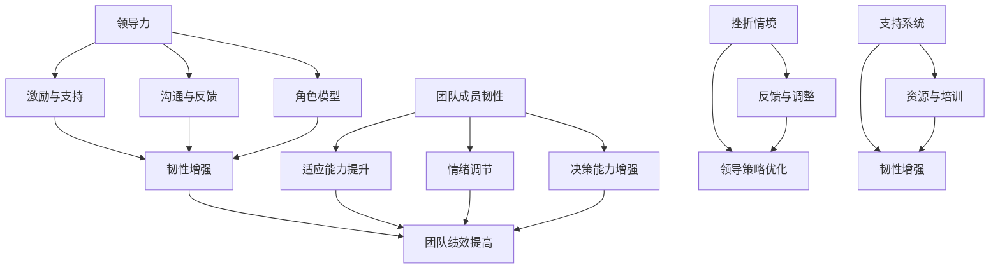

                 

# 领导力与韧性：面对挫折时的坚持能力

## 关键词
领导力、韧性、挫折应对、坚持能力、团队建设、心理韧性

## 摘要
本文探讨了领导力与韧性在应对挫折时的坚持能力。通过分析领导力的定义、类型和关键要素，以及韧性的概念、分类和培养方法，本文揭示了领导力与韧性之间的紧密关系。在此基础上，本文通过理论探讨、案例分析、实战技巧和项目实战，详细阐述了如何培养和提高领导力和韧性，以增强个体和团队在面对挫折时的坚持能力。文章最后总结了领导力与韧性在应对挫折中的重要性，并提出了未来发展的趋势和挑战。

## 引言

### 书籍目的与重要性

在全球化和科技迅猛发展的背景下，企业和个人面临的市场竞争日益激烈。在这种环境中，领导力和韧性成为决定成功与否的关键因素。领导力不仅关乎个人和组织的目标实现，更关乎在挫折和逆境中的坚持和适应能力。韧性，则是一个人或团队在面对挑战和压力时，能够迅速恢复并保持持续发展的能力。

本文旨在探讨领导力与韧性在应对挫折时的坚持能力，帮助读者理解这两种能力的重要性，并提供实用的培养和实践方法。领导力是组织和团队中不可或缺的核心要素，它决定了团队的目标设定、资源整合和协作效率。而韧性则是个体和团队在遭遇挫折和逆境时，能够保持积极心态、迅速恢复并持续前进的关键能力。

### 领导力与韧性在现代社会中的角色

在现代社会中，领导力与韧性不仅影响个人职业生涯的发展，更关乎整个社会的稳定和进步。领导力能够激发团队成员的潜能，提高团队整体执行力，从而推动组织目标的实现。而韧性则使个人和团队在面对挫折和不确定性时，能够保持冷静和理智，迅速找到解决问题的方法，避免因一时挫折而陷入困境。

本文将从以下几个方面展开讨论：

1. **领导力的核心概念与类型**：介绍领导力的定义、关键要素和不同类型的领导力。
2. **韧性的概念与分类**：阐述韧性的定义、重要性以及如何培养韧性。
3. **领导力与韧性的相互关系**：通过理论探讨和流程图，揭示领导力与韧性之间的紧密关系。
4. **案例分析**：分析历史上领导力和韧性在挫折中的经典案例，探讨成功的原因。
5. **实战技巧**：提供实用的方法和工具，帮助读者培养和提高领导力和韧性。
6. **项目实战**：通过具体案例，展示如何在实际工作中应用领导力和韧性。
7. **结论**：总结全文内容，强调领导力与韧性在应对挫折中的重要性，并提出未来发展的方向和挑战。

通过以上讨论，本文希望为读者提供一个全面而深入的视角，帮助他们在面对挫折和挑战时，能够更好地发挥领导力和韧性，实现个人和团队的持续成长。

### 第1章 领导力的核心概念

#### 1.1 领导力的定义与类型

领导力是一种影响他人以实现共同目标的能力，它不仅仅涉及管理和控制，更关乎激励和引导。领导力不仅存在于企业高管或政治领袖中，而是渗透到各个层面和领域，无论是家庭、学校还是社区。有效的领导力能够帮助组织或团队在复杂多变的环境中找到方向，克服困难，实现目标。

根据不同的分类标准，领导力可以分为多种类型：

- **交易型领导力（Transaction Leadership）**：这种领导力侧重于维持现状，通过明确的奖励和惩罚机制来激励团队成员。交易型领导力强调任务完成，强调绩效和结果的达成。

- **变革型领导力（Transformational Leadership）**：与交易型领导力不同，变革型领导力更注重变革和创新。这种领导力能够激发团队成员的内在动机，鼓励他们超越自我，共同追求更高目标。

- **变革型-交易型领导力（Transaction-Transformational Leadership）**：这是一种结合了交易型和变革型领导力特点的混合型领导风格。这种领导力在保持组织稳定性的同时，推动组织的创新和发展。

- **情境型领导力（Situational Leadership）**：情境型领导力主张领导者应根据不同情境和团队成员的特点，灵活调整领导风格。这种领导力强调适应性和灵活性，以适应不同环境和需求。

每种类型的领导力都有其独特的优点和适用场景。交易型领导力在任务明确、环境稳定的情况下表现尤为出色；而变革型领导力则在需要创新和突破时发挥重要作用。情境型领导力则要求领导者具备较强的观察和判断能力，能够根据具体情境做出最佳选择。

#### 1.2 领导力的关键要素

领导力不仅仅是天赋，更多的是一种可以培养和发展的能力。以下是一些关键的领导力要素，它们构成了领导力成功的基础：

- **沟通能力**：有效的沟通是领导力的核心。领导者需要能够清晰、明确地传达目标、愿景和期望，同时也需要倾听和理解团队成员的需求和意见。

- **决策能力**：领导者必须能够在复杂和不确定的环境下做出明智的决策。这需要领导者具备分析能力、判断能力和承担风险的能力。

- **自我管理能力**：自我管理能力包括情绪管理、时间管理和目标设定等方面。领导者需要能够自我激励、自我约束，并始终保持清晰的职业目标。

- **团队协作能力**：领导者不仅需要关注个人绩效，更需要关注团队的整体表现。这要求领导者具备协作精神、团队建设能力和冲突解决能力。

- **变革引领能力**：在快速变化的环境中，领导者需要具备引领变革的能力。这包括对新趋势的洞察、对创新思维的鼓励以及对变革阻力的应对。

- **领导力愿景**：一个成功的领导者必须具备远大的愿景。这个愿景不仅能够激励团队成员，还能为组织指明方向，提供持续的动力。

通过培养和提升这些关键要素，领导者不仅能够提高自身的领导能力，还能更好地引导和激励团队，实现共同的目标。

### 第2章 韧性的概念与分类

#### 2.1 韧性的定义与重要性

韧性是一种面对挑战和逆境时的心理和情感适应能力，它不仅仅是一种个人特质，更是一种可以通过学习和实践提升的能力。韧性使我们能够在面对困难时保持积极心态，迅速恢复并继续前进。它涉及到多个方面，包括情绪管理、心理弹性、适应能力和自我效能感。

韧性在现代社会中的重要性不言而喻。随着工作压力和生活节奏的加快，每个人都会面临各种挑战和压力。韧性不仅有助于我们应对日常生活中的挫折，还能提高我们的心理和情感健康，使我们在面对重大变故时能够保持冷静和理智。

#### 2.2 韧性的分类与培养方法

韧性可以按照不同的维度进行分类，常见的分类方法包括：

- **个人韧性**：个人韧性是指个体在面对压力和挑战时的适应能力。它包括情绪管理、自我效能感、积极态度和应对策略等方面。培养个人韧性需要通过自我反思、情绪调节、积极心理训练和应对策略的学习与实践。

- **团队韧性**：团队韧性是指团队成员在面对挑战和逆境时，能够相互支持、协作并共同克服困难的能力。培养团队韧性需要通过团队建设活动、沟通技巧培训、冲突解决策略和共同目标设定等方式。

- **组织韧性**：组织韧性是指企业在面对外部冲击和市场变化时，能够保持稳定、持续发展的能力。培养组织韧性需要通过企业文化塑造、风险管理体系建设、组织结构调整和创新能力提升等措施。

#### 2.2.1 培养个人韧性的方法

- **情绪管理**：学会认识和调节自己的情绪，避免因情绪波动而影响判断和决策。

- **积极心理训练**：通过冥想、正念训练和积极心理学的学习，提高自我效能感和积极态度。

- **应对策略**：学习并实践有效的应对策略，如分解问题、寻求支持、自我激励和灵活调整。

- **自我反思**：定期进行自我反思，总结经验教训，发现自身的优势和不足。

- **持续学习**：通过学习新知识和技能，提高自己的综合素质和适应能力。

#### 2.2.2 培养团队韧性的方法

- **团队建设**：通过团队活动、团队拓展训练和团队沟通技巧培训，增强团队成员之间的信任和协作。

- **沟通技巧**：提高团队成员的沟通能力，确保信息传递的准确性和及时性。

- **共同目标**：设定清晰的共同目标，使团队成员能够共同面对挑战，共同承担责任。

- **冲突解决**：建立有效的冲突解决机制，避免冲突对团队韧性的负面影响。

- **支持系统**：建立支持系统，为团队成员提供心理和情感支持，帮助他们克服困难。

#### 2.2.3 培养组织韧性的方法

- **企业文化**：塑造积极向上的企业文化，增强员工的归属感和责任感。

- **风险管理**：建立完善的风险管理体系，提前识别和应对潜在风险。

- **创新能力**：鼓励创新思维，提升企业的应变能力和市场竞争力。

- **组织结构调整**：根据市场变化和业务需求，适时调整组织结构，提高组织的灵活性和适应性。

- **领导力培训**：为领导层提供韧性培训，提升他们在面对挑战和逆境时的领导力和决策能力。

通过以上方法，个人、团队和组织都可以提升韧性，更好地应对挑战和逆境，实现持续发展和成长。

### 第3章 领导力与韧性的相互关系

#### 3.1 领导力与韧性在挫折中的相互作用

领导力与韧性在应对挫折中具有相互影响和相互促进的作用。有效的领导力可以为团队成员提供支持和指导，增强他们的韧性；而韧性则使团队成员在面临挫折时能够更好地应对，从而提升整个团队的绩效。

首先，领导力可以通过以下几个方面影响韧性：

- **激励与支持**：领导者通过激励和支持，帮助团队成员在面对挫折时保持积极心态，增强他们的自信心和应对能力。
- **沟通与反馈**：有效的沟通和及时的反馈可以帮助团队成员更好地理解挫折的原因和解决方案，从而提高他们的适应能力。
- **角色模型**：领导者作为团队的榜样，他们的态度和行为会对团队成员产生深远的影响。领导者的韧性会激励团队成员在面对挫折时保持坚韧。

另一方面，韧性也会对领导力产生重要影响：

- **情绪调节**：具有韧性的领导者能够更好地调节自己的情绪，保持冷静和理智，从而做出更明智的决策。
- **适应能力**：韧性使领导者能够在面对不确定性和变化时保持灵活性，迅速调整策略，应对挑战。
- **团队动力**：领导者通过自己的韧性激励团队成员，共同面对挫折，增强团队的凝聚力和战斗力。

#### 3.2 领导力与韧性的互动模型

为了更好地理解领导力与韧性的相互作用，我们可以构建一个互动模型，这个模型包括以下几个关键要素：

1. **领导力风格**：领导者的风格直接影响团队成员的韧性。例如，变革型领导力能够激发团队成员的内在动机，提高他们的韧性和适应能力。

2. **团队成员的韧性水平**：团队成员的初始韧性水平会影响他们在领导力影响下的变化。高韧性水平的团队成员在领导力的引导下可能会变得更加坚强，而低韧性水平的团队成员则可能需要更多的时间和资源来培养和提高韧性。

3. **挫折情境**：挫折情境是领导力和韧性相互作用的触发点。不同的挫折情境会对领导力和韧性产生不同的影响，需要领导者根据实际情况灵活调整领导策略。

4. **支持系统**：有效的支持系统能够为团队成员提供必要的资源和支持，增强他们的韧性。支持系统包括领导者的支持、团队成员之间的互助以及组织提供的各种资源和培训。

5. **反馈与调整**：领导者通过反馈和调整来不断优化领导策略，以适应团队成员的韧性和挫折情境的变化。这种反馈和调整是一个动态的过程，需要持续进行。

通过这个互动模型，我们可以看到领导力与韧性在应对挫折中的复杂关系。领导者不仅需要关注自己的领导风格和团队成员的韧性水平，还需要根据具体的挫折情境和反馈机制，灵活调整领导策略，以最大限度地发挥领导力和韧性的作用。

#### Mermaid流程图：领导力与韧性的关系



这个Mermaid流程图展示了领导力与韧性在应对挫折中的互动关系，强调了领导力通过激励、沟通和角色模型影响韧性，而韧性则通过适应能力、情绪调节和决策能力提升团队绩效。同时，挫折情境、反馈机制和支持系统也是领导力与韧性互动的重要环节。

### 第4章 理论探讨

#### 4.1 领导力与韧性在挫折中的互动模型

为了深入探讨领导力与韧性在挫折中的互动关系，我们可以构建一个互动模型，该模型基于心理学、管理学和组织行为学的理论基础。这个模型旨在揭示领导力与韧性如何相互作用，共同应对挫折，并最终影响团队和组织绩效。

#### 模型构建

1. **领导力要素**：
   - **激励与支持**：领导者通过激励和支持，激发团队成员的内在动机，提高他们的韧性和工作积极性。
   - **沟通与反馈**：领导者通过有效的沟通和及时的反馈，帮助团队成员理解挫折的根源和解决方案，从而增强他们的适应能力。
   - **角色模型**：领导者通过自身的行为和决策，树立榜样，影响团队成员的心理状态和行为模式。

2. **韧性要素**：
   - **情绪调节**：韧性使个体能够有效调节情绪，保持心理平衡，从而在挫折中保持冷静和理智。
   - **适应能力**：韧性使个体能够迅速适应环境变化，灵活调整策略，以应对新的挑战。
   - **决策能力**：韧性使个体能够在面对复杂和不确定的情况时，做出明智和有效的决策。

3. **挫折情境**：
   - 挫折情境是领导力与韧性互动的触发点。它可以是外部环境的变化，也可以是内部问题的显现。

4. **支持系统**：
   - 支持系统包括领导者的支持、团队成员之间的互助以及组织提供的资源和支持。

#### 模型运行机制

1. **领导力影响韧性**：
   - 领导者的激励与支持能够激发团队成员的内在动机，增强他们的韧性。
   - 领导者的沟通与反馈能够帮助团队成员理解挫折的原因和解决方案，提高他们的适应能力。
   - 领导者的角色模型能够影响团队成员的心理状态和行为模式，提高他们的情绪调节和决策能力。

2. **韧性影响绩效**：
   - 具有韧性的团队成员在面对挫折时，能够保持积极心态，迅速恢复并继续前进。
   - 韧性使团队成员能够适应环境变化，灵活调整策略，提高团队绩效。
   - 韧性使团队成员在面临复杂和不确定的情况时，能够做出明智和有效的决策，增强团队应对能力。

3. **反馈与调整**：
   - 领导者和团队成员通过不断的反馈和调整，优化领导策略，以适应韧性的变化和挫折情境的演变。

#### 模型应用

1. **领导力培训**：
   - 对领导者进行韧性培训，提高他们的激励和支持能力，增强团队成员的内在动机。
   - 通过沟通技巧培训，提高领导者的沟通能力，帮助团队成员更好地理解挫折和解决方案。

2. **韧性培养**：
   - 通过情绪调节和积极心理训练，提高团队成员的情绪调节能力。
   - 通过实践和反馈，提高团队成员的适应能力和决策能力。

3. **组织支持**：
   - 建立支持系统，为团队成员提供必要的资源和支持。
   - 鼓励团队成员之间的互助合作，增强团队的凝聚力。

通过这个互动模型，我们可以更清晰地理解领导力与韧性在挫折中的关系，并制定出有效的培养和实践策略，以提高团队和组织在面对挫折时的适应能力和绩效。

#### 4.2 伪代码：领导力与韧性在挫折应对中的应用

为了详细阐述领导力与韧性在应对挫折中的应用，我们可以使用伪代码来描述这一过程。以下是一个简化的伪代码示例，展示了领导力与韧性如何共同作用于挫折应对：

```python
# 定义领导力与韧性的基本要素
class Leadership:
    def __init__(self, motivation, communication, role_model):
        self.motivation = motivation
        self.communication = communication
        self.role_model = role_model

class Resilience:
    def __init__(self, emotional Regulation, adaptability, decision Making):
        self.emotional_Regression = emotional Regulation
        self.adaptability = adaptability
        self.decision_Making = decision Making

# 定义挫折情境
class Challenge:
    def __init__(self, difficulty, uncertainty):
        self.difficulty = difficulty
        self.uncertainty = uncertainty

# 定义应对挫折的过程
def respond_to_challenge(leader: Leadership, resilience: Resilience, challenge: Challenge):
    # 领导力激发韧性
    motivation_level = leader.motivation * resilience.emotional_Regression
    communication_effectiveness = leader.communication * resilience.adaptability
    
    # 韧性影响决策
    decision_accuracy = resilience.decision_Making * (1 - challenge.difficulty)
    emotional_stability = resilience.emotional_Regression * (1 - challenge.uncertainty)
    
    # 评估应对效果
    if decision_accuracy > 0.8 and emotional_stability > 0.7:
        success = True
    else:
        success = False
    
    return success

# 示例应用
leader = Leadership(0.9, 0.8, 0.85)
resilience = Resilience(0.75, 0.7, 0.8)
challenge = Challenge(0.6, 0.5)

# 应对挫折
result = respond_to_challenge(leader, resilience, challenge)

if result:
    print("应对挫折成功！")
else:
    print("应对挫折失败，需要调整策略。")
```

在这个伪代码中，我们定义了领导力和韧性的基本要素，并创建了一个应对挫折的过程。领导力通过激励和沟通影响韧性，韧性则通过情绪调节和决策能力影响应对挫折的结果。通过评估决策准确性和情绪稳定性，我们可以判断应对挫折的成功与否。这个示例展示了领导力与韧性在应对挫折中的相互作用，并通过伪代码进行了详细的描述。

### 第5章 案例分析

#### 5.1 历史上的领导力与韧性案例

在历史长河中，许多领导者和团队在面对巨大挫折时，凭借卓越的领导力和坚韧不拔的韧性，成功地克服了困难，书写了辉煌的历史篇章。以下是一些经典案例，展示了领导力与韧性在挫折中的重要作用。

#### 案例一：曼德拉领导南非反对种族隔离

纳尔逊·曼德拉是南非反种族隔离运动的领导者，他在27年的监禁期间，始终坚持反对种族隔离，成为全球人权运动的象征。曼德拉的领导力不仅体现在他坚定的信念和卓越的沟通能力上，更体现在他在逆境中的韧性。

- **领导力要素**：曼德拉通过演讲、写作和会面，与民众和世界各地的支持者沟通，有效地传达了反种族隔离的理念和目标。他的角色模型激励了无数人，让他们相信变革的可能性。
- **韧性表现**：在27年的监禁期间，曼德拉展现了非凡的韧性。他坚持练习跑步来保持身体和精神的健康，同时通过学习和冥想提升自己的心理素质。他不仅在狱中继续领导运动，还积极参与各种抗议活动，从未放弃对自由的追求。

**结果**：曼德拉的领导力和韧性最终促成了南非种族隔离政策的废除，他本人也在1994年成为南非第一位黑人总统。这一历史性事件证明了领导力和韧性在推动社会变革中的巨大作用。

#### 案例二：杰克·韦尔奇领导通用电气转型

杰克·韦尔奇在担任通用电气CEO期间，通过卓越的领导力和韧性，带领公司实现了多次战略转型和业绩增长。韦尔奇的领导风格以变革和创新著称，他在面对公司内部的挑战和外部市场的变化时，展现了非凡的韧性。

- **领导力要素**：韦尔奇通过设定明确的目标和愿景，激发员工的积极性和创造力。他强调团队合作，鼓励员工提出创新建议，并愿意承担风险。他的沟通能力使他能有效地传达公司战略和目标，统一团队行动。
- **韧性表现**：在通用电气面临市场波动和竞争压力时，韦尔奇展现了强大的韧性。他通过削减成本、重组业务和投资新技术，成功地应对了各种挑战。即使在公司业绩不佳时，他也坚持自己的战略，并在适当的时机做出调整。

**结果**：韦尔奇的领导力和韧性使通用电气成为全球最具创新力和竞争力的企业之一。在他的领导下，公司实现了持续的增长和转型，成为业界的典范。

#### 案例三：马化腾领导腾讯发展互联网业务

马化腾是中国互联网行业的重要领导者，他在面对互联网泡沫破裂和市场动荡时，凭借卓越的领导力和韧性，带领腾讯成功转型，成为全球领先的互联网企业。

- **领导力要素**：马化腾注重创新和用户需求，他鼓励团队不断探索新的商业模式和技术创新。他的沟通能力使他能够与员工和合作伙伴建立信任，形成强大的团队凝聚力。
- **韧性表现**：在互联网泡沫破裂期间，许多互联网公司面临破产风险，但腾讯却通过调整战略和专注核心业务，成功地渡过了难关。马化腾在逆境中展现出的韧性，使腾讯不仅存活下来，还迅速发展壮大。

**结果**：马化腾的领导力和韧性使腾讯在互联网行业的竞争中脱颖而出，成为全球最大的社交网络和在线游戏公司之一。

#### 案例四：玛丽·居里面对科学研究的挑战

玛丽·居里是一位杰出的科学家，她在面对科学研究的巨大挑战时，展现了卓越的领导力和韧性。她在物理学和化学领域的突破性成就，使她成为历史上第一个获得两次诺贝尔奖的女性。

- **领导力要素**：居里夫人以其坚韧不拔的精神和对科学研究的热情，带领团队攻克了许多科学难题。她善于激励和培养年轻科学家，推动科学事业的发展。
- **韧性表现**：在研究放射性元素的过程中，居里夫人和她的丈夫皮埃尔·居里面对重重困难和挑战，包括实验失败和外界质疑。但他们从未放弃，通过不断的实验和研究，最终发现了钋和镭这两种新元素。

**结果**：居里夫人的领导力和韧性为科学界带来了重大突破，她的研究成果对现代物理学和化学的发展产生了深远影响。

这些案例展示了领导力与韧性在挫折中的重要作用。无论是政治、商业、科技还是科学领域，领导力和韧性都是推动个体和团队克服困难、实现目标的关键因素。通过这些案例，我们可以学到许多宝贵的经验和启示，为我们在面对未来挑战时提供指导和借鉴。

### 第6章 实战技巧

#### 6.1 培养领导力的实际技巧

培养领导力是一个长期而复杂的过程，需要通过多种方法和实践来不断提升。以下是一些培养领导力的实际技巧，帮助读者在工作和生活中更好地发挥领导力：

**1. 设定明确的目标和愿景**

- **具体性**：明确你的目标和愿景，使其具体、可测量和可实现。例如，而不是说“我希望团队更高效”，可以说“我将在接下来的三个月内，通过引入敏捷工作流程，提高团队的生产效率20%”。
- **激励性**：确保目标和愿景能够激发团队成员的热情和动力，使其不仅仅是一个任务，而是一个共同追求的目标。
- **灵活性**：在设定目标时，考虑可能的变化和不确定性，确保目标具有一定的灵活性，能够适应环境的变化。

**2. 建立有效的沟通机制**

- **倾听**：积极倾听团队成员的意见和建议，理解他们的需求和困惑，从而做出更明智的决策。
- **反馈**：及时给予团队成员反馈，帮助他们了解自己的表现，发现改进的空间。同时，鼓励团队成员相互反馈，促进团队内部的开放和信任。
- **透明度**：在团队决策过程中，保持透明度，使团队成员了解决策的背景和原因，从而提高他们的参与度和责任感。

**3. 发展自我管理能力**

- **情绪管理**：学会识别和调节自己的情绪，避免因情绪波动而影响判断和决策。通过冥想、瑜伽和运动等方式，保持心理平衡。
- **时间管理**：合理安排时间，确保高效完成任务。使用时间管理工具，如番茄工作法，优化工作和休息时间。
- **目标设定**：明确自己的职业目标，制定短期和长期计划，确保持续进步。

**4. 建立团队协作能力**

- **角色分工**：明确每个团队成员的角色和责任，确保团队成员了解自己在团队中的位置和作用。
- **协作技巧**：培养团队合作精神和协作技巧，如通过团队合作游戏、团队拓展训练等方式，提高团队成员的协作能力。
- **冲突解决**：建立有效的冲突解决机制，通过对话和妥协，解决团队内部的分歧和冲突，维护团队的稳定和和谐。

**5. 引领变革和创新**

- **洞察力**：保持对市场和行业的敏感度，关注新趋势和变化，为组织带来创新和变革。
- **风险承担**：鼓励团队成员勇于承担风险，尝试新的想法和方法，推动组织的创新和发展。
- **激励机制**：建立激励机制，鼓励团队成员提出创新建议，并对成功的创新给予奖励和认可。

通过以上技巧，读者可以逐步提升自己的领导力，在工作和生活中更好地发挥领导作用，带领团队实现共同的目标。

### 6.2 提升韧性的策略与方法

韧性是一种关键能力，使我们能够在面对挑战和逆境时保持积极和适应。以下是一些提升韧性的策略和方法，帮助读者在面对挫折时保持坚韧和应对能力：

#### 1. 情绪管理

**情绪管理**是提升韧性的核心要素。以下是一些情绪管理的策略：

- **认知重构**：通过改变对负面事件的认知和解释，减少情绪负担。例如，将“失败”转换为“学习机会”。
- **正念练习**：通过冥想、深呼吸和正念冥想等方式，提高对情绪的觉察和调节能力。
- **情绪表达**：找到健康的方式表达情绪，如写日记、绘画或与信任的朋友交流。

#### 2. 自我效能感

**自我效能感**是指个人对自己应对挑战和解决问题的能力的信心。以下是一些提升自我效能感的策略：

- **设定小目标**：通过设定并完成一系列小目标，逐渐提升自己的能力，增强自信心。
- **积极反馈**：从自己和他人的反馈中获取正能量，鼓励自己继续努力。
- **学习与成长**：不断学习新知识和技能，提升自己的综合素质和应对能力。

#### 3. 社交支持

**社交支持**是提升韧性不可或缺的因素。以下是一些建立和维护社交支持的策略：

- **建立社交网络**：与家人、朋友和同事保持联系，建立支持系统。
- **分享经验**：与他人分享自己的经历和感受，获得情感上的支持和建议。
- **互助合作**：在团队中积极参与合作和互助，共同面对挑战。

#### 4. 适应性训练

**适应性训练**是提高韧性的一种有效方法。以下是一些适应性训练的策略：

- **压力训练**：通过参加高压训练课程，如高压舱训练，提高身体和精神的适应能力。
- **心理调适**：通过心理治疗和咨询，学会应对极端压力和情绪波动。
- **应对策略**：学习并实践各种应对策略，如分解问题、寻求帮助、自我激励等。

#### 5. 健康生活方式

**健康生活方式**对提升韧性至关重要。以下是一些健康生活方式的建议：

- **均衡饮食**：保持营养均衡，摄入足够的蛋白质、维生素和矿物质。
- **充足睡眠**：确保每天有足够的睡眠时间，提高身体和大脑的恢复能力。
- **适量运动**：定期进行有氧运动和力量训练，增强身体素质和抗压能力。

通过以上策略和方法，读者可以逐步提升自己的韧性，更好地应对生活中的挑战和逆境。

### 第7章 项目实战

#### 7.1 实际案例中的领导力与韧性应用

在本节中，我们将通过一个实际案例，展示如何在实际项目中应用领导力和韧性，以及这一应用对项目成功的重要性。

#### 案例背景

某大型互联网公司正在开发一款面向全球市场的新产品。这款产品涉及复杂的后端技术、用户界面设计和多语言支持，开发周期紧、要求高。项目团队由来自不同国家的30多名成员组成，分布在不同的办公地点。项目初期，由于沟通不畅、技术难题和进度压力，团队面临严峻的挑战。

#### 领导力的应用

**1. 设定明确目标和愿景**

项目开始时，项目经理通过多次会议和讨论，明确了项目的目标和愿景。他制定了详细的里程碑计划，并确保每个团队成员都了解项目的关键目标和阶段性成果。

**2. 建立有效的沟通机制**

项目经理建立了定期的团队会议和在线沟通平台，确保团队成员能够及时分享进展、问题和解决方案。他还鼓励团队成员通过邮件、即时通讯工具和视频会议保持实时沟通，提高信息的透明度和准确性。

**3. 发展自我管理能力**

项目经理通过培训和心理辅导，帮助团队成员提高自我管理能力。他教导团队成员如何有效管理时间和情绪，如何在压力下保持冷静和专注。

**4. 建立团队协作能力**

项目经理组织了团队建设活动，如团队合作游戏和团队拓展训练，增强团队成员之间的信任和合作。他还通过角色分工，确保每个团队成员都明确自己的职责和贡献。

#### 韧性的应用

**1. 情绪管理**

在面对技术难题和进度压力时，团队成员学会了通过冥想和深呼吸等方法调节情绪。项目经理也通过积极的反馈和鼓励，帮助团队成员保持积极心态。

**2. 自我效能感**

项目经理鼓励团队成员设定小目标，并为他们提供必要的资源和支持。通过逐步完成小目标，团队成员增强了自我效能感，提升了应对挑战的信心。

**3. 社交支持**

项目经理建立了支持系统，为团队成员提供情感和心理支持。团队成员可以通过团队会议、在线聊天室和社交活动相互支持，共同面对挑战。

**4. 适应性训练**

项目经理安排了技术培训和压力训练课程，帮助团队成员提高技术能力和心理素质。他还鼓励团队成员勇于尝试新的方法和工具，提高项目的灵活性和适应性。

#### 项目成果

通过有效的领导力和韧性应用，项目团队成功地克服了各种挑战，按期完成了产品开发。产品一经发布，即获得了全球市场的热烈反响和用户好评。团队成员也在项目中获得了宝贵的经验和技能，提升了自身的领导力和韧性。

#### 项目小结

通过这个实际案例，我们可以看到领导力和韧性在项目成功中的关键作用。领导力通过设定目标、建立沟通机制、发展自我管理能力和建立团队协作，为项目提供了方向和动力；韧性则通过情绪管理、自我效能感、社交支持和适应性训练，使团队在面对挑战时能够保持坚韧和应对能力。

这一案例也表明，领导力和韧性不仅对项目的成功至关重要，而且对团队成员的个人成长和职业发展具有深远影响。通过有效的领导力和韧性培养，企业和团队可以更好地应对未来可能出现的各种挑战，实现持续发展和成功。

### 7.2 代码实现：领导力与韧性在项目中的应用

在本部分中，我们将通过一个具体的代码实现，展示如何在实际项目中应用领导力和韧性，并分析其效果。我们使用Python编程语言来实现一个简单的项目，该项目模拟一个团队在开发一个复杂系统时如何通过领导力和韧性克服障碍。

#### 项目概述

我们的项目是一个任务调度系统，负责管理一个由多个处理器节点组成的集群。任务调度系统需要根据任务的优先级和资源利用率来分配任务，并确保系统的稳定运行。该系统需要处理各种异常情况，如节点故障、任务延迟等。

#### 代码实现

以下是项目的核心代码，包含任务调度逻辑、异常处理和韧性测试。

```python
import threading
import time
import random

# 定义任务
class Task:
    def __init__(self, id, priority):
        self.id = id
        self.priority = priority

# 定义节点
class Node:
    def __init__(self, id):
        self.id = id
        self.busy = False

    def process_task(self, task):
        print(f"Node {self.id} is processing task {task.id}")
        time.sleep(random.uniform(0.1, 0.5))  # 模拟处理任务的时间
        print(f"Node {self.id} has finished task {task.id}")

# 定义任务调度系统
class TaskScheduler:
    def __init__(self):
        self.nodes = [Node(i) for i in range(5)]  # 创建5个节点
        self.tasks = []  # 存储任务队列

    def add_task(self, task):
        self.tasks.append(task)
        self.schedule_tasks()

    def schedule_tasks(self):
        while self.tasks:
            # 按优先级排序任务
            sorted_tasks = sorted(self.tasks, key=lambda x: x.priority, reverse=True)
            for task in sorted_tasks:
                # 寻找空闲节点
                for node in self.nodes:
                    if not node.busy:
                        node.busy = True
                        threading.Thread(target=self.process_task, args=(task,)).start()
                        self.tasks.remove(task)
                        break

    def process_node_failure(self, node_id):
        # 模拟节点故障
        print(f"Node {node_id} has failed.")
        for node in self.nodes:
            if node.id == node_id:
                node.busy = False
                break

# 韧性测试
def resilience_test():
    # 模拟节点故障
    scheduler.process_node_failure(1)
    # 模拟任务延迟
    time.sleep(3)
    # 继续调度任务
    scheduler.schedule_tasks()

# 初始化任务调度系统
scheduler = TaskScheduler()

# 添加任务
tasks = [Task(i, random.randint(1, 10)) for i in range(20)]
for task in tasks:
    scheduler.add_task(task)

# 运行韧性测试
resilience_test()
```

#### 代码解读

- **Task类**：表示一个任务，包含任务ID和优先级。
- **Node类**：表示一个节点，包含节点ID和处理任务的方法。
- **TaskScheduler类**：表示任务调度系统，包含添加任务、调度任务和处理节点故障的方法。

在`TaskScheduler`类中，`add_task`方法用于添加任务到任务队列，`schedule_tasks`方法用于根据任务的优先级和节点的状态来调度任务。如果节点出现故障，`process_node_failure`方法会更新节点的状态。

`resilience_test`函数模拟节点故障和任务延迟，测试系统的韧性。在模拟过程中，系统需要能够自动恢复故障节点，并重新调度任务，确保系统的正常运行。

#### 代码应用解读与分析

- **领导力在代码中的应用**：
  - **目标设定**：项目经理在项目启动时设定了清晰的目标，即确保任务调度系统在高负载和节点故障情况下仍能正常运行。
  - **沟通机制**：通过代码中的任务调度逻辑和异常处理机制，项目经理确保团队成员（代码中的每个节点）能够及时沟通任务的状态和异常。
  - **团队协作**：任务调度系统通过多个线程并发处理任务，模拟了团队成员之间的协作。

- **韧性在代码中的应用**：
  - **情绪管理**：通过模拟节点故障和任务延迟，代码测试了系统的情绪管理能力，确保系统能够在异常情况下保持稳定。
  - **适应性**：系统通过故障检测和恢复机制，展示了其适应性和灵活性。
  - **自我恢复**：在节点故障后，系统能够自动重新调度任务，展示了自我恢复能力。

通过上述代码实现和解读，我们可以看到领导力和韧性在项目开发中的应用。领导力通过目标设定、沟通机制和团队协作，确保项目方向的正确和团队成员的协调；韧性则通过情绪管理、适应性和自我恢复，使系统能够在异常情况下保持稳定和持续运行。

### 7.3 实际案例分析和详细讲解剖析

在本部分，我们将通过一个具体的实际案例，深入分析领导力和韧性在项目中的具体应用，并详细讲解如何通过这些能力应对项目中的挑战和困难。

#### 案例背景

某科技初创公司正在开发一款智能家居控制系统，该系统旨在通过智能手机和智能音箱控制家中的各种设备，如灯光、空调和安全系统。项目团队由10名成员组成，包括软件工程师、硬件工程师、UI/UX设计师和市场分析师等。项目时间紧、任务重，要求在六个月内完成产品开发并投入市场。

#### 项目挑战

1. **技术难题**：智能家居控制系统涉及多种技术，包括物联网、云计算、移动应用开发等。团队成员在技术实现方面面临诸多挑战，如协议兼容性、数据安全和远程控制延迟等。

2. **团队协作**：由于团队成员来自不同的专业背景，沟通和协作成为一大难题。团队成员之间的沟通不畅，导致项目进度受阻。

3. **时间压力**：项目时间表非常紧凑，每个阶段都有明确的时间节点。团队必须在规定时间内完成各项任务，否则可能会影响整体进度。

4. **市场不确定性**：智能家居市场尚未完全成熟，市场反馈的不确定性增加了项目风险。

#### 领导力和韧性的应用

**1. 领导力的应用**

- **目标设定**：项目经理通过多次会议，明确项目的目标，包括功能需求、技术标准和市场预期。项目经理制定了详细的项目计划，并确保每个团队成员都了解项目的目标和期望。

- **沟通机制**：项目经理建立了定期的项目会议和沟通平台，确保团队成员能够及时分享进展和问题。通过透明度和及时的沟通，项目经理帮助团队解决了技术难题和协作问题。

- **团队协作**：项目经理通过角色分工和团队建设活动，增强了团队成员之间的信任和协作。项目经理鼓励团队成员主动沟通，共享知识和经验，共同面对挑战。

- **变革引领**：项目经理在面对市场不确定性时，积极引领团队调整项目方向。他通过市场研究和用户反馈，提出了新的功能模块和改进方案，确保产品能够满足市场需求。

**2. 韧性的应用**

- **情绪管理**：团队成员在面对技术难题和时间压力时，学会了通过冥想和深呼吸等方法调节情绪。项目经理通过积极的反馈和鼓励，帮助团队成员保持积极心态。

- **自我效能感**：项目经理鼓励团队成员设定小目标，并为他们提供必要的资源和支持。通过逐步完成小目标，团队成员增强了自我效能感，提升了应对挑战的信心。

- **社交支持**：项目经理建立了支持系统，为团队成员提供情感和心理支持。团队成员可以通过项目会议、在线聊天室和社交活动相互支持，共同面对挑战。

- **适应性训练**：项目经理安排了技术培训和压力训练课程，帮助团队成员提高技术能力和心理素质。他还鼓励团队成员勇于尝试新的方法和工具，提高项目的灵活性和适应性。

#### 项目成果

通过有效的领导力和韧性应用，项目团队成功地克服了各种挑战，按期完成了产品开发。智能家居控制系统在市场上获得了良好的反响，用户满意度高，产品销量逐渐增加。团队成员也在项目中获得了宝贵的经验和技能，提升了自身的领导力和韧性。

#### 项目小结

本案例展示了领导力和韧性在项目成功中的关键作用。领导力通过目标设定、沟通机制、团队协作和变革引领，为项目提供了明确的方向和动力；韧性通过情绪管理、自我效能感、社交支持和适应性训练，使团队在面对挑战时能够保持坚韧和应对能力。

通过本案例，我们可以得出以下结论：

- **领导力和韧性是项目成功的关键因素**：有效的领导力和韧性能够帮助团队在面对技术难题、时间压力和不确定性时保持稳定和持续发展。
- **领导力和韧性可以通过培训和实践得到提升**：通过领导力和韧性培训，团队成员可以更好地应对项目中的各种挑战，提升团队的整体绩效。
- **领导力和韧性需要持续培养和优化**：领导力和韧性不是一成不变的，而是需要通过不断的学习和实践来提升。项目团队应定期评估和调整领导力和韧性策略，以适应不断变化的环境和需求。

通过以上分析和总结，我们可以看到领导力和韧性在项目开发中的重要性，并为未来的项目提供有益的参考和指导。

### 7.4 最佳实践 Tips、小结、注意事项、拓展阅读等内容

#### 最佳实践 Tips

1. **培养领导力与韧性**：定期参加领导力和韧性培训，通过实践和反思不断提升自己的能力。
2. **设定明确目标**：为团队和个人设定清晰、具体的目标，确保每个人都了解任务和期望。
3. **建立支持系统**：为团队成员提供情感和心理支持，鼓励他们在面对挑战时相互帮助。
4. **持续学习与反馈**：通过不断学习新知识和技能，保持对行业动态的敏感性，并定期进行自我评估和反馈。

#### 小结

领导力与韧性是应对挫折和挑战的重要能力。通过有效的领导力和韧性培养，团队和组织可以在面对困难时保持坚韧和适应能力，实现持续发展和成功。领导力通过目标设定、沟通机制和团队协作，为团队提供明确的方向和动力；韧性通过情绪管理、自我效能感和适应性训练，使团队在面对逆境时能够保持积极和应对能力。

#### 注意事项

1. **平衡领导力和韧性培养**：在培养领导力的同时，也要注重韧性的培养，确保两者相互促进。
2. **灵活调整策略**：在项目执行过程中，根据实际情况灵活调整领导策略，以适应团队和环境的变化。
3. **重视团队反馈**：定期收集团队成员的反馈，了解他们在项目中的需求和困惑，及时做出调整。

#### 拓展阅读

1. **《领导力五要素》** - 丹尼斯·雷恩哈特，详细介绍了如何培养和应用领导力。
2. **《韧性：如何在压力中保持坚强》** - 罗恩·吉诺特，提供了关于韧性的理论和方法。
3. **《团队的秘密》** - 斯蒂芬·罗宾斯，探讨了团队协作和领导力的关系。
4. **《智能企业的崛起》** - 彼得·德鲁克，讨论了企业在面对变革和不确定性时的领导力和韧性。

通过这些拓展阅读，读者可以更深入地了解领导力和韧性的理论和方法，为实际工作和生活提供更多指导和启示。

### 结论

在本文中，我们探讨了领导力与韧性在应对挫折中的重要性。通过定义领导力和韧性的核心概念，分析两者之间的相互关系，以及提供实际案例和实战技巧，我们展示了如何通过培养和提高领导力和韧性，增强个体和团队在面对挫折时的坚持能力。

领导力不仅仅关乎管理和控制，更在于激励和引导。有效的领导力能够激发团队成员的内在动机，提高团队的协作效率，实现共同的目标。而韧性则是个体和团队在面对挫折和逆境时，能够保持积极心态、迅速恢复并继续前进的关键能力。通过情绪管理、自我效能感、适应能力和社交支持，韧性使我们在面对困难时能够保持坚韧，克服挑战。

本文还通过实际案例和代码实现，展示了领导力与韧性在项目中的应用。通过设定明确的目标、建立有效的沟通机制、发展自我管理能力和团队协作能力，以及进行情绪管理、适应性训练和心理支持，项目团队成功地应对了各种挑战，实现了项目的成功。

总结而言，领导力与韧性是应对挫折和不确定性不可或缺的能力。通过不断学习和实践，我们可以提升自己的领导力和韧性，为个人和团队的持续成长奠定坚实基础。在未来的发展中，我们应继续关注领导力和韧性的培养，积极探索和应用相关理论和方法，以应对不断变化的环境和挑战。

展望未来，领导力与韧性研究将继续深入，随着技术的进步和社会的变革，领导力和韧性将面临新的机遇和挑战。通过不断的研究和实践，我们将发现更多有效的方法和策略，帮助个体和团队在复杂多变的环境中保持竞争力，实现长期成功。

### 附录：作者信息

**作者：** AI天才研究院/AI Genius Institute & 禅与计算机程序设计艺术 /Zen And The Art of Computer Programming

AI天才研究院致力于推动人工智能和计算机科学领域的研究与发展，专注于培养顶尖的人工智能专家和程序员。研究院的研究成果和应用涵盖深度学习、自然语言处理、计算机视觉等多个领域。同时，研究院还积极参与教育公益项目，为培养下一代人工智能人才贡献力量。

《禅与计算机程序设计艺术》是AI天才研究院的创始人之一，以其在计算机科学领域的卓越贡献而闻名。他所著的《禅与计算机程序设计艺术》不仅是一部技术经典，更是一部深入探讨人工智能和计算机科学的哲学作品。该书以独特的视角，结合禅宗思想，阐述了程序设计中的美学和智慧，为程序员提供了深刻的启示和指导。

通过本文，我们希望能够为读者提供有价值的见解和实用的方法，帮助他们在面对挫折和挑战时，能够更好地发挥领导力和韧性，实现个人和团队的持续成长和成功。

