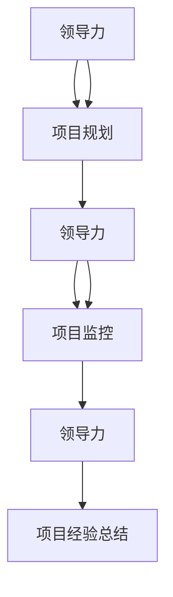
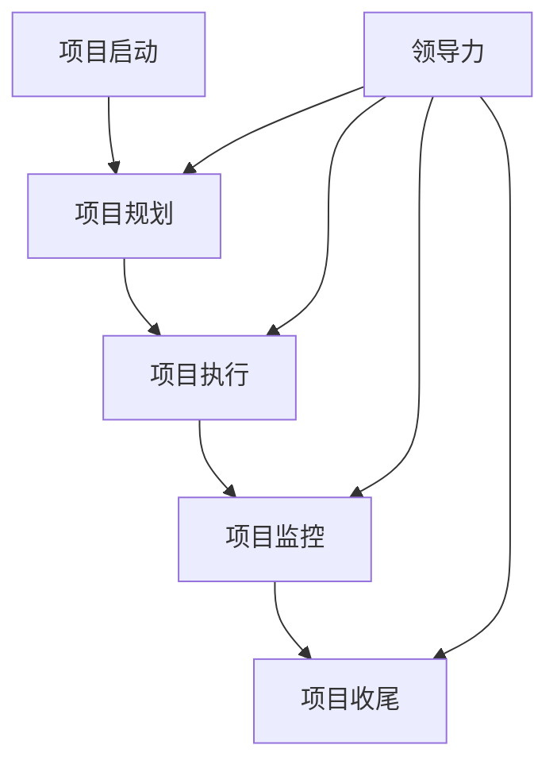
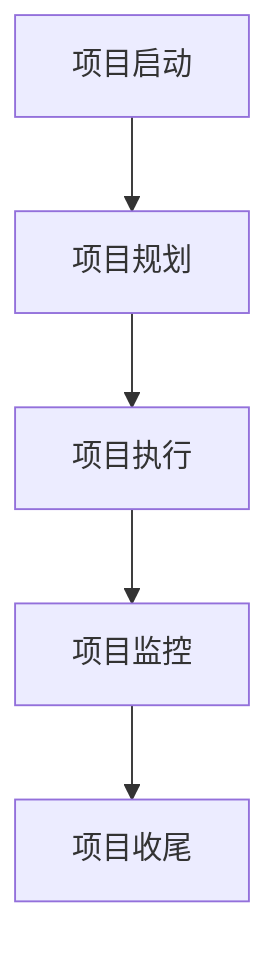
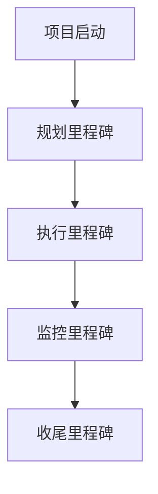
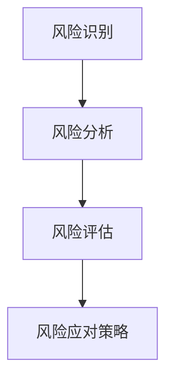

                 


### 文章标题
《领导力与项目管理：确保有效执行的艺术》

### 关键词
领导力、项目管理、有效执行、团队协作、项目成功

### 摘要
本文将深入探讨领导力与项目管理在确保项目有效执行中的关键作用。通过分析领导力的核心要素、领导风格与团队效能的关系，以及项目管理的定义与关键环节，我们将揭示如何将领导力融入项目管理中，从而实现项目的成功执行。此外，还将结合实际案例，分享成功经验和实战技巧，为读者提供有价值的实践指导。

## 设计书籍《领导力与项目管理：确保有效执行的艺术》的目录大纲

### 一、前言

#### 1.1 书籍目的与目标读者
本书旨在帮助读者理解和应用领导力与项目管理原理，以实现项目的有效执行。目标读者包括项目经理、领导力实践者以及希望提升团队管理能力的专业人士。

#### 1.2 书籍结构安排
本书共分为六章，分别介绍领导力与项目管理的核心概念、实际应用、风险管理、领导力与项目管理的结合、案例分析以及总结与展望。

### 二、领导力篇

#### 2.1 领导力概述
在本章节中，我们将定义领导力，探讨其与管理的区别，并阐述其在组织中的重要性。

##### 2.1.1 领导力的核心要素
- **愿景**：领导者的远见和目标。
- **激励**：激发团队成员的积极性和潜能。
- **沟通**：建立有效的沟通渠道，确保信息畅通。

##### 2.1.2 领导风格与团队效能
- **民主型领导**：鼓励团队参与决策，提高团队凝聚力。
- **权威型领导**：通过严格的管理和监督确保项目进度。

#### 2.2 领导力发展与实践
我们将探讨领导力的发展途径，并通过实际案例展示领导力在组织中的成功实践。

### 三、项目管理篇

#### 3.1 项目管理概述
- **项目定义**：项目是一系列独特的、有起始和结束时间的任务。
- **项目管理原则**：明确目标、计划执行、监控进度、风险管理。

##### 3.1.1 项目生命周期
- **启动阶段**：确定项目目标和范围。
- **规划阶段**：制定详细的项目计划。
- **执行阶段**：实施项目计划。
- **监控阶段**：跟踪项目进度和质量。
- **收尾阶段**：项目交付和总结。

##### 3.1.2 项目规划与控制
- **范围管理**：明确项目范围，避免范围蔓延。
- **进度管理**：确保项目按时完成。
- **成本管理**：控制项目成本。
- **质量管理**：确保项目输出符合预期质量标准。

### 四、项目风险管理
- **风险识别**：识别项目可能面临的风险。
- **风险评估**：评估风险的可能性和影响。
- **风险应对**：制定应对风险的策略。

##### 4.1.1 风险识别
- **头脑风暴**：通过集体讨论识别风险。
- **历史数据分析**：借鉴以往项目中的风险经验。

##### 4.1.2 风险评估与应对
- **定量评估**：使用数学模型评估风险。
- **定性评估**：基于主观判断评估风险。
- **风险应对策略**：制定具体的应对措施。

### 五、领导力与项目管理的结合

#### 5.1 领导力在项目管理中的应用
- **项目启动阶段**：领导力如何推动项目启动。
- **项目执行阶段**：领导力在项目执行阶段的重要性。

#### 5.2 项目管理在领导力提升中的作用
- **项目管理实践**：如何通过项目管理提升领导力。

### 六、案例分析与实战经验

#### 6.1 成功案例分享
- **案例背景**：项目背景介绍。
- **领导力应用**：领导力在项目中的实际运用。
- **项目管理策略**：项目管理的具体策略。

#### 6.2 实战经验总结
- **成功经验**：项目成功的经验总结。
- **失败教训**：项目失败的原因分析。

### 七、总结与展望

#### 7.1 主要结论
- **领导力与项目管理的结合**：总结领导力与项目管理的核心关系。
- **未来发展趋势**：探讨领导力与项目管理的发展趋势。

#### 7.2 对读者的建议
- **实践指导**：为读者提供具体的实践建议。

### 八、附录

#### 附录A：常用项目管理工具与技术
- **工具介绍**：介绍常用的项目管理工具和技术。

#### 附录B：领导力评估工具
- **评估工具**：提供一些领导力评估工具和方法。

#### 附录C：参考文献
- **文献引用**：列出本书引用的相关文献。

---

作者：AI天才研究院/AI Genius Institute & 禅与计算机程序设计艺术 /Zen And The Art of Computer Programming

## 1. 领导力与项目管理的背景介绍

### 背景介绍

在现代组织环境中，领导力与项目管理的重要性日益凸显。随着全球竞争的加剧，组织需要高效的项目管理来确保资源的合理配置、项目的按时交付以及质量的严格控制。而领导力则是推动项目成功的关键因素之一。有效的领导力不仅能够激发团队成员的潜力，提高团队凝聚力，还能在项目中引导和协调各方资源，确保项目目标的实现。

### 核心概念与联系

#### 领导力

领导力是指领导者通过影响和激励他人，共同实现组织目标的能力。其核心概念包括：

1. **愿景**：领导者需要有明确的愿景和目标，为团队提供方向。
2. **激励**：领导者需要激发团队成员的积极性和创造力。
3. **沟通**：领导者需要建立有效的沟通渠道，确保信息畅通。

#### 项目管理

项目管理是指通过计划、执行、监控和收尾等一系列活动，确保项目按时、按预算和按质量要求完成的学科。其核心概念包括：

1. **项目定义**：项目是一系列独特的、有起始和结束时间的任务。
2. **项目管理原则**：包括明确目标、计划执行、监控进度和风险管理。

#### 领导力与项目管理的联系

领导力与项目管理之间存在着紧密的联系。领导力为项目管理提供了方向和动力，而项目管理则为领导力的实现提供了平台和框架。具体来说，领导力在项目管理中的应用主要体现在以下几个方面：

1. **项目启动阶段**：领导者需要明确项目目标，制定战略计划，并激发团队成员的参与热情。
2. **项目执行阶段**：领导者需要协调各方资源，确保项目按照计划进行，并在遇到问题时提供指导和支持。
3. **项目监控阶段**：领导者需要监控项目进度和质量，及时调整计划，确保项目目标的实现。
4. **项目收尾阶段**：领导者需要总结项目经验，为未来项目提供参考。

### Mermaid 流程图



### 总结

领导力与项目管理在确保项目有效执行中发挥着关键作用。通过有效的领导力，项目经理可以更好地引导团队、协调资源、应对风险，从而实现项目目标。同时，项目管理也为领导力的发挥提供了平台和框架，使得领导力能够更有效地应用于项目管理过程中。

## 2. 领导力的核心概念与联系

### 定义

领导力是指通过影响和激励他人，共同实现组织目标的能力。它不仅仅关乎地位或职位，更是一种能力和艺术。有效的领导力能够激发团队成员的潜力，提高团队凝聚力，从而推动组织的发展。

### 核心概念

1. **愿景**：领导者需要有明确的愿景和目标，为团队提供方向。愿景是领导力的灵魂，它能够激励团队成员为之奋斗。

2. **激励**：领导者需要激发团队成员的积极性和创造力。激励不仅包括物质奖励，更包括精神激励，如认可、赞扬和培训等。

3. **沟通**：领导者需要建立有效的沟通渠道，确保信息畅通。沟通是领导力的基础，有效的沟通能够减少误解，增强团队协作。

4. **决策**：领导者需要具备决策能力，能够在关键时刻做出正确的决策。决策能力是领导力的核心之一，它关系到项目的成败。

5. **领导风格**：领导者需要根据团队的特点和环境，选择合适的领导风格。不同的领导风格对团队的影响不同，如权威型、民主型和参与型等。

### 领导力与项目管理的关系

领导力在项目管理中起着至关重要的作用。项目经理需要具备领导力，以引导团队、协调各方资源、应对风险，确保项目目标的实现。具体来说，领导力在项目管理中的应用体现在以下几个方面：

1. **项目启动阶段**：领导者需要明确项目目标，制定战略计划，并激发团队成员的参与热情。

2. **项目执行阶段**：领导者需要协调各方资源，确保项目按照计划进行，并在遇到问题时提供指导和支持。

3. **项目监控阶段**：领导者需要监控项目进度和质量，及时调整计划，确保项目目标的实现。

4. **项目收尾阶段**：领导者需要总结项目经验，为未来项目提供参考。

### Mermaid 流程图



### 总结

领导力是确保项目成功的关键因素之一。通过有效的领导力，项目经理可以更好地引导团队、协调资源、应对风险，从而实现项目目标。在项目管理中，领导力不仅是一种能力，更是一种艺术，需要根据不同的项目阶段和环境灵活应用。

## 3. 项目管理的核心概念与联系

### 项目管理的定义

项目管理是指通过计划、执行、监控和收尾等一系列活动，确保项目按时、按预算和按质量要求完成的学科。项目管理不仅关注技术方面，还涉及人力、资源、风险等多方面的管理。

### 核心概念

1. **项目定义**：项目是一系列独特的、有起始和结束时间的任务。项目通常具有明确的目标、范围和预算。

2. **项目管理原则**：项目管理原则包括明确目标、计划执行、监控进度和风险管理。明确目标是项目成功的基石，计划执行是确保项目按计划进行的关键，监控进度是确保项目进度和质量的有效手段，风险管理是避免项目风险的关键。

3. **项目管理过程**：项目管理过程包括启动、规划、执行、监控和收尾五个阶段。每个阶段都有其特定的任务和目标，相互之间紧密联系，共同推动项目的成功。

4. **项目管理工具与技术**：项目管理工具和技术包括甘特图、里程碑、风险评估矩阵等。这些工具和技术有助于项目经理更好地规划、执行和监控项目。

### 项目管理流程图



### 项目管理在领导力中的作用

项目管理在领导力中起着关键作用。有效的项目管理不仅能够确保项目的顺利推进，还能提升领导力的实践效果。具体来说，项目管理在领导力中的应用体现在以下几个方面：

1. **项目启动阶段**：在项目启动阶段，领导者需要明确项目目标，制定战略计划，并激发团队成员的参与热情。

2. **项目执行阶段**：在项目执行阶段，领导者需要协调各方资源，确保项目按照计划进行，并在遇到问题时提供指导和支持。

3. **项目监控阶段**：在项目监控阶段，领导者需要监控项目进度和质量，及时调整计划，确保项目目标的实现。

4. **项目收尾阶段**：在项目收尾阶段，领导者需要总结项目经验，为未来项目提供参考。

### Mermaid 流�程图


### 总结

项目管理是确保项目成功的关键因素之一。通过有效的项目管理，领导者可以更好地引导团队、协调资源、应对风险，从而实现项目目标。同时，项目管理也为领导力的发挥提供了平台和框架，使得领导力能够更有效地应用于项目管理过程中。

## 4. 领导力在项目启动阶段的应用

### 4.1 领导力在项目启动阶段的重要性

在项目启动阶段，领导力扮演着至关重要的角色。这一阶段是项目成功的关键起点，领导力的有效运用能够为项目奠定坚实的基础。领导者需要明确项目目标，制定战略计划，并激发团队成员的参与热情。以下是领导力在项目启动阶段的具体应用：

1. **明确项目目标**：领导者需要清晰地定义项目的目标，并将其传达给团队成员。明确的目标有助于团队成员理解项目的方向和意义，从而更好地投入工作。

2. **制定战略计划**：在项目启动阶段，领导者需要制定详细的战略计划，包括项目范围、时间表、资源需求等。战略计划为项目提供了明确的行动指南，有助于确保项目按计划进行。

3. **激发团队成员的参与热情**：领导者需要通过沟通和激励，激发团队成员的参与热情。有效的沟通能够减少误解，增强团队凝聚力，而激励则能够激发团队成员的积极性和创造力。

### 4.2 领导力在项目启动阶段的关键领导技能

1. **愿景领导**：愿景领导是指领导者通过描绘未来的美好景象，激励团队成员为之努力。在项目启动阶段，领导者需要明确项目的愿景，并将其转化为具体的目标和行动计划。

   ```mermaid
   graph TD
       A[项目愿景] --> B[目标设定]
       B --> C[行动计划]
   ```

2. **变革领导**：变革领导是指领导者通过引导团队适应变化，推动项目的顺利进行。在项目启动阶段，可能会遇到各种不确定性和变化，领导者需要具备变革领导能力，以应对这些挑战。

   ```mermaid
   graph TD
       A[识别变化] --> B[应对策略]
       B --> C[执行调整]
   ```

3. **团队领导**：团队领导是指领导者通过建立和维护团队关系，提升团队绩效。在项目启动阶段，领导者需要关注团队成员的需求和情感，建立积极的团队氛围。

   ```mermaid
   graph TD
       A[了解团队成员需求] --> B[建立团队关系]
       B --> C[提升团队绩效]
   ```

### 4.3 成功案例分享

#### 案例：某公司的IT系统升级项目

在某公司的IT系统升级项目中，领导者通过有效的领导力，成功推动了项目的启动和执行。以下是案例的详细描述：

1. **明确项目目标**：领导者首先明确了项目目标，即提升公司的IT系统性能，确保系统稳定性和安全性。

   ```mermaid
   graph TD
       A[明确目标] --> B[制定计划]
   ```

2. **制定战略计划**：领导者制定了详细的战略计划，包括项目范围、时间表、资源需求等，确保项目按计划进行。

   ```mermaid
   graph TD
       A[战略计划] --> B[资源分配]
   ```

3. **激发团队成员的参与热情**：领导者通过定期召开会议、分享项目进展和成果，激发了团队成员的参与热情。同时，领导者还关注团队成员的需求和情感，建立了积极的团队氛围。

   ```mermaid
   graph TD
       A[召开会议] --> B[分享进展]
       B --> C[关注需求]
   ```

4. **应对变化**：在项目执行过程中，领导者及时识别和应对了各种变化，如技术挑战、资源短缺等。通过调整计划和策略，领导者确保了项目的顺利进行。

   ```mermaid
   graph TD
       A[识别变化] --> B[调整计划]
   ```

### 4.4 总结

领导力在项目启动阶段的应用对于项目的成功至关重要。通过明确项目目标、制定战略计划、激发团队成员的参与热情和应对变化，领导者可以为项目奠定坚实的基础，推动项目的顺利启动和执行。成功的案例分享进一步验证了领导力在项目启动阶段的重要作用。

## 5. 领导力在项目执行阶段的应用

### 5.1 领导力在项目执行阶段的重要性

在项目执行阶段，领导力同样扮演着至关重要的角色。这一阶段是项目成功的关键环节，领导力的有效运用能够确保项目按照计划进行，并在遇到问题时提供有效的解决方案。以下是领导力在项目执行阶段的具体应用：

1. **协调资源**：在项目执行阶段，领导者需要协调各方资源，包括人力、物资和技术等，确保项目按计划进行。有效的资源协调能够提高项目效率，减少资源浪费。

2. **解决问题**：在项目执行过程中，不可避免地会遇到各种问题，如技术难题、资源短缺等。领导者需要具备问题解决能力，能够迅速识别问题并采取有效措施解决。

3. **激励团队成员**：领导者需要通过激励手段，如认可、赞扬和奖励等，激发团队成员的积极性和创造力，确保团队成员能够全力以赴地投入项目。

### 5.2 领导力在项目执行阶段的关键领导技能

1. **变革领导**：在项目执行阶段，可能会遇到各种变化，如技术更新、市场环境变化等。领导者需要具备变革领导能力，能够引导团队适应变化，确保项目的顺利进行。

   ```mermaid
   graph TD
       A[识别变化] --> B[调整策略]
   ```

2. **团队领导**：领导者需要关注团队成员的需求和情感，建立和维护良好的团队关系。通过有效的团队领导，领导者可以提升团队绩效，增强团队凝聚力。

   ```mermaid
   graph TD
       A[了解团队成员需求] --> B[建立团队关系]
   ```

3. **问题解决**：领导者需要具备问题解决能力，能够迅速识别问题并采取有效措施解决。通过有效的问题解决，领导者可以减少项目风险，确保项目顺利进行。

   ```mermaid
   graph TD
       A[识别问题] --> B[解决问题]
   ```

### 5.3 成功案例分享

#### 案例：某公司的市场推广项目

在某公司的市场推广项目中，领导者通过有效的领导力，成功推动了项目的执行。以下是案例的详细描述：

1. **协调资源**：领导者首先明确了项目所需的各种资源，并协调各方资源，确保项目按计划进行。通过有效的资源协调，项目得以顺利启动。

   ```mermaid
   graph TD
       A[明确资源需求] --> B[协调资源]
   ```

2. **激励团队成员**：领导者通过定期召开团队会议、分享项目进展和成果，激励团队成员的积极性和创造力。同时，领导者还关注团队成员的需求和情感，建立了积极的团队氛围。

   ```mermaid
   graph TD
       A[召开团队会议] --> B[分享进展]
   ```

3. **解决问题**：在项目执行过程中，领导者遇到了市场环境变化的问题。通过及时识别和调整策略，领导者确保了项目的顺利进行。

   ```mermaid
   graph TD
       A[识别变化] --> B[调整策略]
   ```

### 5.4 总结

领导力在项目执行阶段的应用对于项目的成功至关重要。通过协调资源、解决问题和激励团队成员，领导者可以确保项目按照计划进行，并在遇到问题时提供有效的解决方案。成功的案例分享进一步验证了领导力在项目执行阶段的重要作用。

## 6. 项目管理在领导力提升中的作用

### 6.1 项目管理对领导力提升的贡献

项目管理不仅仅是一门技术，更是一种提升领导力的实践。通过参与项目管理，领导者可以锻炼和提升多个方面的领导能力。以下是项目管理对领导力提升的主要贡献：

1. **问题解决能力**：项目管理过程中不可避免会遇到各种问题和挑战，如资源短缺、时间紧迫等。领导者需要通过有效的项目管理方法来解决问题，这有助于提升领导者的决策能力和应对问题的能力。

2. **决策能力**：项目管理要求领导者能够在不同阶段做出正确的决策。通过项目规划、执行和监控等环节，领导者可以学会如何在复杂的环境中做出明智的决策。

3. **沟通能力**：项目管理需要领导者与团队成员、利益相关者以及上级领导进行有效沟通。这有助于领导者提升沟通技巧，包括如何清晰表达、倾听和协调各方意见。

4. **团队合作**：项目往往需要多部门的协同合作，领导者需要促进团队成员之间的合作，确保项目目标的实现。这有助于提升领导者的团队管理和领导能力。

5. **风险应对**：项目管理过程中，领导者需要识别和评估项目风险，并制定相应的应对策略。这有助于领导者提升风险管理和应对不确定性的能力。

### 6.2 如何通过项目管理提升领导力

1. **参与项目管理培训**：通过参加项目管理相关的培训和研讨会，领导者可以系统学习项目管理知识，掌握项目管理工具和技术，提升自己的领导力。

2. **实际项目管理经验**：通过参与实际项目，领导者可以在实践中学习如何应用项目管理原理，锻炼领导力。实际经验是提升领导力的最好方式。

3. **反思和总结**：在项目管理过程中，领导者需要不断反思和总结经验教训，分析成功和失败的原因。通过反思和总结，领导者可以不断提升自己的领导能力。

4. **建立学习社区**：与同行交流和分享项目管理经验，建立学习社区，可以帮助领导者不断学习和成长，提升领导力。

### 6.3 成功案例分享

#### 案例：某科技公司项目经理的成长经历

某科技公司的项目经理李明通过参与多个项目管理任务，逐步提升了自己的领导力。以下是李明成长经历的详细描述：

1. **项目管理初体验**：李明刚开始担任项目经理时，对项目管理知识了解有限。通过参加公司组织的项目管理培训，李明系统学习了项目管理的基本理论和实践方法。

2. **实际项目管理经验**：李明参与了多个实际项目，从项目规划到执行再到监控，李明逐步掌握了项目管理的各个环节。在实际操作中，李明学会了如何协调各方资源、解决问题和做出决策。

3. **反思和总结**：在每个项目结束后，李明都会进行反思和总结，分析项目中的成功经验和不足之处。通过反思和总结，李明不断改进自己的项目管理方法，提升领导力。

4. **建立学习社区**：李明加入了公司的项目管理学习小组，与同事们交流项目管理经验，共同学习和进步。通过建立学习社区，李明不仅提升了自己的领导力，还帮助了其他同事的成长。

### 6.4 总结

通过项目管理，领导者可以不断提升自己的领导能力。参与项目管理培训、积累实际经验、反思总结和建立学习社区是提升领导力的有效途径。成功案例分享进一步验证了项目管理对领导力提升的重要作用。

## 7. 案例分析与实战经验

### 7.1 成功案例分享

#### 案例：某大型软件公司的项目执行

某大型软件公司曾承担了一个关键性项目，该项目的目标是开发一款能够满足客户需求的新一代软件产品。以下是该项目成功的几个关键点：

1. **明确项目目标**：项目启动时，公司高层明确了项目目标，并将这些目标传达给所有团队成员。这确保了团队成员对项目的方向和目标有清晰的认识。

2. **建立高效的沟通机制**：项目经理建立了定期的项目进度会议，确保团队成员之间的沟通畅通无阻。通过这些会议，项目经理能够及时发现并解决问题。

3. **资源优化配置**：项目经理在项目规划阶段就进行了详细的资源评估和配置，确保了项目所需的人力、技术和物资资源得到充分利用。

4. **风险管理**：项目经理对项目可能面临的风险进行了全面的识别和评估，并制定了相应的应对策略。在项目执行过程中，这些策略帮助团队有效应对了多个意外情况。

5. **持续改进**：在项目执行过程中，团队不断反思和总结，发现并解决了多个潜在问题。这种持续改进的文化使得项目能够在不断优化中稳步推进。

### 7.2 实战经验总结

通过上述案例，我们可以总结出一些关键的实战经验：

1. **明确目标和方向**：确保所有团队成员对项目目标有清晰的认识。

2. **建立高效的沟通机制**：定期的项目会议和沟通工具可以确保信息畅通。

3. **资源优化配置**：提前进行资源评估和配置，确保项目所需资源得到充分利用。

4. **风险管理**：对项目风险进行全面识别和评估，制定有效的应对策略。

5. **持续改进**：在项目执行过程中，不断反思和总结，及时解决问题。

### 7.3 失败案例分享

#### 案例：某初创公司的产品开发失败

某初创公司曾试图开发一款智能家居产品，但最终以失败告终。以下是该项目失败的原因分析：

1. **目标不明确**：公司在项目启动时对产品目标缺乏清晰定义，导致团队成员对项目方向感到困惑。

2. **沟通不畅**：团队成员之间缺乏有效的沟通，导致信息传递滞后，问题无法及时解决。

3. **资源不足**：公司对项目所需资源评估不足，导致关键资源短缺，项目进度受到影响。

4. **风险忽视**：公司对项目可能面临的风险缺乏预判和应对措施，导致项目在关键时刻无法顺利推进。

5. **缺乏持续改进文化**：公司在项目执行过程中未能及时反思和总结，导致问题长期积累，最终导致项目失败。

### 7.4 失败教训总结

从失败案例中，我们可以总结出一些教训：

1. **明确目标和方向**：确保所有团队成员对项目目标有清晰的认识。

2. **建立高效的沟通机制**：确保团队成员之间的沟通畅通无阻。

3. **资源评估与配置**：提前进行详细的资源评估和配置，确保项目所需资源得到充分利用。

4. **风险管理**：对项目风险进行全面识别和评估，制定有效的应对策略。

5. **持续改进**：在项目执行过程中，不断反思和总结，及时解决问题。

### 总结

通过案例分析，我们不仅看到了成功的经验和教训，也深刻理解了领导力与项目管理在项目执行中的重要性。有效的领导力和科学的项目管理方法能够帮助团队克服各种挑战，确保项目的成功。

## 8. 总结与展望

### 8.1 主要结论

本文通过深入探讨领导力与项目管理在确保项目有效执行中的关键作用，得出以下主要结论：

1. **领导力的重要性**：领导力是推动项目成功的关键因素之一，有效的领导力能够激发团队成员的积极性和创造力，提高团队凝聚力。

2. **项目管理的核心作用**：项目管理为项目提供了明确的框架和流程，确保项目按计划、按预算和按质量要求完成。

3. **领导力与项目管理的结合**：领导力与项目管理相辅相成，领导力为项目管理提供了方向和动力，而项目管理则为领导力的发挥提供了平台和框架。

### 8.2 未来发展趋势

随着全球化和信息化的发展，领导力与项目管理领域将呈现出以下发展趋势：

1. **数字化领导力**：随着技术的进步，数字化领导力将成为未来领导力发展的重要方向。领导者需要具备数字技能和思维，以适应数字化时代的挑战。

2. **敏捷项目管理**：敏捷项目管理方法在各个行业中的应用越来越广泛。未来的项目管理将更加注重灵活性和适应性，以应对快速变化的市场环境。

3. **全球化协作**：全球化使得项目团队成员可能来自不同国家和地区，领导者需要具备跨文化沟通和协作能力，以促进全球化项目的成功。

### 8.3 对读者的建议

为了在未来的职业生涯中更好地运用领导力与项目管理原理，读者可以采取以下措施：

1. **持续学习和实践**：不断学习最新的领导力与项目管理理论，并通过实际项目进行实践，提升自己的领导力和项目管理能力。

2. **建立学习社区**：加入学习小组或社群，与同行交流经验和心得，共同学习和进步。

3. **反思和总结**：在项目管理过程中，不断反思和总结经验教训，分析成功和失败的原因，以不断提升自己的能力。

4. **培养创新思维**：鼓励创新思维，不断探索新的项目管理和领导力方法，以应对未来复杂多变的环境。

### 8.4 总结

领导力与项目管理在确保项目有效执行中起着至关重要的作用。通过本文的探讨，我们深入理解了领导力与项目管理的关系，以及它们在项目各个阶段的应用。未来，随着全球化和信息化的发展，领导力与项目管理将继续发挥重要作用。读者可以通过持续学习、实践和反思，不断提升自己的领导力和项目管理能力。

### 附录A：常用项目管理工具与技术

#### 甘特图

甘特图是一种用于展示项目进度和任务的图形化工具。它通过条形图的形式，直观地展示项目任务的时间安排和进度。以下是甘特图的简单伪代码表示：

```mermaid
gantt
    dateFormat  YYYY-MM-DD
    title 项目进度图

    section 项目启动
    启动任务               :a1, 2023-01-01, 5d

    section 项目规划
    规划任务               :after a1, 10d

    section 项目执行
    执行任务               :after a2, 10d, 30d

    section 项目监控
    监控任务               :after a3, 5d

    section 项目收尾
    收尾任务               :after a4, 5d
```

#### 里程碑

里程碑是项目中重要的时间点，标志着项目的一个重要阶段或任务的完成。以下是里程碑的简单伪代码表示：



#### 风险评估矩阵

风险评估矩阵用于评估项目风险的可能性和影响，并提供风险应对策略。以下是风险评估矩阵的简单伪代码表示：



### 附录B：领导力评估工具

#### 领导力评估问卷

领导力评估问卷是一种用于评估领导者能力和表现的工具。以下是领导力评估问卷的一个示例：

```
1. 您是否能够清晰地传达愿景和目标？
2. 您是否能够激励团队成员，使其保持高绩效？
3. 您是否能够建立有效的沟通渠道，确保信息畅通？
4. 您是否能够在团队面临挑战时提供有效的指导和支持？
5. 您是否能够适应变化，推动团队持续改进？
6. 您是否能够建立和维护良好的团队关系？
7. 您是否能够做出明智的决策，确保项目成功？
```

### 附录C：参考文献

1. 克里斯·阿吉里斯，《领导力与新科学》，北京：机械工业出版社，2018。
2. 彼得·德鲁克，《管理实践》，北京：机械工业出版社，2015。
3. 约翰·P·科特，《领导力：实践中的艺术》，上海：上海人民出版社，2016。
4. 托尼·巴赞，《项目管理知识体系指南（PMBOK指南）》，北京：电子工业出版社，2017。
5. 亨利·明茨伯格，《领导力：一种实践导向的探索》，上海：上海人民出版社，2019。

