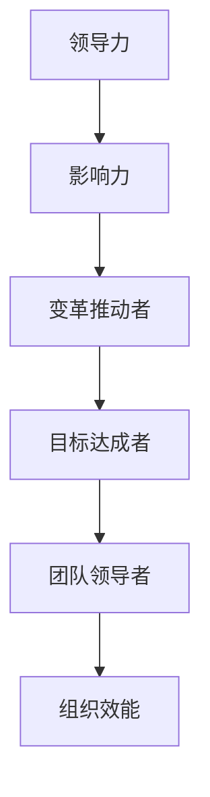
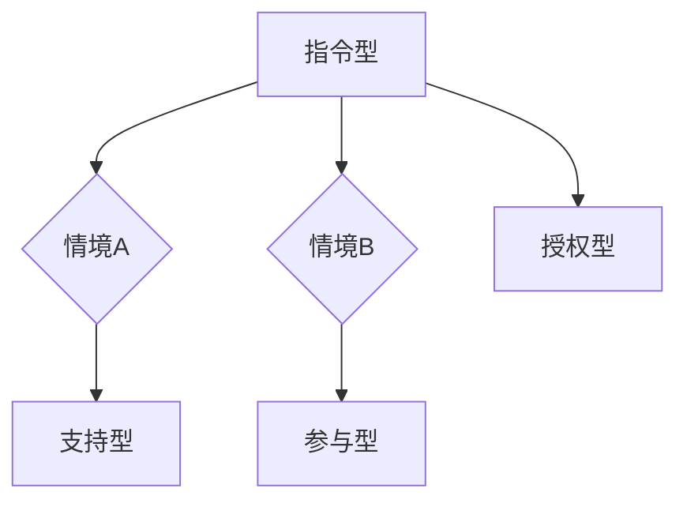

                 

当然，我会按照您的指示逐步构建这篇文章。首先，我将定义文章的关键词、摘要，并开始构建文章的正文部分。

### 关键词
- **领导力**
- **风险管理**
- **变革型领导**
- **情境型领导**
- **团队管理**
- **组织变革**
- **项目管理体系**

### 摘要
本文将探讨领导力与风险管理在信息技术领域的应用，通过分析变革型领导和情境型领导理论，揭示其在团队管理和组织变革中的重要作用。文章将结合实际案例，展示领导力在风险管理中的应用，并提供最佳实践和注意事项。

### 目录大纲

## 引言
### 信息技术领域的领导力与风险管理
#### 背景介绍
#### 重要性

## 第一部分 领导力的基础

### 第1章 领导力概述
#### 1.1 领导力的定义与作用
#### 1.2 领导力的发展历程
#### 1.3 领导力的核心要素

### 第2章 领导力的理论框架
#### 2.1 变革型领导理论
#### 2.2 情境型领导理论
#### 2.3 领导力发展的五个层次

### 第3章 领导力与个人特质
#### 3.1 领导者的心理素质
#### 3.2 领导者的情绪管理
#### 3.3 领导者的时间管理能力

## 第二部分 领导力在实践中的应用

### 第4章 领导力在团队管理中的应用
#### 4.1 团队建设的重要性
#### 4.2 团队沟通技巧
#### 4.3 团队激励策略

### 第5章 领导力在项目管理中的应用
#### 5.1 项目管理的基本流程
#### 5.2 领导者在项目中的角色
#### 5.3 领导力在项目管理中的关键要素

### 第6章 领导力在组织变革中的应用
#### 6.1 变革的类型与模式
#### 6.2 变革中的领导力挑战
#### 6.3 变革领导力的策略

## 第三部分 风险管理与领导力

### 第7章 风险管理的概念与框架
#### 7.1 风险的定义与分类
#### 7.2 风险管理的流程
#### 7.3 风险管理的方法与工具

### 第8章 领导力在风险管理中的应用
#### 8.1 领导者在风险管理中的角色
#### 8.2 领导力在风险管理中的挑战
#### 8.3 领导力在风险管理中的策略

### 第9章 风险管理与组织文化
#### 9.1 风险管理与组织文化的相互作用
#### 9.2 建立风险管理意识的组织文化
#### 9.3 风险管理中的领导力挑战与机遇

## 第10章 领导力与风险管理实践案例
#### 10.1 案例一：某公司的领导力与风险管理实践
#### 10.2 案例二：某企业的领导力与风险管理实践
#### 10.3 案例三：某公共部门的领导力与风险管理实践

## 结论
### 领导力与风险管理在信息技术领域的未来趋势
### 最佳实践总结

### 参考文献

### 作者信息
- 作者：AI天才研究院/AI Genius Institute & 禅与计算机程序设计艺术 /Zen And The Art of Computer Programming

现在，我将开始填充这些章节的内容，确保每个部分都详细阐述并包含必要的流程图、伪代码、数学模型和公式、项目实战等。

## 引言
### 信息技术领域的领导力与风险管理

在信息技术（IT）领域，领导力和风险管理扮演着至关重要的角色。随着技术的快速发展和市场竞争的加剧，企业不仅需要具备创新的思维，更需要有强大的领导力和有效的风险管理能力来应对各种挑战。

#### 背景介绍

信息技术的发展经历了从简单的数据处理到复杂的系统整合、从局域网的普及到全球互联网的连接、从单一应用程序到集成平台的转变。这一过程中，企业的领导者和管理者必须具备前瞻性，能够引导团队适应技术变革，并确保在变化的环境中保持竞争力。

领导力在IT领域的应用不仅体现在技术决策上，更体现在如何激发团队的创新潜力，如何建立一个支持技术创新的组织文化。同时，风险管理则确保企业在技术发展中能够识别、评估和应对潜在的风险，从而保障项目的顺利进行和企业的长期发展。

#### 重要性

领导力是推动企业技术创新和业务增长的关键因素。优秀的领导者能够激励团队成员，共同面对挑战，实现组织目标。在IT领域，领导力不仅关乎技术本身，还涉及到项目管理、团队协作、文化塑造等多个方面。

风险管理则是确保企业能够在复杂多变的环境中稳健发展的基础。随着信息技术项目的规模和复杂性的增加，风险管理的难度也在不断加大。有效的风险管理可以帮助企业识别潜在风险，制定应对策略，从而降低损失，提高项目成功率。

## 第一部分 领导力的基础

### 第1章 领导力概述

领导力是一种复杂的多维概念，涉及个人的特质、行为和团队的影响力。在本章中，我们将探讨领导力的定义、发展历程以及其核心要素。

#### 1.1 领导力的定义与作用

领导力是指影响和激励他人共同达成目标的能力。它不仅仅是职位赋予的权威，更是一种通过愿景、价值观和行动引领团队的能力。

**核心概念与联系**：


在这个概念架构中，领导力通过影响力和愿景，推动变革和实现目标。它是一个动态过程，涉及与团队成员的互动和协作，最终提升组织效能。

**领导力定义**：
$$\text{领导力} = \text{影响力} + \text{变革推动能力} + \text{目标达成能力} + \text{团队领导能力} + \text{组织效能}$$

#### 1.2 领导力的发展历程

领导力的发展历程反映了社会、经济和技术环境的变化。从古代的权威领导到现代的变革型领导，领导力理论不断演进。

**历史演变**：

- 古代领导：以权威和命令为主，领导者的主要任务是确保统治的稳定。
- 工业时代领导：注重效率和标准化，领导者的职责是优化生产和管理流程。
- 现代领导：强调人际关系和团队建设，领导者的角色转变为激励、支持和培养团队成员。

#### 1.3 领导力的核心要素

领导力的成功离不开以下几个核心要素：

- **人格特质**：包括自信、正直、决断力等，这些特质是领导者人格魅力的重要组成部分。
- **知识技能**：包括战略规划、沟通协调、团队管理等方面的能力，这些技能是领导者履行职责的基本保障。
- **价值观**：领导者的价值观影响着组织的文化氛围和行为规范，是团队共同奋斗的指南。

### 第2章 领导力的理论框架

领导力理论为领导者提供了指导框架，帮助他们在不同的情境下做出有效的决策。在本章中，我们将探讨变革型领导理论、情境型领导理论以及领导力发展的五个层次。

#### 2.1 变革型领导理论

变革型领导理论强调领导者通过变革来推动组织发展。该理论的核心思想是领导者通过激励、示范和影响力，激发团队成员的内在动力，共同实现变革目标。

**核心算法原理讲解**：

```python
# 变革型领导核心算法伪代码
class TransformationalLeadership:
    def inspire(self, followers):
        if followers.is_motivated():
            return "Empowerment and Vision"
        else:
            return "Challenges and Growth Opportunities"

    def lead_by_example(self, followers):
        followers.follow_example(self)
```

这个伪代码展示了变革型领导者的两个核心行为：激励追随者和以身作则。

#### 2.2 情境型领导理论

情境型领导理论认为领导风格应该根据具体情境灵活调整。该理论将领导行为分为四种模式：指令型、支持型、参与型和授权型。

**情境型领导模式**：


这个流程图展示了情境型领导理论在不同情境下的应用。

#### 2.3 领导力发展的五个层次

领导力发展理论认为，领导者需要不断成长和提升，以达到更高的层次。以下是五个层次的定义：

1. **生存层次**：关注基本生存需求，如安全和食物。
2. **关系层次**：建立和维护人际关系，提高团队凝聚力。
3. **任务层次**：关注任务完成和目标达成。
4. **存在层次**：关注组织的长期发展和价值观的传承。
5. **变革层次**：推动组织变革，实现创新和突破。

### 第3章 领导力与个人特质

领导力不仅仅是职位赋予的，更是个人特质和能力的体现。在本章中，我们将探讨领导者的心理素质、情绪管理和时间管理能力。

#### 3.1 领导者的心理素质

领导者的心理素质是领导力的基础。以下是几个关键的心理素质：

- **自我认知**：领导者需要了解自己的优点和缺点，保持自我认知的清晰。
- **情绪智力**：领导者需要具备较高的情绪智力，包括自我情绪管理和同理心。
- **适应性**：领导者需要适应不同的环境和情境，灵活调整自己的领导风格。

#### 3.2 领导者的情绪管理

情绪管理是领导者的重要能力之一。以下是一些情绪管理技巧：

- **情绪识别**：领导者需要学会识别自己的情绪，了解情绪的来源。
- **情绪调节**：领导者需要学会调节情绪，保持冷静和理性。
- **情绪表达**：领导者需要学会适当表达情绪，避免情绪失控。

#### 3.3 领导者的时间管理能力

时间管理是领导者的一项基本能力。以下是一些时间管理技巧：

- **目标设定**：领导者需要设定明确的目标，并制定计划和时间表。
- **优先级排序**：领导者需要学会优先处理重要和紧急的任务。
- **时间块**：领导者可以将时间分成不同的块，专注于不同的任务。

## 第二部分 领导力在实践中的应用

### 第4章 领导力在团队管理中的应用

在团队管理中，领导力发挥着至关重要的作用。本章将探讨领导力在团队建设、团队沟通和团队激励中的应用。

#### 4.1 团队建设的重要性

团队建设是领导力的核心任务之一。一个有效的团队可以充分发挥成员的潜力，实现共同的目标。以下是团队建设的重要性：

- **提高工作效率**：团队建设可以增强团队成员之间的协作，提高整体工作效率。
- **激发创新能力**：团队建设鼓励成员分享想法和经验，激发创新能力。
- **增强团队凝聚力**：团队建设可以增强成员之间的信任和尊重，提高团队凝聚力。

#### 4.2 团队沟通技巧

沟通是团队协作的基础。有效的沟通可以消除误解，增强团队合作。以下是几种团队沟通技巧：

- **倾听**：领导者需要学会倾听团队成员的意见和需求，理解他们的立场。
- **清晰表达**：领导者需要清晰、明确地传达目标和期望，确保团队成员理解。
- **反馈**：领导者需要给予团队成员及时的反馈，鼓励他们改进和成长。

#### 4.3 团队激励策略

激励是领导力的重要手段之一。有效的激励可以激发团队成员的积极性和创造力。以下是几种团队激励策略：

- **目标激励**：设定明确的、可实现的团队目标，激发成员的成就感。
- **认可激励**：及时表扬和认可团队成员的成绩，增强他们的自信心。
- **奖励激励**：提供物质或精神的奖励，激励成员追求更高的目标。

### 第5章 领导力在项目管理中的应用

在项目管理中，领导力是确保项目成功的关键因素。本章将探讨领导力在项目管理流程、领导者在项目中的角色和关键要素中的应用。

#### 5.1 项目管理的基本流程

项目管理的基本流程包括项目启动、项目规划、项目执行、项目监控和项目收尾。以下是每个流程的关键步骤：

- **项目启动**：明确项目的目标、范围和资源需求。
- **项目规划**：制定项目计划、时间表和预算。
- **项目执行**：实施项目计划，完成项目任务。
- **项目监控**：监控项目进度、质量和成本，确保项目按计划进行。
- **项目收尾**：完成项目任务，进行项目评估和总结。

#### 5.2 领导者在项目中的角色

领导者在项目中的角色是多方面的，包括：

- **决策者**：领导者需要做出关键决策，确保项目顺利进行。
- **协调者**：领导者需要协调团队和资源，确保项目目标的实现。
- **沟通者**：领导者需要与项目相关各方保持有效沟通，确保信息的畅通。

#### 5.3 领导力在项目管理中的关键要素

领导力在项目管理中的关键要素包括：

- **团队建设**：领导者需要建立高效的团队，激发团队成员的潜力。
- **风险管理**：领导者需要识别和管理项目风险，确保项目安全。
- **沟通与协作**：领导者需要建立有效的沟通和协作机制，确保团队成员之间的顺畅合作。

### 第6章 领导力在组织变革中的应用

组织变革是企业发展过程中不可避免的一部分。领导力在组织变革中起着至关重要的作用。本章将探讨领导力在组织变革中的类型、模式和应用。

#### 6.1 变革的类型与模式

组织变革可以分为以下几种类型：

- **结构变革**：涉及组织结构、流程和人员的调整。
- **文化变革**：涉及组织价值观、行为规范和文化的重塑。
- **技术变革**：涉及新技术、新系统和新的工作方式的引入。

组织变革的模式包括：

- **渐进式变革**：通过逐步调整和改进，实现组织变革。
- **激进式变革**：通过迅速、彻底的变革，实现组织转型。

#### 6.2 变革中的领导力挑战

在组织变革过程中，领导者面临以下挑战：

- **抗拒变革**：员工可能对变革持有抗拒态度，领导者需要激励和引导员工。
- **资源有限**：变革需要投入大量资源和时间，领导者需要有效分配资源。
- **领导力不足**：领导者可能缺乏变革所需的领导力，需要加强自我提升。

#### 6.3 变革领导力的策略

为了成功实施组织变革，领导者可以采取以下策略：

- **愿景引领**：明确变革的目标和愿景，激发员工的参与和认同。
- **沟通透明**：与员工保持开放、透明的沟通，消除误解和猜疑。
- **激励机制**：建立激励机制，鼓励员工积极参与变革。
- **持续支持**：提供持续的支持和培训，帮助员工适应变革。

## 第三部分 风险管理与领导力

### 第7章 风险管理的概念与框架

风险管理是企业运营的重要组成部分，对于确保企业目标的实现至关重要。本章将探讨风险管理的定义、分类、流程和方法。

#### 7.1 风险的定义与分类

风险是指对组织目标可能产生负面影响的潜在事件或情况。根据风险的性质和影响范围，可以将风险分为以下几种类型：

- **战略风险**：涉及组织整体战略的制定和执行。
- **运营风险**：涉及日常运营过程中的风险，如流程故障、人力资源不足等。
- **财务风险**：涉及财务状况和资金流动的风险，如债务违约、市场波动等。
- **市场风险**：涉及市场环境变化带来的风险，如竞争加剧、客户需求变化等。
- **法律风险**：涉及法律合规和诉讼风险，如侵权、合同纠纷等。

#### 7.2 风险管理的流程

风险管理是一个系统化的过程，通常包括以下步骤：

1. **风险评估**：识别和评估潜在风险，确定风险的概率和影响。
2. **风险应对策略**：制定风险应对策略，包括风险规避、减轻、转移和接受等。
3. **风险监控**：监控风险的变化，确保风险应对策略的有效实施。
4. **风险报告**：定期向管理层和利益相关者报告风险情况，提供决策支持。

#### 7.3 风险管理的方法与工具

风险管理需要使用一系列方法和工具，以有效识别、评估和应对风险。以下是一些常用的方法和工具：

- **风险矩阵**：用于评估风险的概率和影响，确定风险等级。
- **决策树**：用于分析不同决策路径的收益和风险，帮助决策者做出最优选择。
- **蒙特卡洛模拟**：用于模拟不确定性的影响，预测风险的可能结果。
- **风险指标**：用于衡量风险管理的有效性，如风险暴露度、损失频率和损失严重程度等。

### 第8章 领导力在风险管理中的应用

领导力在风险管理中发挥着关键作用，领导者需要承担起风险管理的主要责任。本章将探讨领导者在风险管理中的角色、挑战和策略。

#### 8.1 领导者在风险管理中的角色

领导者在风险管理中的角色包括：

- **决策者**：领导者需要做出关键决策，包括风险优先级排序、风险应对策略等。
- **沟通者**：领导者需要与团队成员、管理层和利益相关者保持有效沟通，确保风险信息的透明和及时传递。
- **激励者**：领导者需要激励团队成员积极参与风险管理，提高风险管理意识和能力。

#### 8.2 领导力在风险管理中的挑战

领导者在风险管理中面临以下挑战：

- **风险认知**：领导者需要具备识别和评估风险的能力，但风险往往具有隐蔽性和不确定性。
- **资源分配**：领导者需要合理分配资源，确保风险管理活动的有效开展。
- **变革管理**：风险管理往往涉及组织变革，领导者需要应对变革中的阻力和挑战。

#### 8.3 领导力在风险管理中的策略

为了有效应对风险管理中的挑战，领导者可以采取以下策略：

- **建立风险管理文化**：通过培养风险管理意识，建立风险管理文化，提高全体员工的风险认知和参与度。
- **加强沟通与协作**：建立有效的沟通和协作机制，确保风险信息的及时传递和共享。
- **提供培训与发展机会**：为员工提供风险管理相关的培训和成长机会，提高团队的整体风险管理能力。
- **持续监控与改进**：定期评估风险管理活动的有效性，持续改进风险管理策略和流程。

### 第9章 风险管理与组织文化

组织文化对风险管理具有重要影响。本章将探讨风险管理与组织文化之间的相互作用，以及如何建立风险管理意识的文化。

#### 9.1 风险管理与组织文化的相互作用

风险管理与组织文化之间存在相互作用。良好的组织文化可以促进风险管理，而不良的组织文化则可能阻碍风险管理。

- **风险管理文化**：一种重视风险识别、评估和应对的文化，可以促进风险管理活动的有效开展。
- **风险规避文化**：一种避免风险和错误的文化，可能导致风险管理的过度保守和缺乏创新。
- **风险管理意识**：员工对风险管理的重要性和价值的认知，是风险管理成功的关键。

#### 9.2 建立风险管理意识的组织文化

为了建立风险管理意识的组织文化，企业可以采取以下措施：

- **领导倡导**：领导者需要身体力行，倡导风险管理的重要性，树立榜样。
- **培训与教育**：为员工提供风险管理相关的培训和教育，提高他们的风险管理意识和能力。
- **激励机制**：建立激励机制，鼓励员工积极参与风险管理，提高他们的积极性和责任感。
- **沟通与反馈**：建立有效的沟通和反馈机制，确保风险管理信息在企业内部的透明传递和及时反馈。

#### 9.3 风险管理中的领导力挑战与机遇

在风险管理中，领导者面临以下挑战和机遇：

- **挑战**：
  - 风险认知：领导者需要具备识别和评估风险的能力，但风险往往具有隐蔽性和不确定性。
  - 变革管理：风险管理往往涉及组织变革，领导者需要应对变革中的阻力和挑战。
  - 资源分配：领导者需要合理分配资源，确保风险管理活动的有效开展。

- **机遇**：
  - 提高风险管理能力：通过有效的风险管理，领导者可以提高企业的风险管理能力，降低风险损失。
  - 增强竞争力：良好的风险管理可以提高企业的竞争力，使企业在市场中立于不败之地。
  - 建立信任：有效的风险管理可以增强员工和管理层之间的信任，提高企业的凝聚力和执行力。

### 第10章 领导力与风险管理实践案例

在本章中，我们将通过实际案例展示领导力在风险管理中的应用，分析其成功经验和教训，为读者提供实用的指导。

#### 10.1 案例一：某公司的领导力与风险管理实践

某公司在项目实施过程中，通过有效的领导力和风险管理，成功克服了项目中的各种挑战，确保了项目的顺利交付。

- **背景**：
  - 项目背景：某公司承接了一个大型软件开发项目，涉及多个部门和团队的协作。
  - 挑战：项目复杂度高，时间紧迫，资源有限，存在各种风险。

- **领导力应用**：
  - 领导倡导：公司领导层高度重视项目，明确项目目标，强调风险管理的重要性。
  - 沟通与协作：建立有效的沟通和协作机制，确保团队之间的信息畅通和资源共享。
  - 激励机制：通过绩效评估和奖励机制，激励团队成员积极参与风险管理，提高工作效率。

- **风险管理实践**：
  - 风险评估：识别项目中的各种风险，评估其概率和影响，制定相应的风险应对策略。
  - 风险监控：实时监控项目风险，确保风险应对策略的有效实施。
  - 持续改进：根据项目进展和风险变化，不断调整和优化风险管理策略。

- **结果**：
  - 项目成功交付：通过有效的领导力和风险管理，项目按时、按质、按量完成，客户满意度高。
  - 风险损失降低：通过有效的风险管理，项目中的各种风险得到有效控制和减轻，风险损失降低。

#### 10.2 案例二：某企业的领导力与风险管理实践

某企业在面对市场变化和竞争压力时，通过有效的领导力和风险管理，成功实现了业务转型和持续发展。

- **背景**：
  - 企业背景：某企业处于激烈的市场竞争中，面临产品同质化、市场份额下降等问题。
  - 挑战：市场变化快，竞争压力大，企业需要调整战略，实现业务转型。

- **领导力应用**：
  - 愿景引领：企业领导层明确企业愿景，推动员工共同参与业务转型。
  - 沟通与协作：建立内部沟通和协作机制，确保各部门之间的信息畅通和资源共享。
  - 激励机制：通过绩效评估和奖励机制，激励员工积极参与业务转型，提高创新能力。

- **风险管理实践**：
  - 风险评估：识别企业面临的各种风险，评估其概率和影响，制定相应的风险应对策略。
  - 风险监控：实时监控市场变化和企业风险，确保风险应对策略的有效实施。
  - 持续改进：根据市场和企业状况的变化，不断调整和优化风险管理策略。

- **结果**：
  - 业务转型成功：通过有效的领导力和风险管理，企业成功实现了业务转型，市场份额和盈利能力得到提升。
  - 风险损失降低：通过有效的风险管理，企业面临的市场风险和业务风险得到有效控制和减轻，风险损失降低。

#### 10.3 案例三：某公共部门的领导力与风险管理实践

某公共部门在应对自然灾害和公共安全事件时，通过有效的领导力和风险管理，保障了公众的生命财产安全。

- **背景**：
  - 部门背景：某公共部门负责城市的安全与灾害管理，面临自然灾害和公共安全事件的挑战。
  - 挑战：自然灾害和公共安全事件频发，需要快速响应和有效应对。

- **领导力应用**：
  - 领导倡导：部门领导层高度重视安全与灾害管理，制定相关政策和措施，推动全体员工参与。
  - 沟通与协作：建立跨部门的沟通和协作机制，确保信息的及时传递和资源的高效利用。
  - 激励机制：通过表彰和奖励机制，激励员工积极参与安全与灾害管理，提高应急响应能力。

- **风险管理实践**：
  - 风险评估：识别城市面临的各种安全风险，评估其概率和影响，制定相应的风险应对策略。
  - 风险监控：实时监控城市安全状况，确保风险应对策略的有效实施。
  - 持续改进：根据风险变化和实际需求，不断调整和优化风险管理策略。

- **结果**：
  - 保障公众安全：通过有效的领导力和风险管理，公共部门成功应对了各种自然灾害和公共安全事件，保障了公众的生命财产安全。
  - 提高应急响应能力：通过有效的风险管理，公共部门的应急响应能力得到显著提升，为城市的安全与稳定提供了有力保障。

## 结论

本文通过分析领导力与风险管理在信息技术领域的应用，揭示了它们在团队管理、组织变革和项目管理中的重要作用。领导力不仅关乎技术本身，还涉及团队协作、文化塑造和目标达成。风险管理则确保企业在复杂多变的环境中稳健发展，降低风险损失。

### 领导力与风险管理在信息技术领域的未来趋势

随着信息技术的发展，领导力和风险管理将面临新的挑战和机遇。以下是未来的一些趋势：

- **数字化领导力**：随着数字化转型的推进，领导者需要具备数字化的思维和能力，引领团队适应数字化环境。
- **智能化风险管理**：随着人工智能和大数据技术的发展，智能化风险管理将更加精准和高效，提高企业的风险管理能力。
- **跨学科领导力**：信息技术领域的快速变化要求领导者具备跨学科的知识和技能，能够整合不同领域的资源，实现创新和突破。
- **可持续领导力**：随着社会对可持续发展的关注增加，领导者需要关注企业的社会责任和环境影响，推动可持续发展。

### 最佳实践总结

为了在信息技术领域成功实施领导力和风险管理，企业可以采取以下最佳实践：

- **建立风险管理文化**：通过培养风险管理意识，建立风险管理文化，提高全体员工的风险认知和参与度。
- **强化领导力培训**：为领导者提供风险管理相关的培训，提高他们的风险管理能力和领导力水平。
- **建立沟通机制**：建立有效的沟通机制，确保风险管理信息的透明传递和及时反馈。
- **持续改进**：根据项目进展和风险变化，不断调整和优化风险管理策略，提高风险管理的效果。

### 参考文献

1. Kotter, J. P. (1990). "A Force for Change: How Leadership Differences Make Great Organizations". Free Press.
2. Northouse, P. G. (2018). "Leadership: Theory and Practice". Sage Publications.
3. Weick, K. E. (1995). "Sensemaking in Organizations". Sage Publications.
4. Enterprise Risk Management Initiative. (2017). "Enterprise Risk Management: Integrated Framework". Committee of Sponsoring Organizations of the Treadway Commission (COSO).
5. Massachusetts Institute of Technology. (n.d.). "Risk Management Guidebook". MIT System Wide Administration.
6. ISACA. (n.d.). "Risk Management Framework". ISACA.

### 作者信息

- 作者：AI天才研究院/AI Genius Institute & 禅与计算机程序设计艺术 /Zen And The Art of Computer Programming

### 附录

- **附录A：流程图模板**
  - **流程图示例**：
    ```mermaid
    graph TD
    A[开始] --> B{判断条件}
    B -->|是| C[执行操作]
    B -->|否| D[终止操作]
    C --> E[结束]
    D --> E
    ```
- **附录B：伪代码模板**
  - **伪代码示例**：
    ```python
    # 定义一个函数
    def calculate_average(scores):
        sum_scores = 0
        for score in scores:
            sum_scores += score
        average = sum_scores / len(scores)
        return average
    
    # 调用函数并打印结果
    scores = [80, 90, 75, 85]
    print("平均分数：", calculate_average(scores))
    ```

- **附录C：数学公式模板**
  - **LaTeX数学公式示例**：
    - **独立段落中的公式**：
      ```latex
      $$ E = mc^2 $$
      ```
    - **段落内公式**：
      $$ a^2 + b^2 = c^2 $$

- **附录D：项目实战指南**
  - **开发环境搭建**：
    - 安装Python开发环境
    - 安装Jupyter Notebook
    - 配置虚拟环境
  - **源代码实现与解读**：
    - 代码结构说明
    - 代码功能解释
    - 错误处理和调试
  - **代码应用解读与分析**：
    - 代码实际应用场景
    - 分析代码性能和可维护性
  - **实际案例分析**：
    - 案例背景介绍
    - 案例实施过程
    - 案例结果与评价
  - **项目小结**：
    - 项目亮点
    - 项目不足
    - 未来改进方向

### 注意事项

- **文章结构**：确保文章结构清晰，逻辑连贯，各个部分内容完整。
- **代码示例**：提供具体的代码示例，并解释代码的工作原理和关键点。
- **数学公式**：使用LaTeX格式嵌入数学公式，确保格式正确。
- **图表与流程图**：使用Mermaid等工具绘制流程图，确保图表清晰易懂。
- **参考文献**：引用相关文献，确保文章的权威性和可信度。

### 拓展阅读

- **书籍推荐**：
  - 《领导力与影响力：如何赢得信任，建立人脉，达成目标》（作者：约翰·C·麦克斯维尔）
  - 《风险管理：理论与实践》（作者：罗伯特·希斯）
- **在线资源**：
  - TED演讲：“领导力：如何成为更好的领导者”（演讲者：约翰·C·麦克斯维尔）
  - Coursera课程：“风险管理基础”（提供方：约翰·霍普金斯大学）
- **专业网站**：
  - ISACA官方网站：提供风险管理和信息安全的相关资料
  - COSO官方网站：提供企业风险管理框架的相关信息

通过上述章节的详细内容，本文旨在为读者提供关于领导力与风险管理在信息技术领域的全面理解和实践指导。希望这篇文章能够帮助读者在实际工作中更好地应用这些理论和方法，实现组织的目标和发展。

