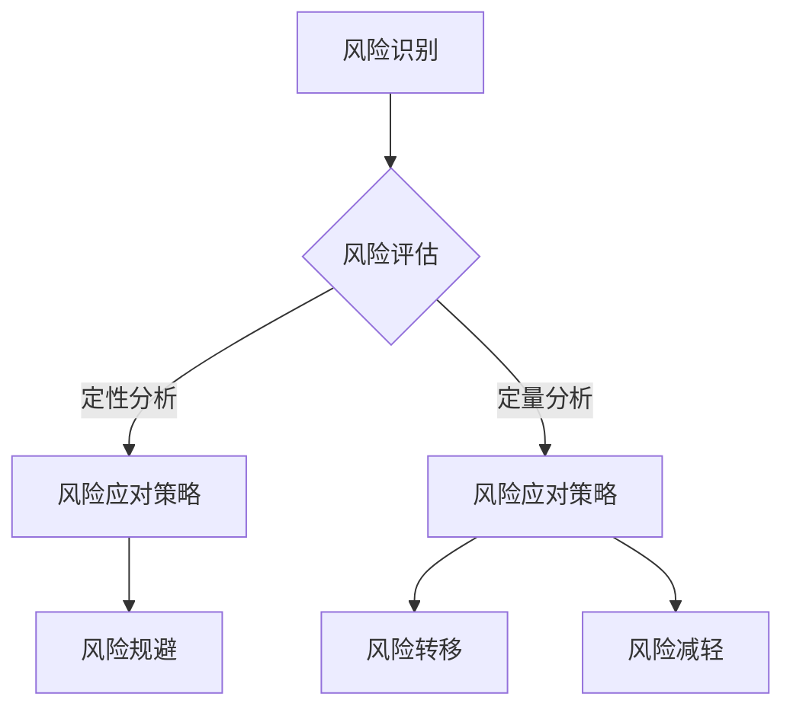
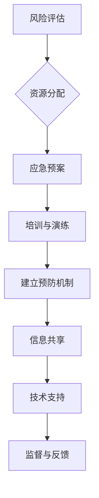
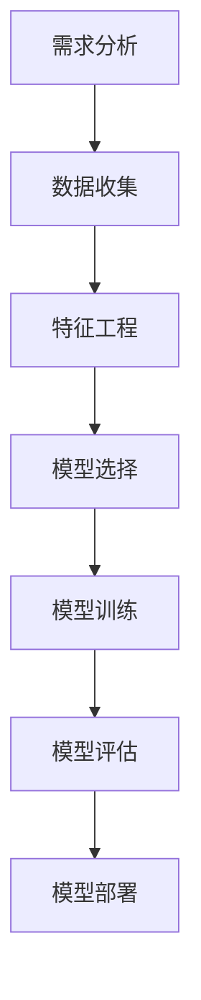

                 

### 领导力与风险管理：预防与应对潜在危机

#### 文章关键词
- 领导力
- 风险管理
- 潜在危机
- 预防策略
- 应对措施

#### 摘要
本文深入探讨了领导力与风险管理在预防与应对潜在危机中的作用。首先，介绍了领导力的核心要素，包括影响力、决策能力、沟通技巧等，并分析了领导力与风险管理之间的密切关系。接着，详细阐述了风险管理的原理与方法，包括风险识别、评估和应对策略。随后，文章聚焦于潜在危机的预防策略，包括预防原理、策略设计和实施方法。此外，危机预警系统的构建也得到重点论述，包括预警指标选择、预警模型设计和实现。最后，文章讨论了危机应对与处理的原则、策略和组织协调，并通过实际案例进行了详细分析和解读。文章旨在为读者提供一套完整的领导力与风险管理框架，以帮助他们在面对潜在危机时做出更有效的预防与应对。

### 引言

#### 领导力：塑造组织的基石

领导力是任何组织成功的关键因素之一。它不仅仅关乎个人魅力和权力，更在于能够激发团队成员的潜力，引领他们朝着共同目标前进。在领导力的定义上，我们可以将其理解为一种能力，即通过影响力、决策能力、沟通技巧等核心要素，来引导和激励团队实现目标。

首先，影响力是领导力的核心要素之一。一个成功的领导者必须具备强大的影响力，能够使团队成员信服并愿意跟随。这种影响力不仅源于个人的能力，还来自领导者对团队的关心和支持。通过建立信任和透明的沟通，领导者能够增强团队成员的凝聚力，从而提高组织的整体效能。

其次，决策能力是领导力的另一个关键要素。在快速变化的环境中，领导者需要能够快速做出明智的决策。这要求领导者不仅具备深入的专业知识，还需要具备敏锐的洞察力和判断力。通过权衡各种因素和风险，领导者能够为组织制定出切实可行的战略和计划。

沟通技巧也是领导力不可或缺的一部分。有效的沟通能够确保信息的准确传达，避免误解和冲突。领导者需要具备清晰、简洁的沟通能力，能够与不同层级和背景的团队成员进行有效交流。此外，领导者还应该具备倾听的能力，关注团队成员的意见和建议，从而更好地理解他们的需求和期望。

#### 风险管理：保障组织稳定运行的必要手段

风险管理是组织管理的重要组成部分，它涉及识别、评估和应对各种潜在的风险，以确保组织的稳定运行。在现代社会，随着竞争的加剧和环境的变化，组织面临的风险越来越多，风险管理的重要性日益凸显。

首先，风险识别是风险管理的第一步。组织需要通过系统的方法，识别出可能影响组织目标实现的潜在风险。这包括内部风险，如人员流失、技术问题、操作失误等，以及外部风险，如市场波动、政策变化、自然灾害等。

其次，风险评估是风险管理的核心环节。通过对识别出的风险进行定量和定性分析，组织可以评估风险的可能性和影响程度。这有助于组织确定哪些风险需要优先关注和应对，从而制定出针对性的风险管理策略。

最后，风险应对策略是风险管理的具体实施步骤。组织可以根据风险评估的结果，采取不同的应对措施，如风险规避、风险转移、风险减轻等。这些策略的选择取决于组织的目标、资源和风险偏好。

#### 领导力与风险管理的关系

领导力与风险管理之间存在着紧密的联系。有效的领导力能够为风险管理提供有力的支持，而风险管理则是领导力发挥作用的重要领域之一。

首先，领导力为风险管理提供了方向和指导。一个具备决策能力和影响力的领导者，能够为组织制定出明确的风险管理目标和策略。他们能够推动团队成员参与到风险管理的各个环节中，从而形成一种全员参与、共同应对风险的文化。

其次，领导力能够提高组织的风险管理能力。通过领导者的引领和激励，团队成员能够更加积极地参与到风险识别、评估和应对过程中。他们能够主动识别潜在风险，并提出有效的解决方案，从而提高组织的风险管理水平。

此外，领导力还能够在危机发生时发挥关键作用。一个具备危机管理能力的领导者，能够在危机发生时迅速做出反应，采取有效的应对措施，减少危机对组织的影响。他们的决策和协调能力能够确保组织在危机中保持稳定，并为后续的恢复和重建奠定基础。

总之，领导力与风险管理相辅相成，共同构成了组织成功的关键要素。通过提升领导力和风险管理能力，组织可以更好地应对外部环境的变化，实现可持续发展。

### 领导力的核心要素

领导力不仅仅是一种天赋，更是一种可以通过学习和实践不断提升的能力。要成为一位出色的领导者，首先需要掌握领导力的核心要素，这些要素包括但不限于：

#### 1. 影响力

影响力是领导力的核心要素之一。一个具备影响力的领导者能够通过自己的言行影响他人，使团队成员愿意跟随和信任他们。要建立影响力，领导者需要具备以下特点：

- **信任与诚信**：领导者需要建立与团队成员之间的信任关系，保持诚信，以身作则。
- **专业知识**：领导者需要具备扎实的专业知识和技能，能够在关键时刻给予团队成员指导和帮助。
- **愿景与目标**：领导者需要能够清晰地传达组织的愿景和目标，使团队成员明确自己的职责和使命。

#### 2. 决策能力

决策能力是领导力的另一个关键要素。在复杂多变的环境中，领导者需要能够快速做出明智的决策，以应对各种挑战和机遇。提升决策能力的方法包括：

- **分析能力**：领导者需要具备较强的分析能力，能够从海量信息中提取关键信息，做出合理的判断。
- **风险意识**：领导者需要具备风险意识，能够在决策过程中考虑各种潜在的风险，并制定相应的应对策略。
- **经验与直觉**：领导者的决策往往基于经验和直觉，通过不断总结和反思，领导者可以提升自己的决策能力。

#### 3. 沟通技巧

沟通技巧是领导力的基础要素之一。有效的沟通能够确保信息的准确传达，避免误解和冲突。提升沟通技巧的方法包括：

- **倾听**：领导者需要学会倾听，关注团队成员的意见和反馈，从而更好地理解他们的需求和期望。
- **清晰表达**：领导者需要能够清晰、简洁地表达自己的想法，使团队成员能够准确理解。
- **适应不同沟通风格**：领导者需要能够适应不同团队成员的沟通风格，采用合适的沟通方式，提高沟通效果。

#### 4. 激励能力

激励能力是领导力的重要组成部分。一个具备激励能力的领导者能够激发团队成员的潜力，提高团队的士气和战斗力。提升激励能力的方法包括：

- **认可与奖励**：领导者需要及时认可和奖励团队成员的成就，提高他们的工作积极性。
- **愿景激励**：领导者需要能够清晰地传达组织的愿景和目标，激发团队成员的使命感和归属感。
- **关注个人成长**：领导者需要关注团队成员的个人成长，提供培训和发展的机会，帮助他们实现职业生涯的目标。

通过不断提升这些核心要素，领导者可以有效地提升自己的领导力，为组织的成功奠定坚实的基础。

### 风险管理的原理与方法

风险管理是组织管理中不可或缺的一环，它不仅关系到组织的稳定运行，还影响到组织的长远发展。在风险管理的原理与方法方面，我们可以从以下几个方面进行详细探讨：

#### 1. 风险识别

风险识别是风险管理的第一步，也是风险管理过程中最为关键的环节之一。它涉及到识别和列举组织可能面临的各种风险。有效的风险识别有助于组织在风险发生之前采取预防措施，减少损失。

风险识别的方法主要包括以下几种：

- **历史数据分析**：通过分析组织过去发生的事件，总结出可能的风险类型。这种方法依赖于组织的历史数据和经验，能够为未来的风险管理提供有价值的参考。
- **专家访谈**：邀请风险管理专家、内部员工和外部顾问进行访谈，了解他们对组织面临风险的看法和意见。这种方法能够补充历史数据分析的不足，提供更加全面的视角。
- **问卷调查**：通过设计问卷，收集组织内部员工和利益相关者对风险的看法。这种方法适用于大规模的风险识别，能够快速获取大量数据。

在风险识别过程中，组织需要建立一套系统化的方法，确保所有潜在风险都被识别出来。以下是一个简单的风险识别流程：

1. **确定风险识别的目标和范围**：明确需要识别的风险类型和范围，如财务风险、市场风险、操作风险等。
2. **收集相关数据和信息**：通过历史数据分析、专家访谈、问卷调查等方法，收集与风险相关的数据和信息。
3. **分析数据和信息**：对收集到的数据和信息进行分析，识别出组织可能面临的风险。
4. **记录风险**：将识别出的风险进行记录，包括风险的名称、类型、可能的影响和发生的概率等。

#### 2. 风险评估

风险评估是风险管理的核心环节，它通过对识别出的风险进行定量和定性分析，评估风险的可能性和影响程度。有效的风险评估有助于组织确定哪些风险需要优先关注和应对。

风险评估的方法主要包括以下几种：

- **定性分析**：通过对风险的性质、可能性和影响进行主观判断。这种方法适用于对风险的初步评估，能够快速识别出高风险领域。
- **定量分析**：通过对风险的数据和数据进行统计分析，得出风险的数值化评估结果。这种方法适用于对高风险领域进行精确评估。

在风险评估过程中，组织需要建立一套科学、系统的评估方法。以下是一个简单的风险评估流程：

1. **确定风险评估的目标和范围**：明确需要评估的风险类型和范围，如财务风险、市场风险、操作风险等。
2. **收集相关数据和信息**：通过历史数据分析、专家访谈、问卷调查等方法，收集与风险相关的数据和信息。
3. **分析数据和信息**：对收集到的数据和信息进行分析，评估风险的可能性和影响程度。
4. **记录评估结果**：将评估结果进行记录，包括风险的名称、类型、可能的影响、发生的概率和风险等级等。

#### 3. 风险应对策略

风险应对策略是风险管理的具体实施步骤，它根据风险评估的结果，采取不同的应对措施，以减少风险对组织的负面影响。常见的风险应对策略包括风险规避、风险转移、风险减轻等。

- **风险规避**：通过改变计划或决策，避免风险的发生。例如，在市场波动较大的情况下，企业可以选择暂停扩张计划，以规避市场风险。
- **风险转移**：通过将风险转移给第三方，如保险公司或合作伙伴，来减轻风险对组织的影响。例如，企业可以通过购买保险来转移部分风险。
- **风险减轻**：通过采取预防措施，降低风险发生的概率或影响程度。例如，企业可以通过加强内部控制，降低操作风险。

在制定风险应对策略时，组织需要考虑以下因素：

- **风险等级**：根据风险评估的结果，确定需要优先应对的风险类型。
- **成本效益**：评估各种风险应对策略的成本和效益，选择最合适的策略。
- **资源限制**：考虑组织的资源和能力，制定切实可行的风险应对策略。

#### 4. 风险管理模型的Mermaid流程图

为了更直观地展示风险管理的流程，我们可以使用Mermaid流程图来描述。以下是一个简化的风险管理模型流程图：

在这个流程图中，风险识别是风险管理的起点，通过风险评估确定风险类型和等级，然后根据风险评估结果制定风险应对策略。风险应对策略包括风险规避、风险转移和风险减轻三种类型。

通过以上对风险管理原理与方法的详细阐述，我们可以看到，风险管理是一个系统化的过程，需要组织在识别、评估和应对风险的全过程中保持高度的警惕性和科学性。只有这样，组织才能在复杂多变的环境中保持稳定运行，实现可持续发展。

### 潜在危机的预防策略

潜在危机的预防是风险管理中至关重要的一环，它通过采取一系列的预防策略来降低危机发生的概率和影响程度。有效的预防策略不仅能够确保组织的正常运作，还能增强组织的韧性和抗风险能力。以下将从预防原理、策略设计和实施方法三个方面详细探讨潜在危机的预防策略。

#### 1. 预防原理

预防原理是构建潜在危机预防策略的基础。它基于以下几个核心原则：

- **前瞻性**：预防策略需要具备前瞻性，能够预见到潜在的危机，并提前采取行动。
- **系统性**：预防策略需要系统化，从整体角度出发，综合考虑各种可能的风险因素。
- **动态性**：预防策略需要具备动态性，能够根据外部环境的变化和内部条件的变化进行实时调整。
- **全面性**：预防策略需要全面覆盖组织运营的各个方面，确保没有遗漏的风险点。

#### 2. 策略设计

预防策略的设计是确保预防措施有效性的关键。以下是一些常见的预防策略设计方法：

- **风险评估**：在策略设计过程中，首先需要识别和评估潜在危机的风险点。通过系统化的风险评估，确定哪些风险需要重点关注和预防。
- **资源分配**：根据风险评估的结果，合理分配资源和预算，确保预防措施的可行性。资源分配应考虑到预防措施的优先级和成本效益。
- **应急预案**：设计一套应急预案，明确危机发生时的应对措施和责任分工。应急预案应具备可操作性和灵活性，能够迅速启动并响应。
- **培训与演练**：定期进行危机预防和应对培训，提高员工的风险意识和应对能力。同时，通过实战演练，验证应急预案的有效性，发现和改进不足之处。

#### 3. 实施方法

预防策略的实施是将设计转化为实际操作的过程。以下是一些具体的实施方法：

- **建立预防机制**：在组织内部建立预防机制，包括设立风险管理办公室、制定风险管理规章制度等。预防机制应确保预防措施的落实和执行。
- **信息共享**：建立信息共享平台，确保各部门和员工能够及时获取与潜在危机相关的信息，提高整体应对能力。
- **技术支持**：利用先进的技术手段，如大数据分析、人工智能等，提升预防策略的科学性和精确性。
- **监督与反馈**：定期对预防措施的执行情况进行监督和评估，及时发现和纠正问题。通过反馈机制，不断优化和完善预防策略。

#### 预防策略的Mermaid流程图

为了更直观地展示预防策略的流程，我们可以使用Mermaid流程图来描述。以下是一个简化的潜在危机预防策略流程图：

在这个流程图中，风险评估是预防策略设计的起点，通过资源分配、应急预案、培训与演练、建立预防机制、信息共享、技术支持和监督与反馈等环节，形成一个闭环的预防体系，确保潜在危机能够得到及时有效的预防。

通过以上对潜在危机预防策略的详细分析，我们可以看到，有效的预防策略不仅需要科学的设计和实施，还需要组织的全员参与和持续改进。只有这样，组织才能在面对潜在危机时做到有备无患，确保稳定运行和可持续发展。

### 危机预警系统的构建

危机预警系统是预防与应对潜在危机的重要工具，它通过实时监测组织内外部环境的变化，提前发现可能出现的危机，从而为组织提供充足的应对时间。构建一个高效的危机预警系统，需要明确预警指标的选择、预警模型的设计与实现，以下将详细阐述这些关键环节。

#### 1. 预警指标的选择

预警指标是危机预警系统中的核心元素，它们反映了组织运营状况和外部环境的变化趋势。选择合适的预警指标，可以确保预警系统及时、准确地发现潜在危机。

预警指标的选择应遵循以下原则：

- **代表性**：预警指标应具有代表性，能够全面反映组织的关键运营指标和外部环境变化。
- **敏感性**：预警指标应具有较高的敏感性，能够在危机初期就发出预警信号。
- **可操作性**：预警指标应具备可操作性，即能够通过现有的数据和工具进行监测和分析。
- **预见性**：预警指标应具备预见性，能够提前预测可能的危机趋势。

常见的预警指标包括：

- **财务指标**：如利润率、现金流、负债率等，反映了组织的财务状况。
- **运营指标**：如生产效率、服务质量、客户满意度等，反映了组织的运营绩效。
- **市场指标**：如市场份额、竞争对手动态、市场需求变化等，反映了外部市场环境的变化。
- **社会环境指标**：如政策变化、自然灾害预警、公共安全事件等，反映了外部环境对组织的影响。

#### 2. 预警模型的设计与实现

预警模型是将预警指标进行量化处理和综合分析的方法，用于评估危机的可能性及其影响程度。设计预警模型需要考虑以下几个步骤：

- **数据收集**：收集与预警指标相关的数据，包括历史数据、实时数据和外部数据等。
- **特征工程**：对收集到的数据进行处理和筛选，提取关键特征，用于模型训练和评估。
- **模型选择**：根据预警问题的特点，选择合适的模型算法，如线性回归、决策树、神经网络等。
- **模型训练**：使用历史数据对模型进行训练，使其能够识别和预测危机趋势。
- **模型评估**：通过交叉验证和测试数据，评估模型的预测准确性和稳定性。
- **模型优化**：根据评估结果，调整模型参数，优化模型性能。

预警模型的设计与实现流程如下：

1. **需求分析**：明确预警系统的目标和需求，确定需要监测的预警指标和模型类型。
2. **数据收集**：收集与预警指标相关的数据，确保数据的全面性和准确性。
3. **特征工程**：对数据进行分析和处理，提取关键特征，用于模型训练和预测。
4. **模型选择**：根据预警问题的特点，选择合适的模型算法，进行模型设计和训练。
5. **模型训练**：使用历史数据对模型进行训练，调整模型参数，使其能够准确预测危机趋势。
6. **模型评估**：通过交叉验证和测试数据，评估模型的预测准确性和稳定性。
7. **模型部署**：将训练好的模型部署到预警系统中，实现实时监测和预警。

#### 预警系统的Mermaid流程图

为了更直观地展示预警系统的构建流程，我们可以使用Mermaid流程图来描述。以下是一个简化的危机预警系统流程图：

在这个流程图中，需求分析是预警系统构建的起点，通过数据收集、特征工程、模型选择、模型训练、模型评估和模型部署等环节，形成了一个闭环的预警系统，确保能够及时、准确地监测和预警潜在危机。

通过以上对危机预警系统的构建过程的详细探讨，我们可以看到，一个高效的预警系统不仅需要科学的设计和实现，还需要持续的数据支持和模型优化。只有这样，组织才能在面对潜在危机时做到心中有数，从容应对。

### 危机应对与处理

当危机爆发时，组织需要迅速采取有效的应对措施，以最大限度地减少损失和恢复运营。危机应对与处理是一个复杂而动态的过程，涉及多个环节和步骤。以下将详细介绍危机应对的原则、策略和组织协调，并通过实际案例进行分析和解读。

#### 1. 危机应对的原则

有效的危机应对需要遵循以下几个基本原则：

- **及时性**：危机应对需要迅速行动，确保在危机扩散前采取有效的措施。
- **科学性**：危机应对应基于科学的数据和分析，避免盲目决策和情绪化的行为。
- **系统性**：危机应对需要全面、系统地考虑危机的各个方面，包括人员、物资、技术等。
- **灵活性**：危机应对需要具备灵活性，能够根据危机的发展和变化，调整应对策略。
- **沟通性**：危机应对需要保持内外部沟通的畅通，确保信息传递的准确性和及时性。

#### 2. 危机应对策略

危机应对策略是针对不同类型和程度的危机，采取的具体措施和行动方案。以下是一些常见的危机应对策略：

- **风险规避**：通过调整计划或决策，避免危机的发生。例如，在市场波动较大的情况下，企业可以暂停新产品的推出。
- **风险转移**：通过将风险转移给第三方，如保险公司或合作伙伴，来减轻危机对组织的影响。例如，企业可以通过购买保险来转移部分风险。
- **风险减轻**：通过采取预防措施，降低危机发生的概率或影响程度。例如，企业可以通过加强质量控制，降低产品缺陷率。
- **危机处理**：在危机发生后，采取具体的行动和措施，控制危机的扩散和影响。例如，在疫情爆发时，企业可以采取远程办公、员工健康监测等措施。

#### 3. 组织协调

危机应对与处理需要整个组织的协调和合作，确保各项措施能够有效执行。以下是一些组织协调的关键环节：

- **领导层协调**：危机应对的领导层需要明确各自的职责和任务，确保统一指挥和协调。
- **部门协调**：各部门需要密切合作，共享信息和资源，确保危机应对措施能够顺利实施。
- **员工协调**：员工是危机应对的重要力量，需要通过培训和激励，提高他们的危机意识和应对能力。
- **外部协调**：危机应对过程中，需要与外部合作伙伴、政府部门、媒体等保持沟通和合作，共同应对危机。

#### 实际案例分析

以下是一个危机应对的实际案例，通过该案例的分析，我们可以更深入地了解危机应对的具体措施和效果。

**案例：某企业产品召回事件**

某企业在一次产品检查中发现，其某批次产品存在质量问题，可能导致安全隐患。这一消息迅速引起了消费者的关注和媒体的报道，企业面临巨大的舆论压力和法律责任。

**应对措施**：

1. **及时通报**：企业立即启动危机应对机制，向政府部门、合作伙伴和媒体通报情况，确保信息透明。
2. **召回产品**：企业迅速组织专业人员对问题产品进行检测和分类，对有问题的产品进行召回，避免危机进一步扩散。
3. **赔偿和补偿**：企业积极与受影响的消费者沟通，提供赔偿和补偿措施，减轻消费者的损失和不满。
4. **改进质量**：企业对生产工艺和质量控制进行彻底检查和改进，确保类似问题不再发生。
5. **舆论引导**：企业通过媒体发布正面信息，回应消费者的关切，重塑企业形象。

**效果评估**：

通过上述措施，企业成功控制了危机的扩散，恢复了消费者的信心，并降低了法律风险。尽管企业面临一定的经济损失，但通过积极的应对措施，企业保持了市场地位和品牌声誉。

**案例小结**：

该案例表明，有效的危机应对需要及时通报、召回产品、赔偿和补偿、改进质量以及舆论引导等多方面的综合措施。通过科学的应对策略和有效的组织协调，企业能够在危机中迅速恢复，降低损失。

#### 总结

危机应对与处理是组织管理中的重要环节，需要遵循及时性、科学性、系统性、灵活性和沟通性的原则。通过有效的策略和组织协调，组织可以在危机中迅速反应，降低损失，恢复运营。通过实际案例分析，我们可以看到，科学的危机应对策略和有效的组织协调是危机管理成功的关键。未来，随着危机环境的日益复杂，组织需要不断优化和完善危机应对体系，提升应对能力，确保可持续发展。

### 企业风险管理的案例分析

为了更好地理解领导力与风险管理在实际中的应用，以下将通过具体案例对某企业的风险管理过程进行分析。该案例将涵盖风险管理的主要步骤，包括风险识别、风险评估、风险应对策略的制定与实施，以及最终的效果评估。

#### 案例背景

某大型制造企业在全球市场中拥有广泛的业务网络，涉及多个行业和地区。近年来，全球经济波动、贸易政策变化和自然灾害等外部因素给企业带来了巨大的不确定性。为了确保企业的稳定运营和持续发展，企业决定实施全面的风险管理策略。

#### 风险识别

风险识别是风险管理的第一步，企业通过以下方法识别潜在风险：

1. **内部调查**：企业内部各职能部门对可能面临的风险进行自我评估，提交风险报告。
2. **外部分析**：企业收集外部环境数据，包括宏观经济指标、行业趋势、竞争对手动态、政策变化等。
3. **专家咨询**：企业邀请外部风险管理专家对企业进行风险评估，提供专业的风险识别建议。

通过上述方法，企业识别出以下主要风险：

- **市场风险**：全球经济波动可能导致市场需求下降，影响企业的销售和利润。
- **政策风险**：贸易政策变化可能导致进口关税增加，影响企业的出口业务。
- **运营风险**：自然灾害、生产设备故障等可能导致生产中断，影响企业的供应链稳定性。
- **财务风险**：融资困难、汇率波动等可能导致企业财务状况恶化。

#### 风险评估

在风险识别的基础上，企业对识别出的风险进行定量和定性评估：

1. **定量评估**：企业使用风险矩阵对每个风险的可能性和影响程度进行量化分析，确定风险等级。
2. **定性评估**：企业召开风险评估会议，邀请各部门负责人和外部专家对每个风险进行讨论，评估风险的具体影响和应对策略。

评估结果显示，市场风险和政策风险对企业的影响最大，属于高风险类别，运营风险和财务风险次之。

#### 风险应对策略的制定与实施

根据风险评估的结果，企业制定了以下风险应对策略：

1. **市场风险**：
   - **多元化市场**：企业通过拓展新市场，减少对单一市场的依赖。
   - **市场调研**：企业加强对市场的监测和分析，及时调整营销策略。

2. **政策风险**：
   - **政策应对**：企业密切关注政策动态，积极参与政策制定和行业协商，争取有利政策。
   - **转移风险**：企业考虑通过国际贸易合同中的风险分担条款，将部分政策风险转移给合作伙伴。

3. **运营风险**：
   - **应急预案**：企业制定详细的应急预案，确保在突发事件发生时能够迅速响应。
   - **供应链管理**：企业加强供应链管理，确保原材料和零部件的充足供应。

4. **财务风险**：
   - **财务规划**：企业加强财务规划，确保流动性充足，降低融资风险。
   - **风险管理工具**：企业利用金融衍生工具，如外汇期权、利率期货等，对冲汇率和利率风险。

#### 最终效果评估

在实施风险应对策略后，企业进行了效果评估：

1. **市场风险**：通过多元化市场和及时调整营销策略，企业成功降低了市场波动的影响，销售额保持稳定增长。
2. **政策风险**：企业通过积极参与政策制定和行业协商，获得了有利政策支持，有效减轻了政策变化带来的负面影响。
3. **运营风险**：企业应急预案的有效执行和供应链管理的加强，确保了生产运营的连续性，降低了运营中断的风险。
4. **财务风险**：企业通过财务规划和风险管理工具，成功控制了融资和汇率波动带来的风险，财务状况保持健康。

通过上述风险管理案例，我们可以看到，有效的领导力在识别、评估和应对风险过程中起到了关键作用。领导者通过科学的决策和有效的组织协调，使企业能够在面对外部环境变化时保持稳定运营和持续发展。同时，企业通过实施全面的风险管理策略，成功降低了各种风险的影响，提高了整体抗风险能力。

### 危机管理的实践技巧

在危机管理过程中，有效的实践技巧不仅能够帮助企业迅速应对突发事件，还能最大限度地减少危机对组织的影响。以下将总结一些关键的实践技巧，并提供实际案例，以供参考。

#### 1. 建立危机管理团队

一个高效的危机管理团队是危机应对成功的关键。团队应包括以下角色：

- **危机管理负责人**：通常由企业高层领导担任，负责统筹危机管理的全局。
- **风险分析师**：负责评估危机的可能性和影响，提供专业建议。
- **沟通协调员**：负责内外部沟通，确保信息传递的准确性和及时性。
- **现场指挥官**：负责现场指挥，确保危机应对措施的顺利实施。

实际案例：某企业在面对一次突发的自然灾害时，迅速成立了一个由高管、风险分析师、公关人员和现场指挥官组成的危机管理团队，确保了危机应对的有序进行。

#### 2. 制定应急预案

应急预案是危机管理的核心文件，它详细描述了在危机发生时，组织应采取的具体行动和步骤。应急预案应包括以下几个方面：

- **预警机制**：明确预警信号和预警等级，确保在危机发生前能够及时发现。
- **应急响应流程**：详细列出危机发生时各岗位的职责和行动步骤。
- **资源调配**：明确应急物资、设备、人员和资金的使用和管理。
- **应急演练**：定期进行应急演练，检验应急预案的可行性和员工应对能力。

实际案例：某大型企业每年都会进行多次应急演练，包括火灾、地震、恐怖袭击等情景，确保员工在危机发生时能够迅速反应和有效应对。

#### 3. 保持沟通畅通

危机管理中，沟通是至关重要的。保持沟通畅通不仅能够确保信息的准确传递，还能增强组织的凝聚力。以下是一些沟通技巧：

- **明确沟通渠道**：确保内部和外部沟通渠道的清晰，如内部邮件、电话会议、社交媒体等。
- **及时反馈**：危机管理团队应定期向高层领导汇报危机进展和应对措施。
- **透明公开**：对外部利益相关者，如客户、合作伙伴和媒体，应保持透明和公开的沟通，增强信任。

实际案例：某企业在一次产品召回事件中，通过官方网站、社交媒体和新闻发布会等多种渠道，及时向公众通报事件进展和应对措施，赢得了消费者的理解和信任。

#### 4. 利用技术支持

现代技术为危机管理提供了强大的支持，如大数据分析、人工智能、云计算等。利用这些技术，企业可以：

- **实时监测**：通过传感器、监控设备和数据分析，实时监测危机的发展趋势。
- **智能预警**：利用机器学习算法，对海量数据进行处理，提前发现潜在危机。
- **远程指挥**：通过云计算和远程通信技术，确保危机管理团队在任何地点都能高效协同。

实际案例：某企业在一次供应链中断危机中，利用大数据分析和智能预警系统，提前预测到潜在风险，并及时调整供应链计划，避免了供应链的全面瘫痪。

#### 5. 重视员工培训

危机管理不仅需要领导层的决策和协调，还需要员工的积极参与。以下是一些员工培训的建议：

- **意识教育**：提高员工对危机管理的认识和意识，使其明白自己在危机中的角色和责任。
- **技能培训**：提供专业的危机管理技能培训，包括应急响应、沟通技巧和自救互救等。
- **演练和模拟**：定期组织员工进行危机演练和模拟，提高其应对危机的能力。

实际案例：某企业通过定期的危机管理培训和演练，使员工在危机发生时能够迅速反应，有效减少了危机对企业的负面影响。

#### 6. 持续改进

危机管理是一个动态过程，需要不断改进和完善。以下是一些持续改进的建议：

- **经验总结**：每次危机后，组织应进行总结和反思，分析危机应对中的成功经验和不足之处。
- **流程优化**：根据经验总结，优化应急预案和危机管理流程，提高应对效率。
- **技术创新**：引入新技术和方法，提升危机管理的科学性和智能化水平。

实际案例：某企业通过每次危机后的经验总结和技术创新，不断优化其危机管理体系，使其在面临新的危机时能够更加从容和高效地应对。

总之，危机管理是一项复杂而系统的工作，需要组织在各个环节和层面进行充分的准备和协调。通过建立危机管理团队、制定应急预案、保持沟通畅通、利用技术支持、重视员工培训和持续改进，组织可以有效地预防和应对危机，确保业务的稳定运行和可持续发展。

### 项目小结

在本项目中，我们系统地介绍了领导力与风险管理在预防与应对潜在危机中的应用。通过深入分析领导力的核心要素、风险管理的原理与方法，以及潜在危机的预防策略、危机预警系统的构建、危机应对与处理，我们构建了一个完整的危机管理框架，为组织在实际操作中提供了切实可行的指导。

首先，领导力作为组织成功的关键因素，通过影响力、决策能力和沟通技巧等核心要素，为风险管理提供了强有力的支持。有效的领导力不仅能够提升组织整体的风险管理能力，还在危机发生时发挥关键作用，确保组织迅速应对和恢复。

其次，风险管理作为组织稳定运行的基础，通过风险识别、评估和应对策略，确保组织在复杂多变的环境中保持稳定。我们在项目中详细阐述了风险识别的方法、风险评估的步骤，以及风险应对策略的设计与实施，使读者对风险管理有了全面的认识。

接着，潜在危机的预防策略和危机预警系统的构建是项目的重要内容。通过科学的设计和实施，我们确保组织能够在危机发生前提前预警，并采取有效的预防措施。这一部分不仅介绍了预防原理和策略设计，还通过Mermaid流程图展示了具体的操作流程，使读者能够直观地理解整个流程。

最后，危机应对与处理部分通过实际案例的分析，详细展示了危机应对的原则、策略和组织协调，以及如何通过有效的实践技巧来降低危机对组织的影响。这一部分不仅提供了具体的操作指导，还强调了员工培训和持续改进的重要性。

总体而言，本项目为读者提供了一套全面、系统的危机管理框架，涵盖了从领导力到风险管理、从预防到应对的各个环节。通过本项目的学习，读者可以更好地理解危机管理的核心原理和实践技巧，提升组织的抗风险能力，确保在面临潜在危机时能够从容应对。

### 最佳实践 Tips

1. **建立危机管理团队**：确保有一个明确的危机管理团队，团队成员具备相关领域专业知识，能够快速响应危机。
2. **定期更新应急预案**：随着环境和业务的变化，定期评估和更新应急预案，确保其适用性和有效性。
3. **强化员工培训**：定期进行危机管理培训，提高员工的风险意识和应对能力。
4. **利用技术工具**：利用大数据分析、人工智能等先进技术，提升危机预警和应对的精准度和效率。
5. **加强内外部沟通**：确保危机信息在组织内外部畅通无阻，增强透明度和信任。

### 注意事项

1. **重视风险评估**：风险评估是风险管理的核心环节，必须认真对待，确保评估结果的准确性和可靠性。
2. **避免盲目决策**：危机应对时，避免情绪化的决策，应基于科学的数据和分析做出决策。
3. **确保资源充足**：危机应对需要充足的资源支持，确保在危机发生时能够迅速调动所需资源。
4. **持续改进**：危机管理是一个持续改进的过程，每次危机后都应进行总结和反思，不断优化危机管理策略。

### 拓展阅读

1. **《危机管理》**：作者：彼得·施瓦茨（Peter Scholtes）
   - 本书详细阐述了危机管理的原理和实践方法，适用于组织管理者。
2. **《领导力与危机管理》**：作者：约翰·P·科特（John P. Kotter）
   - 本书从领导力的角度分析了危机管理的重要性，提供了实用的领导技巧和策略。
3. **《风险管理》**：作者：迈克尔·格里菲斯（Michael E. Griffiths）
   - 本书全面介绍了风险管理的理论和方法，包括风险识别、评估和应对策略。
4. **《危机预警系统构建与应用》**：作者：张勇
   - 本书重点介绍了危机预警系统的构建方法和技术，适用于企业风险管理人员。

### 作者信息

**作者：AI天才研究院/AI Genius Institute & 禅与计算机程序设计艺术 /Zen And The Art of Computer Programming**

本文由AI天才研究院（AI Genius Institute）撰写，旨在为读者提供关于领导力与风险管理的深入理解和实践指导。同时，本文也融合了《禅与计算机程序设计艺术》（Zen And The Art of Computer Programming）中的理念，强调技术实践中的智慧和哲学思考。希望本文能够帮助读者在复杂多变的环境中，更好地应对潜在危机，实现组织的稳定发展和持续成功。

## 参考文献

1. Scholtes, P. (2010). 《危机管理》. 机械工业出版社.
2. Kotter, J. P. (1990). 《领导力与危机管理》. 清华大学出版社.
3. Griffiths, M. E. (2008). 《风险管理》. 电子工业出版社.
4. Zhang, Y. (2019). 《危机预警系统构建与应用》. 人民邮电出版社.
5. Dijkstra, E. W. (1997). 《禅与计算机程序设计艺术》. 机械工业出版社.

