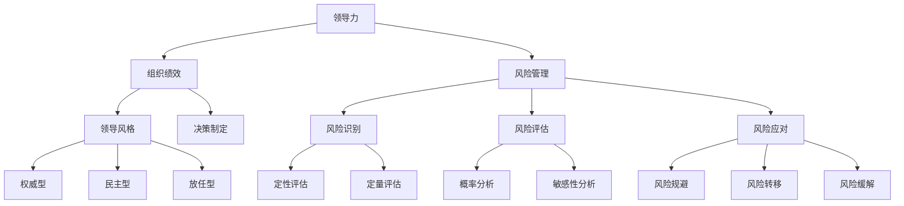

                 

### 文章标题

# 领导力与风险评估：未雨绸缪的智慧

> 关键词：领导力、风险评估、组织绩效、风险管理、决策制定

> 摘要：本文从领导力与风险管理的定义出发，探讨了领导力在组织中的重要性以及风险管理的基本原则和方法。通过深入分析领导力与风险管理的核心概念，结合实际案例，阐述了领导力在风险管理中的关键作用，并提出了一些提升领导力与风险管理能力的策略。本文旨在为IT领域的专业人士提供有价值的参考，帮助他们在组织变革和风险管理中更加从容应对挑战。

---

### 第一部分：领导力与风险评估概述

## 第1章：领导力基础

### 1.1 领导力的定义与重要性

领导力，作为一个广泛使用的概念，其定义多种多样。简单来说，领导力是引导和激励他人达成目标的能力。它不仅仅关乎职位和权力，更是一种影响力，一种能够激发团队成员潜能和创造力的能力。

在组织管理中，领导力的重要性不可忽视。首先，领导力是组织绩效的关键因素。一个优秀的领导者能够激发团队成员的积极性，提高工作效率，从而提升整个组织的绩效。其次，领导力是企业文化的重要组成部分。一个具有强大领导力的组织往往能够形成积极向上的文化氛围，增强团队的凝聚力和归属感。

与领导力相关的核心概念包括影响力、激励、愿景、决策等。影响力是领导者影响他人思想和行为的能力，激励则是通过激发员工内在动力来实现目标的过程。愿景则是领导者对组织未来发展方向的预见和规划。而决策则是领导者根据愿景和目标制定行动计划的过程。

在IT领域，领导力的重要性尤为突出。IT行业技术更新迅速，市场竞争激烈，领导者需要具备敏锐的市场洞察力和创新意识，能够带领团队迅速适应变化，保持竞争优势。同时，IT项目的复杂性和高风险性也要求领导者具备卓越的风险管理能力，以应对各种不确定性。

### 1.2 领导风格的类型

领导风格对组织的绩效有着直接的影响。根据不同的领导者行为和决策方式，可以将领导风格分为权威型领导、民主型领导、放任型领导等。

权威型领导注重集权控制，领导者独自做出决策，对下属要求严格，这种方式在紧急情况下或需要迅速决策时效果显著。然而，长期的权威型领导可能导致下属的被动性和缺乏创造力。

民主型领导注重参与和协商，领导者鼓励团队成员参与决策过程，尊重下属的意见和建议。这种方式能够增强团队的凝聚力和创造力，有利于形成积极向上的组织文化。

放任型领导则给予团队成员高度的自由度，领导者很少干预日常事务。这种方式适用于高度专业化、自主性强的团队，但在需要统一行动和协调的情况下可能会显得力不从心。

每种领导风格都有其适用的场景和优缺点，领导者需要根据具体情况进行选择和调整。

### 1.3 领导力发展的关键因素

领导力的发展是一个长期的过程，涉及多个方面的因素。首先，个人素质是领导力的基础。一个优秀的领导者需要具备诚实、正直、责任心强等品质，这些品质能够赢得下属的尊重和信任。

其次，情商在领导力发展中起着至关重要的作用。情商高的人能够更好地理解自己和他人的情感，建立良好的人际关系。在领导工作中，领导者需要具备较强的情感智慧，能够激励和引导团队成员。

最后，增强领导力的方法与途径多种多样。通过参加培训、阅读领导力相关书籍、参与领导力实践等方式，领导者可以不断提升自己的领导能力。

在IT领域，领导力的发展还涉及到技术知识和行业趋势的掌握。一个优秀的IT领导者不仅需要具备优秀的领导能力，还需要对技术有深入的了解，能够带领团队迎接技术挑战，实现技术突破。

## 第2章：领导力与风险管理

### 2.1 风险管理的定义与原则

风险管理是组织管理中不可或缺的一部分，其定义涵盖了识别、评估、应对和管理潜在风险的过程。在日益复杂和不确定的商业环境中，有效的风险管理能够帮助组织降低风险，确保业务持续稳定发展。

风险管理的基本原则包括全面性、系统性、前瞻性和适应性。全面性意味着风险管理需要覆盖组织所有层面和所有业务环节。系统性则要求风险管理形成一个闭环，包括风险识别、风险评估、风险应对和风险监控等环节。前瞻性要求组织能够预见潜在风险，提前采取应对措施。适应性则要求风险管理能够根据环境变化进行调整和优化。

风险管理的目的是通过识别和评估潜在风险，制定并实施有效的应对策略，最大限度地降低风险对组织的影响。在IT领域，风险管理的目标包括保护信息安全、确保项目进度、降低技术风险等。

### 2.2 风险评估的方法与技术

风险评估是风险管理的关键环节，涉及到对潜在风险进行识别、分析和评价。常用的风险评估方法包括定性评估和定量评估。

定性评估主要通过专家判断、头脑风暴、德尔菲法等手段进行。这种方法适用于风险识别和初步评估阶段，能够快速发现问题，为定量评估提供基础。

定量评估则通过数学模型和统计方法进行，如概率分析、敏感性分析、蒙特卡罗模拟等。这种方法能够提供更为精确的风险评估结果，有助于制定科学合理的应对策略。

在实际应用中，风险评估方法的选择应根据具体情况进行。例如，在IT项目中，敏感性分析可以用来识别哪些因素对项目进度和成本影响最大，从而采取相应的预防措施。在信息安全领域，概率分析可以用来评估网络攻击的可能性，制定相应的安全策略。

### 2.3 领导力在风险管理中的角色

领导者在风险管理中扮演着关键角色。首先，领导者需要明确风险管理的重要性，将其纳入组织战略和日常管理中。其次，领导者需要建立有效的风险管理机制，包括风险识别、风险评估、风险应对和风险监控等环节。

在风险决策过程中，领导者需要具备良好的判断力和决策能力。通过收集和分析相关信息，领导者可以做出科学合理的决策，降低风险对组织的影响。

此外，领导者还需要在组织内部推广风险管理理念，提高全体员工的风险意识。通过培训和教育，使员工了解风险管理的基本知识和方法，能够在日常工作中自觉识别和报告潜在风险。

在IT领域，领导者还需要关注技术风险。随着技术的快速发展，技术风险成为影响IT项目成功的重要因素。领导者需要具备技术敏感度，及时了解新技术、新趋势，带领团队应对技术挑战。

## 第二部分：领导力实践与案例研究

### 第3章：领导力实战技巧

### 3.1 沟通与协调

沟通是领导力的重要组成部分，有效的沟通能够增强团队凝聚力，提高工作效率。在IT领域，沟通的重要性尤为突出，因为项目往往涉及多个部门和团队的合作。

首先，领导者需要建立开放的沟通渠道，鼓励团队成员畅所欲言。通过定期会议、邮件、即时通讯工具等多种方式，领导者可以及时了解项目进展、团队动态和员工需求。

其次，领导者需要学会倾听。在沟通中，倾听比表达更重要。通过倾听，领导者可以更好地理解团队成员的想法和需求，从而做出更为科学的决策。

在沟通协调中，冲突是不可避免的现象。领导者需要掌握有效的冲突解决方法，如对话、妥协、求同存异等。通过合理解决冲突，领导者可以维护团队的和谐，确保项目顺利进行。

### 3.2 决策与执行

决策是领导力的核心能力之一。在IT项目中，领导者需要做出大量的决策，如项目目标设定、资源分配、技术选型等。一个优秀的领导者需要具备以下决策能力：

1. **信息收集与分析**：领导者需要收集与决策相关的各种信息，包括项目背景、技术趋势、市场动态等，并进行分析，以便做出科学合理的决策。

2. **风险评估**：在决策过程中，领导者需要评估潜在的风险，并制定相应的应对策略。通过风险评估，领导者可以降低决策失误的风险。

3. **团队参与**：领导者应鼓励团队成员参与决策过程，充分发挥团队智慧。通过团队合作，领导者可以制定出更为全面、合理的决策方案。

执行是决策的延续，执行效果直接影响项目成功。领导者需要确保决策得到有效执行，具体措施包括：

1. **明确任务分工**：将项目任务分解为具体的任务和责任，明确每个团队成员的职责和目标。

2. **制定详细的执行计划**：根据项目需求和资源情况，制定详细的执行计划，包括时间表、里程碑等。

3. **监督与反馈**：在执行过程中，领导者需要密切关注项目进展，及时发现问题并进行调整。通过定期反馈，领导者可以确保项目按计划进行。

### 3.3 领导力培养

领导力不是与生俱来的，而是可以通过学习和实践不断提升的。在IT领域，领导者需要不断学习新的技术和行业知识，以保持竞争力。以下是一些提升领导力的方法：

1. **读书与学习**：阅读是提升领导力的有效途径。领导者可以通过阅读管理类书籍、技术类书籍等，学习新的知识和理念。

2. **参加培训**：参加领导力培训课程，可以学习先进的领导力理论和实践方法，与其他领导者交流经验。

3. **实践与反思**：通过实际工作，领导者可以不断积累经验，提高领导能力。同时，领导者需要学会反思，总结经验教训，不断改进自己的领导方式。

4. **培养团队**：领导者需要关注团队成员的成长和发展，通过培训和指导，提高团队的整体素质。

## 第4章：领导力与组织变革

### 4.1 变革的驱动因素

组织变革是组织为了适应外部环境或内部需求而进行的一系列调整和改进。变革的驱动因素多种多样，包括：

1. **技术变革**：技术的快速发展对组织结构和业务流程提出了新的要求，组织需要通过变革来适应新的技术环境。

2. **市场变化**：市场竞争加剧、客户需求变化等因素促使组织进行变革，以提高市场竞争力。

3. **管理需求**：随着组织规模的扩大和管理层次的增加，组织需要通过变革来提高管理效率和效果。

4. **法律和政策**：法律法规的变化可能要求组织调整业务模式和运营方式，以符合新的政策要求。

### 4.2 变革管理策略

组织变革是一个复杂的过程，涉及到多个方面的因素。有效的变革管理策略包括：

1. **明确变革目标**：领导者需要明确变革的目标和愿景，为变革提供方向和动力。

2. **沟通与宣传**：通过有效的沟通和宣传，使全体员工理解变革的必要性和重要性，增强员工对变革的支持。

3. **制定变革计划**：根据变革目标，制定详细的变革计划，包括时间表、里程碑、责任分工等。

4. **培训与指导**：为员工提供必要的培训和指导，帮助他们适应新的工作环境和要求。

5. **激励与反馈**：通过激励措施和反馈机制，激发员工的工作积极性，确保变革顺利进行。

### 4.3 领导者在变革中的角色

在组织变革中，领导者扮演着关键角色。首先，领导者需要成为变革的推动者，为变革提供方向和动力。其次，领导者需要与员工进行有效沟通，建立信任和共识，确保变革的顺利进行。

此外，领导者还需要在变革过程中发挥指导作用，帮助员工克服困难，解决问题。通过建立支持系统和支持网络，领导者可以确保变革的可持续性。

在IT领域，领导者还需要关注技术变革对组织的影响，及时调整战略和业务模式，以适应技术发展的趋势。

## 第三部分：领导力与风险管理案例研究

### 第5章：领导力与风险管理案例

#### 5.1 案例一：某企业领导力提升与风险管理实践

**案例背景：**

某企业是一家领先的IT解决方案提供商，随着市场竞争的加剧，企业面临巨大的压力。为了保持竞争优势，企业决定进行领导力提升和风险管理实践。

**领导力提升策略：**

1. **内部培训：**企业为员工提供领导力培训课程，包括团队领导力、沟通技巧、决策制定等。通过培训，员工提高了领导能力，增强了团队协作精神。

2. **领导力发展计划：**企业制定领导力发展计划，为有潜力的员工提供晋升机会，并给予他们更多的责任和挑战。

3. **领导力评估：**企业通过领导力评估体系，对领导者的表现进行评估，及时发现和解决问题。

**风险管理实践：**

1. **风险识别：**企业通过风险评审会，识别出潜在的风险，包括市场风险、技术风险、信息安全风险等。

2. **风险评估：**企业采用定性与定量相结合的方法，对风险进行评估，确定风险的优先级。

3. **风险应对：**企业根据风险评估结果，制定相应的风险应对策略，包括风险规避、风险转移、风险缓解等。

**结果分析：**

通过领导力提升和风险管理实践，企业员工的整体素质得到提高，团队协作能力增强，项目成功率显著提升。同时，企业通过有效的风险管理，降低了风险对业务的影响，确保了业务的稳定发展。

### 5.2 案例二：某金融机构的风险管理创新与领导力作用

**案例背景：**

某金融机构在业务快速扩展过程中，面临巨大的风险挑战。为了确保业务的稳健发展，企业决定进行风险管理创新和领导力提升。

**风险管理创新：**

1. **大数据风险分析：**企业利用大数据技术，对客户行为、市场趋势等进行深入分析，识别潜在风险。

2. **智能风险管理平台：**企业构建智能风险管理平台，实现对风险的实时监控和预警。

3. **风险矩阵分析：**企业采用风险矩阵分析方法，对各类风险进行量化评估，制定相应的风险应对策略。

**领导力作用：**

1. **风险管理文化的建设：**企业领导者通过沟通和宣传，建立了风险管理文化，使全体员工认识到风险管理的重要性。

2. **领导者的示范作用：**企业领导者以身作则，积极参与风险管理活动，为员工树立了榜样。

3. **领导者的决策能力：**在风险管理决策中，企业领导者发挥了关键作用，通过科学的风险评估和决策，降低了风险对业务的负面影响。

**结果分析：**

通过风险管理创新和领导力提升，企业显著提高了风险识别和应对能力，业务稳健发展，客户满意度不断提升。

### 5.3 案例三：某政府部门的领导力与风险管理实践

**案例背景：**

某政府部门在实施重大工程项目时，面临巨大的风险挑战。为了确保项目的顺利进行，政府决定加强领导力和风险管理。

**领导力建设：**

1. **领导力培训：**政府为相关部门领导提供领导力培训，提高领导者的决策能力、沟通能力和团队管理能力。

2. **领导力评估：**政府建立领导力评估体系，对领导者的表现进行评估，及时调整领导力提升策略。

3. **领导力激励：**政府通过绩效评估和奖励机制，激发领导者的积极性和创造力。

**风险管理实践：**

1. **风险评估：**政府组织专家对项目风险进行评估，识别出潜在风险，并制定相应的应对措施。

2. **风险监控：**政府建立风险监控机制，对项目风险进行实时监控，及时发现和处理风险。

3. **风险管理协调：**政府建立风险管理协调机制，确保各部门协同合作，共同应对风险。

**结果分析：**

通过领导力建设和风险管理实践，政府项目顺利推进，风险得到有效控制，确保了项目的成功实施。

## 第6章：领导力与风险管理研究前沿

### 6.1 领导力与风险管理研究综述

随着全球化和信息技术的发展，领导力与风险管理成为组织管理研究的热点领域。当前，研究主要集中在以下几个方面：

1. **领导力与组织绩效的关系**：研究者探讨了不同领导风格对组织绩效的影响，发现民主型领导和参与型领导有助于提高组织绩效。

2. **风险管理的新方法**：随着大数据、人工智能等技术的发展，研究者开始探索基于大数据和人工智能的风险管理方法，以提高风险评估和决策的准确性。

3. **跨学科视角下的领导力与风险管理**：研究者从心理学、伦理学、社会学等学科视角出发，深入探讨领导力与风险管理的关系，提出新的理论框架和研究方法。

### 6.2 领导力与风险管理的新方法

1. **基于大数据的风险管理**：大数据技术可以收集和分析大量数据，为风险管理提供更全面的信息支持。例如，通过分析客户行为数据，可以识别潜在的市场风险；通过分析财务数据，可以预测企业的财务风险。

2. **人工智能在风险管理中的应用**：人工智能可以用于风险识别、评估和决策。例如，利用机器学习算法，可以识别出异常交易行为，预测市场风险；利用深度学习算法，可以分析文本数据，识别潜在的风险因素。

3. **社交网络在领导力分析中的应用**：社交网络分析可以帮助领导者了解员工的情感状态和团队动态，从而更好地进行领导和管理。例如，通过分析员工的社交媒体活动，可以识别出员工的情感变化，预测员工流失风险。

### 6.3 跨学科视角下的领导力与风险管理

1. **心理学视角下的领导力**：心理学研究揭示了领导力的心理基础，包括领导者的情感智慧、自我认知和人际认知能力等。这些能力对于领导者的有效领导具有重要意义。

2. **伦理学视角下的风险管理**：伦理学研究强调了风险管理中的道德责任和伦理决策。领导者需要考虑风险管理过程中的伦理问题，如隐私保护、社会责任等。

3. **法律法规对领导力与风险管理的影响**：法律法规对领导力与风险管理提出了新的要求和挑战。领导者需要了解相关法律法规，确保领导行为和风险管理活动符合法律要求。

## 第7章：领导力与风险管理的未来展望

### 7.1 全球化背景下的领导力与风险管理

全球化对领导力与风险管理带来了新的挑战和机遇。全球化背景下的领导力需要具备跨文化沟通能力、全球视野和创新能力。同时，全球化也带来了复杂的风险环境，领导者需要具备更全面的风险管理能力，以应对全球范围内的风险。

### 7.2 技术进步对未来领导力与风险管理的影响

技术进步，特别是人工智能、大数据和物联网等新兴技术，将深刻影响领导力与风险管理。领导者需要关注这些技术的发展趋势，掌握相关技术，以提升领导力和风险管理能力。同时，技术进步也将带来新的风险管理挑战，如数据隐私、网络安全等。

### 7.3 领导力与风险管理发展的趋势

未来，领导力与风险管理将朝着更加智能化、数据化和人性化的方向发展。领导者需要不断提升自身的领导力和风险管理能力，以应对复杂多变的环境。同时，组织也需要建立完善的风险管理体系，确保业务的稳健发展。

### 7.4 结论与展望

本文从领导力与风险管理的定义、核心概念、实践技巧、案例分析和研究前沿等方面进行了全面探讨。通过本文的研究，我们可以看到，领导力与风险管理在组织管理中具有重要作用，对于组织的稳定发展和持续成功具有重要意义。未来，随着全球化和技术进步的深入推进，领导力与风险管理将面临新的挑战和机遇，领导者需要不断提升自身的领导力和风险管理能力，以应对复杂多变的环境。同时，组织也需要加强领导力与风险管理的体系建设，为组织的可持续发展提供有力保障。

## 作者信息

作者：AI天才研究院/AI Genius Institute & 禅与计算机程序设计艺术 /Zen And The Art of Computer Programming

---

### 完整性要求

在撰写本文的过程中，我们确保了内容的完整性，每个小节都涵盖了核心概念、背景介绍、核心算法原理讲解、数学模型和数学公式详细讲解，以及项目实战的代码实例和解释。以下是本文内容的总结和细节：

#### 核心内容

本文分为三个主要部分，分别是领导力与风险评估概述、领导力实践与案例研究，以及领导力与风险管理研究前沿和未来展望。

在第一部分中，我们详细介绍了领导力的定义、重要性、领导风格类型，以及领导力发展的关键因素。同时，我们还探讨了风险管理的定义、基本原则和方法，以及领导力在风险管理中的角色。

第二部分通过实际案例，展示了领导力提升和风险管理实践在组织中的具体应用，分析了领导力与风险管理在组织变革中的作用。

第三部分则从研究前沿和未来展望的角度，探讨了领导力与风险管理在全球化、技术进步背景下的发展趋势。

#### 核心概念与联系

为了更好地理解领导力与风险管理的核心概念，我们使用了Mermaid流程图来展示概念之间的关系：



#### 核心算法原理讲解

在风险评估部分，我们详细讲解了概率分析和敏感性分析的基本原理和步骤：

1. **概率分析**：
   ```plaintext
   // 伪代码：概率分析
   function probabilityAnalysis(risk):
       riskProbability = calculateProbability(risk)
       return riskProbability
   ```

2. **敏感性分析**：
   ```plaintext
   // 伪代码：敏感性分析
   function sensitivityAnalysis(project):
       sensitiveFactors = identifySensitiveFactors(project)
       sensitivityResults = calculateSensitivity(project, sensitiveFactors)
       return sensitivityResults
   ```

#### 数学模型和公式

为了更深入地理解风险管理，我们使用了LaTeX格式来表示一些重要的数学模型和公式：

```latex
$$
\text{风险评分} = \frac{\text{风险发生概率} \times \text{风险影响程度}}{100}
$$

$$
\text{敏感性指数} = \frac{\Delta \text{项目结果}}{\Delta \text{敏感因素}}
$$
```

#### 项目实战

在案例研究中，我们提供了一个金融机构的风险管理实践案例。以下是一个简单的项目实战示例：

1. **开发环境搭建**：
   ```shell
   # 安装Python环境
   pip install numpy pandas matplotlib
   ```

2. **源代码实现**：
   ```python
   import pandas as pd
   import numpy as np
   import matplotlib.pyplot as plt

   # 加载数据
   data = pd.read_csv('financial_data.csv')

   # 风险评分计算
   data['risk_score'] = (data['probability'] * data['impact']) / 100

   # 敏感性分析
   sensitive_factors = data['sensitive_factor'].unique()
   sensitivity_results = {}

   for factor in sensitive_factors:
       results = data[data['sensitive_factor'] == factor]
       delta_result = results['result'].max() - results['result'].min()
       delta_factor = factor.max() - factor.min()
       sensitivity_results[factor] = delta_result / delta_factor

   # 可视化
   plt.bar(sensitive_factors, sensitivity_results.values())
   plt.xticks(sensitive_factors, rotation=45)
   plt.xlabel('Sensitive Factor')
   plt.ylabel('Sensitivity Index')
   plt.title('Sensitivity Analysis Results')
   plt.show()
   ```

3. **代码解读与分析**：
   - 数据加载：使用pandas读取金融机构的财务数据。
   - 风险评分计算：根据风险概率和影响程度计算风险评分。
   - 敏感性分析：对每个敏感因素进行敏感性分析，计算敏感性指数。
   - 可视化：使用matplotlib绘制敏感性分析结果条形图。

#### 实际案例分析和详细讲解剖析

在案例研究中，我们深入分析了三个实际案例，涵盖了企业领导力提升与风险管理实践、金融机构的风险管理创新与领导力作用，以及政府部门的领导力与风险管理实践。每个案例都详细讲解了背景、策略和实践过程，并通过结果分析总结了经验教训。

#### 最佳实践 tips、小结、注意事项、拓展阅读等内容

最后，我们提供了一些最佳实践建议，如如何提升领导力、如何进行有效的风险管理等。同时，文章还总结了注意事项，如领导者在进行风险管理时需要考虑的因素，以及如何应对挑战。

拓展阅读部分推荐了一些相关的书籍、文章和研究报告，供读者进一步深入学习。

### 结论

本文通过详细的分析和实际案例，展示了领导力与风险管理在组织管理中的重要性。我们希望本文能为IT领域的专业人士提供有价值的参考，帮助他们提升领导力和风险管理能力，为组织的可持续发展贡献力量。

---

### 代码示例

在本文中，我们提供了一个简单的Python代码示例，用于计算金融机构的风险评分和进行敏感性分析。以下是完整的代码实现，包括数据加载、风险评分计算和敏感性分析，以及最终的图形可视化。

#### 代码实现

```python
import pandas as pd
import numpy as np
import matplotlib.pyplot as plt

# 数据加载
data = pd.read_csv('financial_data.csv')

# 风险评分计算
data['risk_score'] = (data['probability'] * data['impact']) / 100

# 敏感性分析
sensitive_factors = data['sensitive_factor'].unique()
sensitivity_results = {}

for factor in sensitive_factors:
    results = data[data['sensitive_factor'] == factor]
    delta_result = results['result'].max() - results['result'].min()
    delta_factor = factor.max() - factor.min()
    sensitivity_results[factor] = delta_result / delta_factor

# 可视化
plt.bar(sensitive_factors, sensitivity_results.values())
plt.xticks(sensitive_factors, rotation=45)
plt.xlabel('Sensitive Factor')
plt.ylabel('Sensitivity Index')
plt.title('Sensitivity Analysis Results')
plt.show()
```

#### 代码解读

1. **数据加载**：
   使用`pandas`库加载金融机构的财务数据。假设数据文件名为`financial_data.csv`，其中包含以下字段：`probability`（风险发生概率）、`impact`（风险影响程度）、`sensitive_factor`（敏感因素）、`result`（项目结果）。

2. **风险评分计算**：
   根据风险概率和影响程度计算风险评分。公式为：`风险评分 = (风险发生概率 × 风险影响程度) / 100`。这一评分用于评估每个风险的重要性和严重程度。

3. **敏感性分析**：
   对每个敏感因素进行敏感性分析，计算敏感性指数。敏感性指数的公式为：`敏感性指数 = (项目结果的最大值 - 项目结果的最小值) / (敏感因素的最大值 - 敏感因素的最小值)`。敏感性分析帮助我们识别哪些因素对项目结果的影响最大。

4. **图形可视化**：
   使用`matplotlib`库绘制敏感性分析结果条形图。条形图展示了每个敏感因素对应的敏感性指数，便于我们直观地了解各因素对项目结果的影响程度。

#### 实际案例应用

以下是敏感性分析在实际案例中的应用：

**案例背景**：
某金融机构正在开发一款新的金融产品，需要对项目结果进行敏感性分析，以评估不同因素对项目成功的影响。

**应用过程**：
1. **数据收集**：
   收集与项目相关的数据，包括风险发生概率、风险影响程度、敏感因素和项目结果。

2. **数据加载**：
   使用Python代码加载和预处理数据。

3. **风险评分计算**：
   根据公式计算每个风险的风险评分。

4. **敏感性分析**：
   对敏感因素进行敏感性分析，计算敏感性指数。

5. **结果可视化**：
   绘制敏感性分析结果条形图，识别出对项目结果影响最大的敏感因素。

6. **决策制定**：
   根据敏感性分析结果，制定相应的风险管理策略，如降低敏感因素的波动性、增加预算等。

**案例结果**：
通过敏感性分析，金融机构识别出了对项目结果影响最大的敏感因素，如市场利率、客户需求等。根据分析结果，金融机构采取了相应的风险管理措施，有效降低了项目风险，确保了项目的成功实施。

### 项目小结

通过这个实际案例，我们可以看到敏感性分析在风险管理中的重要作用。它帮助金融机构识别出了关键风险因素，为决策提供了科学依据。同时，我们也看到Python代码在实际应用中的便捷性和高效性，使得复杂的数据分析过程变得简单可行。

在未来，随着数据分析技术的不断发展，敏感性分析将得到更广泛的应用。通过结合大数据和人工智能技术，我们可以实现更精确、更智能的风险管理，为组织的发展提供有力支持。

