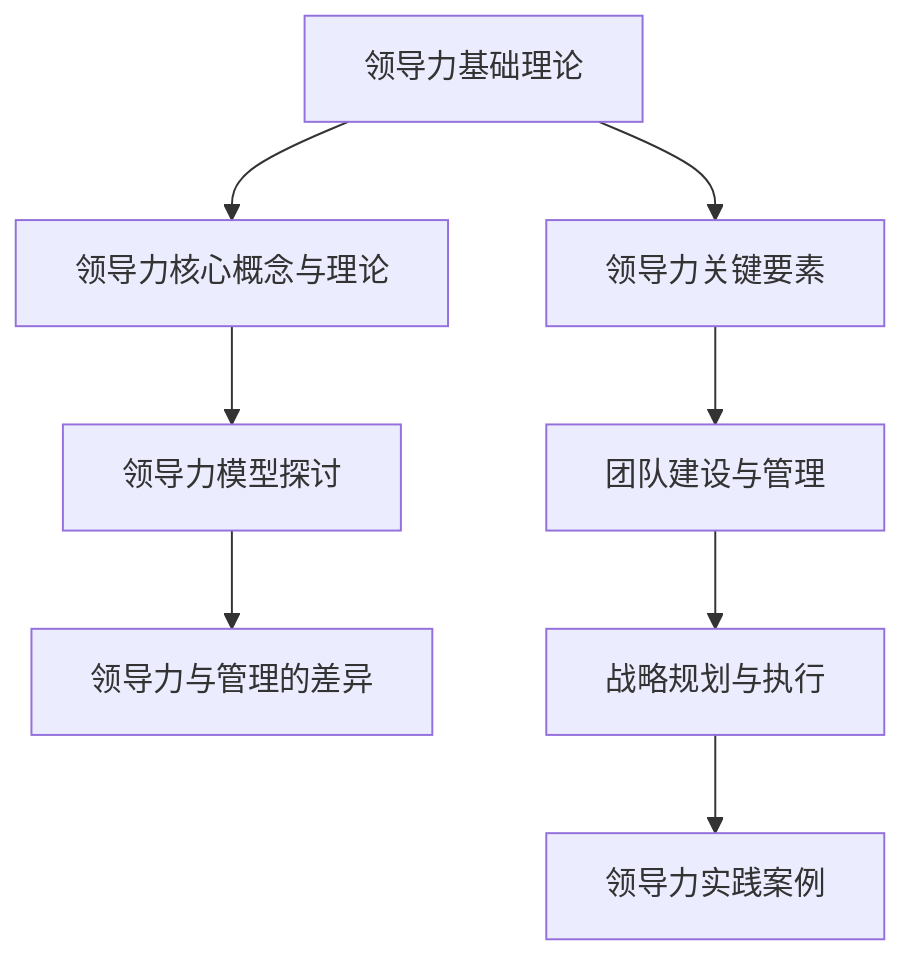

                 

### 领导力修炼手册：从产品经理到管理者的华丽转身

#### 关键词：领导力、产品经理、角色转变、团队建设、战略规划、实践案例

#### 摘要：
在快速变化的技术和创新环境中，产品经理的角色正经历着前所未有的转变。本文旨在探索这一转变背后的深层原因，分析领导力在其中的关键作用，并详细解析从产品经理到管理者的华丽转身之路。通过领导力基础理论、产品经理角色认知、团队建设与管理、战略规划与执行、领导力实践案例等多方面的探讨，本文希望为那些希望在产品管理领域实现成功转型的专业人士提供一份实用的修炼手册。

---

## 第一部分：领导力基础理论

### 第1章：领导力核心概念与理论

#### 1.1 领导力定义

领导力是一种引导、激励和影响他人实现共同目标的能力。它不仅仅是权威的运用，更是基于信任、尊重和共识的互动过程。在产品经理的角色转变中，领导力被视为推动项目成功、提升团队效率、实现战略目标的核心要素。

#### 1.2 领导力理论回顾

领导力理论经历了多个阶段的发展。从早期的特质理论、行为理论，到后来的情境理论、变革理论，每一种理论都对领导力有独特的解释。特质理论认为领导者具备特定的个性特征；行为理论则强调领导者行为的多样性；情境理论则认为领导风格应根据环境变化进行调整；变革理论则关注领导者在推动组织变革中的角色。

#### 1.3 领导力模型探讨

领导力模型是指导领导者行为的具体框架。常见的领导力模型包括领导-成员交换理论（LMX）、领导力方格理论、路径-目标理论等。这些模型提供了不同角度来理解领导力，并指导实践中的领导行为。

#### 1.4 领导力与管理的差异

领导力与管理的区别在于它们关注的焦点不同。管理侧重于任务和流程的执行，确保组织目标的实现；而领导力则关注激发和引导团队成员，塑造组织文化，推动持续创新。产品经理在角色转变过程中，需要平衡管理和领导力的运用，以实现最佳效果。

### 第2章：领导力架构解析

#### 2.1 领导力架构Mermaid流程图

#### 2.2 领导力五大要素

领导力可以分解为五大要素：愿景、影响力、沟通、决策和激励。这些要素相互作用，共同构成了领导者成功的关键能力。

1. **愿景**：明确组织的长远目标和使命，激发团队成员的归属感和使命感。
2. **影响力**：通过自身的行为和价值观影响他人，建立领导者的权威和信任。
3. **沟通**：有效传达信息，确保团队内部沟通的畅通和高效。
4. **决策**：在面对复杂问题时，做出符合组织目标和个人价值观的决策。
5. **激励**：激励团队成员，激发其潜力和创造力，实现团队目标。

#### 2.3 领导力关键指标

领导力的效果可以通过以下关键指标来衡量：

1. **团队绩效**：团队的产出和质量是衡量领导力的重要指标。
2. **员工满意度**：员工对工作环境的满意度反映了领导者的管理能力。
3. **创新和变革能力**：领导者推动组织创新和适应市场变化的能力。
4. **组织文化**：领导者的价值观和行为方式对组织文化的影响。

## 第二部分：产品经理角色转变

### 第3章：产品经理角色认知

#### 3.1 产品经理职责演变

产品经理的职责经历了从单纯的产品规划到涉及市场调研、用户反馈、项目管理等多方面的演变。在角色转变过程中，产品经理需要不断提高自身的领导力，以应对复杂的市场环境和多元化的需求。

#### 3.2 产品经理的核心能力

产品经理的核心能力包括市场洞察力、用户需求分析能力、项目管理能力和领导力。这些能力共同决定了产品经理在组织中的价值和地位。

#### 3.3 从产品经理到管理者的过渡

从产品经理到管理者的过渡是一个重要的转折点。在这个过程中，产品经理需要学会平衡技术和领导力，提高战略规划和执行能力，以更好地应对组织内部的挑战和外部市场的变化。

## 第三部分：团队建设与管理

### 第4章：团队建设原则与实践

#### 4.1 团队建设理论基础

团队建设基于心理学和社会学理论，包括团队发展阶段理论、团队角色理论等。这些理论为团队建设提供了科学依据和实践指导。

#### 4.2 团队角色定位

每个团队成员在团队中都有特定的角色和职责。明确团队角色的定位有助于提高团队协作效率和团队整体绩效。

#### 4.3 团队协作机制

建立有效的团队协作机制是团队建设的关键。包括沟通机制、决策机制、冲突解决机制等，这些机制有助于确保团队目标的实现。

### 第5章：团队管理策略

#### 5.1 团队领导艺术

团队领导艺术包括激励、沟通、反馈等环节。领导者需要通过有效的领导艺术，激发团队成员的积极性和创造力。

#### 5.2 员工激励与沟通

员工激励和沟通是团队管理的重要组成部分。通过合理的激励机制和高效的沟通，可以增强团队凝聚力和工作热情。

#### 5.3 团队冲突处理

团队冲突是不可避免的。有效的冲突处理策略有助于解决冲突，促进团队和谐，提高团队效率。

## 第四部分：战略规划与执行

### 第6章：战略规划与执行概述

#### 6.1 战略规划核心流程

战略规划包括市场分析、目标设定、资源分配、执行计划等环节。每个环节都需要精细的规划和协调。

#### 6.2 战略执行关键要素

战略执行的关键要素包括团队协作、资源整合、风险管理等。这些要素共同决定了战略规划的有效实施。

#### 6.3 战略评估与调整

战略评估和调整是战略规划的重要环节。通过对执行效果的评估和反馈，可以及时调整战略方向，确保目标的实现。

### 第7章：战略管理工具与方法

#### 7.1 SWOT分析

SWOT分析是一种常用的战略管理工具，用于评估组织的优势、劣势、机会和威胁。通过SWOT分析，可以明确组织的战略方向。

#### 7.2 波特五力模型

波特五力模型用于分析市场竞争环境，包括供应商、买家、潜在竞争者、替代品和现有竞争者。通过波特五力模型，可以识别市场竞争的关键因素。

#### 7.3 平衡计分卡

平衡计分卡是一种综合性的战略管理工具，用于衡量组织的绩效。它从财务、客户、内部流程和学习与成长四个维度，全面评估组织的绩效。

## 第五部分：领导力实践案例

### 第8章：领导力实践案例分析

#### 8.1 案例一：产品经理成功转型领导者

本案例描述了一位产品经理如何通过不断提升领导力，成功转型为团队领导。案例中详细介绍了该产品经理在团队建设、战略规划和执行等方面的实践。

#### 8.2 案例二：团队建设与绩效提升

本案例讲述了一个团队如何通过有效的团队建设和领导力实践，实现绩效的显著提升。案例中分析了团队协作、员工激励和冲突处理等方面的关键因素。

#### 8.3 案例三：战略规划与执行突破

本案例关注了一个组织如何通过战略规划和执行，实现业务突破。案例中详细介绍了该组织在市场分析、目标设定和资源分配等方面的策略。

### 作者

作者：AI天才研究院/AI Genius Institute & 禅与计算机程序设计艺术 /Zen And The Art of Computer Programming

在本文中，我们探讨了从产品经理到管理者的华丽转身之路。通过领导力基础理论、产品经理角色认知、团队建设与管理、战略规划与执行、领导力实践案例等多方面的探讨，我们希望为那些希望在产品管理领域实现成功转型的专业人士提供了一份实用的修炼手册。领导力不仅是推动项目成功、提升团队效率、实现战略目标的关键要素，也是产品经理在角色转变过程中不可或缺的核心能力。通过本文的详细分析和实践案例，我们相信读者能够更好地理解和掌握领导力在产品管理中的实际应用，实现从产品经理到管理者的成功转型。在未来的职业发展中，持续修炼领导力，不断探索和创新，将助力我们在竞争激烈的市场中脱颖而出，实现个人和团队的共同成长。让我们共同踏上领导力修炼之路，开启更加精彩的职业生涯。

