                 

### 文章标题：领导力修炼手册：从工程师到管理者的华丽转身

**关键词：** 领导力、工程师、管理者、角色转变、技能提升、团队建设、项目管理

**摘要：** 本文旨在探讨工程师如何成功转型为管理者，实现职业生涯的华丽转身。文章首先介绍了工程师与管理者在角色、职责和技能方面的差异，随后详细分析了领导力的核心概念和重要性。通过具体案例和实际操作，文章为读者提供了实用的领导力提升策略，并指导工程师在过渡过程中如何适应新的角色和职责。文章最后讨论了持续发展的领导力路径，帮助读者在职业发展中不断进步。

### 引言

在信息技术飞速发展的今天，工程师们逐渐发现自己不仅在技术领域有着出色的表现，还渴望在管理和领导方面发挥更大的作用。从工程师到管理者的转型，不仅意味着角色和职责的转变，更代表着职业生涯的一次重要飞跃。然而，这一转型并非易事，它需要工程师们具备全新的技能和思维方式。

#### 1.1 成为优秀工程师的重要性

成为优秀工程师是职业生涯的基石。工程师们通过不断学习、实践和经验积累，掌握了丰富的技术知识和解决问题的能力。他们能够设计和开发高质量的系统，解决复杂的技术难题，并推动技术创新。这些技能不仅有助于个人的职业发展，也为团队和组织带来了实际的价值。

#### 1.2 领导力的定义与作用

领导力是影响团队行为和推动组织发展的关键因素。它不仅仅与职位相关，更与个人品质和影响力紧密相连。领导力涉及到激励、沟通、决策、创新等多个方面，它能够帮助管理者有效地指导团队，实现共同的目标。在信息技术领域，领导力的重要性尤为突出，因为它关系到项目的成功和团队的凝聚力。

#### 1.3 从工程师到管理者的转变

从工程师到管理者的转变不仅仅是职位的变化，更是一种思维模式的转变。工程师们需要从技术专家的角色中解脱出来，开始关注团队建设、资源管理和战略规划。这种转变要求工程师们不仅要具备扎实的技术基础，还要培养领导力和管理技能。本文将详细探讨这一转型过程中的关键要素和策略。

### 领导力核心概念

领导力并非天生具备，而是可以通过学习和实践不断发展和提升的。在从工程师到管理者的转型过程中，理解领导力的核心概念是至关重要的。以下将介绍几个关键的领导力概念，包括领导风格、人力资源管理和沟通技巧。

#### 2.1 领导风格与团队效能

领导风格是指管理者在指导团队时采用的方式和策略。不同的领导风格会对团队效能产生不同的影响。常见的领导风格包括权威型、民主型、参与型和教练型等。权威型领导强调控制与命令，适合在紧急情况下迅速做出决策；民主型领导注重团队参与，鼓励成员发表意见，有助于提高团队凝聚力和创新性；参与型领导将权力下放，让团队成员自主决策，适合在复杂环境中促进团队合作；教练型领导关注成员的个人成长，提供指导和支持，有助于提升团队成员的能力和绩效。

**核心概念与联系：** 
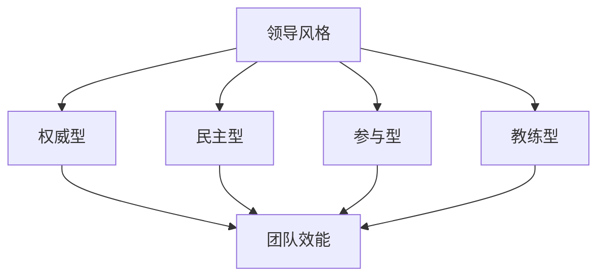

#### 2.2 人力资源管理与领导力

人力资源管理是管理者的核心职责之一，它涉及到招聘、培训、绩效管理和员工关系等多个方面。有效的人力资源管理能够提升团队的整体效能，促进组织的发展。在人力资源管理中，领导力发挥着关键作用。管理者需要通过领导力来激励员工、培养人才和解决冲突。

**核心概念与联系：** 
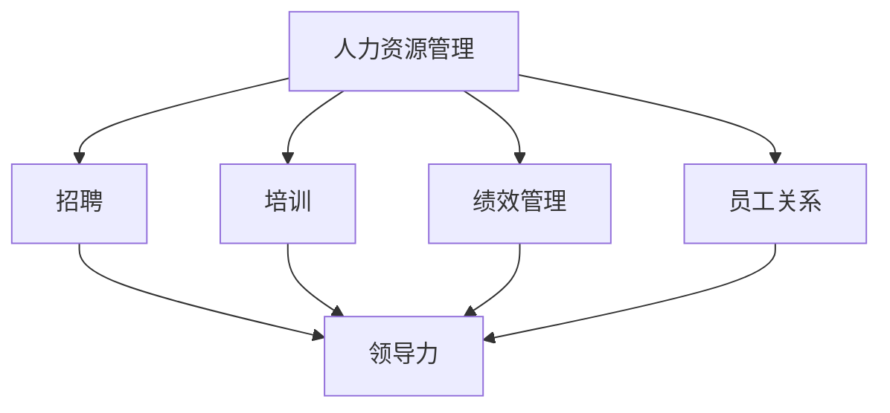

#### 2.3 沟通技巧与团队协作

沟通是领导力的核心要素之一。有效的沟通能够确保信息准确传递，促进团队协作，解决潜在的问题。在信息技术领域，沟通技巧尤为重要，因为它涉及到跨部门合作、技术讨论和项目管理等多个方面。管理者需要具备良好的口头和书面沟通能力，能够清晰、准确地表达自己的想法，并倾听和理解团队成员的意见。

**核心概念与联系：** 
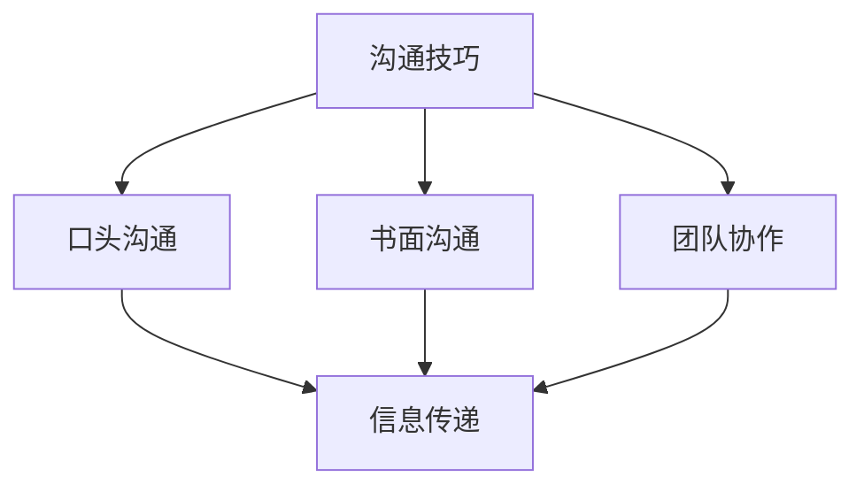

**核心算法原理讲解：**
```python
# 沟通技巧的伪代码

# 定义沟通模块
class CommunicationModule:
    def __init__(self, communication_style):
        self.communication_style = communication_style
    
    # 发送口头信息
    def send_oral_message(self, message):
        print("发送口头信息：", message)
    
    # 发送书面信息
    def send_written_message(self, message):
        print("发送书面信息：", message)
    
    # 促进团队协作
    def promote_team Collaboration(self, team_members):
        print("促进团队协作：", team_members)

# 实例化沟通模块
communication_module = CommunicationModule("民主型")

# 发送口头信息
communication_module.send_oral_message("项目进展顺利，希望大家共同努力。")

# 发送书面信息
communication_module.send_written_message("关于项目进度，请各位查看附件的详细报告。")

# 促进团队协作
communication_module.promote_team Collaboration(["小张", "小王", "小李"])
```

**数学模型和公式：**
$$
E = mc^2
$$

**举例说明：**
在项目会议上，管理者采用民主型领导风格，首先通过口头沟通传达了项目的整体进展，接着通过书面信息发送了详细的进度报告。同时，他还鼓励团队成员积极参与讨论，共同解决问题，从而促进了团队协作。

**最佳实践 tips：**
- 定期组织团队会议，确保沟通畅通。
- 根据团队成员的沟通风格调整沟通方式。
- 鼓励团队成员提出问题和建议，营造开放沟通的氛围。

**小结：**
领导力的核心概念包括领导风格、人力资源管理和沟通技巧。理解并运用这些概念，有助于管理者在团队中发挥更大的影响力，推动项目的成功。通过具体的案例和实例，读者可以更好地理解这些核心概念的实践应用。

### 领导力技能提升

在从工程师到管理者的转型过程中，提升领导力技能是至关重要的。以下将讨论几个关键的领导力技能，包括自我认知、决策能力和创新思维。

#### 3.1 领导力的自我认知

自我认知是领导力的基础。管理者需要深入了解自己的价值观、优点和不足，以及在不同情境下的行为表现。通过自我认知，管理者可以更好地理解自己的领导风格，找到适合的领导方式，提高领导效能。

**核心概念与联系：**
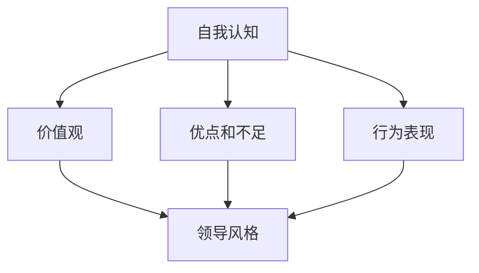

**核心算法原理讲解：**
```python
# 自我认知的伪代码

# 定义自我认知模块
class SelfAwarenessModule:
    def __init__(self, values, strengths, weaknesses, behavior_patterns):
        self.values = values
        self.strengths = strengths
        self.weaknesses = weaknesses
        self.behavior_patterns = behavior_patterns
    
    # 评估价值观
    def assess_values(self):
        print("评估价值观：", self.values)
    
    # 评估优点和不足
    def assess_strengths_and_weaknesses(self):
        print("评估优点和不足：", self.strengths, "，", self.weaknesses)
    
    # 分析行为表现
    def analyze_behavior_patterns(self):
        print("分析行为表现：", self.behavior_patterns)

# 实例化自我认知模块
self_awareness_module = SelfAwarenessModule(["诚信", "创新", "协作"], ["技术深度"], ["沟通技巧"], ["会议主持"])

# 评估价值观
self_awareness_module.assess_values()

# 评估优点和不足
self_awareness_module.assess_strengths_and_weaknesses()

# 分析行为表现
self_awareness_module.analyze_behavior_patterns()
```

**数学模型和公式：**
$$
自我认知得分 = \frac{优点得分 + 行为表现得分}{总得分}
$$

**举例说明：**
通过自我认知模块，管理者可以清楚地了解自己的价值观、优点和不足，以及在不同情境下的行为表现。这些信息有助于管理者制定个人发展计划，提升自身的领导力。

**最佳实践 tips：**
- 定期进行自我反思，评估自己的领导风格和行为表现。
- 结合团队反馈，了解自己在团队中的影响力和认可度。
- 针对自己的优点和不足，制定具体的提升计划。

**小结：**
自我认知是提升领导力的基础，通过深入了解自己的价值观、优点和不足，管理者可以更好地调整自己的领导方式，提高领导效能。通过具体的案例和实例，读者可以更好地理解自我认知的重要性及其在领导力提升中的应用。

#### 3.2 决策能力培养

决策能力是管理者的重要素质之一。有效的决策能力能够帮助管理者在面对复杂问题时迅速做出正确的选择，确保团队的顺利运营和项目的成功。以下将讨论决策能力的培养方法和实践技巧。

**核心概念与联系：**
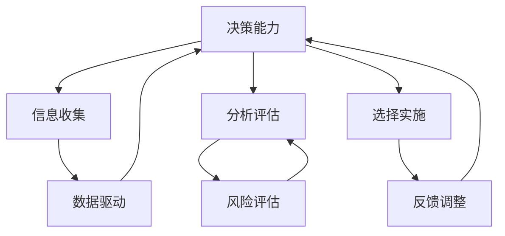

**核心算法原理讲解：**
```python
# 决策能力的伪代码

# 定义决策模块
class DecisionMakingModule:
    def __init__(self, data_collection, analysis_evaluation, selection_implementation, feedback_adjustment):
        self.data_collection = data_collection
        self.analysis_evaluation = analysis_evaluation
        self.selection_implementation = selection_implementation
        self.feedback_adjustment = feedback_adjustment
    
    # 收集信息
    def collect_data(self, data_source):
        print("收集信息：", data_source)
    
    # 分析评估
    def analyze_evaluation(self, data):
        print("分析评估：", data)
    
    # 选择实施
    def select_and_implement(self, options):
        print("选择实施：", options)
    
    # 反馈调整
    def feedback_and_adjustment(self, result):
        print("反馈调整：", result)

# 实例化决策模块
decision_making_module = DecisionMakingModule(["市场调研数据"], ["风险评估"], ["最佳方案"], ["调整措施"])

# 收集信息
decision_making_module.collect_data("市场调研数据")

# 分析评估
decision_making_module.analyze_evaluation("风险评估")

# 选择实施
decision_making_module.select_and_implement(["方案A", "方案B", "方案C"])

# 反馈调整
decision_making_module.feedback_and_adjustment("方案实施结果")
```

**数学模型和公式：**
$$
决策质量 = \frac{正确选择数}{总选择数}
$$

**举例说明：**
在面对一个关键项目决策时，管理者通过决策模块收集了市场调研数据，进行了详细的风险评估，最终选择了最佳方案并实施了调整措施。这一过程展示了决策能力的培养方法和实践技巧。

**最佳实践 tips：**
- 建立系统化的决策流程，确保信息收集和分析的准确性。
- 培养数据驱动的思维方式，提高决策的客观性和科学性。
- 鼓励团队成员参与决策过程，提高决策的全面性和可执行性。

**小结：**
决策能力是管理者的重要素质之一，通过有效的决策能力培养方法和实践技巧，管理者能够更好地应对复杂问题，确保团队的顺利运营和项目的成功。通过具体的案例和实例，读者可以更好地理解决策能力的重要性及其在实际应用中的关键作用。

#### 3.3 创新思维与问题解决

创新思维是管理者必备的能力之一，它能够推动团队不断进步和突破。以下将讨论创新思维的重要性和问题解决的方法，并提供实际案例和应用。

**核心概念与联系：**
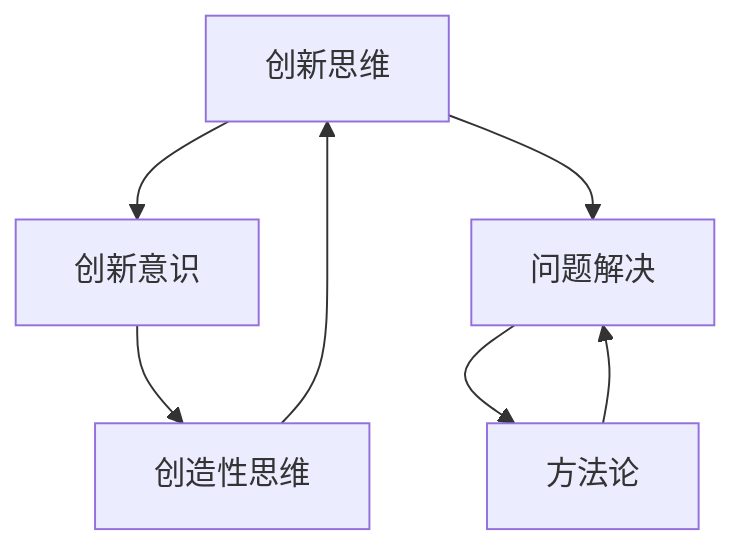

**核心算法原理讲解：**
```python
# 创新思维的伪代码

# 定义创新思维模块
class InnovationModule:
    def __init__(self, innovation_awareness, creative_thinking, problem_solving_methods):
        self.innovation_awareness = innovation_awareness
        self.creative_thinking = creative_thinking
        self.problem_solving_methods = problem_solving_methods
    
    # 培养创新意识
    def cultivate_innovation_awareness(self):
        print("培养创新意识：", self.innovation_awareness)
    
    # 创造性思维
    def apply_creative_thinking(self, problem):
        print("应用创造性思维解决：", problem)
    
    # 问题解决方法论
    def use_problem_solving_methods(self, problem):
        print("使用问题解决方法论：", self.problem_solving_methods)

# 实例化创新思维模块
innovation_module = InnovationModule(["持续学习"], ["思维导图"], ["五力分析法"])

# 培养创新意识
innovation_module.cultivate_innovation_awareness()

# 应用创造性思维
innovation_module.apply_creative_thinking("如何提高项目效率？")

# 使用问题解决方法论
innovation_module.use_problem_solving_methods("如何提高项目效率？")
```

**数学模型和公式：**
$$
创新效率 = \frac{创新成果数}{投入资源数}
$$

**举例说明：**
在一次项目中，团队面临效率低下的问题。通过创新思维模块，管理者培养了创新意识，应用创造性思维提出了多种解决方案，并使用五力分析法进行评估。最终，团队选择了最佳方案并成功提高了项目效率。

**最佳实践 tips：**
- 鼓励团队成员提出创新想法，营造开放的创新氛围。
- 定期组织创新讨论会议，促进团队成员的思维碰撞。
- 培养跨学科思维，借鉴其他领域的创新方法和工具。

**小结：**
创新思维是管理者的重要能力之一，它能够推动团队不断进步和突破。通过具体的案例和实例，读者可以更好地理解创新思维的重要性及其在实际应用中的关键作用。通过培养创新意识和问题解决方法，管理者能够更好地应对挑战，推动团队的创新和发展。

### 工程师向管理者过渡

从工程师到管理者的过渡是一个充满挑战和机遇的过程。在这个过程中，工程师需要调整自己的思维方式，学习新的管理技能，并适应新的角色和职责。以下将讨论几个关键的过渡策略，帮助工程师顺利实现职业生涯的华丽转身。

#### 4.1 工程师管理视角的转变

工程师的管理视角需要从技术导向转向以人为本。工程师在技术领域有着深厚的背景和丰富的经验，但在管理角色中，他们需要更加关注团队建设、资源管理和战略规划。这种视角的转变要求工程师从宏观层面思考问题，关注团队的整体发展和长远目标。

**核心概念与联系：**
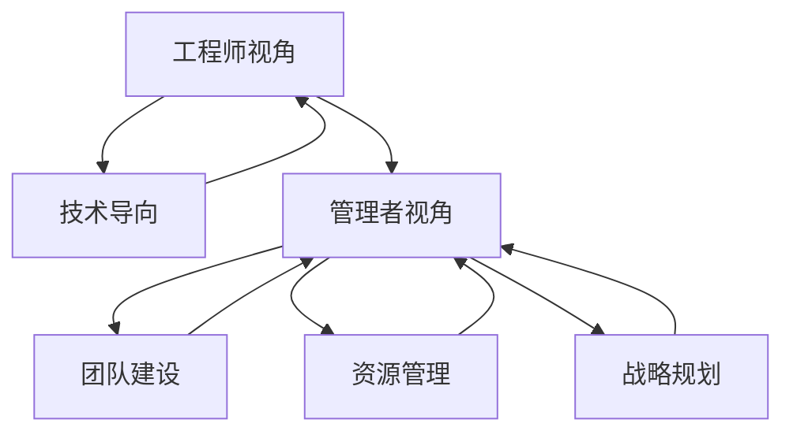

**核心算法原理讲解：**
```python
# 视角转变的伪代码

# 定义工程师和管理者视角转换模块
class PerspectiveConversionModule:
    def __init__(self, technical_focus, managerial_perspective):
        self.technical_focus = technical_focus
        self.managerial_perspective = managerial_perspective
    
    # 调整技术导向视角
    def adjust_technical_focus(self, team_context):
        print("调整技术导向视角：", self.technical_focus, "在团队背景下：", team_context)
    
    # 建立管理者视角
    def establish_managerial_perspective(self, team_goals):
        print("建立管理者视角：", self.managerial_perspective, "团队目标：", team_goals)

# 实例化视角转换模块
perspective_conversion_module = PerspectiveConversionModule(["代码优化"], ["团队建设"])

# 调整技术导向视角
perspective_conversion_module.adjust_technical_focus("团队协作与项目进度")

# 建立管理者视角
perspective_conversion_module.establish_managerial_perspective(["提升团队效率", "完成项目目标"])
```

**数学模型和公式：**
$$
管理效能 = \frac{团队目标达成度}{资源投入量}
$$

**举例说明：**
在项目初期，工程师通过视角转换模块，调整了自己的技术导向视角，将其聚焦于团队协作和项目进度。同时，他建立了管理者视角，明确了团队的目标和资源投入。这一过程展示了工程师向管理者过渡中的视角转变策略。

**最佳实践 tips：**
- 定期与团队成员沟通，了解团队的需求和挑战。
- 学习管理知识和技能，提升自己的领导力和管理能力。
- 结合技术背景，为团队提供技术支持和指导。

**小结：**
从工程师到管理者的过渡需要视角的转变，工程师需要从技术导向转向以人为本，关注团队建设、资源管理和战略规划。通过具体的案例和实例，读者可以更好地理解视角转变策略的重要性及其在实际应用中的关键作用。

#### 4.2 管理者所需的知识和技能

在从工程师到管理者的过渡过程中，工程师需要掌握一系列新的知识和技能，以适应新的角色和职责。以下将讨论几个关键的知识和技能，包括管理理论、人力资源管理和项目管理。

**核心概念与联系：**
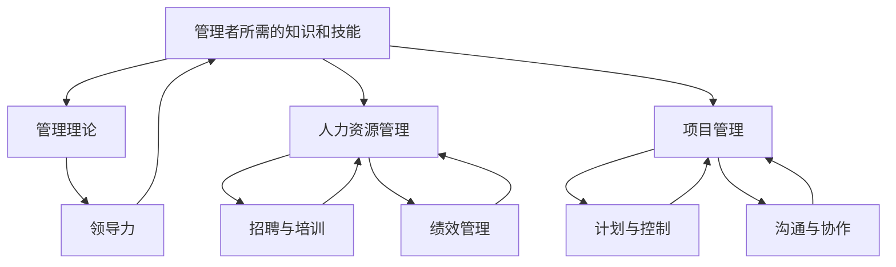

**核心算法原理讲解：**
```python
# 管理者知识和技能的伪代码

# 定义管理者知识和技能模块
class ManagerKnowledgeAndSkillsModule:
    def __init__(self, management_theory, human_resource_management, project_management):
        self.management_theory = management_theory
        self.human_resource_management = human_resource_management
        self.project_management = project_management
    
    # 学习管理理论
    def learn_management_theory(self, theory_concepts):
        print("学习管理理论：", theory_concepts)
    
    # 实施人力资源管理
    def implement_human_resource_management(self, hr_practices):
        print("实施人力资源管理：", hr_practices)
    
    # 进行项目管理
    def manage_projects(self, project_phases):
        print("进行项目管理：", project_phases)

# 实例化管理者知识和技能模块
manager_knowledge_skills_module = ManagerKnowledgeAndSkillsModule(["领导力理论"], ["招聘与培训"], ["计划与控制"])

# 学习管理理论
manager_knowledge_skills_module.learn_management_theory("领导力理论")

# 实施人力资源管理
manager_knowledge_skills_module.implement_human_resource_management(["招聘流程", "员工培训"])

# 进行项目管理
manager_knowledge_skills_module.manage_projects(["项目计划", "项目执行", "项目监控"])
```

**数学模型和公式：**
$$
管理效能 = \frac{团队目标达成度}{资源投入量}
$$

**举例说明：**
在项目过程中，管理者通过管理者知识和技能模块，学习了领导力理论，实施了人力资源管理，并进行了项目管理。这一过程展示了管理者所需的知识和技能在实际应用中的关键作用。

**最佳实践 tips：**
- 参加管理培训课程，提升自己的管理知识和技能。
- 阅读相关书籍和资料，不断学习最新的管理理论和实践方法。
- 结合实际项目，不断积累管理经验，提升自己的管理能力。

**小结：**
从工程师到管理者，工程师需要掌握一系列新的知识和技能，以适应新的角色和职责。通过具体的案例和实例，读者可以更好地理解管理者所需的知识和技能的重要性及其在实际应用中的关键作用。

#### 4.3 适应管理角色的策略

适应管理角色是工程师从工程师到管理者过渡的关键一步。以下将讨论几个关键的适应策略，包括建立信任、培养团队和明确目标。

**核心概念与联系：**
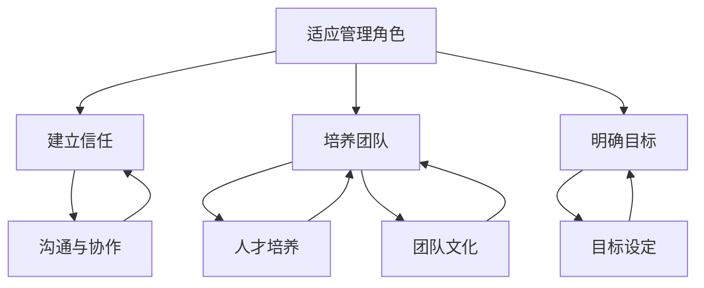

**核心算法原理讲解：**
```python
# 适应管理角色的伪代码

# 定义适应管理角色模块
class AdaptManagementRoleModule:
    def __init__(self, trust_building, team_cultivation, goal_clarification):
        self.trust_building = trust_building
        self.team_cultivation = team_cultivation
        self.goal_clarification = goal_clarification
    
    # 建立信任
    def build_trust(self, communication渠道):
        print("建立信任：", self.trust_building, "通过：", communication渠道)
    
    # 培养团队
    def cultivate_team(self, talent_development, team_culture):
        print("培养团队：", self.team_cultivation, "通过：", talent_development, "和", team_culture)
    
    # 明确目标
    def clarify_goals(self, objectives):
        print("明确目标：", self.goal_clarification, "目标：", objectives)

# 实例化适应管理角色模块
adapt_management_role_module = AdaptManagementRoleModule(["开放沟通"], ["培训与发展"], ["明确目标设定"])

# 建立信任
adapt_management_role_module.build_trust("定期团队会议")

# 培养团队
adapt_management_role_module.cultivate_team("技术培训", "团队合作文化")

# 明确目标
adapt_management_role_module.clarify_goals(["提升项目效率", "团队成长"])
```

**数学模型和公式：**
$$
团队效能 = \frac{目标达成度}{资源投入量}
$$

**举例说明：**
在项目初期，管理者通过适应管理角色模块，建立了开放沟通的信任机制，培养了团队成员的技术能力和团队合作文化，并明确了项目的目标。这一过程展示了适应管理角色的关键策略在实际应用中的关键作用。

**最佳实践 tips：**
- 定期组织团队活动，增强团队凝聚力。
- 提供团队成员培训和发展机会，提升团队整体能力。
- 设定明确的目标和计划，确保团队的共同努力方向。

**小结：**
适应管理角色是工程师从工程师到管理者过渡的关键一步，通过建立信任、培养团队和明确目标，管理者能够更好地适应新的角色和职责，推动团队的发展和项目的成功。通过具体的案例和实例，读者可以更好地理解适应管理角色的策略的重要性及其在实际应用中的关键作用。

### 建立高效团队

在从工程师到管理者的过渡过程中，建立高效团队是管理者的重要职责之一。以下将讨论几个关键的团队建设原则，包括角色与责任分配、团队成员的激励与绩效管理。

#### 5.1 团队建设原则

成功的团队建设需要遵循一系列原则，以确保团队高效运行和成员之间的良好协作。以下是一些关键的团队建设原则：

- **目标一致性**：确保团队成员对团队目标有共同的理解和认同，明确团队的使命和愿景。
- **明确角色与责任**：为每个团队成员分配明确的职责和角色，确保每个人都知道自己的任务和期望。
- **沟通畅通**：建立高效的沟通机制，确保信息在团队内部畅通无阻，促进团队成员之间的协作。
- **信任与尊重**：建立信任和尊重的氛围，鼓励团队成员相互支持和合作，减少冲突和误解。
- **持续学习与成长**：鼓励团队成员不断学习和成长，提升个人和团队的能力，保持团队的竞争力。

**核心概念与联系：**
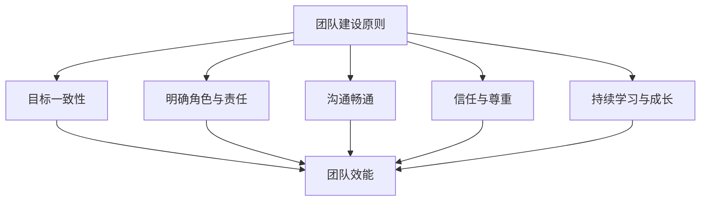

**核心算法原理讲解：**
```python
# 团队建设原则的伪代码

# 定义团队建设原则模块
class TeamBuildingPrinciplesModule:
    def __init__(self, goal_consistency, role_and_responsibility, communication, trust_and_respect, continuous_learning):
        self.goal_consistency = goal_consistency
        self.role_and_responsibility = role_and_responsibility
        self.communication = communication
        self.trust_and_respect = trust_and_respect
        self.continuous_learning = continuous_learning
    
    # 确保目标一致性
    def ensure_goal_consistency(self, team_members):
        print("确保目标一致性：", self.goal_consistency, "团队成员：", team_members)
    
    # 分配明确角色与责任
    def assign_clear_roles_and_responsibilities(self, team_members):
        print("分配明确角色与责任：", self.role_and_responsibility, "团队成员：", team_members)
    
    # 促进沟通畅通
    def promote_communication(self, team_members):
        print("促进沟通畅通：", self.communication, "团队成员：", team_members)
    
    # 建立信任与尊重
    def build_trust_and_respect(self, team_members):
        print("建立信任与尊重：", self.trust_and_respect, "团队成员：", team_members)
    
    # 鼓励持续学习与成长
    def encourage_continuous_learning_and_growth(self, team_members):
        print("鼓励持续学习与成长：", self.continuous_learning, "团队成员：", team_members)

# 实例化团队建设原则模块
team_building_principles_module = TeamBuildingPrinciplesModule(["共同目标"], ["明确分工"], ["定期会议"], ["相互尊重"], ["技能提升"])

# 确保目标一致性
team_building_principles_module.ensure_goal_consistency(["小张", "小王", "小李"])

# 分配明确角色与责任
team_building_principles_module.assign_clear_roles_and_responsibilities(["小张", "小王", "小李"])

# 促进沟通畅通
team_building_principles_module.promote_communication(["小张", "小王", "小李"])

# 建立信任与尊重
team_building_principles_module.build_trust_and_respect(["小张", "小王", "小李"])

# 鼓励持续学习与成长
team_building_principles_module.encourage_continuous_learning_and_growth(["小张", "小王", "小李"])
```

**数学模型和公式：**
$$
团队效能 = \frac{目标达成度}{资源投入量}
$$

**举例说明：**
在项目初期，管理者通过团队建设原则模块，确保了团队成员对项目目标的一致性，明确了每个人的角色与责任，促进了沟通畅通，建立了信任与尊重的氛围，并鼓励团队成员持续学习和成长。这一过程展示了团队建设原则在实际应用中的关键作用。

**最佳实践 tips：**
- 定期组织团队建设活动，增强团队凝聚力。
- 设立明确的目标和计划，确保团队成员共同的努力方向。
- 建立有效的沟通渠道，确保信息的及时传递和反馈。

**小结：**
团队建设原则是建立高效团队的关键，通过确保目标一致性、明确角色与责任、促进沟通畅通、建立信任与尊重和鼓励持续学习与成长，管理者能够打造一个高效、和谐的团队。通过具体的案例和实例，读者可以更好地理解团队建设原则的重要性及其在实际应用中的关键作用。

#### 5.2 团队成员的角色与责任

在高效团队的建设中，明确团队成员的角色与责任是至关重要的。每个团队成员都需要了解自己的职责，以及如何与其他成员协作，以确保团队目标的实现。以下将讨论团队成员的角色和责任分配原则。

**核心概念与联系：**
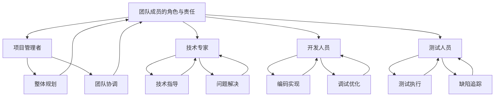

**核心算法原理讲解：**
```python
# 团队成员角色与责任的伪代码

# 定义团队成员角色模块
class TeamMemberRoleModule:
    def __init__(self, project_manager, technical_expert, developer, tester):
        self.project_manager = project_manager
        self.technical_expert = technical_expert
        self.developer = developer
        self.tester = tester
    
    # 确定项目管理者角色
    def define_project_manager_role(self, project_context):
        print("项目管理者角色：", self.project_manager, "项目背景：", project_context)
    
    # 确定技术专家角色
    def define_technical_expert_role(self, technical_context):
        print("技术专家角色：", self.technical_expert, "技术背景：", technical_context)
    
    # 确定开发人员角色
    def define_developer_role(self, development_context):
        print("开发人员角色：", self.developer, "开发背景：", development_context)
    
    # 确定测试人员角色
    def define_tester_role(self, testing_context):
        print("测试人员角色：", self.tester, "测试背景：", testing_context)

# 实例化团队成员角色模块
team_member_role_module = TeamMemberRoleModule(["整体规划"], ["技术指导"], ["编码实现"], ["测试执行"])

# 确定项目管理者角色
team_member_role_module.define_project_manager_role("项目进展情况")

# 确定技术专家角色
team_member_role_module.define_technical_expert_role("技术难题")

# 确定开发人员角色
team_member_role_module.define_developer_role("代码实现")

# 确定测试人员角色
team_member_role_module.define_tester_role("测试执行")
```

**数学模型和公式：**
$$
团队效能 = \frac{目标达成度}{资源投入量}
$$

**举例说明：**
在一个软件开发项目中，通过团队成员角色模块，项目管理者负责整体规划和团队协调，技术专家提供技术指导和问题解决，开发人员负责编码实现和调试优化，测试人员负责测试执行和缺陷追踪。每个成员明确自己的角色和责任，确保项目顺利进行。

**最佳实践 tips：**
- 定期进行角色和责任评估，确保团队成员明确自己的职责。
- 鼓励团队成员相互沟通，确保角色和责任分配的透明性和合理性。
- 建立角色和责任调整机制，根据项目需求和环境变化及时调整。

**小结：**
团队成员的角色与责任是高效团队建设的基础，通过明确每个成员的角色和责任，确保团队成员之间的协作和目标一致性，管理者能够提高团队的效能。通过具体的案例和实例，读者可以更好地理解团队成员角色与责任的重要性及其在实际应用中的关键作用。

#### 5.3 团队成员的激励与绩效管理

团队成员的激励与绩效管理是确保团队高效运行和持续发展的关键。有效的激励和绩效管理能够激发团队成员的工作热情和创造力，提高团队的绩效和整体效能。以下将讨论团队成员激励与绩效管理的方法和策略。

**核心概念与联系：**
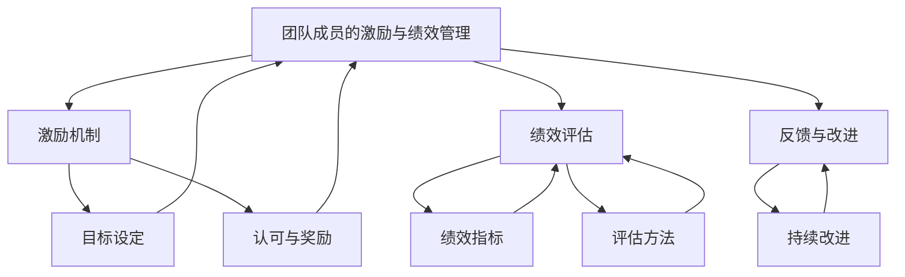

**核心算法原理讲解：**
```python
# 团队成员激励与绩效管理的伪代码

# 定义激励与绩效管理模块
class MotivationAndPerformanceManagementModule:
    def __init__(self, incentive_mechanism, performance_evaluation, feedback_and_improvement):
        self.incentive_mechanism = incentive_mechanism
        self.performance_evaluation = performance_evaluation
        self.feedback_and_improvement = feedback_and_improvement
    
    # 设定激励机制
    def set_incentive_mechanism(self, goals, rewards):
        print("设定激励机制：", self.incentive_mechanism, "目标：", goals, "奖励：", rewards)
    
    # 进行绩效评估
    def conduct_performance_evaluation(self, performance_indicators, evaluation_methods):
        print("进行绩效评估：", self.performance_evaluation, "绩效指标：", performance_indicators, "评估方法：", evaluation_methods)
    
    # 提供反馈与改进
    def provide_feedback_and_improvement(self, feedback, improvement_actions):
        print("提供反馈与改进：", self.feedback_and_improvement, "反馈：", feedback, "改进措施：", improvement_actions)

# 实例化激励与绩效管理模块
motivation_performance_management_module = MotivationAndPerformanceManagementModule(["目标激励"], ["KPI评估"], ["持续改进"])

# 设定激励机制
motivation_performance_management_module.set_incentive_mechanism(["完成项目目标"], ["奖金与晋升机会"])

# 进行绩效评估
motivation_performance_management_module.conduct_performance_evaluation(["任务完成率"], ["KPI评估方法"])

# 提供反馈与改进
motivation_performance_management_module.provide_feedback_and_improvement(["绩效反馈"], ["改进措施"])
```

**数学模型和公式：**
$$
绩效得分 = \frac{绩效指标达成度}{总指标数}
$$

**举例说明：**
在项目过程中，通过激励与绩效管理模块，管理者设定了明确的目标和奖励机制，对团队成员进行了KPI评估，并提供了反馈和改进建议。这一过程展示了团队成员激励与绩效管理在实际应用中的关键作用。

**最佳实践 tips：**
- 设定合理的绩效指标，确保评估的公平性和准确性。
- 提供个性化的激励措施，满足不同成员的需求和期望。
- 建立持续改进的机制，鼓励团队成员不断进步和提升。

**小结：**
团队成员的激励与绩效管理是团队高效运行和持续发展的重要保障。通过设定激励机制、进行绩效评估和提供反馈与改进，管理者能够激发团队成员的工作热情和创造力，提高团队的绩效和整体效能。通过具体的案例和实例，读者可以更好地理解团队成员激励与绩效管理的重要性及其在实际应用中的关键作用。

### 项目管理与领导力

在信息技术领域，项目管理是确保项目按时、按质量完成的关键。而领导力在项目管理中起着至关重要的作用。以下将讨论项目管理的理论基础、领导力在项目中的重要性以及领导者在项目中的角色与职责。

#### 6.1 项目管理基础

项目管理是一个系统化的过程，涉及到项目规划、执行、监控和收尾。以下是一些关键的项目管理概念和流程：

- **项目目标**：明确项目的最终目标和预期成果，为项目提供方向和指导。
- **项目计划**：制定详细的项目计划，包括任务分配、时间安排、资源需求和预算。
- **项目执行**：按照项目计划，协调和指导团队成员完成各项任务。
- **项目监控**：实时监控项目进展，确保项目按计划进行，及时调整和解决偏差。
- **项目收尾**：完成项目的最后任务，进行项目总结和评估，确保项目目标的实现。

**核心概念与联系：**
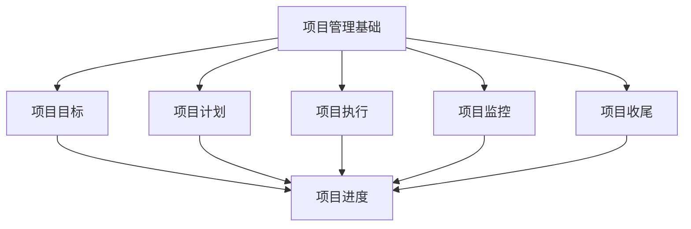

**核心算法原理讲解：**
```python
# 项目管理的伪代码

# 定义项目管理模块
class ProjectManagementModule:
    def __init__(self, project_goals, project_plan, project_execution, project_monitoring, project_closure):
        self.project_goals = project_goals
        self.project_plan = project_plan
        self.project_execution = project_execution
        self.project_monitoring = project_monitoring
        self.project_closure = project_closure
    
    # 确定项目目标
    def define_project_goals(self, project_goals):
        print("确定项目目标：", project_goals)
    
    # 制定项目计划
    def create_project_plan(self, project_plan):
        print("制定项目计划：", project_plan)
    
    # 指导项目执行
    def guide_project_execution(self, project_execution):
        print("指导项目执行：", project_execution)
    
    # 监控项目进展
    def monitor_project_progress(self, project_monitoring):
        print("监控项目进展：", project_monitoring)
    
    # 完成项目收尾
    def close_project(self, project_closure):
        print("完成项目收尾：", project_closure)

# 实例化项目管理模块
project_management_module = ProjectManagementModule(["提升系统性能"], ["任务分配"], ["项目进度"], ["风险管理"], ["项目总结"])

# 确定项目目标
project_management_module.define_project_goals(["提升系统性能"])

# 制定项目计划
project_management_module.create_project_plan(["任务分配"])

# 指导项目执行
project_management_module.guide_project_execution(["项目进度"])

# 监控项目进展
project_management_module.monitor_project_progress(["风险管理"])

# 完成项目收尾
project_management_module.close_project(["项目总结"])
```

**数学模型和公式：**
$$
项目进度 = \frac{已完成任务数}{总任务数}
$$

**举例说明：**
在一个系统性能提升项目中，通过项目管理模块，明确了项目目标，制定了详细的项目计划，指导团队成员完成各项任务，并实时监控项目进展，确保项目按计划进行。这一过程展示了项目管理基础在实际应用中的关键作用。

**最佳实践 tips：**
- 确定明确的项目目标，为项目提供清晰的指导方向。
- 制定详细的项目计划，确保任务分配和时间安排的合理性。
- 建立有效的沟通机制，确保团队成员之间的信息传递畅通。
- 实时监控项目进展，及时调整和解决偏差。

**小结：**
项目管理基础是确保项目成功完成的关键。通过明确项目目标、制定项目计划、指导项目执行、监控项目进展和完成项目收尾，管理者能够确保项目按时、按质量完成。通过具体的案例和实例，读者可以更好地理解项目管理基础的重要性及其在实际应用中的关键作用。

#### 6.2 领导力在项目中的重要性

领导力在项目中的重要性不言而喻。有效的领导力能够确保项目目标的实现，提高团队协作效率，减少冲突和错误。以下将讨论领导力在项目中的关键作用：

- **激励与鼓舞**：领导者通过激励团队成员，提高他们的工作积极性和创造力，确保项目顺利进行。
- **沟通与协调**：领导者负责确保团队成员之间的信息传递畅通，协调各方的资源和努力，确保项目目标的实现。
- **决策与指导**：领导者需要做出关键决策，指导团队成员解决问题，确保项目在正确的方向上前进。
- **风险管理**：领导者需要识别和管理项目中的风险，确保项目能够应对各种不确定性和挑战。

**核心概念与联系：**
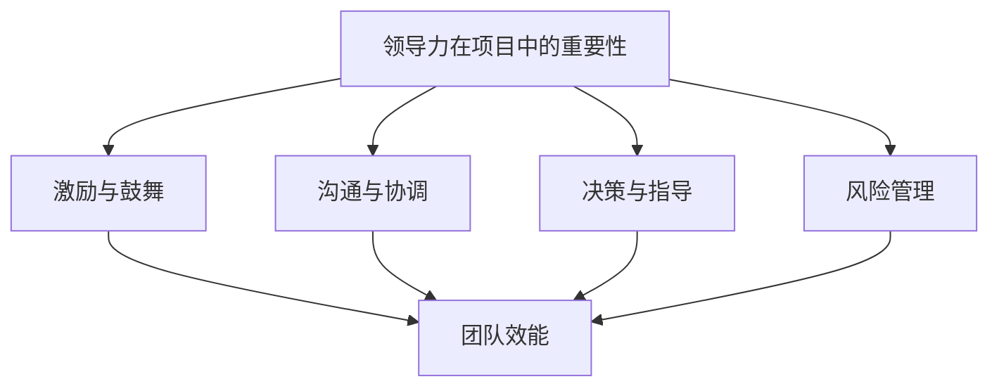

**核心算法原理讲解：**
```python
# 领导力在项目中的重要性伪代码

# 定义领导力模块
class LeadershipModule:
    def __init__(self, motivation, communication, decision_making, risk_management):
        self.motivation = motivation
        self.communication = communication
        self.decision_making = decision_making
        self.risk_management = risk_management
    
    # 激励与鼓舞团队
    def motivate_and_encourage_team(self, team_members):
        print("激励与鼓舞团队：", self.motivation, "团队成员：", team_members)
    
    # 沟通与协调
    def communicate_and Coordinate(self, team_members):
        print("沟通与协调：", self.communication, "团队成员：", team_members)
    
    # 做出决策与指导
    def make_decisions_and_guidance(self, team_members):
        print("做出决策与指导：", self.decision_making, "团队成员：", team_members)
    
    # 风险管理
    def manage_risk(self, project_context):
        print("风险管理：", self.risk_management, "项目背景：", project_context)

# 实例化领导力模块
leadership_module = LeadershipModule(["目标激励"], ["定期会议"], ["快速决策"], ["风险评估"])

# 激励与鼓舞团队
leadership_module.motivate_and_encourage_team(["小张", "小王", "小李"])

# 沟通与协调
leadership_module.communicate_and_Coordinate(["小张", "小王", "小李"])

# 做出决策与指导
leadership_module.make_decisions_and_guidance(["小张", "小王", "小李"])

# 风险管理
leadership_module.manage_risk("项目进度")
```

**数学模型和公式：**
$$
领导力效能 = \frac{项目目标达成度}{资源投入量}
$$

**举例说明：**
在一个复杂的项目中，通过领导力模块，领导者激励团队成员，确保沟通畅通，快速做出决策并指导团队成员解决问题，同时进行风险管理，确保项目顺利进行。这一过程展示了领导力在项目中的重要性。

**最佳实践 tips：**
- 定期与团队成员沟通，了解他们的需求和问题。
- 建立明确的决策流程，确保决策的及时性和科学性。
- 鼓励团队成员参与项目决策，提高决策的全面性和可执行性。
- 定期进行风险评估，制定应对措施，确保项目的顺利进行。

**小结：**
领导力在项目管理中起着至关重要的作用。通过激励与鼓舞团队、沟通与协调、决策与指导和风险管理，领导者能够确保项目目标的实现和团队的高效运行。通过具体的案例和实例，读者可以更好地理解领导力在项目管理中的重要性及其在实际应用中的关键作用。

#### 6.3 领导者在项目中的角色与职责

领导者在项目中的角色和职责至关重要，他们需要确保项目的成功完成，同时推动团队的持续发展。以下将详细讨论领导者在项目中的关键角色与职责：

**核心概念与联系：**
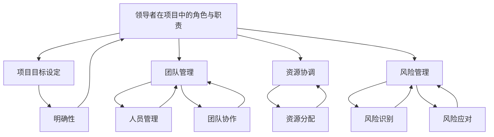

**核心算法原理讲解：**
```python
# 领导者在项目中的角色与职责的伪代码

# 定义项目领导力模块
class ProjectLeadershipModule:
    def __init__(self, project_goals, team_management, resource协调， risk_management):
        self.project_goals = project_goals
        self.team_management = team_management
        self.resource协调整 = resource协调整
        self.risk_management = risk_management
    
    # 设定项目目标
    def set_project_goals(self, goals):
        print("设定项目目标：", goals)
    
    # 管理团队
    def manage_team(self, team_members):
        print("管理团队：", self.team_management, "团队成员：", team_members)
    
    # 协调资源
    def coordinate_resources(self, resources):
        print("协调资源：", self.resource协调整, "资源：", resources)
    
    # 管理风险
    def manage_risk(self, risks):
        print("管理风险：", self.risk_management, "风险：", risks)

# 实例化项目领导力模块
project_leadership_module = ProjectLeadershipModule(["提高系统性能"], ["人员管理"], ["资源分配"], ["风险识别与应对"])

# 设定项目目标
project_leadership_module.set_project_goals(["提高系统性能"])

# 管理团队
project_leadership_module.manage_team(["小张", "小王", "小李"])

# 协调资源
project_leadership_module.coordinate_resources(["人力", "设备", "预算"])

# 管理风险
project_leadership_module.manage_risk(["技术风险", "时间风险", "资源风险"])
```

**数学模型和公式：**
$$
项目成功率 = \frac{项目目标达成度}{风险控制度}
$$

**举例说明：**
在一个系统性能提升项目中，通过项目领导力模块，领导者明确了项目目标，管理了团队成员，协调了资源，并管理了项目中的风险。这一过程展示了领导者在项目中的关键角色和职责。

**最佳实践 tips：**
- 定期与团队成员沟通，确保项目目标的明确性和可执行性。
- 建立有效的沟通机制，确保信息的及时传递和反馈。
- 建立风险管理机制，提前识别和应对潜在的风险。
- 鼓励团队成员积极参与项目管理，提高团队的凝聚力和协作效率。

**小结：**
领导者在项目中的角色和职责至关重要，他们需要确保项目的成功完成，同时推动团队的持续发展。通过设定项目目标、管理团队、协调资源和风险管理，领导者能够确保项目的高效运行和团队的高效协作。通过具体的案例和实例，读者可以更好地理解领导者在项目中的关键角色和职责。

### 领导力实战案例分析

通过实际案例，我们可以更深入地理解领导力在从工程师到管理者转型中的实际应用。以下将分析三个具体的案例，每个案例都展示了领导力在不同情境下的运用。

#### 7.1 案例一：技术团队的转型

**背景介绍：**
某公司是一家专注于软件开发的高科技企业，近年来，公司业务迅速扩展，技术团队也不断扩大。然而，随着团队规模的增加，技术团队的协作效率逐渐下降，项目进度也受到严重影响。公司管理层意识到，技术团队的转型和领导力的提升是解决问题的关键。

**核心概念与联系：**
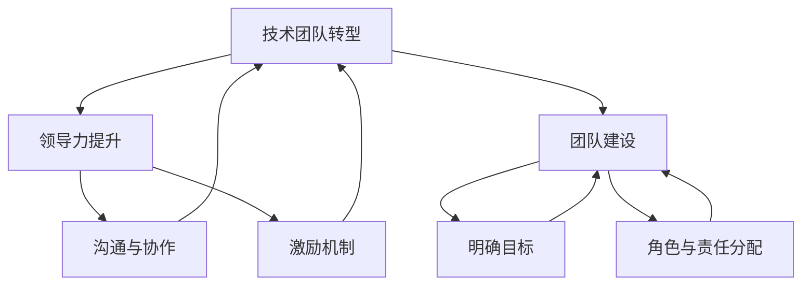

**核心算法原理讲解：**
```python
# 技术团队转型的伪代码

# 定义技术团队转型模块
class TechTeamTransformationModule:
    def __init__(self, leadership_improvement, team_building, communication_and_cohesion, motivation_mechanism):
        self.leadership_improvement = leadership_improvement
        self.team_building = team_building
        self.communication_and_cohesion = communication_and_cohesion
        self.motivation_mechanism = motivation_mechanism
    
    # 提升领导力
    def improve_leadership(self, team_members):
        print("提升领导力：", self.leadership_improvement, "团队成员：", team_members)
    
    # 进行团队建设
    def build_team(self, goals, roles):
        print("进行团队建设：", self.team_building, "目标：", goals, "角色：", roles)
    
    # 促进沟通与协作
    def promote_communication_and_cohesion(self, team_members):
        print("促进沟通与协作：", self.communication_and_cohesion, "团队成员：", team_members)
    
    # 设定激励机制
    def set_motivation_mechanism(self, rewards):
        print("设定激励机制：", self.motivation_mechanism, "奖励：", rewards)

# 实例化技术团队转型模块
tech_team_transformation_module = TechTeamTransformationModule(["领导力培训"], ["团队目标设定"], ["定期会议"], ["绩效奖金"])

# 提升领导力
tech_team_transformation_module.improve_leadership(["小张", "小王", "小李"])

# 进行团队建设
tech_team_transformation_module.build_team(["提升协作效率"], ["任务分配"])

# 促进沟通与协作
tech_team_transformation_module.promote_communication_and_cohesion(["小张", "小王", "小李"])

# 设定激励机制
tech_team_transformation_module.set_motivation_mechanism(["绩效奖金"])
```

**数学模型和公式：**
$$
团队协作效率 = \frac{完成任务数}{总任务数}
$$

**项目实战：**
在技术团队转型的过程中，通过技术团队转型模块，公司管理层提升了领导力，明确了团队目标，促进了沟通与协作，并设立了激励机制。这一过程使得团队协作效率显著提升，项目进度得到了保障。

**案例分析和详细讲解剖析：**
- **领导力提升**：通过领导力培训，团队成员掌握了更有效的领导技巧，能够更好地指导团队和管理项目。
- **团队建设**：明确了团队目标，每个成员都清楚自己的角色和责任，增强了团队凝聚力。
- **沟通与协作**：定期会议和沟通机制的建立，确保了信息的及时传递和问题的及时解决。
- **激励机制**：绩效奖金的设立，激发了团队成员的工作热情和创造力，提高了团队的绩效。

**项目小结：**
技术团队的转型成功，不仅提升了团队的协作效率，也为公司的业务发展提供了有力支持。这一案例展示了领导力在团队转型中的关键作用，为其他企业提供了有益的借鉴。

#### 7.2 案例二：跨部门沟通与合作

**背景介绍：**
某公司的研发部门和市场部门在项目推进过程中遇到了沟通不畅的问题。由于双方对项目目标和需求的理解存在差异，导致项目进度缓慢，甚至出现了项目搁置的风险。公司管理层意识到，跨部门沟通与合作是解决问题的关键。

**核心概念与联系：**
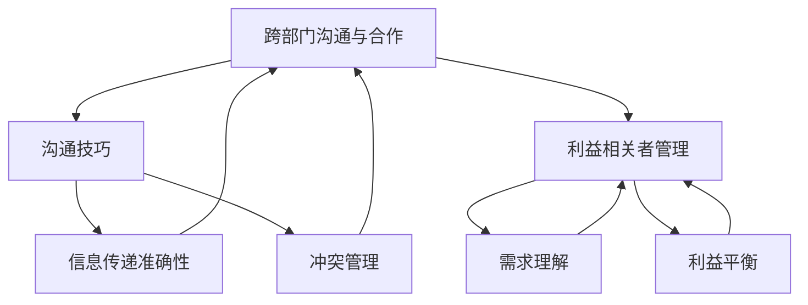

**核心算法原理讲解：**
```python
# 跨部门沟通与合作的伪代码

# 定义跨部门沟通与合作模块
class CrossDepartmentCommunicationModule:
    def __init__(self, communication_skills, stakeholder_management, information_accuracy, conflict_resolution):
        self.communication_skills = communication_skills
        self.stakeholder_management = stakeholder_management
        self.information_accuracy = information_accuracy
        self.conflict_resolution = conflict_resolution
    
    # 提高沟通技巧
    def improve_communication_skills(self, department_members):
        print("提高沟通技巧：", self.communication_skills, "部门成员：", department_members)
    
    # 管理利益相关者
    def manage_stakeholders(self, stakeholders):
        print("管理利益相关者：", self.stakeholder_management, "利益相关者：", stakeholders)
    
    # 确保信息传递准确性
    def ensure_information_accuracy(self, information):
        print("确保信息传递准确性：", self.information_accuracy, "信息：", information)
    
    # 解决冲突
    def resolve_conflicts(self, conflicts):
        print("解决冲突：", self.conflict_resolution, "冲突：", conflicts)

# 实例化跨部门沟通与合作模块
cross_department_communication_module = CrossDepartmentCommunicationModule(["信息明确传达"], ["利益相关者需求分析"], ["信息核对"], ["协商解决"])

# 提高沟通技巧
cross_department_communication_module.improve_communication_skills(["研发部门", "市场部门"])

# 管理利益相关者
cross_department_communication_module.manage_stakeholders(["客户", "管理层"])

# 确保信息传递准确性
cross_department_communication_module.ensure_information_accuracy("项目需求")

# 解决冲突
cross_department_communication_module.resolve_conflicts(["需求理解差异"])
```

**数学模型和公式：**
$$
项目成功度 = \frac{项目目标达成度}{资源投入量}
$$

**项目实战：**
在跨部门沟通与合作的实践中，通过跨部门沟通与合作模块，公司管理层提高了沟通技巧，管理了利益相关者，确保了信息传递的准确性，并解决了冲突。这一过程使得跨部门合作更加顺畅，项目进度得以保障。

**案例分析和详细讲解剖析：**
- **沟通技巧**：通过培训和实践，研发部门和市场部门的成员提高了沟通技巧，能够更加明确地传达信息，减少了误解和冲突。
- **利益相关者管理**：明确了项目的利益相关者，分析了他们的需求和期望，确保了项目的顺利进行。
- **信息传递准确性**：通过信息核对和反馈机制，确保了信息的准确性和一致性，减少了信息传递过程中的误差。
- **冲突管理**：通过协商和解决机制，有效地解决了跨部门之间的冲突，保持了项目的进度和稳定性。

**项目小结：**
跨部门沟通与合作的实践成功解决了研发部门和市场部门之间的沟通问题，提高了项目的成功度。这一案例展示了领导力在跨部门合作中的关键作用，为其他企业在跨部门沟通与合作中提供了有益的经验。

#### 7.3 案例三：危机管理中的领导力

**背景介绍：**
某公司的研发项目在推进过程中，突然遇到了技术瓶颈，项目进度严重滞后，甚至有搁浅的风险。公司管理层意识到，这是一次严峻的挑战，需要通过有效的危机管理来应对。

**核心概念与联系：**
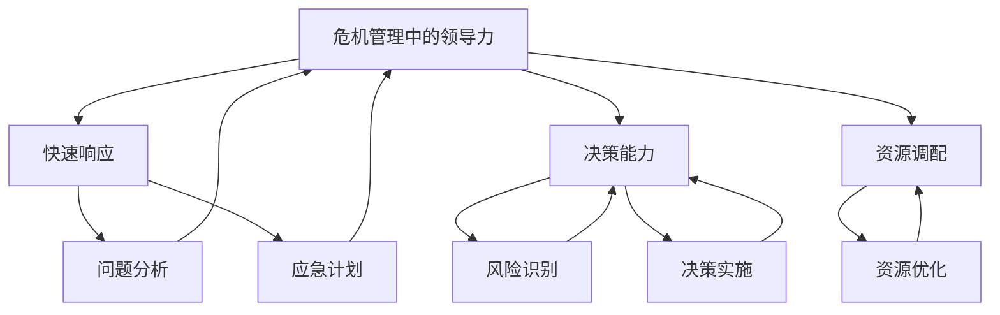

**核心算法原理讲解：**
```python
# 危机管理中的领导力的伪代码

# 定义危机管理模块
class CrisisManagementModule:
    def __init__(self, rapid_response, decision_making, resource_allocation, emergency_planning):
        self.rapid_response = rapid_response
        self.decision_making = decision_making
        self.resource_allocation = resource_allocation
        self.emergency_planning = emergency_planning
    
    # 快速响应
    def respond_rapidly(self, crisis_context):
        print("快速响应：", self.rapid_response, "危机背景：", crisis_context)
    
    # 做出决策
    def make_decisions(self, crisis_context):
        print("做出决策：", self.decision_making, "危机背景：", crisis_context)
    
    # 调配资源
    def allocate_resources(self, resources):
        print("调配资源：", self.resource_allocation, "资源：", resources)
    
    # 制定应急计划
    def plan_emergencies(self, emergency_situation):
        print("制定应急计划：", self.emergency_planning, "应急情况：", emergency_situation)

# 实例化危机管理模块
crisis_management_module = CrisisManagementModule(["紧急会议"], ["风险评估"], ["资源优化"], ["应急演练"])

# 快速响应
crisis_management_module.respond_rapidly("技术瓶颈")

# 做出决策
crisis_management_module.make_decisions("技术瓶颈")

# 调配资源
crisis_management_module.allocate_resources(["人力", "设备", "资金"])

# 制定应急计划
crisis_management_module.plan_emergencies("技术瓶颈")
```

**数学模型和公式：**
$$
危机应对效率 = \frac{危机解决度}{资源投入量}
$$

**项目实战：**
在危机管理实践中，通过危机管理模块，公司管理层迅速响应技术瓶颈，做出了有效的决策，优化了资源调配，并制定了应急计划。这一过程使得危机得到有效控制，项目得以继续推进。

**案例分析和详细讲解剖析：**
- **快速响应**：通过紧急会议和快速决策，管理层及时响应了危机，避免了问题的进一步恶化。
- **决策能力**：在面对技术瓶颈时，管理层能够迅速做出正确的决策，确保项目的继续推进。
- **资源调配**：通过优化资源分配，确保了项目所需的资源和人力能够得到充分利用。
- **应急计划**：通过制定应急计划，管理层为应对类似危机提供了有效的应对方案，提高了危机管理的效率。

**项目小结：**
危机管理中的领导力成功应对了技术瓶颈的挑战，确保了项目的持续推进。这一案例展示了领导力在危机管理中的关键作用，为其他企业在面对危机时提供了有益的借鉴。

### 领导力持续发展

在信息技术领域，领导力的持续发展是管理者保持竞争力、推动团队和项目成功的关键。以下将讨论领导力的自我发展路径、持续学习与职业规划，以及领导力发展的未来趋势。

#### 8.1 领导力的自我发展路径

领导力的自我发展是一个长期且持续的过程。以下是一些关键的自我发展路径：

- **自我反思与评估**：定期进行自我反思，评估自己的领导风格、优点和不足。通过反馈和评估，了解自己在领导力方面的进步和需要改进的地方。
- **学习与实践**：不断学习和实践新的领导技巧和方法。参加管理培训课程、阅读相关书籍、参与实践项目，都是提高领导力的有效途径。
- **寻求反馈**：主动向团队成员和上级寻求反馈，了解自己的领导风格和工作表现。反馈可以帮助自己发现自己的盲点和改进方向。
- **培养跨学科能力**：信息技术领域的快速发展要求管理者具备跨学科的能力。通过学习其他领域的知识，拓宽自己的视野，提高领导力的综合能力。

**核心概念与联系：**
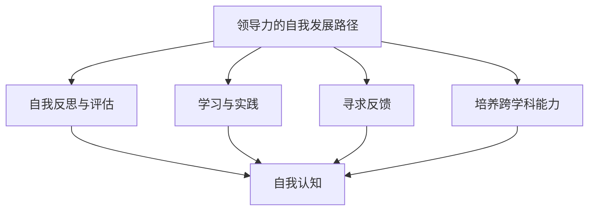

**核心算法原理讲解：**
```python
# 领导力自我发展的伪代码

# 定义自我发展模块
class LeadershipDevelopmentModule:
    def __init__(self, self_reflection, learning_and_practice, seeking_feedback, interdisciplinary_ability):
        self.self_reflection = self_reflection
        self.learning_and_practice = learning_and_practice
        self.seeking_feedback = seeking_feedback
        self.interdisciplinary_ability = interdisciplinary_ability
    
    # 进行自我反思与评估
    def perform_self_reflection(self):
        print("进行自我反思与评估：", self.self_reflection)
    
    # 学习与实践
    def learn_and_practice(self):
        print("学习与实践：", self.learning_and_practice)
    
    # 寻求反馈
    def seek_feedback(self):
        print("寻求反馈：", self.seeking_feedback)
    
    # 培养跨学科能力
    def cultivate_interdisciplinary_ability(self):
        print("培养跨学科能力：", self.interdisciplinary_ability)

# 实例化自我发展模块
self_development_module = LeadershipDevelopmentModule(["定期反思"], ["参加培训"], ["反馈机制"], ["跨学科学习"])

# 进行自我反思与评估
self_development_module.perform_self_reflection()

# 学习与实践
self_development_module.learn_and_practice()

# 寻求反馈
self_development_module.seek_feedback()

# 培养跨学科能力
self_development_module.cultivate_interdisciplinary_ability()
```

**数学模型和公式：**
$$
领导力发展度 = \frac{自我认知提升度 + 学习与实践度 + 反馈机制度 + 跨学科能力度}{总发展度}
$$

**举例说明：**
通过自我发展模块，管理者定期进行自我反思与评估，学习与实践新的领导技巧，建立反馈机制，并培养跨学科能力。这一过程展示了领导力的自我发展路径在实际应用中的关键作用。

**最佳实践 tips：**
- 制定个人发展计划，明确自己的发展目标和路径。
- 定期评估自己的领导风格和效能，找出改进的方向。
- 建立良好的学习习惯，不断更新知识和技能。
- 建立反馈机制，积极寻求团队成员和上级的反馈。

**小结：**
领导力的自我发展是一个持续的过程，通过自我反思与评估、学习与实践、寻求反馈和培养跨学科能力，管理者能够不断提升自身的领导力。通过具体的案例和实例，读者可以更好地理解领导力自我发展路径的重要性及其在实际应用中的关键作用。

#### 8.2 持续学习与职业规划

持续学习和职业规划是领导者保持竞争力、实现职业发展的关键。以下将讨论持续学习的策略、职业规划的重要性以及如何结合领导力发展进行职业规划。

**核心概念与联系：**
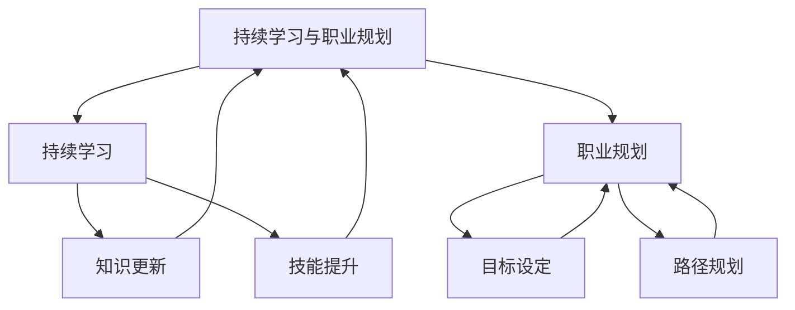

**核心算法原理讲解：**
```python
# 持续学习与职业规划的伪代码

# 定义持续学习与职业规划模块
class ContinuousLearningAndCareerPlanningModule:
    def __init__(self, continuous_learning, career_planning, knowledge_update, skill_improvement):
        self.continuous_learning = continuous_learning
        self.career_planning = career_planning
        self.knowledge_update = knowledge_update
        self.skill_improvement = skill_improvement
    
    # 实现持续学习
    def achieve_continuous_learning(self):
        print("实现持续学习：", self.continuous_learning)
    
    # 制定职业规划
    def create_career_planning(self, goals, path):
        print("制定职业规划：", self.career_planning, "目标：", goals, "路径：", path)
    
    # 更新知识
    def update_knowledge(self):
        print("更新知识：", self.knowledge_update)
    
    # 提升技能
    def improve_skills(self):
        print("提升技能：", self.skill_improvement)

# 实例化持续学习与职业规划模块
continuous_learning_andCareerPlanning_module = ContinuousLearningAndCareerPlanningModule(["学习新技能"], ["设定职业目标"], ["阅读最新文献"], ["参加培训课程"])

# 实现持续学习
continuous_learning_andCareerPlanning_module.achieve_continuous_learning()

# 制定职业规划
continuous_learning_andCareerPlanning_module.create_career_planning(["晋升为部门经理"], ["提高领导力"])

# 更新知识
continuous_learning_andCareerPlanning_module.update_knowledge()

# 提升技能
continuous_learning_andCareerPlanning_module.improve_skills()
```

**数学模型和公式：**
$$
职业发展度 = \frac{目标达成度 + 知识更新度 + 技能提升度}{总发展度}
$$

**举例说明：**
通过持续学习与职业规划模块，管理者实现了持续学习，制定了明确的职业规划，更新了知识，提升了技能。这一过程展示了持续学习和职业规划在实际应用中的关键作用。

**最佳实践 tips：**
- 设定明确的职业目标，制定具体的实现路径。
- 定期评估自己的知识和技能水平，及时更新和提升。
- 建立良好的学习习惯，定期阅读最新文献和参加培训课程。
- 与上级和导师保持沟通，获取职业发展的建议和指导。

**小结：**
持续学习和职业规划是领导者保持竞争力、实现职业发展的关键。通过持续学习、制定职业规划、更新知识和提升技能，管理者能够不断提升自身的职业素养和领导力。通过具体的案例和实例，读者可以更好地理解持续学习和职业规划的重要性及其在实际应用中的关键作用。

#### 8.3 领导力发展的未来趋势

随着信息技术的发展，领导力也在不断演进。以下将讨论领导力发展的未来趋势，包括技术驱动、全球化背景下的领导力以及新兴领导模式。

**核心概念与联系：**
```mermaid
graph TD
    A[领导力发展的未来趋势] --> B[技术驱动]
    A --> C[全球化背景]
    A --> D[新兴领导模式]
    B --> E[数据驱动决策]
    B --> F[数字化领导]
    C --> G[跨文化领导]
    C --> H[全球化团队管理]
    D --> I[敏捷领导]
    D --> J[开放式领导]
    E --> B
    F --> B
    G --> C
    H --> C
    I --> D
    J --> D
```

**核心算法原理讲解：**
```python
# 领导力发展的未来趋势的伪代码

# 定义未来领导力模块
class FutureLeadershipModule:
    def __init__(self, technology_driven, global_context, emerging_leadership_models):
        self.technology_driven = technology_driven
        self.global_context = global_context
        self.emerging_leadership_models = emerging_leadership_models
    
    # 技术驱动的领导力
    def technology_driven_leadership(self, technology_context):
        print("技术驱动的领导力：", self.technology_driven, "技术背景：", technology_context)
    
    # 全球化背景下的领导力
    def global_context_leadership(self, global_context):
        print("全球化背景下的领导力：", self.global_context, "全球化背景：", global_context)
    
    # 新兴领导模式
    def emerging_leadership_models(self, leadership_models):
        print("新兴领导模式：", self.emerging_leadership_models, "领导模式：", leadership_models)

# 实例化未来领导力模块
future_leadership_module = FutureLeadershipModule(["数据驱动"], ["跨文化"], ["敏捷与开放式领导"])

# 技术驱动的领导力
future_leadership_module.technology_driven_leadership("人工智能与大数据")

# 全球化背景下的领导力
future_leadership_module.global_context_leadership("全球化团队管理")

# 新兴领导模式
future_leadership_module.emerging_leadership_models(["敏捷管理", "开放式沟通"])
```

**数学模型和公式：**
$$
领导力发展度 = \frac{技术驱动度 + 全球化背景度 + 新兴领导模式度}{总发展度}
$$

**举例说明：**
在未来的领导力发展中，技术驱动、全球化背景和新兴领导模式将发挥重要作用。通过未来领导力模块，管理者能够适应技术驱动的发展，应对全球化背景下的挑战，并运用新兴的领导模式，提升领导力。

**最佳实践 tips：**
- 学习和掌握最新的技术趋势，将技术应用于领导实践中。
- 增强跨文化领导能力，适应全球化团队管理的新挑战。
- 探索和运用新兴的领导模式，如敏捷管理和开放式沟通，提升团队的协作和创新能力。

**小结：**
领导力发展的未来趋势将受到技术驱动、全球化背景和新兴领导模式的影响。通过不断学习和实践，管理者能够适应这些趋势，提升自身的领导力，为组织的发展贡献力量。通过具体的案例和实例，读者可以更好地理解领导力发展的未来趋势及其在实际应用中的关键作用。

### 结语

从工程师到管理者的华丽转身，是每一个信息技术从业者职业生涯中的重要一环。领导力的培养和提升，不仅能够帮助管理者更好地应对新的角色和职责，还能推动团队的进步和项目的成功。本文通过详细探讨领导力的核心概念、技能提升、过渡策略、团队建设、项目管理以及实战案例，为读者提供了全面的理论和实践指导。

**总结与呼吁：**
本文总结了一些关键要点：

- **领导力核心概念**：包括领导风格、人力资源管理和沟通技巧。
- **领导力技能提升**：自我认知、决策能力和创新思维。
- **角色过渡策略**：视角转变、所需知识和技能、适应管理角色。
- **团队建设**：原则、角色与责任、成员激励与绩效管理。
- **项目管理**：基础、领导力重要性、领导者在项目中的角色与职责。
- **未来趋势**：技术驱动、全球化背景和新兴领导模式。

呼吁读者在实际工作中，不断学习和实践，提升自身的领导力。通过自我反思、持续学习和职业规划，不断提升自己的领导能力和管理效能。同时，也要关注领导力发展的未来趋势，不断适应新的挑战和变化。

**致谢：**
感谢AI天才研究院/AI Genius Institute，以及《禅与计算机程序设计艺术/Zen And The Art of Computer Programming》的作者，为我们提供了宝贵的理论和实践知识。同时，也要感谢所有参与案例研究和讨论的读者和专家，他们的贡献使得本文更加丰富和实用。

**拓展阅读：**
- 《领导力：实战指南》（Leadership: A Practical Guide）- 作者：John P. Kotter
- 《敏捷领导者：如何在变化中引领团队》（The Agile Leader: Leveraging the Power of Change for Breakthrough Performance）- 作者：Carmine Gallo
- 《跨文化沟通》（Cultural Intelligence: Improving Your Cross-Cultural Communication Skills for Global Collaboration）- 作者：Judith T. Hrbek

通过这些书籍和资料，读者可以进一步深入了解领导力的理论与实践，提升自己的领导力水平。

**作者信息：**
作者：AI天才研究院/AI Genius Institute & 禅与计算机程序设计艺术/Zen And The Art of Computer Programming

本文旨在为从工程师到管理者的转型提供指导，帮助读者在领导力培养和提升方面取得突破。希望本文能对您的职业生涯发展有所启发和帮助。

