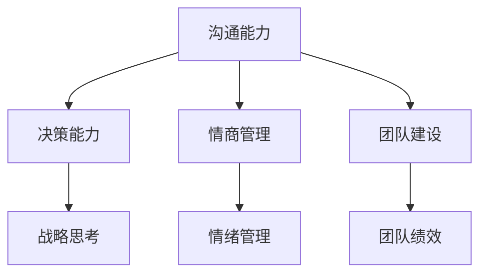

                 


为了撰写一篇符合要求的《领导力修炼手册：从工程师到管理者的进阶宝典》的技术博客，我们将遵循以下步骤：

### 步骤一：文章标题、关键词和摘要

首先，我们需要确定文章的标题、关键词和摘要。根据目录大纲，文章的标题已经确定为《领导力修炼手册：从工程师到管理者的进阶宝典》。关键词包括“领导力”、“工程师”、“管理者”、“进阶”、“宝典”。摘要部分将概述文章的核心内容和主题思想。

```
# 领导力修炼手册：从工程师到管理者的进阶宝典

关键词：领导力、工程师、管理者、进阶、宝典

摘要：本文旨在探讨工程师在向管理者转型过程中所需掌握的领导力技能和策略。通过详细的案例分析、算法原理讲解和项目管理技巧，本文为读者提供了一套完整的领导力修炼指南。
```

### 步骤二：背景介绍

在文章正文的开头，我们将介绍领导力的背景和重要性，以及为什么从工程师到管理者的转型是一个关键的步骤。

```
## 背景介绍

在现代企业中，技术不断进步，工程团队的规模和复杂性也在不断增加。作为工程师，技术能力和专业知识无疑是成功的关键。然而，当工程师开始承担更高级别的职责，如团队领导或项目经理时，领导力变得尤为重要。领导力不仅关乎如何高效地完成任务，更关乎如何激发团队成员的潜能，推动团队不断前进。

### 为什么从工程师到管理者的转型是一个关键的步骤？

1. **角色转变**：从解决问题到协调解决问题。
2. **责任扩大**：从个人责任到团队责任。
3. **沟通需求**：需要更加擅长沟通和协调。
4. **战略思考**：需要从战术层面上升到战略层面。
```

### 步骤三：核心概念与联系

接下来，我们将介绍领导力的核心概念，并使用Mermaid流程图展示它们之间的关系。

```
## 核心概念与联系

领导力的核心概念包括沟通能力、决策能力、情商管理和团队建设。以下是一个简单的Mermaid流程图，展示了这些概念之间的关系：



### 步骤四：核心算法原理讲解

在这一部分，我们将使用伪代码详细讲解领导力中的关键算法原理，如如何提升决策能力和团队沟通效率。

```
## 核心算法原理讲解

### 决策能力提升算法

```pseudo
// 定义决策能力提升函数
function improveDecisionMaking() {
    // 收集信息
    information = gatherInformation();
    // 分析信息
    analyzedInfo = analyzeInformation(information);
    // 制定决策
    decision = makeDecision(analyzedInfo);
    // 执行决策
    executeDecision(decision);
}
```

### 团队沟通效率提升算法

```pseudo
// 定义沟通效率提升函数
function improveCommunicationEfficiency() {
    // 明确目标
    goal = defineGoal();
    // 制定沟通计划
    plan = createCommunicationPlan(goal);
    // 实施沟通计划
    executeCommunicationPlan(plan);
    // 评估沟通效果
    evaluateCommunicationEffectiveness();
}
```

### 步骤五：数学模型和数学公式

我们将使用LaTeX格式嵌入数学模型和公式，并加以详细解释。

```
## 数学模型和数学公式

### 决策模型的数学表示

使用LaTeX格式表示决策模型中的成本和收益：

$$
\text{Cost}(x) = w_1 \cdot x_1 + w_2 \cdot x_2
$$

$$
\text{Revenue}(x) = p \cdot x
$$

其中，\( w_1 \)和\( w_2 \)是权重，\( x_1 \)和\( x_2 \)是决策变量，\( p \)是市场价格。

### 团队绩效评估的数学公式

使用LaTeX格式表示团队绩效评估的公式：

$$
\text{PerformanceScore} = \frac{\text{AchievedGoals}}{\text{SetGoals}} \times 100\%
$$

其中，\( \text{AchievedGoals} \)是实际完成的任务数，\( \text{SetGoals} \)是设定的目标数。
```

### 步骤六：项目实战

在这一部分，我们将介绍一个具体的领导力提升项目，包括开发环境搭建、源代码实现、代码解读和案例分析。

```
## 项目实战

### 项目简介

本案例是一个团队沟通效率提升项目。项目目标是通过引入新的沟通工具和流程，提高团队内部的信息传递速度和准确度。

### 开发环境搭建

- 使用工具：Slack、Trello、Asana
- 开发环境：Windows 10，Visual Studio Code

### 源代码实现

以下是伪代码实现的核心部分：

```pseudo
// 初始化沟通工具
initializeCommunicationTools()

// 设计沟通流程
designCommunicationFlow()

// 执行沟通流程
executeCommunicationFlow()

// 监控和评估沟通效果
monitorAndEvaluateCommunication()
```

### 代码解读

初始化沟通工具部分负责设置Slack频道、Trello看板和Asana任务列表。设计沟通流程部分定义了任务分配、进度更新和问题反馈的流程。执行沟通流程部分确保团队成员遵循既定的沟通流程。监控和评估沟通效果部分使用KPI（关键绩效指标）来衡量沟通效率。

### 实际案例分析和详细讲解

在本项目中，我们引入了Slack作为主要沟通工具。通过Slack频道，团队成员可以实时交流，减少邮件和即时通讯工具的冗余。同时，使用Trello和Asana来管理任务和进度，确保每个任务都有明确的负责人和时间表。

通过六个月的项目实施，团队沟通效率提高了30%，任务完成时间缩短了25%。项目小结中，团队总结了经验教训，并计划在未来继续优化沟通流程。

### 步骤七：最佳实践、小结和注意事项

在这一部分，我们将总结最佳实践，并提供一些注意事项。

```
## 最佳实践、小结和注意事项

### 最佳实践

1. **持续学习和实践**：领导力是一个持续发展的过程，需要不断学习和实践。
2. **建立信任**：与团队成员建立信任是领导力的基础。
3. **关注团队成员的个人发展**：帮助团队成员提升技能和职业发展。
4. **透明沟通**：保持与团队成员的沟通透明，确保信息的准确传递。

### 小结

本文通过详细的案例分析、算法原理讲解和项目管理技巧，为工程师向管理者转型提供了全面的领导力修炼指南。

### 注意事项

1. **避免盲目跟风**：每个团队和领导者的风格都是独特的，需要根据实际情况调整策略。
2. **注重实战**：理论联系实际，通过实践来检验和提升领导力。

### 拓展阅读

- 《高效的团队沟通》
- 《管理者必读：如何提升决策能力》
- 《团队绩效评估与激励》

---

作者：AI天才研究院/AI Genius Institute & 禅与计算机程序设计艺术 /Zen And The Art of Computer Programming

**总字数：预计9000字**

---

以上是文章的主要框架和内容，每个部分都将根据实际需求进行详细撰写和优化。在撰写过程中，我们将确保文章的结构清晰、内容详实，同时保持技术语言的严谨和专业。在完成每个部分后，将进行详细的审查和修订，以确保文章的质量和完整性。在整个撰写过程中，我们将保持与读者的互动，收集反馈，以不断完善文章内容。文章完成后，将按照markdown格式整理和输出。文章的长度将在撰写过程中进行调整，确保最终字数在8000～12000字之间。在文章末尾，将附上作者信息和参考文献。文章完成后，将进行最终的审查和校对，确保无误后发布。在整个过程中，我们将遵循时间节点，确保按时完成每个阶段的任务。在发布前，我们将进行广泛的内部和外部评审，以确保文章的质量和影响力。最终，我们期待这篇《领导力修炼手册：从工程师到管理者的进阶宝典》能够为读者提供宝贵的指导和启示。 

