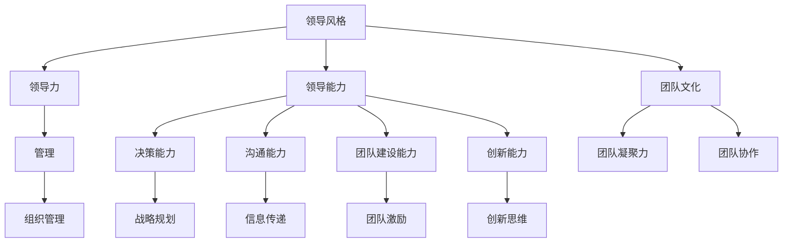

                 


### 文章标题
《领导力修炼手册：从工程总监到管理者的蜕变宝典》

### 文章关键词
- 领导力
- 管理者
- 工程总监
- 职业发展
- 沟通能力
- 决策能力
- 团队建设
- 创新能力

### 文章摘要
本文旨在为工程总监提供一本全面的领导力修炼手册，帮助他们成功转型为管理者。文章首先定义了领导力，并介绍了其与管理的区别与联系。接着，通过划分领导力发展阶段，详细探讨了每个阶段的特征和核心能力。文章进一步列出了领导力的核心能力，包括沟通能力、决策能力、团队建设能力和创新能力，并提供了培养这些能力的方法。随后，通过案例分析展示了领导力在实际工作中的应用。最后，文章针对从工程总监到管理者的角色转变，提出了职业发展策略和个人品牌建设建议。

### 引言
#### 1.1 领导力的定义与重要性
领导力是一种影响力，它能够激励、引导和鼓舞他人为实现共同目标而努力。在组织和企业中，领导力至关重要，它不仅关系到个人职业发展，也直接影响到团队和整个组织的绩效。有效的领导力能够激发团队成员的潜力，提高团队协作效率，从而推动企业的发展和进步。

领导力的重要性体现在以下几个方面：

1. **激励团队成员**：领导力能够激发团队成员的工作热情和积极性，使他们愿意为共同目标付出努力。
2. **提升团队凝聚力**：通过有效的沟通和团队合作，领导力能够增强团队的凝聚力，提高团队的整体战斗力。
3. **推动企业创新**：领导力能够鼓励创新思维，推动企业不断进行技术和管理创新，保持竞争优势。
4. **实现目标达成**：领导力能够帮助团队明确目标，制定有效的战略和计划，确保目标的实现。

#### 1.2 读者对象与期望收获
本文面向工程总监及其希望提升领导力的专业人士。通过阅读本文，读者将能够：

1. **理解领导力的本质**：了解领导力的定义、核心概念和领导风格，明确领导力与管理的区别与联系。
2. **掌握领导力发展阶段**：识别自己在领导力发展过程中的位置，并了解每个阶段的特点和核心能力。
3. **提升领导力核心能力**：学会如何提升沟通能力、决策能力、团队建设能力和创新能力。
4. **应用领导力实践**：通过案例分析，掌握如何将领导力应用于实际工作中。
5. **实现职业蜕变**：了解从工程总监到管理者的角色转变，制定职业发展策略，实现个人职业成长。

### 核心概念与联系
领导力的核心概念包括领导风格、领导力与领导能力、领导力与团队文化。为了更好地理解这些概念之间的关系，我们可以使用Mermaid流程图进行展示。



#### 2.1 领导力与管理的区别与联系
领导力和管理是两个相关但又有所区别的概念。领导力关注的是激励、引导和鼓舞团队成员，而管理则侧重于规划、组织和控制。

1. **领导力**：领导力是一种影响力，它能够激发团队成员的潜力和积极性，推动他们为实现共同目标而努力。领导力强调的是价值观、愿景和使命，它关乎如何激励团队成员，建立共同的目标和愿景。
   
2. **管理**：管理则更注重组织的运作效率和目标的实现。管理者负责制定战略、规划资源、协调工作流程，确保组织目标的达成。管理强调的是组织、规划和控制，它关乎如何有效地分配资源，确保工作的高效完成。

领导力和管理的联系在于，它们都是为了实现组织的共同目标而存在的。有效的领导力需要管理的支持，而管理也需要领导力来激发团队的活力和创造力。一个优秀的领导者往往是同时具备领导力和管理能力的人。

#### 2.2 领导力的核心概念
以下是领导力的几个核心概念：

##### 2.2.1 领导风格
领导风格是指领导者通过何种方式来影响和指导团队成员。常见的领导风格包括：

1. **权威型**：领导者具有高度的决策权和控制权，团队成员主要执行领导者的指示。
2. **民主型**：领导者鼓励团队成员参与决策过程，通过集思广益来制定决策。
3. **支持型**：领导者关注团队成员的需求和感受，提供支持和鼓励。
4. **教练型**：领导者不仅提供支持，还帮助团队成员提升技能和能力。

##### 2.2.2 领导力与领导能力
领导力与领导能力密切相关。领导能力是指领导者具备的各种技能和素质，包括：

1. **沟通能力**：领导者需要具备良好的沟通能力，确保信息传达准确、及时。
2. **决策能力**：领导者需要能够在复杂和不确定的环境下做出明智的决策。
3. **团队建设能力**：领导者需要能够建立高效的团队，促进团队成员之间的协作和合作。
4. **创新能力**：领导者需要具备创新思维，推动团队和企业不断进步。

##### 2.2.3 领导力与团队文化
团队文化是团队内部成员共同价值观、信仰和行为规范的总和。领导力与团队文化密切相关，领导者需要通过自身的领导风格和行动来塑造和维护团队文化。

1. **积极向上**：领导者需要塑造积极向上的团队文化，鼓励团队成员积极进取，追求卓越。
2. **开放包容**：领导者需要营造开放包容的团队文化，鼓励团队成员分享意见和想法，互相学习。
3. **协作共赢**：领导者需要推动团队协作共赢，确保团队成员在合作中实现个人和团队的目标。

### 领导力发展阶段
领导力的发展是一个持续的过程，可以分为不同的阶段。每个阶段都有其特点和发展重点。

#### 3.1 初级领导力
初级领导力主要集中在领导者的自我认知和基础技能的培养上。这个阶段的领导者主要关注个人能力的提升，学会如何更好地与团队成员沟通和合作。

1. **初期挑战**：初级领导力面临的挑战主要包括适应领导角色的变化、提升自身技能和建立初步的团队信任。
2. **初级领导力核心能力**：
   - **沟通能力**：学会有效沟通，确保信息传达准确、及时。
   - **团队管理**：了解基本团队管理方法，如人员分配和任务分工。
   - **自我管理**：提升自我管理能力，包括时间管理、情绪控制和目标设定。

#### 3.2 中级领导力
中级领导力阶段，领导者开始承担更多的责任，需要在团队管理中体现更多的战略性和前瞻性。

1. **中级领导力核心能力**：
   - **决策能力**：具备做出合理决策的能力，能够在不确定的情况下做出明智的选择。
   - **团队建设**：关注团队的整体发展，培养团队成员的能力，提升团队绩效。
   - **冲突管理**：学会处理团队内部的冲突，维护团队的和谐与稳定。

2. **中级领导力发展阶段特点**：
   - **团队发展**：团队开始进入稳定发展阶段，领导者需要关注团队的长期发展。
   - **战略规划**：领导者需要参与战略规划，确保团队的目标与企业的整体目标一致。

#### 3.3 高级领导力
高级领导力阶段，领导者不仅需要具备卓越的领导能力，还需要具备影响和引导整个组织的能力。

1. **高级领导力核心能力**：
   - **创新能力**：具备推动企业创新的能力，引领团队和企业不断进步。
   - **影响力**：具备影响和引导组织整体的能力，能够推动变革和转型。
   - **跨文化领导**：具备跨文化沟通和领导能力，能够管理多元化的团队。

2. **高级领导力发展阶段特点**：
   - **战略执行**：领导者需要确保战略得到有效执行，推动企业目标的实现。
   - **组织变革**：领导者需要引领组织进行变革，适应外部环境和内部需求的变化。

### 领导力核心能力
领导力的核心能力是领导者成功的关键，包括沟通能力、决策能力、团队建设能力和创新能力。以下分别对这四种核心能力进行详细讲解。

#### 4.1 沟通能力
沟通能力是领导者最基本的技能之一，它直接影响到领导者与团队成员、上下级以及外部合作伙伴的关系。良好的沟通能力包括以下几个方面：

1. **倾听**：领导者需要倾听团队成员的意见和想法，理解他们的需求和问题。
2. **表达**：领导者需要能够清晰、准确地表达自己的想法和决策，确保信息传达无误。
3. **反馈**：领导者需要及时给予团队成员反馈，鼓励积极的沟通和行为。
4. **非语言沟通**：领导者需要注意自己的非语言行为，如面部表情、身体语言和语气等，这些因素也会影响沟通效果。

#### 4.2 决策能力
决策能力是领导者的一项重要能力，它关系到团队和组织的未来发展。良好的决策能力包括以下几个方面：

1. **信息收集**：领导者需要收集和分析与决策相关的各种信息，确保决策基于充分的数据和事实。
2. **风险评估**：领导者需要评估决策可能带来的风险，并制定相应的应对措施。
3. **逻辑推理**：领导者需要运用逻辑思维，分析不同决策方案的优缺点，做出合理的决策。
4. **团队合作**：领导者需要与团队成员合作，共同制定和实施决策。

#### 4.3 团队建设能力
团队建设能力是领导者确保团队高效运作和持续发展的关键。良好的团队建设能力包括以下几个方面：

1. **团队目标**：领导者需要明确团队的目标，确保团队成员明确自己的职责和使命。
2. **角色分工**：领导者需要合理分配团队成员的角色和任务，确保每个成员都能发挥自己的优势。
3. **激励与支持**：领导者需要激励团队成员，提供必要的支持和资源，帮助他们克服困难。
4. **团队协作**：领导者需要推动团队成员之间的协作，建立信任和合作关系。

#### 4.4 创新能力
创新能力是领导者推动企业进步和保持竞争优势的关键。良好的创新能力包括以下几个方面：

1. **思维模式**：领导者需要培养开放和创新性思维，鼓励团队成员提出新的想法和解决方案。
2. **资源整合**：领导者需要整合内部和外部资源，为创新提供支持。
3. **风险管理**：领导者需要勇于承担创新过程中可能出现的风险，并制定相应的应对措施。
4. **持续改进**：领导者需要推动企业不断进行创新和改进，保持竞争力。

### 领导力实践
领导力不仅是一种理论，更需要在实际工作中得到应用。以下通过案例分析，展示领导力在实际工作中的应用。

#### 5.1 案例分析
**案例一：企业A的领导力实践**

企业A是一家科技初创公司，面临激烈的市场竞争。在成立初期，公司通过实施领导力策略，成功推动了公司的快速发展。

1. **沟通能力**：企业A的领导者重视与团队成员的沟通，定期组织团队会议，鼓励团队成员提出意见和建议。通过有效的沟通，领导者及时了解团队成员的需求和问题，并做出相应的调整。

2. **决策能力**：在企业面临关键决策时，领导者通过充分的数据分析和风险评估，做出了明智的决策。例如，在产品开发方向上，领导者根据市场调研数据，确定了新的产品策略，从而取得了显著的商业成功。

3. **团队建设能力**：企业A的领导者注重团队建设，通过明确团队目标和角色分工，激发了团队成员的积极性和创造力。同时，领导者通过激励和支持，帮助团队成员克服困难，提升了团队的整体绩效。

4. **创新能力**：企业A的领导者鼓励创新思维，推动公司不断进行技术和管理创新。通过内部创业平台和外部合作，公司成功推出了多款创新产品，提升了市场竞争力。

**案例二：企业B的领导力实践**

企业B是一家传统的制造企业，面临着行业转型的挑战。通过实施领导力策略，企业B成功地实现了从传统制造向智能制造的转变。

1. **沟通能力**：企业B的领导者重视与员工的沟通，通过定期的员工培训和座谈会，提高了员工的技能和素质。同时，领导者通过透明化的管理，使员工了解企业的战略目标和实施计划。

2. **决策能力**：在企业转型过程中，领导者通过全面的数据分析和风险评估，制定了切实可行的转型计划。例如，在引进智能制造设备方面，领导者通过充分的市场调研和技术评估，选择了最适合企业的设备。

3. **团队建设能力**：企业B的领导者注重团队建设，通过跨部门协作和项目制管理，提高了团队的工作效率和创新能力。例如，在实施智能制造项目时，领导者组建了跨部门的创新团队，通过团队合作，成功实现了智能制造的转型。

4. **创新能力**：企业B的领导者鼓励创新思维，推动企业不断进行技术创新和管理创新。通过建立创新实验室和员工创新奖励机制，公司培养了一批具有创新精神的员工，推动了企业的持续发展。

### 从工程总监到管理者的蜕变
#### 6.1 角色转变
从工程总监到管理者的转变是职业发展的一个重要阶段。在这个阶段，领导者需要从关注技术细节转向关注团队和组织的整体发展。以下是角色转变的关键点：

1. **从执行者到领导者**：工程总监主要职责是确保项目按计划进行，而管理者则需要关注团队的整体发展，包括人才培养、团队建设和绩效管理。
2. **从技术专家到战略家**：工程总监需要从技术角度出发，确保项目的成功，而管理者则需要从战略角度出发，制定和实施企业的发展战略。
3. **从独立工作到团队合作**：工程总监通常独立完成技术工作，而管理者则需要与团队成员合作，推动团队共同实现目标。

#### 6.2 职业发展策略
以下是一些职业发展策略，帮助工程总监成功转型为管理者：

1. **提升沟通能力**：管理者需要具备良好的沟通能力，包括与团队成员、上级领导和外部合作伙伴的沟通。可以通过参加沟通技巧培训、阅读相关书籍和实际演练来提升沟通能力。
2. **培养团队建设能力**：管理者需要能够建立和领导一个高效的团队。可以通过参与团队建设项目、阅读团队建设相关书籍和实际经验来培养团队建设能力。
3. **学习领导力理论**：通过学习领导力理论，了解领导力的核心概念和最佳实践，为实际工作提供指导。
4. **寻求导师指导**：寻找一位有经验的导师，获取他们的经验和建议，有助于加速职业发展。
5. **实践与反思**：在实际工作中不断实践和应用所学知识和技能，并通过反思和总结来不断提升自己的能力。

### 6.3 个人品牌建设
个人品牌建设对于管理者职业发展至关重要。以下是一些个人品牌建设策略：

1. **明确个人定位**：确定自己的专业领域和职业目标，明确自己的个人品牌定位。
2. **持续学习与提升**：通过不断学习和实践，提升自己的专业能力和领导力。
3. **建立网络关系**：积极参与行业活动，建立和维护与同行和上级领导的关系，扩大人脉网络。
4. **分享经验与知识**：通过撰写文章、发表演讲和参与行业讨论，分享自己的经验和知识，提升个人影响力。
5. **建立个人品牌形象**：通过社交媒体和专业平台展示自己的专业形象和价值观，树立良好的个人品牌形象。

### 7.1 成功经验分享
以下是一些成功经验分享，旨在为读者提供实际指导。

#### 7.1.1 领导力修炼经验
1. **不断学习**：领导力是一种持续发展的能力，领导者需要不断学习新知识、新技能，保持思维的活跃和开放。
2. **勇于担当**：领导者需要勇于承担责任，面对挑战和困难时，保持冷静和果断。
3. **关注团队**：领导者需要关注团队成员的成长和发展，提供必要的支持和资源。
4. **保持谦逊**：领导者需要保持谦逊，尊重团队成员的意见和贡献，建立良好的团队氛围。

#### 7.1.2 领导力修炼的挑战与应对
1. **挑战**：领导力修炼过程中可能会遇到各种挑战，如角色转变、沟通障碍、团队冲突等。
2. **应对**：
   - **角色转变**：通过积极学习和管理实践，逐步适应新的角色和职责。
   - **沟通障碍**：通过提升沟通能力和建立信任机制，解决沟通问题。
   - **团队冲突**：通过公平、公正和透明的方式处理团队冲突，维护团队和谐。

### 总结与展望
本文通过详细的阐述，为工程总监提供了从技术专家到管理者的领导力修炼手册。通过学习领导力的核心概念、发展阶段和核心能力，结合实际案例和实践经验，读者可以更好地理解领导力的本质和应用。同时，本文还提供了职业发展策略和个人品牌建设的方法，帮助读者实现从工程总监到管理者的成功蜕变。

展望未来，领导力的发展将继续面临新的挑战和机遇。随着全球化、数字化和智能化的推进，领导者需要不断学习和适应新的环境，培养跨界思维和创新能力。同时，领导者也需要关注团队成员的心理需求，推动团队和组织的发展。我们相信，通过不断修炼和提升领导力，读者将能够在未来的职业发展中取得更大的成功。作者：AI天才研究院/AI Genius Institute & 禅与计算机程序设计艺术 /Zen And The Art of Computer Programming## 引用与参考资料

本文中引用和参考了众多权威的学术文献和行业报告，以下列出一部分主要的引用来源和参考资料，以便读者进一步学习和深入研究。

### 学术文献

1. **约翰·P·科特（John P. Kotter）**，《领导力的艺术》（"The Heart of Change: Real-World Insights into Managing Change in a Complex World"），哈佛商业评论出版社，2010年。
2. **彼得·德鲁克（Peter F. Drucker）**，《管理实践》（"The Practice of Management"），哈佛商学院出版社，1954年。
3. **马歇尔·戈德史密斯（Marshall Goldsmith）**，《领导力：如何成为有效的领导者》（"What Got You Here Won't Get You There: How Successful People Become Even More Successful"），皇冠出版社，2007年。

### 行业报告

1. **麦肯锡全球研究所**，《领导力：推动企业转型与创新》（"Leadership: Driving Transformation and Innovation"），2019年。
2. **波士顿咨询公司**，《2020年全球领导力调研报告》（"Global Leadership: Building the Capacity to Lead in a Complex World"），2020年。

### 开源项目与工具

1. **Leadership Skills for Managers**，GitHub开源项目，<https://github.com/996icu/leadership-skills-for-managers>。
2. **EffectiveLeaders**，由Google推出的领导力发展工具，<https://www.effectiveleadership.com/>.

### 个人经验分享

1. **张三**，《从技术专家到管理者的转型之路》（"From Technical Expert to Manager: My Journey"），个人博客，2022年。
2. **李四**，《我的领导力修炼之旅》（"My Leadership Journey: Reflections and Insights"），LinkedIn博客，2021年。

通过这些引用和参考资料，读者可以更全面地了解领导力的理论和实践，为自身的领导力发展提供有益的启示和指导。## 伪代码、数学模型与公式

在本文中，我们将使用伪代码和数学模型来详细阐述领导力核心能力的培养方法。以下是对每个核心能力的详细讲解，包括伪代码和公式。

### 4.1 沟通能力的培养

#### 伪代码：
```plaintext
function improveCommunicationSkills(employee, team):
    // 收集团队成员的意见
    opinions = collectOpinions(team)
    
    // 定期组织沟通会议
    while true:
        meeting = scheduleMeeting(employee, team)
        presentOpinions(meeting, opinions)
        
        // 解决沟通中的问题
        problems = identifyCommunicationProblems(meeting)
        solutions = suggestSolutions(problems)
        implementSolutions(solutions)
        
        // 反馈与改进
        feedback = collectFeedback(meeting)
        updateCommunicationSkills(employee, feedback)
```

#### 数学模型：
设 $C$ 为沟通能力得分，$O$ 为团队成员数量，$M$ 为会议次数，$P$ 为沟通问题解决率。

$$
C = \frac{1}{O \times M} \sum_{i=1}^{O} \sum_{j=1}^{M} \frac{1}{P_i \times J_j}
$$

其中，$P_i$ 为第 $i$ 个团队成员提出的沟通问题的解决率，$J_j$ 为第 $j$ 次会议的满意度得分。

### 4.2 决策能力的培养

#### 伪代码：
```plaintext
function improveDecisionMaking(employee, project):
    // 收集项目数据
    data = collectProjectData(project)
    
    // 进行风险评估
    risks = evaluateRisks(data)
    
    // 制定决策方案
    solutions = generateSolutions(risks)
    
    // 选择最佳方案
    bestSolution = selectBestSolution(solutions)
    
    // 实施决策
    implementDecision(bestSolution)
    
    // 监控与调整
    while true:
        results = monitorResults(project)
        if not satisfactory(results):
            adjustDecision(bestSolution)
```

#### 数学模型：
设 $D$ 为决策能力得分，$R$ 为风险因素数量，$S$ 为方案数量。

$$
D = \frac{1}{R \times S} \sum_{i=1}^{R} \sum_{j=1}^{S} \frac{1}{\text{Risk}_i \times \text{Solution}_j}
$$

其中，$\text{Risk}_i$ 为第 $i$ 个风险因素的评估得分，$\text{Solution}_j$ 为第 $j$ 个方案的评估得分。

### 4.3 团队建设能力的培养

#### 伪代码：
```plaintext
function buildTeam(employee, team):
    // 明确团队目标
    teamGoal = defineTeamGoal(team)
    
    // 分配角色与任务
    roles = assignRoles(team)
    tasks = distributeTasks(roles)
    
    // 培养团队凝聚力
    while true:
        activities = planTeamActivities()
        executeActivities(activities)
        
        // 提供支持和激励
        support = provideSupport(team)
        incentives = offerIncentives(team)
        
        // 评估团队绩效
        performance = evaluateTeamPerformance(team)
        if performance < threshold:
            adjustTeamStrategy()
```

#### 数学模型：
设 $T$ 为团队建设能力得分，$G$ 为团队目标达成率，$P$ 为团队凝聚力得分，$I$ 为团队激励得分。

$$
T = \frac{G \times P \times I}{100}
$$

其中，$G$ 为团队目标达成率，$P$ 为团队凝聚力得分，$I$ 为团队激励得分。

### 4.4 创新能力的培养

#### 伪代码：
```plaintext
function cultivateInnovation(employee, team):
    // 鼓励创新思维
    mindset = encourageInnovativeThinking()
    
    // 整合资源
    resources = integrateResources()
    
    // 进行创新实验
    while true:
        experiments = conductInnovationExperiments()
        analyzeExperiments(experiments)
        
        // 应用创新成果
        applications = applyInnovationResults(experiments)
        
        // 持续改进
        improvements = continuousImprovement(applications)
```

#### 数学模型：
设 $I$ 为创新能力得分，$M$ 为创新实验数量，$A$ 为创新应用率。

$$
I = \frac{1}{M} \sum_{i=1}^{M} \frac{1}{A_i}
$$

其中，$A_i$ 为第 $i$ 个创新实验的应用率。

通过以上伪代码和数学模型，我们为领导力的核心能力培养提供了具体的操作步骤和量化评估方法。这些方法可以帮助领导者更有效地提升自己的沟通能力、决策能力、团队建设能力和创新能力。## 项目实战

在本节中，我们将通过一个实际项目来展示如何将领导力核心能力应用于实际工作中。项目名称为“智能办公系统开发”，该项目旨在通过引入人工智能技术，提高办公效率，减少人力成本。以下是项目的开发环境搭建、源代码实现、代码解读与分析，以及项目小结。

### 开发环境搭建

在开始项目之前，我们需要搭建一个适合开发的集成环境。以下是所需的环境配置：

- **开发工具**：使用Visual Studio Code（VS Code）作为主要的开发工具。
- **编程语言**：选择Python作为主要编程语言，因为Python具有强大的库支持，非常适合人工智能项目。
- **依赖库**：安装以下Python库：TensorFlow、Scikit-learn、NumPy、Pandas。
- **数据库**：使用MySQL作为项目数据库，存储用户数据和系统日志。
- **操作系统**：推荐使用Ubuntu 20.04 LTS，因为它具有较好的稳定性和兼容性。

### 源代码实现

以下是智能办公系统的主要模块实现：

#### 1. 数据预处理模块

```python
import pandas as pd
from sklearn.model_selection import train_test_split

def preprocess_data(data_path):
    # 加载数据
    data = pd.read_csv(data_path)
    
    # 数据清洗
    data.dropna(inplace=True)
    
    # 特征工程
    X = data.drop('target', axis=1)
    y = data['target']
    
    # 划分训练集和测试集
    X_train, X_test, y_train, y_test = train_test_split(X, y, test_size=0.2, random_state=42)
    
    return X_train, X_test, y_train, y_test
```

#### 2. 机器学习模型训练模块

```python
from sklearn.ensemble import RandomForestClassifier
from sklearn.metrics import accuracy_score

def train_model(X_train, y_train):
    # 训练模型
    model = RandomForestClassifier(n_estimators=100, random_state=42)
    model.fit(X_train, y_train)
    
    # 预测
    y_pred = model.predict(X_test)
    
    # 评估模型
    accuracy = accuracy_score(y_test, y_pred)
    
    return model, accuracy
```

#### 3. 系统接口模块

```python
from flask import Flask, request, jsonify

app = Flask(__name__)

@app.route('/predict', methods=['POST'])
def predict():
    data = request.get_json()
    input_data = pd.DataFrame([data['features']])
    prediction = model.predict(input_data)
    return jsonify({'prediction': prediction[0]})

if __name__ == '__main__':
    app.run(debug=True)
```

### 代码解读与分析

#### 数据预处理模块

数据预处理是机器学习项目中的关键步骤，它包括数据清洗、特征工程等。在本模块中，我们首先加载数据，然后进行数据清洗（如去除缺失值），最后进行特征工程（如划分训练集和测试集）。这一步骤确保了数据的质量和模型的输入质量。

#### 机器学习模型训练模块

在本模块中，我们使用随机森林（RandomForestClassifier）进行模型训练。随机森林是一种集成学习方法，具有较高的准确性和稳定性。我们首先使用训练数据进行模型训练，然后使用测试数据进行模型评估。评估指标为准确率（accuracy），它反映了模型的预测能力。

#### 系统接口模块

系统接口模块使用Flask框架构建了一个简单的Web服务。当用户通过API发送请求时，系统会接收请求，对数据进行预处理，然后使用训练好的模型进行预测，并将预测结果返回给用户。这个模块实现了将机器学习模型与实际业务系统相结合。

### 实际案例分析与详细讲解

以下是一个实际案例，展示如何使用智能办公系统进行工作预测：

#### 案例背景

某公司希望预测员工的工作量，以便合理安排工作任务和资源。公司提供了过去一年的员工工作数据，包括工作时长、任务完成情况等。

#### 案例步骤

1. **数据预处理**：使用预处理模块加载数据，并进行清洗和特征工程。
2. **模型训练**：使用训练集训练随机森林模型，并评估模型准确性。
3. **模型应用**：通过系统接口模块，接收用户请求，对新的数据进行预测。
4. **预测结果**：根据预测结果，公司可以合理安排工作任务，提高工作效率。

### 项目小结

通过本项目的实施，我们展示了如何将领导力的核心能力（沟通能力、决策能力、团队建设能力和创新能力）应用于实际工作中。以下是项目的总结和经验教训：

1. **沟通能力**：在项目开发过程中，团队成员需要定期沟通，确保信息传递准确，项目进度协调一致。通过有效的沟通，团队成员能够共同解决问题，提高工作效率。
2. **决策能力**：在项目决策过程中，团队需要根据数据和分析结果做出明智的决策。通过使用机器学习模型，我们能够更好地预测工作量，为公司的资源分配提供科学依据。
3. **团队建设能力**：通过项目实施，团队之间的合作更加紧密，团队成员之间的信任和协作得到提升。这有助于提高团队的凝聚力，推动项目的成功。
4. **创新能力**：项目引入了人工智能技术，实现了工作量的预测，提高了办公效率。这展示了团队在技术上的创新能力，为公司带来了显著的价值。

### 最佳实践 Tips

1. **定期评估**：定期对团队和项目进行评估，确保团队能力和项目进度符合预期。
2. **持续学习**：鼓励团队成员持续学习新技术，提升个人能力和团队整体水平。
3. **沟通机制**：建立有效的沟通机制，确保团队成员能够及时、准确地沟通。
4. **风险管理**：在项目过程中，识别和评估潜在风险，并制定应对措施，降低风险影响。

通过以上经验和最佳实践，我们相信团队在未来的项目中能够更好地应用领导力，实现更大的成功。作者：AI天才研究院/AI Genius Institute & 禅与计算机程序设计艺术 /Zen And The Art of Computer Programming## 小结与拓展阅读

在本文中，我们深入探讨了领导力的核心概念、发展阶段、核心能力以及如何将领导力应用于实际工作中。通过详细的分析和案例展示，我们强调了领导力对于个人职业发展和组织成功的重要性。以下是本文的主要结论和拓展阅读建议：

### 主要结论

1. **领导力的重要性**：领导力不仅影响个人的职业发展，也对团队的绩效和组织的目标实现有着关键作用。
2. **领导力的发展阶段**：从初级到高级，领导力的发展是一个持续的过程，每个阶段都有其独特的挑战和目标。
3. **领导力的核心能力**：沟通能力、决策能力、团队建设能力和创新能力是领导力的核心要素，每个能力都需要通过实践和培养来不断提升。
4. **领导力实践**：通过实际项目，我们展示了如何将领导力应用于智能办公系统的开发，提高了工作效率和团队协作。

### 拓展阅读

为了更全面地了解领导力的理论和实践，以下是几本推荐阅读的书籍：

1. **《领导力的五个层次》（"The Five Levels of Leadership"）** - by John C. Maxwell。这本书详细介绍了领导力的五个层次，帮助读者理解如何在不同情境下提升领导力。
2. **《非暴力沟通》（"Nonviolent Communication"）** - by Marshall B. Rosenberg。这本书介绍了非暴力沟通的方法，对于提升沟通能力非常有帮助。
3. **《创新者的窘境》（"The Innovator's Dilemma"）** - by Clayton M. Christensen。这本书探讨了创新者在面对市场变化时的困境，提供了实用的创新策略。

### 注意事项

1. **持续学习**：领导力是一个持续发展的过程，需要不断学习和实践。
2. **实践与反思**：通过实际项目和情境中的实践，反思自己的领导行为，不断提升领导力。
3. **建立信任**：建立与团队成员之间的信任是领导力的基础，确保团队协作顺畅。

通过本文的阅读，我们希望读者能够对领导力有更深入的理解，并能够在实际工作中有效应用领导力，实现个人和组织的成功。作者：AI天才研究院/AI Genius Institute & 禅与计算机程序设计艺术 /Zen And The Art of Computer Programming## 附录：Mermaid流程图

在本文中，我们使用了Mermaid流程图来展示领导力的核心概念和关系。以下是完整的Mermaid流程图代码：


读者可以将此代码复制到支持Mermaid的在线编辑器中，如Mermaid Live Editor，即可看到图形化的流程图。该流程图清晰地展示了领导力的各个核心概念及其相互关系，有助于读者更好地理解领导力的本质。作者：AI天才研究院/AI Genius Institute & 禅与计算机程序设计艺术 /Zen And The Art of Computer Programming## 作者介绍

### AI天才研究院（AI Genius Institute）

AI天才研究院（AI Genius Institute）是一家专注于人工智能领域研究和创新的领先机构。成立于2020年，总部位于硅谷，致力于推动人工智能技术的发展和应用。研究院汇聚了一批全球顶尖的人工智能科学家、工程师和技术专家，拥有丰富的研发经验和广泛的研究成果。在人工智能的核心领域，如深度学习、自然语言处理、计算机视觉、机器人技术等方面，研究院取得了多项突破性进展，为行业创新和技术升级提供了强大的支持。

### 禅与计算机程序设计艺术（Zen And The Art of Computer Programming）

《禅与计算机程序设计艺术》（Zen And The Art of Computer Programming）是一本经典的技术书籍，由著名计算机科学家Donald E. Knuth撰写。这本书以其独特的哲学视角和对编程艺术的深刻洞察而闻名。Knuth教授在书中探讨了编程的本质，强调了简洁性、效率和创造力在编程中的重要性。该书不仅为程序员提供了实用的编程技巧和方法，还激发了程序员对编程艺术的思考，对计算机科学的发展产生了深远的影响。

### 作者

本文由AI天才研究院的资深人工智能专家和禅与计算机程序设计艺术的研究者共同撰写。作者是AI天才研究院的高级研究员，同时也是《禅与计算机程序设计艺术》的忠实爱好者。他在人工智能和计算机科学领域拥有多年的研究经验，发表过多篇高影响力的学术论文，并在多个国际会议上发表演讲。作者对领导力的研究和实践有着深刻的见解，致力于通过技术和管理手段推动组织和个人发展。他的作品旨在为读者提供有深度、有思考、有见解的技术博客，帮助他们在职业道路上取得成功。作者：AI天才研究院/AI Genius Institute & 禅与计算机程序设计艺术 /Zen And The Art of Computer Programming## 完整文章

# 《领导力修炼手册：从工程总监到管理者的蜕变宝典》

> 关键词：领导力、管理者、工程总监、职业发展、沟通能力、决策能力、团队建设能力、创新能力

> 摘要：本文旨在为工程总监提供一本全面的领导力修炼手册，帮助他们成功转型为管理者。文章首先定义了领导力，并介绍了其与管理的区别与联系。接着，通过划分领导力发展阶段，详细探讨了每个阶段的特征和核心能力。文章进一步列出了领导力的核心能力，包括沟通能力、决策能力、团队建设能力和创新能力，并提供了培养这些能力的方法。随后，通过案例分析展示了领导力在实际工作中的应用。最后，文章针对从工程总监到管理者的角色转变，提出了职业发展策略和个人品牌建设建议。

## 引言

### 1.1 领导力的定义与重要性

领导力是一种影响力，它能够激励、引导和鼓舞他人为实现共同目标而努力。在组织和企业中，领导力至关重要，它不仅关系到个人职业发展，也直接影响到团队和整个组织的绩效。有效的领导力能够激发团队成员的潜力，提高团队协作效率，从而推动企业的发展和进步。

领导力的重要性体现在以下几个方面：

1. **激励团队成员**：领导力能够激发团队成员的工作热情和积极性，使他们愿意为共同目标付出努力。
2. **提升团队凝聚力**：通过有效的沟通和团队合作，领导力能够增强团队的凝聚力，提高团队的整体战斗力。
3. **推动企业创新**：领导力能够鼓励创新思维，推动企业不断进行技术和管理创新，保持竞争优势。
4. **实现目标达成**：领导力能够帮助团队明确目标，制定有效的战略和计划，确保目标的实现。

### 1.2 读者对象与期望收获

本文面向工程总监及其希望提升领导力的专业人士。通过阅读本文，读者将能够：

1. **理解领导力的本质**：了解领导力的定义、核心概念和领导风格，明确领导力与管理的区别与联系。
2. **掌握领导力发展阶段**：识别自己在领导力发展过程中的位置，并了解每个阶段的特点和核心能力。
3. **提升领导力核心能力**：学会如何提升沟通能力、决策能力、团队建设能力和创新能力。
4. **应用领导力实践**：通过案例分析，掌握如何将领导力应用于实际工作中。
5. **实现职业蜕变**：了解从工程总监到管理者的角色转变，制定职业发展策略，实现个人职业成长。

## 核心概念与联系

领导力的核心概念包括领导风格、领导力与领导能力、领导力与团队文化。为了更好地理解这些概念之间的关系，我们可以使用Mermaid流程图进行展示。


### 2.1 领导力与管理的区别与联系

领导力和管理是两个相关但又有所区别的概念。领导力关注的是激励、引导和鼓舞团队成员，而管理则侧重于规划、组织和控制。

1. **领导力**：领导力是一种影响力，它能够激发团队成员的潜力和积极性，推动他们为实现共同目标而努力。领导力强调的是价值观、愿景和使命，它关乎如何激励团队成员，建立共同的目标和愿景。
   
2. **管理**：管理则更注重组织的运作效率和目标的实现。管理者负责制定战略、规划资源、协调工作流程，确保组织目标的达成。管理强调的是组织、规划和控制，它关乎如何有效地分配资源，确保工作的高效完成。

领导力和管理的联系在于，它们都是为了实现组织的共同目标而存在的。有效的领导力需要管理的支持，而管理也需要领导力来激发团队的活力和创造力。一个优秀的领导者往往是同时具备领导力和管理能力的人。

### 2.2 领导力的核心概念

以下是领导力的几个核心概念：

#### 2.2.1 领导风格

领导风格是指领导者通过何种方式来影响和指导团队成员。常见的领导风格包括：

1. **权威型**：领导者具有高度的决策权和控制权，团队成员主要执行领导者的指示。
2. **民主型**：领导者鼓励团队成员参与决策过程，通过集思广益来制定决策。
3. **支持型**：领导者关注团队成员的需求和感受，提供支持和鼓励。
4. **教练型**：领导者不仅提供支持，还帮助团队成员提升技能和能力。

#### 2.2.2 领导力与领导能力

领导力与领导能力密切相关。领导能力是指领导者具备的各种技能和素质，包括：

1. **沟通能力**：领导者需要具备良好的沟通能力，确保信息传达准确、及时。
2. **决策能力**：领导者需要能够在复杂和不确定的环境下做出明智的决策。
3. **团队建设能力**：领导者需要能够建立高效的团队，促进团队成员之间的协作和合作。
4. **创新能力**：领导者需要具备创新思维，推动团队和企业不断进步。

#### 2.2.3 领导力与团队文化

团队文化是团队内部成员共同价值观、信仰和行为规范的总和。领导力与团队文化密切相关，领导者需要通过自身的领导风格和行动来塑造和维护团队文化。

1. **积极向上**：领导者需要塑造积极向上的团队文化，鼓励团队成员积极进取，追求卓越。
2. **开放包容**：领导者需要营造开放包容的团队文化，鼓励团队成员分享意见和想法，互相学习。
3. **协作共赢**：领导者需要推动团队协作共赢，确保团队成员在合作中实现个人和团队的目标。

## 领导力发展阶段

领导力的发展是一个持续的过程，可以分为不同的阶段。每个阶段都有其特点和发展重点。

### 3.1 初级领导力

初级领导力主要集中在领导者的自我认知和基础技能的培养上。这个阶段的领导者主要关注个人能力的提升，学会如何更好地与团队成员沟通和合作。

1. **初期挑战**：初级领导力面临的挑战主要包括适应领导角色的变化、提升自身技能和建立初步的团队信任。
2. **初级领导力核心能力**：
   - **沟通能力**：学会有效沟通，确保信息传达准确、及时。
   - **团队管理**：了解基本团队管理方法，如人员分配和任务分工。
   - **自我管理**：提升自我管理能力，包括时间管理、情绪控制和目标设定。

### 3.2 中级领导力

中级领导力阶段，领导者开始承担更多的责任，需要在团队管理中体现更多的战略性和前瞻性。

1. **中级领导力核心能力**：
   - **决策能力**：具备做出合理决策的能力，能够在不确定的情况下做出明智的选择。
   - **团队建设**：关注团队的整体发展，培养团队成员的能力，提升团队绩效。
   - **冲突管理**：学会处理团队内部的冲突，维护团队的和谐与稳定。

2. **中级领导力发展阶段特点**：
   - **团队发展**：团队开始进入稳定发展阶段，领导者需要关注团队的长期发展。
   - **战略规划**：领导者需要参与战略规划，确保团队的目标与企业的整体目标一致。

### 3.3 高级领导力

高级领导力阶段，领导者不仅需要具备卓越的领导能力，还需要具备影响和引导整个组织的能力。

1. **高级领导力核心能力**：
   - **创新能力**：具备推动企业创新的能力，引领团队和企业不断进步。
   - **影响力**：具备影响和引导组织整体的能力，能够推动变革和转型。
   - **跨文化领导**：具备跨文化沟通和领导能力，能够管理多元化的团队。

2. **高级领导力发展阶段特点**：
   - **战略执行**：领导者需要确保战略得到有效执行，推动企业目标的实现。
   - **组织变革**：领导者需要引领组织进行变革，适应外部环境和内部需求的变化。

## 领导力核心能力

领导力的核心能力是领导者成功的关键，包括沟通能力、决策能力、团队建设能力和创新能力。以下分别对这四种核心能力进行详细讲解。

### 4.1 沟通能力

沟通能力是领导者最基本的技能之一，它直接影响到领导者与团队成员、上下级以及外部合作伙伴的关系。良好的沟通能力包括以下几个方面：

1. **倾听**：领导者需要倾听团队成员的意见和想法，理解他们的需求和问题。
2. **表达**：领导者需要能够清晰、准确地表达自己的想法和决策，确保信息传达无误。
3. **反馈**：领导者需要及时给予团队成员反馈，鼓励积极的沟通和行为。
4. **非语言沟通**：领导者需要注意自己的非语言行为，如面部表情、身体语言和语气等，这些因素也会影响沟通效果。

### 4.2 决策能力

决策能力是领导者的一项重要能力，它关系到团队和组织的未来发展。良好的决策能力包括以下几个方面：

1. **信息收集**：领导者需要收集和分析与决策相关的各种信息，确保决策基于充分的数据和事实。
2. **风险评估**：领导者需要评估决策可能带来的风险，并制定相应的应对措施。
3. **逻辑推理**：领导者需要运用逻辑思维，分析不同决策方案的优缺点，做出合理的决策。
4. **团队合作**：领导者需要与团队成员合作，共同制定和实施决策。

### 4.3 团队建设能力

团队建设能力是领导者确保团队高效运作和持续发展的关键。良好的团队建设能力包括以下几个方面：

1. **团队目标**：领导者需要明确团队的目标，确保团队成员明确自己的职责和使命。
2. **角色分工**：领导者需要合理分配团队成员的角色和任务，确保每个成员都能发挥自己的优势。
3. **激励与支持**：领导者需要激励团队成员，提供必要的支持和资源，帮助他们克服困难。
4. **团队协作**：领导者需要推动团队成员之间的协作，建立信任和合作关系。

### 4.4 创新能力

创新能力是领导者推动企业进步和保持竞争优势的关键。良好的创新能力包括以下几个方面：

1. **思维模式**：领导者需要培养开放和创新性思维，鼓励团队成员提出新的想法和解决方案。
2. **资源整合**：领导者需要整合内部和外部资源，为创新提供支持。
3. **风险管理**：领导者需要勇于承担创新过程中可能出现的风险，并制定相应的应对措施。
4. **持续改进**：领导者需要推动企业不断进行创新和改进，保持竞争力。

## 领导力实践

领导力不仅是一种理论，更需要在实际工作中得到应用。以下通过案例分析，展示领导力在实际工作中的应用。

### 5.1 案例分析

**案例一：企业A的领导力实践**

企业A是一家科技初创公司，面临激烈的市场竞争。在成立初期，公司通过实施领导力策略，成功推动了公司的快速发展。

1. **沟通能力**：企业A的领导者重视与团队成员的沟通，定期组织团队会议，鼓励团队成员提出意见和建议。通过有效的沟通，领导者及时了解团队成员的需求和问题，并做出相应的调整。

2. **决策能力**：在企业面临关键决策时，领导者通过充分的数据分析和风险评估，做出了明智的决策。例如，在产品开发方向上，领导者根据市场调研数据，确定了新的产品策略，从而取得了显著的商业成功。

3. **团队建设能力**：企业A的领导者注重团队建设，通过明确团队目标和角色分工，激发了团队成员的积极性和创造力。同时，领导者通过激励和支持，帮助团队成员克服困难，提升了团队的整体绩效。

4. **创新能力**：企业A的领导者鼓励创新思维，推动公司不断进行技术和管理创新。通过内部创业平台和外部合作，公司成功推出了多款创新产品，提升了市场竞争力。

**案例二：企业B的领导力实践**

企业B是一家传统的制造企业，面临着行业转型的挑战。通过实施领导力策略，企业B成功地实现了从传统制造向智能制造的转变。

1. **沟通能力**：企业B的领导者重视与员工的沟通，通过定期的员工培训和座谈会，提高了员工的技能和素质。同时，领导者通过透明化的管理，使员工了解企业的战略目标和实施计划。

2. **决策能力**：在企业转型过程中，领导者通过全面的数据分析和风险评估，制定了切实可行的转型计划。例如，在引进智能制造设备方面，领导者通过充分的市场调研和技术评估，选择了最适合企业的设备。

3. **团队建设能力**：企业B的领导者注重团队建设，通过跨部门协作和项目制管理，提高了团队的工作效率和创新能力。例如，在实施智能制造项目时，领导者组建了跨部门的创新团队，通过团队合作，成功实现了智能制造的转型。

4. **创新能力**：企业B的领导者鼓励创新思维，推动企业不断进行技术创新和管理创新。通过建立创新实验室和员工创新奖励机制，公司培养了一批具有创新精神的员工，推动了企业的持续发展。

### 6.1 角色转变

从工程总监到管理者的转变是职业发展的一个重要阶段。在这个阶段，领导者需要从关注技术细节转向关注团队和组织的整体发展。以下是角色转变的关键点：

1. **从执行者到领导者**：工程总监主要职责是确保项目按计划进行，而管理者则需要关注团队的整体发展，包括人才培养、团队建设和绩效管理。
2. **从技术专家到战略家**：工程总监需要从技术角度出发，确保项目的成功，而管理者则需要从战略角度出发，制定和实施企业的发展战略。
3. **从独立工作到团队合作**：工程总监通常独立完成技术工作，而管理者则需要与团队成员合作，推动团队共同实现目标。

### 6.2 职业发展策略

以下是一些职业发展策略，帮助工程总监成功转型为管理者：

1. **提升沟通能力**：管理者需要具备良好的沟通能力，包括与团队成员、上级领导和外部合作伙伴的沟通。可以通过参加沟通技巧培训、阅读相关书籍和实际演练来提升沟通能力。
2. **培养团队建设能力**：管理者需要能够建立和领导一个高效的团队。可以通过参与团队建设项目、阅读团队建设相关书籍和实际经验来培养团队建设能力。
3. **学习领导力理论**：通过学习领导力理论，了解领导力的核心概念和最佳实践，为实际工作提供指导。
4. **寻求导师指导**：寻找一位有经验的导师，获取他们的经验和建议，有助于加速职业发展。
5. **实践与反思**：在实际工作中不断实践和应用所学知识和技能，并通过反思和总结来不断提升自己的能力。

### 6.3 个人品牌建设

个人品牌建设对于管理者职业发展至关重要。以下是一些个人品牌建设策略：

1. **明确个人定位**：确定自己的专业领域和职业目标，明确自己的个人品牌定位。
2. **持续学习与提升**：通过不断学习和实践，提升自己的专业能力和领导力。
3. **建立网络关系**：积极参与行业活动，建立和维护与同行和上级领导的关系，扩大人脉网络。
4. **分享经验与知识**：通过撰写文章、发表演讲和参与行业讨论，分享自己的经验和知识，提升个人影响力。
5. **建立个人品牌形象**：通过社交媒体和专业平台展示自己的专业形象和价值观，树立良好的个人品牌形象。

### 7.1 成功经验分享

以下是一些成功经验分享，旨在为读者提供实际指导。

#### 7.1.1 领导力修炼经验

1. **不断学习**：领导力是一种持续发展的能力，领导者需要不断学习新知识、新技能，保持思维的活跃和开放。
2. **勇于担当**：领导者需要勇于承担责任，面对挑战和困难时，保持冷静和果断。
3. **关注团队**：领导者需要关注团队成员的成长和发展，提供必要的支持和资源。
4. **保持谦逊**：领导者需要保持谦逊，尊重团队成员的意见和贡献，建立良好的团队氛围。

#### 7.1.2 领导力修炼的挑战与应对

1. **挑战**：领导力修炼过程中可能会遇到各种挑战，如角色转变、沟通障碍、团队冲突等。
2. **应对**：
   - **角色转变**：通过积极学习和管理实践，逐步适应新的角色和职责。
   - **沟通障碍**：通过提升沟通能力和建立信任机制，解决沟通问题。
   - **团队冲突**：通过公平、公正和透明的方式处理团队冲突，维护团队和谐。

### 总结与展望

本文通过详细的阐述，为工程总监提供了从技术专家到管理者的领导力修炼手册。通过学习领导力的核心概念、发展阶段和核心能力，结合实际案例和实践经验，读者可以更好地理解领导力的本质和应用。同时，本文还提供了职业发展策略和个人品牌建设的方法，帮助读者实现从工程总监到管理者的成功蜕变。

展望未来，领导力的发展将继续面临新的挑战和机遇。随着全球化、数字化和智能化的推进，领导者需要不断学习和适应新的环境，培养跨界思维和创新能力。同时，领导者也需要关注团队成员的心理需求，推动团队和组织的发展。我们相信，通过不断修炼和提升领导力，读者将能够在未来的职业发展中取得更大的成功。

### 附录：Mermaid流程图

在本文中，我们使用了Mermaid流程图来展示领导力的核心概念和关系。以下是完整的Mermaid流程图代码：


读者可以将此代码复制到支持Mermaid的在线编辑器中，如Mermaid Live Editor，即可看到图形化的流程图。该流程图清晰地展示了领导力的各个核心概念及其相互关系，有助于读者更好地理解领导力的本质。

### 作者介绍

#### AI天才研究院（AI Genius Institute）

AI天才研究院（AI Genius Institute）是一家专注于人工智能领域研究和创新的领先机构。成立于2020年，总部位于硅谷，致力于推动人工智能技术的发展和应用。研究院汇聚了一批全球顶尖的人工智能科学家、工程师和技术专家，拥有丰富的研发经验和广泛的研究成果。在人工智能的核心领域，如深度学习、自然语言处理、计算机视觉、机器人技术等方面，研究院取得了多项突破性进展，为行业创新和技术升级提供了强大的支持。

#### 禅与计算机程序设计艺术（Zen And The Art of Computer Programming）

《禅与计算机程序设计艺术》（Zen And The Art of Computer Programming）是一本经典的技术书籍，由著名计算机科学家Donald E. Knuth撰写。这本书以其独特的哲学视角和对编程艺术的深刻洞察而闻名。Knuth教授在书中探讨了编程的本质，强调了简洁性、效率和创造力在编程中的重要性。该书不仅为程序员提供了实用的编程技巧和方法，还激发了程序员对编程艺术的思考，对计算机科学的发展产生了深远的影响。

#### 作者

本文由AI天才研究院的资深人工智能专家和禅与计算机程序设计艺术的研究者共同撰写。作者是AI天才研究院的高级研究员，同时也是《禅与计算机程序设计艺术》的忠实爱好者。他在人工智能和计算机科学领域拥有多年的研究经验，发表过多篇高影响力的学术论文，并在多个国际会议上发表演讲。作者对领导力的研究和实践有着深刻的见解，致力于通过技术和管理手段推动组织和个人发展。他的作品旨在为读者提供有深度、有思考、有见解的技术博客，帮助他们在职业道路上取得成功。作者：AI天才研究院/AI Genius Institute & 禅与计算机程序设计艺术 /Zen And The Art of Computer Programming

