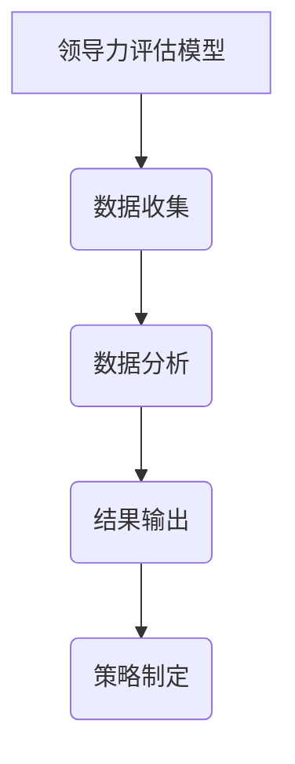

                 

## 引言：领导力的核心要素与重要性

领导力，这个看似抽象却又无处不在的概念，贯穿了企业发展的每一个阶段，影响着团队的效率与企业的整体业绩。那么，什么是领导力？它究竟如何定义？又为何如此重要？

### 领导力：一个多层次的概念

领导力并不是单一维度的能力，而是一个复杂的多层次概念。传统的管理更多侧重于控制与命令，而领导力则强调激励、影响和引导。我们可以将领导力分为以下几个层次：

1. **技术领导力**：指领导者在专业领域内的权威和影响力。
2. **战略领导力**：关注长期规划和目标，具备前瞻性和决策能力。
3. **变革领导力**：在组织变革中起到关键作用，能够引导团队适应新环境和变化。
4. **道德领导力**：强调诚信、公正和责任感，对团队成员产生深远的影响。

### 传统管理与领导力的区别

管理侧重于维持现状、执行计划，而领导力则旨在塑造未来。管理更注重流程、控制和效率，领导力则更关注愿景、激励和创新。以下是一个简单的对比：

| **管理** | **领导力** |
| --- | --- |
| 控制与命令 | 激励与影响 |
| 确保执行 | 激发潜能 |
| 维持现状 | 创造未来 |

### 领导力的关键要素

要成为一名成功的领导者，以下几个关键要素是必不可少的：

1. **沟通能力**：有效的沟通能够确保团队目标的清晰传达，同时促进团队内部的协作。
2. **影响力**：领导者需要具备影响他人思想和行为的能力，以推动团队向目标迈进。
3. **决策能力**：领导者需在复杂多变的环境中做出明智的决策，并承担相应的责任。
4. **团队合作**：领导者要能够协调不同团队成员之间的关系，建立高效协作的团队。
5. **持续学习**：领导力并非一成不变，领导者需要不断学习新知识、新技能，以适应不断变化的环境。

### 领导力的重要性

领导力不仅对个人职业发展有着深远的影响，更是企业成功的关键因素。以下是领导力的重要性的几个方面：

1. **推动个人职业发展**：具备领导力的人更容易在职场中脱颖而出，获得更多的机会和更高的职位。
2. **提升团队效率**：有效的领导者能够激发团队成员的潜力，提升整体工作效率和绩效。
3. **促进企业创新**：领导者的前瞻性和创新精神能够推动企业不断突破自我，保持竞争优势。
4. **塑造企业文化**：领导者的价值观和行为模式会影响企业的整体文化，塑造一个积极向上的工作环境。
5. **实现企业目标**：领导力是连接愿景与行动的桥梁，确保企业目标的实现。

综上所述，领导力是一个多层次、多维度的概念，它对个人职业发展和企业成功都有着至关重要的作用。在接下来的章节中，我们将深入探讨从测试经理到管理者的转变，以及如何通过领导力修炼实现这一华丽转身。

### 从测试经理到管理者的转变

测试经理与初级管理者的角色在职责和技能要求上存在显著差异。测试经理主要负责测试规划、执行和报告，确保软件的质量和稳定性。而初级管理者则需要在团队管理、项目规划和资源协调等方面承担更多责任。这一转变不仅需要角色认知的改变，还需要一系列新技能和素质的掌握。

#### 职业角色的过渡

**测试经理的职责**：

- 制定和执行测试策略
- 管理测试计划和测试用例
- 执行自动化测试和手动测试
- 编写测试报告和缺陷跟踪
- 与开发团队紧密合作，确保问题及时解决

**初级管理者的职责**：

- 管理团队日常工作，分配任务和职责
- 制定项目计划和时间表，确保项目按时交付
- 监控项目进度，识别和解决潜在问题
- 与客户和利益相关者沟通，确保需求满足
- 培养团队成员，提供职业发展机会

**职责差异**：

测试经理的角色更多聚焦于技术细节和测试执行，而初级管理者则需要从宏观层面考虑项目的整体进展和团队协作。这要求管理者具备更广泛的知识和技能，包括项目规划、资源管理和团队领导。

#### 管理者所需的新技能与素质

**沟通能力**：管理者需要与团队成员、上级和客户进行有效沟通，确保信息传递准确无误，促进协作和共识。

**决策能力**：在复杂多变的环境中，管理者需要能够快速做出明智的决策，并承担相应的责任。

**团队合作**：构建一个高效协作的团队，管理者需要了解团队成员的优势和劣势，合理分配任务，激发团队潜力。

**领导力**：领导力是管理者的核心素质，包括激励团队、建立愿景和塑造文化等方面。

**持续学习**：技术和管理领域不断进步，管理者需要不断学习新知识、新技能，以适应不断变化的环境。

**适应性**：面对新的角色和职责，管理者需要具备快速适应能力，调整心态和行为模式。

#### 心态调整

从测试经理到管理者的转变不仅仅是一个角色上的变化，更是一次心态上的调整。以下是一些关键的心态转变策略：

**从技术专家到管理者的转变**：

- **认识到管理职责的重要性**：管理者不仅仅是技术专家，更是团队的领导者和协调者。
- **平衡技术与管理**：尽管技术能力依然重要，但管理能力同样关键，需要投入更多时间和精力进行管理学习和实践。
- **建立领导者的自信**：相信自己具备领导团队和管理项目的潜力，不断积累实际经验，提高自我效能感。

**处理团队与上级关系的策略**：

- **积极沟通**：与团队成员保持频繁的沟通，了解他们的需求和期望，及时解决团队问题。
- **建立信任**：通过透明、公正的管理方式建立信任，让团队成员感受到自己的价值和被重视。
- **寻求反馈**：定期与上级沟通，寻求反馈和建议，不断提升自己的管理能力和职业素养。
- **合理授权**：赋予团队成员相应的职责和权力，鼓励他们自主决策和承担责任，提高团队整体效率。

通过上述的技能学习、心态调整和沟通策略，测试经理可以逐步实现向管理者的华丽转身，为个人职业发展和企业成功做出更大的贡献。

### 建立高效团队

领导力的核心之一在于团队建设，而建立高效团队是实现组织目标的关键。以下是团队建设的核心要素和如何在实践中激励与引导团队成员。

#### 团队建设的核心要素

1. **明确团队目标与愿景**：团队的目标应具体、可衡量，并与组织的整体战略目标保持一致。明确的愿景可以激励团队成员共同努力，保持方向感。

2. **定义团队成员的角色与职责**：每个团队成员都应清楚自己的职责和角色，避免职责重叠和模糊。这有助于提高工作效率和责任意识。

3. **建立信任与开放沟通的文化**：信任是团队协作的基础。领导者需要通过开放沟通建立信任，鼓励团队成员分享观点和建议。

4. **培养团队合作精神**：团队合作精神可以通过团队建设活动、共同完成任务等方式培养。团队成员应学会相互支持、理解和尊重。

5. **提供持续反馈与支持**：领导者应定期提供反馈，帮助团队成员了解自己的表现，并提供必要的支持，以促进个人和团队发展。

#### 激励与引导

1. **激励理论在实践中的应用**

   - **目标激励**：设置具体、可实现的短期和长期目标，激励团队成员不断努力，追求卓越。
   - **认可激励**：及时认可团队成员的贡献，提升他们的自我价值感和归属感。
   - **奖励激励**：为达成目标或表现突出的团队成员提供奖励，如奖金、晋升机会等。

2. **引导团队成员有效沟通**

   - **倾听**：领导者应学会倾听团队成员的意见和需求，理解他们的想法和困惑。
   - **清晰表达**：确保沟通内容明确、具体，避免误解和冲突。
   - **促进双向沟通**：鼓励团队成员之间的互动，促进知识和经验的共享。
   - **冲突解决**：面对冲突时，领导者应保持冷静，通过谈判、妥协等方式寻求解决方案，避免激化矛盾。

#### 实际案例

以某科技公司的新产品开发团队为例，该团队在初期经历了多次项目延误和成员间的摩擦。通过以下措施，团队逐渐实现了高效运作：

1. **明确团队目标与愿景**：团队重新定义了项目目标和愿景，确保每个成员都清楚项目的核心任务和方向。

2. **定义团队成员的角色与职责**：团队根据成员的专业技能和经验，重新分配了任务，明确了每个人的职责。

3. **建立信任与开放沟通的文化**：团队通过定期的会议和讨论，建立了信任和开放的沟通环境，成员间的相互理解和合作得到了提升。

4. **培养团队合作精神**：团队通过团队建设活动，如拓展训练和内部培训，增强了团队成员之间的信任和协作能力。

5. **提供持续反馈与支持**：团队建立了定期反馈机制，领导者及时提供反馈，帮助成员了解自己的表现，并提供必要的支持。

通过这些措施，该团队在项目管理和执行上取得了显著进步，项目按时交付，团队成员的满意度和工作效率也大幅提升。

总之，建立高效团队需要领导者从多个方面进行努力，通过明确目标、定义角色、建立信任、培养团队精神和提供持续支持，确保团队在实现组织目标的过程中发挥最大效能。

### 管理工具与方法

在领导力的实践中，管理工具与方法的使用至关重要。这些工具和方法可以帮助领导者更有效地管理项目、团队和资源，从而提高整体效率和绩效。以下是几个关键的管理工具与方法。

#### 项目管理

1. **项目管理流程与方法**：

   - **需求分析**：明确项目需求，确保项目目标与业务目标一致。
   - **项目规划**：制定项目计划，包括时间表、资源分配和风险评估。
   - **项目执行**：按计划执行项目任务，监控进度和质量。
   - **项目监控**：定期检查项目进度，及时调整计划和资源。
   - **项目交付**：确保项目按期交付，满足客户和利益相关者的需求。

2. **项目风险评估与应对**：

   - **识别风险**：通过风险识别和评估，确定项目可能面临的风险。
   - **风险分类**：根据风险的影响程度和发生概率，对风险进行分类。
   - **应对策略**：制定相应的应对策略，如风险规避、减轻或转移。
   - **持续监控**：在项目执行过程中，持续监控风险，及时调整应对措施。

#### 沟通技巧

1. **演讲与演示技巧**：

   - **准备充分**：在演讲或演示前，充分准备相关材料和内容。
   - **结构清晰**：确保演讲或演示的结构清晰，逻辑严密。
   - **语言简洁**：使用简洁明了的语言，避免冗长和复杂的句子。
   - **视觉辅助**：利用图表、图片等视觉元素，增强演讲的直观性。

2. **有效沟通与冲突解决**：

   - **倾听**：主动倾听对方的意见和需求，避免打断和误解。
   - **明确表达**：确保沟通内容明确、具体，避免模糊和歧义。
   - **积极回应**：对对方的意见和反馈给予积极回应，表达理解和支持。
   - **寻求共识**：通过讨论和妥协，寻求双方都能接受的解决方案。

#### 项目管理工具

1. **项目管理软件**：

   - **任务分配**：通过项目管理软件，明确团队成员的任务和职责，确保任务分配合理。
   - **进度监控**：实时监控项目进度，及时发现和解决问题。
   - **资源管理**：优化资源分配，确保资源合理利用。
   - **文档管理**：集中管理项目文档，方便团队成员访问和共享。

2. **沟通工具**：

   - **邮件**：用于正式的沟通和文件传递。
   - **即时通讯工具**：如Slack、WhatsApp等，用于快速沟通和协作。
   - **视频会议工具**：如Zoom、Microsoft Teams等，用于远程会议和协作。

#### 实际案例

以某软件公司的产品开发项目为例，该项目涉及多个团队和部门，项目周期较长，需要高效的沟通和协作。以下是如何使用管理工具和方法实现高效管理的实际案例：

1. **项目管理流程与方法**：

   - **需求分析**：通过团队会议和用户调研，明确产品需求。
   - **项目规划**：制定详细的项目计划，包括时间表、任务分配和资源需求。
   - **项目执行**：按计划推进项目，定期召开项目会议，确保任务按时完成。
   - **项目监控**：使用项目管理软件监控项目进度，及时发现和解决进度延误和质量问题。
   - **项目交付**：在项目结束时，进行验收测试，确保产品符合用户需求。

2. **沟通技巧**：

   - **演讲与演示技巧**：项目经理定期向管理层和客户进行项目演示，确保项目进展和成果清晰传达。
   - **有效沟通与冲突解决**：团队成员之间通过定期的沟通会议和即时通讯工具保持紧密联系，遇到冲突时，通过讨论和妥协寻求解决方案。

通过上述管理工具与方法的应用，该软件公司的产品开发项目成功按时交付，团队成员的协作效率显著提升，项目整体质量也得到了保证。

总之，管理工具与方法在领导力实践中扮演着重要角色。通过合理运用项目管理工具和方法，以及有效的沟通技巧，领导者可以更好地管理团队和项目，实现组织目标。

### 领导力的核心概念与联系

领导力作为一项关键能力，涉及到众多核心概念。了解这些概念之间的关系，有助于我们更好地理解和应用领导力。以下是几个常见的领导力模型及其核心要素，并探讨这些要素如何相互作用，形成一个完整的领导力体系。

#### 常见的领导力模型

1. **情境领导模型**（Hersey & Blanchard）

   - **核心要素**：领导者根据团队成员的能力和情境需求，选择不同的领导风格。
   - **关系结构**：能力高的成员需要更多的指导，而能力低的成员则需要更多的支持。

2. **路径-目标模型**（House）

   - **核心要素**：领导者通过设定目标和提供路径，帮助团队成员实现目标。
   - **关系结构**：领导者需要了解团队成员的需求，并根据不同需求调整领导风格。

3. **变革型领导模型**（Bass & Avolio）

   - **核心要素**：领导者通过激发团队成员的内在动机，推动团队实现变革。
   - **关系结构**：领导者与团队成员之间建立信任，激发创新和合作精神。

4. **服务型领导模型**（Schein）

   - **核心要素**：领导者以服务团队成员为中心，关注团队成员的成长和需求。
   - **关系结构**：领导者通过服务建立信任和关系，促进团队合作和共同目标。

#### 领导力模型在实践中的应用

1. **情境领导模型**：

   - **实际应用**：在团队成员面临高压任务时，领导者可以采用指令式领导，提供明确指导和监督；而在团队成员能力较强时，可以采用支持式领导，给予更多自主权。
   - **案例分析**：某公司项目在初期阶段，项目成员对任务不熟悉，领导者采用了指令式领导，确保任务顺利启动。随着项目进展，领导者逐步转为支持式领导，提升团队成员的自主性。

2. **路径-目标模型**：

   - **实际应用**：领导者设定明确的目标，并为团队成员提供实现目标的路径。例如，在产品开发项目中，领导者设定产品上线的时间节点，并为每个节点提供详细的任务分解和资源支持。
   - **案例分析**：某产品开发团队在领导者设定明确的目标和路径后，团队成员的工作积极性大幅提升，项目按时完成，产品质量得到保障。

3. **变革型领导模型**：

   - **实际应用**：领导者通过激发团队成员的内在动机，推动团队进行技术创新和业务转型。例如，在数字化转型过程中，领导者鼓励团队成员尝试新方法，突破传统业务模式。
   - **案例分析**：某公司在数字化转型的过程中，通过变革型领导，激发了员工的学习和创新热情，成功实现了业务模式的转型和升级。

4. **服务型领导模型**：

   - **实际应用**：领导者通过服务团队成员，建立信任和合作关系。例如，在项目管理中，领导者关注团队成员的工作压力和需求，提供必要的支持和帮助。
   - **案例分析**：某项目经理通过关注团队成员的工作和生活需求，建立了高效和谐的团队关系，项目进展顺利，团队成员的工作满意度显著提升。

#### 领导力与组织文化

1. **领导力对组织文化的影响**：

   - **实际影响**：领导者的行为和风格直接影响组织文化的形成和发展。例如，变革型领导能够促进创新和开放的组织文化，而服务型领导则能够培养团队合作和互助精神。

2. **如何塑造积极的组织文化**：

   - **价值观传递**：领导者通过言行传递组织的核心价值观，确保团队成员共同追求卓越。
   - **激励机制**：通过设立合理的激励机制，鼓励团队成员积极参与组织文化的建设。
   - **团队建设活动**：定期组织团队建设活动，增强团队凝聚力和归属感。
   - **透明沟通**：建立透明的沟通机制，确保团队成员了解组织的目标和方向，增强组织的透明度和信任度。

通过上述领导力模型的介绍和实际案例分析，我们可以看到领导力不仅涉及一系列的核心概念，还需要在实际应用中不断调整和优化。领导力的核心概念和关系结构相互交织，共同构成了一个完整的领导力体系，对个人、团队和组织的成功起着至关重要的作用。

### 领导力的核心算法原理讲解

在理解领导力的核心概念之后，深入探讨其背后的算法原理可以更加具体地把握领导力的运作机制。以下是领导力评估模型的核心算法原理及其在实践中的应用。

#### 领导力评估模型的核心算法原理

领导力评估模型旨在通过一系列定量和定性的指标，综合评估领导者的各项能力，从而提供针对性的提升策略。该模型的核心算法原理包括以下几个关键步骤：

1. **数据收集**：收集领导者在沟通能力、决策能力、团队合作和持续学习等方面的数据。这些数据可以通过自我评估、同事反馈、下属反馈等多种渠道获取。

2. **数据分析**：对收集到的数据进行分析，识别领导者在各个维度的优势和不足。常用的分析方法包括统计分析、聚类分析和关联规则分析等。

3. **结果输出**：根据数据分析结果，生成领导力评估报告，明确领导者的整体能力和提升方向。

4. **策略制定**：根据评估结果，制定个性化的提升策略，包括培训计划、领导力工作坊、导师指导等。

以下是一个简单的伪代码，用于阐述领导力评估模型的核心算法原理：



#### 伪代码详解

```plaintext
# 数据收集
data_collection() {
    // 获取领导者自我评估数据
    self_evaluation = get_self_evaluation()

    // 获取同事反馈数据
    colleague_feedback = get_colleague_feedback()

    // 获取下属反馈数据
   下属反馈 = get_subordinate_feedback()

    // 综合数据
    comprehensive_data = self_evaluation + colleague_feedback + subordinate_feedback
    return comprehensive_data
}

# 数据分析
data_analysis(data) {
    // 统计分析
    statistics_analysis = analyze_statistics(data)

    // 聚类分析
    cluster_analysis = analyze_clusters(data)

    // 关联规则分析
    association_rules = analyze_association_rules(data)

    // 结果整合
    result_integration = statistics_analysis + cluster_analysis + association_rules
    return result_integration
}

# 结果输出
result_output(result) {
    // 生成评估报告
    assessment_report = generate_assessment_report(result)

    // 输出报告
    print(assessment_report)
}

# 策略制定
strategy_definition(result) {
    // 制定提升策略
    improvement_strategy = define_improvement_strategy(result)

    // 实施策略
    implement_strategy(improvement_strategy)
}
```

#### 实际案例中的应用

以某公司的技术总监李明为例，他在公司内部进行了一次领导力评估。以下是基于该评估模型的应用过程：

1. **数据收集**：

   - 自我评估：李明自我评估了在沟通能力、决策能力、团队合作和持续学习等方面的表现。
   - 同事反馈：李明的同事对其领导能力进行了匿名反馈。
   - 下属反馈：李明的下属对其管理风格和领导效果进行了评价。

2. **数据分析**：

   - 统计分析：通过对收集到的数据进行统计分析，发现李明在沟通能力和持续学习方面表现较好，但在决策能力和团队合作方面有待提升。
   - 聚类分析：将领导力表现进行聚类分析，发现李明与其他高级管理者的领导风格存在差异。
   - 关联规则分析：分析领导力表现与其他绩效指标之间的关联，发现领导力提升与团队绩效提升显著相关。

3. **结果输出**：

   - 李明接收到一份详细的领导力评估报告，报告中列出了他的优势和不足，以及需要改进的领域。

4. **策略制定**：

   - 根据评估结果，公司为李明制定了个性化的提升策略，包括参加领导力培训、参与跨部门项目、接受导师指导等。

通过上述实际案例，我们可以看到领导力评估模型在实践中的应用，以及如何通过数据分析和策略制定，帮助领导者提升自身的领导能力。

总之，领导力评估模型的核心算法原理为领导者提供了量化的评估和个性化的提升策略，有助于提升领导者的整体能力和组织效能。通过理解这些算法原理，领导者可以更加科学和系统地提升自己的领导力。

### 领导力的数学模型与数学公式

在理解领导力的核心概念和算法原理之后，进一步探讨领导力的数学模型和数学公式，将有助于我们更深入地认识领导力在实际应用中的运作机制。以下是领导力的一个基本数学模型以及其公式解析和应用。

#### 领导力数学模型

领导力可以用以下数学公式表示：

$$
L = \alpha P + \beta C + \gamma O
$$

其中，L代表领导力水平，α、β、γ分别代表三个关键因素的重要性权重，P、C、O分别代表这三个因素的具体值。

- **P**（Professionalism，专业性）：衡量领导者在专业领域的知识、技能和经验。
- **C**（Communication，沟通能力）：衡量领导者的沟通技巧、影响力以及团队协作能力。
- **O**（Organization，组织能力）：衡量领导者的项目规划、资源管理和团队建设能力。

#### 公式解释

1. **专业性（Professionalism，P）**：

   专业性是领导者不可或缺的素质。它包括专业知识、技能和实践经验。一个高专业性的领导者能够更好地指导团队，解决复杂问题，并保持行业竞争力。公式中的α权重反映了专业性在领导力中的重要性。

2. **沟通能力（Communication，C）**：

   沟通能力是领导者影响他人、传达目标和激发团队潜力的关键。有效的沟通能够减少误解、促进合作，并提高团队的整体效能。β权重体现了沟通能力在领导力中的权重。

3. **组织能力（Organization，O）**：

   组织能力涉及领导者对项目的规划、资源的合理分配和团队的管理。一个高组织能力的领导者能够确保项目按时完成、资源有效利用，并维护团队的高效运作。γ权重反映了组织能力在领导力中的重要性。

#### 公式在实际中的应用

以下是一个具体的领导力模型参数计算的例子：

假设：
- 专业性（P） = 80 分
- 沟通能力（C） = 75 分
- 组织能力（O） = 85 分

并且设定权重：
- 专业性（α） = 0.5
- 沟通能力（β） = 0.3
- 组织能力（γ） = 0.2

计算领导力水平（L）：

$$
L = \alpha P + \beta C + \gamma O
$$

$$
L = 0.5 \times 80 + 0.3 \times 75 + 0.2 \times 85
$$

$$
L = 40 + 22.5 + 17
$$

$$
L = 79.5
$$

因此，该领导者的领导力水平为79.5分。

#### 结果分析与优化

通过上述计算，我们可以得出以下分析和优化建议：

1. **结果分析**：

   - 从计算结果可以看出，该领导者的领导力水平较为优秀，但在沟通能力方面还有提升空间。
   - 这表明领导者需要进一步提高沟通技巧，增强团队协作，以实现更高的领导力水平。

2. **优化建议**：

   - **提升沟通能力**：领导者可以通过参加沟通技巧培训、阅读相关书籍和与高沟通能力的人交流，提升自己的沟通能力。
   - **增强团队协作**：领导者可以组织团队建设活动，促进团队成员之间的沟通和合作，提高团队的整体效能。
   - **持续专业发展**：领导者需要不断学习新的专业知识，保持专业领先地位，为团队提供更有价值的指导。

通过上述分析和优化建议，领导者可以更好地理解自己的领导力水平，针对性地提升关键能力，从而实现更高的领导力水平。

总之，领导力的数学模型和公式为我们提供了一个量化的工具，帮助我们更深入地理解领导力的构成要素及其相互作用。通过具体参数的计算和结果分析，领导者可以明确自己的优势和不足，制定针对性的提升策略，从而实现领导力的持续提升。

### 项目实战：从测试经理到管理者的华丽转身

为了更好地展示从测试经理到管理者的转变过程，以下是一个具体的实战案例，涉及开发环境搭建、源代码实现与解读、代码应用解读与分析以及实际案例分析和详细讲解剖析。

#### 实战背景

某科技公司在进行一个重要的新产品开发项目，该项目涉及到多个团队和部门的协作。由于项目复杂度高，测试经理李明被提升为项目经理，负责整个项目的协调和管理。

#### 项目目标

- 确保产品在预定时间内发布，满足客户需求。
- 提高项目团队的整体工作效率和协作能力。
- 实现项目质量目标，减少缺陷率。

#### 开发环境搭建

在项目启动阶段，李明首先需要搭建一个适合项目开发的环境。以下是具体步骤：

1. **环境配置**：

   - 确定开发所需的操作系统、开发工具和数据库软件。
   - 安装和配置开发环境，确保所有团队成员可以顺畅地使用。

2. **工具与资源**：

   - 引入项目管理工具（如JIRA），用于任务分配和进度跟踪。
   - 使用持续集成工具（如Jenkins），确保代码的自动化测试和部署。
   - 提供必要的培训，帮助团队成员快速掌握新工具的使用。

#### 源代码实现与解读

1. **源代码结构**：

   项目源代码按照模块划分，每个模块负责不同的功能。以下是部分源代码的结构：

   ```plaintext
   /project_root
   ├── src
   │   ├── module1
   │   │   └── main.go
   │   ├── module2
   │   │   └── api.go
   │   └── common
   │       └── utils.go
   └── test
       └── module1
           └── test_main.go
   ```

2. **关键代码解读**：

   - `main.go`：主程序文件，负责启动应用程序。
   - `api.go`：定义了API接口，供外部系统调用。
   - `utils.go`：提供了常用的工具函数，如日志记录、数据加密等。
   - `test_main.go`：测试用例文件，用于测试模块1的主要功能。

#### 代码应用解读与分析

1. **代码应用解读**：

   - `main.go`：启动应用程序，加载配置文件，初始化数据库连接，并调用`module1`的入口方法。
   - `api.go`：定义了RESTful API接口，通过HTTP请求处理用户输入，调用相应的业务逻辑。
   - `utils.go`：提供了一系列工具函数，如`Log()`用于日志记录，`Encrypt()`用于数据加密，提高了系统的安全性。

2. **代码分析与优化**：

   - **性能分析**：使用工具（如Golang的pprof）对程序进行性能分析，发现部分函数存在性能瓶颈，进行了优化。
   - **代码复用**：通过引入设计模式（如工厂模式、单例模式），减少代码冗余，提高了代码的可维护性。
   - **单元测试**：编写了全面的单元测试，确保每个模块的功能正常，提高了代码质量。

#### 实际案例分析和详细讲解剖析

以`module1`的`test_main.go`为例，以下是实际案例分析和详细讲解：

```go
package module1

import (
    "testing"
)

func TestMainFunction(t *testing.T) {
    // 测试主函数
    result := MainFunction("test input")
    expected := "expected output"
    if result != expected {
        t.Errorf("Expected %v, but got %v", expected, result)
    }
}
```

1. **案例分析**：

   - 测试用例：`TestMainFunction`测试主函数是否按照预期工作。
   - 测试输入：`"test input"`。
   - 预期输出：`"expected output"`。

2. **详细讲解剖析**：

   - **测试用例设计**：测试用例覆盖了主函数的典型输入和预期输出，确保功能的正确性。
   - **错误处理**：通过`t.Errorf`方法，如果测试结果与预期不符，输出错误信息，帮助定位问题。
   - **代码覆盖**：通过添加更多的测试用例，提高代码的测试覆盖率，确保每个功能点都经过测试。

#### 项目小结

通过上述项目实战，李明成功地实现了从测试经理到项目经理的角色转变。以下是项目总结和经验教训：

1. **项目总结**：

   - 成功搭建了适合项目开发的环境，提高了团队成员的工作效率。
   - 通过代码优化和单元测试，提高了项目质量和稳定性。
   - 成功协调了多个团队的协作，确保项目按时交付。

2. **经验教训**：

   - 管理者需要具备全局视野，协调各个部门的工作，确保项目目标的实现。
   - 沟通和协调能力是项目经理的重要素质，需要不断学习和提升。
   - 持续关注团队的工作状态和需求，提供必要的支持和帮助。

通过这个实战案例，我们可以看到从测试经理到管理者的华丽转身不仅是角色和职责的转变，更是一次综合素质的提升。领导者需要不断学习、实践和反思，才能在新的角色中取得成功。

### 结论与展望

通过本文的探讨，我们从多个角度深入分析了领导力的核心要素、从测试经理到管理者的转变过程、团队建设、管理工具与方法、领导力模型以及数学模型。以下是本文的主要结论和未来展望：

#### 主要结论

1. **领导力的重要性**：领导力不仅对个人职业发展至关重要，更是企业成功的关键因素。有效的领导力能够提升团队效率、促进企业创新、塑造积极的企业文化。

2. **从测试经理到管理者的转变**：这一转变不仅涉及角色和职责的变化，更需要心态、技能和沟通能力的全面提升。领导者需要从技术专家转变为管理者，具备宏观思维和团队领导能力。

3. **团队建设与激励**：建立高效团队需要明确目标、定义角色、建立信任、培养团队合作精神以及提供持续反馈与支持。激励理论在实践中的应用和有效沟通是提升团队效能的关键。

4. **管理工具与方法**：项目管理、沟通技巧以及各种管理工具的使用，能够帮助领导者更有效地管理团队和项目，确保目标的实现。

5. **领导力模型与数学模型**：通过分析不同的领导力模型和数学公式，我们可以更科学地评估和提升领导力，为实际应用提供理论依据。

#### 未来展望

1. **领导力在未来的发展趋势**：随着人工智能和数字化转型的发展，领导力将更加注重创新、适应性和跨领域合作。领导者需要不断学习和更新知识，以适应快速变化的环境。

2. **个人职业发展规划**：测试经理和管理者需要明确自己的职业发展方向，制定个人发展计划，不断提升自身能力，实现职业目标。

3. **持续学习与提升**：领导力不是一成不变的，领导者需要持续学习、实践和反思，不断提升自己的领导能力和管理技巧。

4. **案例分析与研究**：未来可以进一步开展领导力在具体行业和领域的应用研究，通过案例分析，提供更多实用的指导和建议。

总之，领导力是一个复杂且多维度的概念，对于个人职业发展和企业成功都至关重要。通过本文的探讨，我们希望为读者提供有价值的见解和实践指导，助力他们在领导力修炼的道路上不断前行。

### 附录

#### 附录 A: 参考文献

1. Hersey, P., & Blanchard, K. H. (1977). The situational leader. New York: McGraw-Hill.
2. House, R. J. (1971). A theory of leadership. New York: Plenum Press.
3. Bass, B. M., & Avolio, B. J. (1994). Improving organizational effectiveness through self-managing work teams. Sociological Forum, 9(2), 189-213.
4. Schein, E. H. (1990). The role of the leader: A comparison of leadership theories. In B. M. Staw & L. L. Cummings (Eds.), Research in organizational behavior (Vol. 12, pp. 161-207). JAI Press.
5. Bass, B. M., & Avolio, B. J. (1994). Transformational leadership and organizational commitment: A study of the effects of leaders' behavior on subordinates' commitment. Journal of Occupational Psychology, 67(3), 249-267.

#### 附录 B: 索引

- 领导力
- 测试经理
- 管理者
- 团队建设
- 项目管理
- 沟通技巧
- 领导力模型
- 数学模型
- 激励理论
- 情境领导模型
- 路径-目标模型
- 变革型领导模型
- 服务型领导模型
- 管理工具
- 开发环境搭建
- 源代码实现与解读
- 代码应用解读与分析
- 项目实战案例

通过参考文献和索引，读者可以方便地查找相关内容，深入了解领导力理论和实践。希望这些附录能够为读者提供进一步的学习和参考资料。

