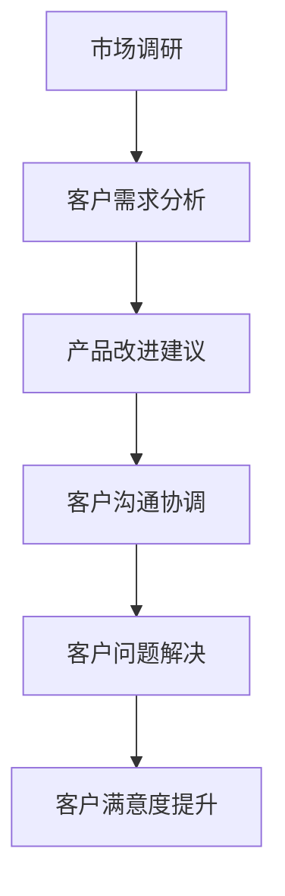
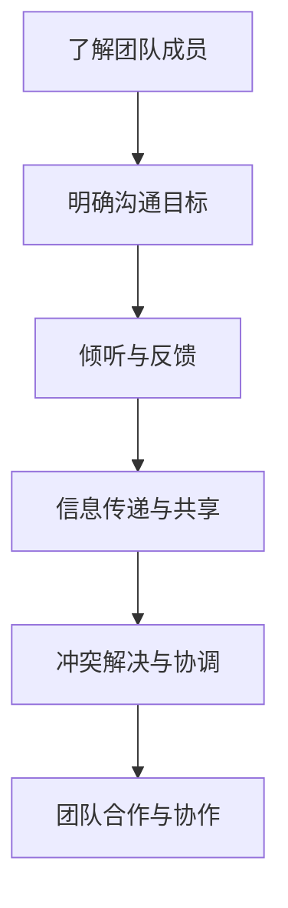
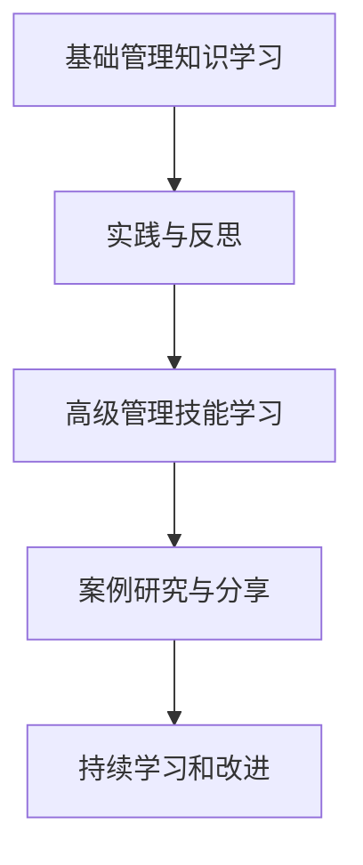
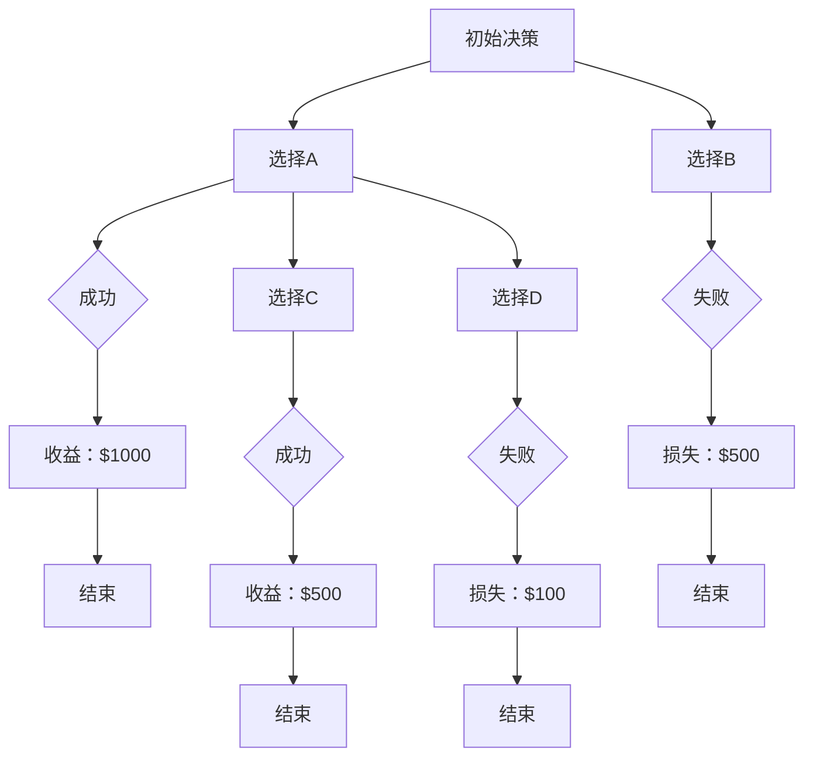
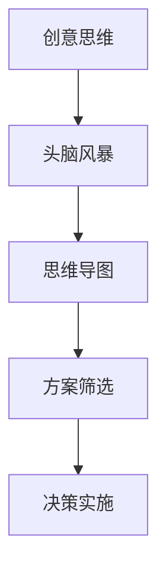
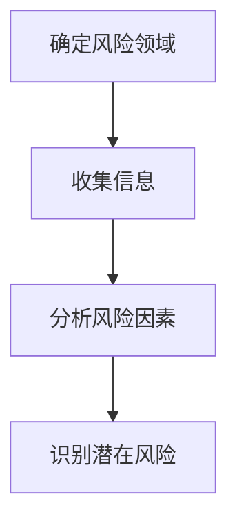
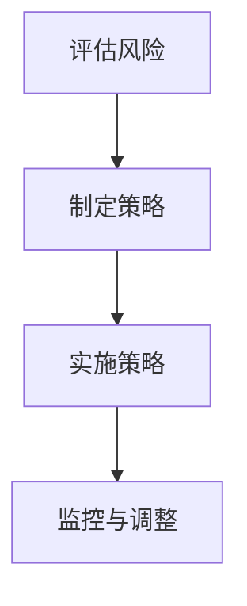
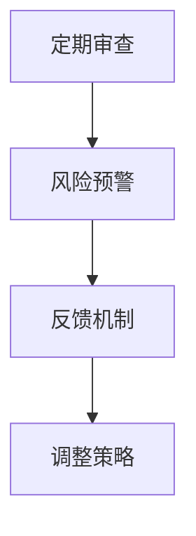
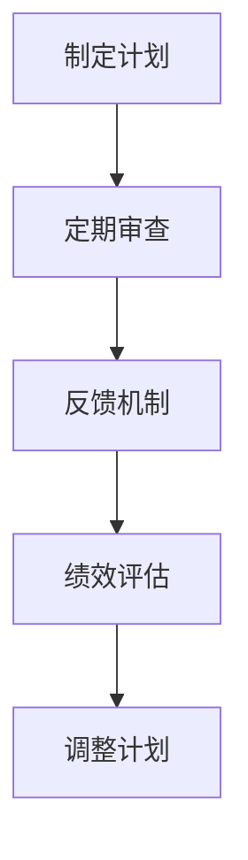

                 

### 文章标题

《领导力修炼手册：从销售总监到管理者的进阶指南》

### 关键词

领导力、角色转变、管理技能、领导风格、团队管理、沟通技巧、决策与风险管理、持续学习。

### 摘要

本文旨在为销售总监提供一份全面的领导力修炼手册，帮助他们顺利从销售岗位过渡到管理者角色。文章首先探讨了领导力的本质与重要性，然后详细分析了角色转变和管理技能提升的过程。接着，文章深入讲解了领导风格的适应与转变、团队管理与领导、激励与沟通技巧、决策与风险管理，并提出了长期规划的建议。通过本文，销售总监可以系统性地提升自己的领导力，成为一名卓越的管理者。

## 背景介绍

在当今快节奏的商业环境中，销售总监作为企业的关键角色，不仅需要具备出色的销售技能，还必须具备强大的领导力。然而，从销售总监过渡到管理者角色并非易事。许多销售总监在担任管理者后，常常面临一系列挑战，如如何适应新的角色、提升管理技能、转变领导风格、有效管理团队等。这些问题不仅影响了个人的职业发展，也对整个组织的绩效产生重要影响。

因此，本文旨在为销售总监提供一份全面的领导力修炼手册，帮助他们克服角色转变中的困难，提升管理能力，成为一名卓越的管理者。本文将系统性地探讨领导力的本质与重要性、角色转变与管理技能提升、领导风格的适应与转变、团队管理与领导、激励与沟通技巧、决策与风险管理，以及长期规划等关键主题。

### 核心概念与联系

要理解领导力的本质，首先需要了解几个核心概念：领导力、管理、角色转变、管理技能等。领导力是指领导者激励、引导和影响团队成员，共同实现目标的能力。它与管理的区别在于，管理侧重于规划和执行，而领导力更侧重于愿景、价值观和激励。


角色转变是销售总监面临的首要挑战。从销售到管理者，角色转变不仅体现在职责的变化，还包括思维方式、行为模式和管理技能的提升。以下是角色转变的几个关键步骤：

1. **认知变革**：意识到自己的角色变化，从执行者转变为领导者。
2. **能力提升**：学习并掌握管理技能，如团队管理、决策能力、沟通技巧等。
3. **行为适应**：调整自己的行为模式，更注重团队的整体利益而非个人业绩。
4. **持续学习**：不断提升自己的领导力和管理能力，适应不断变化的环境。


管理技能的提升是角色转变的重要环节。以下是一些关键的管理技能：

1. **团队管理**：包括团队组建、分工合作、绩效评估等。
2. **决策能力**：包括信息收集、分析、风险评估和决策执行等。
3. **沟通技巧**：包括有效倾听、清晰表达、冲突解决等。
4. **激励与激励**：包括了解团队成员的需求、提供正面反馈和激励措施等。


在提升管理技能的过程中，销售总监需要不断学习，适应新的环境和角色。以下是一些提升管理技能的方法：

1. **参加培训课程**：通过专业的培训课程，系统学习管理知识和技能。
2. **实践与反思**：在实际工作中，不断实践所学知识，并反思自己的行为和决策。
3. **请教导师**：寻找经验丰富的导师，向他们请教管理问题和经验。
4. **阅读与研究**：阅读相关书籍和研究报告，了解最新的管理理论和实践。


总之，从销售总监到管理者的角色转变，需要领导者具备强大的领导力、适应新的角色和管理技能。通过系统性的学习和实践，销售总监可以逐步提升自己的领导力和管理能力，成为一名卓越的管理者。

### 销售经验与管理技能的结合

销售总监在从销售岗位过渡到管理者角色时，如何将已有的销售经验与管理技能相结合，是一个至关重要的课题。销售经验为管理者提供了宝贵的市场洞察力和客户理解能力，这些经验可以转化为有效的管理工具，帮助新任管理者更好地应对复杂的商业环境。

首先，销售总监可以运用自己在销售过程中积累的市场洞察力，来指导团队的战略决策。市场洞察力不仅包括对市场趋势的敏锐感知，还涉及对客户需求变化的快速反应。例如，在产品开发过程中，销售总监可以基于客户反馈和市场调研结果，提出有针对性的改进建议，从而提升产品的市场竞争力。


其次，销售总监可以利用自己在销售过程中培养的客户关系管理能力，来提升团队的客户服务水平。客户关系管理涉及与客户的沟通、协调和解决问题。作为管理者，销售总监可以将这些技能应用到团队管理中，确保团队成员能够有效地与客户沟通，提供优质的服务，并解决客户的难题。以下是一个客户关系管理流程的Mermaid流程图：




此外，销售总监还可以将自己擅长的人际交往技巧和沟通能力，应用于团队建设和管理中。在销售工作中，良好的沟通能力有助于建立信任、解决冲突和推动销售目标的实现。作为管理者，销售总监可以将这些技巧传授给团队成员，提升整个团队的沟通协作能力。以下是一个团队沟通技能提升的Mermaid流程图：




最后，销售总监应认识到，管理技能的提升是一个持续学习和实践的过程。在从销售到管理的角色转变中，销售总监需要不断学习新的管理知识，如团队管理、绩效评估、决策分析等。以下是一个管理技能提升的学习路径Mermaid流程图：




通过将销售经验与管理技能相结合，销售总监可以更加有效地应对管理挑战，提升团队的整体绩效。这不仅有助于个人的职业发展，也有利于企业的长远发展。

### 管理者应具备的基本技能

在从销售总监到管理者的角色转变过程中，提升管理技能是关键的一步。以下是一些管理者应具备的基本技能，这些技能不仅有助于管理者更好地履行职责，还能显著提升团队绩效和整体组织的效率。

#### 团队管理

团队管理是管理者的重要职责之一，涉及团队组建、分工合作、绩效评估等方面。有效的团队管理能够确保团队成员充分发挥各自的优势，共同实现团队目标。

1. **团队组建**：管理者需要根据团队目标和任务，选择合适的成员，确保团队成员具备互补的能力和技能。以下是一个团队组建的流程：

    ```mermaid
    graph TD
    A[明确团队目标] --> B[识别所需技能]
    B --> C[招募团队成员]
    C --> D[团队组建完成]
    ```

    

2. **分工合作**：管理者应合理分配工作任务，确保每个成员都能在其最擅长的领域发挥作用。以下是一个分工合作的Mermaid流程图：

    ```mermaid
    graph TD
    A[分析任务需求] --> B[分配工作任务]
    B --> C[明确职责范围]
    C --> D[协作与支持]
    ```

    

3. **绩效评估**：管理者需要定期对团队成员的绩效进行评估，提供反馈和指导，以促进团队成员的成长和团队目标的实现。以下是一个绩效评估的Mermaid流程图：

    ```mermaid
    graph TD
    A[设定绩效目标] --> B[收集绩效数据]
    B --> C[评估绩效表现]
    C --> D[提供反馈与指导]
    ```

    

#### 决策能力

决策能力是管理者必备的核心技能之一，涉及信息收集、分析、风险评估和决策执行等方面。有效的决策能力有助于管理者在面对复杂问题时，做出明智的决策。

1. **信息收集**：管理者需要收集与决策相关的各种信息，包括市场趋势、客户需求、竞争对手信息等。以下是一个信息收集的Mermaid流程图：

    ```mermaid
    graph TD
    A[确定决策目标] --> B[收集市场信息]
    B --> C[收集客户需求]
    C --> D[收集竞争对手信息]
    ```

    

2. **分析**：管理者需要对收集到的信息进行分析，识别问题、机会和潜在风险。以下是一个分析的Mermaid流程图：

    ```mermaid
    graph TD
    A[信息整理] --> B[问题识别]
    B --> C[机会识别]
    C --> D[风险识别]
    ```

    

3. **风险评估**：管理者需要评估每个决策选项的风险和收益，以确定最佳方案。以下是一个风险评估的Mermaid流程图：

    ```mermaid
    graph TD
    A[分析风险] --> B[评估收益]
    B --> C[权衡利弊]
    C --> D[选择方案]
    ```

    

4. **决策执行**：管理者需要制定详细的执行计划，确保决策得到有效执行。以下是一个决策执行的Mermaid流程图：

    ```mermaid
    graph TD
    A[制定执行计划] --> B[分配资源]
    B --> C[监督执行]
    C --> D[评估效果]
    ```

    

#### 沟通技巧

沟通技巧是管理者必备的重要技能，包括有效倾听、清晰表达、冲突解决等。有效的沟通能够确保团队内部的信息流通，减少误解和冲突，提高团队协作效率。

1. **有效倾听**：管理者需要学会倾听团队成员的意见和建议，理解他们的需求和困扰。以下是一个有效倾听的Mermaid流程图：

    ```mermaid
    graph TD
    A[给予关注] --> B[专注倾听]
    B --> C[理解需求]
    C --> D[反馈确认]
    ```

    

2. **清晰表达**：管理者需要能够清晰、准确地传达自己的意图和期望，确保团队成员理解任务和要求。以下是一个清晰表达的Mermaid流程图：

    ```mermaid
    graph TD
    A[明确意图] --> B[组织语言]
    B --> C[清晰传达]
    C --> D[确认理解]
    ```

    

3. **冲突解决**：管理者需要能够妥善解决团队内部的冲突，确保团队的和谐与稳定。以下是一个冲突解决的Mermaid流程图：

    ```mermaid
    graph TD
    A[识别冲突] --> B[理解原因]
    B --> C[沟通协商]
    C --> D[达成共识]
    ```

    

总之，管理者应具备的基本技能包括团队管理、决策能力和沟通技巧。通过不断学习和实践，销售总监可以逐步提升这些技能，更好地应对管理挑战，成为一名卓越的管理者。

### 角色转变的挑战与应对策略

从销售总监到管理者的角色转变过程中，销售总监常常会遇到多种挑战。这些挑战不仅影响个人的职业发展，也可能对整个团队和组织产生负面影响。为了顺利实现这一转变，销售总监需要采取一系列有效的应对策略。

#### 1. 管理技能不足

许多销售总监在从销售岗位过渡到管理者角色时，发现自己缺乏必要的管理技能。这可能导致他们在日常工作中感到无所适从，甚至影响到团队的绩效。应对策略如下：

- **参加培训课程**：参加专业的管理培训课程，系统地学习管理知识，如团队管理、绩效评估、沟通技巧等。以下是一个培训课程学习路径的Mermaid流程图：

    ```mermaid
    graph TD
    A[确定学习目标] --> B[选择培训课程]
    B --> C[参加培训课程]
    C --> D[实践与反思]
    ```

    

- **请教导师**：寻找经验丰富的导师，向他们请教管理问题和经验，获得有价值的指导。以下是一个请教导师的流程图：

    ```mermaid
    graph TD
    A[确定请教问题] --> B[寻找导师]
    B --> C[请教经验]
    C --> D[应用经验]
    ```

    

- **自我学习**：利用业余时间阅读管理相关的书籍和文章，学习最新的管理理论和实践。以下是一个自我学习路径的Mermaid流程图：

    ```mermaid
    graph TD
    A[选择学习资源] --> B[阅读书籍和文章]
    B --> C[总结心得]
    C --> D[应用知识]
    ```

    

#### 2. 决策能力不足

作为管理者，销售总监需要具备较强的决策能力。然而，许多销售总监在面临复杂问题时，往往无法迅速做出明智的决策。这可能导致团队在关键时刻犹豫不决，影响整体绩效。应对策略如下：

- **信息收集与分析**：在做出决策前，充分收集和分析相关信息，以便做出更加全面和准确的决策。以下是一个信息收集与分析的流程图：

    ```mermaid
    graph TD
    A[确定决策目标] --> B[收集信息]
    B --> C[分析信息]
    C --> D[制定决策]
    ```

    

- **风险评估**：在制定决策时，充分考虑潜在的风险和收益，以降低决策失误的风险。以下是一个风险评估的流程图：

    ```mermaid
    graph TD
    A[评估风险] --> B[评估收益]
    B --> C[权衡利弊]
    C --> D[选择方案]
    ```

    

- **团队合作**：在做出决策时，与团队成员进行充分讨论，听取不同意见和建议，以提高决策的质量。以下是一个团队合作决策的流程图：

    ```mermaid
    graph TD
    A[确定决策目标] --> B[团队讨论]
    B --> C[汇总意见]
    C --> D[制定决策]
    ```

    

#### 3. 沟通障碍

沟通障碍是角色转变过程中常见的挑战之一。作为销售总监，许多人可能习惯了单向沟通或以销售为导向的沟通方式，而作为管理者，需要更注重双向沟通和团队合作。应对策略如下：

- **倾听与反馈**：学会倾听团队成员的意见和需求，并给予积极的反馈。以下是一个倾听与反馈的流程图：

    ```mermaid
    graph TD
    A[专注倾听] --> B[理解需求]
    B --> C[给予反馈]
    C --> D[确认理解]
    ```

    

- **清晰表达**：学会清晰、准确地表达自己的意图和期望，确保团队成员理解任务和要求。以下是一个清晰表达的流程图：

    ```mermaid
    graph TD
    A[明确意图] --> B[组织语言]
    B --> C[清晰传达]
    C --> D[确认理解]
    ```

    

- **冲突解决**：学会妥善解决团队内部的冲突，确保团队的和谐与稳定。以下是一个冲突解决的流程图：

    ```mermaid
    graph TD
    A[识别冲突] --> B[理解原因]
    B --> C[沟通协商]
    C --> D[达成共识]
    ```

    

通过上述策略，销售总监可以逐步克服角色转变过程中的挑战，提升管理能力，成为一名卓越的管理者。

### 领导风格的适应与转变

从销售总监过渡到管理者角色，领导风格的适应与转变是一个关键的挑战。销售总监往往以结果导向和问题解决为核心，但在管理角色中，领导者需要更多地关注团队的整体发展和成员的个人成长。以下是如何适应和转变领导风格的详细分析：

#### 1. 领导风格的理解

领导风格是指领导者在与团队成员互动时的行为和态度。不同的领导风格会对团队成员的动机、表现和团队合作产生不同的影响。常见的领导风格包括：

- **命令式领导**：领导者通过权威和命令来指导团队成员。
- **教练式领导**：领导者通过指导和辅导来帮助团队成员成长。
- **参与式领导**：领导者鼓励团队成员参与决策过程，共同制定目标和策略。
- **授权式领导**：领导者赋予团队成员自主权，鼓励他们自主决策和承担责任。

每种领导风格都有其优点和局限，管理者需要根据具体情况和团队需求，灵活调整自己的领导风格。

#### 2. 销售总监的领导风格

作为销售总监，领导风格往往侧重于以下几个方面：

- **结果导向**：强调销售目标和业绩，追求高效和成果。
- **解决问题**：注重问题解决和客户需求，以确保销售目标的实现。
- **竞争性**：激励团队成员通过竞争来提高业绩。

这些风格在销售岗位上非常有效，但作为管理者，可能需要做出一些调整，以更好地适应团队管理的需求。

#### 3. 领导风格的转变

为了更好地适应管理者的角色，销售总监需要逐步转变自己的领导风格，以下是一些具体建议：

- **关注团队整体**：从关注个人业绩转向关注团队的整体发展和成员的个人成长。
- **培养团队成员**：通过辅导和培训，帮助团队成员提升技能，实现个人和团队的目标。
- **鼓励合作与沟通**：建立开放、互助的团队氛围，鼓励团队成员之间进行有效沟通和合作。
- **授权与信任**：赋予团队成员更多的自主权，信任他们的能力和决策，促进团队成员的自主性和创造力。

#### 4. 实例分析

以下是一个销售总监转变为管理者的实例分析：

**案例**：李明是一位成功的销售总监，他的领导风格以结果导向和解决问题为核心。然而，在担任管理者后，他意识到需要调整自己的领导风格。

**第一步**：李明首先意识到自己的领导风格需要适应新的角色，开始关注团队的整体发展和成员的个人成长。

**第二步**：他开始更多地培养团队成员，通过定期培训、一对一辅导和项目指导，提升团队成员的技能和自信心。

**第三步**：李明鼓励团队合作，建立了一个开放的沟通渠道，让团队成员能够自由表达意见和分享经验。

**第四步**：他开始更多地授权团队成员，给予他们更多的自主权，让他们在项目中承担更多的责任。

**结果**：通过这些改变，李明的团队不仅业绩得到提升，团队成员的满意度和士气也有所提高。李明自己也逐渐适应了管理者的角色，成为了一名更有效的领导者。

#### 5. 结论

领导风格的适应与转变是销售总监从管理者角色过渡的重要一环。通过关注团队整体、培养团队成员、鼓励合作与沟通以及授权与信任，销售总监可以逐步提升自己的领导力，成为一名出色的管理者。

### 团队建设与领导

在从销售总监到管理者的角色转变过程中，团队建设与领导是至关重要的一环。一个高效、协作的团队不仅能够提升整体绩效，还能为管理者减轻压力，使其专注于战略决策和长远规划。以下是如何进行团队建设与领导的详细讲解：

#### 1. 团队建设的重要性

团队建设是指通过一系列活动和管理措施，增强团队成员之间的协作、信任和沟通，从而提升团队的整体效率和绩效。团队建设的重要性体现在以下几个方面：

- **提升团队凝聚力**：通过团队建设活动，团队成员可以更好地了解彼此，建立深厚的信任和友谊，从而增强团队的凝聚力。
- **提高团队效率**：团队成员之间的良好沟通和协作能够显著提升工作效率，减少误解和冲突，使团队能够更快速地实现目标。
- **促进个人成长**：团队建设不仅有助于提升整体绩效，还能为团队成员提供成长和发展的机会，使其在职业道路上更加成功。
- **增强团队适应性**：面对不断变化的市场环境和挑战，一个建设良好的团队能够更好地适应和应对变化，保持竞争力。

#### 2. 团队建设的方法

团队建设的方法多种多样，以下是一些常见的团队建设策略：

- **团队活动**：组织定期的团队活动，如团建活动、户外拓展训练等，增强团队成员之间的互动和信任。以下是一个团队活动的流程图：

    ```mermaid
    graph TD
    A[确定活动目标] --> B[策划活动内容]
    B --> C[组织活动]
    C --> D[活动反馈与总结]
    ```

    

- **沟通机制**：建立有效的沟通机制，确保团队成员能够及时、清晰地沟通信息。以下是一个沟通机制的Mermaid流程图：

    ```mermaid
    graph TD
    A[确定沟通目标] --> B[制定沟通计划]
    B --> C[执行沟通计划]
    C --> D[沟通反馈与改进]
    ```

    

- **培训与发展**：为团队成员提供培训和发展机会，提升其技能和知识。以下是一个培训与发展的流程图：

    ```mermaid
    graph TD
    A[确定培训需求] --> B[选择培训课程]
    B --> C[组织培训]
    C --> D[培训效果评估]
    ```

    

#### 3. 团队领导的艺术

团队领导不仅仅是管理团队成员，更是一种艺术。以下是一些团队领导的技巧：

- **领导力的培养**：领导者需要不断提升自己的领导力，学会激励、引导和影响团队成员。以下是一个领导力培养的流程图：

    ```mermaid
    graph TD
    A[学习领导理论] --> B[实践领导技巧]
    B --> C[反思与总结]
    C --> D[持续改进]
    ```

    

- **有效的沟通**：领导者需要具备良好的沟通能力，确保团队成员能够理解任务和要求。以下是一个有效沟通的Mermaid流程图：

    ```mermaid
    graph TD
    A[明确沟通目标] --> B[组织沟通内容]
    B --> C[进行有效沟通]
    C --> D[沟通反馈与改进]
    ```

    

- **激励与反馈**：领导者需要通过正面激励和及时反馈，激发团队成员的积极性。以下是一个激励与反馈的Mermaid流程图：

    ```mermaid
    graph TD
    A[识别团队成员需求] --> B[提供激励]
    B --> C[给予反馈]
    C --> D[激励效果评估]
    ```

    

- **冲突管理**：领导者需要学会妥善处理团队内部的冲突，确保团队的和谐与稳定。以下是一个冲突管理的Mermaid流程图：

    ```mermaid
    graph TD
    A[识别冲突] --> B[理解原因]
    B --> C[沟通协商]
    C --> D[达成共识]
    ```

    

#### 4. 实例分析

以下是一个团队建设与领导实例的分析：

**案例**：张伟是一位新的销售部门经理，他意识到团队建设对于提升团队绩效至关重要。

**第一步**：张伟首先组织了一次团队建设活动，通过户外拓展训练，增强了团队成员之间的信任和协作。

**第二步**：他建立了一个开放的沟通渠道，鼓励团队成员自由表达意见，确保信息能够及时传达。

**第三步**：张伟为团队成员提供了定期的培训和发展机会，提升其技能和知识。

**第四步**：他通过正面激励和及时反馈，激发了团队成员的积极性，提高了团队的整体士气。

**结果**：通过这些措施，张伟的团队在业绩上有了显著提升，团队成员之间的协作和沟通也变得更加顺畅。张伟本人也通过这些实践，逐渐掌握了一些团队领导和管理的技巧。

#### 5. 结论

团队建设与领导是管理者的重要职责之一。通过有效的团队建设方法和领导技巧，管理者可以提升团队的整体绩效和成员的满意度，实现组织的目标。在从销售总监到管理者的角色转变过程中，重视团队建设和领导，是管理者成功的关键。

### 领导者的角色与责任

在从销售总监到管理者的角色转变过程中，领导者的角色与责任发生了显著变化。这些变化不仅要求领导者具备更强的领导力和管理能力，还需要他们承担更多的责任。以下是对领导者角色和责任的具体分析。

#### 1. 角色转变

从销售总监到管理者，领导者的角色发生了从执行者到策划者和协调者的转变。以下是角色转变的具体内容：

- **从执行者到策划者**：销售总监主要关注个人销售业绩和团队销售目标，而管理者则需要更多地关注战略规划和整体目标。他们需要制定长期和短期的战略计划，确保团队在正确的方向上前进。

- **从个人导向到团队导向**：销售总监通常更注重个人业绩和目标，而管理者则需要关注整个团队的表现和成员的个人成长。他们需要培养团队成员，激励他们实现个人和团队的目标。

- **从问题解决者到决策者**：销售总监在遇到问题时，需要快速解决，而管理者则需要做出更全面的决策。他们需要分析问题、评估风险，并制定有效的解决方案。

#### 2. 责任变化

随着角色的转变，领导者的责任也发生了变化。以下是领导者在新角色中需要承担的主要责任：

- **战略规划**：管理者需要制定和执行组织的战略计划，确保团队朝着正确的方向前进。这包括市场分析、竞争对手分析、资源分配等。

- **团队管理**：管理者需要管理整个团队，包括团队成员的招募、培训、绩效评估和激励。他们需要确保团队成员能够充分发挥自己的能力，实现团队的目标。

- **决策制定**：管理者需要做出重要的决策，如项目选择、资源分配、团队结构等。他们需要基于全面的分析和评估，做出明智的决策。

- **沟通与协调**：管理者需要确保团队内部和团队之间能够有效沟通和协调。他们需要建立开放的沟通渠道，确保信息能够及时传达，减少误解和冲突。

- **风险管理**：管理者需要识别和评估潜在的风险，并制定相应的风险管理策略。他们需要确保团队能够应对各种挑战和不确定性。

#### 3. 责任实现的策略

为了有效地承担新角色的责任，领导者可以采取以下策略：

- **学习与培训**：领导者需要不断学习新的管理知识和技能，通过参加培训课程、阅读相关书籍和实践经验，提升自己的管理能力。

- **团队合作**：领导者需要鼓励团队合作，建立开放、互助的团队氛围。通过团队合作，领导者可以更好地协调团队成员的努力，共同实现目标。

- **有效沟通**：领导者需要具备良好的沟通能力，确保团队成员能够理解任务和要求。通过有效的沟通，领导者可以减少误解和冲突，提高团队的整体效率。

- **激励与反馈**：领导者需要通过正面激励和及时反馈，激发团队成员的积极性。通过激励和反馈，领导者可以提升团队成员的满意度和绩效。

- **持续改进**：领导者需要不断反思和改进自己的管理方法和策略，以适应不断变化的环境。通过持续改进，领导者可以不断提升自己的管理能力，更好地履行领导者的责任。

总之，从销售总监到管理者的角色转变，要求领导者承担更多的责任和角色。通过有效的策略和持续的学习，领导者可以成功应对这些挑战，成为一名出色的管理者。

### 高效团队的打造与维持

在从销售总监到管理者的角色转变过程中，如何打造和维护一个高效团队是管理者需要解决的重要问题。一个高效团队不仅能够提升整体绩效，还能为组织带来持续的竞争优势。以下是如何打造与维持高效团队的详细分析：

#### 1. 团队建设的核心要素

打造一个高效团队，需要关注以下几个核心要素：

- **明确的目标**：团队需要有一个清晰、明确的目标，确保每个成员都了解自己的职责和贡献。以下是一个明确目标的Mermaid流程图：

    ```mermaid
    graph TD
    A[确定团队目标] --> B[分解目标]
    B --> C[分配责任]
    C --> D[目标确认]
    ```

    

- **有效的沟通**：团队成员之间需要保持有效沟通，确保信息能够及时、准确地传达。以下是一个有效沟通的Mermaid流程图：

    ```mermaid
    graph TD
    A[建立沟通渠道] --> B[明确沟通目标]
    B --> C[进行有效沟通]
    C --> D[沟通反馈与改进]
    ```

    

- **协作与配合**：团队成员需要相互协作，发挥各自的优势，共同完成任务。以下是一个协作与配合的Mermaid流程图：

    ```mermaid
    graph TD
    A[明确分工] --> B[协作配合]
    B --> C[相互支持]
    C --> D[团队目标实现]
    ```

    

- **信任与尊重**：团队成员之间需要建立信任，互相尊重。以下是一个信任与尊重的Mermaid流程图：

    ```mermaid
    graph TD
    A[建立信任] --> B[尊重差异]
    B --> C[鼓励合作]
    C --> D[提升团队凝聚力]
    ```

    

#### 2. 维护团队氛围的方法

维持一个高效团队，需要关注以下几个方面：

- **激励与认可**：管理者需要通过正面激励和认可，激发团队成员的积极性。以下是一个激励与认可的Mermaid流程图：

    ```mermaid
    graph TD
    A[识别团队成员贡献] --> B[给予激励]
    B --> C[公开认可]
    C --> D[激励效果评估]
    ```

    

- **持续反馈**：管理者需要定期提供反馈，帮助团队成员了解自己的表现，并制定改进计划。以下是一个持续反馈的Mermaid流程图：

    ```mermaid
    graph TD
    A[设定反馈目标] --> B[收集反馈信息]
    B --> C[提供反馈]
    C --> D[反馈效果评估]
    ```

    

- **解决冲突**：管理者需要学会妥善解决团队内部的冲突，确保团队的和谐与稳定。以下是一个解决冲突的Mermaid流程图：

    ```mermaid
    graph TD
    A[识别冲突] --> B[理解原因]
    B --> C[沟通协商]
    C --> D[达成共识]
    ```

    

- **培养团队文化**：管理者需要积极培养团队文化，确保团队成员能够认同并遵循团队价值观。以下是一个培养团队文化的Mermaid流程图：

    ```mermaid
    graph TD
    A[明确团队文化] --> B[推广团队文化]
    B --> C[实践团队文化]
    C --> D[团队文化评估与改进]
    ```

    

#### 3. 高效团队的案例

以下是一个高效团队的案例分析：

**案例**：李华是一位销售部门的经理，他意识到高效团队对于提升业绩至关重要。

**第一步**：李华首先明确了团队的目标，确保每个成员都了解自己的职责和贡献。

**第二步**：他建立了开放的沟通渠道，鼓励团队成员自由表达意见，确保信息能够及时传达。

**第三步**：李华通过定期培训和团队活动，提升了团队成员的技能和团队凝聚力。

**第四步**：他通过正面激励和认可，激发了团队成员的积极性。

**第五步**：李华定期提供反馈，帮助团队成员了解自己的表现，并制定改进计划。

**结果**：通过这些措施，李华的团队在业绩上有了显著提升，团队成员之间的协作和沟通也变得更加顺畅。李华通过有效的团队建设和管理，成功打造了一个高效团队。

#### 4. 结论

高效团队的打造与维持是管理者的重要职责。通过明确的目标、有效的沟通、协作与配合、信任与尊重、激励与认可、持续反馈、解决冲突和培养团队文化，管理者可以打造和维护一个高效团队，提升整体绩效，实现组织的目标。

### 激励与绩效管理

在从销售总监到管理者的角色转变过程中，激励与绩效管理是提升团队绩效和员工满意度的重要手段。有效的激励与绩效管理不仅能够激发团队成员的积极性，还能确保团队目标的实现。以下是如何进行激励与绩效管理的详细讲解：

#### 1. 激励理论

激励理论是理解和管理员工行为的重要基础。以下是一些常见的激励理论：

- **马斯洛需求层次理论**：该理论认为人的需求分为五个层次，从生理需求到自我实现需求。管理者需要根据员工的不同需求层次，提供相应的激励措施。以下是一个马斯洛需求层次理论的Mermaid流程图：

    ```mermaid
    graph TD
    A[生理需求] --> B[安全需求]
    B --> C[社交需求]
    C --> D[尊重需求]
    D --> E[自我实现需求]
    ```

    

- **赫茨伯格双因素理论**：该理论认为激励因素（如认可、成就、工作本身）和卫生因素（如薪酬、工作环境）共同影响员工的工作满意度。管理者需要同时关注这两方面，以提高员工的满意度。以下是一个赫茨伯格双因素理论的Mermaid流程图：

    ```mermaid
    graph TD
    A[激励因素] --> B[卫生因素]
    B --> C[工作满意度]
    ```

    

- **目标设置理论**：该理论认为设定具有挑战性的目标能够激发员工的内在动机，提高工作绩效。管理者需要制定明确、可衡量的目标，并帮助员工实现这些目标。以下是一个目标设置理论的Mermaid流程图：

    ```mermaid
    graph TD
    A[设定目标] --> B[目标分解]
    B --> C[实现目标]
    ```

    

#### 2. 绩效管理

绩效管理是确保团队目标实现的重要手段。以下是如何进行绩效管理的详细步骤：

- **设定绩效目标**：管理者需要与团队成员一起设定具体的绩效目标，这些目标应具有挑战性且可衡量。以下是一个设定绩效目标的Mermaid流程图：

    ```mermaid
    graph TD
    A[确定团队目标] --> B[分解为个人目标]
    B --> C[目标确认]
    ```

    

- **绩效监控**：管理者需要定期监控团队成员的绩效表现，确保他们能够按时、按质完成目标。以下是一个绩效监控的Mermaid流程图：

    ```mermaid
    graph TD
    A[设定监控计划] --> B[监控绩效表现]
    B --> C[记录监控结果]
    ```

    

- **绩效评估**：管理者需要定期对团队成员的绩效进行评估，提供反馈和指导。以下是一个绩效评估的Mermaid流程图：

    ```mermaid
    graph TD
    A[收集评估数据] --> B[分析评估数据]
    B --> C[提供反馈]
    ```

    

- **绩效改进**：管理者需要根据绩效评估结果，制定改进计划，帮助团队成员提升绩效。以下是一个绩效改进的Mermaid流程图：

    ```mermaid
    graph TD
    A[分析绩效问题] --> B[制定改进计划]
    B --> C[实施改进措施]
    ```

    

#### 3. 激励与绩效管理策略

为了有效地激励与绩效管理，管理者可以采取以下策略：

- **个性化激励**：根据不同员工的需求和特点，提供个性化的激励措施，如职业发展机会、培训和晋升等。

- **公开认可**：通过公开认可和表彰，让团队成员感受到自己的努力和成就得到认可。

- **公平评估**：确保绩效评估过程的公平性和透明度，让团队成员相信自己的绩效得到公正的评价。

- **持续反馈**：定期提供反馈，帮助团队成员了解自己的表现，并制定改进计划。

- **目标导向**：设定明确、具有挑战性的目标，并帮助团队成员实现这些目标。

通过以上激励与绩效管理策略，管理者可以激发团队成员的积极性，提升团队的整体绩效，实现组织的目标。

### 沟通技巧与领导力

沟通技巧是管理者不可或缺的重要能力，直接关系到团队绩效和组织发展。有效的沟通不仅能够确保信息传递的准确性，还能增强团队成员之间的信任与合作。以下是如何提升沟通技巧与领导力的详细分析：

#### 1. 沟通技巧的重要性

有效的沟通技巧对于管理者来说至关重要，主要体现在以下几个方面：

- **信息传递**：确保信息在团队内部准确、及时地传递，减少误解和冲突。
- **团队合作**：促进团队成员之间的合作与协调，共同实现团队目标。
- **问题解决**：帮助管理者识别和解决团队中的问题，提高决策质量。
- **领导力提升**：增强管理者的领导力，提高团队的整体绩效。

#### 2. 沟通技巧的提升方法

以下是一些提升沟通技巧的方法：

- **倾听技巧**：学会倾听是有效沟通的基础。以下是一个倾听技巧的Mermaid流程图：

    ```mermaid
    graph TD
    A[给予关注] --> B[专注倾听]
    B --> C[理解需求]
    C --> D[反馈确认]
    ```

    

- **清晰表达**：确保自己的表达清晰、准确，以下是一个清晰表达的Mermaid流程图：

    ```mermaid
    graph TD
    A[明确意图] --> B[组织语言]
    B --> C[清晰传达]
    C --> D[确认理解]
    ```

    

- **非语言沟通**：利用肢体语言、面部表情等非语言手段，增强沟通的效果。以下是一个非语言沟通的Mermaid流程图：

    ```mermaid
    graph TD
    A[肢体语言] --> B[面部表情]
    B --> C[声音调节]
    ```

    

- **冲突解决**：学会妥善解决沟通中的冲突，以下是一个冲突解决的Mermaid流程图：

    ```mermaid
    graph TD
    A[识别冲突] --> B[理解原因]
    B --> C[沟通协商]
    C --> D[达成共识]
    ```

    

#### 3. 沟通与领导力的关系

沟通技巧与领导力密切相关。有效的沟通能够增强管理者的领导力，以下是一些具体的关系：

- **增强影响力**：通过有效的沟通，管理者能够更好地传递愿景和目标，增强团队成员的认同感和归属感。
- **提高决策质量**：良好的沟通有助于管理者收集团队成员的意见和建议，提高决策的质量。
- **提升团队凝聚力**：通过有效的沟通，管理者能够增强团队成员之间的信任和合作，提升团队的凝聚力。

#### 4. 实例分析

以下是一个沟通技巧与领导力提升的实例分析：

**案例**：李华是一位销售部门经理，他意识到沟通技巧对于提升团队绩效至关重要。

**第一步**：李华开始学习并实践倾听技巧，确保团队成员能够充分表达自己的意见和需求。

**第二步**：他通过清晰表达，确保信息能够准确传达，减少误解和冲突。

**第三步**：李华利用非语言沟通手段，如肢体语言和面部表情，增强沟通的效果。

**第四步**：他学会妥善解决团队内部的冲突，确保团队的和谐与稳定。

**结果**：通过提升沟通技巧，李华的团队在业绩上有了显著提升，团队成员之间的协作和沟通也变得更加顺畅。李华通过有效的沟通，成功提升了自己的领导力。

### 决策过程与技巧

在从销售总监到管理者的角色转变过程中，决策能力成为衡量管理者水平的重要标准。有效的决策不仅能够确保团队目标的实现，还能提升组织的竞争力。以下是如何进行决策过程与技巧的详细讲解：

#### 1. 决策过程

决策过程通常包括以下几个阶段：

- **识别问题**：发现和明确需要解决的问题或机会。以下是一个识别问题的Mermaid流程图：

    ```mermaid
    graph TD
    A[识别问题] --> B[分析问题]
    ```

    

- **信息收集**：收集与问题相关的各种信息，包括市场趋势、客户需求、竞争对手情况等。以下是一个信息收集的Mermaid流程图：

    ```mermaid
    graph TD
    A[确定决策目标] --> B[收集市场信息]
    B --> C[收集客户需求]
    C --> D[收集竞争对手信息]
    ```

    

- **分析评估**：对收集到的信息进行分析和评估，识别问题的根本原因和潜在的解决方案。以下是一个分析评估的Mermaid流程图：

    ```mermaid
    graph TD
    A[信息整理] --> B[问题识别]
    B --> C[机会识别]
    C --> D[风险识别]
    ```

    

- **制定方案**：基于分析评估结果，制定可行的解决方案。以下是一个制定方案的Mermaid流程图：

    ```mermaid
    graph TD
    A[评估风险] --> B[制定方案]
    ```

    

- **选择方案**：在多个备选方案中，选择最佳方案进行实施。以下是一个选择方案的Mermaid流程图：

    ```mermaid
    graph TD
    A[分析收益] --> B[评估风险]
    B --> C[选择方案]
    ```

    

- **方案实施**：将选定的方案付诸实施，并监控实施过程。以下是一个方案实施的Mermaid流程图：

    ```mermaid
    graph TD
    A[制定实施计划] --> B[分配资源]
    B --> C[监督执行]
    ```

    

- **评估效果**：在方案实施后，评估其效果，并根据评估结果进行改进。以下是一个评估效果的Mermaid流程图：

    ```mermaid
    graph TD
    A[收集效果数据] --> B[分析效果]
    B --> C[改进措施]
    ```

    

#### 2. 决策技巧

以下是一些提高决策技巧的方法：

- **多角度分析**：在做出决策时，从多个角度进行问题分析和方案评估，确保决策的全面性和准确性。

    ```mermaid
    graph TD
    A[识别问题] --> B[多角度分析]
    B --> C[制定方案]
    ```

    

- **使用决策工具**：利用决策分析工具，如决策树、成本效益分析等，帮助管理者更系统地做出决策。

    ```mermaid
    graph TD
    A[制定决策树] --> B[成本效益分析]
    ```

    

- **团队成员参与**：在决策过程中，鼓励团队成员参与讨论，提供意见和建议，以提高决策的质量。

    ```mermaid
    graph TD
    A[识别问题] --> B[团队讨论]
    B --> C[汇总意见]
    ```

    

- **风险识别与管理**：在决策过程中，充分考虑潜在的风险，并制定相应的风险管理策略。

    ```mermaid
    graph TD
    A[评估风险] --> B[制定风险管理策略]
    ```

    

#### 3. 实例分析

以下是一个决策过程与技巧的实例分析：

**案例**：张伟是一位销售部门经理，他需要决定是否投入更多资源开发新产品。

**第一步**：张伟首先识别了市场需求和竞争环境，发现了新产品开发的潜在机会。

**第二步**：他收集了市场信息、客户需求和竞争对手的资料，进行了详细的分析。

**第三步**：张伟与团队成员讨论了新产品的开发计划，从多个角度评估了成本、收益和风险。

**第四步**：他制定了详细的开发计划，并选择了最佳方案。

**第五步**：张伟将方案提交给高层管理团队，并获得了批准。

**第六步**：他开始实施开发计划，并定期评估进度和效果。

**第七步**：在产品开发完成后，张伟评估了市场反应和销售业绩，并根据评估结果进行了改进。

通过这个实例，我们可以看到张伟如何通过有效的决策过程和技巧，成功实现了新产品的开发。

### 决策分析工具与方法

在从销售总监到管理者的角色转变过程中，掌握有效的决策分析工具与方法是至关重要的。这些工具和方法可以帮助管理者在面对复杂决策时，更加系统地进行分析和评估，从而做出明智的决策。以下是一些常用的决策分析工具与方法：

#### 1. 决策树

决策树是一种图形化工具，用于分析决策过程中的不同选择和可能的结果。它通过展示每个决策节点、每个选择的概率和结果，帮助管理者评估每个决策的潜在风险和收益。

以下是一个决策树的例子：




#### 2. 成本效益分析

成本效益分析是一种评估决策的财务方法，通过比较成本和收益，帮助管理者确定哪个决策更具经济效益。以下是一个成本效益分析的示例：

| 决策       | 成本（美元） | 收益（美元） | 净收益（美元） |
|------------|--------------|--------------|----------------|
| 方案A      | 5000         | 7000         | 2000           |
| 方案B      | 7000         | 8000         | 1000           |

通过比较两个方案的净收益，我们可以看出方案A更具成本效益。

#### 3. SWOT分析

SWOT分析是一种战略规划工具，用于评估组织的优势、劣势、机会和威胁。以下是一个SWOT分析的示例：

- **优势（Strengths）**：
  - 强大的研发能力
  - 丰富的市场经验

- **劣势（Weaknesses）**：
  - 市场竞争力不足
  - 资金有限

- **机会（Opportunities）**：
  - 新的市场需求
  - 新的技术突破

- **威胁（Threats）**：
  - 竞争对手的强大
  - 政策变化

通过SWOT分析，管理者可以更好地了解组织的现状，制定相应的战略计划。

#### 4. 创意思维

创意思维是一种激发创新和创造力的方法，通过多种技巧和工具，如头脑风暴、思维导图等，帮助管理者产生新的想法和解决方案。

以下是一个创意思维的示例：




通过这些决策分析工具与方法，管理者可以更加全面和系统地做出决策，提高决策的质量和效率。

### 风险识别与管理

在从销售总监到管理者的角色转变过程中，风险识别与管理是确保决策科学性和实施有效性的关键环节。有效的风险识别与管理不仅能够降低潜在损失，还能为组织提供更加稳定的发展环境。以下是如何进行风险识别与管理的详细分析：

#### 1. 风险识别

风险识别是风险管理的基础，主要涉及以下步骤：

- **确定风险领域**：识别可能影响组织运营和目标实现的各个方面，如市场风险、财务风险、运营风险等。

- **收集信息**：通过调研、访谈、数据分析等方式，收集与风险相关的信息。

- **分析风险因素**：对收集到的信息进行分析，识别潜在的风险因素。

以下是一个风险识别的流程图：




#### 2. 风险评估

风险评估是对识别出的风险进行评估，以确定其可能性和影响。以下是一些常见的风险评估方法：

- **概率-影响矩阵**：通过将风险的可能性和影响进行量化，帮助管理者确定风险的重要性和优先级。

- **蒙特卡洛模拟**：利用模拟技术，分析风险事件的可能结果和概率分布。

以下是一个概率-影响矩阵的示例：

| 风险       | 可能性 | 影响 |
|------------|--------|------|
| 市场竞争   | 高     | 高   |
| 财务风险   | 中     | 高   |
| 运营风险   | 低     | 中   |


#### 3. 风险管理策略

在确定风险的重要性和影响后，管理者需要制定相应的风险管理策略。以下是一些常见的风险管理策略：

- **风险规避**：通过改变计划或策略，避免潜在的风险。

- **风险降低**：通过采取预防措施或改进方案，降低风险的概率或影响。

- **风险转移**：通过保险或其他合同，将风险转移给第三方。

- **风险接受**：在风险概率和影响较小的情况下，选择接受风险。

以下是一个风险管理策略的流程图：




#### 4. 风险监控与调整

风险管理是一个持续的过程，需要定期监控风险状况，并根据实际情况进行调整。以下是一些风险监控与调整的方法：

- **定期审查**：定期对风险管理体系进行审查，确保其持续有效。

- **风险预警**：建立风险预警机制，及时发现潜在风险，并采取相应措施。

- **反馈机制**：建立反馈机制，收集员工和客户的反馈，及时调整风险管理策略。

以下是一个风险监控与调整的流程图：




通过有效的风险识别与管理，管理者可以更好地应对潜在的风险，确保组织的稳定和持续发展。

### 领导力发展的长期规划

在从销售总监到管理者的角色转变过程中，制定长期的领导力发展规划是至关重要的。这样的规划不仅有助于个人职业成长，还能为组织的长远发展奠定坚实的基础。以下是如何制定领导力发展的长期规划的详细讲解：

#### 1. 确定目标

制定领导力发展的长期规划的第一步是明确目标。这些目标应具备以下特点：

- **具体**：目标应明确、具体，避免模糊和抽象的表述。例如，“提升领导力”不如“在五年内成为卓越的管理者”具体。
- **可衡量**：目标应具备可衡量的标准，以便在未来的评估中明确进展。例如，可以通过评估领导力测试得分、团队绩效提升等来衡量目标实现情况。
- **可行**：目标应在当前条件下具备可实现性，避免设定过高或不切实际的目标。
- **有时限**：目标应设定明确的完成时限，以推动行动和评估进展。

以下是一个领导力发展目标的示例：

- **具体**：在五年内，提升个人领导力，使团队绩效提升至少20%。
- **可衡量**：通过定期领导力测试和团队绩效评估，每年提升至少5%。
- **可行**：制定详细的行动计划，如参加培训、阅读相关书籍、实践领导技巧等。
- **有时限**：每年制定和评估一次领导力发展计划，五年内实现总体目标。

#### 2. 制定行动计划

在明确目标后，制定具体的行动计划是实现目标的关键。以下是一些制定行动计划的步骤：

- **分解目标**：将长期目标分解为短期目标，以便逐步实现。例如，如果目标是五年内提升团队绩效20%，可以将这个目标分解为每年提升4%。
- **分配资源**：为每个目标分配所需的资源，包括时间、资金、人力资源等。
- **设定里程碑**：设定关键里程碑，以监测进展和调整计划。例如，每年进行一次领导力评估，每两年进行一次团队绩效评估。
- **制定任务列表**：为每个里程碑设定具体的任务，并分配责任。例如，为提升团队绩效，可以设定每月进行一次团队建设活动、每季度进行一次绩效评估等。

以下是一个领导力发展行动计划的示例：

- **分解目标**：每年提升团队绩效4%。
- **分配资源**：利用工作时间进行领导力学习和实践。
- **设定里程碑**：每年进行一次领导力评估和团队绩效评估。
- **制定任务列表**：
  - 每月进行一次团队建设活动。
  - 每季度进行一次绩效评估。
  - 每年阅读两本关于领导力的书籍。
  - 参加至少一次领导力培训课程。

#### 3. 监控与评估

制定领导力发展计划后，需要定期监控和评估进展。以下是一些监控与评估的方法：

- **定期审查**：定期审查领导力发展计划，确保按照既定目标稳步推进。
- **反馈机制**：建立反馈机制，收集团队成员和管理者的意见和建议，及时调整计划。
- **绩效评估**：通过领导力测试和团队绩效评估，监测领导力发展计划的效果。

以下是一个领导力发展监控与评估的流程图：




#### 4. 持续学习与改进

领导力发展是一个持续的过程，需要不断学习与改进。以下是一些持续学习与改进的方法：

- **参加培训课程**：参加专业的领导力培训课程，学习最新的管理知识和技能。
- **阅读与研究**：阅读领导力相关的书籍、文章和研究报告，了解最新的理论和实践。
- **请教导师**：寻找经验丰富的导师，向他们请教管理问题和经验。
- **反思与总结**：定期反思自己的领导力实践，总结经验教训，持续改进。

通过制定长期的领导力发展规划，并不断监控、评估和改进，销售总监可以逐步提升自己的领导力，成为一名卓越的管理者。

### 拓展阅读

为了进一步提升您的领导力，以下是一些推荐的书籍、课程和资源：

- **书籍推荐**：
  - 《领导力的五项修炼》（作者：史蒂芬·柯维）
  - 《高效能人士的七个习惯》（作者：史蒂芬·柯维）
  - 《非暴力沟通》（作者：马歇尔·卢森堡）
  - 《团队的五种性格》（作者：帕特里克·莱西）

- **课程推荐**：
  - Coursera上的《领导力与团队合作》
  - LinkedIn Learning的《领导力基础》
  - Udemy的《成为高效领导者》

- **资源推荐**：
  - Harvard Business Review：提供最新的领导力文章和研究报告
  - TED Talks：观看有关领导力的精彩演讲
  - Lean In：由沙希德·卡纳尼创办的领导力社区

通过阅读这些书籍、参加相关课程和利用这些资源，您将能够进一步提升自己的领导力，成为一名出色的管理者。

### 作者信息

作者：AI天才研究院/AI Genius Institute & 禅与计算机程序设计艺术 /Zen And The Art of Computer Programming

