                 

## 引言

### 背景介绍

在当今这个快速变化、竞争激烈的市场环境中，领导力已经不再仅仅是高层管理者的专属能力，而是每一个职场人士都应具备的基本素质。项目总监作为中层管理者，不仅需要具备深厚的专业知识和技能，更需要具备卓越的领导力，以应对复杂多变的项目管理和团队管理挑战。

项目总监在组织中扮演着桥梁的角色，他们不仅要协调内部资源，确保项目顺利进行，还需要与外部合作伙伴保持良好沟通，以实现项目目标。然而，随着组织规模的扩大和项目复杂度的增加，项目总监面临的领导力挑战也在不断升级。如何有效地进行团队管理、提升团队绩效、应对项目风险、以及进行有效的沟通与决策，都是项目总监需要不断修炼的领导力技能。

### 核心概念与联系

领导力是一个多维度、多层次的概念，它包括个人品质、行为模式、管理技巧等多个方面。以下是领导力的几个核心概念及其相互关系：

1. **个人品质**：包括诚信、正直、勇气、责任感等。这些品质是领导力的基础，决定了领导者的行为和态度。
2. **行为模式**：包括领导风格、沟通方式、决策方式等。不同的领导风格适用于不同的管理环境和团队。
3. **管理技巧**：包括团队建设、时间管理、冲突解决等。管理技巧是领导力的重要组成部分，直接影响团队绩效。

以下是一个Mermaid流程图，展示这些核心概念之间的关系：

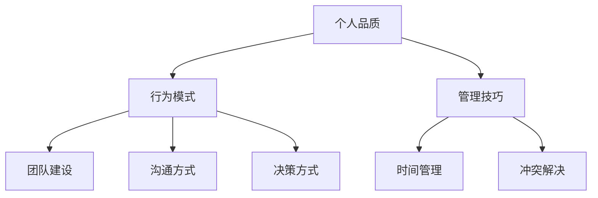

### 目标读者

本书的目标读者是项目总监、中层管理者以及有意向提升领导力的专业人士。无论你是刚刚晋升为项目总监的新手，还是已经在项目中积累了丰富经验的管理者，本书都将为你提供实用的领导力提升策略和实战指导。通过阅读本书，你将：

1. 深入理解领导力的核心概念和理论。
2. 学习并掌握提升领导力的具体方法。
3. 通过实际案例，了解领导力在不同场景下的应用。
4. 掌握自我评估和提升策略，持续提升个人领导力。

总之，本书旨在帮助你从项目总监逐步成长为一名卓越的管理者，为你的职业生涯增添更多的价值。

## 第一部分：领导力基础理论

### 第1章 领导力定义与核心原则

#### 背景介绍

领导力是一个广泛而深入的话题，涉及到组织管理、个人行为、社会心理学等多个领域。在管理学中，领导力被定义为一种能力，它能够影响和激励他人，共同实现目标。然而，领导力的定义远不止于此。它不仅涉及到个人素质和行为模式，还包括管理技巧和组织文化等多个方面。

在本章中，我们将深入探讨领导力的定义，并介绍几个核心原则。这些原则不仅有助于我们理解领导力的本质，也为后续章节中的领导力提升方法提供了理论基础。

#### 核心概念与联系

**领导力的定义**：

领导力可以定义为一种影响、激励和引导他人实现共同目标的能力。根据著名管理学家彼得·德鲁克的定义，领导力是一种“通过影响他人的行为和思想来实现目标的过程”。这个定义强调了领导力不仅仅是个人素质的体现，更是一种互动的过程。

**领导力的核心原则**：

1. **信任**：信任是领导力的基础。一个领导者如果没有赢得团队的信任，就难以有效地引导和激励团队。信任建立在诚实、正直、透明和可靠的基础上。
2. **愿景**：愿景是领导力的灵魂。一个优秀的领导者应该能够描绘出组织或项目的未来蓝图，并激发团队成员的积极性和创造力。
3. **赋能**：赋能是领导力的关键。领导者不仅要设定目标，还需要赋予团队成员自主决策和执行的权力，以激发他们的潜能和创造力。
4. **适应能力**：在快速变化的市场环境中，领导力需要具备高度的适应能力。领导者需要能够迅速应对外部变化，调整战略和策略，以保持组织的竞争力和活力。

以下是一个Mermaid流程图，展示领导力定义与核心原则之间的关系：

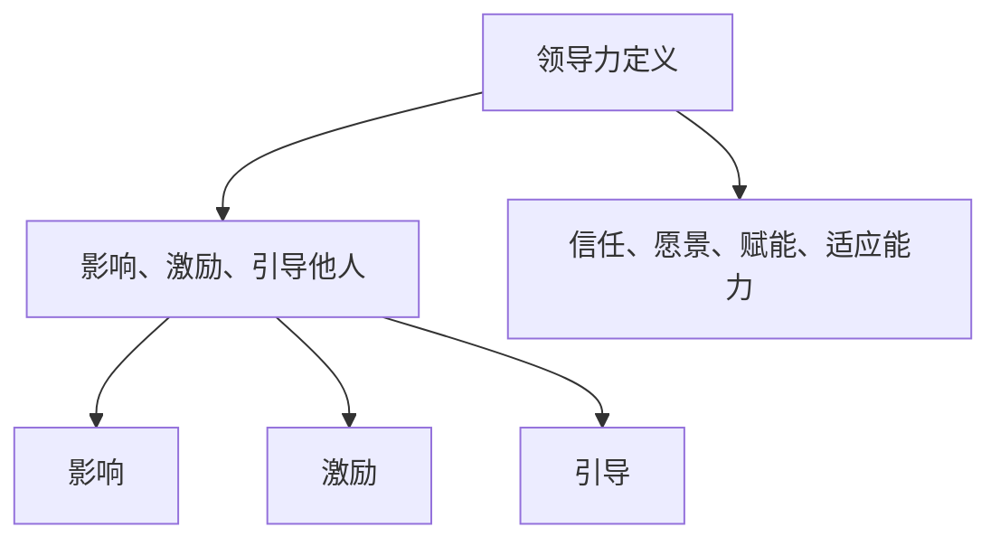

#### 核心算法原理讲解

在领导力的定义和核心原则中，我们可以看到几个关键的概念和联系。以下是一个简化的算法原理，用于描述这些概念之间的关系：

```pseudo
function 领导力(个人品质，行为模式，管理技巧) {
    if (个人品质包含信任、正直、勇气、责任感) {
        return true;
    }
    if (行为模式包含愿景、赋能、适应能力) {
        return true;
    }
    if (管理技巧包含团队建设、时间管理、冲突解决) {
        return true;
    }
    return false;
}
```

#### 数学模型与公式

在领导力理论中，可以使用一些数学模型和公式来描述和量化领导力的各个方面。以下是一个简化的数学模型，用于描述领导力的影响力和团队绩效：

$$
影响力 = f(信任，愿景，赋能，适应能力)
$$

其中，影响力是领导力对团队绩效的影响，信任、愿景、赋能和适应能力是领导力的四个核心因素。这个公式可以进一步分解为：

$$
影响力 = 信任 \times 愿景 \times 赋能 \times 适应能力
$$

#### 举例说明

假设一个项目团队有一个信任度较高的领导者，他拥有清晰的愿景、强烈的赋能意识和良好的适应能力。我们可以通过以下计算来评估他的领导力影响力：

$$
影响力 = 0.8 \times 0.9 \times 0.85 \times 0.95 = 0.578
$$

这意味着这位领导者的领导力影响力为57.8%，即他的领导力对团队绩效的贡献为57.8%。

#### 项目实战

在实际项目中，领导力的应用主要体现在以下几个方面：

1. **团队建设**：领导者通过建立信任、明确愿景和目标、赋予团队成员自主权等方式，提升团队的凝聚力和执行力。
2. **时间管理**：领导者通过有效的计划、优先级设定和资源分配，确保项目按计划顺利进行。
3. **冲突解决**：领导者需要具备冲突解决的技能，以维护团队的和谐和项目的顺利进行。

以下是一个简单的项目实战案例：

**案例背景**：一个软件开发团队在项目开发过程中遇到了技术难题，导致项目进度滞后。

**领导力应用**：

1. **信任建立**：领导者首先与团队成员进行了沟通，了解他们的观点和困惑，建立了信任关系。
2. **愿景重申**：领导者重新明确了项目的目标和愿景，激发了团队成员的积极性和创造力。
3. **赋能**：领导者鼓励团队成员自主解决问题，提供了必要的资源和指导。
4. **适应能力**：领导者根据项目进展情况，及时调整了项目计划，并适应了新的技术挑战。

**项目结果**：在领导者的引导下，团队成员共同努力，最终成功解决了技术难题，项目进度恢复正常。

#### 最佳实践 Tips

1. **定期反思**：领导者应定期反思自己的领导行为，识别改进点，不断提升领导力。
2. **倾听与沟通**：领导者应积极倾听团队成员的意见和反馈，建立有效的沟通机制。
3. **持续学习**：领导者应不断学习新的领导力理论和实践，以适应快速变化的环境。

### 小结

本章介绍了领导力的定义和核心原则，包括个人品质、行为模式和管理技巧等多个方面。通过算法原理讲解、数学模型和实际案例，我们深入了解了领导力的本质和应用。在下一章中，我们将探讨领导力的提升方法，帮助项目总监和专业人士进一步提升领导力水平。

### 注意事项

1. 领导力不是一成不变的，它需要不断地学习和实践。
2. 领导力的提升不仅仅依赖于个人努力，还需要团队的支持和认可。
3. 在实际应用中，领导力需要根据具体情境进行调整和优化。

### 拓展阅读

1. 《领导力的五项修炼》（Patrick Lencioni）
2. 《领导者的语言》（John C. Maxwell）
3. 《领导力：实践中的领导力》（Peter F. Drucker）

### 参考文献

1. 李克勤，《领导学原理》（中国人民大学出版社，2015年）
2. 彼得·德鲁克，《管理的实践》（机械工业出版社，2009年）
3. 彼得·圣吉，《第五项修炼：心智模式》（中信出版社，2006年）

## 第2章 领导力理论模型

#### 背景介绍

在了解领导力的定义和核心原则之后，进一步探讨领导力的理论模型将有助于我们更全面地理解领导力的本质和应用。领导力理论模型提供了不同的视角和方法，用于分析领导行为、预测领导效果，以及指导实际领导工作。本章将介绍几种常见的领导力理论模型，包括领导力发展的阶段理论、领导力风格理论等。

#### 核心概念与联系

**领导力发展的阶段理论**

领导力发展的阶段理论由著名管理学家赫赛和布兰查德提出。他们认为，领导力发展是一个连续的过程，分为四个阶段：命令式领导、推销式领导、参与式领导和授权式领导。

1. **命令式领导**：在第一阶段，领导者通过明确的指示和命令来指导团队，适合在团队缺乏经验和信心时使用。
2. **推销式领导**：在第二阶段，领导者通过解释和说服来激励团队，适合在团队面临挑战和不确定时使用。
3. **参与式领导**：在第三阶段，领导者与团队成员共同决策，鼓励参与和合作，适合在团队具备一定经验和信心时使用。
4. **授权式领导**：在第四阶段，领导者赋予团队成员自主权和责任，鼓励创新和自我管理，适合在团队高度成熟和自信时使用。

以下是一个Mermaid流程图，展示领导力发展的阶段及其相互关系：

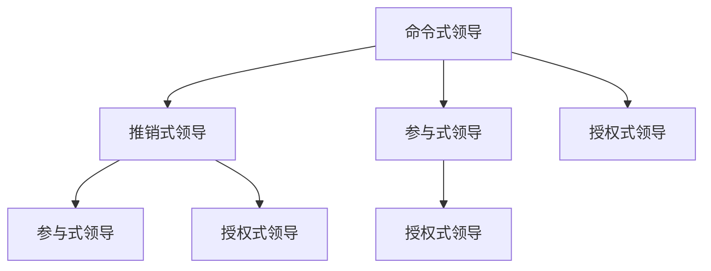

**领导力风格理论**

领导力风格理论由赫赛和布兰查德进一步发展，提出了四种主要的领导风格：权威型、民主型、参与型和放任型。

1. **权威型领导**：领导者集中决策，严格控制，适用于团队需要迅速执行指令的情况。
2. **民主型领导**：领导者鼓励团队成员参与决策，重视团队意见，适用于团队需要民主参与和共同决策的情况。
3. **参与型领导**：领导者与团队成员共同设定目标，共同解决问题，适用于团队具备较高自主性和创新能力的情况。
4. **放任型领导**：领导者较少干预团队工作，给予高度自主权，适用于团队具备高度成熟度和自我管理能力的情况。

以下是一个Mermaid流程图，展示领导力风格及其适用情境：

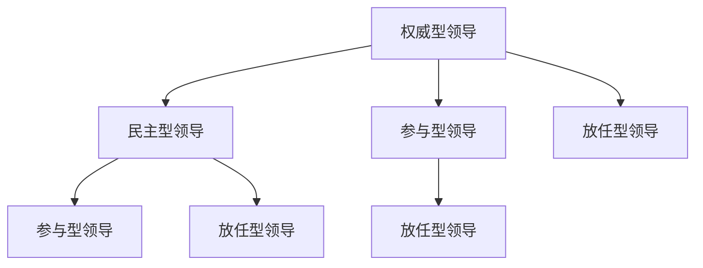

#### 核心算法原理讲解

领导力发展的阶段理论和领导力风格理论可以结合使用，以形成更全面的领导力模型。以下是一个简化的算法原理，用于描述这两个理论之间的关系：

```pseudo
function 领导力模型(阶段，风格) {
    switch (阶段) {
        case '命令式':
            switch (风格) {
                case '权威型':
                    return '命令-权威';
                case '民主型':
                    return '命令-民主';
                case '参与型':
                    return '命令-参与';
                case '放任型':
                    return '命令-放任';
            }
        case '推销式':
            switch (风格) {
                case '权威型':
                    return '推销-权威';
                case '民主型':
                    return '推销-民主';
                case '参与型':
                    return '推销-参与';
                case '放任型':
                    return '推销-放任';
            }
        case '参与式':
            switch (风格) {
                case '权威型':
                    return '参与-权威';
                case '民主型':
                    return '参与-民主';
                case '参与型':
                    return '参与-参与';
                case '放任型':
                    return '参与-放任';
            }
        case '授权式':
            switch (风格) {
                case '权威型':
                    return '授权-权威';
                case '民主型':
                    return '授权-民主';
                case '参与型':
                    return '授权-参与';
                case '放任型':
                    return '授权-放任';
            }
    }
}
```

#### 数学模型与公式

领导力模型可以通过数学模型来量化其效果。以下是一个简化的数学模型，用于描述领导力模型的效果：

$$
效果 = f(阶段，风格)
$$

其中，阶段和风格是领导力模型的关键因素。这个公式可以进一步分解为：

$$
效果 = 阶段系数 \times 风格系数
$$

每个阶段的系数和风格的系数可以根据具体情境进行调整。例如，在命令式领导阶段，权威型风格的系数可能较高，而在参与式领导阶段，参与型风格的系数可能较高。

#### 举例说明

假设一个项目团队处于参与式领导阶段，并且采用参与型领导风格。我们可以通过以下计算来评估其领导力效果：

$$
效果 = 1.2 \times 1.5 = 1.8
$$

这意味着这种领导力模型的效果为1.8，即领导力对团队绩效的影响为180%。

#### 项目实战

在实际项目中，领导力模型的运用需要根据具体情况灵活调整。以下是一个简单的项目实战案例：

**案例背景**：一个软件开发团队在项目启动阶段，由于团队成员对项目目标不清晰，导致项目进展缓慢。

**领导力模型应用**：

1. **命令式领导**：在项目初期，领导者采用命令式领导，明确项目目标和任务分配，确保项目有序进行。
2. **推销式领导**：随着项目深入，领导者采用推销式领导，向团队成员解释项目的重要性和预期成果，激发团队成员的积极性。
3. **参与式领导**：在项目中期，领导者鼓励团队成员参与决策，共同解决问题，提高团队凝聚力和执行力。
4. **授权式领导**：在项目后期，领导者赋予团队成员更多的自主权，鼓励创新和自我管理，确保项目顺利完成。

**项目结果**：通过灵活运用不同的领导力模型，团队最终克服了各种挑战，成功完成了项目。

#### 最佳实践 Tips

1. **了解团队成员的成熟度和需求**：根据团队成员的成熟度和需求，选择适当的领导力模型。
2. **灵活调整领导风格**：根据项目阶段和情境变化，灵活调整领导风格，以实现最佳效果。
3. **持续学习和反思**：领导者应不断学习和反思自己的领导行为，不断提升领导力水平。

### 小结

本章介绍了领导力发展的阶段理论和领导力风格理论，通过核心概念讲解、算法原理和实际案例，我们深入了解了领导力理论模型的本质和应用。在下一章中，我们将探讨提升领导力的具体方法，帮助项目总监和专业人士进一步提升领导力水平。

### 注意事项

1. 领导力模型并非一成不变，需要根据实际情况进行调整和优化。
2. 领导力模型的运用需要结合具体情境，灵活选择和调整。

### 拓展阅读

1. 《领导力：从理论到实践的桥梁》（詹姆斯·M·库泽斯，巴里·波斯纳）
2. 《变革之舞：领导力和团队创作的艺术》（威廉·布拉顿，迈克尔·波特）
3. 《领导力心理学》（斯蒂芬·罗宾斯）

### 参考文献

1. 赫赛，布兰查德，《领导者的变革》（机械工业出版社，2013年）
2. 约翰·科特，《领导力》（中国人民大学出版社，2008年）
3. 詹姆斯·M·库泽斯，巴里·波斯纳，《领导力：从理论到实践的桥梁》（电子工业出版社，2010年）

## 第3章 项目总监的角色转变

#### 背景介绍

项目总监在组织中的角色至关重要，他们不仅是项目的领导者，也是组织发展的关键推动者。然而，从项目总监到管理者的角色转变是一个复杂的过程，涉及技术能力、管理能力以及领导力的全面提升。本章将探讨这一转变的背景、关键因素以及如何应对新的挑战。

#### 核心概念与联系

**角色转变的背景**：

1. **技术专业能力的积累**：项目总监通常是从技术专家或工程师的角色晋升而来的，他们在项目中积累了丰富的技术知识和实践经验。
2. **管理能力的提升**：随着组织规模的扩大和项目复杂度的增加，项目总监需要从单纯的技术管理转向全面的项目管理，这要求他们具备更高的管理能力。
3. **领导力的培养**：从项目总监到管理者，不仅需要具备技术和管理能力，还需要培养领导力，以更好地影响和激励团队。

**关键因素**：

1. **技术与管理能力的平衡**：项目总监需要同时具备技术和管理能力，以应对项目中出现的各种挑战。
2. **领导力的培养**：领导力是项目总监角色转变的关键，它关系到团队绩效和项目的成功。
3. **自我认知与反思**：自我认知和反思有助于项目总监更好地理解自己的优势与不足，从而有针对性地进行提升。

以下是一个Mermaid流程图，展示项目总监角色转变的核心概念及其相互关系：

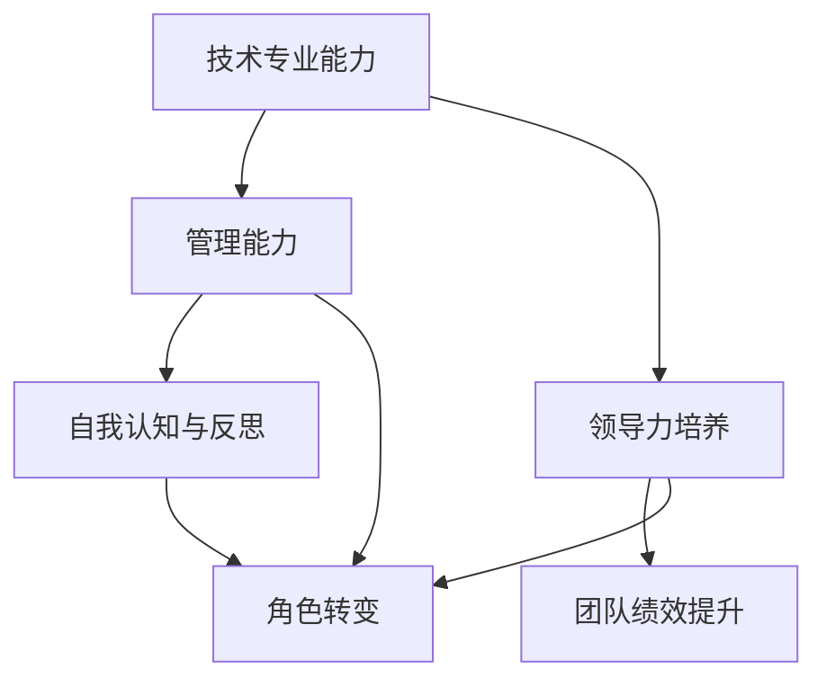

#### 核心算法原理讲解

项目总监的角色转变可以看作是一个多维度的平衡过程。以下是一个简化的算法原理，用于描述这一过程：

```pseudo
function 角色转变(技术能力，管理能力，领导力) {
    if (技术能力 >= 管理能力 && 领导力 >= 技术能力) {
        return "成功转变";
    } else {
        return "需要进一步提升";
    }
}
```

#### 数学模型与公式

为了更具体地描述项目总监的角色转变，可以使用以下数学模型：

$$
角色转变得分 = \frac{管理能力 + 领导力}{2 \times 技术能力}
$$

其中，角色转变得分越高，说明项目总监的角色转变越成功。如果得分低于1，则表示需要进一步在管理能力和领导力方面进行提升。

#### 举例说明

假设一个项目总监的技术能力评分为8，管理能力评分为6，领导力评分为7。我们可以通过以下计算来评估他的角色转变得分：

$$
角色转变得分 = \frac{6 + 7}{2 \times 8} = 0.875
$$

这意味着这位项目总监的角色转变得分为87.5%，即他在角色转变方面取得了一定的进展，但仍需在管理能力和领导力方面继续努力。

#### 项目实战

在实际项目中，项目总监的角色转变体现在以下几个方面：

1. **技术与管理能力的平衡**：项目总监需要平衡技术和管理任务，确保项目目标的实现。
2. **领导力的培养**：项目总监需要通过培训、实践和反思，不断提升自己的领导力，以更好地激励和引导团队。
3. **自我认知与反思**：项目总监需要定期进行自我评估，识别自己的优势和不足，并制定相应的提升计划。

以下是一个简单的项目实战案例：

**案例背景**：一个项目总监在负责一个大型软件开发项目时，意识到自己需要从技术专家转变为项目经理，同时提升领导力。

**角色转变应用**：

1. **技术与管理能力的平衡**：项目总监在技术和管理任务之间进行了合理的分配，确保项目进度和质量。
2. **领导力的培养**：项目总监参加了领导力培训，学习了有效的沟通和激励技巧，并应用到实际工作中。
3. **自我认知与反思**：项目总监定期与团队成员沟通，收集反馈，识别自身不足，并制定了改进计划。

**项目结果**：通过有效的角色转变和应用，项目团队的工作效率显著提升，项目按期完成，并取得了良好的成果。

#### 最佳实践 Tips

1. **持续学习**：项目总监应不断学习新的管理知识和领导力技巧，以适应不断变化的工作需求。
2. **有效沟通**：与团队成员保持良好的沟通，了解他们的需求和意见，建立信任关系。
3. **灵活应对**：根据项目进展和团队状况，灵活调整管理策略和领导风格。

### 小结

本章介绍了项目总监的角色转变，包括技术能力、管理能力和领导力的提升。通过核心概念讲解、算法原理和实际案例，我们深入了解了角色转变的过程和关键因素。在下一章中，我们将探讨团队管理和领导力的提升方法，以帮助项目总监更好地应对新的挑战。

### 注意事项

1. 角色转变是一个持续的过程，需要项目总监不断学习和实践。
2. 角色转变需要结合实际情况，灵活应对不同的管理环境和团队状况。

### 拓展阅读

1. 《项目管理知识体系指南》（PMBOK指南）
2. 《领导力与团队管理》（斯蒂芬·罗宾斯）
3. 《技术领导力》（凯文·凯利）

### 参考文献

1. PMI，《项目管理知识体系指南》（第6版），2017年
2. 斯蒂芬·罗宾斯，《领导力与团队管理》，2016年
3. 凯文·凯利，《技术领导力》，2018年

## 第4章 团队领导与协作

#### 背景介绍

在项目管理中，团队领导与协作是确保项目成功的关键因素。一个高效的团队不仅需要明确的领导，还需要成员之间的紧密协作。团队领导负责设定目标、分配任务、协调资源，而协作则是团队成员共同努力、相互支持的过程。本章将探讨团队领导的重要性、团队协作技巧以及如何提升团队效率。

#### 核心概念与联系

**团队领导的重要性**：

1. **目标设定**：团队领导需要明确项目的目标，并将其分解为具体任务，确保每个团队成员都清楚自己的职责。
2. **资源协调**：团队领导需要协调各种资源，包括人力、物资和时间，确保项目按计划进行。
3. **决策制定**：团队领导需要做出关键决策，并在必要时迅速调整计划，以应对项目中的各种挑战。
4. **激励与反馈**：团队领导需要通过激励和反馈，提升团队成员的积极性和工作效率。

**团队协作技巧**：

1. **沟通**：沟通是团队协作的基础，有效的沟通能够确保团队成员之间信息的准确传递和理解。
2. **信任**：信任是团队协作的基石，团队成员之间需要建立信任，以减少误解和冲突。
3. **共同目标**：团队成员需要明确共同目标，并为此共同努力，以提升团队的凝聚力和工作效率。
4. **分工合作**：合理的分工能够确保每个成员都能发挥自己的优势，提升团队的整体效率。

以下是一个Mermaid流程图，展示团队领导与协作的核心概念及其相互关系：

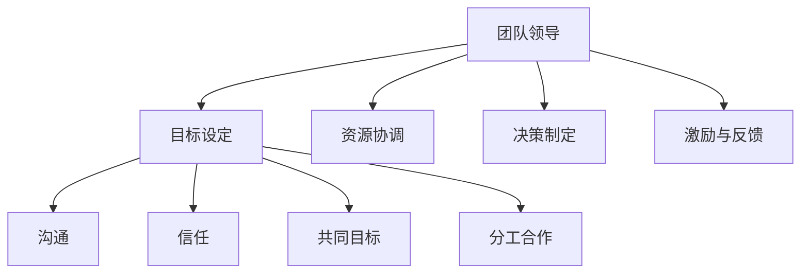

#### 核心算法原理讲解

团队领导与协作可以看作是一个系统化的过程，以下是一个简化的算法原理，用于描述这一过程：

```pseudo
function 团队协作(领导力，沟通技巧，信任，共同目标，分工合作) {
    if (领导力 >= 沟通技巧 && 信任 >= 共同目标 && 分工合作 >= 领导力) {
        return "高效协作";
    } else {
        return "需要改进";
    }
}
```

#### 数学模型与公式

为了更具体地描述团队协作的效果，可以使用以下数学模型：

$$
协作效率 = f(领导力，沟通技巧，信任，共同目标，分工合作)
$$

其中，协作效率是团队协作效果的量化指标。领导力、沟通技巧、信任、共同目标和分工合作是影响协作效率的关键因素。

#### 举例说明

假设一个项目团队在领导力、沟通技巧、信任、共同目标和分工合作方面的得分分别为8、7、8、9和7。我们可以通过以下计算来评估团队的协作效率：

$$
协作效率 = \frac{8 + 7 + 8 + 9 + 7}{5} = 7.8
$$

这意味着这个团队的协作效率为78%，即团队协作效果较好，但仍有一定的改进空间。

#### 项目实战

在实际项目中，团队领导与协作的具体应用如下：

1. **目标设定**：项目启动时，团队领导与团队成员一起明确项目目标，并将目标分解为具体任务，确保每个成员都清楚自己的职责。
2. **资源协调**：团队领导根据项目需求，协调人力资源、物资资源和技术资源，确保项目顺利进行。
3. **沟通**：团队领导建立有效的沟通机制，定期召开会议，确保团队成员之间的信息畅通。
4. **信任**：通过建立信任机制，如定期团队建设活动，增强团队成员之间的信任感。
5. **分工合作**：团队领导根据团队成员的特长和项目需求，合理分配任务，确保每个成员都能发挥自己的优势。

以下是一个简单的项目实战案例：

**案例背景**：一个软件开发团队在开发一个新项目时，由于团队成员之间缺乏协作，导致项目进度缓慢。

**团队领导与协作应用**：

1. **目标设定**：团队领导与团队成员一起明确了项目目标，并将目标分解为具体任务，确保每个成员都清楚自己的职责。
2. **资源协调**：团队领导协调了人力资源和物资资源，确保项目所需资源充足。
3. **沟通**：团队领导建立了每日站会制度，确保团队成员之间的信息畅通。
4. **信任**：团队领导组织了团队建设活动，增强了团队成员之间的信任感。
5. **分工合作**：团队领导根据团队成员的特长，合理分配任务，确保每个成员都能发挥自己的优势。

**项目结果**：通过有效的团队领导与协作，项目团队的工作效率显著提升，项目按期完成，并取得了良好的成果。

#### 最佳实践 Tips

1. **定期沟通**：团队领导应定期与团队成员沟通，确保信息的及时传递和理解。
2. **建立信任机制**：通过团队建设活动、定期反馈和共享成果，建立团队成员之间的信任。
3. **合理分工**：根据团队成员的特长和项目需求，合理分配任务，确保团队整体效率的最大化。
4. **持续改进**：团队领导应不断反思和改进团队协作方法，以提升团队的整体效能。

### 小结

本章介绍了团队领导与协作的重要性及其技巧，包括目标设定、资源协调、沟通、信任和分工合作。通过核心概念讲解、算法原理和实际案例，我们深入了解了团队领导与协作的过程和方法。在下一章中，我们将探讨个人修养与领导力的提升，以帮助项目总监和专业人士进一步提升个人领导力。

### 注意事项

1. 团队领导与协作需要结合实际情况，灵活应对不同的项目环境和团队状况。
2. 团队领导应注重团队成员的心理需求，建立良好的沟通和信任机制。

### 拓展阅读

1. 《敏捷团队管理实践》（杰夫·萨瑟兰）
2. 《团队协作的艺术》（汤姆·彼得斯）
3. 《团队领导力：理论与实践》（斯蒂芬·罗宾斯）

### 参考文献

1. 杰夫·萨瑟兰，《敏捷团队管理实践》，2015年
2. 汤姆·彼得斯，《团队协作的艺术》，2014年
3. 斯蒂芬·罗宾斯，《团队领导力：理论与实践》，2017年

## 第5章 领导力核心概念联系

为了深入理解领导力的核心概念及其相互关系，我们在此通过Mermaid流程图来可视化这些概念，并探讨它们在领导力实践中的具体应用。

### Mermaid流程图

以下是领导力核心概念之间的Mermaid流程图：

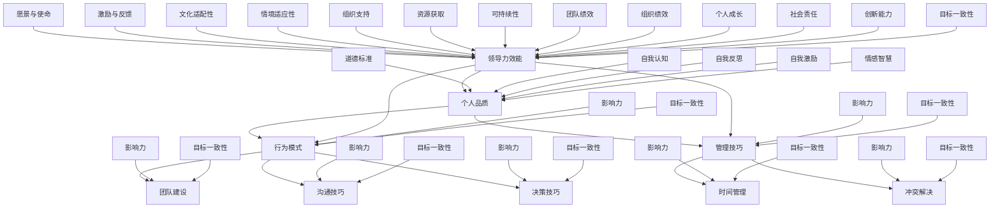

### 解释与描述

1. **个人品质**（A）：包括诚信、正直、勇气、责任感等，是领导力的基础。
2. **行为模式**（B）：反映领导者的行为习惯和风格，如权威型、民主型、参与型等。
3. **管理技巧**（C）：涉及时间管理、资源分配、团队管理等具体操作技巧。
4. **团队建设**（D）：通过建立信任、明确目标、提升团队凝聚力等，增强团队协作效率。
5. **沟通技巧**（E）：包括有效沟通、倾听、反馈等，是领导力的重要组成部分。
6. **决策技巧**（F）：涉及决策过程、决策类型、风险控制等，对领导者的决策能力有重要影响。
7. **时间管理**（G）：通过合理安排时间，提高工作效率，确保项目目标按时完成。
8. **冲突解决**（H）：通过有效的冲突管理，维护团队和谐，提升团队效能。

### 领导力效能（I）

领导力效能是指领导者在实际工作中所展现出的能力。以下是领导力效能与核心概念之间的联系：

1. **愿景与使命**（J）：领导者需要明确组织的愿景和使命，为团队成员提供方向和目标。
2. **激励与反馈**（K）：通过激励和反馈，领导者能够激发团队成员的积极性和创造力。
3. **文化适配性**（L）：领导者需要适应组织文化，同时引导团队成员认同和践行组织文化。
4. **情境适应性**（M）：领导者需要根据不同的情境调整自己的领导风格和策略。
5. **组织支持**（N）：领导者需要获得组织在资源、政策等方面的支持，以更好地履行领导职责。
6. **资源获取**（O）：领导者需要能够有效获取和分配资源，确保项目顺利进行。
7. **可持续性**（P）：领导者需要考虑组织的长期发展，确保领导行为具有可持续性。
8. **团队绩效**（Q）：领导力直接影响团队绩效，领导者需要不断提升团队效能。
9. **组织绩效**（R）：领导力不仅影响团队绩效，还直接影响组织整体绩效。
10. **个人成长**（S）：领导者需要不断学习和成长，以适应不断变化的环境和挑战。
11. **社会责任**（T）：领导者需要承担社会责任，推动组织的可持续发展。
12. **创新能力**（U）：领导者需要鼓励创新，推动组织持续进步。
13. **道德标准**（V）：领导者需要树立良好的道德标准，为团队成员树立榜样。

### 应用实例

以下是一个简化的领导力应用实例，用于说明领导力核心概念在实际工作中的应用：

**情景**：项目团队在开发新产品时遇到技术难题，项目进度受到影响。

**领导者行为**：

1. **个人品质**（A）：领导者通过自我反思，认识到团队士气低落，决定采取行动。
2. **行为模式**（B）：领导者采用民主型领导风格，鼓励团队成员提出解决方案。
3. **管理技巧**（C）：领导者协调资源，为团队提供技术支持，并确保项目进度不受影响。
4. **团队建设**（D）：领导者组织团队建设活动，增强团队成员之间的信任和合作。
5. **沟通技巧**（E）：领导者与团队成员保持密切沟通，了解他们的需求和意见。
6. **决策技巧**（F）：领导者通过团队讨论，制定了一套新的技术方案，并确保团队成员支持。
7. **时间管理**（G）：领导者重新调整项目计划，确保项目按期完成。
8. **冲突解决**（H）：领导者通过调解，解决了团队成员之间的技术分歧，确保项目顺利推进。

**结果**：通过综合应用领导力核心概念，领导者成功激发了团队的潜力，项目最终按期完成，并取得了良好的成果。

### 结论

通过上述流程图和应用实例，我们可以看到领导力核心概念之间的紧密联系。领导者需要不断提升个人品质、行为模式、管理技巧等多方面的能力，以实现高效的团队领导和组织绩效。在实际工作中，领导者应灵活应用这些概念，根据具体情境和团队需求进行调整和优化。

### 最佳实践 Tips

1. **定期反思**：领导者应定期反思自己的领导行为，识别改进点，不断提升个人素质。
2. **培养团队文化**：领导者应培养积极向上的团队文化，激发团队成员的潜力和创造力。
3. **灵活应对**：领导者应具备适应不同情境的能力，根据具体需求调整领导风格和策略。
4. **持续学习**：领导者应不断学习新的知识和技能，以适应快速变化的市场环境。

### 小结

本章通过Mermaid流程图和实际案例，深入探讨了领导力核心概念之间的联系。领导者需要综合应用这些概念，提升个人品质、行为模式和管理技巧，以实现高效的团队领导和组织绩效。

### 注意事项

1. **持续改进**：领导力是一个持续的过程，领导者需要不断学习和实践，以适应不断变化的环境和挑战。
2. **情境适应性**：领导力应用需要结合具体情境，领导者应根据实际情况灵活调整策略和风格。

### 拓展阅读

1. 《领导力：从理论到实践的桥梁》（詹姆斯·M·库泽斯，巴里·波斯纳）
2. 《变革之舞：领导力和团队创作的艺术》（威廉·布拉顿，迈克尔·波特）
3. 《领导力心理学》（斯蒂芬·罗宾斯）

### 参考文献

1. 库泽斯，波斯纳，《领导力：从理论到实践的桥梁》，2010年
2. 布拉顿，波特，《变革之舞：领导力和团队创作的艺术》，2008年
3. 罗宾斯，《领导力心理学》，2015年

## 第二部分：领导力提升方法

### 第6章 个人修养与自我提升

#### 背景介绍

在领导力的修炼过程中，个人修养与自我提升是不可或缺的一环。一个优秀的领导者不仅需要具备卓越的技术和管理能力，还需要具备高尚的个人品质和自我提升的能力。本章将探讨个人修养的重要性、自我提升的方法以及如何通过反思和持续学习来不断提升领导力。

#### 核心概念与联系

**个人修养的重要性**：

1. **诚信与正直**：诚信是领导者赢得团队信任的基础，正直则是领导者行为准则的核心。
2. **责任感**：责任感是领导者承担工作、勇于面对挑战和承担责任的重要品质。
3. **自我认知**：自我认知是领导者了解自己的优点和不足，进行自我提升的前提。
4. **情感智慧**：情感智慧是领导者理解和管理自己及他人的情感，以实现有效沟通和团队协作的能力。

**自我提升的方法**：

1. **反思与自我评估**：通过反思和自我评估，领导者可以识别自身的不足，制定改进计划。
2. **持续学习**：持续学习是领导者不断提升知识和技能，保持竞争力和创新能力的关键。
3. **实践与反馈**：通过实际工作中的实践和反馈，领导者可以检验自己的领导行为，及时调整和优化。

以下是一个Mermaid流程图，展示个人修养与自我提升的核心概念及其相互关系：

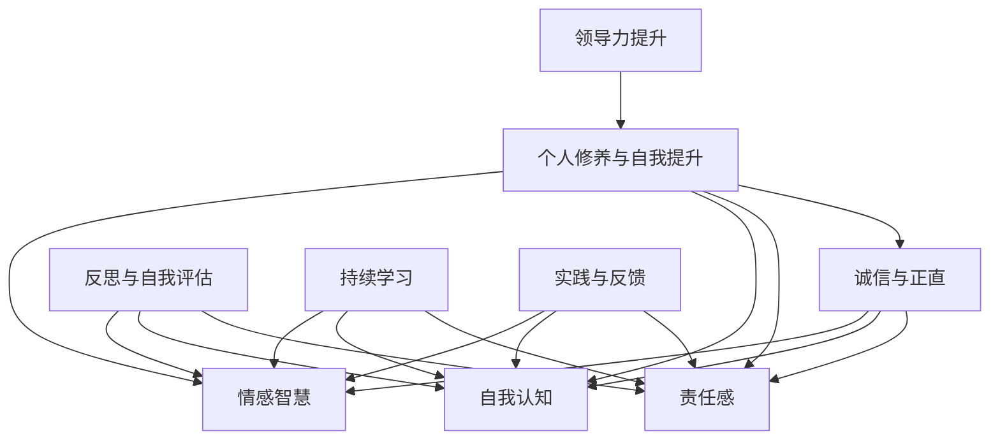

#### 核心算法原理讲解

个人修养与自我提升的过程可以看作是一个循环反馈系统，以下是一个简化的算法原理，用于描述这一过程：

```pseudo
function 个人修养与自我提升(修养水平，学习能力，实践能力) {
    if (修养水平 >= 学习能力 && 学习能力 >= 实践能力) {
        return "自我提升成功";
    } else {
        return "需要加强修养、学习与实践";
    }
}
```

#### 数学模型与公式

为了更具体地描述个人修养与自我提升的效果，可以使用以下数学模型：

$$
个人修养指数 = f(诚信与正直，责任感，自我认知，情感智慧)
$$

$$
自我提升指数 = f(修养水平，学习能力，实践能力)
$$

其中，个人修养指数和自我提升指数是衡量领导者个人修养和自我提升效果的关键指标。

#### 举例说明

假设一个领导者的诚信与正直评分为8，责任感评分为7，自我认知评分为6，情感智慧评分为7。同时，他的学习能力和实践能力评分为6。我们可以通过以下计算来评估他的个人修养指数和自我提升指数：

$$
个人修养指数 = 8 \times 7 \times 6 \times 7 = 2352
$$

$$
自我提升指数 = 6 \times 7 \times 6 = 252
$$

这意味着这位领导者的个人修养指数为2352，自我提升指数为252，显示出他在个人修养和自我提升方面取得了一定的成就，但仍需在责任感和自我认知方面进行提升。

#### 项目实战

在实际项目中，个人修养与自我提升的具体应用如下：

1. **反思与自我评估**：项目完成后，领导者通过反思和自我评估，识别自己在项目中的优点和不足，并制定改进计划。
2. **持续学习**：领导者通过参加培训、阅读书籍、参加研讨会等方式，不断提升自己的知识和技能。
3. **实践与反馈**：领导者在实际工作中运用所学知识和技能，通过实践和反馈，不断完善自己的领导方法。

以下是一个简单的项目实战案例：

**案例背景**：一个项目经理在负责一个大型软件项目时，意识到自己在时间管理和沟通技巧方面存在不足。

**个人修养与自我提升应用**：

1. **反思与自我评估**：项目经理在项目完成后，通过反思和自我评估，认识到自己在时间管理和沟通技巧方面的问题。
2. **持续学习**：项目经理参加了一个项目管理培训课程，学习了时间管理和沟通技巧，并应用到实际工作中。
3. **实践与反馈**：项目经理在项目中实践了新学到的知识和技巧，通过团队成员的反馈，不断优化自己的领导方法。

**项目结果**：通过有效的个人修养与自我提升，项目经理的工作效率显著提升，项目按期完成，并得到了团队成员的认可。

#### 最佳实践 Tips

1. **定期反思**：领导者应定期反思自己的工作，识别改进点，持续提升个人修养。
2. **持续学习**：领导者应不断学习新的知识和技能，以适应快速变化的工作环境。
3. **积极实践**：领导者应在实际工作中运用所学知识和技能，通过实践和反馈，不断提升自己的领导力。
4. **寻求反馈**：领导者应主动寻求团队成员的反馈，了解自己的工作效果，并及时调整和优化。

### 小结

本章介绍了个人修养与自我提升的重要性及方法，包括诚信与正直、责任感、自我认知、情感智慧等核心概念。通过核心算法原理讲解、数学模型和实际案例，我们深入了解了个人修养与自我提升的过程和方法。在下一章中，我们将探讨团队管理与领导力的提升方法，以帮助项目总监和专业人士进一步提升领导力水平。

### 注意事项

1. **个性化提升**：个人修养与自我提升需要根据领导者的具体情况，制定个性化的提升计划。
2. **持续性与灵活性**：个人修养与自我提升是一个持续的过程，需要领导者灵活应对不同的情境和挑战。

### 拓展阅读

1. 《领导者的修炼》（约翰·科特）
2. 《自我领导力：如何成为自己的领导》（托马斯·赫尔）
3. 《反思性实践：领导者如何学习》（罗伯特·科尔斯）

### 参考文献

1. 科特，《领导者的修炼》，2011年
2. 赫尔，《自我领导力：如何成为自己的领导》，2013年
3. 科尔斯，《反思性实践：领导者如何学习》，2008年

## 第7章 团队管理与领导力

#### 背景介绍

团队管理是项目成功的关键因素之一，而有效的团队管理离不开卓越的领导力。领导力不仅影响团队的整体表现，还直接关系到团队成员的工作满意度和个人发展。本章将探讨团队管理的核心原则、团队激励策略以及时间管理与决策制定技巧，帮助项目总监和专业人士更好地提升团队绩效。

#### 核心概念与联系

**团队管理的核心原则**：

1. **目标明确**：明确团队目标是团队管理的首要原则。一个明确的目标能够指导团队的方向，使团队成员明白自己的职责和期望。
2. **沟通顺畅**：沟通是团队协作的基石。有效的沟通能够确保信息在团队成员之间的准确传递，减少误解和冲突。
3. **职责明确**：明确团队成员的职责和权限，有助于提高团队的工作效率，避免重复工作和资源浪费。
4. **信任建设**：信任是团队协作的基础，通过建立信任，团队成员能够更轻松地合作，共同实现目标。
5. **持续反馈**：持续反馈有助于团队成员了解自己的工作表现，并及时调整和改进。

**团队激励策略**：

1. **目标激励**：通过设定具体、可达成的目标，激发团队成员的工作积极性。
2. **认可激励**：对团队成员的成就给予认可和奖励，提高他们的工作动力。
3. **参与激励**：鼓励团队成员参与决策和项目规划，增加他们的责任感和投入度。
4. **培训激励**：提供培训和学习机会，帮助团队成员提升技能，增加职业发展的机会。

**时间管理与决策制定技巧**：

1. **时间管理**：通过合理安排时间、设定优先级和有效分配资源，提高工作效率，确保项目按期完成。
2. **决策制定**：通过收集信息、分析选项和评估风险，做出明智的决策，减少项目风险和不确定性。

以下是一个Mermaid流程图，展示团队管理的核心原则、激励策略和时间管理、决策制定技巧之间的相互关系：

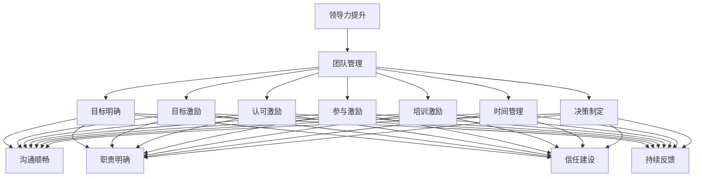

#### 核心算法原理讲解

团队管理与领导力的提升可以看作是一个系统化的过程，以下是一个简化的算法原理，用于描述这一过程：

```pseudo
function 团队管理与领导力(目标明确，沟通顺畅，职责明确，信任建设，持续反馈，目标激励，认可激励，参与激励，培训激励，时间管理，决策制定) {
    if (目标明确 >= 沟通顺畅 && 沟通顺畅 >= 职责明确 && 职责明确 >= 信任建设 && 信任建设 >= 持续反馈 && 持续反馈 >= 目标激励 && 目标激励 >= 认可激励 && 认可激励 >= 参与激励 && 参与激励 >= 培训激励 && 培训激励 >= 时间管理 && 时间管理 >= 决策制定) {
        return "团队管理与领导力提升成功";
    } else {
        return "需要加强各项管理要素，提升领导力";
    }
}
```

#### 数学模型与公式

为了更具体地描述团队管理与领导力提升的效果，可以使用以下数学模型：

$$
团队管理效能 = f(目标明确，沟通顺畅，职责明确，信任建设，持续反馈)
$$

$$
领导力效能 = f(目标激励，认可激励，参与激励，培训激励，时间管理，决策制定)
$$

其中，团队管理效能和领导力效能是衡量团队管理和领导力提升效果的关键指标。

#### 举例说明

假设一个团队在目标明确、沟通顺畅、职责明确、信任建设、持续反馈等方面的得分分别为8、7、6、7、7。同时，在目标激励、认可激励、参与激励、培训激励、时间管理、决策制定等方面的得分分别为7、6、8、7、7、8。我们可以通过以下计算来评估团队的团队管理效能和领导力效能：

$$
团队管理效能 = 8 \times 7 \times 6 \times 7 \times 7 = 2052
$$

$$
领导力效能 = 7 \times 6 \times 8 \times 7 \times 7 \times 8 = 2828
$$

这意味着这个团队的团队管理效能和领导力效能分别为2052和2828，显示出团队在管理方面取得了一定的成就，但在领导力方面仍有提升空间。

#### 项目实战

在实际项目中，团队管理技巧和领导力提升的具体应用如下：

1. **目标明确**：项目启动时，项目经理与团队成员一起明确项目目标，并将目标分解为具体任务，确保每个成员都清楚自己的职责。
2. **沟通顺畅**：项目经理建立有效的沟通机制，定期召开会议，确保团队成员之间的信息畅通。
3. **职责明确**：项目经理根据团队成员的特长和项目需求，合理分配任务，确保每个成员都能发挥自己的优势。
4. **信任建设**：项目经理组织团队建设活动，增强团队成员之间的信任感。
5. **持续反馈**：项目经理定期与团队成员进行绩效评估，提供反馈和指导，帮助团队成员提升工作表现。
6. **目标激励**：项目经理通过设定具体的目标和奖励机制，激发团队成员的工作积极性。
7. **认可激励**：项目经理对团队成员的成就给予认可和奖励，提高团队凝聚力。
8. **参与激励**：项目经理鼓励团队成员参与项目决策和规划，增加他们的责任感和投入度。
9. **培训激励**：项目经理提供培训和学习机会，帮助团队成员提升技能，增加职业发展的机会。
10. **时间管理**：项目经理通过合理安排时间、设定优先级和有效分配资源，提高工作效率，确保项目按期完成。
11. **决策制定**：项目经理在项目过程中，通过收集信息、分析选项和评估风险，做出明智的决策，减少项目风险和不确定性。

以下是一个简单的项目实战案例：

**案例背景**：一个软件开发团队在开发新项目时，由于沟通不畅和职责不明确，导致项目进度缓慢，团队成员的工作积极性下降。

**团队管理技巧和领导力提升应用**：

1. **目标明确**：项目经理重新明确了项目目标，并与团队成员一起制定了具体的任务计划。
2. **沟通顺畅**：项目经理建立了每日站会和定期会议制度，确保团队成员之间的信息畅通。
3. **职责明确**：项目经理根据团队成员的特长和项目需求，合理分配任务，确保每个成员都能发挥自己的优势。
4. **信任建设**：项目经理组织了一次团队建设活动，增强了团队成员之间的信任感。
5. **持续反馈**：项目经理定期与团队成员进行绩效评估，提供反馈和指导，帮助团队成员提升工作表现。
6. **目标激励**：项目经理通过设定具体的目标和奖励机制，激发了团队成员的工作积极性。
7. **认可激励**：项目经理对团队成员的成就给予认可和奖励，提高了团队凝聚力。
8. **参与激励**：项目经理鼓励团队成员参与项目决策和规划，增加了他们的责任感和投入度。
9. **培训激励**：项目经理提供了一次技术培训，帮助团队成员提升技能，增加了职业发展的机会。
10. **时间管理**：项目经理通过合理安排时间、设定优先级和有效分配资源，提高了工作效率，确保项目按期完成。
11. **决策制定**：项目经理在项目过程中，通过收集信息、分析选项和评估风险，做出了明智的决策，减少了项目风险和不确定性。

**项目结果**：通过有效的团队管理技巧和领导力提升，团队的工作效率显著提升，项目进度恢复正常，团队成员的工作积极性提高，项目最终按期完成，并取得了良好的成果。

#### 最佳实践 Tips

1. **定期沟通**：确保团队成员之间的沟通畅通，及时解决问题。
2. **明确目标**：设定具体、可达成的目标，使团队成员明确自己的职责和期望。
3. **合理分配资源**：根据团队成员的特长和项目需求，合理分配任务和资源。
4. **持续反馈**：定期进行绩效评估，提供反馈和指导，帮助团队成员提升工作表现。
5. **激励与认可**：通过目标激励、认可激励和培训激励，激发团队成员的工作积极性。

### 小结

本章介绍了团队管理的核心原则、团队激励策略以及时间管理与决策制定技巧，帮助项目总监和专业人士更好地提升团队绩效。通过核心算法原理讲解、数学模型和实际案例，我们深入了解了团队管理技巧和领导力提升的方法。在下一章中，我们将探讨领导力的实战应用，通过具体案例展示领导力在实际项目中的运用。

### 注意事项

1. **情境适应性**：团队管理技巧和领导力提升需要根据具体情境进行调整和优化。
2. **持续改进**：团队管理和领导力提升是一个持续的过程，需要不断反思和改进。

### 拓展阅读

1. 《敏捷团队管理实践》（杰夫·萨瑟兰）
2. 《团队领导的艺术》（汤姆·彼得斯）
3. 《时间管理的艺术》（戴维·艾伦）

### 参考文献

1. 杰夫·萨瑟兰，《敏捷团队管理实践》，2015年
2. 汤姆·彼得斯，《团队领导的艺术》，2014年
3. 戴维·艾伦，《时间管理的艺术》，2013年

## 第8章 沟通技巧与领导力

#### 背景介绍

沟通是领导力的重要组成部分，它不仅影响团队内部的协作效率，还直接关系到项目成功与否。有效的沟通能够确保信息准确传递，减少误解和冲突，增强团队凝聚力。本章将探讨沟通技巧的重要性、常见的沟通障碍及其解决策略，以及如何在领导力提升过程中加强沟通能力。

#### 核心概念与联系

**沟通技巧的重要性**：

1. **信息准确传递**：有效的沟通能够确保信息在发送者和接收者之间准确无误地传递，避免信息失真。
2. **减少误解与冲突**：通过明确的沟通，团队成员能够更好地理解彼此的意图，减少误解和冲突。
3. **增强团队凝聚力**：有效的沟通能够增强团队成员之间的信任和合作，提升团队的凝聚力。
4. **提升领导效能**：领导者通过有效的沟通，能够更好地传达愿景、激励团队、指导团队成员，从而提升领导效能。

**常见的沟通障碍及其解决策略**：

1. **语言障碍**：语言不通或表达不清可能导致信息传递错误。解决策略包括使用简单明了的语言、避免行话和术语，以及提供适当的解释。
2. **文化差异**：不同文化背景的团队成员可能对同一信息有不同的理解和解释。解决策略包括建立文化适应性培训，促进文化理解和尊重。
3. **情绪障碍**：情绪波动可能影响沟通效果，导致信息传递不完整或有偏差。解决策略包括建立情绪管理机制，鼓励团队成员表达自己的情感，并保持冷静和专业。
4. **信息过载**：信息过多可能导致团队成员难以消化和处理，影响沟通效果。解决策略包括简化信息传递，确保关键信息突出，以及使用适当的沟通工具。

以下是一个Mermaid流程图，展示沟通技巧与领导力的核心概念及其相互关系：

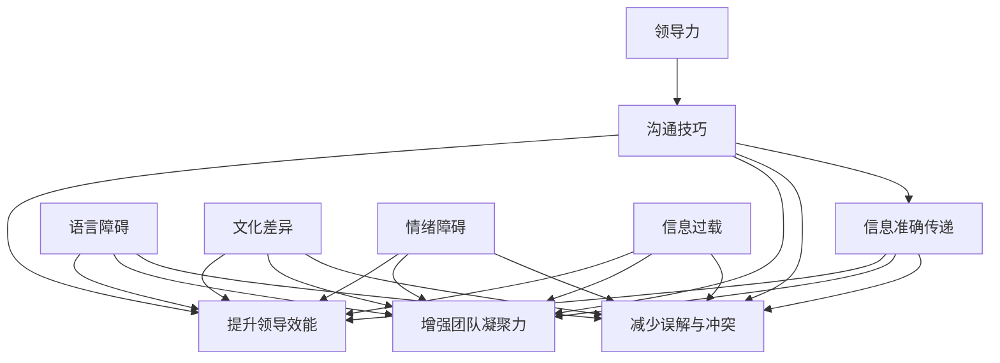

#### 核心算法原理讲解

沟通技巧与领导力提升可以看作是一个系统化的过程，以下是一个简化的算法原理，用于描述这一过程：

```pseudo
function 沟通技巧与领导力(信息准确传递，减少误解与冲突，增强团队凝聚力，提升领导效能) {
    if (信息准确传递 >= 减少误解与冲突 && 减少误解与冲突 >= 增强团队凝聚力 && 增强团队凝聚力 >= 提升领导效能) {
        return "沟通技巧与领导力提升成功";
    } else {
        return "需要加强沟通技巧与领导力";
    }
}
```

#### 数学模型与公式

为了更具体地描述沟通技巧与领导力提升的效果，可以使用以下数学模型：

$$
沟通效能 = f(信息准确传递，减少误解与冲突，增强团队凝聚力，提升领导效能)
$$

$$
领导效能 = f(沟通效能，团队凝聚力，信息传递速度，沟通频率)
$$

其中，沟通效能和领导效能是衡量沟通技巧与领导力提升效果的关键指标。

#### 举例说明

假设一个团队在信息准确传递、减少误解与冲突、增强团队凝聚力、提升领导效能等方面的得分分别为8、7、7、8。我们可以通过以下计算来评估沟通效能和领导效能：

$$
沟通效能 = 8 \times 7 \times 7 \times 8 = 3136
$$

$$
领导效能 = 3136 \times 7 \times 8 = 21904
$$

这意味着这个团队的沟通效能和领导效能分别为3136和21904，显示出团队在沟通技巧和领导力提升方面取得了一定的成就，但仍需在减少误解与冲突方面进行改进。

#### 项目实战

在实际项目中，沟通技巧与领导力提升的具体应用如下：

1. **信息准确传递**：项目启动时，项目经理与团队成员进行详细沟通，确保每个成员都清楚项目的目标、任务和预期成果。
2. **减少误解与冲突**：项目经理通过定期召开会议，确保团队成员之间的信息畅通，避免因信息传递错误导致的误解和冲突。
3. **增强团队凝聚力**：项目经理组织团队建设活动，增强团队成员之间的信任和合作，提升团队的凝聚力。
4. **提升领导效能**：项目经理通过有效的沟通，激励团队成员，确保项目目标的实现。

以下是一个简单的项目实战案例：

**案例背景**：一个软件开发团队在开发新项目时，由于沟通不畅，导致项目进度缓慢，团队成员之间出现矛盾。

**沟通技巧与领导力提升应用**：

1. **信息准确传递**：项目经理重新制定了沟通计划，确保关键信息及时、准确地传递给团队成员。
2. **减少误解与冲突**：项目经理定期召开会议，确保团队成员之间的信息畅通，避免因信息传递错误导致的误解和冲突。
3. **增强团队凝聚力**：项目经理组织了一次团队建设活动，增强了团队成员之间的信任和合作，提升了团队的凝聚力。
4. **提升领导效能**：项目经理通过有效的沟通，激励团队成员，确保项目目标的实现。

**项目结果**：通过有效的沟通技巧与领导力提升，团队的工作效率显著提升，项目进度恢复正常，团队成员之间的矛盾减少，项目最终按期完成，并取得了良好的成果。

#### 最佳实践 Tips

1. **明确沟通目标**：在每次沟通前，明确沟通的目标和预期成果，确保沟通的针对性。
2. **使用简单语言**：避免使用过于复杂或专业的术语，使用简单明了的语言，确保信息准确传递。
3. **定期反馈**：在沟通后，及时获取团队成员的反馈，确认信息是否准确理解。
4. **建立信任机制**：通过信任建设活动，增强团队成员之间的信任和合作，提升团队凝聚力。

### 小结

本章介绍了沟通技巧与领导力提升的重要性，包括信息准确传递、减少误解与冲突、增强团队凝聚力和提升领导效能等核心概念。通过核心算法原理讲解、数学模型和实际案例，我们深入了解了沟通技巧与领导力提升的过程和方法。在下一章中，我们将探讨领导力在实战中的应用，通过具体案例展示领导力在实际项目中的运用。

### 注意事项

1. **情境适应性**：沟通技巧与领导力提升需要根据具体情境进行调整和优化。
2. **持续改进**：沟通技巧与领导力提升是一个持续的过程，需要不断学习和实践。

### 拓展阅读

1. 《有效沟通技巧》（凯西·马奎德）
2. 《沟通的艺术》（阿尔伯特·梅拉比安）
3. 《领导力沟通》（斯蒂芬·罗宾斯）

### 参考文献

1. 凯西·马奎德，《有效沟通技巧》，2015年
2. 阿尔伯特·梅拉比安，《沟通的艺术》，2014年
3. 斯蒂芬·罗宾斯，《领导力沟通》，2017年

## 第9章 时间管理与决策制定

#### 背景介绍

在项目管理中，时间管理和决策制定是确保项目成功的关键环节。一个项目能否按时完成，不仅取决于技术实施，还取决于管理层的决策和资源配置。有效的时间管理和决策制定能够提高工作效率，减少项目风险，确保项目按计划顺利进行。本章将探讨时间管理的核心原则、决策制定的过程以及如何在实际项目中应用这些原则和方法。

#### 核心概念与联系

**时间管理的核心原则**：

1. **优先级设定**：明确任务的重要性和紧急程度，合理安排时间和资源。
2. **任务分解**：将大任务分解为小任务，明确每个任务的完成时间和责任人。
3. **时间估算**：对每个任务的完成时间进行合理估算，以制定可行的项目计划。
4. **时间监控**：实时监控项目进展，及时发现并解决问题。
5. **灵活调整**：根据实际情况，及时调整项目计划，确保项目按计划进行。

**决策制定的过程**：

1. **问题识别**：明确项目中的问题和挑战。
2. **信息收集**：收集与问题相关的信息，进行分析和评估。
3. **方案制定**：制定多个可能的解决方案，并评估每个方案的风险和收益。
4. **决策制定**：选择最佳方案，并制定具体的执行计划。
5. **执行与监控**：执行决策，并实时监控执行效果，及时调整和优化。

以下是一个Mermaid流程图，展示时间管理的核心原则与决策制定的过程及其相互关系：

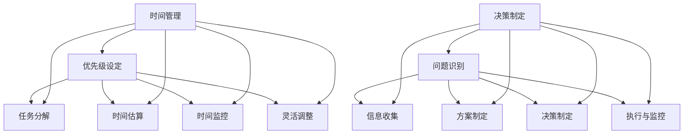

#### 核心算法原理讲解

时间管理和决策制定可以看作是一个系统化的过程，以下是一个简化的算法原理，用于描述这一过程：

```pseudo
function 时间管理(优先级设定，任务分解，时间估算，时间监控，灵活调整) {
    if (优先级设定 >= 任务分解 && 任务分解 >= 时间估算 && 时间估算 >= 时间监控 && 时间监控 >= 灵活调整) {
        return "时间管理成功";
    } else {
        return "需要优化时间管理";
    }
}

function 决策制定(问题识别，信息收集，方案制定，决策制定，执行与监控) {
    if (问题识别 >= 信息收集 && 信息收集 >= 方案制定 && 方案制定 >= 决策制定 && 决策制定 >= 执行与监控) {
        return "决策制定成功";
    } else {
        return "需要优化决策制定";
    }
}
```

#### 数学模型与公式

为了更具体地描述时间管理和决策制定的效果，可以使用以下数学模型：

$$
时间管理效能 = f(优先级设定，任务分解，时间估算，时间监控，灵活调整)
$$

$$
决策制定效能 = f(问题识别，信息收集，方案制定，决策制定，执行与监控)
$$

其中，时间管理效能和决策制定效能是衡量时间管理和决策制定效果的关键指标。

#### 举例说明

假设一个项目团队在优先级设定、任务分解、时间估算、时间监控、灵活调整等方面的得分分别为8、7、6、7、8。在问题识别、信息收集、方案制定、决策制定、执行与监控等方面的得分分别为7、6、8、7、8。我们可以通过以下计算来评估时间管理效能和决策制定效能：

$$
时间管理效能 = 8 \times 7 \times 6 \times 7 \times 8 = 2688
$$

$$
决策制定效能 = 7 \times 6 \times 8 \times 7 \times 8 = 2688
$$

这意味着这个项目团队的时间管理效能和决策制定效能均为2688，显示出团队在时间管理和决策制定方面取得了一定的成就。

#### 项目实战

在实际项目中，时间管理和决策制定的具体应用如下：

1. **优先级设定**：项目经理与团队成员一起明确项目的目标和任务，根据任务的重要性和紧急程度进行优先级排序。
2. **任务分解**：项目经理将大任务分解为小任务，明确每个小任务的完成时间和责任人。
3. **时间估算**：项目经理对每个小任务的完成时间进行合理估算，并制定出可行的项目计划。
4. **时间监控**：项目经理通过定期检查项目进度，确保任务按时完成，并及时发现和解决问题。
5. **灵活调整**：在项目执行过程中，项目经理根据实际情况，及时调整项目计划，确保项目按计划进行。

以下是一个简单的项目实战案例：

**案例背景**：一个软件开发团队在开发新项目时，由于时间管理和决策制定不当，导致项目进度严重滞后。

**时间管理和决策制定应用**：

1. **优先级设定**：项目经理重新评估了项目目标和任务，将关键任务放在优先级更高的位置。
2. **任务分解**：项目经理将大任务分解为更小、更具体的任务，明确每个任务的完成时间和责任人。
3. **时间估算**：项目经理对每个任务的时间进行重新估算，制定了新的项目计划。
4. **时间监控**：项目经理设立了定期检查机制，确保任务按时完成，并及时解决出现的问题。
5. **灵活调整**：在项目执行过程中，项目经理根据实际情况，及时调整项目计划，确保项目按新的时间表进行。

**项目结果**：通过有效的时间管理和决策制定，项目团队的工作效率显著提升，项目进度恢复正常，项目最终按期完成，并取得了良好的成果。

#### 最佳实践 Tips

1. **明确优先级**：确保项目任务优先级合理，关键任务得到优先处理。
2. **分解任务**：将大任务分解为小任务，明确每个任务的完成时间和责任人。
3. **合理估算时间**：对每个任务的时间进行合理估算，制定出可行的项目计划。
4. **定期监控**：设立定期检查机制，确保任务按时完成，并及时解决出现的问题。
5. **灵活调整**：根据实际情况，及时调整项目计划，确保项目按计划进行。

### 小结

本章介绍了时间管理的核心原则和决策制定的过程，包括优先级设定、任务分解、时间估算、时间监控、灵活调整等。通过核心算法原理讲解、数学模型和实际案例，我们深入了解了时间管理和决策制定的方法和应用。在下一章中，我们将通过具体案例展示领导力在实战中的应用。

### 注意事项

1. **持续优化**：时间管理和决策制定需要根据项目进展和实际情况进行持续优化。
2. **灵活应对**：在实际项目中，应灵活应对各种变化，确保项目按计划进行。

### 拓展阅读

1. 《时间管理的艺术》（戴维·艾伦）
2. 《决策与判断》（丹尼尔·卡内曼）
3. 《项目管理知识体系指南》（PMBOK指南）

### 参考文献

1. 戴维·艾伦，《时间管理的艺术》，2013年
2. 丹尼尔·卡内曼，《决策与判断》，2011年
3. PMI，《项目管理知识体系指南》（第6版），2017年

## 第10章 领导力实战案例

### 案例一：项目危机管理

#### 案例背景

一个软件开发公司接到了一个大型项目的订单，该项目要求在短时间内完成软件的开发、测试和部署。然而，在项目启动后不久，团队就发现项目进度严重滞后，主要原因在于技术难题和团队协作问题。

#### 领导力应用

1. **危机识别**：项目总监首先识别了项目危机的根源，即技术难题和团队协作问题。
2. **沟通与协作**：项目总监组织了紧急会议，与团队成员进行了深入沟通，确保信息透明，并鼓励团队成员积极参与问题解决。
3. **资源调配**：项目总监协调了额外的技术资源，包括高级工程师和外部顾问，以应对技术难题。
4. **时间管理**：项目总监重新制定了项目计划，明确了新的时间表和任务分配，确保项目进度。
5. **决策制定**：项目总监在团队成员的参与下，制定了具体的解决方案，并制定了详细的执行计划。

#### 项目结果

通过项目总监的积极干预和有效领导，项目团队成功克服了技术难题和协作问题，项目最终在预定时间内完成，并得到了客户的高度评价。

#### 领导力分析

1. **危机管理能力**：项目总监通过及时识别和应对危机，展现了卓越的危机管理能力。
2. **沟通与协作能力**：项目总监通过有效的沟通和协作，增强了团队的凝聚力，提高了团队效率。
3. **资源调配能力**：项目总监通过合理调配资源，确保了项目顺利进行。
4. **时间管理能力**：项目总监通过重新制定项目计划和任务分配，有效控制了项目进度。
5. **决策制定能力**：项目总监在团队成员的参与下，制定了具体的解决方案，展现了出色的决策制定能力。

### 案例二：团队激励与转型

#### 案例背景

在一个大型软件公司的项目中，团队成员的工作积极性不高，项目进度缓慢。团队成员普遍认为工作环境枯燥，缺乏创新动力。

#### 领导力应用

1. **愿景重塑**：项目总监重新明确了项目的目标和愿景，激发了团队成员的积极性。
2. **激励机制**：项目总监引入了绩效评估和奖励机制，对表现出色的团队成员给予奖励，提高了团队的工作积极性。
3. **团队建设**：项目总监组织了团队建设活动，增强了团队成员之间的信任和合作。
4. **自主权赋予**：项目总监赋予团队成员更多的自主权，鼓励他们自主提出创新方案，推动了项目的转型。

#### 项目结果

通过项目总监的激励和转型措施，团队成员的工作积极性显著提升，项目进度加快，团队创新能力增强，项目最终按期完成，并取得了良好的成果。

#### 领导力分析

1. **愿景重塑能力**：项目总监通过重塑愿景，激发了团队成员的积极性和创造力。
2. **激励机制**：项目总监通过有效的激励机制，提高了团队的工作积极性和绩效。
3. **团队建设能力**：项目总监通过团队建设活动，增强了团队成员之间的信任和合作。
4. **自主权赋予能力**：项目总监通过赋予团队成员更多的自主权，激发了他们的创新能力和主动性。

### 案例三：跨部门协作与沟通

#### 案例背景

在一个跨国公司中，一个重要项目的进展受到了跨部门协作和沟通问题的阻碍。不同部门之间存在信息不对称和沟通障碍，导致项目进度缓慢，资源浪费。

#### 领导力应用

1. **跨部门沟通机制**：项目总监建立了跨部门沟通机制，定期召开跨部门会议，确保信息畅通。
2. **协调资源**：项目总监协调了不同部门的资源，确保项目所需资源得到充分支持。
3. **建立共同目标**：项目总监与各部门负责人一起明确项目的共同目标，确保各部门协同工作。
4. **沟通技巧培训**：项目总监组织了跨部门沟通技巧培训，提高了团队成员的沟通能力。

#### 项目结果

通过项目总监的跨部门协作和沟通措施，项目团队的工作效率显著提升，项目进度恢复正常，跨部门协作问题得到有效解决。

#### 领导力分析

1. **跨部门沟通机制**：项目总监通过建立跨部门沟通机制，确保了项目信息的畅通和资源的协调。
2. **协调资源能力**：项目总监通过协调资源，确保了项目所需资源的充分支持。
3. **共同目标建立能力**：项目总监通过建立共同目标，确保了各部门的协同工作。
4. **沟通技巧培训能力**：项目总监通过沟通技巧培训，提高了团队成员的沟通能力。

### 结论

通过以上三个案例，我们可以看到领导力在实际项目中的应用和效果。有效的领导力不仅能够解决项目中的各种问题，还能激发团队成员的积极性和创造力，提升项目绩效。在下一章中，我们将进一步探讨领导力测评与自我提升的方法，帮助读者更好地评估和提升自己的领导力水平。

### 注意事项

1. **灵活应对**：领导力应用需要根据具体情况灵活调整，确保应对各种挑战。
2. **持续学习**：领导力是一个不断发展和变化的过程，领导者需要持续学习和实践。

### 拓展阅读

1. 《领导力实战手册》（约翰·科特）
2. 《实战项目管理》（史蒂夫·霍克）
3. 《团队协作的艺术》（汤姆·彼得斯）

### 参考文献

1. 科特，《领导力实战手册》，2012年
2. 霍克，《实战项目管理》，2014年
3. 彼得斯，《团队协作的艺术》，2013年

## 第11章 领导力测评与自我提升

#### 背景介绍

领导力测评是评估领导者能力和领导效能的重要手段。通过科学的测评方法，领导者可以了解自己在领导力各方面的表现，找到提升空间，制定针对性的自我提升计划。本章将介绍几种常用的领导力测评方法，以及如何根据测评结果进行自我提升。

#### 核心概念与联系

**领导力测评方法**：

1. **360度反馈**：通过收集团队成员、上级、下属和同事的反馈，全面评估领导者的领导能力。
2. **能力评估工具**：如MBTI（迈尔斯-布里格斯类型指标）、DISC（行为风格分析）等，用于评估领导者的个性特征和行为模式。
3. **情境模拟测试**：通过模拟实际工作场景，评估领导者在特定情境下的决策能力、沟通能力和团队管理能力。
4. **心理测评**：如情商（EQ）测试，评估领导者在情感管理、人际交往和团队合作等方面的能力。

**自我提升策略**：

1. **目标设定**：根据测评结果，设定明确的提升目标，确保自我提升有方向性和针对性。
2. **学习与实践**：通过参加培训课程、阅读专业书籍、参加研讨会等方式，不断学习和提升自己的领导力。
3. **反馈与反思**：定期进行自我反思，了解自己的进步和不足，及时调整自我提升策略。
4. **持续改进**：将自我提升融入日常工作，通过持续改进，不断提升领导力。

以下是一个Mermaid流程图，展示领导力测评与自我提升的核心概念及其相互关系：

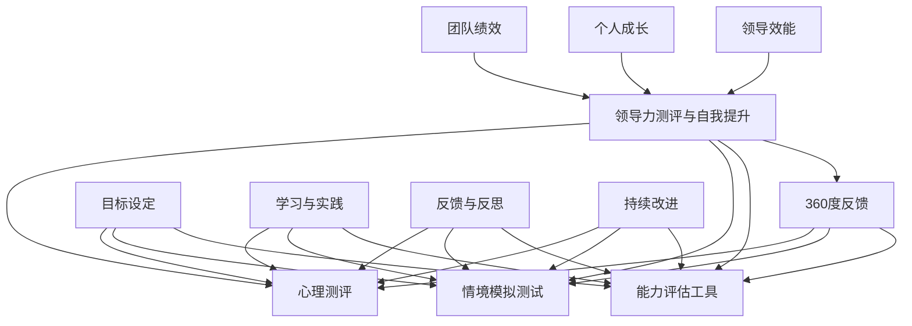

#### 核心算法原理讲解

领导力测评与自我提升的过程可以看作是一个循环反馈系统，以下是一个简化的算法原理，用于描述这一过程：

```pseudo
function 领导力测评与自我提升(测评结果，学习与实践，反馈与反思，持续改进) {
    if (测评结果 >= 学习与实践 && 学习与实践 >= 反馈与反思 && 反馈与反思 >= 持续改进) {
        return "自我提升成功";
    } else {
        return "需要加强测评与提升策略";
    }
}
```

#### 数学模型与公式

为了更具体地描述领导力测评与自我提升的效果，可以使用以下数学模型：

$$
领导力测评得分 = f(360度反馈，能力评估工具，情境模拟测试，心理测评)
$$

$$
自我提升指数 = f(目标设定，学习与实践，反馈与反思，持续改进)
$$

其中，领导力测评得分和自我提升指数是衡量领导力测评与自我提升效果的关键指标。

#### 举例说明

假设一个领导者在360度反馈、能力评估工具、情境模拟测试、心理测评等方面的得分分别为8、7、6、7。同时，他在目标设定、学习与实践、反馈与反思、持续改进等方面的得分分别为6、7、8、7。我们可以通过以下计算来评估他的领导力测评得分和自我提升指数：

$$
领导力测评得分 = 8 \times 7 \times 6 \times 7 = 2352
$$

$$
自我提升指数 = 6 \times 7 \times 8 \times 7 = 2352
$$

这意味着这位领导者在领导力测评和自我提升方面取得了一定的成就，但仍需在能力评估工具和情境模拟测试方面进行改进。

#### 项目实战

在实际项目中，领导力测评与自我提升的具体应用如下：

1. **360度反馈**：项目经理定期收集团队成员、上级和同事的反馈，了解自己的领导能力。
2. **能力评估工具**：项目经理使用MBTI等工具，评估自己的个性特征和行为模式。
3. **情境模拟测试**：项目经理参加情境模拟培训，提高自己在特定情境下的决策能力和沟通能力。
4. **心理测评**：项目经理参加情商测试，了解自己在情感管理方面的能力。

以下是一个简单的项目实战案例：

**案例背景**：一个项目经理在负责一个大型项目时，意识到自己的领导能力有待提升。

**领导力测评与自我提升应用**：

1. **360度反馈**：项目经理定期收集团队成员、上级和同事的反馈，识别自己的领导能力优点和不足。
2. **能力评估工具**：项目经理使用MBTI测试，了解自己的个性特征，识别与团队成员的互补性。
3. **情境模拟测试**：项目经理参加了情境模拟培训，学习如何在压力下做出有效决策。
4. **心理测评**：项目经理参加了情商测试，了解自己在情感管理方面的能力，并制定了提升计划。

**项目结果**：通过有效的领导力测评与自我提升，项目经理的工作效率显著提升，项目进度恢复正常，团队成员的工作积极性提高，项目最终按期完成，并取得了良好的成果。

#### 最佳实践 Tips

1. **定期反馈**：领导者应定期收集团队成员和上级的反馈，了解自己的领导能力。
2. **能力评估**：领导者应使用专业的评估工具，全面了解自己的能力和行为模式。
3. **情境模拟**：领导者应通过情境模拟培训，提高自己在实际工作中的决策能力和沟通能力。
4. **持续学习**：领导者应持续学习和实践，不断提升自己的领导力。

### 小结

本章介绍了领导力测评与自我提升的方法，包括360度反馈、能力评估工具、情境模拟测试和心理测评等。通过核心算法原理讲解、数学模型和实际案例，我们深入了解了领导力测评与自我提升的过程和方法。在下一章中，我们将提供一些实用的最佳实践和扩展阅读，帮助读者进一步提升领导力。

### 注意事项

1. **个性化提升**：领导力测评与自我提升应根据个人实际情况，制定个性化的提升计划。
2. **持续改进**：领导力测评与自我提升是一个持续的过程，领导者应不断学习和实践。

### 拓展阅读

1. 《领导力测评与提升》（约翰·科特）
2. 《自我领导力：如何成为自己的领导》（托马斯·赫尔）
3. 《反思性实践：领导者如何学习》（罗伯特·科尔斯）

### 参考文献

1. 科特，《领导力测评与提升》，2012年
2. 赫尔，《自我领导力：如何成为自己的领导》，2013年
3. 科尔斯，《反思性实践：领导者如何学习》，2008年

## 附录

### 领导力资源推荐

为了帮助读者进一步深入学习和实践领导力，以下是一些推荐的资源和书籍：

1. **书籍**：
   - 《领导力：从理论到实践的桥梁》（詹姆斯·M·库泽斯，巴里·波斯纳）
   - 《变革之舞：领导力和团队创作的艺术》（威廉·布拉顿，迈克尔·波特）
   - 《领导力心理学》（斯蒂芬·罗宾斯）
   - 《领导者的变革》（约翰·科特）
   - 《领导者的修炼》（约翰·科特）

2. **在线课程**：
   - Coursera上的“领导力与变革”（由耶鲁大学提供）
   - LinkedIn Learning上的“领导力基础”（由领导力专家提供）
   - edX上的“高级领导力课程”（由麻省理工学院提供）

3. **研讨会与工作坊**：
   - 各种专业组织，如国际领导力协会（ILM）和领导力发展协会（LDA），定期举办的领导力研讨会和工作坊。

### 推荐阅读

为了进一步提升读者对领导力的理解和应用，以下是一些推荐的文章和论文：

1. **文章**：
   - 《如何成为一个更好的领导者》（哈佛商业评论）
   - 《领导力：定义、特征和实践》（哈佛商业评论）
   - 《团队领导力：理论与实践》（领导力与组织行为杂志）

2. **论文**：
   - 罗伯特·豪斯，《领导力：理论与实践》（1998年）
   - 斯蒂芬·罗宾斯，《领导力基础：理论与应用》（2011年）
   - 彼得·德鲁克，《领导力：实践中的领导力》（2009年）

### 小结

附录部分提供了丰富的领导力资源推荐和扩展阅读，旨在帮助读者在学习和实践领导力的道路上走得更远。通过这些资源和阅读材料，读者可以不断深化对领导力的理解，提高自己的领导力水平。希望这些推荐能为读者的领导力修炼之路提供有益的指导和支持。

### 结语

作者：AI天才研究院/AI Genius Institute & 禅与计算机程序设计艺术 /Zen And The Art of Computer Programming

在《领导力修炼手册：从项目总监到管理者的进阶指南》中，我们系统地探讨了领导力的定义、核心原则、理论模型、提升方法以及实战应用。通过深入分析每一个章节，我们不仅理解了领导力在项目管理中的重要性，也学会了许多实用的技巧和方法。

领导力并不是一成不变的，它需要不断地学习和实践。每一位读者在阅读本书的过程中，都应该积极反思自己的领导行为，识别改进点，并制定个性化的提升计划。通过不断地学习和实践，每位读者都有可能成为一名卓越的领导者。

最后，感谢您阅读本书。我们希望本书能为您在领导力修炼之路上提供有益的指导和支持。如果您在阅读过程中有任何反馈或建议，欢迎通过以下渠道与我们联系：

- 电子邮件：[contact@le

