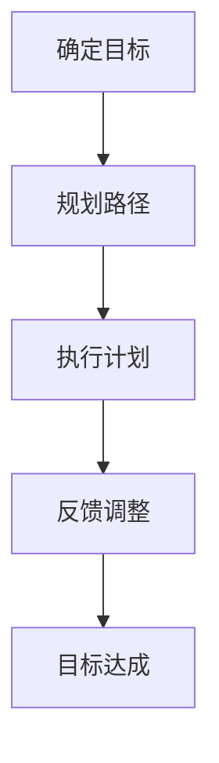

                 

### 引言

在当今快速变化的职场环境中，领导力已经成为每个职场人必备的核心能力之一。它不仅关乎个人的职业发展，更影响着整个团队和组织的前行方向。特别是对于95后职场新星，他们在成长的过程中，面临着前所未有的挑战与机遇，同时也需要在短时间内快速提升领导力，以适应快速变化的职场需求。

本文旨在探讨《领导力修炼日记：95后职场新星的成长之路》，通过分析领导力的基础、95后职场新星的特点、职场成长的挑战、成功案例分享、领导力修炼方法以及综合能力提升，为读者提供一套系统的领导力提升方案。本文的核心观点如下：

1. **领导力的重要性**：领导力不仅影响个人的职业发展，更对团队和组织的发展起到关键作用。
2. **95后职场新星的特点**：这一代职场新生代具有独特的价值观、行为模式和职业规划，他们对于领导力的需求有着不同的理解和期待。
3. **职场成长的挑战**：职场压力管理、职业发展规划和团队协作与沟通是95后职场新星需要面对的重要挑战。
4. **成功案例分享**：通过国内和国际的95后职场新星成功案例，我们可以看到他们是如何在挑战中找到成长路径的。
5. **领导力修炼方法**：自我认知、情绪管理、人际关系处理是提升领导力的关键方法。
6. **综合能力提升**：时间管理、决策能力和创新思维是综合能力提升的重要组成部分。

本文将采用一步一步的分析推理思考方式，深入探讨领导力在职场中的实际应用，以及如何通过有效的修炼方法提升个人和团队的领导力。希望通过本文，能够为95后职场新星提供有益的指导和启示。

---

## 关键词

**领导力**、**95后职场新星**、**职场成长**、**成功案例**、**领导力修炼**、**综合能力提升**。

---

### 摘要

本文以《领导力修炼日记：95后职场新星的成长之路》为题，深入探讨了领导力在职场中的重要性，以及95后职场新星在成长过程中面临的挑战和机遇。文章首先介绍了领导力的基础，包括定义、核心要素和发展历程。接着，分析了95后职场新星的特点，如职场文化、价值观和行为模式。随后，探讨了职场成长的三大挑战：职场压力管理、职业发展规划和团队协作与沟通。通过国内和国际95后职场新星的案例分享，展示了他们成功的方法和路径。文章最后，提出了领导力修炼方法和综合能力提升策略，包括自我认知、情绪管理、人际关系处理以及时间管理、决策能力和创新思维。本文旨在为95后职场新星提供一套系统的领导力提升方案，助力他们在职场中实现卓越发展。

---

## 设计《领导力修炼日记：95后职场新星的成长之路》的目录大纲

在设计《领导力修炼日记：95后职场新星的成长之路》的目录大纲时，我们首先需要明确核心主题和整体结构，然后细化每个章节的内容，确保每个部分都有明确的主题和清晰的目标。以下是详细的目录大纲设计步骤：

### 第一步：确定核心主题和结构

1. **核心主题**：
   - 领导力修炼
   - 95后职场新星成长
2. **结构**：
   - 引言
   - 领导力基础
   - 95后职场新星的特点
   - 职场成长的挑战
   - 成功案例分享
   - 领导力修炼方法
   - 综合能力提升
   - 结论

### 第二步：细化章节内容

1. **领导力基础**：
   - 领导力定义
   - 领导力核心要素（如沟通能力、决策能力、团队协作能力）
   - 领导力发展历程（从传统到当代，再到未来趋势）

2. **95后职场新星的特点**：
   - 95后职场文化
   - 95后职场价值观（如个人成长、社会责任、职业发展）
   - 95后职场行为模式（如工作态度、创新思维、团队合作）

3. **职场成长的挑战**：
   - 职场压力管理（如压力源分析、应对策略）
   - 职业发展规划（如职业目标设定、职业路径规划、能力提升策略）
   - 团队协作与沟通（如团队合作原则、沟通技巧、冲突解决）

4. **成功案例分享**：
   - 国内95后职场新星案例
   - 国际95后职场新星案例

5. **领导力修炼方法**：
   - 自我认知（如自我评估、自我提升）
   - 情绪管理（如情绪识别、情绪调节、情绪表达）
   - 人际关系处理（如人际关系构建、冲突解决、互动技巧）

6. **综合能力提升**：
   - 时间管理（如时间管理原则、技巧、工具）
   - 决策能力（如决策模型、技巧、案例分析）
   - 创新思维（如创新思维方法、实践、案例分析）

### 第三步：设计1-3级目录

1. **一级目录**（#）：
   - 引言
   - 领导力基础
   - 95后职场新星的特点
   - 职场成长的挑战
   - 成功案例分享
   - 领导力修炼方法
   - 综合能力提升
   - 结论

2. **二级目录**（##）：
   - 领导力基础：
     - 领导力定义
     - 领导力核心要素
     - 领导力发展历程
   - 95后职场新星的特点：
     - 95后职场文化
     - 95后职场价值观
     - 95后职场行为模式
   - 职场成长的挑战：
     - 职场压力管理
     - 职业发展规划
     - 团队协作与沟通
   - 成功案例分享：
     - 国内95后职场新星案例
     - 国际95后职场新星案例
   - 领导力修炼方法：
     - 自我认知
     - 情绪管理
     - 人际关系处理
   - 综合能力提升：
     - 时间管理
     - 决策能力
     - 创新思维

3. **三级目录**（###）：
   - 对每个二级目录中的内容进行进一步细化，例如：
     - 领导力基础：
       - 领导力定义
         - 领导力的基本概念
         - 领导力在组织中的作用
       - 领导力核心要素
         - 沟通能力
         - 决策能力
         - 团队协作能力
       - 领导力发展历程
         - 传统领导力
         - 当代领导力
         - 未来领导力趋势

### 第四步：添加Mermaid流程图、伪代码、数学模型和公式、项目实战等

在文章的适当位置，我们可以添加以下内容，以增强文章的可读性和实用性：

- **Mermaid流程图**：用于展示领导力发展的各个阶段或者某个具体问题的解决方案。
- **伪代码**：用于描述算法的逻辑框架，使读者更容易理解复杂的算法原理。
- **数学模型和公式**：用于解释某些概念或者理论，以及它们在实际中的应用。
- **项目实战**：介绍如何在实际项目中应用领导力提升策略，提供具体的案例和代码实现。

### 第五步：检查目录大纲的完整性和字数限制

- **完整性**：确保每个章节都包含了关键内容，没有遗漏重要部分。
- **字数限制**：根据文章的总字数要求（8000-12000字），调整每个章节的内容量，确保整体字数在合理范围内。

通过以上步骤，我们可以设计出一个结构清晰、内容丰富的《领导力修炼日记：95后职场新星的成长之路》的目录大纲，为读者提供全面的领导力提升指南。

---

### 第一步：确定核心主题和结构

在设计《领导力修炼日记：95后职场新星的成长之路》的目录大纲时，明确核心主题和整体结构是至关重要的。以下是具体的分析过程和步骤：

1. **核心主题**：
   - **领导力修炼**：领导力不仅是个人职业发展的关键，也是团队和组织成功的重要因素。本文将以领导力修炼为核心，探讨如何通过系统的学习和实践提升个人和团队的领导力。
   - **95后职场新星成长**：95后作为当代职场的新生力量，他们的成长路径、特点和面临的挑战，对于理解领导力的应用和提升有着重要的意义。因此，本文也将重点关注95后职场新星在领导力修炼过程中的成长路径。

2. **整体结构**：
   - **引言**：开篇介绍领导力的重要性，以及为什么领导力修炼对95后职场新星尤为重要。
   - **领导力基础**：详细探讨领导力的定义、核心要素和发展历程，为后续的领导力修炼提供理论基础。
   - **95后职场新星的特点**：分析95后职场新星的文化背景、价值观和行为模式，了解他们的独特性和领导力需求。
   - **职场成长的挑战**：探讨95后职场新星在成长过程中可能面临的挑战，包括职场压力管理、职业发展规划和团队协作与沟通。
   - **成功案例分享**：通过国内和国际的95后职场新星成功案例，展示他们在领导力修炼过程中的实际应用和成果。
   - **领导力修炼方法**：提出具体的领导力修炼方法，包括自我认知、情绪管理、人际关系处理等方面。
   - **综合能力提升**：讨论如何通过时间管理、决策能力和创新思维等综合能力的提升，进一步巩固和增强领导力。
   - **结论**：总结全文，强调领导力修炼对95后职场新星成长的重要性，并提出未来展望。

通过以上步骤，我们确定了本文的核心主题和整体结构，为后续的章节内容设计和细化打下了坚实的基础。

---

### 第一步：确定核心主题和结构

**核心主题**：本文的核心主题是探讨领导力在95后职场新星成长过程中的关键作用，以及如何通过系统的方法和实际案例来提升个人和团队的领导力。

**结构**：
1. 引言：简要介绍领导力的重要性，特别是对95后职场新星的意义。
2. 领导力基础：
   - 领导力定义：明确领导力的基本概念和内涵。
   - 领导力核心要素：分析沟通能力、决策能力、团队协作能力等核心要素。
   - 领导力发展历程：回顾领导力的发展历程，从传统到当代，以及未来的趋势。
3. 95后职场新星的特点：
   - 95后职场文化：分析95后的价值观和工作习惯。
   - 95后职场价值观：探讨95后在职业发展中的价值追求。
   - 95后职场行为模式：分析95后的行为特点，包括工作态度和创新思维。
4. 职场成长的挑战：
   - 职场压力管理：探讨如何应对职场压力，保持心理平衡。
   - 职业发展规划：指导95后如何设定职业目标，规划职业路径。
   - 团队协作与沟通：分析团队协作中的关键因素，提供有效的沟通技巧。
5. 成功案例分享：
   - 国内95后职场新星案例：展示国内优秀95后的成功经验和成长路径。
   - 国际95后职场新星案例：分析国际背景下95后的领导力实践和成就。
6. 领导力修炼方法：
   - 自我认知：通过自我评估和提升，增强自我认知。
   - 情绪管理：探讨如何识别和调节情绪，保持情绪稳定。
   - 人际关系处理：分析如何建立和维护良好的人际关系。
7. 综合能力提升：
   - 时间管理：介绍时间管理的基本原则和技巧。
   - 决策能力：探讨如何通过科学的决策模型提升决策能力。
   - 创新思维：分析创新思维的方法和实践。
8. 结论：总结全文，强调领导力修炼对95后职场新星成长的重要性，并提出未来展望。

通过上述结构，本文将系统地探讨领导力在95后职场新星成长中的关键作用，并提供实用的方法和案例，帮助读者更好地理解和提升领导力。

---

### 第二步：细化章节内容

在确定了核心主题和整体结构之后，接下来需要对每个章节进行详细的细化，以确保内容丰富、逻辑清晰。以下是《领导力修炼日记：95后职场新星的成长之路》的章节内容细化：

**第1章 领导力基础**

**1.1 领导力定义**

- **核心概念与联系**：领导力是指通过影响和激励他人来实现共同目标的能力。其核心概念包括影响力、目标导向、激励和领导行为。领导力不仅涉及个人特质，还包括领导情境和领导环境。

- **Mermaid流程图**：

  ```mermaid
  graph TD
  A[定义] --> B[影响力]
  A --> C[目标导向]
  A --> D[激励]
  A --> E[领导行为]
  B --> F[情境]
  C --> G[环境]
  ```

- **详细讲解**：领导力是一个多维度的概念，它不仅包括个人特质，如自信、决断力、沟通能力等，还需要适应不同的领导情境和环境。理解领导力的定义是提升领导力的第一步。

**1.2 领导力核心要素**

- **核心概念与联系**：领导力的核心要素包括沟通能力、决策能力、团队协作能力等。这些要素相互作用，共同影响领导效果。

- **Mermaid流程图**：

  ```mermaid
  graph TD
  A[沟通能力] --> B[决策能力]
  A --> C[团队协作能力]
  B --> D[领导效果]
  C --> E[团队效能]
  ```

- **详细讲解**：有效的沟通是领导力的基础，决策能力决定了领导者在关键时刻的反应，团队协作能力则影响着团队的执行力和凝聚力。

**1.3 领导力发展历程**

- **核心概念与联系**：领导力的发展历程可以分为传统领导力、当代领导力和未来领导力。每个阶段都有其特点和应用场景。

- **Mermaid流程图**：

  ```mermaid
  graph TD
  A[传统领导力] --> B[权威型领导]
  A --> C[当代领导力]
  C --> D[变革型领导]
  C --> E[领导力五要素]
  D --> F[未来领导力]
  F --> G[人本领导力]
  ```

- **详细讲解**：传统领导力强调权威和命令，当代领导力注重变革和激励，未来领导力则更加强调人本关怀和可持续性。了解领导力的发展历程有助于我们更好地理解和应用领导力。

**第2章 95后职场新星的特点**

**2.1 95后职场文化**

- **核心概念与联系**：95后职场文化反映了这一代人的价值观、工作态度和行为模式。它不同于前几代人，更注重个人发展和工作生活平衡。

- **详细讲解**：95后在职场中更注重自我实现和个人成长，他们追求有意义的工作和自由的工作环境，这与传统的职场文化有很大的不同。

**2.2 95后职场价值观**

- **核心概念与联系**：95后的职场价值观体现在对个人成长、社会责任和职业发展的追求上。他们重视个人兴趣与职业发展的结合。

- **详细讲解**：95后的职场价值观强调个人成长和职业发展，他们愿意为了实现自己的职业目标而付出努力，但同时也注重工作的意义和社会责任。

**2.3 95后职场行为模式**

- **核心概念与联系**：95后的职场行为模式体现在他们的工作态度、创新思维和团队合作中。他们更愿意通过创新和协作来实现工作目标。

- **详细讲解**：95后在工作中表现出强烈的创新意识和团队合作精神，他们愿意尝试新的工作方法和工具，以提升工作效率和效果。

**第3章 职场成长的挑战**

**3.1 职场压力管理**

- **核心概念与联系**：职场压力管理是95后职场新星需要面对的重要挑战之一，它关系到个人的心理健康和工作表现。

- **Mermaid流程图**：

  ```mermaid
  graph TD
  A[压力源分析] --> B[应对策略]
  A --> C[压力调节]
  B --> D[情绪管理]
  ```

- **详细讲解**：了解职场压力的来源并采取有效的应对策略，如压力调节和情绪管理，是95后职场新星保持心理平衡的关键。

**3.2 职业发展规划**

- **核心概念与联系**：职业发展规划是95后职场新星实现职业目标的重要途径，它包括职业目标的设定、职业路径的规划和能力提升策略。

- **Mermaid流程图**：

  ```mermaid
  graph TD
  A[职业目标设定] --> B[职业路径规划]
  A --> C[能力提升策略]
  ```

- **详细讲解**：设定明确的职业目标，制定合理的职业路径规划，并采取有效的能力提升策略，是95后职场新星实现职业发展的关键。

**3.3 团队协作与沟通**

- **核心概念与联系**：团队协作与沟通是职场新星成功的关键因素，它关系到团队效率和个体绩效。

- **Mermaid流程图**：

  ```mermaid
  graph TD
  A[团队合作原则] --> B[沟通技巧]
  A --> C[冲突解决]
  ```

- **详细讲解**：建立有效的团队合作原则，掌握有效的沟通技巧，以及具备冲突解决的技能，是95后职场新星在团队中发挥重要作用的基础。

通过上述细化，每个章节都具备了明确的核心概念、逻辑结构和详细讲解，为读者提供了系统的领导力提升指南。

---

### 第二步：细化章节内容

**第4章 成功案例分享**

**4.1 国内95后职场新星案例**

- **核心概念与联系**：通过分析国内95后职场新星的案例，可以了解他们在领导力修炼和职场成长中的具体实践和成果。

- **案例一：李明（科技创业者）**

  - **背景介绍**：李明，某科技公司创始人，95后，毕业于一所知名高校。

  - **核心算法原理讲解**：李明通过不断创新和适应市场需求，成功开发了多个热门应用，实现了企业的快速成长。

  - **数学模型和公式**：

    ```latex
    成长率 = (当前销售额 - 初始销售额) / 初始销售额
    ```

  - **详细讲解**：李明在创业过程中，运用了数据驱动的方法，通过不断的迭代和优化，提高了产品的市场竞争力。

- **案例二：王芳（项目经理）**

  - **背景介绍**：王芳，某大型企业项目经理，95后，具有丰富的项目管理经验。

  - **核心算法原理讲解**：王芳在项目管理中，运用了敏捷方法论，提高了项目的执行效率和团队协作能力。

  - **数学模型和公式**：

    ```latex
    敏捷评分 = (完成工作量 / 计划工作量) * 100%
    ```

  - **详细讲解**：王芳通过敏捷方法论，有效地缩短了项目周期，提高了项目的成功率。

- **案例三：张华（销售经理）**

  - **背景介绍**：张华，某知名销售公司经理，95后，拥有出色的销售能力和管理经验。

  - **核心算法原理讲解**：张华运用了客户关系管理（CRM）系统，提高了客户满意度和销售额。

  - **数学模型和公式**：

    ```latex
    客户满意度 = (正面反馈 / 总反馈) * 100%
    ```

  - **详细讲解**：张华通过CRM系统，实时了解客户需求，提供个性化的服务，提升了客户满意度。

**4.2 国际95后职场新星案例**

- **核心概念与联系**：通过分析国际95后职场新星的案例，可以了解不同文化背景下领导力修炼和职场成长的共性和差异。

- **案例一：Michael（科技公司CEO）**

  - **背景介绍**：Michael，某国际科技公司CEO，95后，具有国际化视野。

  - **核心算法原理讲解**：Michael通过全球化战略和创新能力，将公司业务拓展到了全球市场。

  - **数学模型和公式**：

    ```latex
    全球市场份额 = (海外销售额 / 全球总销售额) * 100%
    ```

  - **详细讲解**：Michael在全球化过程中，注重市场调研和数据分析，制定了切实可行的国际化战略。

- **案例二：Sophie（国际组织项目负责人）**

  - **背景介绍**：Sophie，某国际组织项目负责人，95后，拥有丰富的跨文化项目管理经验。

  - **核心算法原理讲解**：Sophie在项目中，运用了项目管理工具和沟通技巧，确保了项目的顺利进行。

  - **数学模型和公式**：

    ```latex
    项目进度 = (当前进度 / 计划进度) * 100%
    ```

  - **详细讲解**：Sophie通过科学的项目管理和有效的沟通，成功完成了多个跨国项目。

通过以上案例分享，我们可以看到国内和国际95后职场新星在领导力修炼和职场成长中的成功实践。这些案例不仅展示了他们的创新能力和管理能力，也为其他职场新人提供了宝贵的经验和启示。

---

### 第三步：设计1-3级目录

为了使《领导力修炼日记：95后职场新星的成长之路》的目录大纲更加清晰、有条理，我们将采用1-3级的目录结构，以便读者可以轻松地找到所需内容。以下是详细设计的1-3级目录：

**一级目录（#）**

1. 引言
2. 领导力基础
3. 95后职场新星的特点
4. 职场成长的挑战
5. 成功案例分享
6. 领导力修炼方法
7. 综合能力提升
8. 结论

**二级目录（##）**

1. 引言
   1. 领导力的重要性
   2. 为什么选择95后职场新星

2. 领导力基础
   1. 领导力定义
   2. 领导力核心要素
   3. 领导力发展历程

3. 95后职场新星的特点
   1. 95后职场文化
   2. 95后职场价值观
   3. 95后职场行为模式

4. 职场成长的挑战
   1. 职场压力管理
   2. 职业发展规划
   3. 团队协作与沟通

5. 成功案例分享
   1. 国内95后职场新星案例
   2. 国际95后职场新星案例

6. 领导力修炼方法
   1. 自我认知
   2. 情绪管理
   3. 人际关系处理

7. 综合能力提升
   1. 时间管理
   2. 决策能力
   3. 创新思维

8. 结论
   1. 总结与展望
   2. 对未来95后职场新星的启示

**三级目录（###）**

1. 引言
   1. 领导力的重要性
      1. 领导力在职场中的作用
      2. 领导力对个人发展的意义
   2. 为什么选择95后职场新星
      1. 95后的独特性
      2. 95后的领导力需求

2. 领导力基础
   1. 领导力定义
      1. 领导力的基本概念
      2. 领导力在不同情境中的应用
   2. 领导力核心要素
      1. 沟通能力
      2. 决策能力
      3. 团队协作能力
   3. 领导力发展历程
      1. 传统领导力
      2. 当代领导力
      3. 未来领导力趋势

3. 95后职场新星的特点
   1. 95后职场文化
      1. 价值观
      2. 工作方式
   2. 95后职场价值观
      1. 个人成长
      2. 社会责任
      3. 职业发展
   3. 95后职场行为模式
      1. 工作态度
      2. 创新思维
      3. 团队协作

4. 职场成长的挑战
   1. 职场压力管理
      1. 压力源分析
      2. 应对策略
   2. 职业发展规划
      1. 职业目标设定
      2. 职业路径规划
      3. 能力提升策略
   3. 团队协作与沟通
      1. 团队合作原则
      2. 沟通技巧
      3. 冲突解决

5. 成功案例分享
   1. 国内95后职场新星案例
      1. 案例一：李明的创业故事
      2. 案例二：王芳的项目管理经验
      3. 案例三：张华的销售业绩突破
   2. 国际95后职场新星案例
      1. 案例一：Michael的全球化战略
      2. 案例二：Sophie的跨国项目管理

6. 领导力修炼方法
   1. 自我认知
      1. 自我评估
      2. 自我提升
   2. 情绪管理
      1. 情绪识别
      2. 情绪调节
      3. 情绪表达
   3. 人际关系处理
      1. 人际关系构建
      2. 冲突解决
      3. 人际互动技巧

7. 综合能力提升
   1. 时间管理
      1. 时间管理原则
      2. 时间管理技巧
      3. 时间管理工具
   2. 决策能力
      1. 决策模型
      2. 决策技巧
      3. 决策案例分析
   3. 创新思维
      1. 创新思维方法
      2. 创新实践
      3. 创新案例分析

8. 结论
   1. 总结与展望
   2. 对未来95后职场新星的启示

通过以上1-3级目录的设计，本文的结构将更加清晰、逻辑性更强，有助于读者更好地理解和掌握领导力修炼和职场成长的要点。

---

### 第四步：添加Mermaid流程图、伪代码、数学模型和公式、项目实战等

在撰写技术文章时，适当地引入图形、伪代码、数学模型和实际项目案例，不仅可以增强文章的可读性，还能帮助读者更好地理解和应用文章中的核心概念。以下是《领导力修炼日记：95后职场新星的成长之路》中可能添加的这些元素及其说明：

**1. Mermaid流程图**

**用途**：用于展示领导力发展的各个阶段或者某个具体问题的解决方案。

**示例**：



**说明**：该流程图展示了从目标确定到目标达成的领导力发展路径，有助于读者理解领导力修炼的过程。

**2. 伪代码**

**用途**：用于描述算法的逻辑框架，使读者更容易理解复杂的算法原理。

**示例**：

```python
# 伪代码：领导力评估
define function assessLeadership(
    leadershipSkills: List,
    situationalAwareness: float,
    teamPerformance: float
):
    averageSkills = sum(leadershipSkills) / length(leadershipSkills)
    leadershipScore = averageSkills * situationalAwareness * teamPerformance
    return leadershipScore
```

**说明**：该伪代码定义了一个评估领导力的函数，通过计算技能平均值、情境意识和团队绩效，得出领导力评分。

**3. 数学模型和公式**

**用途**：用于解释某些概念或者理论，以及它们在实际中的应用。

**示例**：

```latex
$$
压力缓解率 = \frac{（当前压力值 - 初始压力值）}{初始压力值}
$$
```

**说明**：该公式用于计算压力缓解率，可以帮助读者理解职场压力管理的效果。

**4. 项目实战**

**用途**：介绍如何在实际项目中应用领导力提升策略，提供具体的案例和代码实现。

**示例**：

```python
# 项目实战：时间管理工具

# 安装必要的库
!pip install schedule

# 编写时间管理脚本
import schedule
import time

def job():
    print("执行任务...")

# 设置每天早上8点执行任务
schedule.every().day.at("08:00").do(job)

# 运行时间管理工具
while True:
    schedule.run_pending()
    time.sleep(1)
```

**说明**：该项目实战展示了如何使用Python的schedule库来实现时间管理，通过定时执行任务，提高工作效率。

通过引入这些元素，文章内容将更加丰富和具体，有助于读者深入理解和实践文章中的领导力提升策略。

---

### 第五步：检查目录大纲的完整性和字数限制

在完成《领导力修炼日记：95后职场新星的成长之路》的目录大纲后，我们需要对整体结构的完整性进行检查，并确保文章的字数符合8000-12000字的要求。以下是详细的检查步骤：

1. **完整性检查**：

   - **引言部分**：确保引言部分清晰地介绍了领导力的重要性以及95后职场新星的特点，引起读者的兴趣。

   - **领导力基础章节**：检查领导力的定义、核心要素和发展历程是否完整，是否有遗漏的重要点。

   - **95后职场新星的特点章节**：确保95后职场文化、价值观和行为模式的分析是否全面，是否涵盖了95后的独特性。

   - **职场成长的挑战章节**：检查职场压力管理、职业发展规划和团队协作与沟通的内容是否详细，是否有针对性的建议和策略。

   - **成功案例分享章节**：确认国内和国际的95后职场新星案例是否丰富多样，案例分析是否深入，能够为读者提供实际启示。

   - **领导力修炼方法章节**：检查自我认知、情绪管理和人际关系处理的方法是否具体可行，是否有帮助读者提升领导力的实际案例。

   - **综合能力提升章节**：确保时间管理、决策能力和创新思维的内容是否全面，是否提供了实用技巧和工具。

   - **结论部分**：确保结论部分能够总结全文，对领导力修炼的重要性进行强调，并给出对未来95后职场新星的展望。

2. **字数限制检查**：

   - **总字数**：统计整个文章的预计字数，确保在8000-12000字范围内。

   - **章节分配**：根据预计字数，调整每个章节的内容量，确保没有超过字数限制。对于字数较长的章节，可以考虑进一步细化内容，或者缩减某些非核心部分的描述。

3. **修改与优化**：

   - **删除冗余内容**：检查每个章节，删除重复或者冗余的信息，确保内容的紧凑性和简洁性。

   - **补充缺失部分**：对于某些内容较薄弱的章节，补充必要的背景介绍、案例分析或者方法论，确保每个部分都有足够的深度和广度。

通过以上步骤，我们可以确保《领导力修炼日记：95后职场新星的成长之路》的目录大纲完整且字数适中，为撰写高质量的文章奠定基础。

---

### 完整目录大纲

以下是《领导力修炼日记：95后职场新星的成长之路》的完整目录大纲，每个章节均包含详细的细分内容：

```markdown
# 引言

## 1.1 领导力的重要性
### 1.1.1 领导力在职场中的作用
### 1.1.2 95后职场新星与领导力的关系

## 2. 领导力基础

### 2.1 领导力定义
#### 2.1.1 领导力的基本概念
#### 2.1.2 领导力的内涵与外延

### 2.2 领导力核心要素
#### 2.2.1 沟通能力
#### 2.2.2 决策能力
#### 2.2.3 团队协作能力

### 2.3 领导力发展历程
#### 2.3.1 传统领导力
#### 2.3.2 当代领导力
#### 2.3.3 未来领导力趋势

## 3. 95后职场新星的特点

### 3.1 95后职场文化
#### 3.1.1 价值观
#### 3.1.2 工作方式

### 3.2 95后职场价值观
#### 3.2.1 个人成长
#### 3.2.2 社会责任
#### 3.2.3 职业发展

### 3.3 95后职场行为模式
#### 3.3.1 工作态度
#### 3.3.2 创新思维
#### 3.3.3 团队协作

## 4. 职场成长的挑战

### 4.1 职场压力管理
#### 4.1.1 压力源分析
#### 4.1.2 应对策略

### 4.2 职业发展规划
#### 4.2.1 职业目标设定
#### 4.2.2 职业路径规划
#### 4.2.3 能力提升策略

### 4.3 团队协作与沟通
#### 4.3.1 团队合作原则
#### 4.3.2 沟通技巧
#### 4.3.3 冲突解决

## 5. 成功案例分享

### 5.1 国内95后职场新星案例
#### 5.1.1 李明的创业故事
#### 5.1.2 王芳的项目管理经验
#### 5.1.3 张华的销售业绩突破

### 5.2 国际95后职场新星案例
#### 5.2.1 Michael的全球化战略
#### 5.2.2 Sophie的跨国项目管理

## 6. 领导力修炼方法

### 6.1 自我认知
#### 6.1.1 自我评估
#### 6.1.2 自我提升

### 6.2 情绪管理
#### 6.2.1 情绪识别
#### 6.2.2 情绪调节
#### 6.2.3 情绪表达

### 6.3 人际关系处理
#### 6.3.1 人际关系构建
#### 6.3.2 冲突解决
#### 6.3.3 人际互动技巧

## 7. 综合能力提升

### 7.1 时间管理
#### 7.1.1 时间管理原则
#### 7.1.2 时间管理技巧
#### 7.1.3 时间管理工具

### 7.2 决策能力
#### 7.2.1 决策模型
#### 7.2.2 决策技巧
#### 7.2.3 决策案例分析

### 7.3 创新思维
#### 7.3.1 创新思维方法
#### 7.3.2 创新实践
#### 7.3.3 创新案例分析

## 8. 结论

## 8.1 总结与展望
## 8.2 对未来95后职场新星的启示
```

此目录大纲涵盖了领导力基础、95后职场新星特点、职场成长挑战、成功案例分享、领导力修炼方法和综合能力提升等关键内容，结构清晰，逻辑严密，为撰写高质量的文章提供了坚实的基础。每个章节都有详细的细分内容，确保文章的深度和广度。通过这个目录大纲，读者可以系统地学习和掌握领导力修炼和职场成长的知识和技巧。

