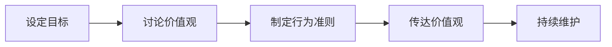
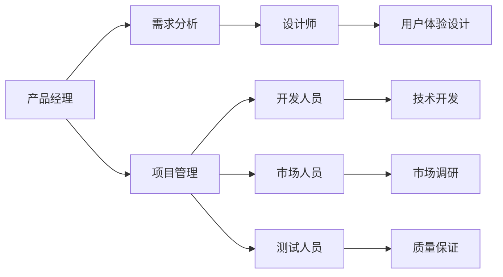
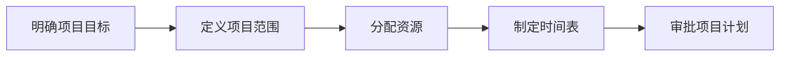
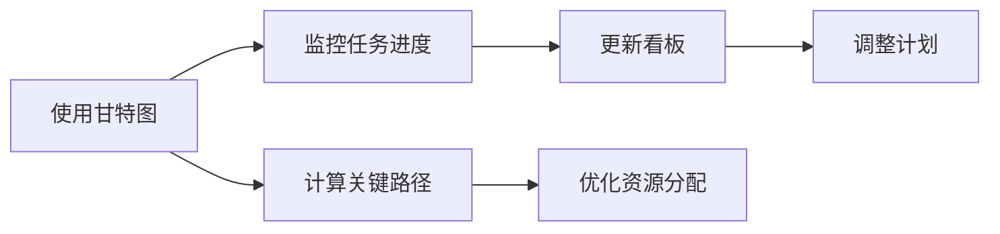
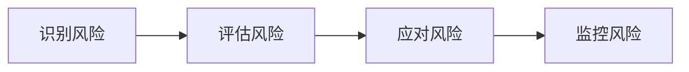
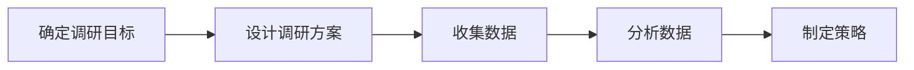
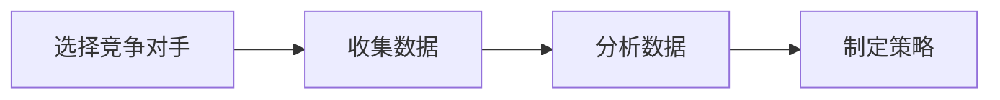
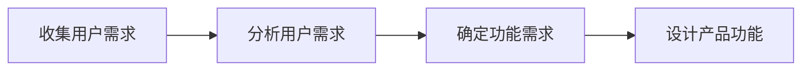

                 

### 文章标题

# 领导力修炼日记：一个产品经理的成长之路

### 关键词

- 产品经理
- 领导力
- 团队管理
- 项目管理
- 市场分析

### 摘要

本文旨在探讨领导力在产品经理职业生涯中的关键作用。通过详细分析产品经理面临的各种挑战，本文将逐步介绍领导力所需的基础技能、团队建设与管理、项目管理以及市场分析等方面的知识和实践。从沟通技巧、时间管理、冲突解决到团队建设、项目进度跟踪、风险管理以及市场调研，每一个环节都将通过实例和伪代码进行深入讲解。本文将帮助读者在实战中掌握领导力，从而成为一名更加卓越的产品经理。

## 第1章 引言

领导力，简而言之，是指影响和激励他人以实现共同目标的能力。然而，在产品经理的职业生涯中，领导力的重要性却被许多人忽视。产品经理不仅仅是产品需求的提出者，更是整个产品开发和上线过程中各个角色的协调者。他们需要具备出色的领导力，以应对日常工作中层出不穷的挑战，确保产品的成功。

本书《领导力修炼日记：一个产品经理的成长之路》旨在为产品经理们提供一份全面的领导力指南。通过逐步分析领导力的核心概念和实际应用，本书将帮助读者在职业生涯中不断提升领导力，从而更好地完成产品经理的职责。以下是本书的主要内容和结构：

### 第1章 引言

- 解释领导力对产品经理的重要性
- 简述本书的结构和目标

### 第2章 基础领导力技能

- 沟通技巧
- 时间管理
- 冲突解决

### 第3章 团队建设与管理

- 团队价值观
- 角色分配
- 团队协作

### 第4章 项目管理

- 项目计划
- 进度跟踪
- 风险管理

### 第5章 市场分析

- 市场调研
- 竞争分析
- 用户需求分析

通过以上章节的详细讲解，读者将能够全面了解并掌握领导力的各个方面，从而在实际工作中更加得心应手。接下来，我们将进一步探讨领导力的定义和重要性，以及产品经理所面临的具体挑战。

#### 1.1 领导力的定义与重要性

领导力，可以从多个维度进行理解和定义。从广义上讲，领导力包括以下几个方面：

- **目标设定**：领导者需要明确团队或组织的方向和目标，并激励团队成员为实现这些目标而努力。
- **决策制定**：在复杂多变的环境中，领导者需要快速做出明智的决策，以应对各种挑战。
- **团队协作**：领导者需要协调团队成员之间的合作，确保每个人都能发挥自己的优势，共同完成项目。
- **激励与反馈**：领导者需要激励团队成员，提供及时的反馈，帮助他们不断进步。

在产品经理的职业生涯中，领导力的重要性体现在以下几个方面：

- **跨部门协调**：产品经理通常需要与市场、设计、开发等多个部门进行沟通和协调，只有具备领导力，才能有效地推动项目进展。
- **资源分配**：产品经理需要合理分配团队资源，确保项目在预算范围内完成，这也需要领导力来进行权衡和决策。
- **市场变化应对**：市场环境不断变化，产品经理需要具备领导力，快速调整产品策略，以应对市场的变化。

通过以上分析，我们可以看出，领导力不仅是产品经理必备的能力，更是其在职业生涯中取得成功的关键。接下来，我们将详细讨论产品经理的角色和面临的挑战。

#### 1.2 产品经理的角色与挑战

产品经理在一家公司中扮演着至关重要的角色，他们需要负责从市场调研到产品开发再到市场推广的全过程。以下是产品经理的主要职责和所面临的挑战：

##### 1.2.1 产品经理的角色

- **需求分析**：产品经理需要与市场部门、用户进行沟通，了解用户需求，并将这些需求转化为具体的产品功能。
- **项目管理**：产品经理需要协调各个团队的工作，确保项目按计划进行，并在预算和时间限制内完成。
- **市场调研**：产品经理需要了解市场动态，分析竞争对手，为产品策略提供依据。
- **用户反馈**：产品经理需要收集用户反馈，对产品进行改进，提高用户体验。

##### 1.2.2 产品经理面临的挑战

- **跨部门沟通**：产品经理需要与多个部门（如设计、开发、市场等）进行协调，这往往是一个复杂且具有挑战性的过程。
- **资源分配**：产品经理需要在有限的资源下做出最优的分配决策，确保项目能够顺利进行。
- **市场变化应对**：市场环境变化快速，产品经理需要具备敏捷的应对能力，及时调整产品策略。
- **团队管理**：产品经理需要管理一个多元化的团队，激发团队成员的创造力，确保团队的协同工作。

为了更好地应对这些挑战，产品经理需要不断提升自己的领导力，包括沟通技巧、决策能力、团队管理能力等。接下来，我们将探讨领导力所需的基础技能，包括沟通技巧、时间管理和冲突解决。

### 第2章 基础领导力技能

在产品经理的职业生涯中，基础领导力技能是成功的关键。本章将详细探讨沟通技巧、时间管理和冲突解决，这三个方面是构建高效领导力的基石。通过具体的实例和伪代码，我们将深入理解这些技能在实际工作中的应用。

#### 2.1 沟通技巧

沟通是领导力的核心，无论是内部团队协作还是跨部门沟通，都需要良好的沟通技巧。以下是几个关键的沟通技巧：

##### 2.1.1 有效沟通的重要性

有效沟通可以确保信息准确传达，减少误解和冲突。以下是一个简单的伪代码示例，展示了如何设计一个沟通流程：

```python
def effective_communication(message, receiver):
    message = format_message(message)
    receiver = prepare_receiver(receiver)
    response = send_message(message, receiver)
    return response

def format_message(message):
    # 根据接收者的背景和需求，调整消息内容
    return message

def prepare_receiver(receiver):
    # 了解接收者的沟通风格和偏好
    return receiver

def send_message(message, receiver):
    # 选择合适的沟通渠道，如会议、邮件、即时通讯等
    return receiver.receive_message(message)
```

##### 2.1.2 沟通障碍与解决方案

沟通障碍常常导致误解和冲突，以下是一些常见的沟通障碍及其解决方案：

- **信息过载**：解决方案是使用简洁明了的语言，避免冗余信息。
- **文化差异**：解决方案是了解并尊重不同文化的沟通习惯。
- **情绪干扰**：解决方案是保持冷静，使用积极的态度进行沟通。

以下是一个处理文化差异的伪代码示例：

```python
def communicate_with_culture(receiver, culture):
    # 根据文化调整沟通方式
    if culture == "西方":
        receiver = use_direct_communication(receiver)
    elif culture == "东方":
        receiver = use_indirect_communication(receiver)
    return receiver

def use_direct_communication(receiver):
    # 直接、清晰的表达方式
    return receiver

def use_indirect_communication(receiver):
    # 使用委婉、含蓄的表达方式
    return receiver
```

#### 2.2 时间管理

时间是有限的资源，如何高效利用时间对产品经理至关重要。以下是几个时间管理的技巧：

##### 2.2.1 时间管理的重要性

时间管理可以提升工作效率，减少拖延和焦虑。以下是一个简单的伪代码示例，展示了如何规划和管理时间：

```python
def time_management(tasks, deadlines):
    schedule = create_schedule(tasks, deadlines)
    monitor_progress(schedule)
    return schedule

def create_schedule(tasks, deadlines):
    # 根据任务的重要性和紧急性，创建时间表
    return schedule

def monitor_progress(schedule):
    # 定期检查任务进度，必要时调整计划
    return schedule
```

##### 2.2.2 常见的时间管理工具和方法

- **番茄工作法**：将工作时间分为25分钟的工作周期，每个周期后休息5分钟。
- **GTD（Getting Things Done）**：通过收集、整理、组织、回顾和执行，将待办事项系统化。

以下是一个使用番茄工作法的伪代码示例：

```python
def pomodoro техника(tasks):
    for task in tasks:
        start = time.now()
        do_task(task)
        end = time.now()
        if (end - start) > 25 minutes:
            rest(5 minutes)
    return tasks
```

#### 2.3 冲突解决

冲突是团队工作中不可避免的现象，如何有效地解决冲突对于团队的和谐和效率至关重要。以下是几个解决冲突的策略：

##### 2.3.1 冲突的类型与原因

- **利益冲突**：团队成员在资源、权限或利益上存在分歧。
- **价值观冲突**：团队成员在价值观、理念或工作方式上存在差异。

##### 2.3.2 冲突解决策略

- **妥协**：通过谈判和协商，达成双方都能接受的方案。
- **协作**：通过团队合作，共同解决问题。
- **回避**：暂时搁置冲突，寻找更好的解决方案。

以下是一个解决利益冲突的伪代码示例：

```python
def resolve_conflict(conflict, parties):
    if conflict_type == "interest":
        solution = negotiate_solution(conflict, parties)
    elif conflict_type == "value":
        solution = find_common_ground(conflict, parties)
    return solution

def negotiate_solution(conflict, parties):
    # 通过谈判，找到双方都能接受的解决方案
    return solution

def find_common_ground(conflict, parties):
    # 通过讨论，找到共同的理念或价值观
    return solution
```

通过以上对基础领导力技能的探讨，我们可以看到沟通技巧、时间管理和冲突解决在产品经理工作中的重要性。这些技能不仅能够提升个人工作效率，还能促进团队的协作和项目的成功。接下来，我们将进一步探讨团队建设与管理，包括团队价值观的建立和团队成员的角色分配。

### 第3章 团队建设与管理

团队建设与管理是产品经理领导力的核心组成部分。一个高效的团队不仅能够提高工作效率，还能激发团队成员的创造力和潜力。本章将探讨团队建设与管理的关键要素，包括团队价值观、角色分配和团队协作。

#### 3.1 团队价值观

团队价值观是团队内部共同认同和遵循的基本原则，它能够凝聚团队成员，提高团队的凝聚力。以下是建立团队价值观的关键步骤：

##### 3.1.1 团队价值观的重要性

团队价值观不仅能够明确团队的方向和目标，还能够为团队成员提供行为准则。以下是几个关键点：

- **明确团队目标**：团队价值观可以帮助团队成员明确团队的目标和使命，从而形成共同的方向。
- **建立信任**：共同遵循的价值观能够增强团队成员之间的信任，减少冲突和误解。
- **激励成员**：团队价值观能够激励成员为实现团队目标而努力，提高工作积极性。

以下是一个使用Mermaid流程图展示团队价值观建立过程的示例：



##### 3.1.2 如何建立团队价值观

建立团队价值观需要以下几个步骤：

1. **设定目标**：首先，团队需要明确共同的目标和使命，这是建立价值观的基础。
2. **讨论价值观**：团队成员共同讨论并确定团队价值观，这可以通过团队会议、讨论组等方式进行。
3. **制定行为准则**：根据团队价值观，制定具体的行为准则，以确保团队成员在行为上保持一致。
4. **传达价值观**：通过内部培训和沟通，将团队价值观传达给所有团队成员。
5. **持续维护**：团队价值观需要不断维护和更新，以适应团队发展和外部环境的变化。

以下是一个简单的伪代码示例，展示了如何建立团队价值观：

```python
def establish_value dancers):
    set_goals(dancers)
    discuss_values(dancers)
    create_behavior_guidelines(dancers)
    communicate_values(dancers)
    maintain_values(dancers)
    return dancers

def set_goals(dancers):
    # 与团队成员共同设定团队目标
    return goals

def discuss_values(dancers):
    # 让团队成员共同讨论并确定价值观
    return values

def create_behavior_guidelines(dancers):
    # 根据价值观制定具体的行为准则
    return behavior_guidelines

def communicate_values(dancers):
    # 将价值观传达给所有团队成员
    return communicated_values

def maintain_values(dancers):
    # 定期更新和维护价值观
    return maintained_values
```

#### 3.2 角色分配

在团队中，每个成员都有其特定的角色和职责。合理分配角色不仅能够提高工作效率，还能够发挥每个成员的专长。以下是角色分配的关键要素：

##### 3.2.1 团队成员的角色

产品团队通常包括以下角色：

- **产品经理**：负责整体产品的规划和协调，确保项目按计划进行。
- **设计师**：负责产品的视觉设计和用户体验。
- **开发人员**：负责产品的开发和技术实现。
- **市场人员**：负责产品的市场调研和推广。
- **测试人员**：负责产品的测试和质量保证。

以下是一个简单的Mermaid流程图，展示了团队成员的角色和职责：



##### 3.2.2 角色之间的协作

角色之间的协作是确保项目成功的关键。以下是几个提高团队协作效率的技巧：

- **明确沟通渠道**：确保每个团队成员都清楚沟通的渠道和方式，避免信息传递中的误解和延误。
- **定期会议**：定期召开团队会议，讨论项目进度和遇到的问题，确保团队成员之间的信息同步。
- **敏捷开发**：采用敏捷开发方法，通过迭代和增量开发，提高团队对市场变化的应对能力。

以下是一个简单的伪代码示例，展示了如何实现角色之间的协作：

```python
def team_collaboration(team_members, project):
    define_communication_channels(team_members)
    schedule_meetings(team_members, project)
    adopt_agile_methods(team_members, project)
    return project_success

def define_communication_channels(team_members):
    # 明确沟通渠道
    return communication_channels

def schedule_meetings(team_members, project):
    # 定期召开团队会议
    return scheduled_meetings

def adopt_agile_methods(team_members, project):
    # 采用敏捷开发方法
    return agile_project
```

通过以上对团队建设与管理的探讨，我们可以看到，团队价值观的建立、角色分配和团队协作是构建高效团队的关键。一个具有明确价值观、合理角色分配和高效协作的团队，能够在竞争激烈的市场中脱颖而出。接下来，我们将进一步探讨项目管理，包括项目计划、进度跟踪和风险管理。

### 第4章 项目管理

项目管理是产品经理的核心职责之一，它涉及从项目启动到完成的整个生命周期。有效的项目管理能够确保项目在规定的时间、预算和质量要求内完成。本章将详细探讨项目计划、进度跟踪和风险管理，这三个方面是项目管理的基础。

#### 4.1 项目计划

项目计划是项目管理的第一步，它确定了项目的目标、范围、资源需求和时间表。以下是项目计划的关键要素：

##### 4.1.1 项目计划的重要性

项目计划能够为团队成员提供清晰的方向，确保项目的顺利进行。以下是几个关键点：

- **明确项目目标**：项目计划首先要明确项目的目标，这是项目的出发点和归宿。
- **定义项目范围**：项目计划需要明确项目的范围，包括项目需要完成的任务和交付的成果。
- **分配资源**：项目计划需要根据任务需求和团队成员的能力，合理分配资源。
- **制定时间表**：项目计划需要制定详细的时间表，包括每个任务的开始和结束时间。

以下是一个简单的Mermaid流程图，展示了项目计划的流程：



##### 4.1.2 项目计划的关键要素

项目计划的关键要素包括：

- **项目目标**：明确项目的目标和预期成果。
- **项目范围**：定义项目的范围，包括项目的任务和交付物。
- **资源需求**：确定项目所需的资源，包括人力、设备、资金等。
- **时间表**：制定详细的时间表，包括每个任务的开始和结束时间。
- **预算**：确定项目的预算，确保项目在预算范围内完成。

以下是一个简单的伪代码示例，展示了如何制定项目计划：

```python
def project_plan(project_details):
    set_project_goals(project_details)
    define_project_scope(project_details)
    allocate_resources(project_details)
    create_time_plan(project_details)
    approve_project_plan(project_details)
    return project_plan

def set_project_goals(project_details):
    # 明确项目的目标和预期成果
    return project_goals

def define_project_scope(project_details):
    # 定义项目的范围
    return project_scope

def allocate_resources(project_details):
    # 确定项目所需的资源
    return resource_allocation

def create_time_plan(project_details):
    # 制定详细的时间表
    return time_plan

def approve_project_plan(project_details):
    # 审批项目计划
    return approved_plan
```

#### 4.2 进度跟踪

进度跟踪是项目管理的重要组成部分，它能够帮助团队了解项目的实际进展情况，及时调整计划。以下是进度跟踪的方法和工具：

##### 4.2.1 进度跟踪的方法

进度跟踪的方法包括：

- **甘特图**：甘特图是一种直观的图表，用于显示项目的任务和时间表。
- **看板**：看板是一种可视化管理工具，用于跟踪任务的状态和进展。
- **关键路径法**：关键路径法是一种计算项目完成时间的方法，用于确定项目的关键任务。

以下是一个使用Mermaid流程图展示进度跟踪方法的示例：



##### 4.2.2 如何保持项目进度

以下是几个保持项目进度的策略：

- **定期检查**：定期检查项目的进展情况，及时发现和解决问题。
- **及时反馈**：及时向团队成员反馈项目的进展，确保每个人都了解当前的情况。
- **灵活调整**：根据实际情况，灵活调整计划，确保项目能够按期完成。

以下是一个简单的伪代码示例，展示了如何保持项目进度：

```python
def track_project_progress(project_plan):
    monitor_tasks(project_plan)
    provide_feedback(project_plan)
    adjust_plan(project_plan)
    return project_progress

def monitor_tasks(project_plan):
    # 监控任务进度
    return task_status

def provide_feedback(project_plan):
    # 提供及时反馈
    return feedback

def adjust_plan(project_plan):
    # 根据实际情况调整计划
    return adjusted_plan
```

#### 4.3 风险管理

风险管理是项目管理中不可或缺的一部分，它能够帮助团队识别、评估和应对项目中的潜在风险。以下是风险管理的关键步骤：

##### 4.3.1 风险管理的原则

风险管理的基本原则包括：

- **识别风险**：识别项目中的潜在风险，包括技术风险、市场风险和人员风险等。
- **评估风险**：评估每个风险的概率和影响，确定风险的优先级。
- **应对风险**：制定应对策略，包括风险避免、风险转移和风险缓解等。

以下是一个简单的Mermaid流程图，展示了风险管理的流程：



##### 4.3.2 如何应对项目风险

以下是几个应对项目风险的方法：

- **风险避免**：通过更改项目计划或调整项目范围，避免风险的发生。
- **风险转移**：通过保险或合同条款，将风险转移给第三方。
- **风险缓解**：通过改进项目过程或增加资源，减轻风险的影响。

以下是一个简单的伪代码示例，展示了如何应对项目风险：

```python
def manage_risk(project_plan):
    identify_risks(project_plan)
    assess_risks(project_plan)
    apply_risk_mitigation(project_plan)
    monitor_risks(project_plan)
    return risk_managed_project

def identify_risks(project_plan):
    # 识别项目中的潜在风险
    return identified_risks

def assess_risks(project_plan):
    # 评估每个风险的概率和影响
    return assessed_risks

def apply_risk_mitigation(project_plan):
    # 制定应对策略
    return mitigation_strategy

def monitor_risks(project_plan):
    # 监控风险的变化
    return monitored_risks
```

通过以上对项目管理的详细探讨，我们可以看到，项目计划、进度跟踪和风险管理是确保项目成功的关键。有效的项目管理不仅能够提高项目的成功率，还能够提升团队成员的工作效率和团队的整体绩效。接下来，我们将进一步探讨市场分析，包括市场调研、竞争分析和用户需求分析。

### 第5章 市场分析

市场分析是产品经理在产品开发和上线过程中必不可少的一环。通过对市场、竞争对手和用户需求的深入分析，产品经理能够更好地制定产品策略，确保产品的市场竞争力。本章将详细探讨市场调研、竞争分析和用户需求分析，这三个方面是市场分析的核心内容。

#### 5.1 市场调研

市场调研是了解市场环境和用户需求的重要手段。通过市场调研，产品经理可以获取市场动态、用户行为和竞争对手信息，为产品策略提供数据支持。以下是市场调研的方法和步骤：

##### 5.1.1 市场调研的重要性

市场调研的重要性体现在以下几个方面：

- **了解市场动态**：市场调研可以帮助产品经理了解市场的变化趋势，及时发现新的市场机会。
- **用户需求分析**：通过市场调研，产品经理可以深入了解用户的需求和痛点，为产品设计和改进提供依据。
- **竞争对手分析**：市场调研可以帮助产品经理了解竞争对手的产品策略、市场表现和用户评价，为产品定位和差异化提供参考。

以下是一个简单的Mermaid流程图，展示了市场调研的流程：



##### 5.1.2 市场调研的方法

市场调研的方法包括：

- **问卷调查**：通过设计问卷，收集大量用户的反馈信息。
- **访谈**：通过与用户进行一对一的访谈，深入了解用户的需求和行为。
- **焦点小组**：组织一组用户，讨论产品相关的话题，收集多方面的意见。
- **数据分析**：通过分析市场数据和用户行为数据，提取有价值的信息。

以下是一个简单的伪代码示例，展示了如何进行市场调研：

```python
def market_research(research_topic):
    set_research_objectives()
    design_research_plan()
    collect_data()
    analyze_data()
    develop_strategies()
    return research_results

def set_research_objectives():
    # 确定调研的目标
    return objectives

def design_research_plan():
    # 设计调研方案
    return plan

def collect_data():
    # 收集数据
    return data

def analyze_data():
    # 分析数据
    return analysis

def develop_strategies():
    # 根据数据分析结果制定策略
    return strategies
```

#### 5.2 竞争分析

竞争分析是了解市场竞争状况和竞争对手产品策略的重要手段。通过竞争分析，产品经理可以识别竞争对手的优势和劣势，为产品定位和差异化提供参考。以下是竞争分析的方法和步骤：

##### 5.2.1 竞争分析的重要性

竞争分析的重要性体现在以下几个方面：

- **了解市场格局**：通过竞争分析，产品经理可以了解市场格局和竞争态势，为产品策略提供依据。
- **定位产品**：通过分析竞争对手的产品特点和市场表现，产品经理可以更好地定位自己的产品，找到差异化点。
- **优化产品策略**：通过分析竞争对手的策略，产品经理可以找到优化的方向，提高产品的市场竞争力。

以下是一个简单的Mermaid流程图，展示了竞争分析的流程：



##### 5.2.2 竞争分析的方法

竞争分析的方法包括：

- **SWOT分析**：通过分析竞争对手的优势、劣势、机会和威胁，评估竞争对手的竞争力。
- **五力模型**：通过分析竞争对手在供应链、市场、客户、竞争对手和潜在进入者等方面的竞争力。
- **用户评价**：通过分析用户对竞争对手产品的评价，了解用户对竞争对手产品的满意度和不满意度。

以下是一个简单的伪代码示例，展示了如何进行竞争分析：

```python
def competitive_analysis(competitors):
    collect_competitor_data()
    analyze_competitor_data()
    develop_competitive_strategy()
    return competitive_insight

def collect_competitor_data():
    # 收集竞争对手的数据
    return competitor_data

def analyze_competitor_data():
    # 分析竞争对手的数据
    return analysis

def develop_competitive_strategy():
    # 根据分析结果制定策略
    return strategy
```

#### 5.3 用户需求分析

用户需求分析是产品设计的核心环节，它决定了产品的功能和用户体验。通过用户需求分析，产品经理可以了解用户的需求和行为，为产品设计和改进提供依据。以下是用户需求分析的方法和步骤：

##### 5.3.1 用户需求分析的重要性

用户需求分析的重要性体现在以下几个方面：

- **指导产品设计**：通过用户需求分析，产品经理可以明确产品的功能需求，为产品设计和开发提供指导。
- **优化用户体验**：通过用户需求分析，产品经理可以了解用户的痛点和需求，优化产品的用户体验。
- **提高用户满意度**：通过用户需求分析，产品经理可以满足用户的需求，提高用户的满意度。

以下是一个简单的Mermaid流程图，展示了用户需求分析的流程：



##### 5.3.2 用户需求分析的方法

用户需求分析的方法包括：

- **用户访谈**：通过与用户进行一对一的访谈，深入了解用户的需求和行为。
- **问卷调查**：通过设计问卷，收集大量用户的反馈信息。
- **用户行为分析**：通过分析用户在网站或应用中的行为数据，提取有价值的信息。
- **用户反馈**：通过用户反馈渠道，收集用户对产品的评价和建议。

以下是一个简单的伪代码示例，展示了如何进行用户需求分析：

```python
def user_demand_analysis():
    collect_user_feedback()
    analyze_user_feedback()
    determine_functional_requirements()
    design_product_functions()
    return user需求的解决方案

def collect_user_feedback():
    # 收集用户反馈
    return feedback

def analyze_user_feedback():
    # 分析用户反馈
    return analysis

def determine_functional_requirements():
    # 确定功能需求
    return requirements

def design_product_functions():
    # 设计产品功能
    return functions
```

通过以上对市场分析的三部分内容——市场调研、竞争分析和用户需求分析的详细探讨，我们可以看到，市场分析对于产品经理的重要性。有效的市场分析不仅能够帮助产品经理了解市场环境和用户需求，还能够为产品策略提供数据支持，确保产品的市场竞争力。接下来，我们将对本书进行总结，并给出一些最佳实践和注意事项。

### 总结

本书《领导力修炼日记：一个产品经理的成长之路》通过详细的案例分析、流程图展示和伪代码讲解，系统地介绍了领导力在产品经理职业生涯中的关键作用。从基础领导力技能的培养，到团队建设与管理，再到项目管理和市场分析，每一个环节都是产品经理成功的关键。以下是本书的主要内容回顾：

- **基础领导力技能**：包括沟通技巧、时间管理和冲突解决，这些技能是构建高效团队和成功项目的基石。
- **团队建设与管理**：通过建立团队价值观、明确角色分配和优化团队协作，提升团队的凝聚力和工作效率。
- **项目管理**：项目计划、进度跟踪和风险管理，确保项目在规定的时间和预算内成功完成。
- **市场分析**：市场调研、竞争分析和用户需求分析，为产品策略提供数据支持，确保产品的市场竞争力。

通过本书的学习，读者将能够：

- **提升个人领导力**：掌握基础领导力技能，提升个人领导力和管理能力。
- **优化团队协作**：通过有效的团队建设和管理，提升团队协作效率，推动项目成功。
- **成功项目管理**：运用项目管理的方法和工具，确保项目按时按质完成。
- **制定市场策略**：通过深入的市场分析，为产品策略提供数据支持，提高市场竞争力。

### 最佳实践与注意事项

在实际工作中，为了更好地应用本书的内容，以下是一些建议：

- **持续学习与反思**：领导力是一个不断发展的过程，产品经理需要持续学习和反思，不断提升自己的能力。
- **注重实践与反馈**：理论知识需要通过实践来验证，产品经理应勇于尝试新方法，并及时收集反馈，不断优化。
- **平衡工作与生活**：时间管理不仅是为了提升工作效率，也是为了保持良好的工作与生活平衡。

### 拓展阅读

为了进一步深入理解领导力和产品管理，读者可以参考以下书籍：

- **《深度工作》（Deep Work）**：作者Cal Newport，讨论如何在信息泛滥的时代保持专注。
- **《敏捷开发实践指南》（The Agile Project Guide）**：作者Jeff Sutherland，详细介绍敏捷开发的方法和实践。
- **《精益创业》（The Lean Startup）**：作者Eric Ries，介绍如何通过快速迭代和验证，降低创业风险。

通过以上拓展阅读，读者将能够获得更多的实践经验和深入见解，进一步提升自己的领导力和产品管理能力。

### 作者信息

本文由AI天才研究院（AI Genius Institute）撰写，同时结合了《禅与计算机程序设计艺术》（Zen And The Art of Computer Programming）的理念，旨在为产品经理提供实用的领导力指南。

作者：AI天才研究院/AI Genius Institute & 禅与计算机程序设计艺术/Zen And The Art of Computer Programming

希望本文能够帮助读者在产品管理的道路上更加顺利，成为一名卓越的产品经理。

