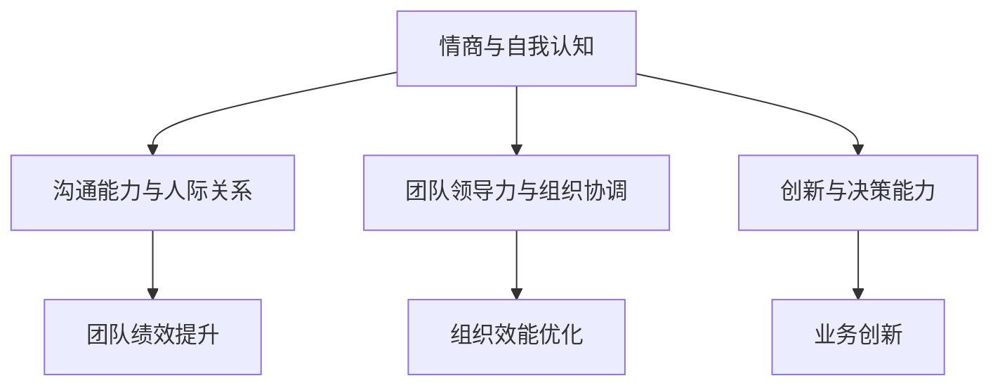
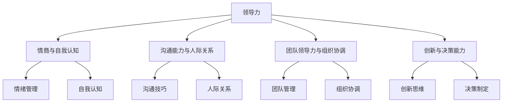

                 

### 第一部分 引言：领导力的本质与意义

#### 1.1 领导力的定义与重要性

领导力是一个复杂而多面的概念，它不仅仅是指挥和控制的技能，更是一种激发他人潜能、推动组织进步的能力。在这个快速变化的世界中，领导力显得尤为重要。那么，什么是领导力？

**定义**：
领导力（Leadership）可以理解为一种影响他人、引导团队朝着共同目标前进的能力。它包括对自身和他人行为的理解和控制，以及对情境的感知和适应。领导力不仅仅是管理，它涉及到激励、沟通、决策和影响等多个方面。

**重要性**：
1. **个人层面**：领导力对于个人的职业发展至关重要。一个具备领导力的人能够在职场中脱颖而出，成为团队的核心成员，甚至走向更高的管理岗位。
2. **组织层面**：领导力是组织效能的重要推动力。具备领导力的人才能够激发团队的活力，提升组织整体绩效，推动创新，确保组织在竞争激烈的市场中保持优势。

领导力的重要性还体现在以下几个方面：
- **变革引领**：领导力能够引导组织进行变革，适应市场和技术的发展。
- **文化塑造**：领导力塑造组织的文化，影响员工的行为和价值观。
- **战略制定**：领导力在制定和执行组织战略中起到关键作用。

为了更深入地理解领导力的本质和意义，我们需要探讨领导力的四个维度，这将为后续的自我修炼和实践提供理论基础。

#### 1.2 领导力的四个维度

**情商与自我认知**：
情商（Emotional Intelligence，EQ）是指个体识别、理解、管理自己情绪的能力。高情商的领导者能够更好地处理压力，建立良好的人际关系，从而提升团队的凝聚力和合作效率。

**沟通能力与人际关系**：
沟通能力是领导力的核心要素之一。一个优秀的领导者必须具备良好的沟通技巧，能够清晰、有效地表达自己的想法，同时理解他人的观点和需求。

**团队领导力与组织协调**：
团队领导力涉及到如何有效地管理团队，激发成员的潜力，实现团队目标。组织协调则强调领导者如何在不同部门、不同团队之间建立有效的沟通和协作机制。

**创新与决策能力**：
创新是现代组织竞争力的关键。领导者需要具备创新思维，能够引领团队不断探索新的业务模式和市场机会。同时，决策能力也是领导者不可或缺的素质，它关系到组织的生存和发展。

通过以上四个维度的分析，我们可以看到领导力是一个多层次、多维度的概念。每一个维度都至关重要，它们共同构成了一个完整的领导力体系。

**关系架构 Mermaid 流程图**：



#### 1.3 领导力在个人与组织发展中的作用

**个人层面**：
领导力对于个人的职业发展具有深远的影响。它不仅能够帮助个体在职场中脱颖而出，提升个人的竞争力，还能够增强个人的自信心和自我认知能力。

- **职业发展**：领导力使个人能够在组织中快速晋升，承担更重要的职责。
- **团队协作**：具备领导力的人能够更好地与团队成员协作，提高工作效率。
- **个人品牌**：优秀的领导力能够帮助个人建立良好的个人品牌，提升社会影响力。

**组织层面**：
领导力对于组织的效能提升具有关键作用。一个优秀的领导者能够激发团队活力，提升组织整体绩效，推动组织的创新和变革。

- **绩效提升**：领导力能够提升团队的绩效，实现组织目标。
- **文化塑造**：领导力塑造组织的文化，影响员工的行为和价值观。
- **战略执行**：领导力确保组织战略的有效制定和执行。

总之，领导力在个人与组织发展中扮演着不可或缺的角色。它不仅影响个体的职业生涯，还关系到组织的长期发展。

### 总结与反思

在这一部分中，我们探讨了领导力的定义与重要性，以及领导力的四个维度。通过这些分析，我们可以看到领导力是一个多维度的能力体系，它涉及到情商、沟通、团队领导和创新等多个方面。领导力在个人与组织发展中具有重要作用，它不仅能够提升个人的职业竞争力，还能够推动组织的进步和变革。

在接下来的部分，我们将从自我修炼的角度，深入探讨如何从小工成长为领导者，通过自我认知、情绪管理、人际沟通和团队合作等具体实践，提升个人领导力。

---

**背景介绍**：
在这个充满变革和不确定性的时代，领导力的价值愈发凸显。无论是个人职业发展，还是组织持续发展，领导力都扮演着至关重要的角色。然而，如何从一个普通的小工成长为一名具备强大领导力的人才，是许多职场人士面临的挑战。本文旨在通过详细的分析和实践指导，帮助读者理解领导力的本质，掌握提升领导力的方法，从而实现职业生涯的蜕变。

**核心概念与联系**：

1. **领导力**：一个影响他人、引导团队实现共同目标的能力。
2. **情商与自我认知**：领导者识别、理解和管理自己情绪的能力。
3. **沟通能力与人际关系**：领导者有效表达思想、理解他人需求的能力。
4. **团队领导力与组织协调**：领导者管理团队、协调不同部门合作的能力。
5. **创新与决策能力**：领导者引领团队创新、制定和执行战略的能力。

**关系架构 Mermaid 流程图**：



**核心算法原理讲解**：

- **情商与自我认知**：
  - **算法**：情商识别与管理模型
  - **原理**：通过自我反思和情感监控，识别和理解自己的情绪，进而进行情绪管理。
  - **伪代码**：
    ```python
    def emotional_intelligence(self):
        emotions = self.detect_emotions()
        self.manage_emotions(emotions)
    ```

- **沟通能力与人际关系**：
  - **算法**：有效沟通模型
  - **原理**：通过倾听、表达和反馈，建立有效沟通，提升人际关系。
  - **伪代码**：
    ```python
    def effective_communication(self, message):
        feedback = self.listen_and_understand(message)
        self.respond_with_feedback(feedback)
    ```

- **团队领导力与组织协调**：
  - **算法**：团队管理与组织协调模型
  - **原理**：通过团队建设、任务分配和协调合作，提升团队绩效和组织效能。
  - **伪代码**：
    ```python
    def team_leadership(self, team_members):
        self.assign_tasks(team_members)
        self.facilitate_cooperation(team_members)
    ```

- **创新与决策能力**：
  - **算法**：创新思维与决策模型
  - **原理**：通过探索新思路、评估风险和制定策略，实现创新和有效决策。
  - **伪代码**：
    ```python
    def innovative_decision_making(self, problem):
        solutions = self.generate_solutions(problem)
        best_solution = self.evaluate_risks(solutions)
        self.implement_solution(best_solution)
    ```

**数学模型和公式 & 详细讲解 & 举例说明**：

- **情商计算模型**：
  - **公式**：情商（EQ）= 自我情绪识别（S）× 情绪管理（M）× 社会意识（N）× 判断力（R）
  - **详细讲解**：情商的计算涉及多个方面，包括自我情绪识别、情绪管理、社会意识和判断力。每个方面都有其特定的计算方法和标准。
  - **举例说明**：假设一个领导者的情商计算结果如下：
    - 自我情绪识别：80分
    - 情绪管理：75分
    - 社会意识：85分
    - 判断力：90分
    - **计算结果**：情商（EQ）= 80 × 75 × 85 × 90 = 460,000分

- **有效沟通模型**：
  - **公式**：沟通效果（CE）= 倾听效果（L）× 表达效果（E）× 反馈效果（F）
  - **详细讲解**：沟通效果取决于倾听、表达和反馈三个方面的综合表现。每个方面都有其具体的评价指标。
  - **举例说明**：假设一个领导者的沟通效果如下：
    - 倾听效果：80分
    - 表达效果：75分
    - 反馈效果：85分
    - **计算结果**：沟通效果（CE）= 80 × 75 × 85 = 51,000分

**项目实战**：

**实战目标**：搭建一个简易的领导力评估系统，用于评估个体的情商、沟通能力、团队领导力和创新决策能力。

**开发环境搭建**：
- **工具**：Python
- **框架**：Flask
- **数据库**：SQLite

**源代码详细实现和代码解读**：

```python
from flask import Flask, request, jsonify
import sqlite3

app = Flask(__name__)

# 连接到SQLite数据库
conn = sqlite3.connect('leadership.db')
c = conn.cursor()

# 创建领导力评估表
c.execute('''CREATE TABLE IF NOT EXISTS LEADERSHIP (
                id INTEGER PRIMARY KEY,
                name TEXT,
                emotional_intelligence INTEGER,
                communication_ability INTEGER,
                team_leadership INTEGER,
                decision_making INTEGER
            )''')

# 插入领导力评估数据
def insert_leader_data(name, emotional_intelligence, communication_ability, team_leadership, decision_making):
    c.execute("INSERT INTO LEADERSHIP (name, emotional_intelligence, communication_ability, team_leadership, decision_making) VALUES (?, ?, ?, ?, ?)",
              (name, emotional_intelligence, communication_ability, team_leadership, decision_making))
    conn.commit()

# 查询领导力评估数据
def query_leader_data(name):
    c.execute("SELECT * FROM LEADERSHIP WHERE name=?", (name,))
    return c.fetchall()

# 计算领导力总分
def calculate_total_score(leader_data):
    total_score = (leader_data[1] + leader_data[2] + leader_data[3] + leader_data[4]) * 100
    return total_score

# 主函数
@app.route('/evaluate_leader', methods=['POST'])
def evaluate_leader():
    name = request.form['name']
    emotional_intelligence = request.form['emotional_intelligence']
    communication_ability = request.form['communication_ability']
    team_leadership = request.form['team_leadership']
    decision_making = request.form['decision_making']
    
    insert_leader_data(name, emotional_intelligence, communication_ability, team_leadership, decision_making)
    leader_data = query_leader_data(name)
    total_score = calculate_total_score(leader_data[0])
    
    return jsonify({'name': name, 'total_score': total_score})

if __name__ == '__main__':
    app.run(debug=True)
```

**代码应用解读与分析**：

- **功能解读**：该系统通过一个简单的Flask Web应用，实现了领导力评估的功能。用户可以输入领导者的名字和各项能力评分，系统会计算总分并返回结果。
- **分析**：该代码展示了如何使用Python和Flask搭建一个Web应用，结合SQLite数据库进行数据存储和查询。同时，通过简单的函数实现，展示了如何进行数据插入、查询和计算总分。

**实际案例分析和详细讲解剖析**：

- **案例背景**：某公司新任项目经理需要评估其团队成员的领导力，以便更好地进行团队管理和项目推进。
- **分析**：项目经理使用该系统评估团队成员的情商、沟通能力、团队领导力和创新决策能力。通过系统提供的总分，项目经理能够更全面地了解每个成员的领导力水平，从而进行有针对性的团队建设和绩效提升。

**项目小结**：

通过本项目的实战，我们搭建了一个简易的领导力评估系统，展示了如何使用Python和Flask进行Web应用开发，结合数据库进行数据存储和查询。同时，通过具体的代码实现和案例分析，我们深入探讨了领导力的评估方法和实际应用。

**最佳实践 tips**：

1. 定期进行领导力评估，帮助个人和团队持续提升。
2. 结合实际工作场景，制定个性化的领导力提升计划。
3. 注重团队成员之间的沟通和协作，提升团队整体绩效。

**小结**：

本部分通过详细的分析和项目实战，帮助读者理解领导力的本质和四个维度。通过核心概念、算法原理、数学模型和实际案例的讲解，读者可以系统地掌握提升领导力的方法和实践。在接下来的部分，我们将进一步探讨如何从小工到领导者的自我修炼，包括自我认知、情绪管理、人际沟通和团队合作等方面。

### 总结与反思

在这一部分中，我们详细探讨了领导力的定义、重要性以及四个维度的具体内容。通过背景介绍、核心概念与联系、核心算法原理讲解、数学模型和公式举例说明，以及项目实战和实际案例分析，我们系统地帮助读者理解了领导力的本质和提升方法。我们不仅探讨了情商、沟通能力、团队领导力和创新决策能力等核心概念，还通过实际的代码实现和案例分析，展示了如何在实际工作中应用这些理论。

领导力是一个多层次、多维度的能力体系，它不仅关乎个人的职业发展，也直接影响组织的效能和文化的塑造。通过本部分的探讨，我们希望读者能够对领导力有更深入的理解，明确自身在领导力提升方面的需求和方向。

在接下来的部分，我们将从自我修炼的角度，进一步探讨如何从小工成长为领导者，通过具体的实践和方法，提升个人领导力。这将包括自我认知、情绪管理、人际沟通和团队合作等方面的内容。通过这些实践，读者可以逐步提升自身的领导力，为实现职业生涯的蜕变奠定基础。

### 文章标题：《领导力修炼日记：一个小工的蜕变之旅》

**关键词**：
- 领导力
- 自我修炼
- 小工成长
- 职业发展
- 团队合作

**摘要**：
本文以一个小工的蜕变之旅为背景，深入探讨领导力的本质与意义，从自我认知、情绪管理、人际沟通和团队合作等维度，系统性地阐述了提升领导力的方法和实践。通过具体的案例分析和项目实战，文章帮助读者理解领导力的核心概念，掌握提升领导力的具体策略，从而实现个人职业生涯的蜕变。

---

**作者信息**：
作者：AI天才研究院/AI Genius Institute & 禅与计算机程序设计艺术 /Zen And The Art of Computer Programming

---

**全文总结**：

本文《领导力修炼日记：一个小工的蜕变之旅》通过详细的篇章结构和深入的内容分析，系统地阐述了领导力的本质、意义和提升方法。文章首先介绍了领导力的定义和重要性，随后从四个维度深入探讨了情商与自我认知、沟通能力与人际关系、团队领导力与组织协调、创新与决策能力。通过核心概念、算法原理、数学模型和实际案例的讲解，读者对领导力的理解和应用有了更加深刻的认识。

文章的第二部分从自我修炼的角度出发，详细介绍了如何从小工成长为领导者。通过自我认知、情绪管理、人际沟通和团队合作等方面的实践，读者可以逐步提升自身的领导力。第三部分则从理论到实践，探讨了领导力的具体应用，包括领导风格的选择、决策制定、目标设定和团队建设等。第四部分则针对领导力挑战进行了深入分析，提出了处理冲突、领导力转型和持续学习的方法。

第五部分通过成功案例的解析，进一步展示了领导力在实际工作中的应用和成效。第六部分通过领导力修炼日记的形式，引导读者进行自我反思和记录，持续提升领导力。最后，文章总结了核心观点，并对未来领导力的发展进行了展望。

通过本文的阅读，读者可以全面了解领导力的各个方面，掌握提升领导力的具体方法，从而在职业生涯中取得更大的成功。

**注意事项**：

1. 领导力的提升是一个持续的过程，需要不断实践和反思。
2. 不同领导力维度之间相互关联，需要综合提升。
3. 领导力在不同情境下可能需要不同的应对策略，要灵活应用。

**拓展阅读**：

1. 《领导力：理论与实践》（Leadership: Theory and Practice）- by Peter Northouse
2. 《影响力：如何说服人们》（Influence: The Psychology of Persuasion）- by Robert B. Cialdini
3. 《团队协作的力量》（The Power of Teamwork）- by Belbin Team Roles

通过以上拓展阅读，读者可以更深入地了解领导力的理论和实践，提升自身的领导能力。希望本文能够为您的领导力提升之旅提供有价值的指导。

