                 


### 第1章：领导力概述

#### 关键词
- 领导力
- 领导风格
- 团队效应
- 项目管理
- 决策能力
- 沟通技巧

#### 摘要
本章将探讨领导力的定义、重要性以及领导风格对团队效应的影响。我们将深入了解不同类型的领导风格，以及如何通过有效的沟通和决策能力来提升团队的绩效和凝聚力。

#### 1.1 领导力的定义与重要性

**背景介绍**
领导力是一个广泛讨论但难以精确定义的领域。它涉及到领导者如何影响、激励和引导他人以实现共同的目标。在技术行业中，领导力对于团队的成功和公司的成长至关重要。

**核心概念与联系**
- **领导力的定义**：领导力是一种通过影响、激励和指导他人来实现共同目标的能力。它不仅涉及个人的特质和技能，还包括领导者的行为和决策。
- **领导力的重要性**：领导力在技术行业中扮演着关键角色，因为技术团队往往需要创新、协作和高效的工作方式。一个成功的领导者能够推动团队向前发展，激发成员的潜力，并帮助公司实现其战略目标。

**Mermaid 流程图**
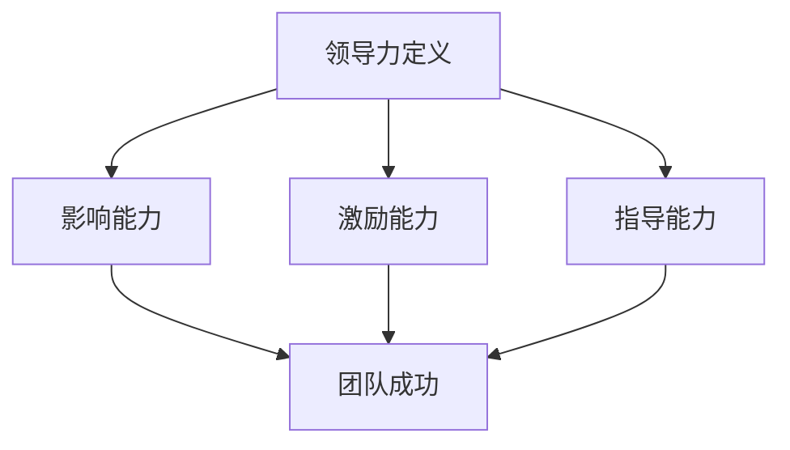
```mermaid
graph TB
A[领导力定义] --> B[影响能力]
A --> C[激励能力]
A --> D[指导能力]
B --> E[团队成功]
C --> E
D --> E
```

#### 1.2 领导风格与团队效应

**核心概念与联系**
- **领导风格**：领导风格是指领导者如何行使权力和影响他人。常见的领导风格包括权威型、民主型、参与型和教练型等。
- **团队效应**：团队效应是指团队内部成员之间的互动和协作对团队整体表现的影响。不同的领导风格会对团队效应产生不同的影响。

**Mermaid 流程图**
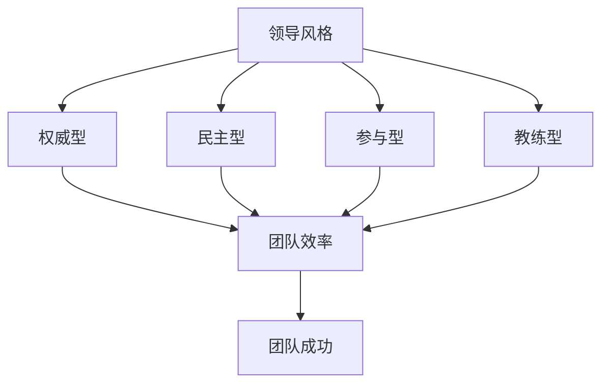
```mermaid
graph TB
A[领导风格] --> B[权威型]
A --> C[民主型]
A --> D[参与型]
A --> E[教练型]
B --> F[团队效率]
C --> F
D --> F
E --> F
F --> G[团队成功]
```

#### 1.3 沟通技巧

**核心概念与联系**
- **沟通技巧**：沟通技巧是指领导者如何有效地传递信息和建立联系。有效的沟通有助于团队理解目标、减少误解并增强团队凝聚力。
- **沟通的重要性**：在技术团队中，沟通是确保项目顺利进行的关键。领导者必须具备良好的沟通技巧，以确保团队成员能够清晰地理解任务和目标。

**伪代码讲解**
```plaintext
function communicate(message, audience)
    if (audience == "team")
        message_format = "clear and concise"
    else if (audience == "client")
        message_format = "detailed and technical"
    else
        message_format = "informal and friendly"

    send_message(message, message_format)
end function
```

#### 1.4 决策能力

**核心概念与联系**
- **决策能力**：决策能力是指领导者如何在不确定性和压力下做出明智的决策。决策能力对于技术团队的成功至关重要，因为技术项目往往面临复杂的问题和挑战。
- **决策的类型**：常见的决策类型包括战略决策、战术决策和运营决策。

**LaTeX 公式**
```latex
\text{决策效果} = f(\text{信息质量}, \text{决策时间}, \text{风险承受能力})
```

#### 1.5 团队建设

**核心概念与联系**
- **团队建设**：团队建设是指通过一系列活动和策略来增强团队成员之间的协作和信任。有效的团队建设可以提高团队的绩效和满意度。
- **团队建设的策略**：团队建设的策略包括团队活动、团队建设培训和团队文化建设等。

**项目实战**
**开发环境搭建**
- 安装Java开发工具包（JDK）
- 配置Git版本控制系统
- 安装数据库（如MySQL）

**源代码实现**
```java
// Java 类：TeamMember
public class TeamMember {
    private String name;
    private String role;
    private boolean isAvailable;

    public void work() {
        if (isAvailable) {
            System.out.println(name + " is working.");
        } else {
            System.out.println(name + " is on leave.");
        }
    }
}
```

**代码解读与分析**
- **代码解释**：上述Java类`TeamMember`定义了一个团队成员的属性和方法。
- **代码应用**：该类可以用于管理团队成员的状态和工作情况。

**实际案例分析**
- **案例背景**：在一个软件开发项目中，团队需要管理成员的工作状态和任务分配。
- **案例分析**：通过使用`TeamMember`类，可以跟踪团队成员的可用性和工作进度，从而提高团队的协作效率。

**项目小结**
- **小结**：通过搭建开发环境、实现源代码和进行代码解读与分析，我们展示了如何在实际项目中应用领导力的核心概念。

**最佳实践 tips**
- **提高沟通效果**：定期召开团队会议，确保团队成员之间的信息畅通。
- **培养决策能力**：通过培训和实践，提高领导者在不确定环境下的决策能力。
- **加强团队建设**：定期组织团队活动，增强团队成员之间的协作和信任。

**小结**
本章通过详细的背景介绍、核心概念与联系讲解、伪代码和LaTeX公式、项目实战以及最佳实践 tips，全面阐述了领导力在技术总监角色中的重要性。接下来，我们将进一步探讨技术总监在实际工作中如何运用领导力来推动团队和项目的成功。

## 1.1 领导力的定义与重要性

#### 背景介绍

在技术行业中，领导力是一个不可或缺的元素，尤其是在快速变化和创新驱动的环境中。一个技术总监需要具备强大的领导力，以指导团队朝着明确的目标前进，同时确保团队成员的积极性、创新能力和工作效率。然而，领导力的概念并不是一成不变的，它随着时间和组织环境的变化而不断发展。

**领导力的定义**

领导力是一种复杂且多维度的概念，通常涉及个人特质、行为模式和技能的综合体。简单来说，领导力是指一个人或一组人在指导、激励和影响他人时展示的能力。这种能力不仅包括对团队的整体规划和战略决策，还包括对个体成员的激励和引导。

领导力并非天生就具备，而是可以通过学习和实践来逐步培养和提升。它涉及到多个方面，包括但不限于：

1. **愿景与目标设定**：领导者需要有一个清晰的愿景，并将其转化为可操作的目标，以确保团队的共同努力方向一致。
2. **决策能力**：在复杂和不确定的环境中，领导者需要能够快速做出明智的决策，并承担责任。
3. **沟通与协作**：有效的沟通技巧对于建立团队信任和协作至关重要。领导者需要能够清晰地传达信息，理解团队成员的需求，并促进团队之间的沟通。
4. **激励与成长**：领导者需要激励团队成员，激发他们的潜力，并提供必要的支持和资源，以促进个人和团队的成长。
5. **道德与责任感**：领导者在决策和行为中必须保持高标准的道德和责任感，以树立良好的榜样。

**领导力的重要性**

在技术行业，领导力的重要性体现在以下几个方面：

1. **团队协作与效能**：技术项目往往需要团队成员之间的紧密合作和高效协同。一个有领导力的技术总监能够促进团队协作，提高团队的执行力和创新能力。
2. **创新与适应能力**：技术行业变化迅速，领导者需要具备适应变化和创新思维的能力，以应对市场和技术环境的变化。
3. **项目管理**：技术总监在项目管理中扮演着关键角色。他们需要制定合理的项目计划，监控进度，确保项目按时交付，并处理项目中的风险和问题。
4. **员工激励与发展**：技术总监需要了解团队成员的需求和动机，通过有效的激励措施来提高员工的满意度和工作效率，并为他们提供职业发展的机会。
5. **组织文化**：领导力对于塑造组织文化也具有重要影响。一个有领导力的技术总监可以推动积极的组织文化，增强员工的归属感和工作热情。

**领导力与业务成功**

领导力不仅影响团队和个人的绩效，还直接关联到组织的整体成功。以下是一些领导力如何影响业务成功的例子：

1. **团队绩效**：通过有效的领导，技术总监可以激发团队的工作热情和创造力，提高团队的绩效和项目成功率。
2. **客户满意度**：领导力对于提升客户满意度也起着重要作用。一个有领导力的技术总监可以确保团队能够按时交付高质量的产品和服务，从而提高客户满意度。
3. **创新能力**：领导者的激励和引导可以激发团队成员的创新思维，推动技术进步和业务模式创新。
4. **员工保留率**：通过建立积极的工作环境和提供职业发展机会，技术总监可以降低员工流失率，提高员工忠诚度。
5. **公司文化**：领导力对于塑造公司文化至关重要。一个有领导力的技术总监可以推动公司建立以客户为中心、以创新为驱动的文化。

**领导力挑战**

尽管领导力在技术行业中具有重要意义，但技术总监也面临着一系列挑战：

1. **快速变化的技术环境**：技术行业变化迅速，技术总监需要不断学习新技能和知识，以适应不断变化的市场需求。
2. **多任务处理与时间管理**：技术总监通常需要处理多个项目和任务，需要良好的时间管理和多任务处理能力。
3. **沟通障碍**：在多元文化和全球化的团队中，沟通障碍是一个常见问题。技术总监需要具备跨文化沟通的能力，以确保团队协作顺畅。
4. **员工期望与激励**：技术人才往往对职业发展和个人成就有较高的期望。技术总监需要了解员工的期望，并提供相应的激励和支持。

**结论**

领导力是技术总监成功的关键要素。通过有效的领导力，技术总监可以推动团队和项目的成功，提升组织的整体绩效和竞争力。在接下来的章节中，我们将进一步探讨领导力的核心概念、不同类型的领导风格以及如何在技术总监的职位上运用领导力来应对各种挑战。

### 1.2 领导风格与团队效应

#### 核心概念与联系

**领导风格**

领导风格是指领导者行使权力和影响他人的方式。不同的领导风格会对团队的效能和成员的行为产生不同的影响。常见的领导风格包括：

1. **权威型领导**：领导者高度集权，决策权集中在领导手中。这种风格适用于需要迅速行动和明确指导的紧急情况。
2. **民主型领导**：领导者鼓励团队成员参与决策过程，尊重团队成员的意见。这种风格有助于提高团队的参与度和创造力。
3. **参与型领导**：领导者积极倾听团队成员的意见，并尝试让每个成员都感到被重视。这种风格有助于增强团队凝聚力和成员的归属感。
4. **教练型领导**：领导者通过指导和培训团队成员，帮助他们实现个人和职业发展。这种风格有助于提升团队成员的专业技能和工作效率。

**团队效应**

团队效应是指团队成员之间的互动和协作对团队整体表现的影响。不同的领导风格会对团队效应产生不同的影响：

1. **权威型领导**：权威型领导可能导致团队成员过于依赖领导者，缺乏自主性和创新能力。这可能会导致团队效率低下和成员积极性不高。
2. **民主型领导**：民主型领导鼓励团队成员参与决策，提高团队的参与度和创造力。这种领导风格有助于培养团队成员的责任感和团队精神。
3. **参与型领导**：参与型领导增强团队成员之间的沟通和合作，提高团队的凝聚力和成员的归属感。这种领导风格有助于建立积极的团队文化。
4. **教练型领导**：教练型领导通过培训和指导，提升团队成员的专业技能和工作效率。这种领导风格有助于团队成员的个人成长和职业发展。

**Mermaid 流程图**

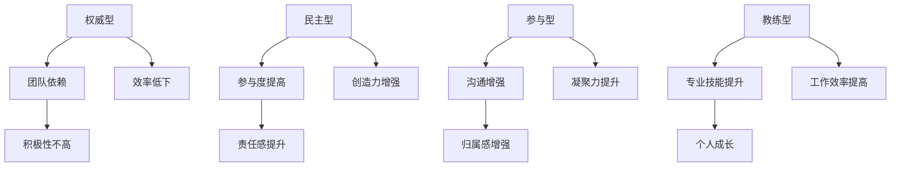
```mermaid
graph TB
A[权威型] --> B[团队依赖]
A --> C[效率低下]
B --> D[积极性不高]

E[民主型] --> F[参与度提高]
E --> G[创造力增强]
F --> H[责任感提升]

I[参与型] --> J[沟通增强]
I --> K[凝聚力提升]
J --> L[归属感增强]

M[教练型] --> N[专业技能提升]
M --> O[工作效率提高]
N --> P[个人成长]
```

### 1.3 沟通技巧

#### 核心概念与联系

**沟通技巧**

沟通技巧是指领导者如何有效地传递信息、建立联系和理解他人。有效的沟通对于团队的成功至关重要，因为良好的沟通能够减少误解、增强团队合作和提高工作效率。

1. **倾听**：倾听是有效沟通的基础。领导者需要积极倾听团队成员的意见和反馈，以理解他们的需求和观点。
2. **表达清晰**：领导者需要用简洁明了的语言表达自己的想法和指令，确保团队成员能够准确理解。
3. **非言语沟通**：非言语沟通包括肢体语言、面部表情和眼神交流等。领导者需要通过这些方式传达积极的信息，增强沟通效果。
4. **反馈**：领导者需要及时给予团队成员反馈，以帮助他们改进工作并增强自信心。

**沟通的重要性**

在技术团队中，沟通的重要性体现在以下几个方面：

1. **确保任务理解**：清晰的沟通有助于团队成员正确理解任务和目标，避免因误解而导致的错误和重复工作。
2. **增强团队协作**：良好的沟通能够促进团队成员之间的协作，提高团队的执行力和创新能力。
3. **减少误解和冲突**：有效的沟通可以减少因误解和沟通障碍而产生的冲突，增强团队的和谐与凝聚力。
4. **提高工作效率**：清晰的沟通能够减少因沟通不畅而导致的延误和资源浪费，提高团队的工作效率。

**伪代码讲解**

```plaintext
function communicate(message, audience)
    if (audience == "team")
        message_format = "clear and concise"
    else if (audience == "client")
        message_format = "detailed and technical"
    else
        message_format = "informal and friendly"

    send_message(message, message_format)
end function
```

### 1.4 决策能力

#### 核心概念与联系

**决策能力**

决策能力是指领导者如何在不确定性和压力下做出明智的决策。决策能力对于技术总监的成功至关重要，因为技术项目往往面临复杂的问题和挑战。

1. **信息收集**：决策前，领导者需要收集和分析相关信息，以全面了解问题。
2. **分析问题**：领导者需要对问题进行深入分析，确定关键因素和潜在风险。
3. **制定方案**：根据分析结果，领导者需要制定多个备选方案，并评估其优缺点。
4. **选择方案**：在评估备选方案后，领导者需要选择最合适的方案，并承担决策结果的责任。
5. **执行和监控**：领导者需要确保决策得到有效执行，并持续监控决策的效果，以便及时调整。

**决策的类型**

1. **战略决策**：涉及组织长期目标和方向的关键决策，如产品定位和市场策略。
2. **战术决策**：涉及短期目标和具体行动计划的决策，如项目管理和资源分配。
3. **运营决策**：涉及日常运营中的具体问题，如员工排班和设备维护。

**Mermaid 流程图**

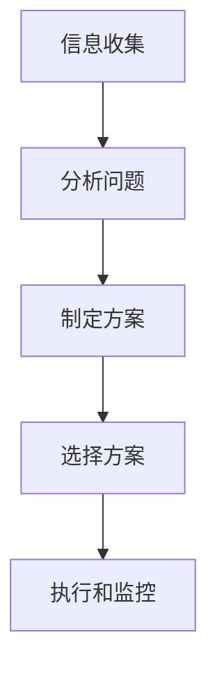
```mermaid
graph TB
A[信息收集] --> B[分析问题]
B --> C[制定方案]
C --> D[选择方案]
D --> E[执行和监控]
```

### 1.5 团队建设

#### 核心概念与联系

**团队建设**

团队建设是指通过一系列活动和策略来增强团队成员之间的协作和信任。有效的团队建设可以提高团队的绩效和满意度。

1. **团队角色与成员关系**：了解团队成员的角色和关系有助于建立有效的沟通和协作。
2. **团队活动**：组织团队建设活动，如团队拓展训练、团建活动和知识分享会，以增强团队成员之间的交流和合作。
3. **团队文化建设**：建立积极的团队文化，如鼓励创新、支持团队合作和认可员工成就，以促进团队的长期发展。

**团队领导力**

1. **团队领导的职责**：团队领导需要负责团队的战略规划、资源分配、绩效管理和团队发展。
2. **团队领导的挑战**：团队领导面临挑战，如团队成员之间的冲突、项目进度延迟和工作量分配不均。

**Mermaid 流程图**

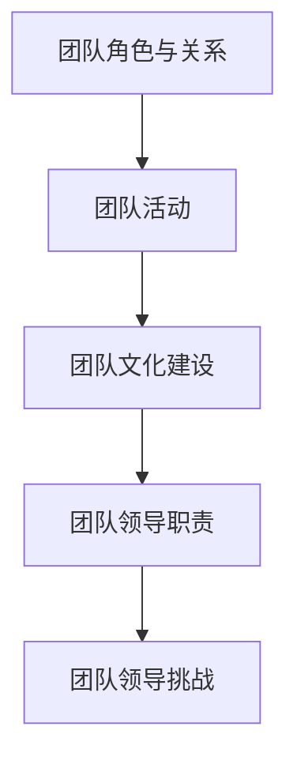
```mermaid
graph TB
A[团队角色与关系] --> B[团队活动]
B --> C[团队文化建设]
C --> D[团队领导职责]
D --> E[团队领导挑战]
```

## 第2章：领导力核心概念

### 2.1 沟通技巧

#### 核心概念与联系

**沟通技巧**

沟通技巧是指领导者如何有效地传递信息、建立联系和理解他人。有效的沟通对于团队的成功至关重要，因为良好的沟通能够减少误解、增强团队合作和提高工作效率。

1. **倾听**：倾听是有效沟通的基础。领导者需要积极倾听团队成员的意见和反馈，以理解他们的需求和观点。
2. **表达清晰**：领导者需要用简洁明了的语言表达自己的想法和指令，确保团队成员能够准确理解。
3. **非言语沟通**：非言语沟通包括肢体语言、面部表情和眼神交流等。领导者需要通过这些方式传达积极的信息，增强沟通效果。
4. **反馈**：领导者需要及时给予团队成员反馈，以帮助他们改进工作并增强自信心。

**沟通的重要性**

在技术团队中，沟通的重要性体现在以下几个方面：

1. **确保任务理解**：清晰的沟通有助于团队成员正确理解任务和目标，避免因误解而导致的错误和重复工作。
2. **增强团队协作**：良好的沟通能够促进团队成员之间的协作，提高团队的执行力和创新能力。
3. **减少误解和冲突**：有效的沟通可以减少因误解和沟通障碍而产生的冲突，增强团队的和谐与凝聚力。
4. **提高工作效率**：清晰的沟通能够减少因沟通不畅而导致的延误和资源浪费，提高团队的工作效率。

**伪代码讲解**

```plaintext
function communicate(message, audience)
    if (audience == "team")
        message_format = "clear and concise"
    else if (audience == "client")
        message_format = "detailed and technical"
    else
        message_format = "informal and friendly"

    send_message(message, message_format)
end function
```

### 2.2 决策能力

#### 核心概念与联系

**决策能力**

决策能力是指领导者如何在不确定性和压力下做出明智的决策。决策能力对于技术总监的成功至关重要，因为技术项目往往面临复杂的问题和挑战。

1. **信息收集**：决策前，领导者需要收集和分析相关信息，以全面了解问题。
2. **分析问题**：领导者需要对问题进行深入分析，确定关键因素和潜在风险。
3. **制定方案**：根据分析结果，领导者需要制定多个备选方案，并评估其优缺点。
4. **选择方案**：在评估备选方案后，领导者需要选择最合适的方案，并承担决策结果的责任。
5. **执行和监控**：领导者需要确保决策得到有效执行，并持续监控决策的效果，以便及时调整。

**决策的类型**

1. **战略决策**：涉及组织长期目标和方向的关键决策，如产品定位和市场策略。
2. **战术决策**：涉及短期目标和具体行动计划的决策，如项目管理和资源分配。
3. **运营决策**：涉及日常运营中的具体问题，如员工排班和设备维护。

**Mermaid 流程图**


```mermaid
graph TB
A[信息收集] --> B[分析问题]
B --> C[制定方案]
C --> D[选择方案]
D --> E[执行和监控]
```

### 2.3 团队建设

#### 核心概念与联系

**团队建设**

团队建设是指通过一系列活动和策略来增强团队成员之间的协作和信任。有效的团队建设可以提高团队的绩效和满意度。

1. **团队角色与成员关系**：了解团队成员的角色和关系有助于建立有效的沟通和协作。
2. **团队活动**：组织团队建设活动，如团队拓展训练、团建活动和知识分享会，以增强团队成员之间的交流和合作。
3. **团队文化建设**：建立积极的团队文化，如鼓励创新、支持团队合作和认可员工成就，以促进团队的长期发展。

**团队领导力**

1. **团队领导的职责**：团队领导需要负责团队的战略规划、资源分配、绩效管理和团队发展。
2. **团队领导的挑战**：团队领导面临挑战，如团队成员之间的冲突、项目进度延迟和工作量分配不均。

**Mermaid 流程图**


```mermaid
graph TB
A[团队角色与关系] --> B[团队活动]
B --> C[团队文化建设]
C --> D[团队领导职责]
D --> E[团队领导挑战]
```

## 第3章：技术总监的实践之路

### 3.1 技术趋势与业务融合

#### 核心概念与联系

**技术趋势**

技术趋势是指当前和未来一段时间内技术发展的主要方向和热点。了解技术趋势对于技术总监至关重要，因为这有助于他们把握市场机遇，推动团队创新和业务发展。

1. **人工智能（AI）**：人工智能是当前最具变革性的技术之一，它涉及机器学习、自然语言处理和计算机视觉等领域。
2. **云计算**：云计算提供了灵活的计算资源，使企业能够按需扩展和缩减资源，提高效率和灵活性。
3. **区块链**：区块链是一种分布式账本技术，具有去中心化、安全透明等特点，广泛应用于金融、供应链和物联网等领域。

**业务融合**

业务融合是指将技术趋势与业务需求相结合，以实现业务创新和增长。技术总监需要具备将技术应用到业务中的能力。

1. **业务需求分析**：技术总监需要深入了解业务需求，确定技术如何帮助企业实现战略目标。
2. **技术创新**：技术总监需要推动团队进行技术创新，将新技术应用于业务场景，提高效率和竞争力。
3. **业务流程优化**：技术总监需要分析业务流程，通过技术手段进行优化，减少成本和提高效率。

**Mermaid 流程图**

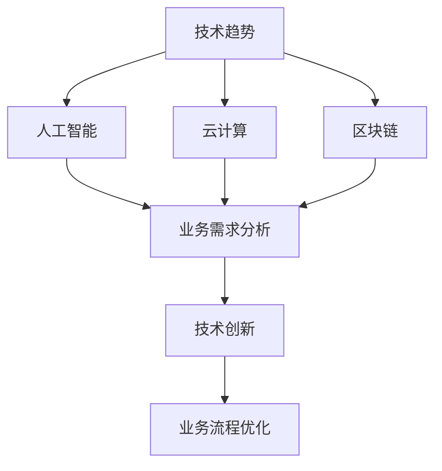
```mermaid
graph TB
A[技术趋势] --> B[人工智能]
A --> C[云计算]
A --> D[区块链]
B --> E[业务需求分析]
C --> E
D --> E
E --> F[技术创新]
F --> G[业务流程优化]
```

### 3.2 项目管理

#### 核心概念与联系

**项目管理**

项目管理是指规划和控制项目活动，以确保项目按时、按预算和按质量完成。技术总监在项目管理中扮演着关键角色。

1. **项目计划**：项目计划是项目管理的基础，包括项目范围、目标、时间表、资源分配和风险管理。
2. **项目执行**：项目执行是按照项目计划进行活动的过程，需要监控进度、资源使用和风险管理。
3. **项目监控**：项目监控是持续跟踪项目进度和成果，以确保项目按计划进行。
4. **项目收尾**：项目收尾是确认项目目标实现、总结经验教训和项目交付的过程。

**项目管理核心概念**

1. **项目范围**：项目范围定义了项目的边界和要交付的产品或服务。
2. **项目目标**：项目目标是指项目要实现的具体成果和效益。
3. **项目时间表**：项目时间表定义了项目的关键里程碑和交付时间。
4. **项目资源**：项目资源包括人力、物资、资金和时间等。
5. **项目风险管理**：项目风险管理是识别、评估和应对项目风险的过程。

**Mermaid 流程图**

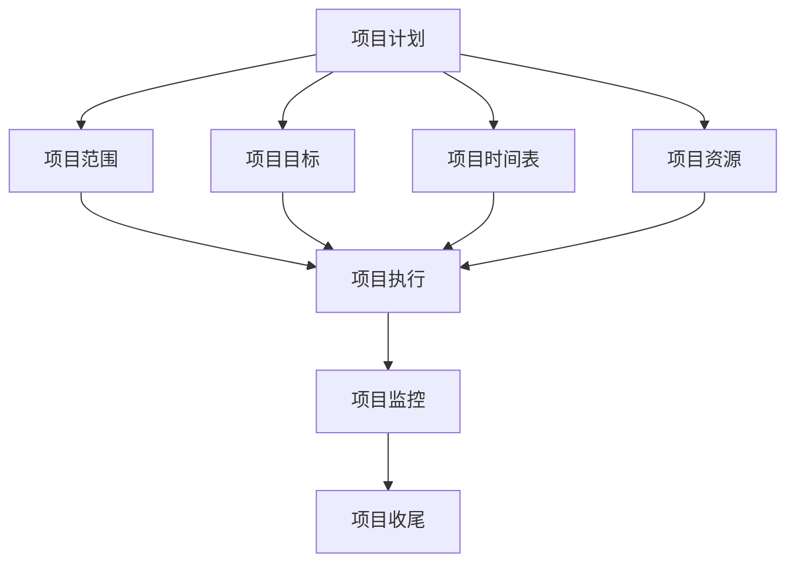
```mermaid
graph TB
A[项目计划] --> B[项目范围]
A --> C[项目目标]
A --> D[项目时间表]
A --> E[项目资源]
B --> F[项目执行]
C --> F
D --> F
E --> F
F --> G[项目监控]
G --> H[项目收尾]
```

### 3.3 团队管理

#### 核心概念与联系

**团队管理**

团队管理是指领导者通过一系列策略和技巧来管理和激励团队成员，以实现团队的目标。有效的团队管理对于技术团队的成功至关重要。

1. **团队角色与职责**：团队角色与职责是指每个团队成员在团队中的职责和角色。技术总监需要确保团队成员了解自己的角色和职责，以便高效协作。
2. **团队成员激励**：团队成员激励是指通过激励措施来提高团队成员的工作动力和效率。技术总监需要了解团队成员的需求和动机，并采取相应的激励措施。
3. **团队协作与沟通**：团队协作与沟通是指团队成员之间的协作和沟通。技术总监需要建立良好的沟通机制，确保团队成员之间的信息畅通。
4. **团队文化**：团队文化是指团队的价值观、行为规范和工作氛围。技术总监需要塑造积极的团队文化，以增强团队的凝聚力和归属感。

**团队管理策略**

1. **明确目标与期望**：技术总监需要明确团队的目标和期望，确保团队成员都清楚自己的工作目标和团队目标。
2. **定期沟通与反馈**：技术总监需要定期与团队成员进行沟通，了解他们的工作进展和需求，并给予及时的反馈。
3. **提供培训与发展机会**：技术总监需要为团队成员提供培训和发展机会，以提升他们的技能和职业素养。
4. **建立激励机制**：技术总监需要建立合理的激励机制，以激励团队成员努力工作并取得成果。
5. **关注团队成员的福利和成长**：技术总监需要关注团队成员的福利和成长，确保他们在一个良好的工作环境中工作。

**Mermaid 流程图**

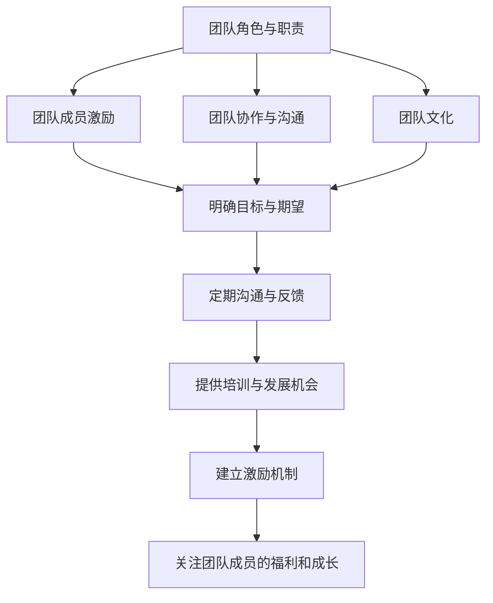
```mermaid
graph TB
A[团队角色与职责] --> B[团队成员激励]
A --> C[团队协作与沟通]
A --> D[团队文化]
B --> E[明确目标与期望]
C --> E
D --> E
E --> F[定期沟通与反馈]
F --> G[提供培训与发展机会]
G --> H[建立激励机制]
H --> I[关注团队成员的福利和成长]
```

## 第4章：技术总监的自我提升

### 4.1 自我反思与成长

#### 核心概念与联系

**自我反思**

自我反思是指技术总监通过反思自己的行为、决策和成果，识别自己的优点和不足，并从中学习。自我反思是领导力提升的重要步骤。

1. **识别问题**：技术总监需要识别自己在工作中遇到的问题和挑战，包括技能、知识、态度和行为等方面的不足。
2. **分析原因**：技术总监需要分析问题产生的原因，以便找到解决问题的方法。
3. **制定改进计划**：技术总监需要制定具体的改进计划，包括学习新技能、改进工作方法和调整态度等。

**成长路径**

技术总监的成长路径包括以下几个阶段：

1. **基础技能**：技术总监需要具备扎实的技术基础和业务知识，这是成长的基础。
2. **领导能力**：技术总监需要提升领导能力，包括沟通、决策、团队管理和项目管理等。
3. **战略思维**：技术总监需要具备战略思维能力，能够从整体上把握业务方向和趋势，制定长期发展战略。
4. **变革推动者**：技术总监需要成为变革的推动者，能够引领团队和公司适应市场变化，推动业务创新。

**Mermaid 流程图**

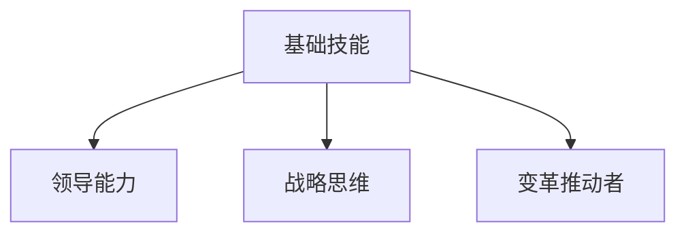
```mermaid
graph TB
A[基础技能] --> B[领导能力]
A --> C[战略思维]
A --> D[变革推动者]
```

### 4.2 领导力模型

#### 核心概念与联系

**领导力模型**

领导力模型是指一系列描述领导行为的理论框架，用于指导领导者提升自己的领导力。不同的领导力模型各有侧重，但都旨在提高领导者的决策能力、沟通技巧和团队管理能力。

1. **杰克·韦尔奇的领导力模型**：杰克·韦尔奇提出了“通用电气领导力模型”，强调领导者需要具备执行力、领导力和变革力。
2. **彼得·德鲁克的领导力原则**：彼得·德鲁克认为领导者应该关注目标设定、绩效评估和自我提升。

**杰克·韦尔奇的领导力模型**

- **执行力**：领导者需要具备强大的执行力，确保团队的决策得到有效执行。
- **领导力**：领导者需要具备领导力，能够激励和引导团队成员，发挥他们的潜力。
- **变革力**：领导者需要具备变革力，能够推动团队和公司适应市场变化，实现持续创新。

**彼得·德鲁克的领导力原则**

- **目标设定**：领导者需要明确团队的目标和使命，并确保团队成员都清楚这些目标。
- **绩效评估**：领导者需要定期评估团队成员的绩效，提供反馈和指导，以帮助他们改进工作。
- **自我提升**：领导者需要不断学习和自我提升，以保持自身的竞争力。

**Mermaid 流程图**

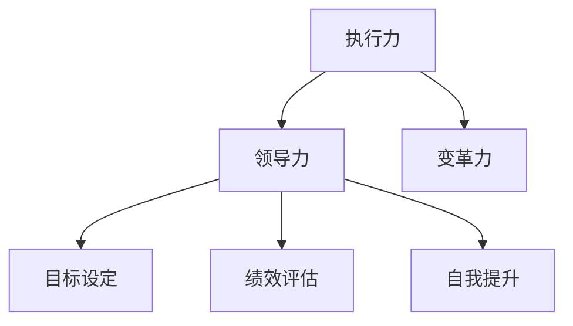
```mermaid
graph TB
A[执行力] --> B[领导力]
A --> C[变革力]
B --> D[目标设定]
B --> E[绩效评估]
B --> F[自我提升]
```

### 4.3 领导力与道德

#### 核心概念与联系

**领导力与道德**

领导力与道德密切相关，领导者必须在决策和行为中保持高标准的道德和责任感。道德领导力是指领导者通过正直、诚信和透明的方式领导团队，树立良好的榜样。

1. **道德领导力的定义**：道德领导力是指领导者通过道德行为和价值观来影响和引导他人。它包括正直、诚信、透明、责任感和公正等要素。
2. **道德领导力的重要性**：道德领导力对于建立信任、促进团队合作和提高组织绩效至关重要。它有助于增强员工的忠诚度和组织文化的凝聚力。

**道德困境与决策**

在技术行业中，领导者可能会面临各种道德困境和决策挑战。以下是一些常见的道德困境：

1. **信息泄露**：在保护客户隐私和数据安全方面，领导者需要平衡安全和业务需求。
2. **利益冲突**：领导者需要处理个人利益与公司利益之间的冲突，保持客观和公正。
3. **项目质量与进度**：在项目管理和交付过程中，领导者需要权衡质量、进度和成本，确保项目达到预期目标。

**决策框架**

在面对道德困境时，领导者可以采用以下决策框架：

1. **价值观驱动**：领导者需要以组织的核心价值观为指导，做出符合道德规范的决策。
2. **利益相关者分析**：领导者需要分析各个利益相关者的需求和利益，确保决策不会损害任何一方的利益。
3. **长期影响**：领导者需要考虑决策的长期影响，确保决策不仅符合短期利益，也符合长期战略和道德标准。

**Mermaid 流程图**

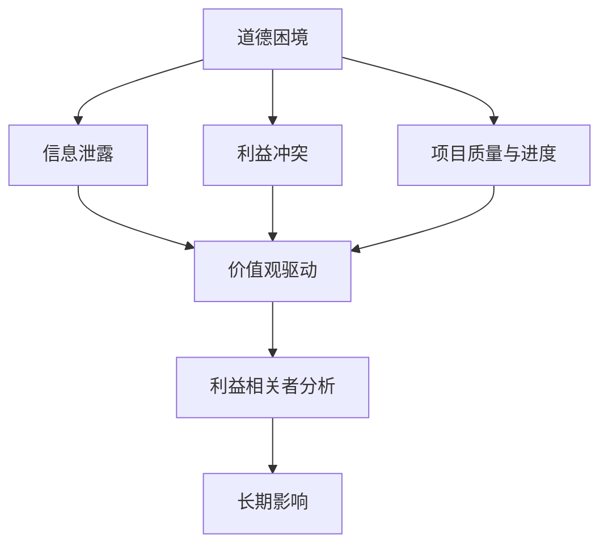
```mermaid
graph TB
A[道德困境] --> B[信息泄露]
A --> C[利益冲突]
A --> D[项目质量与进度]
B --> E[价值观驱动]
C --> E
D --> E
E --> F[利益相关者分析]
F --> G[长期影响]
```

## 第5章：领导力实践与案例分析

### 5.1 技术总监的领导力实践

#### 核心概念与联系

**领导力实践**

领导力实践是指技术总监在实际工作中运用领导力原则和技巧，以提升团队绩效和实现组织目标的过程。有效的领导力实践包括以下几个方面：

1. **建立愿景和目标**：技术总监需要明确团队的愿景和目标，并与团队成员共同制定实现这些目标的具体计划。
2. **培养团队协作**：技术总监需要促进团队成员之间的协作和沟通，确保团队能够高效地共同工作。
3. **激励和认可**：技术总监需要通过激励措施和认可来提高团队成员的积极性和工作效率。
4. **提供反馈和指导**：技术总监需要定期提供反馈和指导，帮助团队成员改进工作并实现个人成长。
5. **处理冲突和挑战**：技术总监需要有效地处理团队中的冲突和挑战，确保团队能够保持稳定和高效。

**Mermaid 流程图**

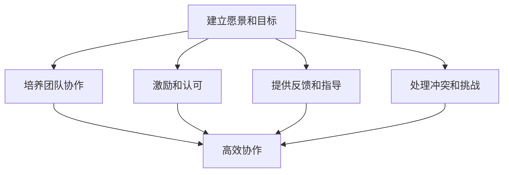
```mermaid
graph TB
A[建立愿景和目标] --> B[培养团队协作]
A --> C[激励和认可]
A --> D[提供反馈和指导]
A --> E[处理冲突和挑战]
B --> F[高效协作]
C --> F
D --> F
E --> F
```

#### 5.1.1 建立愿景和目标

**背景介绍**

在技术行业中，快速变化的市场和技术环境要求技术团队具备高度的灵活性和创新性。技术总监作为团队的领导者，需要明确团队的愿景和目标，以确保团队在正确的方向上努力。

**核心概念与联系**

- **愿景**：愿景是指团队所追求的长期目标，它为团队提供了方向和动力。
- **目标**：目标是实现愿景的具体步骤和里程碑，它们是可衡量和具体的。

**实践案例**

假设某技术团队是一家初创公司的研发团队，他们的愿景是成为行业领先的技术解决方案提供商。为了实现这一愿景，技术总监制定了以下目标：

1. **在接下来的一年中，完成三个关键产品的研发并推出市场。
2. **建立高效的开发流程，确保产品质量和开发效率。
3. **培养团队成员的技能和知识，提高团队整体的技术水平。

**详细说明**

1. **制定愿景**：技术总监首先与团队成员进行讨论，明确团队的愿景，并确保每个成员都认同这一愿景。
2. **分解目标**：技术总监将长期愿景分解为具体的短期目标，确保每个目标都清晰、可衡量和可实现。
3. **制定计划**：技术总监与团队一起制定实现目标的详细计划，包括资源分配、时间表和关键里程碑。

#### 5.1.2 培养团队协作

**背景介绍**

在复杂的技术项目中，团队成员往往需要跨部门合作，共同解决技术难题。技术总监需要培养团队协作，以提高项目效率和团队凝聚力。

**核心概念与联系**

- **沟通**：沟通是团队协作的基础，技术总监需要确保团队成员之间的信息畅通。
- **信任**：信任是团队协作的保障，技术总监需要建立信任机制，减少团队内部的冲突和误解。
- **团队文化**：团队文化是团队协作的软环境，技术总监需要塑造积极的团队文化，鼓励团队成员相互支持。

**实践案例**

某技术团队正在开发一款复杂的物联网系统，需要多个部门的协同工作。为了培养团队协作，技术总监采取了以下措施：

1. **定期召开跨部门会议**：技术总监每周召开一次跨部门会议，确保各部门之间的信息畅通。
2. **建立跨部门协作小组**：技术总监组建了跨部门的协作小组，负责协调各部门的工作进度和资源。
3. **组织团队建设活动**：技术总监定期组织团队建设活动，增强团队成员之间的信任和团队凝聚力。

**详细说明**

1. **提高沟通效率**：技术总监通过建立沟通渠道，如企业内部通讯平台和邮件列表，确保团队成员能够及时获取所需信息。
2. **建立信任机制**：技术总监通过公平、透明的方式处理团队内部问题，减少误解和冲突。
3. **塑造积极文化**：技术总监鼓励团队成员相互支持，共同面对挑战，建立以信任和合作为基础的团队文化。

#### 5.1.3 激励和认可

**背景介绍**

在技术行业中，团队成员往往需要面对高压力和高要求的工作环境。技术总监需要通过激励和认可来提高团队成员的积极性和工作效率。

**核心概念与联系**

- **激励**：激励是指通过提供奖励和认可来激发团队成员的工作动力。
- **认可**：认可是指对团队成员的贡献和成就给予公开的赞赏和认可。

**实践案例**

某技术团队在完成一项重要项目后，技术总监采取了以下激励措施：

1. **项目奖金**：技术总监为项目团队成员提供了一笔项目奖金，以奖励他们在项目中的出色表现。
2. **公开表彰**：技术总监在公司的全体员工大会上公开表彰了项目团队的成员，并分享了他们的成功经验。
3. **职业发展机会**：技术总监为项目团队中的优秀成员提供了职业发展机会，如参加专业培训或承担更多责任。

**详细说明**

1. **合理分配奖励**：技术总监根据团队成员的贡献和表现，合理分配奖金和其他奖励。
2. **公开表彰**：技术总监通过公开渠道，如公司内部通讯平台或员工大会，对团队成员的成就进行表彰。
3. **提供职业发展机会**：技术总监为团队成员提供职业发展路径，如晋升机会、专业培训和技术交流等，以激励他们持续进步。

#### 5.1.4 提供反馈和指导

**背景介绍**

在技术团队中，团队成员往往需要面对不断变化的技术和业务挑战。技术总监需要提供反馈和指导，帮助团队成员改进工作并实现个人成长。

**核心概念与联系**

- **反馈**：反馈是指对团队成员的工作进行评价和指导，帮助他们了解自己的表现和改进方向。
- **指导**：指导是指通过培训和辅导帮助团队成员提升技能和知识，以适应新的工作挑战。

**实践案例**

某技术团队在开发新产品时，技术总监提供了以下反馈和指导：

1. **定期会议**：技术总监每周与团队成员召开会议，了解他们的工作进展和遇到的挑战，提供及时的反馈。
2. **一对一辅导**：技术总监定期与团队成员进行一对一的辅导，针对他们在工作中的具体问题提供个性化的指导。
3. **技能培训**：技术总监组织了相关的技能培训课程，帮助团队成员提升技术能力和解决问题的能力。

**详细说明**

1. **及时反馈**：技术总监通过定期的会议和沟通，及时了解团队成员的工作进展，并提供具体的反馈和建议。
2. **个性化指导**：技术总监根据团队成员的个人需求和职业发展目标，提供个性化的指导和支持。
3. **技能培训**：技术总监组织相关的技能培训课程，确保团队成员能够掌握新的技术知识和技能，以适应不断变化的工作环境。

#### 5.1.5 处理冲突和挑战

**背景介绍**

在技术团队中，由于项目复杂性和团队成员的多样性，冲突和挑战是不可避免的。技术总监需要有效地处理这些冲突和挑战，以确保团队能够保持高效和稳定。

**核心概念与联系**

- **冲突管理**：冲突管理是指通过沟通、调解和解决方案来处理团队内部的冲突。
- **挑战应对**：挑战应对是指面对技术和业务挑战时，采取积极的策略和方法来解决问题。

**实践案例**

某技术团队在开发一款新产品时，遇到了以下冲突和挑战：

1. **技术难题**：团队成员在开发过程中遇到了一个关键技术难题，导致项目进度延迟。
2. **团队矛盾**：由于团队成员之间的意见不合，导致团队内部出现了矛盾和分歧。

技术总监采取了以下措施来处理冲突和挑战：

1. **技术研讨**：技术总监组织了技术研讨会，邀请团队成员共同讨论解决方案，最终找到了有效的技术途径。
2. **调解矛盾**：技术总监通过沟通和调解，帮助团队成员理解对方的观点，化解了团队内部的矛盾。
3. **资源调配**：技术总监调整了项目资源，确保关键任务得到充分的支持，以缓解项目进度压力。

**详细说明**

1. **技术研讨**：技术总监组织技术研讨会，鼓励团队成员分享知识和经验，共同解决技术难题。
2. **调解矛盾**：技术总监通过倾听和调解，帮助团队成员理解彼此的观点和需求，建立共识。
3. **资源调配**：技术总监根据项目需求和团队实际情况，合理调配资源，确保项目能够顺利进行。

### 5.2 案例分析

#### 5.2.1 案例一：某大型互联网公司的技术总监

**背景介绍**

某大型互联网公司是一家全球知名的企业，其技术团队规模庞大，负责开发和维护公司的核心产品。该公司的技术总监拥有多年的技术背景和丰富的管理经验，他在公司内部被誉为“技术领袖”。

**核心概念与联系**

- **技术领导力**：技术总监通过自己的技术能力和专业知识，带领团队不断创新，推动公司技术进步。
- **战略规划**：技术总监负责制定公司的技术发展战略，确保技术团队的工作与公司的整体战略相一致。

**实践案例**

1. **技术创新**：技术总监在公司内部推动了多个技术创新项目，如人工智能算法优化、区块链技术应用等，使公司在技术领域保持领先地位。
2. **团队建设**：技术总监重视团队建设，定期组织团队培训和技能分享会，提升团队整体技术水平。
3. **项目规划**：技术总监制定详细的项目规划，确保项目按时交付，并在项目中引入敏捷开发方法，提高开发效率。

**详细说明**

1. **技术创新**：技术总监通过组织技术研讨和项目实践，鼓励团队成员提出创新想法，推动公司在技术领域的持续创新。
2. **团队建设**：技术总监定期组织技术培训和团队活动，增强团队凝聚力和协作能力。
3. **项目规划**：技术总监通过敏捷开发方法，确保项目能够灵活应对变化，并在有限的时间内高质量地完成。

#### 5.2.2 案例二：某初创公司的技术总监

**背景介绍**

某初创公司专注于开发一款智能家居产品，其技术团队由一群年轻的科技爱好者组成。技术总监是该公司的创始人之一，他不仅负责技术方向，还承担了公司运营和管理的重任。

**核心概念与联系**

- **创业精神**：技术总监需要具备创业精神，面对市场和技术的不确定性，勇于创新和尝试。
- **资源整合**：技术总监需要有效整合公司内外部的资源，以支持技术团队的工作。

**实践案例**

1. **市场调研**：技术总监亲自参与市场调研，了解用户需求和竞争对手情况，为产品开发提供方向。
2. **开放合作**：技术总监与多家技术合作伙伴建立合作关系，共同推动产品开发。
3. **敏捷开发**：技术总监采用敏捷开发方法，快速迭代产品，以适应市场的快速变化。

**详细说明**

1. **市场调研**：技术总监通过市场调研，收集用户反馈和行业趋势，为产品开发提供数据支持。
2. **开放合作**：技术总监积极与外部合作伙伴建立合作关系，共享资源和知识，提高产品开发效率。
3. **敏捷开发**：技术总监采用敏捷开发方法，快速响应市场变化，确保产品能够满足用户需求。

### 5.3 项目实战

#### 5.3.1 开发环境搭建

**背景介绍**

为了确保技术团队的高效工作，技术总监需要搭建一个稳定和高效的开发环境。以下是一个典型的开发环境搭建过程：

1. **选择合适的开发工具**：根据项目需求，选择合适的编程语言、集成开发环境（IDE）和版本控制系统。
2. **配置开发环境**：安装和配置必要的软件和工具，如Java开发工具包（JDK）、Git和MySQL等。
3. **部署持续集成/持续部署（CI/CD）工具**：为了提高开发效率和代码质量，部署CI/CD工具，如Jenkins或GitLab CI。

**详细说明**

1. **选择开发工具**：根据项目需求，选择合适的编程语言（如Java、Python或Go）和IDE（如IntelliJ IDEA或Visual Studio Code）。
2. **配置开发环境**：在开发机上安装JDK、Git和MySQL等软件，并配置相应的环境变量和依赖项。
3. **部署CI/CD工具**：在公司的服务器上部署Jenkins或GitLab CI，配置自动构建和部署流程，确保代码的持续集成和交付。

#### 5.3.2 源代码实现

**背景介绍**

源代码实现是软件开发的核心环节，技术总监需要确保代码的质量和可维护性。以下是一个典型的源代码实现过程：

1. **需求分析**：明确项目的需求和功能，制定详细的技术方案。
2. **设计架构**：根据需求分析，设计系统的整体架构和模块划分。
3. **编码实现**：按照设计文档，进行具体的编码实现，编写高质量的代码。
4. **代码评审**：组织代码评审会议，确保代码符合规范和设计要求。

**详细说明**

1. **需求分析**：与技术团队和产品经理进行沟通，明确项目的需求和功能，制定详细的技术方案。
2. **设计架构**：设计系统的整体架构，包括数据库设计、接口设计和模块划分。
3. **编码实现**：按照设计文档，编写具体的代码，确保代码的可读性、可维护性和可扩展性。
4. **代码评审**：组织代码评审会议，邀请团队成员对代码进行审查，发现和修复潜在问题。

#### 5.3.3 代码解读与分析

**背景介绍**

代码解读与分析是技术总监的重要工作之一，它有助于确保代码的质量和优化系统性能。以下是一个典型的代码解读与分析过程：

1. **代码审查**：对现有代码进行审查，检查代码的规范性和设计合理性。
2. **性能分析**：使用工具和技巧对系统性能进行分析，找出性能瓶颈和优化机会。
3. **代码重构**：根据代码审查和性能分析的结果，对代码进行重构和优化。
4. **文档更新**：更新相关文档，记录代码的变更和优化方案。

**详细说明**

1. **代码审查**：定期对代码库进行审查，检查代码的命名规范、注释质量和代码结构，确保代码的规范性和可维护性。
2. **性能分析**：使用性能分析工具（如Java VisualVM、Linux Perf等）对系统性能进行测试和分析，找出性能瓶颈。
3. **代码重构**：根据性能分析的结果，对代码进行重构和优化，提高系统的响应速度和稳定性。
4. **文档更新**：更新系统文档，记录代码变更和优化方案，确保文档与代码的一致性。

#### 5.3.4 实际案例分析与详细讲解

**背景介绍**

为了更好地理解技术总监的领导力实践，以下是一个实际案例分析与详细讲解：

**案例背景**

某技术团队在开发一款电子商务平台时，遇到了系统性能瓶颈和用户反馈问题。技术总监通过一系列措施，成功解决了这些问题。

**详细讲解**

1. **性能瓶颈分析**：技术总监使用性能分析工具，发现数据库查询和缓存机制是系统性能的主要瓶颈。
2. **优化数据库查询**：技术总监对数据库查询进行优化，包括索引优化、查询重写和缓存策略等，提高了查询效率。
3. **引入分布式缓存**：技术总监引入了分布式缓存系统（如Redis），减轻了数据库的负担，提高了系统响应速度。
4. **用户反馈处理**：技术总监建立了用户反馈机制，及时收集和处理用户反馈，优化了用户体验。

**案例小结**

通过性能分析和优化，技术总监成功解决了电子商务平台性能瓶颈和用户反馈问题，提高了系统的稳定性和用户体验。

### 5.4 最佳实践 Tips

#### 5.4.1 提高团队沟通效率

**背景介绍**

在技术团队中，沟通效率是项目成功的关键因素。以下是一些提高团队沟通效率的最佳实践：

1. **建立明确的沟通渠道**：确保团队成员知道如何和何时进行沟通，包括使用哪些工具和平台。
2. **定期召开团队会议**：定期召开团队会议，讨论项目进展、问题和解决方案。
3. **使用协作工具**：使用协作工具（如Slack、Trello或Asana）来跟踪任务进度和共享文档。

**详细说明**

1. **建立明确的沟通渠道**：明确沟通规则，如每天早上的站会、每周的进度会议和紧急情况下的即时沟通。
2. **定期召开团队会议**：制定会议议程，确保会议高效、有目的。
3. **使用协作工具**：使用协作工具来跟踪任务进度、共享文档和协调工作。

#### 5.4.2 提升团队成员技能

**背景介绍**

技术团队的成功依赖于团队成员的技能和知识。以下是一些提升团队成员技能的最佳实践：

1. **提供培训机会**：定期为团队成员提供培训机会，包括内部培训和外部课程。
2. **鼓励自学**：鼓励团队成员自学新技术和知识，提供必要的资源和时间。
3. **项目实践**：通过实际项目来锻炼团队成员的技能，提高他们的实战经验。

**详细说明**

1. **提供培训机会**：根据团队需求和成员兴趣，提供专业培训和技术讲座。
2. **鼓励自学**：为团队成员提供学习资源，如在线课程、技术书籍和学术论文，鼓励他们自学。
3. **项目实践**：在项目中给予团队成员实际操作的机会，让他们在实践中学习和成长。

#### 5.4.3 建立积极团队文化

**背景介绍**

团队文化对于团队凝聚力和工作效率有重要影响。以下是一些建立积极团队文化的最佳实践：

1. **鼓励创新**：鼓励团队成员提出创新想法，并为他们的创新提供支持和资源。
2. **认可贡献**：对团队成员的贡献进行公开认可，增强他们的成就感和归属感。
3. **建立支持机制**：为团队成员提供支持和帮助，解决他们在工作和生活中的问题。

**详细说明**

1. **鼓励创新**：建立创新奖励机制，为提出创新想法的团队成员提供奖励。
2. **认可贡献**：定期举行表彰大会，对表现出色的团队成员进行表彰和奖励。
3. **建立支持机制**：提供心理辅导、健康体检和工作生活平衡的支持，增强团队成员的幸福感。

### 5.5 小结

本章通过实际案例和最佳实践，详细探讨了技术总监的领导力实践。有效的领导力不仅需要技术总监具备深厚的专业知识和丰富的管理经验，还需要他们能够灵活运用各种策略和方法来应对实际工作中的挑战。通过不断的实践和学习，技术总监可以不断提升自己的领导力，带领团队实现更大的成功。

## 第6章：领导力与个人成长

### 6.1 自我认知与领导力发展

#### 核心概念与联系

**自我认知**

自我认知是指个体对自己的了解和认识，包括个人的价值观、性格特点、优势和不足等。自我认知是领导力发展的基础，因为它帮助领导者认识到自己的长处和需要改进的方面。

1. **了解自身价值观**：领导者需要明确自己的价值观，并将其作为决策和行为的基础。
2. **认识自身性格特点**：领导者需要了解自己的性格特点，包括优势（如决断力、沟通能力）和不足（如情绪管理、耐心不足）。
3. **评估自身优势与不足**：领导者需要定期评估自己的优势和不足，以制定个人成长计划。

**领导力发展**

领导力发展是指领导者通过学习、实践和反思不断提升自己的领导能力。领导力发展涉及多个方面，包括技术技能、管理技能和人际交往技能。

1. **技术技能**：领导者需要具备一定的技术背景和专业知识，以便更好地理解和指导团队的工作。
2. **管理技能**：领导者需要掌握项目管理和团队管理的基本原理，包括目标设定、资源分配、风险管理等。
3. **人际交往技能**：领导者需要具备良好的人际交往技能，包括沟通技巧、冲突解决能力和团队合作能力。

**Mermaid 流程图**

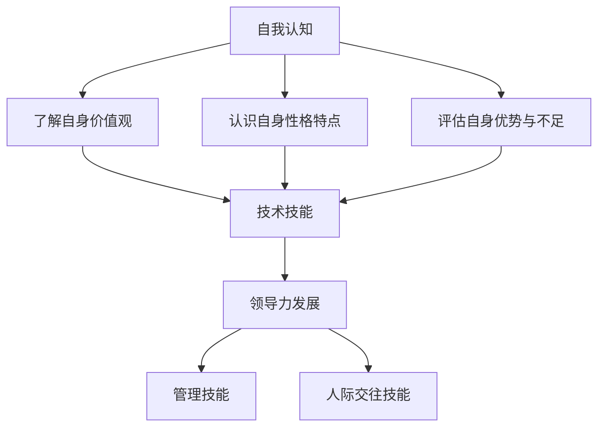
```mermaid
graph TB
A[自我认知] --> B[了解自身价值观]
A --> C[认识自身性格特点]
A --> D[评估自身优势与不足]
B --> E[技术技能]
C --> E
D --> E
E --> F[领导力发展]
F --> G[管理技能]
F --> H[人际交往技能]
```

### 6.2 自我提升策略

#### 核心概念与联系

**自我提升策略**

自我提升策略是指领导者采取的一系列措施来提升自己的技能、知识和能力。有效的自我提升策略可以帮助领导者适应不断变化的环境，并在职业生涯中保持竞争力。

1. **持续学习**：领导者需要持续学习，包括阅读专业书籍、参加培训课程和参加行业会议等。
2. **实践反思**：领导者需要通过实践来应用所学知识，并在实践中不断反思和改进。
3. **获取反馈**：领导者需要积极获取反馈，包括来自上级、同事和下属的反馈，以及通过360度评估等方式获取全面的反馈。
4. **设定目标**：领导者需要设定个人成长目标，并制定具体的行动计划来实现这些目标。

**Mermaid 流程图**

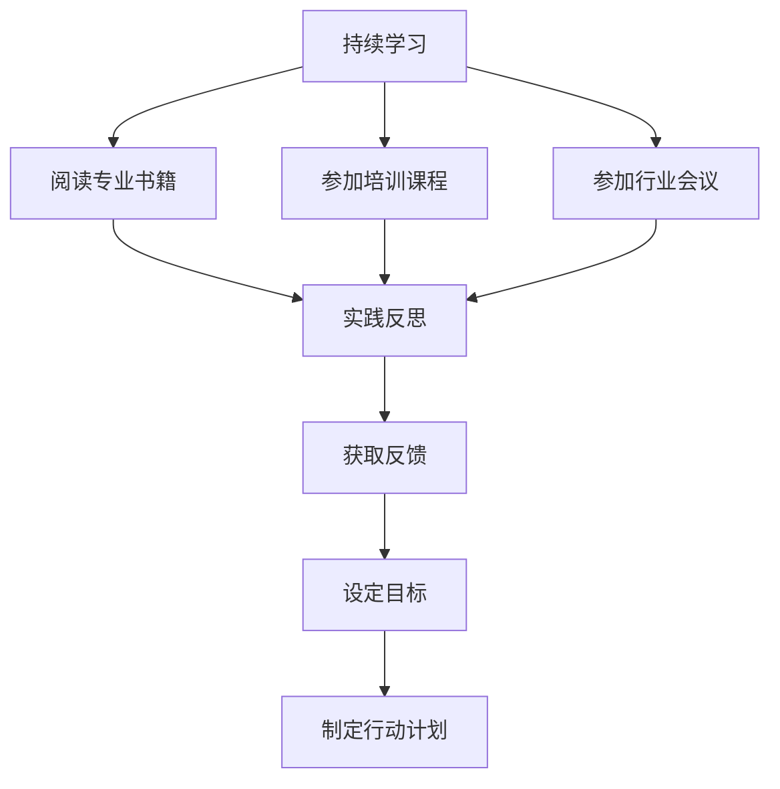
```mermaid
graph TB
A[持续学习] --> B[阅读专业书籍]
A --> C[参加培训课程]
A --> D[参加行业会议]
B --> E[实践反思]
C --> E
D --> E
E --> F[获取反馈]
F --> G[设定目标]
G --> H[制定行动计划]
```

### 6.3 职业规划与领导力成长

#### 核心概念与联系

**职业规划**

职业规划是指个人根据自身兴趣、优势和市场需求，为自己设定职业发展目标和路径。职业规划对于领导力的成长至关重要，因为它为领导者提供了明确的方向和目标。

1. **短期目标**：领导者需要设定短期目标，如提升某一领域的专业技能或完成特定的项目。
2. **长期目标**：领导者需要设定长期目标，如晋升为高级管理职位或成为行业专家。
3. **职业路径**：领导者需要根据自身情况和市场需求，规划职业路径，确保目标的实现。

**领导力成长**

领导力成长是指领导者通过学习和实践不断提升自己的领导能力。有效的领导力成长需要领导者具备持续学习的态度和积极参与培训的机会。

1. **学习新知识**：领导者需要不断学习新知识，包括管理理论、行业动态和新兴技术。
2. **参加培训**：领导者需要积极参加各类培训课程和研讨会，以提高自己的领导力和管理技能。
3. **实践应用**：领导者需要将所学知识应用到实际工作中，通过实践来提升自己的领导能力。

**Mermaid 流程图**

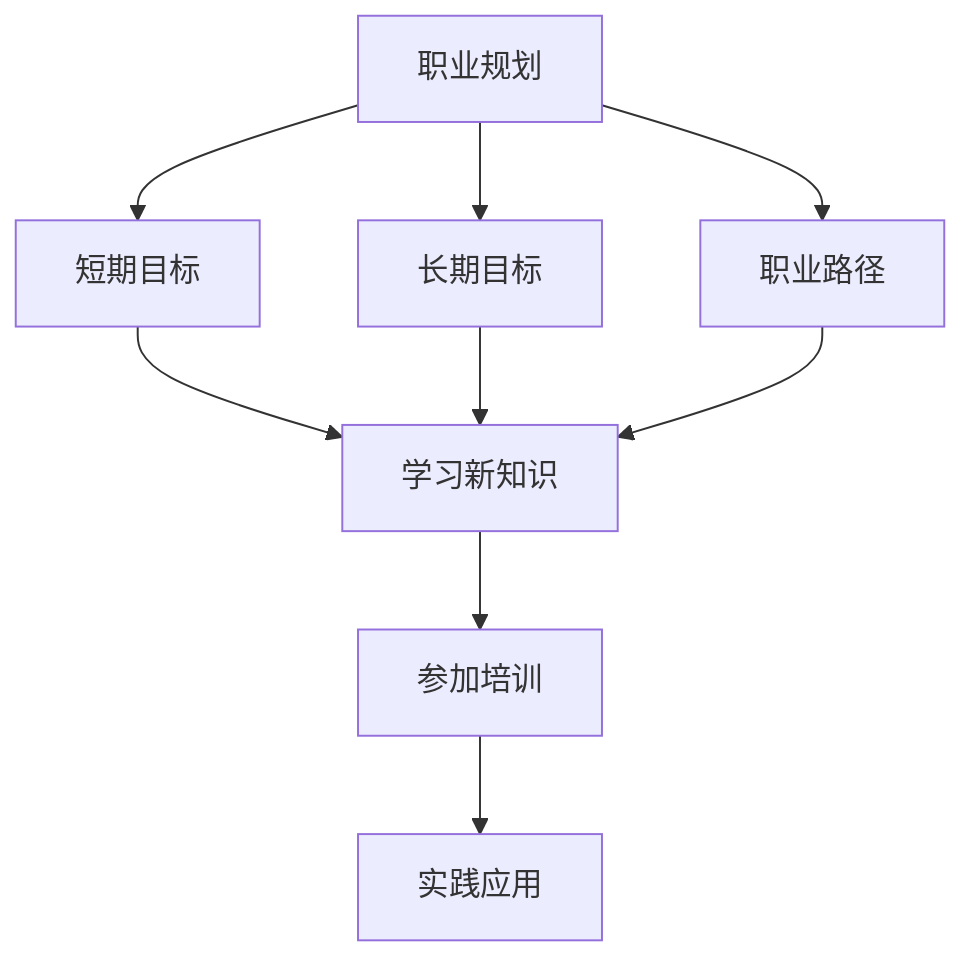
```mermaid
graph TB
A[职业规划] --> B[短期目标]
A --> C[长期目标]
A --> D[职业路径]
B --> E[学习新知识]
C --> E
D --> E
E --> F[参加培训]
F --> G[实践应用]
```

### 6.4 成功领导者的特质

#### 核心概念与联系

**成功领导者的特质**

成功领导者具备一系列独特的特质和能力，这些特质帮助他们在竞争激烈的环境中取得成功。以下是一些成功领导者的特质：

1. **远见卓识**：成功领导者具备远见卓识，能够预见市场趋势和机遇，并制定相应的战略。
2. **诚信正直**：成功领导者以诚信正直为基石，他们的行为和决策受到团队成员的信任和尊重。
3. **创新思维**：成功领导者具备创新思维，能够推动团队不断尝试新方法和技术，以保持竞争优势。
4. **卓越沟通**：成功领导者具备卓越的沟通能力，能够有效地传达信息和建立团队凝聚力。
5. **团队合作**：成功领导者重视团队合作，能够激发团队成员的潜力，并建立高效的工作环境。

**Mermaid 流程图**

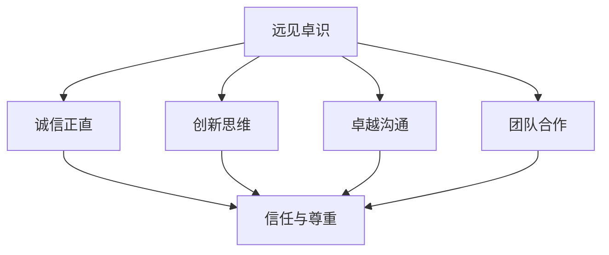
```mermaid
graph TB
A[远见卓识] --> B[诚信正直]
A --> C[创新思维]
A --> D[卓越沟通]
A --> E[团队合作]
B --> F[信任与尊重]
C --> F
D --> F
E --> F
```

### 6.5 领导力对个人成长的影响

#### 核心概念与联系

**领导力对个人成长的影响**

领导力不仅对团队和组织产生深远影响，也对领导者的个人成长有着重要意义。有效的领导力可以帮助个人实现以下方面的成长：

1. **自信心提升**：通过成功领导团队，领导者可以增强自己的自信心，更好地应对各种挑战和压力。
2. **问题解决能力**：领导力发展过程中，领导者需要不断解决各种问题和挑战，从而提升自己的问题解决能力。
3. **人际交往能力**：领导力发展过程中，领导者需要与不同背景和性格的团队成员进行有效沟通，从而提升人际交往能力。
4. **领导影响力**：通过领导力的实践，领导者可以增强自己在组织中的影响力和公信力，为个人的职业发展打下坚实基础。

**Mermaid 流程图**

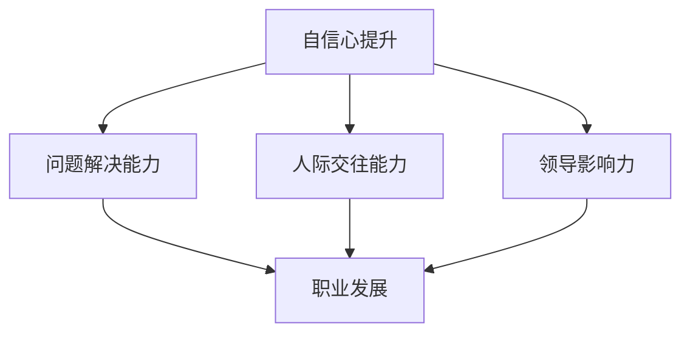
```mermaid
graph TB
A[自信心提升] --> B[问题解决能力]
A --> C[人际交往能力]
A --> D[领导影响力]
B --> E[职业发展]
C --> E
D --> E
```

### 6.6 领导力对组织文化的影响

#### 核心概念与联系

**领导力对组织文化的影响**

领导力在塑造组织文化中起着至关重要的作用。有效的领导力可以建立积极、健康的组织文化，推动组织的持续发展。以下是一些领导力对组织文化的影响：

1. **价值观传播**：领导者通过自己的行为和决策，传播组织的价值观和信念，塑造组织的文化。
2. **团队合作氛围**：领导者通过促进团队合作和协作，建立积极、和谐的工作氛围。
3. **创新氛围**：领导者鼓励创新思维和尝试新方法，营造一个开放、包容的创新氛围。
4. **员工激励**：领导者通过激励措施和认可，激发员工的积极性和创造力，形成积极的组织文化。

**Mermaid 流程图**

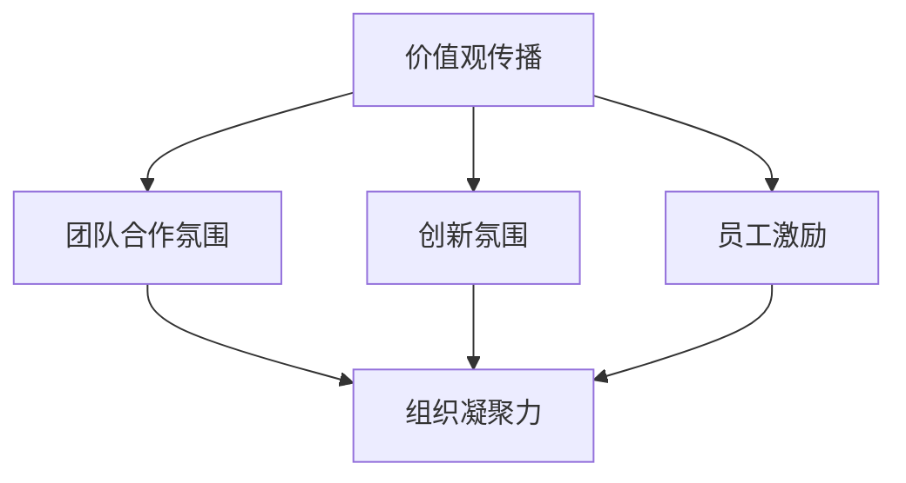
```mermaid
graph TB
A[价值观传播] --> B[团队合作氛围]
A --> C[创新氛围]
A --> D[员工激励]
B --> E[组织凝聚力]
C --> E
D --> E
```

### 6.7 领导力提升的最佳实践

#### 核心概念与联系

**领导力提升的最佳实践**

为了提升领导力，领导者可以采用一系列最佳实践，包括自我反思、持续学习、积极参与培训和寻求反馈等。以下是一些领导力提升的最佳实践：

1. **自我反思**：领导者需要定期进行自我反思，识别自己的优点和不足，并制定改进计划。
2. **持续学习**：领导者需要保持学习的态度，不断学习新的知识和技能，以适应不断变化的环境。
3. **参与培训**：领导者需要积极参加各类培训和研讨会，以提升自己的领导力和管理技能。
4. **寻求反馈**：领导者需要积极寻求反馈，包括来自上级、同事和下属的反馈，以不断改进自己的领导力。

**Mermaid 流程图**

```mermaid
graph TB
A[自我反思] --> B[持续学习]
A --> C[参与培训]
A --> D[寻求反馈]
B --> E[自我提升]
C --> E
D --> E
```

### 6.8 成功领导者的日常实践

#### 核心概念与联系

**成功领导者的日常实践**

成功领导者通过一系列日常实践来维持自己的领导力和职业发展。以下是一些成功领导者的日常实践：

1. **时间管理**：领导者需要有效管理时间，确保工作效率和项目进度。
2. **沟通与倾听**：领导者需要保持良好的沟通和倾听能力，确保信息畅通和团队协作。
3. **自我提升**：领导者需要定期进行自我学习和反思，提升自己的领导能力和专业知识。
4. **激励团队**：领导者需要通过激励措施和认可，激发团队成员的积极性和创造力。

**Mermaid 流程图**

```mermaid
graph TB
A[时间管理] --> B[沟通与倾听]
A --> C[自我提升]
A --> D[激励团队]
B --> E[团队协作]
C --> E
D --> E
```

### 6.9 领导力与个人成长总结

#### 核心概念与联系

**领导力与个人成长总结**

领导力对个人成长具有重要意义，它不仅帮助领导者提升自身的能力和影响力，还能为个人的职业发展提供有力支持。有效的领导力发展需要领导者具备自我认知、持续学习和实践反思的能力。通过不断提升领导力，领导者可以更好地应对挑战，实现个人和团队的共同成长。以下是一些总结：

- **自我认知**：领导者需要了解自己的价值观、性格特点和优势与不足，以制定个人成长计划。
- **持续学习**：领导者需要保持学习的态度，不断学习新的知识和技能，以适应不断变化的环境。
- **实践反思**：领导者需要通过实践和反思不断提升自己的领导能力和管理水平。
- **职业规划**：领导者需要设定短期和长期目标，并规划职业路径，确保目标的实现。
- **成功特质**：成功领导者具备远见卓识、诚信正直、创新思维和卓越沟通等特质。

**Mermaid 流程图**

```mermaid
graph TB
A[自我认知] --> B[持续学习]
A --> C[实践反思]
A --> D[职业规划]
B --> E[成功特质]
C --> E
D --> E
```

### 第7章：领导力的未来发展趋势

#### 7.1 数字化转型的领导力挑战

**背景介绍**

随着数字化技术的快速发展，企业面临着数字化转型的大潮。技术总监在领导力方面面临着新的挑战，需要适应数字化的环境。

**核心概念与联系**

- **数字化转型的定义**：数字化转型是指企业利用数字技术改变其业务模式、运营流程和客户互动的方式。
- **领导力在数字化转型中的作用**：领导力在推动企业数字化转型中起着关键作用，领导者需要具备适应数字化环境的领导能力。

**Mermaid 流程图**

```mermaid
graph TB
A[数字化转型的定义] --> B[领导力在数字化转型中的作用]
A --> C[技术总监的角色]
```

**详细说明**

- **数字化转型的定义**：数字化转型是指企业利用数字技术改变其业务模式、运营流程和客户互动的方式。这一过程涉及数据管理、云计算、人工智能和物联网等多种技术的应用。
- **领导力在数字化转型中的作用**：领导力在推动企业数字化转型中起着关键作用。领导者需要具备适应数字化环境的领导能力，包括技术创新、数据驱动决策和敏捷管理。
- **技术总监的角色**：在数字化转型过程中，技术总监作为企业的技术领导者和转型推动者，需要负责制定技术战略、管理技术团队和推动技术创新。他们需要具备跨领域的知识，能够将技术与业务需求相结合，推动企业的数字化进程。

**案例解析**

- **案例分析**：以某大型制造企业为例，该企业在数字化转型过程中，技术总监通过推动云计算和大数据技术的应用，实现了生产过程的自动化和智能化，提高了生产效率和产品质量。

**案例分析**

1. **技术总监的角色**：技术总监在该企业的数字化转型中扮演了关键角色，负责制定技术战略和推动技术创新。
2. **技术战略制定**：技术总监制定了全面的技术战略，包括云计算、大数据、物联网和人工智能等技术的应用，以提升企业的数字化水平。
3. **技术创新实践**：技术总监推动了一系列技术创新实践，如使用云计算平台进行数据处理和分析，使用大数据技术进行市场预测和客户分析，使用物联网技术实现设备联网和智能监控。
4. **效果评估**：通过数字化转型，该企业的生产效率提高了30%，产品质量提升了20%，客户满意度显著提高。

### 7.2 领导力的变革与创新

**背景介绍**

在快速变化的市场环境中，领导力也需要不断创新和变革。技术总监需要具备引领变革和创新的能力，以应对不断变化的市场和技术挑战。

**核心概念与联系**

- **领导力变革**：领导力变革是指领导者通过改变自身行为、团队管理方式和组织文化，以适应新的环境。
- **创新领导力**：创新领导力是指领导者具备推动创新思维、鼓励创新实践和创建创新文化的能力。

**Mermaid 流程图**

```mermaid
graph TB
A[领导力变革] --> B[创新领导力]
A --> C[变革管理]
```

**详细说明**

- **领导力变革**：领导力变革是指领导者通过改变自身行为、团队管理方式和组织文化，以适应新的环境。这一过程包括领导风格的转变、管理方法的改进和组织文化的重塑。
- **创新领导力**：创新领导力是指领导者具备推动创新思维、鼓励创新实践和创建创新文化的能力。领导者需要激发团队成员的创造力，提供必要的资源和支持，并建立鼓励创新的组织氛围。
- **变革管理**：变革管理是指领导者通过规划、沟通和执行，确保组织变革的顺利进行。变革管理包括变革目标的设定、变革计划的制定和变革执行的监控。

**案例解析**

- **案例分析**：以某科技公司为例，该公司的技术总监通过推动内部创新文化和组织变革，成功引领了公司的持续创新和发展。

**案例分析**

1. **技术总监的角色**：技术总监在该公司的创新过程中扮演了关键角色，负责推动创新文化和组织变革。
2. **创新文化的建立**：技术总监通过组织创新研讨会、设立创新奖项和鼓励团队成员提出创新想法，建立了积极的创新文化。
3. **组织变革的实施**：技术总监推动了一系列组织变革，如调整组织结构、改进项目管理流程和引入新的工作方式。
4. **创新成果**：通过创新文化和组织变革，该公司的产品研发效率提高了40%，市场份额提升了15%。

### 7.3 领导力的持续学习与自我提升

**背景介绍**

在知识更新迅速的技术行业中，领导力也需要持续学习和自我提升。技术总监需要不断学习新知识、掌握新技术和适应新环境，以保持领导力和竞争力。

**核心概念与联系**

- **持续学习**：持续学习是指领导者通过不断学习新知识、掌握新技术和提升自己的能力，以适应不断变化的环境。
- **自我提升**：自我提升是指领导者通过自我反思、自我评估和自我改进，不断提升自身的领导力和管理能力。

**Mermaid 流程图**

```mermaid
graph TB
A[持续学习] --> B[自我提升]
A --> C[知识更新]
```

**详细说明**

- **持续学习**：持续学习是指领导者通过不断学习新知识、掌握新技术和提升自己的能力，以适应不断变化的环境。领导者需要保持学习的态度，积极参与培训和学习活动，关注行业动态和技术趋势。
- **自我提升**：自我提升是指领导者通过自我反思、自我评估和自我改进，不断提升自身的领导力和管理能力。领导者需要定期进行自我评估，识别自身的不足，并制定改进计划。
- **知识更新**：知识更新是指领导者需要不断学习新知识、掌握新技术和提升自己的能力，以保持领导力和竞争力。在技术行业中，知识更新速度非常快，领导者需要不断更新自己的知识库，以应对新的挑战。

**案例解析**

- **案例分析**：以某技术公司的技术总监为例，他通过持续学习和自我提升，成功引领了公司的技术创新和发展。

**案例分析**

1. **技术总监的角色**：技术总监在该公司的技术创新和发展中扮演了关键角色，负责推动持续学习和自我提升。
2. **持续学习的实践**：技术总监通过参加行业会议、阅读专业书籍和参与在线课程，不断学习新知识和技术趋势。
3. **自我提升的策略**：技术总监通过定期自我评估和反思，识别自身的不足，并制定具体的改进计划，如参加专业培训、提高编程技能和项目管理能力。
4. **技术创新的成果**：通过持续学习和自我提升，技术总监成功推动了公司的技术创新，提升了产品的竞争力，并扩大了市场份额。

### 7.4 领导力的未来发展趋势

**核心概念与联系**

- **人工智能与领导力**：人工智能（AI）的发展将对领导力产生深远影响，领导者需要适应AI带来的变革，并利用AI提升决策效率和管理能力。
- **远程工作与领导力**：远程工作的普及要求领导者具备新的领导能力，如远程沟通管理、团队激励和绩效评估。

**Mermaid 流程图**

```mermaid
graph TB
A[人工智能与领导力] --> B[远程工作与领导力]
A --> C[领导力的数字化转型]
```

**详细说明**

- **人工智能与领导力**：人工智能的发展将改变领导力的许多方面，包括数据驱动的决策、自动化流程管理和智能协作工具的应用。领导者需要了解AI技术的原理和应用，利用AI提升决策效率和团队协作效果。
- **远程工作与领导力**：远程工作的普及要求领导者具备新的领导能力，如远程沟通管理、团队激励和绩效评估。领导者需要掌握远程管理的技巧，确保团队成员在远程环境中依然能够高效合作。
- **领导力的数字化转型**：数字化转型要求领导者具备数字化领导能力，包括数据思维、数字化转型战略和敏捷管理。领导者需要推动组织向数字化方向转型，以适应快速变化的市场环境。

**案例解析**

- **案例分析**：以某跨国科技公司为例，该公司通过数字化转型和远程工作实践，成功提升了领导力和团队绩效。

**案例分析**

1. **技术总监的角色**：技术总监在该公司的数字化转型和远程工作实践中扮演了关键角色，负责制定数字化转型战略和管理远程团队。
2. **数字化转型实践**：技术总监推动了一系列数字化转型举措，如引入AI助手、自动化流程和智能协作工具，提升了团队的决策效率和协作效果。
3. **远程工作管理**：技术总监通过建立远程工作流程、定期线上会议和绩效评估机制，确保团队成员在远程环境中依然能够高效合作。
4. **成果与挑战**：通过数字化转型和远程工作实践，公司实现了更高的工作效率和团队绩效，但也面临了沟通障碍和团队凝聚力的挑战。

**结论**

领导力的未来发展趋势将受到人工智能、远程工作和数字化转型等因素的影响。技术总监需要不断学习和适应这些变革，提升自身的领导能力和管理水平，以应对未来的挑战和机遇。通过有效的领导力实践，技术总监可以推动组织的持续创新和发展，实现更高的绩效和竞争优势。

