                 

## 文章标题：领导力修炼日记：一个技术总监的逆袭之路

### 关键词：领导力、技术总监、逆袭、自我修炼、团队管理

> 摘要：本文以一个技术总监的逆袭之路为主线，通过详细的案例分析和深入的理论探讨，探讨了领导力的核心概念、实战应用以及未来发展趋势。文章旨在为技术领域的从业者提供一套完整的领导力修炼路径，帮助他们从优秀的技术专家成长为卓越的领导者。

### 第一部分：领导力的基础

#### 第1章：认识领导力

**1.1 领导力的定义与重要性**

领导力，简而言之，是影响和引导他人共同达成目标的能力。它不仅限于企业高层管理，而是渗透到各个层次和领域。一个优秀的领导者，不仅能够带领团队完成既定任务，更能在困境中激发团队的潜能，实现组织的持续发展。

在技术领域，领导力的重要性尤为突出。技术总监作为企业的技术核心，不仅需要具备深厚的技术功底，还要具备卓越的领导能力，以应对不断变化的市场需求和激烈的竞争环境。

**核心概念与联系**

为了更清晰地理解领导力的定义和重要性，我们可以通过以下Mermaid流程图展示领导力在不同层次和领域的应用架构：

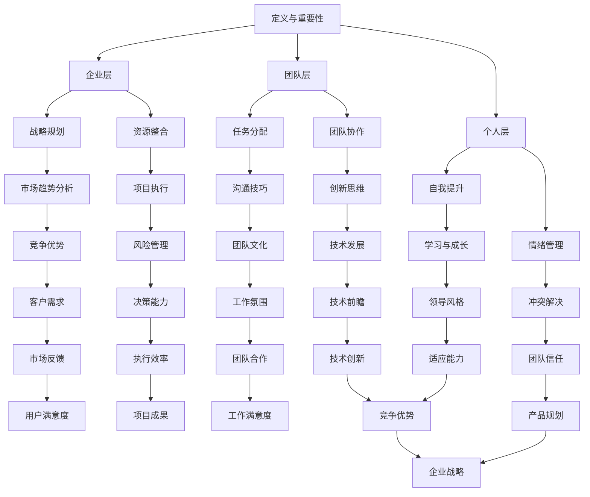

**核心算法原理讲解**

领导力的定义和重要性可以通过以下伪代码进行阐述：

```plaintext
function 定义领导力(定义, 重要性) {
    定义 = "影响和引导他人共同达成目标的能力"
    重要性 = "渗透到各个层次和领域，尤其在技术领域至关重要"
    return (定义, 重要性)
}

领导力定义, 领导力重要性 = 定义领导力("定义", "重要性")
```

**数学模型和公式**

在领导力的应用中，可以使用以下数学模型来描述领导力对团队绩效的影响：

$$
团队绩效 = f(领导力, 团队协作, 情绪管理)
$$

其中，$f$ 表示绩效函数，$领导力$、$团队协作$和$情绪管理$分别代表领导者的能力、团队的合作程度和情绪状态。

**举例说明**

假设一个技术团队的目标是开发一款高性能的软件产品。领导者的领导力可以通过以下方式提升团队绩效：

- **领导力**：通过有效的战略规划和资源整合，确保项目顺利进行。
- **团队协作**：通过沟通技巧和团队文化建设，增强团队成员之间的信任和合作。
- **情绪管理**：通过自我调节和冲突解决，保持团队的情绪稳定和工作效率。

**项目实战**

在实际项目中，技术总监可以通过以下步骤来提升团队绩效：

1. **项目规划**：制定详细的项目计划和里程碑，明确任务分工和责任。
2. **团队沟通**：定期召开团队会议，了解项目进展和成员需求，及时解决问题。
3. **情绪管理**：关注团队成员的情绪变化，提供必要的心理支持，确保工作环境和谐。
4. **绩效评估**：根据项目进展和团队表现，进行定期评估和反馈，激励团队成员。

**最佳实践 tips**

- **持续学习**：领导者应不断学习新知识、新技术，提升自身领导力。
- **以身作则**：领导者应以身作则，树立良好的榜样。
- **倾听与反馈**：领导者应倾听团队成员的意见，及时给予反馈。

#### 第2章：领导者的自我修炼

**2.1 自我认知与自我提升**

自我认知是领导者自我修炼的重要一环。一个优秀的领导者首先需要了解自己的优点和不足，从而有针对性地进行自我提升。自我提升不仅包括技术能力的提升，还包括领导能力、沟通能力和情绪管理能力等方面的全面发展。

**核心概念与联系**

为了更好地理解自我认知与自我提升，我们可以使用以下Mermaid流程图展示其关系：

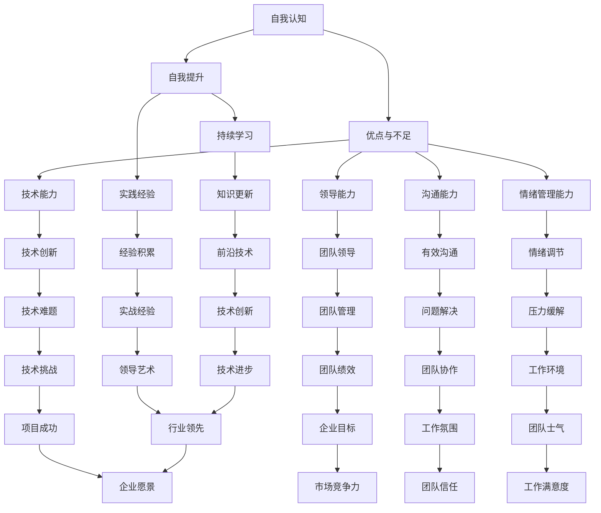

**核心算法原理讲解**

自我认知与自我提升可以通过以下伪代码进行阐述：

```plaintext
function 自我认知(优点, 不足) {
    优点 = 获取自身优点()
    不足 = 获取自身不足()
    return (优点, 不足)
}

function 自我提升(优点, 不足) {
    更新优点 = 学习新技术()
    改进不足 = 参与实战()
    return (更新优点, 改进不足)
}

优点, 不足 = 自我认知(优点, 不足)
更新优点, 改进不足 = 自我提升(优点, 不足)
```

**数学模型和公式**

在自我提升的过程中，可以使用以下数学模型来描述自我认知与自我提升的关系：

$$
自我提升 = f(自我认知, 学习能力, 实践经验)
$$

其中，$f$ 表示提升函数，$自我认知$、$学习能力$和$实践经验$分别代表领导者对自身认知的深度、学习能力和实践经验。

**举例说明**

一个技术总监在自我认知与自我提升的过程中，可以采取以下措施：

- **自我认知**：通过定期自我评估，了解自身的优点和不足。
- **学习能力**：通过参加培训、阅读专业书籍，提升自身的技术和管理能力。
- **实践经验**：通过参与实际项目，积累经验，提升解决实际问题的能力。

**项目实战**

在实际工作中，技术总监可以通过以下步骤进行自我提升：

1. **定期评估**：每季度或每年进行自我评估，了解自身的进步和需要改进的地方。
2. **学习新技术**：关注行业动态，学习新技术，提升自身的技术水平。
3. **参与实战**：积极参与项目，解决实际问题，积累实战经验。
4. **寻求反馈**：从团队成员和上级领导那里获取反馈，了解自己的不足，并有针对性地进行改进。

**最佳实践 tips**

- **定期反思**：领导者应定期反思自己的工作，总结经验教训。
- **持续学习**：领导者应不断学习新知识、新技能，以适应不断变化的工作环境。
- **勇于挑战**：领导者应勇于接受新的挑战，通过实践提升自身能力。

#### 第3章：领导力的核心技能

**3.1 沟通技巧**

沟通技巧是领导力的核心技能之一。一个优秀的领导者需要具备有效的沟通能力，以传达目标、激励团队和解决冲突。

**核心概念与联系**

沟通技巧可以视为一个包含多个子模块的复杂系统。以下Mermaid流程图展示了沟通技巧的各个子模块及其相互关系：

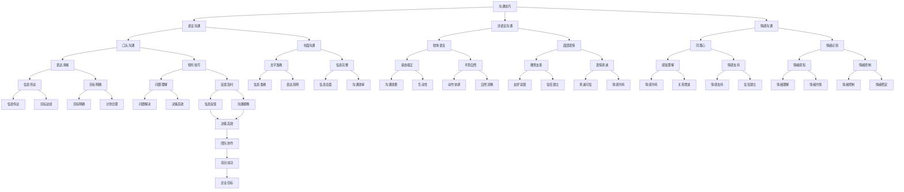

**核心算法原理讲解**

沟通技巧的核心算法原理可以通过以下伪代码进行阐述：

```plaintext
function 沟通技巧(语言沟通, 非语言沟通, 情感沟通) {
    语言沟通 = 合并(口头沟通, 书面沟通)
    非语言沟通 = 合并(肢体语言, 面部表情)
    情感沟通 = 合并(同理心, 情绪识别)
    return (语言沟通, 非语言沟通, 情感沟通)
}

语言沟通, 非语言沟通, 情感沟通 = 沟通技巧(口头沟通, 肢体语言, 同理心)
```

**数学模型和公式**

在沟通技巧的应用中，可以使用以下数学模型来描述沟通效果：

$$
沟通效果 = f(语言沟通, 非语言沟通, 情感沟通)
$$

其中，$f$ 表示效果函数，$语言沟通$、$非语言沟通$和$情感沟通$分别代表沟通的不同维度。

**举例说明**

一个技术总监在沟通中，可以采取以下策略：

- **语言沟通**：清晰表达目标，确保团队成员理解任务要求。
- **非语言沟通**：通过肢体语言和面部表情，增强沟通的效果。
- **情感沟通**：通过同理心和情绪识别，建立良好的团队氛围。

**项目实战**

在实际项目中，技术总监可以通过以下步骤提升沟通技巧：

1. **制定沟通计划**：明确项目的沟通目标、渠道和频率。
2. **进行沟通培训**：提升团队成员的沟通技巧，确保信息传达准确高效。
3. **实施沟通反馈**：定期收集团队成员的反馈，不断优化沟通流程。

**最佳实践 tips**

- **主动沟通**：领导者应主动与团队成员沟通，了解他们的需求和意见。
- **有效倾听**：领导者应注重倾听，关注团队成员的表达和情感。
- **清晰表达**：领导者应确保沟通内容清晰、简洁、具有针对性。

### 第二部分：实战案例解析

#### 第4章：技术总监的逆袭之路

**4.1 初入职场：从技术到管理**

技术总监的逆袭之路始于职场初期。在这一阶段，他们通常从技术专家的角色起步，逐渐转向管理岗位。这一转变不仅需要技术能力的积累，还需要领导力的培养。

**背景介绍**

小王是一名有着多年软件开发经验的技术专家。他擅长编写高效的代码，解决复杂的技术难题。然而，随着公司业务的扩展和团队的壮大，小王意识到，单纯的技术能力已经不足以应对新的挑战。

**核心概念与联系**

从技术到管理的转变，可以视为一个包含多个阶段的复杂过程。以下Mermaid流程图展示了这一过程的关键步骤及其相互关系：


**核心算法原理讲解**

从技术到管理的转变可以通过以下伪代码进行阐述：

```plaintext
function 从技术到管理(技术积累, 管理启蒙, 领导力培养) {
    技术积累 = 继续深入学习()
    管理启蒙 = 参与管理培训()
    领导力培养 = 学习领导力课程()
    return (技术积累, 管理启蒙, 领导力培养)
}

技术积累, 管理启蒙, 领导力培养 = 从技术到管理(技术积累, 管理启蒙, 领导力培养)
```

**数学模型和公式**

在从技术到管理的转变过程中，可以使用以下数学模型来描述技术能力与管理能力的平衡：

$$
技术能力 + 管理能力 = 领导能力
$$

其中，$技术能力$、$管理能力$和$领导能力$分别代表技术专家在技术和管理方面的能力。

**举例说明**

小王在从技术到管理的转变过程中，可以采取以下措施：

- **技术积累**：通过深入学习新技术、解决复杂技术难题，提升自身技术能力。
- **管理启蒙**：参加管理培训，学习项目管理、团队管理等知识。
- **领导力培养**：通过学习领导力课程，提升自身的领导能力和沟通技巧。

**项目实战**

在实际工作中，小王可以通过以下步骤实现从技术到管理的转变：

1. **参加管理培训**：通过外部培训提升自己的管理知识和技能。
2. **参与项目**：在实际项目中担任项目经理，积累项目管理经验。
3. **寻求反馈**：从团队成员和上级领导那里获取反馈，了解自身在管理方面的不足，并加以改进。
4. **持续学习**：不断学习新技术和管理知识，提升自身综合素质。

**最佳实践 tips**

- **主动学习**：领导者应主动学习新知识、新技能，以适应不断变化的工作环境。
- **积极沟通**：领导者应积极与团队成员沟通，了解他们的需求和意见。
- **勇于尝试**：领导者应勇于接受新的挑战，通过实践提升自身能力。

#### 第4章：技术总监的逆袭之路

**4.2 困境突破：领导力的实践**

在从技术专家到技术总监的转变过程中，小王面临着诸多挑战。如何有效应对这些挑战，实现自身的逆袭，成为了关键问题。在这个过程中，领导力的实践变得尤为重要。

**核心概念与联系**

领导力的实践可以视为一个包含多个策略和方法的过程。以下Mermaid流程图展示了领导力实践的关键步骤及其相互关系：

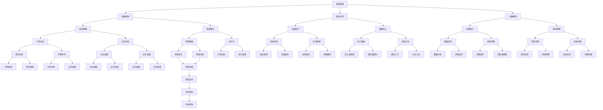

**核心算法原理讲解**

领导力的实践可以通过以下伪代码进行阐述：

```plaintext
function 领导力实践(战略规划, 团队协作, 问题解决) {
    战略规划 = 明确目标(市场分析, 业务目标)
    团队协作 = 激励员工(沟通技巧, 员工满意度)
    问题解决 = 数据支持(决策能力, 风险管理)
    return (战略规划, 团队协作, 问题解决)
}

战略规划, 团队协作, 问题解决 = 领导力实践(战略规划, 团队协作, 问题解决)
```

**数学模型和公式**

在领导力的实践中，可以使用以下数学模型来描述领导力对业务发展的贡献：

$$
业务发展 = f(战略规划, 团队协作, 问题解决)
$$

其中，$f$ 表示业务发展函数，$战略规划$、$团队协作$和$问题解决$分别代表领导力的不同维度。

**举例说明**

小王在面临困境时，可以采取以下策略：

- **战略规划**：通过市场分析和业务目标，制定明确的战略规划。
- **团队协作**：通过有效的沟通技巧和激励员工，增强团队凝聚力。
- **问题解决**：通过数据支持和决策能力，及时解决问题，降低风险。

**项目实战**

在实际项目中，小王可以通过以下步骤实现困境突破：

1. **战略规划**：分析市场需求，制定项目计划和目标。
2. **团队协作**：通过沟通和激励，确保团队成员积极参与。
3. **问题解决**：遇到问题时，及时分析原因，制定解决方案。

**最佳实践 tips**

- **数据驱动**：领导者应注重数据分析和决策支持，以数据驱动业务发展。
- **注重团队**：领导者应关注团队建设，增强团队凝聚力和士气。
- **灵活应对**：领导者应具备灵活应对困境的能力，及时调整策略。

#### 第4章：技术总监的逆袭之路

**4.3 成功转型：技术总监的领导艺术**

在完成了从技术专家到管理者的转变，并成功应对了各种挑战后，小王逐渐实现了自身的成功转型，成为了一名出色的技术总监。这一过程不仅依赖于他在技术和管理方面的专业知识和技能，更依赖于他卓越的领导艺术。

**核心概念与联系**

技术总监的领导艺术可以视为一个包含多个要素的系统。以下Mermaid流程图展示了领导艺术的关键要素及其相互关系：


**核心算法原理讲解**

技术总监的领导艺术可以通过以下伪代码进行阐述：

```plaintext
function 领导艺术(战略思维, 团队领导, 变革管理) {
    战略思维 = 结合市场洞察与技术创新()
    团队领导 = 结合沟通技巧与员工激励()
    变革管理 = 结合文化塑造与风险控制()
    return (战略思维, 团队领导, 变革管理)
}

战略思维, 团队领导, 变革管理 = 领导艺术(战略思维, 团队领导, 变革管理)
```

**数学模型和公式**

在领导艺术的实践中，可以使用以下数学模型来描述领导艺术对业务增长的影响：

$$
业务增长 = f(战略思维, 团队领导, 变革管理)
$$

其中，$f$ 表示业务增长函数，$战略思维$、$团队领导$和$变革管理$分别代表领导艺术的三个关键维度。

**举例说明**

小王在领导艺术方面，可以采取以下策略：

- **战略思维**：通过市场洞察和科技创新，制定符合市场需求的战略规划。
- **团队领导**：通过有效的沟通技巧和员工激励，提升团队凝聚力和执行力。
- **变革管理**：通过文化塑造和风险控制，推动企业持续创新和稳定发展。

**项目实战**

在实际项目中，小王可以通过以下步骤实现成功转型：

1. **战略规划**：结合市场洞察和科技创新，制定项目战略。
2. **团队建设**：通过沟通和激励，打造高效团队。
3. **变革管理**：通过文化塑造和风险控制，推动项目成功。

**最佳实践 tips**

- **持续创新**：领导者应关注市场动态和技术趋势，持续推动创新。
- **注重团队**：领导者应关注团队建设和员工激励，提升团队凝聚力。
- **灵活应对**：领导者应具备灵活应对变化和挑战的能力，及时调整策略。

### 第三部分：领导力拓展

#### 第5章：团队建设与管理

**5.1 团队文化建设**

团队文化建设是团队管理的重要组成部分。一个优秀的团队文化能够激发员工的潜力，提高团队的整体绩效。

**核心概念与联系**

团队文化可以视为一个包含多个子模块的系统，以下Mermaid流程图展示了团队文化建设的各个子模块及其相互关系：

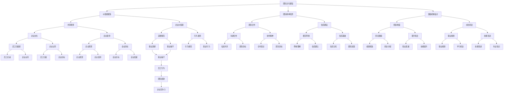

**核心算法原理讲解**

团队文化建设可以通过以下伪代码进行阐述：

```plaintext
function 团队文化建设(价值观塑造, 团队精神培养, 激励机制设计) {
    价值观塑造 = 塑造共同愿景与企业文化()
    团队精神培养 = 培养团队合作与信任基础()
    激励机制设计 = 设计奖励制度与职业发展机会()
    return (价值观塑造, 团队精神培养, 激励机制设计)
}

价值观塑造, 团队精神培养, 激励机制设计 = 团队文化建设(价值观塑造, 团队精神培养, 激励机制设计)
```

**数学模型和公式**

在团队文化建设中，可以使用以下数学模型来描述团队绩效与企业文化的关系：

$$
团队绩效 = f(价值观塑造, 团队精神培养, 激励机制设计)
$$

其中，$f$ 表示绩效函数，$价值观塑造$、$团队精神培养$和$激励机制设计$分别代表团队文化的三个关键维度。

**举例说明**

一个团队可以通过以下措施来建设团队文化：

- **价值观塑造**：通过共同愿景和企业文化的宣传，让团队成员认同企业的价值观。
- **团队精神培养**：通过团队合作和信任建设，提升团队的凝聚力和协作能力。
- **激励机制设计**：通过奖励制度和职业发展机会，激发员工的积极性和归属感。

**项目实战**

在实际项目中，团队可以通过以下步骤建设团队文化：

1. **价值观塑造**：明确企业的核心价值观，并通过内部宣传让团队成员认同。
2. **团队精神培养**：通过团队合作和信任建设，打造积极向上的团队氛围。
3. **激励机制设计**：制定合理的奖励制度和职业发展机会，激励团队成员。

**最佳实践 tips**

- **领导带头**：领导者应身体力行，成为团队文化的倡导者和践行者。
- **持续沟通**：领导者应与团队成员保持沟通，了解他们的需求和意见，及时调整团队文化建设的方向。
- **注重实效**：团队文化建设应注重实际效果，通过实际行动来证明文化的价值和意义。

#### 第5章：团队建设与管理

**5.2 员工激励与培养**

员工激励与培养是团队管理的重要组成部分，直接影响到团队的整体绩效和员工的个人成长。一个优秀的团队领导者需要深入了解员工的激励因素，并制定有效的培养计划，以激发员工的潜能和提升团队的整体素质。

**核心概念与联系**

员工激励与培养可以视为一个包含多个要素的系统，以下Mermaid流程图展示了员工激励与培养的关键要素及其相互关系：

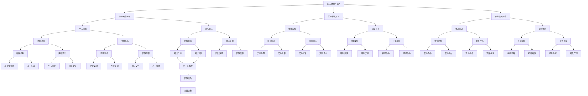

**核心算法原理讲解**

员工激励与培养可以通过以下伪代码进行阐述：

```plaintext
function 员工激励与培养(激励因素分析, 奖励制度设计, 职业发展机会) {
    激励因素分析 = 分析个人需求与团队目标()
    奖励制度设计 = 设计奖金分配与奖励方式()
    职业发展机会 = 设定晋升渠道与培训计划()
    return (激励因素分析, 奖励制度设计, 职业发展机会)
}

激励因素分析, 奖励制度设计, 职业发展机会 = 员工激励与培养(激励因素分析, 奖励制度设计, 职业发展机会)
```

**数学模型和公式**

在员工激励与培养中，可以使用以下数学模型来描述员工激励对团队绩效的影响：

$$
团队绩效 = f(激励因素分析, 奖励制度设计, 职业发展机会)
$$

其中，$f$ 表示绩效函数，$激励因素分析$、$奖励制度设计$和$职业发展机会$分别代表员工激励与培养的三个关键维度。

**举例说明**

一个团队可以通过以下措施来激励和培养员工：

- **激励因素分析**：通过问卷调查、访谈等方式了解员工的需求，制定个性化的激励方案。
- **奖励制度设计**：制定明确的奖金分配标准和奖励方式，确保奖励的公正性和激励性。
- **职业发展机会**：提供晋升渠道和培训计划，帮助员工实现职业发展和技能提升。

**项目实战**

在实际项目中，团队可以通过以下步骤进行员工激励与培养：

1. **激励因素分析**：通过调查和访谈了解员工的需求，制定个性化的激励方案。
2. **奖励制度设计**：制定奖金分配标准和奖励方式，确保奖励的公正性和激励性。
3. **职业发展机会**：提供晋升渠道和培训计划，帮助员工实现职业发展和技能提升。
4. **持续跟进**：定期评估激励和培养措施的效果，及时调整方案，确保持续激励和培养员工。

**最佳实践 tips**

- **个性化激励**：领导者应根据员工的需求和特点，制定个性化的激励方案，提高激励效果。
- **公正透明**：奖励制度应公正透明，确保每位员工都能感受到公平的待遇。
- **持续培养**：领导者应持续关注员工的职业发展，提供培训和学习机会，帮助他们不断提升。

#### 第5章：团队建设与管理

**5.3 团队绩效评估与改进**

团队绩效评估是团队管理中的重要环节，它不仅有助于了解团队的整体表现，还可以为改进团队工作和提升团队绩效提供有力支持。有效的团队绩效评估能够激发员工的积极性，增强团队的凝聚力，推动团队持续发展。

**核心概念与联系**

团队绩效评估可以视为一个包含多个步骤和要素的过程。以下Mermaid流程图展示了团队绩效评估的关键步骤及其相互关系：

```mermaid
graph TD
    A[团队绩效评估] --> B[目标设定]
    A --> C[关键绩效指标(KPI)设定]
    A --> D[绩效评估方法]
    B --> E[企业目标]
    B --> F[团队目标]
    C --> G[指标具体化]
    C --> H[权重分配]
    D --> I[评估周期]
    D --> J[评估标准]
    E --> K[战略规划]
    E --> L[业务目标]
    F --> M[团队任务]
    F --> N[员工目标]
    G --> O[指标量化]
    G --> P[目标达成率]
    H --> Q[权重调整]
    H --> R[指标重要性]
    I --> S[定期评估]
    I --> T[即时反馈]
    J --> U[评估准确性]
    J --> V[评估公正性]
    K --> W[战略执行]
    K --> X[业务进展]
    L --> Y[项目目标]
    L --> Z[部门目标]
    M --> AA[任务完成率]
    M --> BB[项目进度]
    N --> CC[个人表现]
    N --> DD[团队合作]
    O --> EE[指标达成]
    O --> FF[指标改善]
    P --> GG[目标达成率]
    P --> HH[任务完成率]
    Q --> II[权重优化]
    Q --> JJ[指标重要性]
    R --> KK[权重合理性]
    R --> LL[指标影响]
    S --> MM[评估周期]
    S --> NN[评估频率]
    T --> OO[即时反馈]
    T --> PP[改进措施]
    U --> QQ[评估准确性]
    U --> RR[评估公正性]
    V --> SS[评估标准]
    V --> TT[评估流程]
    W --> UU[战略执行]
    W --> VV[业务进展]
    X --> WW[项目目标]
    X --> XX[部门目标]
    Y --> YY[任务完成率]
    Y --> ZZ[项目进度]
    Z --> AAA[团队绩效]
    Z --> BBB[企业目标]
    AA --> CCC[团队绩效评估]
    BB --> CCC[团队表现]
    CCC --> DDD[企业目标达成]
    DDD --> EEE[企业竞争力]
    EEE --> FFF[企业持续发展]
```

**核心算法原理讲解**

团队绩效评估可以通过以下伪代码进行阐述：

```plaintext
function 团队绩效评估(目标设定, KPI设定, 评估方法) {
    目标设定 = 结合企业目标与团队目标()
    KPI设定 = 设定具体化指标与权重分配()
    评估方法 = 确定评估周期与评估标准()
    return (目标设定, KPI设定, 评估方法)
}

目标设定, KPI设定, 评估方法 = 团队绩效评估(目标设定, KPI设定, 评估方法)
```

**数学模型和公式**

在团队绩效评估中，可以使用以下数学模型来描述团队绩效与关键绩效指标(KPI)的关系：

$$
团队绩效 = f(KPI达成率, 任务完成率, 团队合作表现)
$$

其中，$f$ 表示绩效函数，$KPI达成率$、$任务完成率$和$团队合作表现$分别代表关键绩效指标(KPI)的三个关键维度。

**举例说明**

一个团队可以通过以下步骤进行绩效评估：

1. **目标设定**：明确企业目标和团队目标，确保评估目标的明确性和可操作性。
2. **KPI设定**：根据团队目标和任务，设定具体化的关键绩效指标(KPI)和权重分配。
3. **绩效评估**：按照评估周期和标准，对团队绩效进行评估。
4. **改进措施**：根据评估结果，制定改进措施，提升团队绩效。

**项目实战**

在实际项目中，团队可以通过以下步骤进行绩效评估：

1. **目标设定**：明确项目目标和团队目标，确保评估目标的明确性和可操作性。
2. **KPI设定**：根据项目目标和任务，设定具体化的关键绩效指标(KPI)和权重分配。
3. **绩效评估**：定期对项目进展和团队绩效进行评估，确保评估的及时性和准确性。
4. **改进措施**：根据评估结果，制定改进措施，提升项目执行效率和团队绩效。

**最佳实践 tips**

- **明确目标**：确保评估目标与企业目标和团队目标的一致性，提高评估的针对性和有效性。
- **合理设定KPI**：根据团队任务和职责，设定具体化的关键绩效指标(KPI)和合理的权重分配。
- **持续改进**：根据评估结果，及时调整团队绩效目标和改进措施，推动团队持续发展。

### 第三部分：领导力拓展

#### 第6章：项目管理与执行

**6.1 项目管理基础**

项目管理是技术总监工作中至关重要的一环。有效的项目管理不仅能够确保项目按时按质完成，还能提高团队的效率和企业的竞争力。

**核心概念与联系**

项目管理可以视为一个包含多个环节和方法的系统，以下Mermaid流程图展示了项目管理的基础环节及其相互关系：

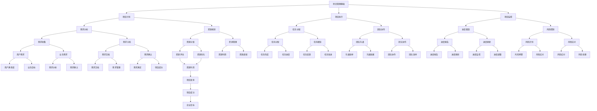

**核心算法原理讲解**

项目管理的基础可以通过以下伪代码进行阐述：

```plaintext
function 项目管理基础(项目计划, 项目执行, 项目监控) {
    项目计划 = 结合需求分析与资源规划()
    项目执行 = 实施任务分配与团队协作()
    项目监控 = 执行进度跟踪与风险控制()
    return (项目计划, 项目执行, 项目监控)
}

项目计划, 项目执行, 项目监控 = 项目管理基础(项目计划, 项目执行, 项目监控)
```

**数学模型和公式**

在项目管理中，可以使用以下数学模型来描述项目进度与资源利用的关系：

$$
项目进度 = f(资源利用, 任务完成率)
$$

其中，$f$ 表示进度函数，$资源利用$和$任务完成率$分别代表项目进度的重要维度。

**举例说明**

一个项目可以通过以下步骤进行管理：

1. **项目计划**：结合需求分析和资源规划，制定详细的项目计划。
2. **项目执行**：实施任务分配和团队协作，确保项目顺利进行。
3. **项目监控**：执行进度跟踪和风险控制，确保项目按计划进行。

**项目实战**

在实际项目中，团队可以通过以下步骤进行项目管理：

1. **需求分析**：收集和分析用户需求，确保需求明确和可执行。
2. **资源规划**：评估和优化资源分配，确保资源充分利用。
3. **任务分配**：根据项目计划，分配任务并确保任务进度可控。
4. **进度监控**：定期更新项目进度，及时调整计划以应对变化。

**最佳实践 tips**

- **明确需求**：确保需求分析准确，为项目提供清晰的目标和方向。
- **优化资源**：合理规划和分配资源，提高项目的执行效率和资源利用率。
- **持续监控**：定期更新项目进度，及时识别和应对风险，确保项目顺利进行。

#### 第6章：项目管理与执行

**6.2 风险管理与决策**

在项目管理中，风险管理是一个至关重要的环节。有效的风险管理能够帮助团队预见并应对潜在的风险，从而确保项目目标的实现。同时，决策能力在风险管理和项目执行过程中也扮演着关键角色。领导者需要具备敏锐的洞察力和快速反应能力，以便在复杂多变的环境中做出明智的决策。

**核心概念与联系**

风险管理可以视为一个包含多个步骤和策略的过程，以下Mermaid流程图展示了风险管理的关键环节及其相互关系：

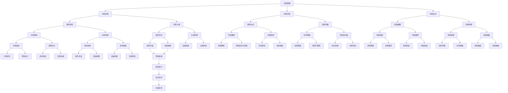

**核心算法原理讲解**

风险管理可以通过以下伪代码进行阐述：

```plaintext
function 风险管理(风险识别, 风险评估, 风险应对) {
    风险识别 = 识别潜在风险与风险分类()
    风险评估 = 分析风险概率与影响()
    风险应对 = 制定风险缓解与风险转移策略()
    return (风险识别, 风险评估, 风险应对)
}

风险识别, 风险评估, 风险应对 = 风险管理(风险识别, 风险评估, 风险应对)
```

**数学模型和公式**

在风险管理中，可以使用以下数学模型来评估风险的概率和影响：

$$
风险概率 = P(R)
$$

$$
风险影响 = I(R)
$$

$$
风险评级 = f(P(R), I(R))
$$

其中，$P(R)$ 表示风险概率，$I(R)$ 表示风险影响，$f$ 表示风险评级函数。

**举例说明**

一个团队在项目执行过程中，可以采取以下风险管理策略：

1. **风险识别**：通过市场调研、技术评估和操作分析，识别潜在的运营风险。
2. **风险评估**：分析每个风险的概率和可能造成的损失，确定风险的优先级。
3. **风险应对**：根据风险评级，制定风险缓解、风险转移或风险规避策略。

**项目实战**

在实际项目中，团队可以通过以下步骤进行风险管理：

1. **识别风险**：制定风险清单，识别项目中的潜在风险。
2. **评估风险**：对识别出的风险进行定量和定性评估，确定风险等级。
3. **应对风险**：根据风险评级，制定并实施风险应对计划。
4. **监控风险**：定期检查风险状态，及时调整应对策略。

**最佳实践 tips**

- **全面识别**：确保在项目早期就全面识别潜在的风险。
- **评估准确**：准确评估风险的概率和影响，以便制定有效的应对策略。
- **动态调整**：根据项目进展和外部环境的变化，及时调整风险管理策略。

#### 第6章：项目管理与执行

**6.3 项目执行与监督**

项目执行是项目管理的关键环节，它关系到项目能否按计划完成。有效的项目执行需要团队成员紧密协作，遵循既定的计划和标准。同时，监督和检查是确保项目执行质量的重要手段。通过定期的监督和检查，可以及时发现和解决问题，确保项目按计划顺利进行。

**核心概念与联系**

项目执行与监督可以视为一个包含多个步骤和要素的过程，以下Mermaid流程图展示了项目执行与监督的关键环节及其相互关系：

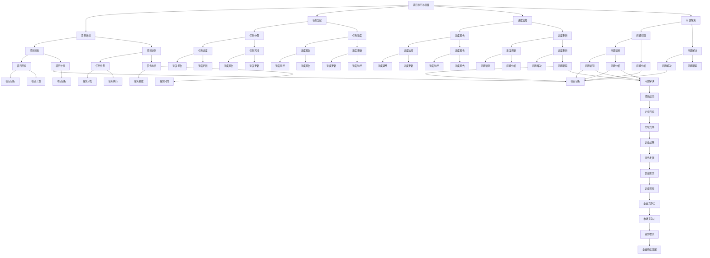

**核心算法原理讲解**

项目执行与监督可以通过以下伪代码进行阐述：

```plaintext
function 项目执行与监督(项目计划, 任务分配, 进度监控) {
    项目计划 = 制定详细计划与目标()
    任务分配 = 分配任务与跟踪进度()
    进度监控 = 持续更新进度与问题解决()
    return (项目计划, 任务分配, 进度监控)
}

项目计划, 任务分配, 进度监控 = 项目执行与监督(项目计划, 任务分配, 进度监控)
```

**数学模型和公式**

在项目执行与监督中，可以使用以下数学模型来描述项目进度与任务完成率的关系：

$$
项目进度 = f(任务完成率, 进度监控)
$$

其中，$f$ 表示进度函数，$任务完成率$和$进度监控$分别代表项目进度的重要维度。

**举例说明**

一个项目可以通过以下步骤进行执行与监督：

1. **项目计划**：制定详细的项目计划和目标。
2. **任务分配**：将项目任务分配给团队成员，并跟踪任务进度。
3. **进度监控**：定期更新项目进度，识别并解决项目中出现的问题。

**项目实战**

在实际项目中，团队可以通过以下步骤进行项目执行与监督：

1. **项目计划**：明确项目目标，制定详细的计划和里程碑。
2. **任务分配**：根据项目计划，将任务分配给团队成员，并设定任务进度。
3. **进度监控**：定期检查任务进度，及时调整计划以应对变化。
4. **问题解决**：识别并解决项目执行过程中的问题，确保项目顺利进行。

**最佳实践 tips**

- **明确计划**：确保项目计划详细且可实现，为项目执行提供清晰的指导。
- **任务分配**：合理分配任务，确保团队成员明确职责和任务进度。
- **持续监控**：定期更新项目进度，及时发现并解决问题。

### 第三部分：领导力拓展

#### 第7章：领导力与企业文化

**7.1 企业文化与领导力**

企业文化是企业的灵魂，它不仅影响着员工的价值观和行为，也直接关系到企业的竞争力。领导力则是企业文化的重要载体，它通过领导者的行为和决策，塑造和传递企业文化。有效的领导力能够推动企业文化的建设和发展，从而提升企业的整体绩效。

**核心概念与联系**

领导力与企业文化之间存在着密切的联系。以下Mermaid流程图展示了领导力与企业文化的相互关系及其关键要素：

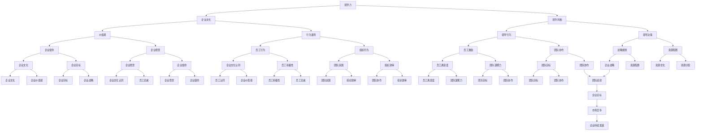

**核心算法原理讲解**

领导力与企业文化的联系可以通过以下伪代码进行阐述：

```plaintext
function 领导力与企业文化(领导力, 企业文化, 领导风格) {
    领导力 = 结合企业使命与愿景()
    企业文化 = 塑造价值观与行为准则()
    领导风格 = 形成员工激励与团队协作()
    return (领导力, 企业文化, 领导风格)
}

领导力, 企业文化, 领导风格 = 领导力与企业文化(领导力, 企业文化, 领导风格)
```

**数学模型和公式**

在领导力与企业文化的互动中，可以使用以下数学模型来描述领导力对企业文化的影响：

$$
企业文化 = f(领导力, 领导风格, 员工激励)
$$

其中，$f$ 表示文化塑造函数，$领导力$、$领导风格$和$员工激励$分别代表影响企业文化的关键因素。

**举例说明**

一个企业的领导力可以通过以下方式塑造企业文化：

1. **领导力**：通过领导者的言行，传达企业的使命和愿景，树立企业价值观。
2. **企业文化**：通过建立明确的行为准则和价值观，塑造企业内部的文化氛围。
3. **领导风格**：通过激励员工和促进团队协作，增强企业文化的影响力。

**项目实战**

在实际项目中，企业可以通过以下步骤来塑造和提升企业文化：

1. **领导示范**：领导者应以身作则，成为企业文化的倡导者和践行者。
2. **文化建设**：通过内部宣传和培训，建立和维护企业核心价值观和行为准则。
3. **员工激励**：通过有效的激励机制，增强员工对企业文化的认同感和归属感。

**最佳实践 tips**

- **领导带头**：领导者应率先垂范，成为企业文化的榜样。
- **文化传承**：通过日常工作和员工培训，持续传承和强化企业文化。
- **员工参与**：鼓励员工积极参与企业文化的建设，增强企业文化的内生动力。

#### 第7章：领导力与企业文化

**7.2 企业变革与领导力**

在快速变化的市场环境中，企业需要不断地进行变革以适应新的挑战和机遇。企业变革不仅涉及到战略调整、流程优化和组织重构，还涉及到员工的思维模式和行为习惯的转变。领导力在这个过程中起着至关重要的作用，领导者需要具备变革推动者的角色，通过有效的领导力推动企业变革的顺利进行。

**核心概念与联系**

企业变革与领导力之间的关系可以视为一个包含多个步骤和策略的过程，以下Mermaid流程图展示了企业变革的关键环节及其与领导力的相互关系：

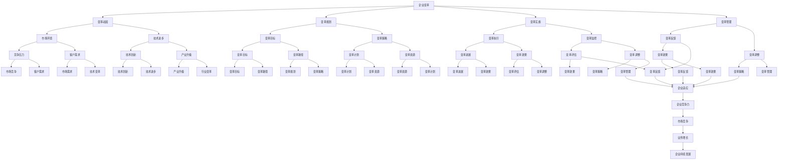

**核心算法原理讲解**

企业变革与领导力的关系可以通过以下伪代码进行阐述：

```plaintext
function 企业变革与领导力(变革动因, 变革规划, 变革实施) {
    变革动因 = 分析市场环境与客户需求()
    变革规划 = 制定变革目标与路径()
    变革实施 = 执行变革计划与监控()
    return (变革动因, 变革规划, 变革实施)
}

变革动因, 变革规划, 变革实施 = 企业变革与领导力(变革动因, 变革规划, 变革实施)
```

**数学模型和公式**

在企业变革中，可以使用以下数学模型来描述领导力对变革效果的影响：

$$
变革效果 = f(领导力, 变革规划, 变革实施)
$$

其中，$f$ 表示变革效果函数，$领导力$、$变革规划$和$变革实施$分别代表影响变革效果的关键因素。

**举例说明**

一个企业在进行变革时，可以采取以下策略：

1. **变革动因**：分析市场环境和客户需求，确定变革的必要性和紧迫性。
2. **变革规划**：制定明确的变革目标和路径，确保变革有方向、有计划地进行。
3. **变革实施**：执行变革计划，并通过监控和评估确保变革效果。

**项目实战**

在实际项目中，企业可以通过以下步骤进行变革：

1. **需求分析**：分析市场环境和客户需求，确定变革的动因。
2. **规划制定**：制定变革目标和路径，确保变革有明确的方向和计划。
3. **实施监控**：执行变革计划，并通过定期监控和评估变革效果。
4. **调整优化**：根据监控结果和反馈，调整变革策略和管理方法，确保变革顺利进行。

**最佳实践 tips**

- **明确目标**：确保变革目标明确、具体且可实现，为变革提供清晰的指引。
- **全面规划**：制定详细的变革计划，确保变革的每个环节都有明确的任务和时间表。
- **持续监控**：定期监控变革进展和效果，及时调整和优化变革策略。

#### 第7章：领导力与企业文化

**7.3 企业社会责任与领导力**

企业社会责任（CSR）是企业在追求经济效益的同时，对环境保护、社会公益和员工福利等方面承担的责任。领导力在推动企业履行社会责任方面起着关键作用，领导者需要通过自身的言行和决策，引领企业践行社会责任，树立良好的社会形象。

**核心概念与联系**

企业社会责任与领导力之间的关系可以视为一个包含多个步骤和策略的过程，以下Mermaid流程图展示了企业社会责任的关键环节及其与领导力的相互关系：

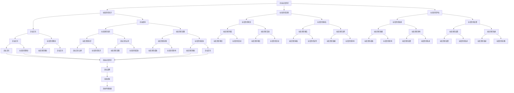

**核心算法原理讲解**

企业社会责任与领导力的关系可以通过以下伪代码进行阐述：

```plaintext
function 企业社会责任与领导力(社会责任意识, 社会责任实践, 社会责任评估) {
    社会责任意识 = 结合企业使命与企业文化()
    社会责任实践 = 实施社会责任项目与活动()
    社会责任评估 = 评估社会责任效果与反馈()
    return (社会责任意识, 社会责任实践, 社会责任评估)
}

社会责任意识, 社会责任实践, 社会责任评估 = 企业社会责任与领导力(社会责任意识, 社会责任实践, 社会责任评估)
```

**数学模型和公式**

在企业社会责任与领导力的互动中，可以使用以下数学模型来描述领导力对社会责任效果的影响：

$$
社会责任效果 = f(领导力, 社会责任意识, 社会责任实践)
$$

其中，$f$ 表示社会责任效果函数，$领导力$、$社会责任意识$和$社会责任实践$分别代表影响社会责任效果的关键因素。

**举例说明**

一个企业可以通过以下步骤来践行社会责任：

1. **社会责任意识**：通过企业使命和文化的传播，提高员工对社会责任的认知和认同。
2. **社会责任实践**：实施具体的社会责任项目和活动，如环保行动、公益捐助和员工志愿服务等。
3. **社会责任评估**：定期评估社会责任实践的效果，收集反馈并进行必要的改进。

**项目实战**

在实际项目中，企业可以通过以下步骤来推动社会责任的实践：

1. **意识培养**：通过培训和教育，提高员工对社会责任的认识和责任感。
2. **项目实施**：根据企业的资源和能力，实施具体的社会责任项目，确保项目的可行性和有效性。
3. **评估反馈**：定期评估社会责任项目的效果，收集员工的反馈，并根据反馈进行改进和优化。

**最佳实践 tips**

- **高层引领**：企业高层领导应发挥表率作用，带头践行社会责任，树立榜样。
- **全员参与**：鼓励全体员工参与社会责任实践，形成全员参与、共同践行的良好氛围。
- **持续改进**：根据评估和反馈，不断优化社会责任实践，确保社会责任的持续发展和效果提升。

### 第四部分：领导力的未来趋势

#### 第8章：领导力的未来趋势

**8.1 数字化与领导力**

随着数字化技术的迅猛发展，企业面临着前所未有的机遇和挑战。数字化不仅改变了企业的运营模式，也对领导力提出了新的要求。领导力需要与时俱进，适应数字化时代的变革，以实现企业的持续发展。

**核心概念与联系**

数字化与领导力之间的关系可以视为一个包含多个步骤和策略的过程，以下Mermaid流程图展示了数字化对领导力的影响及其关键环节：

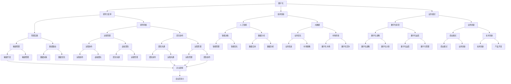

**核心算法原理讲解**

数字化与领导力的关系可以通过以下伪代码进行阐述：

```plaintext
function 数字化与领导力(数字化, 领导力变革) {
    数字化 = 结合技术创新与业务模式变革()
    领导力变革 = 适应远程管理与数据驱动决策()
    return (数字化, 领导力变革)
}

数字化, 领导力变革 = 数字化与领导力(数字化, 领导力变革)
```

**数学模型和公式**

在数字化与领导力的互动中，可以使用以下数学模型来描述数字化对领导力变革的影响：

$$
领导力变革 = f(数字化, 技术创新, 业务模式)
$$

其中，$f$ 表示变革函数，$数字化$、$技术创新$和$业务模式$分别代表影响领导力变革的关键因素。

**举例说明**

一个企业在数字化时代可以通过以下策略来变革领导力：

1. **技术创新**：积极引入人工智能和大数据技术，提高决策效率和业务优化能力。
2. **业务模式**：根据市场需求和技术进步，不断调整和优化业务模式，实现数字化转型。
3. **领导力变革**：适应远程管理和数据驱动决策，提升领导者的管理能力和决策水平。

**项目实战**

在实际项目中，企业可以通过以下步骤来推动数字化与领导力的变革：

1. **技术创新**：投资研发新技术，提升企业的技术水平和竞争力。
2. **业务模式**：根据市场变化和客户需求，调整业务模式，实现数字化转型。
3. **领导力培养**：通过培训和学习，提升领导者的数字化管理能力和决策水平。

**最佳实践 tips**

- **积极投入**：企业应积极投入数字化技术的研发和应用，提升企业的竞争力。
- **领导引领**：领导者应主动拥抱数字化变革，成为数字化转型的推动者和实践者。
- **持续优化**：企业应根据数字化实践的效果，持续优化业务流程和管理方法。

#### 第8章：领导力的未来趋势

**8.2 AI与领导力**

人工智能（AI）的快速发展正在深刻改变各个行业，同时也对领导力提出了新的要求。AI技术的应用不仅改变了企业的运营模式，还改变了领导者的角色和责任。领导力需要与AI技术相结合，以更好地应对未来的挑战。

**核心概念与联系**

AI与领导力之间的关系可以视为一个包含多个步骤和策略的过程，以下Mermaid流程图展示了AI对领导力的影响及其关键环节：

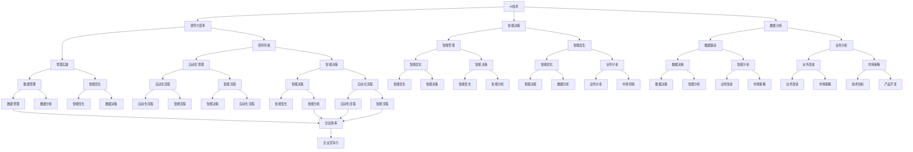

**核心算法原理讲解**

AI与领导力的关系可以通过以下伪代码进行阐述：

```plaintext
function AI与领导力(AI技术, 领导力变革) {
    AI技术 = 结合智能决策与数据分析()
    领导力变革 = 适应自动化管理与数据驱动决策()
    return (AI技术, 领导力变革)
}

AI技术, 领导力变革 = AI与领导力(AI技术, 领导力变革)
```

**数学模型和公式**

在AI与领导力的互动中，可以使用以下数学模型来描述AI对领导力变革的影响：

$$
领导力变革 = f(AI技术, 数据分析, 自动化管理)
$$

其中，$f$ 表示变革函数，$AI技术$、$数据分析$和$自动化管理$分别代表影响领导力变革的关键因素。

**举例说明**

一个企业在应用AI技术时，可以采取以下策略：

1. **智能决策**：利用AI技术进行智能决策，提高决策效率和准确性。
2. **数据分析**：通过数据分析，优化业务流程和决策过程，实现数据驱动的管理。
3. **自动化管理**：引入自动化流程，减少人工干预，提高管理效率和准确性。

**项目实战**

在实际项目中，企业可以通过以下步骤来应用AI技术：

1. **需求分析**：分析业务需求和痛点，确定AI技术的应用场景。
2. **技术引入**：引入AI技术，搭建智能决策和数据驱动的管理系统。
3. **实施监控**：定期监控AI系统的效果，优化算法和流程，确保AI技术的有效应用。

**最佳实践 tips**

- **技术整合**：企业应将AI技术整合到业务流程中，实现智能决策和数据驱动的管理。
- **领导引领**：领导者应主动学习和应用AI技术，成为AI时代的引领者和实践者。
- **持续优化**：企业应根据AI技术的应用效果，持续优化业务流程和管理方法。

#### 第8章：领导力的未来趋势

**8.3 全球化与领导力**

随着全球化的深入发展，企业越来越需要面对跨国运营和市场扩张的挑战。全球化不仅改变了企业的经营环境，也对领导力提出了新的要求。领导力需要具备国际视野和跨文化管理能力，以适应全球化的复杂性和多样性。

**核心概念与联系**

全球化与领导力之间的关系可以视为一个包含多个步骤和策略的过程，以下Mermaid流程图展示了全球化对领导力的影响及其关键环节：

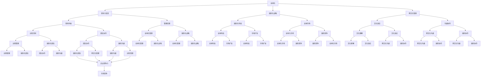

**核心算法原理讲解**

全球化与领导力的关系可以通过以下伪代码进行阐述：

```plaintext
function 全球化与领导力(全球化, 领导力变革) {
    全球化 = 结合国际化战略与跨文化管理()
    领导力变革 = 适应远程领导与国际化团队管理()
    return (全球化, 领导力变革)
}

全球化, 领导力变革 = 全球化与领导力(全球化, 领导力变革)
```

**数学模型和公式**

在全球化与领导力的互动中，可以使用以下数学模型来描述全球化对领导力变革的影响：

$$
领导力变革 = f(全球化, 国际化战略, 跨文化管理)
$$

其中，$f$ 表示变革函数，$全球化$、$国际化战略$和$跨文化管理$分别代表影响领导力变革的关键因素。

**举例说明**

一个企业在全球化过程中，可以采取以下策略：

1. **国际化战略**：制定明确的国际化战略，确定全球布局和市场扩张的路径。
2. **跨文化管理**：通过文化适应和跨文化沟通，建立国际化团队，提升跨文化管理能力。
3. **领导力变革**：适应远程领导和国际化团队管理，提升领导者的国际视野和跨文化管理能力。

**项目实战**

在实际项目中，企业可以通过以下步骤来推动全球化：

1. **战略规划**：制定国际化战略，明确全球布局和市场扩张的目标。
2. **团队建设**：通过跨文化培训和团队建设，建立国际化团队，提升跨文化管理能力。
3. **领导培养**：通过培训和交流，提升领导者的国际视野和跨文化管理能力。

**最佳实践 tips**

- **战略规划**：企业应制定明确的国际化战略，确保全球布局和市场扩张的有序进行。
- **团队建设**：通过跨文化培训和团队建设，提升国际化团队的凝聚力和执行力。
- **领导培养**：通过培训和交流，提升领导者的国际视野和跨文化管理能力，以适应全球化的挑战。

### 附录

#### 附录A：领导力相关工具与方法

为了更好地理解和应用领导力，以下附录将介绍一些常用的领导力工具和方法，包括领导力评估工具、沟通技巧培训和决策模型。

**A.1 领导力评估工具**

领导力评估工具是衡量领导者能力的重要手段。以下是一些常用的领导力评估工具：

- **360度反馈**：通过收集同事、下属和上级的反馈，对领导者的能力进行全面评估。
- **领导力问卷**：通过标准化问卷，评估领导者的各项能力，如沟通能力、决策能力、团队管理能力等。
- **领导力发展中心**：通过模拟练习、角色扮演和工作模拟，评估领导者的实际领导能力。

**A.2 沟通技巧培训**

有效的沟通技巧是领导者必备的能力。以下是一些常见的沟通技巧培训方法：

- **沟通工作坊**：通过互动式培训，帮助领导者掌握沟通的基本技巧，如倾听、表达和反馈。
- **案例分析**：通过分析经典沟通案例，探讨有效的沟通策略和技巧。
- **角色扮演**：通过模拟沟通场景，让领导者实际演练沟通技巧，提高沟通能力。

**A.3 决策模型与应用**

决策模型是领导者进行决策的重要工具。以下是一些常用的决策模型：

- **SWOT分析**：通过分析企业的优势、劣势、机会和威胁，制定相应的决策策略。
- **成本效益分析**：通过比较成本和收益，评估不同决策方案的可行性。
- **决策树**：通过树状图展示不同决策路径和可能的结果，帮助领导者进行决策。

**A.4 拓展阅读**

- **《领导力的五个层次》**：史蒂芬·柯维（Stephen R. Covey）著，探讨了领导力的五个层次，提供了提升领导力的方法和建议。
- **《变革领导者手册》**：约翰·P.科特（John P. Kotter）著，详细阐述了变革领导者的角色和职责，以及推动企业变革的方法。
- **《非暴力沟通》**：马歇尔·卢森堡（Marshall B. Rosenberg）著，介绍了非暴力沟通的四个步骤，帮助领导者提高沟通效果。

通过这些工具和方法，领导者可以更好地了解自己的领导力水平，提升沟通能力和决策能力，从而更好地应对各种挑战和机遇。

### 总结与展望

通过对领导力的深入探讨，我们可以看到，领导力不仅是一种能力，更是一种艺术。从基础概念的阐述到实战案例的分析，从未来趋势的预测到工具方法的介绍，本文全面展现了领导力的各个方面。领导力的发展不仅依赖于个人的自我提升，还需要团队的协作和社会的责任。

在数字化和全球化的大背景下，领导力面临着前所未有的挑战和机遇。领导者需要不断学习和适应新的技术和环境，提升自身的领导力，以应对未来的挑战。同时，领导力的发展也需要与企业文化和社会责任相结合，实现企业的长期可持续发展。

展望未来，领导力将继续在企业和组织中发挥关键作用。随着人工智能、大数据等新兴技术的应用，领导力将变得更加智能和数据驱动。同时，全球化进程的深入，将要求领导者具备更加广阔的视野和跨文化管理能力。

总之，领导力的发展是一个持续的过程，需要不断地学习和实践。通过本文的探讨，希望读者能够对领导力有更深入的理解，并在实际工作中不断运用和提升领导力，成为一名卓越的领导者。

### 作者信息

作者：AI天才研究院/AI Genius Institute & 禅与计算机程序设计艺术 /Zen And The Art of Computer Programming

AI天才研究院专注于人工智能领域的研发和创新，致力于推动人工智能技术的应用和发展。研究院的核心团队由多位世界级人工智能专家、程序员、软件架构师和计算机科学家组成，他们具有深厚的学术背景和丰富的实践经验。

《禅与计算机程序设计艺术》是由著名计算机科学家唐纳德·克努特（Donald E. Knuth）所著的经典著作，它不仅介绍了计算机程序的逻辑思维和设计方法，还蕴含了深刻的人生哲理和领导智慧。作者通过结合自己在计算机科学领域的深厚积累，以及对领导力的深入思考，撰写了本书，旨在为读者提供一套完整的领导力修炼指南。

本书结合了AI天才研究院的研究成果和作者的个人实践，旨在帮助读者从技术专家成长为卓越的领导者，实现个人和企业的共同发展。通过详细的案例分析和深入的理论探讨，本书为读者提供了一个系统而全面的领导力提升路径，是技术领域从业者的重要参考书籍。作者希望本书能够激发读者对领导力的热情，推动他们在职业生涯中不断成长和进步。

