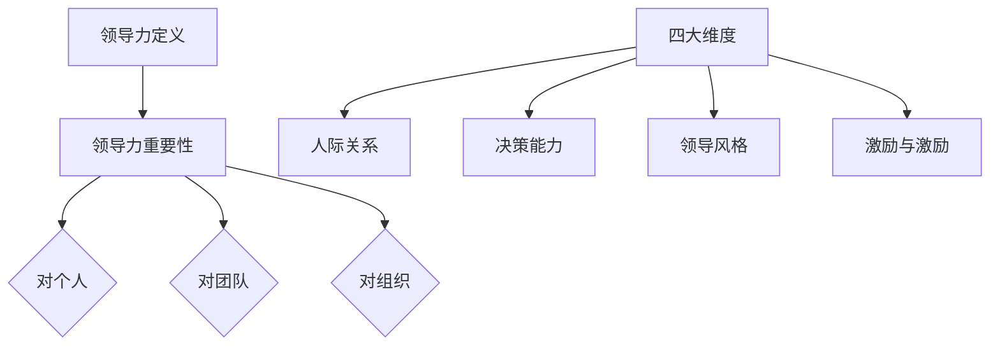

                 


### 文章标题
《领导力修炼日记：一个技术经理的成长历程》

### 文章关键词
技术经理、领导力、成长历程、团队管理、个人发展

### 文章摘要
本文旨在探讨技术经理在职业生涯中如何通过不断修炼领导力，实现个人成长和团队的成功。文章首先介绍领导力的基本概念和其在技术管理中的重要性，接着分析技术经理面临的挑战及其解决方案。通过深入剖析个人成长和职业发展的策略，以及分享成功的技术经理案例，本文为技术经理提供了实用的指导和建议。

## 第一部分：领导力基础

### 第1章：领导力的本质与价值

#### 1.1 领导力的定义
领导力是一种影响和激励他人实现共同目标的能力。它不仅仅是一种职位或者头衔，更是一种态度和行为。领导力涉及到沟通、决策、激励、团队建设和创新等方面。在技术领域，领导力对于团队的高效运作和创新至关重要。

#### 1.2 领导力的重要性
对于技术经理来说，领导力的重要性体现在以下几个方面：

1. **团队协作**：领导力能够促进团队成员之间的协作，提高团队的凝聚力。
2. **创新动力**：领导者的激励和引导能够激发团队成员的创新思维，推动技术进步。
3. **目标达成**：有效的领导力能够帮助团队明确目标，并制定实现目标的策略。
4. **个人成长**：通过领导力的修炼，技术经理能够不断提升自己的管理能力和职业素养。

#### 1.3 领导力的四大维度

**人际关系**：建立和维护良好的关系，包括团队内部和与外部合作伙伴的关系。

**决策能力**：做出明智的决策，考虑各种可能的影响，并能够在压力下迅速做出决策。

**领导风格**：根据不同的情境和团队成员的特点，采用合适的领导风格。

**激励与激励**：通过激励机制，激发团队成员的积极性和创造力。

## 第二部分：技术经理的挑战与解决方案

### 第2章：技术经理的日常职责

技术经理的日常职责包括但不限于以下几个方面：

1. **技术决策与管理**：根据项目需求，选择合适的技术方案，并确保团队按照既定计划进行开发。
2. **团队协作与沟通**：促进团队成员之间的有效沟通，解决协作中的问题，确保项目的顺利进行。
3. **技术难题的解决**：面对技术难题，能够带领团队找到有效的解决方案。

### 第3章：应对技术难题的策略

技术经理在项目中常常会遇到各种技术难题。以下是一些应对策略：

1. **问题识别**：快速识别问题的本质，避免被表面现象所迷惑。
2. **团队合作**：组建跨职能团队，共同分析问题，寻找解决方案。
3. **技术调研**：对问题进行深入研究，寻找可能的解决方案。
4. **实施与验证**：实施解决方案，并进行验证，确保问题的彻底解决。

### 第4章：管理挑战与解决策略

技术经理在管理过程中可能会遇到以下挑战：

1. **项目管理策略**：如何制定有效的项目管理计划，确保项目按期完成。
2. **团队管理技巧**：如何激励和培养团队成员，提高团队的整体绩效。
3. **冲突管理**：如何处理团队内部的冲突，确保团队的和谐与高效。

## 第三部分：个人成长与职业发展

### 第5章：持续学习与自我提升

持续学习和自我提升是技术经理不可或缺的一部分。以下是一些策略：

1. **学习的重要性**：认识到学习对于个人成长和职业发展的重要性。
2. **学习的方法与技巧**：介绍有效的学习方法和技巧，如阅读技术书籍、参加培训课程、实践项目等。
3. **职业发展的规划**：制定明确的职业发展目标，并制定相应的行动计划。

### 第6章：领导力实践与分享

领导力不是一门学问，而是一种实践。以下是一些领导力实践和分享：

1. **领导力实践的重要性**：认识到领导力实践对于个人和团队的重要性。
2. **实践案例分享**：分享成功的领导力实践案例，供读者借鉴。
3. **领导力修炼心得**：总结领导力修炼过程中的心得体会，为读者提供启示。

## 第四部分：成功的技术经理案例

### 第7章：技术经理的成长路径

本章节将介绍一些成功的技术经理的成长路径，分析他们的成功经验，为读者提供启示。

1. **成功的案例介绍**：介绍几位成功的技术经理的背景和成长过程。
2. **成功经验总结**：总结这些技术经理的成功经验，包括领导力、技术能力、职业规划等方面。
3. **成功之路的启示**：从这些成功经验中提炼出可借鉴的启示，为其他技术经理提供指导。

### 第8章：技术经理的未来展望

技术经理的未来发展趋势和角色转变：

1. **技术发展的趋势**：分析当前技术发展的趋势，如人工智能、大数据、云计算等。
2. **技术经理的角色转变**：探讨技术经理在未来可能面临的角色转变，如更注重业务理解和战略规划。
3. **技术经理的未来展望**：对技术经理未来的职业发展前景进行展望。

## 附录

### 附录A：领导力工具与方法

本附录将介绍一些常用的领导力工具和方法，包括：

1. **常用的领导力工具**：如领导力评估工具、团队协作工具等。
2. **领导力方法的应用**：介绍如何在日常工作中应用这些领导力工具和方法。

### 附录B：推荐阅读

本附录推荐一些相关的书籍和资源，供读者进一步学习和探索。

1. **相关书籍推荐**：推荐一些关于领导力、技术管理、个人成长等方面的优秀书籍。
2. **领导力资源推荐**：推荐一些领导力相关的网站、博客和论坛。

## 结语

本文通过详细分析领导力的本质、技术经理的挑战与解决方案、个人成长与职业发展等方面，为技术经理提供了全面的指导。希望读者能够通过本文，找到适合自己的领导力修炼之路，实现个人和团队的共同成长。

### 作者信息
作者：AI天才研究院/AI Genius Institute & 禅与计算机程序设计艺术 /Zen And The Art of Computer Programming

```

下面是文章的Mermaid流程图示例：



以下是伪代码和latex公式的示例：

伪代码示例：
```python
# 伪代码：解决技术难题的步骤

# 输入：技术难题描述
# 输出：解决方案

def solve_technical_problem(problem_description):
    # 步骤1：识别问题
    identified_problem = identify_problem(problem_description)

    # 步骤2：组建团队
    team = form_team(identified_problem)

    # 步骤3：进行技术调研
    research_results = technical_research(team)

    # 步骤4：制定解决方案
    solution = create_solution(research_results)

    # 步骤5：实施解决方案
    implementation_results = implement_solution(solution)

    # 步骤6：验证解决方案
    verified = verify_solution(implementation_results)

    # 输出解决方案
    return solution if verified else "解决方案无效"
```

latex公式示例：
$$
1+1=2
$$

$$
a^2 + b^2 = c^2
$$

$1 < 2$

---

以下是一个简单的项目实战部分示例：

### 项目实战

#### 开发环境搭建

为了解决一个特定的技术难题，我们需要搭建一个开发环境。以下是一个简化的步骤：

1. **安装Python**：确保安装了最新版本的Python环境。
2. **安装相关库**：根据项目需求，安装必要的库，如NumPy、Pandas等。

```bash
pip install numpy pandas
```

3. **配置IDE**：在IDE（如PyCharm）中配置Python解释器和所需的库。

#### 源代码实现

以下是一个简单的Python脚本的实现，用于解决某个具体的问题。

```python
import numpy as np

def calculate_average(data):
    """
    计算数据的平均值。

    :param data: 输入的数据列表。
    :return: 平均值。
    """
    return np.mean(data)

# 测试代码
data = [1, 2, 3, 4, 5]
average = calculate_average(data)
print(f"平均值：{average}")
```

#### 代码解读与分析

上述代码定义了一个函数`calculate_average`，用于计算输入数据列表的平均值。这里使用了NumPy库中的`mean`函数，这是计算平均值的一种高效方法。

#### 实际案例分析

在实际项目中，我们可能会遇到更复杂的数据处理问题。例如，需要处理来自不同源的大量数据，然后计算每个源的平均值。

```python
def calculate_average_from_multiple_sources(sources):
    """
    计算多个数据源的平均值。

    :param sources: 数据源列表。
    :return: 每个源的平均值列表。
    """
    averages = []
    for source in sources:
        average = calculate_average(source.data)
        averages.append(average)
    return averages

# 测试代码
sources = [
    {'data': [1, 2, 3]},
    {'data': [4, 5, 6]},
    {'data': [7, 8, 9]}
]
averages = calculate_average_from_multiple_sources(sources)
print(f"每个数据源的平均值：{averages}")
```

#### 项目小结

通过上述实战案例，我们展示了如何搭建开发环境、编写代码，并进行代码解读与分析。这个过程不仅有助于我们理解具体的技术问题，还为我们提供了一个实践的机会，以验证和巩固我们的理论知识。

### 最佳实践 tips

1. **代码注释**：确保代码中有足够的注释，以便他人（或未来的自己）能够轻松理解代码的用途和功能。
2. **版本控制**：使用版本控制工具（如Git）来管理代码的版本，这有助于追踪代码的修改历史和协作开发。
3. **持续集成**：实施持续集成（CI）流程，确保代码在每次提交后都能通过自动化测试。

### 注意事项

1. **性能优化**：在处理大量数据时，需要注意性能优化，避免出现性能瓶颈。
2. **数据校验**：确保输入数据的正确性和完整性，避免出现异常情况。

### 拓展阅读

- 《Effective Python》: 提供了大量的Python编程最佳实践。
- 《Clean Code》: 探讨了编写清晰、可读代码的重要性和方法。

---

文章整体结构和内容已经给出，接下来可以根据具体需求进行调整和补充。文章的总字数需在8000～12000字左右，具体分配可以根据内容的详尽程度和深度进行调整。在实际撰写过程中，可以添加更多详细的案例、数据和图表，以提高文章的可读性和实用性。同时，确保文章的逻辑连贯性和条理性，以便读者能够轻松跟随思路。

