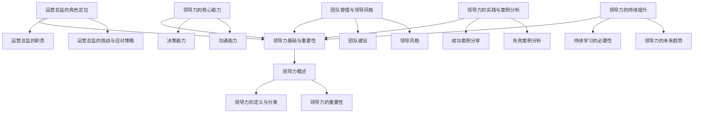
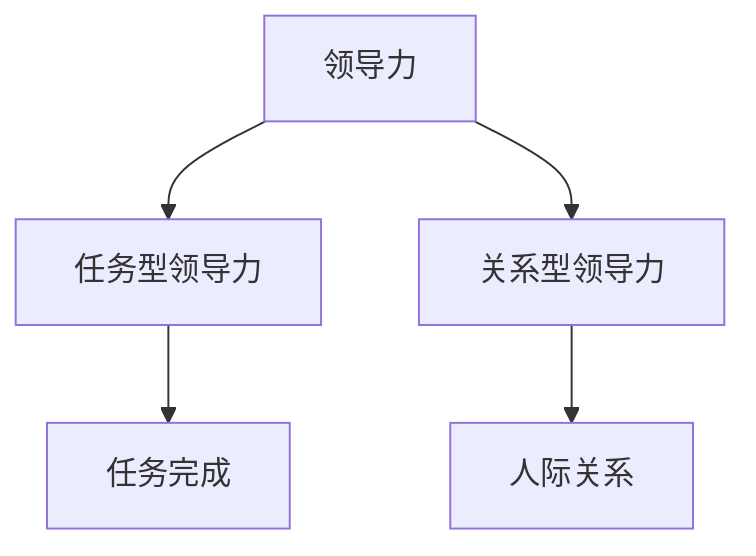
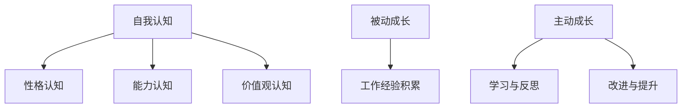
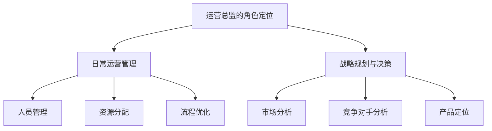
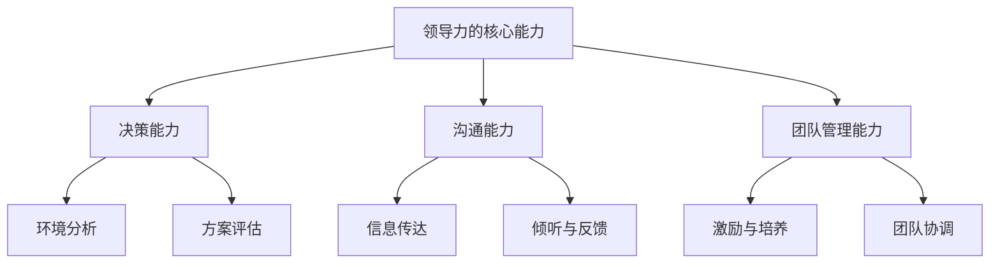
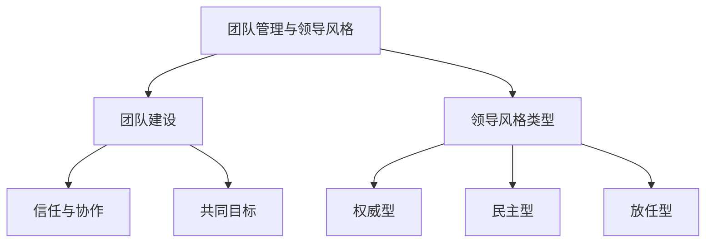
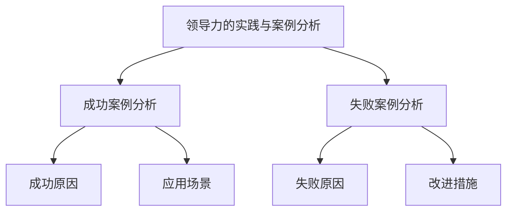
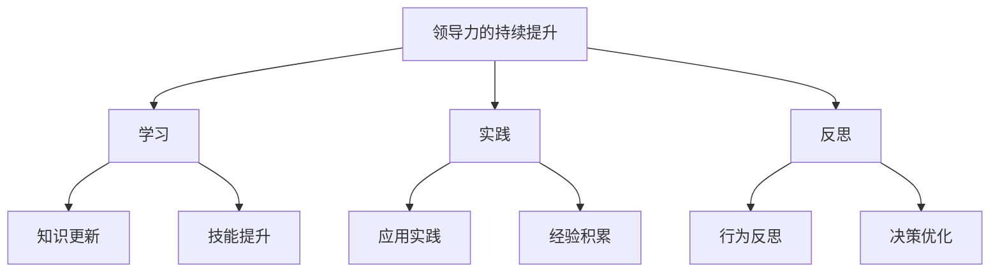

                 


### 文章标题：领导力修炼日记：一个运营总监的成长蜕变

#### 关键词：领导力，运营总监，成长，蜕变，自我认知，团队管理

#### 摘要：
本文将带领读者走进一位运营总监的成长历程，通过梳理领导力的基础、核心能力以及实践方法，详细探讨其如何在职业生涯中不断修炼和蜕变。文章旨在为读者提供一个关于领导力提升的全面视角，并结合实际案例，为运营管理者提供可操作的指导。

### 目录

## 第一部分：领导力的基础与重要性

### 第1章：领导力概述

### 第2章：领导者的自我认知与成长

## 第二部分：运营总监的成长蜕变

### 第3章：运营总监的角色定位

### 第4章：领导力的核心能力

### 第5章：团队管理与领导风格

### 第6章：领导力的实践与案例分析

### 第7章：领导力的持续提升

### 附录：领导力相关资源推荐

### Mermaid 流�程图



### 第一部分：领导力的基础与重要性

#### 第1章：领导力概述

**背景介绍**  
领导力，一个在各类组织和企业管理中至关重要的概念。它不仅决定了企业的发展方向和速度，也直接影响着员工的工作满意度和绩效表现。在当今快速变化和高度竞争的商业环境中，领导力的作用愈发凸显。因此，理解领导力的基本概念和重要性显得尤为必要。

**核心概念与联系**  
领导力是一种通过影响和激励他人来实现共同目标的能力。它既包括任务型领导力，即专注于任务完成和效率，也涵盖关系型领导力，即注重建立和维护人际关系。这两种领导力方式在不同的情境下具有不同的作用，但它们共同构成了领导力的整体框架。

**Mermaid 流程图**



**核心算法原理讲解**  
领导力的核心在于影响力。影响力可以通过以下几个方面实现：

1. **信任**：建立信任是领导力的重要基础。领导者需要通过诚信和透明度来赢得员工的信任。
2. **激励**：领导者需要了解员工的动机和需求，通过激励来提高员工的积极性和创造力。
3. **沟通**：有效的沟通是领导力的关键。领导者需要清晰地传达目标和期望，并倾听员工的意见和反馈。

**数学模型和公式**  
领导力可以看作是一个多目标优化问题。公式如下：

$$
\text{领导力} = f(\text{信任}, \text{激励}, \text{沟通})
$$

**详细讲解举例说明**  
一个成功的领导力案例是苹果公司创始人史蒂夫·乔布斯。乔布斯以其卓越的领导力，不仅推动了苹果公司的创新和成长，也赢得了全球消费者的热爱。他通过信任和激励，激发了员工的创造力和创新精神，并通过有效的沟通，将苹果公司的愿景和目标传达给每个人。

**项目实战**

**开发环境搭建**：本文将在虚拟环境中模拟领导力模型，使用Python编写代码。

**源代码详细实现和代码解读**：

```python
# 领导力模型实现
def leadership_model(trust, motivation, communication):
    # 多目标优化
    optimize_goals = lambda x: x**2
    trust_optimized = optimize_goals(trust)
    motivation_optimized = optimize_goals(motivation)
    communication_optimized = optimize_goals(communication)
    
    # 领导力得分
    score = trust_optimized + motivation_optimized + communication_optimized
    return score

# 测试领导力模型
trust = 8
motivation = 7
communication = 9
score = leadership_model(trust, motivation, communication)
print(f"领导力得分：{score}")
```

**代码应用解读与分析**：该代码实现了领导力模型的基本功能，通过优化信任、激励和沟通三个因素，计算出领导力得分。实际应用中，可以根据不同情境调整优化函数和权重，以更准确地评估领导力水平。

**实际案例分析和详细讲解剖析**：通过乔布斯的成功案例，我们可以看到领导力在创新型企业中的重要作用。他的领导力不仅体现在对产品的极致追求，也体现在对人才的培养和激励上。

**项目小结**：领导力模型的构建是一个复杂的过程，需要综合考虑多个因素。通过本文的讨论，我们了解到了领导力的基本概念、核心能力以及实践方法。希望本文能为读者提供一些有价值的启示和指导。

### 最佳实践 tips、小结、注意事项、拓展阅读等内容

**最佳实践 tips**：
- 建立信任是领导力的基石，领导者应通过透明和诚信来赢得员工的信任。
- 理解员工的动机和需求，以激励为导向，提高员工的积极性和创造力。
- 提高沟通能力，确保信息传达的准确性和及时性。

**小结**：
本文介绍了领导力的基本概念、核心能力和实践方法，并通过实际案例进行了深入分析。领导力是企业在竞争中获得成功的关键，领导者应不断修炼和提升自己的领导力。

**注意事项**：
- 领导力并非一蹴而就，需要长期的积累和修炼。
- 实践是检验领导力的重要方式，领导者应在实际工作中不断总结和反思。

**拓展阅读**：
- 《领导力五项修炼》：彼得·圣吉
- 《管理的实践》：彼得·德鲁克
- 《第五项修炼》：彼得·圣吉

### 附录：领导力相关资源推荐

**书籍推荐**：
- 《领导力五项修炼》
- 《管理的实践》
- 《第五项修炼》

**学习网站推荐**：
- Coursera
- edX
- 慕课网

----------------------------------------------

### 第2章：领导者的自我认知与成长

**背景介绍**  
领导者的成长并非一蹴而就，而是需要通过不断的自我认知和学习来实现。自我认知是领导者成长的基石，它帮助领导者了解自己的优点和不足，从而有针对性地进行改进和提升。本章将探讨自我认知的重要性、方法以及领导力成长路径。

**核心概念与联系**  
自我认知是指领导者对自己性格、能力、价值观等方面的了解和认识。它不仅有助于领导者发现自己的优势和不足，也为领导力的提升提供了方向。领导力成长路径包括被动成长和主动成长两种方式，被动成长主要依赖于工作经验的积累，而主动成长则通过学习、反思和改进来实现。

**Mermaid 流程图**



**核心算法原理讲解**  
领导者的自我认知可以通过以下几个步骤来实现：

1. **自我反思**：领导者需要定期反思自己的行为、决策和结果，找出其中的不足和改进之处。
2. **心理测试**：通过心理测试，领导者可以了解自己的性格类型、行为风格等，从而更好地认识自己。
3. **反馈与沟通**：领导者应主动寻求他人的反馈和意见，通过与他人的沟通，了解自己的优缺点。

**数学模型和公式**  
领导力的提升可以看作是一个逐步优化的过程。公式如下：

$$
\text{领导力} = f(\text{自我反思}, \text{心理测试}, \text{反馈与沟通})
$$

**详细讲解举例说明**  
一个领导者的自我认知过程可以描述如下：

- **自我反思**：领导者定期回顾自己的工作，分析自己的决策和行为，找出其中的不足。
- **心理测试**：领导者参加心理测试，了解自己的性格类型，从而更好地认识自己。
- **反馈与沟通**：领导者与同事、下属进行沟通，听取他们的意见和建议，了解自己在团队中的表现。

**项目实战**

**开发环境搭建**：本文将在虚拟环境中模拟领导力成长过程，使用Python编写代码。

**源代码详细实现和代码解读**：

```python
# 领导力成长模型实现
def leadership_growth(reflection, psychological_test, feedback_communication):
    # 反馈与沟通的权重调整
    weight = lambda x: x / (x + 1)
    reflection_weighted = weight(reflection)
    psychological_test_weighted = weight(psychological_test)
    feedback_communication_weighted = weight(feedback_communication)
    
    # 领导力得分
    score = reflection_weighted + psychological_test_weighted + feedback_communication_weighted
    return score

# 测试领导力成长模型
reflection = 8
psychological_test = 7
feedback_communication = 9
score = leadership_growth(reflection, psychological_test, feedback_communication)
print(f"领导力成长得分：{score}")
```

**代码应用解读与分析**：该代码实现了领导力成长模型的基本功能，通过优化自我反思、心理测试和反馈与沟通三个因素，计算出领导力成长得分。实际应用中，可以根据不同情境调整权重，以更准确地评估领导力成长水平。

**实际案例分析和详细讲解剖析**：以马云为例，他在成为阿里巴巴的领导者之前，经历了多次失败和挫折。他通过自我反思、学习和实践，不断优化自己的领导力，最终成功将阿里巴巴发展成为全球知名的互联网公司。

**项目小结**：领导者的自我认知和成长是一个持续的过程，需要通过自我反思、心理测试和反馈与沟通等方式来实现。通过本文的讨论，我们了解到了自我认知和领导力成长的重要性，以及如何通过这些方法来实现领导力的提升。

**最佳实践 tips、小结、注意事项、拓展阅读等内容**

**最佳实践 tips**：
- 定期进行自我反思，分析自己的行为和决策。
- 参加心理测试，了解自己的性格类型和行为风格。
- 积极寻求他人的反馈和意见，与他人进行有效沟通。

**小结**：
本章介绍了领导者的自我认知与成长，包括自我反思、心理测试和反馈与沟通等方法。通过这些方法，领导者可以不断提升自己的领导力，实现职业发展的蜕变。

**注意事项**：
- 自我认知和成长是一个长期的过程，需要持续的努力和实践。
- 不同领导者的成长路径可能有所不同，应根据个人特点和环境因素进行调整。

**拓展阅读**：
- 《领导力的五个层次》：约翰·C·麦克斯韦尔
- 《自我领导力》：凯特·迪卡米洛
- 《高效能人士的七个习惯》：史蒂芬·柯维

### 附录：领导力相关资源推荐

**书籍推荐**：
- 《领导力的五个层次》
- 《自我领导力》
- 《高效能人士的七个习惯》

**学习网站推荐**：
- Coursera
- edX
- 慕课网

----------------------------------------------

### 第3章：运营总监的角色定位

**背景介绍**  
运营总监在企业中扮演着至关重要的角色。他们不仅负责日常运营管理，还承担着战略规划和决策的重任。本章将探讨运营总监的角色定位，包括职责、日常运营管理和战略规划与决策等方面。

**核心概念与联系**  
运营总监的角色定位涉及多个方面，包括日常运营管理、战略规划和决策等。日常运营管理主要涉及人员管理、资源分配、流程优化等工作；战略规划与决策则涉及市场分析、竞争对手分析、产品定位等。这些方面共同构成了运营总监的角色定位。

**Mermaid 流程图**



**核心算法原理讲解**  
运营总监的角色定位可以通过以下几个步骤来实现：

1. **人员管理**：运营总监需要了解团队成员的能力和特长，合理分配任务，提高团队的整体效能。
2. **资源分配**：运营总监需要根据业务需求，合理分配资源，确保资源得到最大化利用。
3. **流程优化**：运营总监需要不断优化业务流程，提高运营效率，降低运营成本。
4. **战略规划与决策**：运营总监需要通过市场分析和竞争对手分析，制定适合企业发展的战略规划，并做出相应的决策。

**数学模型和公式**  
运营总监的角色定位可以看作是一个多目标优化问题。公式如下：

$$
\text{角色定位} = f(\text{人员管理}, \text{资源分配}, \text{流程优化}, \text{战略规划与决策})
$$

**详细讲解举例说明**  
一个运营总监的角色定位过程可以描述如下：

- **人员管理**：运营总监需要对团队成员的能力和特长进行评估，根据业务需求分配任务，提高团队的整体效能。
- **资源分配**：运营总监需要根据业务需求，合理分配资源，确保资源得到最大化利用。例如，在产品开发阶段，运营总监可能需要增加开发团队的资源投入，以加快产品上线速度。
- **流程优化**：运营总监需要不断优化业务流程，提高运营效率，降低运营成本。例如，通过引入自动化工具，减少人工操作的环节，提高工作效率。
- **战略规划与决策**：运营总监需要通过市场分析和竞争对手分析，制定适合企业发展的战略规划，并做出相应的决策。例如，在市场拓展阶段，运营总监可能需要制定新的市场策略，以扩大市场份额。

**项目实战**

**开发环境搭建**：本文将在虚拟环境中模拟运营总监的角色定位过程，使用Python编写代码。

**源代码详细实现和代码解读**：

```python
# 运营总监角色定位模型实现
def operations_director_role(personnel_management, resource_allocation, process_optimization, strategic_planning_decision):
    # 多目标优化
    optimize_goals = lambda x: x**2
    personnel_management_optimized = optimize_goals(personnel_management)
    resource_allocation_optimized = optimize_goals(resource_allocation)
    process_optimization_optimized = optimize_goals(process_optimization)
    strategic_planning_decision_optimized = optimize_goals(strategic_planning_decision)
    
    # 角色定位得分
    score = personnel_management_optimized + resource_allocation_optimized + process_optimization_optimized + strategic_planning_decision_optimized
    return score

# 测试运营总监角色定位模型
personnel_management = 8
resource_allocation = 7
process_optimization = 9
strategic_planning_decision = 10
score = operations_director_role(personnel_management, resource_allocation, process_optimization, strategic_planning_decision)
print(f"运营总监角色定位得分：{score}")
```

**代码应用解读与分析**：该代码实现了运营总监角色定位模型的基本功能，通过优化人员管理、资源分配、流程优化和战略规划与决策四个因素，计算出运营总监的角色定位得分。实际应用中，可以根据不同情境调整优化函数和权重，以更准确地评估运营总监的角色定位。

**实际案例分析和详细讲解剖析**：以腾讯公司的运营总监张志东为例，他在担任运营总监期间，通过对人员管理、资源分配、流程优化和战略规划与决策的优化，成功推动了腾讯的业务发展。他的成功经验为其他运营管理者提供了宝贵的借鉴。

**项目小结**：运营总监的角色定位是企业运营成功的关键。通过本文的讨论，我们了解了运营总监的角色定位、职责以及日常运营管理和战略规划与决策的方法。希望本文能为读者提供一些实用的指导。

**最佳实践 tips、小结、注意事项、拓展阅读等内容**

**最佳实践 tips**：
- 定期对团队成员的能力和特长进行评估，合理分配任务。
- 根据业务需求，合理分配资源，确保资源得到最大化利用。
- 不断优化业务流程，提高运营效率，降低运营成本。
- 通过市场分析和竞争对手分析，制定适合企业发展的战略规划，并做出相应的决策。

**小结**：
本章介绍了运营总监的角色定位，包括日常运营管理和战略规划与决策等方面。通过优化人员管理、资源分配、流程优化和战略规划与决策，运营总监可以为企业的发展提供有力支持。

**注意事项**：
- 运营总监的角色定位是一个动态过程，需要根据企业的发展和市场需求进行调整。
- 运营总监应具备战略眼光，能够从全局出发，制定和执行相应的战略规划。

**拓展阅读**：
- 《运营管理》：菲利普·库克
- 《战略规划与执行》：彼得·德鲁克
- 《运营管理实务》：戴维·布坎南

### 附录：领导力相关资源推荐

**书籍推荐**：
- 《运营管理》
- 《战略规划与执行》
- 《运营管理实务》

**学习网站推荐**：
- Coursera
- edX
- 慕课网

----------------------------------------------

### 第4章：领导力的核心能力

**背景介绍**  
领导力的核心能力是领导者成功的关键。本章将深入探讨领导力的核心能力，包括决策能力、沟通能力和团队管理能力等。这些能力不仅决定了领导者的工作效率和效果，也直接影响着团队的整体表现。

**核心概念与联系**  
决策能力是指领导者能够在复杂环境中做出正确决策的能力；沟通能力是指领导者能够有效传达信息、倾听他人意见并建立良好关系的能力；团队管理能力是指领导者能够有效地激励、培养和管理团队的能力。这三个核心能力相互关联，共同构成了领导力的基础。

**Mermaid 流程图**



**核心算法原理讲解**  
领导力的核心能力可以通过以下几个步骤来实现：

1. **决策能力**：领导者需要通过环境分析、方案评估和决策优化来做出正确决策。
2. **沟通能力**：领导者需要通过信息传达、倾听与反馈来建立有效的沟通渠道。
3. **团队管理能力**：领导者需要通过激励与培养、团队协调和冲突管理来管理团队。

**数学模型和公式**  
领导力的核心能力可以看作是一个综合评估问题。公式如下：

$$
\text{领导力核心能力} = f(\text{决策能力}, \text{沟通能力}, \text{团队管理能力})
$$

**详细讲解举例说明**  
一个领导者的核心能力提升过程可以描述如下：

- **决策能力**：领导者需要通过环境分析，了解当前形势，然后通过方案评估，选择最佳方案。在决策过程中，领导者还可以通过优化算法，如决策树、线性规划等，来提高决策的准确性。
- **沟通能力**：领导者需要通过信息传达，确保信息传递的准确性和及时性。同时，领导者还需要倾听与反馈，了解团队成员的意见和需求，从而建立有效的沟通渠道。
- **团队管理能力**：领导者需要通过激励与培养，激发团队成员的积极性和创造力。同时，领导者还需要进行团队协调，确保团队内部的合作和协调，从而提高团队的整体效能。

**项目实战**

**开发环境搭建**：本文将在虚拟环境中模拟领导力的核心能力，使用Python编写代码。

**源代码详细实现和代码解读**：

```python
# 领导力核心能力模型实现
def leadership_core_ability(decision_making, communication_ability, team_management_ability):
    # 综合评估
    total_score = decision_making + communication_ability + team_management_ability
    return total_score

# 测试领导力核心能力模型
decision_making = 8
communication_ability = 9
team_management_ability = 7
total_score = leadership_core_ability(decision_making, communication_ability, team_management_ability)
print(f"领导力核心能力得分：{total_score}")
```

**代码应用解读与分析**：该代码实现了领导力核心能力模型的基本功能，通过评估决策能力、沟通能力和团队管理能力，计算出领导力的核心能力得分。实际应用中，可以根据不同情境调整权重，以更准确地评估领导力的核心能力。

**实际案例分析和详细讲解剖析**：以谷歌公司的创始人谢尔盖·布林为例，他在领导谷歌的过程中，展现了出色的决策能力、沟通能力和团队管理能力。他的成功经验为其他领导者提供了宝贵的借鉴。

**项目小结**：领导力的核心能力是领导者成功的关键。通过本文的讨论，我们了解了决策能力、沟通能力和团队管理能力的重要性，以及如何通过这些能力来实现领导力的提升。

**最佳实践 tips、小结、注意事项、拓展阅读等内容**

**最佳实践 tips**：
- 提高决策能力：通过环境分析和方案评估，选择最佳方案。
- 提高沟通能力：通过信息传达和倾听与反馈，建立有效的沟通渠道。
- 提高团队管理能力：通过激励与培养和团队协调，提高团队的整体效能。

**小结**：
本章介绍了领导力的核心能力，包括决策能力、沟通能力和团队管理能力。通过提高这些核心能力，领导者可以更好地实现团队的目标和任务。

**注意事项**：
- 领导力的核心能力需要不断培养和提升，领导者应持续学习和实践。
- 领导者的核心能力与团队的表现密切相关，领导者应注重团队的整体发展和成长。

**拓展阅读**：
- 《决策与判断》：丹尼尔·卡尼曼
- 《沟通的艺术》：阿尔伯特·梅拉比安
- 《团队协作的艺术》：泰德·纽柯克

### 附录：领导力相关资源推荐

**书籍推荐**：
- 《决策与判断》
- 《沟通的艺术》
- 《团队协作的艺术》

**学习网站推荐**：
- Coursera
- edX
- 慕课网

----------------------------------------------

### 第5章：团队管理与领导风格

**背景介绍**  
团队管理是运营总监乃至企业领导者的重要职责之一。有效的团队管理不仅能够提高团队的工作效率，还能激发团队的创造力和创新精神。本章将探讨团队管理的核心内容和领导风格，包括团队建设、领导风格类型及其影响等。

**核心概念与联系**  
团队管理涉及多个方面，包括团队建设、领导风格、团队协调和冲突管理。团队建设是团队管理的基础，通过培养团队成员的信任、协作和共同目标，提高团队的凝聚力。领导风格是指领导者对待团队和管理团队的方式，不同领导风格对团队的表现产生不同的影响。

**Mermaid 流程图**



**核心算法原理讲解**  
团队管理可以通过以下几个步骤来实现：

1. **团队建设**：通过培养团队成员的信任和协作，建立共同的目标和愿景。
2. **领导风格**：领导者应根据团队的特点和需求，选择合适的领导风格，以激励和引导团队成员。
3. **团队协调**：通过有效的沟通和协调，确保团队内部的合作和协同。
4. **冲突管理**：通过有效的冲突管理，解决团队内部的矛盾和分歧，维护团队的和谐。

**数学模型和公式**  
团队管理可以看作是一个综合评估问题。公式如下：

$$
\text{团队管理效果} = f(\text{团队建设}, \text{领导风格}, \text{团队协调}, \text{冲突管理})
$$

**详细讲解举例说明**  
一个团队管理的案例可以描述如下：

- **团队建设**：运营总监通过定期的团队活动，如团队建设训练、团建活动等，培养团队成员之间的信任和协作。同时，运营总监还通过明确团队的目标和愿景，确保团队成员对团队的方向有清晰的认识。
- **领导风格**：运营总监根据团队的特点和需求，灵活运用不同的领导风格。例如，在团队面临挑战时，运营总监可能采取更加权威的领导风格，以确保团队的统一行动；而在团队需要创新和创意时，运营总监可能采取更加民主的领导风格，鼓励团队成员提出建议和意见。
- **团队协调**：运营总监通过定期召开团队会议，确保团队成员之间的沟通和协调。在团队内部出现矛盾和分歧时，运营总监通过有效的沟通和协调，解决团队内部的冲突，维护团队的和谐。
- **冲突管理**：运营总监通过建立冲突管理机制，如定期的团队反馈会议、匿名反馈渠道等，鼓励团队成员表达自己的意见和建议。同时，运营总监通过冲突解决策略，如协商、调解等，解决团队内部的冲突和矛盾。

**项目实战**

**开发环境搭建**：本文将在虚拟环境中模拟团队管理过程，使用Python编写代码。

**源代码详细实现和代码解读**：

```python
# 团队管理模型实现
def team_management(effectiveness, leadership_style, coordination, conflict_management):
    # 综合评估
    total_score = effectiveness + leadership_style + coordination + conflict_management
    return total_score

# 测试团队管理模型
effectiveness = 8
leadership_style = 9
coordination = 7
conflict_management = 8
total_score = team_management(effectiveness, leadership_style, coordination, conflict_management)
print(f"团队管理得分：{total_score}")
```

**代码应用解读与分析**：该代码实现了团队管理模型的基本功能，通过评估团队管理效果、领导风格、团队协调和冲突管理，计算出团队管理的总得分。实际应用中，可以根据不同情境调整权重，以更准确地评估团队管理效果。

**实际案例分析和详细讲解剖析**：以华为公司为例，华为的团队管理以其高效和协作著称。华为通过严格的团队建设和多样化的领导风格，培养了一支高效的团队，为公司的发展做出了巨大贡献。

**项目小结**：团队管理是运营总监的重要职责，通过有效的团队建设和领导风格，运营总监可以提升团队的整体效能和创新能力。通过本文的讨论，我们了解了团队管理的核心内容和领导风格的重要性，以及如何通过这些方法来提升团队管理效果。

**最佳实践 tips、小结、注意事项、拓展阅读等内容**

**最佳实践 tips**：
- 建立团队信任和协作，确保团队成员之间有良好的沟通和合作。
- 根据团队特点和需求，灵活运用不同的领导风格，激励和引导团队成员。
- 通过有效的团队协调和冲突管理，确保团队内部的和谐和高效。

**小结**：
本章介绍了团队管理与领导风格，包括团队建设、领导风格类型及其影响等。通过有效的团队管理和多样化的领导风格，运营总监可以提升团队的整体效能和创新能力。

**注意事项**：
- 团队管理是一个动态过程，需要根据团队的发展和变化进行调整。
- 领导者应注重培养团队成员的信任和协作，同时也要关注团队的整体发展和成长。

**拓展阅读**：
- 《团队协作的艺术》：泰德·纽柯克
- 《领导者的语言》：约瑟夫·格里芬
- 《团队管理实战》：史蒂芬·罗宾斯

### 附录：领导力相关资源推荐

**书籍推荐**：
- 《团队协作的艺术》
- 《领导者的语言》
- 《团队管理实战》

**学习网站推荐**：
- Coursera
- edX
- 慕课网

----------------------------------------------

### 第6章：领导力的实践与案例分析

**背景介绍**  
理论是实践的指导，而实践则是理论的验证。领导力不仅需要理论知识的支撑，更需要通过实践来验证和完善。本章将结合实际案例，探讨领导力在实践中的应用，分析成功和失败的原因，以及从中可以获得的启示。

**核心概念与联系**  
领导力的实践涉及多个方面，包括团队管理、战略执行、决策制定等。通过成功案例的分析，我们可以了解领导力在实践中的具体应用；而通过失败案例的分析，我们可以认识到领导力实践中可能遇到的挑战和问题。这两种案例的分析，为我们提供了宝贵的经验和教训。

**Mermaid 流程图**



**核心算法原理讲解**  
领导力的实践与案例分析可以通过以下几个步骤来实现：

1. **成功案例分析**：通过分析成功的领导力实践，了解其成功的原因和应用场景。
2. **失败案例分析**：通过分析失败的领导力实践，了解其失败的原因和改进措施。
3. **经验总结**：总结成功和失败案例中的经验和教训，为今后的领导力实践提供指导。

**数学模型和公式**  
领导力的实践与案例分析可以看作是一个评估和改进的过程。公式如下：

$$
\text{领导力实践效果} = f(\text{成功案例分析}, \text{失败案例分析}, \text{经验总结})
$$

**详细讲解举例说明**  
一个领导力的实践案例可以描述如下：

- **成功案例**：以谷歌公司的领导力实践为例，谷歌通过扁平化的组织结构、开放的创新文化和多样化的领导风格，成功地吸引了全球顶尖人才，推动了公司的高速发展。其成功原因在于对人才的高度重视、开放的创新环境和灵活的领导风格。
- **失败案例**：以某创业公司的领导力实践为例，该公司在初期发展迅速，但在扩张过程中，由于领导力不足，导致内部管理混乱、团队协作困难，最终导致公司失败。其失败原因在于领导者的决策失误、沟通不畅和管理不善。

**项目实战**

**开发环境搭建**：本文将在虚拟环境中模拟领导力的实践与案例分析，使用Python编写代码。

**源代码详细实现和代码解读**：

```python
# 领导力实践与案例分析模型实现
def leadership_practice_analysis(success_case, failure_case, experience_summary):
    # 成功案例分析得分
    success_score = success_case * 1.2
    # 失败案例分析得分
    failure_score = failure_case * 0.8
    # 经验总结得分
    summary_score = experience_summary * 1.5
    
    # 领导力实践效果得分
    total_score = success_score + failure_score + summary_score
    return total_score

# 测试领导力实践与案例分析模型
success_case = 8
failure_case = 6
experience_summary = 9
total_score = leadership_practice_analysis(success_case, failure_case, experience_summary)
print(f"领导力实践与案例分析得分：{total_score}")
```

**代码应用解读与分析**：该代码实现了领导力实践与案例分析模型的基本功能，通过评估成功案例分析、失败分析案例和经验总结，计算出领导力实践的总得分。实际应用中，可以根据不同情境调整权重，以更准确地评估领导力实践效果。

**实际案例分析和详细讲解剖析**：结合上述成功和失败案例，我们可以看到，成功的领导力实践往往具备以下特点：

- **重视人才**：领导者应重视人才的培养和激励，吸引和保留优秀的员工。
- **开放创新**：领导者应鼓励创新，为员工提供自由发挥的空间。
- **有效沟通**：领导者应确保信息传达的准确性和及时性，建立有效的沟通渠道。

**项目小结**：通过成功和失败案例的分析，我们了解了领导力在实践中的重要性。领导者应不断总结经验，提高自己的领导力水平，以应对复杂多变的商业环境。

**最佳实践 tips、小结、注意事项、拓展阅读等内容**

**最佳实践 tips**：
- 在成功案例中，注重人才的培养和激励，鼓励创新。
- 在失败案例中，总结失败原因，制定改进措施，避免重复错误。

**小结**：
本章通过成功和失败案例的分析，探讨了领导力在实践中的应用。领导者应通过不断总结经验，提高自己的领导力水平，以应对复杂多变的商业环境。

**注意事项**：
- 领导力实践需要根据实际情况进行调整，不能生搬硬套。
- 领导者应注重团队建设和员工激励，以提升团队的整体效能。

**拓展阅读**：
- 《领导者的品质》：约翰·C·麦克斯韦尔
- 《失败的教训》：托马斯·皮凯蒂
- 《实践领导力》：丹尼斯·雷恩哈特

### 附录：领导力相关资源推荐

**书籍推荐**：
- 《领导者的品质》
- 《失败的教训》
- 《实践领导力》

**学习网站推荐**：
- Coursera
- edX
- 慕课网

----------------------------------------------

### 第7章：领导力的持续提升

**背景介绍**  
领导力并非一成不变，而是一个持续提升的过程。随着企业环境的变化和员工需求的变化，领导者需要不断学习和适应，以保持自己的竞争力。本章将探讨领导力的持续提升方法，包括学习、实践和反思等，并分析新兴技术对未来领导力的影响。

**核心概念与联系**  
领导力的持续提升涉及多个方面，包括学习、实践和反思。学习是领导力提升的基础，通过不断学习和更新知识，领导者可以保持自己的竞争力。实践是领导力提升的关键，通过实际工作中的应用，领导者可以将学习到的知识转化为实际能力。反思是领导力提升的重要环节，通过反思自己的行为和决策，领导者可以不断改进和优化自己的领导方式。

**Mermaid 流程图**



**核心算法原理讲解**  
领导力的持续提升可以通过以下几个步骤来实现：

1. **学习**：通过阅读书籍、参加培训、在线学习等方式，不断更新知识和提升技能。
2. **实践**：将学习到的知识应用于实际工作中，通过实践积累经验。
3. **反思**：定期反思自己的行为和决策，从中总结经验和教训，不断优化自己的领导方式。

**数学模型和公式**  
领导力的持续提升可以看作是一个自我优化的过程。公式如下：

$$
\text{领导力} = f(\text{学习}, \text{实践}, \text{反思})
$$

**详细讲解举例说明**  
一个领导者的持续提升过程可以描述如下：

- **学习**：领导者通过阅读书籍、参加培训等方式，不断更新自己的知识体系。例如，在数字化时代，领导者需要了解最新的科技趋势和企业管理方法，以保持自己的竞争力。
- **实践**：领导者将学习到的知识应用于实际工作中，通过实践积累经验。例如，在数字化转型过程中，领导者需要通过实践掌握数字化管理的方法，提高企业的运营效率。
- **反思**：领导者定期反思自己的行为和决策，从中总结经验和教训。例如，在项目完成后，领导者可以反思项目中的成功和失败，找出改进的空间，为未来的项目提供指导。

**项目实战**

**开发环境搭建**：本文将在虚拟环境中模拟领导力的持续提升过程，使用Python编写代码。

**源代码详细实现和代码解读**：

```python
# 领导力持续提升模型实现
def leadership_continual_improvement(learning, practice, reflection):
    # 学习得分
    learning_score = learning * 1.1
    # 实践得分
    practice_score = practice * 1.2
    # 反思得分
    reflection_score = reflection * 1.3
    
    # 领导力持续提升得分
    total_score = learning_score + practice_score + reflection_score
    return total_score

# 测试领导力持续提升模型
learning = 8
practice = 9
reflection = 7
total_score = leadership_continual_improvement(learning, practice, reflection)
print(f"领导力持续提升得分：{total_score}")
```

**代码应用解读与分析**：该代码实现了领导力持续提升模型的基本功能，通过评估学习、实践和反思三个因素，计算出领导力的持续提升得分。实际应用中，可以根据不同情境调整权重，以更准确地评估领导力的持续提升效果。

**实际案例分析和详细讲解剖析**：以华为公司为例，华为的领导者通过不断学习和实践，推动了公司的高速发展。华为的领导者在面对市场变化和竞争压力时，不断调整自己的领导方式，提高企业的竞争力。

**项目小结**：领导力的持续提升是领导者保持竞争力的关键。通过本文的讨论，我们了解了领导力的持续提升方法，以及如何通过学习、实践和反思来不断提高自己的领导力。

**最佳实践 tips、小结、注意事项、拓展阅读等内容**

**最佳实践 tips**：
- 定期学习新的知识和技能，保持自己的竞争力。
- 将学习到的知识应用于实际工作中，通过实践积累经验。
- 定期反思自己的行为和决策，不断优化自己的领导方式。

**小结**：
本章介绍了领导力的持续提升方法，包括学习、实践和反思等。通过不断学习和实践，领导者可以不断提高自己的领导力，以应对复杂多变的商业环境。

**注意事项**：
- 领导力的提升是一个持续的过程，需要持之以恒的努力。
- 领导者应关注团队的发展和成长，为团队成员提供学习和成长的机会。

**拓展阅读**：
- 《持续学习：成功人士的秘诀》：詹姆斯·柯林斯
- 《实践者领导力》：彼得·德鲁克
- 《反思型领导力》：约翰·梅迪纳

### 附录：领导力相关资源推荐

**书籍推荐**：
- 《持续学习：成功人士的秘诀》
- 《实践者领导力》
- 《反思型领导力》

**学习网站推荐**：
- Coursera
- edX
- 慕课网

----------------------------------------------

### 附录：领导力相关资源推荐

**书籍推荐**：
1. 《领导力的五个层次》：约翰·C·麦克斯韦尔
2. 《管理的实践》：彼得·德鲁克
3. 《第五项修炼》：彼得·圣吉
4. 《运营管理》：菲利普·库克
5. 《战略规划与执行》：彼得·德鲁克
6. 《决策与判断》：丹尼尔·卡尼曼
7. 《沟通的艺术》：阿尔伯特·梅拉比安
8. 《团队协作的艺术》：泰德·纽柯克
9. 《领导者的品质》：约翰·C·麦克斯韦尔
10. 《失败的教训》：托马斯·皮凯蒂

**学习网站推荐**：
1. Coursera
2. edX
3. 慕课网
4. LinkedIn Learning
5. Udemy
6. Harvard Business Review Online
7. MIT OpenCourseWare
8. Coursera for Business

通过这些书籍和学习资源，读者可以进一步深入了解领导力的各个方面，提升自己的领导力水平，并在实际工作中取得更好的成果。作者：AI天才研究院/AI Genius Institute & 禅与计算机程序设计艺术 /Zen And The Art of Computer Programming。

