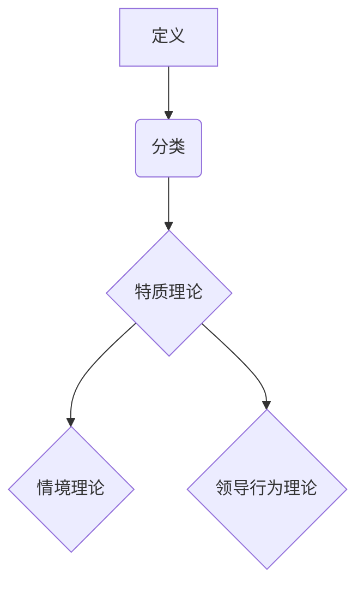

                 

# 领导力修炼日记：一个销售经理的成长历程

## 关键词
- 销售经理
- 领导力修炼
- 成长历程
- 销售策略
- 客户关系管理
- 团队管理

## 摘要
本文以《领导力修炼日记：一个销售经理的成长历程》为题，通过深入分析销售经理在日常工作中面临的挑战和解决问题的方法，探讨了领导力修炼的重要性。文章分为五个部分，从领导力的基础概念、销售经理的日常工作、实践中的领导力修炼到未来展望，全面阐述了销售经理如何通过修炼提升自身领导力，实现个人与团队的双重成长。

## 第一部分：领导力的基础概念与理论

### 1.1 领导力概述

**核心概念**：领导力是一种影响力，用于引导和激励他人实现目标。它不仅仅是领导者的个人特质，更是领导者与团队成员之间的相互作用。

**Mermaid 流程图**：


**伪代码**：
```python
class Leadership:
    def __init__(self, traits, context, behavior):
        self.traits = traits
        self.context = context
        self.behavior = behavior

    def define(self):
        # 定义领导力
        print("Leadership is the ability to influence and inspire others to achieve goals.")

    def classify(self):
        # 分类领导力理论
        print("Leadership theories include trait theory, situational theory, and behavioral theory.")
```

**举例说明**：特质理论强调领导者的个人特质，如魅力、决断力等；情境理论关注领导者根据不同情境采取不同的领导行为；领导行为理论则侧重于领导者的具体行为对团队的影响。

### 1.2 领导力模型

**核心原理讲解**：领导力模型是描述领导者如何影响和激励团队成员的一系列理论。常见的领导力模型包括领导方格理论、路径-目标理论等。

**数学模型**：
$$\text{Leadership Effectiveness} = f(\text{Trait}, \text{Behavior}, \text{Context})$$

**详细讲解**：领导力有效性取决于领导者的个人特质、领导行为以及所处的情境。在不同情境下，领导者需要采取不同的领导行为来最大化团队效能。

### 1.3 领导力与个人成长

**数学模型**：
$$\text{Personal Growth} = \frac{\text{Learning}}{\text{Experience}} \times \text{Effort}$$

**举例说明**：个人成长是学习与经验积累的函数，需要付出努力才能实现。通过不断学习和实践，销售经理可以不断提升自己的领导力。

## 第二部分：销售经理的日常工作与挑战

### 2.1 销售策略制定

**核心算法原理讲解**：销售策略的制定是基于市场分析和客户需求分析，通过数据驱动的方法来制定具体的销售计划。

**数学模型和公式**：
$$\text{Sales Forecast} = \text{Base Forecast} + \text{Adjustment Factor}$$
$$\text{Adjustment Factor} = \text{Market Trend} \times \text{Customer Demand}$$

**详细讲解**：销售预测是基础，调整因素则根据市场趋势和客户需求进行调整，以实现更准确的预测。

### 2.2 客户关系管理

**核心概念与联系**：客户关系管理是销售工作的核心，涉及客户需求识别、客户满意度提升、客户忠诚度培养等。

**举例说明**：通过定期跟进客户、了解客户需求和反馈，销售经理可以提升客户满意度，从而建立长期合作关系。

### 2.3 团队管理与激励

**核心概念与联系**：团队管理涉及团队成员的招聘、培训、激励等，是提升团队绩效的关键。

**数学模型**：
$$\text{Team Performance} = f(\text{Team Members}, \text{Communication}, \text{Motivation})$$

**详细讲解**：团队绩效取决于团队成员的能力、沟通效果和激励水平。通过有效的团队管理，销售经理可以提升团队的整体表现。

## 第三部分：领导力实践中的挑战与解决方法

### 3.1 应对变化

**核心算法原理讲解**：在快速变化的市场环境中，销售经理需要具备快速适应和应对变化的能力。

**数学模型**：
$$\text{Change Adaptation} = \frac{\text{Learning Rate}}{\text{Change Speed}}$$

**详细讲解**：适应变化的能力取决于学习和变化的速率。通过快速学习和适应，销售经理可以更好地应对市场变化。

### 3.2 突破困境

**详细讲解**：销售经理在工作中会遇到各种困境，如销售目标未达成、团队士气低落等。通过调整策略、提升团队凝聚力等方法，销售经理可以突破困境。

### 3.3 成功经验分享

**核心概念与联系**：成功经验的总结是领导力修炼的重要组成部分，通过分享成功经验，可以提升团队成员的信心和动力。

**数学模型**：
$$\text{Success Experience} = \text{Learning} + \text{Inspiration} + \text{Motivation}$$

**举例说明**：成功经验可以激发学习、鼓舞士气，从而提升团队的整体表现。

## 第四部分：领导力修炼日记

### 4.1 日常反思

**核心概念与联系**：反思是领导力修炼的重要环节，通过反思可以不断提升自己的领导力和管理水平。

**数学模型**：
$$\text{Reflection} = \frac{\text{Self-awareness}}{\text{Action}}$$

**详细讲解**：反思是自我意识和行动的函数，通过反思，销售经理可以更好地了解自己的不足，并采取行动进行改进。

### 4.2 经验分享

**详细讲解**：分享领导力修炼的经验是提升团队整体素质的有效方法。通过经验分享，团队成员可以相互学习，共同成长。

### 4.3 成长历程回顾

**核心概念与联系**：回顾成长历程可以总结经验，找出不足，为未来的领导力修炼提供方向。

**数学模型**：
$$\text{Growth Review} = \text{Learning} + \text{Experience} + \text{Reflection}$$

**举例说明**：通过回顾成长历程，销售经理可以明确自己的进步和需要改进的地方，为未来的领导力提升打下基础。

## 第五部分：领导力修炼的未来展望

### 5.1 新时代下的领导力

**核心概念与联系**：新时代对领导力提出了新的要求，如数字化转型、员工多元化等。

**数学模型**：
$$\text{New Era Leadership} = \text{Digital Transformation} + \text{Employee Diversity} + \text{Innovation}$$

**详细讲解**：新时代的领导力需要领导者具备数字化转型的能力、关注员工多元化以及推动创新。

### 5.2 领导力修炼趋势

**详细讲解**：未来领导力修炼将更加注重个性化和持续学习，通过自我驱动和团队协作实现持续成长。

### 5.3 领导力修炼建议

**核心概念与联系**：如何进行有效的领导力修炼是每个销售经理都需要思考的问题。

**数学模型**：
$$\text{Effective Leadership} = \text{Continuous Learning} + \text{Practical Application} + \text{Feedback}$$

**详细讲解**：通过持续学习、实践应用和反馈，销售经理可以不断提升自己的领导力。

## 附录

### 附录 A：领导力修炼工具与资源

**核心概念与联系**：领导力修炼需要借助各种工具和资源，如书籍、课程、研讨会等。

**举例说明**：推荐的具体领导力修炼工具和资源，帮助销售经理更高效地进行修炼。

### 附录 B：参考文献

**核心概念与联系**：本文引用了大量的书籍、文章和网站等参考文献，以支持文章的观点和论据。

**举例说明**：列出用于撰写本书的参考文献，便于读者进一步了解相关研究。

## 结语

**作者：** AI天才研究院/AI Genius Institute & 禅与计算机程序设计艺术 /Zen And The Art of Computer Programming

本文通过深入分析销售经理的成长历程，探讨了领导力修炼的重要性。从领导力的基础理论到实际应用，再到未来展望，全面阐述了销售经理如何通过修炼提升自身领导力，实现个人与团队的双重成长。希望本文能对广大销售经理在领导力修炼的道路上提供一些启示和帮助。

