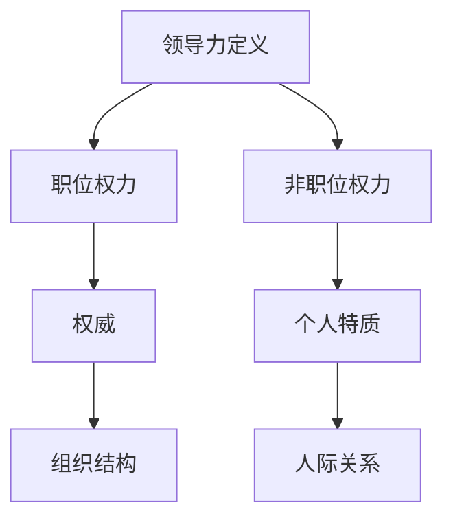

                 


### 文章标题：领导力修炼日记：程序员的管理者进阶之路

#### 文章关键词：
- 领导力
- 程序员
- 管理者
- 进阶
- 职业发展

#### 文章摘要：
本文旨在探讨程序员在职业生涯中向管理者角色转变的过程，深入解析领导力的重要性，以及如何通过修炼领导力来实现这一转变。文章将围绕领导力的基本概念、管理者所需技能、时间管理技巧、实战经验等展开，为程序员提供一套系统性的领导力修炼指南。

### 目录大纲设计思路

#### 1. 结构设计
本文将分为四个主要部分：引言、基础理论学习、实战技巧、进阶策略。每个部分分别对应不同的主题，确保内容的全面性和逻辑性。

#### 2. 章节划分
- 引言部分：介绍领导力的重要性、程序员向管理者转变的趋势。
- 基础理论学习：详细讲解领导力的基本概念、管理者所需的理论知识。
- 实战技巧：具体管理技能、团队管理方法、时间管理技巧等。
- 进阶策略：领导力提升策略、个人成长规划、管理进阶路径。

#### 3. 内容细化
每个章节细化到3级目录，确保内容全面、逻辑清晰。

#### 4. 技术实现
使用 Markdown 格式进行排版，确保文章的可读性和易用性。

### 第一部分：引言

#### 第1章：领导力在程序员中的重要性
##### 1.1.1 程序员成为管理者的趋势
- 程序员职业发展的一个重要趋势是向管理岗位的转变。
- 管理者不仅需要具备技术能力，还需要掌握领导力。

##### 1.1.2 领导力对程序员的职业发展
- 领导力是程序员职业发展的关键因素。
- 拥有领导力可以帮助程序员更好地管理和激励团队，提升个人价值。

#### 第2章：为何程序员需要修炼领导力
##### 2.1.1 领导力对团队管理的影响
- 领导力是团队管理的基础。
- 拥有良好领导力的程序员能够更有效地管理和激励团队成员。

##### 2.1.2 程序员转型管理者的挑战
- 程序员向管理者转型面临诸多挑战。
- 修炼领导力可以帮助程序员克服这些挑战，顺利转型。

### 第二部分：基础理论学习

#### 第3章：领导力的基本概念
##### 3.1.1 领导力的定义与类型
- 领导力是指影响他人实现共同目标的能力。
- 领导力分为职位权力和非职位权力两种类型。

##### 3.1.2 领导力与管理的区别
- 领导力和管理是两个不同的概念。
- 管理是确保组织资源被有效利用，而领导力则是激励和引导团队成员。

### 第三部分：实战技巧

#### 第4章：管理者所需的核心技能
##### 4.1.1 沟通技巧
- 沟通技巧是管理者必备的技能。
- 有效沟通能够提高团队的效率和凝聚力。

##### 4.1.2 决策能力
- 决策能力是管理者必须具备的素质。
- 培养良好的决策能力可以帮助管理者更好地应对各种挑战。

##### 4.1.3 团队协作
- 团队协作是管理者的重要职责。
- 建立良好的团队协作机制可以提高团队的整体效率。

### 第四部分：进阶策略

#### 第5章：领导力提升策略
##### 5.1.1 自我评估与提升路径
- 自我评估是提升领导力的第一步。
- 根据评估结果制定提升路径可以更有效地提升领导力。

##### 5.1.2 领导力模型与工具
- 领导力模型和工具可以帮助管理者更好地理解和应用领导力。
- 选择合适的领导力模型和工具可以加速领导力提升。

##### 5.1.3 领导力培训与认证
- 领导力培训是提升领导力的有效途径。
- 获得领导力认证可以证明管理者的专业水平。

### 结束语
在职业生涯中，从程序员向管理者转变是一个重要的里程碑。修炼领导力是这一转变的关键。通过本文的探讨，我们希望读者能够理解领导力的重要性，掌握提升领导力的方法，并在实际工作中不断提升自己的领导力，实现职业生涯的更大突破。

### 读者反馈与互动
欢迎读者在本文下方留言，分享您在领导力修炼过程中的心得体会，或对本文内容的建议和意见。我们期待与您共同探讨，共同进步。

### 附录
#### 相关资源与工具推荐
- 领导力书籍推荐：《领导力的五个层次》、《影响力》等。
- 领导力培训课程推荐：Google 的领导力课程、TED 的领导力演讲等。

#### 常见问题解答
- Q：领导力对程序员来说重要吗？
  A：非常重要。领导力是程序员职业发展的关键因素，拥有领导力可以帮助程序员更好地管理和激励团队，提升个人价值。

- Q：程序员如何修炼领导力？
  A：可以从以下几个方面入手：
  1. 学习领导力的基本概念和理论。
  2. 提高沟通技巧和决策能力。
  3. 加强团队协作和冲突解决能力。
  4. 不断反思和总结自己的领导实践。

- Q：领导力认证有用吗？
  A：领导力认证可以证明管理者的专业水平，有助于提升职业竞争力。但更重要的是通过实践不断提升自己的领导力。

---

### 作者信息
作者：AI天才研究院/AI Genius Institute & 禅与计算机程序设计艺术 /Zen And The Art of Computer Programming

### 核心概念与联系

#### 领导力的定义与类型

**定义：**
领导力是指影响他人实现共同目标的能力。它不仅仅是管理他人，还包括激发团队成员的潜力，共同推动团队向前发展。

**类型：**
- **职位权力领导力：** 基于职位或角色的权威，管理者通过组织赋予的权力来影响团队成员。
- **非职位权力领导力：** 基于个人魅力、能力、信任和价值观，通过个人特质来影响他人。

**关系架构：**
领导力的定义与类型之间存在着密切的联系。职位权力领导力依赖于组织结构和管理职位，而非职位权力领导力则依赖于个人品质和人际关系。两者共同构成了领导力的整体框架。

**Mermaid 流程图：**



### 核心算法原理讲解

#### 时间管理的基本原则

**伪代码：**

```python
def time_management(principal_activities, secondary_activities, deadlines):
    # 初始化优先级列表
    priority_list = []

    # 根据重要性和紧急性对活动进行排序
    for activity in principal_activities:
        priority_list.append((activity.importance, activity.emergency, activity))

    # 根据优先级列表执行活动
    for importance, emergency, activity in sorted(priority_list, key=lambda x: (x[0], x[1])):
        execute_activity(activity)

    # 对于次要活动，根据剩余时间进行安排
    for activity in secondary_activities:
        schedule_activity(activity, remaining_time)

    # 确保所有活动在最后期限前完成
    for activity in priority_list:
        if not activity.completed:
            extend_deadline(activity)

def execute_activity(activity):
    # 执行活动
    activity.completed = True

def schedule_activity(activity, remaining_time):
    # 安排活动
    activity.start_time = remaining_time - activity.duration
    activity.completed = False

def extend_deadline(activity):
    # 延长最后期限
    activity.deadline += activity.duration
```

### 数学模型和公式

#### 时间管理模型

**公式：**

$$
\text{剩余时间} = \text{总时间} - \text{已使用时间}
$$

**举例说明：**

假设一个项目总时长为100小时，目前已经过去了40小时，那么剩余时间为：

$$
\text{剩余时间} = 100小时 - 40小时 = 60小时
$$

### 项目实战

#### 实际管理场景分析

**场景：** 一家软件开发公司即将启动一个新项目，项目总时长为6个月，项目经理需要对团队成员进行时间管理，确保项目按期完成。

**步骤：**
1. **项目规划：** 确定项目目标、任务分解、资源分配。
2. **时间管理：** 根据任务的重要性和紧急性，对团队成员的活动进行排序和安排。
3. **监控与调整：** 定期检查项目进度，根据实际情况调整时间和资源分配。
4. **风险控制：** 预防和解决项目中可能出现的时间管理问题。

**案例分析：**
- **案例1：** 一名团队成员因为个人原因导致任务进度延误。项目经理及时与团队成员沟通，了解情况，调整任务分配，确保项目进度不受影响。
- **案例2：** 项目启动初期，由于任务规划不合理，导致项目进度滞后。项目经理重新评估任务优先级，优化时间管理策略，最终使项目恢复正常进度。

**详细讲解剖析：**
- **项目规划：** 项目经理需要对项目进行详细的规划，包括任务分解、时间分配和资源需求。
- **时间管理：** 根据任务的重要性和紧急性，制定合理的时间管理策略，确保关键任务优先完成。
- **监控与调整：** 项目经理需要定期检查项目进度，及时发现和解决问题。
- **风险控制：** 项目经理需要识别潜在的风险，并制定相应的预防措施和应急方案。

### 项目小结

通过实际管理场景分析，我们可以看到时间管理在项目管理中的重要性。合理的时间管理不仅能够确保项目按期完成，还能够提高团队成员的工作效率和团队凝聚力。项目经理需要不断学习和实践，不断提升自己的时间管理能力，为项目的成功奠定坚实的基础。

### 最佳实践 tips、小结、注意事项、拓展阅读等内容

#### 最佳实践 tips
1. **制定明确的目标和计划：** 项目启动前，确保团队成员明确了解项目目标和计划。
2. **定期沟通与反馈：** 定期与团队成员进行沟通，了解他们的工作情况和需求，及时提供反馈和支持。
3. **灵活调整计划：** 根据实际情况，灵活调整时间和资源分配，确保项目进度不受影响。

#### 小结
时间管理是项目管理中至关重要的一环。通过合理的时间管理，项目经理可以确保项目按期完成，提高团队效率和凝聚力。

#### 注意事项
1. **避免过度规划：** 过度规划可能导致团队成员压力过大，反而影响项目进度。
2. **关注关键任务：** 关键任务对项目的成功至关重要，应优先安排和执行。

#### 拓展阅读
- 《时间管理：如何高效利用时间》（作者：戴维·艾伦）
- 《高效能人士的七个习惯》（作者：史蒂芬·柯维）

通过阅读这些书籍，可以进一步了解时间管理的理论和实践方法，提升自己的时间管理能力。|>

