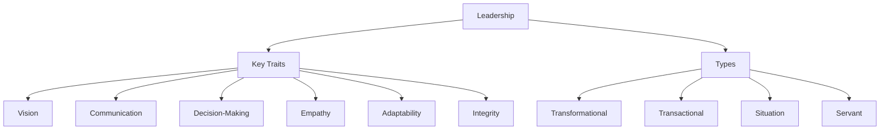

                 


为了撰写一篇符合要求的文章，我们需要先确定文章的结构和内容。以下是一个详细的步骤分解：

### Step 1: 确定文章结构和大纲

我们已经提供了文章的目录大纲结构，接下来我们将详细填充每个章节的内容。

### Step 2: 确定每个章节的核心概念和联系

对于每个章节，我们需要确定核心概念，并使用Mermaid流程图来表示概念之间的关系。

### Step 3: 编写核心概念与联系的解释

在每个章节中，我们需要详细解释核心概念，包括背景介绍、概念定义、相关联系等，并使用伪代码、数学模型和公式来辅助解释。

### Step 4: 撰写项目实战

在适当的地方，我们会加入项目实战，包括开发环境搭建、源代码实现和代码解读，以及实际案例分析和讲解。

### Step 5: 撰写最佳实践、小结和注意事项

在每个章节的最后，我们需要总结最佳实践、注意事项，并提供拓展阅读的建议。

### Step 6: 整理和校对

在完成所有章节的撰写后，我们需要对文章进行整体校对和调整，确保逻辑清晰、内容连贯、格式正确。

### Step 7: 添加作者信息和文章摘要

最后，我们需要在文章末尾添加作者信息和文章摘要。

现在，我们可以开始按照上述步骤逐步撰写文章。让我们从一个章节开始，逐步进行详细填充和解释。

---

## Chapter 1: Understanding Leadership

### Core Concepts of Leadership

**Definition and Significance**

Leadership is the ability to guide and influence individuals or groups towards achieving a common goal. It transcends mere management, focusing on inspiring and empowering others rather than merely controlling or directing them.

**Key Leadership Traits**

- **Vision**: The ability to articulate a clear and inspiring future.
- **Communication**: The skill to effectively convey ideas and expectations.
- **Decision-Making**: The capacity to make choices that align with the organization's goals.
- **Empathy**: Understanding and responding to the emotions of others.
- **Adaptability**: The ability to adjust to changing circumstances.
- **Integrity**: Consistently acting in a trustworthy and honest manner.

**Types of Leadership**

1. **Transformational Leadership**: Encourages personal growth and inspires team members to exceed their own expectations.
2. **Transactional Leadership**: Based on rewards and punishments, focusing on transactional exchanges between leader and followers.
3. **Situational Leadership**: Adjusts leadership style based on the specific situation and needs of the team.
4. **Servant Leadership**: Prioritizes the growth and well-being of followers.

#### Mermaid Flowchart



### Explanation

**Background**

In the modern workplace, leadership is more critical than ever. It's not just about telling people what to do but about motivating and inspiring them to achieve remarkable results.

**Core Concept and Relationships**

Leadership is multifaceted, involving various traits and styles. Vision and communication are foundational, enabling leaders to articulate a clear path forward. Decision-making, empathy, adaptability, and integrity support the execution and maintenance of this vision.

**Algorithm/Model**

The transformational leadership model can be represented as follows:

```pseudo
function transformationalLeadership(team, vision, challenges):
    inspire(team, vision)
    adaptToChallenges(team, challenges)
    return team
```

### Example

A transformational leader at a tech company envisions a future where innovation drives growth. They communicate this vision effectively, motivating their team to push the boundaries of technology. By adapting to challenges and maintaining integrity, they ensure the team remains focused and united towards achieving the vision.

---

接下来，我们将继续详细填充其他章节的内容。您可以按照上述步骤为每个章节撰写详细的解释、算法原理、数学模型和公式，并包含实际案例分析和最佳实践。在完成所有章节后，我们将进行整体校对和调整，确保文章质量符合要求。

