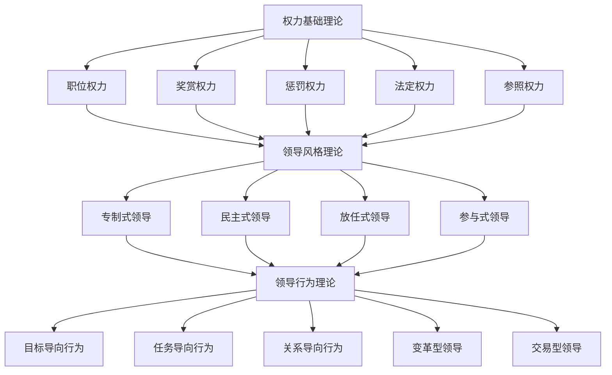

                 

### 《领导力修炼笔记：70后管理者的领导力提升之路》

---

关键词：领导力、70后管理者、领导力提升、领导力模型、职业生涯规划

摘要：
本文旨在探讨70后管理者的领导力提升之路，通过深入分析领导力的核心概念、基本原则和关键能力，结合实践案例，为读者提供一套系统的领导力修炼方法。文章围绕领导力的定义、模型、修炼原则和提升路径展开，旨在帮助70后管理者在新时代的挑战中找到领导力提升的方向和策略。

---

## 第1章 引言

### 1.1 领导力的定义与意义

领导力是一种影响他人共同实现目标的能力。它不仅仅是管理者的特权，而是每个人在工作中都可能需要运用的技能。在组织中，领导力对于推动创新、提升团队绩效和实现组织目标具有至关重要的作用。70后管理者在转型时期面临诸多挑战，如快速变化的市场环境、多样化的团队构成和持续的技术革新，这些挑战要求他们具备更高的领导力水平。

### 1.2 70后管理者的挑战与机遇

70后管理者在中国改革开放后成长起来，他们见证了中国经济的快速崛起，同时也经历了全球化的冲击。他们面临着与新生代员工沟通的挑战，如何理解并引导这一代人的价值观和职业追求。同时，70后管理者也拥有丰富的经验和深厚的文化底蕴，这是他们在领导力提升中的宝贵资产。

### 1.3 书籍结构概览

本文共分为七个章节，内容涵盖了领导力的核心概念、基本原则、关键能力、实践案例和提升路径。通过这些章节的详细阐述，读者可以系统地掌握领导力的本质，并找到适合自己的领导力提升方法。

## 第2章 领导力的核心概念与联系

### 2.1 领导力模型概述

领导力模型是理解领导力的重要工具。常见的领导力模型包括权力基础理论、领导风格理论和领导行为理论。权力基础理论关注领导者如何获取和运用权力；领导风格理论探讨领导者如何在不同情境下表现；领导行为理论则研究领导者具体的行为表现及其对团队的影响。

### 2.2 领导力与管理的联系与区别

领导力与管理密不可分，但又有所区别。管理侧重于组织、协调和控制，关注的是效率和秩序；领导力则强调激励、影响和变革，关注的是愿景和价值观。在70后管理者的领导力提升过程中，需要平衡管理技能和领导力，以实现组织目标和个人成长的双重提升。

### 第3章 领导力修炼的基本原则

### 3.1 自我认知

自我认知是领导力修炼的基础。通过自我评估，管理者可以了解自己的优势和劣势，从而有针对性地进行自我发展。自我发展包括提升专业知识、增强领导力和改善个人习惯等方面。

### 3.2 情绪管理

情绪管理是领导力的关键组成部分。管理者需要学会识别和调节自己的情绪，以保持冷静和理智。情绪管理有助于提升决策质量和团队协作。

### 3.3 沟通技巧

沟通技巧是领导力的核心能力之一。有效的沟通可以消除误解、增强信任、激发创意和提升团队凝聚力。管理者需要掌握多种沟通技巧，如倾听、表达和反馈。

## 第4章 领导力提升的关键能力

### 4.1 决策能力

决策能力是领导者必备的能力。一个有效的决策过程包括问题识别、方案评估和决策执行。领导者需要运用逻辑思维和直觉，结合数据分析和团队智慧，做出明智的决策。

### 4.2 团队建设

团队建设是提升领导力的关键。一个高效的团队需要有明确的角色和职责、良好的沟通和协作、有效的激励和培养。管理者需要关注团队成员的成长，打造一支有战斗力的团队。

### 4.3 激励与领导风格

激励是领导者的重要任务。不同的领导风格适用于不同的情境和团队成员。管理者需要根据具体情况选择合适的激励方式和领导风格，以激发团队成员的潜力。

## 第5章 领导力实践案例分析

### 5.1 国内企业领导力实践案例

#### 案例一：华为的领导力建设

华为作为全球领先的通信技术企业，其领导力建设备受关注。华为注重领导者的培养，通过轮岗、培训和激励机制，提升领导者的综合素质和领导力。

#### 案例二：阿里巴巴的管理之道

阿里巴巴在管理模式上具有独特性，其领导力实践包括合伙人制度、价值观传承和文化建设。阿里巴巴的领导力实践为70后管理者提供了有益的启示。

### 5.2 国际企业领导力实践案例

#### 案例一：谷歌的领导力理念

谷歌以其创新和开放的企业文化著称。谷歌的领导力理念强调员工自主性、团队合作和持续学习。这些理念为70后管理者提供了借鉴。

#### 案例二：苹果公司的领导风格

苹果公司以其独特的设计理念和严格的质量控制闻名。苹果的领导风格强调创新、专注和执行力。这些特点为70后管理者提供了宝贵的经验。

## 第6章 70后管理者的领导力提升路径

### 6.1 职业生涯规划

职业生涯规划是领导力提升的重要环节。70后管理者需要明确自己的职业发展目标，制定合理的职业发展策略，不断提升自己的领导力。

### 6.2 终身学习

终身学习是提升领导力的重要途径。70后管理者需要养成持续学习的习惯，通过阅读、培训和实践，不断丰富自己的知识和技能。

### 6.3 领导力提升计划

领导力提升计划是系统提升领导力的关键。管理者需要制定明确的提升计划，包括学习目标、实践目标和评估标准，确保提升计划的实施和效果。

## 第7章 领导力修炼的持续实践

### 7.1 领导力修炼的挑战与应对

领导力修炼过程中，管理者会面临各种挑战。这些挑战包括自我认知的困难、团队沟通的障碍和决策的压力。管理者需要学会应对这些挑战，以持续提升自己的领导力。

### 7.2 领导力修炼的持续实践

持续实践是领导力提升的关键。管理者需要通过日常工作和生活，不断实践领导力原则和能力，将领导力提升融入自己的行为和思维模式。

### 7.3 领导力修炼的未来趋势

未来，领导力修炼将更加注重个性化、数字化和全球化。管理者需要紧跟时代潮流，不断适应新的领导力要求，以应对未来的挑战。

---

作者：AI天才研究院/AI Genius Institute & 禅与计算机程序设计艺术 /Zen And The Art of Computer Programming

---

### 第2章 领导力的核心概念与联系

#### 2.1 领导力模型概述

领导力模型是理解领导力的重要工具，它有助于我们系统地分析和提升领导能力。常见的领导力模型包括权力基础理论、领导风格理论和领导行为理论。

**权力基础理论**

权力基础理论关注领导者如何获取和运用权力。领导者的权力来源主要有以下几种：

1. **职位权力**：职位赋予领导者的权力，如决策权、指挥权等。
2. **奖赏权力**：领导者能够提供奖赏，如奖金、晋升等。
3. **惩罚权力**：领导者能够实施惩罚，如批评、降职等。
4. **法定权力**：领导者基于法律或组织的规则，拥有某种权力。
5. **参照权力**：领导者因其个人特质或成就，得到他人的尊重和追随。

**领导风格理论**

领导风格理论探讨领导者如何在不同情境下表现。领导风格可以分为以下几种：

1. **专制式领导**：领导者做出决策，并要求下属执行。
2. **民主式领导**：领导者鼓励下属参与决策，并尊重下属的意见。
3. **放任式领导**：领导者给予下属高度自主权，很少干预。
4. **参与式领导**：领导者鼓励下属参与决策，并共同承担责任。

**领导行为理论**

领导行为理论研究领导者具体的行为表现及其对团队的影响。领导行为可以分为以下几种：

1. **目标导向行为**：领导者设定目标，并激励团队成员实现目标。
2. **任务导向行为**：领导者关注任务的执行，确保任务完成。
3. **关系导向行为**：领导者关注团队成员的关系，促进团队合作。
4. **变革型领导**：领导者通过创新和变革，推动组织发展。
5. **交易型领导**：领导者通过交易和奖励，激励团队成员。

**核心概念之间的关系架构**

为了更清晰地理解这些领导力模型，我们可以使用Mermaid流程图来展示它们之间的关系：

通过这个流程图，我们可以看到权力基础理论、领导风格理论和领导行为理论之间的相互关联，以及它们在领导力模型中的地位和作用。

#### 2.2 领导力与管理的联系与区别

领导力与管理密不可分，但又有所区别。管理侧重于组织、协调和控制，关注的是效率和秩序；领导力则强调激励、影响和变革，关注的是愿景和价值观。

**管理**

管理是指通过计划、组织、领导和控制等手段，实现组织目标的过程。管理的主要功能包括：

1. **计划**：设定组织目标和制定实现目标的策略。
2. **组织**：设计组织结构，明确职责和权限。
3. **领导**：指导和激励团队成员，实现组织目标。
4. **控制**：监控组织活动，确保目标的实现。

**领导力**

领导力是一种影响他人共同实现目标的能力。领导力不仅仅关注目标的实现，更注重激发团队成员的潜力，推动组织的创新和发展。领导力包括以下主要方面：

1. **激励**：通过激励手段，激发团队成员的积极性和创造力。
2. **影响**：通过个人魅力和影响力，引导团队成员的行为和决策。
3. **变革**：推动组织变革，适应外部环境的变化。
4. **价值观**：传递组织的价值观，培养团队成员的共同信念。

**领导力与管理的联系**

领导力和管理之间的联系非常紧密。领导力是管理的重要组成部分，没有领导力，管理将失去方向和动力。领导力可以增强管理的有效性，推动组织的持续发展。

1. **目标一致性**：领导力和管理都关注组织目标的实现，领导者的目标与组织目标的一致性是成功的关键。
2. **组织文化**：领导力通过塑造组织文化，影响团队成员的行为和态度，为管理的实施提供支持。
3. **团队协作**：领导力通过激发团队成员的潜力，促进团队合作，提高组织的整体效能。

**领导力与管理的区别**

虽然领导力和管理密切相关，但它们之间也存在明显的区别。

1. **关注点不同**：管理更侧重于效率和秩序，领导力更注重激发和影响。
2. **手段不同**：管理主要通过计划和控制等手段，领导力主要通过激励和影响等手段。
3. **效果不同**：管理关注的是短期目标的实现，领导力关注的是长期的组织发展。

在70后管理者的领导力提升过程中，需要平衡管理技能和领导力，以实现组织目标和个人成长的双重提升。管理者不仅要具备优秀的管理能力，还要具备强大的领导力，以应对复杂多变的商业环境。

### 第3章 领导力修炼的基本原则

#### 3.1 自我认知

自我认知是领导力修炼的基础。一个成功的领导者首先需要了解自己，包括自己的优势、劣势、价值观和动机。自我认知有助于管理者明确自己的发展方向，制定合适的领导策略。

**自我评估**

自我评估是自我认知的第一步。管理者可以通过以下方法进行自我评估：

1. **自我反思**：定期反思自己的行为和决策，分析成功和失败的原因。
2. **反馈**：寻求他人的反馈，包括同事、下属和上级的意见。
3. **心理测试**：通过专业心理测试，了解自己的性格、能力和动机。

**自我发展**

自我发展是自我认知的延伸。管理者需要通过以下方法不断提升自己：

1. **学习**：不断学习新知识和技能，保持好奇心和求知欲。
2. **实践**：通过实际工作，将理论知识转化为实践能力。
3. **反思**：在实践过程中不断反思和调整自己的行为和策略。

通过自我认知和自我发展，管理者可以更好地了解自己，发挥自己的优势，克服自己的劣势，从而提升自己的领导力。

#### 3.2 情绪管理

情绪管理是领导力的重要组成部分。情绪管理良好的领导者能够保持冷静和理智，做出明智的决策，并有效地应对各种挑战。

**情绪识别**

情绪识别是情绪管理的第一步。管理者需要学会识别自己的情绪，包括正面情绪和负面情绪。情绪识别有助于管理者了解自己的情绪状态，并找到合适的应对策略。

1. **正面情绪**：正面情绪如喜悦、兴奋和自信等，有助于提升领导者的决策质量和团队士气。
2. **负面情绪**：负面情绪如焦虑、愤怒和沮丧等，可能影响领导者的判断力和决策能力。

**情绪调节**

情绪调节是情绪管理的核心。管理者需要学会调节自己的情绪，以保持积极的心态和理性的决策。

1. **自我调节**：通过深呼吸、冥想和运动等方法，自我调节情绪，减轻负面情绪的影响。
2. **情境调节**：改变自己的行为和态度，以适应不同的情境和挑战。
3. **社交调节**：通过与他人的交流和互动，获得支持和鼓励，调节情绪。

通过情绪管理，管理者可以更好地应对压力和挑战，提升领导力，建立良好的人际关系。

#### 3.3 沟通技巧

沟通技巧是领导力的关键能力之一。有效的沟通可以消除误解、增强信任、激发创意和提升团队凝聚力。

**有效沟通**

有效沟通包括以下方面：

1. **倾听**：倾听是沟通的基础，管理者需要学会倾听他人的意见和需求。
2. **表达**：表达是沟通的关键，管理者需要清晰、准确地表达自己的思想和意图。
3. **反馈**：反馈是沟通的延续，管理者需要给予他人及时的反馈，以促进沟通的深入和改进。

**高效团队沟通**

高效团队沟通需要以下条件：

1. **共同目标**：团队成员需要明确共同的目标和愿景，以保持沟通的一致性和方向性。
2. **开放环境**：团队成员需要在一个开放、包容的环境中，自由地表达自己的意见和想法。
3. **冲突解决**：团队成员需要学会解决冲突，以保持团队的稳定和和谐。

通过掌握沟通技巧，管理者可以有效地传达信息、协调资源、激发团队潜力，从而提升领导力。

### 第4章 领导力提升的关键能力

#### 4.1 决策能力

决策能力是领导者必备的能力。有效的决策能力有助于领导者快速应对变化，做出明智的决策，推动组织的发展。

**决策过程**

一个有效的决策过程包括以下几个步骤：

1. **问题识别**：明确需要解决的问题和目标。
2. **方案评估**：分析各种可能的解决方案，评估其优缺点。
3. **决策制定**：选择最佳的解决方案，并制定详细的执行计划。
4. **决策执行**：实施决策，监控执行过程，并根据实际情况进行调整。

**决策技巧**

领导者需要掌握以下决策技巧：

1. **信息收集**：收集与决策相关的信息，确保决策的准确性。
2. **逻辑分析**：运用逻辑思维，分析各种方案的优缺点，做出明智的决策。
3. **风险评估**：评估决策可能带来的风险，制定相应的应对策略。
4. **团队参与**：鼓励团队成员参与决策过程，利用团队智慧做出更好的决策。

通过掌握决策技巧，领导者可以更高效地做出决策，提升领导力。

#### 4.2 团队建设

团队建设是提升领导力的关键。一个高效的团队需要具备明确的角色和职责、良好的沟通和协作、有效的激励和培养。

**团队角色与职责**

团队角色与职责的明确是团队建设的基础。领导者需要确保每个团队成员都清楚自己的角色和职责，以避免混乱和冲突。

1. **角色分配**：根据团队成员的能力和特长，分配合适的角色。
2. **职责明确**：明确每个角色的职责和任务，确保团队成员知道自己的工作内容。

**沟通与协作**

沟通与协作是团队建设的核心。领导者需要建立良好的沟通机制，促进团队成员之间的互动和合作。

1. **建立信任**：通过信任建立，提高团队成员之间的互信和合作。
2. **促进沟通**：提供沟通平台，鼓励团队成员表达自己的观点和需求。
3. **协调资源**：协调团队内外部的资源，确保团队目标的实现。

**激励与培养**

激励与培养是团队建设的重要环节。领导者需要通过激励和培养，激发团队成员的潜力和积极性。

1. **激励方式**：采用多样化的激励方式，如奖励、认可和培训等。
2. **能力培养**：提供培训和发展机会，帮助团队成员提升能力和技能。
3. **团队文化**：建立积极的团队文化，营造良好的工作氛围。

通过团队建设，领导者可以打造一支有战斗力的团队，提升领导力。

#### 4.3 激励与领导风格

激励是领导者的重要任务。不同的领导风格适用于不同的情境和团队成员，领导者需要根据具体情况选择合适的激励方式和领导风格，以激发团队成员的潜力。

**激励理论**

常见的激励理论包括：

1. **X理论和Y理论**：X理论认为人们需要外部的激励，而Y理论认为人们具有内在的激励。
2. **需求层次理论**：马斯洛的需求层次理论指出，人们有不同的需求层次，领导者需要满足不同层次的需求，以激发团队成员的潜力。
3. **目标设定理论**：目标设定理论强调明确的目标和挑战可以激励团队成员，提高工作绩效。

**领导风格分析**

领导风格可以分为以下几种：

1. **专制式领导**：领导者做出决策，并要求下属执行。
2. **民主式领导**：领导者鼓励下属参与决策，并尊重下属的意见。
3. **放任式领导**：领导者给予下属高度自主权，很少干预。
4. **参与式领导**：领导者鼓励下属参与决策，并共同承担责任。

不同的领导风格适用于不同的情境和团队成员，领导者需要根据具体情况选择合适的领导风格。

1. **情境因素**：领导风格需要根据不同的情境进行调整，如团队规模、任务复杂度和团队成熟度等。
2. **个体差异**：领导者需要了解团队成员的个人特点和需求，选择适合他们的领导风格。

通过激励和领导风格的选择，领导者可以有效地激发团队成员的潜力，提升领导力。

### 第5章 领导力实践案例分析

#### 5.1 国内企业领导力实践案例

##### 案例一：华为的领导力建设

华为是全球领先的通信技术企业，其领导力建设备受关注。华为的领导力建设包括以下几个方面：

1. **领导力培养**：华为通过轮岗、培训和激励机制，提升领导者的综合素质和领导力。华为的轮岗制度让领导者在不同岗位锻炼，积累多样化的管理经验。

2. **价值观传承**：华为的核心价值观是“客户至上、创新求实、艰苦奋斗、团结协作”。华为通过价值观教育，确保领导者的行为与公司文化相一致。

3. **激励机制**：华为采用股权激励和绩效激励，激发领导者的积极性和创造力。华为的股权激励计划让领导者与公司利益高度一致，增强忠诚度和归属感。

##### 案例二：阿里巴巴的管理之道

阿里巴巴是中国领先的互联网企业，其管理模式具有独特性。阿里巴巴的领导力实践包括以下几个方面：

1. **合伙人制度**：阿里巴巴采用合伙人制度，确保领导层的稳定性和连续性。合伙人制度让领导者与公司利益紧密联系，增强团队合作精神。

2. **价值观传承**：阿里巴巴的核心价值观是“客户第一、员工第二、股东第三”。阿里巴巴通过价值观教育，培养具有社会责任感和使命感的领导者。

3. **企业文化**：阿里巴巴重视企业文化，通过“阿里味”活动，增强员工的归属感和认同感。阿里巴巴的企业文化强调开放、包容和创新，为领导者提供了良好的发展环境。

#### 5.2 国际企业领导力实践案例

##### 案例一：谷歌的领导力理念

谷歌是全球领先的科技企业，其领导力理念包括：

1. **员工自主性**：谷歌鼓励员工自主决策，发挥创造力。谷歌的“20%时间”政策让员工可以自由支配工作时间的20%，用于探索新的创意和项目。

2. **团队合作**：谷歌强调团队合作，鼓励员工跨部门合作，分享知识和经验。谷歌的团队文化注重开放、包容和创新，为领导者提供了良好的发展环境。

3. **持续学习**：谷歌鼓励员工持续学习，提供丰富的培训和发展机会。谷歌的“学习时间”政策让员工可以自由安排学习时间，提升个人能力和职业素养。

##### 案例二：苹果公司的领导风格

苹果公司以其独特的设计理念和严格的质量控制闻名。苹果的领导风格包括：

1. **创新导向**：苹果强调创新，鼓励领导者推动技术创新和设计突破。苹果的领导风格注重创新和执行力，为领导者提供了广阔的发展空间。

2. **专注细节**：苹果公司对产品细节有着极高的要求，领导者需要关注每一个细节，确保产品质量。苹果的领导风格强调对细节的关注和追求完美。

3. **执行力**：苹果公司强调执行力，领导者需要确保团队的决策得到有效执行。苹果的领导风格注重结果和目标导向，为领导者提供了明确的执行方向。

通过这些国际企业的领导力实践案例，70后管理者可以借鉴和学习先进的领导力理念和方法，提升自己的领导力水平。

### 第6章 70后管理者的领导力提升路径

#### 6.1 职业生涯规划

职业生涯规划是70后管理者领导力提升的重要环节。通过职业生涯规划，管理者可以明确自己的职业发展目标，制定合理的职业发展策略，不断提升自己的领导力。

**职业发展目标**

职业发展目标包括短期目标、中期目标和长期目标。70后管理者需要根据自己的兴趣、能力和市场需求，设定明确的发展目标。

1. **短期目标**：通常在1-3年内实现，如晋升、项目成功等。
2. **中期目标**：通常在3-5年内实现，如职位提升、技能提升等。
3. **长期目标**：通常在5年以上，如行业专家、企业领导者等。

**职业发展策略**

职业发展策略是实现职业发展目标的方法和途径。70后管理者需要制定合理的职业发展策略，包括以下几个方面：

1. **技能提升**：通过学习、培训和实践，提升自己的专业技能和领导能力。
2. **人脉拓展**：建立广泛的人脉网络，获取更多的职业机会和资源。
3. **工作经验**：积累丰富的工作经验，提升自己的实践能力和领导力。
4. **自我认知**：了解自己的优势和劣势，制定有针对性的提升计划。

通过职业生涯规划，70后管理者可以明确自己的职业发展方向，不断提升自己的领导力。

#### 6.2 终身学习

终身学习是70后管理者领导力提升的关键。随着科技和商业环境的快速变化，管理者需要不断学习新知识和技能，以适应新的挑战和机遇。

**学习方法**

终身学习需要良好的学习方法。70后管理者可以采用以下学习方法：

1. **自主学习**：通过阅读书籍、参加在线课程和讲座，自主提升自己的知识水平。
2. **实践学习**：通过实际工作，将理论知识转化为实践能力。
3. **合作学习**：与他人合作学习，分享知识和经验，提升团队的整体能力。
4. **反思学习**：在学习和实践过程中，不断反思和总结，提升自己的学习效果。

**学习资源**

终身学习需要丰富的学习资源。70后管理者可以充分利用以下学习资源：

1. **在线课程**：如Coursera、edX等在线学习平台，提供丰富的课程资源。
2. **专业书籍**：专业书籍是获取知识的重要来源，70后管理者可以根据自己的需求和兴趣选择合适的书籍。
3. **专业论坛**：如LinkedIn、知乎等，可以与其他专业人士交流，获取最新的行业动态和经验分享。
4. **培训机构**：参加专业培训机构的培训课程，提升自己的专业能力和领导力。

通过终身学习，70后管理者可以不断提升自己的知识和技能，适应不断变化的环境，实现领导力的持续提升。

#### 6.3 领导力提升计划

领导力提升计划是70后管理者系统提升领导力的关键。通过制定明确的提升计划，管理者可以系统地学习领导力知识，提升自己的领导能力。

**计划制定**

领导力提升计划包括以下几个方面：

1. **目标设定**：明确领导力提升的目标，如提升沟通能力、决策能力等。
2. **内容规划**：规划学习的内容，包括领导力理论、实践技巧等。
3. **时间安排**：制定学习的时间表，确保学习计划的实施。
4. **资源准备**：准备学习所需的资源，如书籍、课程等。

**实施与评估**

领导力提升计划的实施与评估是提升领导力的关键。70后管理者需要：

1. **严格执行**：按照学习计划，严格执行学习任务。
2. **定期评估**：定期评估学习效果，了解自己的进步和不足。
3. **调整计划**：根据评估结果，调整学习计划，确保提升计划的实施效果。

通过领导力提升计划，70后管理者可以系统地提升自己的领导力，应对工作中的挑战，实现个人和组织的共同发展。

### 第7章 领导力修炼的持续实践

#### 7.1 领导力修炼的挑战与应对

领导力修炼过程中，管理者会面临各种挑战。这些挑战包括自我认知的困难、团队沟通的障碍和决策的压力。管理者需要学会应对这些挑战，以持续提升自己的领导力。

**自我认知的挑战**

自我认知是领导力修炼的基础，但管理者在自我认知过程中可能会遇到以下挑战：

1. **认知偏差**：管理者可能存在自我认知偏差，如过度自信或过度谦虚。
2. **情绪干扰**：情绪可能会干扰自我认知，导致管理者无法客观评估自己。
3. **逃避问题**：管理者可能会因为害怕面对自己的不足，而逃避自我认知。

**应对策略**

1. **定期反思**：通过定期反思自己的行为和决策，了解自己的优点和不足。
2. **接受反馈**：积极接受他人的反馈，包括同事、下属和上级的意见。
3. **专业心理测试**：通过专业心理测试，了解自己的性格、能力和动机。

**团队沟通的挑战**

团队沟通是领导力的重要组成部分，但管理者在团队沟通过程中可能会遇到以下挑战：

1. **沟通障碍**：团队成员之间的沟通可能存在障碍，如文化差异、沟通方式不当等。
2. **信息不对称**：团队成员可能存在信息不对称，导致沟通不畅。
3. **冲突**：团队成员之间的冲突可能会影响沟通效果。

**应对策略**

1. **建立信任**：通过建立信任，促进团队成员之间的沟通。
2. **提供反馈**：给予团队成员及时的反馈，帮助团队成员了解自己的行为和表现。
3. **改善沟通方式**：采用合适的沟通方式，如面对面沟通、书面沟通等。

**决策的挑战**

决策是领导者的重要任务，但管理者在决策过程中可能会遇到以下挑战：

1. **信息不足**：决策时可能缺乏足够的信息，导致决策不准确。
2. **时间压力**：决策时可能面临时间压力，无法充分考虑各种因素。
3. **情绪干扰**：情绪可能会干扰决策，导致决策失误。

**应对策略**

1. **信息收集**：在决策前，收集与决策相关的信息，确保决策的准确性。
2. **冷静分析**：在决策时，保持冷静和理智，避免情绪干扰。
3. **风险评估**：在决策前，评估决策可能带来的风险，制定相应的应对策略。

通过应对这些挑战，管理者可以不断提升自己的领导力，实现个人和组织的共同发展。

#### 7.2 领导力修炼的持续实践

持续实践是领导力修炼的关键。管理者需要通过日常工作和生活，不断实践领导力原则和能力，将领导力提升融入自己的行为和思维模式。

**实践方法**

1. **日常反思**：通过日常反思，回顾自己的行为和决策，分析成功和失败的原因。
2. **角色扮演**：通过角色扮演，模拟领导者的行为和决策，提升自己的领导能力。
3. **学习交流**：通过学习交流，与他人分享领导力经验，学习他人的优秀做法。
4. **实践项目**：通过实践项目，将领导力原则应用到实际工作中，提升自己的实践能力。

**成功案例分享**

以下是一些领导力修炼的成功案例：

1. **案例一**：某企业管理者在日常工作中，通过反思自己的决策和行为，不断提升自己的领导能力。他注重与团队成员的沟通，建立信任，提高了团队的凝聚力。
2. **案例二**：某公司领导者通过角色扮演，模拟不同情境下的领导行为，提升了自己的决策能力和沟通能力。他在实践中不断总结经验，逐步成长为一名优秀的领导者。

通过这些成功案例，我们可以看到持续实践对领导力提升的重要性。管理者需要通过持续实践，不断提升自己的领导力，以应对不断变化的商业环境。

#### 7.3 领导力修炼的未来趋势

未来，领导力修炼将更加注重个性化、数字化和全球化。

**个性化**

个性化是未来领导力修炼的重要趋势。管理者需要关注团队成员的个性化需求，提供个性化的激励和培养方案，激发团队成员的潜力。

**数字化**

数字化是未来领导力修炼的重要工具。管理者需要利用数字化工具，如数据分析、人工智能等，提升决策效率和团队协作能力。

**全球化**

全球化是未来领导力修炼的必然趋势。管理者需要具备跨文化沟通和领导能力，适应全球化的商业环境。

**未来展望**

未来，领导力修炼将更加注重个性化、数字化和全球化。管理者需要不断学习和适应这些变化，提升自己的领导力，以应对未来的挑战。

### 附录

#### 附录 A 领导力修炼工具与方法

**工具与方法**

1. **360度反馈**：通过收集多方面的反馈，全面评估领导者的能力和行为。
2. **领导力评估工具**：如领导力问卷、领导力模型等，帮助领导者评估自己的领导能力。
3. **培训与研讨会**：通过培训与研讨会，提升领导者的知识和技能。

**实践案例**

1. **案例一**：某公司通过360度反馈，评估领导者的领导能力，并制定个性化的提升计划。通过培训与研讨会，领导者的领导力得到了显著提升。
2. **案例二**：某公司利用领导力评估工具，评估领导者的领导能力，并根据评估结果制定培训计划。通过持续培训，领导者的领导能力得到了显著提升。

通过这些工具和方法，领导者可以系统地提升自己的领导力。

#### 附录 B 领导力修炼资源推荐

**书籍推荐**

1. 《领导力》(Leadership)- 约翰·P·科特
2. 《第五项修炼》(The Fifth Discipline)- 彼得·圣吉
3. 《管理的实践》(The Practice of Management)- 彼得·德鲁克

**文章与演讲**

1. 《领导力的五个层次》(The Five Levels of Leadership)- 约翰·C·马克斯维尔
2. 《领导者的特质》(The Characteristics of a Leader)- 哈佛商业评论
3. TED演讲《如何成为一个领导者》(How to be a leader)- 约翰·C·马克斯维尔

**拓展阅读**

1. 《领导力修炼手册》(The Leadership Challenge)- 吉姆·赫南德兹
2. 《领导力的秘诀》(The Secrets of Great Leaders)- 马克·麦考梅克
3. 《领导力的艺术》(The Art of Leadership)- 雷蒙德·A·诺尔顿

通过阅读这些书籍、文章和演讲，读者可以进一步了解领导力的本质和实践方法，提升自己的领导力。

---

作者：AI天才研究院/AI Genius Institute & 禅与计算机程序设计艺术 /Zen And The Art of Computer Programming

---

### 结论

本文围绕《领导力修炼笔记：70后管理者的领导力提升之路》一书，系统阐述了领导力的核心概念、基本原则、关键能力、实践案例和提升路径。通过分析领导力的定义、模型和联系，读者可以深入理解领导力的本质。通过学习领导力修炼的基本原则，读者可以掌握提升领导力的方法和技巧。通过实践案例和提升路径的探讨，读者可以找到适合自己的领导力提升策略。

在数字化和全球化的新时代，70后管理者面临着前所未有的挑战和机遇。通过不断提升领导力，70后管理者可以更好地应对这些挑战，实现个人和组织的共同发展。本文希望为读者提供一套系统的领导力提升指南，帮助他们在领导力的修炼之路上走得更远。

让我们一起努力，不断提升领导力，为实现个人梦想和组织目标而努力。感谢阅读，期待与您在领导力的修炼之路上相遇。

---

本文完。感谢您的阅读。如果您有任何疑问或建议，欢迎在评论区留言。期待与您共同探讨领导力的奥秘。

作者：AI天才研究院/AI Genius Institute & 禅与计算机程序设计艺术 /Zen And The Art of Computer Programming

---

