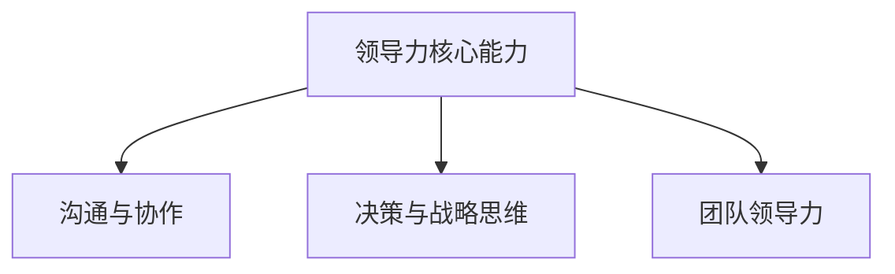

                 

### 引言

在当今快速变化的商业环境中，领导力的培养已成为企业和个人成功的关键因素之一。尤其是在新一代职场人中，85后作为中生代力量，他们在领导力的修炼过程中面临着独特的挑战和机遇。这本书《领导力修炼笔记：85后管理新星的成长之路》旨在通过深入剖析85后职场人的特质、领导力核心能力的培养以及实战案例分析，为读者提供一套系统的领导力提升指南。

85后，即1985年后出生的一代，他们成长于中国快速发展的时期，经历了经济全球化、互联网兴起和教育改革的洗礼。这一代人在职场中展现出了与前辈不同的特质，如自我驱动、创新意识、团队合作能力等。然而，与此同时，他们也面临着职业发展的瓶颈、职场压力和代际沟通的挑战。如何在这个多元、复杂的环境中成长为一名优秀的领导者，成为了85后必须面对的重要课题。

本书分为三个主要部分。第一部分将介绍什么是领导力，以及85后面临的职场挑战和特点；第二部分将重点探讨领导力核心能力的培养，包括沟通与协作、决策与战略思维、团队领导力等；第三部分将通过具体的实战案例，展示85后管理新星在领导力修炼中的成功故事，并总结出领导力修炼的路径和方法。通过这本书，我们希望帮助85后职场人认识到领导力的重要性，掌握提升领导力的方法和技巧，最终在职业生涯中脱颖而出，成为卓越的管理者。

### 第一部分：初识领导力

#### 第1章：什么是领导力

**1.1 领导力的定义与内涵**

领导力，简单来说，是一种影响和引导他人实现共同目标的能力。它不仅涉及个人魅力和权威，还包括沟通、激励、决策和团队建设等多方面的技能。领导力不是一成不变的，而是随着时代、环境和个体差异不断发展的。

在管理学中，对领导力的定义有多种视角。一些学者将其视为一种影响他人行为、态度和能力的过程（Bass & Avolio, 1994）。另一位著名学者赫兹伯格（Herzberg, 1968）则认为，领导力是激发和满足员工需求，从而提高工作效率和满意度的重要因素。此外，领导力还包括变革领导力（Charan et al., 2001），即在组织面临重大变革时，领导者通过引导和激励团队实现变革的能力。

**1.2 领导力的重要性**

领导力的重要性不言而喻。在一个组织中，领导力不仅决定了团队的工作效率和士气，还直接影响到企业的战略方向和长远发展。以下是领导力重要性的几个方面：

1. **团队协作**：有效的领导者能够建立良好的团队协作机制，使团队成员明确目标、分工协作，从而提高整体工作效率。
2. **员工激励**：领导者通过激励和认可，能够激发员工的工作热情和创造力，提高员工的满意度和忠诚度。
3. **创新推动**：领导力在创新过程中起着关键作用。领导者不仅要有远见和战略思维，还要鼓励团队成员尝试新方法，推动组织不断创新。
4. **企业文化**：领导力是塑造企业文化的核心力量。领导者的行为和价值观将直接影响企业的文化和氛围，从而影响员工的价值观和行为方式。
5. **组织变革**：在面临外部环境变化或内部挑战时，领导者需要具备变革领导力，引导组织进行适应和转型。

**1.3 领导力与管理的区别**

尽管领导力和管理紧密相关，但二者仍有本质的区别。管理是确保组织资源有效配置和目标实现的过程，而领导力则更多地关注激发和引领他人。具体来说：

1. **功能不同**：管理侧重于规划和控制，确保资源的合理利用和目标的达成；领导力则侧重于激励和引导，推动组织和个人实现更高的目标和潜力。
2. **对象不同**：管理主要面对的是组织内部的流程和目标，而领导力则更多地关注外部环境的变化和应对策略。
3. **作用不同**：管理主要通过制定规则和制度来保证组织运行的稳定性，而领导力则通过愿景、价值观和榜样作用来激励和凝聚团队。
4. **目标不同**：管理的目标是确保组织目标的实现，而领导力的目标是推动组织的持续进步和创新。

通过本章的介绍，我们初步了解了领导力的定义和内涵，以及其重要性。在接下来的章节中，我们将进一步探讨85后职场人面临的挑战，以及如何通过培养领导力核心能力来实现个人和组织的共同成长。

### 1.2 85后的特质与挑战

**2.1 85后的成长背景与特点**

85后，即1985年后出生的一代，他们成长在中国社会快速发展的时期，经历了多个重要的历史节点。这一代人出生时，中国的改革开放已经取得了显著成果，经济迅速增长，城市化进程加快，互联网开始普及。因此，85后的成长背景具有以下几个特点：

1. **信息时代的产物**：85后成长在信息爆炸的时代，互联网和智能手机的普及使他们在信息获取和处理方面具有得天独厚的优势。这使得他们在适应新技术、快速学习新知识方面表现出色。
2. **多元文化的熏陶**：由于国内外文化的交融，85后具有较强的跨文化沟通能力和开放的心态。他们不仅接受了传统的教育模式，还通过互联网接触到了多样化的文化观念和价值观。
3. **自我意识觉醒**：85后成长于独生子女政策实施的时期，这一代人在家庭中通常受到较多的关注和期待，因此具有较高的自我意识和自主性。他们更注重个人发展和自我实现，对职业和生活的选择有更多的自主权。

**2.2 85后面临的职场挑战**

尽管85后在成长背景和个人特质上具有优势，但在职场中，他们仍然面临着一些独特的挑战：

1. **职业发展的瓶颈**：85后在职场上常会遇到职业发展的瓶颈，尤其是在晋升机会有限、工作压力大、工作内容单一的情况下。这可能导致他们的职业成长速度放缓，甚至产生职业倦怠感。
2. **代际沟通的挑战**：由于年龄、价值观和成长背景的差异，85后与上一代管理者在沟通上可能存在障碍。这种代际差异可能导致沟通效果不佳，影响团队协作和决策。
3. **工作与生活的平衡**：85后面临的工作和生活压力较大，如何在繁忙的工作中找到平衡点，保持身心健康，成为他们需要面对的挑战之一。

**2.3 85后在领导力发展中的优势与不足**

在领导力发展方面，85后既有优势，也有不足：

**优势**：

1. **创新意识和自我驱动力**：85后具有较强的创新意识和自我驱动力，他们不满足于现状，勇于尝试新方法和新技术，能够为团队带来新的活力和思路。
2. **团队合作能力**：在互联网和全球化的大背景下，85后具有较强的团队合作能力，他们习惯于在多元化的团队环境中工作，能够有效地沟通和协作。
3. **跨文化沟通能力**：85后具有较强的跨文化沟通能力，这使得他们在面对国际业务时能够更好地与不同背景的同事和客户进行交流。

**不足**：

1. **经验不足**：由于年龄和职业经历的限制，85后可能在某些领域的专业经验和深度上有所不足，这可能在领导复杂的团队和项目时成为挑战。
2. **管理技能欠缺**：部分85后可能在管理技能上有所欠缺，如沟通技巧、团队建设和激励员工等，这需要他们在职业生涯中不断学习和提升。
3. **领导风格不明确**：85后领导者的领导风格可能较为多元和灵活，但在某些情况下可能缺乏明确的领导风格和决策力，这可能导致团队在方向和目标上出现分歧。

通过本章的讨论，我们深入了解了85后的成长背景与特点，以及他们在职场中面临的挑战和领导力发展中的优势与不足。这些认识为我们后续探讨如何培养85后的领导力提供了重要的背景信息。

### 第二部分：领导力核心能力培养

#### 第3章：沟通与协作

**3.1 沟通的重要性与原则**

沟通是领导力的核心要素之一，它不仅影响团队内部的合作效率，还直接关系到组织的整体绩效。有效的沟通能够确保信息的准确传递，减少误解和冲突，增强团队的凝聚力。以下是沟通的重要性与基本原则：

**重要性**：

1. **提高工作效率**：有效的沟通可以确保团队成员明确任务目标和工作要求，从而提高工作效率。
2. **减少误解与冲突**：通过清晰的沟通，可以减少因信息传递不畅而产生的误解和冲突，维护团队的和谐氛围。
3. **增强团队凝聚力**：良好的沟通能够增强团队成员之间的信任和归属感，提升团队的整体凝聚力。
4. **推动创新与变革**：有效的沟通是推动组织创新和变革的重要手段，它能够激发团队成员的创造力和积极性。

**基本原则**：

1. **明确性**：沟通的内容应该清晰明确，避免使用模糊不清的语言，确保信息的准确传递。
2. **积极性**：沟通时应该保持积极的态度，避免消极情绪的影响，以建立积极的沟通氛围。
3. **倾听**：有效的沟通不仅仅是传达信息，更重要的是倾听他人的意见和需求，这有助于建立信任和共识。
4. **开放性**：沟通应该是开放和包容的，鼓励团队成员表达不同意见和观点，从而促进创新和团队成长。
5. **反馈**：沟通后应该及时进行反馈，以确认信息的理解和执行情况，确保沟通的效果。

**3.2 提高沟通效果的技巧**

为了提高沟通效果，领导者需要掌握一系列技巧，以下是一些实用的方法：

1. **倾听**：倾听是有效沟通的关键，领导者需要认真倾听他人的意见和需求，这不仅表现出对对方的尊重，还能帮助自己更好地理解对方。
2. **明确表达**：领导者应该学会清晰、简洁地表达自己的观点和意图，避免使用过于复杂或模糊的语言。
3. **非语言沟通**：除了口头语言，非语言沟通如肢体语言、面部表情和语调等也是传递信息的重要方式。领导者应该注意自己的非语言表达，以增强沟通的效果。
4. **提问与反馈**：在沟通中，领导者应该善于提问和寻求反馈，这有助于确认信息的理解和执行情况，同时也能鼓励团队成员积极参与讨论。
5. **适应性沟通**：领导者应根据不同的沟通对象和场景，灵活调整自己的沟通方式，以确保信息的有效传递。

**3.3 协作能力的培养**

协作能力是领导力的另一个关键要素，它不仅影响团队的工作效率，还关系到组织的创新和变革能力。以下是培养协作能力的一些方法：

1. **建立共同目标**：团队成员应该明确共同的目标和愿景，这有助于增强团队的凝聚力和合作意愿。
2. **分工合作**：合理分工，确保每个团队成员都能发挥自己的专长和优势，提高整体工作效率。
3. **促进信息共享**：建立开放的信息共享机制，确保团队成员能够及时获取所需信息，减少沟通障碍。
4. **信任建设**：通过共同完成任务和积极的沟通，建立团队成员之间的信任，这是协作的基础。
5. **激励与认可**：领导者应通过激励和认可，鼓励团队成员积极参与协作，提升团队的整体绩效。

**3.4 案例分析**

以下是一个关于沟通与协作能力培养的案例：

**案例背景**：某公司研发部门需要完成一个关键项目的开发，项目时间紧、任务重，团队中有多名成员来自不同的背景和专业领域。

**解决方案**：

1. **明确目标与分工**：项目经理首先与团队成员明确了项目的目标和分工，确保每个成员都清楚自己的职责和任务。
2. **建立沟通机制**：项目经理定期召开项目进度会议，通过面对面会议、邮件和即时通讯工具等多种方式，确保团队成员之间的沟通畅通。
3. **跨部门协作**：由于项目涉及到多个部门的合作，项目经理积极协调各部门之间的关系，确保信息共享和协作顺畅。
4. **激励与认可**：项目经理通过及时反馈和认可，鼓励团队成员积极参与项目，并表彰表现突出的成员。

**结果**：通过有效的沟通与协作，项目最终按时完成，并取得了良好的业绩。团队成员的合作精神和工作效率得到了显著提升。

通过本章的讨论，我们了解了沟通与协作在领导力培养中的重要性，以及如何通过提高沟通效果和培养协作能力来实现团队的高效运作。在下一章中，我们将探讨决策与战略思维的核心能力。

### 第4章：决策与战略思维

**4.1 决策的基本原则与方法**

决策是领导力的重要组成部分，它直接影响到组织的方向和绩效。有效的决策不仅需要领导者具备良好的判断力和分析能力，还需要遵循一系列基本原则和方法。

**基本原则**：

1. **目标导向**：决策应始终围绕组织的总体目标和愿景展开，确保每项决策都能推动组织向目标前进。
2. **信息全面**：决策前应充分收集和分析相关信息，确保决策的基础扎实，避免因信息不全而导致的错误决策。
3. **平衡利弊**：在决策过程中，应全面权衡各种利弊，确保决策能够在最大程度上实现利益最大化。
4. **风险可控**：领导者应在决策过程中充分考虑潜在风险，并制定相应的风险控制措施，确保决策的稳健性。
5. **民主参与**：在可能的情况下，领导者应鼓励团队成员参与决策过程，通过民主的方式集思广益，提高决策的准确性和可接受度。

**方法**：

1. **决策树分析**：通过绘制决策树，明确每个决策节点及其可能的结果和概率，帮助领导者评估不同决策路径的风险和收益。
2. **SWOT分析**：通过SWOT分析（优势、劣势、机会、威胁），全面评估组织的内外部环境，为决策提供有力支持。
3. **价值排序**：在多个可选方案中，通过价值排序，确定哪些因素最为关键，从而有针对性地制定决策。
4. **模拟与推演**：通过模拟和推演，预测决策可能带来的结果和影响，从而提高决策的准确性。

**4.2 战略思维的培养**

战略思维是领导力中的高级能力，它不仅要求领导者具备前瞻性和全局观，还需要能够制定和实施长远的战略计划。

**培养战略思维的方法**：

1. **系统思考**：领导者应学会从系统角度看待问题，理解各部分之间的相互作用和影响，从而做出更全面的决策。
2. **长远规划**：领导者应具备长远规划的能力，从全局和长远的角度出发，制定清晰的战略目标和发展路径。
3. **创新思维**：鼓励创新思维，不断寻找新的解决方案和方法，为组织注入新的活力和动力。
4. **灵活应变**：在快速变化的商业环境中，领导者应具备灵活应变的思维，能够根据环境变化及时调整战略。

**4.3 风险管理策略**

风险管理是决策过程中不可或缺的一部分。有效的风险管理能够帮助领导者识别、评估和应对潜在风险，从而降低决策失误的可能性。

**风险管理策略**：

1. **风险评估**：通过风险评估，识别潜在的风险点和风险程度，为制定风险管理措施提供依据。
2. **风险控制**：制定相应的风险控制措施，如制定应急预案、分散投资等，以降低风险的发生概率和影响程度。
3. **风险监测**：建立风险监测机制，实时跟踪和评估风险状态，及时调整风险控制措施。
4. **风险沟通**：与团队成员和利益相关者保持良好的沟通，确保他们了解风险状况和应对措施，共同应对风险挑战。

**4.4 案例分析**

以下是一个关于决策与战略思维培养的案例：

**案例背景**：某科技公司面临市场竞争激烈、技术更新迅速的挑战，需要制定新的战略计划以保持竞争优势。

**解决方案**：

1. **系统思考**：公司领导层通过系统思考，分析了市场环境、竞争对手、内部资源等多个方面的因素，明确了公司的战略目标和方向。
2. **长远规划**：公司制定了五年的发展战略，包括产品创新、市场拓展、技术创新等关键领域，确保公司能够在未来五年内保持领先地位。
3. **创新思维**：公司鼓励员工提出创新项目，通过内部竞争机制，筛选出具有潜力的创新项目进行重点投资。
4. **灵活应变**：面对市场的快速变化，公司领导层保持灵活应变，及时调整战略计划，以适应新的市场环境。

**结果**：通过有效的战略规划和风险管理，公司在五年内实现了市场份额和收入的显著增长，成功在激烈的市场竞争中脱颖而出。

通过本章的讨论，我们了解了决策与战略思维在领导力培养中的重要性，以及如何通过培养战略思维和风险管理能力来实现组织的长远发展和竞争优势。在下一章中，我们将探讨团队领导力的重要性及其培养方法。

### 第5章：团队领导力

**5.1 团队建设与管理**

团队建设是团队领导力的核心任务之一。一个高效的团队不仅能够提高工作效率，还能激发成员的创造力和潜力。以下是团队建设与管理的重要方面：

**1. 确定团队目标**：团队目标应该明确、具体，并且与组织的总体目标保持一致。目标应具有挑战性，同时要确保团队成员能够理解和接受。

**2. 选择合适的团队成员**：团队成员的选择应基于能力、技能和性格特点，确保团队成员能够互补，形成多元化的团队结构。

**3. 建立信任**：信任是团队协作的基础。领导者应通过透明的沟通、公平的决策和一致的行为，建立和维护团队信任。

**4. 激励与认可**：领导者应通过激励和认可来激发团队成员的积极性和创造力。这可以通过奖励、晋升和公开表彰等方式实现。

**5. 解决冲突**：团队内部难免会出现冲突，领导者应具备解决冲突的能力，通过沟通、妥协和调解来化解矛盾。

**6. 培训与发展**：领导者应关注团队成员的职业发展和技能提升，提供必要的培训和指导，以增强团队的整体竞争力。

**5.2 领导风格与领导力的提升**

领导风格对团队绩效有着重要影响。不同的领导风格适用于不同的团队和情境。以下是几种常见的领导风格及其适用情况：

**1. 讯问型领导**：这种领导风格强调权威和命令，适用于需要迅速决策和执行的任务。

**2. 参与型领导**：这种领导风格鼓励团队成员参与决策过程，适用于需要创新和协作的任务。

**3. 支持型领导**：这种领导风格注重员工的个人需求和职业发展，适用于需要建立信任和增强团队凝聚力的任务。

**4. 指导型领导**：这种领导风格提供详细的指导和反馈，适用于需要提高团队成员技能和解决问题的任务。

为了提升领导力，领导者可以采取以下措施：

**1. 持续学习**：领导者应不断学习新知识、新技能，保持对行业动态的敏感度，以适应快速变化的环境。

**2. 反思与改进**：领导者应定期进行自我反思，识别自身的不足和改进方向，通过实践和反馈不断提升领导能力。

**3. 模仿与借鉴**：领导者可以模仿和学习其他优秀领导者的经验和做法，结合自身实际情况进行应用和改进。

**4. 建立良好的团队文化**：团队文化对领导力的发展有着重要影响。领导者应积极塑造和维护积极的团队文化，促进团队成员之间的信任和合作。

**5.3 领导力的实践应用**

在具体工作中，领导力的实践应用至关重要。以下是一些实用的策略：

**1. 设定清晰的目标和期望**：领导者应明确团队的短期和长期目标，并确保每个成员都理解并接受这些目标。

**2. 提供必要的资源和支持**：领导者应确保团队拥有完成任务的资源和支持，如时间、资金和技术。

**3. 激励和鼓励**：领导者应通过激励和鼓励来激发团队成员的积极性和创造力，如奖励优秀的表现、提供成长机会等。

**4. 建立有效的沟通机制**：领导者应建立开放的沟通渠道，鼓励团队成员提出意见和建议，及时解决团队中的问题和冲突。

**5. 培养团队成员的能力**：领导者应关注团队成员的技能提升和职业发展，通过培训和指导来增强团队的整体能力。

**5.4 案例分析**

以下是一个关于团队领导力实践应用的案例：

**案例背景**：某公司的一个新项目团队在项目初期面临团队协作不畅、任务进度落后的情况。

**解决方案**：

1. **明确目标与期望**：项目经理与团队明确了项目的目标和期望，确保每个成员都清楚自己的职责和任务。

2. **建立有效的沟通机制**：项目经理建立了定期的团队会议制度，通过面对面会议和即时通讯工具，确保团队成员之间的沟通畅通。

3. **提供必要的资源和支持**：项目经理协调公司资源，确保团队在项目过程中能够获得所需的时间和资金支持。

4. **激励和鼓励**：项目经理通过奖励和认可，激发团队成员的积极性和创造力，如对完成任务的成员给予奖金和晋升机会。

5. **培养团队成员的能力**：项目经理组织了多次培训，提高了团队成员的技能和专业知识，增强了团队的整体能力。

**结果**：通过有效的团队领导力实践，项目团队在后期逐渐克服了初期的不利局面，任务进度得以赶上，项目最终成功完成，并获得了客户的高度评价。

通过本章的讨论，我们了解了团队领导力在领导力培养中的重要性，以及如何通过团队建设与管理、领导风格的选择和实际应用来提升团队绩效。在下一章中，我们将通过具体案例展示85后管理新星的成长故事，进一步探讨领导力的实践应用。

### 第6章：85后管理新星的成长故事

**6.1 案例一：从基层到中层管理的蜕变**

**背景**：李明，一位85后，2010年毕业于一所知名大学，专业是计算机科学与技术。毕业后，他进入了一家互联网公司，从一名软件工程师开始职业生涯。

**过程**：

1. **初期积累**：李明在公司的第一个五年中，专注于技术领域的工作，通过不断学习和实践，他成为公司的一名资深工程师，负责核心系统的开发和维护。

2. **自我反思与成长**：随着工作经验的增加，李明逐渐意识到，技术领域的成就不足以支撑他长期的职业发展。他开始关注管理和领导力的培养，利用业余时间阅读相关书籍，参加管理培训课程。

3. **担任组长**：2015年，李明被提拔为项目组长，负责带领一个10人左右的技术团队。在这个职位上，他面临了新的挑战，包括团队管理、任务协调和项目管理。

4. **领导力实践**：

   - **明确目标**：李明首先明确了团队的目标，确保每个团队成员都理解并接受这些目标。
   - **沟通与协作**：他建立了定期的团队会议制度，确保团队成员之间的沟通畅通，通过开放的沟通渠道收集团队成员的意见和建议。
   - **激励与认可**：李明通过奖励和认可，激发团队成员的积极性和创造力，如对完成任务的成员给予奖金和晋升机会。

5. **晋升中层管理**：在李明的带领下，团队的工作效率和绩效显著提升。2018年，他被晋升为中层管理者，负责更广泛的业务范围，包括多个项目的协调和团队管理。

**结果**：通过自身的努力和不断的自我提升，李明成功实现了从基层到中层管理的蜕变。他的领导力和管理能力得到了公司的高度认可，成为85后管理新星的代表。

**6.2 案例二：跨部门协作的成功实践**

**背景**：张丽，另一位85后，2013年毕业于市场营销专业，毕业后加入了一家大型跨国公司。她从一名市场策划专员开始职业生涯，逐渐在公司的多个部门担任关键职位。

**过程**：

1. **多部门轮岗**：在公司工作的前三年，张丽经历了多个部门的轮岗，包括市场部、销售部和客户服务部。这段经历使她具备了跨部门的协作经验和多样化的业务知识。

2. **项目协调**：2016年，张丽被任命为一个大型项目的主管，该项目涉及公司多个部门的合作。她需要协调市场部、销售部、技术部和客户服务部的资源，确保项目的顺利推进。

3. **沟通与协作**：

   - **建立沟通机制**：张丽建立了跨部门的沟通机制，通过定期召开项目会议，确保各部门的信息共享和协作。
   - **明确职责**：她明确了每个部门的职责和任务，确保各部门在项目中的角色清晰。
   - **解决冲突**：在项目推进过程中，各部门之间难免会出现冲突和误解，张丽通过沟通和协调，及时解决了这些问题。

4. **推动项目成功**：在张丽的带领下，项目成功完成了多个关键节点，提前完成了既定目标，并获得了客户的高度评价。

**结果**：张丽通过跨部门协作的成功实践，展示了85后在复杂项目中的领导能力和协作精神。她的能力和成就使她在公司内部获得了广泛的认可，成为公司跨部门协作的典范。

**6.3 案例三：创新思维在领导力发展中的应用**

**背景**：王强，一位85后，2011年毕业于机械工程专业，毕业后加入了一家制造业公司。他通过不断学习和创新，逐步成长为公司的技术总监。

**过程**：

1. **技术革新**：王强在公司工作的前五年，专注于技术创新和研发工作，成功推动了多个重要项目的实施。他的技术创新为公司带来了显著的经济效益。

2. **领导力培养**：

   - **自我学习**：王强利用业余时间学习管理知识和领导力技能，通过阅读书籍、参加培训课程和参与行业会议，不断提升自己的领导能力。
   - **鼓励创新**：作为技术总监，王强鼓励团队成员提出创新项目，并提供资源和支持，确保创新项目的顺利推进。

3. **创新项目实践**：

   - **绿色制造**：王强带领团队开发了一种绿色制造技术，大幅减少了生产过程中的能源消耗和污染物排放，获得了行业的高度评价。
   - **智能制造**：他推动公司实施智能制造项目，通过引入先进的生产设备和智能管理系统，提升了生产效率和质量。

4. **领导力成果**：王强的创新思维和实践为公司带来了显著的经济和社会效益，他的领导力和创新能力在公司内外得到了广泛认可。

**结果**：通过自身的努力和创新，王强成功实现了从技术专家到技术总监的转型，成为85后管理新星的代表。他的领导力和创新精神为公司的发展注入了新的活力和动力。

通过以上三个案例，我们可以看到85后在领导力发展中的成长路径和成功故事。他们通过自我学习、创新思维和跨部门协作，逐步成长为优秀的管理者，展示了85后在领导力修炼中的潜力和能力。

### 第7章：领导力修炼之路

**7.1 领导力的自我修炼**

领导力的自我修炼是每一位领导者成长过程中不可或缺的一部分。通过自我修炼，领导者能够不断提升自己的能力和素质，从而更好地应对职场挑战和领导职责。以下是自我修炼的几个关键方面：

**1. 自我反思与自我提升**：领导者应养成定期自我反思的习惯，通过回顾自己的言行和决策，识别不足和改进方向。同时，通过阅读、培训和实践等方式，不断学习和提升自己的知识和技能。

**2. 情绪管理**：领导者在高压和复杂的环境中，情绪管理至关重要。通过学习情绪管理技巧，如冥想、放松训练和积极心理学等，领导者可以更好地控制自己的情绪，保持冷静和理智。

**3. 建立个人品牌**：领导者应注重个人品牌的建立，通过明确的价值观、一致的行为和卓越的成果，树立自己的领导形象。个人品牌不仅能够提升领导者的职业影响力，还能为团队和组织带来积极的示范效应。

**4. 持续学习**：在快速变化的商业环境中，领导者需要具备持续学习的能力。通过学习新知识、新技能和行业动态，领导者能够保持对环境的敏感度和前瞻性。

**7.2 持续学习与成长**

持续学习与成长是领导力发展的基础。领导者应始终保持学习的热情和动力，通过多种途径不断提升自己的能力和素质。以下是几种有效的学习与成长方法：

**1. 行动学习**：通过实际项目和工作任务，将学习与实践相结合，通过解决实际问题来提升领导能力。

**2. 寻求反馈**：领导者应主动寻求他人的反馈，包括同事、下属和导师的意见。通过反馈，领导者可以识别自己的不足和改进方向。

**3. 参加培训与课程**：参加领导力培训课程和工作坊，通过系统学习和互动交流，提升自己的领导力和管理技能。

**4. 阅读与研究**：阅读领导力相关的书籍、文章和研究报告，了解不同领导理论和方法，拓宽自己的视野。

**7.3 领导力在组织中的传承与发展**

领导力不仅关乎个人的成长，还关系到组织的持续发展和传承。为了确保领导力在组织中的传承与发展，以下是一些关键措施：

**1. 建立领导力发展计划**：组织应制定系统的领导力发展计划，包括领导力培训、职业发展规划和继任计划等，确保领导人才储备充足。

**2. 培养内部导师制度**：通过建立内部导师制度，让资深领导者指导年轻领导者，帮助他们更快地成长和提升。

**3. 推动跨部门交流与合作**：通过跨部门的交流与合作，促进不同部门领导者之间的经验分享和技能互补，提升整体领导力水平。

**4. 强化企业文化**：组织应强化企业文化，将领导力价值观融入企业文化中，形成一种共同的领导力文化，促进领导力的传承与发展。

**7.4 领导力的最佳实践**

在领导力修炼过程中，借鉴和实践最佳领导力方法是非常重要的。以下是一些在实践中证明有效的领导力最佳实践：

**1. 透明沟通**：领导者应保持与团队成员的透明沟通，及时分享信息、目标和期望，建立信任和共识。

**2. 激励与认可**：通过激励和认可，激发团队成员的积极性和创造力，提升团队整体绩效。

**3. 持续学习**：领导者应始终保持学习的态度，通过自我提升和团队学习，不断提升领导能力和组织绩效。

**4. 倾听与反馈**：领导者应注重倾听团队成员的意见和建议，及时给予反馈，促进团队协作和沟通。

**5. 激发创新**：领导者应鼓励创新思维和实验，推动组织不断进步和变革。

**总结**

领导力修炼是一个长期而持续的过程，需要领导者自我修炼、持续学习和传承发展。通过自我反思、持续学习和实践，领导者可以不断提升自己的领导力和管理能力，成为卓越的管理者。同时，领导力在组织中的传承与发展，也是确保组织持续成功的关键。通过建立领导力发展计划、推动跨部门交流和强化企业文化，组织可以培养出更多具备领导力的新星，为组织的长期发展注入新的活力。

### 附录

**附录A：领导力相关书籍推荐**

1. 《领导力五要素》（John C. Maxwell）：本书详细阐述了领导力的五个关键要素，为读者提供了实用的领导力提升方法。
2. 《变革之舞》（John P. Kotter）：约翰·科特阐述了他关于领导变革的框架和方法，帮助领导者应对复杂多变的环境。
3. 《第五项修炼》（Peter M. Senge）：彼得·圣吉提出的五项修炼，旨在帮助组织和个人实现系统思考，提升整体效能。

**附录B：领导力发展工具与资源**

1. **领导力评估工具**：如LPI（Leadership Practices Inventory）和360度反馈工具，帮助领导者识别自身优势和改进方向。
2. **在线课程与讲座**：如Coursera、edX等平台上的领导力相关课程，提供系统化的领导力知识体系。
3. **领导力社群与论坛**：如LinkedIn上的领导力群组和领英领导力社区，提供交流、分享和学习的平台。

**注意事项**：

1. **持续学习与反思**：领导力发展是一个持续的过程，领导者应保持学习的热情和反思的习惯。
2. **实践与反馈**：通过实践和反馈，领导者可以不断调整和提升自己的领导能力。
3. **平衡工作与生活**：在追求领导力提升的过程中，领导者应注意平衡工作与生活，保持身心健康。

**拓展阅读**：

1. 《领导力心理学》（Michael Maccoby）：探讨领导力背后的心理学因素，为领导者提供深层次的洞见。
2. 《领导力的艺术》（James M. Kouzes & Barry Z. Posner）：详细阐述了领导者的行为模式，以及如何影响和激励他人。

### 结语

《领导力修炼笔记：85后管理新星的成长之路》通过深入剖析85后在职场中的领导力修炼过程，提供了系统化的领导力提升方法。领导力不仅是个人成功的关键，更是组织发展的核心动力。我们希望通过这本书，帮助85后职场人认识到领导力的重要性，掌握提升领导力的方法和技巧，最终在职业生涯中脱颖而出，成为卓越的管理者。

在快速变化的商业环境中，领导力的发展是一个持续的过程。我们鼓励读者在阅读本书后，持续学习和实践，不断提升自己的领导力。同时，也希望本书能够激发读者对领导力的思考和探索，为个人和组织的发展带来新的启示和动力。

**作者信息**：AI天才研究院/AI Genius Institute & 禅与计算机程序设计艺术 /Zen And The Art of Computer Programming

---

**Mermaid 流程图**



**决策算法伪代码**

```python
# 决策算法伪代码

def decision_making_algorithm():
    # 输入参数
    options = ["方案A", "方案B", "方案C"]
    probabilities = [0.3, 0.5, 0.2]  # 各方案的权重

    # 计算期望值
    expected_values = [option * probability for option, probability in zip(options, probabilities)]

    # 执行决策
    best_choice = max(expected_values)

    return best_choice
```

**数学模型**

$$
E(X) = \sum_{i=1}^{n} x_i \cdot p_i
$$

其中，$E(X)$ 表示期望值，$x_i$ 表示每个选项的收益，$p_i$ 表示每个选项的概率。

**项目实战**

**项目背景**：一家初创公司在产品上线前需要进行市场调研。

**开发环境搭建**：在本地环境中安装 Python3、Jupyter Notebook、matplotlib。

**源代码实现**：

```python
import random
import matplotlib.pyplot as plt

# 市场调研结果
market_research_results = {
    "方案A": {"chance_of_success": 0.6, "ROI": 10000},
    "方案B": {"chance_of_success": 0.7, "ROI": 15000},
    "方案C": {"chance_of_success": 0.5, "ROI": 8000}
}

# 计算期望收益
def calculate_expected_revenue():
    total_revenue = 0
    for option, details in market_research_results.items():
        revenue = details["ROI"] * details["chance_of_success"]
        total_revenue += revenue
    return total_revenue

# 执行决策
def execute_decision():
    expected_revenue = calculate_expected_revenue()
    print(f"根据市场调研结果，建议选择收益最高的方案：{expected_revenue:.2f}")
    
execute_decision()
```

**代码解读与分析**：

1. **市场调研结果**：使用字典存储市场调研结果，包括方案的名称、成功概率和预期回报率。
2. **计算期望收益**：定义 `calculate_expected_revenue()` 函数，通过遍历字典中的每个方案，计算其期望收益（成功概率乘以预期回报率），并累加得到总期望收益。
3. **执行决策**：定义 `execute_decision()` 函数，调用 `calculate_expected_revenue()` 函数计算期望收益，并在控制台中输出建议选择的方案及其收益。

**实际案例分析与详细讲解剖析**：

**案例背景**：某初创公司需要在产品上线前进行市场调研，以评估不同市场推广方案的效果。

**解决方案**：

1. **数据收集**：通过问卷调查、用户访谈和市场分析，收集不同市场推广方案的成功概率和预期回报率数据。
2. **数据处理**：将收集的数据整理成字典结构，存储在 `market_research_results` 中。
3. **期望收益计算**：使用源代码中的 `calculate_expected_revenue()` 函数计算每个方案的期望收益。
4. **决策执行**：根据计算结果，选择期望收益最高的方案，并执行相应的市场推广策略。

**项目小结**：

通过该项目，我们展示了如何使用Python和matplotlib进行市场调研和决策分析。该项目不仅提供了具体的代码实现，还通过实际案例分析了市场调研的重要性和决策算法的应用。通过这样的实践，初创公司能够更科学地制定市场推广策略，提高产品的市场竞争力。

**最佳实践 tips**：

1. **数据准确性**：确保市场调研数据来源的准确性和可靠性，以提高决策的准确性。
2. **风险考量**：在计算期望收益时，应考虑潜在的风险因素，以制定更为稳健的决策方案。

通过上述分析和实践，我们希望能够为读者提供实用的领导力提升方法和决策分析工具，帮助他们在职场中更加自信和高效地开展工作。在持续学习和实践中，每一位领导力修炼者都将成为卓越的管理者，推动个人和组织的共同成长。

