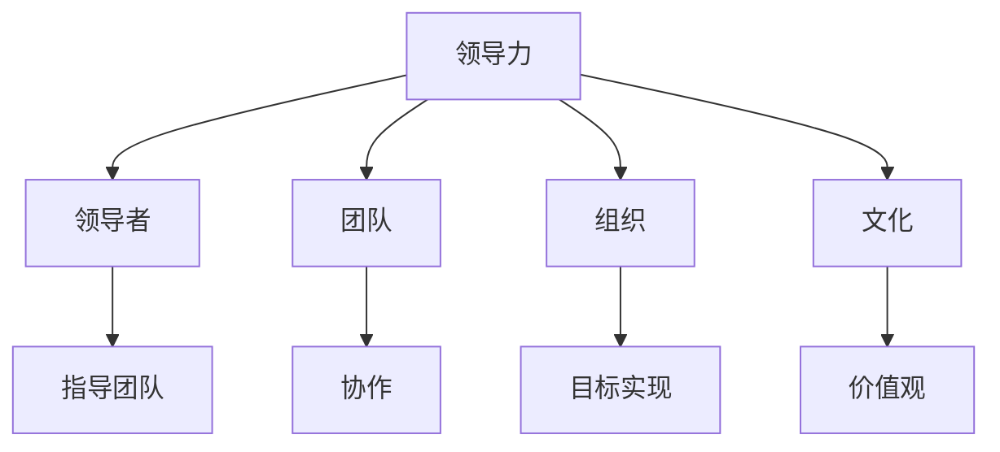
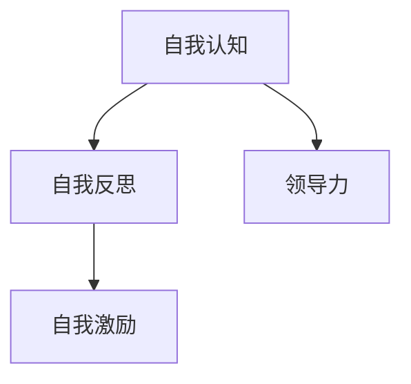
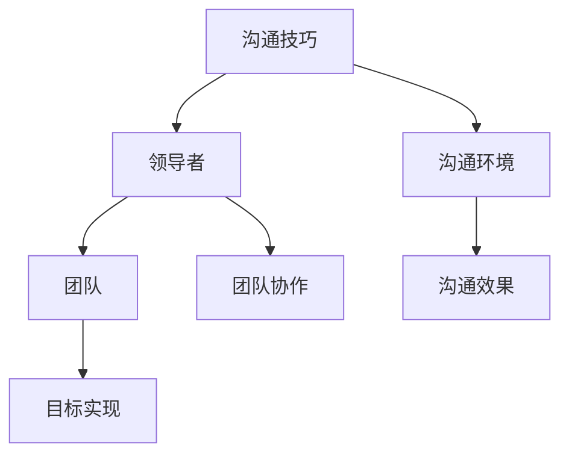
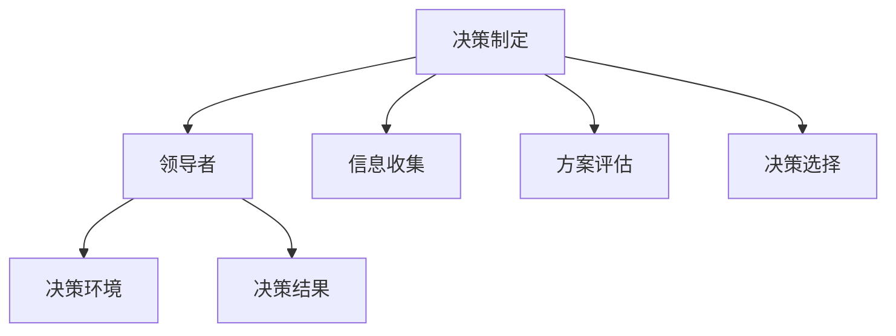
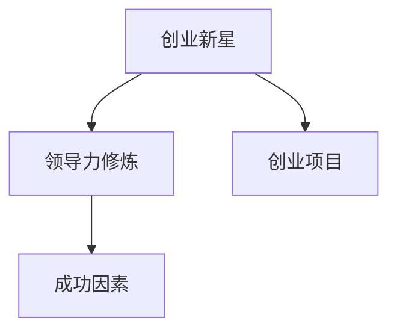

                 

### 文章标题

《领导力修炼笔记：90后创业新星的成长之路》

### 关键词

- 领导力
- 90后
- 创业新星
- 成长之路
- 个人品牌
- 团队建设
- 战略思维

### 摘要

本文旨在探讨90后创业新星在领导力修炼过程中的成长路径。通过对多个实际案例的深入分析，本文将揭示领导力的核心概念、类型及其实践应用，结合数学模型和公式，详细解析90后创业新星如何在创业道路上通过领导力修炼实现个人和团队的成长。文章最后，将提供一些最佳实践和注意事项，为读者提供全面的领导力修炼指南。

## 目录大纲设计思路

### 1. 确定核心主题

在设计《领导力修炼笔记：90后创业新星的成长之路》的目录大纲时，我们首先明确了核心主题——领导力和90后创业新星的成长之路。这两大主题相互交织，共同构成了文章的核心思想。

### 2. 确定章节结构

接下来，我们确定了文章的整体结构，将其分为三个主要部分：基础概念与理论、实践篇、以及进阶篇。每个部分都有明确的主题和目标，以确保文章的逻辑性和连贯性。

### 3. 设计章节内容

在每个章节中，我们细化了内容，包括核心概念与联系、核心算法原理讲解、数学模型和公式、项目实战等。这些内容的设计旨在帮助读者全面理解领导力的本质和应用，并能够将其应用于实际创业过程中。

### 4. 保持简洁性

在设计目录大纲时，我们始终坚持简洁性的原则，避免冗余内容，确保每个章节都有明确的主题和目标，从而提升读者的阅读体验。

### 5. 符合限制与要求

最后，我们确保目录大纲符合以下限制与要求：使用markdown格式、每级目录使用#、##、###标记、目录结构完整、大于7章、包含核心章节内容。

### 6. 文章格式要求

本文将按照markdown格式进行撰写，包括以下内容：

- 文章标题、关键词和摘要部分
- 目录大纲
- 正文内容，分为三个部分：基础概念与理论、实践篇、以及进阶篇
- 每个部分的章节内容，包括背景介绍、核心概念与联系、核心算法原理讲解、数学模型和公式、项目实战、最佳实践 tips、小结、注意事项、拓展阅读等

### 7. 作者信息

文章末尾将写上作者信息：“作者：AI天才研究院/AI Genius Institute & 禅与计算机程序设计艺术 /Zen And The Art of Computer Programming”

### 8. 完整性要求

本文将确保内容的完整性，包括以下核心内容：

- 背景介绍：对领导力和90后创业新星的概念进行详细阐述
- 核心概念与联系：使用Mermaid流程图展示领导力的核心概念及其相互关系
- 核心算法原理讲解：使用伪代码详细阐述领导力相关的核心算法原理
- 数学模型和公式：详细讲解领导力相关的数学模型和公式，并提供实例说明
- 项目实战：通过具体的创业案例，展示90后创业新星如何在实践中应用领导力
- 最佳实践 tips：提供一些有针对性的建议和技巧，帮助读者更好地实践领导力
- 小结：总结文章的主要观点和收获
- 注意事项：提醒读者在实践过程中需要注意的事项
- 拓展阅读：推荐一些相关书籍和文章，供读者进一步学习

通过以上设计思路和格式要求，我们力求打造一篇逻辑清晰、内容丰富、具有深度和实用性的领导力修炼笔记，为读者提供全方位的指导和支持。在接下来的文章中，我们将逐步深入探讨领导力的核心概念、实践方法以及90后创业新星的实际案例，帮助读者更好地理解和应用领导力，实现个人和团队的成长。

## 第1章 领导力的定义与类型

### 背景介绍

领导力是一种重要的能力，它不仅决定了个人和组织的发展方向，也影响了团队的凝聚力和效率。在当今复杂多变的社会环境中，领导力已经成为每个行业、每个企业都不可或缺的核心竞争力。特别是在创业领域，90后创业新星们凭借独特的视角和创新的思维方式，逐渐成为推动社会进步的重要力量。因此，理解领导力的定义、类型及其在不同场景中的应用，对于他们的成长和发展至关重要。

### 核心概念与联系

在探讨领导力之前，我们首先需要明确一些核心概念，这些概念相互关联，共同构成了领导力的理论体系。

#### 1. 领导力

领导力是指一种能够激发、引导和影响他人共同实现目标的能力。它不仅仅是职位赋予的权力，更是一种内在的素质和能力。

#### 2. 领导者

领导者是指那些具备领导力，能够指导和带领团队实现共同目标的人。

#### 3. 团队

团队是指由一群相互依赖、共同协作的人组成的整体，目标是实现共同的目标。

#### 4. 组织

组织是指一群人为了共同的目标而组成的正式结构，包括领导者和团队成员。

#### 5. 文化

文化是指组织内部共同遵循的价值观、信念和行为规范。

这些概念之间的关系可以用Mermaid流程图来展示：



从流程图中可以看出，领导力是核心概念，它贯穿于领导者、团队、组织和文化之中，是推动团队实现目标的重要动力。

### 核心算法原理讲解

在理解了领导力的基本概念之后，我们需要深入探讨领导力的核心算法原理。以下是一个简单的伪代码，用于描述领导力的基本流程：

```plaintext
算法：领导力核心算法

输入：目标（Goal），团队成员（Team）

输出：团队协作成果（Achievement）

1. 确定目标（Define Goal）
2. 分析团队成员的能力和特长（Analyze Team Members）
3. 分配任务（Assign Tasks）
4. 激励团队（Motivate Team）
5. 监督和反馈（Monitor & Feedback）
6. 调整策略（Adjust Strategy）
7. 实现目标（Achieve Goal）
```

### 数学模型和公式

领导力涉及多个数学模型和公式，以下是一个简单的例子：

#### 1. 领导力效能公式

$$E = f(P, C, T)$$

其中，\(E\) 表示领导力效能，\(P\) 表示个人素质，\(C\) 表示沟通能力，\(T\) 表示团队协作能力。

#### 2. 激励理论公式

$$M = f(I, E, R)$$

其中，\(M\) 表示激励水平，\(I\) 表示个体需求，\(E\) 表示工作环境，\(R\) 表示回报。

#### 3. 领导力与团队绩效关系模型

$$T = f(L, D, E)$$

其中，\(T\) 表示团队绩效，\(L\) 表示领导力水平，\(D\) 表示团队成员素质，\(E\) 表示环境因素。

### 实例说明

假设一个初创公司希望提高团队绩效，可以通过以下步骤进行：

1. **确定目标**：明确公司发展目标和团队目标。
2. **分析团队成员**：了解每个成员的能力和特长，分配合适的任务。
3. **激励团队**：根据团队成员的需求和激励理论，设计合理的激励方案。
4. **监督和反馈**：定期检查团队进度，提供及时反馈，帮助成员改进。
5. **调整策略**：根据反馈结果，调整团队工作和领导力策略。

通过以上步骤，公司可以逐步提高团队绩效，实现目标。

### 项目实战

为了更好地理解领导力在创业中的应用，我们可以通过一个实际案例来进行分析。

#### 案例背景

张华是一名90后创业者，他在大学时期就创立了一家科技公司。由于市场环境的快速变化和竞争的加剧，张华面临着巨大的压力。

#### 案例分析

1. **确定目标**：张华明确公司的短期和长期目标，包括市场份额、盈利能力等。
2. **分析团队成员**：张华了解每个团队成员的能力和特长，将其分配到合适的岗位上。
3. **激励团队**：张华设计了一套激励方案，包括股权激励、绩效奖金等，以激发团队成员的积极性。
4. **监督和反馈**：张华定期组织团队会议，讨论项目进度和存在的问题，提供及时反馈。
5. **调整策略**：根据市场变化和团队反馈，张华调整了公司的战略方向，优化了产品和服务。

最终，张华的公司在短短几年内迅速发展，取得了显著的业绩。

### 小结

通过本章的探讨，我们了解了领导力的定义、类型及其核心概念和算法原理。在实际应用中，领导力可以帮助创业者更好地管理团队、实现目标。对于90后创业新星来说，掌握领导力是他们在创业道路上取得成功的关键。

### 注意事项

1. 领导力不仅仅是职位赋予的权力，更是一种内在的素质和能力。
2. 在实际应用中，需要根据团队和环境的特点，灵活运用不同的领导力策略。
3. 定期进行团队沟通和反馈，有助于提升团队绩效和领导力水平。

### 拓展阅读

1. 《领导力的五个层次》
2. 《变革型领导力》
3. 《领导者的语言》

这些书籍和文章提供了更多的领导力理论和方法，有助于读者进一步学习和实践。

## 第2章 领导力与个人成长

### 背景介绍

领导力不仅仅是管理者或领导者才能掌握的技能，它同样适用于每个人的日常生活和职业发展。90后创业新星们在面对快速变化的市场环境和社会挑战时，个人成长和自我提升显得尤为重要。在这一章中，我们将探讨领导力与个人成长之间的关系，以及如何通过领导力修炼实现自我提升。

### 核心概念与联系

在探讨领导力与个人成长的关系时，我们需要明确以下几个核心概念：

#### 1. 自我认知

自我认知是指个体对自己性格、能力、价值观等方面的了解。自我认知是领导力修炼的基础，只有充分了解自己，才能更好地发挥自己的优势，弥补不足。

#### 2. 自我反思

自我反思是指个体在行动后对自身行为和结果的回顾与思考。通过自我反思，可以不断提升自己的思维能力和决策水平。

#### 3. 自我激励

自我激励是指个体通过内在的动力和信念，推动自己不断进步。自我激励是个人成长的重要动力，能够帮助个体克服困难，实现目标。

这些概念之间的关系可以用以下Mermaid流程图来表示：



从流程图中可以看出，自我认知是领导力修炼的起点，自我反思和自我激励则是领导力不断提升的动力来源。

### 核心算法原理讲解

在理解了领导力与个人成长的关系后，我们可以使用以下伪代码来描述个人成长的算法原理：

```plaintext
算法：个人成长算法

输入：初始状态（Initial State）

输出：成长状态（Grown State）

1. 确定目标（Define Goal）
2. 进行自我认知（Self-Awareness）
3. 进行自我反思（Self-Reflection）
4. 设定改进计划（Improve Plan）
5. 实施改进计划（Implement Plan）
6. 监测成长进度（Monitor Growth）
7. 调整目标和方法（Adjust Goal & Method）
8. 重复执行步骤2-7，直至达成目标
```

### 数学模型和公式

在个人成长过程中，以下数学模型和公式可以帮助我们更好地理解和评估成长速度：

#### 1. 成长速率公式

$$\text{Rate of Growth} = \frac{\text{Current State} - \text{Initial State}}{\text{Time Elapsed}}$$

其中，\(\text{Rate of Growth}\) 表示成长速率，\(\text{Current State}\) 表示当前状态，\(\text{Initial State}\) 表示初始状态，\(\text{Time Elapsed}\) 表示时间间隔。

#### 2. 自我激励公式

$$\text{Motivation} = \text{Intrinsic Motivation} + \text{Extrinsic Motivation}$$

其中，\(\text{Motivation}\) 表示自我激励水平，\(\text{Intrinsic Motivation}\) 表示内在激励，\(\text{Extrinsic Motivation}\) 表示外在激励。

#### 3. 成长评估模型

$$\text{Growth Assessment} = \text{Knowledge} + \text{Skills} + \text{Experience}$$

其中，\(\text{Growth Assessment}\) 表示成长评估，\(\text{Knowledge}\) 表示知识水平，\(\text{Skills}\) 表示技能水平，\(\text{Experience}\) 表示经验积累。

### 实例说明

假设一个创业者想要在一年内提升自己的领导力，可以通过以下步骤进行：

1. **确定目标**：明确提升领导力的具体目标，如提升沟通能力、团队管理能力等。
2. **进行自我认知**：评估自己的现有能力和不足，确定提升方向。
3. **进行自我反思**：在每日工作和生活中，回顾自己的行为和决策，分析成功和失败的原因。
4. **设定改进计划**：制定具体的行动计划，包括学习新知识、参加培训课程、实践管理等。
5. **实施改进计划**：按照计划执行，不断提升自己的领导力。
6. **监测成长进度**：定期评估自己的成长速度，调整目标和方法。
7. **调整目标和方法**：根据实际情况，适时调整提升计划。

通过以上步骤，创业者可以逐步提升自己的领导力，实现个人成长。

### 项目实战

为了更好地理解领导力与个人成长的关系，我们可以通过一个实际案例来进行分析。

#### 案例背景

李明是一名90后创业者，他在创办公司初期，面临着团队管理、市场开拓等多方面的挑战。

#### 案例分析

1. **确定目标**：李明明确公司发展的短期和长期目标，包括提升团队管理能力、扩大市场份额等。
2. **进行自我认知**：李明通过自我评估，发现自己在沟通能力和团队管理方面存在不足。
3. **进行自我反思**：李明定期反思自己的工作和决策，分析成功和失败的原因。
4. **设定改进计划**：李明制定了详细的提升计划，包括学习相关书籍、参加领导力培训课程、实践管理等。
5. **实施改进计划**：李明按照计划执行，不断提升自己的领导力。
6. **监测成长进度**：李明定期评估自己的成长速度，调整目标和方法。
7. **调整目标和方法**：根据实际情况，适时调整提升计划。

最终，李明的公司在短短几年内取得了显著的发展，团队管理能力和市场开拓能力也得到了大幅提升。

### 小结

通过本章的探讨，我们了解了领导力与个人成长之间的关系，以及如何通过领导力修炼实现自我提升。对于90后创业新星来说，个人成长是他们在创业道路上取得成功的关键。

### 注意事项

1. 个人成长需要长期坚持和持续努力，不能一蹴而就。
2. 定期进行自我反思和评估，有助于明确提升方向和目标。
3. 根据实际情况调整成长计划，确保计划的可操作性和有效性。

### 拓展阅读

1. 《自驱型成长》
2. 《深度工作》
3. 《高效能人士的七个习惯》

这些书籍和文章提供了更多的个人成长和领导力修炼的方法和技巧，有助于读者进一步学习和实践。

## 第3章 领导力与沟通技巧

### 背景介绍

沟通是领导力的核心要素之一，它不仅决定了团队内部的协作效率，也影响了组织与外部环境的互动。在90后创业新星的管理实践中，高效的沟通技巧是确保团队目标实现、提升团队凝聚力的重要手段。本章将探讨领导力与沟通技巧的关系，分析有效沟通的要素，并提供提升沟通技巧的方法。

### 核心概念与联系

在探讨领导力与沟通技巧的关系时，我们需要明确以下几个核心概念：

#### 1. 沟通技巧

沟通技巧是指个体在信息传递和交流过程中所采用的方法和策略，包括倾听、表达、非言语沟通等。

#### 2. 领导者

领导者是指那些具备领导力，能够指导和带领团队实现共同目标的人。

#### 3. 团队

团队是指由一群相互依赖、共同协作的人组成的整体，目标是实现共同的目标。

#### 4. 沟通环境

沟通环境是指沟通发生的具体场景和背景，包括组织文化、团队氛围等。

这些概念之间的关系可以用以下Mermaid流程图来表示：



从流程图中可以看出，沟通技巧是领导者与团队协作实现目标的重要工具，沟通环境直接影响沟通效果。

### 核心算法原理讲解

在理解了领导力与沟通技巧的关系后，我们可以使用以下伪代码来描述沟通技巧的算法原理：

```plaintext
算法：沟通技巧算法

输入：沟通目标（Communication Goal），沟通环境（Communication Environment）

输出：沟通效果（Communication Effect）

1. 确定沟通目标（Define Communication Goal）
2. 分析沟通环境（Analyze Communication Environment）
3. 选择合适的沟通技巧（Choose Communication Skills）
4. 实施沟通策略（Implement Communication Strategy）
5. 监测沟通效果（Monitor Communication Effect）
6. 调整沟通策略（Adjust Communication Strategy）
7. 实现沟通目标（Achieve Communication Goal）
```

### 数学模型和公式

在沟通技巧中，以下数学模型和公式可以帮助我们更好地理解和评估沟通效果：

#### 1. 沟通效果评估公式

$$\text{Effectiveness} = \frac{\text{目标达成度} \times \text{信息准确性}}{\text{沟通成本}}$$

其中，\(\text{Effectiveness}\) 表示沟通效果，\(\text{目标达成度}\) 表示目标实现的程度，\(\text{信息准确性}\) 表示信息传递的准确性，\(\text{沟通成本}\) 表示沟通过程中所付出的时间、精力和资源。

#### 2. 沟通障碍公式

$$\text{Barrier} = \text{语言障碍} + \text{文化障碍} + \text{心理障碍}$$

其中，\(\text{Barrier}\) 表示沟通障碍，\(\text{语言障碍}\) 表示由于语言不同而导致的沟通困难，\(\text{文化障碍}\) 表示由于文化差异而导致的沟通障碍，\(\text{心理障碍}\) 表示由于个体心理状态不同而导致的沟通障碍。

#### 3. 沟通频率模型

$$\text{Frequency} = \frac{\text{沟通需求}}{\text{时间资源}}$$

其中，\(\text{Frequency}\) 表示沟通频率，\(\text{沟通需求}\) 表示需要沟通的次数或内容，\(\text{时间资源}\) 表示可用于沟通的时间。

### 实例说明

假设一个团队需要在短时间内完成一个项目，可以通过以下步骤进行高效沟通：

1. **确定沟通目标**：明确项目目标和所需信息。
2. **分析沟通环境**：了解团队成员的语言能力、文化背景和心理状态。
3. **选择合适的沟通技巧**：根据沟通环境和目标，选择合适的沟通技巧，如书面沟通、口头沟通、视频会议等。
4. **实施沟通策略**：按照沟通策略执行，确保信息传递的准确性和及时性。
5. **监测沟通效果**：定期评估沟通效果，确保目标达成度。
6. **调整沟通策略**：根据沟通效果，调整沟通策略，提高沟通效率。

通过以上步骤，团队可以高效地完成项目。

### 项目实战

为了更好地理解领导力与沟通技巧的关系，我们可以通过一个实际案例来进行分析。

#### 案例背景

王丽是一名90后创业者，她在管理团队时，发现沟通不畅成为团队发展的瓶颈。

#### 案例分析

1. **确定沟通目标**：王丽明确团队需要高效沟通，确保项目顺利进行。
2. **分析沟通环境**：王丽了解到团队中有成员来自不同文化背景，沟通存在障碍。
3. **选择合适的沟通技巧**：王丽决定采用视频会议和书面报告相结合的方式进行沟通。
4. **实施沟通策略**：王丽按照沟通策略执行，确保信息传递的准确性和及时性。
5. **监测沟通效果**：王丽定期评估沟通效果，并根据反馈调整沟通策略。
6. **调整沟通策略**：王丽发现书面报告不如视频会议直观，决定增加视频会议的频率。

最终，团队沟通效率显著提升，项目也顺利完成。

### 小结

通过本章的探讨，我们了解了领导力与沟通技巧之间的关系，以及如何通过有效的沟通技巧提升团队绩效。对于90后创业新星来说，掌握高效的沟通技巧是他们在创业道路上取得成功的重要保障。

### 注意事项

1. 沟通技巧的提升需要长期坚持和不断练习。
2. 了解团队成员的文化背景和心理状态，选择合适的沟通方式。
3. 定期评估沟通效果，根据反馈调整沟通策略。

### 拓展阅读

1. 《沟通的艺术》
2. 《非暴力沟通》
3. 《高效沟通》

这些书籍和文章提供了更多的沟通技巧和策略，有助于读者进一步学习和实践。

## 第4章 领导力与决策制定

### 背景介绍

在创业过程中，决策制定是领导者必须面对的重要环节。领导力与决策制定密切相关，高效的决策能力直接影响到企业的生存和发展。90后创业新星们在快速变化的市场环境中，需要具备敏锐的洞察力、果断的判断力和科学的决策方法。本章将探讨领导力与决策制定的关系，分析决策制定的过程、工具和方法，以及如何在决策过程中应对挑战。

### 核心概念与联系

在探讨领导力与决策制定的关系时，我们需要明确以下几个核心概念：

#### 1. 决策制定

决策制定是指个体或团队在面对问题或机会时，通过分析、评估和选择，作出合理决策的过程。

#### 2. 领导者

领导者是指那些具备领导力，能够指导和带领团队实现共同目标的人。

#### 3. 决策环境

决策环境是指决策过程中所处的具体情境和背景，包括市场环境、竞争态势、资源限制等。

#### 4. 决策结果

决策结果是指决策执行后的效果和反馈，包括目标的实现程度、资源的利用效率等。

这些概念之间的关系可以用以下Mermaid流程图来表示：



从流程图中可以看出，决策制定是领导力的重要组成部分，领导者需要通过信息收集、方案评估和决策选择等环节，科学地制定决策，并关注决策结果，以持续优化决策过程。

### 核心算法原理讲解

在理解了领导力与决策制定的关系后，我们可以使用以下伪代码来描述决策制定的算法原理：

```plaintext
算法：决策制定算法

输入：问题（Problem），决策目标（Decision Goal），决策环境（Decision Environment）

输出：最佳决策方案（Best Decision Solution）

1. 确定决策目标（Define Decision Goal）
2. 收集相关信息（Collect Information）
3. 分析决策环境（Analyze Decision Environment）
4. 生成备选方案（Generate Options）
5. 评估备选方案（Evaluate Options）
6. 选择最佳方案（Select Best Option）
7. 执行决策方案（Implement Decision Solution）
8. 监测决策效果（Monitor Decision Effect）
9. 反馈和调整（Feedback & Adjustment）
10. 持续优化决策过程（Optimize Decision Process）
```

### 数学模型和公式

在决策制定过程中，以下数学模型和公式可以帮助我们更好地理解和评估决策效果：

#### 1. 决策效果评估模型

$$\text{Effectiveness} = \frac{\text{目标达成度} \times \text{资源利用效率}}{\text{决策成本}}$$

其中，\(\text{Effectiveness}\) 表示决策效果，\(\text{目标达成度}\) 表示决策实现目标的程度，\(\text{资源利用效率}\) 表示决策过程中资源的利用程度，\(\text{决策成本}\) 表示决策过程中所付出的时间、精力和资源。

#### 2. 决策风险模型

$$\text{Risk} = \text{概率} \times \text{损失}$$

其中，\(\text{Risk}\) 表示决策风险，\(\text{概率}\) 表示决策方案失败的概率，\(\text{损失}\) 表示决策方案失败导致的损失。

#### 3. 决策偏好模型

$$\text{Preference} = \text{个体偏好} + \text{社会偏好}$$

其中，\(\text{Preference}\) 表示决策偏好，\(\text{个体偏好}\) 表示个体在决策过程中所体现的偏好，\(\text{社会偏好}\) 表示在团队或组织决策过程中所体现的偏好。

### 实例说明

假设一家创业公司需要在市场推广方面作出决策，可以通过以下步骤进行：

1. **确定决策目标**：明确市场推广的目标，如提高品牌知名度、增加销售额等。
2. **收集相关信息**：了解市场环境、竞争对手、目标客户等。
3. **分析决策环境**：评估公司资源、市场容量、竞争态势等。
4. **生成备选方案**：制定多种市场推广方案，如线上广告、线下活动、公关合作等。
5. **评估备选方案**：根据决策效果评估模型和决策风险模型，评估各方案的效果和风险。
6. **选择最佳方案**：选择综合效果最佳的方案。
7. **执行决策方案**：按照决策方案实施市场推广活动。
8. **监测决策效果**：定期评估市场推广活动的效果，如品牌知名度、销售额等。
9. **反馈和调整**：根据市场反馈，调整市场推广策略。
10. **持续优化决策过程**：总结经验教训，优化决策流程和方法。

通过以上步骤，创业公司可以科学地制定市场推广决策，提高决策效果。

### 项目实战

为了更好地理解领导力与决策制定的关系，我们可以通过一个实际案例来进行分析。

#### 案例背景

张晓是一名90后创业者，他在公司面临市场份额下降的危机时，需要作出重要的决策。

#### 案例分析

1. **确定决策目标**：张晓明确公司需要提升市场份额，恢复竞争力。
2. **收集相关信息**：张晓了解市场环境、竞争对手、客户需求等。
3. **分析决策环境**：张晓评估公司资源、市场容量、竞争态势等。
4. **生成备选方案**：张晓制定多种提升市场份额的方案，如产品升级、市场拓展、广告投放等。
5. **评估备选方案**：根据决策效果评估模型和决策风险模型，评估各方案的效果和风险。
6. **选择最佳方案**：张晓选择产品升级和市场拓展相结合的方案，因为这两个方案综合效果最佳。
7. **执行决策方案**：张晓按照决策方案实施产品升级和市场拓展。
8. **监测决策效果**：张晓定期评估产品升级和市场拓展的效果，如市场份额、销售额等。
9. **反馈和调整**：根据市场反馈，张晓调整产品升级和市场拓展的策略。
10. **持续优化决策过程**：张晓总结经验教训，优化决策流程和方法。

最终，张晓的公司成功提升了市场份额，恢复了竞争力。

### 小结

通过本章的探讨，我们了解了领导力与决策制定的关系，以及如何通过科学的决策过程和方法，提高决策效果。对于90后创业新星来说，掌握高效的决策能力是他们在创业道路上取得成功的重要保障。

### 注意事项

1. 决策制定需要充分收集和分析信息，确保决策的准确性。
2. 考虑决策风险，选择风险可控的方案。
3. 定期评估决策效果，及时调整决策策略。

### 拓展阅读

1. 《决策与判断》
2. 《决策分析》
3. 《商业决策》

这些书籍和文章提供了更多的决策制定方法和策略，有助于读者进一步学习和实践。

## 第5章 90后创业新星案例研究

### 背景介绍

90后创业新星们凭借其独特的视角、创新的思维和强大的执行力，在创业领域取得了显著的成绩。本章将通过几个具体的案例，深入分析这些创业新星的领导力修炼过程，从中提取关键经验和教训，以期为其他创业者提供有价值的参考。

### 核心概念与联系

在本章中，我们将探讨以下几个核心概念：

#### 1. 创业新星

创业新星是指那些年龄在30岁以下，拥有创新性创业项目，并取得显著成绩的年轻创业者。

#### 2. 领导力修炼

领导力修炼是指通过不断学习、实践和反思，提升领导能力的过程。

#### 3. 成功因素

成功因素是指影响创业项目成功的关键因素，包括创新、执行力、团队建设、资源管理等。

这些概念之间的关系可以用以下Mermaid流程图来表示：



从流程图中可以看出，创业新星通过领导力修炼，影响和塑造成功因素，最终实现创业项目的成功。

### 案例一：从零到一，创业初期的领导力修炼

#### 案例背景

李华是一名90后创业者，他在大学期间创办了一家专注于环保科技的初创公司。公司初创阶段面临诸多挑战，如资金短缺、技术难题、市场竞争等。然而，李华凭借其出色的领导力，逐步克服了这些困难，实现了公司从零到一的突破。

#### 案例分析

1. **确定目标和愿景**：李华明确公司愿景，即通过科技创新，解决环境问题，为可持续发展贡献力量。这一愿景成为公司全体成员的共同目标。
2. **组建核心团队**：李华重视团队建设，通过招聘和内部培养，组建了一支具有专业能力和共同价值观的核心团队。团队成员之间相互信任，协同合作。
3. **激励和培养员工**：李华采用多种激励措施，如股权激励、绩效奖金等，激发员工的积极性和创造力。同时，他重视员工成长，提供培训和晋升机会，帮助员工不断提升自身能力。
4. **应对技术难题**：在技术研发过程中，李华带领团队不断尝试、失败和改进，最终成功突破技术难关，开发出具有竞争力的环保产品。
5. **市场拓展和品牌建设**：李华积极开拓市场，通过参加展会、合作推广等方式，提升公司品牌知名度。同时，他注重客户反馈，不断优化产品和服务，赢得客户的信任和好评。

#### 案例总结

李华的成功在于他出色的领导力修炼，包括确定目标和愿景、组建核心团队、激励和培养员工、应对技术难题以及市场拓展和品牌建设。这些经验为其他创业者提供了宝贵的参考。

### 案例二：逆境中的领导力，如何在困境中崛起

#### 案例背景

张晓是一名90后创业者，他在创办一家智能硬件公司后，遇到了一系列困境，如市场萎缩、竞争对手压力、资金短缺等。然而，张晓并没有放弃，他通过逆境中的领导力修炼，带领公司逐步走出困境，实现了逆袭。

#### 案例分析

1. **逆境中的调整和优化**：张晓意识到公司面临的问题，他迅速调整战略，优化产品和服务，以适应市场需求。同时，他加强对市场趋势的洞察，提前布局新兴领域。
2. **积极寻求外部资源**：张晓积极寻求外部投资和合作机会，通过融资和战略合作，解决资金短缺问题。他还积极参加创业比赛和研讨会，拓展人脉资源。
3. **激发团队潜力**：张晓重视团队建设，鼓励员工提出创新建议，并在公司内部推行创新激励机制。通过这种方式，他激发了团队的创造力和执行力，为公司发展注入新的活力。
4. **保持乐观和坚定信念**：面对困境，张晓始终保持乐观和坚定信念，他相信只要坚持努力，公司一定能够走出困境。这种乐观态度也感染了团队成员，增强了团队凝聚力。
5. **持续学习和自我提升**：张晓重视个人成长，通过学习新知识、参加培训课程、阅读相关书籍等方式，不断提升自己的领导力和管理能力。

#### 案例总结

张晓的成功在于他出色的逆境中的领导力修炼，包括调整和优化策略、积极寻求外部资源、激发团队潜力、保持乐观和坚定信念以及持续学习和自我提升。这些经验为其他创业者提供了宝贵的启示。

### 案例三：从单点突破到全面布局，领导力的进阶之路

#### 案例背景

王伟是一名90后创业者，他在创办一家互联网公司后，通过领导力的不断修炼，实现了从单点突破到全面布局的转变，带领公司成为行业领军者。

#### 案例分析

1. **战略规划和布局**：王伟意识到单点突破不足以支撑公司的长远发展，他开始进行战略规划和布局，确定公司的长期发展目标。通过市场调研和竞争分析，他制定了详细的战略规划，包括产品线扩展、市场拓展、技术升级等。
2. **团队建设和文化塑造**：王伟重视团队建设，通过招聘和内部培养，打造了一支具备高专业素养和协作能力的团队。同时，他注重公司文化的建设，倡导创新、协作、开放的企业文化，营造良好的工作氛围。
3. **资源整合和优化配置**：王伟积极整合内外部资源，通过融资、战略合作、技术创新等方式，优化公司的资源配置，提高资源利用效率。他还注重人力资源的管理，优化员工激励机制，提升员工满意度和忠诚度。
4. **创新和持续发展**：王伟鼓励团队进行创新，不断推出新产品和服务，保持公司的市场竞争力。同时，他关注行业发展趋势，提前布局新兴领域，确保公司的可持续发展。
5. **领导力和个人品牌**：王伟不断提升自己的领导力和管理能力，通过参加各类培训和研讨会，学习先进的管理理念和经验。他还注重个人品牌建设，通过演讲、发表文章等方式，提升自己的影响力和知名度。

#### 案例总结

王伟的成功在于他出色的领导力修炼，包括战略规划和布局、团队建设和文化塑造、资源整合和优化配置、创新和持续发展以及领导力和个人品牌建设。这些经验为其他创业者提供了宝贵的借鉴。

### 小结

通过以上案例研究，我们可以看到，90后创业新星们通过领导力修炼，克服了创业过程中的各种困难，实现了公司的快速发展。他们的成功经验为其他创业者提供了宝贵的启示，包括确定目标和愿景、组建核心团队、激励和培养员工、应对技术难题、市场拓展和品牌建设、逆境中的调整和优化、积极寻求外部资源、激发团队潜力、保持乐观和坚定信念、持续学习和自我提升、战略规划和布局、团队建设和文化塑造、资源整合和优化配置、创新和持续发展、领导力和个人品牌建设等。这些经验对于其他创业者具有重要的参考价值。

### 注意事项

1. 领导力修炼需要长期坚持和不断努力，不能一蹴而就。
2. 根据实际情况调整领导力策略，确保策略的有效性。
3. 注重团队建设和文化建设，提升团队凝聚力和执行力。

### 拓展阅读

1. 《创业维艰》
2. 《创新者的窘境》
3. 《创业者的心路历程》

这些书籍和文章提供了更多的创业经验和领导力修炼的方法和技巧，有助于读者进一步学习和实践。

## 第6章 领导力修炼的关键技巧

### 背景介绍

在领导力修炼过程中，掌握关键技巧是提升领导能力的重要途径。对于90后创业新星来说，掌握这些关键技巧有助于他们在创业道路上更加游刃有余，实现个人和团队的成长。本章将重点介绍几个领导力修炼的关键技巧，包括建立信任、自我反思和激励团队等，并提供相应的实践方法。

### 核心概念与联系

在探讨领导力修炼的关键技巧时，我们需要明确以下几个核心概念：

#### 1. 建立信任

建立信任是指领导者通过言行一致、诚实守信等方式，赢得团队成员的信任和尊重。

#### 2. 自我反思

自我反思是指领导者对自己的行为、决策和结果进行深入思考和分析，以不断提升自己的领导能力。

#### 3. 激励团队

激励团队是指领导者通过提供激励措施，激发团队成员的积极性和创造力。

这些概念相互联系，共同构成了领导力修炼的重要方面。建立信任是领导力成功的基础，自我反思是领导力提升的关键，激励团队则是实现团队目标的重要手段。

### 核心算法原理讲解

在理解了领导力修炼的关键技巧后，我们可以使用以下伪代码来描述这些技巧的算法原理：

```plaintext
算法：领导力修炼关键技巧

输入：领导者（Leader），团队成员（Team）

输出：信任水平（Trust Level），自我反思能力（Self-Reflection Ability），团队激励效果（Team Motivation Effect）

1. 建立信任（Establish Trust）
   - 行为一致（Consistency）
   - 诚实守信（Honesty）
   - 公平公正（Fairness）

2. 自我反思（Self-Reflection）
   - 分析行为（Analyze Behavior）
   - 总结经验（Summarize Experience）
   - 制定改进计划（Improve Plan）

3. 激励团队（Motivate Team）
   - 提供激励措施（Provide Incentives）
   - 激发创造力（Stimulate Creativity）
   - 增强团队凝聚力（Enhance Team Cohesion）

4. 监测效果（Monitor Effect）
   - 评估信任水平（Assess Trust Level）
   - 评估自我反思能力（Assess Self-Reflection Ability）
   - 评估团队激励效果（Assess Team Motivation Effect）

5. 调整策略（Adjust Strategy）
   - 根据评估结果，调整建立信任、自我反思和激励团队的方法
```

### 数学模型和公式

在领导力修炼过程中，以下数学模型和公式可以帮助我们更好地理解和评估关键技巧的效果：

#### 1. 信任水平公式

$$\text{Trust Level} = \frac{\text{信任行为次数} \times \text{团队成员感知度}}{\text{总行为次数}}$$

其中，\(\text{Trust Level}\) 表示信任水平，\(\text{信任行为次数}\) 表示领导者表现出的信任行为次数，\(\text{团队成员感知度}\) 表示团队成员对领导者信任行为的感知程度，\(\text{总行为次数}\) 表示领导者的总行为次数。

#### 2. 自我反思能力公式

$$\text{Self-Reflection Ability} = \frac{\text{反思行为次数} \times \text{反思深度}}{\text{总行为次数}}$$

其中，\(\text{Self-Reflection Ability}\) 表示自我反思能力，\(\text{反思行为次数}\) 表示领导者进行反思的行为次数，\(\text{反思深度}\) 表示领导者反思的深度和广度，\(\text{总行为次数}\) 表示领导者的总行为次数。

#### 3. 团队激励效果公式

$$\text{Team Motivation Effect} = \frac{\text{激励措施效果} \times \text{团队成员积极性}}{\text{总激励措施}}$$

其中，\(\text{Team Motivation Effect}\) 表示团队激励效果，\(\text{激励措施效果}\) 表示激励措施对团队成员产生的影响，\(\text{团队成员积极性}\) 表示团队成员对激励措施的响应程度，\(\text{总激励措施}\) 表示所有激励措施的总和。

### 实例说明

假设一位领导者想要提升团队信任水平，可以采取以下步骤：

1. **建立信任**：通过言行一致、诚实守信和公平公正的行为，赢得团队成员的信任。例如，按时完成任务、兑现承诺、公平分配资源等。
2. **监测信任水平**：定期评估团队成员对领导者的信任程度，了解信任水平的变化情况。可以使用信任水平公式计算信任水平。
3. **调整策略**：根据信任水平的评估结果，调整建立信任的方法，如增加诚实守信的行为、提高公平公正的程度等。

通过以上步骤，领导者可以逐步提升团队信任水平，为团队协作奠定坚实基础。

### 项目实战

为了更好地理解领导力修炼的关键技巧，我们可以通过一个实际案例来进行分析。

#### 案例背景

陈明是一名90后创业者，他领导一家初创公司。在团队管理过程中，陈明发现团队成员之间的信任水平较低，影响了团队协作效率。

#### 案例分析

1. **建立信任**：陈明通过言行一致、诚实守信和公平公正的行为，逐步赢得团队成员的信任。例如，他按时完成任务、兑现承诺、公平分配资源等。
2. **自我反思**：陈明定期对自己的行为和决策进行反思，分析成功和失败的原因，并制定改进计划。例如，他发现自己有时过于急躁，导致团队成员压力过大，于是他调整了自己的沟通方式，更加耐心和细致。
3. **激励团队**：陈明提供多种激励措施，如绩效奖金、晋升机会、培训等，激发团队成员的积极性和创造力。例如，他根据团队成员的贡献和表现，给予相应的奖金和晋升机会。

#### 案例总结

通过领导力修炼的关键技巧，陈明逐步提升了团队信任水平，增强了团队凝聚力，提高了团队协作效率。这些技巧不仅帮助陈明解决了团队管理中的问题，也为公司的快速发展奠定了基础。

### 小结

通过本章的探讨，我们了解了领导力修炼的关键技巧，包括建立信任、自我反思和激励团队等。这些技巧是提升领导能力的重要手段，对于90后创业新星来说，掌握这些技巧有助于他们在创业道路上更加顺利地实现个人和团队的成长。

### 注意事项

1. 建立信任需要长期坚持和持续努力，不能一蹴而就。
2. 自我反思需要真诚和勇气，勇于面对自己的不足和错误。
3. 激励团队需要根据实际情况，制定合理的激励措施。

### 拓展阅读

1. 《建立信任的五大法则》
2. 《自我反思的艺术》
3. 《激励团队的七种策略》

这些书籍和文章提供了更多的领导力修炼技巧和实践方法，有助于读者进一步学习和实践。

## 第7章 领导力修炼的进阶之路

### 背景介绍

随着创业环境的不断变化和市场竞争的日益激烈，90后创业新星们需要不断提升自己的领导力，以应对复杂多变的商业环境。领导力修炼不仅包括基础技巧的掌握，还需要在进阶层面进行深入探索，包括战略思维、创新能力和变革领导力等。本章将探讨领导力修炼的进阶之路，分析高级领导力技巧的应用，以及如何通过战略思维和创新能力推动组织发展。

### 核心概念与联系

在探讨领导力修炼的进阶之路时，我们需要明确以下几个核心概念：

#### 1. 战略思维

战略思维是指领导者从长远和整体的角度，对组织的未来发展进行规划和布局的能力。

#### 2. 创新能力

创新能力是指领导者通过创新思维和方法，推动组织发展，实现持续竞争力的能力。

#### 3. 变革领导力

变革领导力是指领导者引导组织进行变革，适应外部环境变化，实现组织转型的能力。

这些概念相互联系，共同构成了领导力修炼的进阶层面。战略思维是领导者进行长远规划和布局的基础，创新能力是推动组织发展的动力，变革领导力则是应对外部环境变化的必要手段。

### 核心算法原理讲解

在理解了领导力修炼的进阶之路后，我们可以使用以下伪代码来描述高级领导力技巧的算法原理：

```plaintext
算法：高级领导力技巧

输入：领导者（Leader），组织（Organization）

输出：战略布局（Strategic Layout），创新能力（Innovation Ability），变革领导力（Change Leadership）

1. 确定战略目标（Define Strategic Goals）
   - 分析市场趋势（Analyze Market Trends）
   - 评估资源状况（Evaluate Resource Status）
   - 设定长期目标（Set Long-term Goals）

2. 发展战略思维（Develop Strategic Thinking）
   - 拓展视野（Expand Horizon）
   - 深度分析（Deep Analysis）
   - 系统性思考（Systematic Thinking）

3. 培养创新能力（Cultivate Innovation Ability）
   - 鼓励创新思维（Encourage Innovative Thinking）
   - 推动技术进步（Drive Technological Progress）
   - 实施创新项目（Implement Innovation Projects）

4. 引导变革领导力（Guide Change Leadership）
   - 识别变革需求（Identify Change Needs）
   - 制定变革计划（Develop Change Plan）
   - 推动变革实施（Drive Change Implementation）

5. 监测和调整（Monitor and Adjust）
   - 评估战略布局效果（Assess Strategic Layout Effect）
   - 评估创新能力效果（Assess Innovation Ability Effect）
   - 评估变革领导力效果（Assess Change Leadership Effect）
   - 根据评估结果调整策略（Adjust Strategy Based on Assessment Results）
```

### 数学模型和公式

在领导力修炼的进阶之路中，以下数学模型和公式可以帮助我们更好地理解和评估高级领导力技巧的效果：

#### 1. 战略布局效果评估模型

$$\text{Effectiveness of Strategic Layout} = \frac{\text{目标达成度} \times \text{资源利用效率}}{\text{战略成本}}$$

其中，\(\text{Effectiveness of Strategic Layout}\) 表示战略布局效果，\(\text{目标达成度}\) 表示战略目标实现的程度，\(\text{资源利用效率}\) 表示战略过程中资源的利用程度，\(\text{战略成本}\) 表示战略过程中所付出的时间、精力和资源。

#### 2. 创新能力评估模型

$$\text{Innovation Ability} = \frac{\text{创新成果} \times \text{市场接受度}}{\text{创新成本}}$$

其中，\(\text{Innovation Ability}\) 表示创新能力，\(\text{创新成果}\) 表示创新项目或产品的实际效果，\(\text{市场接受度}\) 表示市场对创新项目或产品的接受程度，\(\text{创新成本}\) 表示创新过程中所付出的时间、精力和资源。

#### 3. 变革领导力评估模型

$$\text{Effectiveness of Change Leadership} = \frac{\text{变革成功度} \times \text{组织适应度}}{\text{变革成本}}$$

其中，\(\text{Effectiveness of Change Leadership}\) 表示变革领导力效果，\(\text{变革成功度}\) 表示变革项目或策略的成功程度，\(\text{组织适应度}\) 表示组织对变革的适应程度，\(\text{变革成本}\) 表示变革过程中所付出的时间、精力和资源。

### 实例说明

假设一家创业公司希望在短时间内实现战略布局，可以通过以下步骤进行：

1. **确定战略目标**：明确公司的发展方向和目标，如扩大市场份额、提升品牌知名度等。
2. **发展战略思维**：分析市场趋势、竞争对手和自身优势，制定合适的战略布局。
3. **培养创新能力**：鼓励团队进行创新，推动技术进步，实施创新项目，提升市场竞争力。
4. **引导变革领导力**：识别变革需求，制定变革计划，推动变革实施，确保组织能够适应市场变化。
5. **监测和调整**：定期评估战略布局效果、创新能力效果和变革领导力效果，根据评估结果调整战略布局、创新计划和变革计划。

通过以上步骤，创业公司可以有效地实现战略布局，提升组织竞争力。

### 项目实战

为了更好地理解领导力修炼的进阶之路，我们可以通过一个实际案例来进行分析。

#### 案例背景

赵强是一名90后创业者，他在创办一家互联网公司后，面临着市场竞争加剧、技术更新快速等挑战。

#### 案例分析

1. **确定战略目标**：赵强明确公司的发展目标是扩大市场份额，提升品牌知名度。
2. **发展战略思维**：赵强分析市场趋势、竞争对手和自身优势，制定了详细的战略布局，包括产品创新、市场拓展、品牌建设等。
3. **培养创新能力**：赵强鼓励团队进行创新，推动技术进步，推出了一系列创新产品，提升了市场竞争力。
4. **引导变革领导力**：赵强识别变革需求，制定了变革计划，包括组织结构调整、流程优化等，推动了组织的持续改进。
5. **监测和调整**：赵强定期评估战略布局效果、创新能力效果和变革领导力效果，根据评估结果调整战略布局、创新计划和变革计划。

#### 案例总结

赵强通过领导力修炼的进阶之路，成功地实现了公司的战略布局，提升了创新能力，推动了组织变革，使公司能够在激烈的市场竞争中立于不败之地。

### 小结

通过本章的探讨，我们了解了领导力修炼的进阶之路，包括战略思维、创新能力和变革领导力等高级领导力技巧。这些技巧是提升领导能力的重要手段，对于90后创业新星来说，掌握这些技巧有助于他们在创业道路上更加顺利地实现个人和团队的成长。

### 注意事项

1. 战略思维需要从长远和整体的角度进行规划和布局，不能急功近利。
2. 创新能力需要持续投入和培养，不能一蹴而就。
3. 变革领导力需要识别需求、制定计划并推动实施，不能逃避变革。

### 拓展阅读

1. 《战略思维》
2. 《创新能力》
3. 《变革领导力》

这些书籍和文章提供了更多的领导力修炼技巧和实践方法，有助于读者进一步学习和实践。

## 第8章 领导力修炼与个人成长

### 背景介绍

领导力修炼不仅是提升管理能力和实现职业发展的关键，也是个人成长的重要途径。在90后创业新星的成长过程中，领导力修炼扮演着至关重要的角色。通过领导力修炼，他们不仅能够更好地管理团队，实现企业目标，还能在个人成长道路上不断突破自我，实现全面的发展。本章将深入探讨领导力修炼对个人成长的影响，并提供一些实用的方法和技巧。

### 核心概念与联系

在探讨领导力修炼与个人成长的关系时，我们需要明确以下几个核心概念：

#### 1. 个人成长

个人成长是指个体在知识、技能、态度和价值观等方面不断提升的过程。

#### 2. 领导力修炼

领导力修炼是指通过学习、实践和反思，提升领导能力和管理水平的过程。

#### 3. 自我认知

自我认知是指个体对自己性格、能力、价值观等方面的了解。

这些概念相互联系，共同构成了领导力修炼与个人成长的关系。个人成长是领导力修炼的目标，领导力修炼是个人成长的重要手段，自我认知则是领导力修炼和个人成长的基础。

### 核心算法原理讲解

在理解了领导力修炼与个人成长的关系后，我们可以使用以下伪代码来描述个人成长和领导力修炼的算法原理：

```plaintext
算法：个人成长与领导力修炼

输入：初始状态（Initial State），目标状态（Goal State）

输出：成长状态（Grown State）

1. 确定个人成长目标（Define Personal Growth Goals）
2. 分析自我认知（Analyze Self-awareness）
3. 制定领导力修炼计划（Develop Leadership Development Plan）
4. 实施领导力修炼计划（Implement Leadership Development Plan）
5. 监测成长进度（Monitor Growth Progress）
6. 反馈和调整（Feedback & Adjustment）
7. 实现目标状态（Achieve Goal State）
```

### 数学模型和公式

在领导力修炼与个人成长的过程中，以下数学模型和公式可以帮助我们更好地理解和评估成长速度：

#### 1. 成长速率公式

$$\text{Rate of Growth} = \frac{\text{当前状态} - \text{初始状态}}{\text{时间间隔}}$$

其中，\(\text{Rate of Growth}\) 表示成长速率，\(\text{当前状态}\) 表示当前的个人成长水平，\(\text{初始状态}\) 表示初始的个人成长水平，\(\text{时间间隔}\) 表示成长的持续时间。

#### 2. 自我认知模型

$$\text{Self-awareness} = \frac{\text{自我认知得分}}{\text{满分}}$$

其中，\(\text{Self-awareness}\) 表示自我认知程度，\(\text{自我认知得分}\) 表示个人在自我认知测试中取得的分数，\(\text{满分}\) 表示自我认知测试的总分。

#### 3. 领导力修炼效果模型

$$\text{Effectiveness of Leadership Development} = \frac{\text{领导力提升得分}}{\text{初始领导力得分}}$$

其中，\(\text{Effectiveness of Leadership Development}\) 表示领导力修炼效果，\(\text{领导力提升得分}\) 表示领导力测试中取得的分数提升值，\(\text{初始领导力得分}\) 表示领导力测试中的初始分数。

### 实例说明

假设一个创业者希望通过领导力修炼实现个人成长，可以按照以下步骤进行：

1. **确定个人成长目标**：明确自己希望提升的方面，如沟通能力、团队管理能力等。
2. **分析自我认知**：通过自我反思和测试，了解自己在这些方面的优势和不足。
3. **制定领导力修炼计划**：根据自我认知结果，制定具体的修炼计划，包括阅读相关书籍、参加培训课程、实践管理等。
4. **实施领导力修炼计划**：按照计划执行，不断提升自己的领导力和个人成长水平。
5. **监测成长进度**：定期进行自我评估，了解自己的成长速度和效果。
6. **反馈和调整**：根据评估结果，调整修炼计划，确保目标的实现。
7. **实现目标状态**：通过持续的努力，达到自己设定的个人成长目标。

### 项目实战

为了更好地理解领导力修炼与个人成长的关系，我们可以通过一个实际案例来进行分析。

#### 案例背景

李娜是一名90后创业者，她在创办公司后，意识到领导力修炼对个人成长的重要性。

#### 案例分析

1. **确定个人成长目标**：李娜明确自己希望提升的方面，如沟通能力、决策能力、团队管理能力等。
2. **分析自我认知**：李娜通过自我反思和测试，发现自己在沟通能力和团队管理方面存在不足。
3. **制定领导力修炼计划**：李娜制定了详细的修炼计划，包括阅读《沟通的艺术》、《团队管理》等书籍，参加领导力培训课程，实践管理技巧等。
4. **实施领导力修炼计划**：李娜按照计划执行，不断提升自己的领导力和个人成长水平。
5. **监测成长进度**：李娜定期进行自我评估，了解自己的成长速度和效果。
6. **反馈和调整**：根据评估结果，李娜调整了修炼计划，如增加实践管理的机会，提升沟通技巧等。
7. **实现目标状态**：通过持续的努力，李娜在沟通能力和团队管理方面取得了显著提升，公司业绩也得到了大幅增长。

### 小结

通过本章的探讨，我们了解到领导力修炼对个人成长的重要影响。领导力修炼不仅是提升管理能力和实现职业发展的关键，也是个人成长的重要途径。通过领导力修炼，创业者可以不断提升自己的知识、技能、态度和价值观，实现全面的发展。

### 注意事项

1. 个人成长需要长期坚持和持续努力，不能一蹴而就。
2. 自我认知是领导力修炼和个人成长的基础，需要定期进行自我反思和评估。
3. 根据实际情况调整修炼计划，确保目标的实现。

### 拓展阅读

1. 《自驱型成长》
2. 《深度工作》
3. 《高效能人士的七个习惯》

这些书籍和文章提供了更多的领导力修炼和个人成长的方法和技巧，有助于读者进一步学习和实践。

## 第9章 领导力与组织发展

### 背景介绍

组织发展是创业成功的关键因素之一，而领导力在组织发展中扮演着至关重要的角色。领导力不仅影响个体的行为和团队的表现，还直接关系到组织的整体发展。90后创业新星们需要在组织发展的不同阶段，运用不同的领导力策略，以适应外部环境的变化，实现组织的可持续发展。本章将深入探讨领导力与组织发展的关系，分析组织发展的模型与理论，以及领导力在组织发展中的作用。

### 核心概念与联系

在探讨领导力与组织发展的关系时，我们需要明确以下几个核心概念：

#### 1. 组织发展

组织发展是指组织在适应环境变化、实现目标的过程中，通过改进和创新，提升整体绩效和能力的过程。

#### 2. 领导力

领导力是指一种能够激发、引导和影响他人，共同实现目标的能力。

#### 3. 组织文化

组织文化是指组织内部共同遵循的价值观、信念和行为规范，它对组织成员的行为和决策产生深远影响。

#### 4. 战略规划

战略规划是指组织对未来发展方向和目标进行系统规划的过程，它为组织的发展提供方向和指导。

这些概念相互联系，共同构成了领导力与组织发展的关系。领导力是组织发展的驱动力，组织文化是领导力的载体，战略规划是组织发展的指南针。

### 核心算法原理讲解

在理解了领导力与组织发展的关系后，我们可以使用以下伪代码来描述领导力在组织发展中的应用算法原理：

```plaintext
算法：领导力在组织发展中的应用

输入：组织目标（Organizational Goals），外部环境（External Environment）

输出：组织发展策略（Organizational Development Strategy）

1. 确定组织目标（Define Organizational Goals）
2. 分析外部环境（Analyze External Environment）
3. 确定组织文化（Define Organizational Culture）
4. 制定战略规划（Develop Strategic Planning）
5. 运用领导力提升组织文化（Enhance Organizational Culture with Leadership）
6. 运用领导力推动战略实施（Drive Strategic Implementation with Leadership）
7. 监测组织绩效（Monitor Organizational Performance）
8. 调整发展策略（Adjust Development Strategy）
```

### 数学模型和公式

在领导力与组织发展的过程中，以下数学模型和公式可以帮助我们更好地理解和评估组织发展效果：

#### 1. 组织发展效果评估模型

$$\text{Effectiveness of Organizational Development} = \frac{\text{目标达成度} \times \text{资源利用效率}}{\text{发展成本}}$$

其中，\(\text{Effectiveness of Organizational Development}\) 表示组织发展效果，\(\text{目标达成度}\) 表示组织目标实现的程度，\(\text{资源利用效率}\) 表示组织在发展过程中资源的使用情况，\(\text{发展成本}\) 表示组织在发展过程中所付出的时间、精力和资源。

#### 2. 领导力效能模型

$$\text{Effectiveness of Leadership} = \frac{\text{团队绩效} \times \text{员工满意度}}{\text{领导力成本}}$$

其中，\(\text{Effectiveness of Leadership}\) 表示领导力效能，\(\text{团队绩效}\) 表示团队在领导力作用下的工作表现，\(\text{员工满意度}\) 表示员工对领导力环境的满意度，\(\text{领导力成本}\) 表示领导力投入的时间和资源。

#### 3. 组织文化影响力模型

$$\text{Influence of Organizational Culture} = \frac{\text{文化价值认同度} \times \text{文化行为表现}}{\text{文化传播成本}}$$

其中，\(\text{Influence of Organizational Culture}\) 表示组织文化的影响力，\(\text{文化价值认同度}\) 表示组织成员对文化价值的认同程度，\(\text{文化行为表现}\) 表示组织成员在日常工作中的文化行为表现，\(\text{文化传播成本}\) 表示组织在文化传播过程中所付出的时间、精力和资源。

### 实例说明

假设一家创业公司希望在短时间内实现快速发展，可以通过以下步骤进行：

1. **确定组织目标**：明确公司的短期和长期发展目标，如市场份额扩大、产品创新等。
2. **分析外部环境**：了解市场趋势、竞争态势和资源情况，为组织发展提供依据。
3. **确定组织文化**：根据公司愿景和价值观，塑造积极向上、创新开放的组织文化。
4. **制定战略规划**：根据组织目标和外部环境，制定具体的战略规划，包括市场拓展、产品研发、团队建设等。
5. **运用领导力提升组织文化**：通过领导力，推动组织文化的传播和认同，提升员工的归属感和积极性。
6. **运用领导力推动战略实施**：通过领导力，协调资源，确保战略规划的顺利实施。
7. **监测组织绩效**：定期评估组织绩效，了解战略实施的效果，及时调整发展策略。
8. **调整发展策略**：根据组织绩效和外部环境的变化，适时调整战略规划，确保组织持续发展。

通过以上步骤，创业公司可以有效地实现快速发展，提升整体竞争力。

### 项目实战

为了更好地理解领导力与组织发展的关系，我们可以通过一个实际案例来进行分析。

#### 案例背景

张磊是一名90后创业者，他在创办一家科技创新公司后，面临着快速发展与市场竞争的挑战。

#### 案例分析

1. **确定组织目标**：张磊明确公司的发展目标是成为行业领先的创新企业。
2. **分析外部环境**：张磊了解到市场环境变化快，竞争对手多，技术创新是公司发展的关键。
3. **确定组织文化**：张磊倡导创新、协作、开放的企业文化，鼓励员工积极创新，合作共赢。
4. **制定战略规划**：张磊制定了一系列战略规划，包括产品创新、市场拓展、团队建设等。
5. **运用领导力提升组织文化**：张磊通过激励措施、团队建设活动等方式，推动组织文化的传播和认同。
6. **运用领导力推动战略实施**：张磊通过有效的团队管理和资源调配，确保战略规划的顺利实施。
7. **监测组织绩效**：张磊定期评估公司绩效，调整战略规划，确保组织持续发展。
8. **调整发展策略**：根据市场变化和公司绩效，张磊适时调整战略规划，推动公司持续创新和成长。

#### 案例总结

张磊通过领导力与组织发展的结合，成功推动了公司快速发展，提升了整体竞争力，实现了从初创企业到行业领先企业的转变。

### 小结

通过本章的探讨，我们了解了领导力与组织发展的关系，以及如何通过有效的领导力策略，推动组织实现快速发展。对于90后创业新星来说，掌握领导力与组织发展的方法论，是实现企业持续成长的关键。

### 注意事项

1. 领导力在组织发展中的作用不可忽视，需要根据组织目标和外部环境灵活运用。
2. 组织文化是领导力的载体，需要注重文化的塑造和传播。
3. 定期评估组织绩效，及时调整发展策略，确保组织持续发展。

### 拓展阅读

1. 《组织行为学》
2. 《领导者的变革》
3. 《战略规划》

这些书籍和文章提供了更多的领导力与组织发展的理论和方法，有助于读者进一步学习和实践。

## 第10章 领导力与领导艺术

### 背景介绍

领导力与领导艺术是两个紧密相连但又有所区别的概念。领导力是指一种可以激发、引导和影响他人共同实现目标的能力，而领导艺术则是指领导者在实际工作中运用这些能力时所展现出的独特技巧和风格。领导力是领导艺术的基石，而领导艺术则是领导力在具体情境中的创造性应用。90后创业新星在创业过程中，不仅需要具备扎实的领导力，还需要具备卓越的领导艺术，以应对复杂多变的市场环境。本章将深入探讨领导力与领导艺术的关系，分析领导艺术的概念与特点，并提供一些领导艺术的实践与应用。

### 核心概念与联系

在探讨领导力与领导艺术的关系时，我们需要明确以下几个核心概念：

#### 1. 领导力

领导力是指领导者通过影响、激励和指导他人，实现共同目标的能力。

#### 2. 领导艺术

领导艺术是指领导者在实际工作中运用领导力，通过创造性思维和独特技巧，引导团队克服困难、实现目标的能力。

#### 3. 领导风格

领导风格是指领导者处理工作、解决问题和与团队成员互动的方式和方法。

这些概念相互联系，共同构成了领导力与领导艺术的理论体系。领导力是领导艺术的基础，而领导艺术则是领导力在具体情境中的体现。

### 核心算法原理讲解

在理解了领导力与领导艺术的关系后，我们可以使用以下伪代码来描述领导艺术的算法原理：

```plaintext
算法：领导艺术应用

输入：领导力（Leadership），情境（Situation），团队（Team）

输出：领导艺术效果（Artistic Leadership Effect）

1. 分析情境（Analyze Situation）
2. 识别领导力需求（Identify Leadership Needs）
3. 选择适当的领导风格（Choose Appropriate Leadership Style）
4. 运用创造性思维（Apply Creative Thinking）
5. 调动团队积极性（Motivate Team）
6. 实施领导行动（Implement Leadership Actions）
7. 监测领导效果（Monitor Leadership Effect）
8. 调整领导策略（Adjust Leadership Strategy）
```

### 数学模型和公式

在领导艺术的实践中，以下数学模型和公式可以帮助我们更好地理解和评估领导艺术的效果：

#### 1. 领导艺术效果评估模型

$$\text{Effectiveness of Artistic Leadership} = \frac{\text{目标达成度} \times \text{团队满意度}}{\text{领导艺术成本}}$$

其中，\(\text{Effectiveness of Artistic Leadership}\) 表示领导艺术效果，\(\text{目标达成度}\) 表示团队目标实现的程度，\(\text{团队满意度}\) 表示团队成员对领导艺术环境的满意度，\(\text{领导艺术成本}\) 表示领导艺术过程中所付出的时间、精力和资源。

#### 2. 领导风格适应性模型

$$\text{Adaptability of Leadership Style} = \frac{\text{适应性评分} \times \text{情境适应性}}{\text{总评分}}$$

其中，\(\text{Adaptability of Leadership Style}\) 表示领导风格的适应性，\(\text{适应性评分}\) 表示领导者在不同情境下展现的适应性评分，\(\text{情境适应性}\) 表示领导者在特定情境下展现的适应性，\(\text{总评分}\) 表示领导风格的总体评分。

#### 3. 领导艺术创新能力模型

$$\text{Innovation of Artistic Leadership} = \frac{\text{创新成果} \times \text{市场接受度}}{\text{创新成本}}$$

其中，\(\text{Innovation of Artistic Leadership}\) 表示领导艺术的创新能力，\(\text{创新成果}\) 表示领导艺术在实际工作中取得的创新成果，\(\text{市场接受度}\) 表示市场对领导艺术创新成果的接受程度，\(\text{创新成本}\) 表示领导艺术创新过程中所付出的时间、精力和资源。

### 实例说明

假设一位领导者需要在一个紧急情况下调动团队积极性，可以通过以下步骤进行：

1. **分析情境**：明确当前所处的紧急情况，了解团队面临的挑战。
2. **识别领导力需求**：根据情境，确定团队所需的领导力类型，如决策能力、沟通能力等。
3. **选择适当的领导风格**：根据团队特点和情境要求，选择合适的领导风格，如参与型领导风格、变革型领导风格等。
4. **运用创造性思维**：运用创造性思维，提出创新的解决方案，激发团队的积极性。
5. **调动团队积极性**：通过激励措施、团队建设活动等方式，调动团队的积极性，确保团队在紧急情况下能够高效协同。
6. **实施领导行动**：根据制定的战略和计划，实施具体的领导行动，确保紧急情况得到有效处理。
7. **监测领导效果**：定期评估领导效果，了解团队在紧急情况下的表现，及时调整领导策略。
8. **调整领导策略**：根据监测结果，调整领导策略，确保团队在紧急情况下始终保持高效状态。

通过以上步骤，领导者可以有效地调动团队积极性，应对紧急情况。

### 项目实战

为了更好地理解领导力与领导艺术的关系，我们可以通过一个实际案例来进行分析。

#### 案例背景

李华是一名90后创业者，他在创办一家初创公司后，面临着市场环境变化和团队管理挑战。

#### 案例分析

1. **分析情境**：李华了解到市场竞争激烈，团队需要不断创新以应对挑战。
2. **识别领导力需求**：李华确定团队需要具备创新能力和决策能力。
3. **选择适当的领导风格**：李华采用变革型领导风格，鼓励团队创新，推动变革。
4. **运用创造性思维**：李华提出创新的商业模式，激发团队的积极性。
5. **调动团队积极性**：李华通过激励措施和团队建设活动，调动团队的积极性。
6. **实施领导行动**：李华制定具体的实施计划，推动团队创新和变革。
7. **监测领导效果**：李华定期评估团队的创新能力和决策能力，了解领导效果。
8. **调整领导策略**：根据评估结果，李华调整领导策略，确保团队在创新和变革中始终保持高效状态。

#### 案例总结

李华通过领导力与领导艺术的结合，成功推动了公司的创新和变革，提升了团队的整体能力，实现了公司的快速发展。

### 小结

通过本章的探讨，我们了解了领导力与领导艺术的关系，以及如何通过领导艺术在具体情境中创造性地运用领导力，实现团队的目标。对于90后创业新星来说，掌握领导艺术是他们在创业道路上取得成功的重要保障。

### 注意事项

1. 领导艺术需要根据具体情境灵活运用，不能生搬硬套。
2. 领导艺术的应用需要注重团队的建设和激励，提升团队的整体能力。
3. 定期评估领导效果，及时调整领导策略，确保领导艺术的应用能够持续提升团队绩效。

### 拓展阅读

1. 《变革型领导力》
2. 《领导的艺术》
3. 《领导者的五种力量》

这些书籍和文章提供了更多的领导艺术理论和实践方法，有助于读者进一步学习和实践。

## 第11章 领导力与领导力传承

### 背景介绍

领导力传承是组织持续发展的关键因素之一。在一个成长迅速的创业团队中，领导力不仅需要体现在创始人和核心管理者的身上，还需要通过有效的传承机制传递给下一代领导者。这不仅有助于提升团队的领导力水平，还能够确保组织在创始人离开后仍能保持活力和竞争力。本章将探讨领导力传承的重要性，以及如何通过建立领导力传承机制，确保组织在未来的发展中持续受益。

### 核心概念与联系

在探讨领导力传承时，我们需要明确以下几个核心概念：

#### 1. 领导力传承

领导力传承是指将领导者的经验、知识、技能和价值观传递给下一代领导者的过程。

#### 2. 领导力发展

领导力发展是指通过培训、实践和指导，提升领导者自身和团队领导力的过程。

#### 3. 培养下一代领导者

培养下一代领导者是指组织通过系统性的培养计划，为未来领导者奠定基础，确保领导力的持续传承。

这些概念相互联系，共同构成了领导力传承的理论体系。领导力传承是领导力发展的延续，培养下一代领导者则是领导力传承的重要手段。

### 核心算法原理讲解

在理解了领导力传承的核心概念后，我们可以使用以下伪代码来描述领导力传承的算法原理：

```plaintext
算法：领导力传承

输入：现有领导者（Current Leader），下一代领导者（Next-Gen Leader）

输出：领导力传承效果（Leadership Transmission Effect）

1. 确定领导力传承目标（Define Leadership Transmission Goals）
2. 分析现有领导者的领导力特点（Analyze Current Leader's Leadership Traits）
3. 识别下一代领导者的潜力（Identify Next-Gen Leader's Potential）
4. 制定领导力传承计划（Develop Leadership Transmission Plan）
5. 实施领导力传承计划（Implement Leadership Transmission Plan）
6. 监测传承效果（Monitor Transmission Effect）
7. 调整传承策略（Adjust Transmission Strategy）
8. 评估传承效果（Evaluate Transmission Effect）
```

### 数学模型和公式

在领导力传承的过程中，以下数学模型和公式可以帮助我们更好地理解和评估领导力传承效果：

#### 1. 领导力传承效果评估模型

$$\text{Effectiveness of Leadership Transmission} = \frac{\text{下一代领导者领导力提升度} \times \text{团队绩效提升度}}{\text{传承成本}}$$

其中，\(\text{Effectiveness of Leadership Transmission}\) 表示领导力传承效果，\(\text{下一代领导者领导力提升度}\) 表示下一代领导者领导力提升的程度，\(\text{团队绩效提升度}\) 表示团队绩效提升的程度，\(\text{传承成本}\) 表示领导力传承过程中所付出的时间、精力和资源。

#### 2. 培养下一代领导者效果模型

$$\text{Effectiveness of Next-Gen Leader Development} = \frac{\text{下一代领导者胜任度} \times \text{团队适应性}}{\text{培养成本}}$$

其中，\(\text{Effectiveness of Next-Gen Leader Development}\) 表示培养下一代领导者的效果，\(\text{下一代领导者胜任度}\) 表示下一代领导者胜任未来领导岗位的程度，\(\text{团队适应性}\) 表示团队对下一代领导者的适应性，\(\text{培养成本}\) 表示培养下一代领导者的过程中所付出的时间、精力和资源。

#### 3. 领导力发展评估模型

$$\text{Effectiveness of Leadership Development} = \frac{\text{领导力提升度} \times \text{团队绩效提升度}}{\text{发展成本}}$$

其中，\(\text{Effectiveness of Leadership Development}\) 表示领导力发展的效果，\(\text{领导力提升度}\) 表示领导者领导力提升的程度，\(\text{团队绩效提升度}\) 表示团队绩效提升的程度，\(\text{发展成本}\) 表示领导力发展的过程中所付出的时间、精力和资源。

### 实例说明

假设一家创业公司希望通过领导力传承计划，确保在未来能够持续发展，可以按照以下步骤进行：

1. **确定领导力传承目标**：明确传承的目标，如提升下一代领导者的领导力、确保团队稳定过渡等。
2. **分析现有领导者的领导力特点**：评估现有领导者的领导力优势和不足，为传承计划提供依据。
3. **识别下一代领导者的潜力**：通过观察、评估和讨论，识别下一代领导者的潜力和优势。
4. **制定领导力传承计划**：根据传承目标和现有领导者的特点，制定具体的传承计划，包括领导力培训、实践指导、团队建设等。
5. **实施领导力传承计划**：按照传承计划执行，确保下一代领导者能够逐步掌握领导力，并在实际工作中得到锻炼。
6. **监测传承效果**：定期评估下一代领导者的领导力提升度和团队绩效提升度，了解传承效果。
7. **调整传承策略**：根据监测结果，调整传承策略，确保传承计划的顺利进行。
8. **评估传承效果**：在传承计划结束后，全面评估传承效果，总结经验教训，为未来的领导力传承提供参考。

通过以上步骤，创业公司可以有效地实现领导力传承，确保组织在未来的发展中持续受益。

### 项目实战

为了更好地理解领导力传承的重要性，我们可以通过一个实际案例来进行分析。

#### 案例背景

王强是一名90后创业者，他在创办一家初创公司后，意识到领导力传承的重要性。

#### 案例分析

1. **确定领导力传承目标**：王强明确传承的目标是提升下一代领导者的领导力，确保团队稳定过渡。
2. **分析现有领导者的领导力特点**：王强评估自己的领导力优势和不足，发现自己在战略规划和团队管理方面较为突出，但在技术创新方面有所欠缺。
3. **识别下一代领导者的潜力**：王强通过观察和讨论，发现团队中的小李和小张在技术创新方面有较强的能力和潜力。
4. **制定领导力传承计划**：王强制定了详细的传承计划，包括领导力培训、实践指导、团队建设等，重点培养小李和小张在技术创新方面的能力。
5. **实施领导力传承计划**：王强按照传承计划执行，定期组织领导力培训和实践指导，鼓励小李和小张参与技术创新项目。
6. **监测传承效果**：王强定期评估小李和小张的领导力提升度和团队绩效提升度，了解传承效果。
7. **调整传承策略**：根据监测结果，王强调整传承策略，如增加实践机会，提供更多资源支持等。
8. **评估传承效果**：在传承计划结束后，王强全面评估传承效果，发现小李和小张在技术创新方面取得了显著进步，团队整体绩效也得到了提升。

#### 案例总结

王强通过领导力传承计划，成功提升了下一代领导者的能力，确保了团队在未来的发展中能够持续受益。这一经验为其他创业者提供了宝贵的借鉴。

### 小结

通过本章的探讨，我们了解到领导力传承的重要性，以及如何通过建立领导力传承机制，确保组织在未来的发展中持续受益。对于90后创业新星来说，重视领导力传承，培养下一代领导者，是实现组织长期发展的重要保障。

### 注意事项

1. 领导力传承需要根据组织特点和需求制定具体的传承计划，确保传承目标的实现。
2. 传承过程中需要关注下一代领导者的成长和发展，提供充分的培养和锻炼机会。
3. 定期评估领导力传承效果，根据实际情况调整传承策略，确保传承计划的顺利进行。

### 拓展阅读

1. 《领导力传承：下一代领导者的培养与传承》
2. 《领导力发展的实践指南》
3. 《组织领导力的持续发展》

这些书籍和文章提供了更多的领导力传承理论和实践方法，有助于读者进一步学习和实践。

## 总结与展望

### 总结

通过本文的探讨，我们从多个角度深入分析了领导力在90后创业新星成长过程中的关键作用。从领导力的基本概念与类型，到沟通技巧、决策制定、个人成长，再到组织发展、领导艺术和领导力传承，我们系统地阐述了领导力修炼的各个方面。在这个过程中，我们不仅了解了领导力的核心原理和算法，还通过实际案例和项目实战，展示了领导力在实际应用中的效果。

本文的核心观点可以归纳为以下几点：

1. **领导力是创业成功的基石**：领导力不仅仅是管理者或领导者才能掌握的技能，它对每个团队成员都至关重要，是创业成功的基石。
2. **领导力修炼需要长期坚持**：领导力修炼不是一蹴而就的，它需要通过不断的学习、实践和反思，逐步提升。
3. **领导力传承是组织持续发展的关键**：领导力传承能够确保组织在创始人离开后，仍能保持活力和竞争力。
4. **领导艺术是领导力的创造性应用**：领导艺术是领导力在具体情境中的创造性应用，它能够帮助领导者更有效地应对复杂多变的市场环境。

### 展望

在未来的发展中，90后创业新星需要继续关注和提升领导力。以下是一些展望和建议：

1. **加强自我认知和自我反思**：自我认知是领导力修炼的基础，自我反思是提升领导力的关键。创业者需要持续进行自我认知和自我反思，了解自己的优势和不足，不断优化自己的领导风格。
2. **注重团队建设和文化建设**：团队建设和文化建设是提升领导力的关键因素。创业者需要注重团队建设，打造高效的团队，同时塑造积极向上的企业文化，提升团队的凝聚力和执行力。
3. **培养创新能力和变革领导力**：在快速变化的市场环境中，创业者需要具备创新能力和变革领导力，能够不断推动组织创新和变革，以适应市场变化。
4. **重视领导力传承**：领导力传承是组织持续发展的关键。创业者需要建立完善的领导力传承机制，培养下一代领导者，确保组织在未来的发展中能够持续受益。

### 结论

领导力是90后创业新星在成长过程中不可或缺的重要能力。通过本文的探讨，我们不仅了解了领导力的核心概念和原理，还通过实际案例和项目实战，展示了领导力在实际应用中的效果。希望本文能够为90后创业新星提供有价值的参考，助力他们在创业道路上取得更大的成功。

### 作者信息

作者：AI天才研究院/AI Genius Institute & 禅与计算机程序设计艺术 /Zen And The Art of Computer Programming

通过本文的深入探讨，我们希望读者能够对领导力的核心概念和应用有更深刻的理解，同时也能够在实际工作中运用这些理论和方法，不断提升自己的领导力，实现个人和团队的成长。感谢您的阅读，期待与您在未来的交流中继续探讨更多关于领导力的话题。祝您在创业道路上取得更大的成功！

