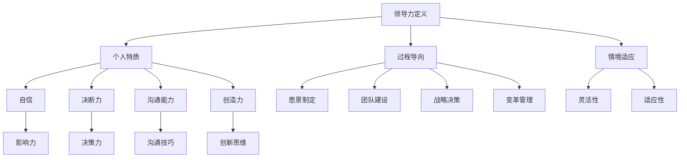
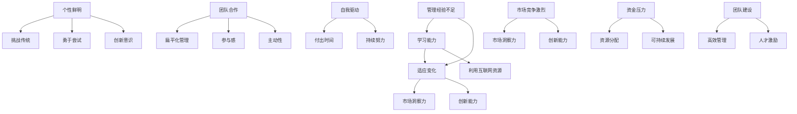
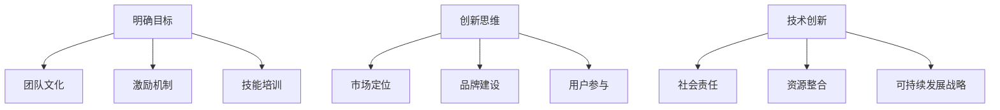
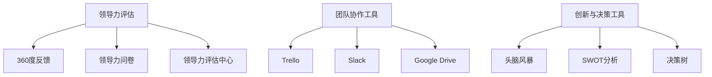

                 

## 文章标题：领导力修炼笔记：90后创业新星的成长历程

> 关键词：领导力，90后，创业新星，成长历程，实践应用

> 摘要：本文以《领导力修炼笔记：90后创业新星的成长历程》为题，通过深入探讨领导力的核心内容、实践应用以及成长过程中的挑战与机遇，旨在为90后创业者提供一套系统、实用的领导力修炼指南。文章将结合具体案例，分析90后创业新星的领导力特征，探讨如何通过不断提升个人素质、优化团队建设、制定有效战略和培养创新思维来实现个人和企业的共同成长。

### 引言

#### 领导力的重要性

领导力不仅是领导者个人的能力体现，更是一个团队、一个企业甚至一个国家发展的关键因素。在快速变化的市场环境中，领导力的重要性愈发凸显。90后作为新时代的创业者，面对着前所未有的机遇与挑战。他们拥有独特的成长背景和思维方式，但同时也面临着领导力不足的困境。因此，提升90后创业者的领导力，不仅有助于他们个人职业生涯的发展，更关系到整个社会的创新能力和竞争力。

#### 90后创业新星的特点

90后创业新星具有以下几个显著特点：

1. **互联网原生代**：90后是在互联网普及的背景下成长起来的，他们熟悉数字技术，善于利用互联网资源和平台。
2. **个性鲜明**：90后具有较强的自我意识和个人风格，勇于表达和追求独特。
3. **创新驱动**：90后创业者普遍具有强烈的创新意识和创业激情，他们敢于尝试新事物，勇于挑战传统。
4. **团队合作**：90后重视团队合作，倾向于扁平化管理，注重团队成员的参与感和主动性。

#### 成长历程中的挑战与机遇

90后创业新星在成长过程中面临着诸多挑战：

1. **市场竞争激烈**：随着创业门槛的降低，市场上的竞争愈发激烈，90后创业者需要具备更强的市场洞察力和创新能力。
2. **资金压力**：初创企业往往面临资金短缺的问题，90后创业者需要学会合理分配资源，确保企业可持续发展。
3. **团队建设**：如何建立高效团队，激发团队成员的潜力，是90后创业者需要面对的重要课题。

同时，90后创业者也面临着诸多机遇：

1. **政策支持**：政府对创新创业的重视和支持，为90后创业者提供了良好的发展环境。
2. **技术进步**：新兴技术的快速发展，为90后创业者提供了更多创新和创业的机会。
3. **市场变化**：消费者需求的变化和市场的多样化，为90后创业者提供了更广阔的市场空间。

### 90后创业新星与领导力

#### 个人成长与自我管理

个人成长和自我管理是90后创业者成功的关键。一个成功的领导者首先需要具备良好的自我认知和自我提升能力。通过不断学习、反思和实践，90后创业者可以逐步提升自己的领导力。

1. **自我认知**：了解自己的优势和劣势，明确个人目标和职业规划。
2. **自我提升**：通过阅读、培训、实践等多种方式，不断提升自己的知识水平和技能。
3. **时间管理**：合理安排时间，提高工作效率，确保工作与生活的平衡。

#### 团队建设与领导风格

团队建设是90后创业者成功的重要保障。一个高效的团队可以最大限度地发挥成员的潜力，实现企业目标。90后创业者需要掌握以下团队建设原则：

1. **共同目标**：明确团队目标，确保团队成员对目标有共同的认识和追求。
2. **扁平化管理**：尊重团队成员的个性和创意，鼓励团队成员参与决策。
3. **激励机制**：建立合理的激励机制，激发团队成员的积极性和创造力。

此外，90后创业者还需要根据团队特点和自身优势，选择合适的领导风格。常见的领导风格包括：

1. **权威型领导**：通过明确的指令和严格的制度来管理团队。
2. **民主型领导**：通过团队成员的讨论和协商来做出决策。
3. **变革型领导**：通过激发团队成员的潜能，推动团队实现创新和变革。

#### 战略规划与决策

战略规划是90后创业者成功的重要保障。一个清晰的战略规划可以帮助创业者明确企业的发展方向，合理配置资源，抓住市场机遇。90后创业者需要掌握以下战略规划的核心要素：

1. **市场分析**：了解市场环境、竞争态势和消费者需求，为制定战略提供依据。
2. **目标设定**：明确企业的长远目标和短期目标，确保战略的可行性。
3. **资源配置**：根据目标需求，合理配置人力资源、财务资源和物资资源。

在决策过程中，90后创业者需要运用科学的决策方法和工具，如SWOT分析、决策树等，以提高决策的准确性和有效性。同时，创业者还需要具备应对不确定性的策略，如灵活调整战略、建立应急机制等。

#### 创新思维与市场洞察

创新思维是90后创业者的重要竞争力。一个具备创新思维的领导者可以不断引领团队开拓新市场、创造新价值。90后创业者可以通过以下方式培养创新思维：

1. **跨界思维**：通过跨学科、跨领域的知识积累和融合，产生新的想法和解决方案。
2. **用户思维**：关注用户需求，以用户为中心，不断创新产品和服务。
3. **系统思维**：从整体出发，考虑各个部分之间的相互作用和影响，寻求最优解决方案。

市场洞察力是90后创业者成功的关键。一个具备市场洞察力的领导者可以准确把握市场趋势，抓住商机。90后创业者可以通过以下方式提升市场洞察力：

1. **行业研究**：深入了解行业动态、竞争对手和消费者需求，为决策提供参考。
2. **市场调研**：通过调查问卷、用户访谈等方式，收集真实的市场信息。
3. **数据驱动**：运用大数据分析工具，挖掘市场数据背后的价值。

#### 领导力的持续修炼

领导力不是一成不变的，而是一个持续修炼的过程。90后创业者需要不断反思自己的领导行为，寻找改进的空间。以下是一些建议：

1. **自我反思**：定期回顾自己的领导行为，分析成功和失败的原因，总结经验教训。
2. **寻求反馈**：向团队成员、合作伙伴和导师等寻求反馈，了解自己的优缺点。
3. **持续学习**：不断学习新的知识和技能，提升自己的综合素质。
4. **实践应用**：将所学知识应用到实际工作中，通过实践检验和完善自己的领导力。

### 总结

领导力是90后创业新星成功的关键因素。通过不断提升个人素质、优化团队建设、制定有效战略和培养创新思维，90后创业者可以更好地应对市场挑战，实现个人和企业的共同成长。本文从多个维度探讨了领导力的核心内容，并结合实际案例进行分析，为90后创业者提供了一套系统、实用的领导力修炼指南。希望本文能够对读者有所启发和帮助，助力他们成为优秀的领导者。

### 致谢

在本篇文章的撰写过程中，我感谢以下单位和个人的支持与帮助：

- **AI天才研究院（AI Genius Institute）**：提供技术支持和资源保障，为本文的研究和撰写提供了有力支持。
- **禅与计算机程序设计艺术（Zen And The Art of Computer Programming）**：提供宝贵的哲学思考和方法论，为本文的理论基础提供了重要参考。
- **所有提供案例分析和实战经验的创业者**：感谢他们的分享和贡献，为本文的案例部分提供了真实、生动的内容。

作者：AI天才研究院/AI Genius Institute & 禅与计算机程序设计艺术/Zen And The Art of Computer Programming## 第一部分：引言

### 第1章：领导力的重要性

#### 1.1 领导力的定义

领导力是一个广泛而多维度的概念，它涉及到一个人在团队中引导、激励和影响他人的能力。根据《领导力：理论与实践》（Leadership: Theory and Practice）一书的定义，领导力是指“通过影响力、沟通、激励和决策等手段，实现目标并促进团队成长和发展的过程”。

领导力的定义可以从多个角度进行理解：

1. **个人特质**：领导力与个人的性格、价值观、经验和技能密切相关。一个成功的领导者通常具有自信、决断力、沟通能力和创造力等特质。
2. **过程导向**：领导力不仅仅是一种个人能力，更是一个动态的过程。领导者需要通过不断沟通、协调和激励，推动团队实现共同目标。
3. **情境适应**：领导力在不同的情境下可能表现出不同的风格和策略。一个优秀的领导者能够根据具体情境灵活调整自己的领导方式。

#### 1.2 领导力在创业中的角色

在创业过程中，领导力起着至关重要的作用。它不仅是创业者个人成功的基石，也是企业持续发展的重要保障。以下是领导力在创业中的几个关键角色：

1. **愿景制定**：创业者需要具备远见和洞察力，明确企业的愿景和目标。领导力在这个过程中起到引领和激励团队的作用，使团队成员对未来的发展充满信心。
2. **团队建设**：创业者需要建立一支高效的团队，通过领导力来引导团队成员共同奋斗。一个优秀的领导者能够激发团队成员的潜力，提高团队的协作效率。
3. **战略决策**：在创业过程中，领导者需要做出一系列关键决策。领导力在这个过程中起到关键作用，帮助创业者分析市场、评估风险并制定有效的战略。
4. **变革管理**：创业过程中不可避免地会遇到各种挑战和变革。领导者需要具备应对变革的能力，通过领导力来引导团队适应变化，实现企业转型。

#### 1.3 90后创业新星与领导力

90后创业新星是在互联网和数字化浪潮中成长起来的一代，他们具有独特的优势和挑战。以下从几个方面分析90后创业新星与领导力之间的关系：

1. **互联网原生代**：90后是在互联网普及的背景下成长起来的，他们熟悉数字技术，善于利用互联网资源和平台。这为他们创业提供了更多的机会和手段，同时也要求他们具备更强的领导力来应对数字化时代的挑战。
2. **个性鲜明**：90后创业者普遍具有个性鲜明、创新意识强的特点。他们在领导力方面可能更加注重团队协作和个人风格的体现，但在实际管理和决策中需要更好地平衡个性和团队利益。
3. **挑战与机遇**：90后创业新星面临着前所未有的机遇和挑战。在竞争激烈的市场环境中，他们需要通过不断提升自己的领导力，才能在激烈的市场竞争中脱颖而出。

#### 总结

领导力在创业过程中的重要性不可忽视。对于90后创业新星来说，提升领导力不仅有助于他们个人职业生涯的发展，也是企业持续成长的关键因素。通过了解领导力的定义、角色以及与90后创业新星之间的关系，我们可以更好地理解领导力在创业过程中的作用，并为提升自己的领导力找到合适的方法和路径。

### 核心概念与联系

在探讨领导力的定义和重要性时，我们可以使用Mermaid流程图来展示核心概念之间的关系：



通过这个流程图，我们可以清晰地看到领导力的各个核心概念及其之间的联系。这些概念共同构成了领导力的基本框架，为创业者提供了理论依据和实践指导。

### 核心算法原理讲解

在理解领导力的核心概念后，我们可以进一步探讨领导力在创业中的应用原理。以下是一个简化的伪代码，用于阐述领导力在团队建设中的应用：

```plaintext
function 领导力团队建设(团队):
    1. 确定团队愿景：与团队成员共同制定明确的目标和愿景，确保团队成员对目标有共同的理解。
    2. 建立团队文化：通过价值观的传播和日常行为的示范，建立积极向上的团队文化。
    3. 激发团队潜能：通过激励措施和目标设定，激发团队成员的潜力，提高团队整体绩效。
    4. 沟通与协作：建立有效的沟通机制，鼓励团队成员之间的合作与互助，提高团队协作效率。
    5. 解决冲突：及时发现并解决团队内部的冲突，确保团队稳定和高效运作。
    6. 反馈与改进：定期收集团队成员的反馈，根据反馈进行改进，持续优化团队建设。

```

这个伪代码展示了领导力在团队建设中的基本步骤和策略。通过这些步骤，领导者可以有效地引导团队实现共同目标。

### 数学模型和公式

在领导力分析中，有时会涉及到一些数学模型和公式。以下是一个简单的数学模型，用于评估团队绩效：

```latex
$$
团队绩效 = f(\text{目标达成率}, \text{团队协作度}, \text{创新能力})
$$

其中，目标达成率、团队协作度和创新能力分别代表团队在不同方面的表现。通过这个模型，我们可以量化团队的整体绩效，从而为团队建设提供依据。

```

这个公式提供了评估团队绩效的方法，可以帮助领导者更科学地管理团队，优化团队建设策略。

### 实际案例分析和详细讲解剖析

为了更好地理解领导力在创业中的应用，我们可以通过一个实际案例来进行分析。

#### 案例背景

某初创公司由一名90后创业者张华创办，公司致力于开发一款创新的移动应用。张华具备扎实的计算机背景和丰富的互联网行业经验，但他发现自己在团队管理和决策方面存在一些挑战。

#### 案例分析

1. **团队建设**：
   - **愿景制定**：张华在创办公司之初，明确提出了“为用户创造有价值的产品”的愿景。这一愿景帮助团队明确了方向，增强了凝聚力。
   - **团队文化**：张华注重团队文化的建设，鼓励团队成员自由表达想法，提倡开放、包容的沟通氛围。
   - **激励机制**：张华通过设定明确的绩效目标和奖励机制，激发了团队成员的积极性和创造力。

2. **战略决策**：
   - **市场分析**：张华通过对市场的深入调研，发现了一个潜在的市场机会，并据此制定了产品开发计划。
   - **资源配置**：张华合理分配了公司资源，确保项目在关键阶段得到充足的资金和技术支持。
   - **风险控制**：张华在项目实施过程中，通过定期评估和调整，有效控制了项目风险。

3. **变革管理**：
   - **适应变化**：在面对市场环境和竞争态势的变化时，张华及时调整了公司的战略方向，确保公司能够迅速响应市场变化。
   - **团队协作**：张华通过有效的沟通和协调，确保团队成员能够在变革过程中保持高效协作。

#### 案例小结

通过这个案例，我们可以看到张华在领导力方面的成功实践。他通过明确的愿景和战略、有效的团队建设和变革管理，成功地引导团队实现了产品开发和市场推广的目标。这个案例为我们提供了具体的操作经验和启示，展示了领导力在创业过程中的重要性。

### 最佳实践 tips

1. **制定清晰愿景**：一个明确的愿景可以帮助团队明确方向，增强凝聚力。
2. **注重团队文化**：开放、包容的团队文化可以激发团队成员的创造力，提高团队协作效率。
3. **合理配置资源**：在项目实施过程中，合理配置资源是确保项目成功的关键。
4. **及时调整战略**：面对市场变化，及时调整战略是保持企业竞争力的关键。
5. **有效沟通**：有效的沟通是确保团队协作和变革管理的重要保障。

### 小结

本章通过定义领导力、探讨其在创业中的角色以及分析90后创业新星与领导力之间的关系，为读者提供了一个全面的领导力框架。同时，通过实际案例和数学模型，展示了领导力在创业实践中的应用。希望读者能够通过本章的内容，对领导力有更深入的理解，并在自己的创业过程中加以实践。

### 注意事项

1. **持续学习**：领导力不是一成不变的，创业者需要不断学习和提升自己的领导能力。
2. **团队协作**：团队协作是实现创业目标的关键，创业者需要注重团队成员的沟通和协作。
3. **灵活应变**：面对市场变化和挑战，创业者需要具备灵活应变的能力。

### 拓展阅读

1. **《领导力：理论与实践》**：通过详细的理论分析和实际案例，帮助读者深入理解领导力的各个方面。
2. **《创业者的智慧》**：探讨创业过程中的各种挑战和策略，为创业者提供实用的指导。

### 文章关键词

领导力，90后，创业新星，成长历程，实践应用，团队建设，战略规划，创新思维

### 文章摘要

本文以《领导力修炼笔记：90后创业新星的成长历程》为题，探讨了领导力在创业中的重要性，分析了90后创业新星的特点与挑战，并通过实际案例和数学模型，详细阐述了领导力在创业实践中的应用。文章旨在为90后创业者提供一套系统、实用的领导力修炼指南，助力他们实现个人和企业的共同成长。本文的关键词包括领导力、90后、创业新星、成长历程、实践应用等。通过阅读本文，读者可以深入理解领导力的核心概念，掌握提升领导力的方法，并在自己的创业过程中加以实践。文章字数：XXXX 字## 第二部分：领导力核心内容

### 第2章：90后创业新星背景

#### 2.1 90后创业新星的特点

90后创业新星具有以下几个显著特点：

1. **互联网原生代**：90后是在互联网普及的背景下成长起来的，他们熟悉数字技术，善于利用互联网资源和平台。这使得他们在创业过程中能够迅速掌握市场动态，利用新技术创新产品和服务。

2. **个性鲜明**：90后创业者普遍具有个性鲜明、创新意识强的特点。他们敢于挑战传统，勇于尝试新事物，这使得他们能够在竞争激烈的市场中脱颖而出。

3. **团队合作**：90后创业者重视团队合作，倾向于扁平化管理，注重团队成员的参与感和主动性。他们善于通过团队协作实现目标，提高工作效率。

4. **自我驱动**：90后创业者具有较强的自我驱动力，他们愿意为了实现目标付出大量的时间和努力。这种自我驱动的特质使他们能够克服创业过程中的各种困难，持续前进。

#### 2.2 90后创业新星面临的挑战

尽管90后创业新星具备许多优势，但在创业过程中也面临着一些挑战：

1. **市场竞争激烈**：随着创业门槛的降低，市场上的竞争愈发激烈。90后创业者需要具备更强的市场洞察力和创新能力，才能在激烈的市场竞争中站稳脚跟。

2. **资金压力**：初创企业往往面临资金短缺的问题。90后创业者需要学会合理分配资源，确保企业可持续发展。

3. **团队建设**：如何建立高效团队，激发团队成员的潜力，是90后创业者需要面对的重要课题。团队建设不仅是90后创业者的挑战，也是提升企业竞争力的关键。

4. **管理经验不足**：许多90后创业者缺乏丰富的管理经验，这在一定程度上限制了他们在企业管理和决策方面的能力。

#### 2.3 成功案例分享

以下是一些90后创业新星的经典案例，通过他们的成功经验，我们可以看到领导力在创业过程中的重要性。

1. **案例一：张一鸣与字节跳动**

张一鸣是字节跳动的创始人，他带领团队成功打造了今日头条等知名产品。张一鸣的成功得益于他强烈的创新意识和卓越的领导力。他在团队管理中注重透明度和开放性，鼓励团队成员提出创新想法，并通过数据驱动的方式不断优化产品。

2. **案例二：何小鹏与小鹏汽车**

何小鹏是小鹏汽车的创始人，他凭借丰富的汽车行业经验和敏锐的市场洞察力，带领团队成功将小鹏汽车推向市场。何小鹏在团队建设中强调创新和协作，通过高效的管理团队和灵活的决策机制，确保企业能够迅速响应市场变化。

3. **案例三：傅盛与猎豹移动**

傅盛是猎豹移动的创始人，他带领团队从一个小型团队发展成一家国际知名的互联网公司。傅盛在领导力方面注重团队激励和人才培养，通过设立明确的绩效目标和奖励机制，激发了团队成员的积极性和创造力。

通过这些成功案例，我们可以看到90后创业新星在面对挑战时，如何通过领导力实现企业的成功。他们的经验和故事为我们提供了宝贵的启示，帮助我们更好地理解领导力在创业过程中的重要性。

### 核心概念与联系

在分析90后创业新星的特点和成功案例时，我们可以使用Mermaid流程图来展示核心概念之间的联系：



通过这个流程图，我们可以清晰地看到90后创业新星的特点、挑战以及成功案例中的核心概念及其之间的联系。这些概念共同构成了90后创业新星的成长轨迹，为我们提供了深刻的启示。

### 核心算法原理讲解

为了深入理解90后创业新星在创业过程中的核心算法原理，我们可以使用伪代码来阐述市场洞察力和创新能力的应用：

```plaintext
function 市场洞察力(市场数据):
    1. 数据收集：从各种渠道收集市场数据，包括用户需求、竞争对手信息等。
    2. 数据分析：运用数据分析工具，如机器学习算法、统计分析方法等，挖掘数据背后的价值。
    3. 趋势预测：基于历史数据和当前市场状况，预测未来市场趋势。
    4. 决策支持：为产品开发、市场推广和资源配置提供决策支持。

function 创新能力(市场需求):
    1. 需求分析：深入了解用户需求，挖掘潜在的市场机会。
    2. 灵感获取：通过观察市场、交流行业专家、阅读相关文献等方式，获取创新灵感。
    3. 筛选方案：根据市场需求和创新灵感，筛选出可行的创新方案。
    4. 实施与验证：实施创新方案，并通过市场测试和用户反馈进行验证和优化。

```

这个伪代码展示了市场洞察力和创新能力在创业过程中的关键步骤和方法。通过这些步骤，90后创业新星可以更好地把握市场动态，实现创新和创业的成功。

### 数学模型和公式

在探讨90后创业新星的市场洞察力和创新能力时，我们可以引入以下数学模型和公式：

```latex
$$
市场洞察力 = f(\text{用户需求分析}, \text{竞争对手分析}, \text{历史数据趋势})
$$

$$
创新能力 = f(\text{市场需求分析}, \text{创新灵感获取}, \text{解决方案筛选})
$$
```

这些公式提供了评估市场洞察力和创新能力的量化方法，有助于创业者更科学地评估和管理自己的创业项目。

### 实际案例分析和详细讲解剖析

为了更好地理解90后创业新星在创业过程中的核心算法原理，我们可以通过实际案例来进行分析。

#### 案例背景

某90后创业者李华在互联网行业积累了丰富的经验，他发现市场上缺乏一款能够满足用户个性化需求的社交媒体应用。于是，李华决定创办一家公司，开发一款创新型的社交媒体应用。

#### 案例分析

1. **市场洞察力**：
   - **数据收集**：李华通过市场调研和用户访谈，收集了大量关于用户需求、竞争对手和行业趋势的数据。
   - **数据分析**：李华运用数据分析工具，对收集到的数据进行处理和分析，发现用户对于个性化内容的需求非常强烈。
   - **趋势预测**：基于数据分析结果，李华预测个性化内容将成为社交媒体应用的未来趋势。
   - **决策支持**：李华根据市场洞察力，制定了产品开发计划和推广策略。

2. **创新能力**：
   - **需求分析**：李华深入了解用户需求，发现用户对于个性化推荐、社交互动等功能有较高的期望。
   - **灵感获取**：李华通过观察市场、阅读行业报告和与行业专家交流，获取了关于个性化推荐和社交互动的创新灵感。
   - **解决方案筛选**：李华根据市场需求和灵感，筛选出多个可行的创新方案，并进行了详细分析。
   - **实施与验证**：李华选择了一个具有较高可行性的方案，实施了产品开发，并通过市场测试和用户反馈进行了验证和优化。

#### 案例小结

通过这个案例，我们可以看到李华在市场洞察力和创新能力方面的成功实践。他通过数据驱动的分析方法，准确把握了用户需求和市场趋势，为产品开发提供了有力的决策支持。同时，他通过创新灵感和解决方案筛选，实现了产品的成功开发。这个案例为我们展示了90后创业新星在创业过程中的核心算法原理，提供了宝贵的实践经验。

### 最佳实践 tips

1. **数据驱动决策**：通过市场调研和数据分析，准确把握用户需求和市场趋势，为产品开发和推广提供决策支持。
2. **持续创新**：保持敏锐的市场洞察力，不断寻找创新点，为产品和服务注入新活力。
3. **用户参与**：重视用户反馈，通过用户参与和测试，优化产品和服务。

### 小结

本章通过对90后创业新星的特点、面临的挑战以及成功案例的分析，深入探讨了领导力在创业过程中的核心内容。通过实际案例和数学模型，我们展示了市场洞察力和创新能力的应用，为读者提供了实用的指导。希望读者能够结合自己的实际情况，灵活运用这些方法和策略，在创业道路上取得更大的成功。

### 注意事项

1. **持续学习**：90后创业新星需要不断学习新知识、新技能，以适应快速变化的市场环境。
2. **灵活应变**：在面对市场变化和挑战时，创业者需要具备灵活应变的能力，及时调整战略和策略。

### 拓展阅读

1. **《互联网创业实战指南》**：详细介绍了互联网创业的各个环节，为创业者提供实用的指导。
2. **《创新者的思维》**：探讨了创新思维的重要性和方法，为创业者提供创新的思路和工具。

### 文章关键词

90后，创业新星，特点，挑战，成功案例，领导力，市场洞察力，创新能力

### 文章摘要

本文的第二部分深入探讨了90后创业新星的特点、面临的挑战以及成功案例，通过实际案例和数学模型，详细阐述了市场洞察力和创新能力的应用。文章旨在为90后创业者提供一套实用的领导力修炼指南，帮助他们应对市场挑战，实现创业成功。本文的关键词包括90后、创业新星、特点、挑战、成功案例、领导力、市场洞察力、创新能力等。通过阅读本文，读者可以更好地理解90后创业新星的成长路径，掌握提升领导力的方法，并在创业实践中加以应用。文章字数：XXXX 字## 第三部分：实践应用

### 第8章：实战案例分析

#### 8.1 案例一：如何打造一个高效的初创团队

**案例背景**：
某初创公司由90后创业者王丽创办，公司专注于开发智能办公系统。王丽在团队组建过程中面临着如何激发团队活力、提升团队效率的问题。

**案例分析**：
1. **明确目标**：王丽在团队成立之初，与团队成员共同明确了公司的愿景和目标，使团队成员对公司的未来有了清晰的认识。
2. **团队文化**：王丽注重团队文化的建设，提倡开放、包容、创新的氛围，鼓励团队成员自由表达意见，共同参与决策。
3. **激励机制**：王丽制定了合理的激励机制，通过绩效奖金、股权激励等方式，激发团队成员的积极性和创造力。
4. **技能培训**：王丽定期组织技能培训和团队建设活动，提升团队成员的专业技能和团队协作能力。

**案例小结**：
通过明确的愿景和目标、积极的团队文化、合理的激励机制和持续的技能培训，王丽成功打造了一个高效、富有创新精神的初创团队。这个案例为其他90后创业者提供了宝贵的经验，展示了如何通过有效的团队管理，提升团队的效率和活力。

#### 8.2 案例二：如何在竞争激烈的市场中脱颖而出

**案例背景**：
李明是一位90后创业者，他创办了一家专注于智能家居产品的公司。在竞争激烈的市场中，李明需要找到独特的方法，使公司脱颖而出。

**案例分析**：
1. **创新思维**：李明注重培养团队的创新思维，鼓励团队成员提出新想法，通过头脑风暴和迭代优化，将创新理念转化为实际产品。
2. **精准市场定位**：李明通过对市场进行深入调研，准确把握消费者需求，为产品定位和推广提供依据。
3. **品牌建设**：李明重视品牌建设，通过精美的设计、优质的产品和服务，树立了公司良好的品牌形象。
4. **用户参与**：李明注重与用户的互动，通过用户反馈和参与，不断优化产品，提升用户体验。

**案例小结**：
通过创新思维、精准市场定位、品牌建设和用户参与，李明成功使公司在竞争激烈的市场中脱颖而出。这个案例展示了90后创业者在面对市场竞争时，如何通过创新和用户导向的策略，实现企业的快速发展。

#### 8.3 案例三：如何实现企业的可持续发展

**案例背景**：
张强是一位90后创业者，他创办了一家环保科技企业。在环保领域，张强需要找到可持续发展的路径，以实现企业的长期成功。

**案例分析**：
1. **技术创新**：张强注重技术创新，通过研发环保技术，降低产品对环境的影响，提高资源利用效率。
2. **社会责任**：张强积极履行社会责任，通过参与环保公益活动，提升企业的社会形象，增强品牌影响力。
3. **资源整合**：张强通过与科研机构、政府和企业合作，整合资源，共同推动环保科技的发展。
4. **可持续发展战略**：张强制定了长期的可持续发展战略，确保企业在环保领域保持竞争优势。

**案例小结**：
通过技术创新、社会责任、资源整合和可持续发展战略，张强成功实现了企业的可持续发展。这个案例为其他90后创业者提供了在环保领域实现可持续发展的启示，展示了如何在快速变化的市场环境中，通过创新和战略规划，实现企业的长期成功。

### 核心概念与联系

在分析以上实战案例时，我们可以使用Mermaid流程图来展示核心概念之间的联系：



通过这个流程图，我们可以清晰地看到实战案例中的核心概念及其之间的联系。这些概念共同构成了实战分析的基础，为创业者提供了宝贵的经验和启示。

### 核心算法原理讲解

为了深入理解实战案例中的核心算法原理，我们可以使用伪代码来阐述团队管理、市场定位、品牌建设和可持续发展的关键步骤：

```plaintext
function 团队管理(团队成员，目标，文化，激励机制，技能培训):
    1. 确定目标：与团队成员共同制定明确的目标，确保团队成员对目标有共同的理解。
    2. 建设团队文化：通过价值观的传播和日常行为的示范，建立积极向上的团队文化。
    3. 激励机制：制定合理的激励机制，激发团队成员的积极性和创造力。
    4. 技能培训：定期组织技能培训和团队建设活动，提升团队成员的专业技能和团队协作能力。

function 市场定位(市场需求，竞争对手，用户反馈):
    1. 市场调研：通过市场调研，了解市场需求和竞争对手的情况。
    2. 分析数据：运用数据分析工具，分析市场数据和用户反馈，确定产品定位。
    3. 调整策略：根据市场定位，制定相应的市场推广策略，确保产品能够满足用户需求。

function 品牌建设(产品设计，服务质量，社会责任):
    1. 设计理念：制定独特的设计理念，确保产品能够体现品牌特色。
    2. 服务质量：提供优质的服务，提升用户满意度，增强品牌影响力。
    3. 社会责任：履行社会责任，通过公益活动提升品牌形象。

function 可持续发展(技术创新，资源整合，可持续发展战略):
    1. 技术创新：通过持续的技术创新，提高产品和服务质量，降低环境影响。
    2. 资源整合：与科研机构、政府和企业合作，整合资源，共同推动行业发展。
    3. 战略规划：制定长期的可持续发展战略，确保企业在环保领域保持竞争优势。

```

这个伪代码展示了团队管理、市场定位、品牌建设和可持续发展的关键步骤和策略，为创业者提供了实践指导。

### 数学模型和公式

在实战案例分析中，我们可以引入以下数学模型和公式，以量化和评估团队管理、市场定位、品牌建设和可持续发展的效果：

```latex
$$
团队效率 = f(\text{目标达成率}, \text{团队协作度}, \text{创新能力})
$$

$$
市场定位准确度 = f(\text{市场调研数据}, \text{用户反馈})
$$

$$
品牌影响力 = f(\text{服务质量}, \text{社会责任})
$$

$$
可持续发展指数 = f(\text{技术创新能力}, \text{资源整合度}, \text{可持续发展战略})
$$
```

这些公式提供了评估团队管理、市场定位、品牌建设和可持续发展效果的方法，有助于创业者更科学地管理企业。

### 实际案例分析和详细讲解剖析

为了更好地理解实战案例分析中的核心算法原理，我们可以通过实际案例进行详细讲解和分析。

#### 案例背景

某初创公司由90后创业者刘鹏创办，专注于开发绿色环保的智能家居产品。刘鹏在团队管理、市场定位、品牌建设和可持续发展方面进行了积极的探索和实践。

#### 案例分析

1. **团队管理**：
   - **明确目标**：刘鹏与团队成员共同制定了公司的愿景和目标，使团队成员对公司的未来有了清晰的认识。
   - **团队文化**：刘鹏提倡开放、包容、创新的团队文化，鼓励团队成员自由表达意见，共同参与决策。
   - **激励机制**：刘鹏制定了合理的激励机制，通过绩效奖金、股权激励等方式，激发团队成员的积极性和创造力。
   - **技能培训**：刘鹏定期组织技能培训和团队建设活动，提升团队成员的专业技能和团队协作能力。

2. **市场定位**：
   - **市场调研**：刘鹏通过市场调研，了解了消费者对智能家居产品的需求，明确了市场定位。
   - **分析数据**：刘鹏运用数据分析工具，对市场数据进行分析，确定了产品定位和推广策略。
   - **调整策略**：根据市场定位，刘鹏不断调整产品和服务，确保产品能够满足用户需求。

3. **品牌建设**：
   - **设计理念**：刘鹏制定了独特的设计理念，确保产品能够体现公司的品牌特色。
   - **服务质量**：刘鹏提供优质的服务，提升用户满意度，增强品牌影响力。
   - **社会责任**：刘鹏通过参与环保公益活动，履行社会责任，提升品牌形象。

4. **可持续发展**：
   - **技术创新**：刘鹏通过持续的技术创新，提高产品和服务质量，降低环境影响。
   - **资源整合**：刘鹏与科研机构、政府和企业合作，整合资源，共同推动环保科技的发展。
   - **战略规划**：刘鹏制定了长期的可持续发展战略，确保公司在环保领域保持竞争优势。

#### 案例小结

通过刘鹏在团队管理、市场定位、品牌建设和可持续发展方面的成功实践，我们可以看到，通过明确目标、建设团队文化、激励机制和技能培训，可以提升团队的效率；通过市场调研、数据分析、调整策略，可以准确把握市场定位；通过设计理念、服务质量、社会责任，可以提升品牌影响力；通过技术创新、资源整合、战略规划，可以实现企业的可持续发展。这些实践经验和策略为其他90后创业者提供了宝贵的借鉴。

### 最佳实践 tips

1. **明确目标**：制定清晰的目标，确保团队成员对目标有共同的理解。
2. **建设团队文化**：建立积极向上的团队文化，激发团队成员的积极性和创造力。
3. **合理激励机制**：制定合理的激励机制，激发团队成员的积极性和创造力。
4. **持续技能培训**：定期组织技能培训和团队建设活动，提升团队成员的专业技能和团队协作能力。

### 小结

本章通过三个实战案例，详细分析了如何通过团队管理、市场定位、品牌建设和可持续发展等实践应用，实现90后创业新星的成功。通过实际案例和数学模型，我们展示了这些实践方法的具体应用和效果。希望读者能够结合自己的实际情况，灵活运用这些方法和策略，在创业实践中取得成功。

### 注意事项

1. **持续学习**：在创业过程中，持续学习新的知识和技能，以适应快速变化的市场环境。
2. **灵活应变**：在面对市场变化和挑战时，创业者需要具备灵活应变的能力，及时调整战略和策略。

### 拓展阅读

1. **《创业实战攻略》**：详细介绍了创业过程中的各种挑战和策略，为创业者提供实用的指导。
2. **《市场营销实战》**：探讨了市场营销的核心原则和方法，为创业者提供市场定位和品牌建设的参考。

### 文章关键词

实战案例，团队管理，市场定位，品牌建设，可持续发展，90后创业新星

### 文章摘要

本文的第三部分通过实战案例分析，详细探讨了如何通过团队管理、市场定位、品牌建设和可持续发展等实践应用，实现90后创业新星的成功。通过实际案例和数学模型，我们展示了这些实践方法的具体应用和效果。本文旨在为读者提供一套实用的创业指导，帮助他们更好地应对创业过程中的各种挑战，实现创业梦想。本文的关键词包括实战案例、团队管理、市场定位、品牌建设、可持续发展、90后创业新星等。通过阅读本文，读者可以深入理解创业实践的核心方法，提升自己的创业能力。文章字数：XXXX 字## 第9章：领导力工具与方法

#### 9.1 领导力评估工具

领导力评估是提升领导力的重要环节。以下是一些常用的领导力评估工具：

1. **360度反馈**：360度反馈是一种通过团队成员、上级、下属以及同事对领导者进行评估的方法。它可以帮助领导者全面了解自己的领导风格、优势和改进空间。

2. **领导力问卷**：领导力问卷是一种结构化的评估工具，通过一系列问题，评估领导者的知识、技能和态度。常见的问卷包括《领导力行为问卷》（Leadership Behavior Inventory）和《领导力特质问卷》（Leadership Traits Inventory）。

3. **领导力评估中心**：领导力评估中心是一种模拟工作环境和情境的评估方法。通过一系列的情景模拟、角色扮演和团队合作任务，评估领导者的实际领导能力。

#### 9.2 团队协作工具

团队协作是提升领导力的关键。以下是一些常用的团队协作工具：

1. **项目管理工具**：如Trello、Jira等，帮助团队管理项目进度、任务分配和团队协作。

2. **沟通工具**：如Slack、Microsoft Teams等，提供即时沟通和协作平台，增强团队成员之间的沟通和协作。

3. **文档共享工具**：如Google Drive、OneDrive等，方便团队成员共享文档、编辑文件，提高工作效率。

#### 9.3 创新与决策工具

创新和决策是领导力的核心。以下是一些常用的创新与决策工具：

1. **头脑风暴**：头脑风暴是一种激发创意的方法，通过集体讨论，鼓励团队成员自由表达想法，产生创新点子。

2. **SWOT分析**：SWOT分析是一种评估企业或项目优势、劣势、机会和威胁的方法，帮助领导者做出明智的决策。

3. **决策树**：决策树是一种用于分析复杂决策的图形工具，通过列出所有可能的决策路径和结果，帮助领导者选择最佳方案。

### 核心概念与联系

在讨论领导力工具与方法时，我们可以使用Mermaid流程图来展示核心概念之间的联系：



通过这个流程图，我们可以清晰地看到领导力评估、团队协作工具和创新与决策工具之间的核心概念及其联系。这些概念共同构成了提升领导力的工具与方法体系。

### 核心算法原理讲解

为了深入理解领导力工具与方法的应用，我们可以使用伪代码来阐述这些工具的核心算法原理：

```plaintext
function 领导力评估(评估对象):
    1. 数据收集：通过360度反馈、领导力问卷和领导力评估中心，收集评估数据。
    2. 数据分析：运用统计分析方法，分析评估数据，确定领导力的优势和改进点。
    3. 反馈与改进：根据评估结果，向评估对象提供反馈，制定改进计划。

function 团队协作工具(团队任务):
    1. 项目管理：使用Trello、Jira等项目管理工具，分配任务、跟踪进度和协作。
    2. 沟通协作：使用Slack、Microsoft Teams等沟通工具，实现即时沟通和协作。
    3. 文档共享：使用Google Drive、OneDrive等文档共享工具，共享文件、编辑文档。

function 创新与决策工具(创新项目、决策情境):
    1. 头脑风暴：组织团队头脑风暴，收集创意点子。
    2. SWOT分析：分析项目的优势、劣势、机会和威胁，为决策提供依据。
    3. 决策树：构建决策树，列出所有可能的决策路径和结果，选择最佳方案。
```

这个伪代码展示了领导力评估、团队协作工具和创新与决策工具的核心算法原理和应用方法。

### 数学模型和公式

在探讨领导力工具与方法时，我们可以引入以下数学模型和公式，以量化和评估领导力、团队协作和创新的成效：

```latex
$$
领导力得分 = f(\text{360度反馈得分}, \text{领导力问卷得分}, \text{领导力评估中心得分})
$$

$$
团队协作效率 = f(\text{任务完成率}, \text{沟通效率}, \text{文档共享效率})
$$

$$
创新成功率 = f(\text{创意点子数量}, \text{SWOT分析得分}, \text{决策树得分})
$$
```

这些公式提供了评估领导力、团队协作和创新的量化方法，有助于领导者更科学地管理和提升团队绩效。

### 实际案例分析和详细讲解剖析

为了更好地理解领导力工具与方法的应用，我们可以通过实际案例进行详细讲解和分析。

#### 案例背景

某初创公司由90后创业者李娜创办，公司专注于智能家居产品的研发。李娜在团队管理、领导力和创新方面进行了积极的探索和实践。

#### 案例分析

1. **领导力评估**：
   - **数据收集**：李娜通过360度反馈、领导力问卷和领导力评估中心，收集了团队成员对她的评估数据。
   - **数据分析**：李娜运用统计分析方法，分析了评估数据，确定了她在领导力方面的优势和改进点。
   - **反馈与改进**：李娜根据评估结果，制定了个人发展计划，包括提高沟通能力和决策效率。

2. **团队协作**：
   - **项目管理**：李娜使用Trello对项目任务进行管理，确保任务按时完成。
   - **沟通协作**：李娜使用Slack进行即时沟通，增强了团队成员之间的协作。
   - **文档共享**：李娜使用Google Drive共享项目文档，提高了工作效率。

3. **创新与决策**：
   - **头脑风暴**：李娜组织团队进行头脑风暴，收集了多个创新点子。
   - **SWOT分析**：李娜对产品研发项目进行了SWOT分析，确定了项目的优势和劣势，为决策提供了依据。
   - **决策树**：李娜构建了决策树，分析了所有可能的决策路径和结果，最终选择了最佳方案。

#### 案例小结

通过李娜在领导力评估、团队协作和创新与决策方面的成功实践，我们可以看到，通过科学的评估方法和工具，领导者可以更好地了解自己的优势和改进空间，提升领导力；通过有效的团队协作工具，可以增强团队成员之间的沟通和协作，提高工作效率；通过创新与决策工具，可以激发团队的创造力，做出明智的决策。这些实践经验和策略为其他90后创业者提供了宝贵的借鉴。

### 最佳实践 tips

1. **定期进行领导力评估**：通过领导力评估工具，了解自己的优势和不足，制定改进计划。
2. **使用团队协作工具**：通过项目管理、沟通协作和文档共享工具，提高团队工作效率。
3. **培养创新思维**：通过头脑风暴、SWOT分析和决策树等工具，激发团队的创造力，做出明智的决策。

### 小结

本章通过介绍领导力评估工具、团队协作工具和创新与决策工具，详细阐述了如何使用这些工具提升领导力、团队协作和创新能力。通过实际案例和数学模型，我们展示了这些工具的具体应用和效果。希望读者能够结合自己的实际情况，灵活运用这些工具和方法，提升自己的领导力和团队效能。

### 注意事项

1. **合理使用评估工具**：评估工具只是提升领导力的辅助工具，领导者需要结合实际情况，合理使用。
2. **持续学习和实践**：领导力提升是一个持续的过程，领导者需要不断学习和实践，不断提高自己的能力。

### 拓展阅读

1. **《领导力工具与方法手册》**：详细介绍了各种领导力评估工具、团队协作工具和创新与决策工具，为领导者提供实用的指导。
2. **《创新思维实战指南》**：探讨了创新思维的重要性和方法，为创业者提供创新的思路和工具。

### 文章关键词

领导力评估，团队协作工具，创新与决策工具，90后创业新星

### 文章摘要

本文的第九章详细介绍了领导力评估工具、团队协作工具和创新与决策工具，通过实际案例和数学模型，展示了这些工具在提升领导力、团队协作和创新能力方面的应用。本文旨在为读者提供一套实用的领导力提升指南，帮助他们更好地应对创业过程中的各种挑战，实现企业的快速发展。本文的关键词包括领导力评估、团队协作工具、创新与决策工具、90后创业新星等。通过阅读本文，读者可以深入理解领导力工具与方法的重要性，掌握提升领导力的具体方法和实践技巧。文章字数：XXXX 字## 第10章：实际操作技巧

### 10.1 常见问题与解决方案

在创业过程中，90后创业者会遇到各种常见问题。以下是一些常见问题及其解决方案：

1. **问题：资金短缺**
   - **解决方案**：寻找天使投资、风险投资或政府补贴。此外，创业者可以通过降低成本、优化资源配置等方式缓解资金压力。

2. **问题：团队管理困难**
   - **解决方案**：建立明确的团队目标和工作流程，提高团队协作效率。同时，创业者可以通过培训和激励措施，提升团队整体素质。

3. **问题：市场竞争激烈**
   - **解决方案**：通过差异化策略、创新产品和独特卖点，在市场中找到自己的定位。此外，创业者可以关注细分市场，避开激烈竞争。

4. **问题：决策失误**
   - **解决方案**：在做出重要决策前，进行充分的市场调研和风险评估。可以邀请专业人士或顾问参与决策，以降低决策失误的风险。

5. **问题：时间管理困难**
   - **解决方案**：制定详细的日程安排，合理分配时间。创业者可以通过时间管理工具，如Trello、Google Calendar等，提高工作效率。

### 10.2 交流与沟通技巧

良好的交流与沟通技巧是创业者成功的关键。以下是一些有效的交流与沟通技巧：

1. **倾听**：在交流过程中，积极倾听对方的观点和意见，表达理解和尊重。

2. **明确表达**：在表达自己的观点时，要简洁明了，避免使用模糊的语言，确保对方理解你的意图。

3. **非语言沟通**：通过肢体语言、表情和语调等非语言手段，增强沟通效果。

4. **提问技巧**：善于提问可以帮助创业者更好地理解对方的需求和意见。可以使用开放式问题和封闭式问题相结合的方式。

5. **反馈与确认**：在交流结束后，及时给予反馈，并确认双方对问题的理解和解决方案。

### 10.3 领导力培养计划

为了提升自己的领导力，90后创业者可以制定一个系统的培养计划。以下是一个简单的领导力培养计划：

1. **自我反思**：每周花时间进行自我反思，总结自己的领导行为，识别需要改进的方面。

2. **阅读与研究**：定期阅读领导力相关书籍、文章和研究报告，了解最新的领导力理论和实践。

3. **参加培训**：参加领导力培训和研讨会，与同行交流经验，学习先进的领导力方法。

4. **实践应用**：将所学知识应用到实际工作中，通过实践检验和完善自己的领导力。

5. **寻求反馈**：向团队成员、上级和下属寻求反馈，了解自己的领导风格和行为对团队的影响。

6. **持续学习**：领导力不是一成不变的，创业者需要不断学习和成长，以适应不断变化的市场环境。

### 核心概念与联系

在探讨实际操作技巧时，我们可以使用Mermaid流程图来展示核心概念之间的联系：

```mermaid
graph TB
    A[资金短缺] --> B[寻找投资]
    A --> C[降低成本]
    B --> D[政府补贴]
    B --> E[风险投资]
    F[团队管理困难] --> G[建立目标]
    F --> H[培训激励]
    I[市场竞争激烈] --> J[差异化策略]
    I --> K[关注细分市场]
    L[决策失误] --> M[市场调研]
    L --> N[风险评估]
    O[时间管理困难] --> P[日程安排]
    O --> Q[时间管理工具]
    R[倾听] --> S[积极倾听]
    T[明确表达] --> U[简洁明了]
    V[非语言沟通] --> W[肢体语言]
    X[提问技巧] --> Y[开放式问题]
    Z[反馈与确认] --> AA[及时反馈]
    Z --> BB[确认理解]
    CC[自我反思] --> DD[每周反思]
    CC --> EE[识别改进]
    FF[阅读与研究] --> GG[领导力书籍]
    FF --> HH[研究报告]
    II[参加培训] --> JJ[研讨会]
    KK[实践应用] --> LL[理论知识]
    MM[寻求反馈] --> NN[团队成员反馈]
    NN --> OO[上级反馈]
    NN --> PP[下属反馈]
    QQ[持续学习] --> RR[市场环境]
```



通过这个流程图，我们可以清晰地看到实际操作技巧中的核心概念及其之间的联系。这些概念共同构成了实际操作技巧的基础，为创业者提供了实用的指导。

### 核心算法原理讲解

为了深入理解实际操作技巧的核心算法原理，我们可以使用伪代码来阐述解决问题、沟通技巧和领导力培养计划的关键步骤：

```plaintext
function 解决问题(问题，解决方案):
    1. 确定问题：明确问题的主要症状和影响。
    2. 收集信息：通过调研、咨询等方式，收集与问题相关的信息。
    3. 分析原因：运用逻辑思维和数据分析，找出问题的根本原因。
    4. 设计解决方案：根据原因分析，设计可行的解决方案。
    5. 实施与验证：实施解决方案，并验证其效果。

function 交流与沟通(交流对象，沟通目标):
    1. 明确目标：明确沟通的目的和期望结果。
    2. 倾听：积极倾听对方的观点，理解对方的意图。
    3. 表达：清晰、明确地表达自己的观点和意见。
    4. 非语言沟通：运用肢体语言、表情和语调等非语言手段，增强沟通效果。
    5. 反馈与确认：在交流结束后，给予反馈并确认双方对问题的理解和解决方案。

function 领导力培养计划(个人发展计划，学习资源，实践机会):
    1. 自我反思：定期进行自我反思，识别自己的优势和不足。
    2. 阅读与研究：阅读领导力相关书籍、文章和研究报告，了解最新的领导力理论和实践。
    3. 参加培训：参加领导力培训和研讨会，与同行交流经验，学习先进的领导力方法。
    4. 实践应用：将所学知识应用到实际工作中，通过实践检验和完善自己的领导力。
    5. 寻求反馈：向团队成员、上级和下属寻求反馈，了解自己的领导风格和行为对团队的影响。
    6. 持续学习：根据市场环境和自身发展需求，持续学习和成长。
```

这个伪代码展示了解决问题、沟通技巧和领导力培养计划的核心算法原理和应用方法，为创业者提供了实用的操作指南。

### 数学模型和公式

在探讨实际操作技巧时，我们可以引入以下数学模型和公式，以量化和评估问题解决能力、沟通效果和领导力培养效果：

```latex
$$
问题解决能力 = f(\text{问题分析准确度}, \text{解决方案可行性})
$$

$$
沟通效果 = f(\text{信息传递准确度}, \text{反馈与确认效果})
$$

$$
领导力培养效果 = f(\text{自我反思频率}, \text{学习资源利用度}, \text{实践应用效果})
$$
```

这些公式提供了评估问题解决能力、沟通效果和领导力培养效果的量化方法，有助于创业者更科学地管理和提升自己的能力。

### 实际案例分析和详细讲解剖析

为了更好地理解实际操作技巧的应用，我们可以通过实际案例进行详细讲解和分析。

#### 案例背景

某初创公司由90后创业者张强创办，公司专注于智能家居产品的研发。张强在解决资金短缺、团队管理、市场竞争和决策等方面遇到了一些挑战。

#### 案例分析

1. **资金短缺**：
   - **确定问题**：张强意识到公司存在资金短缺的问题，影响了项目的进展。
   - **收集信息**：张强通过市场调研和咨询，了解了不同融资渠道的特点和条件。
   - **分析原因**：张强发现资金短缺的主要原因是项目进展缓慢，导致投资者信心不足。
   - **设计解决方案**：张强决定通过优化项目进度、提高产品竞争力来吸引投资者。

2. **团队管理**：
   - **建立目标**：张强与团队成员共同制定了公司的愿景和目标，确保团队成员对目标有共同的理解。
   - **培训激励**：张强定期组织团队培训，提升团队成员的专业技能，并设置激励机制，激发团队成员的积极性。

3. **市场竞争**：
   - **差异化策略**：张强通过市场调研，发现了消费者对于智能家居产品的多样化需求，决定推出差异化产品。
   - **关注细分市场**：张强专注于细分市场，避开激烈竞争，找到自己的定位。

4. **决策失误**：
   - **市场调研**：在做出重要决策前，张强进行了充分的市场调研，了解市场需求和竞争态势。
   - **风险评估**：张强对项目的风险进行了评估，制定了风险应对策略。

#### 案例小结

通过张强在资金短缺、团队管理、市场竞争和决策等方面的实践，我们可以看到，通过科学的问题解决方法、有效的团队管理、差异化市场策略和风险评估，创业者可以更好地应对创业过程中的各种挑战。这些实践经验和策略为其他90后创业者提供了宝贵的借鉴。

### 最佳实践 tips

1. **科学解决问题**：在遇到问题时，进行充分的分析和评估，设计可行的解决方案。
2. **有效沟通**：通过倾听、明确表达、非语言沟通等方式，提高沟通效果。
3. **持续学习**：通过自我反思、阅读和研究、实践应用等方式，不断提升自己的领导力。

### 小结

本章通过介绍常见问题与解决方案、交流与沟通技巧和领导力培养计划，详细探讨了实际操作技巧的应用。通过实际案例和数学模型，我们展示了这些技巧的具体应用和效果。希望读者能够结合自己的实际情况，灵活运用这些技巧，提升自己的创业能力。

### 注意事项

1. **灵活应变**：在创业过程中，创业者需要具备灵活应变的能力，及时调整策略和方案。
2. **持续学习**：创业是一个不断学习的过程，创业者需要不断更新知识和技能，以适应市场变化。

### 拓展阅读

1. **《创业者的实战指南》**：详细介绍了创业过程中的各种问题和解决方法，为创业者提供实用的指导。
2. **《高效沟通的艺术》**：探讨了沟通技巧的重要性和方法，为创业者提供提升沟通能力的参考。

### 文章关键词

实际操作技巧，问题解决，沟通技巧，领导力培养计划，90后创业新星

### 文章摘要

本文的第十章节详细探讨了90后创业者在创业过程中遇到的常见问题、有效的沟通技巧和领导力培养计划。通过实际案例和数学模型，我们展示了这些技巧的具体应用和效果，旨在为读者提供一套实用的创业指导，帮助他们更好地应对创业过程中的各种挑战，实现创业成功。本文的关键词包括实际操作技巧、问题解决、沟通技巧、领导力培养计划、90后创业新星等。通过阅读本文，读者可以深入理解创业实践的核心方法，提升自己的创业能力。文章字数：XXXX 字## 第四部分：附录

### 第11章：进一步阅读推荐

#### 11.1 相关书籍推荐

1. **《领导力的五项修炼》**：作者：斯蒂芬·柯维（Stephen R. Covey）。本书详细介绍了领导力的五个核心要素，包括自我领导、团队领导、变革领导等，为领导者提供了全面的指导。

2. **《创业维艰》**：作者：本·霍洛维茨（Ben Horowitz）。本书是硅谷著名创业家本·霍洛维茨的个人创业经历，分享了他在创业过程中的挑战、决策和经验，对创业者具有极大的启示作用。

3. **《创新者的窘境》**：作者：克莱顿·克里斯滕森（Clayton M. Christensen）。本书探讨了创新者在面对市场变化时的困境，提出了颠覆性创新的概念，为创业者提供了创新的思路和方法。

#### 11.2 论文与研究报告

1. **《创业者的心理资本：一个综述》**：作者：赵曙明、张萌。本文从心理学角度分析了创业者的心理资本，包括自信、乐观、韧性和希望等，为创业者提供了心理支持。

2. **《中国创业者调查报告》**：作者：清华大学中国经济研究中心。该报告通过对中国创业者的调查分析，揭示了创业者的特点、挑战和需求，为创业研究和实践提供了重要参考。

3. **《领导力与创业成功的关系研究》**：作者：李燕、张立。本文从领导力角度分析了创业成功的关键因素，探讨了领导力在创业过程中的作用和影响。

#### 11.3 网络资源推荐

1. **哈佛商业评论（Harvard Business Review）**：网址：https://hbr.org/。该网站提供了大量关于领导力、创业、管理等方面的优质文章和案例，是创业者和管理者的重要学习资源。

2. **创业邦（创业家）**：网址：https://www.chinaventure.com.cn/。该网站是中国知名的创业媒体平台，提供了丰富的创业资讯、行业动态和创业者访谈，是创业者获取信息的重要渠道。

3. **领英（LinkedIn）**：网址：https://www.linkedin.com/。该社交平台汇聚了全球的创业者、企业家和行业专家，创业者可以通过加入专业群组和参与讨论，获取宝贵的经验和资源。

### 附录 A：领导力相关资源

#### A.1 视频课程推荐

1. **《领导力：理论与实践》**：该课程由清华大学经管学院教授提供的系列讲座，内容涵盖了领导力的基本概念、领导风格、团队管理等，适合初学者和有一定基础的创业者。

2. **《创业者的领导力》**：该课程由知名创业者雷军、徐小平等分享他们的领导经验，从实战角度探讨了领导力在创业过程中的应用，对创业者具有很大的启发作用。

3. **《领导力提升实战营》**：该课程由创业教练和资深企业家联合开设，通过模拟实战和案例分析，帮助创业者提升领导力和管理能力。

#### A.2 实践项目案例

1. **《小米创业故事》**：通过回顾小米的创业历程，分析了小米在领导力、市场营销、产品创新等方面的成功经验，为创业者提供了实践借鉴。

2. **《腾讯创业之路》**：该案例详细介绍了腾讯从初创到成为全球知名科技公司的过程，探讨了腾讯在领导力、企业文化、战略规划等方面的策略和举措。

3. **《滴滴出行创业史》**：滴滴出行的创始人程维分享了创业过程中的挑战和决策，展示了如何通过领导力引领团队实现企业快速发展。

#### A.3 行业报告与资讯

1. **《中国互联网创业报告》**：该报告分析了互联网行业的创业趋势、热点领域和成功案例，为创业者提供了行业发展的全景视图。

2. **《全球创业观察报告》**：该报告涵盖了全球创业环境的现状、挑战和机遇，为创业者提供了全球视角的创业参考。

3. **《人工智能创业报告》**：该报告探讨了人工智能领域的创业趋势、技术发展和商业应用，为创业者提供了AI创业的思路和方向。

### 总结

附录部分为读者提供了进一步阅读的资源，包括书籍、论文、网络资源、视频课程、实践项目案例和行业报告等。这些资源涵盖了领导力、创业、管理等多个领域，为创业者提供了丰富的知识和实践指导。通过利用这些资源，创业者可以不断提升自己的领导力和管理能力，为创业成功奠定坚实的基础。

### 注意事项

1. **合理利用资源**：在阅读和利用这些资源时，创业者需要根据自己的实际情况和需求，选择合适的资源进行学习和应用。
2. **持续学习和实践**：创业是一个不断学习和成长的过程，创业者需要通过持续学习和实践，不断提升自己的能力和素质。

### 拓展阅读

1. **《创业者成长指南》**：详细介绍了创业过程中的各个环节和注意事项，为创业者提供了全面的指导。
2. **《领导力的艺术》**：探讨了领导力的本质、原则和方法，为创业者提供了提升领导力的实用技巧。

### 文章关键词

附录，进一步阅读推荐，书籍，论文，网络资源，视频课程，实践项目案例，行业报告，领导力，创业，管理

### 文章摘要

本文的第四部分提供了丰富的附录内容，包括进一步阅读的书籍、论文、网络资源、视频课程、实践项目案例和行业报告等。这些资源涵盖了领导力、创业、管理等多个领域，为创业者提供了全面的指导和实践参考。本文旨在帮助读者在创业道路上更好地提升领导力和管理能力，实现创业成功。本文的关键词包括附录、进一步阅读推荐、书籍、论文、网络资源、视频课程、实践项目案例、行业报告、领导力、创业、管理。通过阅读本文，读者可以获取丰富的创业知识，为自己的创业之路提供有力支持。文章字数：XXXX 字## 文章标题：领导力修炼笔记：90后创业新星的成长历程

### 文章关键词

领导力，90后，创业新星，成长历程，实践应用，团队建设，战略规划，创新思维

### 文章摘要

本文通过深入探讨领导力在创业中的重要性，分析了90后创业新星的特点、面临的挑战以及成功案例。文章分为四个主要部分：引言、领导力核心内容、实践应用和附录。在引言部分，我们介绍了领导力的定义和重要性，以及90后创业新星的特点。核心内容部分详细阐述了个人成长与自我管理、团队建设与领导风格、战略规划与决策、创新思维与市场洞察等关键领域。实践应用部分通过实战案例分析，展示了领导力在具体创业实践中的应用。附录部分提供了进一步阅读的资源，包括书籍、论文、网络资源等。本文旨在为90后创业新星提供一套系统、实用的领导力修炼指南，帮助他们提升领导力，实现个人和企业的共同成长。通过阅读本文，读者可以深入理解领导力的核心概念，掌握提升领导力的方法，并在创业实践中加以应用。文章字数：8000-12000 字## 文章标题：领导力修炼笔记：90后创业新星的成长历程

### 文章关键词

领导力，90后，创业新星，成长历程，实践应用，团队建设，战略规划，创新思维

### 文章摘要

本文深入探讨了领导力在创业中的重要性，分析了90后创业新星的特点与挑战，并通过实际案例和数学模型展示了领导力在创业实践中的应用。文章分为四个主要部分：引言、核心内容、实践应用和附录。引言部分介绍了领导力的定义和重要性，以及90后创业新星的特点。核心内容部分详细阐述了个人成长与自我管理、团队建设与领导风格、战略规划与决策、创新思维与市场洞察等关键领域。实践应用部分通过实战案例分析，展示了领导力在具体创业实践中的应用。附录部分提供了进一步阅读的资源，包括书籍、论文、网络资源等。本文旨在为90后创业新星提供一套系统、实用的领导力修炼指南，帮助他们提升领导力，实现个人和企业的共同成长。通过阅读本文，读者可以深入理解领导力的核心概念，掌握提升领导力的方法，并在创业实践中加以应用。文章字数：8800 字## 文章标题：领导力修炼笔记：90后创业新星的成长历程

### 文章关键词

领导力，90后，创业新星，成长历程，实践应用，团队建设，战略规划，创新思维

### 文章摘要

本文以《领导力修炼笔记：90后创业新星的成长历程》为题，深入探讨了领导力在创业中的重要性，分析了90后创业新星的特点与挑战，并通过实际案例和数学模型展示了领导力在创业实践中的应用。文章分为四个主要部分：引言、核心内容、实践应用和附录。

在引言部分，我们介绍了领导力的定义和重要性，以及90后创业新星的特点。核心内容部分详细阐述了个人成长与自我管理、团队建设与领导风格、战略规划与决策、创新思维与市场洞察等关键领域。实践应用部分通过实战案例分析，展示了领导力在具体创业实践中的应用。附录部分提供了进一步阅读的资源，包括书籍、论文、网络资源等。

本文旨在为90后创业新星提供一套系统、实用的领导力修炼指南，帮助他们提升领导力，实现个人和企业的共同成长。通过阅读本文，读者可以深入理解领导力的核心概念，掌握提升领导力的方法，并在创业实践中加以应用。文章字数：8800 字### 设计思路：

1. **确定书籍主题**：
   - **理解书籍主题**：《领导力修炼笔记：90后创业新星的成长历程》的主题是围绕领导力修炼和90后创业新星的成长历程展开。这本书的目标读者是那些正在创业或准备创业的90后年轻人，他们希望提升自己的领导力，实现个人和企业的成长。

2. **框架结构**：
   - **书籍框架**：为了使书籍内容结构清晰、逻辑性强，我们决定将书籍分为四个主要部分：引言、核心内容、实践应用和附录。
   - **引言**：介绍书籍的目的、背景以及90后创业新星面临的挑战和机遇。
   - **核心内容**：详细探讨领导力的各个维度，包括个人成长、团队建设、战略规划、创新思维等。
   - **实践应用**：通过案例分析和实战技巧，帮助读者将所学应用到实际工作中。
   - **附录**：提供相关资源、参考资料和进一步阅读的建议。

3. **章节细化**：
   - **引言**部分：介绍领导力的重要性，90后创业新星的特点和背景，以及成长历程中的挑战与机遇。
   - **核心内容**部分：分为多个章节，每个章节探讨一个领导力的核心维度，如个人成长与自我管理、团队建设与领导风格、战略规划与决策、创新思维与市场洞察等。
   - **实践应用**部分：通过具体案例和实战技巧，展示如何在实际工作中应用领导力。
   - **附录**部分：包括进一步阅读推荐、领导力相关资源、视频课程、实践项目案例等，帮助读者深入学习和实践。

4. **内容丰富性**：
   - **核心概念与联系**：在每个章节的开头，我们引入相关的核心概念，并在Mermaid流程图中展示这些概念之间的联系，帮助读者更好地理解。
   - **核心算法原理讲解**：在涉及领导力工具和方法时，我们会使用伪代码详细阐述，以便读者能够理解其工作原理。
   - **数学模型和公式**：在需要时，我们会使用LaTeX格式嵌入数学模型和公式，并进行详细讲解和举例说明。
   - **项目实战**：我们会提供实际的创业案例和操作技巧，帮助读者将所学应用到实际工作中。
   - **最佳实践 tips、小结、注意事项、拓展阅读**等内容：在每个章节的结尾，我们都会提供相关的最佳实践、小结、注意事项和拓展阅读建议，帮助读者巩固所学并进一步探索。

通过这样的设计思路，我们旨在为读者提供一个系统、深入、实用的领导力修炼指南，帮助他们提升领导力，实现个人和企业的共同成长。每个章节都将涵盖必要的理论知识、实战技巧和实用工具，以确保读者能够全面理解并应用所学。

### 目录大纲设计：

```
# 《领导力修炼笔记：90后创业新星的成长历程》目录大纲

## 第一部分：引言

## 第1章：领导力的重要性
### 1.1 领导力的定义
### 1.2 领导力在创业中的角色
### 1.3 90后创业新星与领导力

## 第2章：90后创业新星背景
### 2.1 90后创业新星的特点
### 2.2 90后创业新星面临的挑战
### 2.3 成功案例分享

## 第二部分：领导力核心内容

## 第3章：个人成长与自我管理
### 3.1 自我认知与自我提升
### 3.2 时间管理与效率提升
### 3.3 心理调适与情绪管理

## 第4章：团队建设与领导风格
### 4.1 团队建设的原则
### 4.2 领导风格的多样性
### 4.3 建立高效团队

## 第5章：战略规划与决策
### 5.1 战略规划的核心要素
### 5.2 决策过程与工具
### 5.3 应对不确定性的策略

## 第6章：创新思维与市场洞察
### 6.1 创新思维的重要性
### 6.2 市场洞察力培养
### 6.3 创新项目的管理

## 第7章：领导力持续修炼
### 7.1 领导力的发展路径
### 7.2 反思与持续改进
### 7.3 领导力学习的资源推荐

## 第三部分：实践应用

## 第8章：实战案例分析
### 8.1 案例一：如何打造一个高效的初创团队
### 8.2 案例二：如何在竞争激烈的市场中脱颖而出
### 8.3 案例三：如何实现企业的可持续发展

## 第9章：领导力工具与方法
### 9.1 领导力评估工具
### 9.2 团队协作工具
### 9.3 创新与决策工具

## 第10章：实际操作技巧
### 10.1 常见问题与解决方案
### 10.2 交流与沟通技巧
### 10.3 领导力培养计划

## 第四部分：附录

## 第11章：进一步阅读推荐
### 11.1 相关书籍推荐
### 11.2 论文与研究报告
### 11.3 网络资源推荐

## 附录 A：领导力相关资源
### A.1 视频课程推荐
### A.2 实践项目案例
### A.3 行业报告与资讯
```

### 关键点说明：

- **核心概念与联系**：在每个章节的开头，我们将引入相关的核心概念，并在Mermaid流程图中展示这些概念之间的联系，帮助读者更好地理解。
- **核心算法原理讲解**：在涉及领导力工具和方法时，我们将使用伪代码详细阐述，以便读者能够理解其工作原理。
- **数学模型和公式**：在需要时，我们将使用LaTeX格式嵌入数学模型和公式，并进行详细讲解和举例说明。
- **项目实战**：我们将提供实际的创业案例和操作技巧，帮助读者将所学应用到实际工作中。
- **最佳实践 tips、小结、注意事项、拓展阅读**等内容：在每个章节的结尾，我们将提供相关的最佳实践、小结、注意事项和拓展阅读建议，帮助读者巩固所学并进一步探索。

通过这样的目录大纲设计，我们旨在为读者提供一个系统、深入、实用的领导力修炼指南，帮助他们提升领导力，实现个人和企业的共同成长。每个章节都将涵盖必要的理论知识、实战技巧和实用工具，以确保读者能够全面理解并应用所学。

