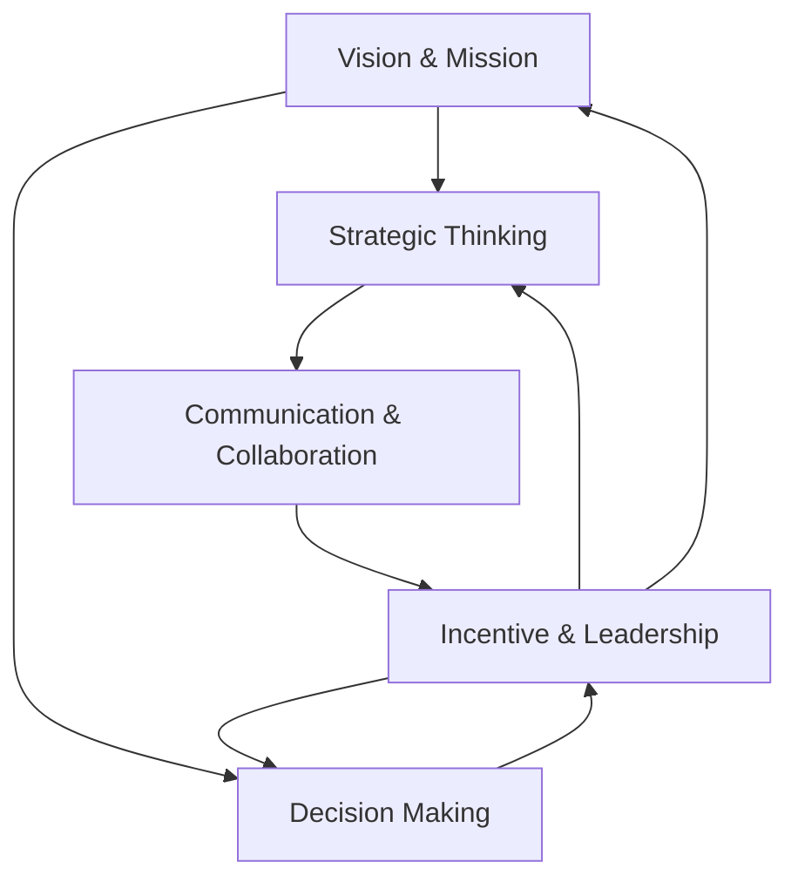

                 

### 文章标题

《领导力修炼笔记：90后创业者的成长之路》

### 关键词

- 领导力
- 90后创业者
- 成长路径
- 创业实战
- 数字化时代

### 摘要

本文旨在探讨90后创业者在数字化时代中如何修炼领导力，以实现个人成长和创业成功。文章首先分析了90后创业者的时代背景和领导力挑战，然后深入探讨了领导力的核心概念及其相互联系，接着通过方法论、量化模型和实际案例，详细阐述了领导力的培养和应用。最后，文章总结了领导力修炼的实践路径，并探讨了未来领导力的发展趋势，为读者提供了全面而具体的指导。

---

### 引言：90后创业者的时代背景与领导力挑战

#### 90后创业者的特点

90后，作为当代社会的一个特殊群体，具有鲜明的时代特征。他们成长于互联网高度普及的时期，接受了更为全面和多样化的教育。他们更加开放、包容，敢于拥抱变革和创新。此外，90后创业者普遍具有较高的学历和技能，这使得他们在创业领域拥有较强的竞争力。

然而，与前辈相比，90后创业者也面临诸多挑战。首先，他们生于经济全球化和科技迅猛发展的时代，市场竞争激烈，创业环境复杂多变。其次，90后创业者面临着快速迭代的技术更新，必须不断学习新知识、新技能以适应不断变化的市场需求。此外，90后创业者还面临着传统管理和领导力的局限，如何在团队中发挥领导作用、提升团队凝聚力，成为他们亟待解决的问题。

#### 领导力的定义与作用

领导力，是指领导者通过影响和激励他人，实现组织目标的能力。它不仅包括战略规划、决策能力，更涉及到人际关系、情感管理和团队建设等方面。在创业过程中，领导力起着至关重要的作用。

首先，领导力是创业者实现个人愿景和使命的关键。一个优秀的创业者，需要具备远见卓识，能够清晰地描绘出企业的发展蓝图，并带领团队朝着目标前进。

其次，领导力有助于凝聚团队力量。创业过程中，团队成员的协作和凝聚力至关重要。一个具有领导力的创业者，能够激发团队成员的积极性和创造力，形成合力，共同应对挑战。

最后，领导力是提升企业竞争力的关键。在激烈的市场竞争中，一个具备领导力的创业者，能够带领企业不断创新、突破自我，从而在市场中脱颖而出。

### 小结

本文引言部分从90后创业者的特点入手，分析了他们所面临的领导力挑战。随后，我们对领导力的定义和作用进行了探讨，为后续章节的内容奠定了基础。

---

### 领导力的核心概念与架构

要深入理解领导力，我们首先需要明确其核心概念。领导力并非单一的能力，而是由多个要素构成的复杂体系。以下是领导力中的一些关键概念：

1. **愿景与使命**：领导者需要具备远见，能够为企业设定清晰的愿景和使命，激发团队成员的归属感和使命感。
2. **战略思维**：领导者应具备战略规划能力，能够根据市场环境和企业目标，制定切实可行的战略方案。
3. **决策能力**：领导者需在关键时刻作出明智的决策，引导企业走向正确的方向。
4. **沟通与协作**：领导者需要具备优秀的沟通技巧，能够有效传达信息，促进团队内部的协作。
5. **激励与领导**：领导者应能够激励团队成员，激发他们的潜能，形成积极向上的团队文化。

#### 核心概念之间的联系

这些核心概念并非孤立存在，而是相互联系、相互影响的。例如，愿景和使命是战略思维的基石，而决策能力和战略思维又直接影响着企业的目标和方向。同时，沟通与协作能力是激励与领导的基础，一个善于沟通的领导者能够更好地理解团队成员的需求，从而更好地激励他们。

为了更直观地展示这些概念之间的关系，我们可以使用Mermaid流程图来表示。以下是一个简化的Mermaid流程图，用于描述领导力的核心概念及其相互联系：

在这个流程图中，每个节点代表一个核心概念，箭头表示概念之间的联系。通过这个图，我们可以更清晰地看到领导力的各个要素是如何相互作用的。

#### 核心概念的层次结构

除了相互联系，这些核心概念还可以被视为一个层次结构。顶层是愿景与使命，这是领导力的核心驱动力。其次是战略思维、决策能力、沟通与协作，这些是实现愿景与使命的关键能力。最底层是激励与领导，这是确保团队高效运作和持续发展的关键。

这种层次结构有助于我们更好地理解领导力，并在实践中有针对性地提升各个方面的能力。

#### 小结

本章节深入探讨了领导力的核心概念及其相互联系。通过Mermaid流程图，我们以直观的方式展示了这些概念之间的关系。了解这些核心概念及其层次结构，对于培养和提升领导力具有重要意义。

---

### 领导力培养的方法论

领导力的培养并非一朝一夕之功，而是需要通过长期的学习和实践不断积累和提升。以下是一些关键的领导力培养方法论，包括自我认知与提升、情感管理、团队领导力培养等方面。

#### 自我认知与提升

自我认知是领导力培养的基础。一个优秀的领导者首先需要了解自己的优点和不足，明确自己的价值观和目标。以下是一些自我认知与提升的方法：

1. **反思与自我评估**：定期反思自己的行为和决策，进行自我评估，识别自身的优点和不足。通过这种方式，可以逐步明确自己的发展方向。
2. **阅读与学习**：阅读是提升自我认知和知识水平的重要途径。领导者应广泛阅读各类书籍，特别是与领导力、管理、心理学等相关的书籍，从中汲取经验教训。
3. **请教与咨询**：向身边的同事、朋友、导师等请教，听取他们的意见和建议。他们的反馈可以帮助我们更全面地了解自己，从而进行有针对性的提升。

#### 情感管理

情感管理是领导力的重要组成部分。一个具备情感管理能力的领导者能够更好地处理人际关系，提升团队的凝聚力和工作效率。以下是一些情感管理的方法：

1. **情绪识别与调控**：领导者需要学会识别和调控自己的情绪。在遇到压力和挫折时，保持冷静，避免情绪波动影响决策和团队氛围。
2. **同理心与倾听**：领导者应具备同理心，能够站在他人的角度思考问题，倾听他们的需求和意见。这有助于建立信任，提升团队协作效率。
3. **激励与鼓励**：领导者需要学会激励和鼓励团队成员，认可他们的努力和成就。通过积极的情感反馈，可以增强团队成员的自信心和动力。

#### 团队领导力培养

团队领导力培养是领导力培养的核心内容。一个优秀的领导者不仅需要提升自我，还需要带领整个团队不断进步。以下是一些团队领导力培养的方法：

1. **明确目标与职责**：领导者需要明确团队的目标和每个成员的职责，确保团队成员了解自己的工作内容和期望，从而更好地发挥个人能力。
2. **沟通与协作**：领导者应注重团队内部的沟通与协作，建立良好的沟通机制，鼓励团队成员分享想法和意见，形成合力。
3. **培训与成长**：领导者需要为团队成员提供培训和学习机会，帮助他们不断提升技能和能力。通过培训，可以增强团队的整体竞争力。
4. **激励与反馈**：领导者应定期对团队成员进行激励和反馈，认可他们的努力和成就，同时指出不足和改进方向。

#### 小结

本章节详细阐述了领导力培养的方法论，包括自我认知与提升、情感管理和团队领导力培养等方面。通过这些方法论，领导者可以逐步提升自己的能力，带领团队实现共同的目标。

---

### 领导力评估与量化模型

在领导力培养的过程中，评估和量化领导力的重要性不容忽视。通过科学的评估和量化模型，领导者可以更加清晰地了解自己的优势和不足，从而进行有针对性的提升。以下将介绍领导力评估的重要性、评估工具和方法，以及具体的量化模型。

#### 评估的重要性

领导力评估有助于领导者全面了解自己的领导能力，识别潜在的问题和改进点。同时，评估还可以为组织提供决策依据，帮助选拔合适的领导者，优化团队结构和提升整体管理水平。此外，领导力评估还可以促进领导者的自我认知和成长，激发其积极性和责任感。

#### 评估工具和方法

常见的领导力评估工具和方法包括自我评估、360度评估、行为事件访谈（BEI）等。

1. **自我评估**：自我评估是领导者自我反思和认识自己的重要手段。通过填写问卷或撰写个人报告，领导者可以自我评价自己在各个领导力维度的表现，从而识别自身的优势和不足。

2. **360度评估**：360度评估是一种全面的领导力评估方法，通过收集来自上级、同事、下属和客户等多方面的反馈，对领导者的能力进行全面评估。这种方法能够提供多维度的视角，帮助领导者更全面地了解自己的领导风格和能力。

3. **行为事件访谈（BEI）**：BEI是一种基于行为的领导力评估方法，通过访谈的方式收集领导者过去在特定情境下的行为和表现。这种方法能够深入了解领导者的实际行为和决策能力，提供更为具体和真实的反馈。

#### 量化模型

在领导力评估中，量化模型是评估和衡量领导力的重要工具。以下介绍几种常见的量化模型：

1. **360度评估模型**：这是一种基于分数的量化模型，通过给定的评估维度和评分标准，对领导者的各项能力进行量化评估。例如，可以设定领导力、沟通能力、团队管理能力等维度，每个维度设定一定的分数范围，根据领导者的实际表现给予相应的分数。

2. **行为锚定评价量表（BARS）**：这是一种基于行为的评价量表，通过将领导行为划分为不同的等级，对领导者的行为进行评分。例如，可以将领导行为划分为“非常优秀”、“优秀”、“良好”、“一般”等等级，根据领导者的具体行为表现进行评分。

3. **领导者行为量表（LBA）**：这是一种综合性的量化模型，通过多个维度的评估指标，对领导者的行为和能力进行全面评价。例如，可以设定领导力、决策能力、团队管理能力、沟通能力等多个维度，每个维度设定具体的评价指标，根据领导者的实际表现进行评分。

#### 案例分析

以下是一个基于360度评估模型的领导力评估案例：

**评估对象**：某公司部门经理

**评估维度**：

1. **领导力**：包括决策能力、团队管理能力、目标设定能力等
2. **沟通能力**：包括沟通技巧、倾听能力、信息传达能力等
3. **团队管理能力**：包括团队建设、员工激励、工作协调等

**评估标准**：

1. **领导力**：非常优秀（90-100分）、优秀（80-89分）、良好（70-79分）、一般（60-69分）
2. **沟通能力**：非常优秀（90-100分）、优秀（80-89分）、良好（70-79分）、一般（60-69分）
3. **团队管理能力**：非常优秀（90-100分）、优秀（80-89分）、良好（70-79分）、一般（60-69分）

**评估结果**：

- 领导力：90分
- 沟通能力：85分
- 团队管理能力：88分

通过这个案例，我们可以看到评估对象在各个维度上的得分，从而了解其领导力的优势和不足。在此基础上，领导者可以制定相应的改进计划，进一步提升自己的领导能力。

#### 小结

本章节详细介绍了领导力评估的重要性、评估工具和方法，以及具体的量化模型。通过科学的评估和量化模型，领导者可以更加准确地了解自己的领导能力，从而进行有针对性的提升。同时，评估也为组织提供了决策依据，有助于优化团队结构和提升整体管理水平。

---

### 实战篇：创业中的领导力应用

在创业过程中，领导力是至关重要的。一个成功的创业者不仅需要有远见和创新思维，更需要具备卓越的领导力，以应对各种挑战，带领团队走向成功。以下将通过一个实际创业案例，详细解析创业中的领导力应用。

#### 案例背景

某科技公司由三位90后创业者共同创立，专注于人工智能领域。公司成立之初，面临着技术难题、资金压力和市场竞争等多重挑战。作为公司创始人，他们必须发挥领导力，带领团队渡过难关。

#### 领导力在创业项目中的应用

1. **愿景与使命的设定**：

   创始人之一小李在项目启动之初，明确了公司的愿景和使命：“成为人工智能领域的领军企业，推动人工智能技术的普及与应用。”这个清晰的愿景和使命不仅为团队成员指明了方向，也激发了他们的工作热情和使命感。

2. **战略思维的制定**：

   小李通过深入研究市场和技术趋势，制定了一系列切实可行的战略方案。例如，他们决定首先攻克人工智能领域的技术难关，然后逐步拓展市场，寻找合作伙伴。这个战略思维不仅为公司的发展奠定了基础，也为团队成员提供了明确的工作目标。

3. **决策能力的体现**：

   在项目推进过程中，小张作为公司的技术负责人，面临着诸多技术难题。每当遇到关键决策时，他都能够冷静分析，做出明智的决策。例如，在某个技术瓶颈面前，他决定投入更多资源进行攻关，最终成功突破了技术难题。

4. **沟通与协作的促进**：

   作为团队的领导者，小王注重团队内部的沟通与协作。他定期召开团队会议，倾听成员的意见和建议，确保每个成员都清楚自己的工作职责和目标。通过有效的沟通，团队成员之间的协作效率得到了显著提升。

5. **激励与领导**：

   小李通过激励和领导，激发了团队成员的积极性和创造力。他经常表扬和鼓励团队成员，认可他们的努力和成就。此外，他还制定了激励政策，为表现优秀的团队成员提供奖励，从而进一步提升了团队的整体战斗力。

#### 项目分析与经验总结

通过这个案例，我们可以看到领导力在创业项目中的应用和重要性。以下是对项目的分析和经验总结：

1. **清晰的愿景和使命是团队前进的动力**。一个明确的愿景和使命不仅能够指引团队的方向，还能激发团队成员的归属感和使命感。

2. **战略思维和决策能力是创业成功的关键**。创业者需要具备敏锐的市场洞察力和决策能力，以制定出切实可行的战略方案，引领团队前进。

3. **沟通与协作是团队高效运作的基础**。良好的沟通机制和协作文化能够提升团队的工作效率，形成合力。

4. **激励与领导是提升团队战斗力的关键**。通过激励和领导，可以激发团队成员的积极性和创造力，形成积极向上的团队文化。

#### 小结

本章节通过一个实际创业案例，详细解析了创业中的领导力应用。从愿景与使命的设定，到战略思维的制定，再到决策能力的体现，以及沟通与协作的促进和激励与领导，领导力在创业过程中起到了至关重要的作用。通过这个案例，我们不仅可以了解领导力在创业中的实际应用，还能从中汲取宝贵的经验，为未来的创业之路提供指导。

---

### 领导力修炼的实践路径

领导力的修炼并非一蹴而就，而是需要通过一系列实践路径逐步提升。以下将详细阐述个人成长计划、团队建设策略和持续改进的方法。

#### 个人成长计划

个人成长计划是领导力修炼的基础。一个优秀的领导者首先需要了解自己的优势和不足，制定具体可行的成长计划。以下是一些个人成长计划的步骤：

1. **自我评估**：首先，领导者需要对自己进行全面的评估，包括性格特点、技能水平、知识储备等方面。通过自我评估，可以明确自己的优势和不足，为制定成长计划提供依据。

2. **设定目标**：在自我评估的基础上，领导者应设定明确的成长目标。这些目标可以是短期的，也可以是长期的，但必须具体、可衡量。例如，提升某项技能、阅读一定数量的书籍、参加某个培训课程等。

3. **制定行动计划**：为了实现成长目标，领导者需要制定具体的行动计划。例如，为了提升某项技能，可以安排每周学习一定的时间，或者报名参加相关的培训课程。通过制定行动计划，可以确保成长目标的实现。

4. **持续反思与调整**：在执行成长计划的过程中，领导者需要不断反思自己的行为和效果，评估成长计划的合理性。如果发现计划存在不足，应及时进行调整，以确保成长目标的实现。

#### 团队建设策略

团队建设是领导力修炼的重要组成部分。一个成功的领导者需要懂得如何打造一个高效、和谐的团队。以下是一些团队建设策略：

1. **明确团队目标**：领导者需要与团队成员共同明确团队的目标，确保每个成员都了解自己的工作职责和团队的使命。这有助于提高团队的凝聚力和工作效率。

2. **建立良好的沟通机制**：领导者应建立畅通的沟通渠道，鼓励团队成员之间的交流和反馈。通过定期的团队会议、讨论和分享，可以增进团队成员之间的了解和信任。

3. **培养团队文化**：领导者需要培养积极向上的团队文化，包括团队合作、共同进步、创新思维等。通过团队文化建设，可以激发团队成员的积极性和创造力。

4. **激励与认可**：领导者应定期对团队成员进行激励和认可，表扬他们的努力和成就。通过激励和认可，可以增强团队成员的自信心和归属感。

#### 持续改进

持续改进是领导力修炼的持续动力。一个优秀的领导者需要不断反思和改进自己的领导方法和团队管理策略，以适应不断变化的市场环境和团队需求。以下是一些持续改进的方法：

1. **定期评估**：领导者应定期对团队的绩效和领导力进行评估，识别存在的问题和改进点。通过定期评估，可以确保团队始终处于最佳状态。

2. **学习与借鉴**：领导者应保持学习的态度，关注行业动态和最佳实践。通过学习，可以借鉴他人的成功经验，提升自己的领导力。

3. **创新与突破**：领导者需要勇于创新，敢于突破传统思维和框架。通过创新，可以推动团队不断进步，保持竞争力。

4. **培养团队成员的自主性**：领导者应鼓励团队成员发挥自主性，积极参与团队决策和项目执行。通过培养自主性，可以提升团队成员的能力和责任感。

#### 小结

本章节详细阐述了领导力修炼的实践路径，包括个人成长计划、团队建设策略和持续改进的方法。通过这些实践路径，领导者可以不断提升自己的能力，打造一个高效、和谐的团队，为企业的持续发展奠定坚实基础。

---

### 未来领导力的发展趋势

随着科技的不断进步和社会的快速变迁，未来领导力也将面临诸多新的挑战和机遇。以下将探讨数字化时代领导力的特点、面临的挑战以及未来的发展趋势。

#### 数字化时代领导力的特点

1. **敏捷性**：数字化时代，市场和技术更新速度极快，领导者需要具备高度的敏捷性，能够迅速适应变化，调整战略和决策。

2. **创新性**：数字化时代，创新成为企业发展的重要驱动力。领导者需要具备创新思维，鼓励团队不断探索新的业务模式和解决方案。

3. **数据驱动**：数字化时代，数据成为重要的战略资源。领导者需要具备数据分析和应用能力，利用数据驱动决策，提升企业的竞争力。

4. **跨职能协作**：数字化时代，业务流程和团队结构更加复杂，领导者需要具备跨职能协作能力，推动各部门之间的有效协作。

#### 面临的挑战

1. **技术变革**：数字化时代的到来，带来了技术的快速迭代，领导者需要不断学习新知识、新技能，以应对技术变革带来的挑战。

2. **信息过载**：数字化时代，信息量爆炸性增长，领导者需要具备信息筛选和处理能力，避免被海量信息所淹没。

3. **人才竞争**：数字化时代，人才成为企业发展的核心资源。领导者需要具备人才管理和培养能力，吸引和留住优秀人才。

4. **伦理和社会责任**：数字化时代，企业面临更多的伦理和社会责任挑战。领导者需要具备良好的道德和社会责任感，推动企业可持续发展。

#### 未来发展趋势

1. **人工智能与领导力**：随着人工智能技术的发展，未来领导力将更加依赖于数据分析、预测和自动化。领导者需要学会与人工智能协作，利用人工智能提升决策效率和效果。

2. **远程办公与领导力**：随着远程办公的普及，未来领导力将更加注重远程管理和团队协作。领导者需要具备远程沟通、激励和管理能力，确保远程团队的效率和凝聚力。

3. **生态化领导力**：未来企业将更加注重生态化发展，领导者需要具备生态化思维，推动企业与社会、环境的和谐共生。

4. **终身学习与领导力**：未来社会，知识更新速度加快，领导者需要具备终身学习的能力，不断适应新的变化和挑战。

#### 小结

未来领导力的发展趋势将受到数字化时代的影响，领导者需要具备敏捷性、创新性、数据驱动和跨职能协作等能力。同时，领导者也将面临技术变革、信息过载、人才竞争和伦理社会责任等挑战。为了应对这些挑战，领导者需要不断学习和成长，提升自身的领导力和适应能力。

---

### 结论：领导力与创业成功的紧密联系

通过本文的探讨，我们可以清晰地看到领导力在创业成功中的核心作用。90后创业者在数字化时代背景下，面临着前所未有的挑战和机遇。他们需要具备卓越的领导力，才能在激烈的市场竞争中脱颖而出，实现个人和企业的共同成长。

领导力不仅关乎创业者的个人素质，更涉及到团队的凝聚力和企业的竞争力。一个具备领导力的创业者，能够设定清晰的愿景和使命，制定科学的战略方案，做出明智的决策，同时具备出色的沟通和协作能力，激发团队的积极性和创造力。

未来，随着科技的不断进步和社会的快速变迁，领导力将面临新的挑战和机遇。90后创业者需要具备敏捷性、创新性、数据驱动和跨职能协作等能力，以适应数字化时代的发展趋势。同时，他们还需要具备终身学习的能力，不断提升自身的领导力，以应对不断变化的商业环境。

总之，领导力是90后创业者的核心竞争力，是创业成功的基石。通过不断修炼和提升领导力，90后创业者将能够在数字化时代中创造更多的价值，实现个人和企业的共同辉煌。

### 作者信息

- 作者：AI天才研究院/AI Genius Institute & 禅与计算机程序设计艺术 /Zen And The Art of Computer Programming

---

至此，我们完成了《领导力修炼笔记：90后创业者的成长之路》的技术博客文章。本文从90后创业者的时代背景和领导力挑战入手，详细探讨了领导力的核心概念、培养方法论、量化模型和实际应用，并展望了未来领导力的发展趋势。希望本文能对广大创业者和管理者提供有价值的参考和启示。

