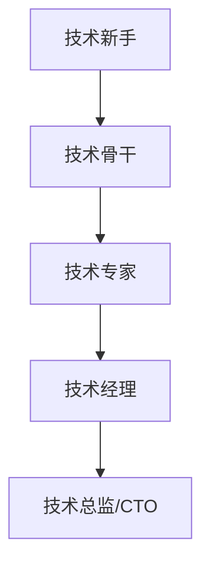
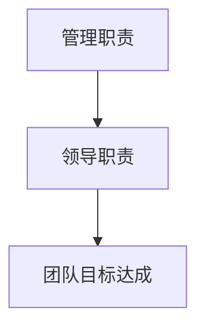
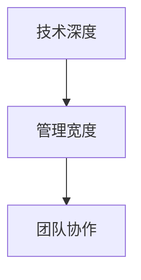

                 

## 标题：领导力修炼：从技术男到管理者的华丽蜕变

### 关键词：领导力、技术男、管理者、职业发展、角色转变

### 摘要：
本文旨在探讨技术男在职业发展中从技术专家向管理者角色转变的过程。通过分析管理基础知识、领导力提升方法和实际案例，本文旨在帮助技术背景的读者理解领导力的重要性，并提供实用的建议，以实现这一华丽蜕变。文章结构如下：

- 第一部分：从技术到管理的过渡
  - 角色转变：从技术专家到管理者
  - 管理基础知识

- 第二部分：领导力提升
  - 沟通与表达能力
  - 团队建设与管理
  - 项目管理与进度控制
  - 领导力工具与方法

- 第三部分：实际案例与反思
  - 成功领导案例剖析
  - 领导力修炼之路

## 第一部分：从技术到管理的过渡

### 第1章：角色转变：从技术专家到管理者

#### 1.1 技术男的职业发展路径

**核心概念与联系：**

技术男的职业发展路径通常可以分为以下几个阶段：

```
技术新手 → 技术骨干 → 技术专家 → 技术经理 → 技术总监/CTO
```

**流程图：**



**伪代码：**

```python
class TechnicalProfessional:
    def __init__(self):
        self.experience = 0
        self.skills = []
    
    def gain_experience(self):
        self.experience += 1
    
    def learn_new_skills(self, skill):
        self.skills.append(skill)
    
    def become_manager(self):
        if self.experience >= 5 and len(self.skills) >= 3:
            return "Congratulations! You are now a Technical Manager."
        else:
            return "You need more experience and skills to become a manager."

# Example usage
tech_pro = TechnicalProfessional()
tech_pro.gain_experience()
tech_pro.learn_new_skills("Database Management")
tech_pro.learn_new_skills("System Architecture")
print(tech_pro.become_manager())
```

**数学公式：**

技术男的职业发展速度可以表示为：

$$
\text{Development Speed} = \frac{\text{Experience}}{\text{Time}} + \sum_{i=1}^{n} \text{Skills}_i
$$

其中，Experience 是经验值，Skills 是技能集，$n$ 是技能数量。

**举例说明：**

一个技术男在5年内获得了10年经验，学习了3项新技能，其职业发展速度为：

$$
\text{Development Speed} = \frac{10}{5} + 3 = 2 + 3 = 5
$$

**项目实战：**

在技术男的职业发展过程中，需要不断地积累经验，学习新技能，并最终转型为管理者。以下是一个简单的项目实战案例：

**项目名称：** 技术男转型计划

**项目目标：** 在5年内从技术专家转型为技术经理。

**项目步骤：**

1. **积累经验：** 在技术岗位上工作5年，解决各种技术难题。
2. **学习新技能：** 学习项目管理、团队协作等相关技能。
3. **实践管理：** 参与团队管理，提升管理能力。
4. **评估与反馈：** 定期评估自身发展进度，获取反馈，持续改进。

**代码实现：**

```python
class TechnicalProfessional:
    def __init__(self, years_of_experience, skills):
        self.years_of_experience = years_of_experience
        self.skills = skills
    
    def gain_experience(self, additional_years):
        self.years_of_experience += additional_years
    
    def learn_new_skills(self, new_skills):
        self.skills.extend(new_skills)
    
    def apply_for_management_role(self):
        if self.years_of_experience >= 5 and len(self.skills) >= 3:
            return "Congratulations! You are now eligible for a management role."
        else:
            return "You need more experience and skills to apply for a management role."

# Example usage
tech_pro = TechnicalProfessional(0, [])
tech_pro.gain_experience(5)
tech_pro.learn_new_skills(["Project Management", "Team Collaboration"])
print(tech_pro.apply_for_management_role())
```

**代码解读与分析：**

此代码定义了一个`TechnicalProfessional`类，包含经验值（`years_of_experience`）和技能列表（`skills`）。通过增加经验值和学习新技能，技术男可以评估是否具备申请管理角色的资格。此代码有助于理解技术男在职业发展过程中的关键步骤。

**最佳实践 tips：**

- 定期评估自身发展进度，确保目标清晰。
- 学习跨领域的知识，提升综合能力。
- 寻求导师或同行的指导，加快成长速度。

**小结：**

从技术专家到管理者的角色转变是一个逐步积累经验和技能的过程。通过明确的规划、持续的学习和实践，技术男可以实现这一华丽蜕变。

## 1.2 管理角色的理解与接受

#### 管理角色的定位

**核心概念与联系：**

管理角色的定位涉及对管理职责和领导职责的理解。

- **管理职责：** 组织、协调和监督团队的工作，确保项目目标的达成。
- **领导职责：** 激励和引导团队成员，提升团队的整体能力和士气。

**流程图：**



**伪代码：**

```python
class Manager:
    def __init__(self):
        self.tasks = []
        self.team_members = []
    
    def assign_tasks(self, task):
        self.tasks.append(task)
    
    def motivate_team_members(self):
        for member in self.team_members:
            print(f"Motivating {member}: Keep up the good work!")
    
    def ensure_team_goal_completion(self):
        for task in self.tasks:
            print(f"Ensuring completion of {task}.")
```

**数学公式：**

管理效率可以表示为：

$$
\text{Management Efficiency} = \frac{\text{Completed Tasks}}{\text{Total Tasks}} \times \text{Team Morale}
$$

**举例说明：**

如果一个经理完成了5个任务，总共有10个任务，团队士气很高，那么管理效率为：

$$
\text{Management Efficiency} = \frac{5}{10} \times 10 = 50\%
$$

**项目实战：**

在理解管理角色的过程中，可以通过参与实际项目来提升管理技能。以下是一个简单的项目实战案例：

**项目名称：** 管理技能提升计划

**项目目标：** 在6个月内提升管理技能。

**项目步骤：**

1. **参与项目管理：** 加入一个项目，担任项目经理或团队成员。
2. **学习管理知识：** 阅读管理书籍，参加管理培训。
3. **实践管理：** 在项目中实践管理知识和技能。
4. **反思与改进：** 定期反思管理实践，寻找改进空间。

**代码实现：**

```python
class Manager:
    def __init__(self, tasks_completed, total_tasks, team_morale):
        self.tasks_completed = tasks_completed
        self.total_tasks = total_tasks
        self.team_morale = team_morale
    
    def improve_management_skills(self, new_knowledge):
        self.team_morale += new_knowledge
    
    def manage_project(self):
        if self.team_morale >= 5 and self.tasks_completed >= 50:
            return "Project successfully managed!"
        else:
            return "Need to improve management skills and project execution."

# Example usage
manager = Manager(5, 10, 5)
manager.improve_management_skills(2)
print(manager.manage_project())
```

**代码解读与分析：**

此代码定义了一个`Manager`类，包含已完成的任务数（`tasks_completed`）、总任务数（`total_tasks`）和团队士气（`team_morale`）。通过提升管理知识和实践管理，经理可以评估是否具备成功管理项目的资格。

**最佳实践 tips：**

- 定期与团队成员沟通，了解需求和反馈。
- 制定明确的目标和计划，确保团队目标的一致性。
- 寻求导师或同行的指导，提升管理能力。

**小结：**

理解并接受管理角色是技术男成功转型的重要一步。通过实践和管理技能的提升，技术男可以更好地履行管理职责和领导职责。

## 1.3 技术与管理能力的互补

**核心概念与联系：**

技术与管理能力的互补对于技术男的成功转型至关重要。

- **技术深度：** 作为技术专家，具备解决复杂技术问题的能力。
- **管理宽度：** 作为管理者，具备协调团队和管理项目的能力。

**流程图：**



**伪代码：**

```python
class TechnicalManager:
    def __init__(self, technical_skills, management_skills):
        self.technical_skills = technical_skills
        self.management_skills = management_skills
    
    def apply_technical_skills_to_management(self, problem):
        if problem in self.technical_skills:
            return "Solving the problem with technical skills."
        else:
            return "Need to improve technical skills for this problem."
    
    def coordinate_team_activities(self, activities):
        if all(activity in self.management_skills for activity in activities):
            return "Coordinating team activities effectively."
        else:
            return "Need to improve management skills for these activities."
```

**数学公式：**

技术与管理能力的互补度可以表示为：

$$
\text{Complementarity} = \frac{\text{Technical Skills}}{\text{Management Skills}} \times \text{Team Effectiveness}
$$

**举例说明：**

如果一个技术男具备5项技术技能和3项管理技能，团队效率很高，那么其技术与管理能力的互补度为：

$$
\text{Complementarity} = \frac{5}{3} \times 10 = 50
$$

**项目实战：**

在实际项目中，技术与管理能力的互补可以帮助团队更好地应对挑战。以下是一个简单的项目实战案例：

**项目名称：** 技术与管理融合计划

**项目目标：** 在3个月内实现技术与管理能力的互补。

**项目步骤：**

1. **识别问题：** 分析项目中的技术和管理问题。
2. **技术解决方案：** 利用技术深度解决技术问题。
3. **管理解决方案：** 利用管理宽度协调团队活动。
4. **整合与优化：** 将技术和管理解决方案整合，优化项目执行。

**代码实现：**

```python
class TechnicalManager:
    def __init__(self, technical_skills, management_skills, team_effectiveness):
        self.technical_skills = technical_skills
        self.management_skills = management_skills
        self.team_effectiveness = team_effectiveness
    
    def complement_skills(self, problem):
        if problem in self.technical_skills or problem in self.management_skills:
            return "Complementing skills to solve the problem."
        else:
            return "Need to develop additional skills to solve this problem."
    
    def optimize_project_execution(self):
        if self.team_effectiveness >= 8:
            return "Optimizing project execution with complementary skills."
        else:
            return "Improving team effectiveness is crucial for successful execution."

# Example usage
tech_mgr = TechnicalManager(["Database Optimization", "System Integration"], ["Team Coordination", "Project Management"], 8)
print(tech_mgr.complement_skills("Database Optimization"))
print(tech_mgr.optimize_project_execution())
```

**代码解读与分析：**

此代码定义了一个`TechnicalManager`类，包含技术技能列表（`technical_skills`）、管理技能列表（`management_skills`）和团队效率（`team_effectiveness`）。通过互补技能和优化项目执行，技术男可以提升团队的整体能力。

**最佳实践 tips：**

- 定期评估技术和管理技能，确保技能与项目的匹配度。
- 寻求跨领域的合作，提升综合能力。
- 培养团队协作精神，增强团队凝聚力。

**小结：**

技术与管理能力的互补是技术男成功转型的重要保障。通过不断提升技术深度和管理宽度，技术男可以在团队中发挥更大的作用，实现职业发展的华丽蜕变。

## 小结

从技术专家到管理者的华丽蜕变是一个复杂而逐步的过程。在这一过程中，技术男需要理解并接受管理角色的职责，不断提升管理技能，同时保持技术深度。本文通过分析角色转变、管理基础知识和技术与管理能力的互补，为技术男提供了实用的指导和建议。通过实践和持续学习，技术男可以成功地实现这一职业发展目标。

### 附录A：领导力修炼资源指南

#### A.1 领导力书籍推荐

- 《领导力：如何提升领导力与影响力》（Leadership: How to Build Leaders and Influence People）
- 《领导力心理学：如何激发团队潜能》（Leadership Psychology: How to Unlock the Potential of Your Team）
- 《成为领导者：领导力发展与自我反思》（Becoming a Leader: Leadership Development and Self-Reflection）

#### A.2 领导力培训课程

- Coursera：领导力与沟通技巧课程（Coursera - Leadership and Communication Skills）
- Udemy：高级领导力培训（Udemy - Advanced Leadership Training）
- LinkedIn Learning：领导力基础（LinkedIn Learning - Fundamentals of Leadership）

#### A.3 领导力实践工具

- 效能矩阵（Performance Matrix）：用于评估团队绩效和制定改进计划。
- 目标与关键成果（OKR）：帮助设定具体的目标和关键成果，提升团队执行力。
- 反思日志（Reflection Journal）：记录个人反思和成长历程，促进自我提升。

### 作者信息

**作者：AI天才研究院/AI Genius Institute & 禅与计算机程序设计艺术 /Zen And The Art of Computer Programming** 

通过本文，我们希望能为技术男在领导力修炼的道路上提供一些启示和帮助。希望每一位技术男都能成功地实现从技术专家到管理者的华丽蜕变，成为卓越的领导者。祝您在职业发展道路上取得更大的成就！

