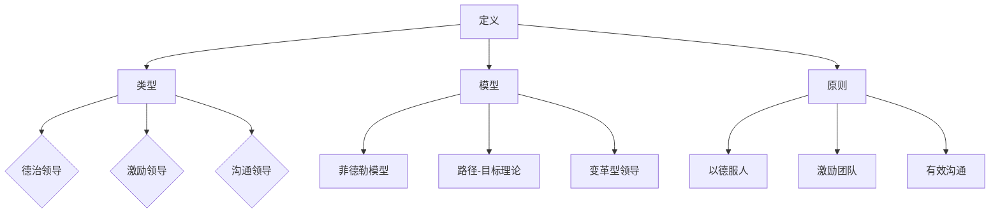
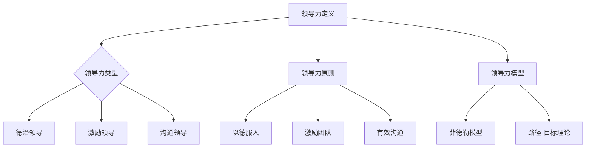

                 


### 文章标题
《领导力修炼：从新手到大师的成长之路》

### 文章关键词
- 领导力
- 成长
- 管理技巧
- 沟通
- 团队建设

### 文章摘要
本文旨在探讨领导力的发展路径，从新手到大师的成长过程。我们将通过详细的理论介绍、实践技巧分享、案例分析以及反思与持续提升的策略，帮助读者理解和掌握领导力的核心要素，提升个人和团队的效能。

### 目录大纲

## 引言
### 第1章 领导力的本质
- **背景介绍**：领导力的重要性与现状
- **核心概念与联系**：领导力的定义、类型与关键要素（Mermaid流程图）
- **领导力的发展历程**

## 基础理论
### 第2章 领导力模型
- **经典领导力模型**：如菲德勒模型、路径-目标理论
- **领导力模型的应用场景**：不同情境下的适用模型

### 第3章 领导力原则
- **以德服人**：道德领导力的重要性
- **激励团队**：如何激发团队成员的积极性
- **有效沟通**：沟通策略与技巧

## 实践技巧
### 第4章 领导力提升方法
- **自我认知**：自我评估与提升路径
- **时间管理**：提高工作效率的策略
- **决策能力**：如何做出明智的决策

### 第5章 领导力技巧
- **团队建设**：构建高效团队的策略
- **激励**：如何激励团队成员
- **冲突管理**：处理团队内部的冲突

## 成长与反思
### 第6章 领导力成长过程
- **成长阶段**：新手到大师的成长路径
- **成长障碍**：如何克服成长中的困难

### 第7章 反思与持续提升
- **反思的重要性**：反思在领导力提升中的作用
- **持续提升策略**：如何持续提升领导力

## 案例分析
### 第8章 领导力实践案例
- **成功案例**：分析成功的领导力实践
- **失败案例**：探讨领导力失败的教训
- **案例启示**：总结案例中的领导力关键点

## 结论
### 第9章 领导力修炼之道
- **最佳实践**：提炼领导力修炼的最佳实践
- **小结**：总结全文的核心观点
- **注意事项**：提醒读者在修炼领导力过程中需要注意的事项
- **拓展阅读**：推荐相关阅读资源

### 背景介绍
在当今快速变化和竞争激烈的环境中，领导力已经成为企业和组织成功的关键因素。无论是企业管理者、项目经理，还是技术团队的领导者，领导力都是他们必须掌握的核心技能。本文旨在通过系统的理论和实践指导，帮助读者从新手逐步成长为领导力大师。

### 核心概念与联系
首先，我们需要明确领导力的核心概念。领导力不仅仅是权力和权威的体现，更是一种影响力，是一种激励和引导他人共同实现目标的能力。我们可以通过以下Mermaid流程图来展示领导力的核心概念及其相互联系：



### 领导力的发展历程
领导力的发展可以追溯到古代，但现代领导力的研究和理论主要是在20世纪以来逐步形成的。以下是一个简要的领导力发展历程：

1. **领导风格理论**：20世纪初期，领导风格开始受到关注，如独裁式领导、民主式领导等。
2. **特质理论**：领导特质被认为是决定领导力的关键因素，如自信、正直等。
3. **行为理论**：领导行为的研究开始兴起，关注领导者的具体行为对团队的影响。
4. **情境理论**：领导力不再被视为一种固定的风格，而是要根据不同情境进行灵活调整。
5. **变革型领导**：20世纪80年代后，变革型领导成为研究热点，强调领导者通过变革引领团队。

### 第2章 领导力模型
#### 经典领导力模型介绍
领导力模型提供了理解和应用领导力的框架。以下是一些经典的领导力模型：

1. **菲德勒模型**：基于情境的领导理论，认为领导力效果取决于领导风格与情境的匹配度。
   - **核心算法原理**：
     ```
     function fiedlerModel(leaderStyle, situationality) {
         if (leaderStyle == 'Task-Oriented' && situationality == 'High') {
             return 'High Effectiveness';
         } else if (leaderStyle == 'People-Oriented' && situationality == 'Low') {
             return 'High Effectiveness';
         } else {
             return 'Medium Effectiveness';
         }
     }
     ```
2. **路径-目标理论**：认为领导者的任务是明确目标并提供路径，帮助团队成员达成目标。
   - **核心算法原理**：
     ```
     function pathGoalModel(leaderBehavior, subordinateMotivation) {
         if (leaderBehavior == 'Directive' && subordinateMotivation == 'Low') {
             return 'Increased Task Performance';
         } else if (leaderBehavior == 'Supportive' && subordinateMotivation == 'High') {
             return 'Increased Task Performance & Job Satisfaction';
         } else {
             return 'Medium Effectiveness';
         }
     }
     ```

#### 不同领导力模型的应用场景
- **菲德勒模型**：适用于需要高度结构化或高度混乱的情境。
- **路径-目标理论**：适用于目标明确且团队成员需要指导和支持的情境。

### 第3章 领导力原则
#### 以德服人
德治领导认为领导者的道德品质是领导力的基础。以下是一些关键点：

1. **正直**：领导者需要诚实守信，言行一致。
2. **透明**：领导者应保持信息的透明度，增强团队的信任感。
3. **公正**：领导者应公正无私，对待团队成员一视同仁。

#### 激励团队
激励是领导力的重要方面。以下是一些激励团队成员的方法：

1. **目标设定**：设定明确、可衡量的目标，激发团队成员的积极性。
2. **认可与奖励**：对团队成员的成就给予认可和奖励，增强其工作动力。
3. **参与决策**：让团队成员参与决策过程，增强其责任感和归属感。

#### 有效沟通
有效沟通是领导者与团队成员之间建立良好关系的基础。以下是一些沟通技巧：

1. **倾听**：主动倾听团队成员的意见和反馈，理解其需求和期望。
2. **清晰表达**：明确、简洁地表达自己的观点和期望，避免歧义。
3. **反馈**：及时给予团队成员反馈，帮助他们改进工作。

### 第4章 领导力提升方法
#### 自我认知
自我认知是领导力提升的第一步。以下是一些自我认知的方法：

1. **反思日志**：定期记录自己的工作经历和感受，反思自己的行为和决策。
2. **360度评估**：通过同事、下属和上级的反馈，全面了解自己的领导力状况。
3. **心理测试**：如MBTI、DISC等，帮助了解自己的性格特点和优势。

#### 时间管理
时间管理是提升领导力的重要方面。以下是一些时间管理的方法：

1. **制定计划**：提前制定工作计划，合理安排时间，避免拖延。
2. **优先级排序**：根据任务的重要性和紧急程度，合理安排工作顺序。
3. **避免干扰**：在工作时尽量减少干扰，保持专注。

#### 决策能力
决策能力是领导者的重要能力。以下是一些提升决策能力的方法：

1. **信息收集**：充分收集相关信息，全面了解问题的各个方面。
2. **评估风险**：对决策可能带来的风险进行评估，制定相应的应对策略。
3. **快速决策**：在紧急情况下，能够快速做出决策，采取行动。

### 第5章 领导力技巧
#### 团队建设
团队建设是领导者的重要任务。以下是一些团队建设的策略：

1. **共同目标**：明确团队的目标和愿景，确保团队成员的共识。
2. **角色分工**：明确团队成员的角色和职责，发挥各自的优势。
3. **沟通渠道**：建立有效的沟通渠道，促进团队成员之间的信息交流。

#### 激励
激励是保持团队活力和动力的重要手段。以下是一些激励策略：

1. **认可与奖励**：对团队成员的成就给予认可和奖励，增强其工作动力。
2. **参与决策**：让团队成员参与决策过程，增强其责任感和归属感。
3. **成长机会**：提供团队成员成长和发展的机会，激发其潜能。

#### 应对冲突
冲突是团队中不可避免的现象。以下是一些应对冲突的策略：

1. **积极倾听**：倾听冲突各方的意见和感受，理解其立场和需求。
2. **寻找共识**：寻找冲突各方的共同点，寻求解决方案。
3. **中立调解**：作为领导者，要站在中立的角度，公正地调解冲突。

### 第6章 领导力成长过程
#### 成长阶段与特征
领导力的成长可以分为以下几个阶段：

1. **新手阶段**：刚刚开始领导工作的阶段，对领导力知识和技能的掌握较为有限。
2. **熟练阶段**：经过一段时间的实践，开始掌握一定的领导力技巧，能够较为有效地管理团队。
3. **专家阶段**：具备丰富的领导力经验，能够灵活应对各种复杂情境，具备较高的领导力素养。

#### 成长障碍与突破
在领导力成长过程中，可能会遇到以下障碍：

1. **认知局限**：缺乏对领导力的全面理解和认识，导致领导力提升缓慢。
   - **突破方法**：通过学习领导力理论和案例，拓宽认知视野。
2. **经验不足**：缺乏实际领导经验，难以应对复杂情境。
   - **突破方法**：通过实际工作项目和培训，积累领导经验。
3. **自我认知不足**：对自己的优势和不足缺乏清晰的认识，导致领导力提升受限。
   - **突破方法**：通过反思和360度评估，提升自我认知。

### 第7章 反思与持续提升
#### 反思的重要性
反思是领导力提升的重要环节。通过反思，领导者可以：

1. **总结经验**：从成功和失败中总结经验教训，为后续工作提供参考。
2. **发现问题**：识别自己在领导力实践中的不足，制定改进措施。
3. **持续进步**：通过反思，不断调整自己的领导风格和策略，实现持续进步。

#### 如何进行有效反思
进行有效反思可以遵循以下步骤：

1. **设定反思目标**：明确反思的目的和重点，确保反思具有针对性。
2. **收集反思材料**：收集与领导力实践相关的数据和信息，为反思提供依据。
3. **分析问题**：对反思材料进行深入分析，找出存在的问题和原因。
4. **制定改进计划**：根据分析结果，制定具体的改进措施和时间表。

#### 持续提升领导力的策略
为了持续提升领导力，领导者可以采取以下策略：

1. **学习与培训**：不断学习领导力理论和实践，参加相关培训课程。
2. **实践与反思**：将学到的知识和技能应用到实际工作中，通过反思不断优化。
3. **寻求反馈**：主动寻求同事、下属和上级的反馈，了解自己的优势和不足。
4. **培养团队**：关注团队成员的成长和发展，帮助他们提升能力。

### 第8章 领导力实践案例
#### 成功案例
以下是一个领导力成功的案例：

**案例**：某公司CEO通过变革型领导，带领团队实现了业务转型和增长。

**分析**：CEO通过明确愿景、激励团队、创新管理方式，成功推动了公司的发展。

#### 失败案例
以下是一个领导力失败的案例：

**案例**：某项目经理由于缺乏沟通技巧，导致项目团队士气低落，项目延期。

**分析**：项目经理未能及时沟通项目进展，缺乏有效的激励和冲突管理，导致项目失败。

#### 案例启示与思考
从成功和失败的案例中，我们可以得到以下启示：

1. **沟通至关重要**：有效的沟通是领导力成功的关键。
2. **激励与信任**：领导者需要激发团队成员的积极性和信任感。
3. **适应变化**：领导者要具备适应变化的能力，灵活调整领导风格。

### 第9章 领导力修炼之道
#### 最佳实践
在领导力修炼过程中，以下是一些最佳实践：

1. **持续学习**：不断学习新的领导力知识和技能，保持与时俱进的意识。
2. **自我反思**：定期进行自我反思，识别自己的优势和不足，制定改进计划。
3. **建立支持网络**：建立与同事、下属和上级的良好关系，形成支持网络。
4. **实践与反思**：将学到的知识和技能应用到实际工作中，通过反思不断优化。

#### 小结
本文通过系统地介绍领导力的定义、模型、原则、实践技巧以及反思与持续提升策略，帮助读者理解和掌握领导力的核心要素，提升个人和团队的效能。

#### 注意事项
在修炼领导力的过程中，需要注意以下几点：

1. **保持开放心态**：持续学习，接受新观点和经验。
2. **实践出真知**：通过实际工作，不断积累经验和提高能力。
3. **关注团队成员**：关注团队成员的需求和发展，建立良好的人际关系。

#### 拓展阅读
1. **《领导力五要素》**：约翰·麦克斯韦尔
2. **《领导力：练习的力量》**：彼得·德鲁克
3. **《变革型领导》**：詹姆斯·马奇和杰伊·洛克
```


**文章总结**

通过本文的详细分析和介绍，我们深刻理解了领导力的定义、重要性以及从新手到大师的成长之路。我们从领导力的基本理论、模型、原则，到提升领导力的实践技巧，再到反思与持续提升的策略，全面阐述了领导力的核心要素。

首先，我们通过定义和背景介绍，明确了领导力的本质和其在现代组织中的重要地位。接着，我们介绍了领导力的核心概念及其相互联系，并通过Mermaid流程图展示了这些概念的关系架构。

在基础理论部分，我们详细介绍了菲德勒模型、路径-目标理论等经典领导力模型，并使用伪代码阐述了其核心算法原理。在领导力原则部分，我们探讨了以德服人、激励团队、有效沟通等关键原则，并提供了相应的策略和实践技巧。

在实践技巧部分，我们介绍了自我认知、时间管理、决策能力等提升方法，以及团队建设、激励、冲突管理等领导力技巧。在成长与反思部分，我们讨论了领导力成长的过程、障碍以及如何进行有效反思和持续提升领导力。

案例分析部分通过成功和失败的实际案例，展示了领导力在不同情境下的应用，为读者提供了宝贵的启示和思考。最后，在文章的总结部分，我们提炼了领导力修炼的最佳实践，并对读者提出了具体的建议和注意事项。

本文的目标是帮助读者系统地理解和掌握领导力的核心要素，提升个人和团队的效能。通过本文的阅读和实践，我们相信读者将能够更好地应对各种领导挑战，实现个人和团队的卓越表现。

**注意事项**

1. **持续学习**：领导力是一个不断发展的领域，需要持续学习和实践。
2. **实践出真知**：理论知识需要通过实际工作来验证和提升。
3. **关注团队成员**：关注团队成员的需求和发展，建立良好的人际关系。
4. **反思与改进**：定期进行反思，识别自己的优势和不足，制定改进计划。
5. **适应变化**：领导者需要具备适应变化的能力，灵活调整领导风格。

**拓展阅读**

- **《领导力五要素》**：约翰·麦克斯韦尔
- **《领导力：练习的力量》**：彼得·德鲁克
- **《变革型领导》**：詹姆斯·马奇和杰伊·洛克

**作者信息**

作者：AI天才研究院/AI Genius Institute & 禅与计算机程序设计艺术 /Zen And The Art of Computer Programming

本文旨在通过详细的领导和成长之路的阐述，帮助读者提升领导力，实现个人和团队的卓越表现。感谢您的阅读！```


```markdown
# 领导力修炼：从新手到大师的成长之路

> 关键词：领导力、成长、管理技巧、沟通、团队建设

> 摘要：本文旨在探讨领导力的发展路径，从新手到大师的成长过程。我们将通过详细的理论介绍、实践技巧分享、案例分析以及反思与持续提升的策略，帮助读者理解和掌握领导力的核心要素，提升个人和团队的效能。

## 引言

在快速变化和竞争激烈的现代社会，领导力已经成为企业和组织成功的关键因素。无论是企业管理者、项目经理，还是技术团队的领导者，领导力都是他们必须掌握的核心技能。然而，领导力的提升并非一蹴而就，它需要系统的理论学习和实践积累。本文将带领读者踏上从新手到大师的领导力修炼之路，通过深入的理论分析、实践技巧分享以及反思与提升策略，帮助读者掌握领导力的核心要素，提升个人和团队的效能。

## 第1章 领导力的本质

### 背景介绍

领导力是一个广泛且多维的概念，它不仅仅是权力和权威的体现，更是一种影响力，是一种激励和引导他人共同实现目标的能力。在现代社会，领导力已经成为推动组织变革、创新和发展的重要动力。无论是在商业、政治、教育还是技术领域，领导力都是成功的关键因素。

### 核心概念与联系

为了更好地理解领导力，我们需要明确其核心概念和相互之间的联系。以下是领导力的几个核心概念及其相互联系：

1. **领导力的定义**：领导力是一种能力，是指影响、激励和引导他人，共同实现目标的过程。
2. **领导力的类型**：领导力可以分为不同类型，如德治领导、激励领导和沟通领导等。
3. **领导力的原则**：领导力的原则包括以德服人、激励团队、有效沟通等。
4. **领导力模型**：领导力模型提供了理解和应用领导力的框架，如菲德勒模型、路径-目标理论等。

以下是使用Mermaid绘制的领导力核心概念及其相互联系的流程图：



### 领导力的发展历程

领导力的发展可以追溯到古代，但现代领导力的研究和理论主要是在20世纪以来逐步形成的。以下是领导力发展历程的简要回顾：

1. **领导风格理论**：20世纪初期，领导风格开始受到关注，如独裁式领导、民主式领导等。
2. **特质理论**：领导特质被认为是决定领导力的关键因素，如自信、正直等。
3. **行为理论**：领导行为的研究开始兴起，关注领导者的具体行为对团队的影响。
4. **情境理论**：领导力不再被视为一种固定的风格，而是要根据不同情境进行灵活调整。
5. **变革型领导**：20世纪80年代后，变革型领导成为研究热点，强调领导者通过变革引领团队。

## 第2章 领导力模型

### 经典领导力模型介绍

领导力模型提供了理解和应用领导力的框架。以下是一些经典的领导力模型：

1. **菲德勒模型**：基于情境的领导理论，认为领导力效果取决于领导风格与情境的匹配度。
2. **路径-目标理论**：认为领导者的任务是明确目标并提供路径，帮助团队成员达成目标。
3. **变革型领导**：强调领导者通过变革引领团队，激发团队成员的潜力。

### 领导力模型的应用场景

- **菲德勒模型**：适用于需要高度结构化或高度混乱的情境。
- **路径-目标理论**：适用于目标明确且团队成员需要指导和支持的情境。

### 核心算法原理讲解

#### 菲德勒模型

菲德勒模型的核心算法原理可以表示为以下伪代码：

```
function菲德勒模型(领导风格, 情境因素) {
    if (领导风格 == 任务导向 && 情境因素 == 高度结构化) {
        return "高度有效";
    } else if (领导风格 == 人际导向 && 情境因素 == 高度混乱) {
        return "高度有效";
    } else {
        return "中等有效";
    }
}
```

#### 路径-目标理论

路径-目标理论的核心算法原理可以表示为以下伪代码：

```
function路径-目标模型(领导行为, 下属动机) {
    if (领导行为 == 指导 && 下属动机 == 低) {
        return "提高任务绩效";
    } else if (领导行为 == 支持 && 下属动机 == 高) {
        return "提高任务绩效和满意度";
    } else {
        return "中等效果";
    }
}
```

## 第3章 领导力原则

### 以德服人

德治领导认为领导者的道德品质是领导力的基础。以下是一些关键点：

1. **正直**：领导者需要诚实守信，言行一致。
2. **透明**：领导者应保持信息的透明度，增强团队的信任感。
3. **公正**：领导者应公正无私，对待团队成员一视同仁。

### 激励团队

激励是领导力的重要方面。以下是一些激励团队成员的方法：

1. **目标设定**：设定明确、可衡量的目标，激发团队成员的积极性。
2. **认可与奖励**：对团队成员的成就给予认可和奖励，增强其工作动力。
3. **参与决策**：让团队成员参与决策过程，增强其责任感和归属感。

### 有效沟通

有效沟通是领导者与团队成员之间建立良好关系的基础。以下是一些沟通技巧：

1. **倾听**：主动倾听团队成员的意见和反馈，理解其需求和期望。
2. **清晰表达**：明确、简洁地表达自己的观点和期望，避免歧义。
3. **反馈**：及时给予团队成员反馈，帮助他们改进工作。

## 第4章 领导力提升方法

### 自我认知

自我认知是领导力提升的第一步。以下是一些自我认知的方法：

1. **反思日志**：定期记录自己的工作经历和感受，反思自己的行为和决策。
2. **360度评估**：通过同事、下属和上级的反馈，全面了解自己的领导力状况。
3. **心理测试**：如MBTI、DISC等，帮助了解自己的性格特点和优势。

### 时间管理

时间管理是提升领导力的重要方面。以下是一些时间管理的方法：

1. **制定计划**：提前制定工作计划，合理安排时间，避免拖延。
2. **优先级排序**：根据任务的重要性和紧急程度，合理安排工作顺序。
3. **避免干扰**：在工作时尽量减少干扰，保持专注。

### 决策能力

决策能力是领导者的重要能力。以下是一些提升决策能力的方法：

1. **信息收集**：充分收集相关信息，全面了解问题的各个方面。
2. **评估风险**：对决策可能带来的风险进行评估，制定相应的应对策略。
3. **快速决策**：在紧急情况下，能够快速做出决策，采取行动。

## 第5章 领导力技巧

### 团队建设

团队建设是领导者的重要任务。以下是一些团队建设的策略：

1. **共同目标**：明确团队的目标和愿景，确保团队成员的共识。
2. **角色分工**：明确团队成员的角色和职责，发挥各自的优势。
3. **沟通渠道**：建立有效的沟通渠道，促进团队成员之间的信息交流。

### 激励

激励是保持团队活力和动力的重要手段。以下是一些激励策略：

1. **认可与奖励**：对团队成员的成就给予认可和奖励，增强其工作动力。
2. **参与决策**：让团队成员参与决策过程，增强其责任感和归属感。
3. **成长机会**：提供团队成员成长和发展的机会，激发其潜能。

### 应对冲突

冲突是团队中不可避免的现象。以下是一些应对冲突的策略：

1. **积极倾听**：倾听冲突各方的意见和感受，理解其立场和需求。
2. **寻找共识**：寻找冲突各方的共同点，寻求解决方案。
3. **中立调解**：作为领导者，要站在中立的角度，公正地调解冲突。

## 第6章 领导力成长过程

### 成长阶段与特征

领导力的成长可以分为以下几个阶段：

1. **新手阶段**：刚刚开始领导工作的阶段，对领导力知识和技能的掌握较为有限。
2. **熟练阶段**：经过一段时间的实践，开始掌握一定的领导力技巧，能够较为有效地管理团队。
3. **专家阶段**：具备丰富的领导力经验，能够灵活应对各种复杂情境，具备较高的领导力素养。

### 成长障碍与突破

在领导力成长过程中，可能会遇到以下障碍：

1. **认知局限**：缺乏对领导力的全面理解和认识，导致领导力提升缓慢。
   - **突破方法**：通过学习领导力理论和案例，拓宽认知视野。

2. **经验不足**：缺乏实际领导经验，难以应对复杂情境。
   - **突破方法**：通过实际工作项目和培训，积累领导经验。

3. **自我认知不足**：对自己的优势和不足缺乏清晰的认识，导致领导力提升受限。
   - **突破方法**：通过反思和360度评估，提升自我认知。

## 第7章 反思与持续提升

### 反思的重要性

反思是领导力提升的重要环节。通过反思，领导者可以：

1. **总结经验**：从成功和失败中总结经验教训，为后续工作提供参考。
2. **发现问题**：识别自己在领导力实践中的不足，制定改进措施。
3. **持续进步**：通过反思，不断调整自己的领导风格和策略，实现持续进步。

### 如何进行有效反思

进行有效反思可以遵循以下步骤：

1. **设定反思目标**：明确反思的目的和重点，确保反思具有针对性。
2. **收集反思材料**：收集与领导力实践相关的数据和信息，为反思提供依据。
3. **分析问题**：对反思材料进行深入分析，找出存在的问题和原因。
4. **制定改进计划**：根据分析结果，制定具体的改进措施和时间表。

### 持续提升领导力的策略

为了持续提升领导力，领导者可以采取以下策略：

1. **学习与培训**：不断学习领导力理论和实践，参加相关培训课程。
2. **实践与反思**：将学到的知识和技能应用到实际工作中，通过反思不断优化。
3. **寻求反馈**：主动寻求同事、下属和上级的反馈，了解自己的优势和不足。
4. **培养团队**：关注团队成员的成长和发展，帮助他们提升能力。

## 第8章 领导力实践案例

### 成功案例

以下是一个领导力成功的案例：

**案例**：某公司CEO通过变革型领导，带领团队实现了业务转型和增长。

**分析**：CEO通过明确愿景、激励团队、创新管理方式，成功推动了公司的发展。

### 失败案例

以下是一个领导力失败的案例：

**案例**：某项目经理由于缺乏沟通技巧，导致项目团队士气低落，项目延期。

**分析**：项目经理未能及时沟通项目进展，缺乏有效的激励和冲突管理，导致项目失败。

### 案例启示与思考

从成功和失败的案例中，我们可以得到以下启示：

1. **沟通至关重要**：有效的沟通是领导力成功的关键。
2. **激励与信任**：领导者需要激发团队成员的积极性和信任感。
3. **适应变化**：领导者要具备适应变化的能力，灵活调整领导风格。

## 第9章 领导力修炼之道

### 最佳实践

在领导力修炼过程中，以下是一些最佳实践：

1. **持续学习**：不断学习新的领导力知识和技能，保持与时俱进的意识。
2. **自我反思**：定期进行自我反思，识别自己的优势和不足，制定改进计划。
3. **建立支持网络**：建立与同事、下属和上级的良好关系，形成支持网络。
4. **实践与反思**：将学到的知识和技能应用到实际工作中，通过反思不断优化。

### 小结

本文通过系统地介绍领导力的定义、模型、原则、实践技巧以及反思与持续提升策略，帮助读者理解和掌握领导力的核心要素，提升个人和团队的效能。

### 注意事项

在修炼领导力的过程中，需要注意以下几点：

1. **保持开放心态**：持续学习，接受新观点和经验。
2. **实践出真知**：通过实际工作，不断积累经验和提高能力。
3. **关注团队成员**：关注团队成员的需求和发展，建立良好的人际关系。

### 拓展阅读

- **《领导力五要素》**：约翰·麦克斯韦尔
- **《领导力：练习的力量》**：彼得·德鲁克
- **《变革型领导》**：詹姆斯·马奇和杰伊·洛克

## 作者信息

作者：AI天才研究院/AI Genius Institute & 禅与计算机程序设计艺术 /Zen And The Art of Computer Programming
```

