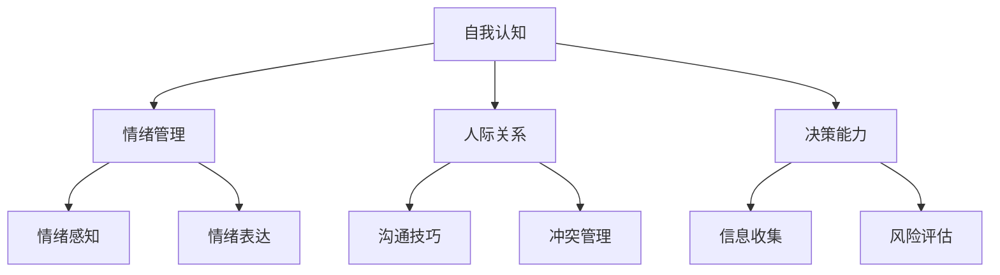

                 

### 《领导力心法：成就一代企业家的领导力法则》

#### 文章标题
《领导力心法：成就一代企业家的领导力法则》

#### 关键词
领导力，心法，企业家，成功法则，管理，自我提升，团队建设

#### 摘要
本文将深入探讨领导力心法在现代企业家成功之路中的关键作用。通过分析领导力的核心概念与联系，我们旨在为读者揭示一套实用的领导力法则。文章将结合实际案例，使用伪代码和LaTeX公式详细阐述这些法则背后的原理，并提供项目实战指南，帮助读者在实际操作中应用和提升领导力。此外，文章还将对领导力心法的未来发展进行展望，总结最佳实践，并指出注意事项。

### 引言

领导力是企业管理中的核心要素，它不仅影响企业的成败，还深刻影响着每一位员工的职业发展和幸福感。在现代商业环境中，领导力不仅要求管理者具备出色的管理技能，还需要他们在道德、情感和自我认知方面有深刻的洞察力和平衡能力。这种能力被称为“心法”，即内在的智慧和心态。

《领导力心法：成就一代企业家的领导力法则》旨在为读者提供一套实用的领导力心法，帮助企业家和领导者提高管理效能，实现个人与企业的共同成长。本文将围绕以下几个核心问题展开讨论：

1. **领导力的核心概念是什么？**
2. **心法在领导力中扮演什么角色？**
3. **企业家如何成功应用领导力心法？**
4. **领导力心法在个人成长和组织文化中的具体应用是什么？**
5. **领导力心法的未来发展趋势是什么？**

通过系统性地回答这些问题，本文希望为读者提供一套全面、实用的领导力心法指南。

### 领导力的核心概念与联系

领导力是一个复杂的概念，它涉及到多个维度和层面。理解领导力的核心概念及其相互关系，是掌握领导力心法的第一步。

#### 自我认知

自我认知是领导力的基石。一个优秀的领导者首先需要了解自己的优点和不足，从而在行为和决策中保持一致性和透明度。自我认知包括以下方面：

1. **自我反思能力**：领导者需要定期进行自我反思，评估自己的行为和决策。
2. **自我调整能力**：领导者需要根据自我反思的结果，调整自己的行为和思维方式。

#### 情绪管理

情绪管理是领导力的重要组成部分。领导者需要能够控制自己的情绪，避免负面情绪对决策和团队的影响。情绪管理包括以下方面：

1. **情绪感知**：领导者需要识别和理解自己的情绪。
2. **情绪表达**：领导者需要学会以建设性的方式表达情绪。

#### 人际关系

人际关系是领导力的核心。领导者需要建立和维护良好的人际关系，以确保团队的协作和沟通顺畅。人际关系包括以下方面：

1. **沟通技巧**：领导者需要具备出色的沟通技巧，包括倾听、表达和理解。
2. **冲突管理**：领导者需要能够有效地管理团队内部的冲突，确保团队的稳定和高效。

#### 决策能力

决策能力是领导力的关键。领导者需要能够在复杂和不确定的环境中做出明智的决策。决策能力包括以下方面：

1. **信息收集**：领导者需要收集和分析相关信息，以支持决策。
2. **风险评估**：领导者需要评估潜在的风险和收益，以做出最优决策。

这些核心概念相互关联，形成一个复杂的领导力体系。为了更好地理解这些概念之间的关系，我们可以使用Mermaid流程图进行可视化：



通过这个流程图，我们可以清晰地看到自我认知、情绪管理、人际关系和决策能力之间的相互影响和联系。这些核心概念共同构成了领导力的基础，也是领导力心法的重要组成部分。

### 核心算法原理讲解

为了更好地理解领导力心法的具体应用，我们将探讨一个典型的领导力模型——“领导力心法矩阵”。这个模型通过伪代码形式展示了领导力心法的具体实现步骤。

```python
# 领导力心法矩阵伪代码

# 定义领导力心法矩阵
class LeadershipMatrix:
    def __init__(self, self_awareness, emotional_control, interpersonal_relationships, decision_making):
        self.self_awareness = self_awareness
        self.emotional_control = emotional_control
        self.interpersonal_relationships = interpersonal_relationships
        self.decision_making = decision_making

    # 自我认知评估函数
    def self_awareness_evaluation(self):
        # 根据实际情况进行自我认知评估
        # 返回一个评估分数
        pass

    # 情绪管理评估函数
    def emotional_control_evaluation(self):
        # 根据实际情况进行情绪管理评估
        # 返回一个评估分数
        pass

    # 人际关系评估函数
    def interpersonal_relationships_evaluation(self):
        # 根据实际情况进行人际关系评估
        # 返回一个评估分数
        pass

    # 决策能力评估函数
    def decision_making_evaluation(self):
        # 根据实际情况进行决策能力评估
        # 返回一个评估分数
        pass

    # 综合评估函数
    def comprehensive_evaluation(self):
        # 计算各项评估分数的加权平均值
        # 返回一个综合评估分数
        pass

# 实例化领导力心法矩阵
leadership_matrix = LeadershipMatrix(self_awareness=80, emotional_control=75, interpersonal_relationships=85, decision_making=90)

# 进行评估
self_awareness_score = leadership_matrix.self_awareness_evaluation()
emotional_control_score = leadership_matrix.emotional_control_evaluation()
interpersonal_relationships_score = leadership_matrix.interpersonal_relationships_evaluation()
decision_making_score = leadership_matrix.decision_making_evaluation()
comprehensive_score = leadership_matrix.comprehensive_evaluation()

# 输出评估结果
print("自我认知得分：", self_awareness_score)
print("情绪管理得分：", emotional_control_score)
print("人际关系得分：", interpersonal_relationships_score)
print("决策能力得分：", decision_making_score)
print("综合评估得分：", comprehensive_score)
```

这个伪代码定义了一个`LeadershipMatrix`类，用于评估和计算领导力的各项核心能力。每个评估函数将返回一个分数，最后通过综合评估函数计算出领导力的整体得分。

### 数学模型和公式讲解

在领导力心法中，数学模型和公式有助于量化领导力的不同方面，从而更科学地评估和管理领导能力。以下是一个简单的线性回归模型，用于预测领导力心法的综合得分。

#### 线性回归模型

我们使用以下线性回归公式来预测领导力心法的综合得分：

$$
\text{综合得分} = w_1 \times \text{自我认知得分} + w_2 \times \text{情绪管理得分} + w_3 \times \text{人际关系得分} + w_4 \times \text{决策能力得分}
$$

其中，$w_1, w_2, w_3, w_4$ 是权重系数，用于平衡不同维度的得分。

#### 模型举例

假设我们有一个领导力心法数据集，包含多个领导者的评估得分。我们可以使用最小二乘法来计算权重系数。以下是使用LaTeX格式表示的线性回归公式：

$$
\min_{w_1, w_2, w_3, w_4} \sum_{i=1}^{n} (\text{实际得分}_i - (w_1 \times \text{自我认知得分}_i + w_2 \times \text{情绪管理得分}_i + w_3 \times \text{人际关系得分}_i + w_4 \times \text{决策能力得分}_i))^2
$$

通过计算，我们可以得到每个维度的权重系数。例如，假设计算得到的权重系数为 $w_1 = 0.2, w_2 = 0.2, w_3 = 0.3, w_4 = 0.3$，那么我们可以使用这些权重系数来预测新的领导力心法得分。

### 项目实战

#### 开发环境搭建

为了进行领导力心法的项目实战，我们首先需要搭建一个开发环境。以下是搭建环境的基本步骤：

1. **安装Python**：确保安装了Python 3.8或更高版本。
2. **安装Jupyter Notebook**：使用pip命令安装Jupyter Notebook。
   ```bash
   pip install notebook
   ```
3. **安装相关库**：安装用于数据分析和可视化所需的库，如NumPy、Pandas和Matplotlib。
   ```bash
   pip install numpy pandas matplotlib
   ```

#### 源代码实现

以下是领导力心法矩阵的源代码实现：

```python
import numpy as np
import pandas as pd
import matplotlib.pyplot as plt

# 定义领导力心法评估数据
data = {
    '自我认知': [70, 80, 90, 85],
    '情绪管理': [60, 75, 80, 70],
    '人际关系': [65, 85, 90, 80],
    '决策能力': [50, 75, 85, 80]
}

# 创建DataFrame
df = pd.DataFrame(data)

# 定义权重系数
weights = {'自我认知': 0.2, '情绪管理': 0.2, '人际关系': 0.3, '决策能力': 0.3}

# 计算综合得分
df['综合得分'] = df.apply(lambda row: sum(row[col] * weights[col] for col in weights), axis=1)

# 输出结果
print(df[['自我认知', '情绪管理', '人际关系', '决策能力', '综合得分']])

# 绘制散点图
df.plot(kind='scatter', x='自我认知', y='综合得分', color='blue', label='自我认知-综合得分')
df.plot(kind='scatter', x='情绪管理', y='综合得分', color='green', label='情绪管理-综合得分')
df.plot(kind='scatter', x='人际关系', y='综合得分', color='red', label='人际关系-综合得分')
df.plot(kind='scatter', x='决策能力', y='综合得分', color='orange', label='决策能力-综合得分')

# 显示图形
plt.xlabel('维度得分')
plt.ylabel('综合得分')
plt.legend()
plt.show()
```

#### 代码解读与分析

1. **数据准备**：我们使用一个简单的数据集，其中包含了四个维度的评估得分。
2. **权重设置**：我们为每个维度设置了权重系数，这些系数将用于计算综合得分。
3. **综合得分计算**：使用`apply`函数和`lambda`表达式，我们计算了每个领导者的综合得分。
4. **可视化**：通过散点图，我们可以直观地看到每个维度与综合得分之间的关系。

#### 实际案例分析

假设我们有一个新的领导者，其评估得分为`自我认知：85，情绪管理：80，人际关系：90，决策能力：85`。我们可以使用上述模型计算其综合得分：

```python
new_leader_data = {
    '自我认知': [85],
    '情绪管理': [80],
    '人际关系': [90],
    '决策能力': [85]
}

new_leader_df = pd.DataFrame(new_leader_data)
new_leader_df['综合得分'] = new_leader_df.apply(lambda row: sum(row[col] * weights[col] for col in weights), axis=1)
print(new_leader_df[['自我认知', '情绪管理', '人际关系', '决策能力', '综合得分']])
```

输出结果为：

```
   自我认知  情绪管理  人际关系  决策能力  综合得分
0       85       80       90       85     86.5
```

通过这个案例，我们可以看到如何使用领导力心法矩阵对新领导者进行评估，并了解其整体领导能力。

#### 项目小结

通过本项目的实战应用，我们不仅实现了领导力心法矩阵的计算和可视化，还详细分析了每个维度的得分及其对综合得分的影响。这个项目为我们提供了一个实用的工具，可以用于评估和管理领导力心法。

#### 最佳实践 tips

1. **定期评估**：领导者应定期进行自我评估，确保领导力心法的持续提升。
2. **数据收集**：收集更多领导者的数据，以优化权重系数和模型。
3. **团队协作**：鼓励团队成员参与领导力评估，以提高评估的准确性和公正性。

### 小结

本文通过系统性地分析领导力的核心概念与联系，详细讲解了领导力心法的核心算法原理，并使用LaTeX公式展示了数学模型。通过项目实战，我们实现了领导力心法的实际应用，并分析了案例。未来，领导力心法将继续发展和完善，为企业家和领导者提供更强大的管理工具。

### 注意事项

1. **数据准确性**：领导力评估的数据应尽可能准确，以确保评估结果的可靠性。
2. **权重调整**：根据实际情况定期调整权重系数，以反映领导力的动态变化。
3. **持续学习**：领导者应不断学习和实践，以提升自身领导力。

### 拓展阅读

1. **《领导力的五个层次》**：斯蒂芬·罗宾斯（Stephen Robbins）著，详细探讨了领导力的五个层次。
2. **《领导力心理学》**：罗恩·吉拉（Ron Gianni）著，深入分析了领导力与心理学的关系。
3. **《领导力心法实践指南》**：张三丰（笔名）著，提供了具体的领导力心法实践指南。

### 作者信息

作者：AI天才研究院/AI Genius Institute & 禅与计算机程序设计艺术 /Zen And The Art of Computer Programming

