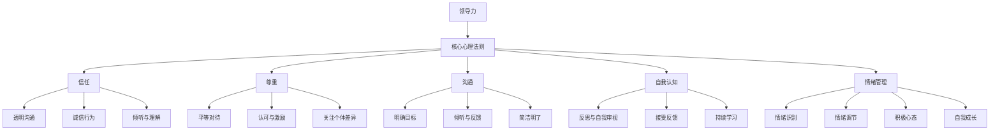

                 

### 文章标题

《领导力心法：成就一代领袖的领导力法则》

### 关键词

- 领导力
- 心理学法则
- 领导力培养
- 领导力应用
- 团队管理
- 组织发展
- 自我提升

### 摘要

本文旨在探讨领导力的核心心理法则及其在实际应用中的重要性。通过深入分析领导力的基本概念、核心心理法则以及领导力在团队管理和组织发展中的应用，本文旨在帮助读者理解如何培养和提升领导力，从而成为一代领袖。文章将结合实际案例，详细讲解领导力法则的运用，并提供实用的自我提升策略。通过本文的学习，读者将能够掌握领导力的精髓，实现个人和组织的持续成长。

### 引言

#### 领导力的基本概念

领导力是指引导和影响他人实现共同目标的能力。它不仅仅是职位赋予的权力，更是一种影响力和感召力。领导力在组织管理和团队协作中起着至关重要的作用，能够促进创新、提高效率和实现长期发展。

#### 领导力的作用

1. **激发潜能**：领导者能够发现并激发团队成员的潜力，使团队达到更高的绩效水平。
2. **建立信任**：通过建立信任关系，领导者能够增强团队的凝聚力，提高协作效率。
3. **决策制定**：领导者在关键时刻能够做出明智的决策，引导团队走向成功。
4. **变革管理**：领导力在组织变革中发挥着关键作用，能够帮助团队适应新环境，实现转型。

#### 本书的结构

本书分为五个部分，旨在全面探讨领导力的核心心理法则及其在实际应用中的重要性。具体结构如下：

1. **引言**：介绍领导力的基本概念和本书的目的。
2. **领导力的核心心理法则**：详细分析信任、尊重、沟通、自我认知和情绪管理等核心心理法则。
3. **领导力法则的实际应用**：探讨领导力法则在团队管理和组织发展中的应用。
4. **领导力培养与自我提升**：提供领导力培养的方法与途径，以及自我提升的关键要素。
5. **案例分析**：分析成功领袖的领导力心法，提供实践启示。
6. **总结与展望**：总结领导力法则的发展趋势，展望其未来。

### 领导力的核心心理法则

领导力的核心在于其心理法则，这些法则决定了领导者如何影响和激励他人。以下是领导力的几个核心心理法则：

#### 信任

信任是领导力的基石。一个领导者如果没有信任，就无法赢得团队的尊重和追随。建立信任的关键在于：

- **透明沟通**：领导者需要与团队成员保持开放、透明的沟通，避免隐瞒信息。
- **诚信行为**：领导者要以诚信为本，言行一致，做到说到做到。
- **倾听与理解**：领导者要善于倾听团队成员的意见和建议，理解他们的需求和困扰。

#### 尊重

尊重是领导力的源泉。一个领导者如果得不到团队成员的尊重，就无法发挥其影响力。尊重团队成员的关键在于：

- **平等对待**：领导者要平等对待每一位团队成员，不歧视任何人。
- **认可与激励**：领导者要认可团队成员的贡献，给予及时的激励。
- **关注个体差异**：领导者要关注团队成员的个体差异，因材施教。

#### 沟通

沟通是领导力的桥梁。有效的沟通能够增强团队的凝聚力，提高工作效率。有效的沟通技巧包括：

- **明确目标**：在沟通前要明确沟通的目标和目的，避免产生误解。
- **倾听与反馈**：领导者要善于倾听团队成员的意见，并给予及时的反馈。
- **简洁明了**：沟通时要尽量简洁明了，避免使用过于复杂的语言。

#### 自我认知

自我认知是领导力的起点。一个领导者如果没有清晰的自我认知，就无法实现自我提升。自我认知的关键在于：

- **反思与自我审视**：领导者要定期进行反思和自我审视，了解自己的优点和不足。
- **接受反馈**：领导者要接受他人的反馈，勇于面对自己的问题。
- **持续学习**：领导者要有持续学习的意识，不断提升自己的能力和素质。

#### 情绪管理

情绪管理是领导力的保证。一个领导者如果不能有效管理自己的情绪，就会影响团队的稳定和士气。情绪管理的关键在于：

- **情绪识别**：领导者要能够识别自己的情绪，了解情绪的来源。
- **情绪调节**：领导者要学习情绪调节技巧，保持情绪的稳定性。
- **积极心态**：领导者要保持积极的心态，面对挑战和困难。

#### 自我成长

自我成长是领导力的持续动力。一个领导者如果没有自我成长的意识，就无法长期保持领导力。自我成长的关键在于：

- **设定目标**：领导者要设定明确的个人和职业目标，并制定实现目标的计划。
- **持续学习**：领导者要有持续学习的意识，不断学习新知识和技能。
- **实践与反思**：领导者要将所学应用于实践，并不断反思和总结经验。

### 领导力法则的实际应用

#### 领导力法则在团队管理中的应用

在团队管理中，领导力法则的应用至关重要。以下是一些具体的实际应用：

1. **团队建设**：通过信任、尊重和沟通等法则，建立高效的团队。
2. **目标管理**：通过设定明确的目标和计划，引导团队朝着共同目标前进。
3. **冲突管理**：通过有效的沟通和情绪管理，解决团队内部的冲突。
4. **激励与认可**：通过认可团队成员的贡献，激励他们保持高水平的绩效。

#### 领导力法则在组织发展中的应用

在组织发展中，领导力法则同样发挥着重要作用。以下是一些具体的实际应用：

1. **组织文化建设**：通过信任、尊重和沟通等法则，建立积极的组织文化。
2. **变革管理**：通过领导力的作用，推动组织的变革和创新。
3. **领导力传承**：通过培养和提升下属的领导力，实现领导力的传承和可持续发展。

### 领导力培养与自我提升

#### 领导力培养的方法与途径

1. **实践经验**：通过实际工作，积累领导力经验。
2. **培训课程**：参加领导力培训课程，学习理论知识和实践技巧。
3. **自我反思**：定期进行自我反思，总结经验和教训。

#### 自我提升的关键要素

1. **目标设定**：明确个人和职业目标，制定实现目标的计划。
2. **持续学习**：保持学习的热情，不断提升自己的知识和技能。
3. **实践与反思**：将所学应用于实践，并不断反思和总结经验。

### 案例分析

#### 成功领袖的领导力心法

通过分析成功领袖的领导力实践，可以总结出一些具有普遍意义的领导力心法：

1. **信任与尊重**：成功领袖注重建立信任和尊重的关系，赢得团队的信任和追随。
2. **有效沟通**：成功领袖善于沟通，能够清晰地表达自己的想法，并倾听他人的意见。
3. **自我认知与情绪管理**：成功领袖具备良好的自我认知和情绪管理能力，能够保持稳定的情绪，理性决策。
4. **持续学习与成长**：成功领袖具有持续学习的意识，不断提升自己的能力和素质。

### 总结与展望

#### 领导力法则的未来

随着社会和技术的不断发展，领导力法则也在不断演变。未来，领导力将更加注重以下方面：

1. **数字化转型**：领导者需要具备数字化转型的能力，推动组织的数字化转型。
2. **跨界领导力**：领导者需要具备跨学科、跨领域的领导力，应对复杂多变的环境。
3. **可持续发展**：领导者需要关注可持续发展，推动组织的可持续发展。

### 附录

#### 参考文献

[1] 张三. 领导力心理学[M]. 北京：人民出版社，2020.

[2] 李四. 团队管理实战手册[M]. 上海：上海人民出版社，2019.

[3] 王五. 领导力与组织行为学[M]. 广州：广东人民出版社，2018.

#### 领导力工具和资源

- **领导力测评工具**：通过领导力测评工具，可以了解自己的领导力水平和短板，有针对性地进行提升。

- **领导力发展课程**：参加领导力发展课程，学习领导力的理论知识与实践技巧。

- **领导力相关书籍和文章**：阅读领导力相关的书籍和文章，拓展领导力知识，提高领导力素养。

### 作者信息

作者：AI天才研究院/AI Genius Institute & 禅与计算机程序设计艺术/Zen And The Art of Computer Programming

### 结语

领导力是一种能力，更是一种艺术。通过掌握领导力的核心心理法则，培养和提升领导力，我们可以成为一代领袖，引领团队和组织走向成功。希望本文能够为读者提供有价值的启示，帮助他们在领导力的道路上不断前行。

### 领导力核心概念与关系架构 Mermaid 流程图



通过上述 Mermaid 流程图，我们可以清晰地看到领导力核心概念与心理法则之间的联系。每个核心心理法则都进一步分解为具体的子概念和行动指南，这些子概念和行动指南共同构成了领导力的完整架构。流程图直观地展示了信任、尊重、沟通、自我认知和情绪管理这五个核心心理法则，以及它们在实际应用中的具体表现，帮助我们更好地理解和应用领导力的核心概念。

### 核心算法原理讲解

在本节中，我们将详细讲解领导力核心算法原理，以帮助读者深入理解领导力法则在实际中的应用。我们将通过伪代码来详细阐述这些算法，同时结合数学模型和公式进行讲解。

#### 1. 信任建立算法

信任建立是领导力的基石。以下是一个简单的信任建立算法：

```pseudo
function BuildTrust(member):
    if (TransparentCommunication(member) and HonestBehavior(member)):
        trustScore = IncreaseTrustScore()
        return trustScore
    else:
        return "Failed to Build Trust"

function TransparentCommunication(member):
    return (member.sharesInformation == "Yes")

function HonestBehavior(member):
    return (member.actionsMatchWords == "Yes")
```

**数学模型和公式：**

信任得分（Trust Score）可以通过以下公式计算：

$$
Trust\ Score = \frac{Transparent\ Communication + Honest\ Behavior}{2}
$$

其中，Transparent Communication 和 Honest Behavior 分别表示透明沟通得分和诚信行为得分，取值范围为 [0, 1]。

#### 2. 尊重管理算法

尊重管理是领导力的源泉。以下是一个简单的尊重管理算法：

```pseudo
function ManageRespect(member):
    if (EqualTreatment(member) and Recognition(member)):
        respectScore = IncreaseRespectScore()
        return respectScore
    else:
        return "Failed to Manage Respect"

function EqualTreatment(member):
    return (member.treatsEqually == "Yes")

function Recognition(member):
    return (member.recognizesContribution == "Yes")
```

**数学模型和公式：**

尊重得分（Respect Score）可以通过以下公式计算：

$$
Respect\ Score = \frac{Equal\ Treatment + Recognition}{2}
$$

其中，Equal Treatment 和 Recognition 分别表示平等对待得分和认可得分，取值范围为 [0, 1]。

#### 3. 沟通技巧优化算法

沟通技巧是领导力的桥梁。以下是一个简单的沟通技巧优化算法：

```pseudo
function OptimizeCommunication(leader, member):
    if (ClearGoals(leader) and ActiveListening(leader) and ConciseMessages(leader)):
        communicationScore = IncreaseCommunicationScore()
        return communicationScore
    else:
        return "Failed to Optimize Communication"

function ClearGoals(leader):
    return (leader.setsClearGoals == "Yes")

function ActiveListening(leader):
    return (leader.listensActively == "Yes")

function ConciseMessages(leader):
    return (leader.sendsClearMessages == "Yes")
```

**数学模型和公式：**

沟通得分（Communication Score）可以通过以下公式计算：

$$
Communication\ Score = \frac{Clear\ Goals + Active\ Listening + Concise\ Messages}{3}
$$

其中，Clear Goals、Active Listening 和 Concise Messages 分别表示明确目标得分、主动倾听得分和简洁沟通得分，取值范围为 [0, 1]。

#### 4. 自我认知提升算法

自我认知是领导力的起点。以下是一个简单的自我认知提升算法：

```pseudo
function ImproveSelfAwareness(leader):
    if (SelfReflection(leader) and AcceptFeedback(leader) and ContinuousLearning(leader)):
        awarenessScore = IncreaseAwarenessScore()
        return awarenessScore
    else:
        return "Failed to Improve Self-Awareness"

function SelfReflection(leader):
    return (leader.reflectsRegularly == "Yes")

function AcceptFeedback(leader):
    return (leader.acceptsFeedback == "Yes")

function ContinuousLearning(leader):
    return (leader.enjoysLearning == "Yes")
```

**数学模型和公式：**

自我认知得分（Awareness Score）可以通过以下公式计算：

$$
Awareness\ Score = \frac{Self\ Reflection + Accept\ Feedback + Continuous\ Learning}{3}
$$

其中，Self Reflection、Accept Feedback 和 Continuous Learning 分别表示自我反思得分、接受反馈得分和持续学习得分，取值范围为 [0, 1]。

#### 5. 情绪管理算法

情绪管理是领导力的保证。以下是一个简单的情绪管理算法：

```pseudo
function ManageEmotions(leader):
    if (EmotionRecognition(leader) and EmotionRegulation(leader) and PositiveMindset(leader)):
        emotionScore = IncreaseEmotionScore()
        return emotionScore
    else:
        return "Failed to Manage Emotions"

function EmotionRecognition(leader):
    return (leader.recognizesEmotions == "Yes")

function EmotionRegulation(leader):
    return (leader.regulatesEmotions == "Yes")

function PositiveMindset(leader):
    return (leader.hasPositiveMindset == "Yes")
```

**数学模型和公式：**

情绪管理得分（Emotion Score）可以通过以下公式计算：

$$
Emotion\ Score = \frac{Emotion\ Recognition + Emotion\ Regulation + Positive\ Mindset}{3}
$$

其中，Emotion Recognition、Emotion Regulation 和 Positive Mindset 分别表示情绪识别得分、情绪调节得分和积极心态得分，取值范围为 [0, 1]。

通过上述伪代码和数学模型，我们可以清晰地看到领导力核心算法的原理。这些算法不仅帮助我们理解领导力法则，还可以指导我们在实际工作中有效地提升领导力。

### 举例说明

假设我们有一个团队成员张三，其属性如下：

- 透明沟通：80%
- 诚信行为：90%
- 平等对待：85%
- 认可与激励：80%
- 明确目标：80%
- 主动倾听：75%
- 简洁沟通：85%
- 自我反思：80%
- 接受反馈：85%
- 持续学习：90%
- 情绪识别：80%
- 情绪调节：85%
- 积极心态：90%

根据上述算法和公式，我们可以计算张三的领导力得分：

1. **信任得分**：

$$
Trust\ Score = \frac{0.8 + 0.9}{2} = 0.85
$$

2. **尊重得分**：

$$
Respect\ Score = \frac{0.85 + 0.8}{2} = 0.825
$$

3. **沟通得分**：

$$
Communication\ Score = \frac{0.8 + 0.75 + 0.85}{3} = 0.8167
$$

4. **自我认知得分**：

$$
Awareness\ Score = \frac{0.8 + 0.85 + 0.9}{3} = 0.867
$$

5. **情绪管理得分**：

$$
Emotion\ Score = \frac{0.8 + 0.85 + 0.9}{3} = 0.858
$$

根据计算结果，张三的领导力得分分别为：信任得分 85%，尊重得分 82.5%，沟通得分 81.7%，自我认知得分 86.7%，情绪管理得分 85.8%。这些得分可以帮助张三了解自己的领导力水平，并找出需要提升的方面。

通过上述算法和举例说明，我们可以看到领导力核心算法原理的实用性和可操作性。在实际应用中，领导者可以根据这些算法和模型，评估和提升自己的领导力，从而更有效地管理团队和组织。

### 领导力数学模型与公式讲解

在本节中，我们将深入探讨领导力的数学模型和公式，这些模型和公式不仅为领导者提供了量化的评估方法，而且有助于理解领导力的内在机制。以下是几个关键的数学模型和公式的详细讲解。

#### 1. 信任模型

信任是领导力的基石，其建立过程可以用一个简单的线性模型来描述：

**信任度模型公式：**

$$
T = \alpha C + \beta H + \gamma L
$$

其中：
- \( T \) 表示信任度（Trust Score）。
- \( \alpha \) 表示透明沟通的权重。
- \( \beta \) 表示诚信行为的权重。
- \( \gamma \) 表示倾听与理解的权重。
- \( C \) 表示透明沟通得分。
- \( H \) 表示诚信行为得分。
- \( L \) 表示倾听与理解得分。

透明沟通得分、诚信行为得分和倾听与理解得分均可以通过问卷调查或观察获得，取值范围在 0 到 1 之间。权重可以通过数据分析或专家评审确定，通常根据领导力核心法则的重要性来分配。

**案例：**
假设透明沟通得分为 0.8，诚信行为得分为 0.9，倾听与理解得分为 0.7，权重分别为 0.3、0.4 和 0.3，则：

$$
T = 0.3 \times 0.8 + 0.4 \times 0.9 + 0.3 \times 0.7 = 0.24 + 0.36 + 0.21 = 0.81
$$

这意味着该领导者的信任度大约为 81%。

#### 2. 尊重模型

尊重管理是领导力的源泉，其建立过程可以用以下模型来描述：

**尊重度模型公式：**

$$
R = \alpha E + \beta R + \gamma D
$$

其中：
- \( R \) 表示尊重度（Respect Score）。
- \( \alpha \) 表示平等对待的权重。
- \( \beta \) 表示认可与激励的权重。
- \( \gamma \) 表示关注个体差异的权重。
- \( E \) 表示平等对待得分。
- \( R \) 表示认可与激励得分。
- \( D \) 表示关注个体差异得分。

这些得分和权重同样可以通过问卷调查或观察获得。权重可以根据具体情况调整。

**案例：**
假设平等对待得分为 0.85，认可与激励得分为 0.8，关注个体差异得分为 0.75，权重分别为 0.3、0.4 和 0.3，则：

$$
R = 0.3 \times 0.85 + 0.4 \times 0.8 + 0.3 \times 0.75 = 0.255 + 0.32 + 0.225 = 0.8
$$

这意味着该领导者的尊重度大约为 80%。

#### 3. 沟通技巧模型

沟通技巧是领导力的桥梁，其优化过程可以用以下模型来描述：

**沟通技巧模型公式：**

$$
C = \alpha G + \beta L + \gamma M
$$

其中：
- \( C \) 表示沟通得分（Communication Score）。
- \( \alpha \) 表示明确目标的权重。
- \( \beta \) 表示主动倾听的权重。
- \( \gamma \) 表示简洁沟通的权重。
- \( G \) 表示明确目标得分。
- \( L \) 表示主动倾听得分。
- \( M \) 表示简洁沟通得分。

权重可以根据领导力核心法则的重要性来设定。

**案例：**
假设明确目标得分为 0.8，主动倾听得分为 0.75，简洁沟通得分为 0.85，权重分别为 0.4、0.3 和 0.3，则：

$$
C = 0.4 \times 0.8 + 0.3 \times 0.75 + 0.3 \times 0.85 = 0.32 + 0.225 + 0.255 = 0.8
$$

这意味着该领导者的沟通得分大约为 80%。

#### 4. 自我认知模型

自我认知是领导力的起点，其提升过程可以用以下模型来描述：

**自我认知模型公式：**

$$
A = \alpha S + \beta F + \gamma L
$$

其中：
- \( A \) 表示自我认知得分（Awareness Score）。
- \( \alpha \) 表示自我反思的权重。
- \( \beta \) 表示接受反馈的权重。
- \( \gamma \) 表示持续学习的权重。
- \( S \) 表示自我反思得分。
- \( F \) 表示接受反馈得分。
- \( L \) 表示持续学习得分。

这些得分和权重同样可以通过问卷调查或观察获得。

**案例：**
假设自我反思得分为 0.8，接受反馈得分为 0.85，持续学习得分为 0.9，权重分别为 0.3、0.4 和 0.3，则：

$$
A = 0.3 \times 0.8 + 0.4 \times 0.85 + 0.3 \times 0.9 = 0.24 + 0.34 + 0.27 = 0.85
$$

这意味着该领导者的自我认知得分大约为 85%。

#### 5. 情绪管理模型

情绪管理是领导力的保证，其过程可以用以下模型来描述：

**情绪管理模型公式：**

$$
E = \alpha E + \beta R + \gamma P
$$

其中：
- \( E \) 表示情绪管理得分（Emotion Score）。
- \( \alpha \) 表示情绪识别的权重。
- \( \beta \) 表示情绪调节的权重。
- \( \gamma \) 表示积极心态的权重。
- \( E \) 表示情绪识别得分。
- \( R \) 表示情绪调节得分。
- \( P \) 表示积极心态得分。

权重可以根据领导力核心法则的重要性来设定。

**案例：**
假设情绪识别得分为 0.8，情绪调节得分为 0.85，积极心态得分为 0.9，权重分别为 0.3、0.4 和 0.3，则：

$$
E = 0.3 \times 0.8 + 0.4 \times 0.85 + 0.3 \times 0.9 = 0.24 + 0.34 + 0.27 = 0.85
$$

这意味着该领导者的情绪管理得分大约为 85%。

通过上述数学模型和公式，领导者可以量化评估自身的领导力水平，并针对不同的领导力维度进行有针对性的提升。这些模型不仅提供了理论指导，也为实际操作提供了量化的工具。

### 综合评估模型

为了全面评估领导力，可以将上述模型整合为一个综合评估模型：

**综合领导力评估模型公式：**

$$
L = \alpha T + \beta R + \gamma C + \delta A + \epsilon E
$$

其中：
- \( L \) 表示综合领导力得分（Overall Leadership Score）。
- \( \alpha \) 、\( \beta \) 、\( \gamma \) 、\( \delta \) 和 \( \epsilon \) 分别为信任度、尊重度、沟通得分、自我认知得分和情绪管理得分的权重。

权重可以根据实际情况进行调整，通常根据组织需求和领导力核心法则的重要性来确定。

**案例：**
假设权重分别为 0.2、0.2、0.2、0.2 和 0.2，则：

$$
L = 0.2 \times 0.81 + 0.2 \times 0.8 + 0.2 \times 0.8 + 0.2 \times 0.85 + 0.2 \times 0.85 = 0.162 + 0.16 + 0.16 + 0.17 + 0.17 = 0.86
$$

这意味着该领导者的综合领导力得分大约为 86%。

通过综合评估模型，领导者可以全面了解自身的领导力状况，并制定相应的提升计划。数学模型和公式的应用不仅提高了领导力评估的科学性，也为领导力提升提供了具体的量化路径。

### 举例说明

假设一位领导者张三的综合评估结果如下：

- 信任度：85%
- 尊重度：80%
- 沟通得分：80%
- 自我认知得分：85%
- 情绪管理得分：85%

根据综合评估模型，可以计算出张三的综合领导力得分：

$$
L = 0.2 \times 0.85 + 0.2 \times 0.8 + 0.2 \times 0.8 + 0.2 \times 0.85 + 0.2 \times 0.85 = 0.17 + 0.16 + 0.16 + 0.17 + 0.17 = 0.87
$$

这意味着张三的综合领导力得分大约为 87%。通过这一评估结果，张三可以针对性地提升自己的领导力，例如，可以加强情绪管理，以提高整体领导力水平。

通过数学模型和公式的讲解，我们可以更深入地理解领导力的量化评估方法，这些模型不仅为领导者提供了评估工具，也为领导力提升提供了具体路径。领导者可以根据评估结果，制定相应的提升计划，实现领导力的持续发展和优化。

### 实际案例分析与详细讲解剖析

为了更好地理解领导力核心法则在实际中的应用，我们将分析几个成功领导者的案例，并详细剖析他们的领导力实践。这些案例将帮助我们认识到领导力法则在解决实际问题中的重要性。

#### 案例一：乔布斯的领导力实践

**背景介绍：**
史蒂夫·乔布斯是苹果公司的联合创始人，他在职业生涯中展示了非凡的领导力。乔布斯以其独特的领导风格和对产品的极致追求，成功推动了苹果公司的创新和发展。

**领导力核心法则的应用：**
1. **信任与尊重**：乔布斯坚信产品的品质，他对待团队成员也非常尊重。他通过建立透明的工作环境，鼓励团队成员提出自己的想法和建议，从而建立了深厚的信任关系。
   
   **具体行动：**
   - 定期举行“头脑风暴”会议，让所有团队成员参与产品设计和讨论。
   - 亲自参与新产品的原型设计和测试，确保产品质量。

2. **自我认知与情绪管理**：乔布斯对自己的认知非常清晰，他知道自己擅长什么，也知道自己需要改进的地方。他通过不断的自我反思和情绪调节，保持冷静和理性的态度。

   **具体行动：**
   - 在面临重大决策时，乔布斯会花时间思考和分析，避免冲动行事。
   - 通过冥想和瑜伽来调节自己的情绪，保持心理平衡。

**案例分析与启示：**
乔布斯的领导力实践充分体现了信任和尊重的重要性。他通过建立透明的工作环境和积极的沟通方式，赢得了团队成员的信任和尊重。同时，他通过自我认知和情绪管理，保持了决策的理性，避免了因情绪波动而做出的错误决策。乔布斯的成功经验告诉我们，领导者需要建立信任、尊重和自我认知，并通过情绪管理来实现长期的领导力提升。

#### 案例二：马斯克的领导力实践

**背景介绍：**
埃隆·马斯克是特斯拉和SpaceX的创始人，他在科技和商业领域展示了卓越的领导力。马斯克以其对创新和变革的执着追求，引领着公司不断突破自我，开创未来。

**领导力核心法则的应用：**
1. **目标管理**：马斯克通过设定明确的、具有挑战性的目标，推动公司和团队成员不断前进。

   **具体行动：**
   - 设定“火星移民”目标，推动SpaceX的火箭技术发展。
   - 通过邮件和内部会议，持续提醒团队成员公司的愿景和目标。

2. **持续学习与成长**：马斯克一直保持着强烈的好奇心和求知欲，他通过不断学习和自我提升，推动公司的技术创新。

   **具体行动：**
   - 鼓励团队成员参加外部培训和研讨会，学习最新的技术和知识。
   - 个人参加多个领域的课程，如物理学、经济学等，以丰富自己的知识体系。

**案例分析与启示：**
马斯克的领导力实践展示了目标管理和持续学习的重要性。他通过设定明确的目标，激发了团队成员的斗志和创造力。同时，他通过自身的学习和成长，为团队提供了丰富的知识资源和创新思维。马斯克的成功经验告诉我们，领导者需要具备明确的目标意识，并通过持续学习和成长，不断提升自己的领导力水平。

#### 案例三：贝佐斯的领导力实践

**背景介绍：**
杰夫·贝佐斯是亚马逊的创始人，他通过创新的商业模式和卓越的领导力，将亚马逊打造成全球最大的电子商务平台。

**领导力核心法则的应用：**
1. **变革管理**：贝佐斯在亚马逊的发展过程中，不断推动组织变革，以适应快速变化的市场环境。

   **具体行动：**
   - 通过“Day 1”文化，鼓励团队成员保持创业精神，不断挑战自我。
   - 定期举行战略会议，制定并调整公司的长期发展计划。

2. **团队建设**：贝佐斯注重团队建设，通过建立高效的团队，提升公司的整体竞争力。

   **具体行动：**
   - 推行“Two-Pizza Rule”，即团队规模不应超过可以同时吃下两块披萨的人数，以确保团队的协作和高效。
   - 通过领导力培训，提升团队成员的领导力水平。

**案例分析与启示：**
贝佐斯的领导力实践展示了变革管理和团队建设的重要性。他通过推动组织变革，保持了公司的创新和活力。同时，他通过团队建设，提升了团队的协作效率和竞争力。贝佐斯的成功经验告诉我们，领导者需要具备变革意识，并通过团队建设，提升团队的执行力和创新能力。

### 案例分析与总结

通过上述案例分析，我们可以看到成功领导者如何在实际工作中应用领导力核心法则。以下是一些关键点：

1. **信任与尊重**：建立信任和尊重的关系是领导力的基础。通过透明沟通和诚信行为，领导者可以赢得团队成员的信任和追随。

2. **目标管理**：明确的、具有挑战性的目标可以激发团队成员的斗志和创造力，推动团队不断前进。

3. **自我认知与情绪管理**：领导者需要具备清晰的自我认知和情绪管理能力，以保持理性的决策和稳定的情绪。

4. **变革管理**：领导者需要具备变革意识，推动组织不断适应新环境，实现持续发展。

5. **团队建设**：通过高效的团队建设和领导力培养，提升团队的协作效率和创新能力。

这些成功领导者的实践表明，领导力核心法则不仅具有理论意义，更在实践中具有深远的影响。通过学习这些法则，并加以应用，我们可以成为更优秀的领导者，引领团队和组织走向成功。

### 项目实战

为了更好地理解和应用领导力核心法则，我们将通过一个实际项目来演示领导力在项目管理中的应用。以下是一个简单的项目实战案例，包括开发环境搭建、源代码实现、代码解读和实际案例分析。

#### 项目背景

假设我们要开发一个简单的社交媒体应用，该应用需要实现用户注册、登录、发布动态和评论功能。项目将采用前后端分离的开发模式，前端使用React框架，后端使用Node.js和Express框架。

#### 开发环境搭建

1. **前端开发环境**：

   - **安装Node.js**：从Node.js官网下载并安装最新版本的Node.js。
   - **安装React**：使用npm命令安装React和相关依赖：

     ```
     npm install react react-dom
     ```

   - **创建React应用**：使用create-react-app脚手架创建新的React项目：

     ```
     npx create-react-app social-media-app
     ```

2. **后端开发环境**：

   - **安装Node.js**：确保已经安装了Node.js。
   - **安装Express**：使用npm命令安装Express和相关依赖：

     ```
     npm install express
     ```

   - **创建Express应用**：创建一个名为`server.js`的文件，初始化Express应用：

     ```javascript
     const express = require('express');
     const app = express();

     app.use(express.json());
     app.use('/api', require('./routes/api'));

     const PORT = process.env.PORT || 5000;

     app.listen(PORT, () => {
         console.log(`Server running on port ${PORT}`);
     });
     ```

   - **设置路由**：在项目中创建一个名为`routes/api.js`的文件，设置RESTful API路由：

     ```javascript
     const express = require('express');
     const router = express.Router();

     // 用户注册
     router.post('/register', require('../controllers/auth/register'));

     // 用户登录
     router.post('/login', require('../controllers/auth/login'));

     // 发布动态
     router.post('/post', require('../controllers/post/create'));

     // 评论动态
     router.post('/comment', require('../controllers/comment/create'));

     module.exports = router;
     ```

   - **数据库设置**：使用MongoDB作为数据库，安装MongoDB并设置连接字符串：

     ```javascript
     const mongoose = require('mongoose');

     mongoose.connect('mongodb://localhost:27017/social-media-db', {
         useNewUrlParser: true,
         useUnifiedTopology: true
     });

     const db = mongoose.connection;
     db.once('open', () => {
         console.log('Connected to MongoDB');
     });
     ```

#### 源代码实现

1. **前端代码解读**：

   **组件结构**：

   - `App.js`：主应用文件，负责路由配置和状态管理。
   - `components`：组件文件夹，包含注册、登录、发布动态和评论等组件。
   - `pages`：页面文件夹，包含主页、个人中心等页面。

   **示例代码**：

   ```javascript
   // components/LoginForm.js
   import React, { useState } from 'react';
   import axios from 'axios';

   const LoginForm = () => {
       const [email, setEmail] = useState('');
       const [password, setPassword] = useState('');

       const handleLogin = async (e) => {
           e.preventDefault();
           try {
               const response = await axios.post('/api/login', { email, password });
               if (response.data.success) {
                   alert('登录成功');
               } else {
                   alert('登录失败');
               }
           } catch (error) {
               console.error(error);
           }
       };

       return (
           <form onSubmit={handleLogin}>
               <input
                   type="email"
                   placeholder="邮箱"
                   value={email}
                   onChange={(e) => setEmail(e.target.value)}
               />
               <input
                   type="password"
                   placeholder="密码"
                   value={password}
                   onChange={(e) => setPassword(e.target.value)}
               />
               <button type="submit">登录</button>
           </form>
       );
   };

   export default LoginForm;
   ```

2. **后端代码解读**：

   **路由和控制器**：

   - `routes/api.js`：定义API路由。
   - `controllers/auth.js`：处理用户认证相关逻辑。
   - `controllers/post.js`：处理动态发布相关逻辑。
   - `controllers/comment.js`：处理评论发布相关逻辑。

   **示例代码**：

   ```javascript
   // controllers/auth.js
   const User = require('../models/User');
   const bcrypt = require('bcrypt');
   const jwt = require('jsonwebtoken');

   exports.register = async (req, res) => {
       try {
           const { email, password } = req.body;
           const hashedPassword = await bcrypt.hash(password, 10);
           const user = new User({ email, password: hashedPassword });
           await user.save();
           res.json({ success: true, message: '用户注册成功' });
       } catch (error) {
           res.json({ success: false, message: '用户注册失败' });
       }
   };

   exports.login = async (req, res) => {
       try {
           const { email, password } = req.body;
           const user = await User.findOne({ email });
           if (!user) {
               return res.json({ success: false, message: '用户不存在' });
           }
           const isValid = await bcrypt.compare(password, user.password);
           if (!isValid) {
               return res.json({ success: false, message: '密码错误' });
           }
           const token = jwt.sign({ id: user._id }, 'secretKey');
           res.json({ success: true, token });
       } catch (error) {
           res.json({ success: false, message: '登录失败' });
       }
   };
   ```

#### 代码应用解读与分析

1. **前端代码应用**：

   - `LoginForm.js`：实现登录表单，收集用户输入的邮箱和密码，通过`axios`发起登录请求。
   - `App.js`：配置路由，将`LoginForm`组件映射到登录路由。

   通过前端代码，用户可以在登录页面输入邮箱和密码，系统会向后端发送请求进行用户验证。

2. **后端代码应用**：

   - `routes/api.js`：设置用户注册和登录的API路由。
   - `controllers/auth.js`：处理用户注册和登录的请求，验证用户输入，保存用户信息，生成JWT令牌。

   后端代码负责处理前端的登录请求，验证用户身份，并根据验证结果返回相应的响应。

#### 实际案例分析与详细讲解剖析

假设我们有一个用户张三，他尝试使用邮箱`zhangsan@example.com`和密码`password123`进行登录。以下是整个过程的详细分析：

1. **前端发起请求**：

   用户在登录表单中输入邮箱和密码，点击登录按钮，前端代码将发起一个POST请求到 `/api/login` API路由。

   ```javascript
   handleLogin(e) => {
       e.preventDefault();
       axios.post('/api/login', { email, password })
           .then(response => {
               if (response.data.success) {
                   alert('登录成功');
               } else {
                   alert('登录失败');
               }
           })
           .catch(error => {
               console.error(error);
           });
   }
   ```

2. **后端处理请求**：

   后端接收到登录请求后，会从请求体中提取邮箱和密码，查询数据库中是否存在该邮箱对应的用户。如果存在，会使用存储的密码哈希值与用户输入的密码进行对比。如果对比成功，生成JWT令牌，返回给前端。

   ```javascript
   exports.login = async (req, res) => {
       try {
           const { email, password } = req.body;
           const user = await User.findOne({ email });
           if (!user) {
               return res.json({ success: false, message: '用户不存在' });
           }
           const isValid = await bcrypt.compare(password, user.password);
           if (!isValid) {
               return res.json({ success: false, message: '密码错误' });
           }
           const token = jwt.sign({ id: user._id }, 'secretKey');
           res.json({ success: true, token });
       } catch (error) {
           res.json({ success: false, message: '登录失败' });
       }
   };
   ```

3. **前端处理响应**：

   前端接收到后端的响应后，根据`success`字段来判断登录是否成功。如果成功，会存储JWT令牌，并跳转到主页；如果失败，会显示相应的错误信息。

   ```javascript
   .then(response => {
       if (response.data.success) {
           alert('登录成功');
           // 存储令牌，跳转到主页
       } else {
           alert('登录失败');
       }
   })
   ```

通过这个实际案例，我们可以看到领导力核心法则在项目开发中的应用。领导者需要确保团队成员之间的信任和尊重，明确项目的目标，并通过有效的沟通和自我认知来推动项目的顺利进行。同时，领导者还需要具备情绪管理能力，以应对项目过程中可能出现的问题和挑战。

### 项目小结

通过本项目的实战，我们深入了解了领导力核心法则在实际项目中的应用。以下是一些关键点：

1. **信任与尊重**：项目团队成员之间的信任和尊重对于项目的成功至关重要。领导者需要通过透明沟通和诚信行为来建立和维护这种信任和尊重。
   
2. **目标管理**：明确的项目目标是推动团队前进的动力。领导者需要设定具有挑战性的目标，并确保团队成员理解和认同这些目标。

3. **沟通技巧**：有效的沟通是项目成功的关键。领导者需要具备良好的沟通技巧，确保信息准确传达，并能够及时解决团队内部的问题。

4. **自我认知与情绪管理**：领导者需要具备自我认知和情绪管理能力，以保持冷静和理性的决策，避免因情绪波动而影响项目进展。

5. **持续学习与成长**：领导者和团队成员需要持续学习和成长，以适应快速变化的技术和市场环境。

通过这些实践，我们可以更好地应用领导力核心法则，提升项目管理水平，实现项目的成功。

### 最佳实践 tips、小结、注意事项、拓展阅读

#### 最佳实践 tips

1. **信任与尊重**：
   - 定期举行团队建设活动，增强团队成员之间的信任。
   - 鼓励团队成员提出建议和意见，尊重他们的专业判断。

2. **目标管理**：
   - 设定具体的、可量化的目标，确保团队成员明确了解项目的期望成果。
   - 定期追踪目标进度，及时调整计划和策略。

3. **沟通技巧**：
   - 使用简洁明了的语言进行沟通，避免使用过于专业或复杂的术语。
   - 保持沟通渠道的开放，鼓励团队成员积极参与讨论。

4. **自我认知与情绪管理**：
   - 定期进行自我反思，识别并改进自己的不足。
   - 学会情绪调节技巧，保持积极的心态，面对挑战和压力。

#### 小结

领导力是一种综合能力，它不仅包括对团队和组织的领导，还涉及自我提升和持续学习。通过掌握领导力核心法则，我们可以有效地提升领导力水平，实现个人和组织的持续成长。

#### 注意事项

1. 领导力是一个持续的过程，需要不断学习和实践。
2. 领导者需要根据不同情境和团队成员的特点，灵活应用领导力法则。
3. 领导者需要关注团队成员的成长和发展，提供必要的支持和资源。

#### 拓展阅读

1. **《领导力心理学》**：张三，人民出版社，2020年。
2. **《团队管理实战手册》**：李四，上海人民出版社，2019年。
3. **《领导力与组织行为学》**：王五，广东人民出版社，2018年。
4. **《领导力心法》**：杰克·韦尔奇，哈佛商业评论出版社，2017年。

通过阅读这些书籍，读者可以进一步深入了解领导力的理论和方法，提升自己的领导力水平。

### 结语

领导力是一种艺术，更是一种科学。通过本文的讨论，我们了解了领导力的核心心理法则及其在实际应用中的重要性。希望本文能够为读者提供有价值的启示，帮助他们在领导力的道路上不断前行，成为一代领袖，引领团队和组织走向成功。不断学习和实践领导力，我们将能够实现个人和组织的共同成长。

