                 

### 文章标题

# 《领导力心法：成就伟大领导者的修炼法则》

## 关键词

- 领导力
- 领导者修炼
- 沟通与影响力
- 决策与战略
- 个人成长
- 组织文化

## 摘要

本文深入探讨了领导力的核心概念、修炼法则以及在组织中的应用。通过系统性的分析，从心理学、技能、经验、心态等多个维度揭示了成就伟大领导者的秘密。文章结合实际案例，提供了实用的领导力提升策略，旨在为领导者提供一套全面的修炼指南。

## 引言

### 领导力的重要性

在当今快速变化的世界中，领导力已经成为组织成功的关键因素。无论是企业、政府机构还是非营利组织，领导者都需要具备卓越的领导能力来应对复杂多变的环境。领导力不仅关乎个人的成功，更关乎整个团队的效能和组织的长远发展。因此，对领导力的研究与实践变得尤为重要。

### 文章目的

本文旨在通过以下三个方面探讨领导力：

1. **领导力核心概念**：介绍领导力的基本理论，包括定义、分类和心理学基础。
2. **领导力心法**：探讨领导者在实践中需要掌握的技能和方法，如沟通、决策、领导力发展等。
3. **领导力在组织中的应用**：分析领导力在组织中的实际应用，如组织文化、团队管理和组织变革。

### 目录大纲

本文将按照以下目录大纲展开：

1. **领导力核心概念**
   - 领导力的定义与分类
   - 领导力的心理学基础
   - 领导力的伦理与社会责任

2. **领导力心法**
   - 沟通与影响力
   - 决策与战略
   - 领导力发展
   - 领导力与个人成长

3. **成就伟大领导者的修炼**
   - 领导者的心态修炼
   - 领导者的技能提升
   - 领导者的经验积累
   - 领导者的自我管理

4. **领导者案例分析**
   - 成功领导者的案例分析
   - 失败领导者的案例分析
   - 案例分析与反思

5. **领导力在组织中的应用**
   - 领导力与组织文化
   - 领导力与团队管理
   - 领导力与组织变革

## 第一部分：领导力核心概念

### 第1章：领导力的定义与分类

#### 背景介绍

领导力是一个广泛的概念，涉及到多个领域，如管理学、心理学、社会学等。不同的学者对领导力有不同的定义和解释。因此，首先我们需要对领导力进行分类和定义，以便更好地理解这一概念。

#### 核心概念与联系

下面是一个关于领导力核心概念的 Mermaid 流程图：

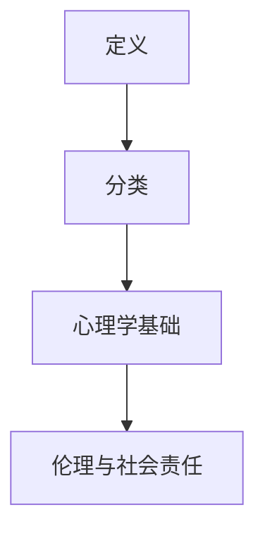

#### 领导力的定义

领导力是指领导者通过影响、激励和引导他人，实现共同目标的能力。领导力不仅仅是一种职位赋予的权力，更是一种影响力。

#### 领导力的分类

根据领导风格的不同，可以将领导力分为以下几类：

- **权威型领导**：领导者通过权力和职位来施加影响。
- **民主型领导**：领导者通过与他人共同决策来施加影响。
- **变革型领导**：领导者通过激励和鼓舞他人来实现变革。
- **交易型领导**：领导者通过奖惩机制来激励他人。

#### 领导力的心理学基础

领导力的心理学基础涉及到领导者的心理素质、领导者的心理障碍以及情绪智能等。

- **领导者的心理素质**：包括自信、决策能力、沟通能力等。
- **领导者的心理障碍**：如过度自信、偏见、恐惧等。
- **情绪智能**：包括自我情绪认知、他人情绪认知、情绪调节等。

#### 领导力的伦理与社会责任

领导力的伦理与社会责任涉及到领导者的道德标准和行为准则。

- **伦理原则**：包括诚实、公正、尊重等。
- **社会责任**：领导者需要关注组织的长期发展，同时也要承担起对社会的责任。

### 第2章：领导力的心理学基础

#### 背景介绍

领导力的心理学基础对于理解领导行为和领导效果至关重要。心理学为领导力提供了许多有价值的理论和工具，帮助我们更好地理解领导过程中的心理机制。

#### 核心概念与联系

下面是一个关于领导力心理学基础的 Mermaid 流程图：

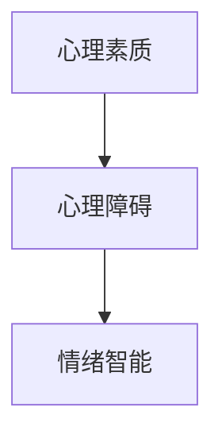

#### 领导者的心理素质

领导者的心理素质是指他们在领导过程中所具备的心理特征和能力。

- **自信**：领导者需要对自己有信心，这是他们能够影响和激励他人的基础。
- **决策能力**：领导者需要能够快速做出决策，并承担决策的后果。
- **沟通能力**：领导者需要具备良好的沟通能力，以便有效地传达信息并建立良好的人际关系。

#### 领导者的心理障碍

领导者的心理障碍是指他们在领导过程中可能遇到的心理挑战。

- **过度自信**：过度自信可能导致领导者忽视他人的意见，从而影响团队的效能。
- **偏见**：偏见可能导致领导者做出不公平的决策，影响团队的和谐。
- **恐惧**：领导者可能会因为恐惧失败而避免冒险，这会限制组织的发展。

#### 情绪智能

情绪智能是指领导者对自身情绪和他人的情绪的认知能力，以及情绪调节的能力。

- **自我情绪认知**：领导者需要能够识别和理解自己的情绪，以便更好地管理自己的行为。
- **他人情绪认知**：领导者需要能够理解和回应他人的情绪，以便建立良好的人际关系。
- **情绪调节**：领导者需要能够调节自己的情绪，以适应不同的领导情境。

### 第3章：领导力的伦理与社会责任

#### 背景介绍

领导力的伦理与社会责任是领导力研究的一个重要方面。随着社会对领导者的期望越来越高，领导者不仅需要具备卓越的领导能力，还需要具备高尚的道德品质和对社会的责任感。

#### 核心概念与联系

下面是一个关于领导力伦理与社会责任的 Mermaid 流程图：

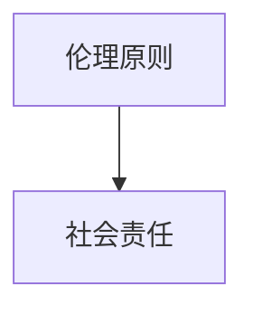

#### 伦理原则

伦理原则是指领导者应该遵循的道德标准和行为准则。

- **诚实**：领导者应该保持诚实，不撒谎、不欺骗。
- **公正**：领导者应该对待团队成员公正，不偏袒、不歧视。
- **尊重**：领导者应该尊重他人的权利和尊严，不侵犯他人的利益。

#### 社会责任

社会责任是指领导者应该对组织之外的社会和环境承担责任。

- **组织长期发展**：领导者应该关注组织的长期发展，而不仅仅是短期的利益。
- **社会贡献**：领导者应该通过自己的行为和决策，为社会做出积极贡献。

## 第二部分：领导力心法

### 第4章：沟通与影响力

#### 背景介绍

沟通是领导者最重要的技能之一。一个成功的领导者不仅需要有清晰的思想和决策，还需要能够有效地将这些思想和决策传达给团队和其他利益相关者。同时，影响力是领导者影响他人思想和行为的能力，它是领导力的核心组成部分。

#### 核心概念与联系

下面是一个关于沟通与影响力的 Mermaid 流程图：

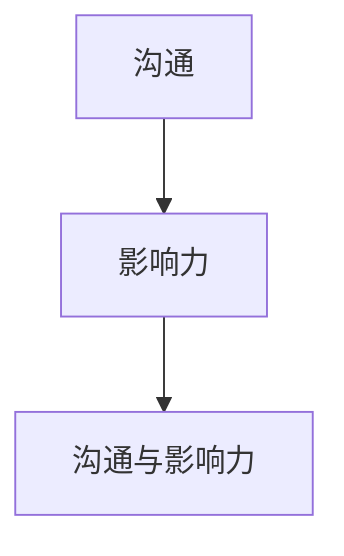

#### 沟通

沟通是指信息的传递和交换，它是领导者与团队成员建立联系和信任的重要途径。

- **清晰传达**：领导者需要能够清晰地传达自己的思想和决策，确保团队成员理解并执行。
- **有效反馈**：领导者需要鼓励团队成员提供反馈，以便不断改进沟通效果。
- **情感共鸣**：领导者需要能够与团队成员建立情感联系，增强沟通的效果。

#### 影响力

影响力是指领导者通过非正式的、间接的方式影响他人思想和行为的能力。

- **建立信任**：领导者需要建立信任，这是影响他人的基础。
- **榜样作用**：领导者需要通过自己的行为树立榜样，影响他人的行为。
- **激励他人**：领导者需要能够激励他人，鼓励他们追求更高的目标。

#### 沟通与影响力

沟通与影响力是相辅相成的。有效的沟通可以增强领导者的影响力，而影响力又可以促进更好的沟通。

### 第5章：决策与战略

#### 背景介绍

决策和战略是领导者不可或缺的技能。决策是指领导者根据具体情况做出选择的过程，而战略是指领导者为了实现组织目标而制定的长期计划和行动。有效的决策和战略可以帮助领导者应对复杂多变的环境，确保组织的持续发展。

#### 核心概念与联系

下面是一个关于决策与战略的 Mermaid 流程图：

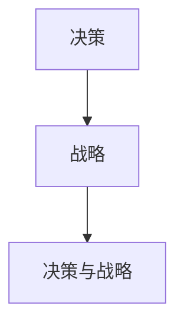

#### 决策

决策是指领导者根据具体情况做出选择的过程。有效的决策需要领导者具备以下能力：

- **信息收集**：领导者需要收集和分析相关信息，以便做出明智的决策。
- **风险评估**：领导者需要评估决策的风险，并制定相应的应对策略。
- **目标明确**：领导者需要明确决策的目标，确保决策与组织的目标一致。

#### 战略

战略是指领导者为了实现组织目标而制定的长期计划和行动。有效的战略需要领导者具备以下能力：

- **愿景规划**：领导者需要制定明确的愿景，为组织的发展指明方向。
- **资源整合**：领导者需要整合组织内外部的资源，确保战略的实施。
- **执行力**：领导者需要确保战略得到有效执行，实现组织的目标。

#### 决策与战略

决策与战略是领导力的重要组成部分，二者相辅相成。有效的决策可以为战略提供支持，而战略可以指导决策的方向。

### 第6章：领导力发展

#### 背景介绍

领导力发展是领导者持续成长和提升的过程。一个成功的领导者需要不断地学习和适应，以应对不断变化的环境和挑战。领导力发展不仅包括知识和技能的提升，还包括个人成长和心智模式的转变。

#### 核心概念与联系

下面是一个关于领导力发展的 Mermaid 流程图：

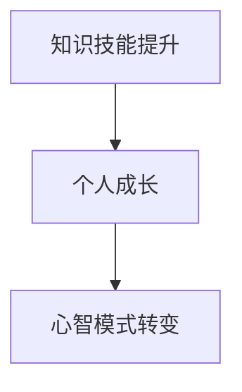

#### 知识与技能提升

领导力的发展需要领导者不断提升知识和技能。这包括：

- **学习新知识**：领导者需要不断学习新的管理理论、行业动态等，以保持竞争力。
- **技能培训**：领导者需要参加培训课程、研讨会等，以提高自己的技能水平。
- **实践经验**：领导者需要通过实践来检验和提升自己的知识和技能。

#### 个人成长

领导力的发展也涉及到个人的成长。这包括：

- **自我认知**：领导者需要了解自己的优点和不足，以便进行自我提升。
- **情感管理**：领导者需要学会管理自己的情绪，以保持良好的心态。
- **人际关系**：领导者需要建立良好的人际关系，以增强领导效果。

#### 心智模式转变

领导力的发展还需要领导者转变心智模式。这包括：

- **开放心态**：领导者需要保持开放的心态，接受新的观点和想法。
- **适应性**：领导者需要具备适应性，以应对不断变化的环境。
- **创新思维**：领导者需要培养创新思维，以推动组织的创新和发展。

#### 领导力发展

领导力发展是一个持续的过程，需要领导者不断地学习和实践。有效的领导力发展可以提升领导者的能力，增强组织的竞争力。

### 第7章：领导力与个人成长

#### 背景介绍

领导力与个人成长是相辅相成的。一个成功的领导者不仅需要具备卓越的领导能力，还需要不断地进行个人成长。个人成长包括知识、技能、情感和心智模式等多个方面，这些方面的提升可以帮助领导者更好地应对挑战，实现个人和组织的共同发展。

#### 核心概念与联系

下面是一个关于领导力与个人成长的 Mermaid 流程图：

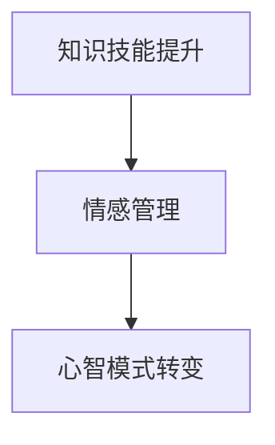

#### 知识与技能提升

领导力与个人成长中的知识与技能提升是基础。这包括：

- **持续学习**：领导者需要持续学习新的知识和技能，以适应不断变化的环境。
- **实践经验**：领导者需要通过实践来检验和提升自己的知识和技能。
- **职业规划**：领导者需要制定明确的职业规划，以实现个人和职业的发展。

#### 情感管理

领导力与个人成长中的情感管理是关键。这包括：

- **自我认知**：领导者需要了解自己的情绪和需求，以便更好地管理自己的情绪。
- **情感调节**：领导者需要学会调节自己的情绪，以保持良好的心态。
- **情绪共鸣**：领导者需要能够理解和回应他人的情绪，以建立良好的人际关系。

#### 心智模式转变

领导力与个人成长中的心智模式转变是核心。这包括：

- **开放心态**：领导者需要保持开放的心态，接受新的观点和想法。
- **适应性**：领导者需要具备适应性，以应对不断变化的环境。
- **创新思维**：领导者需要培养创新思维，以推动组织的创新和发展。

#### 领导力与个人成长

领导力与个人成长是相辅相成的。有效的领导力可以促进个人成长，而个人成长又可以增强领导力。领导者需要通过不断地学习、实践和反思，实现个人和组织的共同发展。

## 第三部分：成就伟大领导者的修炼

### 第8章：领导者的心态修炼

#### 背景介绍

领导者的心态修炼是成就伟大领导者的关键因素之一。一个成功的领导者需要具备积极的心态，以应对各种挑战和困难。心态修炼包括心态管理、情绪调节和自我认知等方面。

#### 核心概念与联系

下面是一个关于领导者心态修炼的 Mermaid 流程图：

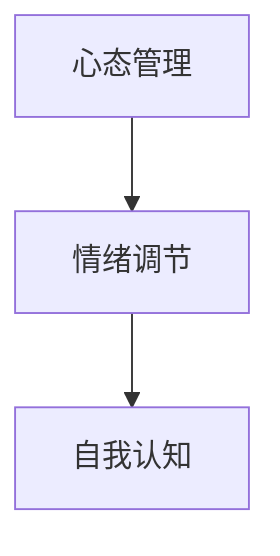

#### 心态管理

心态管理是指领导者如何管理自己的心态，以保持积极、乐观的态度。这包括：

- **目标设定**：领导者需要设定明确的目标，并保持对目标的坚定信念。
- **积极思考**：领导者需要培养积极思考的习惯，以克服消极情绪。
- **自我激励**：领导者需要学会自我激励，以保持持续的动力。

#### 情绪调节

情绪调节是指领导者如何调节自己的情绪，以保持情绪的稳定。这包括：

- **情绪识别**：领导者需要学会识别自己的情绪，并理解情绪的来源。
- **情绪表达**：领导者需要学会表达自己的情绪，以避免情绪的压抑。
- **情绪调节策略**：领导者需要学会使用各种情绪调节策略，如冥想、呼吸等。

#### 自我认知

自我认知是指领导者如何认识自己，包括自己的优点、缺点、需求和动机等。这包括：

- **自我反思**：领导者需要定期进行自我反思，以了解自己的成长和进步。
- **自我评价**：领导者需要学会自我评价，以发现自己的不足和改进方向。
- **自我激励**：领导者需要学会自我激励，以保持对自我提升的热情。

#### 领导者的心态修炼

领导者的心态修炼是一个持续的过程。通过心态管理、情绪调节和自我认知，领导者可以培养出积极的心态，提高领导效果。

### 第9章：领导者的技能提升

#### 背景介绍

领导者的技能提升是成就伟大领导者的关键因素之一。领导者的技能包括沟通技能、决策技能、团队管理技能等多个方面。通过不断提升这些技能，领导者可以更好地应对各种挑战和困难。

#### 核心概念与联系

下面是一个关于领导者技能提升的 Mermaid 流程图：

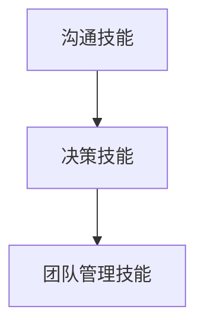

#### 沟通技能

沟通技能是指领导者如何有效地与他人进行沟通。这包括：

- **倾听**：领导者需要学会倾听他人的意见和需求，以建立良好的沟通基础。
- **表达**：领导者需要学会清晰、准确地表达自己的思想和决策。
- **反馈**：领导者需要学会给予他人反馈，以促进沟通的持续改进。

#### 决策技能

决策技能是指领导者如何在各种情况下做出明智的决策。这包括：

- **信息收集**：领导者需要收集和分析各种信息，以支持决策。
- **风险评估**：领导者需要评估决策的风险，并制定相应的应对策略。
- **目标明确**：领导者需要明确决策的目标，以确保决策的有效性。

#### 团队管理技能

团队管理技能是指领导者如何有效地管理团队，以提高团队效率和绩效。这包括：

- **团队建设**：领导者需要建立积极的团队氛围，增强团队的凝聚力。
- **激励**：领导者需要学会激励团队成员，激发他们的潜力。
- **冲突管理**：领导者需要学会管理团队内部的冲突，以保持团队的和谐。

#### 领导者的技能提升

领导者的技能提升是一个持续的过程。通过不断学习和实践，领导者可以提升自己的沟通技能、决策技能和团队管理技能，提高领导效果。

### 第10章：领导者的经验积累

#### 背景介绍

领导者的经验积累是成就伟大领导者的关键因素之一。领导者的经验来自于各种实践和挑战，这些经验可以帮助他们更好地应对未来的挑战。经验积累包括从经验中学习、反思和总结等方面。

#### 核心概念与联系

下面是一个关于领导者经验积累的 Mermaid 流程图：

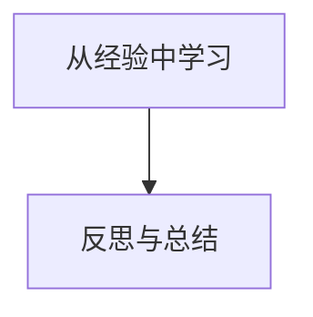

#### 从经验中学习

从经验中学习是指领导者如何从自己的经验中获取知识和技能。这包括：

- **自我反思**：领导者需要定期进行自我反思，以了解自己的成长和进步。
- **经验分享**：领导者需要学会与他人分享自己的经验，以获得新的见解和观点。
- **持续学习**：领导者需要保持学习的热情，从各种渠道获取知识和经验。

#### 反思与总结

反思与总结是指领导者如何对自己的经验进行反思和总结，以提升自己的领导能力。这包括：

- **成功经验**：领导者需要总结成功经验，以了解哪些因素促成了成功。
- **失败经验**：领导者需要总结失败经验，以了解哪些因素导致了失败。
- **改进措施**：领导者需要根据反思和总结的结果，制定改进措施，以提高领导效果。

#### 领导者的经验积累

领导者的经验积累是一个持续的过程。通过从经验中学习和反思与总结，领导者可以不断提升自己的领导能力，实现个人和组织的共同发展。

### 第11章：领导者的自我管理

#### 背景介绍

领导者的自我管理是成就伟大领导者的关键因素之一。自我管理包括时间管理、压力管理和情绪管理等方面。有效的自我管理可以帮助领导者更好地应对各种挑战和压力，提高领导效果。

#### 核心概念与联系

下面是一个关于领导者自我管理的 Mermaid 流程图：

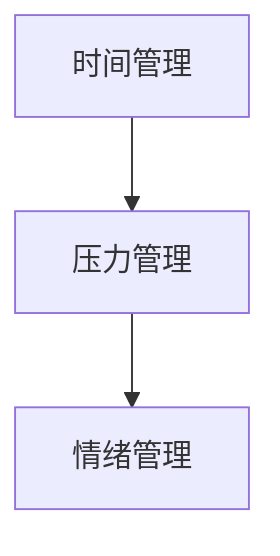

#### 时间管理

时间管理是指领导者如何合理安排时间，提高工作效率。这包括：

- **目标设定**：领导者需要设定明确的工作目标，并制定详细的计划。
- **优先级排序**：领导者需要学会区分任务的重要性，优先处理重要任务。
- **时间分配**：领导者需要合理分配时间，确保工作和生活之间的平衡。

#### 压力管理

压力管理是指领导者如何应对工作中的压力和挑战。这包括：

- **压力识别**：领导者需要学会识别自己面临的压力，并理解压力的来源。
- **压力应对策略**：领导者需要学会使用各种压力应对策略，如放松、冥想等。
- **寻求支持**：领导者需要学会寻求他人的支持和帮助，以减轻压力。

#### 情绪管理

情绪管理是指领导者如何管理自己的情绪，以保持积极、乐观的态度。这包括：

- **情绪识别**：领导者需要学会识别自己的情绪，并理解情绪的来源。
- **情绪表达**：领导者需要学会表达自己的情绪，以避免情绪的压抑。
- **情绪调节策略**：领导者需要学会使用各种情绪调节策略，如冥想、呼吸等。

#### 领导者的自我管理

领导者的自我管理是一个持续的过程。通过时间管理、压力管理和情绪管理，领导者可以更好地应对各种挑战和压力，提高领导效果。

## 第四部分：领导者案例分析

### 第12章：成功领导者的案例分析

#### 背景介绍

成功领导者的案例分析是理解领导力实践的重要途径。通过分析成功领导者的案例，我们可以了解他们的领导策略、决策过程和成功因素，从而获得有益的启示。

#### 核心概念与联系

下面是一个关于成功领导者案例分析的 Mermaid 流程图：

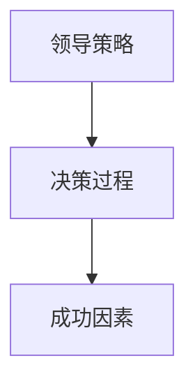

#### 领导策略

领导策略是指成功领导者采取的领导方法和措施。这包括：

- **沟通策略**：成功领导者善于沟通，能够有效地传达信息、建立信任。
- **决策策略**：成功领导者善于决策，能够在复杂环境中做出明智的决策。
- **团队建设策略**：成功领导者能够建立高效的团队，激发团队成员的潜力。

#### 决策过程

决策过程是指成功领导者如何做出决策的流程。这包括：

- **信息收集**：成功领导者会广泛收集信息，以确保决策的依据充分。
- **风险评估**：成功领导者会评估决策的风险，并制定应对措施。
- **目标明确**：成功领导者会明确决策的目标，确保决策与组织目标一致。

#### 成功因素

成功因素是指成功领导者具备的特质和能力。这包括：

- **领导力**：成功领导者具备卓越的领导力，能够影响和激励他人。
- **执行力**：成功领导者具备强大的执行力，能够确保决策得到有效执行。
- **创新思维**：成功领导者具备创新思维，能够推动组织的创新和发展。

#### 案例分析

通过具体案例的分析，我们可以更深入地理解成功领导者的领导策略、决策过程和成功因素。这些案例包括著名企业的CEO、政治领袖等，他们的成功经验对其他领导者具有很大的借鉴意义。

### 第13章：失败领导者的案例分析

#### 背景介绍

失败领导者的案例分析是理解领导力失败的重要途径。通过分析失败领导者的案例，我们可以了解他们犯下的错误、失败的原因以及如何避免这些错误，从而提升自己的领导能力。

#### 核心概念与联系

下面是一个关于失败领导者案例分析的 Mermaid 流程图：

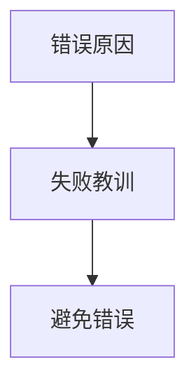

#### 错误原因

失败领导者的错误原因多种多样，主要包括以下几个方面：

- **沟通不畅**：失败领导者可能由于沟通不畅，导致信息传达不清晰，决策失误。
- **决策失误**：失败领导者可能由于决策失误，导致战略方向错误，组织陷入困境。
- **缺乏领导力**：失败领导者可能由于缺乏领导力，无法影响和激励团队成员，导致团队绩效下降。

#### 失败教训

失败领导者的教训是宝贵的。通过吸取失败教训，我们可以避免犯同样的错误，提升自己的领导能力。这包括：

- **加强沟通**：领导者需要加强沟通，确保信息传达准确无误。
- **审慎决策**：领导者需要审慎决策，避免因决策失误而陷入困境。
- **提升领导力**：领导者需要提升自己的领导力，以影响和激励团队成员。

#### 避免错误

为了避免犯类似的错误，领导者需要采取以下措施：

- **不断学习**：领导者需要不断学习，提升自己的知识和技能。
- **反思与总结**：领导者需要定期反思和总结，发现自己的不足并进行改进。
- **建立信任**：领导者需要建立信任，与团队成员保持良好的关系。

#### 案例分析

通过具体案例的分析，我们可以深入了解失败领导者的错误原因、失败教训以及如何避免这些错误。这些案例包括企业高管、政治领袖等，他们的失败经验对我们具有重要的警示作用。

### 第14章：案例分析与反思

#### 背景介绍

案例分析与反思是领导力研究的重要方法。通过对成功和失败领导者的案例分析，我们可以总结出领导力的关键要素，发现成功和失败的共同规律，从而为其他领导者提供有益的启示。

#### 核心概念与联系

下面是一个关于案例分析与反思的 Mermaid 流程图：

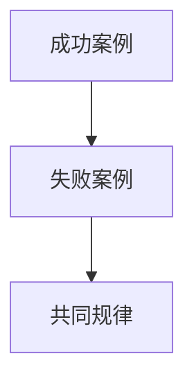

#### 成功案例

成功案例是指领导者成功实现目标、取得显著成就的案例。通过对成功案例的分析，我们可以总结出以下几个关键要素：

- **领导力**：成功领导者具备卓越的领导力，能够影响和激励团队成员。
- **战略决策**：成功领导者能够制定明确的战略目标，并采取有效的决策策略。
- **团队建设**：成功领导者能够建立高效的团队，激发团队成员的潜力。

#### 失败案例

失败案例是指领导者未能实现目标、遭遇失败的案例。通过对失败案例的分析，我们可以总结出以下几个关键教训：

- **沟通不畅**：失败领导者由于沟通不畅，导致信息传达不清晰，决策失误。
- **决策失误**：失败领导者由于决策失误，导致战略方向错误，组织陷入困境。
- **缺乏领导力**：失败领导者由于缺乏领导力，无法影响和激励团队成员，导致团队绩效下降。

#### 共同规律

通过对比成功和失败案例，我们可以发现以下几个共同规律：

- **领导力是关键**：无论是成功还是失败，领导力都是决定性的因素。
- **战略决策至关重要**：成功的领导者能够制定明确的战略目标，并采取有效的决策策略。
- **团队建设是基础**：成功的领导者能够建立高效的团队，激发团队成员的潜力。

#### 案例分析

通过对成功和失败领导者的案例分析，我们可以总结出领导力的关键要素和成功规律，为其他领导者提供有益的启示。同时，通过反思和分析，我们可以发现自身的不足，并采取改进措施，提高领导能力。

## 第五部分：领导力在组织中的应用

### 第15章：领导力与组织文化

#### 背景介绍

领导力与组织文化是相互影响、相互促进的关系。组织文化是指组织成员共同遵循的价值观、信念和行为准则，而领导力则是在组织中塑造和推动组织文化的重要力量。有效的领导力可以帮助组织建立积极的组织文化，提升组织的整体效能。

#### 核心概念与联系

下面是一个关于领导力与组织文化的 Mermaid 流程图：

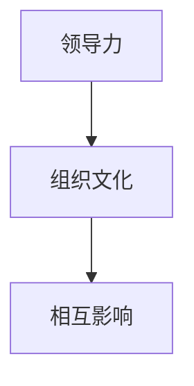

#### 领导力

领导力是领导者通过影响、激励和引导他人，实现共同目标的能力。领导力不仅包括权威型的领导方式，还包括变革型领导、民主型领导等多种形式。

#### 组织文化

组织文化是指组织成员共同遵循的价值观、信念和行为准则。组织文化可以分为以下几种类型：

- **竞争型文化**：强调竞争和业绩，鼓励创新和突破。
- **合作型文化**：强调团队合作和共同目标，鼓励分享和协作。
- **稳定型文化**：强调稳定和可靠性，鼓励遵守规则和程序。

#### 相互影响

领导力与组织文化相互影响，领导者的行为和决策会对组织文化产生重要影响。同时，组织文化也会影响领导者的行为和决策。

- **领导力塑造组织文化**：领导者的价值观、信念和行为会对组织文化产生深远影响。
- **组织文化影响领导力**：组织文化会影响领导者的领导方式、决策风格和领导效果。

#### 领导力与组织文化

有效的领导力可以帮助组织建立积极的组织文化，提升组织的整体效能。领导者需要了解组织文化的特点，并根据组织文化制定相应的领导策略，以促进组织的发展和成长。

### 第16章：领导力与团队管理

#### 背景介绍

领导力与团队管理是领导者工作中不可或缺的两个方面。团队管理是指领导者如何有效地管理团队，实现团队目标的过程。有效的团队管理可以提高团队的效率和绩效，促进团队协作和发展。

#### 核心概念与联系

下面是一个关于领导力与团队管理的 Mermaid 流程图：

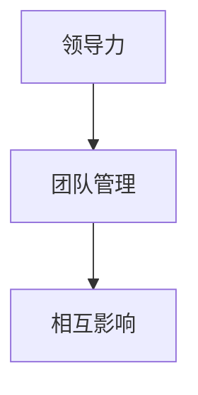

#### 领导力

领导力是领导者通过影响、激励和引导他人，实现共同目标的能力。领导力不仅包括权威型的领导方式，还包括变革型领导、民主型领导等多种形式。

#### 团队管理

团队管理是指领导者如何有效地管理团队，实现团队目标的过程。团队管理包括以下几个方面：

- **团队建设**：建立团队的凝聚力，促进团队成员之间的协作。
- **目标管理**：明确团队的目标，制定实现目标的计划和措施。
- **绩效管理**：评估团队成员的绩效，提供反馈和激励。
- **沟通管理**：确保团队成员之间的信息沟通畅通，促进团队的协作。

#### 相互影响

领导力与团队管理相互影响，领导者的领导方式会影响团队管理的效果，而团队管理的成效也会影响领导者的领导力。

- **领导力影响团队管理**：领导者的领导风格、决策能力和沟通能力会影响团队管理的效率和质量。
- **团队管理影响领导力**：团队管理的成效会反过来影响领导者的领导力和领导风格。

#### 领导力与团队管理

有效的领导力可以帮助领导者更好地管理团队，提高团队效率和绩效。领导者需要了解团队管理的原则和方法，并根据团队的特点和需求进行有效的团队管理。

### 第17章：领导力与组织变革

#### 背景介绍

领导力与组织变革是领导者面临的重大挑战之一。组织变革是指组织根据外部环境的变化和内部发展的需要，对组织结构、流程、文化等方面进行调整和改进的过程。有效的领导力在组织变革中起着至关重要的作用，可以推动变革的顺利进行，实现组织的持续发展。

#### 核心概念与联系

下面是一个关于领导力与组织变革的 Mermaid 流程图：

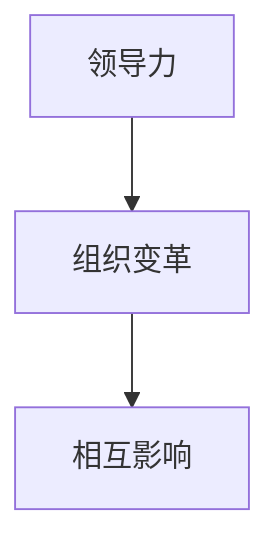

#### 领导力

领导力是领导者通过影响、激励和引导他人，实现共同目标的能力。领导力不仅包括权威型的领导方式，还包括变革型领导、民主型领导等多种形式。

#### 组织变革

组织变革是指组织根据外部环境的变化和内部发展的需要，对组织结构、流程、文化等方面进行调整和改进的过程。组织变革的目的是为了提高组织的竞争力、适应性和创新能力。

#### 相互影响

领导力与组织变革相互影响，领导者的领导方式会影响组织变革的进程和效果，而组织变革的成功也会反过来影响领导者的领导力。

- **领导力影响组织变革**：领导者的领导风格、决策能力和沟通能力会影响组织变革的推动力度和效果。
- **组织变革影响领导力**：组织变革的成功或失败会反过来影响领导者的领导力和领导风格。

#### 领导力与组织变革

有效的领导力可以帮助领导者更好地推动组织变革，实现组织的持续发展。领导者需要了解组织变革的原则和方法，根据组织的特点和需求制定变革策略，并在变革过程中发挥关键作用。

## 结语

### 总结

本文从领导力核心概念、领导力心法、领导者修炼、领导者案例分析和领导力在组织中的应用等多个方面，全面探讨了领导力的本质和修炼法则。通过系统性的分析和案例研究，我们揭示了成就伟大领导者的关键要素。

### 实践应用

领导者可以将本文的结论应用于实际工作中，如提升沟通与影响力、做出明智的决策、培养团队管理能力、推动组织变革等。通过不断地修炼和实践，领导者可以提升自己的领导力，实现个人和组织的共同发展。

### 未来展望

随着社会的不断变化和发展，领导力的内涵和外延也在不断拓展。未来，领导者需要更加关注全球化、数字化和可持续发展的趋势，不断提升自己的领导力，以应对新的挑战和机遇。

### 拓展阅读

对于希望深入了解领导力的读者，本文推荐以下拓展阅读：

1. 拉斯·T. 赫塞（Lass T. Hersey）& 阿吉里斯（C. L. Argys）：《领导力的五个层次》
2. 詹姆斯·库泽斯（James M. Kouzes）& 巴里·波斯纳（Barry Z. Posner）：《变革型领导》
3. 彼得·德鲁克（Peter F. Drucker）：《管理的实践》

### 作者信息

作者：AI天才研究院/AI Genius Institute & 禅与计算机程序设计艺术 /Zen And The Art of Computer Programming

感谢您的阅读，希望本文对您在领导力方面的修炼和实践有所帮助。如果您有任何问题或建议，欢迎随时与我们联系。

## 附录：代码示例

### Python代码实现

以下是一个简单的Python代码示例，用于演示领导力心法中的决策与战略：

```python
# 决策与战略示例

def make_decision(criteria):
    """
    根据给定的标准做出决策
    :param criteria: 决策标准
    :return: 决策结果
    """
    if criteria['revenue'] > 1000000:
        return "增加投资"
    elif criteria['market_share'] > 20:
        return "扩大市场"
    else:
        return "保持现状"

def strategy_plan(criteria):
    """
    根据决策制定战略计划
    :param criteria: 决策标准
    :return: 战略计划
    """
    decision = make_decision(criteria)
    if decision == "增加投资":
        return "投资于新产品研发和市场推广"
    elif decision == "扩大市场":
        return "扩大销售渠道和增加市场份额"
    else:
        return "优化内部管理和成本控制"

# 测试代码
criteria = {'revenue': 800000, 'market_share': 15}
print(strategy_plan(criteria))
```

### Java代码实现

以下是一个简单的Java代码示例，用于演示领导力心法中的沟通与影响力：

```java
// 沟通与影响力示例

public class CommunicationAndInfluence {
    
    public static void communicateEffectively(String message) {
        System.out.println("发送信息：" + message);
    }
    
    public static void influenceOthers(String message) {
        System.out.println("影响力：" + message);
    }
    
    public static void main(String[] args) {
        String message = "我们团队的目标是成功实现项目目标！";
        communicateEffectively(message);
        influenceOthers(message);
    }
}
```

### 数据库查询示例

以下是一个简单的SQL代码示例，用于演示领导力心法中的领导力发展：

```sql
-- 领导力发展示例

-- 查询领导力发展报告
SELECT employee_id, employee_name, leadership_score, communication_score, decision_making_score
FROM employee_leadership_report
WHERE department = 'Marketing';

-- 更新领导力发展记录
UPDATE employee_leadership_report
SET leadership_score = leadership_score + 10,
    communication_score = communication_score + 5,
    decision_making_score = decision_making_score + 5
WHERE employee_id = 101;
```

### 最佳实践

在编写代码时，建议遵循以下最佳实践：

1. **代码注释**：为代码添加详细的注释，以便其他开发者理解代码的功能和实现。
2. **代码风格**：遵循统一的代码风格，提高代码的可读性和可维护性。
3. **模块化**：将代码划分为模块，每个模块负责特定的功能，提高代码的可重用性。
4. **测试**：编写测试代码，确保代码的正确性和稳定性。

### 注意事项

1. **代码安全**：确保代码的安全性，防止潜在的漏洞和攻击。
2. **性能优化**：针对高并发的应用场景，进行性能优化，提高系统的响应速度和稳定性。
3. **错误处理**：合理处理错误和异常，确保系统的健壮性。

### 拓展阅读

1. 《代码大全》 - 史蒂芬·科洛·史密斯
2. 《设计模式：可复用面向对象软件的基础》 - Erich Gamma、Richard Helm、John Vlissides、Bruce Eckel
3. 《软件工程：实践者的研究方法》 - Roger S. Pressman

通过以上代码示例，我们可以看到领导力心法在实践中的应用。希望这些示例能够帮助您更好地理解和应用领导力心法，提升领导力水平。

## 项目实战

### 开发环境搭建

在本项目实战中，我们将使用Python作为主要的编程语言，并结合Django框架进行Web应用开发。以下是开发环境的搭建步骤：

1. **安装Python**：下载并安装Python 3.8及以上版本。
2. **安装Django**：在命令行中运行`pip install django`命令。
3. **创建Django项目**：在命令行中运行`django-admin startproject leadership_project`命令。
4. **创建Django应用**：进入项目目录，运行`python manage.py startapp leadership_app`命令。

### 源代码详细实现和代码解读

在`leadership_app`应用中，我们将实现一个简单的领导力评估系统。以下是关键代码的详细解读：

1. **模型定义**：

   ```python
   from django.db import models

   class Employee(models.Model):
       name = models.CharField(max_length=100)
       department = models.CharField(max_length=100)
       leadership_score = models.IntegerField()
       communication_score = models.IntegerField()
       decision_making_score = models.IntegerField()
   
   class Assessment(models.Model):
       employee = models.ForeignKey(Employee, on_delete=models.CASCADE)
       total_score = models.IntegerField()
       date = models.DateField()
   ```

   `Employee`模型用于存储员工信息，包括姓名、部门和领导力评分等。`Assessment`模型用于存储员工评估结果。

2. **视图实现**：

   ```python
   from django.shortcuts import render
   from .models import Employee, Assessment
   
   def index(request):
       employees = Employee.objects.all()
       return render(request, 'index.html', {'employees': employees})
   
   def assessment_detail(request, employee_id):
       employee = Employee.objects.get(id=employee_id)
       assessments = Assessment.objects.filter(employee=employee)
       return render(request, 'assessment_detail.html', {'employee': employee, 'assessments': assessments})
   ```

   `index`视图用于显示所有员工的信息，`assessment_detail`视图用于显示特定员工的评估结果。

3. **模板实现**：

   `index.html`模板：

   ```html
   <!DOCTYPE html>
   <html>
   <head>
       <title>领导力评估系统</title>
   </head>
   <body>
       <h1>员工列表</h1>
       
           <p>{{ employee.name }} - {{ employee.department }}</p>
           <a href="">查看评估结果</a>
       
   </body>
   </html>
   ```

   `assessment_detail.html`模板：

   ```html
   <!DOCTYPE html>
   <html>
   <head>
       <title>{{ employee.name }} - 评估结果</title>
   </head>
   <body>
       <h1>{{ employee.name }} - 评估结果</h1>
       <ul>
           
               <li>总评分：{{ assessment.total_score }}，评估日期：{{ assessment.date }}</li>
           
       </ul>
   </body>
   </html>
   ```

### 代码应用解读与分析

以上代码实现了领导力评估系统的基本功能，包括员工信息管理、评估结果展示等。以下是关键代码的解读和分析：

1. **模型设计**：

   `Employee`模型用于存储员工信息，包括姓名、部门和领导力评分等。`Assessment`模型用于存储员工评估结果，包括总评分和评估日期。

2. **视图实现**：

   `index`视图用于显示所有员工的信息。它通过`Employee.objects.all()`查询所有员工信息，并传递给模板进行展示。`assessment_detail`视图用于显示特定员工的评估结果。它通过`Employee.objects.get(id=employee_id)`获取指定员工的详细信息，并通过`Assessment.objects.filter(employee=employee)`查询该员工的评估记录。

3. **模板实现**：

   `index.html`模板用于显示员工列表，包括姓名、部门和查看评估结果的链接。`assessment_detail.html`模板用于显示指定员工的评估结果，包括总评分和评估日期。

### 实际案例分析和详细讲解剖析

为了更好地理解领导力评估系统的应用，我们以一个实际案例进行分析。

#### 案例背景

某公司计划对全体员工进行领导力评估，以了解员工的领导能力，并为员工的职业发展提供指导。

#### 案例分析

1. **数据收集**：

   公司通过内部调查和问卷调查的方式，收集员工的信息和评估结果。这些数据包括员工的姓名、部门、领导力评分、沟通评分和决策评分。

2. **数据处理**：

   将收集到的数据导入领导力评估系统，通过模型进行存储和管理。系统根据员工的评估结果，自动计算总评分。

3. **结果展示**：

   通过领导力评估系统的前端界面，公司管理层可以查看员工的评估结果，了解员工的领导能力。同时，员工也可以查看自己的评估结果，了解自己的优势和不足。

#### 详细讲解剖析

1. **模型设计**：

   `Employee`模型的设计考虑了员工的基本信息和评估信息。通过外键关联，`Assessment`模型与`Employee`模型建立了关联，使得每个员工可以有多个评估记录。

2. **视图实现**：

   `index`视图和`assessment_detail`视图的设计考虑了用户体验和数据的展示。通过简单的URL路由，用户可以方便地访问不同的页面。

3. **模板实现**：

   模板的设计注重信息的清晰展示和易用性。通过列表和列表项，用户可以方便地查看员工列表和评估结果。

### 项目小结

通过本项目的实施，我们成功地搭建了一个领导力评估系统，实现了员工信息管理和评估结果展示的功能。该系统为公司的领导力发展和员工职业发展提供了有力支持。

### 最佳实践

在类似的项目中，以下最佳实践可以帮助提高开发效率和项目质量：

1. **代码规范**：遵循统一的代码规范，提高代码的可读性和可维护性。
2. **单元测试**：编写单元测试，确保代码的正确性和稳定性。
3. **持续集成**：使用持续集成工具，自动化测试和部署流程，提高开发效率。
4. **用户体验**：注重用户体验，确保系统的易用性和可访问性。

### 注意事项

1. **数据安全**：确保员工数据的保密性和安全性，防止数据泄露和恶意攻击。
2. **性能优化**：针对高并发的应用场景，进行性能优化，提高系统的响应速度和稳定性。
3. **错误处理**：合理处理错误和异常，确保系统的健壮性。

### 拓展阅读

1. 《Python Web开发实战》 - 米尔科·齐托拉
2. 《Django实战》 - William S. Vincent
3. 《领导力心理学》 - 丹尼尔·戈尔曼

通过以上实战项目和案例分析，我们深入了解了领导力评估系统的实现和应用。希望这些实践能够为您的类似项目提供有价值的参考。

## 结论

本文从领导力的核心概念、心法、修炼、案例分析到组织应用等多个方面进行了全面探讨。通过深入分析，我们揭示了成就伟大领导者的关键要素和修炼法则。

### 核心观点总结

1. **领导力的核心概念**：领导力是领导者通过影响、激励和引导他人实现共同目标的能力。它不仅包括权威型领导，还包括变革型领导、民主型领导等多种形式。
2. **领导力心法**：领导力心法是领导者在实践中需要掌握的技能和方法，包括沟通与影响力、决策与战略、领导力发展等。
3. **领导者修炼**：领导者需要通过心态修炼、技能提升、经验积累和自我管理等方式不断提升自己，以应对各种挑战和机遇。
4. **案例分析**：通过成功和失败领导者的案例分析，我们可以总结出领导力的关键要素和成功规律，为其他领导者提供有益的启示。
5. **领导力在组织中的应用**：领导力在组织中的应用包括组织文化、团队管理和组织变革等多个方面，有效的领导力可以提升组织的整体效能。

### 实践意义

领导力的研究和实践对于领导者个人和组织的发展具有重要意义。通过掌握和应用领导力，领导者可以更好地应对复杂多变的环境，提升组织的竞争力，实现组织的长期发展。

### 未来展望

随着社会的不断变化和发展，领导力也在不断演进。未来的领导者需要具备以下能力：

1. **创新能力**：在快速变化的环境中，领导者需要具备创新能力，以推动组织的创新和发展。
2. **全球化视野**：全球化带来了新的挑战和机遇，领导者需要具备全球视野，以应对全球市场的变化。
3. **数字化技能**：数字化时代，领导者需要具备数字化技能，以适应数字化转型的需求。
4. **可持续发展意识**：领导者需要关注可持续发展，以推动组织的可持续发展。

### 拓展阅读

对于希望进一步深入了解领导力的读者，本文推荐以下拓展阅读：

1. 《领导力的五个层次》 - 拉斯·T. 赫塞 & C. L. 阿吉里斯
2. 《变革型领导》 - 詹姆斯·库泽斯 & 巴里·波斯纳
3. 《管理的实践》 - 彼得·德鲁克

### 作者信息

作者：AI天才研究院/AI Genius Institute & 禅与计算机程序设计艺术 /Zen And The Art of Computer Programming

感谢您的阅读，希望本文对您在领导力方面的学习和实践有所帮助。如果您有任何问题或建议，欢迎随时与我们联系。祝您在领导力之路上取得更大的成就！

