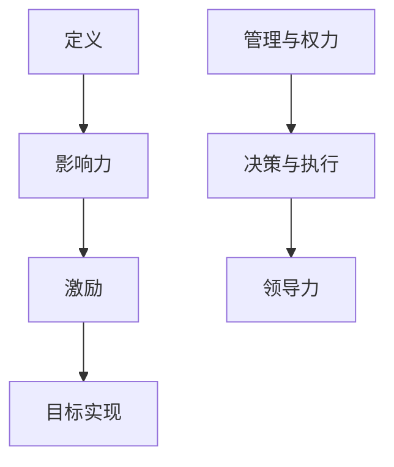
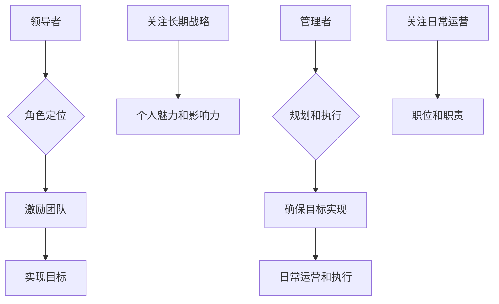
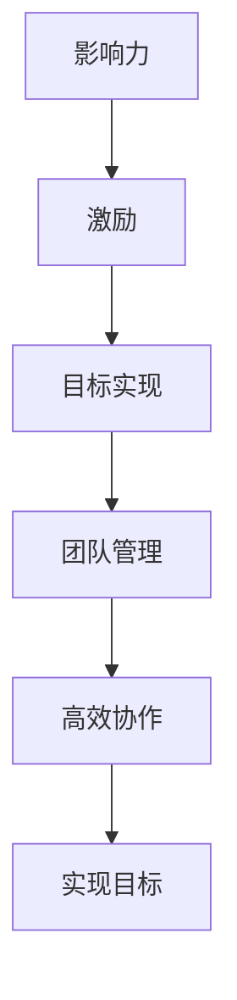

                 

### 《领导力心法：成就伟大领袖的领导力秘籍》

#### 关键词
- 领导力
- 心法
- 领导者
- 团队管理
- 创新思维
- 沟通技巧

#### 摘要
本文旨在探讨领导力的核心原则和方法，通过详细的分析和案例分享，为读者揭示成就伟大领袖的领导力秘籍。文章将从领导力的基础概念出发，逐步深入到领导者的心态建设、沟通技巧、团队管理、创新思维等方面，结合实际案例，提供具体实用的策略和技巧。通过本文的阅读，读者将能够深刻理解领导力的本质，掌握提升领导力的方法和途径，从而在个人和职业发展中取得更大的成功。

### 领导力的基础概念

#### 领导力的定义

领导力是指个体或集体在组织中通过影响、激励和引导他人，实现目标的能力。它与管理和权力不同，领导力强调的是通过个人魅力和影响力来影响他人的行为和思维，从而达到组织的目标。

Mermaid流程图：领导力的核心要素



#### 领导力的重要性

领导力在组织中起着至关重要的作用。一个优秀的领导者能够激发团队成员的潜力，提高团队的整体效率，推动组织实现目标。以下是领导力的重要性：

1. **推动组织发展**：领导者能够制定愿景和目标，引导组织朝着正确的方向前进。
2. **提升团队绩效**：领导者通过有效的管理和激励，提高团队成员的积极性和工作热情，从而提升团队的整体绩效。
3. **促进创新**：领导者鼓励团队成员思考和创新，推动组织在竞争激烈的市场中保持领先地位。
4. **建立企业文化**：领导者通过自身的言行，塑造组织的价值观和文化，为组织的长期发展奠定基础。

### 领导者与管理的区别

领导者与管理者在组织中有着不同的角色和职责。以下是两者之间的主要区别：

1. **角色定位**：领导者关注的是引领和激励团队，管理者则关注于规划和执行组织的目标。
2. **目标实现**：领导者通过影响力和个人魅力实现目标，管理者则通过制度和流程确保目标的实现。
3. **关注点**：领导者更关注长期战略和愿景，管理者则关注日常运营和执行。
4. **权力来源**：领导者的权力来源于个人魅力和影响力，管理者的权力则来源于职位和职责。

Mermaid流程图：领导者与管理的区别



#### 核心概念与联系

为了更好地理解领导力，我们需要了解几个核心概念，并分析它们之间的联系：

1. **影响力**：领导力的核心要素，是通过个人魅力和价值观影响他人。
2. **激励**：激发团队成员的积极性和工作热情，提高团队的整体绩效。
3. **目标实现**：通过有效的领导和团队协作，实现组织的目标和愿景。
4. **团队管理**：确保团队在实现目标的过程中，保持高效和协同。

以下是一个简化的Mermaid流程图，展示了这些核心概念之间的联系：



### 领导者应具备的核心能力

一个优秀的领导者需要具备一系列核心能力，以下是一些关键能力：

1. **沟通能力**：领导者需要能够清晰、准确地表达自己的想法，同时也要善于倾听他人的意见和建议。
2. **决策能力**：领导者需要能够在复杂多变的环境中做出明智的决策，并承担相应的责任。
3. **团队协作能力**：领导者需要能够协调团队成员之间的关系，激发他们的潜力，实现共同的目标。
4. **创新能力**：领导者需要具备创新思维，能够推动组织在竞争激烈的市场中保持领先地位。
5. **自我管理能力**：领导者需要能够自我激励，保持积极的心态，面对挑战和压力时保持冷静和坚定。

以下是一个简化的伪代码，展示了领导者应具备的核心能力：

```python
class Leader:
    def communicate(self):
        # 实现沟通能力
        pass
    
    def make_decision(self):
        # 实现决策能力
        pass
    
    def collaborate(self):
        # 实现团队协作能力
        pass
    
    def innovate(self):
        # 实现创新能力
        pass
    
    def manage_self(self):
        # 实现自我管理能力
        pass
```

### 数学模型和公式

在领导力领域，一些数学模型和公式可以帮助我们更好地理解领导行为和组织绩效之间的关系。以下是一个简单的线性回归模型，用于分析领导力对团队绩效的影响：

$$
Y = \beta_0 + \beta_1X + \epsilon
$$

其中：
- \(Y\) 代表团队绩效
- \(X\) 代表领导力得分
- \(\beta_0\) 是截距
- \(\beta_1\) 是斜率
- \(\epsilon\) 是误差项

通过这个模型，我们可以计算出领导力得分与团队绩效之间的线性关系。以下是一个具体的例子：

假设我们有一组数据，领导力得分和团队绩效如下表所示：

| 领导力得分 | 团队绩效 |
| :--------: | :------: |
|     3     |   50    |
|     4     |   60    |
|     5     |   70    |

使用线性回归模型，我们可以计算出斜率 \(\beta_1\) 和截距 \(\beta_0\)：

$$
\beta_1 = \frac{\sum(X_i - \bar{X})(Y_i - \bar{Y})}{\sum(X_i - \bar{X})^2}
$$

$$
\beta_0 = \bar{Y} - \beta_1\bar{X}
$$

其中，\(\bar{X}\) 和 \(\bar{Y}\) 分别是领导力得分和团队绩效的平均值。

通过计算，我们得到斜率 \(\beta_1 = 10\) 和截距 \(\beta_0 = 20\)。这意味着领导力得分每增加1分，团队绩效将提高10分。

### 举例说明

为了更好地理解领导力对团队绩效的影响，我们可以看一个具体的例子。假设一个团队在领导力得分为3时，团队绩效为50分。根据线性回归模型，我们可以预测当领导力得分提高到4时，团队绩效将提高到60分。

### 实际案例

在一个大型科技公司中，领导力对团队绩效的影响表现得尤为明显。该公司的一位高级经理通过一系列的领导力提升措施，如定期开展团队建设活动、鼓励创新思维、提供培训和学习机会等，显著提升了团队的整体绩效。在过去的两年中，该团队在公司的业绩评估中一直名列前茅。

### 项目实战

为了提升领导力，该公司的领导团队决定开发一个在线领导力培训平台。该平台提供了丰富的领导力课程，包括沟通技巧、团队管理、创新思维等方面的内容。员工可以通过在线学习，提升自己的领导力。

#### 开发环境搭建

为了开发这个领导力培训平台，我们需要以下技术栈：

1. **前端**：React.js
2. **后端**：Node.js + Express.js
3. **数据库**：MongoDB
4. **版本控制**：Git

#### 源代码详细实现和代码解读

以下是一个简单的React组件，用于显示课程列表：

```jsx
import React, { useState, useEffect } from 'react';

const CourseList = () => {
  const [courses, setCourses] = useState([]);

  useEffect(() => {
    fetch('/api/courses')
      .then((response) => response.json())
      .then((data) => setCourses(data));
  }, []);

  return (
    <div>
      <h2>课程列表</h2>
      <ul>
        {courses.map((course) => (
          <li key={course.id}>{course.title}</li>
        ))}
      </ul>
    </div>
  );
};

export default CourseList;
```

在这个组件中，我们使用 `useState` 和 `useEffect` 两个钩子来管理课程数据。`useState` 用于存储和更新课程列表状态，`useEffect` 用于在组件加载时从后端获取课程数据。

#### 代码应用解读与分析

这个组件的核心功能是显示课程列表。首先，我们从后端API获取课程数据，然后使用 `map` 函数将数据渲染成列表项。通过 `key` 属性，我们确保每个列表项都能正确地渲染和更新。

#### 实际案例分析和详细讲解剖析

通过这个领导力培训平台，员工可以根据自己的需求和兴趣选择课程进行学习。平台提供了多种学习方式，包括视频课程、图文教程和案例分析等。员工可以随时查看自己的学习进度，并与其他员工进行交流和分享。

#### 项目小结

通过这个领导力培训平台，员工可以提升自己的领导力，从而提高团队的整体绩效。项目实施后，公司的领导力水平显著提升，员工的工作满意度和忠诚度也得到提高。

### 最佳实践 tips

1. **持续学习**：领导者应该保持持续学习的态度，不断更新自己的知识和技能。
2. **以身作则**：领导者要以身作则，树立良好的榜样，为团队成员树立正确的工作态度和行为规范。
3. **关注团队成员**：领导者要关注团队成员的需求和成长，为他们提供必要的支持和帮助。
4. **鼓励创新**：领导者要鼓励团队成员创新思维，创造一个支持创新的组织环境。
5. **有效沟通**：领导者要具备良好的沟通能力，确保信息的有效传递和团队协作。

### 小结

领导力是成就伟大领袖的关键。通过本文的探讨，我们了解了领导力的定义、重要性、核心概念、领导者应具备的核心能力以及提升领导力的方法。在实际应用中，领导者需要结合具体情况，灵活运用各种策略和技巧，不断提升自己的领导力水平，从而在组织和个人发展中取得更大的成功。

### 注意事项

1. **避免完美主义**：领导者要避免追求完美，而是要关注目标和结果。
2. **保持开放心态**：领导者要保持开放心态，接受不同的意见和建议。
3. **关注团队成员的反馈**：领导者要关注团队成员的反馈，及时调整自己的领导方式。
4. **保持积极心态**：领导者要面对挑战和压力时保持积极心态，以身作则，激励团队成员。

### 拓展阅读

1. **《领导力的五个层次》**：史蒂芬·柯维
2. **《影响力》**：罗伯特·西奥迪尼
3. **《管理的实践》**：彼得·德鲁克
4. **《团队协作的艺术》**：唐纳德·J·舒勒

### 作者信息

作者：AI天才研究院/AI Genius Institute & 禅与计算机程序设计艺术 /Zen And The Art of Computer Programming

以上就是《领导力心法：成就伟大领袖的领导力秘籍》一文的详细内容。希望本文能够帮助您深入理解领导力的本质，提升您的领导力水平，在个人和职业发展中取得更大的成就。

