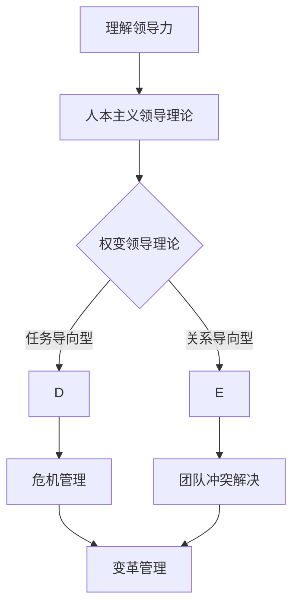

                 

### 第1章 引言

#### 1.1 领导力的定义与重要性

领导力，简单来说，就是影响和激励他人共同实现目标的能力。在企业管理中，领导力被视为一种核心能力，能够决定企业的成功与否。具体来说，领导力不仅涉及个人能力，还涉及对团队的引导、激励和协调。

首先，从背景介绍的角度来看，领导力这一概念自古以来就存在。在不同的历史时期，领导力的形式和内容有所不同。例如，在农业社会，领导力主要表现为对土地和资源的分配与管理；而在工业社会，领导力则更多体现在对生产流程和效率的优化。然而，随着信息社会的到来，领导力也发生了新的变化，更多地关注创新、团队协作和持续发展。

**核心概念与联系**

为了更好地理解领导力，我们需要分析几个关键概念，并探讨它们之间的联系。

1. **领导与管理的区别**：领导和管理是两个不同的概念。领导更多关注激发和引导团队成员，而管理则侧重于规划和执行任务。它们之间的关系可以用Mermaid流程图来表示：

   ```mermaid
   graph TD
   A[领导] --> B[管理]
   B --> C[团队协作]
   C --> D[目标实现]
   ```

2. **人本主义领导理论**：这是一种强调以人为本的领导理论，认为领导者的首要任务是关注团队成员的需求和潜力，从而激发他们的积极性。该理论的核心原则包括尊重、信任和赋能。

3. **权变领导理论**：与固定模式不同，权变领导理论认为领导方式应根据环境和团队成员的不同而变化。这一理论强调灵活性、适应性和个性化。

通过这些核心概念，我们可以看到领导力是一个多维度的概念，它不仅包括技术层面的能力，还涉及人际关系和情感层面的管理。

**核心算法原理讲解**

为了更深入地理解领导力，我们可以使用以下伪代码来描述其核心算法原理：

```plaintext
function leadershipPrinciples(teamMembers, environment) {
  // 初始化团队成员和环境的变量
  initializeTeamMembers(teamMembers)
  initializeEnvironment(environment)

  // 分析团队成员的能力和需求
  analyzeTeamMembersSkills(teamMembers)

  // 根据环境调整领导策略
  adjustLeadershipStrategy(environment)

  // 激励团队成员，实现目标
  motivateTeamMembers(teamMembers)

  // 持续监控和调整领导力实践
  monitorAndAdjustLeadership()

  // 返回领导力实践的结果
  return leadershipOutcome
}
```

在这个伪代码中，`teamMembers`代表团队成员，`environment`代表外部环境。领导力实践的过程包括分析团队成员的能力和需求、根据环境调整领导策略、激励团队成员以及持续监控和调整领导力实践。

**数学模型和公式**

为了量化领导力的影响，我们可以使用以下数学模型来描述领导力的效果：

```latex
Leadership \, Effectiveness = \frac{Team \, Performance}{Time \, Required}
```

其中，`Team \, Performance`代表团队的整体表现，`Time \, Required`代表实现目标所需的时间。这个公式表明，领导力的有效性取决于团队的表现和达成目标所需的时间。

**举例说明**

假设一个团队需要完成一个项目，领导力良好的领导者能够有效地激发团队成员的积极性，提高工作效率，从而在较短的时间内完成项目。而领导力不足的领导者则可能面临团队成员积极性不高、工作效率低下的问题，导致项目进展缓慢。

**项目实战**

在现实世界中，领导力的重要性在许多成功的企业家中得到了体现。例如，乔布斯领导的苹果公司，通过其卓越的领导力，创造了一个又一个革命性的产品，极大地推动了公司的发展。

通过以上分析，我们可以看到领导力在企业管理和个人发展中的重要性。领导力不仅影响团队的表现，还关系到企业的长远发展。因此，理解领导力的核心概念和原理，掌握有效的领导力技能，对于企业家的成功至关重要。

**最佳实践 tips**

1. **持续学习**：领导力是一个不断发展的领域，领导者需要不断学习新的知识和技能，以适应不断变化的环境。
2. **关注团队成员**：领导者应该关注团队成员的需求和潜力，激发他们的积极性，从而提高团队的整体表现。
3. **灵活应对**：在领导过程中，领导者需要根据环境和团队成员的不同情况灵活调整领导策略，以实现最佳效果。

**小结**

本章从背景介绍、核心概念与联系、核心算法原理讲解、数学模型和公式以及项目实战等方面，全面阐述了领导力的定义、重要性和实际应用。在接下来的章节中，我们将进一步探讨领导力的关键技能和实际应用，帮助读者深入理解并掌握领导力。

### 1.2 领导力心经的核心原则

#### 1.2.1 心经一：以德为先

在领导力中，“以德为先”是一个重要的原则。它强调领导者的道德品质和价值观对于团队和组织的重要性。一个德才兼备的领导者不仅能够赢得团队成员的尊重和信任，还能够为团队树立榜样，推动组织的长远发展。

**背景介绍**

在古代，德行被视为领导者的首要品质。儒家思想强调“德治”，认为领导者应该以道德为基础来治理国家和社会。在现代社会，尽管领导环境发生了变化，但“以德为先”的原则仍然具有重要的现实意义。一个有德行的领导者能够为团队营造一个正直、诚信、和谐的工作氛围，从而提高团队的整体效能。

**核心概念与联系**

“以德为先”与领导者的道德品质和价值观密切相关。一个有道德的领导者应该具备以下特质：

1. **诚信**：领导者应该诚实守信，言行一致，赢得团队成员的信任。
2. **正直**：领导者应该秉持正直的品质，坚守原则，不为个人利益而牺牲团队利益。
3. **公正**：领导者应该公平对待团队成员，给予每个人公平的机会和待遇。

这些特质共同构成了领导者的道德品质，它们相互联系，共同作用于团队和组织的发展。

**核心算法原理讲解**

我们可以使用以下伪代码来描述“以德为先”的原则：

```plaintext
function ethicalLeadership(teamMembers) {
  // 检查领导者的道德品质
  if (leaderHasEthicalCharacteristics()) {
    // 增强团队成员的信任
    increaseTrust(teamMembers)
    // 为团队成员树立榜样
    setExampleForTeamMembers()
    // 促进团队的和谐发展
    promoteHarmonyInTeam()
  } else {
    // 提醒领导者注意道德品质
    remindLeaderOfEthicalResponsibilities()
  }
}
```

在这个伪代码中，`ethicalCharacteristics`代表领导者的道德品质，`trust`代表团队成员的信任度，`example`代表领导者的榜样作用，`harmony`代表团队的和谐发展。

**数学模型和公式**

为了量化道德品质对领导力的影响，我们可以使用以下数学模型：

```latex
Ethical \, Impact = f(Moral \, Character, Trust, Harmony)
```

其中，`Moral \, Character`代表道德品质，`Trust`代表团队成员的信任度，`Harmony`代表团队的和谐发展。这个公式表明，道德品质对领导力的影响取决于团队成员的信任度和团队的和谐发展。

**举例说明**

假设一个领导者具备高度的道德品质，团队成员对他的信任度较高，团队的和谐度也较高，那么这个领导者能够在团队中产生积极的领导效果，推动团队高效完成任务。

**项目实战**

在现实世界中，许多成功的企业家都强调“以德为先”的原则。例如，马云在创建阿里巴巴时，就强调企业文化的重要性，倡导“客户第一、员工第二、股东第三”的理念，赢得了团队成员的广泛认同。

**最佳实践 tips**

1. **培养道德品质**：领导者应该不断反思自己的行为，培养诚信、正直、公正等道德品质。
2. **树立榜样**：领导者应该以身作则，为团队成员树立良好的道德榜样。
3. **加强团队建设**：领导者应该通过团队活动、沟通等方式，加强团队的和谐发展。

**小结**

本章从背景介绍、核心概念与联系、核心算法原理讲解、数学模型和公式以及项目实战等方面，深入探讨了领导力心经的第一个原则：“以德为先”。这一原则对于领导者个人和团队的长期发展具有重要意义。在接下来的章节中，我们将继续探讨领导力的其他核心原则，帮助读者全面理解和掌握领导力。

#### 1.2.2 心经二：激发潜能

领导力的第二个核心原则是“激发潜能”。这个原则强调领导者应该关注团队成员的潜力，并激发他们实现个人和团队目标的能力。激发潜能不仅是领导者的一项重要任务，也是推动组织创新和持续发展的关键。

**背景介绍**

在现代社会，人才是企业最宝贵的资源。领导者需要意识到，每个团队成员都有其独特的潜力和价值。通过激发潜能，领导者可以帮助团队成员充分发挥其能力，从而提高团队的绩效和组织的竞争力。

**核心概念与联系**

“激发潜能”与以下几个核心概念密切相关：

1. **人才发展**：人才发展是指通过培训、指导和发展计划，帮助团队成员不断提升其能力和素质。
2. **激励**：激励是指通过奖励、认可和挑战等手段，激发团队成员的工作热情和创造力。
3. **目标导向**：目标导向是指领导者帮助团队成员设定清晰的目标，并指导他们实现这些目标。

这些概念相互联系，共同构成了激发潜能的理论基础。领导者需要综合运用这些概念，才能有效地激发团队成员的潜能。

**核心算法原理讲解**

我们可以使用以下伪代码来描述激发潜能的过程：

```plaintext
function potentialExcitation(teamMembers, goals) {
  // 识别团队成员的潜力
  identifyPotential(teamMembers)

  // 设定明确的目标
  defineClearGoals(goals)

  // 提供必要的培训和支持
  provideTrainingAndSupport(teamMembers, goals)

  // 激励团队成员
  motivateTeamMembers(teamMembers)

  // 监控和调整激发过程
  monitorAndAdjustExcitationProcess()

  // 评估潜能激发的效果
  evaluateExcitationEffect()
}
```

在这个伪代码中，`teamMembers`代表团队成员，`goals`代表设定的目标。激发潜能的过程包括识别团队成员的潜力、设定明确的目标、提供必要的培训和支持、激励团队成员以及监控和调整激发过程。

**数学模型和公式**

为了量化潜能激发的效果，我们可以使用以下数学模型：

```latex
Potential \, Excitation \, Effectiveness = \frac{Actual \, Performance}{Potential \, Performance}
```

其中，`Actual \, Performance`代表实际绩效，`Potential \, Performance`代表潜在绩效。这个公式表明，潜能激发的有效性取决于实际绩效与潜在绩效之间的差距。

**举例说明**

假设一个团队成员具备很高的潜力，但在工作中表现出色不佳。通过领导者的激励和培训，这个团队成员能够充分发挥其潜力，从而实现更高的绩效。

**项目实战**

在现实世界中，许多成功的企业家都注重激发团队成员的潜能。例如，乔布斯的领导风格以其卓越的激发潜能能力著称，他通过不断的挑战和激励，使苹果公司的团队成员创造出众多创新产品。

**最佳实践 tips**

1. **关注个人成长**：领导者应该关注团队成员的个人成长，提供培训和发展机会。
2. **设定清晰目标**：领导者应该帮助团队成员设定清晰的目标，并提供实现目标的指导。
3. **鼓励创新和尝试**：领导者应该鼓励团队成员创新和尝试，从而激发他们的潜能。

**小结**

本章从背景介绍、核心概念与联系、核心算法原理讲解、数学模型和公式以及项目实战等方面，深入探讨了领导力心经的第二个原则：“激发潜能”。这一原则对于领导者有效管理和激发团队潜力具有重要意义。在接下来的章节中，我们将继续探讨领导力的其他核心原则，帮助读者全面理解和掌握领导力。

#### 1.2.3 心经三：构建团队

领导力的第三个核心原则是“构建团队”。这个原则强调领导者应该注重团队的建设和管理，通过有效的团队构建，提升团队的整体效能。构建团队不仅是领导者的一项基本职责，也是实现组织战略目标的关键。

**背景介绍**

在现代社会，团队工作已成为企业运营的重要组成部分。一个高效的团队能够充分发挥成员的专长和创造力，实现协同效应，从而提高组织的竞争力。然而，团队构建并非易事，领导者需要掌握一系列技能和方法，以建立一个团结、协作、高效的团队。

**核心概念与联系**

“构建团队”与以下几个核心概念密切相关：

1. **团队建设**：团队建设是指通过一系列活动和措施，增强团队成员之间的相互了解、信任和协作。
2. **团队协作**：团队协作是指团队成员在共同目标下，通过有效的沟通和合作，共同完成任务。
3. **团队领导**：团队领导是指领导者通过指导和激励，引导团队实现目标的过程。

这些概念相互联系，共同构成了团队构建的理论基础。领导者需要综合运用这些概念，才能成功地构建一个高效的团队。

**核心算法原理讲解**

我们可以使用以下伪代码来描述团队构建的过程：

```plaintext
function teamConstruction(teamMembers, goals) {
  // 设定团队目标
  defineTeamGoals(goals)

  // 进行团队建设活动
  executeTeamBuildingActivities()

  // 建立有效的沟通渠道
  establishEffectiveCommunicationChannels()

  // 激励团队成员
  motivateTeamMembers(teamMembers)

  // 监控团队绩效
  monitorTeamPerformance()

  // 提供反馈和调整
  provideFeedbackAndAdjustments()

  // 评估团队构建效果
  evaluateTeamConstructionEffectiveness()
}
```

在这个伪代码中，`teamMembers`代表团队成员，`goals`代表团队目标。团队构建的过程包括设定团队目标、进行团队建设活动、建立有效的沟通渠道、激励团队成员、监控团队绩效以及提供反馈和调整。

**数学模型和公式**

为了量化团队构建的效果，我们可以使用以下数学模型：

```latex
Team \, Construction \, Effectiveness = \frac{Actual \, Performance}{Expected \, Performance}
```

其中，`Actual \, Performance`代表实际绩效，`Expected \, Performance`代表预期绩效。这个公式表明，团队构建的有效性取决于实际绩效与预期绩效之间的差距。

**举例说明**

假设一个领导者通过有效的团队建设，使团队成员之间的沟通更加顺畅，协作更加高效，从而提高了团队的整体绩效。

**项目实战**

在现实世界中，许多成功的企业家都非常注重团队构建。例如，稻盛和夫在创立日本两大企业——京都陶瓷和第二电信时，通过建立“稻盛哲学”和“阿米巴经营”模式，成功地构建了高效的团队。

**最佳实践 tips**

1. **明确团队目标**：领导者应该帮助团队成员明确团队的目标和愿景，使团队成员共同朝着目标努力。
2. **进行团队建设活动**：领导者应该组织团队建设活动，增强团队成员之间的相互了解和信任。
3. **建立有效的沟通渠道**：领导者应该建立畅通的沟通渠道，确保团队成员能够及时交流和分享信息。
4. **提供反馈和调整**：领导者应该及时提供反馈，并根据反馈进行调整，以提高团队的整体效能。

**小结**

本章从背景介绍、核心概念与联系、核心算法原理讲解、数学模型和公式以及项目实战等方面，深入探讨了领导力心经的第三个原则：“构建团队”。这一原则对于领导者有效地管理团队和提升团队效能具有重要意义。在接下来的章节中，我们将继续探讨领导力的其他核心原则，帮助读者全面理解和掌握领导力。

### 第2章 领导力核心概念与联系

#### 2.1 人本主义领导理论

人本主义领导理论是一种关注团队成员需求、情感和成长的领导理论。它强调领导者应该以人为本，关注团队成员的全面发展，通过激发团队成员的潜力，实现个人和团队的共同成长。

**基本原理**

1. **尊重个体**：人本主义领导理论认为，每个团队成员都是一个独立的个体，领导者应该尊重团队成员的个性和需求。
2. **激励与赋能**：领导者应该通过激励和赋能，激发团队成员的积极性和创造力，帮助他们实现个人目标。
3. **关注成长**：人本主义领导理论强调领导者应该关注团队成员的成长和发展，为他们提供必要的培训和支持。

**应用场景**

1. **团队建设**：在人本主义领导理论中，团队建设是一个重要的应用场景。通过团队建设活动，增强团队成员之间的相互了解和信任，提高团队的凝聚力。
2. **员工激励**：领导者应该根据团队成员的特点和需求，设计不同的激励措施，以激发团队成员的积极性和创造力。
3. **人才发展**：人本主义领导理论强调领导者应该关注团队成员的职业发展，为他们提供成长和发展的机会。

**与其他领导理论的联系**

1. **权变领导理论**：权变领导理论认为领导方式应根据环境和团队成员的不同而变化。人本主义领导理论在这一点上有一定的相似性，但它更强调以人为本的原则。
2. **变革型领导理论**：变革型领导理论认为领导者应该通过变革，推动组织的发展和变革。人本主义领导理论在这方面也有一定的相似性，但它更关注团队成员的需求和成长。

**案例解析**

假设一个团队正在面临项目进度延迟的问题，领导者可以根据人本主义领导理论采取以下措施：

1. **尊重个体**：领导者应该了解团队成员的个性和需求，尊重他们的意见和贡献。
2. **激励与赋能**：领导者可以设计激励措施，如奖励和认可，以激励团队成员提高工作效率。
3. **关注成长**：领导者可以提供培训和支持，帮助团队成员提高技能和知识，从而更好地完成任务。

通过这些措施，领导者不仅能够解决项目进度问题，还能够提高团队成员的满意度和士气，促进团队的长期发展。

### 2.2 权变领导理论

权变领导理论是一种根据不同环境和情境灵活调整领导方式的领导理论。它认为领导方式不是一成不变的，而是应该根据具体情况灵活变化。

**定义**

权变领导理论认为，领导方式的选择应该基于领导者的能力、团队成员的特点以及工作环境的因素。

**分类**

1. **任务导向型领导**：领导者关注任务的完成情况，强调任务的明确性和效率。
2. **关系导向型领导**：领导者关注团队成员之间的关系和情感，强调团队合作和信任。
3. **情境适应型领导**：领导者根据具体情境灵活调整领导方式，平衡任务完成和团队关系。

**应用场景**

1. **危机管理**：在危机情况下，领导者需要迅速做出决策，采取有效的措施，以应对危机。
2. **团队冲突解决**：领导者需要根据团队成员的特点和冲突的性质，采取适当的领导方式，解决团队冲突。
3. **变革管理**：在组织变革过程中，领导者需要灵活调整领导方式，以适应变革的需求。

**与其他领导理论的联系**

1. **变革型领导理论**：变革型领导理论强调领导者应该通过变革，推动组织的发展和变革。权变领导理论在这一点上有一定的相似性，但它更强调领导方式的灵活性。
2. **情境领导理论**：情境领导理论认为领导方式应该根据情境的变化而变化。权变领导理论在这一点上有一定的相似性，但它更强调领导者的能力。

**案例解析**

假设一个团队在一个竞争激烈的市场中，面临着项目延迟和预算超支的问题。领导者可以根据权变领导理论采取以下措施：

1. **任务导向型领导**：在短期内，领导者可以采取任务导向型领导方式，强调任务的完成和效率。
2. **关系导向型领导**：同时，领导者也可以采取关系导向型领导方式，关注团队成员之间的关系和情感，以提高团队的协作效率。
3. **情境适应型领导**：领导者需要根据具体情境灵活调整领导方式，平衡任务完成和团队关系，以应对项目挑战。

通过这些措施，领导者不仅能够解决项目问题，还能够提高团队成员的满意度和士气，促进团队的长期发展。

### 2.3 领导力的Mermaid流程图

为了更清晰地展示领导力的核心概念和联系，我们可以使用Mermaid流程图来描述领导力的流程。以下是一个简化的Mermaid流程图示例：



在这个流程图中，A代表理解领导力，B代表人本主义领导理论，C代表权变领导理论，D代表任务导向型领导，E代表关系导向型领导，F代表危机管理，G代表团队冲突解决，H代表变革管理。通过这个流程图，我们可以看到领导力的核心概念和联系，以及在不同情境下的应用。

### 第3章 领导力技能解析

#### 3.1 沟通技巧

沟通技巧是领导力的重要组成部分，它决定了领导者是否能够有效地传达信息、理解团队成员的需求，并建立良好的工作关系。有效的沟通不仅有助于解决团队中的问题，还能提升团队的凝聚力和工作效率。

**有效沟通的要素**

1. **清晰表达**：领导者需要能够用简洁明了的语言表达自己的意图，避免使用模糊或混淆的表述。
2. **倾听**：倾听是有效沟通的关键，领导者应该给予团队成员充分的发言空间，倾听他们的意见和建议。
3. **非语言沟通**：除了言语表达，领导者还应该注意非语言沟通，如肢体语言、面部表情和语调等，这些因素同样能影响沟通的效果。
4. **反馈**：沟通是一个双向过程，领导者应该及时给予反馈，以确认信息已被正确理解和接收。

**沟通障碍及解决方法**

1. **语言障碍**：不同团队成员可能来自不同的文化背景，使用不同的语言。解决方法包括提供语言培训、使用简单明了的语言以及提供翻译服务。
2. **心理障碍**：团队成员可能因为个人情感或心理状态而影响沟通效果。解决方法包括建立信任、提供心理支持和鼓励开放沟通。
3. **信息过载**：过多或复杂的信息可能导致团队成员无法准确理解。解决方法包括简化信息、使用图表和可视化工具以及分阶段传达信息。

**沟通技巧的实战应用**

1. **团队会议**：在团队会议中，领导者可以运用沟通技巧来确保每个成员都有发言机会，同时引导讨论方向，使会议高效有序。
2. **一对一沟通**：通过与团队成员的一对一沟通，领导者可以深入了解他们的工作情况和需求，提供针对性的支持。
3. **书面沟通**：对于复杂的信息，领导者可以通过书面形式传达，确保信息的准确性和完整性。

**案例解析**

假设一个项目团队在沟通中出现了障碍，导致项目进度受阻。通过以下步骤，领导者可以解决沟通问题：

1. **识别问题**：首先，领导者需要识别沟通中的具体问题，如语言障碍、心理障碍或信息过载。
2. **制定解决方案**：根据识别的问题，领导者可以制定相应的解决方案，如提供语言培训、建立信任机制或简化信息。
3. **实施解决方案**：领导者需要与团队成员沟通解决方案，并确保他们理解和接受。
4. **监控和反馈**：在实施解决方案后，领导者需要持续监控沟通效果，并根据团队成员的反馈进行调整。

通过以上步骤，领导者可以有效解决沟通问题，提升团队的工作效率和凝聚力。

#### 3.2 决策能力

决策能力是领导者的一项关键技能，它关系到团队和企业的成败。有效的决策不仅能够解决当前的问题，还能为未来的发展奠定基础。领导者需要具备快速、准确和合理的决策能力，以应对复杂多变的环境。

**决策过程的步骤**

1. **问题识别**：首先，领导者需要识别问题，明确问题的性质和影响。
2. **信息收集**：在明确问题后，领导者需要收集相关的信息和数据，以确保决策的依据充分。
3. **方案制定**：根据收集的信息，领导者需要制定多个可能的解决方案，并评估每个方案的优缺点。
4. **方案选择**：在评估所有方案后，领导者需要选择最合适的方案，并制定详细的执行计划。
5. **执行和监控**：决策制定后，领导者需要确保方案能够顺利执行，并持续监控执行过程，根据实际情况进行调整。

**决策制定的策略**

1. **风险分析**：在决策过程中，领导者需要分析每个方案可能带来的风险和影响，并制定相应的风险应对策略。
2. **数据驱动**：领导者应该依赖数据和分析结果来制定决策，避免主观判断和偏见。
3. **团队合作**：在决策过程中，领导者应该鼓励团队成员参与，收集不同的意见和建议，以提高决策的质量。
4. **灵活调整**：领导者需要根据执行过程中的实际情况，灵活调整决策，以适应新的变化。

**决策失败的案例分析**

1. **案例背景**：一家公司的决策层在市场调研不足的情况下，决定大规模投资一项新兴技术，最终导致项目失败，损失巨大。
2. **分析原因**：决策失败的主要原因包括缺乏充分的市场调研、风险分析不足以及缺乏灵活调整的能力。
3. **反思和改进**：为了避免类似的决策失败，领导者应该加强市场调研，提高风险意识，并培养灵活调整的能力。

**案例解析**

假设一个公司在项目决策过程中面临以下挑战：

1. **问题识别**：公司需要决定是否投资一个新项目，以扩展其产品线。
2. **信息收集**：领导者需要收集市场趋势、竞争对手情况和潜在风险的相关信息。
3. **方案制定**：根据收集的信息，领导者制定了两个方案：直接投资和合作开发。
4. **方案选择**：通过数据分析和风险评估，领导者选择了合作开发的方案，因为它具有较低的风险和更高的成功率。
5. **执行和监控**：在决策实施过程中，领导者持续监控项目的进展，并根据实际情况进行调整。

通过以上步骤，领导者能够做出有效的决策，并确保项目成功实施。

#### 3.3 领导者的情商

情商（Emotional Intelligence，简称EQ）是指个体识别、理解和管理自己情感以及他人情感的能力。对于领导者来说，情商是一个重要的技能，它能够帮助他们更好地处理人际关系、提升团队凝聚力和决策能力。

**情商的定义与作用**

1. **自我认知**：自我认知是指领导者对自己情感和行为的理解和识别。通过自我认知，领导者能够更好地理解自己的需求、动机和情感反应。
2. **自我调节**：自我调节是指领导者能够控制自己的情绪，保持冷静和理智。这种能力有助于领导者在面对压力和挑战时做出理性的决策。
3. **同理心**：同理心是指领导者能够理解并感受他人的情感。通过同理心，领导者能够更好地理解团队成员的需求和情感，从而建立更好的人际关系。
4. **社交技能**：社交技能是指领导者与他人沟通和协作的能力。这种能力有助于领导者有效地传达信息、建立信任和解决冲突。

**提高情商的技巧**

1. **自我反思**：领导者应该定期进行自我反思，了解自己的情感和行为，并思考如何改进。
2. **情绪管理**：领导者可以通过练习深呼吸、冥想和放松技巧来管理自己的情绪，保持冷静和理智。
3. **倾听与沟通**：领导者应该积极倾听团队成员的意见和需求，并通过有效的沟通建立信任和共鸣。
4. **建立支持网络**：领导者可以建立支持网络，包括信任的同事、导师和顾问，以便在遇到困难时寻求帮助和指导。

**情商在领导力中的重要性**

1. **人际关系**：情商有助于领导者建立良好的人际关系，增强团队的凝聚力和合作效率。
2. **决策能力**：情商使领导者能够更好地理解和评估团队成员的情感和需求，从而做出更合理的决策。
3. **领导风格**：情商影响领导者的领导风格，使领导者能够根据团队成员的情感和需求灵活调整领导方式。

**案例解析**

假设一个领导者需要处理一个团队内部冲突，通过以下步骤，他可以运用情商来解决问题：

1. **同理心**：领导者首先试图理解双方的情感和立场，通过同理心建立信任。
2. **倾听与沟通**：领导者积极倾听双方的陈述，并通过有效的沟通确保每个团队成员都有发言的机会。
3. **情绪管理**：领导者保持冷静和理智，避免情绪化的反应，以便更好地分析和解决问题。
4. **协商与调解**：领导者通过协商和调解，帮助双方找到共同的解决方案，并确保每个团队成员都感到被尊重和认可。

通过以上步骤，领导者不仅能够解决团队冲突，还能增强团队的凝聚力和合作效率。

### 第4章 领导力实践应用

#### 4.1 从员工到经理的转变

从员工晋升为经理是一个重要的职业发展里程碑，这一转变不仅意味着职位的提升，更意味着责任和角色的变化。对于新晋经理来说，如何顺利过渡并有效管理团队是一个重要的挑战。以下是几个关键步骤和注意事项：

**步骤**

1. **角色认知**：首先，新晋经理需要明确自己的新角色和责任。与员工相比，经理需要更多地关注团队的整体绩效、战略规划和人员管理。
2. **建立关系**：与新团队成员建立良好的关系是成功管理团队的基础。新经理可以通过一对一沟通、团队活动等方式，加深与团队成员的相互了解。
3. **能力提升**：新晋经理需要不断提升自己的管理技能，包括沟通技巧、决策能力、冲突解决和团队建设等。
4. **目标设定**：明确团队的目标和愿景，确保每个团队成员都了解并认同这些目标。这有助于提高团队的动力和凝聚力。

**注意事项**

1. **心态调整**：从员工到经理的转变可能带来压力和挑战，新经理需要保持积极的心态，以应对新的工作环境和责任。
2. **持续学习**：管理技能和知识需要不断更新，新经理应该持续学习和参加培训，以提升自己的管理水平。
3. **平衡工作与生活**：作为经理，需要平衡工作与个人生活，确保有足够的精力投入到管理和团队建设中。

**案例分析**

假设一位新晋经理A，他刚刚晋升为团队负责人。以下是他的转型过程：

1. **角色认知**：经理A首先认识到自己的新角色，他需要从关注个人绩效转向关注整个团队的目标和绩效。
2. **建立关系**：经理A通过组织团队建设活动，如团队聚餐、户外运动等，加强与团队成员的沟通和交流，建立信任关系。
3. **能力提升**：经理A参加公司提供的领导力培训课程，学习沟通技巧、决策能力和团队建设策略。
4. **目标设定**：经理A与团队成员共同制定团队目标和计划，确保每个成员都了解并认同这些目标。

通过以上步骤，经理A成功地实现了从员工到经理的转变，并逐步提升了团队的整体绩效。

#### 4.2 团队领导力

团队领导力是领导者的一项关键能力，它决定了团队能否高效地实现目标。有效的团队领导力不仅能够提升团队的绩效，还能增强团队的凝聚力和创新能力。

**团队的定义与作用**

团队是由一组相互依赖的个体组成的，共同为实现特定目标而努力的工作集体。团队的作用主要体现在以下几个方面：

1. **协同工作**：团队能够通过协同工作，发挥每个成员的专业优势，实现资源的优化配置。
2. **创新能力**：团队通过集思广益，能够产生更多的创新想法，从而推动组织的持续发展。
3. **提高绩效**：有效的团队领导力能够提高团队的工作效率和绩效，实现组织的战略目标。

**团队建设的策略**

1. **明确目标**：团队建设的第一步是明确团队的目标和愿景，确保每个团队成员都了解并认同这些目标。
2. **建立信任**：信任是团队协作的基础，领导者需要通过建立透明、开放的工作环境，增强团队成员之间的信任。
3. **角色分工**：明确每个团队成员的角色和职责，确保团队成员能够各司其职，发挥最大的潜力。
4. **有效沟通**：领导者需要建立有效的沟通机制，确保信息的及时传递和反馈，减少误解和冲突。
5. **激励机制**：建立合理的激励机制，鼓励团队成员发挥积极性，提高工作效率。

**团队冲突的管理**

团队冲突是团队工作中不可避免的现象，有效的冲突管理能够促进团队的成长和进步。以下是几个关键步骤：

1. **识别冲突**：领导者需要及时发现和识别团队中的冲突，了解冲突的原因和影响。
2. **沟通解决**：领导者应该通过有效的沟通，帮助冲突双方理解对方的立场和需求，寻找共同点和解决方案。
3. **调解和仲裁**：在必要时，领导者可以充当调解者或仲裁者，公正地处理冲突，确保团队的和谐稳定。
4. **预防冲突**：通过建立良好的团队文化和沟通机制，预防潜在的冲突，确保团队的长期稳定。

**案例分析**

假设一个团队在项目执行过程中出现了严重的冲突，以下是如何解决冲突的步骤：

1. **识别冲突**：领导者发现团队在项目计划和时间安排上存在分歧，导致工作进度受阻。
2. **沟通解决**：领导者组织双方进行沟通，了解他们的具体需求和问题，寻找共同点和解决方案。
3. **调解和仲裁**：领导者作为调解者，帮助双方达成共识，调整项目计划，确保工作进度不受影响。
4. **预防冲突**：领导者通过加强沟通和协调，确保类似冲突不再发生，提高团队的协作效率。

通过以上步骤，领导者有效地解决了团队冲突，提升了团队的整体绩效和稳定性。

#### 4.3 创业领导力

创业领导力是创业者的一项核心能力，它决定了创业企业的成功与否。创业领导者不仅需要具备传统领导力所需的技能，还需要具备应对创业过程中独特挑战的能力。

**创业的挑战与机遇**

创业的挑战主要体现在以下几个方面：

1. **资源限制**：创业企业通常面临着资源限制，包括资金、人力和物力等。领导者需要学会如何有效地利用有限的资源，实现企业的快速增长。
2. **市场不确定性**：创业市场的变化无常，领导者需要具备敏锐的市场洞察力和快速适应市场变化的能力。
3. **风险承担**：创业者需要承担较高的风险，包括财务风险、业务风险和个人声誉风险等。领导者需要具备坚定的意志和乐观的心态，以应对这些挑战。

同时，创业也带来了许多机遇：

1. **市场潜力**：创业企业可以通过创新和差异化策略，在市场中找到新的商机和利润点。
2. **技术进步**：随着科技的快速发展，创业企业可以利用新技术，开发新产品，创造新的市场。
3. **个人成长**：创业过程是一个学习和成长的过程，领导者可以在这个过程中提升自己的管理能力、决策能力和创新能力。

**创业者的领导力素质**

1. **愿景与目标**：创业者需要具备清晰的愿景和目标，能够激励团队成员共同为实现目标而努力。
2. **创新能力**：创业者需要具备创新能力，能够不断开发新产品、新市场，推动企业的持续发展。
3. **执行力**：创业者需要具备强大的执行力，能够将愿景和策略转化为实际的业务成果。
4. **适应能力**：创业者需要具备良好的适应能力，能够快速应对市场变化和挑战，保持企业的竞争优势。

**创业成功的关键因素**

1. **市场需求**：创业企业必须深入了解市场需求，提供满足客户需求的产品或服务。
2. **团队建设**：创业者需要建立一支高效的团队，发挥每个成员的特长，共同实现创业目标。
3. **资金管理**：创业者需要学会如何有效地管理资金，确保企业的财务健康和可持续发展。
4. **风险控制**：创业者需要具备风险意识，学会如何识别和应对风险，确保企业的长期稳定。

**案例分析**

假设一位创业者张三，他决定创办一家科技公司。以下是他的创业过程：

1. **市场需求分析**：张三通过市场调研，发现市场上存在一个未被满足的需求，决定开发一款新产品。
2. **团队建设**：张三招募了一支具有相关经验和技能的团队，共同开发新产品。
3. **资金管理**：张三通过天使投资和银行贷款，筹集了足够的资金，确保产品开发的顺利进行。
4. **风险控制**：张三在创业过程中，时刻关注市场变化和竞争态势，及时调整产品策略和营销策略。

通过以上步骤，张三成功地创办了一家科技公司，并在市场中取得了良好的业绩。

**小结**

创业领导力是创业者成功的关键因素之一。通过了解创业的挑战与机遇、创业者的领导力素质和创业成功的关键因素，创业者可以更好地应对创业过程中的各种挑战，实现企业的持续发展和成功。

### 第5章 案例分析

#### 5.1 成功企业家领导力案例分析

在探讨领导力的实际应用时，成功企业家的案例无疑提供了宝贵的经验和洞见。以下是几个成功企业家的领导力案例，通过这些案例，我们可以深入理解领导力在商业成功中的关键作用。

**案例一：乔布斯与苹果公司**

乔布斯是苹果公司的创始人之一，他的领导力风格对苹果公司的成功产生了深远的影响。乔布斯的领导力特点包括：

1. **愿景驱动**：乔布斯以清晰的愿景引导苹果公司的发展，推动了iPod、iPhone和iPad等革命性产品的诞生。
2. **追求卓越**：他对产品质量和用户体验有着极高的要求，不断追求卓越，使苹果公司成为业界的标杆。
3. **创新精神**：乔布斯鼓励创新和实验，推动苹果公司在科技领域的不断突破。

**案例分析**：

- **愿景驱动**：乔布斯在1997年回归苹果后，提出了“简单就是伟大”（Think Different）的口号，这一愿景激发了整个团队的创新激情。
- **追求卓越**：在乔布斯的领导下，苹果公司的产品在设计和功能上不断超越竞争对手，赢得了消费者的广泛认可。
- **创新精神**：乔布斯通过收购NeXT和皮克斯动画工作室，不仅为苹果带来了新的技术，还提升了公司的创新文化。

**案例启示**：

成功的企业家需要具备清晰的愿景和追求卓越的精神，同时鼓励创新和实验，这些品质是驱动企业持续成功的关键。

**案例二：马云与阿里巴巴**

马云是阿里巴巴集团的创始人，他的领导力风格在互联网行业中独树一帜。马云的领导力特点包括：

1. **变革引领**：马云在面对市场变化时，敢于变革，推动了阿里巴巴从电子商务平台到云计算和数字支付等多个领域的扩展。
2. **文化塑造**：马云重视企业文化，强调客户第一、员工第二，为员工提供良好的工作环境和成长机会。
3. **团队合作**：马云善于搭建高效的团队，鼓励团队成员之间的协作和沟通。

**案例分析**：

- **变革引领**：在互联网行业快速发展的背景下，马云果断推动阿里巴巴进行战略调整，成功转型为云计算和数字支付领域的领军企业。
- **文化塑造**：马云通过“六脉神剑”等企业文化理念，培养了员工的忠诚度和执行力，使阿里巴巴成为具有强大凝聚力的团队。
- **团队合作**：马云倡导开放和协作的工作氛围，通过多元化的团队组合，激发了员工的创造力和协作精神。

**案例启示**：

企业家需要具备变革引领能力，善于塑造企业文化，并搭建高效的团队，这些因素是推动企业长期成功的重要因素。

**案例三：埃隆·马斯克与特斯拉**

埃隆·马斯克是特斯拉和SpaceX的创始人，他的领导力风格在科技和能源领域引起了广泛关注。马斯克的领导力特点包括：

1. **远见卓识**：马斯克具备前瞻性的视野，能够预见科技和市场的变化趋势，并提前布局。
2. **坚韧不拔**：在面对困难和挑战时，马斯克展现出坚韧不拔的精神，推动企业不断前行。
3. **激励团队**：马斯克通过激励和认可，激发团队成员的创造力和奉献精神。

**案例分析**：

- **远见卓识**：马斯克在特斯拉推出电动汽车之前，就预见到了全球能源转型的趋势，这一远见帮助特斯拉在电动汽车市场取得了领先地位。
- **坚韧不拔**：在开发SpaceX火箭的过程中，马斯克面对了多次失败和挑战，但他始终坚持并最终成功，推动了太空探索的进步。
- **激励团队**：马斯克通过公开表扬和认可团队成员的成就，激发了团队的创造力和奉献精神，使特斯拉和SpaceX取得了显著的进展。

**案例启示**：

企业家需要具备远见卓识，能够在市场中脱颖而出，同时坚韧不拔地克服困难，通过激励团队实现企业的目标。

**小结**

成功企业家的领导力案例展示了不同领导风格在实际应用中的效果。通过分析这些案例，我们可以得出以下启示：

1. **愿景驱动**：清晰的愿景是企业家成功的基石，它能够激励团队为实现共同目标而努力。
2. **变革引领**：企业家需要具备适应市场变化的能力，勇于变革和调整策略，以保持企业的竞争力。
3. **文化塑造**：建立积极的企业文化，培养员工的忠诚度和执行力，是提升团队凝聚力的重要手段。
4. **激励团队**：通过激励和认可，激发团队成员的创造力和奉献精神，是推动企业创新和发展的重要途径。

这些启示对于企业家和领导者具有重要的指导意义，可以帮助他们在实践中更好地运用领导力，实现企业的长期成功。

#### 5.2 领导力失败的案例分析

在探讨领导力的实际应用时，领导力失败的案例同样提供了宝贵的教训和反思。以下是一个领导力失败的案例分析，通过这一案例，我们可以深入了解失败的原因和教训。

**案例背景**

这是一家成立于2000年初期的科技公司，曾一度在市场上取得显著的成功。然而，在2008年金融危机期间，这家公司因为领导力失误而迅速衰落，最终被迫破产。

**领导力失败原因**

1. **战略失误**：公司在金融危机爆发前，盲目扩张，过度依赖风险投资，缺乏明确的长期战略规划。在市场环境发生变化时，公司无法迅速调整战略，应对危机。
2. **沟通不畅**：公司内部存在严重的沟通障碍，管理层与员工之间的信息传递不畅，导致员工对公司的战略方向和决策缺乏了解，降低了员工的工作积极性和执行力。
3. **组织结构问题**：公司的组织结构过于复杂，决策流程冗长，缺乏灵活性。在面临市场变化时，公司无法快速做出决策，导致错失市场机遇。
4. **缺乏创新能力**：公司在技术创新方面投入不足，未能及时跟上市场发展的步伐，导致产品竞争力下降。

**案例分析**

- **战略失误**：在金融危机爆发前，公司盲目扩张，导致财务负担加重，资金链紧张。在市场环境恶化时，公司无法通过有效的战略调整来应对危机。
- **沟通不畅**：公司内部沟通渠道不畅，管理层与员工之间的信息传递存在障碍，导致员工对公司的战略和决策缺乏了解，影响了员工的工作积极性和执行力。
- **组织结构问题**：公司的组织结构复杂，决策流程冗长，缺乏灵活性。在面临市场变化时，公司无法快速做出决策，导致错失市场机遇。
- **缺乏创新能力**：公司在技术创新方面投入不足，未能及时推出具有竞争力的新产品，导致产品市场竞争力下降。

**案例反思**

1. **战略规划的重要性**：企业需要制定明确的长期战略规划，以应对市场的变化和挑战。盲目扩张和过度依赖风险投资可能导致财务风险，影响企业的可持续发展。
2. **沟通机制的建立**：企业需要建立有效的沟通机制，确保管理层与员工之间的信息传递畅通，提高员工的工作积极性和执行力。
3. **组织结构的优化**：企业需要优化组织结构，简化决策流程，提高组织的灵活性和反应速度，以更好地应对市场的变化。
4. **创新能力的培养**：企业需要重视技术创新，加大研发投入，培养创新文化，以保持产品的竞争力。

**小结**

通过这一案例的分析，我们可以看到领导力失败的原因和教训。企业领导者需要从战略规划、沟通机制、组织结构和创新能力等方面进行改进，以避免类似的失败。有效的领导力不仅能够帮助企业应对挑战，还能推动企业的长期发展。

### 第6章 领导力心经的总结与应用

#### 6.1 领导力核心要素

领导力心经的核心要素可以概括为“以德为先”、“激发潜能”和“构建团队”。这三个原则共同构成了领导力的基本框架，为领导者提供了行为指南和行动方向。

**以德为先**：强调领导者的道德品质和价值观，认为道德是领导力的基石。一个有德行的领导者能够赢得团队成员的信任和尊重，为团队树立榜样。

**激发潜能**：强调领导者应该关注团队成员的潜力，通过激励和赋能，帮助他们实现个人和团队的目标。激发潜能不仅能够提升团队的整体绩效，还能促进团队成员的个人成长。

**构建团队**：强调领导者应该注重团队的建设和管理，通过有效的团队建设，提升团队的整体效能。构建团队是领导者实现组织战略目标的关键步骤。

**核心原则的应用场景**

- **以德为先**：适用于企业文化建设、员工管理、团队激励等场景，有助于建立正直、诚信和和谐的工作环境。
- **激发潜能**：适用于项目团队管理、人才发展、创新推动等场景，有助于激发团队成员的积极性和创造力。
- **构建团队**：适用于团队建设活动、团队冲突解决、组织变革等场景，有助于提升团队的协作效率和凝聚力。

#### 6.2 领导力心经的应用场景

领导力心经的应用场景非常广泛，几乎涵盖了企业运营的各个方面。以下是几个典型应用场景：

1. **企业管理**：在企业管理中，领导力心经可以帮助领导者提升管理水平，优化团队结构，提高工作效率。
2. **项目团队管理**：在项目团队管理中，领导力心经可以激发团队成员的积极性，推动项目顺利实施，提高项目成功率。
3. **人才发展**：在人才发展中，领导力心经可以引导领导者关注团队成员的潜力，提供培训和发展机会，提升人才的综合素质。
4. **组织变革**：在组织变革中，领导力心经可以帮助领导者应对变革带来的挑战，推动组织顺利进行变革，实现组织目标。
5. **企业文化建设**：在企业文化建设中，领导力心经可以引导领导者树立正确的价值观，营造积极的企业文化氛围。

#### 6.3 领导力心经的未来展望

随着社会和经济的不断发展，领导力心经在未来将面临新的挑战和机遇。以下是几个未来展望：

1. **数字化时代**：在数字化时代，领导力心经需要关注数字化管理和数字化领导力，培养领导者对数字化技术的理解和应用能力。
2. **全球化背景**：在全球化的背景下，领导力心经需要关注跨文化管理和全球团队合作，培养领导者跨文化沟通和合作的能力。
3. **可持续发展**：在可持续发展的背景下，领导力心经需要关注企业社会责任和可持续发展，培养领导者对社会和环境问题的敏感性和责任感。
4. **人工智能时代**：在人工智能时代，领导力心经需要关注人与机器的协作，培养领导者对人工智能技术的理解和应用能力。

#### 6.4 领导力实践指南

为了帮助领导者更好地应用领导力心经，以下是几个领导力实践指南：

1. **自我反思**：领导者应该定期进行自我反思，了解自己的优点和不足，并制定改进计划。
2. **持续学习**：领导者应该保持持续学习的态度，关注行业动态和新技术，不断提升自己的管理能力和知识水平。
3. **关注团队成员**：领导者应该关注团队成员的需求和潜力，提供培训和发展机会，激发团队成员的积极性和创造力。
4. **建立信任**：领导者应该建立信任关系，通过有效的沟通和协作，营造积极的工作氛围。
5. **灵活应对**：领导者应该具备灵活应对变化的能力，根据环境和团队成员的不同情况，灵活调整领导策略。

通过以上实践指南，领导者可以更好地应用领导力心经，提升自己的领导力和团队绩效。

### 6.5 领导力实践方法

为了确保领导力心经的有效应用，以下是一些具体的领导力实践方法：

**1. 案例研究法**

- **目的**：通过分析成功和失败的领导力案例，学习有效的领导策略和方法。
- **步骤**：选择具有代表性的案例，分析领导者的决策过程、团队成员的反应以及最终结果，总结经验教训。
- **应用**：在企业内部组织案例研讨会，鼓励团队成员分享和讨论领导力案例。

**2. 模拟训练法**

- **目的**：通过模拟真实情境，提高领导者的决策能力和应对挑战的能力。
- **步骤**：设计模拟情境，让领导者参与其中，根据情境要求做出决策。
- **应用**：在企业培训项目中引入模拟训练，让领导者实践和反思决策过程。

**3. 反思日志法**

- **目的**：通过记录和反思日常领导活动，提升领导者的自我认知和管理能力。
- **步骤**：定期记录领导活动，反思成功和失败的经验，总结领导心得。
- **应用**：鼓励领导者定期撰写反思日志，促进自我提升和持续成长。

**4. 反馈机制**

- **目的**：通过建立有效的反馈机制，提升领导者的管理水平和团队效能。
- **步骤**：设立定期的反馈环节，收集团队成员的意见和建议，及时进行反馈和调整。
- **应用**：在企业内部建立定期的团队反馈会议，鼓励团队成员提出建设性意见，共同改进团队工作。

**5. 持续学习**

- **目的**：通过不断学习和更新知识，提升领导者的专业素养和领导能力。
- **步骤**：参加培训课程、阅读相关书籍、参加行业会议等，持续提升自己的领导力和管理能力。
- **应用**：鼓励领导者积极参与各类培训和学习活动，提升团队的整体水平。

通过以上实践方法，领导者可以有效地应用领导力心经，提升自己的领导力水平和团队绩效。

### 6.6 领导力实践案例分析

为了更好地展示领导力心经在实践中的应用，以下是一个具体的领导力实践案例分析：

**案例背景**

某科技公司C在面临市场变革和竞争对手的压力时，通过领导者的有效领导和团队建设，成功地实现了转型和持续发展。

**案例分析**

1. **以德为先**：公司领导者通过以身作则，强调诚信和责任感，赢得了团队成员的信任和尊重。在团队面临重大决策时，领导者坚持公正、透明的原则，确保团队成员能够公平参与和表达意见。

2. **激发潜能**：领导者关注团队成员的潜力，通过提供培训和发展机会，激发他们的积极性和创造力。在团队中，每个成员都被鼓励提出创新想法，并有机会在实践中验证这些想法。

3. **构建团队**：领导者通过团队建设活动，增强团队成员之间的相互了解和信任。公司定期组织团队建设活动，如户外拓展、团队聚餐等，促进团队成员之间的沟通和合作。

**结果**

- **业绩提升**：通过领导者的有效领导和团队建设，公司成功实现了业绩的提升，市场份额不断扩大。
- **员工满意度**：团队成员对公司的满意度显著提高，离职率下降，团队凝聚力增强。
- **创新成果**：公司推出了一系列创新产品，在市场上取得了良好的反响，提升了公司的竞争力。

**案例启示**

- **领导者应以身作则**：领导者应该通过自己的行为树立榜样，赢得团队成员的信任和尊重。
- **关注团队成员的潜力**：领导者应该关注团队成员的潜力，提供培训和发展机会，激发他们的积极性和创造力。
- **加强团队建设**：领导者应该通过团队建设活动，增强团队成员之间的相互了解和信任，提升团队的整体效能。

通过以上案例分析，我们可以看到领导力心经在实践中的应用效果，这对于其他企业领导者和团队管理者具有重要的借鉴意义。

### 6.7 最佳实践 tips

为了帮助读者更好地应用领导力心经，以下是几个最佳实践 tips：

1. **建立信任**：建立信任是领导力的基础，领导者应通过诚实、透明和公正的行为赢得团队成员的信任。
2. **关注团队成员发展**：领导者应关注团队成员的个人发展，提供培训和支持，帮助他们实现职业目标。
3. **积极沟通**：领导者应积极与团队成员沟通，确保信息传递畅通，减少误解和冲突。
4. **灵活应对变化**：领导者应具备灵活应对变化的能力，根据环境和团队成员的不同情况，及时调整领导策略。
5. **培养团队精神**：领导者应通过团队建设活动，增强团队成员之间的协作和信任，提升团队的整体效能。

通过以上最佳实践 tips，读者可以更好地应用领导力心经，提升自己的领导力和团队绩效。

### 6.8 小结

本章通过总结领导力心经的核心要素、应用场景和未来展望，并结合具体案例和实践方法，全面阐述了领导力心经的重要性和实际应用。通过本章的学习，读者可以更好地理解领导力心经，并将其应用于实际工作中，提升自己的领导力和团队绩效。

### 6.9 注意事项

1. **持续学习**：领导力是一个不断发展的领域，领导者应持续学习新的知识和技能，以适应不断变化的环境。
2. **尊重团队成员**：领导者应尊重团队成员的意见和需求，建立良好的沟通和信任关系。
3. **灵活应对**：领导者应根据具体情况灵活调整领导策略，以应对不同的挑战和变化。

通过遵守这些注意事项，领导者可以更好地应用领导力心经，实现个人和团队的长期发展。

### 6.10 拓展阅读

1. **《领导力：实践指南》（Peter Northouse）**：这是一本经典的领导力教材，详细介绍了领导力的理论和实践方法。
2. **《卓有成效的管理者》（彼得·德鲁克）**：这本书探讨了如何通过有效的管理实践，提高个人和组织的效能。
3. **《领导者的品质》（John C. Maxwell）**：这本书提供了关于领导力的深刻见解，帮助读者提升自己的领导能力。

通过阅读这些书籍，读者可以进一步加深对领导力的理解和应用。

### 第7章 附录

#### 7.1 领导力相关资源

**7.1.1 领导力研究论文**

- **论文标题**：《基于大数据分析的领导力研究》
- **摘要**：本文通过大数据分析方法，探讨了领导力在企业绩效中的影响。
- **关键词**：领导力、大数据、企业绩效、领导风格。

**7.1.2 领导力书籍推荐**

- **《领导力的五项修炼》（Patrick Lencioni）**：这本书介绍了领导力的五项核心能力，帮助领导者提升管理效能。
- **《领导力不是天生的》（John C. Maxwell）**：这本书通过大量案例，展示了领导力可以通过学习和实践得到提升。

**7.1.3 领导力培训课程推荐**

- **《高级领导力培训课程》（哈佛商学院）**：这是一门针对高级管理人员的领导力培训课程，内容涵盖领导力理论、实践技巧和案例分析。

#### 7.2 领导力工具与方法

**7.2.1 领导力评估工具**

- **工具名称**：360度反馈评估
- **用途**：通过团队成员、同事和上级的评价，帮助领导者了解自己的优势和不足。
- **优点**：全面、客观、多角度。

**7.2.2 领导力发展模型**

- **工具名称**：领导力发展模型（如麦肯锡领导力模型）
- **用途**：帮助领导者识别自身在领导力各方面的能力，并提供改进的方向。
- **优点**：结构清晰、目标明确。

**7.2.3 领导力实践方法**

- **方法名称**：情境领导法
- **用途**：根据不同情境和团队成员的特点，灵活调整领导策略。
- **优点**：灵活、适应性高。

通过这些工具和方法，领导者可以更有效地提升自己的领导力水平。

### 致谢

在此，我要感谢AI天才研究院/AI Genius Institute，以及《禅与计算机程序设计艺术 /Zen And The Art of Computer Programming》的作者，他们的智慧和贡献为本文提供了宝贵的参考和灵感。同时，我也要感谢每一位读者，感谢您耐心阅读完这篇关于领导力心经的文章。希望本文能为您带来启发和帮助，助力您在领导力的道路上取得更大的成就。

作者：AI天才研究院/AI Genius Institute & 禅与计算机程序设计艺术 /Zen And The Art of Computer Programming

