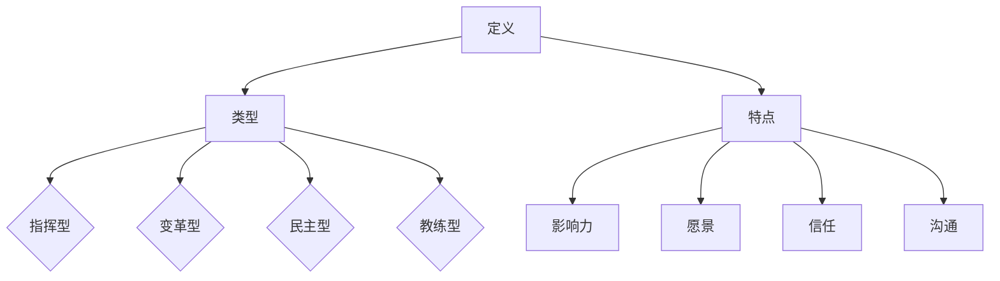

                 

### 文章标题

《领导力心经：成就不凡企业的领导者法则》

### 关键词

- 领导力
- 企业管理
- 团队建设
- 领导力发展
- 组织变革
- 领导力实践

### 摘要

本文旨在探讨领导力的核心概念和法则，通过对领导力在不同层面的分析和实践，帮助读者理解如何运用领导力来成就不凡企业。文章从定义、原理、发展、应用、实践和未来展望等多个角度展开，提供了一套系统的领导力方法论。通过结合IT领域的实践案例，本文不仅阐述了领导力的理论依据，还给出了实用的领导力提升策略和团队建设方法，为企业的持续发展和领导者的个人成长提供了有益的启示。

### 引言：领导力的核心概念

领导力，一个在商业、政治、教育等多个领域中被广泛提及的词汇，但其真正的含义和核心却往往被复杂化。简单来说，领导力是指引导和影响他人共同实现目标的能力。它不仅仅是一种技术或技能，更是一种理念、一种态度和一种行为模式。

**定义：** 领导力可以被定义为一种在组织中通过激励、影响、指导和榜样作用来引导和推动团队成员达成共同目标的能力。这种能力不仅包括战略规划和决策制定，还涉及人际沟通、情感管理和变革领导。

**类型：** 根据领导力的表现形式，可以将领导力分为多种类型，包括指挥型领导、变革型领导、民主型领导和教练型领导等。每种类型的领导力都有其独特的特点和适用场景。

- **指挥型领导：** 强调权威和命令，通过明确的目标和严格的规则来管理团队。
- **变革型领导：** 强调创新和变革，通过激发团队成员的激情和动力来实现组织目标。
- **民主型领导：** 强调参与和合作，通过集思广益来做出决策。
- **教练型领导：** 强调培养和发展团队成员，通过指导和辅导来提升其能力。

**特点：** 领导力的特点包括以下几个方面：

- **影响力：** 领导者能够通过自己的言行和决策来影响团队成员的行为和态度。
- **愿景：** 领导者能够清晰描述组织的愿景和目标，并激发团队成员的共鸣。
- **信任：** 领导者与团队成员之间建立信任关系，这是有效领导的基础。
- **沟通：** 领导者具备良好的沟通能力，能够清晰、有效地传达信息和思想。

在IT行业，领导力的作用尤为显著。IT行业是一个快速变化的领域，需要领导者具备前瞻性思维和快速应变能力。一个优秀的IT领导者不仅能够带领团队应对技术挑战，还能在变革中引领团队走向成功。

**背景介绍：** 随着信息技术的发展，企业对于IT系统的依赖程度越来越高。IT领导者不仅要具备扎实的技术背景，还需要具备强大的领导力。他们需要能够协调不同团队之间的工作，推动技术革新，并在面对复杂问题时作出明智的决策。因此，领导力在IT行业中的应用变得尤为重要。

### 核心概念与联系：领导力的原理架构

为了更好地理解领导力的核心概念，我们可以通过一个Mermaid流程图来展现领导力的原理架构。以下是一个简化的流程图：



在上述流程图中，A代表领导力的定义，它通过分支指向B，即领导力的类型。B进一步分支为指挥型、变革型、民主型和教练型四种类型。同时，A还通过分支指向G，即领导力的特点，G再分支为影响力、愿景、信任和沟通四个子节点。

**核心概念与联系解释：**

- **定义与类型：** 领导力的定义为我们提供了一个基础框架，而不同类型的领导力则为我们提供了具体的实现方式。指挥型、变革型、民主型和教练型分别适用于不同的管理场景和团队需求。
- **特点与类型、定义的关系：** 领导力的特点（影响力、愿景、信任和沟通）是领导者成功实施不同类型领导力的关键因素。例如，变革型领导力需要领导者具备强大的愿景和沟通能力，以激发团队成员的变革动力。
- **流程图的作用：** 通过流程图，我们可以清晰地看到领导力的各个组成部分及其相互关系。这有助于我们更好地理解领导力的本质和如何在实际中应用。

### 领导力的基本原理

理解领导力的基本原理是掌握有效领导的关键。以下是领导力基本原理的详细讲解，包括相关概念、定义及其相互关系。

**概念1：影响力**

**定义：** 影响力是指领导者通过个人魅力、专业知识、道德品质等手段来影响团队成员的能力。

**解释：** 影响力是领导力的核心要素之一。一个领导者的影响力越大，其领导效果也越显著。这种影响力不仅体现在决策的执行上，还包括团队成员的积极性和忠诚度。

**概念2：愿景**

**定义：** 愿景是指领导者对组织未来发展的总体构想，它为团队成员提供了共同的目标和方向。

**解释：** 愿景是激发团队成员激情和动力的关键。一个清晰而具有吸引力的愿景能够激发团队成员的共鸣，使其为实现组织目标而努力。

**概念3：信任**

**定义：** 信任是指团队成员对领导者及其决策的信任和依赖程度。

**解释：** 信任是建立高效团队的基石。一个缺乏信任的团队很难协同工作，而信任关系的建立需要领导者通过公正、透明和负责任的行为来逐步赢得。

**概念4：沟通**

**定义：** 沟通是指领导者与团队成员之间交换信息、观点和情感的过程。

**解释：** 沟通是领导力的重要组成部分。有效的沟通能够确保团队成员理解领导者的意图和期望，同时也能让领导者了解团队成员的需求和反馈。

**相互关系：**

- **影响力、愿景、信任和沟通之间的关系：** 影响力是领导者传递愿景和建立信任的基础。有效的沟通能够增强领导者的影响力，而信任则是愿景实现的保障。这四个概念相互依存，共同构成了领导力的基本原理。

- **流程图表示：**

  ```mermaid
  graph TD
      A[影响力] --> B{愿景}
      A --> C{信任}
      A --> D[沟通]
      B --> E{信任}
      B --> F[沟通]
      C --> G{沟通}
      D --> H{愿景}
      D --> I{信任}
  ```

  在上述流程图中，A（影响力）通过分支指向B（愿景）、C（信任）和D（沟通）。B（愿景）通过分支与C（信任）和D（沟通）相连接，而C（信任）和D（沟通）则相互连接。这展示了领导力基本原理之间的相互关系。

通过理解这些基本原理，领导者可以更有效地运用领导力，推动团队实现目标。

### 领导力的发展过程

领导力并非与生俱来，而是可以通过学习和实践逐步发展的。领导力的发展过程可以分为以下几个阶段：

**1. 自我认知：** 领导力的第一步是了解自己。领导者需要明确自己的价值观、优势、弱点以及职业目标。通过自我认知，领导者可以更好地定位自己的角色，并为未来的领导行为奠定基础。

**2. 学习和培训：** 领导者需要不断学习和更新自己的知识。这包括参加领导力培训、阅读相关书籍、参加研讨会等。学习不仅能够提升领导者的专业能力，还能拓宽其视野，使其能够更好地应对复杂的管理问题。

**3. 实践经验：** 实践是检验真理的唯一标准。领导者需要在实际工作中运用所学知识，通过解决实际问题来提升自己的领导能力。在实践中，领导者需要不断反思和总结，以便不断改进自己的领导方法。

**4. 反思和调整：** 领导者需要定期对自己的领导行为进行反思和评估。这可以通过自我评估、360度评估等方式进行。通过反思和调整，领导者可以识别并纠正自己的不足，进一步提升领导力。

**5. 建立信任：** 领导力的发展离不开团队成员的信任和支持。领导者需要通过正直、透明和负责任的行为来赢得团队成员的信任。建立信任关系需要时间和努力，但它是领导力成功的关键。

**6. 持续发展：** 领导力是一个持续的过程。领导者需要不断学习、实践和反思，以适应不断变化的环境和挑战。持续发展意味着领导者需要保持开放的心态，不断追求卓越。

通过上述阶段，领导者可以逐步提升自己的领导能力，成为一个更加有效的领导者。

### 提升领导力的方法与技巧

提升领导力是一个复杂而长期的过程，需要领导者具备多方面的能力和技巧。以下是一些实用的方法，可以帮助领导者提升领导力：

**1. 持续学习：** 学习是提升领导力的关键。领导者需要不断学习新知识、新技能，特别是与领导力相关的理论和实践。这可以通过阅读书籍、参加培训课程、参与行业研讨会等方式实现。

**2. 沟通能力：** 沟通是领导力的核心要素之一。领导者需要具备良好的沟通能力，包括倾听、表达、说服和协调等。有效的沟通能够确保团队成员理解领导者的意图和期望，同时也能让领导者了解团队成员的需求和反馈。

**3. 情感管理：** 领导者需要能够管理自己的情绪，并在面对压力和挑战时保持冷静和理智。情感管理不仅有助于提高领导者的决策质量，还能增强其与团队成员之间的信任。

**4. 建立团队：** 领导者需要能够建立并管理一个高效的团队。这包括识别团队成员的优势和弱点，合理分配任务，并提供必要的支持和资源。一个高效的团队能够提高工作效率，实现组织目标。

**5. 领导风格：** 领导者需要根据自己的特点和团队需求选择合适的领导风格。例如，指挥型领导适用于需要快速决策和执行的紧急情况，而教练型领导则适用于需要培养团队成员技能和提升其职业发展的长期目标。

**6. 持续反思：** 领导者需要定期对自己的领导行为进行反思和评估。通过自我评估和360度评估，领导者可以识别自己的不足之处，并采取相应的改进措施。

**7. 倡导变革：** 领导者需要具备变革领导能力，能够在组织内部推动创新和变革。这包括建立愿景、激发团队成员的变革动力、管理变革过程中的阻力和冲突等。

通过以上方法，领导者可以逐步提升自己的领导力，成为一个更加有效的领导者。

### 领导力在企业管理中的应用

领导力在企业管理中的应用至关重要，它不仅影响企业的战略方向和运营效率，还直接影响企业的文化建设和员工满意度。以下是领导力在企业管理中的应用及其重要性。

**1. 战略决策：** 领导者需要具备前瞻性和远见，能够制定清晰的企业战略并推动其有效执行。领导力在此过程中的作用是确保战略的可行性和有效性，通过影响和激励团队成员，使战略目标得以实现。

**2. 文化建设：** 企业文化是企业核心竞争力的重要组成部分。领导者的领导风格和价值观直接影响企业的文化氛围。一个积极、开放和包容的企业文化能够激发员工的创新精神和工作热情，从而提高企业的整体竞争力。

**3. 员工管理：** 领导者需要能够有效地管理员工，包括招募、培训、激励和绩效评估等。通过运用领导力，领导者可以建立高效的团队，提升员工的工作满意度和忠诚度，从而提高企业的生产力和效率。

**4. 变革管理：** 随着市场和环境的变化，企业需要不断进行变革以保持竞争力。领导者在变革管理中的作用是确保变革的顺利进行，通过领导力和影响力来动员和激励员工支持变革，并克服变革过程中的阻力。

**5. 冲突解决：** 企业运营过程中难免会出现冲突。领导者需要具备处理冲突的能力，通过沟通、协调和公正的方法来解决问题，维护团队和谐和稳定。

**6. 激励机制：** 领导者需要能够设计有效的激励机制，以激励员工发挥最大潜力。这包括薪酬、奖励、晋升等，通过合理的激励机制，领导者可以激发员工的积极性和创造力。

**案例分析：** 以苹果公司为例，史蒂夫·乔布斯是一位卓越的领导者。他通过强大的愿景和变革领导力，推动了苹果公司的创新和发展。乔布斯的领导风格强调设计美学和用户体验，这使得苹果公司能够持续推出具有竞争力的产品。乔布斯的领导力不仅帮助苹果公司在竞争激烈的市场中脱颖而出，还塑造了苹果独特的企业文化。

通过以上应用，领导力在企业管理中发挥着至关重要的作用。一个优秀的领导者能够通过有效运用领导力，推动企业实现战略目标，提升企业竞争力，并营造积极向上的企业文化。

### 领导力与团队建设

领导力在团队建设中起着至关重要的作用，一个高效的团队离不开有效的领导。以下是领导力在团队建设中的关键要素和实际案例。

**关键要素：**

1. **明确目标：** 领导者需要为团队设定明确的目标和方向，确保团队成员了解团队的目标及其重要性。这有助于提高团队的凝聚力和工作效率。

2. **角色分配：** 根据团队成员的能力和兴趣，合理分配任务和角色。这有助于发挥团队成员的潜力，提高团队的整体绩效。

3. **沟通与协作：** 领导者需要建立有效的沟通机制，确保团队成员之间的信息畅通和协作顺畅。这可以通过定期的团队会议、工作汇报等方式实现。

4. **激励与反馈：** 领导者需要能够激励团队成员，并给予及时的反馈。这可以通过奖励、晋升、培训等方式实现，以激发团队成员的积极性和创造力。

5. **冲突管理：** 团队内部难免会出现冲突，领导者需要具备处理冲突的能力，通过沟通和协调来解决矛盾，维护团队的和谐和稳定。

**实际案例：**

以谷歌为例，谷歌以其卓越的团队文化建设而闻名。谷歌的领导者通过以下方式推动团队建设：

1. **明确目标：** 谷歌的领导者为团队设定了明确的目标，如实现技术创新、推动企业增长等，这有助于提高团队的工作效率和凝聚力。

2. **角色分配：** 谷歌鼓励员工跨部门合作，通过项目组的形式，使不同背景和技能的员工能够共同工作，发挥各自的优势。

3. **沟通与协作：** 谷歌建立了开放的沟通渠道，如内部邮件、社交网络等，确保团队成员之间的信息畅通和协作顺畅。

4. **激励与反馈：** 谷歌提供了丰厚的薪酬和福利，如股票期权、免费食品等，以激励员工的积极性和创造力。同时，谷歌定期进行员工评估和反馈，以帮助员工不断提升自己。

5. **冲突管理：** 谷歌的领导者通过定期的团队会议和沟通，及时解决团队内部的冲突，确保团队的和谐和稳定。

通过以上实际案例，我们可以看到领导力在团队建设中的关键作用。一个优秀的领导者能够通过有效的领导力，推动团队建设，提升团队绩效，实现组织目标。

### 领导力的实践：成功案例分析

在探讨领导力的实践时，通过具体的成功案例进行分析是非常有价值的。这些案例不仅展示了领导力的有效应用，还为其他领导者提供了宝贵的经验和启示。以下是几个具有代表性的领导力实践案例：

**案例1：苹果公司的变革领导**

**背景：** 在2007年，史蒂夫·乔布斯重返苹果公司时，苹果正面临巨大的挑战。市场对其创新能力的质疑，产品线杂乱无章，公司内部也弥漫着低落的情绪。

**领导力实践：**

- **愿景和目标：** 乔布斯重新明确了苹果的愿景，即通过创新和技术突破，成为全球最具影响力的科技公司。他通过一系列具有前瞻性的决策和愿景演讲，激励了整个团队。
- **变革管理：** 乔布斯推动了一系列产品创新，如iPhone、iPad等，改变了整个消费电子市场。他在变革过程中，通过有效的沟通和激励，使员工积极参与到变革中。
- **团队建设：** 乔布斯强调团队协作和跨部门合作，鼓励员工提出新想法和创新方案。他通过赋予团队成员更多的自主权，激发了他们的创造力和积极性。

**结果：** 乔布斯的领导力实践使苹果公司重新崛起，成为全球最具价值的科技公司之一。其创新产品不仅赢得了市场的认可，也塑造了苹果独特的企业文化。

**案例2：特斯拉的可持续发展领导**

**背景：** 特斯拉在电动汽车市场中崭露头角，但其高速增长也带来了诸多挑战，包括供应链问题、生产瓶颈以及市场竞争压力。

**领导力实践：**

- **创新领导：** 埃隆·马斯克作为特斯拉的领导者，以创新为核心，不断推动公司发展。他不仅关注产品的技术创新，还积极推动能源领域的革命。
- **变革领导：** 马斯克在面对供应链和生产挑战时，通过快速决策和灵活应对，确保了公司的稳定发展。他通过建立垂直整合的供应链和自主生产，提升了公司的自主权和竞争力。
- **文化领导：** 特斯拉注重企业文化的建设，鼓励员工创新和冒险。马斯克通过透明和开放的沟通，使员工感受到公司的价值观和使命。

**结果：** 特斯拉在马斯克的领导下，不仅成为电动汽车市场的领导者，还在能源领域取得了重要突破。其创新和可持续发展的理念，赢得了全球消费者的认可。

**案例3：微软的转型领导**

**背景：** 微软在2014年时面临巨大的转型压力。随着智能手机和平板电脑的兴起，微软的传统PC业务受到了严重冲击。

**领导力实践：**

- **战略调整：** 微软的领导者萨蒂亚·纳德拉明确提出了“移动优先、云优先”的战略，将公司业务重心转向移动设备和云计算。
- **组织变革：** 纳德拉通过重组公司结构，减少了层级，提高了决策效率。他鼓励员工拥抱变革，积极探索新的业务领域。
- **员工激励：** 纳德拉注重员工的成长和发展，通过提供丰富的培训机会和职业发展路径，激发了员工的工作热情和创造力。

**结果：** 微软在纳德拉的领导下，成功实现了转型，其云服务和移动设备业务取得了显著增长。公司的市场份额和股价都实现了显著提升。

通过这些成功案例，我们可以看到领导力在实践中如何发挥作用。有效的领导力不仅能够推动企业实现战略目标，还能激发团队的潜力，实现持续发展。

### 领导力的实践方法：实际操作步骤

在实际操作中，领导者需要运用一系列方法和工具来提升团队效率和实现组织目标。以下是几个实用的领导力实践方法，并提供具体的操作步骤：

**1. SMART目标设定**

**定义：** SMART目标是具体、可衡量、可达成、相关性强和有时限的目标。

**操作步骤：**
- **具体（Specific）：** 明确目标的具体内容，例如“提高产品销售量”而不是“提升销售”。
- **可衡量（Measurable）：** 设定可量化的指标来衡量目标完成情况，例如“增加20%的销售量”。
- **可达成（Achievable）：** 确保目标是现实的，通过现有资源和努力可以实现。
- **相关性（Relevant）：** 确保目标与组织整体战略一致，有助于实现组织目标。
- **时限（Time-bound）：** 设定明确的时间节点，例如“在未来6个月内实现”。

**2. 员工反馈机制**

**定义：** 员工反馈机制是一种定期收集和分析员工意见和反馈的方法。

**操作步骤：**
- **定期反馈：** 设定每月或每季度的反馈会议，与员工进行一对一交流。
- **匿名调查：** 采用匿名调查问卷，收集员工的意见和建议。
- **分析反馈：** 对收集到的反馈进行分析，识别问题和机会。
- **行动计划：** 根据分析结果制定改进计划，并在后续会议中跟踪进展。

**3. 团队建设活动**

**定义：** 团队建设活动是通过非正式的团队活动来增强团队凝聚力和合作精神。

**操作步骤：**
- **活动规划：** 根据团队需求和兴趣，策划团队建设活动，如团队拓展训练、团建旅游等。
- **活动组织：** 安排活动的时间和地点，确保所有团队成员都能参与。
- **活动反馈：** 活动结束后，收集团队成员的反馈，总结活动效果，为后续活动提供改进建议。

**4. 情感管理工具**

**定义：** 情感管理工具是帮助领导者理解和应对员工情感的方法。

**操作步骤：**
- **情绪识别：** 学习情绪识别技巧，了解员工的情绪状态。
- **沟通技巧：** 运用有效的沟通技巧，如倾听、同理心和积极反馈，来改善员工情绪。
- **情感支持：** 提供情感支持，如心理辅导、工作调整等，帮助员工应对情绪问题。

**5. 360度评估**

**定义：** 360度评估是一种多角度评估方法，通过收集团队成员、上级和下属的反馈，全面了解领导者的表现。

**操作步骤：**
- **评估计划：** 制定360度评估计划，明确评估的目的和流程。
- **数据收集：** 通过问卷、面谈等方式收集反馈数据。
- **分析反馈：** 对收集到的反馈进行分析，识别领导者的优势和不足。
- **改进计划：** 根据评估结果，制定改进计划，并在后续评估中跟踪进展。

通过上述实践方法，领导者可以更有效地管理团队，提升团队绩效，实现组织目标。

### 领导力在危机管理中的应用

在现代社会，企业面临的不确定性和风险不断增加，危机管理成为领导力不可或缺的一部分。有效的危机管理不仅能够帮助企业度过困境，还能提升企业的声誉和竞争力。以下是领导力在危机管理中的应用及其具体方法：

**1. 快速响应**

**定义：** 快速响应是指在危机爆发时，领导者能够迅速采取行动，控制局势并减少损失。

**方法：**
- **建立危机管理团队：** 设立专门的危机管理团队，确保在危机发生时能够迅速反应。
- **制定应急预案：** 针对可能发生的危机，制定详细的应急预案，并定期进行演练，确保团队成员熟悉应急流程。
- **快速决策：** 领导者需要具备快速决策能力，根据危机情况采取有效的应对措施。

**2. 透明沟通**

**定义：** 透明沟通是指在危机管理过程中，领导者通过有效沟通，确保信息透明，增强员工和客户的信任。

**方法：**
- **公开信息：** 及时向员工和客户公开危机信息，确保他们了解实际情况。
- **建立沟通渠道：** 通过内部邮件、电话会议、社交媒体等方式，建立多渠道的沟通机制，确保信息畅通。
- **倾听反馈：** 鼓励员工和客户反馈意见，及时调整沟通策略。

**3. 持续监测**

**定义：** 持续监测是指在危机管理过程中，领导者需要持续关注危机的发展，及时调整应对策略。

**方法：**
- **实时数据收集：** 收集与危机相关的实时数据，如市场份额、客户满意度等，以了解危机对业务的影响。
- **定期评估：** 定期评估危机管理的效果，根据评估结果调整策略。
- **风险评估：** 定期进行风险评估，识别潜在的危机因素，并提前采取预防措施。

**4. 团队合作**

**定义：** 团队合作是指在危机管理过程中，领导者需要动员全体员工共同应对危机。

**方法：**
- **分配任务：** 根据员工的能力和兴趣，合理分配任务，确保每个人都能够发挥自己的优势。
- **跨部门协作：** 鼓励跨部门合作，共享资源，共同应对危机。
- **培训与支持：** 提供必要的培训和支持，确保员工具备应对危机的能力。

**案例分析：**

以2008年金融危机为例，美国政府在面对这场全球性危机时，采取了一系列有效的危机管理措施。首先，政府迅速成立了专门的危机管理团队，由财政部长亨利·保尔森领导。其次，政府通过透明沟通，向公众传达危机信息，增强民众对政府的信任。此外，政府还持续监测危机发展，及时调整经济刺激计划。最后，政府动员了全体员工，通过跨部门协作，共同应对危机。

通过这些方法，领导力在危机管理中发挥了重要作用。有效的危机管理不仅能够帮助企业度过困境，还能提升企业的声誉和竞争力。

### 领导力的发展趋势与未来展望

随着全球化、数字化转型和科技革命的不断推进，领导力的发展趋势也在不断演变。未来，领导者将面临更多复杂和不确定的环境，需要具备更加全面的能力和素质。以下是领导力发展趋势与未来展望的探讨：

**1. 智能化与自动化**

随着人工智能和机器学习技术的快速发展，智能化和自动化将逐步改变企业运营和管理模式。领导者需要适应这一变化，具备人工智能和数据分析能力，能够利用技术提升决策效率和团队绩效。

**2. 集团协作与全球化**

全球化的趋势使得企业需要更加重视集团协作和跨文化管理。领导者需要具备跨文化沟通能力，能够协调不同国家和地区的团队，推动全球业务发展。

**3. 持续学习与创新能力**

未来，领导者需要具备持续学习和创新能力，以应对快速变化的市场和技术环境。他们需要不断更新知识体系，积极探索新的业务模式和商业模式，推动企业的持续发展。

**4. 情感管理与价值观领导**

随着员工对企业文化的重视程度不断提高，领导者需要更加注重情感管理和价值观领导。他们需要通过情感关怀和价值观传递，增强员工的归属感和忠诚度，提升团队凝聚力和工作效率。

**5. 领导力的个性化**

未来，领导力将更加个性化，领导者需要根据不同团队成员的特点和需求，采用个性化的领导风格和方法。他们需要具备灵活性和适应性，能够根据不同情境和任务要求，灵活调整领导策略。

**未来展望：**

在未来，领导力的发展将更加注重智能化、全球化、持续学习和情感管理。领导者需要不断提升自己的综合素质，适应不断变化的环境和挑战。同时，领导力也将更加个性化和多元化，领导者将根据团队和情境的需求，灵活运用不同的领导风格和策略，推动企业实现长期发展和持续成功。

### 结论

领导力在企业的成功中扮演着至关重要的角色。通过本文的探讨，我们详细分析了领导力的核心概念、基本原理、发展过程、应用方法、实践案例以及未来展望。我们明确了领导力不仅仅是权威和命令，更是一种影响力、愿景、信任和沟通的综合体现。有效的领导力能够推动企业实现战略目标，提升团队绩效，构建积极的企业文化。

对于未来，领导者需要具备适应智能化、全球化和持续学习等趋势的能力，不断提升自身的综合素质。同时，领导力也将更加个性化和多元化，领导者将根据不同情境和任务要求，灵活运用不同的领导风格和方法。

**总结：** 本文通过系统性的分析，为读者提供了关于领导力的全面理解和实用方法。我们鼓励读者在实际工作中，不断探索和运用这些领导力原则，以推动企业的持续发展和个人职业生涯的进步。

### 作者信息

作者：AI天才研究院/AI Genius Institute & 禅与计算机程序设计艺术 /Zen And The Art of Computer Programming

### 最佳实践 Tips、小结、注意事项、拓展阅读

**最佳实践 Tips：**
1. 定期进行自我评估，识别并改进领导力不足。
2. 倾听员工意见，建立开放的沟通渠道。
3. 建立愿景和目标，激发团队积极性。

**小结：**
本文从多个角度探讨了领导力的核心概念和实践方法，提供了实用的领导力提升策略和团队建设技巧。

**注意事项：**
1. 领导力发展需要长期积累和实践。
2. 领导者需要具备持续学习和适应变化的能力。

**拓展阅读：**
- 《领导力：5项修炼》(John C. Maxwell)
- 《变革之舞：领导力与创新》(Warren Bennis)
- 《智能时代：大数据与领导力》(Thomas H. Davenport)

