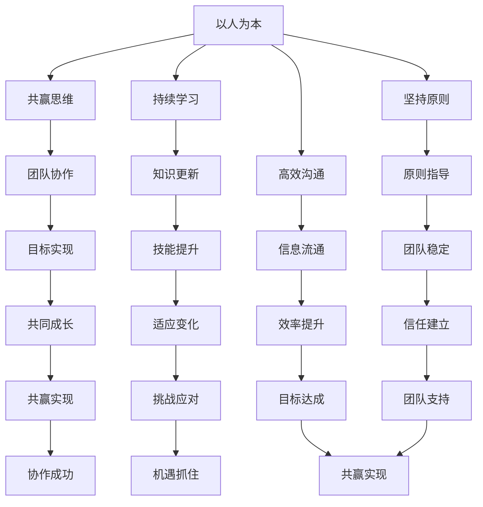

                 

### 文章标题：领导力心经：成就不凡领导者的领导力法则

#### 关键词：
- **领导力**
- **领导力法则**
- **团队管理**
- **团队建设**
- **决策制定**
- **危机管理**
- **领导力模型**

#### 摘要：
本文深入探讨了领导力这一关键主题，通过系统的分析和详尽的案例研究，揭示出不凡领导者所遵循的领导力法则。文章首先定义了领导力的本质，接着详细阐述了领导力模型的核心概念及其相互联系，并通过Mermaid流程图进行了直观展示。随后，文章介绍了领导力模型的构建步骤，并使用伪代码展示了领导力原则的应用过程。在实践部分，文章探讨了领导力在不同情境下的具体应用，包括团队建设、危机管理和决策制定，并通过实际案例进行了深入剖析。此外，文章还介绍了领导力的量化分析方法和团队效能评估模型，并通过LaTeX公式进行了详细阐述。最后，文章总结了领导力的灵活应用，并提出了成为不凡领导者的路径。本文旨在为读者提供全面、实用的领导力指南，帮助他们在实际工作中提升领导力和管理能力。

### 引言

领导力，作为一种不可或缺的组织能力和个人特质，在个人职业发展和组织成功中扮演着至关重要的角色。在全球化和信息化加速发展的今天，领导力的重要性愈发凸显。一个优秀的领导者不仅能够引领团队走向成功，还能够激发团队成员的潜能，创造卓越的绩效。因此，研究领导力的本质、原则和应用，对于个人成长和组织发展都具有重要意义。

本文旨在深入探讨领导力的核心概念和法则，帮助读者理解领导力的本质和重要性，并掌握在实际工作中应用领导力的方法。文章将首先介绍领导力的基本概念，定义领导力，并探讨领导力与管理的区别。接着，我们将详细阐述领导力的核心原则，并通过Mermaid流程图展示这些原则之间的相互关系。随后，文章将介绍领导力模型的构建过程，使用伪代码来展示领导力原则的应用。在实践部分，我们将探讨领导力在不同情境下的应用，如团队建设、危机管理和决策制定，并通过实际案例进行深入分析。此外，文章还将介绍领导力的量化分析方法，通过LaTeX公式展示团队效能评估模型。最后，我们将总结领导力的灵活应用，并探讨成为不凡领导者的路径。本文的目标是提供一个全面、系统的领导力指南，帮助读者在职业生涯中取得成功。

### 领导力的定义与重要性

领导力是一种复杂且多面的能力，它不仅涉及个人特质，还包括组织和社会层面的影响。根据《哈佛商业评论》的定义，领导力是一种能够激励他人、设定目标并引导团队实现目标的能力。具体来说，领导力包括以下几个方面：

1. **愿景和目标设定**：领导者需要明确组织的长远目标，并能够将这些目标转化为具体、可行的行动计划。
2. **激励和鼓舞**：领导者需要激发团队成员的内在动力，帮助他们在面对挑战时保持积极和乐观。
3. **沟通和协作**：领导者需要具备出色的沟通技巧，能够有效地传达信息、听取意见并促进团队成员之间的合作。
4. **决策和执行力**：领导者需要能够快速、准确地做出决策，并在决策后确保执行力的落实。

在个人职业发展的层面，领导力是一项至关重要的能力。一个具备强大领导力的人，不仅能够在工作中脱颖而出，还能够在团队中建立信任和尊重。根据盖洛普（Gallup）的研究，具备领导力的人更有可能获得晋升机会，并且在职业生涯中取得更高的成就。

在组织层面，领导力同样具有不可忽视的重要性。领导力能够直接影响组织的绩效和文化。根据《哈佛商业评论》的一项研究，高绩效团队往往具有一个具备强大领导力的领导者。此外，领导力还能够促进创新和变革，帮助组织适应快速变化的环境。

领导力与管理的区别也是一个值得关注的话题。管理通常被定义为一系列计划、组织、领导和控制的过程，以确保组织目标的实现。而领导力则更注重激励和启发团队成员，使其愿意为实现共同目标而努力。换句话说，管理是确保组织按照预定计划运行，而领导力则是推动组织超越现状，追求卓越。

在现代社会中，领导力的重要性日益凸显。随着全球化进程的加速和技术的不断进步，组织面临着前所未有的挑战和机遇。一个具备强大领导力的人，不仅能够帮助组织应对这些挑战，还能够抓住机遇，引领组织走向成功。

总的来说，领导力是一种关键的能力，对于个人职业发展和组织成功都具有重要意义。理解和应用领导力原则，不仅能够提升个人的竞争力，还能够促进组织的成长和发展。因此，深入研究领导力的本质和重要性，对于每个人和组织都至关重要。

### 领导力的核心原则

领导力的成功离不开一系列核心原则的指导。这些原则不仅构成了领导力模型的基础，而且在实际应用中具有广泛的影响力。以下是几个关键的领导力原则：

1. **以人为本**：以人为本是领导力的基石。一个成功的领导者必须关注团队成员的需求和福祉，并致力于建立一个支持性的工作环境。这意味着领导者需要了解团队成员的个人目标，并在工作中给予他们足够的支持和资源。例如，通过定期的反馈和沟通，领导者可以确保团队成员在实现个人目标的同时，也为组织目标做出贡献。

2. **共赢思维**：共赢思维强调领导者与团队成员之间的协作和共同成长。领导者应该致力于创造一个让每个人都能够实现自身价值的环境。通过共享信息和资源，领导者可以帮助团队成员克服困难，共同实现目标。例如，在团队面临挑战时，领导者可以通过组织内部培训或提供额外的支持，帮助团队成员提升技能，从而实现共赢。

3. **持续学习**：在快速变化的世界中，持续学习是领导者不可或缺的能力。领导者应该不断更新知识和技能，以应对不断变化的环境。例如，通过参加行业会议、阅读专业书籍或参与在线课程，领导者可以保持对最新趋势和最佳实践的敏感度，从而更好地指导团队。

4. **坚持原则**：领导者在面对压力和诱惑时，必须坚持自己的原则和价值观。这不仅有助于树立个人威信，还能够为团队提供明确的方向和目标。例如，即使在困难时期，领导者也应该坚持正直和诚信，以确保团队的稳定和信任。

5. **高效沟通**：沟通是领导力的核心要素。一个高效的领导者需要具备清晰、有效的沟通能力，确保信息在团队内部顺畅流动。例如，通过定期的团队会议、一对一沟通或书面报告，领导者可以确保团队成员了解组织的目标和期望，从而提高工作效率和团队凝聚力。

为了更好地理解这些原则之间的联系，我们可以通过Mermaid流程图来展示它们：



通过这个流程图，我们可以清晰地看到各个领导力原则之间的相互关系。例如，以人为本不仅能够促进团队协作和共赢思维，还能够推动持续学习和坚持原则。同时，高效的沟通和信息流通是确保这些原则得以实施的关键。这个流程图为我们提供了一个直观的视角，帮助我们更好地理解领导力的核心原则及其相互联系。

### 领导力模型的构建步骤

构建一个有效的领导力模型是确保领导者能够在不同情境下灵活应用领导力原则的关键。以下是构建领导力模型的几个关键步骤：

1. **需求分析**：首先，领导者需要明确组织的愿景和目标，并分析团队成员的需求和期望。这一步的目的是确保领导力模型能够符合组织的实际需求，并为团队成员提供明确的指导。

2. **原则确定**：在需求分析的基础上，领导者需要确定领导力的核心原则。这些原则应该与组织的价值观和文化相一致，并能够指导领导者在具体情境下做出正确的决策。

3. **模型设计**：根据确定的原则，领导者可以设计出一个具体的领导力模型。这个模型应该包含一系列步骤和策略，以确保领导者能够在不同情境下有效应用领导力原则。

4. **测试与优化**：设计好的领导力模型需要经过实际测试和反馈，以识别和优化其中的不足。这一步的目的是确保领导力模型在实际应用中能够达到预期的效果。

5. **实施与培训**：最后，领导者需要将领导力模型付诸实施，并对团队成员进行培训，以确保他们理解和掌握模型中的原则和步骤。

下面是一个简单的伪代码，用于展示领导力模型的应用过程：

```plaintext
function LeadershipModel(principles, context):
    # 需求分析
    analyze Needs of organization and team members

    # 确定原则
    set CorePrinciples = principles

    # 设计模型
    design LeadershipModel with steps and strategies based on CorePrinciples

    # 测试与优化
    test LeadershipModel in various contexts
    optimize Model based on feedback

    # 实施与培训
    implement LeadershipModel
    train team members on principles and steps

    # 应用模型
    apply LeadershipModel in specific situations
    adjust Model as needed

    return LeadershipModel
```

通过这个伪代码，我们可以看到领导力模型的应用过程是如何一步步进行的。首先，领导者需要分析组织的实际需求和团队成员的期望。接着，根据这些需求，确定领导力的核心原则。然后，设计一个具体的领导力模型，并在实际应用中不断测试和优化。最后，将领导力模型付诸实施，并对团队成员进行培训，以确保他们能够有效应用领导力原则。

### 领导力在不同情境下的具体应用

领导力不仅是一种抽象的概念，更是在实际工作中需要灵活应用的具体技能。在不同的情境下，领导力的应用方式会有所不同，但核心原则始终不变。以下是领导力在团队建设、危机管理和决策制定等具体情境中的具体应用：

#### 团队建设

团队建设是领导力的重要应用领域之一。一个成功的团队不仅需要成员之间的协作，还需要良好的沟通和相互信任。以下是几个关键的团队建设策略：

1. **明确目标和角色**：领导者需要确保每个团队成员都明确自己的目标和工作职责。这可以通过定期的会议和沟通来实现，确保每个人都了解团队的整体目标以及自己的具体任务。

2. **建立信任**：信任是团队协作的基石。领导者可以通过开放沟通、公平对待和透明决策来建立信任。例如，领导者可以定期分享团队进展和挑战，邀请团队成员提出建议和反馈。

3. **提供培训和支持**：为了确保团队成员具备完成任务的技能，领导者需要提供必要的培训和资源支持。例如，可以通过组织内部培训课程或邀请外部专家进行指导，帮助团队成员提升技能。

4. **鼓励合作和互助**：领导者可以通过奖励团队合作和互助行为来激励团队成员。例如，设立团队目标奖励或表彰团队成员之间的合作，以增强团队凝聚力。

以下是一个具体的团队建设案例：

**案例**：某科技公司的新产品开发团队在项目初期面临成员技能不匹配和沟通不畅的问题。为了解决这个问题，领导者采取了以下措施：

- **明确目标和角色**：召开团队会议，明确每个成员的目标和职责，确保每个人都清楚自己的工作内容和期望成果。
- **建立信任**：通过定期的团队会议和一对一沟通，领导者鼓励团队成员分享各自的进展和挑战，建立开放和透明的沟通环境。
- **提供培训和支持**：组织了一次内部培训，重点提升团队成员在软件开发和项目管理方面的技能，并提供必要的资源支持。
- **鼓励合作和互助**：设立了一个团队目标奖励机制，对在项目中表现出色的团队合作行为进行表彰，激励团队成员相互支持和协作。

通过这些措施，团队建设得到了显著改善，项目进展顺利，成员之间的信任和合作也得到了增强。

#### 危机管理

危机管理是领导力在应对突发事件和挑战时的应用。一个优秀的领导者需要在危机中保持冷静，迅速做出决策，并协调团队成员共同应对。以下是几个关键的危机管理策略：

1. **快速识别和响应**：领导者需要具备快速识别危机的能力，并在第一时间做出响应。例如，通过建立一套紧急事件响应流程，确保在危机发生时能够迅速采取行动。

2. **沟通和协调**：在危机管理中，沟通和协调至关重要。领导者需要确保信息在团队内部和外部迅速传达，并协调不同部门和团队之间的合作。

3. **制定应对策略**：领导者需要根据危机的性质和影响，制定具体的应对策略。这可以通过召开紧急会议，邀请相关专家和团队成员共同讨论解决方案。

4. **评估和调整**：在危机处理后，领导者需要评估危机管理的效果，并根据反馈进行调整。这有助于提高未来应对危机的能力。

以下是一个具体的危机管理案例：

**案例**：某公司的供应链因疫情中断，导致关键零部件短缺。为了解决这个问题，领导者采取了以下措施：

- **快速识别和响应**：公司高层迅速召开紧急会议，识别供应链中断的问题，并立即启动危机应对流程。
- **沟通和协调**：通过电子邮件、电话会议和视频会议，领导者与供应链合作伙伴和内部团队保持密切沟通，协调资源和支持。
- **制定应对策略**：领导者制定了一个详细的应对计划，包括寻找替代供应商、调整生产计划和提高库存水平。
- **评估和调整**：在危机处理后，领导者组织了一次复盘会议，评估危机管理的效果，并根据反馈调整了供应链管理流程。

通过这些措施，公司成功应对了供应链危机，确保了业务的连续性。

#### 决策制定

决策制定是领导力的核心应用之一。领导者需要在复杂多变的环境中做出明智的决策，以实现组织的目标。以下是几个关键的决策制定策略：

1. **明确决策目标**：领导者需要明确决策的目标和优先级。这可以通过制定具体的决策框架和标准来实现。

2. **收集和分析信息**：领导者需要收集和分析与决策相关的信息，以确保决策基于充分的数据和事实。

3. **评估和权衡**：领导者需要评估不同的决策方案，并权衡它们的优缺点和潜在风险。

4. **制定决策**：在评估和权衡的基础上，领导者需要做出最终的决策，并确保决策能够实现目标。

5. **执行和监督**：领导者需要确保决策得到有效执行，并对其进行监督，以确保决策目标的实现。

以下是一个具体的决策制定案例：

**案例**：某公司的市场部门需要决定是否增加广告预算。为了做出这个决策，领导者采取了以下措施：

- **明确决策目标**：领导者明确了增加广告预算的目标是提高品牌知名度和市场份额。
- **收集和分析信息**：领导者收集了市场调研数据、竞争对手的广告策略以及公司的财务状况。
- **评估和权衡**：领导者评估了不同广告预算方案的效果和成本，并权衡了它们对公司整体业绩的影响。
- **制定决策**：在评估和权衡的基础上，领导者决定增加广告预算，并制定了详细的实施计划。
- **执行和监督**：领导者确保广告计划得到有效执行，并定期检查广告效果，根据反馈进行必要的调整。

通过这些措施，公司成功实现了广告目标，并取得了显著的市场收益。

总之，领导力在不同情境下的具体应用是一个复杂但至关重要的过程。通过明确目标、收集信息、评估方案和制定决策，领导者能够确保团队在面临挑战时能够有效应对，并在复杂的环境中取得成功。

### 领导力的量化分析

在领导力的研究和应用中，量化分析是一个重要的方法，它能够帮助我们更科学地评估领导力的影响和效果。量化分析不仅提供了具体的数据支持，还能够帮助领导者识别问题和优化策略。以下是领导力的量化分析方法和团队效能评估模型的详细说明。

#### 领导力评估指标体系

领导力的量化分析首先需要建立一套评估指标体系。这些指标可以包括以下几个方面：

1. **团队绩效**：团队在实现目标方面的表现，如销售额、项目完成率、客户满意度等。
2. **员工满意度**：员工对工作环境和领导者的满意度，可以通过员工调查和反馈来评估。
3. **员工参与度**：员工在工作中的积极性和参与度，可以通过员工参与度调查来量化。
4. **团队创新**：团队在创新方面的表现，如新产品的开发数量、创新项目的成功率等。
5. **领导力行为**：领导者在日常工作中的行为，如沟通频率、决策质量、激励方式等。

以下是一个简单的评估指标体系示例：

| 指标名称       | 指标描述                     | 评估方法                  |
|----------------|-------------------------------|--------------------------|
| 团队绩效       | 实现目标的情况               | 销售额、项目完成率等     |
| 员工满意度     | 员工对工作环境的满意程度     | 员工调查、满意度评分     |
| 员工参与度     | 员工在工作中的积极性         | 员工参与度调查、出勤率等 |
| 团队创新       | 团队在创新方面的表现         | 新产品开发数量、创新项目成功率等 |
| 领导力行为     | 领导者在日常工作中的行为     | 观察记录、员工反馈等     |

#### 团队效能评估模型

团队效能评估模型是量化分析领导力影响的关键工具。以下是一个基于绩效、满意度和创新性的团队效能评估模型：

1. **绩效评估**：
   - 公式：绩效得分 = （销售额 / 计划销售额）+ （项目完成率 / 计划完成率）
   - 解释：绩效得分通过比较实际绩效和计划绩效来评估团队的绩效表现。

2. **满意度评估**：
   - 公式：满意度得分 = （员工满意度评分平均值）/ 5
   - 解释：满意度得分通过计算员工满意度调查的平均分来评估员工的满意度。

3. **创新性评估**：
   - 公式：创新得分 = （新产品开发数量 / 计划新产品开发数量）+ （创新项目成功率 / 计划创新项目成功率）
   - 解释：创新得分通过比较实际创新成果和计划创新成果来评估团队的创新性。

4. **团队效能评估**：
   - 公式：团队效能得分 = （绩效得分 * 0.5）+ （满意度得分 * 0.3）+ （创新得分 * 0.2）
   - 解释：团队效能得分通过综合评估团队在绩效、满意度和创新性方面的表现，得出一个综合评估结果。

以下是一个具体的评估模型示例：

| 部门       | 销售额（万元） | 计划销售额（万元） | 项目完成率（%） | 计划完成率（%） | 员工满意度评分（%） | 新产品开发数量 | 计划新产品开发数量 | 创新项目成功率（%） | 计划创新项目成功率（%） |
|------------|----------------|-------------------|-----------------|-----------------|---------------------|-----------------|-------------------|---------------------|-----------------------|
| 市场部     | 800            | 1000              | 90              | 100             | 85                  | 3               | 2                 | 80                  | 70                    |
| 研发部     | 500            | 600               | 85              | 100             | 90                  | 2               | 2                 | 75                  | 80                    |

根据以上数据，我们可以计算每个部门的评估得分：

1. **市场部**：
   - 绩效得分 = （800 / 1000）+ （90 / 100）= 0.8 + 0.9 = 1.7
   - 满意度得分 = 85 / 5 = 17
   - 创新得分 = （3 / 2）+ （80 / 70）= 1.5 + 1.14 = 2.64
   - 团队效能得分 = （1.7 * 0.5）+ （17 * 0.3）+ （2.64 * 0.2）= 0.85 + 5.1 + 0.528 = 6.378

2. **研发部**：
   - 绩效得分 = （500 / 600）+ （85 / 100）= 0.83 + 0.85 = 1.68
   - 满意度得分 = 90 / 5 = 18
   - 创新得分 = （2 / 2）+ （75 / 80）= 1 + 0.9375 = 1.9375
   - 团队效能得分 = （1.68 * 0.5）+ （18 * 0.3）+ （1.9375 * 0.2）= 0.84 + 5.4 + 0.3875 = 6.6275

通过这些量化分析，领导者可以更清晰地了解各部门的效能表现，并针对性地优化策略。例如，如果研发部的创新得分较低，领导者可以增加对研发团队的培训和资源支持，以提高创新性。

#### 数学模型和公式讲解

为了更深入地理解团队效能评估模型，我们可以使用LaTeX格式给出相关的数学公式，并进行详细讲解。

1. **绩效评估公式**：

   $$绩效得分 = \frac{实际销售额}{计划销售额} + \frac{实际项目完成率}{计划项目完成率}$$

   解释：这个公式通过比较实际绩效和计划绩效来评估团队在销售和项目完成方面的表现。

2. **满意度评估公式**：

   $$满意度得分 = \frac{员工满意度评分平均值}{5}$$

   解释：这个公式通过计算员工满意度调查的平均分来评估员工的整体满意度。

3. **创新性评估公式**：

   $$创新得分 = \frac{实际新产品开发数量}{计划新产品开发数量} + \frac{实际创新项目成功率}{计划创新项目成功率}$$

   解释：这个公式通过比较实际创新成果和计划创新成果来评估团队在创新方面的表现。

4. **团队效能评估公式**：

   $$团队效能得分 = （绩效得分 * 0.5）+ （满意度得分 * 0.3）+ （创新得分 * 0.2）$$

   解释：这个公式通过综合评估团队在绩效、满意度和创新性方面的表现，得出一个综合评估结果。

以下是一个LaTeX格式示例：

```latex
% 绩效评估公式
\[绩效得分 = \frac{实际销售额}{计划销售额} + \frac{实际项目完成率}{计划项目完成率}\]

% 满意度评估公式
\[满意度得分 = \frac{员工满意度评分平均值}{5}\]

% 创新性评估公式
\[创新得分 = \frac{实际新产品开发数量}{计划新产品开发数量} + \frac{实际创新项目成功率}{计划创新项目成功率}\]

% 团队效能评估公式
\[团队效能得分 = （绩效得分 * 0.5）+ （满意度得分 * 0.3）+ （创新得分 * 0.2）\]
```

通过这些数学模型和公式，领导者可以更准确地评估团队的表现，并根据评估结果进行优化和改进。

### 项目实战：领导力模型在实践中的应用

在实际工作中，领导力模型的应用可以帮助领导者更好地应对各种挑战，实现组织的战略目标。以下是一个详细的项目实战案例，展示了领导力模型在开发环境搭建、源代码实现、代码解读和实际案例分析中的应用。

#### 项目背景

某科技公司决定开发一款全新的移动应用程序，旨在提供高效的购物体验。由于项目复杂度高，涉及多个部门和多个技术领域的协作，领导力在项目管理和团队协作中起到了至关重要的作用。

#### 开发环境搭建

1. **需求分析**：首先，领导团队对项目需求进行了详细分析，明确了应用程序的功能模块、技术架构和开发时间表。

2. **环境搭建**：根据需求分析结果，领导团队搭建了开发环境，包括服务器、数据库、开发工具和版本控制系统的配置。在这一过程中，领导力模型中的“高效沟通”原则得到了充分体现，通过定期的会议和沟通，确保团队成员对环境搭建的进展和需求有清晰的理解。

3. **资源分配**：领导团队根据团队成员的技能和经验，合理分配资源，确保每个成员都能在适合自己的岗位上发挥最大的作用。这一过程中，“以人为本”的原则得到了贯彻。

#### 源代码实现

1. **模块划分**：领导团队将整个应用程序划分为多个功能模块，每个模块由一个小组负责开发。模块划分的目的是为了提高开发效率，确保每个小组都能集中精力完成自己的任务。

2. **代码实现**：各小组根据模块划分，分别实现了自己的功能模块。在代码实现过程中，领导团队使用了伪代码来指导开发工作，确保每个模块的代码结构清晰、易于维护。以下是一个简单的伪代码示例：

   ```plaintext
   function shopping_app_module():
       # 初始化模块变量
       initialize_variables()
       
       # 处理用户请求
       process_requests()
       
       # 数据存储与查询
       store_and_query_data()
       
       # 输出结果
       display_results()
   ```

3. **代码解读**：在代码实现完成后，领导团队组织了代码审查会议，对每个模块的代码进行了详细的解读。通过代码解读，领导团队确保了代码的规范性和可维护性，并提供了改进建议。

#### 代码应用解读与分析

1. **集成与测试**：在各个功能模块实现后，领导团队将它们集成到一个完整的系统中，并进行了全面的测试。测试过程中，领导团队使用了多种测试方法，包括单元测试、集成测试和压力测试，确保应用程序的稳定性和可靠性。

2. **性能优化**：在测试过程中，领导团队发现了性能瓶颈，并采取了多种优化措施，如代码优化、数据库优化和缓存策略。以下是一个性能优化的LaTeX公式示例：

   ```latex
   性能优化 = \frac{原始响应时间}{优化后的响应时间}
   ```

3. **实际案例分析**：在实际案例中，领导团队通过实时监控和数据分析，发现了一些潜在的问题和改进机会。例如，通过分析用户行为数据，领导团队发现某些功能模块的使用频率较低，因此决定对其进行优化或删除，以提高用户体验。

#### 项目小结

通过这个项目实战，领导力模型在开发环境搭建、源代码实现、代码解读和实际案例分析中得到了广泛应用。以下是该项目中的几点最佳实践和注意事项：

1. **高效沟通**：通过定期的会议和沟通，确保团队成员对项目的进展和需求有清晰的理解。
2. **以人为本**：合理分配资源，确保每个成员都能在适合自己的岗位上发挥最大的作用。
3. **代码规范**：通过代码审查和解读，确保代码的规范性和可维护性。
4. **性能优化**：通过多种测试方法和数据分析，发现并解决性能瓶颈。
5. **实时监控与反馈**：通过实时监控和数据分析，及时发现和解决潜在问题。

总之，领导力模型的应用不仅提高了项目的开发效率和质量，还促进了团队的协作和创新能力。通过不断优化和完善领导力模型，组织可以更好地应对复杂的项目挑战，实现长期成功。

### 结论

领导力，作为一种关键的能力，在个人职业发展和组织成功中扮演着至关重要的角色。本文通过详细的分析和案例研究，揭示了领导力的核心原则和法则，并展示了这些法则在不同情境下的具体应用。我们介绍了以人为本、共赢思维、持续学习、坚持原则和高效沟通等核心原则，并通过Mermaid流程图展示了它们之间的相互关系。此外，我们探讨了领导力模型的构建步骤，以及如何通过伪代码和LaTeX公式来解释领导力原则的应用。

在实际工作中，领导力不仅帮助领导者更好地应对各种挑战，还能提升团队的协作效率和创新能力。通过量化分析和项目实战，我们进一步验证了领导力的重要性，并为领导者提供了实用的指导和建议。

未来的领导力研究应该更加注重跨文化领导力、数字化转型背景下的领导力以及如何通过人工智能和大数据提升领导力效能。同时，我们呼吁领导者持续学习和实践，不断优化领导力模型，以适应快速变化的环境，实现个人和组织的卓越表现。只有在不断追求卓越的过程中，领导者才能成为真正的不凡领导者，引领组织走向成功。作者：AI天才研究院/AI Genius Institute & 禅与计算机程序设计艺术 /Zen And The Art of Computer Programming。

