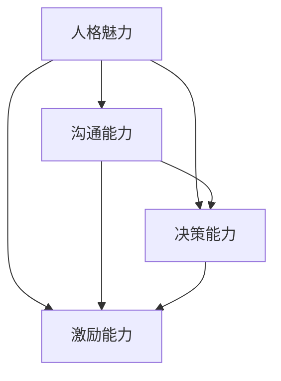

                 

### 背景介绍

#### 领导力的重要性

在当今快速变化和高度复杂的社会环境中，领导力已成为企业和组织成功的关键因素。无论是企业、政府机构还是非营利组织，领导者都需要具备卓越的领导力，以应对各种挑战和机遇。领导力不仅关乎个人的职业发展，更关乎整个团队、组织乃至整个社会的进步。

#### 领导力与管理的区别

虽然领导力和管理经常被混用，但二者有着本质的区别。管理侧重于维持现状、优化流程、确保效率，而领导力则关注变革、创新和未来的发展。领导力旨在激发团队成员的潜能，推动他们超越自我，共同实现组织目标。

#### 领导力的核心概念

领导力的核心概念包括但不限于以下几方面：

1. **人格魅力**：领导者的人格魅力是其领导力的重要组成部分。一个具有人格魅力的领导者能够吸引和激励团队成员，建立强大的团队凝聚力。
2. **沟通能力**：有效的沟通是领导力的关键。领导者需要具备清晰、准确、有感染力的沟通能力，以确保信息准确传达，促进团队协作。
3. **决策能力**：领导者必须能够快速做出明智的决策，并在不确定性中保持冷静。优秀的决策能力能够帮助团队在竞争激烈的市场环境中脱颖而出。
4. **激励能力**：领导者需要能够激发团队成员的积极性，帮助他们克服困难，实现目标。

### 本书的结构

本书旨在深入探讨领导力的核心概念、实践技巧和成功案例，帮助读者理解并提升自己的领导力。全书分为四个部分：

1. **领导力核心概念**：介绍领导力的定义、重要性及其核心要素。
2. **领导力实践技巧**：详细阐述领导力实践技巧，包括领导风格、团队建设、自我管理和应对挑战的策略。
3. **成功领导者案例解析**：分析国内外成功领导者的领导实践，为读者提供实际操作指导。
4. **领导力心经总结与反思**：总结本书的核心内容，展望领导力的发展趋势，并探讨领导者如何进行自我成长。

通过本书的阅读，读者将能够深入了解领导力的本质，掌握提升领导力的方法，成为卓越的领导者。

### 领导力的核心概念

领导力不仅仅是一个管理职位的要求，它是一种能够激励和引导他人共同实现目标的能力。理解领导力的核心概念是提升领导力的第一步。以下是领导力的几个核心概念及其相互关系：

#### 1. 人格魅力

**定义**：人格魅力是指领导者通过其个性、价值观和行为方式，所展现出的吸引力和影响力。

**作用**：人格魅力是领导者成功的关键因素之一。它能够帮助领导者建立信任，吸引和留住优秀的团队成员。一个具有人格魅力的领导者能够在团队中形成强大的凝聚力，使团队成员愿意追随和效仿。

**相互关系**：人格魅力与沟通能力、决策能力、激励能力等核心要素密切相关。一个具有人格魅力的领导者更容易与他人建立良好的沟通，做出明智的决策，并有效地激励团队成员。

#### 2. 沟通能力

**定义**：沟通能力是指领导者有效地传递信息、理解他人意见并建立有效沟通渠道的能力。

**作用**：有效的沟通是领导力的核心。领导者需要通过沟通来传达愿景、目标、决策，并收集团队成员的反馈。良好的沟通能力能够减少误解和冲突，促进团队协作和效率。

**相互关系**：沟通能力与人格魅力、决策能力、激励能力等要素相互促进。一个具有良好沟通能力的领导者能够更好地展现其人格魅力，做出更明智的决策，并更有效地激励团队成员。

#### 3. 决策能力

**定义**：决策能力是指领导者能够快速、准确地评估情况，并做出符合团队利益的明智选择的能力。

**作用**：决策能力是领导者的一项关键技能。在面临复杂多变的环境时，领导者需要能够迅速做出决策，以确保团队目标和利益的实现。

**相互关系**：决策能力与沟通能力、人格魅力、激励能力等要素密切相关。一个具有优秀决策能力的领导者能够更好地与团队成员沟通，展示人格魅力，并激励团队成员支持决策。

#### 4. 激励能力

**定义**：激励能力是指领导者能够激发团队成员的积极性、创造力和潜力，以实现团队目标的能力。

**作用**：激励能力是领导者成功的关键因素之一。通过激励，领导者能够激发团队成员的潜力，提高团队的整体绩效。

**相互关系**：激励能力与人格魅力、沟通能力、决策能力等要素相互影响。一个具有优秀激励能力的领导者能够更好地展示人格魅力，有效沟通，并做出令人信服的决策。

#### Mermaid 流程图

为了更直观地展示领导力核心概念之间的相互关系，我们可以使用Mermaid流程图进行表示：

在这个流程图中，我们可以看到领导力的四个核心概念（人格魅力、沟通能力、决策能力、激励能力）之间是如何相互关联的。这些概念共同构成了一个完整的领导力体系，每个概念都在不同方面对领导者的成功起着关键作用。

通过理解这些核心概念及其相互关系，领导者可以更好地识别和提升自己的领导力，从而在组织中获得更大的成功。接下来，我们将深入探讨每个核心概念的具体内容，帮助读者全面掌握领导力的本质。

### 领导力的核心概念：人格魅力

人格魅力是领导力的核心要素之一，它决定了领导者是否能够吸引和影响团队成员。一个具有人格魅力的领导者，不仅能够赢得他人的信任和尊重，还能激发团队的潜能，推动团队朝着共同目标前进。

#### 人格魅力的定义

人格魅力是指领导者通过其个性、价值观和行为方式，所展现出的吸引力和影响力。它包括以下几个方面：

1. **自信**：领导者需要表现出自信，这不仅是个人魅力的体现，也是激励团队成员的重要因素。自信的领导者能够面对挑战，做出果断的决策，并在团队中树立榜样。
2. **诚实与透明**：诚实和透明是建立信任的基础。领导者需要对自己的行为和决策保持真实，避免隐瞒信息或撒谎，这样才能赢得团队成员的信任。
3. **同理心**：同理心是指领导者能够理解并感受到他人的情感。一个具有同理心的领导者会关注团队成员的需求和感受，从而更好地激励和引导他们。
4. **热情**：领导者对工作的热情能够传染给团队成员，激发他们的工作热情和创造力。一个充满热情的领导者会充满活力地投入到工作中，从而带动整个团队。

#### 人格魅力在领导力中的作用

人格魅力在领导力中起着至关重要的作用，主要体现在以下几个方面：

1. **建立信任**：信任是团队协作的基础。一个具有人格魅力的领导者能够通过诚实、透明和同理心，建立与团队成员之间的信任，使团队更加团结一致。
2. **激励团队成员**：人格魅力能够激发团队成员的积极性，使他们在面对挑战时更加坚定和有信心。一个具有人格魅力的领导者能够用自己的言行激励团队成员超越自我，实现共同目标。
3. **引导和影响**：领导者的人格魅力使他们能够引导和影响团队成员的行为和决策。一个具有人格魅力的领导者，不仅能够通过自己的行为树立榜样，还能通过言传身教，培养团队成员的领导力。
4. **增强团队凝聚力**：人格魅力能够增强团队的凝聚力。一个具有人格魅力的领导者能够吸引和留住优秀的团队成员，使团队在共同目标下紧密合作，共同成长。

#### 人格魅力与沟通能力、决策能力、激励能力的相互关系

人格魅力与其他领导力核心要素密切相关，相互影响：

1. **与沟通能力的相互关系**：一个具有人格魅力的领导者能够更好地沟通，因为他们更能够理解他人的情感和需求，从而更有效地传达信息、解决问题和激励团队成员。
2. **与决策能力的相互关系**：人格魅力能够帮助领导者做出更明智的决策。自信和同理心的结合，使领导者能够在不确定性中保持冷静，并考虑到团队成员的不同观点和需求，做出符合团队利益的决策。
3. **与激励能力的相互关系**：人格魅力是激励团队成员的重要基础。一个具有人格魅力的领导者能够用自己的言行激发团队成员的积极性，帮助他们克服困难，实现目标。

总之，人格魅力是领导力的核心要素之一，它不仅能够帮助领导者建立信任、激励团队成员，还能影响和引导团队的行为和决策。通过提升人格魅力，领导者可以更好地发挥自己的领导力，实现团队和组织的成功。

### 领导力的核心概念：沟通能力

沟通能力是领导力的核心要素之一，它在领导者的日常工作中扮演着至关重要的角色。一个具有卓越沟通能力的领导者，能够确保信息准确传达，减少误解和冲突，促进团队协作和效率。

#### 沟通能力的定义

沟通能力是指领导者有效地传递信息、理解他人意见并建立有效沟通渠道的能力。它包括以下几个方面：

1. **信息的准确传递**：领导者需要能够清晰、准确地表达自己的想法和意图，确保团队成员能够正确理解。
2. **倾听与理解**：沟通是双向的，领导者不仅需要传达信息，还需要倾听团队成员的意见和反馈，理解他们的需求和期望。
3. **有效的沟通渠道**：领导者需要建立和维护有效的沟通渠道，以确保信息能够快速、准确地传递。

#### 沟通能力在领导力中的作用

沟通能力在领导力中发挥着至关重要的作用，主要体现在以下几个方面：

1. **确保信息的准确传达**：领导者需要将组织的愿景、目标、决策等信息准确传达给团队成员。这不仅是确保团队成员理解组织意图的重要手段，也是推动团队协作和实现目标的基础。
2. **减少误解和冲突**：良好的沟通能够减少因信息传递错误或误解导致的误解和冲突。领导者通过有效的沟通，可以帮助团队成员更好地理解彼此的立场和观点，从而避免不必要的矛盾和纷争。
3. **促进团队协作**：沟通是团队协作的桥梁。领导者通过有效的沟通，能够激发团队成员的积极性，促进他们之间的合作，共同实现团队目标。
4. **提升领导者的影响力**：卓越的沟通能力是提升领导者影响力的关键。领导者通过清晰的沟通，能够更好地展现自己的领导风格和价值观，赢得团队成员的信任和支持。

#### 沟通能力与其他领导力核心要素的相互关系

沟通能力与其他领导力核心要素密切相关，相互影响：

1. **与人格魅力的相互关系**：一个具有人格魅力的领导者更容易与他人建立良好的沟通。他们的自信、诚实和透明能够增强沟通的效果，使团队成员更愿意倾听和接受他们的意见。
2. **与决策能力的相互关系**：良好的沟通能力能够帮助领导者做出更明智的决策。通过倾听团队成员的意见和反馈，领导者能够更全面地了解情况，从而做出更符合团队利益的决策。
3. **与激励能力的相互关系**：一个具有卓越沟通能力的领导者能够更有效地激励团队成员。他们能够通过沟通激发团队成员的积极性，帮助他们克服困难，实现目标。

总之，沟通能力是领导力的核心要素之一，它不仅能够帮助领导者确保信息准确传达，减少误解和冲突，还能促进团队协作和提升领导者的影响力。通过不断提升沟通能力，领导者可以更好地发挥自己的领导力，实现团队和组织的成功。

### 领导力的核心概念：决策能力

决策能力是领导者的一项关键技能，它决定了领导者在面对复杂多变的环境时，能否做出明智且有效的决策。卓越的决策能力不仅有助于实现团队和组织的战略目标，还能在竞争中保持优势。

#### 决策能力的定义

决策能力是指领导者能够快速、准确地评估情况，并做出符合团队利益的明智选择的能力。它包括以下几个方面：

1. **信息收集与分析**：领导者需要具备收集和分析相关信息的能力，以全面了解问题的各个方面。
2. **评估与选择**：在分析信息的基础上，领导者需要能够准确评估不同选择的风险和收益，并做出最佳决策。
3. **实施与调整**：决策不仅仅是选择，还包括决策的执行和后续的调整。领导者需要确保决策得到有效执行，并在必要时进行调整。

#### 决策能力在领导力中的作用

决策能力在领导力中发挥着至关重要的作用，主要体现在以下几个方面：

1. **应对不确定性**：在复杂多变的环境中，领导者需要能够快速应对不确定性，做出及时的决策。卓越的决策能力能够帮助领导者预见潜在的问题，并提前制定应对策略。
2. **推动团队发展**：决策能力是推动团队发展的重要保障。领导者通过明智的决策，能够引导团队实现目标，推动团队不断进步。
3. **保持竞争优势**：在竞争激烈的市场中，领导者需要能够做出快速且有效的决策，以抓住市场机会，应对竞争对手的挑战。
4. **增强领导者的权威**：卓越的决策能力能够增强领导者的权威和影响力。当领导者能够做出正确且有效的决策时，团队成员会更愿意服从和信任领导者。

#### 决策能力与其他领导力核心要素的相互关系

决策能力与其他领导力核心要素密切相关，相互影响：

1. **与沟通能力的相互关系**：良好的沟通能力是决策能力的重要基础。领导者需要通过有效的沟通，收集和分析信息，评估不同选择的优劣，并确保决策得到有效执行。
2. **与人格魅力的相互关系**：一个具有人格魅力的领导者更容易获得团队成员的信任和支持。这种信任和支持有助于领导者做出更明智的决策，并确保决策能够得到有效执行。
3. **与激励能力的相互关系**：激励能力能够激发团队成员的积极性和创造力，帮助他们克服决策过程中可能遇到的困难和挑战。

总之，决策能力是领导力的核心要素之一，它不仅帮助领导者应对不确定性、推动团队发展，还能保持竞争优势和增强领导者的权威。通过不断提升决策能力，领导者可以更好地发挥自己的领导力，实现团队和组织的成功。

### 领导力的核心概念：激励能力

激励能力是领导力的关键要素之一，它决定了领导者能否激发团队成员的潜力，提高团队的整体绩效。卓越的激励能力不仅能够提升团队成员的工作积极性和创造力，还能增强团队的凝聚力和忠诚度。

#### 激励能力的定义

激励能力是指领导者能够通过多种方式激发团队成员的积极性、创造力和潜力，以实现团队目标的能力。它包括以下几个方面：

1. **目标设定**：领导者需要能够明确团队的目标，并将这些目标转化为具体的个人目标，使团队成员了解自己的职责和期望。
2. **激励方式**：领导者需要根据团队成员的不同特点和需求，选择合适的激励方式，如奖励、认可、培训等。
3. **反馈与调整**：领导者需要及时给予团队成员反馈，帮助他们了解自己的工作表现，并在必要时进行调整。

#### 激励能力在领导力中的作用

激励能力在领导力中发挥着至关重要的作用，主要体现在以下几个方面：

1. **激发团队成员的积极性**：通过激励，领导者能够激发团队成员的积极性，使他们更加投入工作，提高工作效率。
2. **提高团队成员的创造力**：激励能力能够激发团队成员的创造力和创新能力，推动团队在解决问题和实现目标方面取得突破。
3. **增强团队凝聚力**：通过激励，领导者能够增强团队成员之间的信任和合作，提高团队的凝聚力和归属感。
4. **提升团队整体绩效**：激励能力能够提高团队成员的工作效率和创造力，从而提升团队的整体绩效。

#### 激励能力与其他领导力核心要素的相互关系

激励能力与其他领导力核心要素密切相关，相互影响：

1. **与人格魅力的相互关系**：一个具有人格魅力的领导者更容易获得团队成员的信任和支持，这种信任和支持有助于激发团队成员的积极性和创造力。
2. **与沟通能力的相互关系**：良好的沟通能力是激励能力的重要基础。领导者需要通过有效的沟通，了解团队成员的需求和期望，选择合适的激励方式。
3. **与决策能力的相互关系**：决策能力与激励能力密切相关。一个具有优秀决策能力的领导者能够通过合理的激励策略，确保团队成员在实现目标的过程中得到适当的激励和支持。

总之，激励能力是领导力的核心要素之一，它不仅能够激发团队成员的积极性和创造力，还能增强团队的凝聚力和忠诚度。通过不断提升激励能力，领导者可以更好地发挥自己的领导力，实现团队和组织的成功。

### 领导力实践技巧

在了解了领导力的核心概念之后，接下来我们将深入探讨领导力的实践技巧。这些技巧不仅是领导者日常工作的指导原则，也是提升领导力的关键手段。以下是几个重要的领导力实践技巧：

#### 1. 领导风格

领导风格是指领导者管理团队和与团队成员互动的方式。不同的领导风格适用于不同的情境和团队，领导者需要根据实际情况灵活调整自己的领导风格。

1. **权威型领导**：权威型领导者强调指挥和控制，他们倾向于做出所有决策，并要求团队成员严格遵守。这种风格适用于紧急情况和需要迅速行动的环境。
2. **民主型领导**：民主型领导者鼓励团队成员参与决策过程，尊重团队成员的意见和决策。这种风格有助于提高团队的凝聚力和创造力，适用于需要团队合作和创新的情境。
3. **变革型领导**：变革型领导者通过激励和启发团队成员，推动团队进行变革和创新。他们通常具有高度的人格魅力，能够激发团队成员的潜力，适用于需要变革和发展的环境。

#### 2. 团队建设

团队建设是领导力的重要组成部分，它关系到团队的整体绩效和成员的满意度。以下是几个团队建设的技巧：

1. **明确团队目标**：团队目标应当具体、明确，并能够激励团队成员。领导者需要与团队成员共同制定目标，并确保每个人都理解并认同这些目标。
2. **建立团队文化**：团队文化是团队的价值观和行为准则。领导者需要通过树立榜样、制定规章制度等方式，建立积极向上的团队文化。
3. **促进团队协作**：领导者需要通过有效的沟通和协作工具，促进团队成员之间的沟通和协作，确保每个人都能够在团队中发挥自己的优势。

#### 3. 领导者自我管理

领导者自我管理是提升领导力的关键，它包括以下几个方面：

1. **时间管理**：领导者需要合理安排时间，确保高效地完成工作。这可以通过设定优先级、制定日程表、避免拖延等方式实现。
2. **情绪管理**：领导者需要学会控制自己的情绪，避免在压力或冲突情况下做出冲动的决策。情绪管理可以通过冥想、运动、心理咨询等方式实现。
3. **持续学习**：领导者需要保持学习的态度，不断提升自己的知识和技能。这可以通过参加培训课程、阅读相关书籍、向他人请教等方式实现。

#### 4. 应对挑战的策略

领导者需要具备应对各种挑战的能力，以下是几个应对挑战的策略：

1. **问题识别**：领导者需要具备敏锐的洞察力，能够及时发现和识别问题。这可以通过定期检查、员工反馈、市场调研等方式实现。
2. **问题分析**：在识别问题后，领导者需要分析问题的根本原因，并制定相应的解决方案。这可以通过因果分析、SWOT分析等方法实现。
3. **执行与监控**：领导者需要确保解决方案得到有效执行，并对其进行持续监控。这可以通过制定执行计划、设定关键绩效指标（KPIs）等方式实现。

#### 5. 领导力提升策略

提升领导力是一个持续的过程，以下是几个提升领导力的策略：

1. **反思与反馈**：领导者需要定期进行自我反思，并接受他人的反馈，以便及时调整和改进自己的领导方式。
2. **培训与发展**：领导者可以通过参加培训课程、研讨会等方式，提升自己的领导力和管理技能。
3. **持续学习**：领导者需要保持学习的态度，不断更新自己的知识和技能，以适应快速变化的环境。

通过掌握这些领导力实践技巧，领导者可以更好地发挥自己的作用，提升团队和组织的整体绩效。接下来，我们将通过具体案例，进一步探讨领导力实践技巧在实际中的应用。

### 成功领导者案例解析：乔布斯的领导力智慧

史蒂夫·乔布斯（Steve Jobs）是科技行业最具影响力的领导者之一，他的领导力智慧对全球的企业家和管理者产生了深远的影响。乔布斯的领导风格独特，他通过一系列卓越的领导实践，成功地推动了苹果公司（Apple Inc.）的革新和发展。

#### 乔布斯的领导风格

乔布斯的领导风格被称为“变革型领导”（Transformational Leadership），这种风格注重创新、愿景和激励。以下是乔布斯领导风格的关键特点：

1. **愿景驱动**：乔布斯拥有远大的愿景，他坚信通过创新可以改变世界。他能够清晰地传达这一愿景，并激发团队成员为实现这一愿景而努力。
2. **极度专注**：乔布斯专注于产品的每一个细节，从设计到用户体验，他都力求完美。他的这种专注使苹果公司能够在众多竞争对手中脱颖而出。
3. **人格魅力**：乔布斯具有强大的人格魅力，他能够激励和吸引优秀的人才。他通过自己的言行，树立了极高的标准和榜样，激励团队成员超越自我。

#### 乔布斯的领导实践

乔布斯的领导实践体现了其对产品、团队和用户的高度责任感。以下是几个典型的领导实践：

1. **产品创新**：乔布斯始终坚持产品的创新，他强调产品的独特性和用户体验。通过推出一系列革命性的产品，如iPhone、iPad和MacBook，乔布斯成功地将苹果公司推向了全球领先的位置。
2. **团队协作**：乔布斯重视团队的协作，他鼓励团队成员发挥各自的优势，共同为公司的目标而努力。他通过组织团队会议、讨论和头脑风暴，激发了团队的创造力和协作精神。
3. **用户至上**：乔布斯始终将用户放在第一位，他认为产品的成功取决于用户的满意度。他通过深入了解用户需求，开发出符合用户期望的产品，赢得了用户的广泛认可。

#### 乔布斯的领导力智慧对现代领导者的启示

乔布斯的领导力智慧为现代领导者提供了宝贵的启示：

1. **愿景与激励**：领导者需要具备远大的愿景，并能够清晰地传达这一愿景，激发团队成员的积极性和创造力。
2. **专注与创新**：领导者需要专注于产品的核心价值和用户体验，不断追求创新，以保持竞争优势。
3. **人格魅力与团队协作**：领导者需要具备强大的人格魅力，吸引和留住优秀的人才。同时，他们还需要重视团队协作，激发团队的创造力和协作精神。
4. **用户至上**：领导者需要始终将用户放在第一位，深入了解用户需求，开发出满足用户期望的产品和服务。

通过学习乔布斯的领导力智慧，现代领导者可以更好地发挥自己的领导作用，推动团队和组织的发展。乔布斯的领导实践不仅为苹果公司的成功奠定了基础，也为全球的企业家和管理者提供了宝贵的经验。

### 成功领导者案例解析：比尔·盖茨的成功之路

比尔·盖茨（Bill Gates）是微软公司（Microsoft）的创始人之一，他以其卓越的领导力和管理能力，推动了微软的持续增长和全球扩张。比尔·盖茨的成功之路为现代领导者提供了宝贵的启示。

#### 比尔·盖茨的领导风格

比尔·盖茨的领导风格被广泛认为是“权威型领导”（Authoritative Leadership），他注重细节、高效和结果导向。以下是比尔·盖茨领导风格的关键特点：

1. **细节关注**：比尔·盖茨对产品的每一个细节都高度关注，他坚信细节决定成败。他在产品开发过程中，亲自参与代码编写，确保产品质量。
2. **结果导向**：比尔·盖茨注重结果，他设定明确的目标，并要求团队成员高效地完成任务。他的领导风格强调绩效和效率，使微软在竞争激烈的市场中取得了卓越的成绩。
3. **创新驱动**：比尔·盖茨始终坚持创新，他鼓励团队成员提出新的想法和解决方案。他的创新精神使微软成为全球技术领袖。

#### 比尔·盖茨的领导实践

比尔·盖茨的领导实践体现在以下几个方面：

1. **产品创新**：比尔·盖茨注重产品的创新，他带领团队开发了操作系统、办公软件和互联网浏览器等革命性产品，使微软成为全球最大的软件公司。
2. **人才培养**：比尔·盖茨重视人才培养，他建立了一套高效的人才管理体系，吸引并留住了一批优秀的工程师和管理人才。他鼓励员工不断学习和创新，为公司的持续发展提供了有力支持。
3. **战略规划**：比尔·盖茨具备出色的战略规划能力，他能够准确预测市场趋势，制定长期发展计划。他的战略眼光使微软在多次技术变革中保持了领先地位。

#### 比尔·盖茨的领导力智慧对现代领导者的启示

比尔·盖茨的领导力智慧为现代领导者提供了以下启示：

1. **细节关注与结果导向**：领导者需要关注细节，确保产品质量。同时，他们需要设定明确的目标，并要求团队成员高效地完成任务。
2. **创新驱动与战略规划**：领导者需要具备创新精神，鼓励团队成员提出新的想法和解决方案。他们还需要具备战略规划能力，准确预测市场趋势，制定长期发展计划。
3. **人才培养与团队协作**：领导者需要重视人才培养，建立高效的人才管理体系。他们还需要鼓励团队协作，激发团队的创造力和协作精神。

通过学习比尔·盖茨的领导力智慧，现代领导者可以更好地发挥自己的领导作用，推动团队和组织的发展。比尔·盖茨的成功之路不仅为微软公司的持续增长奠定了基础，也为全球的企业家和管理者提供了宝贵的经验。

### 成功领导者案例解析：马东的领导力实践

马东是知乎的联合创始人之一，他在知乎的创立和发展过程中展现了卓越的领导力。他的领导实践不仅推动了知乎的快速增长，也为其他创业公司提供了宝贵的经验。

#### 马东的领导风格

马东的领导风格被称为“民主型领导”（Democratic Leadership），他强调团队参与和协作。以下是马东领导风格的关键特点：

1. **团队参与**：马东鼓励团队成员参与决策过程，他认为团队成员的经验和见解对于公司的发展至关重要。他经常组织团队会议，听取团队成员的意见和建议。
2. **透明沟通**：马东注重透明沟通，他通过邮件、会议和其他沟通渠道，与团队成员分享公司的战略和进展。这种开放式的沟通方式，使团队成员能够更好地理解公司的目标，并积极参与实现这些目标。
3. **激励创新**：马东鼓励团队成员创新，他相信创新是公司持续发展的动力。他提供资源和支持，帮助团队成员尝试新的想法和项目。

#### 马东的领导实践

马东的领导实践体现在以下几个方面：

1. **团队建设**：马东重视团队建设，他通过组织团队建设活动、培训课程和团队拓展，增强团队成员之间的信任和协作。他鼓励团队成员相互支持，共同为公司的目标而努力。
2. **战略规划**：马东具备出色的战略规划能力，他能够准确预测市场趋势，并制定长期发展计划。他通过与团队成员的沟通，确保每个人都理解并支持公司的战略方向。
3. **用户导向**：马东始终将用户放在第一位，他认为只有满足用户需求，公司才能取得成功。他通过深入了解用户需求，开发出符合用户期望的产品和服务。

#### 马东的领导力智慧对现代领导者的启示

马东的领导力智慧为现代领导者提供了以下启示：

1. **团队参与与透明沟通**：领导者需要鼓励团队成员参与决策过程，并建立透明沟通渠道。这有助于增强团队的凝聚力和执行力。
2. **激励创新与战略规划**：领导者需要激励团队成员创新，并提供必要的资源和支持。他们还需要具备战略规划能力，确保公司能够长期发展。
3. **用户导向与团队建设**：领导者需要始终将用户放在第一位，了解并满足用户需求。同时，他们需要重视团队建设，增强团队成员之间的信任和协作。

通过学习马东的领导力智慧，现代领导者可以更好地发挥自己的领导作用，推动团队和组织的发展。马东在知乎的领导实践，不仅为知乎的成功奠定了基础，也为其他创业公司提供了宝贵的经验。

### 国内成功领导者案例：马云的领导风格

马云，作为阿里巴巴集团的创始人，被誉为中国互联网的领军人物。他的领导风格和理念不仅影响了阿里巴巴的发展，也为其他企业和创业者提供了宝贵的经验。以下是对马云领导风格的分析。

#### 领导风格特点

1. **愿景驱动的领导**：马云以其独特的愿景和使命感，带领阿里巴巴走向成功。他坚信互联网将改变世界，并通过一系列创新举措，如支付宝、淘宝等，将这一愿景变为现实。
2. **注重文化**：马云非常重视企业文化，他强调“客户第一、员工第二、股东第三”的理念。这种文化使得阿里巴巴在快速发展中保持了稳定和凝聚力。
3. **开放与创新**：马云鼓励创新和尝试，他倡导“让失败成为成功的一部分”。他的这种开放态度使得阿里巴巴能够不断突破，在激烈的市场竞争中脱颖而出。

#### 领导实践

1. **人才培养**：马云非常注重人才培养，他通过“阿里学院”等内部培训体系，提升员工的专业能力和领导力。他倡导“人人都是CEO”的理念，鼓励员工自主管理，发挥潜力。
2. **战略决策**：马云具备出色的战略决策能力，他能够在复杂多变的市场环境中，迅速做出正确决策。他的战略眼光和执行力使得阿里巴巴能够在多个领域取得突破。
3. **社会责任**：马云积极承担社会责任，他通过公益基金会等渠道，投入大量资源用于教育、环保等公益事业。他的社会责任感赢得了社会各界的广泛认可。

#### 对现代领导者的启示

1. **愿景与使命感**：领导者需要具备清晰的愿景和使命感，带领团队共同实现目标。
2. **企业文化**：建立积极向上的企业文化，培养员工的归属感和自豪感，是提升团队凝聚力的重要手段。
3. **开放与创新**：领导者需要鼓励创新，拥抱变化，敢于尝试新的想法和做法。
4. **人才培养**：重视人才培养，建立完善的培训体系，提升员工的专业能力和领导力。
5. **社会责任**：积极承担社会责任，不仅有助于企业的长远发展，也有助于提升企业的社会形象和影响力。

马云的领导风格和理念为现代领导者提供了宝贵的启示，通过学习他的成功经验，领导者可以更好地发挥自己的领导作用，推动团队和组织的发展。

### 国内成功领导者案例：李开复的领导力实践

李开复，前谷歌全球副总裁及中国区总裁，以及创新工场的创始人，是中国科技产业的杰出代表。他的领导力实践在多个层面展现了他的管理智慧和对人才发展的独特见解。

#### 领导风格特点

1. **以人为本**：李开复非常重视员工的发展和福祉。他提倡“员工第一”的理念，认为员工的成长是企业成功的基石。他在谷歌时推出了一系列针对员工的福利政策，包括弹性工作时间、职业发展计划等。
2. **包容与创新**：李开复鼓励多样性和创新。他主张不同的观点和背景能够激发新的想法，推动企业的创新。他在谷歌时推动成立了多个跨学科的团队，促进了技术和社会问题的结合。
3. **愿景引领**：李开复具备强烈的愿景感。他在谷歌时推动了多个重大项目，如深度学习和人工智能的发展，为谷歌的科技创新做出了巨大贡献。

#### 领导实践

1. **人才培养与激励**：李开复注重人才的发掘和培养，他通过内部培训和跨部门项目，帮助员工提升技能和职业发展。同时，他采用公平透明的绩效考核体系，激励员工努力工作。
2. **创新文化**：李开复在谷歌时推动了创新文化的建设，他鼓励员工提出新想法，并提供资源和支持，让这些想法得以实践。他的这种开放态度促进了谷歌在人工智能领域的突破。
3. **社会责任**：李开复积极承担社会责任，他通过创新工场等平台，支持创业者和创新项目，推动科技在社会中的应用。他的社会责任感赢得了社会的广泛认可。

#### 对现代领导者的启示

1. **以人为本**：领导者需要关注员工的需求和职业发展，建立良好的激励机制，激发员工的工作热情和创造力。
2. **包容与创新**：领导者需要鼓励多样性和创新，提供开放的沟通环境，促进不同观点的碰撞，推动企业的创新和发展。
3. **愿景引领**：领导者需要具备远见和使命感，为团队设定清晰的愿景和目标，引领团队不断前进。
4. **人才培养**：领导者需要重视人才的培养和激励，建立科学的培训体系和绩效考核机制，提升员工的专业能力和满意度。
5. **社会责任**：领导者需要积极承担社会责任，通过科技和社会的互动，推动社会的进步和可持续发展。

李开复的领导力实践为现代领导者提供了宝贵的启示，通过学习他的成功经验，领导者可以更好地发挥自己的领导作用，推动团队和组织的发展。

### 国内成功领导者案例：雷军的管理艺术

雷军，小米科技的创始人，以其独特的管理风格和战略思维，成功引领小米从一家初创企业成长为全球知名的科技公司。以下是雷军管理艺术的分析。

#### 管理风格特点

1. **极简主义**：雷军主张极简主义管理风格，他强调简洁高效的工作流程，以减少冗余和浪费。他倡导“专注、极致、口碑、快”的理念，使小米在产品开发和市场推广中保持高效。
2. **用户导向**：雷军非常注重用户需求，他坚持以用户为中心的产品设计理念。小米的产品从研发到市场推广，都紧密围绕用户需求，这使小米能够迅速赢得市场。
3. **快速迭代**：雷军强调快速迭代，他通过敏捷开发和快速反馈机制，使小米能够迅速响应市场变化，持续优化产品。

#### 管理实践

1. **组织结构**：雷军通过扁平化的组织结构，减少管理层级，提高决策效率。他倡导“少做决策，多做执行”，使团队能够更专注于具体业务。
2. **人才引进与培养**：雷军重视人才的引进和培养，他通过“赛马”机制，鼓励内部竞争，激发员工的潜能。他还推动内部培训，提升员工的综合素质。
3. **战略布局**：雷军在战略布局上具有前瞻性，他通过多元化战略，拓展了小米的业务领域，包括智能家居、物联网等，使小米在多个市场取得了成功。

#### 对现代领导者的启示

1. **极简主义**：领导者需要简化管理流程，提高工作效率，以适应快速变化的市场环境。
2. **用户导向**：领导者需要始终关注用户需求，以用户为中心，持续优化产品和服务。
3. **快速迭代**：领导者需要具备快速响应市场变化的能力，通过敏捷开发和迭代，保持竞争力。
4. **组织结构**：领导者需要优化组织结构，减少管理层级，提高决策效率。
5. **人才引进与培养**：领导者需要重视人才的引进和培养，通过激励机制和培训，提升员工的综合素质。
6. **战略布局**：领导者需要具备前瞻性，通过多元化战略，拓展业务领域，保持企业的持续增长。

雷军的管理艺术为现代领导者提供了宝贵的启示，通过学习他的成功经验，领导者可以更好地发挥自己的领导作用，推动团队和组织的发展。

### 领导力心经总结

在本章节中，我们深入探讨了领导力的核心概念、实践技巧和成功领导者的案例，总结了领导力在现代社会中的重要性和应用。以下是领导力的核心总结：

#### 1. 领导力的核心要素

领导力的核心要素包括人格魅力、沟通能力、决策能力和激励能力。这些要素共同构成了一个完整的领导力体系，每个要素都在不同方面对领导者的成功起着关键作用。

1. **人格魅力**：通过自信、诚实、透明和同理心，领导者能够建立信任，激励团队成员。
2. **沟通能力**：领导者需要具备有效的沟通能力，以确保信息准确传达，减少误解和冲突。
3. **决策能力**：领导者必须能够快速、准确地做出明智的决策，以应对复杂多变的环境。
4. **激励能力**：领导者需要能够激发团队成员的积极性、创造力和潜力，以提高团队的整体绩效。

#### 2. 领导力的实践技巧

领导力的实践技巧包括领导风格、团队建设、领导者自我管理和应对挑战的策略。这些技巧是领导者日常工作的指导原则，也是提升领导力的关键手段。

1. **领导风格**：领导者需要根据实际情况选择合适的领导风格，如权威型、民主型和变革型。
2. **团队建设**：领导者需要通过明确团队目标、建立团队文化和促进团队协作，增强团队的凝聚力和执行力。
3. **领导者自我管理**：领导者需要注重时间管理、情绪管理和持续学习，以提升自己的领导力和管理能力。
4. **应对挑战的策略**：领导者需要具备应对各种挑战的能力，如问题识别、问题分析和执行与监控。

#### 3. 成功领导者的共同特质

成功领导者具有以下共同特质：

1. **远大的愿景**：领导者需要具备远大的愿景，以引领团队实现共同目标。
2. **强大的执行力**：领导者需要具备强大的执行力，确保决策得到有效执行。
3. **持续创新**：领导者需要具备创新精神，推动团队进行持续创新。
4. **社会责任感**：领导者需要积极承担社会责任，以提升企业的社会形象和影响力。

#### 4. 领导力的发展趋势

随着社会的不断进步和变化，领导力也在不断演变。以下是领导力发展的几个趋势：

1. **数字化领导力**：在数字化时代，领导者需要具备数字素养和数字化管理能力，以应对数字化带来的挑战。
2. **全球领导力**：全球化使得领导者需要具备跨文化沟通和协作能力，以在全球市场中取得成功。
3. **可持续领导力**：随着环境问题的日益严峻，领导者需要关注可持续发展，推动企业在环境、社会和经济方面的协调发展。

总之，领导力是领导者个人素质和领导能力的综合体现，它不仅关乎个人的职业发展，更关乎团队、组织和整个社会的进步。通过理解领导力的核心概念和实践技巧，领导者可以更好地发挥自己的领导作用，推动团队和组织的发展。

### 领导力反思与展望

在当今快速变化的社会环境中，领导力面临着前所未有的挑战和机遇。反思和展望领导力的发展趋势，对于领导者来说至关重要。以下是对领导力面临的挑战、发展趋势和领导者自我成长之路的探讨。

#### 领导力面临的挑战

1. **数字化变革**：随着数字化技术的迅猛发展，领导者需要适应数字化的工作方式和思维方式。他们需要具备数字素养，了解数字化工具和平台的使用，以提升团队的工作效率和创新能力。
2. **全球领导力**：全球化带来了跨文化沟通和协作的挑战。领导者需要具备跨文化沟通能力，理解不同文化背景下的工作方式和价值观念，以实现全球化团队的协作与高效运作。
3. **可持续领导**：在环境问题日益严峻的背景下，领导者需要关注企业的可持续发展，推动绿色生产和环保实践。他们需要具备可持续发展的视野和责任感，以确保企业在经济、社会和环境三方面的协调发展。

#### 领导力的发展趋势

1. **智能领导力**：随着人工智能和机器学习技术的发展，领导者需要具备智能领导力，能够利用数据分析和人工智能工具，做出更加科学和准确的决策。
2. **创新领导力**：在快速变化的市场环境中，领导者需要具备创新精神，鼓励团队进行持续创新，以保持企业的竞争力。
3. **透明领导力**：在信息透明度日益提高的今天，领导者需要建立透明沟通机制，与团队成员保持良好的沟通，增强团队的信任和凝聚力。

#### 领导者的自我成长之路

1. **持续学习**：领导者需要保持持续学习的态度，不断提升自己的知识和技能。通过参加培训课程、阅读相关书籍、参加行业会议等方式，领导者可以不断更新自己的知识体系，适应不断变化的环境。
2. **反思与反馈**：领导者需要定期进行自我反思，审视自己的领导行为和管理效果。通过接受团队成员的反馈，领导者可以发现自己的不足，并加以改进。
3. **培养多元能力**：领导者需要具备多元化的能力，包括沟通能力、决策能力、创新能力等。他们需要在不同领域和不同角色之间灵活转换，以应对复杂多变的环境。
4. **关注身心健康**：领导者需要关注自己的身心健康，保持良好的工作状态。通过适当的休息、锻炼和放松，领导者可以更好地应对工作压力，保持高效的工作状态。

总之，领导力的发展趋势和面临的挑战要求领导者不断进行自我反思和提升。通过持续学习、培养多元能力、关注身心健康，领导者可以更好地发挥自己的领导作用，推动团队和组织的发展，实现共同的目标。

### 附录

#### 附录1：领导力相关书籍推荐

1. **《领导力的五项修炼：核心技能和实务方法》** - 作者：斯蒂芬·罗宾斯（Stephen P. Robbins）
   - 内容概要：本书详细介绍了领导力的五项核心技能，包括情境领导、变革领导、任务领导、关系领导和自我领导，并通过案例分析和实践指导，帮助读者提升领导力。

2. **《领导力的艺术》** - 作者：约翰·科特（John P. Kotter）
   - 内容概要：约翰·科特通过丰富的案例研究，阐述了领导力的艺术，包括变革领导、愿景制定、团队建设和执行力等方面的内容。

3. **《领导力新视野：变革时代的领导力实践》** - 作者：詹姆斯·马奇（James G. March）
   - 内容概要：本书探讨了领导力在快速变化的时代中的新趋势，包括适应性领导、创新领导、学习型组织等内容。

4. **《卓有成效的领导者》** - 作者：彼得·德鲁克（Peter F. Drucker）
   - 内容概要：彼得·德鲁克在这本书中提出了卓有成效的领导者的五个关键习惯，包括自我管理、目标设定、决策能力、沟通能力和时间管理。

5. **《领导力的秘密》** - 作者：约翰·怀特海德（John W. Whitehead）
   - 内容概要：本书揭示了领导力的六个秘密，包括信任、愿景、团队、正直、创新和自我超越，为领导者提供了深刻的启示。

#### 附录2：领导力相关工具与资源

1. **《领导力自我评估工具》** - 在线资源
   - 网址：[www.leadershipassessments.com](http://www.leadershipassessments.com)
   - 内容：提供各种领导力评估工具，帮助领导者了解自己的领导风格、优势和改进点。

2. **《领导力发展计划》** - 在线资源
   - 网址：[www.leadershipdevelopmentplan.com](http://www.leadershipdevelopmentplan.com)
   - 内容：提供定制化的领导力发展计划，包括在线课程、工作坊和教练辅导等。

3. **《领导力博客》** - 在线资源
   - 网址：[www.leadershipblog.com](http://www.leadershipblog.com)
   - 内容：定期发布领导力相关的文章、案例分析和实践指导，帮助读者不断提升领导力。

4. **《领导力杂志》** - 学术资源
   - 网址：[www.leadershipjournal.org](http://www.leadershipjournal.org)
   - 内容：提供关于领导力研究的最新成果、案例分析和实践建议，是领导力研究和实践的重要参考。

5. **《领导力社区》** - 社交媒体资源
   - 平台：LinkedIn、Facebook、Twitter
   - 内容：领导力社区提供各种领导力话题的讨论、分享和资源推荐，帮助领导者相互学习和成长。

通过这些书籍和资源，读者可以更深入地了解领导力的理论和实践，不断提升自己的领导力水平。这些工具和资源不仅适用于个人成长，也为组织提供了有效的领导力发展支持。

### 总结与展望

通过对领导力的核心概念、实践技巧和成功领导者案例的深入探讨，我们不仅理解了领导力在现代社会中的重要性，还学会了如何通过具体的实践方法提升自己的领导力。领导力不仅关乎个人职业的发展，更关乎团队、组织和整个社会的进步。

本书旨在为读者提供一本系统的领导力指南，帮助他们在实际工作中更好地发挥领导作用。通过理解领导力的核心要素，如人格魅力、沟通能力、决策能力和激励能力，读者可以更好地理解领导力的本质，并在实践中运用这些要素，提升自己的领导力水平。

同时，本书还通过解析成功领导者的案例，如乔布斯、比尔·盖茨、马东、马云和雷军，为读者提供了宝贵的实践经验。这些领导者的智慧和实践方法，不仅为读者提供了具体操作的指导，还启发读者在领导实践中不断探索和创新。

最后，本书还总结了领导力的发展趋势和面临的挑战，并提出了领导者自我成长的方法和建议。在数字化、全球化和可持续发展的背景下，领导者需要不断学习和适应，以应对新的挑战和机遇。

总之，领导力是一项不断发展和提升的能力，它需要领导者持续学习和实践。希望本书能够为读者提供有益的启示，帮助他们在领导的道路上不断前进，成为卓越的领导者。让我们一起努力，为了更好的未来，共同成长！作者：AI天才研究院/AI Genius Institute & 禅与计算机程序设计艺术 /Zen And The Art of Computer Programming。

