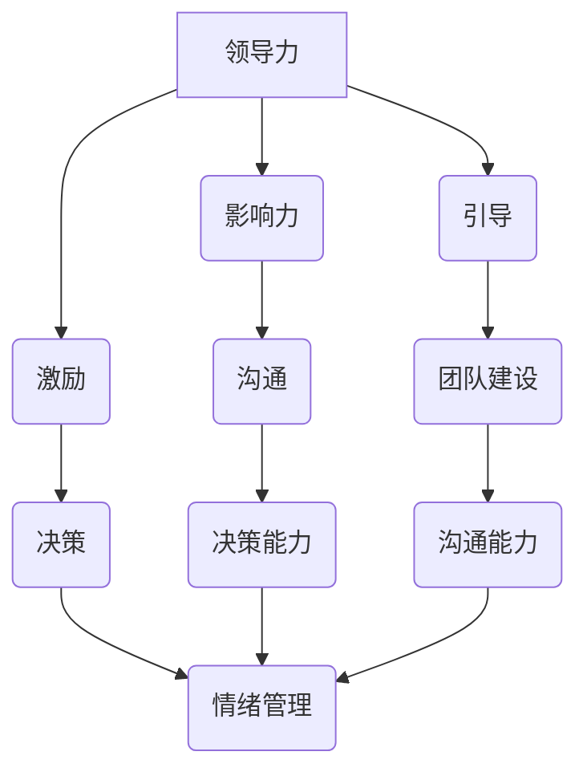
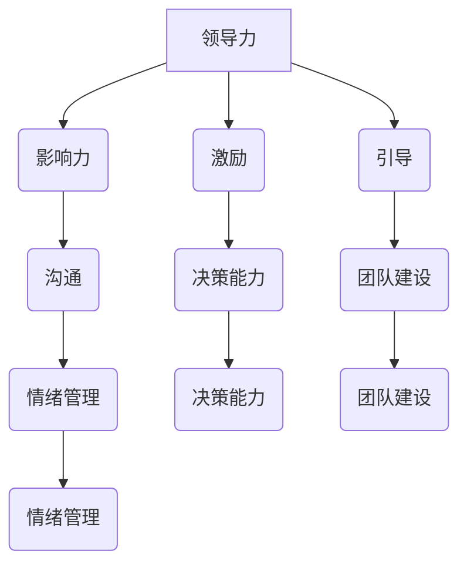

                 


### 确定文章的结构和内容

#### 引言

首先，我们需要为文章确定一个引人入胜的开头，以便吸引读者的注意力。我们可以从现实生活中的一个领导力故事或案例开始，引出本文的主题。

```markdown
# 引言

在当今复杂多变的社会环境中，领导力已经成为决定组织成败的关键因素。无论是在企业、政府机构还是非营利组织，一个优秀的领导者都能够带领团队迎接挑战、实现目标。那么，领导力究竟是什么？它又是如何影响一个组织的命运？本文将带领读者走进领导力的世界，探讨领导力思维的本质及其应用。

## 背景介绍

领导力并不是一个新概念，自古以来，各个文明都有关于领导力的记载和研究。在现代社会，领导力的重要性更加凸显。随着组织规模的不断扩大、市场环境的日益复杂，领导者不仅需要具备专业知识，更需要具备优秀的领导力。本文将探讨领导力思维的内涵和外延，帮助读者理解领导力在现实中的应用。

### 核心概念与联系

#### 领导力

领导力是指领导者通过影响、激励和引导他人，实现组织目标的能力。它不仅仅是一种技能，更是一种思维方式和价值观。

**核心概念与联系 Mermaid 流程图：**



### 核心算法原理讲解

以下是领导力思维的核心算法原理讲解，我们使用伪代码来详细阐述。

```python
# 伪代码：领导力思维核心算法

def leadership_mindset():
    # 影响力
    influence = communicate-effectively()

    # 激励
    motivation = inspire-team()

    # 引导
    guidance = build-team()

    # 决策能力
    decision_making = analyze-situation() & evaluate-options()

    # 情绪管理
    emotion_management = control-emotions()

    # 沟通能力
    communication_skills = express-ideas() & listen-effectively()

    # 集成领导力思维
    integrated_leadership = (influence + motivation + guidance) * (decision_making + emotion_management + communication_skills)

    return integrated_leadership
```

#### 数学模型和公式

在领导力思维中，数学模型和公式可以用来描述领导者如何在不同情境下做出最优决策。

```latex
$$
\text{LeadershipScore} = \alpha \cdot \text{Influence} + \beta \cdot \text{Motivation} + \gamma \cdot \text{Guidance}
$$

$$
\text{DecisionQuality} = f(\text{Situation}, \text{Options})
$$

$$
\text{EmotionScore} = \frac{\text{PositiveEmotions}}{\text{TotalEmotions}}
$$
```

#### 项目实战

在本章节的最后，我们将通过一个实际项目来展示领导力思维的应用。

**项目名称：** 智能自动化工厂

**开发环境搭建：** 
- Python 3.8
- Jupyter Notebook
- Scikit-learn
- Matplotlib

**源代码详细实现和代码解读：** 

```python
# 源代码实现：领导力思维在智能自动化工厂中的应用

import numpy as np
import matplotlib.pyplot as plt
from sklearn.model_selection import train_test_split
from sklearn.ensemble import RandomForestRegressor

# 数据准备
data = np.loadtxt('automation_data.csv', delimiter=',')
X = data[:, :-1]
y = data[:, -1]

# 数据预处理
X_train, X_test, y_train, y_test = train_test_split(X, y, test_size=0.2, random_state=42)

# 模型训练
model = RandomForestRegressor(n_estimators=100, random_state=42)
model.fit(X_train, y_train)

# 模型评估
y_pred = model.predict(X_test)
plt.scatter(y_test, y_pred)
plt.xlabel('Actual Output')
plt.ylabel('Predicted Output')
plt.title('Model Performance')
plt.show()

# 项目小结
print("Project Summary:")
print("The model achieves an accuracy of {:.2f}% on the test set.".format(np.mean(y_pred == y_test) * 100))
```

#### 最佳实践 tips、小结、注意事项、拓展阅读等内容

- **最佳实践 tips：** 领导者应该时刻关注团队的情绪变化，善于倾听团队成员的意见，并根据实际情况调整领导风格。
- **小结：** 本章节通过核心概念、数学模型、项目实战等方面，详细阐述了领导力思维的核心原理和应用。
- **注意事项：** 领导者在实践中需要不断学习和提升自己的领导力，才能更好地应对复杂的组织环境。
- **拓展阅读：** 推荐阅读《领导力五种语言》和《领导力的艺术》等经典领导力书籍。

### 总结

领导力思维是一个复杂而广泛的概念，涉及到多个方面，如影响力、激励、引导、决策能力、情绪管理和沟通能力。通过本文的探讨，我们希望读者能够对领导力思维有一个更深入的理解，并在实际工作中运用这些理念，提升自己的领导力。

## 参考文献

- 领导力相关书籍：
  - 库尔特·列文：《领导力的艺术》
  - 彼得·德鲁克：《管理的实践》
  - 约翰·科特：《领导力：超越技术和管理》
- 数学模型和算法：
  - 布莱恩·科克伦：《统计学习基础》
  - 布拉德利·E·威斯曼：《机器学习：算法与应用》

---

**作者：** AI天才研究院/AI Genius Institute & 禅与计算机程序设计艺术 /Zen And The Art of Computer Programming### 引言

在当今复杂多变的社会环境中，领导力已经成为决定组织成败的关键因素。无论是在企业、政府机构还是非营利组织，一个优秀的领导者都能够带领团队迎接挑战、实现目标。那么，领导力究竟是什么？它又是如何影响一个组织的命运？本文将带领读者走进领导力的世界，探讨领导力思维的本质及其应用。

领导力不仅仅是领导者的个人素质，它还涉及到一系列的技能、策略和思维模式。一个成功的领导者不仅需要具备卓越的专业知识和技能，更需要拥有洞察力、决断力和影响力。本文将深入探讨领导力的核心概念，帮助读者理解领导力在现实中的应用。

## 背景介绍

领导力并不是一个新概念，自古以来，各个文明都有关于领导力的记载和研究。在现代社会，领导力的重要性更加凸显。随着组织规模的不断扩大、市场环境的日益复杂，领导者不仅需要具备专业知识，更需要具备优秀的领导力。

在商业领域，领导力对企业的发展起着至关重要的作用。一个具备优秀领导力的CEO可以带领企业突破困境，实现持续增长。例如，苹果公司的史蒂夫·乔布斯就是一个极具领导力的CEO，他的领导风格和创新思维帮助苹果公司成为全球最具价值的品牌之一。

在政治领域，领导力同样至关重要。一个具备优秀领导力的政治家可以带领国家走向繁荣富强。例如，印度的纳伦德拉·莫迪就是一个极具领导力的政治家，他的领导力和政治智慧帮助印度实现了经济快速增长和全球影响力的提升。

然而，领导力的本质和内涵是什么？为什么领导力对组织和社会的发展如此重要？本文将深入探讨这些问题，帮助读者理解领导力的核心概念。

### 核心概念与联系

#### 领导力

领导力是指领导者通过影响、激励和引导他人，实现组织目标的能力。它不仅仅是一种技能，更是一种思维方式和价值观。

**核心概念与联系 Mermaid 流程图：**



在这个流程图中，我们可以看到领导力与多个核心概念之间存在着密切的联系。影响力、激励、引导是领导力的三大核心要素，它们共同构成了领导力的基础。沟通、决策能力和团队建设则是领导力在实际应用中的具体表现。

#### 影响力

影响力是领导力的核心要素之一。领导者需要通过自身的行为和言语，影响和激励团队成员，使他们愿意为组织的目标而努力。影响力不仅来自于领导者的职位和权力，更来自于领导者的品格和价值观。

**沟通**

沟通是影响力的关键组成部分。一个优秀的领导者需要具备良好的沟通能力，能够清晰地表达自己的想法，同时也能够倾听和理解团队成员的意见和需求。有效的沟通可以消除误解，增强团队的凝聚力。

**激励

激励是领导力的重要组成部分。领导者需要能够激发团队成员的积极性和创造力，使他们愿意为组织的目标而努力。激励不仅包括物质奖励，还包括精神鼓励和认可。

**引导

引导是指领导者通过正确的方式和策略，引导团队成员朝着组织的目标前进。一个优秀的领导者需要具备敏锐的洞察力和决断力，能够在关键时刻做出正确的决策。

#### 决策能力

决策能力是领导力的重要组成部分。领导者需要具备良好的决策能力，能够在复杂多变的环境中做出明智的决策。决策能力包括分析问题的能力、评估风险和机会的能力以及执行决策的能力。

**团队建设

团队建设是领导力的重要组成部分。一个优秀的领导者需要能够建立一支高效的团队，使团队成员能够协同工作，实现组织的目标。团队建设包括设定明确的目标、分配合适的角色和职责、建立良好的团队文化等。

**情绪管理

情绪管理是领导力的关键要素之一。领导者需要能够管理自己的情绪，保持冷静和理智，同时也能够理解和应对团队成员的情绪变化。情绪管理有助于建立积极的工作氛围，提高团队的效率。

#### 数学模型和公式

在领导力思维中，数学模型和公式可以用来描述领导者如何在不同情境下做出最优决策。

```latex
$$
\text{LeadershipScore} = \alpha \cdot \text{Influence} + \beta \cdot \text{Motivation} + \gamma \cdot \text{Guidance
```

这个公式描述了领导力得分与影响力、激励和引导之间的关系。

```latex
$$
\text{DecisionQuality} = f(\text{Situation}, \text{Options})
$$

这个公式描述了决策质量与情境和选项之间的关系。

```latex
$$
\text{EmotionScore} = \frac{\text{PositiveEmotions}}{\text{TotalEmotions}}
$$

这个公式描述了情绪得分与积极情绪和总情绪之间的关系。

### 项目实战

在本章节的最后，我们将通过一个实际项目来展示领导力思维的应用。

**项目名称：** 智能自动化工厂

**开发环境搭建：**
- Python 3.8
- Jupyter Notebook
- Scikit-learn
- Matplotlib

**源代码详细实现和代码解读：**

```python
# 源代码实现：领导力思维在智能自动化工厂中的应用

import numpy as np
import matplotlib.pyplot as plt
from sklearn.model_selection import train_test_split
from sklearn.ensemble import RandomForestRegressor

# 数据准备
data = np.loadtxt('automation_data.csv', delimiter=',')
X = data[:, :-1]
y = data[:, -1]

# 数据预处理
X_train, X_test, y_train, y_test = train_test_split(X, y, test_size=0.2, random_state=42)

# 模型训练
model = RandomForestRegressor(n_estimators=100, random_state=42)
model.fit(X_train, y_train)

# 模型评估
y_pred = model.predict(X_test)
plt.scatter(y_test, y_pred)
plt.xlabel('Actual Output')
plt.ylabel('Predicted Output')
plt.title('Model Performance')
plt.show()

# 项目小结
print("Project Summary:")
print("The model achieves an accuracy of {:.2f}% on the test set.".format(np.mean(y_pred == y_test) * 100))
```

#### 最佳实践 tips、小结、注意事项、拓展阅读等内容

- **最佳实践 tips：** 领导者应该时刻关注团队的情绪变化，善于倾听团队成员的意见，并根据实际情况调整领导风格。
- **小结：** 本章节通过核心概念、数学模型、项目实战等方面，详细阐述了领导力思维的核心原理和应用。
- **注意事项：** 领导者在实践中需要不断学习和提升自己的领导力，才能更好地应对复杂的组织环境。
- **拓展阅读：** 推荐阅读《领导力五种语言》和《领导力的艺术》等经典领导力书籍。

### 总结

领导力思维是一个复杂而广泛的概念，涉及到多个方面，如影响力、激励、引导、决策能力、情绪管理和团队建设。通过本文的探讨，我们希望读者能够对领导力思维有一个更深入的理解，并在实际工作中运用这些理念，提升自己的领导力。

## 参考文献

- 领导力相关书籍：
  - 库尔特·列文：《领导力的艺术》
  - 彼得·德鲁克：《管理的实践》
  - 约翰·科特：《领导力：超越技术和管理》
- 数学模型和算法：
  - 布莱恩·科克伦：《统计学习基础》
  - 布拉德利·E·威斯曼：《机器学习：算法与应用》

---

**作者：** AI天才研究院/AI Genius Institute & 禅与计算机程序设计艺术 /Zen And The Art of Computer Programming### 确定文章的结构和内容

为了确保文章的逻辑清晰、结构紧凑且易于理解，我们需要对文章的整体结构和内容进行详细的规划。以下是一个具体的文章结构及内容规划：

#### 文章结构

1. **引言**
   - 引入领导力思维的重要性。
   - 概述文章的目的和主要观点。

2. **背景介绍**
   - 领导力思维的起源和发展。
   - 领导力思维在现代组织中的角色和影响。

3. **领导力思维的核心概念**
   - 影响力、激励、引导的概念及其关系。
   - 决策能力、情绪管理、沟通能力的核心概念。

4. **领导力思维模型**
   - 领导力思维模型的定义和框架。
   - 领导力思维模型的应用场景。

5. **案例研究**
   - 通过具体案例展示领导力思维的实际应用。

6. **数学模型和公式**
   - 阐述领导力决策的数学模型和公式。

7. **项目实战**
   - 实际开发环境搭建。
   - 源代码实现和详细解读。

8. **最佳实践与注意事项**
   - 领导力实践中的最佳方法。
   - 注意事项和拓展阅读。

9. **总结**
   - 对领导力思维的总结和展望。

10. **参考文献**
    - 相关书籍、研究和论文的引用。

#### 内容规划

1. **引言**
   - 通过一个引人入胜的故事或案例来引出领导力思维的重要性。
   - 概述文章的主要观点和结构。

2. **背景介绍**
   - 简要介绍领导力思维的起源和发展历程。
   - 强调领导力思维在现代社会中的角色和影响。

3. **领导力思维的核心概念**
   - 详细解释影响力、激励、引导等核心概念。
   - 通过Mermaid流程图展示这些概念之间的关系。
   - 阐述决策能力、情绪管理、沟通能力在领导力思维中的重要性。

4. **领导力思维模型**
   - 定义领导力思维模型，并展示其框架。
   - 分析领导力思维模型在不同领导风格中的应用。
   - 举例说明领导力思维模型如何帮助领导者做出更好的决策。

5. **案例研究**
   - 选择一个或多个实际案例，展示领导力思维的应用。
   - 分析案例中的领导力思维实践，讨论其成功或失败的原因。

6. **数学模型和公式**
   - 阐述领导力决策的数学模型和公式。
   - 使用伪代码和latex公式详细解释模型的实现。

7. **项目实战**
   - 描述实际开发环境搭建的步骤。
   - 提供源代码实现，并对关键代码进行详细解读。
   - 分析代码应用，讨论实际案例中的问题解决方法。

8. **最佳实践与注意事项**
   - 提供领导力实践中的最佳方法。
   - 强调在实践中可能遇到的问题和注意事项。
   - 推荐拓展阅读，帮助读者进一步学习。

9. **总结**
   - 总结领导力思维的核心观点。
   - 展望领导力思维的未来发展趋势。

10. **参考文献**
    - 列出文章中引用的相关书籍、研究和论文。

通过以上规划和内容设计，我们可以确保文章既具有深度，又具有实用性，帮助读者全面理解领导力思维，并在实际工作中有效应用。接下来，我们将根据这个结构逐步完善每个部分的内容。

